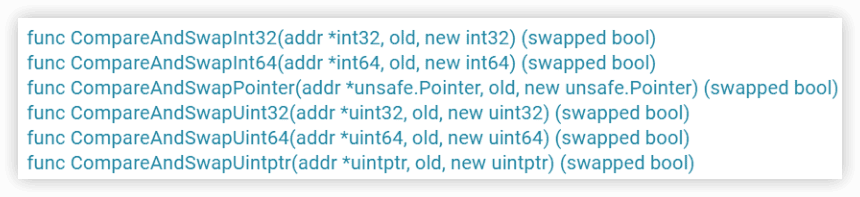

Go并发编程实战课
----

[《Go并发编程实战课》](https://time.geekbang.org/column/intro/100061801)


## 怎么学Go并发编程

### 学习Go并发编程，有哪些困难？

主要是有5大问题：

- 在面对并发难题时，感觉无从下手，**不知道该用什么并发原语来解决问题**。
- 如果多个并发原语都可以解决问题，那么，**究竟哪个是最优解呢**？比如说是用互斥锁，还是用Channel。
- **不知道如何编排并发任务**。并发编程不像是传统的串行编程，程序的运行存在着很大的**不确定性**。这个时候，就会面临一个问题，**怎么才能让相应的任务按照你设想的流程运行呢？**
- 有时候，按照正常理解的并发方式去实现的程序，结果莫名其妙就panic或者死锁了，**排查起来非常困难**。
- **已知的并发原语都不能解决并发问题**，程序写起来异常复杂，而且代码混乱，容易出错。

### 怎么提升Go并发编程能力？


知识主线

学习主线主要是四大步骤：**基础用法、实现原理、易错场景、知名项目中的Bug**。

Go中有一个大的方向，就是**==任务编排用Channel，共享资源保护用传统并发原语==**，但不能局限于这个原则。


进阶，创造出自己需要的并发原语中的创造有两层含义：

- 第一层是==对既有的并发原语进行组合==，使用两个、三个或者更多的并发原语去解决问题。比如说，可以通过信号量和WaitGroup组合成一个新的并发原语，这个并发原语可以使用有限个goroutine并发处理子任务。
- 第二层含义是“无中生有”，根据已经掌握的并发原语的设计经验，创造出合适的新的并发原语，以应对一些特殊的并发问题。比如说，标准库中并没有信号量，你可以自己创造出这个类型。


3个目标：

- 建立起一个丰富的并发原语库；
- 熟知每一种并发原语的实现机制和适用场景；
- 能够创造出自己需要的并发原语。


# 一、基本并发原语

传统的并发原语：Mutex、RWMutex、Waitgroup、Cond、Pool、Context等标准库中的并发原语。这些在其它语言中也很常见。

## 1 Mutex：如何解决资源并发访问问题？

常见并发问题：**多个goroutine并发更新同一个资源，像计数器；同时更新用户的账户信息；秒杀系统；往同一个buffer中并发写入数据等等**。

如果没有互斥控制，就会出现一些异常情况，比如计数器的计数不准确、用户的账户可能出现透支、秒杀系统出现超卖、buffer中的数据混乱，等等，后果都很严重。


### 互斥锁的实现机制

互斥锁是并发控制的一个基本手段。

在并发编程中，如果程序中的一部分会被并发访问或修改，那么，为了避免并发访问导致的意想不到的结果，这部分程序需要被保护起来，这部分被保护起来的程序，就叫做**==临界区==**。

临界区就是一个**被共享的资源**，或者说是一个整体的一组共享资源，比如**对数据库的访问、对某一个共享数据结构的操作、对一个 I/O 设备的使用、对一个连接池中的连接的调用**，等等。

**使用互斥锁，限定临界区只能同时由一个线程持有。**

当临界区由一个线程持有的时候，其它线程如果想进入这个临界区，就会返回==失败==，或者是==等待==。直到持有的线程退出临界区，这些等待线程中的某一个才有机会接着持有这个临界区。


互斥锁很好地解决了==资源竞争问题==，也它叫做==排它锁==。在Go标准库中，通过Mutex来实现互斥锁。

Mutex是使用最广泛的==同步原语==（Synchronization primitives，也叫做**并发原语**，但并发原语的指代范围更大，还可以包括**任务编排**的类型，所以后面讲Channel或者扩展类型时也会用并发原语）。

**互斥锁Mutex、读写锁RWMutex、并发编排WaitGroup、条件变量Cond、Channel**等同步原语。

同步原语的适用场景：

- ==共享资源==。并发地读写共享资源，会出现数据竞争（data race）的问题，所以需要Mutex、RWMutex这样的并发原语来保护。
- ==任务编排==。需要goroutine按照一定的规律执行，而goroutine之间有相互等待或者依赖的顺序关系，我们常常使用WaitGroup或者Channel来实现。
- ==消息传递==。信息交流以及不同的goroutine之间的线程安全的数据交流，常常使用Channel来实现。

### Mutex的基本使用方法

`sync`提供了锁相关的一系列同步原语，其中有`Locker`接口，Mutex就实现了这个接口。

```go
type Locker interface {
    Lock()
    Unlock()
}
```

请求锁（Lock）和释放锁（Unlock）两个方法。

互斥锁Mutex就提供两个方法Lock和Unlock：**进入临界区之前调用Lock方法，退出临界区的时候调用Unlock方法**：

```go
func(m *Mutex)Lock()
func(m *Mutex)Unlock()
```

**当一个goroutine通过调用Lock方法获得了这个锁的拥有权后， 其它请求锁的goroutine就会阻塞在Lock方法的调用上，直到锁被释放并且自己获取到了这个锁的拥有权。**

例子，创建了10个goroutine，同时不断地对一个变量（count）进行加1操作，每个goroutine负责执行10万次的加1操作，期望的最后计数的结果是10 *100000 = 1000000 (一百万)。

```go
import (
	"fmt"
	"sync"
)

func main() {
	var count = 0
	// 使用WaitGroup来等待10个goroutine执行完毕
	var wg sync.WaitGroup
	wg.Add(10)
	for i := 0; i < 10; i++ {
		go func() {
			defer wg.Done()
			for j := 0; j < 100000; j++ {
				count++
			}
		}()
	}
	// 等待10个goroutine执行完毕
	wg.Wait()
	fmt.Println(count)
}
```

```sh
$ go run counter.go 
231769
$ go run counter.go
327804
$ go run counter.go
390403
```

每次运行，你都可能得到不同的结果，基本上不会得到理想中的一百万的结果。

其实，这是因为，**count++ 不是一个原子操作**，它至少包含几个步骤，比如读取变量count的当前值，对这个值加1，把结果再保存到count中。因为不是原子操作，就可能有并发的问题。

比如，10个goroutine同时读取到count的值为9527，接着各自按照自己的逻辑加1，值变成了9528，然后把这个结果再写回到count变量。但是，实际上，此时我们增加的总数应该是10才对，这里却只增加了1，好多计数都被“吞”掉了。这是并发访问共享数据的常见错误。

```go
		// count++操作的汇编代码
    MOVQ    "".count(SB), AX
    LEAQ    1(AX), CX
    MOVQ    CX, "".count(SB)
```

Go提供了一个**检测并发访问共享资源是否有问题**的工具： **race detector** 🔖，它可以帮助我们自动发现程序有没有**data race（数据竞争）**的问题。

> race有赛跑和竞争的意思。 

Go race detector是基于Google的 **C/C++ sanitizers** 技术实现的，编译器通过探测所有的内存访问，加入代码能监视对这些内存地址的访问（读还是写）。在代码运行的时候，race detector就能监控到对共享变量的**非同步访问**，出现race的时候，就会打印出警告信息。

这个技术在Google内部帮了大忙，探测出了Chromium等代码的大量并发问题。Go 1.1中就引入了这种技术，并且一下子就发现了标准库中的42个并发问题。现在，race detector已经成了Go持续集成过程中的一部分。

在编译（compile）、测试（test）或者运行（run）Go代码的时候，加上race参数，就有可能发现并发问题。

```sh
$ go run -race counter.go 
==================
WARNING: DATA RACE
Read at 0x00c000118028 by goroutine 7:
  main.main.func1()
      /Users/andyron/myfield/github/LearnGo/Go并发编程实战课/go-concurrent/ch01/counter.go:17 +0x94

Previous write at 0x00c000118028 by goroutine 6:
  main.main.func1()
      /Users/andyron/myfield/github/LearnGo/Go并发编程实战课/go-concurrent/ch01/counter.go:17 +0xa4

Goroutine 7 (running) created at:
  main.main()
      /Users/andyron/myfield/github/LearnGo/Go并发编程实战课/go-concurrent/ch01/counter.go:14 +0x74

Goroutine 6 (running) created at:
  main.main()
      /Users/andyron/myfield/github/LearnGo/Go并发编程实战课/go-concurrent/ch01/counter.go:14 +0x74
==================
==================
WARNING: DATA RACE
Write at 0x00c000118028 by goroutine 10:
  main.main.func1()
      /Users/andyron/myfield/github/LearnGo/Go并发编程实战课/go-concurrent/ch01/counter.go:17 +0xa4

Previous write at 0x00c000118028 by goroutine 6:
  main.main.func1()
      /Users/andyron/myfield/github/LearnGo/Go并发编程实战课/go-concurrent/ch01/counter.go:17 +0xa4

Goroutine 10 (running) created at:
  main.main()
      /Users/andyron/myfield/github/LearnGo/Go并发编程实战课/go-concurrent/ch01/counter.go:14 +0x74

Goroutine 6 (running) created at:
  main.main()
      /Users/andyron/myfield/github/LearnGo/Go并发编程实战课/go-concurrent/ch01/counter.go:14 +0x74
==================
908858
Found 2 data race(s)
exit status 66

```

虽然这个工具使用起来很方便，但是，因为它的实现方式，**只能通过真正对实际地址进行读写访问的时候才能探测，所以它并不能在编译的时候发现==data race的问题==**。


```sh
go tool compile -race -S counter.go
```

🔖


这里的共享资源是count变量，临界区是count++，只要在临界区前面获取锁，在离开临界区的时候释放锁，就能完美地解决data race的问题了。

```go
	// 互斥锁保护计数器
	var mu sync.Mutex
	// 计数器的值
	var count = 0

	// 辅助变量，用来确认所有的goroutine都完成
	var wg sync.WaitGroup
	wg.Add(10)

	// 启动10个gourontine
	for i := 0; i < 10; i++ {
		go func() {
			defer wg.Done()
			// 累加10万次
			for j := 0; j < 100000; j++ {
				mu.Lock()
				count++
				mu.Unlock()
			}
		}()
	}
	wg.Wait()
	fmt.Println(count)
```

```sh
$ go run -race counter2.go 
1000000
```

> 注意：Mutex的零值是**还没有goroutine等待的未加锁的状态**，所以不需要额外的初始化，直接声明变量（如 var mu sync.Mutex）即可。


### Mutex其它用法

很多情况下，**Mutex会嵌入到其它struct中使用**：

```go
type Counter struct {
    mu    sync.Mutex
    Count uint64
}
```

在初始化嵌入的struct时，也不必初始化这个Mutex字段，不会因为没有初始化出现空指针或者是无法获取到锁的情况。


有时候，我们还可以采用**嵌入字段的方式**。通过嵌入字段，你可以在这个struct上直接调用Lock/Unlock方法:

```go
func main() {
	var counter Counter
	var wg sync.WaitGroup
	wg.Add(10)
	for i := 0; i < 10; i++ {
		go func() {
			defer wg.Done()
			for j := 0; j < 100000; j++ {
				counter.Lock()
				counter.Count++
				counter.Unlock()
			}
		}()
	}
	wg.Wait()
	fmt.Println(counter.Count)
}

type Counter struct {
	sync.Mutex
	Count uint64
}
```


**如果嵌入的struct有多个字段，我们一般会把Mutex放在要控制的字段上面，然后使用空格把字段分隔开来。**  这样代码逻辑更清晰，之后更容易维护。甚至，还可以**把获取锁、释放锁、计数加一的逻辑封装成一个方法**，对外不需要暴露锁等逻辑：

```go
func main() {
	// 封装好的计数器
	var counter Counter2

	var wg sync.WaitGroup
	wg.Add(10)

	// 启动10个goroutine
	for i := 0; i < 10; i++ {
		go func() {
			defer wg.Done()
			// 累加10万次
			for j := 0; j < 100000; j++ {
				counter.Incr()
			}
		}()
	}
	wg.Wait()
	fmt.Println(counter.Count())
}

// 线程安全的计数器类型
type Counter2 struct {
	CounterType int
	name        string

	mu    sync.Mutex
	count uint64
}

// 加1的方法内部使用互拆锁保护
func (c *Counter2) Incr() {
	c.mu.Lock()
	c.count++
	c.mu.Unlock()
}

// 得到计数器的值，也需要互斥锁保护
func (c *Counter2) Count() uint64 {
	c.mu.Lock()
	defer c.mu.Unlock()
	return c.count
}
```


> Docker issue 37583、35517、32826、30696等、kubernetes issue 72361、71617等，都是后来发现的data race而采用互斥锁Mutex进行修复的。


### 思考

> 如果Mutex已经被一个goroutine获取了锁，其它等待中的goroutine们只能一直等待。那么，等这个锁释放后，等待中的goroutine中哪一个会优先获取Mutex呢？

当Mutex锁被释放时，等待中的goroutine哪一个会优先获取锁，取决于Mutex当前的工作模式（**正常模式**或**饥饿模式**）。以下是具体机制的分析：

#### 一、正常模式（非公平模式）

1. **竞争机制**
   - 锁释放后，**新到来的goroutine**与**等待队列中被唤醒的goroutine**共同竞争锁。
   - 新goroutine的优势
     - 已在CPU上运行，无需调度唤醒（减少上下文切换开销）。
     - 可能连续多次抢占锁，导致等待队列中的goroutine长期饥饿。
   - **被唤醒的goroutine**若竞争失败，会重新加入等待队列的**头部**，而非尾部。
2. **设计目的**
   - 减少阻塞唤醒的开销，提升**高并发场景的性能**。
   - 适合**临界区执行时间短**的场景（锁持有时间短）。

#### 二、饥饿模式（公平模式）

1. **触发条件**
   - 当某个goroutine等待锁的时间**超过1ms**，Mutex自动切换到饥饿模式。
2. **优先规则**
   - 锁释放后，**直接交给等待队列头部的goroutine**（等待时间最长）。
   - 新到来的goroutine
     - 禁止自旋竞争；
     - 直接加入等待队列**尾部**。
3. **退出条件**
   - 当满足以下任一条件时，切换回正常模式：
     - 等待队列**全部清空**；
     - 队头goroutine等待时间**不足1ms**。
4. **设计目的**
   - 解决**长等待队列的饥饿问题**，确保公平性。
   - 代价是**性能下降**（频繁阻塞唤醒）。

#### 三、自旋优化（正常模式专属）

在正常模式下，**未立即获得锁的goroutine可能进入自旋**，而非直接阻塞：

1. 自旋条件（需同时满足）：
   - 自旋次数 **< 4次**；
   - 多核CPU（`GOMAXPROCS > 1`）；
   - 当前P的本地运行队列为空（无其他可运行goroutine）。
2. 作用：
   - 通过**空转CPU**短暂等待锁释放，避免立即阻塞带来的调度开销。
   - 仅适用于**锁持有时间极短**的场景（否则浪费CPU）。

#### 四、两种模式对比

| **模式**     | **锁分配策略**            | **新goroutine行为** | **触发/退出条件**                    | **适用场景**         |
| ------------ | ------------------------- | ------------------- | ------------------------------------ | -------------------- |
| **正常模式** | 新goroutine与被唤醒者竞争 | 可自旋抢占锁        | 默认状态；等待时间<1ms时保持         | 高并发、短临界区操作 |
| **饥饿模式** | 直接交给队头goroutine     | 加入队尾，禁止自旋  | 等待时间>1ms触发；队列空或短等待退出 | 防止长期饥饿         |

#### 总结

- **正常模式**：锁释放后，**新goroutine更容易抢占**，性能高但可能导致等待者饥饿。
- **饥饿模式**：锁释放后，**优先分配给等待最久的goroutine**，公平但性能较低。
- **自旋优化**：仅在正常模式下生效，是提升短临界区性能的关键手段。

> 实际开发中，Mutex会**动态切换模式**以平衡性能与公平性。若业务需要严格公平，可考虑基于`sync.Mutex`封装公平锁，或使用`sync.RWMutex`（读写锁）缓解竞争。


## 2 Mutex：庖丁解牛看实现🔖

Mutex的演进历史，是从一个简单易于理解的互斥锁的实现，到一个非常复杂的数据结构，这是一个逐步完善的过程。

Mutex的架构演进分成了四个阶段：


1. ==“初版”==的Mutex使用一个flag来表示锁是否被持有，实现比较简单；
2. 后来照顾到新来的goroutine，所以会让新的goroutine也尽可能地先获取到锁，叫作==“给新人机会”==；
3. 第三阶段==“多给些机会”==，照顾新来的和被唤醒的goroutine；
4. 但是这样会带来饥饿问题，所以目前又加入了饥饿的解决方案，也就是第四阶段==“解决饥饿”==。

### 2.1 初版的互斥锁

Russ Cox在2008年提交的第一版Mutex，通过一个flag变量，标记当前的锁是否被某个goroutine持有。如果这个flag的值是1，就代表锁已经被持有，那么，其它竞争的goroutine只能等待；如果这个flag的值是0，就可以通过==CAS（compare-and-swap，或者compare-and-set）==将这个flag设置为1，标识锁被当前的这个goroutine持有了。

```go
// CAS操作，当时还没有抽象出atomic包
func cas(val *int32, old, new int32) bool
func semacquire(*int32)
func semrelease(*int32)
// 互斥锁的结构，包含两个字段
type Mutex struct {
  key  int32 // 锁是否被持有的标识
  sema int32 // 信号量专用，用以阻塞/唤醒goroutine
}

// 保证成功在val上增加delta的值
func xadd(val *int32, delta int32) (new int32) {
  for {
    v := *val
    if cas(val, v, v+delta) {
      return v + delta
    }
  }
  panic("unreached")
}

// 请求锁
func (m *Mutex) Lock() {
  if xadd(&m.key, 1) == 1 { //标识加1，如果等于1，成功获取到锁
    return
  }
  semacquire(&m.sema) // 否则阻塞等待
}

func (m *Mutex) Unlock() {
  if xadd(&m.key, -1) == 0 { // 将标识减去1，如果等于0，则没有其它等待者
    return
  }
  semrelease(&m.sema) // 唤醒其它阻塞的goroutine
}    
```

> **==CAS指令==**将给定的值和一个内存地址中的值进行比较，如果它们是同一个值，就使用新值替换内存地址中的值，这个操作是**原子性**的。
>
> 原子性保证这个指令**总是基于最新的值进行计算**，如果同时有其它线程已经修改了这个值，那么，CAS会返回失败。
>
> **CAS是实现互斥锁和同步原语的基础**。

最核心的结构体（struct）和函数、方法的定义几乎与现在的一样。

- 字段key：是一个flag，用来标识这个排外锁是否被某个goroutine所持有，如果key大于等于1，说明这个排外锁已经被持有；
- 字段sema：是个信号量变量，用来控制等待goroutine的阻塞休眠和唤醒。


调用Lock请求锁的时候，通过`xadd`方法进行CAS操作（第24行），xadd方法通过循环执行CAS操作直到成功，保证对key加1的操作成功完成。

如果比较幸运，锁没有被别的goroutine持有，那么，Lock方法成功地将key设置为1，这个goroutine就持有了这个锁；如果锁已经被别的goroutine持有了，那么，当前的goroutine会把key加1，而且还会调用`semacquire`方法（第27行），**使用信号量将自己休眠**，等锁释放的时候，信号量会将它唤醒。

有锁的goroutine调用Unlock释放锁时，它会将key减1（第31行）。如果当前没有其它等待这个锁的goroutine，这个方法就返回了。但是，如果还有等待此锁的其它goroutine，那么，它会调用`semrelease`方法（第34行），**利用信号量唤醒等待锁的其它goroutine中的一个**。

总结，初版的Mutex利用CAS原子操作，对key这个标志量进行设置。key不仅仅标识了锁是否被goroutine所持有，还记录了当前持有和等待获取锁的goroutine的数量。

注意，**Unlock方法可以被任意的goroutine调用释放锁，即使是没持有这个互斥锁的goroutine，也可以进行这个操作。这是因为，==Mutex本身并没有包含持有这把锁的goroutine的信息==，所以，Unlock也不会对此进行检查。Mutex的这个设计一直保持至今。**

> 其它goroutine可以强制释放锁，这是一个非常危险的操作，因为在临界区的goroutine可能不知道锁已经被释放了，还会继续执行临界区的业务操作，这可能会带来意想不到的结果，因为这个goroutine还以为自己持有锁呢，有可能导致data race问题。

所以，在使用Mutex的时候，必须要保证goroutine**尽可能不去释放自己未持有的锁**，一定要遵循“**==谁申请，谁释放==**”的原则。在真实的实践中，使用互斥锁的时候，很少在一个方法中单独申请锁，而在另外一个方法中单独释放锁，一般都会**==在同一个方法中获取锁和释放锁==**。

Go这一点和其它语言（比如Java语言）的互斥锁的实现不同，所以，从其它语言转到Go语言开发的同学，一定要注意。

以前，我们经常会基于性能的考虑，及时释放掉锁，所以在一些if-else分支中加上释放锁的代码，代码看起来很臃肿。而且，在重构的时候，也很容易因为误删或者是漏掉而出现死锁的现象。

```go
type Foo struct {
    mu    sync.Mutex
    count int
}

func (f *Foo) Bar() {
    f.mu.Lock()

    if f.count < 1000 {
        f.count += 3
        f.mu.Unlock() // 此处释放锁
        return
    }

    f.count++
    f.mu.Unlock() // 此处释放锁
    return
}
```

从1.14版本起，Go对defer做了优化，采用更有效的**内联方式**，取代之前的生成defer对象到defer chain中，defer对耗时的影响微乎其微了，所以基本上修改成下面简洁的写法也没问题：

```go
func (f *Foo) Bar() {
    f.mu.Lock()
    defer f.mu.Unlock()


    if f.count < 1000 {
        f.count += 3
        return
    }


    f.count++
    return
}
```

这样做的好处就**是Lock/Unlock总是成对紧凑出现**，不会遗漏或者多调用，代码更少。

但是，**如果临界区只是方法中的一部分，为了尽快释放锁，还是应该第一时间调用Unlock，而不是一直等到方法返回时才释放**。

> 初版的Mutex实现有一个问题：
>
> 请求锁的goroutine会排队等待获取互斥锁。虽然这貌似很公平，但是从性能上来看，却不是最优的。因为如果我们能够把锁交给正在占用CPU时间片的goroutine的话，那就不需要做上下文的切换，在高并发的情况下，可能会有更好的性能。

### 2.2 给新人机会

2011年6月30日，对Mutex做了一次大的调整：

```go
type Mutex struct {
  state int32
  sema  uint32
}

const (
  mutexLocked = 1 << iota // mutex is locked
  mutexWoken
  mutexWaiterShift = iota
) 
```


state是一个复合型的字段，一个字段包含多个意义，这样可以通过尽可能少的内存来实现互斥锁。

这个字段的第一位（最小的一位）来表示这个**锁是否被持有**，第二位代表**是否有唤醒的goroutine**，剩余的位数代表的是**等待此锁的goroutine数**。所以，state这一个字段被分成了三部分，代表三个数据。

请求锁的方法Lock的逻辑也变得复杂了:

```go
func (m *Mutex) Lock() {
  // Fast path: 幸运case，能够直接获取到锁
  if atomic.CompareAndSwapInt32(&m.state, 0, mutexLocked) {
    return
	}

  awoke := false
  for {
    old := m.state
    new := old | mutexLocked // 新状态加锁
    if old&mutexLocked != 0 {
      new = old + 1<<mutexWaiterShift //等待者数量加一
    }
    if awoke {
      // goroutine是被唤醒的，
      // 新状态清除唤醒标志
      new &^= mutexWoken
    }
    if atomic.CompareAndSwapInt32(&m.state, old, new) {//设置新状态
      if old&mutexLocked == 0 { // 锁原状态未加锁
        break
      }
      runtime.Semacquire(&m.sema) // 请求信号量
      awoke = true
    }
  }
}
```

首先是通过CAS检测state字段中的标志（第3行），如果没有goroutine持有锁，也没有等待持有锁的gorutine，那么，当前的goroutine就很幸运，可以直接获得锁，这也是注释中的Fast path的意思。

如果不够幸运，state不是零值，那么就通过一个循环进行检查。接下来的第7行到第26行这段代码虽然只有几行，但是理解起来却要费一番功夫，因为涉及到对state不同标志位的操作。这里的位操作以及操作后的结果和数值比较，并没有明确的解释，有时候你需要根据后续的处理进行推断。所以说，如果你充分理解了这段代码，那么对最新版的Mutex也会比较容易掌握了，因为你已经清楚了这些位操作的含义。

先前知道，如果想要获取锁的goroutine没有机会获取到锁，就会进行休眠，但是在锁释放唤醒之后，它并不能像先前一样直接获取到锁，还是要和正在请求锁的goroutine进行竞争。这会给后来请求锁的goroutine一个机会，也让CPU中正在执行的goroutine有更多的机会获取到锁，在一定程度上提高了程序的性能。

for循环是不断尝试获取锁，如果获取不到，就通过`runtime.Semacquire(&m.sema)`休眠，休眠醒来之后awoke置为true，尝试争抢锁。

代码中的第10行将当前的flag设置为加锁状态，如果能成功地通过CAS把这个新值赋予state（第19行和第20行），就代表抢夺锁的操作成功了。

不过，需要注意的是，如果成功地设置了state的值，但是之前的state是有锁的状态，那么，state只是清除`mutexWoken`标志或者增加一个waiter而已。

请求锁的goroutine有两类，一类是**新来请求锁的goroutine**，另一类是**被唤醒的等待请求锁的goroutine**。

锁的状态也有两种：**加锁**和**未加锁**。

用一张表格，来说明一下goroutine不同来源不同状态下的处理逻辑：


释放锁的Unlock方法:

```go
func (m *Mutex) Unlock() {
  // Fast path: drop lock bit.
  new := atomic.AddInt32(&m.state, -mutexLocked) //去掉锁标志
  if (new+mutexLocked)&mutexLocked == 0 { //本来就没有加锁
    panic("sync: unlock of unlocked mutex")
  }

  old := new
  for {
    if old>>mutexWaiterShift == 0 || old&(mutexLocked|mutexWoken) != 0 { // 没有等待者，或者有唤醒的waiter，或者锁原来已加锁
      return
    }
    new = (old - 1<<mutexWaiterShift) | mutexWoken // 新状态，准备唤醒goroutine，并设置唤醒标志
    if atomic.CompareAndSwapInt32(&m.state, old, new) {
      runtime.Semrelease(&m.sema)
      return
    }
    old = m.state
  }
}
```

第3行是尝试将持有锁的标识设置为未加锁的状态，这是通过减1而不是将标志位置零的方式实现。第4到6行还会检测原来锁的状态是否已经未加锁的状态，如果是Unlock一个未加锁的Mutex会直接panic。

不过，即使将加锁置为未加锁的状态，这个方法也不能直接返回，还需要一些额外的操作，因为还可能有一些等待这个锁的goroutine（有时候我也把它们称之为waiter）需要通过信号量的方式唤醒它们中的一个。所以接下来的逻辑有两种情况。

第一种情况，如果没有其它的waiter，说明对这个锁的竞争的goroutine只有一个，那就可以直接返回了；如果这个时候有唤醒的goroutine，或者是又被别人加了锁，那么，无需我们操劳，其它goroutine自己干得都很好，当前的这个goroutine就可以放心返回了。

第二种情况，如果有等待者，并且没有唤醒的waiter，那就需要唤醒一个等待的waiter。在唤醒之前，需要将waiter数量减1，并且将mutexWoken标志设置上，这样，Unlock就可以返回了。

通过这样复杂的检查、判断和设置，就可以安全地将一把互斥锁释放了。

总结，相对于初版的设计，这次的改动主要就是，**新来的goroutine也有机会先获取到锁，甚至一个goroutine可能连续获取到锁，打破了先来先得的逻辑。但是，代码复杂度也显而易见。**

虽然这一版的Mutex已经给新来请求锁的goroutine一些机会，让它参与竞争，没有空闲的锁或者竞争失败才加入到等待队列中。但是其实还可以进一步优化。

### 2.3 多给些机会

2015年2月，如果新来的goroutine或者是被唤醒的goroutine首次获取不到锁，它们就会通过**==自旋==（spin**，通过循环不断尝试，spin的逻辑是在runtime实现的）的方式，尝试检查锁是否被释放。在尝试一定的自旋次数后，再执行原来的逻辑。

```go
func (m *Mutex) Lock() {
  // Fast path: 幸运之路，正好获取到锁
  if atomic.CompareAndSwapInt32(&m.state, 0, mutexLocked) {
    return
  }

  awoke := false
  iter := 0
  for { // 不管是新来的请求锁的goroutine, 还是被唤醒的goroutine，都不断尝试请求锁
    old := m.state // 先保存当前锁的状态
    new := old | mutexLocked // 新状态设置加锁标志
    if old&mutexLocked != 0 { // 锁还没被释放
      if runtime_canSpin(iter) { // 还可以自旋
        if !awoke && old&mutexWoken == 0 && old>>mutexWaiterShift != 0 &&
        atomic.CompareAndSwapInt32(&m.state, old, old|mutexWoken) {
          awoke = true
        }
        runtime_doSpin()
        iter++
        continue // 自旋，再次尝试请求锁
      }
      new = old + 1<<mutexWaiterShift
    }
    if awoke { // 唤醒状态
      if new&mutexWoken == 0 {
        panic("sync: inconsistent mutex state")
      }
      new &^= mutexWoken // 新状态清除唤醒标记
    }
    if atomic.CompareAndSwapInt32(&m.state, old, new) {
      if old&mutexLocked == 0 { // 旧状态锁已释放，新状态成功持有了锁，直接返回
        break
      }
      runtime_Semacquire(&m.sema) // 阻塞等待
      awoke = true // 被唤醒
      iter = 0
    }
  }
}
```

这次的优化，增加了第13行到21行、第25行到第27行以及第36行。

如果可以spin的话，第9行的for循环会重新检查锁是否释放。对于临界区代码执行非常短的场景来说，这是一个非常好的优化。

因为临界区的代码耗时很短，锁很快就能释放，而抢夺锁的goroutine不用通过休眠唤醒方式等待调度，直接spin几次，可能就获得了锁。

### 2.4 解决饥饿

经过几次优化，Mutex的代码越来越复杂，应对高并发争抢锁的场景也更加公平。

新来的goroutine也参与竞争，有可能每次都会被新来的goroutine抢到获取锁的机会，在极端情况下，等待中的goroutine可能会一直获取不到锁，这就是**饥饿问题**。

2016年Go 1.9中Mutex增加了饥饿模式，让锁变得更公平，不公平的等待时间限制在**1毫秒**，并且修复了一个大Bug：**总是把唤醒的goroutine放在等待队列的尾部，会导致更加不公平的等待时间。**

2018年，Go开发者将fast path和slow path拆成独立的方法，以便内联，提高性能。

2019年优化，虽然没有对Mutex做修改，但是，对于Mutex唤醒后持有锁的那个waiter，调度器可以有更高的优先级去执行，这已经是很细致的性能优化了。


只需要记住，Mutex绝不容忍一个goroutine被落下，永远没有机会获取锁。不抛弃不放弃是它的宗旨，而且它也尽可能地让等待较长的goroutine更有机会获取到锁。

```go
type Mutex struct {
	state int32
	sema  uint32
}

const (
	mutexLocked = 1 << iota // mutex is locked
	mutexWoken
	mutexStarving         // 从state字段中分出一个饥饿标记
	mutexWaiterShift      = iota
	starvationThresholdNs = 1e6
)

func (m *Mutex) Lock() {
	// Fast path: 幸运之路，一下就获取到了锁
	if atomic.CompareAndSwapInt32(&m.state, 0, mutexLocked) {
		return
	}

	// Slow path：缓慢之路，尝试自旋竞争或饥饿状态下饥饿goroutine竞争
	m.lockSlow()
}

func (m *Mutex) lockSlow() {
	var waitStartTime int64
	starving := false // 此goroutine的饥饿标记
	awoke := false    // 唤醒标记
	iter := 0         // 自旋次数
	old := m.state    // 当前的锁的状态

	for {
		// 锁是非饥饿状态，锁还没被释放，尝试自旋
		if old&(mutexLocked|mutexStarving) == mutexLocked && runtime_canSpin(iter) {
			if !awoke && old&mutexWoken == 0 && old>>mutexWaiterShift != 0 &&
				atomic.CompareAndSwapInt32(&m.state, old, old|mutexWoken) {
				awoke = true
			}
			runtime_doSpin()
			iter++
			old = m.state // 再次获取锁的状态，之后会检查是否锁被释放了
			continue
		}

		new := old
		if old&mutexStarving == 0 {
			new |= mutexLocked // 非饥饿状态，加锁
		}
		if old&(mutexLocked|mutexStarving) != 0 {
			new += 1 << mutexWaiterShift // waiter数量加1
		}
		if starving && old&mutexLocked != 0 {
			new |= mutexStarving // 设置饥饿状态
		}
		if awoke {
			if new&mutexWoken == 0 {
				throw("sync: inconsistent mutex state")
			}
			new &^= mutexWoken // 新状态清除唤醒标记
		}

		// 成功设置新状态
		if atomic.CompareAndSwapInt32(&m.state, old, new) {
			// 原来锁的状态已释放，并且不是饥饿状态，正常请求到了锁，返回
			if old&(mutexLocked|mutexStarving) == 0 {
				break // locked the mutex with CAS
			}

			// 处理饥饿状态

			// 如果以前就在队列里面，加入到队列头
			queueLifo := waitStartTime != 0
			if waitStartTime == 0 {
				waitStartTime = runtime_nanotime()
			}

			// 阻塞等待
			runtime_SemacquireMutex(&m.sema, queueLifo, 1)

			// 唤醒之后检查锁是否应该处于饥饿状态
			starving = starving || runtime_nanotime()-waitStartTime > starvationThresholdNs
			old = m.state

			// 如果锁已经处于饥饿状态，直接抢到锁，返回
			if old&mutexStarving != 0 {
				if old&(mutexLocked|mutexWoken) != 0 || old>>mutexWaiterShift == 0 {
					throw("sync: inconsistent mutex state")
				}
				// 有点绕，加锁并且将waiter数减1
				delta := int32(mutexLocked - 1<<mutexWaiterShift)
				if !starving || old>>mutexWaiterShift == 1 {
					delta -= mutexStarving // 最后一个waiter或者已经不饥饿了，清除饥饿标记

				}

				atomic.AddInt32(&m.state, delta)
				break
			}

			awoke = true
			iter = 0
		} else {
			old = m.state
		}
	}
}

func (m *Mutex) Unlock() {
	// Fast path: drop lock bit.
	new := atomic.AddInt32(&m.state, -mutexLocked)
	if new != 0 {
		m.unlockSlow(new)
	}
}

func (m *Mutex) unlockSlow(new int32) {

	if (new+mutexLocked)&mutexLocked == 0 {
		throw("sync: unlock of unlocked mutex")
	}

	if new&mutexStarving == 0 {
		old := new
		for {
			if old>>mutexWaiterShift == 0 || old&(mutexLocked|mutexWoken|mutexStarving) != 0 {
				return
			}

			new = (old - 1<<mutexWaiterShift) | mutexWoken
			if atomic.CompareAndSwapInt32(&m.state, old, new) {
				runtime_Semrelease(&m.sema, false, 1)
				return
			}
			old = m.state
		}
	} else {
		runtime_Semrelease(&m.sema, true, 1)
	}
}
```

跟之前的实现相比，当前的Mutex最重要的变化，就是增加**饥饿模式**。第12行将饥饿模式的最大等待时间阈值设置成了1毫秒，这就意味着，**一旦等待者等待的时间超过了这个阈值，Mutex的处理就有可能进入饥饿模式，优先让等待者先获取到锁，新来的同学主动谦让一下，给老同志一些机会。**

通过加入饥饿模式，可以避免把机会全都留给新来的goroutine，保证了请求锁的goroutine获取锁的公平性，对于我们使用锁的业务代码来说，不会有业务一直等待锁不被处理。

`state` 字段是一个 int32 类型的整数，它通过位标志来存储互斥锁的多种状态。

位标志的位置：

- mutexLocked：位 0（值为 1），表示锁是否被锁定
- mutexWoken：位 1（值为 2），表示是否有 goroutine 被唤醒
- mutexStarving：位 2（值为 4），表示是否处于饥饿模式
- mutexWaiterShift：值为 3，用于计算等待者数量的位移量

state 字段的结构：

- 位 0-2：存储上述三个标志（mutexLocked、mutexWoken、mutexStarving）
- 位 3+：存储等待的 goroutine 数量（通过 mutexWaiterShift 进行位移计算）

具体关系：

- 如果 `state & mutexLocked != 0`，表示锁被锁定
- 如果 `state & mutexWoken != 0`，表示有 goroutine 被唤醒
- 如果 `state & mutexStarving != 0`，表示处于饥饿模式
- 等待的 goroutine 数量可以通过 `state >> mutexWaiterShift` 计算得到

示例：
假设 state 的值为 0b10101（二进制）：

- mutexLocked：`0b10101 & 0b001 = 1`，表示锁被锁定
- mutexWoken：`0b10101 & 0b010 = 0`，表示没有 goroutine 被唤醒
- mutexStarving：`0b10101 & 0b100 = 4`，表示处于饥饿模式
- 等待的 goroutine 数量：`0b10101 >> 3 = 0b10 = 2`，表示有 2 个 goroutine 在等待

这种设计通过一个 32 位整数高效地存储了互斥锁的多种状态，同时使用位操作和位移计算来快速获取和更新这些状态。


### 2.5 饥饿模式和正常模式

Mutex可能处于两种操作模式下：**正常模式和饥饿模式**。

请求锁时调用的Lock方法中一开始是fast path，这是一个幸运的场景，当前的goroutine幸运地获得了锁，没有竞争，直接返回，否则就进入了lockSlow方法。这样的设计，方便编译器对Lock方法进行内联，你也可以在程序开发中应用这个技巧。

正常模式下，waiter都是进入先入先出队列，被唤醒的waiter并不会直接持有锁，而是要和新来的goroutine进行竞争。新来的goroutine有先天的优势，它们正在CPU中运行，可能它们的数量还不少，所以，在高并发情况下，被唤醒的waiter可能比较悲剧地获取不到锁，这时，它会被插入到队列的前面。如果waiter获取不到锁的时间超过阈值1毫秒，那么，这个Mutex就进入到了饥饿模式。

在饥饿模式下，Mutex的拥有者将直接把锁交给队列最前面的waiter。新来的goroutine不会尝试获取锁，即使看起来锁没有被持有，它也不会去抢，也不会spin，它会乖乖地加入到等待队列的尾部。

如果拥有Mutex的waiter发现下面两种情况的其中之一，它就会把这个Mutex转换成正常模式:

- 此waiter已经是队列中的最后一个waiter了，没有其它的等待锁的goroutine了；
- 此waiter的等待时间小于1毫秒。

正常模式拥有更好的性能，因为即使有等待抢锁的waiter，goroutine也可以连续多次获取到锁。

饥饿模式是对公平性和性能的一种平衡，它避免了某些goroutine长时间的等待锁。在饥饿模式下，优先对待的是那些一直在等待的waiter。

**逐步分析下Mutex代码的关键行，彻底搞清楚饥饿模式的细节。**

请求锁（lockSlow）的逻辑看起。

- 第9行对state字段又分出了一位，用来标记锁是否处于饥饿状态。现在一个state的字段被划分成了阻塞等待的waiter数量、饥饿标记、唤醒标记和持有锁的标记四个部分。
- 第25行记录此goroutine请求锁的初始时间，第26行标记是否处于饥饿状态，第27行标记是否是唤醒的，第28行记录spin的次数。
- 第31行到第40行和以前的逻辑类似，只不过加了一个不能是饥饿状态的逻辑。它会对正常状态抢夺锁的goroutine尝试spin，和以前的目的一样，就是在临界区耗时很短的情况下提高性能。
- 第42行到第44行，非饥饿状态下抢锁。怎么抢？就是要把state的锁的那一位，置为加锁状态，后续CAS如果成功就可能获取到了锁。
- 第46行到第48行，如果锁已经被持有或者锁处于饥饿状态，我们最好的归宿就是等待，所以waiter的数量加1。
- 第49行到第51行，如果此goroutine已经处在饥饿状态，并且锁还被持有，那么，我们需要把此Mutex设置为饥饿状态。

- 第52行到第57行，是清除mutexWoken标记，因为不管是获得了锁还是进入休眠，我们都需要清除mutexWoken标记。
- 第59行就是尝试使用CAS设置state。如果成功，第61行到第63行是检查原来的锁的状态是未加锁状态，并且也不是饥饿状态的话就成功获取了锁，返回。
- 第67行判断是否第一次加入到waiter队列。到这里，你应该就能明白第25行为什么不对waitStartTime进行初始化了，我们需要利用它在这里进行条件判断。
- 第72行将此waiter加入到队列，如果是首次，加入到队尾，先进先出。如果不是首次，那么加入到队首，这样等待最久的goroutine优先能够获取到锁。此goroutine会进行休眠。
- 第74行判断此goroutine是否处于饥饿状态。注意，执行这一句的时候，它已经被唤醒了。
- 第77行到第88行是对锁处于饥饿状态下的一些处理。
- 第82行设置一个标志，这个标志稍后会用来加锁，而且还会将waiter数减1。
- 第84行，设置标志，在没有其它的waiter或者此goroutine等待还没超过1毫秒，则会将Mutex转为正常状态。
- 第86行则是将这个标识应用到state字段上。

释放锁（Unlock）时调用的Unlock的fast path不用多少，所以我们主要看unlockSlow方法就行。

如果Mutex处于饥饿状态，第123行直接唤醒等待队列中的waiter。

如果Mutex处于正常状态，如果没有waiter，或者已经有在处理的情况了，那么释放就好，不做额外的处理（第112行到第114行）。

否则，waiter数减1，mutexWoken标志设置上，通过CAS更新state的值（第115行到第119行）。

### 总结

Go创始者的哲学，就是他们**强调Go语言和标准库的稳定性**，新版本要向下兼容，用新的版本总能编译老的代码。Go语言从出生到现在已经10多年了，这个Mutex对外的接口却没有变化，依然向下兼容，即使现在Go出了两个版本，每个版本也会向下兼容，保持Go语言的稳定性，你也能领悟他们软件开发和设计的思想。

### 思考题1

> 目前Mutex的state字段有几个意义，这几个意义分别是由哪些字段表示的？

Go 语言 `sync.Mutex` 的 `state` 字段是一个 32 位整数（`int32`），通过位操作同时记录锁的多种状态信息。其核心含义可分为以下四部分，分别由不同位段表示：

#### 1. `mutexLocked`（锁占用状态）

- **位位置**：第 0 位（最低位）
- 含义：
  - `1`：锁已被占用（锁定状态）
  - `0`：锁未被占用（未锁定状态）
- **作用**：直接表示锁是否被持有。

#### 2. `mutexWoken`（唤醒标记）

- **位位置**：第 1 位
- 含义：
  - `1`：已有协程被唤醒，正在尝试获取锁；
  - `0`：无协程被唤醒。
- **作用**：避免重复唤醒等待队列中的协程，减少无效竞争（例如在自旋或解锁时通知锁无需唤醒其他协程）。

#### 3. `mutexStarving`（饥饿模式标记）

- **位位置**：第 2 位
- 含义：
  - `1`：锁处于饥饿模式；
  - `0`：锁处于正常模式。
- **触发条件**：当等待队列中的协程超过 **1ms** 未获得锁时，锁自动进入饥饿模式。
- 作用：
  - **饥饿模式**：新请求锁的协程直接加入队列尾部，锁所有权直接移交给队首协程，避免长期等待；
  - **正常模式**：新协程可与被唤醒的协程竞争锁（性能更优）。

#### 4. `mutexWaiterShift`（等待协程计数）

- **位位置**：第 3 至 31 位（共 29 位）
- **含义**：记录当前阻塞等待锁的协程数量（FIFO 队列长度）。
- 操作：
  - 协程加入等待队列时：`state += 1 << mutexWaiterShift`；
  - 唤醒队首协程时：`state -= 1 << mutexWaiterShift`。

#### 状态字段总结

| **位位置**     | **字段名**         | **具体含义**                                                 |
| -------------- | ------------------ | ------------------------------------------------------------ |
| **第 0 位**    | `mutexLocked`      | 锁是否被占用（1=锁定，0=未锁定）                             |
| **第 1 位**    | `mutexWoken`       | 是否有协程被唤醒（1=已唤醒，0=未唤醒）                       |
| **第 2 位**    | `mutexStarving`    | 是否处于饥饿模式（1=饥饿模式，0=正常模式）                   |
| **第 3-31 位** | `mutexWaiterShift` | 等待锁的协程数量（通过右移操作获取实际值：`state >> mutexWaiterShift`） |

#### 状态转换与锁行为

1. 正常模式 → 饥饿模式：
   - 当等待队列中的协程 **超过 1ms 未获得锁** 时触发。
2. 饥饿模式 → 正常模式：
   - 队首协程获得锁后，若满足以下任一条件：
     - 它是队列中**最后一个等待者**；
     - 它的等待时间 **不足 1ms**。


#### 设计哲学

- **高效性**：通过单字段的位操作，避免多字段同步的复杂性，减少原子操作次数。
- **公平性**：饥饿模式防止尾部延迟问题，确保长期等待的协程不被“饿死”。
- **性能平衡**：正常模式优化高频低竞争场景，饥饿模式保障高竞争下的公平性。

> 例如：当 `state = 0b10011`（二进制）时：
>
> - 第 0 位 `1`：锁被占用；
> - 第 1 位 `1`：有协程被唤醒；
> - 第 2 位 `0`：正常模式；
> - 高位 `0b10`（十进制 2）：2 个协程在等待队列中。

此设计通过**位压缩**在保证并发安全的同时，最小化内存占用（仅 8 字节）并提升性能。


### 思考题2

> 等待一个Mutex的goroutine数最大是多少？是否能满足现实的需求？

在 Go 语言中，`sync.Mutex` 的等待队列长度（即等待锁的 goroutine 数量）由 `state` 字段的高 29 位表示（总计 32 位，低 3 位用于锁状态标记），因此理论最大等待数为 **2²⁹ - 1 ≈ 5.36 亿**。以下从理论和实际需求角度分析其合理性：

#### 1. 理论上限：设计足以覆盖绝大多数场景

- **技术实现**：
  `state` 字段的 ​**第 3–31 位**​（共 29 位）记录等待 goroutine 数量。按无符号整数计算，最大值为 `(1<<29) - 1 = 536,870,911`。
- **设计意图**：
  此上限远超实际需求，旨在避免因计数溢出导致逻辑错误，确保极端情况下仍能稳定运行。

#### 2. 现实瓶颈：系统资源限制远早于理论值

尽管理论上限极高，实际应用中**系统资源会成为更早的瓶颈**：

- **文件描述符限制**：
  Go 程序默认对单个文件/socket 的并发操作上限为 ​**1,048,575**​（`max 1048575`）。超过此值会触发 `panic: too many concurrent operations`，常见于高频日志输出（如 `fmt.Printf`）或网络请求场景。
- **内存与调度开销**：
  每个 goroutine 初始栈约 2KB，百万级协程需 ​**2GB+ 内存**​（不含业务数据）。同时，大量阻塞的 goroutine 会加重调度器负担，导致延迟飙升。
- **CPU 竞争与锁性能塌陷**：
  当等待队列过长时，锁竞争加剧，Mutex 可能进入**饥饿模式**​（等待 >1ms 时触发），此时新请求直接入队而非自旋，进一步降低吞吐。

> ✅ **结论**：实际场景中，**数万级等待队列已属高负载**，百万级需优化架构，理论上限 5.36 亿仅作为安全冗余。

#### 3. 优化建议：避免等待队列膨胀

若观察到 Mutex 等待队列持续增长（如通过 `pprof` 或监控指标），需针对性优化：

1. **减少锁粒度**

   - 将大锁拆分为多个细粒度锁（如分片锁）。
   - 示例：全局 Map 改为 `sync.Map` 或分片 Map（`[N]struct{mu sync.Mutex; data map[K]V}`）。

2. **替换同步机制**

   - **读多写少**场景：用 `sync.RWMutex` 替代 `Mutex`，允许多读并行。
   - **高频计数**：改用 `atomic` 原子操作（如 `atomic.AddInt32`）。

3. **限制并发协程数**

   - 使用带缓冲的 Channel 作为信号量：

     ```go
     sem := make(chan struct{}, 1000) // 限制并发 1000 个协程
     go func() {
         sem <- struct{}{}    // 获取信号量
         defer func() { <-sem }() // 释放
         // 业务逻辑
     }()
     ```

   - 或使用协程池（如 `ants`、`tunny`）。

4. **缩短临界区执行时间**

   - 避免在锁内执行 I/O、复杂计算等耗时操作。
   - 预处理数据后，仅将结果写入保护区域。

#### 总结：上限充足，但需关注实际瓶颈

| **维度**         | **理论支持**     | **现实约束**                  | **应对措施**             |
| ---------------- | ---------------- | ----------------------------- | ------------------------ |
| **等待数量上限** | 5.36 亿          | 百万级（受限于内存/文件句柄） | 优化锁粒度、替换同步机制 |
| **性能影响**     | 饥饿模式触发     | 延迟飙升、吞吐下降            | 限制并发、缩短临界区     |
| **稳定性风险**   | 溢出风险接近为零 | 资源耗尽崩溃                  | 监控 + 协程池化          |

实际开发中，**无需担忧等待队列的理论上限**，但应通过性能监控和架构优化，将等待数控制在千级以内，以确保高并发下的稳定性和响应速度。


## 3 Mutex：4种易错场景大盘点

当前Mutex的实现复杂，主要是**针对饥饿模式和公平性问题，做了一些额外处理**。但Mutex使用起来还是非常简单的，它只有Lock和Unlock两个方法。

正常使用Mutex时，确实是这样的，很简单，基本不会有什么错误，即使出现错误，也是在一些复杂的场景中，比如**跨函数调用Mutex或者是在重构或者修补Bug时误操作**。但是，使用Mutex时，确实会出现一些Bug，比如说**忘记释放锁、重入锁、复制已使用了的Mutex**等情况。

### 3.1 常见的4种错误场景

#### 1️⃣Lock/Unlock不是成对出现

Lock/Unlock没有成对出现，就意味着会出现死锁的情况，或者是因为Unlock一个未加锁的Mutex而导致panic。

缺少unlock主要三种情况：

- 代码中有太多的if-else分支，可能在某个分支中漏写了Unlock；
- 在重构的时候把Unlock给删除了；
- Unlock误写成了Lock。


```go
func foo() {
    var mu sync.Mutex
    defer mu.Unlock()
    fmt.Println("hello world!")
}
```


#### 2️⃣Copy已使用的Mutex

小知识点：Package sync的同步原语在使用后是不能复制的。

> Mutex是最常用的一个同步原语，那它也是不能复制的。为什么呢？

原因在于，Mutex是一个有状态的对象，它的state字段记录这个锁的状态。如果你要复制一个已经加锁的Mutex给一个新的变量，那么新的刚初始化的变量居然被加锁了，这显然不符合你的期望，因为你期望的是一个零值的Mutex。关键是在并发环境下，你根本不知道要复制的Mutex状态是什么，因为要复制的Mutex是由其它goroutine并发访问的，状态可能总是在变化。

实际在使用的时候，一不小心就踩了这个坑:

```go
type Counter struct {
    sync.Mutex
    Count int
}


func main() {
    var c Counter
    c.Lock()
    defer c.Unlock()
    c.Count++
    foo(c) // 复制锁
}

// 这里Counter的参数是通过复制的方式传入的
func foo(c Counter) {
    c.Lock()
    defer c.Unlock()
    fmt.Println("in foo")
}
```

第12行在调用 foo 函数的时候，调用者会复制 Mutex 变量 c 作为 foo 函数的参数，不幸的是，复制之前已经使用了这个锁，这就导致，复制的 Counter 是一个带状态 Counter。

Go 在运行时，有**==死锁的检查机制==**（`checkdead()` 方法），它能够发现死锁的 goroutine。这个例子中因为复制了一个使用了的 Mutex，导致锁无法使用，程序处于死锁的状态。程序运行的时候，死锁检查机制能够发现这种死锁情况并输出错误信息，如下图中错误信息以及错误堆栈：


想在运行前发现问题，可以使用 vet 工具，把检查写在 Makefile 文件中，在持续集成的时候跑一跑，这样可以及时发现问题，及时修复。


##### vet 工具是怎么发现 Mutex 复制使用问题的呢？

通过[copylock](https://github.com/golang/tools/blob/master/go/analysis/passes/copylock/copylock.go)分析器静态分析实现的。这个分析器会分析函数调用、range 遍历、复制、声明、函数返回值等位置，有没有锁的值 copy 的情景，以此来判断有没有问题。可以说，只要是实现了Locker接口，就会被分析。我们看到，下面的代码就是确定什么类型会被分析，其实就是实现了Lock/Unlock两个方法的Locker接口：

```go
var lockerType *types.Interface
	
// Construct a sync.Locker interface type.
func init() {
  nullary := types.NewSignature(nil, nil, nil, false) // func()
  methods := []*types.Func{
    types.NewFunc(token.NoPos, nil, "Lock", nullary),
    types.NewFunc(token.NoPos, nil, "Unlock", nullary),
  }
  lockerType = types.NewInterface(methods, nil).Complete()
}
```

其实，有些没有实现Locker接口的同步原语（比如WaitGroup），也能被分析。

#### 3️⃣重入

> Java ReentrantLock(可重入锁)

当一个线程获取锁时，如果没有其它线程拥有这个锁，那么，这个线程就成功获取到这个锁。之后，如果其它线程再请求这个锁，就会处于阻塞等待的状态。但是，如果拥有这把锁的线程再请求这把锁的话，不会阻塞，而是成功返回，所以叫==可重入锁==（有时候也叫做==递归锁==）。只要你拥有这把锁，你可以可着劲儿地调用，比如通过递归实现一些算法，调用者不会阻塞或者死锁。

**Mutex不是可重入的锁**。

因为Mutex的实现中没有记录哪个goroutine拥有这把锁。理论上，任何goroutine都可以随意地Unlock这把锁，所以没办法计算重入条件。

误用Mutex的重入例子：

```go
func foo(l sync.Locker) {
    fmt.Println("in foo")
    l.Lock()
    bar(l)
    l.Unlock()
}


func bar(l sync.Locker) {
    l.Lock()
    fmt.Println("in bar")
    l.Unlock()
}


func main() {
    l := &sync.Mutex{}
    foo(l)
}
```

运行报错。程序一直在请求锁，但是一直没有办法获取到锁，结果就是 Go 运行时发现死锁了，没有其它地方能够释放锁让程序运行下去，你通过下面的错误堆栈信息就能定位到哪一行阻塞请求锁：


虽然标准库 Mutex 不是可重入锁，但是如果就是想要实现一个可重入锁，可以吗？

可以自己实现一个。

自己实现一个可重入锁，关键**记住当前是哪个goroutine持有这个锁**。两个方案：

##### 方案一：goroutine id

通过 hacker 的方式获取到 goroutine id，记录下获取锁的 goroutine id，它可以实现 Locker 接口。

这个方案的关键第一步是获取goroutine id，方式有两种，分别是**简单方式和hacker方式**。

- ==简单方式==，就是通过`runtime.Stack`方法获取栈帧信息，栈帧信息里包含goroutine id。你可以看看上面panic时候的贴图，goroutine id明明白白地显示在那里。runtime.Stack方法可以获取当前的goroutine信息，第二个参数为true会输出所有的goroutine信息，信息的格式如下：

```
goroutine 1 [running]:
main.main()
        ....../main.go:19 +0xb1
```

第一行格式为goroutine xxx，其中xxx就是goroutine id，你只要解析出这个id即可。解析的方法可以采用下面的代码：

```go
func GoID() int {
    var buf [64]byte
    n := runtime.Stack(buf[:], false)
    // 得到id字符串
    idField := strings.Fields(strings.TrimPrefix(string(buf[:n]), "goroutine "))[0]
    id, err := strconv.Atoi(idField)
    if err != nil {
        panic(fmt.Sprintf("cannot get goroutine id: %v", err))
    }
    return id
}
```


- ==hacker方式==（方案一采取）

首先，获取运行时的g指针，反解出对应的g的结构。每个运行的goroutine结构的g指针保存在当前goroutine的一个叫做**TLS对象**中。

第一步：我们先获取到TLS对象；

第二步：再从TLS中获取goroutine结构的g指针；

第三步：再从g指针中取出goroutine id。

需要注意的是，不同Go版本的goroutine的结构可能不同，所以需要根据Go的不同版本进行调整。当然了，如果想要搞清楚各个版本的goroutine结构差异，所涉及的内容又过于底层而且复杂，学习成本太高。怎么办呢？我们可以重点关注一些库。我们没有必要重复发明轮子，直接使用第三方的库来获取goroutine id就可以了。

[petermattis/goid](https://pkg.go.dev/github.com/petermattis/goid)

实现个可以使用的可重入锁：

```go
/ RecursiveMutex 包装一个Mutex,实现可重入
type RecursiveMutex struct {
    sync.Mutex
    owner     int64 // 当前持有锁的goroutine id
    recursion int32 // 这个goroutine 重入的次数
}

func (m *RecursiveMutex) Lock() {
    gid := goid.Get()
    // 如果当前持有锁的goroutine就是这次调用的goroutine,说明是重入
    if atomic.LoadInt64(&m.owner) == gid {
        m.recursion++
        return
    }
    m.Mutex.Lock()
    // 获得锁的goroutine第一次调用，记录下它的goroutine id,调用次数加1
    atomic.StoreInt64(&m.owner, gid)
    m.recursion = 1
}

func (m *RecursiveMutex) Unlock() {
    gid := goid.Get()
  	// 非持有锁的goroutine尝试释放锁，错误的使用
    if atomic.LoadInt64(&m.owner) != gid {
        panic(fmt.Sprintf("wrong the owner(%d): %d!", m.owner, gid))
    }
    // 调用次数减1
    m.recursion--
    if m.recursion != 0 { // 如果这个goroutine还没有完全释放，则直接返回
        return
    }
    // 此goroutine最后一次调用，需要释放锁
    atomic.StoreInt64(&m.owner, -1)
    m.Mutex.Unlock()
}
```


##### 方案二：token

Go开发者不期望你利用goroutine id做一些不确定的东西，所以，他们没有暴露获取goroutine id的方法。

调用者自己提供一个token，获取锁的时候把这个token传入，释放锁的时候也需要把这个token传入。通过用户传入的token替换方案一中goroutine id，其它逻辑和方案一一致。

```go
// Token方式的递归锁
type TokenRecursiveMutex struct {
    sync.Mutex
    token     int64
    recursion int32
}

// 请求锁，需要传入token
func (m *TokenRecursiveMutex) Lock(token int64) {
    if atomic.LoadInt64(&m.token) == token { //如果传入的token和持有锁的token一致，说明是递归调用
        m.recursion++
        return
    }
    m.Mutex.Lock() // 传入的token不一致，说明不是递归调用
    // 抢到锁之后记录这个token
    atomic.StoreInt64(&m.token, token)
    m.recursion = 1
}

// 释放锁
func (m *TokenRecursiveMutex) Unlock(token int64) {
    if atomic.LoadInt64(&m.token) != token { // 释放其它token持有的锁
        panic(fmt.Sprintf("wrong the owner(%d): %d!", m.token, token))
    }
    m.recursion-- // 当前持有这个锁的token释放锁
    if m.recursion != 0 { // 还没有回退到最初的递归调用
        return
    }
    atomic.StoreInt64(&m.token, 0) // 没有递归调用了，释放锁
    m.Mutex.Unlock()
}


```


#### 4️⃣死锁

两个或两个以上的进程（或线程，goroutine）在执行过程中，因争夺共享资源而处于一种互相等待的状态，如果没有外部干涉，它们都将无法推进下去，此时，我们称系统处于**死锁状态或系统产生了==死锁==**。

想避免死锁，只要破坏这四个条件中的一个或者几个：

- **互斥**： 至少一个资源是被排他性独享的，其他线程必须处于等待状态，直到资源被释放。

- **持有和等待**：goroutine持有一个资源，并且还在请求其它goroutine持有的资源，也就是咱们常说的“吃着碗里，看着锅里”的意思。

- **不可剥夺**：资源只能由持有它的goroutine来释放。

- **环路等待**：一般来说，存在一组等待进程，P={P1，P2，…，PN}，P1等待P2持有的资源，P2等待P3持有的资源，依此类推，最后是PN等待P1持有的资源，这就形成了一个环路等待的死结

  

一个经典的死锁问题就是[哲学家就餐问题](https://zh.wikipedia.org/wiki/%E5%93%B2%E5%AD%A6%E5%AE%B6%E5%B0%B1%E9%A4%90%E9%97%AE%E9%A2%98)，死锁问题在现实生活中也比比皆是。

例子，有一次我去派出所开证明，派出所要求物业先证明我是本物业的业主，但是，物业要我提供派出所的证明，才能给我开物业证明，结果就陷入了死锁状态。你可以把派出所和物业看成两个 goroutine，派出所证明和物业证明是两个资源，双方都持有自己的资源而要求对方的资源，而且自己的资源自己持有，不可剥夺。

```go
func main() {
    // 派出所证明
    var psCertificate sync.Mutex
    // 物业证明
    var propertyCertificate sync.Mutex


    var wg sync.WaitGroup
    wg.Add(2) // 需要派出所和物业都处理


    // 派出所处理goroutine
    go func() {
        defer wg.Done() // 派出所处理完成


        psCertificate.Lock()
        defer psCertificate.Unlock()


        // 检查材料
        time.Sleep(5 * time.Second)
        // 请求物业的证明
        propertyCertificate.Lock()
        propertyCertificate.Unlock()
    }()


    // 物业处理goroutine
    go func() {
        defer wg.Done() // 物业处理完成


        propertyCertificate.Lock()
        defer propertyCertificate.Unlock()


        // 检查材料
        time.Sleep(5 * time.Second)
        // 请求派出所的证明
        psCertificate.Lock()
        psCertificate.Unlock()
    }()


    wg.Wait()
    fmt.Println("成功完成")
}
```

这个程序没有办法运行成功，因为派出所的处理和物业的处理是一个环路等待的死结。

```sh
$ go run deadlock.go
fatal error: all goroutines are asleep - deadlock!

goroutine 1 [sync.WaitGroup.Wait]:
sync.runtime_SemacquireWaitGroup(0x140000021c0?)
        /opt/homebrew/Cellar/go/1.24.2/libexec/src/runtime/sema.go:110 +0x2c
sync.(*WaitGroup).Wait(0x14000102030)
        /opt/homebrew/Cellar/go/1.24.2/libexec/src/sync/waitgroup.go:118 +0x70
main.main()
        /Users/andyron/myfield/github/LearnGo/Go并发编程实战课/go-concurrent/ch03/deadlock.go:46 +0x118

goroutine 34 [sync.Mutex.Lock]:
internal/sync.runtime_SemacquireMutex(0x0?, 0x0?, 0x0?)
        /opt/homebrew/Cellar/go/1.24.2/libexec/src/runtime/sema.go:95 +0x28
internal/sync.(*Mutex).lockSlow(0x14000102028)
        /opt/homebrew/Cellar/go/1.24.2/libexec/src/internal/sync/mutex.go:149 +0x170
internal/sync.(*Mutex).Lock(...)
        /opt/homebrew/Cellar/go/1.24.2/libexec/src/internal/sync/mutex.go:70
sync.(*Mutex).Lock(...)
        /opt/homebrew/Cellar/go/1.24.2/libexec/src/sync/mutex.go:46
main.main.func1()
        /Users/andyron/myfield/github/LearnGo/Go并发编程实战课/go-concurrent/ch03/deadlock.go:28 +0x140
created by main.main in goroutine 1
        /Users/andyron/myfield/github/LearnGo/Go并发编程实战课/go-concurrent/ch03/deadlock.go:19 +0xb0

goroutine 35 [sync.Mutex.Lock]:
internal/sync.runtime_SemacquireMutex(0x0?, 0x0?, 0x0?)
        /opt/homebrew/Cellar/go/1.24.2/libexec/src/runtime/sema.go:95 +0x28
internal/sync.(*Mutex).lockSlow(0x14000102020)
        /opt/homebrew/Cellar/go/1.24.2/libexec/src/internal/sync/mutex.go:149 +0x170
internal/sync.(*Mutex).Lock(...)
        /opt/homebrew/Cellar/go/1.24.2/libexec/src/internal/sync/mutex.go:70
sync.(*Mutex).Lock(...)
        /opt/homebrew/Cellar/go/1.24.2/libexec/src/sync/mutex.go:46
main.main.func2()
        /Users/andyron/myfield/github/LearnGo/Go并发编程实战课/go-concurrent/ch03/deadlock.go:42 +0x140
created by main.main in goroutine 1
        /Users/andyron/myfield/github/LearnGo/Go并发编程实战课/go-concurrent/ch03/deadlock.go:33 +0x110

```

Go运行时，有死锁探测的功能，能够检查出是否出现了死锁的情况，如果出现了，这个时候你就需要调整策略来处理了。

你可以引入一个第三方的锁，大家都依赖这个锁进行业务处理，比如现在政府推行的一站式政务服务中心。或者是解决持有等待问题，物业不需要看到派出所的证明才给开物业证明，等等

### 3.2 流行的Go开发项目踩坑记 🔖

#### Docker

[issue 36114](https://github.com/moby/moby/pull/36114/files)


[issue 34881](https://github.com/moby/moby/pull/34881/files) 

#### Kubernetes

issue 72361


issue 45192

#### gRPC

issue 795


#### etcd

issue 10419

### 总结


### 思考题

> 查找知名的数据库系统TiDB的issue，看看有没有Mutex相关的issue，看看它们都是哪些相关的Bug。


## 4 Mutex：骇客编程，如何拓展额外功能？🔖

锁是性能下降的“罪魁祸首”之一，所以，有效地降低锁的竞争，就能够很好地提高性能。因此，监控关键互斥锁上等待的goroutine的数量，是我们分析锁竞争的激烈程度的一个重要指标。

实际上，不论是不希望锁的goroutine继续等待，还是想监控锁，我们都可以基于标准库中Mutex的实现，通过Hacker的方式，为Mutex增加一些额外的功能。这节就实现几个扩展功能，包括实现TryLock，获取等待者的数量等指标，以及实现一个线程安全的队列。

### 4.1 TryLock

> Go 1.18  标准库为Mutex/RWMutex增加了TryLock方法

当一个goroutine调用这个TryLock方法请求锁的时候，如果这把锁没有被其他goroutine所持有，那么，这个goroutine就持有了这把锁，并返回true；如果这把锁已经被其他goroutine所持有，或者是正在准备交给某个被唤醒的goroutine，那么，这个请求锁的goroutine就直接返回false，不会阻塞在方法调用上。

如下图所示，如果Mutex已经被一个goroutine持有，调用Lock的goroutine阻塞排队等待，调用TryLock的goroutine直接得到一个false返回。


在实际开发中，如果要更新配置数据，通常需要加锁，这样可以避免同时有多个goroutine并发修改数据。有的时候，也会使用TryLock。这样一来，当某个goroutine想要更改配置数据时，如果发现已经有goroutine在更改了，其他的goroutine调用TryLock，返回了false，这个goroutine就会放弃更改。

很多语言（比如Java）都为锁提供了TryLock的方法，但是，Go官方issue 6123有一个讨论（后来一些issue中也提到过），标准库的Mutex不会添加TryLock方法。

虽然通过Go的Channel我们也可以实现TryLock的功能，但是基于Channel的实现我们会放在Channel那一讲中去介绍，这一次还是基于Mutex去实现，毕竟大部分的程序员还是熟悉传统的同步原语，而且传统的同步原语也不容易出错。

```go
// 复制Mutex定义的常量
const (
    mutexLocked = 1 << iota // 加锁标识位置
    mutexWoken              // 唤醒标识位置
    mutexStarving           // 锁饥饿标识位置
    mutexWaiterShift = iota // 标识waiter的起始bit位置
)

// 扩展一个Mutex结构
type Mutex struct {
    sync.Mutex
}

// 尝试获取锁
func (m *Mutex) TryLock() bool {
    // 如果能成功抢到锁
    if atomic.CompareAndSwapInt32((*int32)(unsafe.Pointer(&m.Mutex)), 0, mutexLocked) {
        return true
    }

    // 如果处于唤醒、加锁或者饥饿状态，这次请求就不参与竞争了，返回false
    old := atomic.LoadInt32((*int32)(unsafe.Pointer(&m.Mutex)))
    if old&(mutexLocked|mutexStarving|mutexWoken) != 0 {
        return false
    }

    // 尝试在竞争的状态下请求锁
    new := old | mutexLocked
    return atomic.CompareAndSwapInt32((*int32)(unsafe.Pointer(&m.Mutex)), old, new)
}
```

第17行是一个fast path，如果幸运，没有其他goroutine争这把锁，那么，这把锁就会被这个请求的goroutine获取，直接返回。

如果锁已经被其他goroutine所持有，或者被其他唤醒的goroutine准备持有，那么，就直接返回false，不再请求，代码逻辑在第23行。

如果没有被持有，也没有其它唤醒的goroutine来竞争锁，锁也不处于饥饿状态，就尝试获取这把锁（第29行），不论是否成功都将结果返回。因为，这个时候，可能还有其他的goroutine也在竞争这把锁，所以，不能保证成功获取这把锁。

写一个简单的测试程序，来测试上面的TryLock的机制是否工作。

```go
func try() {
    var mu Mutex
    go func() { // 启动一个goroutine持有一段时间的锁
        mu.Lock()
        time.Sleep(time.Duration(rand.Intn(2)) * time.Second)
        mu.Unlock()
    }()

    time.Sleep(time.Second)

    ok := mu.TryLock() // 尝试获取到锁
    if ok { // 获取成功
        fmt.Println("got the lock")
        // do something
        mu.Unlock()
        return
    }

    // 没有获取到
    fmt.Println("can't get the lock")
}
```

这个测试程序的工作机制：程序运行时会启动一个goroutine持有这把我们自己实现的锁，经过随机的时间才释放。主goroutine会尝试获取这把锁。如果前一个goroutine一秒内释放了这把锁，那么，主goroutine就有可能获取到这把锁了，输出“got the lock”，否则没有获取到也不会被阻塞，会直接输出“can't get the lock”。

### 4.2 获取等待者的数量等指标

```go
type Mutex struct {
    state int32
    sema  uint32
}
```

Mutex结构中的state字段有很多个含义，通过state字段，你可以知道锁是否已经被某个goroutine持有、当前是否处于饥饿状态、是否有等待的goroutine被唤醒、等待者的数量等信息。但是，state这个字段并没有暴露出来，所以，需要想办法获取到这个字段，并进行解析。

<u>怎么获取未暴露的字段呢？通过unsafe的方式实现。例子：

```go
const (
    mutexLocked = 1 << iota // mutex is locked
    mutexWoken
    mutexStarving
    mutexWaiterShift = iota
)

type Mutex struct {
    sync.Mutex
}

func (m *Mutex) Count() int {
    // 获取state字段的值
    v := atomic.LoadInt32((*int32)(unsafe.Pointer(&m.Mutex)))
    v = v >> mutexWaiterShift + (v & mutexLocked)
    return int(v)
}
```

第14行通过unsafe操作，可以得到state字段的值。

第15行右移三位（这里的常量mutexWaiterShift的值为3），就得到了当前等待者的数量。如果当前的锁已经被其他goroutine持有，那么，就稍微调整一下这个值，加上一个1（第16行），你基本上可以把它看作是当前持有和等待这把锁的goroutine的总数。

state这个字段的第一位是用来标记锁是否被持有，第二位用来标记是否已经唤醒了一个等待者，第三位标记锁是否处于饥饿状态，通过分析这个state字段我们就可以得到这些状态信息。我们可以为这些状态提供查询的方法，这样就可以实时地知道锁的状态了。

```go
// 锁是否被持有
func (m *Mutex) IsLocked() bool {
    state := atomic.LoadInt32((*int32)(unsafe.Pointer(&m.Mutex)))
    return state&mutexLocked == mutexLocked
}

// 是否有等待者被唤醒
func (m *Mutex) IsWoken() bool {
    state := atomic.LoadInt32((*int32)(unsafe.Pointer(&m.Mutex)))
    return state&mutexWoken == mutexWoken
}

// 锁是否处于饥饿状态
func (m *Mutex) IsStarving() bool {
    state := atomic.LoadInt32((*int32)(unsafe.Pointer(&m.Mutex)))
    return state&mutexStarving == mutexStarving
}
```

测试程序，比如，在1000个goroutine并发访问的情况下，可以把锁的状态信息输出出来：

```go
func count() {
    var mu Mutex
    for i := 0; i < 1000; i++ { // 启动1000个goroutine
        go func() {
            mu.Lock()
            time.Sleep(time.Second)
            mu.Unlock()
        }()
    }

    time.Sleep(time.Second)
    // 输出锁的信息
    fmt.Printf("waitings: %d, isLocked: %t, woken: %t,  starving: %t\n", mu.Count(), mu.IsLocked(), mu.IsWoken(), mu.IsStarving())
}
```

注意：在获取state字段的时候，并没有通过Lock获取这把锁，所以获取的这个state的值是一个瞬态的值，可能在你解析出这个字段之后，锁的状态已经发生了变化。不过没关系，因为你查看的就是调用的那一时刻的锁的状态。

### 4.3 使用Mutex实现一个线程安全的队列

如何使用Mutex实现一个线程安全的队列。

为什么要讨论这个话题呢？因为Mutex经常会和其他非线程安全（对于Go来说，我们其实指的是goroutine安全）的数据结构一起，组合成一个线程安全的数据结构。新数据结构的业务逻辑由原来的数据结构提供，而**Mutex提供了锁的机制，来保证线程安全**。

比如队列，可以通过Slice来实现，但是通过Slice实现的队列不是线程安全的，出队（Dequeue）和入队（Enqueue）会有data race的问题。这个时候，通过Mutex可以在出队和入队的时候加上锁的保护。

```go
type SliceQueue struct {
    data []interface{}
    mu   sync.Mutex
}

func NewSliceQueue(n int) (q *SliceQueue) {
    return &SliceQueue{data: make([]interface{}, 0, n)}
}

// Enqueue 把值放在队尾
func (q *SliceQueue) Enqueue(v interface{}) {
    q.mu.Lock()
    q.data = append(q.data, v)
    q.mu.Unlock()
}

// Dequeue 移去队头并返回
func (q *SliceQueue) Dequeue() interface{} {
    q.mu.Lock()
    if len(q.data) == 0 {
        q.mu.Unlock()
        return nil
    }
    v := q.data[0]
    q.data = q.data[1:]
    q.mu.Unlock()
    return v
}
```


### 总结

Mutex是package sync的基石，其他的一些同步原语也是基于它实现的。


### 思考题

> 可以为Mutex获取锁时加上Timeout机制吗？会有什么问题吗？


## 5 RWMutex：读写锁的实现原理及避坑指南 🔖

不管是读还是写，都通过Mutex来保证只有一个goroutine访问共享资源，这在某些情况下有点“浪费”。比如说，在写少读多的情况下，即使一段时间内没有写操作，大量并发的读访问也不得不在Mutex的保护下变成了串行访问，这个时候，使用Mutex，对性能的影响就比较大。

解决思路就是**区分读写操作**。

如果某个读操作的goroutine持有了锁，在这种情况下，其它读操作的goroutine就不必一直傻傻地等待了，而是可以并发地访问共享变量，这样就可以**将串行的读变成并行读**，提高读操作的性能。当写操作的goroutine持有锁的时候，它就是一个排外锁，其它的写操作和读操作的goroutine，需要阻塞等待持有这个锁的goroutine释放锁。

这一类并发读写问题叫作==readers-writers问题==，意思就是，**同时可能有多个读或者多个写**，但是只要有一个线程在执行写操作，其它的线程都不能执行读写操作。

Go标准库中的`RWMutex`（读写锁）就是用来解决这类**readers-writers问题**的。

### 5.1 什么是RWMutex？

RWMutex在某一时刻只能由任意数量的reader持有，或者是只被单个的writer持有。 【reader/writer 互斥锁】

五个方法：

- `Lock`/`Unlock`：写操作时调用的方法。如果锁已经被reader或者writer持有，那么，Lock方法会一直阻塞，直到能获取到锁；Unlock则是配对的释放锁的方法。
- `RLock`/`RUnlock`：读操作时调用的方法。如果锁已经被writer持有的话，RLock方法会一直阻塞，直到能获取到锁，否则就直接返回；而RUnlock是reader释放锁的方法。
- `RLocker`：这个方法的作用是**为读操作返回一个Locker接口的对象**。它的Lock方法会调用RWMutex的RLock方法，它的Unlock方法会调用RWMutex的RUnlock方法。

```go
func main() {
    var counter Counter
    for i := 0; i < 10; i++ { // 10个reader
        go func() {
            for {
                counter.Count() // 计数器读操作
                time.Sleep(time.Millisecond)
            }
        }()
    }

    for { // 一个writer
        counter.Incr() // 计数器写操作
        time.Sleep(time.Second)
    }
}
// 一个线程安全的计数器
type Counter struct {
    mu    sync.RWMutex
    count uint64
}

// 使用写锁保护
func (c *Counter) Incr() {
    c.mu.Lock()
    c.count++
    c.mu.Unlock()
}

// 使用读锁保护
func (c *Counter) Count() uint64 {
    c.mu.RLock()
    defer c.mu.RUnlock()
    return c.count
}
```


**如果你遇到可以明确区分reader和writer goroutine的场景，且有大量的并发读、少量的并发写，并且有强烈的性能需求，你就可以考虑使用读写锁RWMutex替换Mutex。**

### 5.2 RWMutex的实现原理

RWMutex是很常见的并发原语，很多编程语言的库都提供了类似的并发类型。

RWMutex一般都是基于互斥锁、条件变量（condition variables）或者信号量（semaphores）等并发原语来实现。

**Go标准库中的RWMutex是基于Mutex实现的。**

readers-writers问题一般有三类，**基于对读和写操作的优先级，读写锁的设计和实现**也分成三类:

- **Read-preferring**：读优先的设计可以提供很高的并发性，但是，在竞争激烈的情况下可能会导致写饥饿。这是因为，如果有大量的读，这种设计会导致只有所有的读都释放了锁之后，写才可能获取到锁。
- **Write-preferring**：写优先的设计意味着，如果已经有一个writer在等待请求锁的话，它会阻止新来的请求锁的reader获取到锁，所以优先保障writer。当然，如果有一些reader已经请求了锁的话，新请求的writer也会等待已经存在的reader都释放锁之后才能获取。所以，写优先级设计中的优先权是针对新来的请求而言的。这种设计主要避免了writer的饥饿问题。
- **不指定优先级**：这种设计比较简单，不区分reader和writer优先级，某些场景下这种不指定优先级的设计反而更有效，因为第一类优先级会导致写饥饿，第二类优先级可能会导致读饥饿，这种不指定优先级的访问不再区分读写，大家都是同一个优先级，解决了饥饿的问题。

Go标准库中的RWMutex设计是**Write-preferring**方案。一个正在阻塞的Lock调用会排除新的reader请求到锁。

RWMutex包含一个Mutex，以及四个辅助字段writerSem、readerSem、readerCount和readerWait：

```go
type RWMutex struct {
	w           Mutex   // 互斥锁解决多个writer的竞争
	writerSem   uint32  // writer信号量
	readerSem   uint32  // reader信号量
	readerCount int32   // reader的数量
	readerWait  int32   // writer等待完成的reader的数量
}

const rwmutexMaxReaders = 1 << 30
```

- 字段w：为writer的竞争锁而设计；
- 字段readerCount：记录当前reader的数量（以及是否有writer竞争锁）；
- readerWait：记录writer请求锁时需要等待read完成的reader的数量；
- writerSem 和readerSem：都是为了阻塞设计的信号量。
- 常量rwmutexMaxReaders，定义了最大的reader数量。

#### RLock/RUnlock的实现

```go
func (rw *RWMutex) RLock() {
    if atomic.AddInt32(&rw.readerCount, 1) < 0 {
            // rw.readerCount是负值的时候，意味着此时有writer等待请求锁，因为writer优先级高，所以把后来的reader阻塞休眠
        runtime_SemacquireMutex(&rw.readerSem, false, 0)
    }
}
func (rw *RWMutex) RUnlock() {
    if r := atomic.AddInt32(&rw.readerCount, -1); r < 0 {
        rw.rUnlockSlow(r) // 有等待的writer
    }
}
func (rw *RWMutex) rUnlockSlow(r int32) {
    if atomic.AddInt32(&rw.readerWait, -1) == 0 {
        // 最后一个reader了，writer终于有机会获得锁了
        runtime_Semrelease(&rw.writerSem, false, 1)
    }
}
```

readerCount这个字段有双重含义：

- 没有writer竞争或持有锁时，readerCount和我们正常理解的reader的计数是一样的；
- 但是，如果有writer竞争锁或者持有锁时，那么，readerCount不仅仅承担着reader的计数功能，还能够标识当前是否有writer竞争或持有锁，在这种情况下，请求锁的reader的处理进入第4行，阻塞等待锁的释放。

#### Lock


```go
func (rw *RWMutex) Lock() {
    // 首先解决其他writer竞争问题
    rw.w.Lock()
    // 反转readerCount，告诉reader有writer竞争锁
    r := atomic.AddInt32(&rw.readerCount, -rwmutexMaxReaders) + rwmutexMaxReaders
    // 如果当前有reader持有锁，那么需要等待
    if r != 0 && atomic.AddInt32(&rw.readerWait, r) != 0 {
        runtime_SemacquireMutex(&rw.writerSem, false, 0)
    }
}
```


#### Unlock


```go
func (rw *RWMutex) Unlock() {
    // 告诉reader没有活跃的writer了
    r := atomic.AddInt32(&rw.readerCount, rwmutexMaxReaders)
    
    // 唤醒阻塞的reader们
    for i := 0; i < int(r); i++ {
        runtime_Semrelease(&rw.readerSem, false, 0)
    }
    // 释放内部的互斥锁
    rw.w.Unlock()
}
```


### 5.3 RWMutex的3个踩坑点

#### 坑点1：不可复制


#### 坑点2：重入导致死锁


#### 坑点3：释放未加锁的RWMutex


### 5.4 流行的Go开发项目中的坑

#### Docker issue 36840


#### Kubernetes issue 62464

### 总结


### 思考题

> 写一个扩展的读写锁，比如提供TryLock，查询当前是否有writer、reader的数量等方法。


## 6 WaitGroup：协同等待，任务编排利器

`WaitGroup`是package sync用来做任务编排的一个并发原语，解决是**并发-等待的问题**：

现在有一个goroutine A 在检查点（checkpoint）等待一组goroutine全部完成，如果在执行任务的这些goroutine还没全部完成，那么goroutine A就会阻塞在检查点，直到所有goroutine都完成后才能继续执行。

> 使用WaitGroup的场景:
>
> 比如，我们要完成一个大的任务，需要使用并行的goroutine执行三个小任务，只有这三个小任务都完成，才能去执行后面的任务。如果通过轮询的方式定时询问三个小任务是否完成，会存在两个问题：一是，性能比较低，因为三个小任务可能早就完成了，却要等很长时间才被轮询到；二是，会有很多无谓的轮询，空耗CPU资源。
>
> 那么，这个时候使用WaitGroup并发原语就比较有效了，它可以阻塞等待的goroutine。等到三个小任务都完成了，再即时唤醒它们。

其实，很多**操作系统和编程语言**都提供了类似的并发原语。比如，**Linux中的barrier、Pthread（POSIX线程）中的barrier、C++中的std::barrier、Java中的CyclicBarrier和CountDownLatch**等。

### 6.1 WaitGroup的基本用法

```go
func (wg *WaitGroup) Add(delta int)		// 用来设置WaitGroup的计数值
func (wg *WaitGroup) Done()  // 用来将WaitGroup的计数值减1，其实就是调用了Add(-1)
func (wg *WaitGroup) Wait()   // 调用这个方法的goroutine会一直阻塞，直到WaitGroup的计数值变为0
```


```go
// 线程安全的计数器
type Counter struct {
    mu    sync.Mutex
    count uint64
}
// 对计数值加一
func (c *Counter) Incr() {
    c.mu.Lock()
    c.count++
    c.mu.Unlock()
}
// 获取当前的计数值
func (c *Counter) Count() uint64 {
    c.mu.Lock()
    defer c.mu.Unlock()
    return c.count
}
// sleep 1秒，然后计数值加1
func worker(c *Counter, wg *sync.WaitGroup) {
    defer wg.Done()
    time.Sleep(time.Second)
    c.Incr()
}

func main() {
    var counter Counter
    
    var wg sync.WaitGroup
    wg.Add(10) // WaitGroup的值设置为10

    for i := 0; i < 10; i++ { // 启动10个goroutine执行加1任务
        go worker(&counter, &wg)
    }
    // 检查点，等待goroutine都完成任务
    wg.Wait()
    // 输出当前计数器的值
    fmt.Println(counter.Count())
}
```

- 第28行，声明了一个WaitGroup变量，初始值为零。
- 第29行，把WaitGroup变量的计数值设置为10。因为我们需要编排10个goroutine(worker)去执行任务，并且等待goroutine完成。
- 第35行，调用Wait方法阻塞等待。
- 第32行，启动了goroutine，并把我们定义的WaitGroup指针当作参数传递进去。goroutine完成后，需要调用Done方法，把WaitGroup的计数值减1。等10个goroutine都调用了Done方法后，WaitGroup的计数值降为0，这时，第35行的主goroutine就不再阻塞，会继续执行，在第37行输出计数值。

这就是使用WaitGroup编排这类任务的常用方式。而“这类任务”指的就是，**需要启动多个goroutine执行任务，主goroutine需要等待子goroutine都完成后才继续执行**。

### 6.2 WaitGroup的实现

`WaitGroup`包括了一个noCopy的辅助字段，一个state1记录WaitGroup状态的数组。

- noCopy的辅助字段，主要就是辅助vet工具检查是否通过copy赋值这个WaitGroup实例。我会在后面和你详细分析这个字段；
- state1，一个具有复合意义的字段，包含WaitGroup的计数、阻塞在检查点的waiter数和信号量。

```go
type WaitGroup struct {
    // 避免复制使用的一个技巧，可以告诉vet工具违反了复制使用的规则
    noCopy noCopy
    // 64bit(8bytes)的值分成两段，高32bit是计数值，低32bit是waiter的计数
    // 另外32bit是用作信号量的
    // 因为64bit值的原子操作需要64bit对齐，但是32bit编译器不支持，所以数组中的元素在不同的架构中不一样，具体处理看下面的方法
    // 总之，会找到对齐的那64bit作为state，其余的32bit做信号量
    state1 [3]uint32
}


// 得到state的地址和信号量的地址
func (wg *WaitGroup) state() (statep *uint64, semap *uint32) {
    if uintptr(unsafe.Pointer(&wg.state1))%8 == 0 {
        // 如果地址是64bit对齐的，数组前两个元素做state，后一个元素做信号量
        return (*uint64)(unsafe.Pointer(&wg.state1)), &wg.state1[2]
    } else {
        // 如果地址是32bit对齐的，数组后两个元素用来做state，它可以用来做64bit的原子操作，第一个元素32bit用来做信号量
        return (*uint64)(unsafe.Pointer(&wg.state1[1])), &wg.state1[0]
    }
}
```

在64位环境下，state1的第一个元素是waiter数，第二个元素是WaitGroup的计数值，第三个元素是信号量。


在32位环境下，如果state1不是64位对齐的地址，那么state1的第一个元素是信号量，后两个元素分别是waiter数和计数值。


Add、Done和Wait源码实现中，还会有一些额外的代码，主要是race检查和异常检查的代码。其中，有几个检查非常关键，如果检查不通过，会出现panic【下一个小节】。

**Add方法**主要操作的是state的计数部分。可以为计数值增加一个delta值，内部通过原子操作把这个值加到计数值上。

需要注意的是，这个delta也可以是个负数，相当于为计数值减去一个值，**Done方法**内部其实就是通过Add(-1)实现的。

```go
func (wg *WaitGroup) Add(delta int) {
    statep, semap := wg.state()
    // 高32bit是计数值v，所以把delta左移32，增加到计数上
    state := atomic.AddUint64(statep, uint64(delta)<<32)
    v := int32(state >> 32) // 当前计数值
    w := uint32(state) // waiter count

    if v > 0 || w == 0 {
        return
    }

    // 如果计数值v为0并且waiter的数量w不为0，那么state的值就是waiter的数量
    // 将waiter的数量设置为0，因为计数值v也是0,所以它们俩的组合*statep直接设置为0即可。此时需要并唤醒所有的waiter
    *statep = 0
    for ; w != 0; w-- {
        runtime_Semrelease(semap, false, 0)
    }
}


// Done方法实际就是计数器减1
func (wg *WaitGroup) Done() {
    wg.Add(-1)
}
```

Wait方法的实现逻辑是：不断检查state的值。如果其中的计数值变为了0，那么说明所有的任务已完成，调用者不必再等待，直接返回。如果计数值大于0，说明此时还有任务没完成，那么调用者就变成了等待者，需要加入waiter队列，并且阻塞住自己。

```go
func (wg *WaitGroup) Wait() {
    statep, semap := wg.state()
    
    for {
        state := atomic.LoadUint64(statep)
        v := int32(state >> 32) // 当前计数值
        w := uint32(state) // waiter的数量
        if v == 0 {
            // 如果计数值为0, 调用这个方法的goroutine不必再等待，继续执行它后面的逻辑即可
            return
        }
        // 否则把waiter数量加1。期间可能有并发调用Wait的情况，所以最外层使用了一个for循环
        if atomic.CompareAndSwapUint64(statep, state, state+1) {
            // 阻塞休眠等待
            runtime_Semacquire(semap)
            // 被唤醒，不再阻塞，返回
            return
        }
    }
}
```

### 6.3 使用WaitGroup时的常见错误

在分析WaitGroup的Add、Done和Wait方法的实现的时候，为避免干扰，删除了异常检查的代码。但是，这些异常检查非常有用。

在开发的时候，经常会遇见或看到误用WaitGroup的场景，究其原因就是没有弄明白这些检查的逻辑。

#### 常见问题一：计数器设置为负值

WaitGroup的计数器的值必须大于等于0。在更改这个计数值的时候，WaitGroup会先做检查，如果计数值被设置为负数，就会导致panic。

两种方法会导致计数器设置为负数。

- 第一种方法是：**调用Add的时候传递一个负数**。

```go
func main() {
    var wg sync.WaitGroup
    wg.Add(10)

    wg.Add(-10)//将-10作为参数调用Add，计数值被设置为0

    wg.Add(-1)//将-1作为参数调用Add，如果加上-1计数值就会变为负数。这是不对的，所以会触发panic
}
```

- 第二个方法是：**调用Done方法的次数过多，超过了WaitGroup的计数值。**

**使用WaitGroup的正确姿势是，预先确定好WaitGroup的计数值，然后调用相同次数的Done完成相应的任务。**比如，在WaitGroup变量声明之后，就立即设置它的计数值，或者在goroutine启动之前增加1，然后在goroutine中调用Done。

如果你没有遵循这些规则，就很可能会导致Done方法调用的次数和计数值不一致，进而造成死锁（Done调用次数比计数值少）或者panic（Done调用次数比计数值多）。

```go
 func main() {
    var wg sync.WaitGroup
    wg.Add(1)

    wg.Done()

    wg.Done()
}
```


#### 常见问题二：不期望的Add时机

原则：**等所有的Add方法调用之后再调用Wait**，否则就可能导致panic或者不期望的结果。

```go
func main() {
    var wg sync.WaitGroup
    go dosomething(100, &wg) // 启动第一个goroutine
    go dosomething(110, &wg) // 启动第二个goroutine
    go dosomething(120, &wg) // 启动第三个goroutine
    go dosomething(130, &wg) // 启动第四个goroutine

    wg.Wait() // 主goroutine等待完成
    fmt.Println("Done")
}

func dosomething(millisecs time.Duration, wg *sync.WaitGroup) {
    duration := millisecs * time.Millisecond
    time.Sleep(duration) // 故意sleep一段时间

    wg.Add(1)
    fmt.Println("后台执行, duration:", duration)
    wg.Done()
}
```


解决方法一是**预先设置计数值**：

```go
func main() {
    var wg sync.WaitGroup
    wg.Add(4) // 预先设定WaitGroup的计数值

    go dosomething(100, &wg) // 启动第一个goroutine
    go dosomething(110, &wg) // 启动第二个goroutine
    go dosomething(120, &wg) // 启动第三个goroutine
    go dosomething(130, &wg) // 启动第四个goroutine

    wg.Wait() // 主goroutine等待
    fmt.Println("Done")
}

func dosomething(millisecs time.Duration, wg *sync.WaitGroup) {
    duration := millisecs * time.Millisecond
    time.Sleep(duration)

    fmt.Println("后台执行, duration:", duration)
    wg.Done()
}
```

解决方法二是在启动子goroutine之前才调用Add：

```go
func main() {
    var wg sync.WaitGroup

    dosomething(100, &wg) // 调用方法，把计数值加1，并启动任务goroutine
    dosomething(110, &wg) // 调用方法，把计数值加1，并启动任务goroutine
    dosomething(120, &wg) // 调用方法，把计数值加1，并启动任务goroutine
    dosomething(130, &wg) // 调用方法，把计数值加1，并启动任务goroutine

    wg.Wait() // 主goroutine等待，代码逻辑保证了四次Add(1)都已经执行完了
    fmt.Println("Done")
}

func dosomething(millisecs time.Duration, wg *sync.WaitGroup) {
    wg.Add(1) // 计数值加1，再启动goroutine

    go func() {
        duration := millisecs * time.Millisecond
        time.Sleep(duration)
        fmt.Println("后台执行, duration:", duration)
        wg.Done()
    }()
}
```

可见，无论是怎么修复，都要保证所有的Add方法是在Wait方法之前被调用的。

#### 常见问题三：前一个Wait还没结束就重用WaitGroup


```go
func main() {
    var wg sync.WaitGroup
    wg.Add(1)
    go func() {
        time.Sleep(time.Millisecond)
        wg.Done() // 计数器减1
        wg.Add(1) // 计数值加1
    }()
    wg.Wait() // 主goroutine等待，有可能和第7行并发执行
}
```


### 6.4 noCopy：辅助vet检查


### 6.5 流行的Go开发项目中的坑

Go的issue 28123


Docker issue 28161 和 issue 27011

Etcd issue 6534


Kubernetes issue 59574 


go issue 12813

### 总结

避免错误使用WaitGroup只需要尽量保证下面5点就可以了：

- 不重用WaitGroup。新建一个WaitGroup不会带来多大的资源开销，重用反而更容易出错。
- 保证所有的Add方法调用都在Wait之前。
- 不传递负数给Add方法，只通过Done来给计数值减1。
- 不做多余的Done方法调用，保证Add的计数值和Done方法调用的数量是一样的。
- 不遗漏Done方法的调用，否则会导致Wait hang住无法返回。


### 思考题

> 通常我们可以把WaitGroup的计数值，理解为等待要完成的waiter的数量。你可以试着扩展下WaitGroup，来查询WaitGroup的当前的计数值吗？


## 7 Cond：条件变量的实现机制及避坑指南

> Java 等待/通知（wait/notify）机制
>
> 请实现一个限定容量的队列（queue），当队列满或者空的时候，利用等待/通知机制实现阻塞或者唤醒。

在Go中，也可以实现一个类似的限定容量的队列，而且实现起来也比较简单，只要用条件变量（Cond）并发原语就可以。Cond并发原语相对来说不是那么常用，但是在特定的场景使用会事半功倍，比如你需要在唤醒一个或者所有的等待者做一些检查操作的时候。

### 7.1 Go标准库的Cond

Go标准库提供Cond原语的目的是，**为等待/通知场景下的并发问题提供支持**。

Cond通常应用于等待某个条件的一组goroutine，等条件变为true的时候，其中一个goroutine或者所有的goroutine都会被唤醒执行

### 7.2 Cond的基本用法

```go
type Cond
func NeWCond(l Locker) *Cond
func (c *Cond) Broadcast()
func (c *Cond) Signal()
func (c *Cond) Wait()
```

- Signal方法，允许调用者Caller唤醒一个等待此Cond的goroutine。如果此时没有等待的goroutine，显然无需通知waiter；如果Cond等待队列中有一个或者多个等待的goroutine，则需要从等待队列中移除第一个goroutine并把它唤醒。在其他编程语言中，比如Java语言中，Signal方法也被叫做notify方法。调用Signal方法时，不强求你一定要持有c.L的锁。
- Broadcast方法，允许调用者Caller唤醒所有等待此Cond的goroutine。如果此时没有等待的goroutine，显然无需通知waiter；如果Cond等待队列中有一个或者多个等待的goroutine，则清空所有等待的goroutine，并全部唤醒。在其他编程语言中，比如Java语言中，Broadcast方法也被叫做notifyAll方法。同样地，调用Broadcast方法时，也不强求你一定持有c.L的锁。
- Wait方法，会把调用者Caller放入Cond的等待队列中并阻塞，直到被Signal或者Broadcast的方法从等待队列中移除并唤醒

调用Wait方法时必须要持有c.L的锁。

Go实现的sync.Cond的方法名是Wait、Signal和Broadcast，这是计算机科学中条件变量的通用方法名。比如，C语言中对应的方法名是`pthread_cond_wait`、`pthread_cond_signal`和 `pthread_cond_broadcast`。

🌰

10个运动员进入赛场之后需要先做拉伸活动活动筋骨，向观众和粉丝招手致敬，在自己的赛道上做好准备；等所有的运动员都准备好之后，裁判员才会打响发令枪。

每个运动员做好准备之后，将ready加一，表明自己做好准备了，同时调用Broadcast方法通知裁判员。因为裁判员只有一个，所以这里可以直接替换成Signal方法调用。调用Broadcast方法的时候，我们并没有请求c.L锁，只是在更改等待变量的时候才使用到了锁。

裁判员会等待运动员都准备好（第22行）。虽然每个运动员准备好之后都唤醒了裁判员，但是裁判员被唤醒之后需要检查等待条件是否满足（运动员都准备好了）。可以看到，裁判员被唤醒之后一定要检查等待条件，如果条件不满足还是要继续等待。

```go
func main() {
    c := sync.NewCond(&sync.Mutex{})
    var ready int

    for i := 0; i < 10; i++ {
        go func(i int) {
            time.Sleep(time.Duration(rand.Int63n(10)) * time.Second)

            // 加锁更改等待条件
            c.L.Lock()
            ready++
            c.L.Unlock()

            log.Printf("运动员#%d 已准备就绪\n", i)
            // 广播唤醒所有的等待者
            c.Broadcast()
        }(i)
    }

    c.L.Lock()
    for ready != 10 {
        c.Wait()
        log.Println("裁判员被唤醒一次")
    }
    c.L.Unlock()

    //所有的运动员是否就绪
    log.Println("所有运动员都准备就绪。比赛开始，3，2，1, ......")
}
```

Cond的使用其实没那么简单。它的复杂在于：

- 一，这段代码有时候需要加锁，有时候可以不加；
- 二，Wait唤醒后需要检查条件；
- 三，条件变量的更改，其实是需要原子操作或者互斥锁保护的。

所以，有的开发者会认为，Cond是唯一难以掌握的Go并发原语。

### 7.1 Cond的实现原理

Cond的实现非常简单，或者说复杂的逻辑已经被Locker或者runtime的等待队列实现了。

```go
type Cond struct {
    noCopy noCopy

    // 当观察或者修改等待条件的时候需要加锁
    L Locker

    // 等待队列
    notify  notifyList
    checker copyChecker
}

func NewCond(l Locker) *Cond {
    return &Cond{L: l}
}

func (c *Cond) Wait() {
    c.checker.check()
    // 增加到等待队列中
    t := runtime_notifyListAdd(&c.notify)
    c.L.Unlock()
    // 阻塞休眠直到被唤醒
    runtime_notifyListWait(&c.notify, t)
    c.L.Lock()
}

func (c *Cond) Signal() {
    c.checker.check()
    runtime_notifyListNotifyOne(&c.notify)
}

func (c *Cond) Broadcast() {
    c.checker.check()
    runtime_notifyListNotifyAll(&c.notify）
}
```

- runtime_notifyListXXX是运行时实现的方法，实现了一个等待/通知的队列。【深入 -> runtime/sema.go】
- copyChecker是一个辅助结构，可以在运行时检查Cond是否被复制使用。
- Signal和Broadcast只涉及到notifyList数据结构，不涉及到锁。
- Wait把调用者加入到等待队列时会释放锁，在被唤醒之后还会请求锁。在阻塞休眠期间，调用者是不持有锁的，这样能让其他goroutine有机会检查或者更新等待变量。

### 7.3 使用Cond的2个常见错误

- 调用Wait的时候没有加锁。

以前面百米赛跑的程序为例，在调用cond.Wait时，把前后的Lock/Unlock注释掉，如下面的代码中的第20行和第25行：

```go
func main() {
    c := sync.NewCond(&sync.Mutex{})
    var ready int

    for i := 0; i < 10; i++ {
        go func(i int) {
            time.Sleep(time.Duration(rand.Int63n(10)) * time.Second)

            // 加锁更改等待条件
            c.L.Lock()
            ready++
            c.L.Unlock()

            log.Printf("运动员#%d 已准备就绪\n", i)
            // 广播唤醒所有的等待者
            c.Broadcast()
        }(i)
    }

    // c.L.Lock()
    for ready != 10 {
        c.Wait()
        log.Println("裁判员被唤醒一次")
    }
    // c.L.Unlock()

    //所有的运动员是否就绪
    log.Println("所有运动员都准备就绪。比赛开始，3，2，1, ......")
}
```


- 只调用了一次Wait，没有检查等待条件是否满足，结果条件没满足，程序就继续执行了。

```go
func main() {
    c := sync.NewCond(&sync.Mutex{})
    var ready int

    for i := 0; i < 10; i++ {
        go func(i int) {
            time.Sleep(time.Duration(rand.Int63n(10)) * time.Second)

            // 加锁更改等待条件
            c.L.Lock()
            ready++
            c.L.Unlock()

            log.Printf("运动员#%d 已准备就绪\n", i)
            // 广播唤醒所有的等待者
            c.Broadcast()
        }(i)
    }

    c.L.Lock()
    // for ready != 10 {
    c.Wait()
    log.Println("裁判员被唤醒一次")
    // }
    c.L.Unlock()

    //所有的运动员是否就绪
    log.Println("所有运动员都准备就绪。比赛开始，3，2，1, ......")
}
```


### 7.1 知名项目中Cond的使用


### 总结


### 思考题

> 一个Cond的waiter被唤醒的时候，为什么需要再检查等待条件，而不是唤醒后进行下一步？


>  你能否利用Cond实现一个容量有限的queue


## 8 Once：一个简约而不简单的并发原语

Once可以用来执行且仅仅执行一次动作，常常用于单例对象的初始化场景。

初始化单例资源有很多方法，比如定义package级别的变量，这样程序在启动的时候就可以初始化1️⃣：

```go
package abc

import time

var startTime = time.Now()
```

或者在init函数中进行初始化：2️⃣

```go
package abc

var startTime time.Time

func init() {
  startTime = time.Now()
}
```

又或者在main函数开始执行的时候，执行一个初始化的函数：3️⃣

```go
package abc

var startTime time.Tim

func initApp() {
    startTime = time.Now()
}
func main() {
  initApp()
}
```

这三种方法都是线程安全的，并且后两种方法还可以根据传入的参数实现定制化的初始化操作。

但是很多时候是要**延迟进行初始化的**，所以有时候单例资源的初始化，会使用下面的方法：

```go
package main

import (
    "net"
    "sync"
    "time"
)

// 使用互斥锁保证线程(goroutine)安全
var connMu sync.Mutex
var conn net.Conn

func getConn() net.Conn {
    connMu.Lock()
    defer connMu.Unlock()

    // 返回已创建好的连接
    if conn != nil {
        return conn
    }

    // 创建连接
    conn, _ = net.DialTimeout("tcp", "baidu.com:80", 10*time.Second)
    return conn
}

// 使用连接
func main() {
    conn := getConn()
    if conn == nil {
        panic("conn is nil")
    }
}
```

这种方式虽然实现起来简单，但是有性能问题。一旦连接创建好，每次请求的时候还是得竞争锁才能读取到这个连接，这是比较浪费资源的，因为连接如果创建好之后，其实就不需要锁的保护了。怎么办呢？`Once`

### 8.1 Once的使用场景

**sync.Once只暴露了一个方法Do，可以多次调用Do方法，但是只有第一次调用Do方法时f参数才会执行，这里的f是一个无参数无返回值的函数。**

```go
func (o *Once) Do(f func())
```

因为当且仅当第一次调用Do方法的时候参数f才会执行，即使第二次、第三次、第n次调用时f参数的值不一样，也不会被执行，比如下面的例子，虽然f1和f2是不同的函数，但是第二个函数f2就不会执行。

```go
package main


import (
    "fmt"
    "sync"
)

func main() {
    var once sync.Once

    // 第一个初始化函数
    f1 := func() {
        fmt.Println("in f1")
    }
    once.Do(f1) // 打印出 in f1

    // 第二个初始化函数
    f2 := func() {
        fmt.Println("in f2")
    }
    once.Do(f2) // 无输出
}
```

🔖

### 8.2 如何实现一个Once？


一个正确的Once实现要使用一个互斥锁，这样初始化的时候如果有并发的goroutine，就会进入doSlow方法。


### 8.3 使用Once可能出现的2种错误

#### 1️⃣死锁


#### 2️⃣未初始化


### 8.4 Once的踩坑案例


### 总结

Once的应用场景还是很广泛的。**一旦遇到只需要初始化一次的场景，首先想到的就应该是Once并发原语**。


### 思考题

> 我已经分析了几个并发原语的实现，你可能注意到总是有些slowXXXX的方法，从XXXX方法中单独抽取出来，你明白为什么要这么做吗，有什么好处？


> Once在第一次使用之后，还能复制给其它变量使用吗？


## 9 map：如何实现线程安全的map类型？

**哈希表（Hash Table）**实现的就是key-value之间的映射关系，主要提供的方法包括Add、Lookup、Delete等。

因为这种数据结构是一个基础的数据结构，每个key都会有一个唯一的索引值，通过索引可以很快地找到对应的值，所以使用哈希表进行数据的插入和读取都是很快的。Go语言本身就内建了这样一个数据结构，也就是`map`数据类型。

### 9.1 map的基本使用方法

```go
map[K]V
```

**key类型的K必须是==可比较的（comparable）==**，也就是可以通过 == 和 !=操作符进行比较；value的值和类型无所谓，可以是任意的类型，或者为nil。

在Go语言中，bool、整数、浮点数、复数、字符串、指针、Channel、接口都是可比较的，包含可比较元素的struct和数组，这俩也是可比较的，而slice、map、函数值都是不可比较的。

不是所有可比较的数据类型都可以作为map的key的。通常情况下，会选择内建的基本类型，比如整数、字符串做key的类型，因为这样最方便。

如果使用struct类型做key其实是有坑的，因为如果struct的某个字段值修改了，查询map时无法获取它add进去的值，如下面的例子：

```go
type mapKey struct {
    key int
}

func main() {
    var m = make(map[mapKey]string)
    var key = mapKey{10}


    m[key] = "hello"
    fmt.Printf("m[key]=%s\n", m[key])


    // 修改key的字段的值后再次查询map，无法获取刚才add进去的值
    key.key = 100
    fmt.Printf("再次查询m[key]=%s\n", m[key])
}
```

如果要使用struct作为key，我们要保证struct对象在逻辑上是不可变的，这样才会保证map的逻辑没有问题。

🔖


### 9.2 使用map的2种常见错误

#### 常见错误一：未初始化


#### 常见错误二：并发读写


### 9.3 如何实现线程安全的map类型？

#### 加读写锁：扩展map，支持并发读写


#### 分片加锁：更高效的并发map


### 9.4 应对特殊场景的sync.Map


#### sync.Map的实现


Store方法


Load方法


Delete方法


### 总结


### 思考题

> 为什么sync.Map中的集合核心方法的实现中，如果read中项目不存在，加锁后还要双检查，再检查一次read？


> 你看到sync.map元素删除的时候只是把它的值设置为nil，那么什么时候这个key才会真正从map对象中删除？


## 10 Pool：性能提升大杀器

Go是一个自动垃圾回收的编程语言，采用**三色并发标记算法**标记对象并回收。

**如果想使用Go开发一个高性能的应用程序的话，就必须考虑垃圾回收给性能带来的影响**，毕竟，Go的自动垃圾回收机制还是有一个STW（stop-the-world，程序暂停）的时间，而且，大量地创建在堆上的对象，也会影响垃圾回收标记的时间。

所以，一般我们做性能优化的时候，会采用对象池的方式，**把不用的对象回收起来**，避免被垃圾回收掉，这样使用的时候就不必在堆上重新创建了。

不止如此，像**数据库连接、TCP的长连接**，这些连接在创建的时候是一个非常耗时的操作。如果每次都创建一个新的连接对象，耗时较长，很可能整个业务的大部分耗时都花在了创建连接上。

🔖

### 10.1 sync.Pool的特点


### 10.2 sync.Pool的使用方法

提供了三个对外的方法：New、Get和Put。


### 10.3 实现原理


### 10.4 sync.Pool的坑

#### 内存泄漏


#### 内存浪费


### 10.5 第三方库

#### [bytebufferpool](https://pkg.go.dev/github.com/valyala/bytebufferpool)

这是fasthttp作者valyala提供的一个buffer池，基本功能和sync.Pool相同。它的底层也是使用sync.Pool实现的，包括会检测最大的buffer，超过最大尺寸的buffer，就会被丢弃。

valyala一向很擅长挖掘系统的性能，这个库也不例外。它提供了校准（calibrate，用来动态调整创建元素的权重）的机制，可以“智能”地调整Pool的defaultSize和maxSize。一般来说，我们使用buffer size的场景比较固定，所用buffer的大小会集中在某个范围里。有了校准的特性，bytebufferpool就能够偏重于创建这个范围大小的buffer，从而节省空间。

#### [oxtoacart/bpool](https://pkg.go.dev/github.com/oxtoacart/bpool)

提供了以下几种类型的buffer。

- bpool.BufferPool： 提供一个固定元素数量的buffer 池，元素类型是bytes.Buffer，如果超过这个数量，Put的时候就丢弃，如果池中的元素都被取光了，会新建一个返回。Put回去的时候，不会检测buffer的大小。
- bpool.BytesPool：提供一个固定元素数量的byte slice池，元素类型是byte slice。Put回去的时候不检测slice的大小。
- bpool.SizedBufferPool： 提供一个固定元素数量的buffer池，如果超过这个数量，Put的时候就丢弃，如果池中的元素都被取光了，会新建一个返回。Put回去的时候，会检测buffer的大小，超过指定的大小的话，就会创建一个新的满足条件的buffer放回去。

bpool最大的特色就是能够保持池子中元素的数量，一旦Put的数量多于它的阈值，就会自动丢弃，而sync.Pool是一个没有限制的池子，只要Put就会收进去。

bpool是基于Channel实现的，不像sync.Pool为了提高性能而做了很多优化，所以，在性能上比不过sync.Pool。不过，它提供了限制Pool容量的功能，所以，如果你想控制Pool的容量的话，可以考虑这个库。

### 连接池


### Worker Pool


### 总结


### 思考题

> 在标准库net/rpc包中，Server端需要解析大量客户端的请求（Request），这些短暂使用的Request是可以重用的。请你检查相关的代码，看看Go开发者都使用了什么样的方式来重用这些对象。


## 11 Context：信息穿透上下文

上下文呢就是指**在API之间或者方法调用之间，所传递的除了业务参数之外的额外信息**。

Context还提供了超时（Timeout）和取消（Cancel）的机制。

### 11.1 Context的来历

很多的Web应用框架，都切换成了标准库的Context。标准库中的database/sql、os/exec、net、net/http等包中都使用到了Context。而且，如果我们遇到了下面的一些场景，也可以考虑使用Context：

- 上下文信息传递 （request-scoped），比如处理http请求、在请求处理链路上传递信息；
- 控制子goroutine的运行；
- 超时控制的方法调用；
- 可以取消的方法调用。

### 11.2 Context基本使用方法

Context的具体实现包括4个方法，分别是Deadline、Done、Err和Value：

```go
type Context interface {
    Deadline() (deadline time.Time, ok bool)
    Done() <-chan struct{}
    Err() error
    Value(key interface{}) interface{}
}
```

- Deadline方法会返回这个Context被取消的截止日期。如果没有设置截止日期，ok的值是false。后续每次调用这个对象的Deadline方法时，都会返回和第一次调用相同的结果。

- Done方法返回一个Channel对象。在Context被取消时，此Channel会被close，如果没被取消，可能会返回nil。后续的Done调用总是返回相同的结果。当Done被close的时候，你可以通过ctx.Err获取错误信息。**Done这个方法名其实起得并不好，因为名字太过笼统，不能明确反映Done被close的原因，因为cancel、timeout、deadline都可能导致Done被close**，不过，目前还没有一个更合适的方法名称。

  关于Done方法，你必须要记住的知识点就是：如果Done没有被close，Err方法返回nil；如果Done被close，Err方法会返回Done被close的原因。

- Value返回此ctx中和指定的key相关联的value。

Context中实现了2个常用的**生成顶层Context的方法**。

- context.Background()：返回一个非nil的、空的Context，没有任何值，不会被cancel，不会超时，没有截止日期。一般用在**主函数、初始化、测试以及创建根Context的时候**。
- context.TODO()：返回一个非nil的、空的Context，没有任何值，不会被cancel，不会超时，没有截止日期。当你不清楚是否该用Context，或者目前还不知道要传递一些什么上下文信息的时候，就可以使用这个方法。


在使用Context的时候，有一些约定俗成的规则。
1.  一般函数使用Context的时候，会把这个参数放在第一个参数的位置。
2.  从来不把nil当做Context类型的参数值，可以使用context.Background()创建一个空的上下文对象，也不要使用nil。
3.  Context只用来**临时做函数之间的上下文透传，不能持久化Context或者把Context长久保存**。把Context持久化到数据库、本地文件或者全局变量、缓存中都是错误的用法。
4.  key的类型不应该是字符串类型或者其它内建类型，否则容易在包之间使用Context时候产生冲突。使用WithValue时，key的类型应该是自己定义的类型。
5.  常常使用struct{}作为底层类型定义key的类型。对于exported key的静态类型，常常是接口或者指针。这样可以尽量减少内存分配。

### 11.3 创建特殊用途Context的方法

#### WithValue

WithValue基于parent Context生成一个新的Context，保存了一个key-value键值对。它常常用来传递上下文。WithValue方法其实是创建了一个类型为valueCtx的Context，它的类型定义如下：

```go
type valueCtx struct {
	Context
	key, val any
}
```

它持有一个key-value键值对，还持有parent的Context。它覆盖了Value方法，优先从自己的存储中检查这个key，不存在的话会从parent中继续检查。

Go标准库实现的Context还实现了链式查找。如果不存在，还会向parent Context去查找，如果parent还是valueCtx的话，还是遵循相同的原则：valueCtx会嵌入parent，所以还是会查找parent的Value方法的。

```go
func main() {
	ctx := context.TODO()
	ctx = context.WithValue(ctx, "key1", "0001")
	ctx = context.WithValue(ctx, "key2", "0002")
	ctx = context.WithValue(ctx, "key3", "0003")
	ctx = context.WithValue(ctx, "key4", "0004")

	fmt.Println(ctx.Value("key1"))
}
```


#### WithCancel

WithCancel 方法返回parent的副本，只是副本中的Done Channel是新建的对象，它的类型是`cancelCtx`。

我们常常在一些需要主动取消长时间的任务时，创建这种类型的Context，然后把这个Context传给长时间执行任务的goroutine。当需要中止任务时，我们就可以cancel这个Context，这样长时间执行任务的goroutine，就可以通过检查这个Context，知道Context已经被取消了。

WithCancel返回值中的第二个值是一个cancel函数。其实，这个返回值的名称（cancel）和类型（Cancel）也非常迷惑人。

记住，不是只有你想中途放弃，才去调用cancel，只要你的任务正常完成了，就需要调用cancel，这样，这个Context才能释放它的资源（通知它的children 处理cancel，从它的parent中把自己移除，甚至释放相关的goroutine）。很多同学在使用这个方法的时候，都会忘记调用cancel，切记切记，而且一定尽早释放。

```go
func WithCancel(parent Context) (ctx Context, cancel CancelFunc) {
	c := withCancel(parent)
	return c, func() { c.cancel(true, Canceled, nil) }
}

func withCancel(parent Context) *cancelCtx {
	if parent == nil {
		panic("cannot create context from nil parent")
	}
	c := &cancelCtx{}
	c.propagateCancel(parent, c)  // 把c朝上传播
	return c
}
```

propagateCancel方法会顺着parent路径往上找，直到找到一个cancelCtx，或者为nil。如果不为空，就把自己加入到这个cancelCtx的child，以便这个cancelCtx被取消的时候通知自己。如果为空，会新起一个goroutine，由它来监听parent的Done是否已关闭。

当这个cancelCtx的cancel函数被调用的时候，或者parent的Done被close的时候，这个cancelCtx的Done才会被close。

cancel是向下传递的，如果一个WithCancel生成的Context被cancel时，如果它的子Context（也有可能是孙，或者更低，依赖子的类型）也是cancelCtx类型的，就会被cancel，但是不会向上传递。parent Context不会因为子Context被cancel而cancel。

cancelCtx被取消时，它的Err字段就是下面这个Canceled错误：

```go
var Canceled = errors.New("context canceled")
```

#### WithTimeout

WithTimeout其实是和WithDeadline一样，只不过一个参数是超时时间，一个参数是截止时间。超时时间加上当前时间，其实就是截止时间，因此，WithTimeout的实现是：

```go
func WithTimeout(parent Context, timeout time.Duration) (Context, CancelFunc) {
	return WithDeadline(parent, time.Now().Add(timeout))  // 当前时间+timeout就是deadline
}
```

#### WithDeadline

WithDeadline会返回一个parent的副本，并且设置了一个不晚于参数d的截止时间，类型为timerCtx（或者是cancelCtx）。

如果它的截止时间晚于parent的截止时间，那么就以parent的截止时间为准，并返回一个类型为cancelCtx的Context，因为parent的截止时间到了，就会取消这个cancelCtx。

如果当前时间已经超过了截止时间，就直接返回一个已经被cancel的timerCtx。否则就会启动一个定时器，到截止时间取消这个timerCtx。

综合起来，timerCtx的Done被Close掉，主要是由下面的某个事件触发的：

- 截止时间到了；
- cancel函数被调用；
- parent的Done被close。

```go
func WithDeadline(parent Context, d time.Time) (Context, CancelFunc) {
	return WithDeadlineCause(parent, d, nil)
}

func WithDeadlineCause(parent Context, d time.Time, cause error) (Context, CancelFunc) {
	if parent == nil {
		panic("cannot create context from nil parent")
	}
  // 如果parent的截止时间更早，直接返回一个cancelCtx即可
	if cur, ok := parent.Deadline(); ok && cur.Before(d) {
		return WithCancel(parent)
	}
	c := &timerCtx{
		deadline: d,
	}
	c.cancelCtx.propagateCancel(parent, c)
	dur := time.Until(d)
	if dur <= 0 {
		c.cancel(true, DeadlineExceeded, cause) // deadline has already passed
		return c, func() { c.cancel(false, Canceled, nil) }
	}
	c.mu.Lock()
	defer c.mu.Unlock()
	if c.err == nil {
    // 设置一个定时器，到截止时间后取消
		c.timer = time.AfterFunc(dur, func() {
			c.cancel(true, DeadlineExceeded, cause)
		})
	}
	return c, func() { c.cancel(true, Canceled, nil) }
}
```

和cancelCtx一样，WithDeadline（WithTimeout）返回的cancel一定要调用，并且要尽可能早地被调用，这样才能尽早释放资源，不要单纯地依赖截止时间被动取消。正确的使用姿势：

```go
func slowOperationWithTimeout(ctx context.Context) (Result, error) {
	ctx, cancel := context.WithTimeout(ctx, 100*time.Millisecond)
	defer cancel() // 一旦慢操作完成就立马调用cancel
	return slowOperation(ctx)
}
```


### 总结


### 思考题

> 使用WithCancel和WithValue写一个级联的使用Context的例子，验证一下parent Context被cancel后，子conext是否也立刻被cancel了。


# 二、原子操作

Go标准库中提供的原子操作。==原子操作是其它并发原语的基础==，学会了就可以自己创造新的并发原语。

## 12 atomic：要保证原子操作，一定要使用这几种方法

### 12.1 原子操作的基础知识

`sync/atomic`实现了同步算法底层的原子的内存操作原语，叫做**原子操作原语**，它提供了一些实现原子操作的方法。

CPU 提供了基础的原子操作，不过，**不同架构的系统的原子操作是不一样的**。

对于**单处理器单核系统**来说，如果一个操作是由一个 CPU 指令来实现的，那么它就是原子操作，比如它的 `XCHG` 和 `INC` 等指令。如果操作是基于多条指令来实现的，那么，执行的过程中可能会被中断，并执行上下文切换，这样的话，原子性的保证就被打破了，因为这个时候，操作可能只执行了一半。

在**多处理器多核系统**中，原子操作的实现就比较复杂了。

由于 cache 的存在，单个核上的单个指令进行原子操作的时候，你要确保其它处理器或者核不访问此原子操作的地址，或者是确保其它处理器或者核总是访问原子操作之后的最新的值。x86 架构中提供了指令前缀 `LOCK`，LOCK 保证了指令（比如 LOCK CMPXCHG op1、op2）不会受其它处理器或 CPU 核的影响，有些指令（比如 XCHG）本身就提供 Lock 的机制。不同的 CPU 架构提供的原子操作指令的方式也是不同的，比如对于多核的 `MIPS` 和 `ARM`，提供了 `LL/SC`（Load Link/Store Conditional）指令，可以帮助实现原子操作（ARMLL/SC 指令 LDREX 和 STREX）。

因为不同的 CPU 架构甚至不同的版本提供的原子操作的指令是不同的，所以，要用一种编程语言实现支持不同架构的原子操作是相当有难度的。不过，还好这些都不需要你操心，因为 **Go 提供了一个通用的原子操作的 API**，将更底层的不同的架构下的实现封装成 `atomic` 包，提供了修改类型的原子操作（==atomic read-modify-write，RMW==）和加载存储类型的原子操作（`Load` 和 `Store`）的 API。

有的代码也会因为架构的不同而不同。有时看起来貌似一个操作是原子操作，但实际上，对于不同的架构来说，情况是不一样的。比如下面的代码的第 4 行，是将一个 64 位的值赋值给变量 i：

```go
const x int64 = 1 + 1<<33

func main() {
    var i = x
    _ = i
}
```

如果你使用 GOARCH=386 的架构去编译这段代码，那么，第 5 行其实是被拆成了两个指令，分别操作低 32 位和高 32 位（使用 GOARCH=386 go tool compile -N -l test.go；GOARCH=386 go tool objdump -gnu test.o 反编译试试）：


如果 GOARCH=amd64 的架构去编译这段代码，那么，第 5 行其中的赋值操作其实是一条指令：


所以，**如果要想保证原子操作，切记一定要使用 atomic 提供的方法**。

### 12.2 atomic原子操作的应用场景🔖


### 12.3 atomic提供的方法

目前的 Go 的泛型的特性还没有发布，Go 的标准库中的很多实现会显得非常啰嗦，多个类型会实现很多类似的方法，尤其是 atomic 包，最为明显。相信泛型支持之后，atomic 的 API 会清爽很多。

atomic 为了支持 int32、int64、uint32、uint64、uintptr、Pointer（Add 方法不支持）类型，分别提供了 AddXXX、CompareAndSwapXXX、SwapXXX、LoadXXX、StoreXXX 等方法。不过，你也不要担心，你只要记住了一种数据类型的方法的意义，其它数据类型的方法也是一样的。

关于 atomic，还有一个地方你一定要记住，**atomic 操作的对象是一个地址，你需要把可寻址的变量的地址作为参数传递给方法，而不是把变量的值传递给方法**。

#### Add


其实，Add 方法就是给第一个参数地址中的值增加一个 delta 值。


#### CAS （CompareAndSwap）





#### Swap


#### Load

Load 方法会取出 addr 地址中的值，即使在多处理器、多核、有 CPU cache 的情况下，这个操作也能保证 Load 是一个原子操作。


#### Store

Store 方法会把一个值存入到指定的 addr 地址中，即使在多处理器、多核、有 CPU cache 的情况下，这个操作也能保证 Store 是一个原子操作。别的 goroutine 通过 Load 读取出来，不会看到存取了一半的值。


#### Value类型

tomic 还提供了一个特殊的类型：Value。它可以原子地存取对象类型，但也只能存取，不能 CAS 和 Swap，常常用在配置变更等场景中。


```go
type Config struct {
    NodeName string
    Addr     string
    Count    int32
}

func loadNewConfig() Config {
    return Config{
        NodeName: "北京",
        Addr:     "10.77.95.27",
        Count:    rand.Int31(),
    }
}
func main() {
    var config atomic.Value
    config.Store(loadNewConfig())
    var cond = sync.NewCond(&sync.Mutex{})

    // 设置新的config
    go func() {
        for {
            time.Sleep(time.Duration(5+rand.Int63n(5)) * time.Second)
            config.Store(loadNewConfig())
            cond.Broadcast() // 通知等待着配置已变更
        }
    }()

    go func() {
        for {
            cond.L.Lock()
            cond.Wait()                 // 等待变更信号
            c := config.Load().(Config) // 读取新的配置
            fmt.Printf("new config: %+v\n", c)
            cond.L.Unlock()
        }
    }()

    select {}
}
```


### 12.4 第三方库的扩展

[uber-go/atomic](https://github.com/uber-go/atomic)


### 总结


### 思考题

> atomic.Value 只有 Load/Store 方法，你是不是感觉意犹未尽？你可以尝试为 Value 类型增加 Swap 和 CompareAndSwap 方法（可以参考一下[这份资料](https://github.com/golang/go/issues/39351)）。


# 三、Channel

Channel类型是Go语言独特的类型，因为比较新，所以难以掌握。

不仅能掌握它的基本用法，而且还能掌握它的处理场景和应用模式，避免踩坑。

## 13 Channel：另辟蹊径，解决并发问题

Channel 是 Go 语言内建的 first-class 类型，也是 Go 语言与众不同的特性之一。Go 语言的 Channel 设计精巧简单，以至于也有人用其它语言编写了类似 Go 风格的 Channel 库，比如docker/libchan、tylertreat/chan，但是并不像 Go 语言一样把 Channel 内置到了语言规范中。

### 13.1 Channel的发展


Channel类型是Go语言内置的类型，你无需引入某个包，就能使用它。虽然Go也提供了传统的并发原语，但是它们都是通过库的方式提供的，你必须要引入sync包或者atomic包才能使用它们，而Channel就不一样了，它是内置类型，使用起来非常方便。

### 13.2 Channel的应用场景

> Don’t communicate by sharing memory, share memory by communicating.
> -- Go Proverbs by Rob Pike
>
> **执行业务处理的goroutine不要通过共享内存的方式通信，而是要通过Channel通信的方式分享数据。**

“communicate by sharing memory”和“share memory by communicating”是两种不同的并发处理模式。“communicate by sharing memory”是传统的并发编程处理方式，就是指，共享的数据需要用锁进行保护，goroutine需要获取到锁，才能并发访问数据。

“share memory by communicating”则是类似于CSP模型的方式，通过通信的方式，一个goroutine可以把数据的“所有权”交给另外一个goroutine（虽然Go中没有“所有权”的概念，但是从逻辑上说，你可以把它理解为是所有权的转移）。

从Channel的历史和设计哲学上，就可以了解到，**Channel类型和基本并发原语是有竞争关系的**，它应用于并发场景，涉及到goroutine之间的通讯，可以提供并发的保护，等等。

综合起来，我把Channel的应用场景分为五种类型：

1. ==数据交流==：当作并发的buffer或者queue，解决生产者-消费者问题。多个goroutine可以并发当作生产者（Producer）和消费者（Consumer）。

2. ==数据传递==：一个goroutine将数据交给另一个goroutine，相当于把数据的拥有权(引用)托付出去。
3. ==信号通知==：一个goroutine可以将信号(closing、closed、data ready等)传递给另一个或者另一组goroutine 。
4. ==任务编排==：可以让一组goroutine按照一定的顺序并发或者串行的执行，这就是编排的功能。
5. ==锁==：利用Channel也可以实现互斥锁的机制。

### 13.3 Channel基本用法🔖


### 13.4 Channel的实现原理

#### chan数据结构


1. `qcount`：代表 chan 中已经接收但还没被取走的元素的个数。内建函数 len 可以返回这个字段的值。
2. `dataqsiz`：队列的大小。chan 使用一个循环队列来存放元素，循环队列很适合这种生产者 - 消费者的场景（我很好奇为什么这个字段省略 size 中的 e）。
3. `buf`：存放元素的循环队列的 buffer。
4. `elemtype` 和 `elemsize`：chan 中元素的类型和 size。因为 chan 一旦声明，它的元素类型是固定的，即普通类型或者指针类型，所以元素大小也是固定的。
5. `sendx`：处理发送数据的指针在 buf 中的位置。一旦接收了新的数据，指针就会加上 elemsize，移向下一个位置。buf 的总大小是 elemsize 的整数倍，而且 buf 是一个循环列表。
6. `recvx`：处理接收请求时的指针在 buf 中的位置。一旦取出数据，此指针会移动到下一个位置。
7. `recvq`：chan 是多生产者多消费者的模式，如果消费者因为没有数据可读而被阻塞了，就会被加入到 recvq 队列中。
8. `sendq`：如果生产者因为 buf 满了而阻塞，会被加入到 sendq 队列中。

#### 初始化

Go 在编译的时候，会根据容量的大小选择调用 makechan64，还是 makechan。

下面的代码是处理 make chan 的逻辑，它会决定是使用 makechan 还是 makechan64 来实现 chan 的初始化：


我们只关注 makechan 就好了，因为 makechan64 只是做了 size 检查，底层还是调用 makechan 实现的。makechan 的目标就是生成 hchan 对象。

看看makechan的主要逻辑。它会根据 chan 的容量的大小和元素的类型不同，初始化不同的存储空间：

```go
func makechan(t *chantype, size int) *hchan {
    elem := t.elem
  
        // 略去检查代码
        mem, overflow := math.MulUintptr(elem.size, uintptr(size))
        
    //
    var c *hchan
    switch {
    case mem == 0:
      // chan的size或者元素的size是0，不必创建buf
      c = (*hchan)(mallocgc(hchanSize, nil, true))
      c.buf = c.raceaddr()
    case elem.ptrdata == 0:
      // 元素不是指针，分配一块连续的内存给hchan数据结构和buf
      c = (*hchan)(mallocgc(hchanSize+mem, nil, true))
            // hchan数据结构后面紧接着就是buf
      c.buf = add(unsafe.Pointer(c), hchanSize)
    default:
      // 元素包含指针，那么单独分配buf
      c = new(hchan)
      c.buf = mallocgc(mem, elem, true)
    }
  
        // 元素大小、类型、容量都记录下来
    c.elemsize = uint16(elem.size)
    c.elemtype = elem
    c.dataqsiz = uint(size)
    lockInit(&c.lock, lockRankHchan)

    return c
  }
```

最终，针对不同的容量和元素类型，这段代码分配了不同的对象来初始化 hchan 对象的字段，返回 hchan 对象。

#### send

Go 在编译发送数据给 chan 的时候，会把 send 语句转换成 chansend1 函数，chansend1 函数会调用 chansend，分段学习它的逻辑：

```go
func chansend1(c *hchan, elem unsafe.Pointer) {
    chansend(c, elem, true, getcallerpc())
}
func chansend(c *hchan, ep unsafe.Pointer, block bool, callerpc uintptr) bool {
        // 第一部分
    if c == nil {
      if !block {
        return false
      }
      gopark(nil, nil, waitReasonChanSendNilChan, traceEvGoStop, 2)
      throw("unreachable")
    }
      ......
  }
```

最开始，第一部分是进行判断：如果 chan 是 nil 的话，就把调用者 goroutine park（阻塞休眠）， 调用者就永远被阻塞住了，所以，第 11 行是不可能执行到的代码。

```go
  // 第二部分，如果chan没有被close,并且chan满了，直接返回
    if !block && c.closed == 0 && full(c) {
      return false
  }
```

第二部分的逻辑是当你往一个已经满了的 chan 实例发送数据时，并且想不阻塞当前调用，那么这里的逻辑是直接返回。chansend1 方法在调用 chansend 的时候设置了阻塞参数，所以不会执行到第二部分的分支里。

```go
  // 第三部分，chan已经被close的情景
    lock(&c.lock) // 开始加锁
    if c.closed != 0 {
      unlock(&c.lock)
      panic(plainError("send on closed channel"))
  }
```

第三部分显示的是，如果 chan 已经被 close 了，再往里面发送数据的话会 panic。

```go
      // 第四部分，从接收队列中出队一个等待的receiver
        if sg := c.recvq.dequeue(); sg != nil {
      // 
      send(c, sg, ep, func() { unlock(&c.lock) }, 3)
      return true
    }
```

第四部分，如果等待队列中有等待的 receiver，那么这段代码就把它从队列中弹出，然后直接把数据交给它（通过 memmove(dst, src, t.size)），而不需要放入到 buf 中，速度可以更快一些。

```go
    // 第五部分，buf还没满
      if c.qcount < c.dataqsiz {
      qp := chanbuf(c, c.sendx)
      if raceenabled {
        raceacquire(qp)
        racerelease(qp)
      }
      typedmemmove(c.elemtype, qp, ep)
      c.sendx++
      if c.sendx == c.dataqsiz {
        c.sendx = 0
      }
      c.qcount++
      unlock(&c.lock)
      return true
    }
```

第五部分说明当前没有 receiver，需要把数据放入到 buf 中，放入之后，就成功返回了。

```go
      // 第六部分，buf满。
        // chansend1不会进入if块里，因为chansend1的block=true
        if !block {
      unlock(&c.lock)
      return false
    }
        ......
```

第六部分是处理 buf 满的情况。如果 buf 满了，发送者的 goroutine 就会加入到发送者的等待队列中，直到被唤醒。这个时候，数据或者被取走了，或者 chan 被 close 了。

#### recv

在处理从 chan 中接收数据时，Go 会把代码转换成 chanrecv1 函数，如果要返回两个返回值，会转换成 chanrecv2，chanrecv1 函数和 chanrecv2 会调用 chanrecv。分段学习它的逻辑：

```go
  func chanrecv1(c *hchan, elem unsafe.Pointer) {
    chanrecv(c, elem, true)
  }
  func chanrecv2(c *hchan, elem unsafe.Pointer) (received bool) {
    _, received = chanrecv(c, elem, true)
    return
  }

    func chanrecv(c *hchan, ep unsafe.Pointer, block bool) (selected, received bool) {
        // 第一部分，chan为nil
    if c == nil {
      if !block {
        return
      }
      gopark(nil, nil, waitReasonChanReceiveNilChan, traceEvGoStop, 2)
      throw("unreachable")
    }
```

chanrecv1 和 chanrecv2 传入的 block 参数的值是 true，都是阻塞方式，所以我们分析 chanrecv 的实现的时候，不考虑 block=false 的情况。

第一部分是 chan 为 nil 的情况。和 send 一样，从 nil chan 中接收（读取、获取）数据时，调用者会被永远阻塞。

```go
  // 第二部分, block=false且c为空
    if !block && empty(c) {
      ......
    }
```

第二部分你可以直接忽略，因为不是我们这次要分析的场景。

```go
        // 加锁，返回时释放锁
      lock(&c.lock)
      // 第三部分，c已经被close,且chan为空empty
    if c.closed != 0 && c.qcount == 0 {
      unlock(&c.lock)
      if ep != nil {
        typedmemclr(c.elemtype, ep)
      }
      return true, false
    }
```

第三部分是 chan 已经被 close 的情况。如果 chan 已经被 close 了，并且队列中没有缓存的元素，那么返回 true、false。

```go
      // 第四部分，如果sendq队列中有等待发送的sender
        if sg := c.sendq.dequeue(); sg != nil {
      recv(c, sg, ep, func() { unlock(&c.lock) }, 3)
      return true, true
    }
```

第四部分是处理 sendq 队列中有等待者的情况。这个时候，如果 buf 中有数据，优先从 buf 中读取数据，否则直接从等待队列中弹出一个 sender，把它的数据复制给这个 receiver。

```go
      // 第五部分, 没有等待的sender, buf中有数据
    if c.qcount > 0 {
      qp := chanbuf(c, c.recvx)
      if ep != nil {
        typedmemmove(c.elemtype, ep, qp)
      }
      typedmemclr(c.elemtype, qp)
      c.recvx++
      if c.recvx == c.dataqsiz {
        c.recvx = 0
      }
      c.qcount--
      unlock(&c.lock)
      return true, true
    }

    if !block {
      unlock(&c.lock)
      return false, false
    }

        // 第六部分， buf中没有元素，阻塞
        ......
```

第五部分是处理没有等待的 sender 的情况。这个是和 chansend 共用一把大锁，所以不会有并发的问题。如果 buf 有元素，就取出一个元素给 receiver。

第六部分是处理 buf 中没有元素的情况。如果没有元素，那么当前的 receiver 就会被阻塞，直到它从 sender 中接收了数据，或者是 chan 被 close，才返回。

#### close

通过 close 函数，可以把 chan 关闭，编译器会替换成 closechan 方法的调用。

下面的代码是 close chan 的主要逻辑。如果 chan 为 nil，close 会 panic；如果 chan 已经 closed，再次 close 也会 panic。否则的话，如果 chan 不为 nil，chan 也没有 closed，就把等待队列中的 sender（writer）和 receiver（reader）从队列中全部移除并唤醒。

```go
func closechan(c *hchan) {
    if c == nil { // chan为nil, panic
      panic(plainError("close of nil channel"))
    }
  
    lock(&c.lock)
    if c.closed != 0 {// chan已经closed, panic
      unlock(&c.lock)
      panic(plainError("close of closed channel"))
    }

    c.closed = 1  

    var glist gList

    // 释放所有的reader
    for {
      sg := c.recvq.dequeue()
      ......
      gp := sg.g
      ......
      glist.push(gp)
    }
  
    // 释放所有的writer (它们会panic)
    for {
      sg := c.sendq.dequeue()
      ......
      gp := sg.g
      ......
      glist.push(gp)
    }
    unlock(&c.lock)
  
    for !glist.empty() {
      gp := glist.pop()
      gp.schedlink = 0
      goready(gp, 3)
    }
  }
```


### 13.5 使用Channel容易犯的错误

根据 2019 年第一篇全面分析 Go 并发 Bug 的论文，那些知名的 Go 项目中使用 Channel 所犯的 Bug 反而比传统的并发原语的 Bug 还要多。主要有两个原因：一个是，Channel 的概念还比较新，程序员还不能很好地掌握相应的使用方法和最佳实践；第二个是，Channel 有时候比传统的并发原语更复杂，使用起来很容易顾此失彼。

使用 Channel 最常见的错误是 **panic 和 goroutine 泄漏。**

panic 的情况，总共有 3 种：

1. close 为 nil 的 chan；
2. send 已经 close 的 chan；
3. close 已经 close 的 chan。

goroutine 泄漏的例子：

```go
func process(timeout time.Duration) bool {
    ch := make(chan bool)

    go func() {
        // 模拟处理耗时的业务
        time.Sleep((timeout + time.Second))
        ch <- true // block
        fmt.Println("exit goroutine")
    }()
    select {
    case result := <-ch:
        return result
    case <-time.After(timeout):
        return false
    }
}
```

process 函数会启动一个 goroutine，去处理需要长时间处理的业务，处理完之后，会发送 true 到 chan 中，目的是通知其它等待的 goroutine，可以继续处理了。

我们来看一下第 10 行到第 15 行，主 goroutine 接收到任务处理完成的通知，或者超时后就返回了。这段代码有问题吗？

如果发生超时，process 函数就返回了，这就会导致 unbuffered 的 chan 从来就没有被读取。我们知道，unbuffered chan 必须等 reader 和 writer 都准备好了才能交流，否则就会阻塞。超时导致未读，结果就是子 goroutine 就阻塞在第 7 行永远结束不了，进而导致 goroutine 泄漏。

解决这个 Bug 的办法很简单，就是将 unbuffered chan 改成容量为 1 的 chan，这样第 7 行就不会被阻塞了。


Go 的开发者极力推荐使用 Channel，不过，这两年，大家意识到，Channel 并不是处理并发问题的“银弹”，有时候使用并发原语更简单，而且不容易出错。

一套选择的方法:

1. 共享资源的并发访问使用传统并发原语；
2. 复杂的任务编排和消息传递使用 Channel；
3. 消息通知机制使用 Channel，除非只想 signal 一个 goroutine，才使用 Cond；
4. 简单等待所有任务的完成用 WaitGroup，也有 Channel 的推崇者用 Channel，都可以；
5. 需要和 Select 语句结合，使用 Channel；
6. 需要和超时配合时，使用 Channel 和 Context。

### 13.6 它们踩过的坑


### 总结


### 思考题

> 有一道经典的使用 Channel 进行任务编排的题，你可以尝试做一下：有四个 goroutine，编号为 1、2、3、4。每秒钟会有一个 goroutine 打印出它自己的编号，要求你编写一个程序，让输出的编号总是按照 1、2、3、4、1、2、3、4、……的顺序打印出来。


> chan T 是否可以给 <- chan T 和 chan<- T 类型的变量赋值？反过来呢？


## 14 Channel：透过代码看典型的应用模式

通过反射的方式执行select语句，在处理很多的case clause，尤其是不定长的case clause的时候，非常有用。

### 14.1 使用反射操作Channel

select语句可以处理chan的send和recv，send和recv都可以作为case clause。

```go
select {
case v := <-ch1:
    fmt.Println(v)
case v := <-ch2:
    fmt.Println(v)
}
```


```go
func main() {
    var ch1 = make(chan int, 10)
    var ch2 = make(chan int, 10)

    // 创建SelectCase
    var cases = createCases(ch1, ch2)

    // 执行10次select
    for i := 0; i < 10; i++ {
        chosen, recv, ok := reflect.Select(cases)
        if recv.IsValid() { // recv case
            fmt.Println("recv:", cases[chosen].Dir, recv, ok)
        } else { // send case
            fmt.Println("send:", cases[chosen].Dir, ok)
        }
    }
}

func createCases(chs ...chan int) []reflect.SelectCase {
    var cases []reflect.SelectCase


    // 创建recv case
    for _, ch := range chs {
        cases = append(cases, reflect.SelectCase{
            Dir:  reflect.SelectRecv,
            Chan: reflect.ValueOf(ch),
        })
    }

    // 创建send case
    for i, ch := range chs {
        v := reflect.ValueOf(i)
        cases = append(cases, reflect.SelectCase{
            Dir:  reflect.SelectSend,
            Chan: reflect.ValueOf(ch),
            Send: v,
        })
    }

    return cases
}
```


### 14.2 典型的应用场景

#### 消息交流


#### 数据传递


```go
type Token struct{}

func newWorker(id int, ch chan Token, nextCh chan Token) {
    for {
        token := <-ch         // 取得令牌
        fmt.Println((id + 1)) // id从1开始
        time.Sleep(time.Second)
        nextCh <- token
    }
}
func main() {
    chs := []chan Token{make(chan Token), make(chan Token), make(chan Token), make(chan Token)}

    // 创建4个worker
    for i := 0; i < 4; i++ {
        go newWorker(i, chs[i], chs[(i+1)%4])
    }

    //首先把令牌交给第一个worker
    chs[0] <- struct{}{}
  
    select {}
}

```


#### 信号通知


```go
func main() {
  go func() {
      ...... // 执行业务处理
    }()

  // 处理CTRL+C等中断信号
  termChan := make(chan os.Signal)
  signal.Notify(termChan, syscall.SIGINT, syscall.SIGTERM)
  <-termChan 

  // 执行退出之前的清理动作
    doCleanup()
  
  fmt.Println("优雅退出")
}
```


#### 锁


```go
// 使用chan实现互斥锁
type Mutex struct {
    ch chan struct{}
}

// 使用锁需要初始化
func NewMutex() *Mutex {
    mu := &Mutex{make(chan struct{}, 1)}
    mu.ch <- struct{}{}
    return mu
}

// 请求锁，直到获取到
func (m *Mutex) Lock() {
    <-m.ch
}

// 解锁
func (m *Mutex) Unlock() {
    select {
    case m.ch <- struct{}{}:
    default:
        panic("unlock of unlocked mutex")
    }
}

// 尝试获取锁
func (m *Mutex) TryLock() bool {
    select {
    case <-m.ch:
        return true
    default:
    }
    return false
}

// 加入一个超时的设置
func (m *Mutex) LockTimeout(timeout time.Duration) bool {
    timer := time.NewTimer(timeout)
    select {
    case <-m.ch:
        timer.Stop()
        return true
    case <-timer.C:
    }
    return false
}

// 锁是否已被持有
func (m *Mutex) IsLocked() bool {
    return len(m.ch) == 0
}


func main() {
    m := NewMutex()
    ok := m.TryLock()
    fmt.Printf("locked v %v\n", ok)
    ok = m.TryLock()
    fmt.Printf("locked %v\n", ok)
}
```


#### 任务编排

介绍5 种chan的编排方式，分别是Or-Done模式、扇入模式、扇出模式、Stream和map-reduce.


##### Or-Done模式


##### 扇入模式


##### 扇出模式


##### Stream


##### map-reduce


### 总结

虽然Channel最初是基于CSP设计的用于goroutine之间的消息传递的一种数据类型，但是，除了消息传递这个功能之外，大家居然还演化出了各式各样的应用模式。我不确定Go的创始人在设计这个类型的时候，有没有想到这一点，但是，我确实被各位大牛利用Channel的各种点子折服了，比如有人实现了一个基于TCP网络的分布式的Channel。


### 思考题

> 在利用chan实现互斥锁的时候，如果buffer设置的不是1，而是一个更大的值，会出现什么状况吗？能解决什么问题吗


## 15 内存模型：Go如何保证并发读写的顺序？

Go官方文档里专门介绍了Go的内存模型，你不要误解这里的内存模型的含义，它并不是指Go对象的内存分配、内存回收和内存整理的规范，它描述的是并发环境中多goroutine读相同变量的时候，变量的可见性条件。具体点说，就是指，在什么条件下，goroutine在读取一个变量的值的时候，能够看到其它goroutine对这个变量进行的写的结果。

由于CPU指令重排和多级Cache的存在，保证多核访问同一个变量这件事儿变得非常复杂。毕竟，不同CPU架构（x86/amd64、ARM、Power等）的处理方式也不一样，再加上编译器的优化也可能对指令进行重排，所以编程语言需要一个规范，来明确多线程同时访问同一个变量的可见性和顺序（ Russ Cox在麻省理工学院 6.824 分布式系统Distributed Systems课程 的一课，专门介绍了相关的知识）。在编程语言中，这个规范被叫做内存模型。

除了Go，Java、C++、C、C#、Rust等编程语言也有内存模型。为什么这些编程语言都要定义内存模型呢？在两个目的。

- 向广大的程序员提供一种保证，以便他们在做设计和开发程序时，面对同一个数据同时被多个goroutine访问的情况，可以做一些串行化访问的控制，比如使用Channel或者sync包和sync/atomic包中的并发原语。
- 允许编译器和硬件对程序做一些优化。这一点其实主要是为编译器开发者提供的保证，这样可以方便他们对Go的编译器做优化。

### 15.1 重排和可见性的问题

由于指令重排，代码并不一定会按照你写的顺序执行。


### 15.2 happens-before


### 15.3 Go语言中保证的happens-before关系

#### init函数


#### goroutine


#### Channel


#### Mutex/RWMutex


#### WaitGroup


#### Once


#### atomic


### 总结


### 思考题

> Channel可以实现互斥锁，那么，我想请你思考一下，它是如何利用happens-before关系保证锁的请求和释放的呢？


# 四、扩展并发原语

想进一步提升并发编程能力，就需要学习一些第三方库。

## 16 Semaphore：一篇文章搞懂信号量

### 16.1 信号量是什么？都有什么操作？

信号量的概念是荷兰计算机科学家Edsger Dijkstra在1963年左右提出来的，广泛应用在不同的操作系统中。在系统中，会给每一个进程一个信号量，代表每个进程目前的状态。未得到控制权的进程，会在特定的地方被迫停下来，等待可以继续进行的信号到来。

最简单的信号量就是一个变量加一些并发控制的能力，这个变量是0到n之间的一个数值。当goroutine完成对此信号量的等待（wait）时，该计数值就减1，当goroutine完成对此信号量的释放（release）时，该计数值就加1。当计数值为0的时候，goroutine调用wait等待该信号量是不会成功的，除非计数器又大于0，等待的goroutine才有可能成功返回。

简单的信号量就是一个变量加一些并发控制的能力，这个变量是0到n之间的一个数值。当goroutine完成对此信号量的等待（wait）时，该计数值就减1，当goroutine完成对此信号量的释放（release）时，该计数值就加1。当计数值为0的时候，goroutine调用wait等待该信号量是不会成功的，除非计数器又大于0，等待的goroutine才有可能成功返回。

更复杂的信号量类型，就是使用抽象数据类型代替变量，用来代表复杂的资源类型。实际上，大部分的信号量都使用一个整型变量来表示一组资源，并没有实现太复杂的抽象数据类型，所以只要知道有更复杂的信号量就行了。

生活中的例子，进一步理解信号量。

图书馆新购买了10本《Go并发编程的独家秘籍》，有1万个学生都想读这本书，“僧多粥少”。所以，图书馆管理员先会让这1万个同学进行登记，按照登记的顺序，借阅此书。如果书全部被借走，那么，其他想看此书的同学就需要等待，如果有人还书了，图书馆管理员就会通知下一位同学来借阅这本书。这里的资源是《Go并发编程的独家秘籍》这十本书，想读此书的同学就是goroutine，图书管理员就是信号量。


### 16.2 P/V操作

Dijkstra在他的论文中为信号量定义了两个操作P和V。P操作（descrease、wait、acquire）是减少信号量的计数值，而V操作（increase、signal、release）是增加信号量的计数值。

使用伪代码表示如下（中括号代表原子操作）：

```go
function V(semaphore S, integer I):
    [S ← S + I]

function P(semaphore S, integer I):
    repeat:
        [if S ≥ I:
        S ← S − I
        break]
```

可以看到，初始化信号量 S 有一个指定数量（**n**）的资源，它就像是一个有 n 个资源的池子。P 操作相当于请求资源，如果资源可用，就立即返回；如果没有资源或者不够，那么，它可以不断尝试或者阻塞等待。V 操作会释放自己持有的资源，把资源返还给信号量。信号量的值除了初始化的操作以外，只能由 P/V 操作改变。

总结下信号量的实现。

- 初始化信号量：设定初始的资源的数量。
- P操作：将信号量的计数值减去1，如果新值已经为负，那么调用者会被阻塞并加入到等待队列中。否则，调用者会继续执行，并且获得一个资源。
- V操作：将信号量的计数值加1，如果先前的计数值为负，就说明有等待的P操作的调用者。它会从等待队列中取出一个等待的调用者，唤醒它，让它继续执行。

🔖


### 16.3 Go官方扩展库的实现

在运行时，Go 内部使用信号量来控制 goroutine 的阻塞和唤醒。我们在学习基本并发原语的实现时也看到了，比如互斥锁的第二个字段：

```go
type Mutex struct {
    state int32
    sema  uint32
}
```

信号量的 P/V 操作是通过函数实现的：

```go
func runtime_Semacquire(s *uint32)
func runtime_SemacquireMutex(s *uint32, lifo bool, skipframes int)
func runtime_Semrelease(s *uint32, handoff bool, skipframes int)
```

遗憾的是，它是 Go 运行时内部使用的，并没有封装暴露成一个对外的信号量并发原语，原则上我们没有办法使用。不过没关系，Go 在它的扩展包中提供了信号量semaphore，不过这个信号量的类型名并不叫 `Semaphore`，而是叫 `Weighted`。

之所以叫做 Weighted，应该是因为可以在初始化创建这个信号量的时候设置权重（初始化的资源数），其实我觉得叫 Semaphore 或许会更好。

```go
func NewWeighted(n int64) *Weighted {
func (s *Weighted) Acquire(ctx context.Context, n int64) error {
func (s *Weighted) TryAcquire(n int64) bool {
func (s *Weighted) Release(n int64) {
```

1.  Acquire方法：相当于P操作，你可以一次获取多个资源，如果没有足够多的资源，调用者就会被阻塞。它的第一个参数是Context，这就意味着，你可以通过Context增加超时或者cancel的机制。如果是正常获取了资源，就返回nil；否则，就返回ctx.Err()，信号量不改变。
2.  Release方法：相当于V操作，可以将n个资源释放，返还给信号量。
3.  TryAcquire方法：尝试获取n个资源，但是它不会阻塞，要么成功获取n个资源，返回true，要么一个也不获取，返回false。


如果在实际应用中，你想等所有的Worker都执行完，就可以获取最大计数值的信号量。


### 16.4 使用信号量的常见错误

- 请求了资源，但是忘记释放它；
- 释放了从未请求的资源；
- 长时间持有一个资源，即使不需要它；
- 不持有一个资源，却直接使用它


### 16.5 其它信号量的实现

使用Channel来实现


```go
  // Semaphore 数据结构，并且还实现了Locker接口
  type semaphore struct {
    sync.Locker
    ch chan struct{}
  }
  
  // 创建一个新的信号量
  func NewSemaphore(capacity int) sync.Locker {
    if capacity <= 0 {
      capacity = 1 // 容量为1就变成了一个互斥锁
    }
    return &semaphore{ch: make(chan struct{}, capacity)}
  }
  
  // 请求一个资源
  func (s *semaphore) Lock() {
    s.ch <- struct{}{}
  }
  
  // 释放资源
  func (s *semaphore) Unlock() {
    <-s.ch
  }
```


### 总结

标准库中实现基本并发原语（比如Mutex）的时候，强烈依赖信号量实现等待队列和通知唤醒，但是，标准库中却没有把这个实现直接暴露出来放到标准库，而是通过第三库提供。


### 思考题

> 你能用Channel实现信号量并发原语吗？你能想到几种实现方式？


> 为什么信号量的资源数设计成int64而不是uint64呢？


## 17 SingleFlight 和 CyclicBarrier：请求合并和循环栅栏该怎么用？

SingleFlight的作用是将并发请求合并成一个请求，以减少对下层服务的压力；

而CyclicBarrier是一个可重用的栅栏并发原语，用来控制一组请求同时执行的数据结构。

它们两个并没有直接的关系。

### 17.1 请求合并SingleFlight

SingleFlight的作用是，在处理多个goroutine同时调用同一个函数的时候，只让一个goroutine去调用这个函数，等到这个goroutine返回结果的时候，再把结果返回给这几个同时调用的goroutine，这样可以减少并发调用的数量。

> 标准库中的sync.Once也可以保证并发的goroutine只会执行一次函数f，那么，SingleFlight和sync.Once有什么区别呢？

其实，sync.Once不是只在并发的时候保证只有一个goroutine执行函数f，而是会保证永远只执行一次，而SingleFlight是每次调用都重新执行，并且在多个请求同时调用的时候只有一个执行。它们两个面对的场景是不同的，sync.Once主要是用在单次初始化场景中，而SingleFlight主要用在合并并发请求的场景中，尤其是缓存场景。

#### 实现原理

SingleFlight 使用互斥锁 Mutex 和 Map 来实现。Mutex 提供并发时的读写保护，Map 用来保存同一个 key 的正在处理（in flight）的请求。

SingleFlight 的数据结构是 Group，它提供了三个方法。


1. Do：这个方法执行一个函数，并返回函数执行的结果。你需要提供一个 key，对于同一个 key，在同一时间只有一个在执行，同一个 key 并发的请求会等待。第一个执行的请求返回的结果，就是它的返回结果。函数 fn 是一个无参的函数，返回一个结果或者 error，而 Do 方法会返回函数执行的结果或者是 error，shared 会指示 v 是否返回给多个请求。
2. DoChan：类似 Do 方法，只不过是返回一个 chan，等 fn 函数执行完，产生了结果以后，就能从这个 chan 中接收这个结果。
3. Forget：告诉 Group 忘记这个 key。这样一来，之后这个 key 请求会执行 f，而不是等待前一个未完成的 fn 函数的结果。


```go
	// 代表一个正在处理的请求，或者已经处理完的请求
  type call struct {
    wg sync.WaitGroup
  

    // 这个字段代表处理完的值，在waitgroup完成之前只会写一次
        // waitgroup完成之后就读取这个值
    val interface{}
    err error
  
        // 指示当call在处理时是否要忘掉这个key
    forgotten bool
    dups  int
    chans []chan<- Result
  }
  
    // group代表一个singleflight对象
  type Group struct {
    mu sync.Mutex       // protects m
    m  map[string]*call // lazily initialized
  }
```


#### 应用场景


### 17.2 循环栅栏CyclicBarrier

循环栅栏（CyclicBarrier），它常常应用于重复进行一组goroutine同时执行的场景中。

CyclicBarrier允许一组goroutine彼此等待，到达一个共同的执行点。同时，因为它可以被重复使用，所以叫循环栅栏。具体的机制是，大家都在栅栏前等待，等全部都到齐了，就抬起栅栏放行

> CyclicBarrier参考Java CyclicBarrier和C# Barrier的功能实现。


#### 实现原理

CyclicBarrier 有两个初始化方法：

1. 第一个是 New 方法，它只需要一个参数，来指定循环栅栏参与者的数量；
2. 第二个方法是 NewWithAction，它额外提供一个函数，可以在每一次到达执行点的时候执行一次。具体的时间点是在最后一个参与者到达之后，但是其它的参与者还未被放行之前。我们可以利用它，做放行之前的一些共享状态的更新等操作。

```go
func New(parties int) CyclicBarrier
func NewWithAction(parties int, barrierAction func() error) CyclicBarrier
```


```go
type CyclicBarrier interface {
    // 等待所有的参与者到达，如果被ctx.Done()中断，会返回ErrBrokenBarrier
    Await(ctx context.Context) error

    // 重置循环栅栏到初始化状态。如果当前有等待者，那么它们会返回ErrBrokenBarrier
    Reset()

    // 返回当前等待者的数量
    GetNumberWaiting() int

    // 参与者的数量
    GetParties() int

    // 循环栅栏是否处于中断状态
    IsBroken() bool
}
```


## 并发趣题：一氧化二氢制造工厂

题目：

> 有一个名叫大自然的搬运工的工厂，生产一种叫做一氧化二氢的神秘液体。这种液体的分子是由一个氧原子和两个氢原子组成的，也就是水。

> 这个工厂有多条生产线，每条生产线负责生产氧原子或者是氢原子，每条生产线由一个 goroutine 负责。

> 这些生产线会通过一个栅栏，只有一个氧原子生产线和两个氢原子生产线都准备好，才能生成出一个水分子，否则所有的生产线都会处于等待状态。也就是说，一个水分子必须由三个不同的生产线提供原子，而且水分子是一个一个按照顺序产生的，每生产一个水分子，就会打印出 HHO、HOH、OHH 三种形式的其中一种。HHH、OOH、OHO、HOO、OOO 都是不允许的。

> 生产线中氢原子的生产线为 2N 条，氧原子的生产线为 N 条。


### 总结


### 思考题

> 如果大自然的搬运工工厂生产的液体是双氧水（双氧水分子是两个氢原子和两个氧原子），你又该怎么实现呢？


## 18 分组操作：处理一组子任务，该用什么并发原语？

共享资源保护、任务编排和消息传递是Go并发编程中常见的场景，而**分组执行一批相同的或类似的任务则是任务编排中一类情形**。

分组编排的一些常用场景和并发原语，包括ErrGroup、gollback、Hunch和schedgroup。

### 18.1 ErrGroup

ErrGroup是 Go 官方提供的一个同步扩展库。我们经常会碰到需要将一个通用的父任务拆成几个小任务并发执行的场景，其实，将一个大的任务拆成几个小任务并发执行，可以有效地提高程序的并发度。就像你在厨房做饭一样，你可以在蒸米饭的同时炒几个小菜，米饭蒸好了，菜同时也做好了，很快就能吃到可口的饭菜。

ErrGroup 就是用来应对这种场景的。它和 WaitGroup 有些类似，但是它提供功能更加丰富：

1. 和 Context 集成；
2. error 向上传播，可以把子任务的错误传递给 Wait 的调用者。

#### 基本用法

golang.org/x/sync/errgroup 包下定义了一个 Group struct，它就是我们要介绍的 ErrGroup 并发原语，底层也是基于 WaitGroup 实现的。

在使用 ErrGroup 时，我们要用到三个方法，分别是 WithContext、Go 和 Wait。

1. **WithContext**

```go
func WithContext(ctx context.Context) (*Group, context.Context)
```


2. Go

```go
func (g *Group) Go(f func() error)
```


3. **Wait**

类似WaitGroup，Group也有Wait方法，等所有的子任务都完成后，它才会返回，否则只会阻塞等待。如果有多个子任务返回错误，它只会返回第一个出现的错误，如果所有的子任务都执行成功，就返回nil：

```
func (g *Group) Wait() error
```


#### ErrGroup使用例子

##### 简单例子：返回第一个错误

在这个例子中，启动了三个子任务，其中，子任务 2 会返回执行失败，其它两个执行成功。在三个子任务都执行后，group.Wait 才会返回第 2 个子任务的错误。

```go
package main


import (
    "errors"
    "fmt"
    "time"

    "golang.org/x/sync/errgroup"
)

func main() {
    var g errgroup.Group


    // 启动第一个子任务,它执行成功
    g.Go(func() error {
        time.Sleep(5 * time.Second)
        fmt.Println("exec #1")
        return nil
    })
    // 启动第二个子任务，它执行失败
    g.Go(func() error {
        time.Sleep(10 * time.Second)
        fmt.Println("exec #2")
        return errors.New("failed to exec #2")
    })

    // 启动第三个子任务，它执行成功
    g.Go(func() error {
        time.Sleep(15 * time.Second)
        fmt.Println("exec #3")
        return nil
    })
    // 等待三个任务都完成
    if err := g.Wait(); err == nil {
        fmt.Println("Successfully exec all")
    } else {
        fmt.Println("failed:", err)
    }
}
```

如果执行下面的这个程序，会显示三个任务都执行了，而 Wait 返回了子任务 2 的错误：


##### 更进一步，返回所有子任务的错误


#### 扩展库


#### 其它实用的Group并发原语

##### SizedGroup/ErrSizedGrou

go-pkgz/syncs提供了SizedGroup和ErrSizedGroup两个Group并发原语。

SizedGroup内部是使用信号量和WaitGroup实现的，它通过信号量控制并发的goroutine数量，或者是不控制goroutine数量，只控制子任务并发执行时候的数量（通过）。

默认情况下，SizedGroup控制的是子任务的并发数量，而不是goroutine的数量。


ErrSizedGroup为SizedGroup提供了error处理的功能，它的功能和Go官方扩展库的功能一样，就是等待子任务完成并返回第一个出现的error。


SizedGroup可以把Context传递给子任务，这样可以通过cancel让子任务中断执行，但是ErrSizedGroup却没有实现。我认为，这是一个值得加强的地方。


### 18.2 gollback

gollback也是用来处理一组子任务的执行的，不过它解决了ErrGroup收集子任务返回结果的痛点。


#### All方法


#### **Race 方法**


#### Retry方法


### 18.3 Hunch


#### All方法


#### Take方法


#### Last方法


#### Retry方法


#### Waterfall方法


### 18.4 schedgroup


### 总结


### 思考题

> 官方扩展库ErrGroup没有实现可以取消子任务的功能，请自己去实现一个子任务可取消的ErrGroup。


# 五、分布式并发原语

分布式并发原语是应对**大规模的应用程序中并发问题**的并发类型。

介绍使用etcd实现的一些分布式并发原语，比如**Leader选举、分布式互斥锁、分布式读写锁、分布式队列**等，在处理分布式场景的并发问题时，特别有用。

## 19 在分布式环境中，Leader选举、互斥锁和读写锁该如何实现？

常用来做协调工作的软件系统是Zookeeper、etcd、Consul之类的软件，Zookeeper为Java生态群提供了丰富的分布式并发原语（通过Curator库），但是缺少Go相关的并发原语库。Consul在提供分布式并发原语这件事儿上不是很积极，而etcd就提供了非常好的分布式并发原语，比如**分布式互斥锁、分布式读写锁、Leader选举**，等等。

etcd为基础，介绍几种分布式并发原语。

### 19.1 Leader选举

Leader选举常常用在==主从架构==的系统中。主从架构中的服务节点分为主（Leader、Master）和从（Follower、Slave）两种角色，实际节点包括1主n从，一共是n+1个节点。

主节点常常执行写操作，从节点常常执行读操作，如果读写都在主节点，从节点只是提供一个备份功能的话，那么，主从架构就会退化成==主备模式架构==。

> 主从架构中最重要的是如何确定节点的角色，也就是，到底哪个节点是主，哪个节点是从？

**在同一时刻，系统中不能有两个主节点，否则，如果两个节点都是主，都执行写操作的话，就有可能出现数据不一致的情况，所以，我们需要一个选主机制，选择一个节点作为主节点，这个过程就是Leader选举**。

当主节点宕机或者是不可用时，就需要新一轮的选举，从其它的从节点中选择出一个节点，让它作为新主节点，宕机的原主节点恢复后，可以变为从节点，或者被摘掉。

可以通过etcd基础服务来实现leader选举。具体点说，我们可以将Leader选举的逻辑交给etcd基础服务，这样，我们只需要把重心放在业务开发上。etcd基础服务可以通过多节点的方式保证7*24服务，所以，我们也不用担心Leader选举不可用的问题。如下图所示：


```go
package main

// 导入所需的库
import (
    "bufio"
    "context"
    "flag"
    "fmt"
    "log"
    "os"
    "strconv"
    "strings"

    "github.com/coreos/etcd/clientv3"
    "github.com/coreos/etcd/clientv3/concurrency"
)

// 可以设置一些参数，比如节点ID
var (
    nodeID    = flag.Int("id", 0, "node ID")
    addr      = flag.String("addr", "http://127.0.0.1:2379", "etcd addresses")
    electName = flag.String("name", "my-test-elect", "election name")
)

func main() {
    flag.Parse()

    // 将etcd的地址解析成slice of string
    endpoints := strings.Split(*addr, ",")

    // 生成一个etcd的clien
    cli, err := clientv3.New(clientv3.Config{Endpoints: endpoints})
    if err != nil {
        log.Fatal(err)
    }
    defer cli.Close()

    // 创建session,如果程序宕机导致session断掉，etcd能检测到
    session, err := concurrency.NewSession(cli)
    defer session.Close()

    // 生成一个选举对象。下面主要使用它进行选举和查询等操作
    // 另一个方法ResumeElection可以使用既有的leader初始化Election
    e1 := concurrency.NewElection(session, *electName)

    // 从命令行读取命令
    consolescanner := bufio.NewScanner(os.Stdin)
    for consolescanner.Scan() {
        action := consolescanner.Text()
        switch action {
        case "elect": // 选举命令
            go elect(e1, *electName)
        case "proclaim": // 只更新leader的value
            proclaim(e1, *electName)
        case "resign": // 辞去leader,重新选举
            resign(e1, *electName)
        case "watch": // 监控leader的变动
            go watch(e1, *electName)
        case "query": // 查询当前的leader
            query(e1, *electName)
        case "rev":
            rev(e1, *electName)
        default:
            fmt.Println("unknown action")
        }
    }
}
```


#### 选举

如果你的业务集群还没有主节点，或者主节点宕机了，你就需要发起新一轮的选主操作，主要会用到 **Campaign 和 Proclaim**。如果你需要主节点放弃主的角色，让其它从节点有机会成为主节点，就可以调用 **Resign** 方法。

这里我提到了三个和选主相关的方法，下面我来介绍下它们的用法。

**第一个方法是 Campaign**。它的作用是，把一个节点选举为主节点，并且会设置一个值。它的签名如下所示：

```go
func (e *Election) Campaign(ctx context.Context, val string) error
```

需要注意的是，这是一个阻塞方法，在调用它的时候会被阻塞，直到满足下面的三个条件之一，才会取消阻塞。

1. 成功当选为主；
2. 此方法返回错误；
3. ctx 被取消。

**第二个方法是 Proclaim**。它的作用是，重新设置 Leader 的值，但是不会重新选主，这个方法会返回新值设置成功或者失败的信息。方法签名如下所示：

```go
func (e *Election) Proclaim(ctx context.Context, val string) error
```

**第三个方法是 Resign**：开始新一次选举。这个方法会返回新的选举成功或者失败的信息。它的签名如下所示：

```go
func (e *Election) Resign(ctx context.Context) (err error)
```

这三个方法的测试代码如下。你可以使用测试程序进行测试，具体做法是，启动两个节点，执行和这三个方法相关的命令。

```go
var count int
// 选主
func elect(e1 *concurrency.Election, electName string) {
    log.Println("acampaigning for ID:", *nodeID)
    // 调用Campaign方法选主,主的值为value-<主节点ID>-<count>
    if err := e1.Campaign(context.Background(), fmt.Sprintf("value-%d-%d", *nodeID, count)); err != nil {
        log.Println(err)
    }
    log.Println("campaigned for ID:", *nodeID)
    count++
}
// 为主设置新值
func proclaim(e1 *concurrency.Election, electName string) {
    log.Println("proclaiming for ID:", *nodeID)
    // 调用Proclaim方法设置新值,新值为value-<主节点ID>-<count>
    if err := e1.Proclaim(context.Background(), fmt.Sprintf("value-%d-%d", *nodeID, count)); err != nil {
        log.Println(err)
    }
    log.Println("proclaimed for ID:", *nodeID)
    count++
}
// 重新选主，有可能另外一个节点被选为了主
func resign(e1 *concurrency.Election, electName string) {
    log.Println("resigning for ID:", *nodeID)
    // 调用Resign重新选主
    if err := e1.Resign(context.TODO()); err != nil {
        log.Println(err)
    }
    log.Println("resigned for ID:", *nodeID)
}
```


#### 查询

除了选举 Leader，程序在启动的过程中，或者在运行的时候，还有可能需要查询当前的主节点是哪一个节点？主节点的值是什么？版本是多少？不光是主从节点需要查询和知道哪一个节点，在分布式系统中，还有其它一些节点也需要知道集群中的哪一个节点是主节点，哪一个节点是从节点，这样它们才能把读写请求分别发往相应的主从节点上。

etcd 提供了查询当前 Leader 的方法 **Leader**，如果当前还没有 Leader，就返回一个错误，你可以使用这个方法来查询主节点信息。这个方法的签名如下：

```go
func (e *Election) Leader(ctx context.Context) (*v3.GetResponse, error)
```

每次主节点的变动都会生成一个新的版本号，你还可以查询版本号信息（**Rev** 方法），了解主节点变动情况：

```go
func (e *Election) Rev() int64
```

你可以在测试完选主命令后，测试查询命令（query、rev），代码如下：

```go
// 查询主的信息
func query(e1 *concurrency.Election, electName string) {
    // 调用Leader返回主的信息，包括key和value等信息
    resp, err := e1.Leader(context.Background())
    if err != nil {
        log.Printf("failed to get the current leader: %v", err)
    }
    log.Println("current leader:", string(resp.Kvs[0].Key), string(resp.Kvs[0].Value))
}
// 可以直接查询主的rev信息
func rev(e1 *concurrency.Election, electName string) {
    rev := e1.Rev()
    log.Println("current rev:", rev)
}
```


#### 监控

有了选举和查询方法，还需要一个监控方法。毕竟，如果主节点变化了，我们需要得到最新的主节点信息。

通过 Observe 来监控主的变化，它的签名如下：

```go
func (e *Election) Observe(ctx context.Context) <-chan v3.GetResponse
```

它会返回一个 chan，显示主节点的变动信息。需要注意的是，它不会返回主节点的全部历史变动信息，而是只返回最近的一条变动信息以及之后的变动信息。

测试代码如下：

```go
func watch(e1 *concurrency.Election, electName string) {
    ch := e1.Observe(context.TODO())


    log.Println("start to watch for ID:", *nodeID)
    for i := 0; i < 10; i++ {
        resp := <-ch
        log.Println("leader changed to", string(resp.Kvs[0].Key), string(resp.Kvs[0].Value))
    }
}
```

etcd 提供了选主的逻辑，而你要做的就是利用这些方法，让它们为你的业务服务。在使用的过程中，你还需要做一些额外的设置，比如查询当前的主节点、启动一个 goroutine 阻塞调用 Campaign 方法，等等。虽然你需要做一些额外的工作，但是跟自己实现一个分布式的选主逻辑相比，大大地减少了工作量。

### 19.2 互斥锁

前面说的互斥锁都是用来保护同一进程内的共享资源的，今天，我们要掌握的是分布式环境中的互斥锁。**我们要重点学习下分布在不同机器中的不同进程内的 goroutine，如何利用分布式互斥锁来保护共享资源。**

互斥锁的应用场景和主从架构的应用场景不太一样。**使用互斥锁的不同节点是没有主从这样的角色的，所有的节点都是一样的，只不过在同一时刻，只允许其中的一个节点持有锁**。

#### Locker

etcd 提供了一个简单的 Locker 原语，它类似于 Go 标准库中的 sync.Locker 接口，也提供了 Lock/UnLock 的机制：

```go
func NewLocker(s *Session, pfx string) sync.Locker
```

可以看到，它的返回值是一个 sync.Locker，因为你对标准库的 Locker 已经非常了解了，而且它只有 Lock/Unlock 两个方法，所以，接下来使用这个锁就非常容易了。下面的代码是一个使用 Locker 并发原语的例子：

```go
package main

import (
    "flag"
    "log"
    "math/rand"
    "strings"
    "time"

    "github.com/coreos/etcd/clientv3"
    "github.com/coreos/etcd/clientv3/concurrency"
)

var (
    addr     = flag.String("addr", "http://127.0.0.1:2379", "etcd addresses")
    lockName = flag.String("name", "my-test-lock", "lock name")
)

func main() {
    flag.Parse()
    
    rand.Seed(time.Now().UnixNano())
    // etcd地址
    endpoints := strings.Split(*addr, ",")
    // 生成一个etcd client
    cli, err := clientv3.New(clientv3.Config{Endpoints: endpoints})
    if err != nil {
        log.Fatal(err)
    }
    defer cli.Close()
    useLock(cli) // 测试锁
}

func useLock(cli *clientv3.Client) {
    // 为锁生成session
    s1, err := concurrency.NewSession(cli)
    if err != nil {
        log.Fatal(err)
    }
    defer s1.Close()
    //得到一个分布式锁
    locker := concurrency.NewLocker(s1, *lockName)

    // 请求锁
    log.Println("acquiring lock")
    locker.Lock()
    log.Println("acquired lock")

    // 等待一段时间
    time.Sleep(time.Duration(rand.Intn(30)) * time.Second)
    locker.Unlock() // 释放锁

    log.Println("released lock")
}
```

你可以同时在两个终端中运行这个测试程序。可以看到，它们获得锁是有先后顺序的，一个节点释放了锁之后，另外一个节点才能获取到这个分布式锁。

#### Mutex

 Locker 是基于 Mutex 实现的，只不过，Mutex 提供了查询 Mutex 的 key 的信息的功能。

```go
func useMutex(cli *clientv3.Client) {
    // 为锁生成session
    s1, err := concurrency.NewSession(cli)
    if err != nil {
        log.Fatal(err)
    }
    defer s1.Close()
    m1 := concurrency.NewMutex(s1, *lockName)

    //在请求锁之前查询key
    log.Printf("before acquiring. key: %s", m1.Key())
    // 请求锁
    log.Println("acquiring lock")
    if err := m1.Lock(context.TODO()); err != nil {
        log.Fatal(err)
    }
    log.Printf("acquired lock. key: %s", m1.Key())

    //等待一段时间
    time.Sleep(time.Duration(rand.Intn(30)) * time.Second)

    // 释放锁
    if err := m1.Unlock(context.TODO()); err != nil {
        log.Fatal(err)
    }
    log.Println("released lock")
}
```

Mutex 并没有实现 sync.Locker 接口，它的 Lock/Unlock 方法需要提供一个 context.Context 实例做参数，这也就意味着，在请求锁的时候，你可以设置超时时间，或者主动取消请求。

### 19.3 读写锁

etcd 也提供了分布式的读写锁。

etcd 提供的分布式读写锁的功能和标准库的读写锁的功能是一样的。只不过，**etcd 提供的读写锁，可以在分布式环境中的不同的节点使用**。它提供的方法也和标准库中的读写锁的方法一致，分别提供了 RLock/RUnlock、Lock/Unlock 方法。下面的代码是使用读写锁的例子，它从命令行中读取命令，执行读写锁的操作：

```go
package main


import (
    "bufio"
    "flag"
    "fmt"
    "log"
    "math/rand"
    "os"
    "strings"
    "time"

    "github.com/coreos/etcd/clientv3"
    "github.com/coreos/etcd/clientv3/concurrency"
    recipe "github.com/coreos/etcd/contrib/recipes"
)

var (
    addr     = flag.String("addr", "http://127.0.0.1:2379", "etcd addresses")
    lockName = flag.String("name", "my-test-lock", "lock name")
    action   = flag.String("rw", "w", "r means acquiring read lock, w means acquiring write lock")
)


func main() {
    flag.Parse()
    rand.Seed(time.Now().UnixNano())

    // 解析etcd地址
    endpoints := strings.Split(*addr, ",")

    // 创建etcd的client
    cli, err := clientv3.New(clientv3.Config{Endpoints: endpoints})
    if err != nil {
        log.Fatal(err)
    }
    defer cli.Close()
    // 创建session
    s1, err := concurrency.NewSession(cli)
    if err != nil {
        log.Fatal(err)
    }
    defer s1.Close()
    m1 := recipe.NewRWMutex(s1, *lockName)

    // 从命令行读取命令
    consolescanner := bufio.NewScanner(os.Stdin)
    for consolescanner.Scan() {
        action := consolescanner.Text()
        switch action {
        case "w": // 请求写锁
            testWriteLocker(m1)
        case "r": // 请求读锁
            testReadLocker(m1)
        default:
            fmt.Println("unknown action")
        }
    }
}

func testWriteLocker(m1 *recipe.RWMutex) {
    // 请求写锁
    log.Println("acquiring write lock")
    if err := m1.Lock(); err != nil {
        log.Fatal(err)
    }
    log.Println("acquired write lock")

    // 等待一段时间
    time.Sleep(time.Duration(rand.Intn(10)) * time.Second)

    // 释放写锁
    if err := m1.Unlock(); err != nil {
        log.Fatal(err)
    }
    log.Println("released write lock")
}

func testReadLocker(m1 *recipe.RWMutex) {
    // 请求读锁
    log.Println("acquiring read lock")
    if err := m1.RLock(); err != nil {
        log.Fatal(err)
    }
    log.Println("acquired read lock")

    // 等待一段时间
    time.Sleep(time.Duration(rand.Intn(10)) * time.Second)

    // 释放写锁
    if err := m1.RUnlock(); err != nil {
        log.Fatal(err)
    }
    log.Println("released read lock")
}
```

### 总结

自己实现分布式环境的并发原语，是相当困难的一件事，因为你需要考虑网络的延迟和异常、节点的可用性、数据的一致性等多种情况。

所以，可以借助etcd这样成熟的框架，基于它提供的分布式并发原语处理分布式的场景。需要注意的是，在使用这些分布式并发原语的时候，你需要考虑异常的情况，比如网络断掉等。同时，分布式并发原语需要网络之间的通讯，所以会比使用标准库中的并发原语耗时更长。


### 思考题

> 如果持有互斥锁或者读写锁的节点意外宕机了，它持有的锁会不会被释放？


> etcd提供的读写锁中的读和写有没有优先级？


## 20 在分布式环境中，队列、栅栏和STM该如何实现？

基于 etcd 的分布式队列、栅栏和 STM。

### 20.1 分布式队列和优先级队列


### 20.2 分布式栅栏


#### Barrier：分布式栅栏


#### DoubleBarrier：计数型栅栏


### 20.3 STM


### 总结

如果我们把眼光放得更宽广一些，其实并不只是 etcd 提供了这些并发原语，比如我上节课一开始就提到了，Zookeeper 很早也提供了类似的并发原语，只不过只提供了 Java 的库，并没有提供合适的 Go 库。另外，根据 Consul 官方的反馈，他们并没有开发这些并发原语的计划，所以，从目前来看，etcd 是个不错的选择。

当然，也有一些其它不太知名的分布式原语库，但是活跃度不高，可用性低，所以我们也不需要去了解了。

其实，你也可以使用 Redis 实现分布式锁，或者是基于 MySQL 实现分布式锁，这也是常用的选择。对于大厂来说，选择起来是非常简单的，只需要看看厂内提供了哪个基础服务，哪个更稳定些。对于没有 etcd、Redis 这些基础服务的公司来说，很重要的一点，就是自己搭建一套这样的基础服务，并且运维好，这就需要考察你们对 etcd、Redis、MySQL 的技术把控能力了，哪个用得更顺手，就用哪个。

一般来说，我不建议你自己去实现分布式原语，最好是直接使用 etcd、Redis 这些成熟的软件提供的功能，这也意味着，我们将程序的风险转嫁到了这些基础服务上，这些基础服务必须要能够提供足够的服务保障。


### 思考题

> 部署一个 3 节点的 etcd 集群，测试一下分布式队列的性能。


> etcd 提供的 STM 是分布式事务吗？


## Go并发编程的价值和精进之路