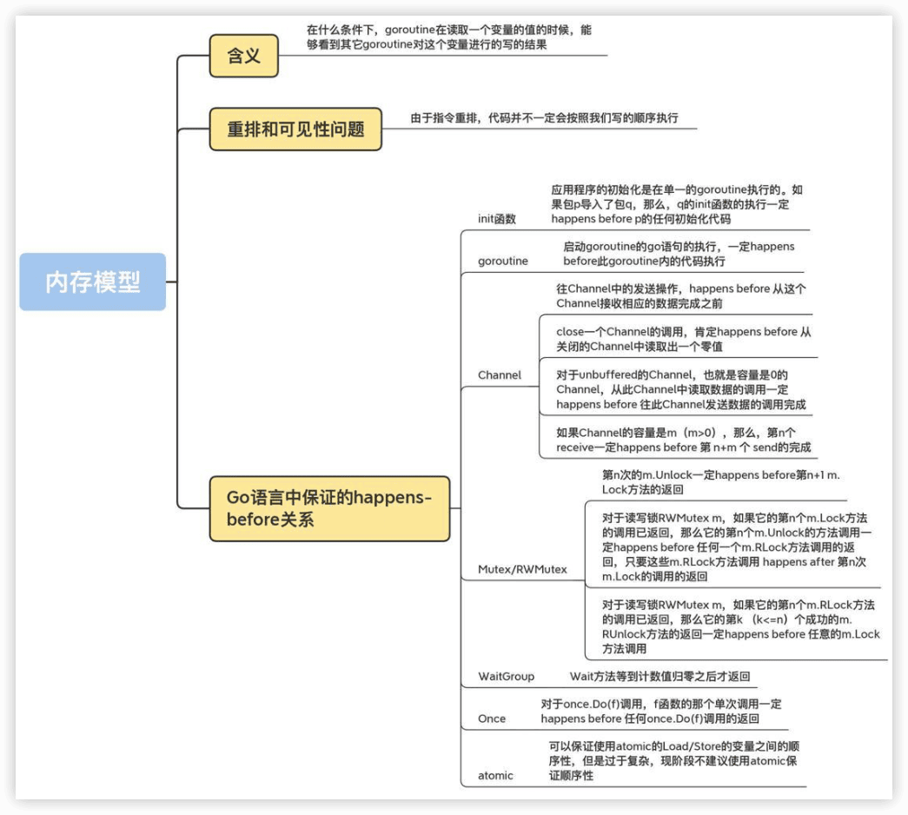

Go并发编程实战课
----

[《Go并发编程实战课》](https://time.geekbang.org/column/intro/100061801)


## 怎么学Go并发编程

### 学习Go并发编程，有哪些困难？

主要是有5大问题：

- 在面对并发难题时，感觉无从下手，**不知道该用什么并发原语来解决问题**。
- 如果多个并发原语都可以解决问题，那么，**究竟哪个是最优解呢**？比如说是用互斥锁，还是用Channel。
- **不知道如何编排并发任务**。并发编程不像是传统的串行编程，程序的运行存在着很大的不确定性。这个时候，就会面临一个问题，**怎么才能让相应的任务按照你设想的流程运行呢？**
- 有时候，按照正常理解的并发方式去实现的程序，结果莫名其妙就panic或者死锁了，**排查起来非常困难**。
- **已知的并发原语都不能解决并发问题**，程序写起来异常复杂，而且代码混乱，容易出错。

### 怎么提升Go并发编程能力？


知识主线

学习主线主要是四大步骤：**基础用法、实现原理、易错场景、知名项目中的Bug**。

Go中有一个大的方向，就是**==任务编排用Channel，共享资源保护用传统并发原语==**，但不能局限于这个原则。


# 一、基本并发原语

传统的并发原语：Mutex、RWMutex、Waitgroup、Cond、Pool、Context等标准库中的并发原语。这些在其它语言中也很常见。

## 1 Mutex：如何解决资源并发访问问题？

常见并发问题：**多个goroutine并发更新同一个资源，像计数器；同时更新用户的账户信息；秒杀系统；往同一个buffer中并发写入数据等等**。

如果没有互斥控制，就会出现一些异常情况，比如计数器的计数不准确、用户的账户可能出现透支、秒杀系统出现超卖、buffer中的数据混乱，等等，后果都很严重。


### 互斥锁的实现机制

互斥锁是并发控制的一个基本手段。

在并发编程中，如果程序中的一部分会被并发访问或修改，那么，为了避免并发访问导致的意想不到的结果，这部分程序需要被保护起来，这部分被保护起来的程序，就叫做**==临界区==**。

临界区就是一个**被共享的资源**，或者说是一个整体的一组共享资源，比如**对数据库的访问、对某一个共享数据结构的操作、对一个 I/O 设备的使用、对一个连接池中的连接的调用**，等等。

**使用互斥锁，限定临界区只能同时由一个线程持有。**

当临界区由一个线程持有的时候，其它线程如果想进入这个临界区，就会返回==失败==，或者是==等待==。直到持有的线程退出临界区，这些等待线程中的某一个才有机会接着持有这个临界区。


互斥锁很好地解决了==资源竞争问题==，也它叫做==排它锁==。在Go 标准库中，通过 Mutex 来实现互斥锁。

Mutex是使用最广泛的==同步原语==（Synchronization primitives，也叫做**并发原语**，并发原语的指代范围更大，还可以包括**任务编排**的类型，所以后面讲Channel或者扩展类型时也会用并发原语）。

**互斥锁Mutex、读写锁RWMutex、并发编排WaitGroup、条件变量Cond、Channel**等同步原语。

同步原语的适用场景：

- ==共享资源==。并发地读写共享资源，会出现数据竞争（data race）的问题，所以需要Mutex、RWMutex这样的并发原语来保护。
- ==任务编排==。需要goroutine按照一定的规律执行，而goroutine之间有相互等待或者依赖的顺序关系，我们常常使用WaitGroup或者Channel来实现。
- ==消息传递==。信息交流以及不同的goroutine之间的线程安全的数据交流，常常使用Channel来实现。

### Mutex的基本使用方法

`sync`提供了锁相关的一系列同步原语，其中有`Locker`接口，Mutex就实现了这个接口。

```go
type Locker interface {
    Lock()
    Unlock()
}
```

请求锁（Lock）和释放锁（Unlock）两个方法。

互斥锁Mutex就提供两个方法Lock和Unlock：**进入临界区之前调用Lock方法，退出临界区的时候调用Unlock方法**：

```go
func(m *Mutex)Lock()
func(m *Mutex)Unlock()
```

**当一个goroutine通过调用Lock方法获得了这个锁的拥有权后， 其它请求锁的goroutine就会阻塞在Lock方法的调用上，直到锁被释放并且自己获取到了这个锁的拥有权。**

例子，创建了10个goroutine，同时不断地对一个变量（count）进行加1操作，每个goroutine负责执行10万次的加1操作，期望的最后计数的结果是10 *100000 = 1000000 (一百万)。

```go
import (
	"fmt"
	"sync"
)

func main() {
	var count = 0
	// 使用WaitGroup来等待10个goroutine执行完毕
	var wg sync.WaitGroup
	wg.Add(10)
	for i := 0; i < 10; i++ {
		go func() {
			defer wg.Done()
			for j := 0; j < 100000; j++ {
				count++
			}
		}()
	}
	// 等待10个goroutine执行完毕
	wg.Wait()
	fmt.Println(count)
}
```

```sh
$ go run counter.go 
231769
$ go run counter.go
327804
$ go run counter.go
390403
```

每次运行，你都可能得到不同的结果，基本上不会得到理想中的一百万的结果。

其实，这是因为，**count++ 不是一个原子操作**，它至少包含几个步骤，比如读取变量count的当前值，对这个值加1，把结果再保存到count中。因为不是原子操作，就可能有并发的问题。

比如，10个goroutine同时读取到count的值为9527，接着各自按照自己的逻辑加1，值变成了9528，然后把这个结果再写回到count变量。但是，实际上，此时我们增加的总数应该是10才对，这里却只增加了1，好多计数都被“吞”掉了。这是并发访问共享数据的常见错误。

```go
		// count++操作的汇编代码
    MOVQ    "".count(SB), AX
    LEAQ    1(AX), CX
    MOVQ    CX, "".count(SB)
```


Go提供了一个**检测并发访问共享资源是否有问题**的工具： **race detector** 🔖，它可以帮助我们自动发现程序有没有data race的问题。

Go race detector是基于Google的 **C/C++ sanitizers** 技术实现的，编译器通过探测所有的内存访问，加入代码能监视对这些内存地址的访问（读还是写）。在代码运行的时候，race detector就能监控到对共享变量的非同步访问，出现race的时候，就会打印出警告信息。

这个技术在Google内部帮了大忙，探测出了Chromium等代码的大量并发问题。Go 1.1中就引入了这种技术，并且一下子就发现了标准库中的42个并发问题。现在，race detector已经成了Go持续集成过程中的一部分。

在编译（compile）、测试（test）或者运行（run）Go代码的时候，加上race参数，就有可能发现并发问题。

```sh
$ go run -race counter.go 
==================
WARNING: DATA RACE
Read at 0x00c000118028 by goroutine 7:
  main.main.func1()
      /Users/andyron/myfield/github/LearnGo/Go并发编程实战课/go-concurrent/ch01/counter.go:17 +0x94

Previous write at 0x00c000118028 by goroutine 6:
  main.main.func1()
      /Users/andyron/myfield/github/LearnGo/Go并发编程实战课/go-concurrent/ch01/counter.go:17 +0xa4

Goroutine 7 (running) created at:
  main.main()
      /Users/andyron/myfield/github/LearnGo/Go并发编程实战课/go-concurrent/ch01/counter.go:14 +0x74

Goroutine 6 (running) created at:
  main.main()
      /Users/andyron/myfield/github/LearnGo/Go并发编程实战课/go-concurrent/ch01/counter.go:14 +0x74
==================
==================
WARNING: DATA RACE
Write at 0x00c000118028 by goroutine 10:
  main.main.func1()
      /Users/andyron/myfield/github/LearnGo/Go并发编程实战课/go-concurrent/ch01/counter.go:17 +0xa4

Previous write at 0x00c000118028 by goroutine 6:
  main.main.func1()
      /Users/andyron/myfield/github/LearnGo/Go并发编程实战课/go-concurrent/ch01/counter.go:17 +0xa4

Goroutine 10 (running) created at:
  main.main()
      /Users/andyron/myfield/github/LearnGo/Go并发编程实战课/go-concurrent/ch01/counter.go:14 +0x74

Goroutine 6 (running) created at:
  main.main()
      /Users/andyron/myfield/github/LearnGo/Go并发编程实战课/go-concurrent/ch01/counter.go:14 +0x74
==================
908858
Found 2 data race(s)
exit status 66

```

虽然这个工具使用起来很方便，但是，因为它的实现方式，**只能通过真正对实际地址进行读写访问的时候才能探测，所以它并不能在编译的时候发现==data race的问题==**。


```sh
go tool compile -race -S counter.go
```

🔖


```go
	// 互斥锁保护计数器
	var mu sync.Mutex
	// 计数器的值
	var count = 0

	// 辅助变量，用来确认所有的goroutine都完成
	var wg sync.WaitGroup
	wg.Add(10)

	// 启动10个gourontine
	for i := 0; i < 10; i++ {
		go func() {
			defer wg.Done()
			// 累加10万次
			for j := 0; j < 100000; j++ {
				mu.Lock()
				count++
				mu.Unlock()
			}
		}()
	}
	wg.Wait()
	fmt.Println(count)
```

```sh
$ go run -race counter2.go 
1000000
```

> 注意：Mutex的零值是还没有goroutine等待的未加锁的状态，所以不需要额外的初始化，直接声明变量（如 var mu sync.Mutex）即可。


### Mutex其它用法

很多情况下，**Mutex会嵌入到其它struct中使用**：

```go
type Counter struct {
    mu    sync.Mutex
    Count uint64
}
```

在初始化嵌入的struct时，也不必初始化这个Mutex字段，不会因为没有初始化出现空指针或者是无法获取到锁的情况。


有时候，我们还可以采用**嵌入字段的方式**。通过嵌入字段，你可以在这个struct上直接调用Lock/Unlock方法:

```go
func main() {
	var counter Counter
	var wg sync.WaitGroup
	wg.Add(10)
	for i := 0; i < 10; i++ {
		go func() {
			defer wg.Done()
			for j := 0; j < 100000; j++ {
				counter.Lock()
				counter.Count++
				counter.Unlock()
			}
		}()
	}
	wg.Wait()
	fmt.Println(counter.Count)
}

type Counter struct {
	sync.Mutex
	Count uint64
}
```


**如果嵌入的struct有多个字段，我们一般会把Mutex放在要控制的字段上面，然后使用空格把字段分隔开来。**  这样代码逻辑更清晰，之后更容易维护。甚至，还可以把获取锁、释放锁、计数加一的逻辑封装成一个方法，对外不需要暴露锁等逻辑：


> Docker issue 37583、35517、32826、30696等、kubernetes issue 72361、71617等，都是后来发现的data race而采用互斥锁Mutex进行修复的。


### 思考

> 如果Mutex已经被一个goroutine获取了锁，其它等待中的goroutine们只能一直等待。那么，等这个锁释放后，等待中的goroutine中哪一个会优先获取Mutex呢？


## 2 Mutex：庖丁解牛看实现

Mutex的演进历史，是从一个简单易于理解的互斥锁的实现，到一个非常复杂的数据结构，这是一个逐步完善的过程。

Mutex的架构演进分成了四个阶段：


1. ==“初版”==的Mutex使用一个flag来表示锁是否被持有，实现比较简单；
2. 后来照顾到新来的goroutine，所以会让新的goroutine也尽可能地先获取到锁，叫作==“给新人机会”==；
3. 第三阶段==“多给些机会”==，照顾新来的和被唤醒的goroutine；
4. 但是这样会带来饥饿问题，所以目前又加入了饥饿的解决方案，也就是第四阶段==“解决饥饿”==。

### 2.1 初版的互斥锁

Russ Cox在2008年提交的第一版Mutex，通过一个flag变量，标记当前的锁是否被某个goroutine持有。如果这个flag的值是1，就代表锁已经被持有，那么，其它竞争的goroutine只能等待；如果这个flag的值是0，就可以通过==CAS（compare-and-swap，或者compare-and-set）==将这个flag设置为1，标识锁被当前的这个goroutine持有了。

```go
		// CAS操作，当时还没有抽象出atomic包
    func cas(val *int32, old, new int32) bool
    func semacquire(*int32)
    func semrelease(*int32)
    // 互斥锁的结构，包含两个字段
    type Mutex struct {
        key  int32 // 锁是否被持有的标识
        sema int32 // 信号量专用，用以阻塞/唤醒goroutine
    }
    
    // 保证成功在val上增加delta的值
    func xadd(val *int32, delta int32) (new int32) {
        for {
            v := *val
            if cas(val, v, v+delta) {
                return v + delta
            }
        }
        panic("unreached")
    }
    
    // 请求锁
    func (m *Mutex) Lock() {
        if xadd(&m.key, 1) == 1 { //标识加1，如果等于1，成功获取到锁
            return
        }
        semacquire(&m.sema) // 否则阻塞等待
    }
    
    func (m *Mutex) Unlock() {
        if xadd(&m.key, -1) == 0 { // 将标识减去1，如果等于0，则没有其它等待者
            return
        }
        semrelease(&m.sema) // 唤醒其它阻塞的goroutine
    }    
```

> **==CAS指令==**将给定的值和一个内存地址中的值进行比较，如果它们是同一个值，就使用新值替换内存地址中的值，这个操作是**原子性**的。
>
> 原子性保证这个指令总是基于最新的值进行计算，如果同时有其它线程已经修改了这个值，那么，CAS会返回失败。
>
> **CAS是实现互斥锁和同步原语的基础**。

最核心的结构体（struct）和函数、方法的定义几乎与现在的一样。

- 字段key：是一个flag，用来标识这个排外锁是否被某个goroutine所持有，如果key大于等于1，说明这个排外锁已经被持有；
- 字段sema：是个信号量变量，用来控制等待goroutine的阻塞休眠和唤醒。


调用Lock请求锁的时候，通过`xadd`方法进行CAS操作（第24行），xadd方法通过循环执行CAS操作直到成功，保证对key加1的操作成功完成。

如果比较幸运，锁没有被别的goroutine持有，那么，Lock方法成功地将key设置为1，这个goroutine就持有了这个锁；如果锁已经被别的goroutine持有了，那么，当前的goroutine会把key加1，而且还会调用`semacquire`方法（第27行），使用信号量将自己休眠，等锁释放的时候，信号量会将它唤醒。

有锁的goroutine调用Unlock释放锁时，它会将key减1（第31行）。如果当前没有其它等待这个锁的goroutine，这个方法就返回了。但是，如果还有等待此锁的其它goroutine，那么，它会调用semrelease方法（第34行），利用信号量唤醒等待锁的其它goroutine中的一个。

总结，初版的Mutex利用CAS原子操作，对key这个标志量进行设置。key不仅仅标识了锁是否被goroutine所持有，还记录了当前持有和等待获取锁的goroutine的数量。

注意，**Unlock方法可以被任意的goroutine调用释放锁，即使是没持有这个互斥锁的goroutine，也可以进行这个操作。这是因为，Mutex本身并没有包含持有这把锁的goroutine的信息，所以，Unlock也不会对此进行检查。Mutex的这个设计一直保持至今。**

🔖

### 2.2 给新人机会

2011年6月30日，对Mutex做了一次大的调整：

```go
type Mutex struct {
  state int32
  sema  uint32
}

const (
  mutexLocked = 1 << iota // mutex is locked
  mutexWoken
  mutexWaiterShift = iota
) 
```


state是一个复合型的字段，一个字段包含多个意义，这样可以通过尽可能少的内存来实现互斥锁。这个字段的第一位（最小的一位）来表示这个锁是否被持有，第二位代表是否有唤醒的goroutine，剩余的位数代表的是等待此锁的goroutine数。所以，state这一个字段被分成了三部分，代表三个数据。

请求锁的方法Lock也变得复杂了:

```go
func (m *Mutex) Lock() {
  // Fast path: 幸运case，能够直接获取到锁
  if atomic.CompareAndSwapInt32(&m.state, 0, mutexLocked) {
    return
	}

  awoke := false
  for {
    old := m.state
    new := old | mutexLocked // 新状态加锁
    if old&mutexLocked != 0 {
      new = old + 1<<mutexWaiterShift //等待者数量加一
    }
    if awoke {
      // goroutine是被唤醒的，
      // 新状态清除唤醒标志
      new &^= mutexWoken
    }
    if atomic.CompareAndSwapInt32(&m.state, old, new) {//设置新状态
      if old&mutexLocked == 0 { // 锁原状态未加锁
        break
      }
      runtime.Semacquire(&m.sema) // 请求信号量
      awoke = true
    }
  }
}
```

🔖


释放锁的Unlock方法:

```go
func (m *Mutex) Unlock() {
  // Fast path: drop lock bit.
  new := atomic.AddInt32(&m.state, -mutexLocked) //去掉锁标志
  if (new+mutexLocked)&mutexLocked == 0 { //本来就没有加锁
    panic("sync: unlock of unlocked mutex")
  }

  old := new
  for {
    if old>>mutexWaiterShift == 0 || old&(mutexLocked|mutexWoken) != 0 { // 没有等待者，或者有唤醒的waiter，或者锁原来已加锁
      return
    }
    new = (old - 1<<mutexWaiterShift) | mutexWoken // 新状态，准备唤醒goroutine，并设置唤醒标志
    if atomic.CompareAndSwapInt32(&m.state, old, new) {
      runtime.Semrelease(&m.sema)
      return
    }
    old = m.state
  }
}
```

🔖


总结，相对于初版的设计，这次的改动主要就是，**新来的goroutine也有机会先获取到锁，甚至一个goroutine可能连续获取到锁，打破了先来先得的逻辑。但是，代码复杂度也显而易见。**


### 2.3 多给些机会

2015年2月，如果新来的goroutine或者是被唤醒的goroutine首次获取不到锁，它们就会通过自旋（spin，通过循环不断尝试，spin的逻辑是在runtime实现的）的方式，尝试检查锁是否被释放。在尝试一定的自旋次数后，再执行原来的逻辑。

```go
func (m *Mutex) Lock() {
  // Fast path: 幸运之路，正好获取到锁
  if atomic.CompareAndSwapInt32(&m.state, 0, mutexLocked) {
    return
  }

  awoke := false
  iter := 0
  for { // 不管是新来的请求锁的goroutine, 还是被唤醒的goroutine，都不断尝试请求锁
    old := m.state // 先保存当前锁的状态
    new := old | mutexLocked // 新状态设置加锁标志
    if old&mutexLocked != 0 { // 锁还没被释放
      if runtime_canSpin(iter) { // 还可以自旋
        if !awoke && old&mutexWoken == 0 && old>>mutexWaiterShift != 0 &&
        atomic.CompareAndSwapInt32(&m.state, old, old|mutexWoken) {
          awoke = true
        }
        runtime_doSpin()
        iter++
        continue // 自旋，再次尝试请求锁
      }
      new = old + 1<<mutexWaiterShift
    }
    if awoke { // 唤醒状态
      if new&mutexWoken == 0 {
        panic("sync: inconsistent mutex state")
      }
      new &^= mutexWoken // 新状态清除唤醒标记
    }
    if atomic.CompareAndSwapInt32(&m.state, old, new) {
      if old&mutexLocked == 0 { // 旧状态锁已释放，新状态成功持有了锁，直接返回
        break
      }
      runtime_Semacquire(&m.sema) // 阻塞等待
      awoke = true // 被唤醒
      iter = 0
    }
  }
}
```


### 2.4 解决饥饿

经过几次优化，Mutex的代码越来越复杂，应对高并发争抢锁的场景也更加公平。

**饥饿问题**

🔖


### 2.5 饥饿模式和正常模式


### 总结

Go创始者的哲学，就是他们**强调Go语言和标准库的稳定性**，新版本要向下兼容，用新的版本总能编译老的代码。Go语言从出生到现在已经10多年了，这个Mutex对外的接口却没有变化，依然向下兼容，即使现在Go出了两个版本，每个版本也会向下兼容，保持Go语言的稳定性，你也能领悟他们软件开发和设计的思想。


> 目前Mutex的state字段有几个意义，这几个意义分别是由哪些字段表示的？
>
> 等待一个Mutex的goroutine数最大是多少？是否能满足现实的需求？


## 3 Mutex：4种易错场景大盘点

### 常见的4种错误场景

#### Lock/Unlock不是成对出现


#### Copy已使用的Mutex


#### 重入


#### 死锁


### 流行的Go开发项目踩坑记

#### Docker


#### Kubernetes


#### gRPC


## 4 Mutex：骇客编程，如何拓展额外功能？

锁是性能下降的“罪魁祸首”之一，所以，有效地降低锁的竞争，就能够很好地提高性能。因此，监控关键互斥锁上等待的goroutine的数量，是我们分析锁竞争的激烈程度的一个重要指标。

### TryLock


### 获取等待者的数量等指标


### 使用Mutex实现一个线程安全的队列


## 5 RWMutex：读写锁的实现原理及避坑指南

Go标准库中的RWMutex（读写锁）就是用来解决这类readers-writers问题的。

### 什么是RWMutex？


### RWMutex的实现原理

RWMutex是基于Mutex实现的。


### RLock/RUnlock的实现


### Lock


### Unlock


### RWMutex的3个踩坑点

#### 坑点1：不可复制


#### 坑点2：重入导致死锁


#### 坑点3：释放未加锁的RWMutex


### 流行的Go开发项目中的坑


## 6 WaitGroup：协同等待，任务编排利器

### WaitGroup的基本用法

```go
func (wg *WaitGroup) Add(delta int)		// 用来设置WaitGroup的计数值
func (wg *WaitGroup) Done()  // 用来将WaitGroup的计数值减1，其实就是调用了Add(-1)
func (wg *WaitGroup) Wait()   // 调用这个方法的goroutine会一直阻塞，直到WaitGroup的计数值变为0
```


### WaitGroup的实现


### 使用WaitGroup时的常见错误

#### 常见问题一：计数器设置为负值


#### 常见问题二：不期望的Add时机


#### 常见问题三：前一个Wait还没结束就重用WaitGroup


### noCopy：辅助vet检查


### 流行的Go开发项目中的坑


## 7 Cond：条件变量的实现机制及避坑指南


### Cond的基本用法


## 8 Once：一个简约而不简单的并发原语


## 9 map：如何实现线程安全的map类型？


## 10 Pool：性能提升大杀器

### sync.Pool的特点


### sync.Pool的使用方法


### 实现原理


## 11 Context：信息穿透上下文


# 二、原子操作

Go标准库中提供的原子操作。原子操作是其它并发原语的基础，学会了就可以自己创造新的并发原语。

## 12 atomic：要保证原子操作，一定要使用这几种方法


# 三、Channel

Channel类型是Go语言独特的类型，因为比较新，所以难以掌握。

不仅能掌握它的基本用法，而且还能掌握它的处理场景和应用模式，避免踩坑。

## 13 Channel：另辟蹊径，解决并发问题

### Channel的发展


### Channel的应用场景


### Channel基本用法


### Channel的实现原理

#### chan数据结构


#### 初始化


### 使用Channel容易犯的错误


## 14 Channel：透过代码看典型的应用模式

### 使用反射操作Channel


### 典型的应用场景


#### 消息交流


#### 信号通知


#### 锁


#### 任务编排

Or-Done模式、扇入模式、扇出模式、Stream和map-reduce


## 15 内存模型：Go如何保证并发读写的顺序？

### 重排和可见性的问题


### happens-before


### Go语言中保证的happens-before关系

#### init函数


#### goroutine


#### Channel


#### Mutex/RWMutex


#### WaitGroup


#### Once


#### atomic





# 四、扩展并发原语

想进一步提升并发编程能力，就需要学习一些第三方库。

## 16 Semaphore：一篇文章搞懂信号量

### 信号量是什么？都有什么操作？

信号量的概念是荷兰计算机科学家Edsger Dijkstra在1963年左右提出来的，广泛应用在不同的操作系统中。在系统中，会给每一个进程一个信号量，代表每个进程目前的状态。未得到控制权的进程，会在特定的地方被迫停下来，等待可以继续进行的信号到来。

最简单的信号量就是一个变量加一些并发控制的能力，这个变量是0到n之间的一个数值。当goroutine完成对此信号量的等待（wait）时，该计数值就减1，当goroutine完成对此信号量的释放（release）时，该计数值就加1。当计数值为0的时候，goroutine调用wait等待该信号量是不会成功的，除非计数器又大于0，等待的goroutine才有可能成功返回。


### P/V操作


### Go官方扩展库的实现


### 使用信号量的常见错误


### 其它信号量的实现


## 17 SingleFlight 和 CyclicBarrier：请求合并和循环栅栏该怎么用？

SingleFlight的作用是将并发请求合并成一个请求，以减少对下层服务的压力；

而CyclicBarrier是一个可重用的栅栏并发原语，用来控制一组请求同时执行的数据结构。

### 请求合并SingleFlight


### 循环栅栏CyclicBarrier


## 18 分组操作：处理一组子任务，该用什么并发原语？

分组编排的一些常用场景和并发原语，包括ErrGroup、gollback、Hunch和schedgroup。

### ErrGroup


# 五、分布式并发原语

分布式并发原语是应对大规模的应用程序中并发问题的并发类型。

介绍使用etcd实现的一些分布式并发原语，比如**Leader选举、分布式互斥锁、分布式读写锁、分布式队列**等，在处理分布式场景的并发问题时，特别有用。

## 19 在分布式环境中，Leader选举、互斥锁和读写锁该如何实现？

常用来做协调工作的软件系统是Zookeeper、etcd、Consul之类的软件，Zookeeper为Java生态群提供了丰富的分布式并发原语（通过Curator库），但是缺少Go相关的并发原语库。Consul在提供分布式并发原语这件事儿上不是很积极，而etcd就提供了非常好的分布式并发原语，比如分布式互斥锁、分布式读写锁、Leader选举，等等。

### Leader选举


### 互斥锁


### 读写锁


## 20 在分布式环境中，队列、栅栏和STM该如何实现？

### 分布式队列和优先级队列


### 分布式栅栏


### Barrier：分布式栅栏


### DoubleBarrier：计数型栅栏


### STM


## Go并发编程的价值和精进之路