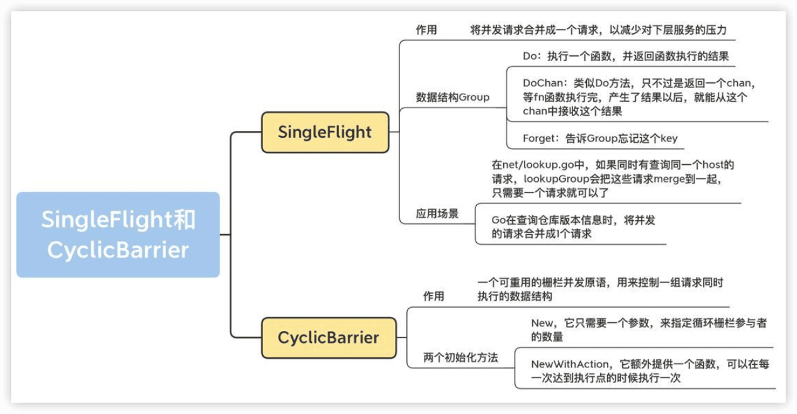

Go并发编程实战课
----

[《Go并发编程实战课》](https://time.geekbang.org/column/intro/100061801)


## 怎么学Go并发编程

### 学习Go并发编程，有哪些困难？

主要是有5大问题：

- 在面对并发难题时，感觉无从下手，**不知道该用什么并发原语来解决问题**。
- 如果多个并发原语都可以解决问题，那么，**究竟哪个是最优解呢**？比如说是用互斥锁，还是用Channel。
- **不知道如何编排并发任务**。并发编程不像是传统的串行编程，程序的运行存在着很大的**不确定性**。这个时候，就会面临一个问题，**怎么才能让相应的任务按照你设想的流程运行呢？**
- 有时候，按照正常理解的并发方式去实现的程序，结果莫名其妙就panic或者死锁了，**排查起来非常困难**。
- **已知的并发原语都不能解决并发问题**，程序写起来异常复杂，而且代码混乱，容易出错。

### 怎么提升Go并发编程能力？


知识主线

学习主线主要是四大步骤：**基础用法、实现原理、易错场景、知名项目中的Bug**。

Go中有一个大的方向，就是**==任务编排用Channel，共享资源保护用传统并发原语==**，但不能局限于这个原则。


进阶，创造出自己需要的并发原语中的创造有两层含义：

- 第一层是==对既有的并发原语进行组合==，使用两个、三个或者更多的并发原语去解决问题。比如说，可以通过信号量和WaitGroup组合成一个新的并发原语，这个并发原语可以使用有限个goroutine并发处理子任务。
- 第二层含义是“无中生有”，根据已经掌握的并发原语的设计经验，创造出合适的新的并发原语，以应对一些特殊的并发问题。比如说，标准库中并没有信号量，你可以自己创造出这个类型。


3个目标：

- 建立起一个丰富的并发原语库；
- 熟知每一种并发原语的实现机制和适用场景；
- 能够创造出自己需要的并发原语。


# 一、基本并发原语

传统的并发原语：Mutex、RWMutex、Waitgroup、Cond、Pool、Context等标准库中的并发原语。这些在其它语言中也很常见。

## 1 Mutex：如何解决资源并发访问问题？

常见并发问题：**多个goroutine并发更新同一个资源，像计数器；同时更新用户的账户信息；秒杀系统；往同一个buffer中并发写入数据等等**。

如果没有互斥控制，就会出现一些异常情况，比如计数器的计数不准确、用户的账户可能出现透支、秒杀系统出现超卖、buffer中的数据混乱，等等，后果都很严重。


### 互斥锁的实现机制

互斥锁是并发控制的一个基本手段。

在并发编程中，如果程序中的一部分会被并发访问或修改，那么，为了避免并发访问导致的意想不到的结果，这部分程序需要被保护起来，这部分被保护起来的程序，就叫做**==临界区==**。

临界区就是一个**被共享的资源**，或者说是一个整体的一组共享资源，比如**对数据库的访问、对某一个共享数据结构的操作、对一个 I/O 设备的使用、对一个连接池中的连接的调用**，等等。

**使用互斥锁，限定临界区只能同时由一个线程持有。**

当临界区由一个线程持有的时候，其它线程如果想进入这个临界区，就会返回==失败==，或者是==等待==。直到持有的线程退出临界区，这些等待线程中的某一个才有机会接着持有这个临界区。


互斥锁很好地解决了==资源竞争问题==，也它叫做==排它锁==。在Go标准库中，通过Mutex来实现互斥锁。

Mutex是使用最广泛的==同步原语==（Synchronization primitives，也叫做**并发原语**，但并发原语的指代范围更大，还可以包括**任务编排**的类型，所以后面讲Channel或者扩展类型时也会用并发原语）。

**互斥锁Mutex、读写锁RWMutex、并发编排WaitGroup、条件变量Cond、Channel**等同步原语。

同步原语的适用场景：

- ==共享资源==。并发地读写共享资源，会出现数据竞争（data race）的问题，所以需要Mutex、RWMutex这样的并发原语来保护。
- ==任务编排==。需要goroutine按照一定的规律执行，而goroutine之间有相互等待或者依赖的顺序关系，我们常常使用WaitGroup或者Channel来实现。
- ==消息传递==。信息交流以及不同的goroutine之间的线程安全的数据交流，常常使用Channel来实现。

### Mutex的基本使用方法

`sync`提供了锁相关的一系列同步原语，其中有`Locker`接口，Mutex就实现了这个接口。

```go
type Locker interface {
    Lock()
    Unlock()
}
```

请求锁（Lock）和释放锁（Unlock）两个方法。

互斥锁Mutex就提供两个方法Lock和Unlock：**进入临界区之前调用Lock方法，退出临界区的时候调用Unlock方法**：

```go
func(m *Mutex)Lock()
func(m *Mutex)Unlock()
```

**当一个goroutine通过调用Lock方法获得了这个锁的拥有权后， 其它请求锁的goroutine就会阻塞在Lock方法的调用上，直到锁被释放并且自己获取到了这个锁的拥有权。**

例子，创建了10个goroutine，同时不断地对一个变量（count）进行加1操作，每个goroutine负责执行10万次的加1操作，期望的最后计数的结果是10 *100000 = 1000000 (一百万)。

```go
import (
	"fmt"
	"sync"
)

func main() {
	var count = 0
	// 使用WaitGroup来等待10个goroutine执行完毕
	var wg sync.WaitGroup
	wg.Add(10)
	for i := 0; i < 10; i++ {
		go func() {
			defer wg.Done()
			for j := 0; j < 100000; j++ {
				count++
			}
		}()
	}
	// 等待10个goroutine执行完毕
	wg.Wait()
	fmt.Println(count)
}
```

```sh
$ go run counter.go 
231769
$ go run counter.go
327804
$ go run counter.go
390403
```

每次运行，你都可能得到不同的结果，基本上不会得到理想中的一百万的结果。

其实，这是因为，**count++ 不是一个原子操作**，它至少包含几个步骤，比如读取变量count的当前值，对这个值加1，把结果再保存到count中。因为不是原子操作，就可能有并发的问题。

比如，10个goroutine同时读取到count的值为9527，接着各自按照自己的逻辑加1，值变成了9528，然后把这个结果再写回到count变量。但是，实际上，此时我们增加的总数应该是10才对，这里却只增加了1，好多计数都被“吞”掉了。这是并发访问共享数据的常见错误。

```go
		// count++操作的汇编代码
    MOVQ    "".count(SB), AX
    LEAQ    1(AX), CX
    MOVQ    CX, "".count(SB)
```


Go提供了一个**检测并发访问共享资源是否有问题**的工具： **race detector** 🔖，它可以帮助我们自动发现程序有没有data race的问题。

Go race detector是基于Google的 **C/C++ sanitizers** 技术实现的，编译器通过探测所有的内存访问，加入代码能监视对这些内存地址的访问（读还是写）。在代码运行的时候，race detector就能监控到对共享变量的**非同步访问**🔖，出现race的时候，就会打印出警告信息。

这个技术在Google内部帮了大忙，探测出了Chromium等代码的大量并发问题。Go 1.1中就引入了这种技术，并且一下子就发现了标准库中的42个并发问题。现在，race detector已经成了Go持续集成过程中的一部分。

在编译（compile）、测试（test）或者运行（run）Go代码的时候，加上race参数，就有可能发现并发问题。

```sh
$ go run -race counter.go 
==================
WARNING: DATA RACE
Read at 0x00c000118028 by goroutine 7:
  main.main.func1()
      /Users/andyron/myfield/github/LearnGo/Go并发编程实战课/go-concurrent/ch01/counter.go:17 +0x94

Previous write at 0x00c000118028 by goroutine 6:
  main.main.func1()
      /Users/andyron/myfield/github/LearnGo/Go并发编程实战课/go-concurrent/ch01/counter.go:17 +0xa4

Goroutine 7 (running) created at:
  main.main()
      /Users/andyron/myfield/github/LearnGo/Go并发编程实战课/go-concurrent/ch01/counter.go:14 +0x74

Goroutine 6 (running) created at:
  main.main()
      /Users/andyron/myfield/github/LearnGo/Go并发编程实战课/go-concurrent/ch01/counter.go:14 +0x74
==================
==================
WARNING: DATA RACE
Write at 0x00c000118028 by goroutine 10:
  main.main.func1()
      /Users/andyron/myfield/github/LearnGo/Go并发编程实战课/go-concurrent/ch01/counter.go:17 +0xa4

Previous write at 0x00c000118028 by goroutine 6:
  main.main.func1()
      /Users/andyron/myfield/github/LearnGo/Go并发编程实战课/go-concurrent/ch01/counter.go:17 +0xa4

Goroutine 10 (running) created at:
  main.main()
      /Users/andyron/myfield/github/LearnGo/Go并发编程实战课/go-concurrent/ch01/counter.go:14 +0x74

Goroutine 6 (running) created at:
  main.main()
      /Users/andyron/myfield/github/LearnGo/Go并发编程实战课/go-concurrent/ch01/counter.go:14 +0x74
==================
908858
Found 2 data race(s)
exit status 66

```

虽然这个工具使用起来很方便，但是，因为它的实现方式，**只能通过真正对实际地址进行读写访问的时候才能探测，所以它并不能在编译的时候发现==data race的问题==**。


```sh
go tool compile -race -S counter.go
```

🔖


这里的共享资源是count变量，临界区是count++，只要在临界区前面获取锁，在离开临界区的时候释放锁，就能完美地解决data race的问题了。

```go
	// 互斥锁保护计数器
	var mu sync.Mutex
	// 计数器的值
	var count = 0

	// 辅助变量，用来确认所有的goroutine都完成
	var wg sync.WaitGroup
	wg.Add(10)

	// 启动10个gourontine
	for i := 0; i < 10; i++ {
		go func() {
			defer wg.Done()
			// 累加10万次
			for j := 0; j < 100000; j++ {
				mu.Lock()
				count++
				mu.Unlock()
			}
		}()
	}
	wg.Wait()
	fmt.Println(count)
```

```sh
$ go run -race counter2.go 
1000000
```

> 注意：Mutex的零值是**还没有goroutine等待的未加锁的状态**，所以不需要额外的初始化，直接声明变量（如 var mu sync.Mutex）即可。


### Mutex其它用法

很多情况下，**Mutex会嵌入到其它struct中使用**：

```go
type Counter struct {
    mu    sync.Mutex
    Count uint64
}
```

在初始化嵌入的struct时，也不必初始化这个Mutex字段，不会因为没有初始化出现空指针或者是无法获取到锁的情况。


有时候，我们还可以采用**嵌入字段的方式**。通过嵌入字段，你可以在这个struct上直接调用Lock/Unlock方法:

```go
func main() {
	var counter Counter
	var wg sync.WaitGroup
	wg.Add(10)
	for i := 0; i < 10; i++ {
		go func() {
			defer wg.Done()
			for j := 0; j < 100000; j++ {
				counter.Lock()
				counter.Count++
				counter.Unlock()
			}
		}()
	}
	wg.Wait()
	fmt.Println(counter.Count)
}

type Counter struct {
	sync.Mutex
	Count uint64
}
```


**如果嵌入的struct有多个字段，我们一般会把Mutex放在要控制的字段上面，然后使用空格把字段分隔开来。**  这样代码逻辑更清晰，之后更容易维护。甚至，还可以**把获取锁、释放锁、计数加一的逻辑封装成一个方法**，对外不需要暴露锁等逻辑：

```go
func main() {
	// 封装好的计数器
	var counter Counter2

	var wg sync.WaitGroup
	wg.Add(10)

	// 启动10个goroutine
	for i := 0; i < 10; i++ {
		go func() {
			defer wg.Done()
			// 累加10万次
			for j := 0; j < 100000; j++ {
				counter.Incr()
			}
		}()
	}
	wg.Wait()
	fmt.Println(counter.Count())
}

// 线程安全的计数器类型
type Counter2 struct {
	CounterType int
	name        string

	mu    sync.Mutex
	count uint64
}

// 加1的方法内部使用互拆锁保护
func (c *Counter2) Incr() {
	c.mu.Lock()
	c.count++
	c.mu.Unlock()
}

// 得到计数器的值，也需要互斥锁保护
func (c *Counter2) Count() uint64 {
	c.mu.Lock()
	defer c.mu.Unlock()
	return c.count
}
```


> Docker issue 37583、35517、32826、30696等、kubernetes issue 72361、71617等，都是后来发现的data race而采用互斥锁Mutex进行修复的。


### 思考

> 如果Mutex已经被一个goroutine获取了锁，其它等待中的goroutine们只能一直等待。那么，等这个锁释放后，等待中的goroutine中哪一个会优先获取Mutex呢？


## 2 Mutex：庖丁解牛看实现

Mutex的演进历史，是从一个简单易于理解的互斥锁的实现，到一个非常复杂的数据结构，这是一个逐步完善的过程。

Mutex的架构演进分成了四个阶段：


1. ==“初版”==的Mutex使用一个flag来表示锁是否被持有，实现比较简单；
2. 后来照顾到新来的goroutine，所以会让新的goroutine也尽可能地先获取到锁，叫作==“给新人机会”==；
3. 第三阶段==“多给些机会”==，照顾新来的和被唤醒的goroutine；
4. 但是这样会带来饥饿问题，所以目前又加入了饥饿的解决方案，也就是第四阶段==“解决饥饿”==。

### 2.1 初版的互斥锁

Russ Cox在2008年提交的第一版Mutex，通过一个flag变量，标记当前的锁是否被某个goroutine持有。如果这个flag的值是1，就代表锁已经被持有，那么，其它竞争的goroutine只能等待；如果这个flag的值是0，就可以通过==CAS（compare-and-swap，或者compare-and-set）==将这个flag设置为1，标识锁被当前的这个goroutine持有了。

```go
// CAS操作，当时还没有抽象出atomic包
func cas(val *int32, old, new int32) bool
func semacquire(*int32)
func semrelease(*int32)
// 互斥锁的结构，包含两个字段
type Mutex struct {
  key  int32 // 锁是否被持有的标识
  sema int32 // 信号量专用，用以阻塞/唤醒goroutine
}

// 保证成功在val上增加delta的值
func xadd(val *int32, delta int32) (new int32) {
  for {
    v := *val
    if cas(val, v, v+delta) {
      return v + delta
    }
  }
  panic("unreached")
}

// 请求锁
func (m *Mutex) Lock() {
  if xadd(&m.key, 1) == 1 { //标识加1，如果等于1，成功获取到锁
    return
  }
  semacquire(&m.sema) // 否则阻塞等待
}

func (m *Mutex) Unlock() {
  if xadd(&m.key, -1) == 0 { // 将标识减去1，如果等于0，则没有其它等待者
    return
  }
  semrelease(&m.sema) // 唤醒其它阻塞的goroutine
}    
```

> **==CAS指令==**将给定的值和一个内存地址中的值进行比较，如果它们是同一个值，就使用新值替换内存地址中的值，这个操作是**原子性**的。
>
> 原子性保证这个指令总是基于最新的值进行计算，如果同时有其它线程已经修改了这个值，那么，CAS会返回失败。
>
> **CAS是实现互斥锁和同步原语的基础**。

最核心的结构体（struct）和函数、方法的定义几乎与现在的一样。

- 字段key：是一个flag，用来标识这个排外锁是否被某个goroutine所持有，如果key大于等于1，说明这个排外锁已经被持有；
- 字段sema：是个信号量变量，用来控制等待goroutine的阻塞休眠和唤醒。


调用Lock请求锁的时候，通过`xadd`方法进行CAS操作（第24行），xadd方法通过循环执行CAS操作直到成功，保证对key加1的操作成功完成。

如果比较幸运，锁没有被别的goroutine持有，那么，Lock方法成功地将key设置为1，这个goroutine就持有了这个锁；如果锁已经被别的goroutine持有了，那么，当前的goroutine会把key加1，而且还会调用`semacquire`方法（第27行），使用信号量将自己休眠，等锁释放的时候，信号量会将它唤醒。

有锁的goroutine调用Unlock释放锁时，它会将key减1（第31行）。如果当前没有其它等待这个锁的goroutine，这个方法就返回了。但是，如果还有等待此锁的其它goroutine，那么，它会调用semrelease方法（第34行），利用信号量唤醒等待锁的其它goroutine中的一个。

总结，初版的Mutex利用CAS原子操作，对key这个标志量进行设置。key不仅仅标识了锁是否被goroutine所持有，还记录了当前持有和等待获取锁的goroutine的数量。

注意，**Unlock方法可以被任意的goroutine调用释放锁，即使是没持有这个互斥锁的goroutine，也可以进行这个操作。这是因为，==Mutex本身并没有包含持有这把锁的goroutine的信息==，所以，Unlock也不会对此进行检查。Mutex的这个设计一直保持至今。**

🔖

### 2.2 给新人机会

2011年6月30日，对Mutex做了一次大的调整：

```go
type Mutex struct {
  state int32
  sema  uint32
}

const (
  mutexLocked = 1 << iota // mutex is locked
  mutexWoken
  mutexWaiterShift = iota
) 
```


state是一个复合型的字段，一个字段包含多个意义，这样可以通过尽可能少的内存来实现互斥锁。

这个字段的第一位（最小的一位）来表示这个锁是否被持有，第二位代表是否有唤醒的goroutine，剩余的位数代表的是等待此锁的goroutine数。所以，state这一个字段被分成了三部分，代表三个数据。

请求锁的方法Lock也变得复杂了:

```go
func (m *Mutex) Lock() {
  // Fast path: 幸运case，能够直接获取到锁
  if atomic.CompareAndSwapInt32(&m.state, 0, mutexLocked) {
    return
	}

  awoke := false
  for {
    old := m.state
    new := old | mutexLocked // 新状态加锁
    if old&mutexLocked != 0 {
      new = old + 1<<mutexWaiterShift //等待者数量加一
    }
    if awoke {
      // goroutine是被唤醒的，
      // 新状态清除唤醒标志
      new &^= mutexWoken
    }
    if atomic.CompareAndSwapInt32(&m.state, old, new) {//设置新状态
      if old&mutexLocked == 0 { // 锁原状态未加锁
        break
      }
      runtime.Semacquire(&m.sema) // 请求信号量
      awoke = true
    }
  }
}
```

首先是通过CAS检测state字段中的标志（第3行），如果没有goroutine持有锁，也没有等待持有锁的gorutine，那么，当前的goroutine就很幸运，可以直接获得锁，这也是注释中的Fast path的意思。

🔖


请求锁的goroutine有两类，一类是新来请求锁的goroutine，另一类是被唤醒的等待请求锁的goroutine。

锁的状态也有两种：加锁和未加锁。

用一张表格，来说明一下goroutine不同来源不同状态下的处理逻辑：


释放锁的Unlock方法:

```go
func (m *Mutex) Unlock() {
  // Fast path: drop lock bit.
  new := atomic.AddInt32(&m.state, -mutexLocked) //去掉锁标志
  if (new+mutexLocked)&mutexLocked == 0 { //本来就没有加锁
    panic("sync: unlock of unlocked mutex")
  }

  old := new
  for {
    if old>>mutexWaiterShift == 0 || old&(mutexLocked|mutexWoken) != 0 { // 没有等待者，或者有唤醒的waiter，或者锁原来已加锁
      return
    }
    new = (old - 1<<mutexWaiterShift) | mutexWoken // 新状态，准备唤醒goroutine，并设置唤醒标志
    if atomic.CompareAndSwapInt32(&m.state, old, new) {
      runtime.Semrelease(&m.sema)
      return
    }
    old = m.state
  }
}
```

🔖


总结，相对于初版的设计，这次的改动主要就是，**新来的goroutine也有机会先获取到锁，甚至一个goroutine可能连续获取到锁，打破了先来先得的逻辑。但是，代码复杂度也显而易见。**


### 2.3 多给些机会

2015年2月，如果新来的goroutine或者是被唤醒的goroutine首次获取不到锁，它们就会通过**自旋（spin**，通过循环不断尝试，spin的逻辑是在runtime实现的）的方式，尝试检查锁是否被释放。在尝试一定的自旋次数后，再执行原来的逻辑。

```go
func (m *Mutex) Lock() {
  // Fast path: 幸运之路，正好获取到锁
  if atomic.CompareAndSwapInt32(&m.state, 0, mutexLocked) {
    return
  }

  awoke := false
  iter := 0
  for { // 不管是新来的请求锁的goroutine, 还是被唤醒的goroutine，都不断尝试请求锁
    old := m.state // 先保存当前锁的状态
    new := old | mutexLocked // 新状态设置加锁标志
    if old&mutexLocked != 0 { // 锁还没被释放
      if runtime_canSpin(iter) { // 还可以自旋
        if !awoke && old&mutexWoken == 0 && old>>mutexWaiterShift != 0 &&
        atomic.CompareAndSwapInt32(&m.state, old, old|mutexWoken) {
          awoke = true
        }
        runtime_doSpin()
        iter++
        continue // 自旋，再次尝试请求锁
      }
      new = old + 1<<mutexWaiterShift
    }
    if awoke { // 唤醒状态
      if new&mutexWoken == 0 {
        panic("sync: inconsistent mutex state")
      }
      new &^= mutexWoken // 新状态清除唤醒标记
    }
    if atomic.CompareAndSwapInt32(&m.state, old, new) {
      if old&mutexLocked == 0 { // 旧状态锁已释放，新状态成功持有了锁，直接返回
        break
      }
      runtime_Semacquire(&m.sema) // 阻塞等待
      awoke = true // 被唤醒
      iter = 0
    }
  }
}
```

如果可以spin的话，第9行的for循环会重新检查锁是否释放。对于临界区代码执行非常短的场景来说，这是一个非常好的优化。

因为临界区的代码耗时很短，锁很快就能释放，而抢夺锁的goroutine不用通过休眠唤醒方式等待调度，直接spin几次，可能就获得了锁。

### 2.4 解决饥饿

经过几次优化，Mutex的代码越来越复杂，应对高并发争抢锁的场景也更加公平。

新来的goroutine也参与竞争，有可能每次都会被新来的goroutine抢到获取锁的机会，在极端情况下，等待中的goroutine可能会一直获取不到锁，这就是**饥饿问题**。

2016年Go 1.9中Mutex增加了饥饿模式，让锁变得更公平，不公平的等待时间限制在**1毫秒**，并且修复了一个大Bug：**总是把唤醒的goroutine放在等待队列的尾部，会导致更加不公平的等待时间。**

2018年，Go开发者将fast path和slow path拆成独立的方法，以便内联，提高性能。

2019年优化，虽然没有对Mutex做修改，但是，对于Mutex唤醒后持有锁的那个waiter，调度器可以有更高的优先级去执行，这已经是很细致的性能优化了。


只需要记住，Mutex绝不容忍一个goroutine被落下，永远没有机会获取锁。不抛弃不放弃是它的宗旨，而且它也尽可能地让等待较长的goroutine更有机会获取到锁。

```go
type Mutex struct {
	state int32
	sema  uint32
}

const (
	mutexLocked = 1 << iota // mutex is locked
	mutexWoken
	mutexStarving         // 从state字段中分出一个饥饿标记
	mutexWaiterShift      = iota
	starvationThresholdNs = 1e6
)

func (m *Mutex) Lock() {
	// Fast path: 幸运之路，一下就获取到了锁
	if atomic.CompareAndSwapInt32(&m.state, 0, mutexLocked) {
		return
	}

	// Slow path：缓慢之路，尝试自旋竞争或饥饿状态下饥饿goroutine竞争
	m.lockSlow()
}

func (m *Mutex) lockSlow() {
	var waitStartTime int64
	starving := false // 此goroutine的饥饿标记
	awoke := false    // 唤醒标记
	iter := 0         // 自旋次数
	old := m.state    // 当前的锁的状态

	for {
		// 锁是非饥饿状态，锁还没被释放，尝试自旋
		if old&(mutexLocked|mutexStarving) == mutexLocked && runtime_canSpin(iter) {
			if !awoke && old&mutexWoken == 0 && old>>mutexWaiterShift != 0 &&
				atomic.CompareAndSwapInt32(&m.state, old, old|mutexWoken) {
				awoke = true
			}
			runtime_doSpin()
			iter++
			old = m.state // 再次获取锁的状态，之后会检查是否锁被释放了
			continue
		}

		new := old
		if old&mutexStarving == 0 {
			new |= mutexLocked // 非饥饿状态，加锁
		}
		if old&(mutexLocked|mutexStarving) != 0 {
			new += 1 << mutexWaiterShift // waiter数量加1
		}
		if starving && old&mutexLocked != 0 {
			new |= mutexStarving // 设置饥饿状态
		}
		if awoke {
			if new&mutexWoken == 0 {
				throw("sync: inconsistent mutex state")
			}
			new &^= mutexWoken // 新状态清除唤醒标记
		}

		// 成功设置新状态
		if atomic.CompareAndSwapInt32(&m.state, old, new) {
			// 原来锁的状态已释放，并且不是饥饿状态，正常请求到了锁，返回
			if old&(mutexLocked|mutexStarving) == 0 {
				break // locked the mutex with CAS
			}

			// 处理饥饿状态

			// 如果以前就在队列里面，加入到队列头
			queueLifo := waitStartTime != 0
			if waitStartTime == 0 {
				waitStartTime = runtime_nanotime()
			}

			// 阻塞等待
			runtime_SemacquireMutex(&m.sema, queueLifo, 1)

			// 唤醒之后检查锁是否应该处于饥饿状态
			starving = starving || runtime_nanotime()-waitStartTime > starvationThresholdNs
			old = m.state

			// 如果锁已经处于饥饿状态，直接抢到锁，返回
			if old&mutexStarving != 0 {
				if old&(mutexLocked|mutexWoken) != 0 || old>>mutexWaiterShift == 0 {
					throw("sync: inconsistent mutex state")
				}
				// 有点绕，加锁并且将waiter数减1
				delta := int32(mutexLocked - 1<<mutexWaiterShift)
				if !starving || old>>mutexWaiterShift == 1 {
					delta -= mutexStarving // 最后一个waiter或者已经不饥饿了，清除饥饿标记

				}

				atomic.AddInt32(&m.state, delta)
				break
			}

			awoke = true
			iter = 0
		} else {
			old = m.state
		}
	}
}

func (m *Mutex) Unlock() {
	// Fast path: drop lock bit.
	new := atomic.AddInt32(&m.state, -mutexLocked)
	if new != 0 {
		m.unlockSlow(new)
	}
}

func (m *Mutex) unlockSlow(new int32) {

	if (new+mutexLocked)&mutexLocked == 0 {
		throw("sync: unlock of unlocked mutex")
	}

	if new&mutexStarving == 0 {
		old := new
		for {
			if old>>mutexWaiterShift == 0 || old&(mutexLocked|mutexWoken|mutexStarving) != 0 {
				return
			}

			new = (old - 1<<mutexWaiterShift) | mutexWoken
			if atomic.CompareAndSwapInt32(&m.state, old, new) {
				runtime_Semrelease(&m.sema, false, 1)
				return
			}
			old = m.state
		}
	} else {
		runtime_Semrelease(&m.sema, true, 1)
	}
}
```

`state` 字段是一个 int32 类型的整数，它通过位标志来存储互斥锁的多种状态。

位标志的位置：

- mutexLocked：位 0（值为 1），表示锁是否被锁定
- mutexWoken：位 1（值为 2），表示是否有 goroutine 被唤醒
- mutexStarving：位 2（值为 4），表示是否处于饥饿模式
- mutexWaiterShift：值为 3，用于计算等待者数量的位移量

state 字段的结构：

- 位 0-2：存储上述三个标志（mutexLocked、mutexWoken、mutexStarving）
- 位 3+：存储等待的 goroutine 数量（通过 mutexWaiterShift 进行位移计算）

具体关系：

- 如果 `state & mutexLocked != 0`，表示锁被锁定
- 如果 `state & mutexWoken != 0`，表示有 goroutine 被唤醒
- 如果 `state & mutexStarving != 0`，表示处于饥饿模式
- 等待的 goroutine 数量可以通过 `state >> mutexWaiterShift` 计算得到

示例：
假设 state 的值为 0b10101（二进制）：

- mutexLocked：`0b10101 & 0b001 = 1`，表示锁被锁定
- mutexWoken：`0b10101 & 0b010 = 0`，表示没有 goroutine 被唤醒
- mutexStarving：`0b10101 & 0b100 = 4`，表示处于饥饿模式
- 等待的 goroutine 数量：`0b10101 >> 3 = 0b10 = 2`，表示有 2 个 goroutine 在等待

这种设计通过一个 32 位整数高效地存储了互斥锁的多种状态，同时使用位操作和位移计算来快速获取和更新这些状态。


🔖

### 2.5 饥饿模式和正常模式


### 总结

Go创始者的哲学，就是他们**强调Go语言和标准库的稳定性**，新版本要向下兼容，用新的版本总能编译老的代码。Go语言从出生到现在已经10多年了，这个Mutex对外的接口却没有变化，依然向下兼容，即使现在Go出了两个版本，每个版本也会向下兼容，保持Go语言的稳定性，你也能领悟他们软件开发和设计的思想。


> 目前Mutex的state字段有几个意义，这几个意义分别是由哪些字段表示的？
>
> 等待一个Mutex的goroutine数最大是多少？是否能满足现实的需求？


## 3 Mutex：4种易错场景大盘点

当前Mutex的实现复杂，主要是**针对饥饿模式和公平性问题，做了一些额外处理**。但Mutex使用起来还是非常简单的，它只有Lock和Unlock两个方法。

### 3.1 常见的4种错误场景

#### 1️⃣Lock/Unlock不是成对出现

Lock/Unlock没有成对出现，就意味着会出现死锁的情况，或者是因为Unlock一个未加锁的Mutex而导致panic。

缺少unlock主要三种情况：

- 代码中有太多的if-else分支，可能在某个分支中漏写了Unlock；
- 在重构的时候把Unlock给删除了；
- Unlock误写成了Lock。


```go
func foo() {
    var mu sync.Mutex
    defer mu.Unlock()
    fmt.Println("hello world!")
}
```


#### 2️⃣Copy已使用的Mutex

🔖

```go
type Counter struct {
    sync.Mutex
    Count int
}


func main() {
    var c Counter
    c.Lock()
    defer c.Unlock()
    c.Count++
    foo(c) // 复制锁
}

// 这里Counter的参数是通过复制的方式传入的
func foo(c Counter) {
    c.Lock()
    defer c.Unlock()
    fmt.Println("in foo")
}
```

在调用 foo 函数的时候，调用者会复制 Mutex 变量 c 作为 foo 函数的参数，不幸的是，复制之前已经使用了这个锁，这就导致，复制的 Counter 是一个带状态 Counter。

Go 在运行时，有**==死锁的检查机制==**（`checkdead()` 方法），它能够发现死锁的 goroutine。这个例子中因为复制了一个使用了的 Mutex，导致锁无法使用，程序处于死锁的状态。程序运行的时候，死锁检查机制能够发现这种死锁情况并输出错误信息，如下图中错误信息以及错误堆栈：


想在运行前发现问题，可以使用 vet 工具，把检查写在 Makefile 文件中，在持续集成的时候跑一跑，这样可以及时发现问题，及时修复。


##### vet 工具是怎么发现 Mutex 复制使用问题的呢？

通过[copylock](https://github.com/golang/tools/blob/master/go/analysis/passes/copylock/copylock.go)分析器静态分析实现的。这个分析器会分析函数调用、range 遍历、复制、声明、函数返回值等位置，有没有锁的值 copy 的情景，以此来判断有没有问题。

🔖

#### 3️⃣重入

> Java ReentrantLock(可重入锁)

当一个线程获取锁时，如果没有其它线程拥有这个锁，那么，这个线程就成功获取到这个锁。之后，如果其它线程再请求这个锁，就会处于阻塞等待的状态。但是，如果拥有这把锁的线程再请求这把锁的话，不会阻塞，而是成功返回，所以叫==可重入锁==（有时候也叫做==递归锁==）。只要你拥有这把锁，你可以可着劲儿地调用，比如通过递归实现一些算法，调用者不会阻塞或者死锁。

**Mutex不是可重入的锁**。

因为Mutex的实现中没有记录哪个goroutine拥有这把锁。理论上，任何goroutine都可以随意地Unlock这把锁，所以没办法计算重入条件。

```go
func foo(l sync.Locker) {
    fmt.Println("in foo")
    l.Lock()
    bar(l)
    l.Unlock()
}


func bar(l sync.Locker) {
    l.Lock()
    fmt.Println("in bar")
    l.Unlock()
}


func main() {
    l := &sync.Mutex{}
    foo(l)
}
```


自己实现一个可重入锁，关键记住当前是哪个 goroutine 持有这个锁。两个方案：🔖

##### 方案一：goroutine id

通过 hacker 的方式获取到 goroutine id，记录下获取锁的 goroutine id，它可以实现 Locker 接口。


##### 方案二：token

调用 Lock/Unlock 方法时，由 goroutine 提供一个 token，用来标识它自己，而不是我们通过 hacker 的方式获取到 goroutine id，但是，这样一来，就不满足 Locker 接口了。


可重入锁（递归锁）解决了代码重入或者递归调用带来的死锁问题，同时它也带来了另一个好处，就是我们可以要求，只有持有锁的 goroutine 才能 unlock 这个锁。这也很容易实现，因为在上面这两个方案中，都已经记录了是哪一个 goroutine 持有这个锁。


#### 4️⃣死锁

两个或两个以上的进程（或线程，goroutine）在执行过程中，因争夺共享资源而处于一种互相等待的状态，如果没有外部干涉，它们都将无法推进下去，此时，我们称系统处于**死锁状态或系统产生了==死锁==**。

想避免死锁，只要破坏这四个条件中的一个或者几个：

- **互斥**： 至少一个资源是被排他性独享的，其他线程必须处于等待状态，直到资源被释放。

- **持有和等待**：goroutine持有一个资源，并且还在请求其它goroutine持有的资源，也就是咱们常说的“吃着碗里，看着锅里”的意思。

- **不可剥夺**：资源只能由持有它的goroutine来释放。

- **环路等待**：一般来说，存在一组等待进程，P={P1，P2，…，PN}，P1等待P2持有的资源，P2等待P3持有的资源，依此类推，最后是PN等待P1持有的资源，这就形成了一个环路等待的死结

  

一个经典的死锁问题就是[哲学家就餐问题](https://zh.wikipedia.org/wiki/%E5%93%B2%E5%AD%A6%E5%AE%B6%E5%B0%B1%E9%A4%90%E9%97%AE%E9%A2%98)，死锁问题在现实生活中也比比皆是。

例子，有一次我去派出所开证明，派出所要求物业先证明我是本物业的业主，但是，物业要我提供派出所的证明，才能给我开物业证明，结果就陷入了死锁状态。你可以把派出所和物业看成两个 goroutine，派出所证明和物业证明是两个资源，双方都持有自己的资源而要求对方的资源，而且自己的资源自己持有，不可剥夺。

```go
func main() {
    // 派出所证明
    var psCertificate sync.Mutex
    // 物业证明
    var propertyCertificate sync.Mutex


    var wg sync.WaitGroup
    wg.Add(2) // 需要派出所和物业都处理


    // 派出所处理goroutine
    go func() {
        defer wg.Done() // 派出所处理完成


        psCertificate.Lock()
        defer psCertificate.Unlock()


        // 检查材料
        time.Sleep(5 * time.Second)
        // 请求物业的证明
        propertyCertificate.Lock()
        propertyCertificate.Unlock()
    }()


    // 物业处理goroutine
    go func() {
        defer wg.Done() // 物业处理完成


        propertyCertificate.Lock()
        defer propertyCertificate.Unlock()


        // 检查材料
        time.Sleep(5 * time.Second)
        // 请求派出所的证明
        psCertificate.Lock()
        psCertificate.Unlock()
    }()


    wg.Wait()
    fmt.Println("成功完成")
}
```


```sh
$ go run deadlock.go
fatal error: all goroutines are asleep - deadlock!

goroutine 1 [sync.WaitGroup.Wait]:
sync.runtime_SemacquireWaitGroup(0x140000021c0?)
        /opt/homebrew/Cellar/go/1.24.2/libexec/src/runtime/sema.go:110 +0x2c
sync.(*WaitGroup).Wait(0x14000102030)
        /opt/homebrew/Cellar/go/1.24.2/libexec/src/sync/waitgroup.go:118 +0x70
main.main()
        /Users/andyron/myfield/github/LearnGo/Go并发编程实战课/go-concurrent/ch03/deadlock.go:46 +0x118

goroutine 34 [sync.Mutex.Lock]:
internal/sync.runtime_SemacquireMutex(0x0?, 0x0?, 0x0?)
        /opt/homebrew/Cellar/go/1.24.2/libexec/src/runtime/sema.go:95 +0x28
internal/sync.(*Mutex).lockSlow(0x14000102028)
        /opt/homebrew/Cellar/go/1.24.2/libexec/src/internal/sync/mutex.go:149 +0x170
internal/sync.(*Mutex).Lock(...)
        /opt/homebrew/Cellar/go/1.24.2/libexec/src/internal/sync/mutex.go:70
sync.(*Mutex).Lock(...)
        /opt/homebrew/Cellar/go/1.24.2/libexec/src/sync/mutex.go:46
main.main.func1()
        /Users/andyron/myfield/github/LearnGo/Go并发编程实战课/go-concurrent/ch03/deadlock.go:28 +0x140
created by main.main in goroutine 1
        /Users/andyron/myfield/github/LearnGo/Go并发编程实战课/go-concurrent/ch03/deadlock.go:19 +0xb0

goroutine 35 [sync.Mutex.Lock]:
internal/sync.runtime_SemacquireMutex(0x0?, 0x0?, 0x0?)
        /opt/homebrew/Cellar/go/1.24.2/libexec/src/runtime/sema.go:95 +0x28
internal/sync.(*Mutex).lockSlow(0x14000102020)
        /opt/homebrew/Cellar/go/1.24.2/libexec/src/internal/sync/mutex.go:149 +0x170
internal/sync.(*Mutex).Lock(...)
        /opt/homebrew/Cellar/go/1.24.2/libexec/src/internal/sync/mutex.go:70
sync.(*Mutex).Lock(...)
        /opt/homebrew/Cellar/go/1.24.2/libexec/src/sync/mutex.go:46
main.main.func2()
        /Users/andyron/myfield/github/LearnGo/Go并发编程实战课/go-concurrent/ch03/deadlock.go:42 +0x140
created by main.main in goroutine 1
        /Users/andyron/myfield/github/LearnGo/Go并发编程实战课/go-concurrent/ch03/deadlock.go:33 +0x110

```


### 3.2 流行的Go开发项目踩坑记

#### Docker

[issue 36114](https://github.com/moby/moby/pull/36114/files)


[issue 34881](https://github.com/moby/moby/pull/34881/files) 

#### Kubernetes

issue 72361


issue 45192

#### gRPC

issue 795


#### etcd

issue 10419

## 4 Mutex：骇客编程，如何拓展额外功能？

锁是性能下降的“罪魁祸首”之一，所以，有效地降低锁的竞争，就能够很好地提高性能。因此，监控关键互斥锁上等待的goroutine的数量，是我们分析锁竞争的激烈程度的一个重要指标。

### 4.1 TryLock

Go 1.18  为Mutex/RWMutex增加了TryLock方法

当一个goroutine调用这个TryLock方法请求锁的时候，如果这把锁没有被其他goroutine所持有，那么，这个goroutine就持有了这把锁，并返回true；如果这把锁已经被其他goroutine所持有，或者是正在准备交给某个被唤醒的goroutine，那么，这个请求锁的goroutine就直接返回false，不会阻塞在方法调用上。


```go
// 复制Mutex定义的常量
const (
    mutexLocked = 1 << iota // 加锁标识位置
    mutexWoken              // 唤醒标识位置
    mutexStarving           // 锁饥饿标识位置
    mutexWaiterShift = iota // 标识waiter的起始bit位置
)

// 扩展一个Mutex结构
type Mutex struct {
    sync.Mutex
}

// 尝试获取锁
func (m *Mutex) TryLock() bool {
    // 如果能成功抢到锁
    if atomic.CompareAndSwapInt32((*int32)(unsafe.Pointer(&m.Mutex)), 0, mutexLocked) {
        return true
    }

    // 如果处于唤醒、加锁或者饥饿状态，这次请求就不参与竞争了，返回false
    old := atomic.LoadInt32((*int32)(unsafe.Pointer(&m.Mutex)))
    if old&(mutexLocked|mutexStarving|mutexWoken) != 0 {
        return false
    }

    // 尝试在竞争的状态下请求锁
    new := old | mutexLocked
    return atomic.CompareAndSwapInt32((*int32)(unsafe.Pointer(&m.Mutex)), old, new)
}
```


### 4.2 获取等待者的数量等指标


```go
const (
    mutexLocked = 1 << iota // mutex is locked
    mutexWoken
    mutexStarving
    mutexWaiterShift = iota
)

type Mutex struct {
    sync.Mutex
}

func (m *Mutex) Count() int {
    // 获取state字段的值
    v := atomic.LoadInt32((*int32)(unsafe.Pointer(&m.Mutex)))
    v = v >> mutexWaiterShift + (v & mutexLocked)
    return int(v)
}
```

🔖

### 4.3 使用Mutex实现一个线程安全的队列


### 总结

Mutex是package sync的基石，其他的一些同步原语也是基于它实现的。


### 思考题

> 可以为Mutex获取锁时加上Timeout机制吗？会有什么问题吗？


## 5 RWMutex：读写锁的实现原理及避坑指南

只要有一个线程在执行写操作，其它的线程都不能执行读写操作

Go标准库中的`RWMutex`（读写锁）就是用来解决这类**readers-writers问题**的。

### 5.1 什么是RWMutex？

RWMutex在某一时刻只能由任意数量的reader持有，或者是只被单个的writer持有。 【reader/writer 互斥锁】

五个方法：

- `Lock`/`Unlock`：写操作时调用的方法。如果锁已经被reader或者writer持有，那么，Lock方法会一直阻塞，直到能获取到锁；Unlock则是配对的释放锁的方法。
- `RLock`/`RUnlock`：读操作时调用的方法。如果锁已经被writer持有的话，RLock方法会一直阻塞，直到能获取到锁，否则就直接返回；而RUnlock是reader释放锁的方法。
- `RLocker`：这个方法的作用是**为读操作返回一个Locker接口的对象**。它的Lock方法会调用RWMutex的RLock方法，它的Unlock方法会调用RWMutex的RUnlock方法。

```go
func main() {
    var counter Counter
    for i := 0; i < 10; i++ { // 10个reader
        go func() {
            for {
                counter.Count() // 计数器读操作
                time.Sleep(time.Millisecond)
            }
        }()
    }

    for { // 一个writer
        counter.Incr() // 计数器写操作
        time.Sleep(time.Second)
    }
}
// 一个线程安全的计数器
type Counter struct {
    mu    sync.RWMutex
    count uint64
}

// 使用写锁保护
func (c *Counter) Incr() {
    c.mu.Lock()
    c.count++
    c.mu.Unlock()
}

// 使用读锁保护
func (c *Counter) Count() uint64 {
    c.mu.RLock()
    defer c.mu.RUnlock()
    return c.count
}
```


**如果你遇到可以明确区分reader和writer goroutine的场景，且有大量的并发读、少量的并发写，并且有强烈的性能需求，你就可以考虑使用读写锁RWMutex替换Mutex。**

### 5.2 RWMutex的实现原理

RWMutex是很常见的并发原语，很多编程语言的库都提供了类似的并发类型。

RWMutex一般都是基于互斥锁、条件变量（condition variables）或者信号量（semaphores）等并发原语来实现。

**Go标准库中的RWMutex是基于Mutex实现的。**

readers-writers问题一般有三类，**基于对读和写操作的优先级，读写锁的设计和实现**也分成三类:

- **Read-preferring**：读优先的设计可以提供很高的并发性，但是，在竞争激烈的情况下可能会导致写饥饿。这是因为，如果有大量的读，这种设计会导致只有所有的读都释放了锁之后，写才可能获取到锁。
- **Write-preferring**：写优先的设计意味着，如果已经有一个writer在等待请求锁的话，它会阻止新来的请求锁的reader获取到锁，所以优先保障writer。当然，如果有一些reader已经请求了锁的话，新请求的writer也会等待已经存在的reader都释放锁之后才能获取。所以，写优先级设计中的优先权是针对新来的请求而言的。这种设计主要避免了writer的饥饿问题。
- **不指定优先级**：这种设计比较简单，不区分reader和writer优先级，某些场景下这种不指定优先级的设计反而更有效，因为第一类优先级会导致写饥饿，第二类优先级可能会导致读饥饿，这种不指定优先级的访问不再区分读写，大家都是同一个优先级，解决了饥饿的问题。

Go标准库中的RWMutex设计是**Write-preferring**方案。一个正在阻塞的Lock调用会排除新的reader请求到锁。

RWMutex包含一个Mutex，以及四个辅助字段writerSem、readerSem、readerCount和readerWait：

```go
type RWMutex struct {
	w           Mutex   // 互斥锁解决多个writer的竞争
	writerSem   uint32  // writer信号量
	readerSem   uint32  // reader信号量
	readerCount int32   // reader的数量
	readerWait  int32   // writer等待完成的reader的数量
}

const rwmutexMaxReaders = 1 << 30
```

- 字段w：为writer的竞争锁而设计；
- 字段readerCount：记录当前reader的数量（以及是否有writer竞争锁）；
- readerWait：记录writer请求锁时需要等待read完成的reader的数量；
- writerSem 和readerSem：都是为了阻塞设计的信号量。
- 常量rwmutexMaxReaders，定义了最大的reader数量。

#### RLock/RUnlock的实现


#### Lock


#### Unlock


### 5.3 RWMutex的3个踩坑点

#### 坑点1：不可复制


#### 坑点2：重入导致死锁


#### 坑点3：释放未加锁的RWMutex


### 5.4 流行的Go开发项目中的坑


## 6 WaitGroup：协同等待，任务编排利器

`WaitGroup`是package sync用来做任务编排的一个并发原语，解决是**并发-等待的问题**：

现在有一个goroutine A 在检查点（checkpoint）等待一组goroutine全部完成，如果在执行任务的这些goroutine还没全部完成，那么goroutine A就会阻塞在检查点，直到所有goroutine都完成后才能继续执行。

> 使用WaitGroup的场景:
>
> 比如，我们要完成一个大的任务，需要使用并行的goroutine执行三个小任务，只有这三个小任务都完成，我们才能去执行后面的任务。如果通过轮询的方式定时询问三个小任务是否完成，会存在两个问题：一是，性能比较低，因为三个小任务可能早就完成了，却要等很长时间才被轮询到；二是，会有很多无谓的轮询，空耗CPU资源。
>
> 那么，这个时候使用WaitGroup并发原语就比较有效了，它可以阻塞等待的goroutine。等到三个小任务都完成了，再即时唤醒它们。

其实，很多**操作系统和编程语言**都提供了类似的并发原语。比如，**Linux中的barrier、Pthread（POSIX线程）中的barrier、C++中的std::barrier、Java中的CyclicBarrier和CountDownLatch**等。

### 6.1 WaitGroup的基本用法

```go
func (wg *WaitGroup) Add(delta int)		// 用来设置WaitGroup的计数值
func (wg *WaitGroup) Done()  // 用来将WaitGroup的计数值减1，其实就是调用了Add(-1)
func (wg *WaitGroup) Wait()   // 调用这个方法的goroutine会一直阻塞，直到WaitGroup的计数值变为0
```


```go
// 线程安全的计数器
type Counter struct {
    mu    sync.Mutex
    count uint64
}
// 对计数值加一
func (c *Counter) Incr() {
    c.mu.Lock()
    c.count++
    c.mu.Unlock()
}
// 获取当前的计数值
func (c *Counter) Count() uint64 {
    c.mu.Lock()
    defer c.mu.Unlock()
    return c.count
}
// sleep 1秒，然后计数值加1
func worker(c *Counter, wg *sync.WaitGroup) {
    defer wg.Done()
    time.Sleep(time.Second)
    c.Incr()
}

func main() {
    var counter Counter
    
    var wg sync.WaitGroup
    wg.Add(10) // WaitGroup的值设置为10

    for i := 0; i < 10; i++ { // 启动10个goroutine执行加1任务
        go worker(&counter, &wg)
    }
    // 检查点，等待goroutine都完成任务
    wg.Wait()
    // 输出当前计数器的值
    fmt.Println(counter.Count())
}
```


### 6.2 WaitGroup的实现


```go
type WaitGroup struct {
    // 避免复制使用的一个技巧，可以告诉vet工具违反了复制使用的规则
    noCopy noCopy
    // 64bit(8bytes)的值分成两段，高32bit是计数值，低32bit是waiter的计数
    // 另外32bit是用作信号量的
    // 因为64bit值的原子操作需要64bit对齐，但是32bit编译器不支持，所以数组中的元素在不同的架构中不一样，具体处理看下面的方法
    // 总之，会找到对齐的那64bit作为state，其余的32bit做信号量
    state1 [3]uint32
}


// 得到state的地址和信号量的地址
func (wg *WaitGroup) state() (statep *uint64, semap *uint32) {
    if uintptr(unsafe.Pointer(&wg.state1))%8 == 0 {
        // 如果地址是64bit对齐的，数组前两个元素做state，后一个元素做信号量
        return (*uint64)(unsafe.Pointer(&wg.state1)), &wg.state1[2]
    } else {
        // 如果地址是32bit对齐的，数组后两个元素用来做state，它可以用来做64bit的原子操作，第一个元素32bit用来做信号量
        return (*uint64)(unsafe.Pointer(&wg.state1[1])), &wg.state1[0]
    }
}
```

在64位环境下，state1的第一个元素是waiter数，第二个元素是WaitGroup的计数值，第三个元素是信号量。


在32位环境下，如果state1不是64位对齐的地址，那么state1的第一个元素是信号量，后两个元素分别是waiter数和计数值。


### 6.3 使用WaitGroup时的常见错误

#### 常见问题一：计数器设置为负值


#### 常见问题二：不期望的Add时机


#### 常见问题三：前一个Wait还没结束就重用WaitGroup


### 6.4 noCopy：辅助vet检查


### 6.5 流行的Go开发项目中的坑


## 7 Cond：条件变量的实现机制及避坑指南

> Java 等待/通知（wait/notify）机制
>
> 请实现一个限定容量的队列（queue），当队列满或者空的时候，利用等待/通知机制实现阻塞或者唤醒。

### Cond的基本用法

```go
type Cond
func NeWCond(l Locker) *Cond
func (c *Cond) Broadcast()
func (c *Cond) Signal()
func (c *Cond) Wait()
```

- Signal方法，允许调用者Caller唤醒一个等待此Cond的goroutine。如果此时没有等待的goroutine，显然无需通知waiter；如果Cond等待队列中有一个或者多个等待的goroutine，则需要从等待队列中移除第一个goroutine并把它唤醒。在其他编程语言中，比如Java语言中，Signal方法也被叫做notify方法。调用Signal方法时，不强求你一定要持有c.L的锁。
- Broadcast方法，允许调用者Caller唤醒所有等待此Cond的goroutine。如果此时没有等待的goroutine，显然无需通知waiter；如果Cond等待队列中有一个或者多个等待的goroutine，则清空所有等待的goroutine，并全部唤醒。在其他编程语言中，比如Java语言中，Broadcast方法也被叫做notifyAll方法。同样地，调用Broadcast方法时，也不强求你一定持有c.L的锁。
- Wait方法，会把调用者Caller放入Cond的等待队列中并阻塞，直到被Signal或者Broadcast的方法从等待队列中移除并唤醒


> Go实现的sync.Cond的方法名是Wait、Signal和Broadcast，这是计算机科学中条件变量的通用方法名。比如，C语言中对应的方法名是pthread_cond_wait、pthread_cond_signal和 pthread_cond_broadcast。


### Cond的实现原理

```go
type Cond struct {
    noCopy noCopy

    // 当观察或者修改等待条件的时候需要加锁
    L Locker

    // 等待队列
    notify  notifyList
    checker copyChecker
}

func NewCond(l Locker) *Cond {
    return &Cond{L: l}
}

func (c *Cond) Wait() {
    c.checker.check()
    // 增加到等待队列中
    t := runtime_notifyListAdd(&c.notify)
    c.L.Unlock()
    // 阻塞休眠直到被唤醒
    runtime_notifyListWait(&c.notify, t)
    c.L.Lock()
}

func (c *Cond) Signal() {
    c.checker.check()
    runtime_notifyListNotifyOne(&c.notify)
}

func (c *Cond) Broadcast() {
    c.checker.check()
    runtime_notifyListNotifyAll(&c.notify）
}
```


### 使用Cond的2个常见错误

- 调用Wait的时候没有加锁。


- 只调用了一次Wait，没有检查等待条件是否满足，结果条件没满足，程序就继续执行了。


### 知名项目中Cond的使用


## 8 Once：一个简约而不简单的并发原语

Once可以用来执行且仅仅执行一次动作，常常用于单例对象的初始化场景。

### Once的使用场景


### 如何实现一个Once？


### 使用Once可能出现的2种错误

#### 1️⃣死锁


#### 2️⃣未初始化


### Once的踩坑案例


## 9 map：如何实现线程安全的map类型？


## 10 Pool：性能提升大杀器

### sync.Pool的特点


### sync.Pool的使用方法


### 实现原理


## 11 Context：信息穿透上下文


# 二、原子操作

Go标准库中提供的原子操作。==原子操作是其它并发原语的基础==，学会了就可以自己创造新的并发原语。

## 12 atomic：要保证原子操作，一定要使用这几种方法


# 三、Channel

Channel类型是Go语言独特的类型，因为比较新，所以难以掌握。

不仅能掌握它的基本用法，而且还能掌握它的处理场景和应用模式，避免踩坑。

## 13 Channel：另辟蹊径，解决并发问题

### Channel的发展


### Channel的应用场景


### Channel基本用法


### Channel的实现原理

#### chan数据结构


#### 初始化


### 使用Channel容易犯的错误


## 14 Channel：透过代码看典型的应用模式

### 使用反射操作Channel


### 典型的应用场景


#### 消息交流


#### 信号通知


#### 锁


#### 任务编排

Or-Done模式、扇入模式、扇出模式、Stream和map-reduce


## 15 内存模型：Go如何保证并发读写的顺序？

### 重排和可见性的问题


### happens-before


### Go语言中保证的happens-before关系

#### init函数


#### goroutine


#### Channel


#### Mutex/RWMutex


#### WaitGroup


#### Once


#### atomic


# 四、扩展并发原语

想进一步提升并发编程能力，就需要学习一些第三方库。

## 16 Semaphore：一篇文章搞懂信号量

### 信号量是什么？都有什么操作？

信号量的概念是荷兰计算机科学家Edsger Dijkstra在1963年左右提出来的，广泛应用在不同的操作系统中。在系统中，会给每一个进程一个信号量，代表每个进程目前的状态。未得到控制权的进程，会在特定的地方被迫停下来，等待可以继续进行的信号到来。

最简单的信号量就是一个变量加一些并发控制的能力，这个变量是0到n之间的一个数值。当goroutine完成对此信号量的等待（wait）时，该计数值就减1，当goroutine完成对此信号量的释放（release）时，该计数值就加1。当计数值为0的时候，goroutine调用wait等待该信号量是不会成功的，除非计数器又大于0，等待的goroutine才有可能成功返回。


### P/V操作

Dijkstra在他的论文中为信号量定义了两个操作P和V。P操作（descrease、wait、acquire）是减少信号量的计数值，而V操作（increase、signal、release）是增加信号量的计数值。


- 初始化信号量：设定初始的资源的数量。
- P操作：将信号量的计数值减去1，如果新值已经为负，那么调用者会被阻塞并加入到等待队列中。否则，调用者会继续执行，并且获得一个资源。
- V操作：将信号量的计数值加1，如果先前的计数值为负，就说明有等待的P操作的调用者。它会从等待队列中取出一个等待的调用者，唤醒它，让它继续执行。


### Go官方扩展库的实现

并不叫Semaphore，而是叫Weighted。

```go
func NewWeighted(n int64) *Weighted {
func (s *Weighted) Acquire(ctx context.Context, n int64) error {
func (s *Weighted) TryAcquire(n int64) bool {
func (s *Weighted) Release(n int64) {
```

1.  Acquire方法：相当于P操作，你可以一次获取多个资源，如果没有足够多的资源，调用者就会被阻塞。它的第一个参数是Context，这就意味着，你可以通过Context增加超时或者cancel的机制。如果是正常获取了资源，就返回nil；否则，就返回ctx.Err()，信号量不改变。
2.  Release方法：相当于V操作，可以将n个资源释放，返还给信号量。
3.  TryAcquire方法：尝试获取n个资源，但是它不会阻塞，要么成功获取n个资源，返回true，要么一个也不获取，返回false。


如果在实际应用中，你想等所有的Worker都执行完，就可以获取最大计数值的信号量。

### 使用信号量的常见错误

- 请求了资源，但是忘记释放它；
- 释放了从未请求的资源；
- 长时间持有一个资源，即使不需要它；
- 不持有一个资源，却直接使用它


### 其它信号量的实现

使用Channel来实现


### 思考题

1.  你能用Channel实现信号量并发原语吗？你能想到几种实现方式？


2. 为什么信号量的资源数设计成int64而不是uint64呢？


## 17 SingleFlight 和 CyclicBarrier：请求合并和循环栅栏该怎么用？

SingleFlight的作用是将并发请求合并成一个请求，以减少对下层服务的压力；

而CyclicBarrier是一个可重用的栅栏并发原语，用来控制一组请求同时执行的数据结构。

它们两个并没有直接的关系。

### 17.1 请求合并SingleFlight

SingleFlight的作用是，在处理多个goroutine同时调用同一个函数的时候，只让一个goroutine去调用这个函数，等到这个goroutine返回结果的时候，再把结果返回给这几个同时调用的goroutine，这样可以减少并发调用的数量。

> 标准库中的sync.Once也可以保证并发的goroutine只会执行一次函数f，那么，SingleFlight和sync.Once有什么区别呢？

其实，sync.Once不是只在并发的时候保证只有一个goroutine执行函数f，而是会保证永远只执行一次，而SingleFlight是每次调用都重新执行，并且在多个请求同时调用的时候只有一个执行。它们两个面对的场景是不同的，sync.Once主要是用在单次初始化场景中，而SingleFlight主要用在合并并发请求的场景中，尤其是缓存场景。

#### 实现原理


#### 应用场景


### 17.2 循环栅栏CyclicBarrier

循环栅栏（CyclicBarrier），它常常应用于重复进行一组goroutine同时执行的场景中。

CyclicBarrier允许一组goroutine彼此等待，到达一个共同的执行点。同时，因为它可以被重复使用，所以叫循环栅栏。具体的机制是，大家都在栅栏前等待，等全部都到齐了，就抬起栅栏放行

> CyclicBarrier参考Java CyclicBarrier和C# Barrier的功能实现。


#### 实现原理





## 18 分组操作：处理一组子任务，该用什么并发原语？

共享资源保护、任务编排和消息传递是Go并发编程中常见的场景，而**分组执行一批相同的或类似的任务则是任务编排中一类情形**。

分组编排的一些常用场景和并发原语，包括ErrGroup、gollback、Hunch和schedgroup。

### 18.1 ErrGroup

#### 基本用法


#### ErrGroup使用例子


### 其它实用的Group并发原语

#### SizedGroup/ErrSizedGrou

go-pkgz/syncs提供了SizedGroup和ErrSizedGroup两个Group并发原语。

SizedGroup内部是使用信号量和WaitGroup实现的，它通过信号量控制并发的goroutine数量，或者是不控制goroutine数量，只控制子任务并发执行时候的数量（通过）。

默认情况下，SizedGroup控制的是子任务的并发数量，而不是goroutine的数量。


ErrSizedGroup为SizedGroup提供了error处理的功能，它的功能和Go官方扩展库的功能一样，就是等待子任务完成并返回第一个出现的error。


SizedGroup可以把Context传递给子任务，这样可以通过cancel让子任务中断执行，但是ErrSizedGroup却没有实现。我认为，这是一个值得加强的地方。


#### gollback

gollback也是用来处理一组子任务的执行的，不过它解决了ErrGroup收集子任务返回结果的痛点。


#### Hunch


#### schedgroup


# 五、分布式并发原语

分布式并发原语是应对**大规模的应用程序中并发问题**的并发类型。

介绍使用etcd实现的一些分布式并发原语，比如**Leader选举、分布式互斥锁、分布式读写锁、分布式队列**等，在处理分布式场景的并发问题时，特别有用。

## 19 在分布式环境中，Leader选举、互斥锁和读写锁该如何实现？

常用来做协调工作的软件系统是Zookeeper、etcd、Consul之类的软件，Zookeeper为Java生态群提供了丰富的分布式并发原语（通过Curator库），但是缺少Go相关的并发原语库。Consul在提供分布式并发原语这件事儿上不是很积极，而etcd就提供了非常好的分布式并发原语，比如分布式互斥锁、分布式读写锁、Leader选举，等等。

### 19.1 Leader选举

Leader选举常常用在==主从架构==的系统中。主从架构中的服务节点分为主（Leader、Master）和从（Follower、Slave）两种角色，实际节点包括1主n从，一共是n+1个节点。

主节点常常执行写操作，从节点常常执行读操作，如果读写都在主节点，从节点只是提供一个备份功能的话，那么，主从架构就会退化成==主备模式架构==。

> 主从架构中最重要的是如何确定节点的角色，也就是，到底哪个节点是主，哪个节点是从？

**在同一时刻，系统中不能有两个主节点，否则，如果两个节点都是主，都执行写操作的话，就有可能出现数据不一致的情况，所以，我们需要一个选主机制，选择一个节点作为主节点，这个过程就是Leader选举**。

当主节点宕机或者是不可用时，就需要新一轮的选举，从其它的从节点中选择出一个节点，让它作为新主节点，宕机的原主节点恢复后，可以变为从节点，或者被摘掉。

可以通过etcd基础服务来实现leader选举。具体点说，我们可以将Leader选举的逻辑交给etcd基础服务，这样，我们只需要把重心放在业务开发上。etcd基础服务可以通过多节点的方式保证7*24服务，所以，我们也不用担心Leader选举不可用的问题。如下图所示：


#### 选举


#### 查询


#### 监控


### 19.2 互斥锁


### 19.3 读写锁


## 20 在分布式环境中，队列、栅栏和STM该如何实现？

### 20.1 分布式队列和优先级队列


### 20.2 分布式栅栏


#### Barrier：分布式栅栏


#### DoubleBarrier：计数型栅栏


### 20.3 STM


## Go并发编程的价值和精进之路