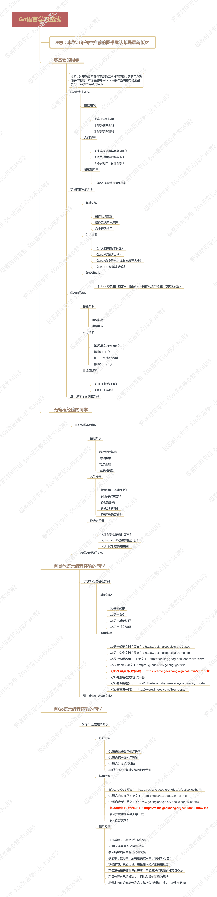
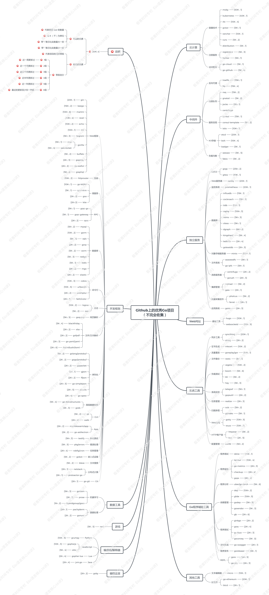
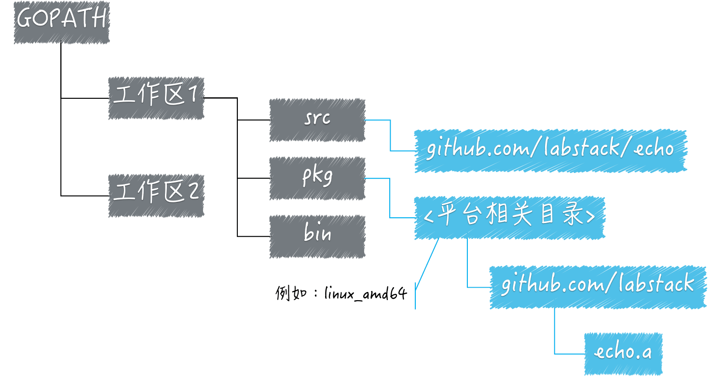
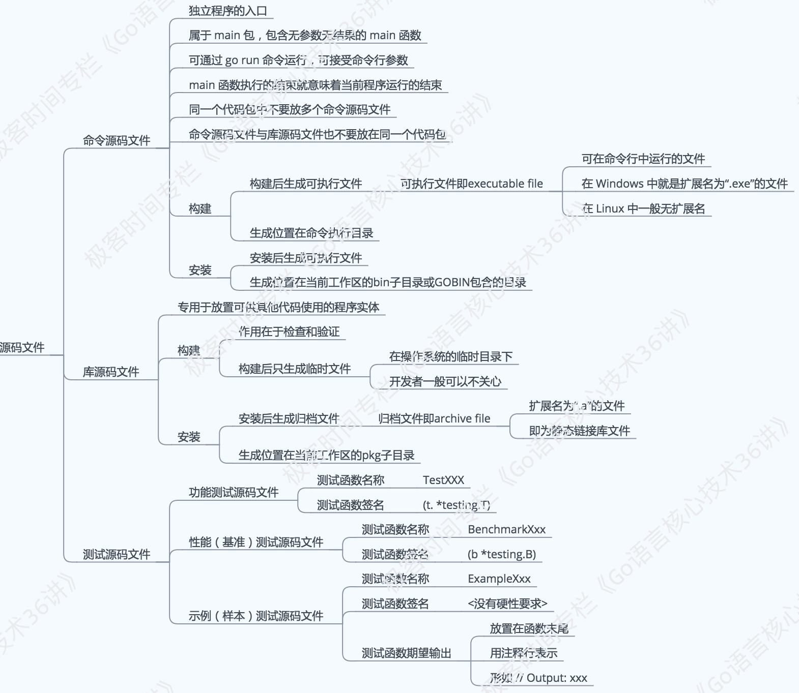

Go语言核心36讲
---

https://time.geekbang.org/column/intro/100013101

https://github.com/hyper0x/Golang_Puzzlers

发布时间：2018-11

### 作者

郝林，《Go 并发编程实战》作者，GoHackers 技术社群发起人，前轻松筹大数据负责人。


## 导读

Go 语言诞生： 2009 年 11 月 10 日

Go 程序可以在装有 Windows、Linux、FreeBSD 等操作系统的服务器上运行，并用于提供基础软件支撑、API 服务、Web 服务、网页服务等等。

Go 语言也在移动端进行了积极的探索，现在在 Android 和 iOS 上都可以运行其程序。另外，Go 语言也已经与 WebAssembly 强强联合，加入了 WASM 平台。这意味着过不了多久，互联网浏览器也可以运行 Go 编写的程序了。

从业务维度看，在云计算、微服务、大数据、区块链、物联网等领域，Go 语言早已蓬勃发展。有的使用率已经非常之高，有的已有一席之地。即使是在 Python 为王的数据科学和人工智能领域，Go 语言也在缓慢渗透，并初露头角。

从公司角度看，许多大厂都已经拥抱 Go 语言，包括以 Java 打天下的阿里巴巴，更别提深爱着 Go 语言的滴滴、今日头条、小米、奇虎 360、京东等明星公司。同时，创业公司也很喜欢 Go 语言，主要因为其入门快、程序库多、运行迅速，很适合快速构建互联网软件产品，比如轻松筹、快手、知乎、探探、美图、猎豹移动等等。


内容包括：

- 基础概念
- 数据类型和语句
- Go 程序的测试
- 标准库的用法
- Go 语言拾遗


### Go 语言学习路径




### 学习资源

https://github.com/golang/go

Go语言官网：https://golang.google.cn/

Go语言官网所有语法细节：https://golang.google.cn/ref/spec

[《Go 命令教程》](https://github.com/hyper0x/go_command_tutorial)

### 专栏应该怎样学

在第一次听音频或浏览文章的时候【粗读】，你可以走马观花，并不用去细扣每一个概念和每一句话。让自己对每一个主题、每一个问题和每一个要点都有一个大概的印象就可以了。

可以按照自己的节奏先粗读、再细读，然后再拿这个专栏当做知识手册来用。重要的是真正的理解和积极的实践，而不是阅读的速度。

### 实践的正确姿势🔖


“并发程序”“互联网络”“客户端”“网络爬虫”

### 优秀 Go 项目推荐



建议从“贴近你实际工作的那个方面”入手，然后可以是“你感兴趣的方面”，最后有机会再看其他的项目。千万不要贪多，要循序渐进着来。


## 模块一：Go语言基础知识


### 1 工作区和GOPATH

从 Go 1.5 版本的自举（即用 Go 语言编写程序来实现 Go 语言自身），到 Go 1.7 版本的极速 GC（也称垃圾回收器），再到 2018 年 2 月发布的 Go 1.10 版本对其自带工具的全面升级，以及可预见的后续版本关键特性（比如用来做程序依赖管理的go mod命令），这一切都令我们欢欣鼓舞。Go 语言在一步步走向辉煌的同时，显然已经成为软件工程师们最喜爱的编程语言之一。

#### 下载安装go

https://golang.google.cn/dl/

配置 3 个环境变量:

- GOROOT：Go 语言安装根目录的路径，也就是 GO 语言的安装路径。
- GOPATH：若干工作区目录的路径。是我们自己定义的工作空间。
- GOBIN：GO 程序生成的可执行文件（executable file）的路径。

```shell
$ vim ~/.zshrc
export GOROOT="/usr/local/go"
export GOPATH="/Users/andyron/myfield/go"
export GOBIN="$GOROOT/bin"
export PATH="$PATH:$GOBIN"
$ source ~/.zshrc
```


> GOPATH 背后的概念是最多的，也是最重要的。
>
> 可以把 GOPATH 简单理解成 Go 语言的工作目录，它的值是一个目录的路径，也可以是多个目录路径，每个目录都代表 Go 语言的一个工作区（workspace）。
>
> 需要利用这些工作区，去放置 Go 语言的源码文件（source file），以及安装（install）后的归档文件（archive file，也就是以“.a”为扩展名的文件）和可执行文件（executable file）。
>
> 事实上，由于 Go 语言项目在其生命周期内的所有操作（编码、依赖管理、构建、测试、安装等）基本上都是围绕着 GOPATH 和工作区进行的。所以，它的背后至少有 3 个知识点，分别是：
>
> 1. Go 语言源码的组织方式是怎样的；
> 2. 你是否了解源码安装后的结果（只有在安装后，Go 语言源码才能被我们或其他代码使用）；
> 3. 你是否理解构建和安装 Go 程序的过程（这在开发程序以及查找程序问题的时候都很有用，否则你很可能会走弯路）。


##### Go 语言源码的组织方式

与许多编程语言一样，Go 语言的源码也是以==代码包==为基本组织单位的。在文件系统中，这些代码包其实是与目录一一对应的。由于目录可以有子目录，所以代码包也可以有子包。

一个代码包中可以包含任意个以.go 为扩展名的源码文件，这些源码文件都需要被声明属于同一个代码包。

代码包的名称一般会与源码文件所在的目录同名。如果不同名，那么在构建、安装的过程中会以代码包名称为准。

每个代码包都会有==导入路径==。代码包的导入路径是其他代码在使用该包中的程序实体时，需要引入的路径。在实际使用程序实体之前，我们必须先导入其所在的代码包。具体的方式就是`import`该代码包的导入路径。就像这样：

```go
import "github.com/labstack/echo"
```

在工作区中，一个代码包的导入路径实际上就是从 src 子目录，到该包的实际存储位置的相对路径。

所以说，Go 语言源码的组织方式就是以环境变量**GOPATH、工作区、src 目录和代码包**为主线的。一般情况下，Go 语言的源码文件都需要被存放在环境变量 GOPATH 包含的某个工作区（目录）中的 src 目录下的某个代码包（目录）中。

##### 了解源码安装后的结果

> 源码文件以及安装后的结果文件都会放到哪里呢？
>
> 源码文件通常会被放在某个工作区的 `src` 子目录下。

那么在安装后如果产生了==归档文件==（以“`.a`”为扩展名的文件），就会放进该工作区的 `pkg` 子目录；如果产生了==可执行文件==，就可能会放进该工作区的 `bin` 子目录。

> 归档文件存放的具体位置和规则：
>
> 源码文件会以代码包的形式组织起来，一个代码包其实就对应一个目录。安装某个代码包而产生的归档文件是与这个代码包同名的。
>
> 放置它的相对目录就是该代码包的导入路径的直接父级。比如，一个已存在的代码包的导入路径是`github.com/labstack/echo`，那么执行命令`go install github.com/labstack/echo`，生成的归档文件的相对目录就是 `github.com/labstack` ，文件名为 echo.a 。

顺便说一下，上面这个代码包导入路径还有另外一层含义，那就是：该代码包的源码文件存在于 GitHub 网站的 labstack 组的代码仓库 echo 中。


归档文件的相对目录与 pkg 目录之间还有一级目录，叫做==平台相关目录==。平台相关目录的名称是由 `build`（也称“构建”）的**目标操作系统、下划线和目标计算架构的代号**组成的。

比如，构建某个代码包时的目标操作系统是 Linux，目标计算架构是 64 位的，那么对应的平台相关目录就是 `linux_amd64`。

因此，上述代码包的归档文件就会被放置在当前工作区的子目录 `pkg/linux_amd64/github.com/labstack` 中。



##### 理解构建和安装 Go 程序的过程

==构建==使用命令`go build`，==安装==使用命令go install。

构建和安装代码包的时候都会执行编译、打包等操作，并且，这些操作生成的任何文件都会先被保存到某个临时的目录中。

如果构建的是==库源码文件==，那么操作后产生的结果文件只会存在于==临时目录==中。这里的构建的主要意义在于==检查和验证==。

如果构建的是==命令源码文件==，那么操作的结果文件会被搬运到源码文件所在的目录中。

安装操作会先执行构建，然后还会进行==链接==操作，并且把结果文件搬运到指定目录。

进一步说，如果安装的是库源码文件，那么结果文件会被搬运到它所在工作区的 pkg 目录下的某个子目录中。如果安装的是命令源码文件，那么结果文件会被搬运到它所在工作区的 bin 目录中，或者环境变量GOBIN指向的目录中。

记住，构建和安装的不同之处，以及执行相应命令后得到的结果文件都会出现在哪里。


#### 思考题

> Go 语言在多个工作区中查找依赖包的时候是以怎样的顺序进行的？


> 如果在多个工作区中都存在导入路径相同的代码包会产生冲突吗？


#### 补充：go build 命令一些可选项的用途和用法🔖


### 2 命令源码文件

源码文件分为三种：命令源码文件、库源码文件和测试源码文件，它们都有着不同的用途和编写规则。




### 3 库源码文件

库源码文件是不能被直接运行的源码文件，它仅用于存放==程序实体==，这些程序实体可以被其他代码使用（只要遵从Go语言规范的话）。


### 4 程序实体的那些事儿（上）


### 5 程序实体的那些事儿（中）


### 6 程序实体的那些事儿（下）


## 模块二：Go语言进阶技术

### 7 数组和切片


### 8 container包中的那些容器


### 9 字典的操作和约束


### 10 通道的基本操作


### 11 通道的高级玩法


### 12 使用函数的正确姿势


### 13 结构体及其方法的使用法门


### 14 接口类型的合理运用


### 15 关于指针的有限操作


### 16 go语句及其执行规则（上）


### 17 go语句及其执行规则（下）


### 18 if语句、for语句和switch语句


### 19 错误处理（上）


### 20 错误处理 （下）


### 21 panic函数、recover函数以及defer语句 （上）


### 22 panic函数、recover函数以及defer语句（下）


## 模块三：Go语言实战与应用


### 23 测试的基本规则和流程 （上）


### 24 测试的基本规则和流程（下）


### 25 更多的测试手法


### 26 sync.Mutex与sync.RWMutex


### 27 条件变量sync.Cond （上）


### 28 条件变量sync.Cond （下）


### 29 原子操作（上）


### 30 原子操作（下）


### 31 sync.WaitGroup和sync.Once


### 32 context.Context类型


### 33 临时对象池sync.Pool


### 34 并发安全字典sync.Map （上）


### 35 并发安全字典sync.Map (下)


### 36 unicode与字符编码


### 37 strings包与字符串操作


### 38 bytes包与字节串操作（上）


### 39 bytes包与字节串操作（下）


### 40 io包中的接口和工具 （上）


### 41 io包中的接口和工具 （下）


### 42 bufio包中的数据类型 （上）


### 43 bufio包中的数据类型（下）


### 44 使用os包中的API （上）


### 45 使用os包中的API （下）


### 46 访问网络服务


### 47 基于HTTP协议的网络服务


### 48 程序性能分析基础（上）


### 49 程序性能分析基础（下）
