Go语言更多
------


参考：

1️⃣[《GO语言从入门到项目实践（超值版）》余建熙 2022](http://www.tup.tsinghua.edu.cn/bookscenter/book_09281301.html)

2️⃣[《Go语言开发实战（慕课版）》千锋教育高教产品研发部 2020](https://book.douban.com/subject/34956558/)

3️⃣[《Go语言从入门到项目实战（视频版）》](https://book.douban.com/subject/36049170/) 刘瑜 2022

4️⃣ [Go语言精进之路1](https://book.douban.com/subject/35720728/) [Go语言精进之路2](https://book.douban.com/subject/35720729/)  2021

# 补充1

## 47 Go标准库

参考：

https://www.topgoer.com/%E5%B8%B8%E7%94%A8%E6%A0%87%E5%87%86%E5%BA%93/

[Golang标准库案例](https://github.com/polaris1119/The-Golang-Standard-Library-by-Example)

### 47.1 IO

### 47.1 fmt包

#### 向外输出

##### Print系列

区别在于Print函数直接输出内容，Printf函数支持格式化输出字符串，Println函数会在输出内容的结尾添加一个换行符。

```go
func Print(a ...interface{}) (n int, err error)
func Printf(format string, a ...interface{}) (n int, err error)
func Println(a ...interface{}) (n int, err error)
```

##### Fprint系列

Fprint系列函数会将内容输出到一个io.Writer接口类型的变量w中，我们通常用这个函数往文件中写入内容。

```go
func Fprint(w io.Writer, a ...interface{}) (n int, err error)
func Fprintf(w io.Writer, format string, a ...interface{}) (n int, err error)
func Fprintln(w io.Writer, a ...interface{}) (n int, err error)
```

```go
// 向标准输出写入内容
fmt.Fprintln(os.Stdout, "向标准输出写入内容")
fileObj, err := os.OpenFile("./xx.txt", os.O_CREATE|os.O_WRONLY|os.O_APPEND, 0644)
if err != nil {
    fmt.Println("打开文件出错，err:", err)
    return
}
name := "枯藤"
// 向打开的文件句柄中写入内容
fmt.Fprintf(fileObj, "往文件中写如信息：%s", name)
```

注意，只要满足io.Writer接口的类型都支持写入。

##### Sprint系列

Sprint系列函数会把传入的数据生成并返回一个字符串。

```go
func Sprint(a ...interface{}) string
func Sprintf(format string, a ...interface{}) string
func Sprintln(a ...interface{}) string
```

##### Errorf

Errorf函数根据format参数生成格式化字符串并返回一个包含该字符串的错误。

```go
func Errorf(format string, a ...interface{}) error
```

通常使用这种方式来自定义错误类型，例如：

```go
err := fmt.Errorf("这是一个错误")
```

#### 格式化占位符

`*printf`系列函数都支持format格式化参数。

按照占位符将被替换的变量类型划分：

| 通用占位符               | 说明                                                         |
| ------------------------ | ------------------------------------------------------------ |
| %v                       | 值的默认格式表示                                             |
| %+v                      | 类似%v，但输出结构体时会添加字段名                           |
| %#v                      | 值的Go语法表示                                               |
| %T                       | 打印值的类型                                                 |
| %%                       | 百分号                                                       |
| **布尔占位符**           |                                                              |
| %t                       | true或false                                                  |
| **整型占位符**           |                                                              |
| %b                       | 表示为二进制                                                 |
| %c                       | 该值对应的unicode码值                                        |
| %d                       | 表示为十进制                                                 |
| %o                       | 表示为八进制                                                 |
| %x                       | 表示为十六进制，使用a-f                                      |
| %X                       | 表示为十六进制，使用A-F                                      |
| %U                       | 表示为Unicode格式：U+1234，等价于”U+%04X”                    |
| %q                       | 该值对应的单引号括起来的go语法字符字面值，必要时会采用安全的转义表示 |
| **浮点数与复数占位符**   |                                                              |
| %b                       | 无小数部分、二进制指数的科学计数法，如-123456p-78            |
| %e                       | 科学计数法，如-1234.456e+78                                  |
| %E                       | 科学计数法，如-1234.456E+78                                  |
| %f                       | 有小数部分但无指数部分，如123.456                            |
| %F                       | 等价于%f                                                     |
| %g                       | 根据实际情况采用%e或%f格式（以获得更简洁、准确的输出）       |
| %G                       | 根据实际情况采用%E或%F格式（以获得更简洁、准确的输出）       |
| **字符串和[]byte占位符** |                                                              |
| %s                       | 直接输出字符串或者[]byte                                     |
| %q                       | 该值对应的双引号括起来的go语法字符串字面值，必要时会采用安全的转义表示 |
| %x                       | 每个字节用两字符十六进制数表示（使用a-f                      |
| %X                       | 每个字节用两字符十六进制数表示（使用A-F）                    |
| **指针**                 |                                                              |
| %p                       | 表示为十六进制，并加上前导的0x                               |
|                          |                                                              |
|                          |                                                              |
|                          |                                                              |

##### 宽度标识符

| 占位符 | 说明               |
| ------ | ------------------ |
| %f     | 默认宽度，默认精度 |
| %9f    | 宽度9，默认精度    |
| %.2f   | 默认宽度，精度2    |
| %9.2f  | 宽度9，精度2       |
| %9.f   | 宽度9，精度0       |

示例代码如下：

```go
n := 88.88
fmt.Printf("%f\n", n)
fmt.Printf("%9f\n", n)
fmt.Printf("%.2f\n", n)
fmt.Printf("%9.2f\n", n)
fmt.Printf("%9.f\n", n)
```

输出结果如下：

```
    88.880000
    88.880000
    88.88
        88.88
           89
```

##### 其他falg

| 占位符 | 说明                                                         |
| ------ | ------------------------------------------------------------ |
| ’+’    | 总是输出数值的正负号；对%q（%+q）会生成全部是ASCII字符的输出（通过转义）； |
| ’ ‘    | 对数值，正数前加空格而负数前加负号；对字符串采用%x或%X时（% x或% X）会给各打印的字节之间加空格 |
| ’-’    | 在输出右边填充空白而不是默认的左边（即从默认的右对齐切换为左对齐）； |
| ’#’    | 八进制数前加0（%#o），十六进制数前加0x（%#x）或0X（%#X），指针去掉前面的0x（%#p）对%q（%#q），对%U（%#U）会输出空格和单引号括起来的go字面值； |
| ‘0’    | 使用0而不是空格填充，对于数值类型会把填充的0放在正负号后面； |

举个例子：

```go
s := "枯藤"
fmt.Printf("%s\n", s)
fmt.Printf("%5s\n", s)
fmt.Printf("%-5s\n", s)
fmt.Printf("%5.7s\n", s)
fmt.Printf("%-5.7s\n", s)
fmt.Printf("%5.2s\n", s)
fmt.Printf("%05s\n", s)
```

输出结果如下：

```
    枯藤
       枯藤
    枯藤
       枯藤
    枯藤
       枯藤
    000枯藤
```

#### 获取输入

fmt包下有fmt.Scan、fmt.Scanf、fmt.Scanln三个函数，可以在程序运行过程中从标准输入获取用户的输入。

##### fmt.Scan

```go
func Scan(a ...interface{}) (n int, err error)
```

```go
func main() {
    var (
        name    string
        age     int
        married bool
    )
    fmt.Scan(&name, &age, &married)
    fmt.Printf("扫描结果 name:%s age:%d married:%t \n", name, age, married)
}
```

fmt.Scan从标准输入中扫描用户输入的数据，将以空白符分隔的数据分别存入指定的参数。

##### fmt.Scanf

```go
func Scanf(format string, a ...interface{}) (n int, err error)
```

Scanf从标准输入扫描文本，根据format参数指定的格式去读取由空白符分隔的值保存到传递给本函数的参数中。

```go
func main() {
    var (
        name    string
        age     int
        married bool
    )
    fmt.Scanf("1:%s 2:%d 3:%t", &name, &age, &married)
    fmt.Printf("扫描结果 name:%s age:%d married:%t \n", name, age, married)
}
```

```
$ ./fmt3    
1:andy 2:19 3:true 
扫描结果 name:andy age:19 married:true 

```

fmt.Scanf不同于fmt.Scan简单的以空格作为输入数据的分隔符，fmt.Scanf为输入数据指定了具体的输入内容格式，只有按照格式输入数据才会被扫描并存入对应变量。

##### fmt.Scanln

```go
func Scanln(a ...interface{}) (n int, err error)
```

Scanln类似Scan，它在遇到换行时才停止扫描。最后一个数据后面必须有换行或者到达结束位置。

```go
func main() {
	var (
		name    string
		age     int
		married bool
	)
	fmt.Scanln(&name, &age, &married)
	fmt.Printf("扫描结果 name:%s age:%d married:%t \n", name, age, married)
}
```

```
./fmt4
李德胜 36 true
扫描结果 name:李德胜 age:36 married:true 
```

##### bufio.NewReader

想完整获取输入的内容，而输入的内容可能包含空格，这种情况下可以使用bufio包来实现。


##### Fscan系列

类似之前三个函数，只不过它们不是从标准输入中读取数据而是从io.Reader中读取数据。

```go
func Fscan(r io.Reader, a ...interface{}) (n int, err error)
func Fscanln(r io.Reader, a ...interface{}) (n int, err error)
func Fscanf(r io.Reader, format string, a ...interface{}) (n int, err error)
```

##### Sscan系列

不是从标准输入中读取数据而是从指定字符串中读取数据。

```go
func Sscan(str string, a ...interface{}) (n int, err error)
func Sscanln(str string, a ...interface{}) (n int, err error)
func Sscanf(str string, format string, a ...interface{}) (n int, err error)
```


### 47.2 文本


### 47.3 数据结构与算法

#### 排序

包`sort`

```go
Len()
Less
Reverse
Swap

Sort()
IsSorted()
Search()
// sort包原生支持[]int、[]float64 和[]string 三种内建数据类型切片的排序操作
IntSlice
Float64Slice
StringSlice

func Float64s(a []float64)  
func Float64sAreSorted(a []float64) bool
func SearchFloat64s(a []float64, x float64) int

func Strings(a []string)
func StringsAreSorted(a []string) bool
func SearchStrings(a []string, x string) int
```


`[]interface` 排序与查找

```go
func Slice(slice interface{}, less func(i, j int) bool) 
func SliceStable(slice interface{}, less func(i, j int) bool) 
func SliceIsSorted(slice interface{}, less func(i, j int) bool) bool 
func Search(n int, f func(int) bool) int
```


#### 容器

包`container`


### 47.4 日期和时间

Go 语言通过标准库 `time` 包处理日期和时间相关的问题。

`time` 包提供了时间的显示和计量用的功能。日历的计算采用的是公历。提供的主要类型：

- `Location`，代表一个地区，并表示该地区所在的时区（可能多个）。`Location` 通常代表地理位置的偏移，比如 CEST 和 CET 表示中欧。

- `Time`，代表一个纳秒精度的时间点，是公历时间。

- `Duration`，代表两个时间点之间经过的时间，以纳秒为单位。可表示的最长时间段大约 290 年，也就是说如果两个时间点相差超过 290 年，会返回 290 年，也就是 minDuration(-1 << 63) 或 maxDuration(1 << 63 - 1)。

  类型定义：`type Duration int64`。

  将 `Duration` 类型直接输出时，因为实现了 `fmt.Stringer` 接口，会输出人类友好的可读形式，如：72h3m0.5s。

- `Timer` 和 `Ticker`，定时器相关类型

- `Weekday` 和 `Month`，原始类型都是 int，实现 `fmt.Stringer` 接口，方便输出。

  

47.2 time包


#### 时间类型


#### 时间戳


##### 时间间隔


##### 时间操作

```
Add
Sub
Equal
Before
After
```

##### 定时器

使用time.Tick(时间间隔)来设置定时器，定时器的本质上是一个通道（channel）。

```go
func tickDemo() {
    ticker := time.Tick(time.Second) //定义一个1秒间隔的定时器
    for i := range ticker {
        fmt.Println(i)//每秒都会执行的任务
    }
}
```

##### 时间格式化

Go语言中格式化时间模板不是常见的Y-m-d H:M:S而是使用Go的诞生时间2006年1月2号15点04分（记忆口诀为2006 1 2 3 4）。

### 47.5 基本数学函数

`math`

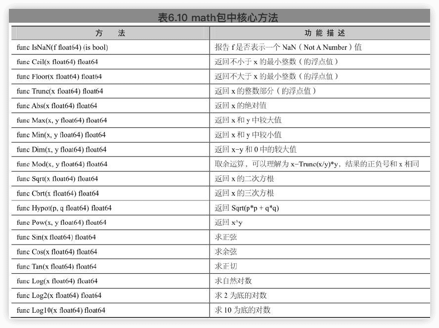


math 包实现的就是数学函数计算。

#### 三角函数 ####

正弦函数，反正弦函数，双曲正弦，反双曲正弦

```go
- func Sin(x float64) float64
- func Asin(x float64) float64
- func Sinh(x float64) float64
- func Asinh(x float64) float64
```

一次性返回 sin,cos

- func Sincos(x float64) (sin, cos float64)

余弦函数，反余弦函数，双曲余弦，反双曲余弦

```go
- func Cos(x float64) float64
- func Acos(x float64) float64
- func Cosh(x float64) float64
- func Acosh(x float64) float64
```

正切函数，反正切函数，双曲正切，反双曲正切

```go
- func Tan(x float64) float64
- func Atan(x float64) float64 和 func Atan2(y, x float64) float64
- func Tanh(x float64) float64
- func Atanh(x float64) float64
```

#### 幂次函数 ####

```go
- func Cbrt(x float64) float64 // 立方根函数
- func Pow(x, y float64) float64  // x 的幂函数
- func Pow10(e int) float64 // 10 根的幂函数
- func Sqrt(x float64) float64 // 平方根
- func Log(x float64) float64 // 对数函数
- func Log10(x float64) float64 // 10 为底的对数函数
- func Log2(x float64) float64  // 2 为底的对数函数
- func Log1p(x float64) float64 // log(1 + x)
- func Logb(x float64) float64 // 相当于 log2(x) 的绝对值
- func Ilogb(x float64) int // 相当于 log2(x) 的绝对值的整数部分
- func Exp(x float64) float64 // 指数函数
- func Exp2(x float64) float64 // 2 为底的指数函数
- func Expm1(x float64) float64 // Exp(x) - 1
```

#### 特殊函数 ####

```go
- func Inf(sign int) float64  // 正无穷
- func IsInf(f float64, sign int) bool // 是否正无穷
- func NaN() float64 // 无穷值
- func IsNaN(f float64) (is bool) // 是否是无穷值
- func Hypot(p, q float64) float64 // 计算直角三角形的斜边长
```

#### 类型转化函数 ####

```go
- func Float32bits(f float32) uint32  // float32 和 unit32 的转换
- func Float32frombits(b uint32) float32 // uint32 和 float32 的转换
- func Float64bits(f float64) uint64 // float64 和 uint64 的转换
- func Float64frombits(b uint64) float64 // uint64 和 float64 的转换
```

#### 其他函数 ####

```go
- func Abs(x float64) float64 // 绝对值函数
- func Ceil(x float64) float64  // 向上取整
- func Floor(x float64) float64 // 向下取整
- func Mod(x, y float64) float64 // 取模
- func Modf(f float64) (int float64, frac float64) // 分解 f，以得到 f 的整数和小数部分
- func Frexp(f float64) (frac float64, exp int) // 分解 f，得到 f 的位数和指数
- func Max(x, y float64) float64  // 取大值
- func Min(x, y float64) float64  // 取小值
- func Dim(x, y float64) float64 // 复数的维数
- func J0(x float64) float64  // 0 阶贝塞尔函数
- func J1(x float64) float64  // 1 阶贝塞尔函数
- func Jn(n int, x float64) float64 // n 阶贝塞尔函数
- func Y0(x float64) float64  // 第二类贝塞尔函数 0 阶
- func Y1(x float64) float64  // 第二类贝塞尔函数 1 阶
- func Yn(n int, x float64) float64 // 第二类贝塞尔函数 n 阶
- func Erf(x float64) float64 // 误差函数
- func Erfc(x float64) float64 // 余补误差函数
- func Copysign(x, y float64) float64 // 以 y 的符号返回 x 值
- func Signbit(x float64) bool // 获取 x 的符号
- func Gamma(x float64) float64 // 伽玛函数
- func Lgamma(x float64) (lgamma float64, sign int) // 伽玛函数的自然对数
- func Ldexp(frac float64, exp int) float64 // value 乘以 2 的 exp 次幂
- func Nextafter(x, y float64) (r float64) // 返回参数 x 在参数 y 方向上可以表示的最接近的数值，若 x 等于 y，则返回 x
- func Nextafter32(x, y float32) (r float32) // 返回参数 x 在参数 y 方向上可以表示的最接近的数值，若 x 等于 y，则返回 x
- func Remainder(x, y float64) float64 // 取余运算
- func Trunc(x float64) float64 // 截取函数
```

### 47.6 文件系统

Go 的标准库提供了很多工具，可以处理文件系统中的文件、构造和解析文件名等。

处理文件的第一步是确定要处理的文件的名字。Go 将文件名表示为简单的字符串，提供了 `path`、`filepath` 等库来操作文件名或路径。用 `os` 中 `File` 结构的 `Readdir` 可以列出一个目录中的内容。

可以用 `os.Stat` 或 `os.Lstat` 来检查文件的一些特性，如权限、大小等。

有时需要创建草稿文件来保存临时数据，或将数据移动到一个永久位置之前需要临时文件存储，`os.TempDir` 可以返回默认的临时目录，用于存放临时文件。关于临时文件，在 `ioutil` 中已经讲解了。

`os` 包还包含了很多其他文件系统相关的操作，比如创建目录、重命名、移动文件等等。

> `os` 包中还有关于进程相关知识。

#### `os` — 平台无关的操作系统功能实现

`os` 包提供了平台无关的操作系统功能接口。尽管错误处理是 go 风格的，但设计是 Unix 风格的；所以，失败的调用会返回 `error` 而非错误码。通常 `error` 里会包含更多信息。例如，如果使用一个文件名的调用（如 Open、Stat）失败了，打印错误时会包含该文件名，错误类型将为 `*PathError`，其内部可以解包获得更多信息。

os 包规定为所有操作系统实现的接口都是一致的。有一些某个系统特定的功能，需要使用 `syscall` 获取。实际上，`os` 依赖于 `syscall`。在实际编程中，我们应该总是优先使用 `os` 中提供的功能，而不是 `syscall`。


#### `path/filepath` — 兼容操作系统的文件路径操作

##### 解析路径名字符串


##### 相对路径和绝对路径


##### 路径的切分和拼接


##### 规整化路径


##### 符号链接指向的路径名


##### 文件路径匹配


##### 遍历目录


##### Windows 起作用的函数


##### 关于 path 包


#### io/fs — 抽象文件系统

Go 语言从 1.16 开始增加了 io/fs 包，该包定义了一个文件系统需要的相关基础接口，因此我们称之为抽象文件系统。该文件系统是层级文件系统或叫树形文件系统，Unix 文件系统就是这种类型。


### 47.7 数据持久存储与交换

现代程序离不开数据存储，现阶段很热的所谓大数据处理、云盘等，更是以存储为依托。有数据存储，自然需要进行数据交换，已达到数据共享等目的。

关系型数据库发展了很长一段时间，SQL/SQL-like 已经很成熟，使用也很广泛，Go 语言标准库提供了对 SQL/SQL-like 数据库的操作的标准接口，即 [database/sql](http://docs.studygolang.com/pkg/database/sql) 包。

在数据交换方面，有很多成熟的协议可以使用，常用的有：JSON、XML 等，似乎 Java 社区更喜欢 XML，而目前似乎使用更多的是 JSON。在交换协议选择方面，考虑的主要这几个方面因素：性能、跨语言（通用性）、传输量等。因此，对于性能要求高的场景，会使用 protobuf、msgpack 之类的协议。由于 JSON 和 XML 使用很广泛，Go 语言提供了解析它们的标准库；同时，为了方便 Go 程序直接数据交换，Go 专门提供了 [gob](http://docs.studygolang.com/pkg/) 这种交换协议。

#### `database/sql` — SQL/SQL-Like 数据库操作接口


#### `encoding/csv` — 逗号分隔值文件


### 47.8 数据压缩与归档


---


### 47.3 flag包

```go
func main() {
	if len(os.Args) > 0 {
		for index, arg := range os.Args {
			fmt.Printf("args[%d]=%v\n", index, arg)
		}
	}
}
```

```
./flag1 a b c d
args[0]=./flag1
args[1]=a
args[2]=b
args[3]=c
args[4]=d
```

#### flag参数类型

flag包支持的命令行参数类型有bool、int、int64、uint、uint64、float float64、string、duration。

| flag参数     | 有效值                                                       |
| ------------ | ------------------------------------------------------------ |
| 字符串flag   | 合法字符串                                                   |
| 整数flag     | 1234、0664、0x1234等类型，也可以是负数。                     |
| 浮点数flag   | 合法浮点数                                                   |
| bool类型flag | 1, 0, t, f, T, F, true, false, TRUE, FALSE, True, False。    |
| 时间段flag   | 任何合法的时间段字符串。如”300ms”、”-1.5h”、”2h45m”。 合法的单位有”ns”、”us” /“µs”、”ms”、”s”、”m”、”h”。 |

#### 两种定义命令行flag参数的方法

##### flag.Type()

`flag.Type(flag名, 默认值, 帮助信息)*Type`

```go
name := flag.String("name", "张三", "姓名")
age := flag.Int("age", 18, "年龄")
married := flag.Bool("married", false, "婚否")
delay := flag.Duration("d", 0, "时间间隔")
```

此时name、age、married、delay均为对应类型的指针。

##### flag.TypeVar()

`flag.TypeVar(Type指针, flag名, 默认值, 帮助信息)`

```go
var name string
var age int
var married bool
var delay time.Duration
flag.StringVar(&name, "name", "张三", "姓名")
flag.IntVar(&age, "age", 18, "年龄")
flag.BoolVar(&married, "married", false, "婚否")
flag.DurationVar(&delay, "d", 0, "时间间隔")
```


#### 其他函数

##### flag.Parse()

定义好命令行flag参数后，需要通过调用flag.Parse()来对命令行参数进行解析。

支持的命令行参数格式有以下几种：

- -flag xxx （使用空格，一个-符号）
- --flag xxx （使用空格，两个-符号）
- -flag=xxx （使用等号，一个-符号）
- --flag=xxx （使用等号，两个-符号）

其中，布尔类型的参数必须使用等号的方式指定。

Flag解析在第一个非flag参数（单个”-“不是flag参数）之前停止，或者在终止符”–“之后停止。


- flag.Args() ////返回命令行参数后的其他参数，以[]string类型
- flag.NArg() //返回命令行参数后的其他参数个数
- flag.NFlag() //返回使用的命令行参数个数

#### 使用案例

```go
func main() {
	// //定义命令行参数方式
	var name string
	var age int
	var married bool
	var delay time.Duration
	flag.StringVar(&name, "name", "andyron", "姓名")
	flag.IntVar(&age, "age", 18, "年龄")
	flag.BoolVar(&married, "married", false, "婚否")
	flag.DurationVar(&delay, "d", 0, "延迟的时间间隔")

	// 解析命令行参数
	flag.Parse()
	fmt.Println(name, age, married, delay)
	// 返回命令行参数后的其他参数
	fmt.Println(flag.Args())
	// 返回命令行参数后的其他参数个数
	fmt.Println(flag.NArg())
	// 返回使用的命令行参数个数
	fmt.Println(flag.NFlag())
}
```


命令行参数使用提示：

```shell
./flag_demo -help
Usage of ./flag_demo:
  -age int
        年龄 (default 18)
  -d duration
        延迟的时间间隔
  -married
        婚否
  -name string
        姓名 (default "andyron")
```

正常使用命令行flag参数：

```shell
$ ./flag_demo -name pprof -age 19 -married=false -d=24s
pprof 19 false 24s
[]
0
4
```

使用非flag命令行参数：

```shell
$ ./flag_demo a c d
andyron 18 false 0s
[a c d]
3
0
```


### 47.4 strings包——字符串处理


#### 检索字符串

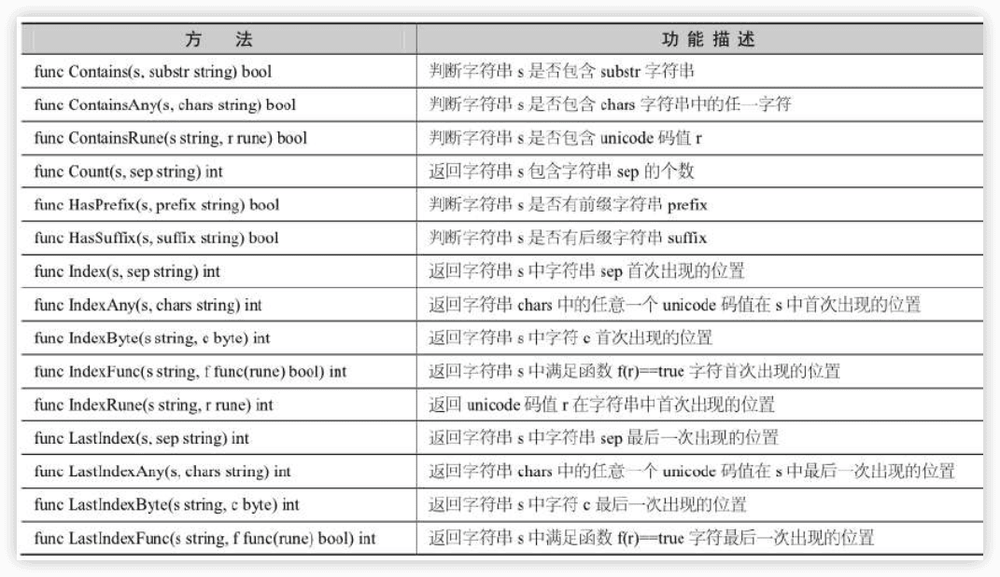

#### 分割字符串

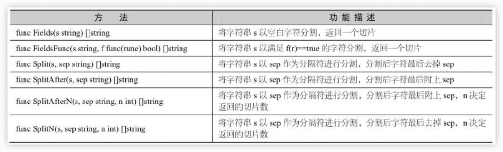


#### 大小写转换

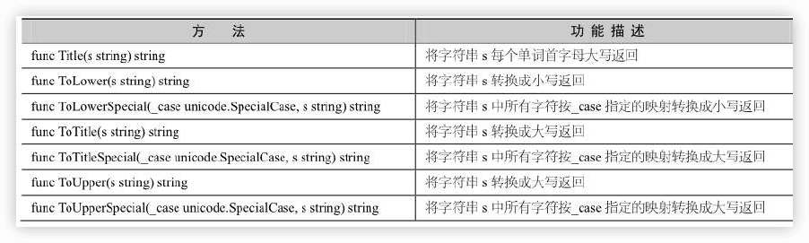

#### 修剪字符串

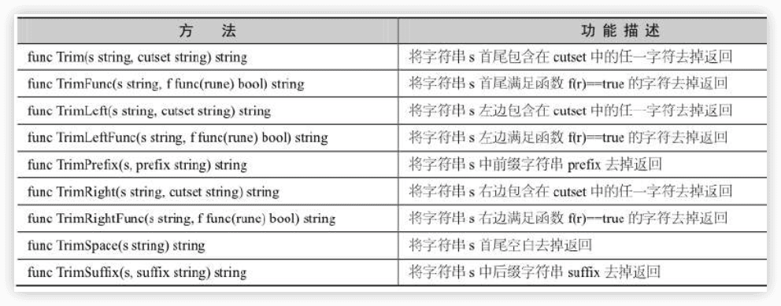

#### 比较字符串

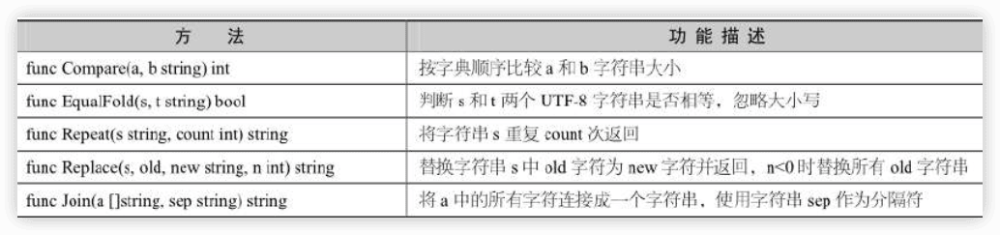


### 47.5 strconv包

字符串与其他基本数据类型之间的类型转换。

#### Parse类函数

Parse类函数主要的功能是将字符串转换为其他类型。

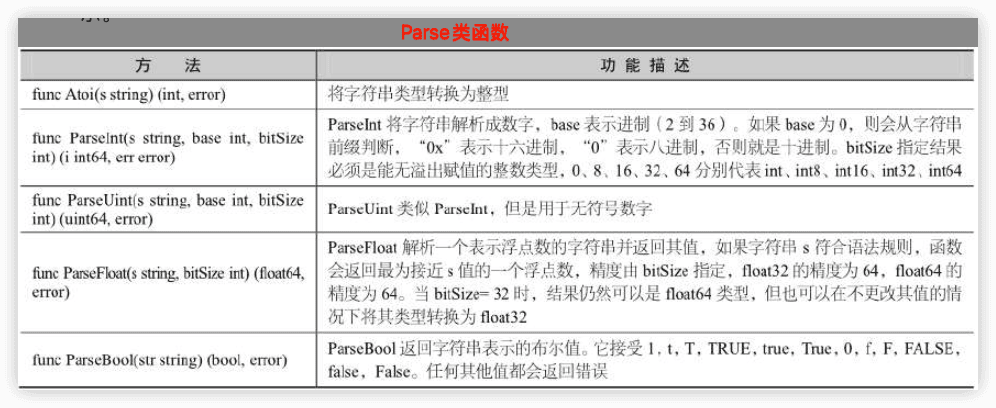


#### Format类函数

Format类函数主要的功能是将其他类型格式化成字符串。


### 47.6 regexp正则表达式包

#### 正则表达式中主要元字符

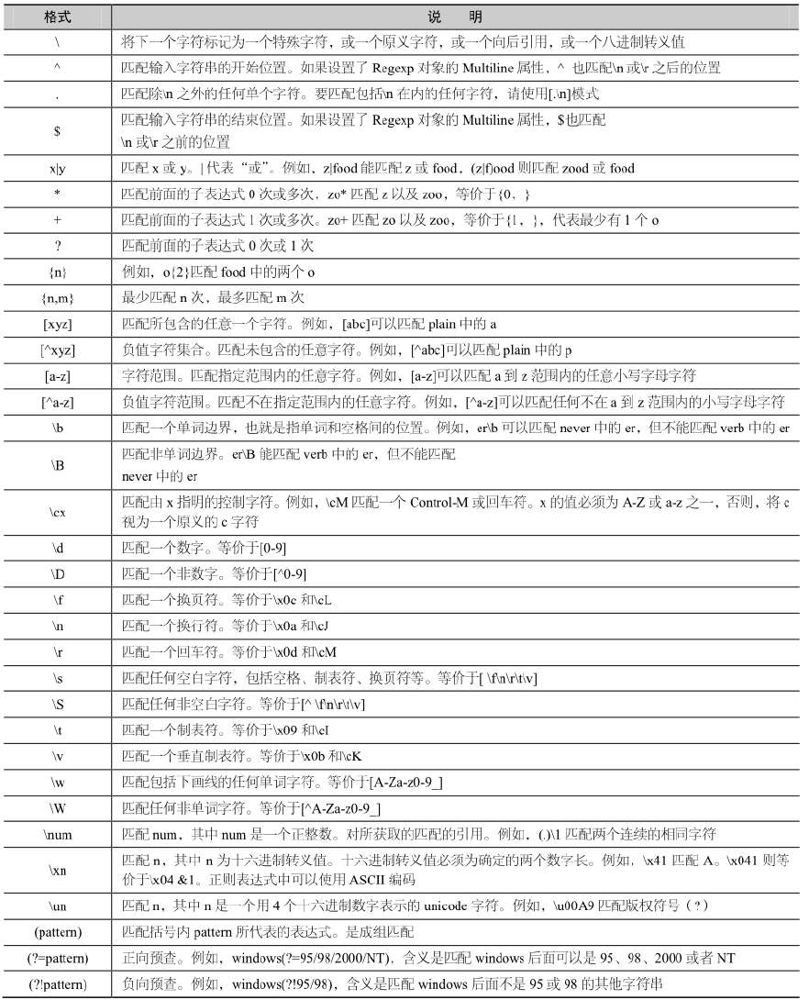

#### regexp包中核心函数及方法

🔖


### 47.8 随机数

“math/rand”包实现了伪随机数生成器，能够生成整型和浮点型的随机数。使用随机数生成器需要放入种子。可以使用Seed()函数生成一个不确定的种子放入随机数生成器，这样每次运行随机数生成器都会生成不同的序列。如果没有在随机数生成器中放入种子，则默认使用具有确定性状态的种子，此时可以理解为种子的值是一个常数1，即Seed(1)。

#### rand包的核心方法

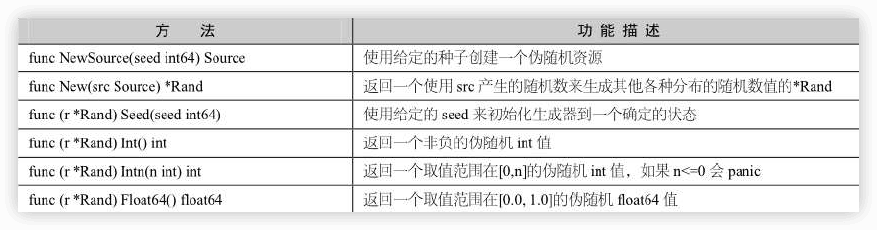

#### 获取随机数的几种方式


### 47.9 log


其它

`log/slog`

第三方日志库

[zap](https://github.com/uber-go/zap)

[logrus](https://github.com/appleboy/gorush)

https://github.com/rs/zerolog


### net包

net/http


### 文件操作相关

os包

io/ioutil 包


### 并发相关

**`sync` 包**

**`context` 包**


### 数据结构与算法相关

**`sort` 包**

**`container` 目录下的相关包（如 `list`、`map`、`heap` 等）**


### template


### encoding

数据格式：JSON、XML、MSGPack等


### reflect反射


## 48 反射

参考：《Go语言从入门到项目实战》-10

反射是指在程序运行期对程序本身进行访问和修改的能力。程序在编译时，变量被转换为内存地址，变量名不会被编译器写入可执行部分。在运行程序时，程序无法获取自身的信息。

支持反射的语言可以在程序编译期将变量的反射信息，如字段名称、类型信息、结构体信息等整合到可执行文件中，并给程序提供接口访问反射信息，这样就可以在程序运行期获取类型的反射信息，并且有能力修改它们。

Go语言程序在运行期使用reflect包访问程序的反射信息。

### 48.1　使用反射访问变量

`reflect`包

#### 获取变量的类型

#### 获取变量的值

#### 反射值的非空和有效性判定


### 48.2 反射值的非空和有效性判定


### 48.3 使用反射访问结构体


### 48.4 使用反射修改值


### 48.5 使用反射调用函数


### 48.6 使用反射创建变量


## 48-2 反射2

ref：[Go语言精进之路2](https://book.douban.com/subject/35720729/) 59条

反射是程序在运行时访问、检测和修改它本身状态或行为的一种能力，各种编程语言所实现的反射机制各有不同。

Go语言的`interface{}`类型变量具有析出任意类型变量的类型信息（type）和值信息（value）的能力，Go的反射本质上就是**利用interface{}的这种能力在运行时对任意变量的==类型和值信息==进行检视甚至是对值进行修改的机制**。

### 1 Go反射的三大法则

反射让静态类型语言Go在运行时具备了某种基于类型信息的**动态特性**。

利用这种特性，fmt.Println在无法提前获知传入参数的真正类型的情况下依旧可以对其进行正确的格式化输出；

json.Marshal也是通过这种特性对传入的任意结构体类型进行解构并正确生成对应的JSON文本。

通过一个简单的构建SQL查询语句的例子来直观感受Go反射的“魔法”:

```go
func main() {
	stmt, err := ConstructQueryStmt(&Product{})
	if err != nil {
		fmt.Println("construct query stmt for Product error: ", err)
		return
	}
	fmt.Println(stmt)

	stmt, err = ConstructQueryStmt(Person{})
	if err != nil {
		fmt.Println("construct query stmt for Person error: ", err)
		return
	}
	fmt.Println(stmt)
}

// ConstructQueryStmt 参数是结构体实例，得到的是该结构体对应的表的数据查询语句文本
// 采用了一种ORM（Object Relational Mapping，对象关系映射）风格的实现。
// ConstructQueryStmt通过反射获得传入的参数obj的类型信息，包括（导出）字段数量、字段名、字段标签值等，并根据这些类型信息生成SQL查询语句文本。如果结构体字段带有orm标签，该函数会使用标签值替代默认列名（字段名）。
func ConstructQueryStmt(obj any) (stmt string, err error) {
	// 仅支持struct或struct指针类型
	typ := reflect.TypeOf(obj)
	if typ.Kind() == reflect.Ptr {
		typ = typ.Elem()
	}
	if typ.Kind() != reflect.Struct {
		err = errors.New("only struct is supported")
		return
	}

	buffer := bytes.NewBufferString("")
	buffer.WriteString("SELECT ")

	if typ.NumField() == 0 {
		fmt.Errorf("the type[%s] has no fields", typ.Name())
		return
	}

	for i := 0; i < typ.NumField(); i++ {
		field := typ.Field(i)

		if i != 0 {
			buffer.WriteString(", ")
		}
		column := field.Name
		if tag := field.Tag.Get("orm"); tag != "" {
			column = tag
		}

		buffer.WriteString(column)
	}

	stmt = fmt.Sprintf("%s FROM %s", buffer.String(), typ.Name())
	return
}

type Product struct {
	ID        uint32
	Name      string
	Price     uint32
	LeftCount uint32 `orm:"left_count"`
	Batch     string `orm:"batch_number"`
	Updated   time.Time
}

type Person struct {
	ID      string
	Name    string
	Age     uint32
	Gender  string
	Addr    string `orm:"address"`
	Updated time.Time
}
```

Go反射十分适合处理这一类问题，典型特点：

- 输入参数的类型无法提前确定；
- 函数或方法的处理结果因传入参数（的类型信息和值信息）的不同而异。

反射在带来强大功能的同时，也是很多困扰你的问题的根源，比如：

- 反射让你的代码逻辑看起来不那么清晰，难于理解；
- 反射让你的代码运行得更慢；
- 在编译阶段，编译器无法检测到使用反射的代码中的问题（这种问题只能在Go程序运行时暴露出来，并且一旦暴露，很大可能会导致运行时的panic）。

Rob Pike还为Go反射的规范使用定义了三大法则，如果经过评估，你必须使用反射才能实现你要的功能特性，那么你在使用反射时需要牢记这三条法则。

- 反射世界的入口：经由接口（interface{}）类型变量值进入反射的世界并获得对应的反射对象（reflect.Value或reflect.Type）。
- 反射世界的出口：反射对象（reflect.Value）通过化身为一个接口（interface{}）类型变量值的形式走出反射世界。
- 修改反射对象的前提：反射对象对应的reflect.Value必须是可设置的（**Settable**）。

前两条法则可以用下图来表示：

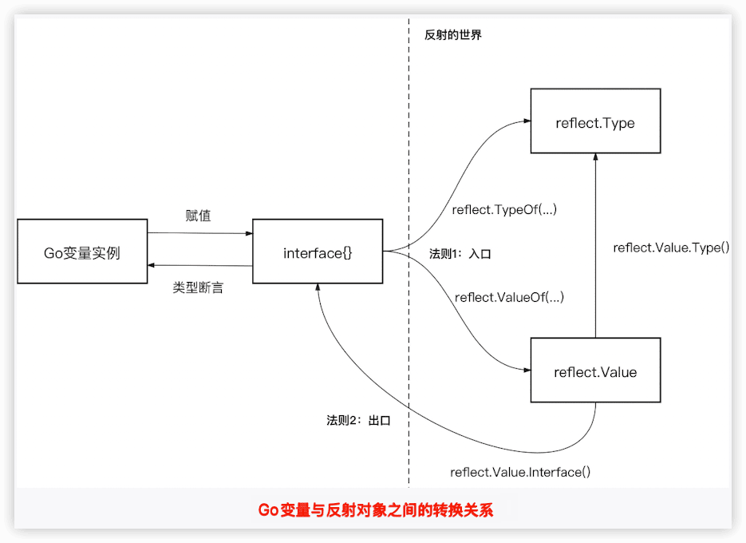

### 2 反射世界的入口

`reflect.TypeOf`和`reflect.ValueOf`是进入反射世界仅有的两扇“大门”。

通过reflect.TypeOf这扇“门”进入反射世界，你将得到一个reflect.Type对象，该对象中包含了被反射的Go变量实例的**所有类型信息**；

而通过reflect.ValueOf这扇“门”进入反射世界，你将得到一个reflect.Value对象。**`Value`对象是反射世界的核心**，不仅该对象中包含了被反射的Go变量实例的值信息，而且通过调用该对象的Type方法，我们还可以得到Go变量实例的类型信息，这与通过reflect.TypeOf获得类型信息是等价的：

```go
// reflect.ValueOf().Type()等价于reflect.TypeOf()
var i int = 5
val := reflect.ValueOf(i)
typ := reflect.TypeOf(i)
fmt.Println(reflect.DeepEqual(typ, val.Type())) // true
```


### 3 反射世界的出口

reflect.Value.Interface()是reflect.ValueOf()的逆过程，通过Interface方法我们可以将reflect.Value对象恢复成一个interface{}类型的变量值。这个离开反射世界的过程实质是将reflect.Value中的类型信息和值信息重新打包成一个interface{}的内部表示。之后，我们就可以通过类型断言得到一个反射前的类型变量值


### 4 输出参数、interface{}类型变量及反射对象的可设置性

reflect.Value提供了CanSet、CanAddr及CanInterface等方法来帮助我们判断反射对象是否可设置（Settable）、可寻址、可恢复为一个interface{}类型变量。


- 当被反射对象以值类型（T）传递给reflect.ValueOf时，所得到的反射对象（Value）是不可设置和不可寻址的。
- 当被反射对象以指针类型（`*T`或`&T`）传递给reflect.ValueOf时，通过reflect.Value的Elem方法可以得到代表该指针所指内存对象的Value反射对象。而这个反射对象是可设置和可寻址的，对其进行修改（比如利用Value的SetInt方法）将会像函数的输出参数那样直接修改被反射对象所指向的内存空间的值。
- 当传入结构体或数组指针时，通过Field或Index方法得到的代表结构体字段或数组元素的Value反射对象也是可设置和可寻址的。如果结构体中某个字段是非导出字段，则该字段是可寻址但不可设置的（比如上面例子中的age字段）。
- 当被反射对象的静态类型是接口类型时（就像上面的interface{}类型变量i），该被反射对象的动态类型决定了其进入反射世界后的可设置性。如果动态类型为`*T`或`&T`时，就像上面传给变量i的是`&Person{}`，那么通过Elem方法获得的反射对象就是可设置和可寻址的。
- map类型被反射对象比较特殊，它的key和value都是不可寻址和不可设置的。但我们可以通过Value提供的SetMapIndex方法对map反射对象进行修改，这种修改会同步到被反射的map变量中。


## 49 命令行工具

### 49.1 模块管理与依赖控制

#### `go mod`

包管理系统

- 初始化模块：`go mod init <模块名>` 创建 go.mod 文件，定义模块路径和版本
- 依赖整理：`go mod tidy` 自动清理未使用的依赖，同步 go.mod 与实际代码的依赖关系
- 离线构建：`go mod vendor` 将依赖复制到本地 vendor 目录，支持无网络环境编译
- 查看模块依赖图：`go mod graph`

#### `go get`

- 安装远程包：`go get github.com/example/包名` 自动下载并安装到 `$GOPATH/pkg/mod`
- 更新依赖：go get -u 强制更新包至最新版本，需注意版本兼容性风险


### 49.2 开发与构建

#### `go build`

将Go源文件编译为可执行文件（不运行）:

```
go build main.go
```

编译整个模块：

```sh
go build
```

go build命令常用参数：

```
-v 编译时显示包名
-p n 指定编译时并发的数量（使用n表示），该值默认为CPU 的逻
-a 强制进行重新构建
-n 仅输出编译时执行的所有命令
-x 执行编译并输出编译时执行的所有命令
-race 开启竞态检测
```


- **基本编译**：`go build main.go` 生成可执行文件（默认与目录同名）
- **优化体积**：go build -ldflags "-s -w" 移除符号表和调试信息，减少二进制文件大小
- **交叉编译**：GOOS=linux GOARCH=amd64 go build 生成跨平台二进制文件

#### `go run`

编译并立即运行Go程序，适合快速测试。

执行go run命令时也会编译Go源码文件，但生成的可执行文件被存放在临时目录中，并自动运行这个可执行文件。

```go
func main() {
	fmt.Println(os.Args)
}
```

```sh
go run main.go -color blue
[/var/folders/8k/ntbhdf615p34cflx1_qwv38r0000gn/T/go-build692689547/b001/exe/main -color blue]
```

#### `go install`

编译并安装命令Go程序或包:

```go
go install
```

生成的可执行文件会被放到 `$GOPATH/bin` 或模块模式下的 `GOBIN` 路径中。


### 49.3 代码质量与测试

#### `go test`

- 单元测试：自动执行 `_test.go` 文件中以 Test 开头的函数
- 覆盖率分析：`go test -coverprofile=cover.out` 生成代码覆盖率报告，通过 `go tool cover -html=cover.out` 可视化
- 基准测试：`go test -bench=.` 运行以 Benchmark 开头的性能测试函数

#### `go vet`

- 静态检查：`go vet ./...` 检测代码中的潜在错误（如未使用的变量、错误格式化字符串）

#### `go fmt`

对Go源代码进行格式化，符合Go的官方风格：

```go
go fmt main.go
```

现在Goland可以自动完成。


### 49.4 系统交互与调试

#### `go version`

#### `go env`

- 查看环境变量：`go env` 显示 GOPATH、GOROOT 等关键配置
- 动态修改：`go env -w GOPROXY=https://goproxy.cn` 设置国内镜像加速依赖下载

#### `go list`

- 依赖图谱：`go list -m all` 列出当前模块所有依赖关系

### 49.5 辅助工具

#### `go clean`

清理所有编译生成的文件，具体包括：

1. 当前目录下生成的与包名或Go源码文件名相同的可执行文件，以及当前目录中的_obj和_test目录中名称为_testmain.go、test.out、build.out、a.out及后缀为.5、.6、.8、.a、.o和.so的文件。这些文件通常是执行go build命令后生成的。
2. 以当前目录下生成的包名加“.test”后缀为名的文件。这些文件通常是执行go test命令后生成的。
3. 工作区中pkg和bin目录的相应归档文件和可执行文件。这些文件通常是执行go install命令后生成的。

go clean命令通常用于使用VCS（版本控制系统，如Git）的团队，在提交代码前运行，以免将编译时生成的临时文件及编译后生成的可执行文件等错误地提交到代码仓库中。

```
-i	清除关联的安装包和可运行文件，这些文件通常是执行 gQ install 命令后生成的
-n	仅输出清理时执行的所有命令
-r	递归清除在 import 中引入的包
-x	执行清理并输出清理时执行的所有命令
-cache	清理缓存，这些缓存文件通常是执行go build命令后生成的
-testcache	清理测试结果
```


- 清理构建产物：`go clean -modcache` 删除模块缓存，`go clean -x` 显示清理过程细节


#### `go doc`

- 文档查询：`go doc fmt.Printf` 查看标准库函数文档

```sh
go doc net/http
go doc http

go doc http.Get

go doc http.Request.Form
```

- 查看当前项目文档

查看当前路径下的包的文档：

```sh
$ go doc
```

查看当前路径下包的导出元素的文档：

```sh
$ go doc core 
package core // import "github.com/flipped-aurora/gin-vue-admin/server/core"

func RunWindowsServer()
func Viper() *viper.Viper
func Zap() (logger *zap.Logger)
```

非导出元素的文档：

```sh
$ go doc -u core
package core // import "github.com/flipped-aurora/gin-vue-admin/server/core"

func RunWindowsServer()
func Viper() *viper.Viper
func Zap() (logger *zap.Logger)
func getConfigPath() (config string)
type server interface{ ... }
    func initServer(address string, router *gin.Engine) server
```

- 查看项目依赖的第三方module的文档

`go doc`在查看项目依赖的第三方module的文档时，会自动到go mod cache中找到该module（已经下载到本地的），并显示其文档：

```sh
$ go doc github.com/casbin/casbin/v2
package casbin // import "github.com/casbin/casbin/v2"

func CasbinJsGetPermissionForUser(e IEnforcer, user string) (string, error)
func CasbinJsGetPermissionForUserOld(e IEnforcer, user string) ([]byte, error)
func GetCacheKey(params ...interface{}) (string, bool)
type CacheableParam interface{ ... }
...
```

- 查看源码

```sh
go doc -src fmt.Printf

go doc -src NewClient
go doc -u -src newPacketWriter
go doc -src github.com/casbin/casbin/v2 CasbinJsGetPermissionForUser
```

##### pkgsite

[pkgsite](https://github.com/golang/pkgsite)是官方推出的新版Go包文档站点（本地）。

```sh
$ go install golang.org/x/pkgsite/cmd/pkgsite@latest
$ cd myproject
$ pkgsite 
```


#### `go bug`

跳转到go的GitHub页面，报告bug


## 50 文件处理

### 50.1 文件操作

大多数文件操作的函数都是在os包中的，几个目录操作例子：

```go
func Mkdir(name string, perm FileMode) error  // 创建名称为name的目录，权限设置是perm，如0555
func MkdirAll(path string, perm FileMode) error // 根据path创建多级子目录，如zuolan/test1/test2
func Remove(name string) error  // 删除名称为name的目录，当目录下有文件或者其他目录时会出错
func RemoveAll(path string) error  // 根据path删除多级子目录，如果path是单个名称，那么该目录下的子目录全部删除
```

#### 创建文件与查看状态

```go
// 1 新建文件
func Create(name string) (file *File, err Erroe)  // 根据提供的文件名称创建新的文件，返回一个文件对象，默认权限是0666的文件，返回的文件对象是可读写的
func NewFile(fd uintptr, name string) *File  // 根据文件描述符创建相应的文件，返回一个文件对象
// 2 新建文件夹
func MkdirAll(path sring, perm FileMode) eror
// 3 文件/文件夹状态
func Stat(name string) (FileInfo, error)
```

在创建文件夹或者文件时，权限是一次性指定的，后续若要修改文件权限，需要使用其他函数。

判断文件是否存在，可以使用函数os.IsNotExit(err)，这个函数可以通过传入的ert参数判断文件是否存在并返回一个布尔值。


#### 重命名与移动

```go
func Rename(oldpath, newpath string) error
```


#### 打开与关闭

```go
// 只读方式，内部调用OpenFile()
func Open(name string) (file *File, err Error)
// flag是打开的方式，包括只读、读写等
func OpenFile(name string, flag int, perm uint32) (file *File, err Error)
```

flag属性可以单独使用，也可以组合使用:

```go
os.O_CREATE | os. O_APPEND
os.O_CREATE | os. O_TRUNC | os. O_WRONLY
//os. O_RDONLY      //只读
//os. O_WRONLY       //只写
//os. O_RDWR         //读写
//os. O_APPEND       //往文件中添加（Append）
//os. O_CREATE       //如果文件不存在则先创建
//os. O_TRUNC        //文件打开时裁剪文件
//os. O_EXCL         //和O_CREATE一起使用,文件不能存在
//os. O_SYNC         //以同步I/O的方式打开
```


#### 删除与截断

```go
err := os. Remove("test.txt")
if err !=nil{
  log. Fatal(err)
}
```

```go
err := os.Truncate("test.txt", 100)
if err !=nil{
  log. Fatal(err)
}
```

裁剪一个文件到100B，如果文件本来就少于100B，则文件中原始内容得以保留，剩余的字节以null字节填充。

如果文件本来超过100B，则超过的字节会被抛弃，这样总是得到精确的100B的文件。而如果传入0，则会清空文件。

#### 读写文件

读写文件中最常见的操作有复制文件、编辑、跳转、替换等。

##### 1复制文件

`io.Copy(dst Writer, src Reader) (written int64, err error)`

注意：

Create函数执行之后需要Close()函数关闭回收资源。

调用io包中的复制函数之后文件内容并没有真正保存在文件中，而是使用Sync()函数同步之后才真正保存到硬盘中。

##### 2跳转函数

Seek()函数的特点类似于鼠标光标的定位，指定位置之后可以执行复制、剪切、粘贴等操作。

##### 3写入函数

```go
func (file *File) Write(b []byte) (n int, err Error)             //写入byte类型的信息到文件
func (file *File) WriteAt(b []byte, off int64) (n int, err Error)//在指定位置开始写入byte类型的信息
func (file *File) WriteString(s string) (ret int, err Error)     //写入string信息到文件
```


#### 权限控制


#### 文件链接

在Linux系统中肯定会经常遇到硬链接或者软链接之类的文件，对于一个普通文件，它实际上指向了硬盘的一个索引地址。硬链接会创建一个新的指针并且指向同一个地方，硬链接会保持与原文件双向同步，其中一个文件改动，另一个文件也会改动，但只有所有的链接被删除后文件才会被删除（即移动和重命名都不会影响硬链接）。硬链接只在相同的文件系统中才能工作。

软链接和硬链接不一样，它不直接指向硬盘中相同的地方，而是通过名字引用其他文件，它们可以指向不同的文件系统中的不同文件。Windows操作系统不支持软链接。

```go
// 创建一个硬链接
	// 创建后同一个文件内容会有两个文件名,改变一个文件的内容会影响另一个
	// 删除和重命名不会影响另一个
	hardLink := filePath + "_hl"
	err := os.Link(filePath, hardLink)
	if err != nil {
		log.Fatal(err)
	}
	fmt.Println("创建硬链接")
	// 创建一个软链接
	softLink := filePath + "_sl"
	err = os.Symlink(fileName, softLink)
	if err != nil {
		log.Fatal(err)
	}
	fmt.Println("创建软链接")

	// Lstat返回一个文件的信息,但是当文件是一个软链接时,它返回软链接的信息,而不是引用的文件的信息
	// Symlink在Windows中不工作
	fileInfo, err := os.Lstat(softLink)
	if err != nil {
		log.Fatal(err)
	}
	fmt.Printf("链接信息: %+v", fileInfo)
	// 改变软链接的拥有者不会影响原始文件
	err = os.Lchown(softLink, os.Getuid(), os.Getgid())
	if err != nil {
		log.Fatal(err)
	}
```

os.Lstat()的函数名中可以看出这是一个针对软链接的函数，用于查看软链接自己的属性，使用os.Stat()函数会获取软链接指向的原文件信息。

需要注意软链接和硬链接实现的异同，从上面这两个函数的第一个参数来看，虽然都是oldname，但实际例子中传递给函数的并不是同一个函数，硬链接是filePath，而软链接是fileName，因为硬链接是从项目根目录开始创建硬链接的，而软链接是根据目标文件的相对位置创建软链接的。

### 50.2 XML文件处理

```xml
<?xml version="1.0" encoding="utf-8"?>
<servers version="1">
    <server>
        <serverName>Local_Web</serverName>
        <serverIP>172.0.0.1</serverIP>
    </server>
    <server>
        <serverName> Local_DB</serverName>
        <serverIP>172.0.0.2</serverIP>
    </server>
</servers>
```

#### 解析XML

```go
package main

import (
	"encoding/xml"
	"fmt"
	"io/ioutil"
	"os"
)

type Recurlyservers struct {
	XMLName     xml.Name `xml:"servers"`
	Version     string   `xml:"version,attr"`
	Svs         []server `xml:"server"`
	Description string   `xml:",innerxml"`
}
type server struct {
	XMLName    xml.Name `xml:"server"`
	ServerName string   `xml:"serverName"`
	ServerIP   string   `xml:"serverIP"`
}

func main() {
	file, err := os.Open("servers.xml")
	if err != nil {
		fmt.Printf("error: %v", err)
		return
	}
	defer file.Close()
	data, err := ioutil.ReadAll(file)
	if err != nil {
		fmt.Printf("error: %v", err)
		return
	}
	v := Recurlyservers{}
	err = xml.Unmarshal(data, &v)
	if err != nil {
		fmt.Printf("error: %v", err)
		return
	}
	fmt.Println(v)
}
```

结果：

```sh
$ go run xml.go
{{ servers} 1 [{{ server} Local_Web 172.0.0.1} {{ server}  Local_DB 172.0.0.2}] 
    <server>
        <serverName>Local_Web</serverName>
        <serverIP>172.0.0.1</serverIP>
    </server>
    <server>
        <serverName> Local_DB</serverName>
        <serverIP>172.0.0.2</serverIP>
    </server>
}
```

XML文件解析成对应的struct对象是通过xml包的Unmarshal函数来解析XML文件：

```go
func Unmarshal(data []byte, v interface{}) error
```

data接收的是XML数据流，v是需要输出的结构，定义为interface，目前支持struct、slice和string，xml包内部采用了反射进行数据的映射，所以v中的字段必须是导出的。Unmarshal解析时XML元素和字段是怎样对应起来的呢？这是有一个优先级读取流程的，首先会读取struct tag，如果没有，那么就会读取对应字段名。必须注意的一点是，解析的时候，tag、字段名、XML元素都是大小写敏感的，所以，字段必须一一对应。

Go语言的反射机制，可以利用这些tag信息将来自XML文件中的数据反射成对应的struct对象。

解析XML到struct时需要遵循以下规则：

1. 如果struct的一个字段是string或者[]byte类型，且它的tag含有",innerxml"，Unmarshal会将此字段所对应的元素内所有内嵌的原始XML累加到此字段上，如上面例子中的Description定义，最后的输出如下：

   ```xml
   		<server>
           <serverName>Local_Web</serverName>
           <serverIP>172.0.0.1</serverIP>
       </server>
       <server>
           <serverName> Local_DB</serverName>
           <serverIP>172.0.0.2</serverIP>
       </server>
   ```

2. 如果struct中有一个名为XMLName，且类型为xml.Name的字段，那么在解析时就会保存这个element的名字到该字段，如上面例子中的servers。

3. 如果某个struct字段的tag定义中含有XML结构中element的名称，那么解析时就会把相应的element值赋给该字段，如上面例子中的serverName和serverIP定义。

4. 如果某个struct字段的tag定义了含有",attr"，那么解析时就会将该结构所对应的element的与字段同名的属性的值赋给该字段，如上version定义。

5. 如果某个struct字段的tag定义形如"a>b>c"，则解析时，会将XML结构a下面的b下面的c元素的值赋给该字段。

6. 如果某个struct字段的tag定义了"-"，那么不会为该字段解析匹配任何XML数据。

7. 如果struct字段后面的tag定义了",any"，当它的子元素在不满足其他规则时就会匹配到这个字段。

8. 如果某个XML元素包含一条或者多条注释，那么这些注释将被累加到第一个tag含有",comments"的字段上，这个字段的类型可能是[]byte或string，如果没有这样的字段存在，那么注释将会被抛弃。

#### 生成XML

```go
func Marshal(v interface{}) ([]byte, error)
func MarshalIndent(v interface{}, prefix, indent string) ([]byte, error)
```


```go
package main

import (
	"encoding/xml"
	"fmt"
	"os"
)

type servers struct {
	XMLName xml.Name `xml:"servers"`
	Version string   `xml:"version,attr"`
	Svs     []server `xml:"server"`
}
type server struct {
	ServerName string `xml:"serverName"`
	ServerIP   string `xml:"serverIP"`
}

func main() {
	v := &servers{Version: "1"}
	v.Svs = append(v.Svs, server{"Local_Web", "172.0.0.1"})
	v.Svs = append(v.Svs, server{"Local_DB", "172.0.0.2"})
	output, err := xml.MarshalIndent(v, "  ", "  ")
	if err != nil {
		fmt.Printf("error: %v\n", err)
	}
	os.Stdout.Write([]byte(xml.Header))
	os.Stdout.Write(output)
}
```

结果：

```xml
<?xml version="1.0" encoding="UTF-8"?>
  <servers version="1">
    <server>
      <serverName>Local_Web</serverName>
      <serverIP>172.0.0.1</serverIP>
    </server>
    <server>
      <serverName>Local_DB</serverName>
      <serverIP>172.0.0.2</serverIP>
    </server>
  </servers>
```


Marshal函数接收的参数v是interface{}类型，即它可以接收任意类型的参数，xml包会根据下面的规则来生成相应的XML文件：

1. 如果v是array或者slice，那么便输出每一个元素，类似于value。
2. 如果v是指针，那么会输出Marshal指针指向的内容，如果指针为空，什么都不输出。
3. 如果v是interface，那么就处理interface所包含的数据。
4. 如果v是其他数据类型，就会输出这个数据类型所拥有的字段信息。

生成的XML文件中的element的名字根据如下优先级从struct中获取：

1. 如果v是struct，XMLName的tag中定义的名称。
2. 类型为xml.Name的名叫XMLName的字段的值。
3. 通过struct中字段的tag来获取。
4. 通过struct的字段名来获取。
5. marshall的类型名称。

设置struct中字段的tag信息以控制最终XML文件的生成：

1. XMLName不会被输出。

2. tag中含有"-"的字段不会输出。

3. tag中含有"name,ttr"，会以name作为属性名，字段值作为值输出为这个XML元素的属性，如上version字段所描述。

4. tag中含有",attr"，会以这个struct的字段名作为属性名输出为XML元素的属性，类似于上一条，只是这个name默认是字段名。

5. tag中含有",chardata"，输出为XML的character data而非element。

6. tag中含有",innerxml"，将会被原样输出，而不会进行常规的编码过程。

7. tag中含有",comment"，将被当作XML注释来输出，而不会进行常规的编码过程，字段值中不能含有"--"字符串。

8. tag中含有"omitempty"，如果该字段的值为空值，那么该字段就不会被输出到XML，空值包括false、0、nil指针或nil接口，以及任何长度为0的array、slice、map或者string。

9. tag中含有"a>b>c"，那么就会循环输出3个元素，a包含b，b包含c，例如：

   ```
       FirstName string `xml: "name>first"`
       LastName string `xml :"name>last"`
       <name>
           <first>Asta</first>
           <1ast>Xie</last>
       </name>
   ```

   

#### XML文件的读写操作


### 50.3 JSON文件处理

#### 解析JSON

解析JSON解析JSON有两种方法，一种是解析到结构体，另一种是解析到接口，前者是在知晓被解析的JSON数据结构的前提下采取的方案，如果不知道被解析的数据的格式，则应该采用解析到接口的方案。

json包有对应的函数：

```go
func Unmarshal(data []byte, v interface{}) error
```


#### 生成JSON


#### JSON文件的读写操作


### 50.4 日志

```sh
go get -u github.com/sirupsen/logrus
```


### 50.5 压缩

#### 打包与解包

`archive/zip`

打包

解包


#### 压缩与解压

`compress/gzip`


## 51 Go Protobuf

https://geektutu.com/post/quick-go-protobuf.html

protobuf 即 Protocol Buffers，是一种轻便高效的结构化数据存储格式，与语言、平台无关，可扩展可序列化。protobuf 性能和效率大幅度优于 JSON、XML 等其他的结构化数据格式。

https://github.com/protocolbuffers/protobuf

protobuf 是以二进制方式存储的，占用空间小，但也带来了可读性差的缺点。protobuf 在通信协议和数据存储等领域应用广泛。例如著名的分布式缓存工具 [Memcached](https://memcached.org/) 的 Go 语言版本[groupcache](https://github.com/golang/groupcache) 就使用了 protobuf 作为其 RPC 数据格式。

Protobuf 在 `.proto` 定义需要处理的结构化数据，可以通过 `protoc` 工具，将 `.proto` 文件转换为 C、C++、Golang、Java、Python 等多种语言的代码，兼容性好，易于使用。

### 安装

```sh
brew install protobuf

$ wget https://github.com/protocolbuffers/protobuf/releases/download/v3.11.2/protoc-3.11.2-linux-x86_64.zip
# 解压到 /usr/local 目录下
$ sudo 7z x protoc-3.11.2-linux-x86_64.zip -o/usr/local

protoc --version
```

 Golang中使用 protobuf，还需要安装protoc-gen-go，这个工具用来将 `.proto` 文件转换为 Golang 代码：

```sh
go get -u github.com/golang/protobuf/protoc-gen-go
```


### 定义消息类型

`student.proto`

```protobuf
syntax = "proto3";
package main;

option go_package ="./model";

// this is comment
message Student {
  string name = 1;
  int32 age = 2;
  repeated int32 scores = 3;
}
```

```sh
$ protoc --go_out=. *.proto
$ ls
student.pb.go  student.proto
```

将该目录下的所有的 .proto 文件转换为 Go 代码。

```go
// ...
type Student struct {
	state         protoimpl.MessageState `protogen:"open.v1"`
	Name          string                 `protobuf:"bytes,1,opt,name=name,proto3" json:"name,omitempty"`
	Age           int32                  `protobuf:"varint,2,opt,name=age,proto3" json:"age,omitempty"`
	Scores        []int32                `protobuf:"varint,3,rep,packed,name=scores,proto3" json:"scores,omitempty"`
	unknownFields protoimpl.UnknownFields
	sizeCache     protoimpl.SizeCache
}
// ...
```


逐行解读`student.proto`

- protobuf 有2个版本，默认版本是 proto2，如果需要 proto3，则需要在非空非注释第一行使用 `syntax = "proto3"` 标明版本。

- `package`，即包名声明符是可选的，用来防止不同的消息类型有命名冲突。
- 消息类型 使用 `message` 关键字定义，Student 是类型名，name, male, scores 是该类型的 3 个字段，类型分别为 string, bool 和 []int32。字段可以是标量类型，也可以是合成类型。
- 每个字段的修饰符默认是 `singular`，一般省略不写，`repeated` 表示字段可重复，即用来表示 Go 语言中的数组类型。
- 每个字符 `=`后面的数字称为**标识符**，每个字段都需要提供一个唯一的标识符。标识符用来在消息的二进制格式中识别各个字段，一旦使用就不能够再改变，标识符的取值范围为 `[1, 2^29 - 1]` 。
- .proto 文件可以写注释，单行注释 `//`，多行注释 `/* ... */`
- 一个 .proto 文件中可以写多个消息类型，即对应多个结构体(struct)。


接下来，就可以在项目代码中直接使用了，以下是一个非常简单的例子，即证明被序列化的和反序列化后的实例，包含相同的数据。

```go
package main

import (
	. "ch51/model"
	"google.golang.org/protobuf/proto"
	"log"
)

func main() {
	test := &Student{
		Name: "andyron",
		Male: true,
		Scores: []int32{
			100, 99, 98,
		},
	}
	data, err := proto.Marshal(test)
	if err != nil {
		log.Fatal("marshaling error: ", err)
	}
	newTest := &Student{}
	err = proto.Unmarshal(data, newTest)
	if err != nil {
		log.Fatal("unmarshaling error: ", err)
	}

	if test.GetName() != newTest.GetName() {
		log.Fatalf("data mismatch %q != %q", test.GetName(), newTest.GetName())
	}
}
```


### 字段类型

#### 标量类型(Scalar)

| proto类型 | go类型  | 备注                          | proto类型 | go类型  | 备注                       |
| :-------- | :------ | :---------------------------- | :-------- | :------ | :------------------------- |
| double    | float64 |                               | float     | float32 |                            |
| int32     | int32   |                               | int64     | int64   |                            |
| uint32    | uint32  |                               | uint64    | uint64  |                            |
| sint32    | int32   | 适合负数                      | sint64    | int64   | 适合负数                   |
| fixed32   | uint32  | 固长编码，适合大于2^28的值    | fixed64   | uint64  | 固长编码，适合大于2^56的值 |
| sfixed32  | int32   | 固长编码                      | sfixed64  | int64   | 固长编码                   |
| bool      | bool    |                               | string    | string  | UTF8 编码，长度不超过 2^32 |
| bytes     | []byte  | 任意字节序列，长度不超过 2^32 |           |         |                            |

标量类型如果没有被赋值，则不会被序列化，解析时，会赋予默认值。

- strings：空字符串
- bytes：空序列
- bools：false
- 数值类型：0

#### 枚举(Enumerations)

枚举类型适用于提供一组预定义的值，选择其中一个。

```protobuf
message Student {

  enum Gender {
    FEMALE = 0;
    MALE = 1;
  }
  Gender gender = 5;
}
```

- 枚举类型的第一个选项的标识符必须是0，这也是枚举类型的默认值。
- 别名（Alias），允许为不同的枚举值赋予相同的标识符，称之为别名，需要打开`allow_alias`选项。\

```protobuf
message EnumAllowAlias {
  enum Status {
    option allow_alias = true;
    UNKOWN = 0;
    STARTED = 1;
    RUNNING = 1;
  }
}
```

#### 使用其他消息类型

`Result`是另一个消息类型，在 SearchReponse 作为一个消息字段类型使用。

```protobuf
message SearchResponse {
  repeated Result results = 1; 
}

message Result {
  string url = 1;
  string title = 2;
  repeated string snippets = 3;
}
```

嵌套写也是支持的：

```protobuf
message SearchResponse {
  message Result {
    string url = 1;
    string title = 2;
    repeated string snippets = 3;
  }
  repeated Result results = 1;
}
```

如果定义在其他文件中，可以导入其他消息类型来使用：

```protobuf
import "myproject/other_protos.proto";
```

#### 任意类型(Any)

Any 可以表示不在 .proto 中定义任意的内置类型。

```
import "google/protobuf/any.proto";

message ErrorStatus {
  string message = 1;
  repeated google.protobuf.Any details = 2;
}
```

#### oneof

```protobuf
message SampleMessage {
  oneof test_oneof {
    string name = 4;
    SubMessage sub_message = 9;
  }
}
```

#### map

```protobuf
message MapRequest {
  map<string, int32> points = 1;
}
```


### 定义服务(Services)

如果消息类型是用来远程通信的(Remote Procedure Call, RPC)，可以在 .proto 文件中定义 RPC 服务接口。例如定义了一个名为 SearchService 的 RPC 服务，提供了 `Search` 接口，入参是 `SearchRequest` 类型，返回类型是 `SearchResponse`

```protobuf
service SearchService {
  rpc Search (SearchRequest) returns (SearchResponse);
}
```

官方仓库也提供了一个[插件列表](https://github.com/protocolbuffers/protobuf/blob/master/docs/third_party.md)，帮助开发基于 Protocol Buffer 的 RPC 服务。


### protoc 其他参数

命令行使用方法

```
protoc --proto_path=IMPORT_PATH --<lang>_out=DST_DIR path/to/file.proto
```

- `--proto_path=IMPORT_PATH`：可以在 .proto 文件中 import 其他的 .proto 文件，proto_path 即用来指定其他 .proto 文件的查找目录。如果没有引入其他的 .proto 文件，该参数可以省略。
- `--<lang>_out=DST_DIR`：指定生成代码的目标文件夹，例如 –go_out=. 即生成 GO 代码在当前文件夹，另外支持 cpp/java/python/ruby/objc/csharp/php 等语言

### 推荐风格

- 文件(Files)
  - 文件名使用小写下划线的命名风格，例如 lower_snake_case.proto
  - 每行不超过 80 字符
  - 使用 2 个空格缩进
- 包(Packages)
  - 包名应该和目录结构对应，例如文件在`my/package/`目录下，包名应为 `my.package`
- 消息和字段(Messages & Fields)
  - 消息名使用首字母大写驼峰风格(CamelCase)，例如`message StudentRequest { ... }`
  - 字段名使用小写下划线的风格，例如 `string status_code = 1`
  - 枚举类型，枚举名使用首字母大写驼峰风格，例如 `enum FooBar`，枚举值使用全大写下划线隔开的风格(CAPITALS_WITH_UNDERSCORES )，例如 FOO_DEFAULT=1
- 服务(Services)
  - RPC 服务名和方法名，均使用首字母大写驼峰风格，例如`service FooService{ rpc GetSomething() }`

## 52 Go语言密码学算法

ref：2️⃣-13

### 52.1 Hash算法

#### Hash的定义

Hash（哈希或散列）算法是IT领域非常基础也非常重要的一类算法，可以将任意长度的二进制值（明文）映射为较短的固定长度的二进制值（Hash值），并且不同的明文很难映射为相同的Hash值。==Hash值==在应用中又被称为**数字指纹（fingerprint）或数字摘要（digest）、消息摘要**。

一个优秀的Hash算法，在给定明文和算法的情况下，可以基于有限时间和有限资源计算出Hash值。在给定（若干）Hash值的情况下，**很难（基本不可能）**在有限时间内逆推出明文。即使修改一点点原始输入信息，也能使Hash值发生巨大的改变。不同的输入信息几乎不可能产生相同的Hash值。

#### 流行的Hash算法

Message Digest（==MD==）系列和Secure Hash Algorithm（==SHA==）系列算法。

MD算法主要包括MD4和MD5两个算法。

- MD4（RFC 1320）是MIT的Ronald L. Rivest在1990年设计的，其输出为128位。**MD4已被证明不够安全**。
- MD5（RFC 1321）是Rivest于1991年发布的MD4改进版本。它对输入仍以512位进行分组，其输出是128位。MD5比MD4更加安全，但过程更加复杂，计算速度要慢一点。**MD5已于2004年被成功碰撞，其安全性已不足以应用于商业场景**。

SHA算法由美国国家标准与技术研究院（National Institute of Standards and Technology，NIST）征集制定。

- SHA-0算法于1993年问世，1998年即遭破解。随后的修订版本SHA-1算法在1995年面世，它的输出为长度160位的Hash值，安全性更好。
- SHA-1设计采用了MD4算法类似原理。SHA-1已于2005年被成功碰撞，意味着无法满足商用需求。
- 为了提高安全性，NIST后来制定出更安全的SHA-224、SHA-256、SHA-384和SHA-512算法（统称为**==SHA-2算法==**）。
- 新一代的**SHA-3算法**也正在研究中。

目前MD5和SHA-1已经不够安全，推荐至少使用SHA-256算法。**比特币**系统就是使用==SHA-256算法==。

SHA-3算法又名Keccak算法。Keccak的输出长度有：512位、384位、256位、224位。

SHA-3并不是要取代SHA-2，因为SHA-2目前并没有暴露明显的弱点。由于对MD5出现成功的破解，以及对SHA-1出现理论上破解的方法，NIST认为需要一个与之前算法不同的、可替换的加密杂凑算法，也就是现在的SHA-3。**区块链**中的以太坊系统就是使用==Keccak256算法==。


>  RIPEMD - 160和Keccak-256算法，golang标准库没有，需要另外下载包。


#### Hash与加密解密的区别

Hash是将目标文本转换成具有相同长度的、不可逆的杂凑字符串，而加密（Encrypt）是将目标文本转换成具有不同长度的、可逆的密文。

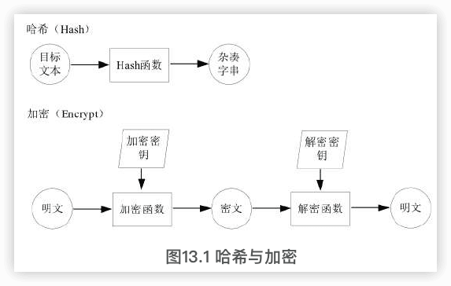

选择Hash或加密的基本原则：

- 如果被保护数据仅仅用于比较验证，以后不需要还原成明文形式，则使用Hash。
- 如果被保护数据以后需要被还原成明文，则使用加密。

对简单Hash的攻击方法主要有两种：

1. 寻找碰撞法

目前对于MD5和SHA-1并不存在有效的寻找碰撞方法。我国杰出的数学家王小云教授曾经在国际密码学会议上发布了针对MD5和SHA-1的寻找碰撞改进算法，但这种方法和“破解”相去甚远。该理论目前仅具有数学上的意义，她将破解MD5的预期步骤降低了好几个数量级，但对于实际应用来说仍然是一个天文数字。

2. 穷举法（或暴力破解法）

通俗地说，穷举法就是将一个范围内（如从000000到999999）的所有值一个一个用Hash算法映射，然后将结果和杂凑串比较，如果相同，则这个值一定是源字串或源字串的一个碰撞，于是就可以用这个值非法登录了。

穷举法看似笨拙，但目前几乎所有的MD5破解机或MD5在线破解都是用这种穷举法。究其缘由，就是相当一部分口令是非常简单的，如“123456”或“000000”。穷举法是否能成功很大程度上取决于口令的复杂性。因为穷举法扫描的区间往往是单字符集、规则的区间，或者由字典数据进行组合，因此，如果使用复杂的口令，如“!@#$%^＆*()”，穷举法就很难奏效了。


#### SHA-256

SHA-256算法输入报文的最大长度是2^64^ bit，产生的输出是一个256bit的报文摘要。步骤：

1. 附加填充比特

   对报文进行填充，使报文长度与448模512同余（长度=448 mod 512），填充的比特数范围是1到512，填充比特串的最高位为1，其余位为0。就是先在报文后面加一个1，再加很多个0，直到长度满足mod 512=448。为什么是448？因为448+64=512。第二步会加上一个64bit的原始报文的长度信息。

2. 附加长度值

   将用64bit表示的初始报文（填充前）的位长度附加在步骤1的结果后（低位字节优先）。

3. 初始化缓存

​	使用一个256bit的缓存来存放该Hash函数的中间及最终结果。该缓存表示为A=0x6A09E667，B=0xBB67AE85，C=0x3C6EF372，D=0xA54FF53A，E=0x510E527F，F=0x9B05688C，G=0x1F83D9AB，H=0x5BE0CD19。

4. 处理512bit（16个字）报文分组序列

   该算法使用了6种基本逻辑函数，由64步迭代运算组成。每步都以256bit缓存值ABCDEFGH为输入，然后更新缓存内容。

每步使用一个32bit Kt（常数值）和一个32bit Wt（分组后的报文）。

#### 核心代码

🔖

### 52.3 对称加密算法

#### 对称加密简介

对称加密（也叫==私钥加密算法==）指加密和解密使用相同密钥的加密算法。它要求发送方和接收方在安全通信之前，商定一个密钥。对称算法的安全性依赖于密钥，泄露密钥就意味着任何人都可以对他们发送或接收的消息解密，所以密钥的保密性对通信的安全性至关重要。

优点是**计算量小，加密速度快，加密效率高**。

不足是参与方需要提前持有密钥，一旦有人泄露则系统安全性被破坏；另外，如何在不安全通道中提前分发密钥也是个问题，密钥管理非常困难。

基于“对称密钥”的加密算法主要有**DES、3DES（TripleDES）、AES、RC2、RC4、RC5和Blowfish**等。

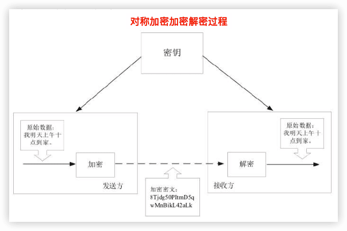

#### DES和3DES算法

数据加密标准算法（Data Encryption Standard，DES）  1975 IBM

DES算法的入口参数有3个：

- ==Key==是DES算法的工作密钥，8个字节共64位。
- ==Data==是要被加密或被解密的数据。
- ==Mode==为DES的工作方式，有两种：加密或解密。

在没有密钥的情况下，解密耗费时间非常长，基本上认为没有可能。加密解密耗时和需要加密的文本大小成正比，这是**P问题**。知道明文和对应的密文，求解所用的密钥，这是**NP问题**。

目前还没有NP的求解算法，但是密钥很容易得到验证。想得到NP的解，只能暴力破解（穷举破解），攻击者使用自己的用户名和密码字典，逐一尝试登录。穷举验证是对称加密仅有的求解方式，求解时间呈指数级增长。

DES算法把64位的明文输入块变为数据长度为64位的密文输出块，其中8位为奇偶校验位，另外56位作为密码的长度。

首先，DES把输入的64位数据块按位重新组合，并把输出分为L0、R0两部分，每部分各长32位，并进行前后置换，最终由L0输出左32位，R0输出右32位。根据这个法则经过16次迭代运算后，得到L16、R16，将此作为输入，进行与初始置换相反的逆置换，即得到密文输出。DES算法具有极高的安全性，到目前为止，除了用穷举搜索法对DES算法进行攻击外，还没有发现更有效的办法。56位长密钥的穷举空间为256，这意味着如果一台计算机的速度是每秒检测100万个密钥，那么它搜索完全部密钥就需要将近2285年的时间，因此DES算法是一种很可靠的加密方法。3DES密钥是24字节，即192位二进制。

#### AES算法

高级加密标准算法（Advanced Encryption Standard，AES）  美国国家标准与技术研究院（NIST）  2002

2006年，AES算法已然成为对称密钥加密中最流行的算法之一。

#### AES的加密模式

- ECB（Electronic Code Book，电子密码本模式）：最基本的加密模式，也就是通常理解的加密。相同的明文将永远加密成相同的密文，无初始向量，容易受到密码本重放攻击，一般情况下很少用。
- CBC（Cipher Block Chaining，密码分组链接模式）：明文被加密前要与前面的密文进行异或运算，因此只要选择不同的初始向量，相同的明文加密后会形成不同的密文。这是目前应用最广泛的模式。CBC加密后的密文是上下文相关的，但明文的错误不会传递到后续分组；但如果一个分组丢失，后面的分组将全部作废（同步错误）。
- CFB（Cipher Feedback Mode，加密反馈模式）：类似于自同步序列密码，分组加密后，按8位分组将密文和明文进行移位异或后得到输出，同时反馈回移位寄存器。优点是最小可以按字节进行加解密，也可以是n位的。CFB也是上下文相关的，CFB模式下，明文的一个错误会影响后面的密文（错误扩散）。
- OFB（Output Feedback Mode，输出反馈模式）：将分组密码作为同步序列密码运行，和CFB相似。不过OFB用前一个n位密文输出分组反馈回移位寄存器，没有错误扩散问题。

#### 填充方式

行使DES、3DES和AES三种对称加密算法时，常采用的是PKCS5填充、Zeros填充（0填充）。

1. PKCS5填充

每个填充的字节都记录了填充的总字节数。

“a”填充后结果为：[97 7 7 7 7 7 7 7]。

“ab”填充后结果为：[97 98 6 6 6 6 6 6]。

“—a”填充后结果为：[228 184 128 97 4 4 4 4]。

2. Zeros填充

全部填充为0的字节。

“a”填充后结果为：[97 0 0 0 0 0 0 0]。

“ab”填充后结果为：[97 98 0 0 0 0 0 0]。

“—a”填充后结果为：[228 184 128 97 0 0 0 0]。

#### 核心代码

🔖

### 52.3 非对称加密算法

#### 非对称加密简介

非对称加密又叫作**公开密钥加密**（Public Key Cryptography）或==公钥加密==，指加密和解密使用不同密钥的加密算法。公钥加密需要两个密钥，一个是公开密钥，另一个是私有密钥；一个用于加密，另一个用于解密。

==RSA==是目前最有影响力的公钥加密算法，它能够抵抗到目前为止已知的所有密码攻击，已被ISO推荐为公钥数据加密标准。

其他常见的公钥加密算法有：**ElGamal、背包算法、Rabin（RSA的特例）、椭圆曲线加密算法（Elliptic Curve Cryptography，ECC）**。

缺点是加解密速度远远慢于对称加密，在某些极端情况下，需要的时间甚至是对称加密的1000倍。

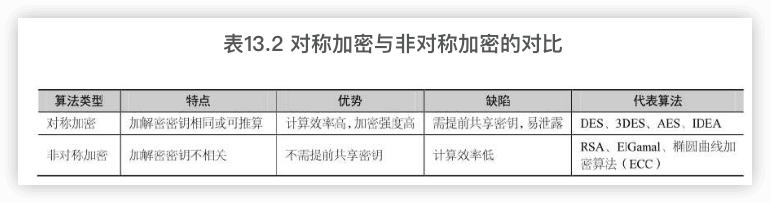

#### 非对称加密算法实现数字签名

非对称加密不同于加密和解密都使用同一个密钥的对称加密，虽然两个密钥在数学上相关，但如果知道了其中一个，并不能凭此计算出另外一个。加密消息的密钥是不能解密消息的。因此两个密钥中，一个可以公开，称为==公钥==；不公开的密钥称为==私钥==，必须由用户自行严格秘密保管，绝不通过任何途径向任何人提供。

非对称加密算法分为两种：==公钥加密、私钥解密==和==私钥加密、公钥解密==。前者是**普通的非对称算法**，而后者被称为==数字签名==。

目前主流的数字签名算法是椭圆曲线数字签名算法（ECDSA）。

总之，非对称加密算法中，公钥的作用是加密消息和验证签名，而私钥的作用是解密消息和进行数字签名。

#### RSA算法

RSA算法基于一个十分简单的数论事实：**将两个大素数相乘十分容易，想要对其乘积进行因式分解极其困难**，因此可以将乘积公开作为加密密钥。

密钥对的生成步骤：

1. 随机选择两个不相等的质数p和q（比特币中p长度为512位二进制数值，q长度为1024位）。
2. 计算p和q的乘积N。
3. 计算p-1和q-1的乘积φ (N)。
4. 随机选一个整数e，e与m要互质，且0＜e＜φ (N)。
5. 计算e的模反元素d。
6. 公钥是（N,e），私钥是（N,d）。

加解密步骤：

1. 假设一个明文m（0＜=m＜N）。
2. 对明文m加密得到密文c
3. 对密文c解密得到明文m

#### 核心代码

🔖

### 52.4 椭圆曲线加密算法和椭圆曲线数字签名算法

#### 椭圆曲线加密简介

椭圆曲线加密算法（Elliptic Curve Cryptography，==ECC==）是基于椭圆曲线数学理论实现的一种非对称加密算法。

椭圆曲线算法又细分为多种具体的算法。Go语言内置的是**secp256R1算法**，而比特币系统中使用**secp256K1算法**。以太坊系统虽然也采用secp256K1算法，但是跟比特币系统的secp256K1算法上又有所差异。

椭圆曲线公钥系统是RSA的强有力竞争者，与经典的RSA公钥密码体制相比，椭圆密码体制有明显的优势。

1. 安全性能更高（ECC可以使用更短的密钥）。同等安全强度下，两者密钥长度的对比：


2. 处理速度快，计算量小。在私钥的处理速度上（解密和签名），ECC远比RSA快得多。
3. 存储空间小。ECC的密钥尺寸和系统参数与RSA相比要小得多，所以占用的存储空间小得多。
4. 带宽要求低使得ECC具有广泛的应用前景。

ECC的这些特点使它必将取代RSA，成为通用的公钥加密算法。

#### 数字签名的概念

数字签名（Digital Signature）又称公开密钥数字签名、电子签章，是一种类似写在纸上的普通的物理签名，但是使用了公钥加密领域的技术，用于鉴别数字信息的方法。一套数字签名通常定义两种互补的运算，一个用于**签名**，另一个用于**验证**。数字签名可以验证数据的来源，可以验证数据传输过程中是否被修改。

数字签名是通过非对称加密算法中的私钥加密、公钥解密过程来实现的。

私钥加密就是私钥签名，公钥解密就是公钥验证签名。因此数字签名由两部分组成：

- 第一部分是使用私钥为消息创建签名的算法，
- 第二部分是允许任何人用公钥来验证签名的算法。

数字签名的使用流程如图：


数字签名应该满足如下要求。

- 签名不可伪造。
- 签名不可抵赖。
- 签名的识别和应用相对容易，任何人都可以验证签名的有效性。
- 签名不可复制，签名与原文是不可分割的整体。
- 签名消息不可篡改，任意比特数据被篡改，其签名便随之改变，任何人都可以经验证而拒绝接受此签名。

#### 核心代码🔖


### 52.5 字符编码与解码

#### Base64

Base64是一种基于64个可打印字符来表示二进制数据的编码方式。Base64使用了**26个小写字母、26个大写字母、10个数字以及2个符号（如“+”和“/”）**，用于在电子邮件这样的基于文本的媒介中传输二进制数据。Base64通常用于编码邮件中的附件。

Base64的编码过程:

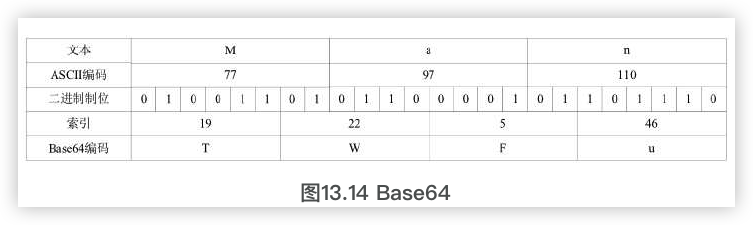

步骤:

- 将每个字符转成ASCII编码（十进制）。
- 将十进制编码转成二进制编码。
- 将二进制编码按照6位一组进行平分。
- 将6位一组的二进制数高位补零，然后转成十进制数。
- 以十进制数作为索引，从Base64编码表中查找字符。
- 每3个字符的文本将编码为4个字符长度（3×8=4×6）。若文本为3个字符，则正好编码为4个字符长度；若文本为2个字符，则编码为3个字符，由于不足4个字符，则在尾部用一个“=”补齐；若文本为1个字符，则编码为2个字符，由于不足4个字符，则在尾部用两个“=”补齐。如图13.15所示。


🔖

#### Base58

Base58是一种基于文本的二进制编码方式。这种编码方式不仅实现了数据压缩，保持了易读性，还具有错误诊断功能。

==Base58是Base64的子集==，同样使用大小写字母和10个数字，但舍弃了一些容易错读和在特定字体中容易混淆的字符。

Base58不含Base64中的**0（数字0）、O（大写字母O）、l（小写字母l）、I（大写字母I），以及“+”和“/”两个字符**，目的就是去除容易混淆的字符。简而言之，Base58由不包括“0”“O”“l”“I”的大小写字母和数字组成。

base58编码的整体步骤就是不断将数值对58取模，如果商大于58，则对商继续取模。以字符串“a”为例。在ASCII码中，“a”对应的十进制数为97，具体步骤如下。

- 97对58取模，余数为39，商为1。
- base58字符集中，索引下标39为g。
- base58字符集中，索引下标1为2。
- 得到结果为：g2。
- 反序列化后为：2g。

以字符串“ab”为例。“ab”转十六进制为6162，再转十进制为24930，具体步骤如下。

- 24930对58取模，余数为48，商为429。
- base58字符集中，索引下标48为q。
- 429对58取模，余数为23，商为7。
- base58字符集中，索引下标23为Q。
- base58字符集中，索引下标7为8。
- 得到结果为：qQ8。
- 反序列化后为：8Qq。

🔖

# 测试、性能剖析与调试

参考：《Go语言精进之路2》

## 53 理解包内测试与包外测试的差别

测试代码与包代码放在同一个包目录下，并且Go要求所有测试代码都存放在以`*_test.go`结尾的文件中。这使Go开发人员一眼就能分辨出哪些文件存放的是==包代码==，哪些文件存放的是针对该包的==测试代码==。

`go test`将所有包目录下的`*_test.go`文件编译成一个临时二进制文件（可以通过`go test -c`显式编译出该文件），并执行该文件，后者将执行各个测试源文件中名字格式为`TestXxx`的函数所代表的测试用例并输出测试执行结果。

### 官方文档的“自相矛盾”

Go原生支持测试的两大要素——go test命令和testing包。

testing包的一段官方文档（Go 1.14版本）摘录：

> 要编写一个新的测试集（test suite），创建一个包含`TestXxx`函数的以_test.go为文件名结尾的文件。将这个测试文件放在与被测试包相同的包下面。编译被测试包时，该文件将被排除在外；执行go test时，该文件将被包含在内。

go test命令官方文档：

> 那些包名中带有_test后缀的测试文件将被编译成一个独立的包，这个包之后会被链接到主测试二进制文件中并运行。


“自相矛盾”的地方：testing包文档告诉我们将测试代码放入与被测试包同名的包中，而go test命令行帮助文档则提到会将包名中带有_test后缀的测试文件编译成一个独立的包。

例子来直观说明一下这个“矛盾”：

> 如果我们要测试的包为foo，testing包的帮助文档告诉我们把对foo包的测试代码**放在包名为foo的测试文件**中；
>
> 而go test命令行帮助文档则告诉我们把foo包的测试代码**放在包名为foo_test的测试文件**中。

将测试代码放在与被测包同名的包中的测试方法称为“==包内测试==”：

```sh
$ go list -f={{.TestGoFiles}} . 
```

将测试代码放在名为被测包包名+"_test"的包中的测试方法称为“==包外测试==”:

```sh
$ go list -f={{.XTestGoFiles}} .
```

```sh
$ cd cd /usr/local/go/src/sync
$ go list -f={{.TestGoFiles}} . 
[export_test.go]
$ go list -f={{.XTestGoFiles}} .
[cond_test.go example_pool_test.go example_test.go map_bench_test.go map_reference_test.go map_test.go mutex_test.go once_test.go oncefunc_test.go pool_test.go runtime_sema_test.go rwmutex_test.go waitgroup_test.go]
```


### 包内测试与包外测试

#### Go标准库中包内测试和包外测试的使用情况

```sh
// 统计标准库中采用包内测试的测试文件数量
$ find /usr/local/go/src  -name "*_test.go" | xargs grep package | grep ':package' | grep -v "_test$" | wc -l
    1019


// 统计标准库中采用包外测试的测试文件数量
$ find /usr/local/go/src  -name "*_test.go" | xargs grep package | grep ':package' | grep  "_test$" | wc -l 
     658
```


#### 包内测试的优势与不足

由于Go构建工具链在编译包时会自动根据文件名是否具有_test.go后缀将包源文件和包的测试源文件分开，测试代码不会进入包正常构建的范畴，因此测试代码使用与被测包名相同的包内测试方法是一个很自然的选择。

包内测试这种方法本质上是一种==白盒测试==方法。由于测试代码与被测包源码在同一包名下，测试代码可以访问该包下的所有符号，无论是导出符号还是未导出符号；并且由于包的内部实现逻辑对测试代码是透明的，包内测试**可以更为直接地构造测试数据和实施测试逻辑**，可以很容易地达到较高的测试覆盖率。因此对于追求高测试覆盖率的项目而言，包内测试是不二之选。

🔖


## 54 有层次地组织测试代码

### 54.1 经典模式——平铺

go test并没有对测试代码的组织提出任何约束条件。

以标准库strings包为例：

```sh
cd /usr/local/go/src/strings
go test -v .
=== RUN   TestBuilder
--- PASS: TestBuilder (0.00s)
=== RUN   TestBuilderString
--- PASS: TestBuilderString (0.00s)
=== RUN   TestBuilderReset
--- PASS: TestBuilderReset (0.00s)
=== RUN   TestBuilderGrow
--- PASS: TestBuilderGrow (0.00s)
=== RUN   TestBuilderWrite2
=== RUN   TestBuilderWrite2/Write
=== RUN   TestBuilderWrite2/WriteRune
=== RUN   TestBuilderWrite2/WriteRuneWide
=== RUN   TestBuilderWrite2/WriteString
--- PASS: TestBuilderWrite2 (0.00s)
    --- PASS: TestBuilderWrite2/Write (0.00s)
    --- PASS: TestBuilderWrite2/WriteRune (0.00s)
    --- PASS: TestBuilderWrite2/WriteRuneWide (0.00s)
    --- PASS: TestBuilderWrite2/WriteString (0.00s)
=== RUN   TestBuilderWriteByte
--- PASS: TestBuilderWriteByte (0.00s)
=== RUN   TestBuilderAllocs
--- PASS: TestBuilderAllocs (0.00s)
=== RUN   TestBuilderCopyPanic
--- PASS: TestBuilderCopyPanic (0.00s)
=== RUN   TestBuilderWriteInvalidRune
--- PASS: TestBuilderWriteInvalidRune (0.00s)
=== RUN   TestClone
--- PASS: TestClone (0.00s)

...
=== RUN   ExampleTrim
--- PASS: ExampleTrim (0.00s)
=== RUN   ExampleTrimSpace
--- PASS: ExampleTrimSpace (0.00s)
=== RUN   ExampleTrimPrefix
--- PASS: ExampleTrimPrefix (0.00s)
=== RUN   ExampleTrimSuffix
--- PASS: ExampleTrimSuffix (0.00s)
=== RUN   ExampleTrimFunc
--- PASS: ExampleTrimFunc (0.00s)
=== RUN   ExampleTrimLeft
--- PASS: ExampleTrimLeft (0.00s)
=== RUN   ExampleTrimLeftFunc
--- PASS: ExampleTrimLeftFunc (0.00s)
=== RUN   ExampleTrimRight
--- PASS: ExampleTrimRight (0.00s)
=== RUN   ExampleTrimRightFunc
--- PASS: ExampleTrimRightFunc (0.00s)
=== RUN   ExampleToValidUTF8
--- PASS: ExampleToValidUTF8 (0.00s)
PASS
ok      strings 1.100s

```

以strings包的Compare函数为例，与之对应的测试函数有三个：TestCompare、TestCompareIdenticalString和TestCompareStrings。这些测试函数各自独立，测试函数之间没有层级关系，**所有测试平铺在顶层**。测试函数名称**既用来区分测试，又用来关联测试**。

我们通过测试函数名的前缀才会知道，TestCompare、TestCompareIdenticalString和TestCompareStrings三个函数是针对strings包Compare函数的测试。

选项-run提供正则表达式来匹配并选择执行哪些测试函数。

```sh
$ go test -run=TestCompare -v .
=== RUN   TestCompare
--- PASS: TestCompare (0.00s)
=== RUN   TestCompareIdenticalString
--- PASS: TestCompareIdenticalString (0.00s)
=== RUN   TestCompareStrings
--- PASS: TestCompareStrings (0.00s)
PASS
ok    strings     0.088s
```


平铺模式的测试代码组织方式的优点是显而易见的。

- 简单：没有额外的抽象，上手容易。
- 独立：每个测试函数都是独立的，互不关联，避免相互干扰。

### 54.2 xUnit家族模式

在Java、Python、C#等主流编程语言中，测试代码的组织形式深受由极限编程倡导者Kent Beck和Erich Gamma建立的xUnit家族测试框架（如JUnit、PyUnit等）的影响。

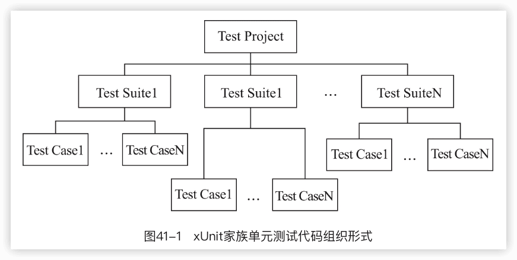

这种测试代码组织形式主要有==测试套件（Test Suite）==和==测试用例（Test Case）==两个层级。

一个**测试工程（Test Project）**由若干个测试套件组成，而每个测试套件又包含多个测试用例。

Go 1.7中加入的对subtest的支持让我们在Go中也可以使用上面这种方式组织Go测试代码。之前版本不可以。对标准库strings包的部分测试代码组织形式改造一下：

```go
// ch54/compare_test.go

package strings_test

...

func testCompare(t *testing.T) {
	...
}

func testCompareIdenticalString(t *testing.T) {
	...
}

func testCompareStrings(t *testing.T) {
	...
}

func TestCompare(t *testing.T) {
	t.Run("Compare", testCompare)
	t.Run("CompareString", testCompareStrings)
	t.Run("CompareIdenticalString", testCompareIdenticalString)
}

// ch54/builder_test.go

package strings_test

...

func check(t *testing.T, b *strings.Builder, want string) {
	...
}

func testBuilder(t *testing.T) {
	...
}

func testBuilderString(t *testing.T) {
	...
}

func testBuilderReset(t *testing.T) {
	...
}

func testBuilderGrow(t *testing.T) {
	...
}

func TestBuilder(t *testing.T) {
	t.Run("TestBuilder", testBuilder)
	t.Run("TestBuilderString", testBuilderString)
	t.Run("TestBuilderReset", testBuilderReset)
	t.Run("TestBuilderGrow", testBuilderGrow)
}

```

改造前后测试代码的组织结构对比:

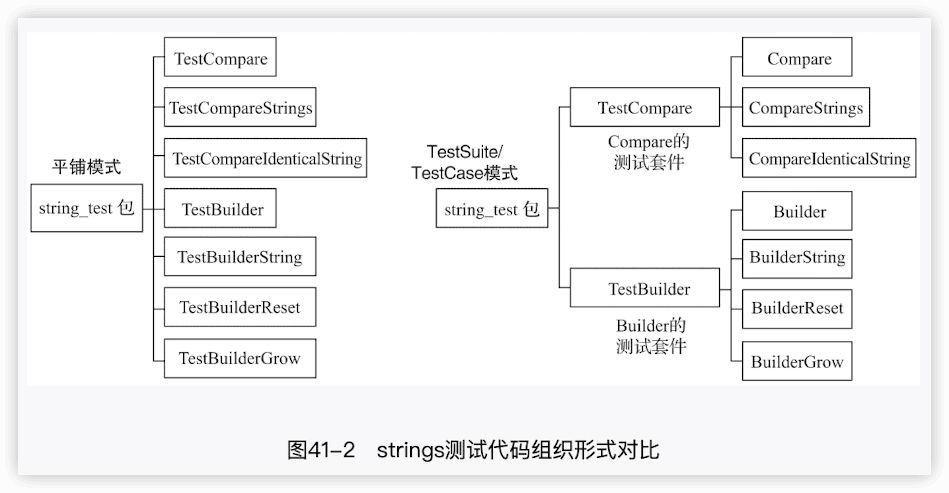

改造后的名字形如TestXxx的测试函数对应着测试套件，一般针对被测包的一个导出函数或方法的所有测试都放入一个测试套件中。平铺模式下的测试函数TestXxx都改名为testXxx，并作为测试套件对应的测试函数内部的子测试（subtest）。

原先的TestBuilderString变为了testBuilderString。这样的一个子测试等价于一个测试用例。

通过对比，仅通过查看测试套件内的子测试（测试用例）即可全面了解到究竟对被测函数/方法进行了哪些测试。仅仅增加了一个层次，测试代码的组织就更加清晰了。


### 54.3 测试固件

==测试固件（test fixture）==是指一个人造的、确定性的环境，一个测试用例或一个测试套件（下的一组测试用例）在这个环境中进行测试，其测试结果是可重复的（多次测试运行的结果是相同的）。

一般使用`setUp`和`tearDown`来代表测试固件的**创建/设置与拆除/销毁**的动作。

使用测试固件的常见场景：

- 将一组已知的特定数据加载到数据库中，测试结束后清除这些数据；
- 复制一组特定的已知文件，测试结束后清除这些文件；
- 创建伪对象（fake object）或模拟对象（mock object），并为这些对象设定测试时所需的特定数据和期望结果。


```go
func setUp(testName string) func() {
	fmt.Printf("\tsetUp fixture for %s\n", testName)
	return func() {
		fmt.Printf("\ttearDown fixture for %s\n", testName)
	}
}

func TestFunc1(t *testing.T) {
	defer setUp(t.Name())()
	fmt.Printf("\tExecute test: %s\n", t.Name())
}

func TestFunc2(t *testing.T) {
	defer setUp(t.Name())()
	fmt.Printf("\tExecute test: %s\n", t.Name())
}

func TestFunc3(t *testing.T) {
	defer setUp(t.Name())()
	fmt.Printf("\tExecute test: %s\n", t.Name())
}
```

```sh
$ go test -v classic_testfixture_test.go 
=== RUN   TestFunc1
        setUp fixture for TestFunc1
        Execute test: TestFunc1
        tearDown fixture for TestFunc1
--- PASS: TestFunc1 (0.00s)
=== RUN   TestFunc2
        setUp fixture for TestFunc2
        Execute test: TestFunc2
        tearDown fixture for TestFunc2
--- PASS: TestFunc2 (0.00s)
=== RUN   TestFunc3
        setUp fixture for TestFunc3
        Execute test: TestFunc3
        tearDown fixture for TestFunc3
--- PASS: TestFunc3 (0.00s)
PASS
ok      command-line-arguments  0.438s
```

上面的示例**在运行每个测试函数TestXxx时，都会先通过setUp函数建立测试固件，并在defer函数中注册测试固件的销毁函数，以保证在每个TestXxx执行完毕时为之建立的测试固件会被销毁，使得各个测试函数之间的测试执行互不干扰。**

在Go 1.14版本以前，测试固件的setUp与tearDown一般实现格式：

```go
func setUp() func() {
	...
	return func() {
	}
}

func TestXxx(t *testing.T) {
	defer setUp()()
	...
}
```

在setUp中返回匿名函数来实现tearDown的好处是，可以在setUp中利用闭包特性在两个函数间共享一些变量，避免了包级变量的使用。

Go 1.14版本testing包增加了testing.Cleanup方法，为测试固件的销毁提供了包级原生的支持：

```go
func setUp() func() {
	...
	return func() {
	}
}

func TestXxx(t *testing.T) {
  t.Cleanup(setUp())
	...
}
```

有些时候，我们需要将所有测试函数放入一个更大范围的测试固件环境中执行，这就是==包级别测试固件==。在Go 1.4版本以前，我们仅能在init函数中创建测试固件，而无法销毁包级别测试固件。Go 1.4版本引入了TestMain，使得包级别测试固件的创建和销毁终于有了正式的施展舞台。示例：

```go
// 包级别测试固件

// Go 1.14版本testing包增加了testing.Cleanup方法，为测试固件的销毁提供了包级原生的支持
// Go 1.4版本引入了TestMain，使得包级别测试固件的创建和销毁终于有了正式的施展舞台。

func setUp(testName string) func() {
	fmt.Printf("\tsetUp fixture for %s\n", testName)
	return func() {
		fmt.Printf("\ttearDown fixture for %s\n", testName)
	}
}

func TestFunc1(t *testing.T) {
	t.Cleanup(setUp(t.Name()))
	fmt.Printf("\tExecute test: %s\n", t.Name())
}

func TestFunc2(t *testing.T) {
	t.Cleanup(setUp(t.Name()))
	fmt.Printf("\tExecute test: %s\n", t.Name())
}

func TestFunc3(t *testing.T) {
	t.Cleanup(setUp(t.Name()))
	fmt.Printf("\tExecute test: %s\n", t.Name())
}

func pkgSetUp(pkgName string) func() {
	fmt.Printf("package SetUp fixture for %s\n", pkgName)
	return func() {
		fmt.Printf("package TearDown fixture for %s\n", pkgName)
	}
}

func TestMain(m *testing.M) {
	defer pkgSetUp("package demo_test")()
	m.Run()
}
```

```sh
$ go test -v classic_package_level_testfixture_test.go 
package SetUp fixture for package demo_test
=== RUN   TestFunc1
        setUp fixture for TestFunc1
        Execute test: TestFunc1
        tearDown fixture for TestFunc1
--- PASS: TestFunc1 (0.00s)
=== RUN   TestFunc2
        setUp fixture for TestFunc2
        Execute test: TestFunc2
        tearDown fixture for TestFunc2
--- PASS: TestFunc2 (0.00s)
=== RUN   TestFunc3
        setUp fixture for TestFunc3
        Execute test: TestFunc3
        tearDown fixture for TestFunc3
--- PASS: TestFunc3 (0.00s)
PASS
package TearDown fixture for package demo_test
ok      command-line-arguments  0.470s

```

结果显示，**在所有测试函数运行之前，包级别测试固件被创建；在所有测试函数运行完毕后，包级别测试固件被销毁**。

用图来总结（带测试固件的）平铺模式下的测试执行流。

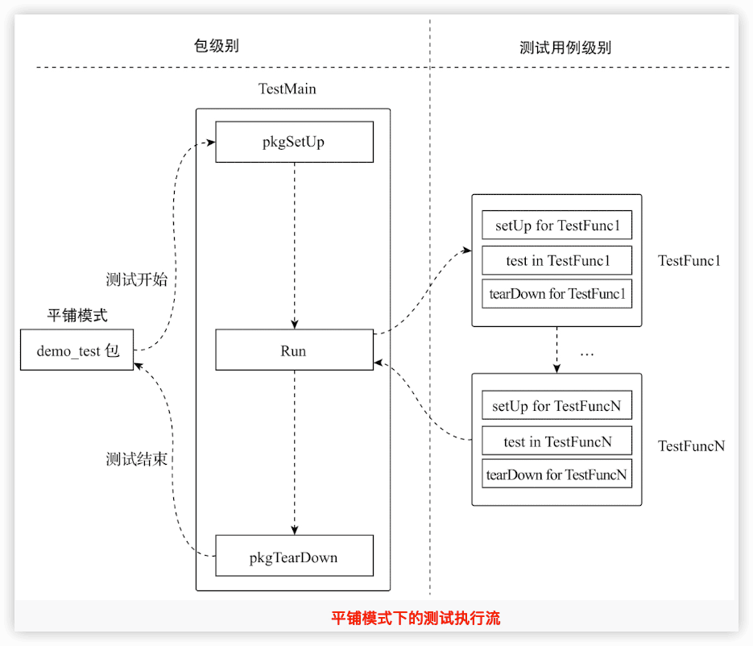


有些时候，一些测试函数所需的测试固件是相同的，在平铺模式下为每个测试函数都单独创建/销毁一次测试固件就显得有些重复和冗余。在这样的情况下，我们可以尝试采用测试套件来减少测试固件的重复创建。

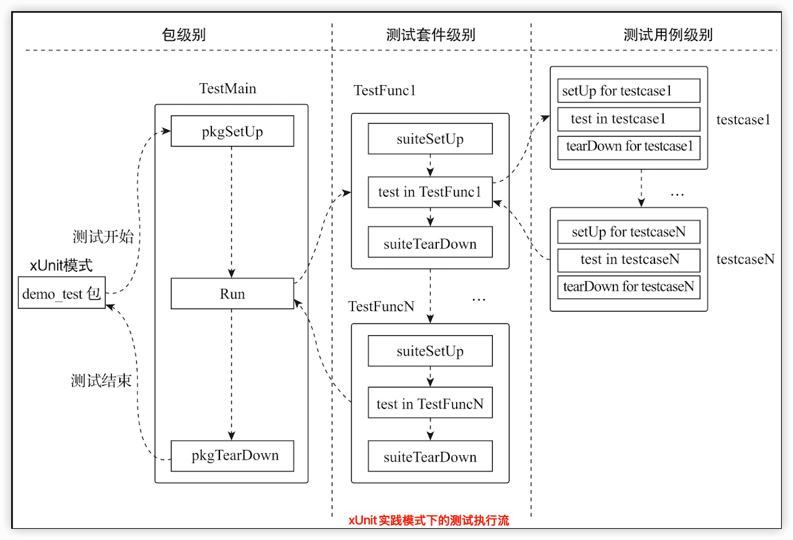

## 55 优先编写表驱动的测试

前两章中，明确了**测试代码放置的位置（包内测试或包外测试）以及如何根据实际情况更有层次地组织测试代码**。

这章将聚焦于**测试函数的内部代码该如何编写**。

### 55.1 Go测试代码的一般逻辑

Go的测试函数就是一个普通的Go函数，Go仅对测试函数的**函数名和函数原型**有特定要求，对在测试函数`TestXxx`或其子测试函数（subtest）中如何编写测试逻辑并没有显式的约束。

对测试失败与否的判断在于测试代码逻辑是否进入了包含`Error/Errorf`、`Fatal/Fatalf`等方法调用的代码分支。一旦进入这些分支，即代表该测试失败。不同的是Error/Errorf并不会立刻终止当前goroutine的执行，还会继续执行该goroutine后续的测试，而Fatal/Fatalf则会立刻停止当前goroutine的测试执行。

```go
func TestCompare(t *testing.T) {
	var a, b string
	var i int

	a, b = "", ""
	i = 0
	cmp := strings.Compare(a, b)
	if cmp != i {
		t.Errorf("want %v, but Compare(%q, %q) = %v", i, a, b, cmp)
	}

	a, b = "a", ""
	i = 1
	cmp = strings.Compare(a, b)
	if cmp != i {
		t.Errorf("want %v, but Compare(%q, %q) = %v", i, a, b, cmp)
	}

	a, b = "", "a"
	i = -1
	cmp = strings.Compare(a, b)
	if cmp != i {
		t.Errorf("want %v, but Compare(%q, %q) = %v", i, a, b, cmp)
	}
}
```

Go测试代码的一般逻辑是==针对给定的输入数据，比较被测函数/方法返回的实际结果值与预期值，如有差异，则通过testing包提供的相关函数输出差异信息。==

### 55.2 表驱动的测试实践

```go
func TestCompare2(t *testing.T) {
	compareTests := []struct {
		a, b string
		i    int
	}{
		{"", "", 0},
		{"a", "", 1},
		{"", "a", -1},
	}
	for _, tt := range compareTests {
		cmp := strings.Compare(tt.a, tt.b)
		if cmp != tt.i {
			t.Errorf("want %v, but Compare(%q, %q) = %v", tt.i, tt.a, tt.b, cmp)
		}
	}
}

```

改进，将预置的输入数据放入一个自定义结构体类型的切片中。

无须改动后面的测试逻辑，只需在切片中增加数据条目即可。在这种测试设计中，这个自定义结构体类型的切片（上述示例中的compareTests）就是一个表（自定义结构体类型的字段就是列），而基于这个数据表的测试设计和实现则被称为“**表驱动的测试**”。

### 55.3 表驱动测试的优点

表驱动测试本身是编程语言无关的。Go核心团队和Go早期开发者在实践过程中发现表驱动测试十分适合Go代码测试并在标准库和第三方项目中大量使用此种测试设计，这样表驱动测试也就逐渐成为Go的一个惯用法。

优点：

- 简单和紧凑

- 数据即测试

  表驱动测试的实质是数据驱动的测试，扩展输入数据集即扩展测试。通过扩展数据集，我们可以很容易地实现提高被测目标测试覆盖率的目的。

- 结合**子测试**后，可单独运行某个数据项的测试

```go
// 表驱动测试与子测试（subtest）结合

func TestCompare4(t *testing.T) {
	compareTests := []struct {
		name, a, b string
		i          int
	}{
		{`compareTwoEmptyString`, "", "", 0},
		{`compareSecondParamIsEmpty`, "a", "", 1},
		{`compareFirstParamIsEmpty`, "", "a", -1},
	}

	for _, tt := range compareTests {
		t.Run(tt.name, func(t *testing.T) {
			cmp := strings.Compare(tt.a, tt.b)
			if cmp != tt.i {
				t.Errorf(`want %v, but Compare(%q, %q) = %v`, tt.i, tt.a, tt.b, cmp)
			}
		})
	}
}
```

测试结果的判定逻辑放入一个单独的子测试中，这样可以单独执行表中某项数据的测试。比如：单独执行表中第一个数据项对应的测试：

```sh
$ go test -v -run /TwoEmptyString table_driven_strings_with_subtest_test.go 
=== RUN   TestCompare4
=== RUN   TestCompare4/compareTwoEmptyString
--- PASS: TestCompare4 (0.00s)
    --- PASS: TestCompare4/compareTwoEmptyString (0.00s)
PASS
ok      command-line-arguments  0.278s

```


综上，**建议在编写Go测试代码时优先编写基于表驱动的测试。**

### 55.4 表驱动测试实践中的注意事项

#### 1 表的实现方式

表除了用自定义结构体的切片实现的，表也可以使用基于自定义结构体的其他**集合类型**（如map）来实现。


**不过使用map作为数据表时要注意，表内数据项的测试先后顺序是不确定的。**

#### 2 测试失败时的数据项的定位

对于非表驱动的测试，在测试失败时，往往通过失败点所在的行数即可判定究竟是哪块测试代码未通过：

```sh
$ go test -v non_table_driven_strings_test.go
=== RUN   TestCompare
    non_table_driven_strings_test.go:18: want 1, but Compare("", "") = 0
--- FAIL: TestCompare (0.00s)
FAIL
FAIL    command-line-arguments  0.387s
FAIL
```

但在表驱动的测试中，由于一般情况下表驱动的测试的测试结果成功与否的判定逻辑是共享的，因此再通过行数来定位问题就不可行了，因为无论是表中哪一项导致的测试失败，失败结果中输出的引发错误的行号都是相同的：

```shell
$ go test -v table_driven_strings_test.go
=== RUN   TestCompare2
    table_driven_strings_test.go:20: want 1, but Compare("", "") = 0
    table_driven_strings_test.go:20: want 6, but Compare("a", "") = 1
    table_driven_strings_test.go:20: want 0, but Compare("", "a") = -1
--- FAIL: TestCompare2 (0.00s)
=== RUN   TestCompare3
--- PASS: TestCompare3 (0.00s)
FAIL
FAIL    command-line-arguments  0.276s
FAIL
```


需要在测试失败的输出结果中输出数据表项的**唯一标识**。最简单的方法是通过输出数据表项在数据表中的**偏移量**来辅助定位“元凶”：

```go
func TestCompare6(t *testing.T) {
	compareTests := []struct {
		a, b string
		i    int
	}{
		{"", "", 7},
		{"a", "", 6},
		{"", "a", -1},
	}

	for i, tt := range compareTests {
		cmp := strings.Compare(tt.a, tt.b)
		if cmp != tt.i {
			t.Errorf(`[table offset: %v] want %v, but Compare(%q, %q) = %v`, i+1, tt.i, tt.a, tt.b, cmp)
		}
	}
}
```


```sh
$ go test -v table_driven_strings_by_offset_test.go 
=== RUN   TestCompare6
    table_driven_strings_by_offset_test.go:23: [table offset: 1] want 7, but Compare("", "") = 0
    table_driven_strings_by_offset_test.go:23: [table offset: 2] want 6, but Compare("a", "") = 1
--- FAIL: TestCompare6 (0.00s)
FAIL
FAIL    command-line-arguments  0.433s
FAIL

```

一个更直观的方式是使用名字来区分不同的数据项：

```sh
$ go test -v table_driven_strings_by_name_test.go  
=== RUN   TestCompare7
    table_driven_strings_by_name_test.go:23: [compareTwoEmptyString] want 7, but Compare("", "") = 0
    table_driven_strings_by_name_test.go:23: [compareSecondStringEmpty] want 6, but Compare("a", "") = 1
--- FAIL: TestCompare7 (0.00s)
FAIL
FAIL    command-line-arguments  0.433s
FAIL

```


#### 3 Errorf还是Fatalf

一般而言，如果一个数据项导致的测试失败不会对后续数据项的测试结果造成影响，那么推荐Errorf，这样可以通过执行一次测试看到所有导致测试失败的数据项；否则，如果数据项导致的测试失败会直接影响到后续数据项的测试结果，那么可以使用Fatalf让测试尽快结束，因为继续执行的测试的意义已经不大了。


## 56 使用testdata管理测试依赖的外部数据文件


### testdata目录

Go语言规定：**Go工具链将忽略名为testdata的目录**。这样开发者在编写测试时，就可以在名为testdata的目录下**存放和管理测试代码依赖的数据文件**。


在$GOROOT/src路径：

```sh
 find . -name "testdata"
```


### golden文件惯用法

> 能否把将预期数据采集到文件的过程与测试代码融合到一起呢？
>
> Go标准库提供了一种惯用法：==golden文件==。


## 57 正确运用fake、stub和mock等辅助单元测试🔖

> 你不需要一个真实的数据库来满足运行单元测试的需求。 

在对Go代码进行测试的过程中，除了会遇到上一条中所提到的测试代码对外部文件数据的依赖之外，还会经常面对被测代码对外部业务组件或服务的依赖。此外，越是接近业务层，被测代码对外部组件或服务依赖的可能性越大。比如：

- 被测代码需要连接外部Redis服务；
- 被测代码依赖一个外部邮件服务器来发送电子邮件；
- 被测代码需与外部数据库建立连接并进行数据操作；
- 被测代码使用了某个外部RESTful服务。


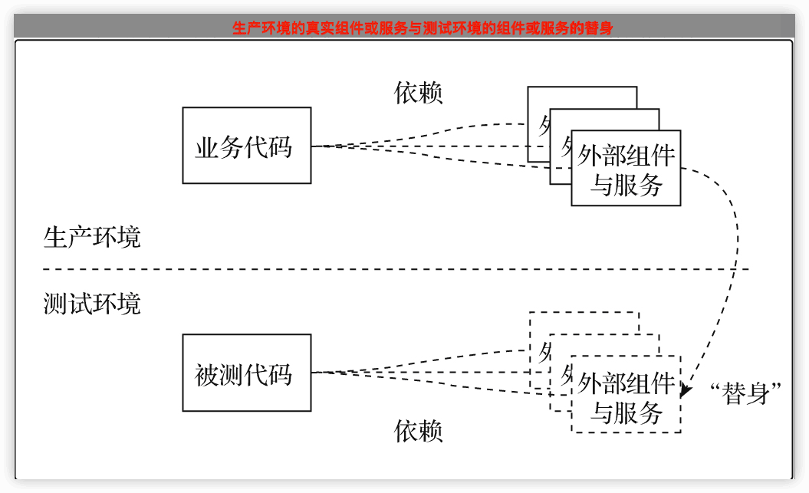

### fake：真实组件或服务的简化实现版替身


### stub：对返回结果有一定预设控制能力的替身

stub也是一种替身概念，和fake替身相比，stub替身增强了对替身返回结果的间接控制能力，这种控制可以通过测试前对调用结果预设置来实现。不过，stub替身通常仅针对计划之内的结果进行设置，对计划之外的请求也无能为力。


### mock：专用于行为观察和验证的替身


## 58 使用模糊测试让潜在bug无处遁形

==模糊测试（fuzz testing）==是指半自动或自动地为程序提供非法的、非预期、随机的数据，并监控程序在这些输入数据下是否会出现崩溃、内置断言失败、内存泄露、安全漏洞等情况。

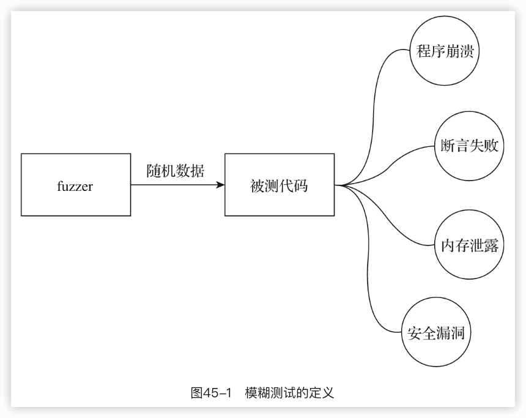

`go-fuzz`

### 模糊测试在挖掘Go代码的潜在bug中的作用


### go-fuzz的初步工作原理


go-fuzz的工作流程：

1. 生成随机数据；
2. 将上述数据作为输入传递给被测程序；
3. 观察是否有崩溃记录（crash），如果发现崩溃记录，则说明找到了潜在的bug。


go-fuzz采用的是**代码覆盖率引导的fuzzing算法**（Coverage-guided fuzzing）。


### go-fuzz使用方法


使用go-fuzz建立模糊测试的示例


## 59 为被测对象建立性能基准

是否优化、何时优化实质上是一个==决策问题==，但==决策不能靠直觉，要靠数据说话==。借用上面名言中的句型：**没有数据支撑的过早决策是万恶之源**。

作为一名Go开发者，我们该如何做出是否对代码进行性能优化的决策呢？可以通过**为被测对象建立性能基准的方式**去获得决策是否优化的支撑数据，同时可以根据这些性能基准数据判断出对代码所做的任何更改是否对代码性能有所影响。

### 59.1 性能基准测试在Go语言中是“一等公民”

**性能基准测试在Go语言中是和普通的单元测试一样被原生支持的**，得到的是“一等公民”的待遇。我们可以像对普通单元测试那样在*_test.go文件中创建被测对象的性能基准测试，每个以Benchmark前缀开头的函数都会被当作一个独立的性能基准测试：

```go
func BenchmarkXxx(b *testing.B) {
  //...
}
```


### 59.2 顺序执行和并行执行的性能基准测试

根据是否并行执行，Go的性能基准测试可以分为两类：**顺序执行的性能基准测试和并行执行的性能基准测试**。

#### 1 顺序执行的性能基准测试

其代码写法如下：

```go
func BenchmarkXxx(b *testing.B) {
  // ...
  for i := 0; i < b.N; i++ {
    // 被测对象的执行代码
  }
}
```

🔖🔖


#### 2 并行执行的性能基准测试

```go
func BenchmarkXxx(b *testing.B) {
  // ...
	b.RunParallel(func(pb *testing.PB) {
		for pb.Next() {
			// 被测对象的执行代码
		}
	})
}
```

并行执行的基准测试主要用于为包含多goroutine同步设施（如互斥锁、读写锁、原子操作等）的被测代码建立性能基准。相比于顺序执行的基准测试，并行执行的基准测试更能真实反映出多goroutine情况下，被测代码在goroutine同步上的真实消耗。

🔖🔖

### 59.3 使用性能基准比较工具

#### 1 [benchcmp](https://github.com/golang/tools/tree/master/cmd/benchcmp) 【deprecation】

```sh
go install golang.org/x/tools/cmd/benchcmp@latest
```


不过性能基准测试的输出结果受到很多因素的影响，比如：同一测试的运行次数；性能基准测试与其他正在运行的程序共享一台机器；运行测试的系统本身就在虚拟机上，与其他虚拟机共享硬件；现代机器的一些节能和功率缩放（比如CPU的自动降频和睿频）等。这些因素都会造成即便是对同一个基准测试进行多次运行，输出的结果也可能有较大偏差。但benchcmp工具并不关心这些结果数据在统计学层面是否有效，只对结果做简单比较。

#### 2 [benchstat](https://github.com/golang/perf/tree/master/benchstat)

为了提高对性能基准数据比较的科学性，Go核心团队又开发了benchstat这款工具以替代benchcmp。

```sh
benchstat old.txt new.txt
name      old time/op    new time/op   delta
Strcat-8  92.3ns ± 4%   52.2ns ± 6%   -43.43%  (p=0.008 n=5+5
```

看到，即便old.txt和new.txt中各自有5次运行的数据，benchstat也不会像benchcmp那样输出5行比较结果，而是输出一行经过统计学方法处理后的比较结果。以第二列数据92.3ns ± 4%为例，这是benchcmp对old.txt中的数据进行处理后的结果，其中±4%是样本数据中最大值和最小值距样本平均值的最大偏差百分比。如果这个偏差百分比大于5%，则说明样本数据质量不佳，有些样本数据是不可信的。由此可以看出，这里new.txt中的样本数据是质量不佳的。

benchstat输出结果的最后一列（delta）为两次基准测试对比的变化量。我们看到，采用strings.Join方法连接字符串的平均耗时比采用原生操作符连接字符串短43%，这个指标后面括号中的p=0.008是一个用于衡量两个样本集合的均值是否有显著差异的指标。benchstat支持两种检验算法：一种是UTest（Mann Whitney UTest，曼-惠特尼U检验），UTest是默认的检验算法；另外一种是Welch T检验（TTest）。一般p值小于0.05的结果是可接受的。


```sh
$ go test -run=NONE -count 5 -bench . strcat_test.go -benchmem > old_with_mem.txt
$ go test -run=NONE -count 5 -bench . strcat_test.go -benchmem > new_with_mem.txt

$ benchstat old_with_mem.txt new_with_mem.txt
goos: darwin
goarch: arm64
cpu: Apple M1
         │ old_with_mem.txt │          new_with_mem.txt           │
         │      sec/op      │    sec/op     vs base               │
Strcat-8       47.38n ± ∞ ¹   30.07n ± ∞ ¹  -36.53% (p=0.008 n=5)
¹ need >= 6 samples for confidence interval at level 0.95

         │ old_with_mem.txt │          new_with_mem.txt          │
         │       B/op       │    B/op      vs base               │
Strcat-8        80.00 ± ∞ ¹   48.00 ± ∞ ¹  -40.00% (p=0.008 n=5)
¹ need >= 6 samples for confidence interval at level 0.95

         │ old_with_mem.txt │          new_with_mem.txt          │
         │    allocs/op     │  allocs/op   vs base               │
Strcat-8        2.000 ± ∞ ¹   1.000 ± ∞ ¹  -50.00% (p=0.008 n=5)
¹ need >= 6 samples for confidence interval at level 0.95
```


### 59.4 排除额外干扰，让基准测试更精确

有些复杂的基准测试在真正执行For循环之前或者在每个循环中，除了执行真正的被测代码之外，可能还需要做一些测试准备工作，比如**建立基准测试所需的测试上下文等**。如果不做特殊处理，这些测试准备工作所消耗的时间也会被算入最终结果中，这就会导致最终基准测试的数据受到干扰而不够精确。为此，testing.B中提供了**多种灵活操控基准测试计时器的方法，通过这些方法可以排除掉额外干扰**，让基准测试结果更能反映被测代码的真实性能。

```sh
$ go test -bench . benchmark_with_expensive_context_setup_test.go 
goos: darwin
goarch: arm64
cpu: Apple M1
BenchmarkStrcatWithTestContextSetup-8                   25617231                39.55 ns/op
BenchmarkStrcatWithTestContextSetupAndResetTimer-8      37295137                30.54 ns/op
BenchmarkStrcatWithTestContextSetupAndRestartTimer-8    37561339                31.29 ns/op
BenchmarkStrcat-8                                       39039942                31.76 ns/op
PASS
ok      command-line-arguments  11.767s

```

如果不通过testing.B提供的计数器控制接口对测试上下文带来的消耗进行隔离，最终基准测试得到的数据（BenchmarkStrcatWithTestContextSetup）将偏离准确数据（BenchmarkStrcat）很远。而通过testing.B提供的计数器控制接口对测试上下文带来的消耗进行隔离后，得到的基准测试数据（BenchmarkStrcatWithTestContextSetupAndResetTimer和Bench-markStrcatWithTestContextSetupAndRestartTimer）则非常接近真实数据。

### 小结

无论你是否认为性能很重要，都请你为被测代码（尤其是位于系统关键业务路径上的代码）建立性能基准。如果你编写的是供其他人使用的软件包，则更应如此。只有这样，我们才能至少保证后续对代码的修改不会带来性能回退。已经建立的性能基准可以为后续是否进一步优化的决策提供数据支撑，而不是靠程序员的直觉。


## 60 使用pprof对程序进行性能剖析

Go是“自带电池”（battery included）的编程语言，拥有着让其他主流语言羡慕的工具链，Go还内置了对代码进行性能剖析的工具：pprof。

`pprof` 的全称是 **Performance Profiler**（性能分析器），它是 Go 语言官方提供的**性能分析工具**，主要用于诊断程序在 CPU、内存、阻塞、协程等方面的性能瓶颈。

### 60.1 pprof的工作原理

使用pprof对程序进行性能剖析的工作一般分为两个阶段：**数据采集和数据剖析**。

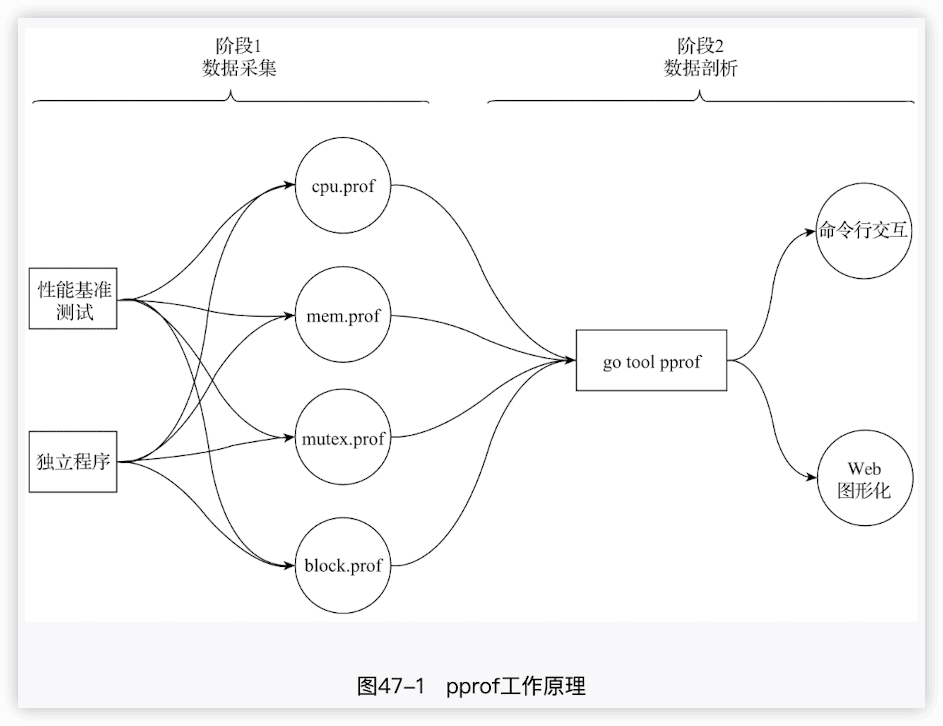

#### 1 采集数据类型

在数据采集阶段，Go运行时会定期对剖析阶段所需的不同类型数据进行采样记录。当前主要支持的采样数据类型有如下几种

1. CPU数据（cpu.prof）

CPU类型采样数据是性能剖析中十分常见的采样数据类型，它能帮助我们识别出代码关键路径上消耗CPU最多的函数。一旦启用CPU数据采样，Go运行时会每隔一段短暂的时间（10ms）就中断一次（由SIGPROF信号引发）并记录当前所有goroutine的函数栈信息（存入cpu.prof）。

2. 堆内存分配数据（mem.prof）

堆内存分配采样数据和CPU采样数据一样，也是性能剖析中十分常见的采样数据类型，它能帮助我们了解Go程序的当前和历史内存使用情况。堆内存分配的采样频率可配置，默认每1000次堆内存分配会做一次采样（存入mem.prof）

3. 锁竞争数据（mutex.prof）

锁竞争采样数据记录了当前Go程序中互斥锁争用导致延迟的操作。如果你认为很大可能是互斥锁争用导致CPU利用率不高，那么你可以为`go tool pprof`工具提供此类采样文件以供性能剖析阶段使用。该类型采样数据在默认情况下是不启用的，请参见`runtime.SetMutexProfileFraction`或`go test -bench . xxx_test.go -mutexprofile mutex.out`启用它。

4. 阻塞时间数据（block.prof）

该类型采样数据记录的是goroutine在某共享资源（一般是由同步原语保护）上的阻塞时间，包括从无缓冲channel收发数据、阻塞在一个已经被其他goroutine锁住的互斥锁、向一个满了的channel发送数据或从一个空的channel接收数据等。该类型采样数据在默认情况下也是不启用的，请参见`runtime.SetBlockProfileRate`或`go test -bench . xxx_test.go -blockprofile block.out`启用它。

#### 2 性能数据采集的方式

Go目前主要支持两种性能数据采集方式：性能基准测试和独立程序。

1. 性能基准测试

为应用中的关键函数/方法建立起性能基准测试之后，便可以通过执行性能基准测试采集到整个测试执行过程中有关被测方法的各类性能数据。这种方式尤其适用于对应用中关键路径上关键函数/方法性能的剖析。

仅需为go test增加一些命令行选项即可在执行性能基准测试的同时进行性能数据采集。以CPU采样数据类型为例：

```sh
$ go test -bench . xxx_test.go -cpuprofile=cpu.prof
$ ls
cpu.prof xxx.test* xxx_test.go
```

一旦开启性能数据采集（比如传入-cpuprofile），go test的-c命令选项便会自动开启，go test命令执行后会自动编译出一个与该测试对应的可执行文件（这里是xxx.test）。该可执行文件可以在性能数据剖析过程中提供剖析所需的符号信息（如果没有该可执行文件，go tool pprof的disasm命令将无法给出对应符号的汇编代码）。而cpu.prof就是存储CPU性能采样数据的结果文件，后续将作为数据剖析过程的输入。

其他类型的采样数据:

```sh
go test -bench . xxx_test.go -memprofile=mem.prof
go test -bench . xxx_test.go -blockprofile=block.prof
go test -bench . xxx_test.go -mutexprofile=mutex.prof
```

2. 独立程序的性能数据采集

可以通过1️⃣标准库`runtime/pprof`和`runtime`包提供的低级API对独立程序进行性能数据采集。


这种独立程序的性能数据采集方式**对业务代码侵入较多**，还要自己编写一些采集逻辑：**定义flag变量、创建输出文件、关闭输出文件**等。每次采集都要停止程序才能获取结果。（当然可以重新定义更复杂的控制采集时间窗口的逻辑，实现不停止程序也能获取采集数据结果。）

Go在2️⃣`net/http/pprof`包中还提供了一种更为高级的针对独立程序的性能数据采集方式，这种方式尤其适合那些**内置了HTTP服务**的独立程序。net/http/pprof包可以直接利用已有的HTTP服务**对外提供用于性能数据采集的服务端点（endpoint）**。

```go
package main

import (
	"context"
	"fmt"
	"net/http"
	_ "net/http/pprof"
	"os"
	"os/signal"
	"syscall"
)

func main() {
	http.Handle("/hello", http.HandlerFunc(func(w http.ResponseWriter, r *http.Request) {
		fmt.Println(*r)
		w.Write([]byte("hello"))
	}))
	s := http.Server{
		Addr: "localhost:8080",
	}
	c := make(chan os.Signal, 1)
	signal.Notify(c, syscall.SIGINT, syscall.SIGTERM)
	go func() {
		<-c
		s.Shutdown(context.Background())
	}()
	fmt.Println(s.ListenAndServe())
}
```


```go
// //$GOROOT/src/net/http/pprof/pprof.go

func init() {
	prefix := ""
	if godebug.New("httpmuxgo121").Value() != "1" {
		prefix = "GET "
	}
	http.HandleFunc(prefix+"/debug/pprof/", Index)
	http.HandleFunc(prefix+"/debug/pprof/cmdline", Cmdline)
	http.HandleFunc(prefix+"/debug/pprof/profile", Profile)
	http.HandleFunc(prefix+"/debug/pprof/symbol", Symbol)
	http.HandleFunc(prefix+"/debug/pprof/trace", Trace)
}
```

该包的init函数向http包的默认请求路由器DefaultServeMux注册了多个服务端点和对应的处理函数。而正是通过这些服务端点，我们可以在该独立程序运行期间获取各种类型的性能采集数据。现在打开浏览器，访问http://localhost:8080/debug/pprof/。

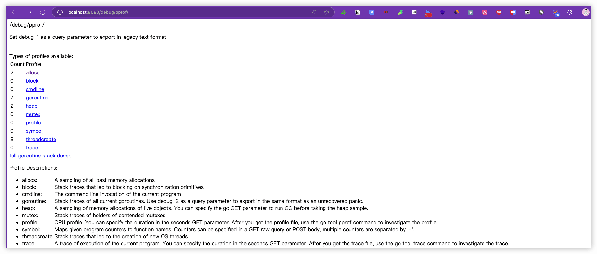

这个页面里列出了多种类型的性能采集数据，**点击其中任何一个即可完成该种类型性能数据的一次采集**。profile是CPU类型数据的服务端点，点击该端点后，该服务默认会发起一次持续30秒的性能采集，得到的数据文件会由浏览器自动下载到本地。如果想自定义采集时长，可以通过为服务端点传递时长参数实现，比如下面就是一个采样60秒的请求：

```
http://localhost:8080/debug/pprof/profile?seconds=60
```


如果独立程序的代码中没有使用http包的默认请求路由器DefaultServeMux，那么我们就需要重新在新的路由器上为pprof包提供的性能数据采集方法注册服务端点


如果是非HTTP服务程序，则在导入包的同时还需单独启动一个用于性能数据采集的goroutine。


通过上面几个示例我们可以看出，相比第一种方式，导入net/http/pprof包进行独立程序性能数据采集的方式侵入性更小，代码也更为独立，并且无须停止程序，通过预置好的各类性能数据采集服务端点即可随时进行性能数据采集。

#### 3 性能数据的剖析

Go工具链通过pprof子命令提供了两种性能数据剖析方法：**命令行交互式和Web图形化**。命令行交互式的剖析方法更常用，也是基本的性能数据剖析方法；而基于Web图形化的剖析方法在剖析结果展示上更为直观。

##### 命令行交互方式

三种方式执行go tool pprof以进入采用命令行交互式的性能数据剖析环节：

```sh
// 剖析通过性能基准测试采集的数据
$ go tool pprof xxx.test cpu.prof 
// 剖析独立程序输出的性能采集数据
$ go tool pprof standalone_app cpu.prof 
// 通过net/http/pprof注册的性能采集数据服务端点获取数据并剖析
$ go tool pprof http://localhost:8080/debug/pprof/profile
```


以pprof_standalone1.go这个示例的性能采集数据为例，看一下在命令行交互式的剖析环节，有哪些常用命令可用。

首先生成CPU类型性能采集数据：

```sh
$ go build -o pprof_standalone1 pprof_standalone1.go
$ ./pprof_standalone1 -cpuprofile pprof_standalone1_cpu.prof
^Cprogram exit
```

通过`go tool pprof`命令进入命令行交互模式：

```sh
$ go tool pprof pprof_standalone1 pprof_standalone1_cpu.prof
File: pprof_standalone1
Type: cpu
Time: 2025-07-23 21:36:26 CST
Duration: 6.73s, Total samples = 40ms ( 0.59%)
Entering interactive mode (type "help" for commands, "o" for options)
(pprof) 
```

从pprof子命令的输出中我们看到：程序运行6.73s，采样总时间为40ms，占总时间的0.59%。

最常用的命令是topN（N为数字，如果不指定，默认等于10）：

```sh
(pprof) top
Showing nodes accounting for 40ms, 100% of 40ms total
Showing top 10 nodes out of 16
      flat  flat%   sum%        cum   cum%
      20ms 50.00% 50.00%       20ms 50.00%  runtime.kevent
      10ms 25.00% 75.00%       10ms 25.00%  fmt.Fprintln
      10ms 25.00%   100%       10ms 25.00%  runtime.pthread_cond_signal
         0     0%   100%       10ms 25.00%  fmt.Println (inline)
         0     0%   100%       10ms 25.00%  main.main
         0     0%   100%       20ms 50.00%  runtime.findRunnable
         0     0%   100%       10ms 25.00%  runtime.main
         0     0%   100%       30ms 75.00%  runtime.mcall
         0     0%   100%       20ms 50.00%  runtime.netpoll
         0     0%   100%       10ms 25.00%  runtime.notewakeup
(pprof)
```

🔖

```sh
(pprof) top -cum
```


```sh
(pprof) list main.main
```


```sh
(pprof) list time.Sleep
```


还可以生成CPU采样数据的函数调用图:

```sh
(pprof) png
Generating report in profile001.png
```


##### Web图形化方式

```sh
$ go tool pprof -http=:9090 pprof_standalone1_cpu.prof
```


### 60.2 使用pprof进行性能剖析的实例 🔖🔖

#### 1 待优化程序（step0）


#### 2 CPU类性能数据采样及数据剖析（step1）


```sh
$ go test -v -run=^$ -bench=.
goos: darwin
goarch: arm64
pkg: gofirst/ch60pprof/2/step1
cpu: Apple M1
BenchmarkHi
BenchmarkHi-8             675636              1499 ns/op
PASS
ok      gofirst/ch60pprof/2/step1       1.240s

```


```sh
$ go test -v -run=^$ -bench=^BenchmarkHi$ -benchtime=2s -cpuprofile=cpu.prof
goos: darwin
goarch: arm64
pkg: gofirst/ch60pprof/2/step1
cpu: Apple M1
BenchmarkHi
BenchmarkHi-8            1585893              1561 ns/op
PASS
ok      gofirst/ch60pprof/2/step1       4.176s

$ go tool pprof step1.test cpu.prof
File: step1.test
Type: cpu
Time: 2025-07-23 22:01:33 CST
Duration: 3.73s, Total samples = 3.39s (90.85%)
Entering interactive mode (type "help" for commands, "o" for options)
(pprof) top -cum
Showing nodes accounting for 1.41s, 41.59% of 3.39s total
Dropped 56 nodes (cum <= 0.02s)
Showing top 10 nodes out of 131
      flat  flat%   sum%        cum   cum%
         0     0%     0%      2.38s 70.21%  gofirst/ch60pprof/2/step1.BenchmarkHi
     0.01s  0.29%  0.29%      2.38s 70.21%  gofirst/ch60pprof/2/step1.handleHi
         0     0%  0.29%      2.38s 70.21%  testing.(*B).launch
         0     0%  0.29%      2.38s 70.21%  testing.(*B).runN
     1.40s 41.30% 41.59%      1.40s 41.30%  runtime.memmove
         0     0% 41.59%      1.37s 40.41%  bytes.(*Buffer).Write
         0     0% 41.59%      1.37s 40.41%  net/http/httptest.(*ResponseRecorder).Write
         0     0% 41.59%      0.94s 27.73%  runtime.systemstack
         0     0% 41.59%      0.92s 27.14%  regexp.MatchString
         0     0% 41.59%      0.90s 26.55%  regexp.Compile (inline)
(pprof) list handleHi
Total: 3.39s
ROUTINE ======================== gofirst/ch60pprof/2/step1.handleHi in /Users/andyron/myfield/github/LearnGo/Go语言第一课/gofirst/ch60pprof/2/step1/demo.go
      10ms      2.38s (flat, cum) 70.21% of Total
         .          .     13:func handleHi(w http.ResponseWriter, r *http.Request) {
      10ms      930ms     14:   if match, _ := regexp.MatchString(`^\w*$`, r.FormValue("color")); !match {
         .          .     15:           http.Error(w, "Optional color is invalid", http.StatusBadRequest)
         .          .     16:           return
         .          .     17:   }
         .          .     18:   visitNum := atomic.AddInt64(&visitors, 1)
         .       30ms     19:   w.Header().Set("Content-Type", "text/html; charset=utf-8")
         .      1.37s     20:   w.Write([]byte("<h1 style='color: " + r.FormValue("color") +
         .       50ms     21:           "'>Welcome!</h1>You are visitor number " + fmt.Sprint(visitNum) + "!"))
         .          .     22:}
         .          .     23:
         .          .     24:func main() {
         .          .     25:   log.Printf("Starting on port 8080")
         .          .     26:   http.HandleFunc("/hi", handleHi)
(pprof) 

```


#### 3 第一次优化（step2）


```sh
$ go test -v -run=^$ -bench=.
goos: darwin
goarch: arm64
pkg: gofirst/ch60pprof/2/step2
cpu: Apple M1
BenchmarkHi
BenchmarkHi-8            5292670               226.6 ns/op           298 B/op          4 allocs/op
PASS
ok      gofirst/ch60pprof/2/step2       1.916s

```


#### 4 内存分配采样数据剖析


#### 5 第二次优化（step3）


#### 6 零内存分配（step4）


#### 7 查看并发下的阻塞情况（step5）


## 61 使用expvar输出度量数据，辅助定位性能瓶颈点

上一条提到，要想对Go应用存在的**性能瓶颈进行剖析**，首先就要对不同类型的性能数据进行收集和采样。

有两种收集和采样数据的方法。在微观层面，采用通过运行性能基准测试收集和采样数据的方法，这种方法适用于**定位函数或方法实现**中存在性能瓶颈点的情形；在宏观层面，采用独立程序收集和采样数据的方法。但通过独立程序进行性能数据采样时，往往很难快速捕捉到真正的瓶颈点，尤其是对于那些**内部结构复杂、业务逻辑过多、内部有较多并发的**Go程序。我们在对这样的程序进行性能采样时，真正的瓶颈点很可能被其他数据遮盖。

那么**如何能更高效地捕捉到应用的性能瓶颈点呢**？

需要知道Go应用运行状态（一般以**度量数据**的形式呈现）。通过了解应用**关键路径**上的度量数据，可以确定在某个度量点上应用的性能是符合预期性能指标还是较大偏离预期，这样就可以最大限度地缩小性能瓶颈点的搜索范围，从而快速定位应用中的瓶颈点并进行优化。

这些可以反映应用运行状态的数据也被称为应用的==内省（introspection）数据==。相比于通过查询应用外部特征而获取的==探针类（probing）数据==（比如查看应用某端口是否有响应并返回正确的数据或状态码），内省数据可以传达更为丰富、更多的有关应用程序状态的上下文信息。这些上下文信息可以是应用**对各类资源的占用信**息，比如应用运行占用了多少内存空间，也可以是**自定义的性能指标信息**，比如<u>单位时间处理的外部请求数量、应答延迟、队列积压量等</u>。

传统编程语言（如C++、Java等）并没有内置输出应用状态度量数据的设施（接口方式、指标定义方法、数据输出格式等），需要开发者自己通过编码实现或利用第三方库实现。

Go标准库提供的`expvar`包可以**按统一接口、统一数据格式、一致的指标**定义方法输出自定义的度量数据。

> `expvar` 包的全称是 **Exported Variables**（导出变量）。其核心功能：**将 Go 程序内部的运行时变量（如计数器、内存状态、自定义指标）以标准化方式导出**，供外部监控系统访问和分析。

### 61.1 expvar包的工作原理

Go标准库中的expvar包提供了一种**输出应用内部状态信息的==标准化方案==**：

- 数据输出接口形式；  
- 输出数据的编码格式；
- 用户自定义性能指标的方法。

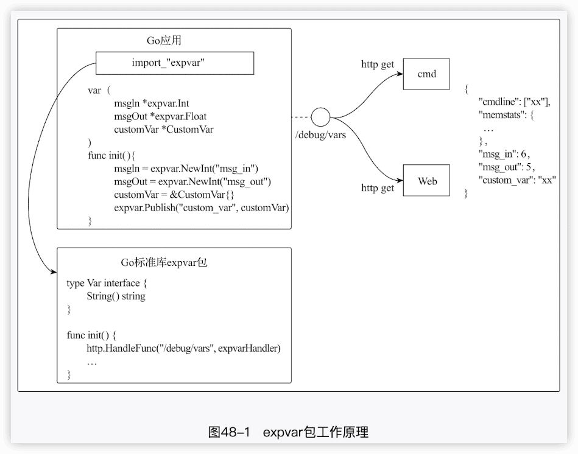

导入expvar：

```go
import _ "expvar"
```

和net/http/pprof类似，expvar包也在自己的init函数中向http包的默认请求“路由器”`DefaultServeMux`🔖注册一个服务端点/debug/vars：

```
/ $GOROOT/src/expvar/expvar.go

func init() {
	http.HandleFunc("/debug/vars", expvarHandler)
	...
}
```

这个服务端点就是expvar提供给外部的获取应用内部状态的**唯一标准接口**，外部工具（无论是命令行还是基于Web的图形化程序）都可以通过标准的http get请求从该服务端点获取应用内部状态数据。

```go
package main

import (
	_ "expvar"
	"fmt"
	"net/http"
)

func main() {
	http.Handle("/hi", http.HandlerFunc(func(w http.ResponseWriter, r *http.Request) {
		w.Write([]byte("hi"))
	}))
	fmt.Println(http.ListenAndServe("localhost:8080", nil))
}

// http://localhost:8080/debug/vars
```


```go
// 手动将expvar包的服务端点注册到应用程序所使用的“路由器”上
func main() {
	mux := http.NewServeMux()
	mux.Handle("/hi", http.HandlerFunc(func(w http.ResponseWriter, r *http.Request) {
		w.Write([]byte("hi2"))
	}))
	mux.Handle("/debug/vars", expvar.Handler())
	fmt.Println(http.ListenAndServe("localhost:8080", mux))
}
```


如果应用程序本身并没有启动HTTP服务，那么还需在一个单独的goroutine中启动一个HTTP服务，这样expvar提供的服务才能有效。


```json
{
  "cmdline": [
  "/var/folders/8k/ntbhdf615p34cflx1_qwv38r0000gn/T/go-build899428462/b001/exe/expvar_demo2"
  ],
  "memstats": {
    "Alloc": 272512,
    "TotalAlloc": 272512,
    "Sys": 6966288,
    "Lookups": 0,
    "Mallocs": 1201,
    "Frees": 90,
    "HeapAlloc": 272512,
    "HeapSys": 3899392,
    ...
  }
}
```

在默认返回的状态数据中包含了两个字段：cmdline和memstats。这两个输出数据是expvar包在init函数中就已经发布（Publish）了的变量：

```go
//$GOROOT/src/expvar/expvar.go

func init() {
  http.HandleFunc("/debug/vars", expvarHandler)
  Publish("cmdline", Func(cmdline))
  Publish("memstats", Func(memstats))
}
```

cmdline字段的含义是输出数据的应用名，这里因为是通过go run运行的应用，所以cmdline的值是一个临时路径下的应用。

而memstats输出的数据对应的是`runtime.Memstats`结构体，反映的是应用在**运行期间堆内存分配、栈内存分配及GC的状态**。runtime.Memstats结构体的字段可能会随着Go版本的演进而发生变化，其字段具体含义可以参考Memstats结构体中的注释。

### 61.2 自定义应用通过expvar输出的度量数据

上文两个标准：

- 标准的接口：通过http get（默认从/debug/vars服务端点获取数据）。
- 标准的数据编码格式：JSON。

第三个标准：

- 自定义输出的度量数据的标准方法。

在图48-1中我们发现，从debug/vars服务端点获取到的JSON结果数据中有一个名为custom_var的字段，这是一个自定义的度量数据。

通过在init函数中添加发布函数，而添加到返回结果中：

```go
func init() {
    expvar.Publish("custom_var", customVar)
}
```

expvar包提供了Publish函数，该函数用于发布通过debug/vars服务端点输出的数据，上面expvar内置输出的cmdline和memstats就是通过Publish函数发布的。Publish函数的原型如下：

```go
// $GOROOT/src/expvar/expvar.go
func Publish(name string, v Var)

type Var interface {
  String() string
}
```

`name`是对应字段在输出结果中的字段名，而v是字段值，类型为接口`Var`。
所有实现了`Var`接口类型的变量都可以被发布并作为输出的应用内部状态的一部分。

🔖

### 61.3 输出数据的展示

JSON格式文本很容易反序列化，开发者可自行解析后使用，比如：编写一个Prometheus exporter，将数据导入Prometheus背后的存储（比如InfluxDB）中，并利用一些基于Web图形化的方式直观展示出来；或者导入Elasticsearch，再通过Kibana或Grafana的页面展示出来。

Go开发者Ivan Daniluk开发了一款名为expvarmon的开源工具，该工具支持将从expvar输出的数据以基于终端的图形化方式展示出来。

```sh
go install github.com/divan/expvarmon
```

运行expvar_demo6，然后运行：

```sh
$ expvarmon -ports="8080" -vars="custom:customVar.field1,custom:customVar.field2,mem:memstats.Alloc,mem:memstats.Sys,mem:memstats.HeapAlloc,mem:memstats.HeapInuse,duration:memstats.PauseNs,duration:memstats.PauseTotalNs"
```


## 62 使用Delve调试Go代码

软件开发可不只是编码，调试也是每个程序员的必备技能，占据了程序员很大一部分精力。

调试的目标是修正代码中确认存在的bug。

### 62.1 关于调试，你首先应该知道的几件事

#### 1 调试前，首先做好心理准备

#### 2 预防bug的发生，降低bug的发生概率

bug可简单分为**产品发布前bug和产品发布后的bug**。

无论哪一种，都要经历**收集数据、重现bug、定位问题、修正问题和修正后的版本验证**等多个步骤。

这其中发布后的bug花费的成本更高。既然事实证明**调试bug的成本比编码更高**，那我们何不采用一些手段来预防bug的发生，降低bug发生的概率呢？

虽然从一个软件的整个生命周期来看，保证软件质量应从需求开始，但这里我们主要关注**编码阶段**。对于个体开发者，可以从以下几个方面考虑。

- 充分的代码检查。

  充分利用你手头上的工具对你编写的代码进行严格的检查，这些工具包括编译器（尽可能将警告级别提升到你可以接受的最高级别）、静态代码检查工具（linter，如go vet）等。

- 为调试版添加断言。

  在调试版代码中适当的地方添加断言（Go没有提供原生断言机制，可以自行简单实现或利用第三方库），这样的方法同样可以帮助你及时发现代码中隐藏的缺陷。

- 充分的单元测试

- 代码同级评审

#### 3 bug的原因定位和修正

1. 收集“现场数据”

   通过编程语言内置的输出语句（如Go的print、fmt.Printf等）输出我们需要的信息，而更为专业的方法是通过编程语言提供的专业调试工具（如GDB）设置断点来采集现场数据或重现bug。

2. 定位问题所在

   有了“现场数据”，接下来你需要用“火眼金睛”从中找出你真正需要的数据。如果无法直接识别出真数据，那么可以根据数据做几组不同数据组合的模拟测试，在数据变化中去伪存真，找到真数据。有了可信赖的真实数据，你一般都可以根据代码逻辑推理出问题所在。但有些时候还是需要通过隔离代码、缩小嫌疑代码范围等方法才能锁定一些较难bug的具体问题所在。

3. 修正并验证

   既然找到了问题所在，那剩下的工作就是修正它并重现验证。为验证问题已经修复而添加的新测试用例同时也补充了你的单元测试用例库。如果修正失败，那就从头开始新一轮分析。

最后，定期回顾你自己“出产”的bug列表，你可能会发现很多bug是你在预防阶段做得不够好导致的。这样回过头来思考如何在上一个阶段预防此类“漏网之鱼”，就会形成良性循环。

### 62.2 Go调试工具的选择

https://blog.golang.org/survey2019-results


常用的两种调试方式是使用文本输出（fmt.Print等）调试Go代码【print派”】和使用专业调试器（如Delve、GDB）在本机上调试Go代码【“专业工具派”】。

用print语句辅助调试与采用专业调试器对代码进行调试并不矛盾，它们之间是互相补充和相辅相成的。

print辅助调试”更多用于代码可修改的本地环境，通过“**在特定位置添加打印值→编译执行→根据输出结果调查思考**”的调试循环来逐渐逼近“真相”。针对本地环境下的代码调试，专业调试器具有同样的功能，只是调试循环略烦琐，包括**启动调试器→设置断点→在调试器内运行程序→断点处使用命令打印需要的信息→单步调试等→退出调试器**。

但专业调试器可以运用在“print辅助调试”无法胜任的场景下，比如：

- 与IDE集成，通过图形化操作可大幅简化专业调试器的调试循环，提供更佳的体验；
- 事后调查（postmortem）
- 调试core dump文件；
- 在生产环境通过挂接（attach）应用进程，深入应用进程内部进行调试。


GDB显然也不是Go调试工具的最佳选择，虽然其适用于调试带有cgo代码的Go程序或事后调查调试。

Delve（https://github.com/go-delve/delve）是另一个Go语言调试器，该调试器工程于2014年由Derek Parker创建。Delve旨在为Go提供一个简单、功能齐全、易用使用和调用的调试工具。它紧跟Go语言版本演进，是目前Go调试器的事实标准。和GDB相比，Delve的优势在于它可以**更好地理解Go的一切，对并发程序有着很好的支持，支持跨平台（支持Windows、macOS、Linux三大主流平台），而且前后端分离的设计使得它可以非常容易地被集成到各种IDE（如GoLand）、编译器插件（vscode go、vim-go等）、图形化调试器前端（如gdlv）中**。

### 62.3 Delve调试基础、原理与架构 🔖


常用的查看命令：

- print（简写为p）：输出源码中变量的值。
- whatis：输出后面的表达式的类型。
- regs：当前寄存器中的值。
- locals：当前函数栈本地变量列表（包括变量的值）。
- args：当前函数栈参数和返回值列表（包括参数和返回值的值）。
- examinemem（简写为x）：查看某一内存地址上的值。


#### Delve架构与原理

为了便于各种调试器前端（命令行、IDE、编辑器插件、图形化前端）与Delve集成，Delve采用了一个前后分离的架构

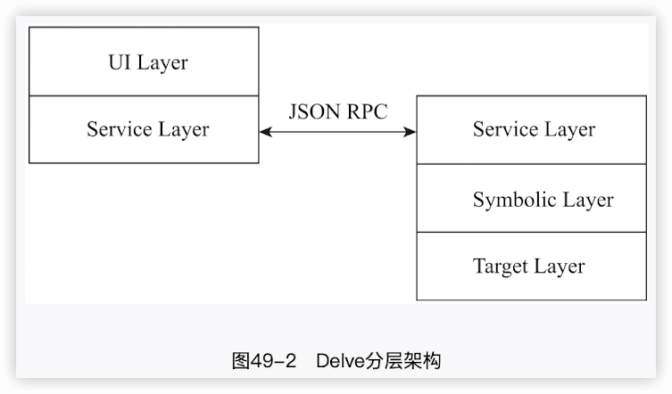

UI Layer对应的就是我们使用的dlv命令行或Goland/vim-go中的调试器前端，而Service Layer显然用于前后端通信。Delve真正施展的“魔法”是由Symbolic Layer和Target Layer两层合作实现的。

Target Layer通过各个操作系统提供的系统API来控制被调试目标进程，它对被调试目标的源码没有任何了解，实现的功能包括：

- 挂接（attach）/分离（detach）目标进程；
- 枚举目标进程中的线程；
- 启动/停止单个线程（或整个进程）；
- 接收和处理“调试事件”（线程创建/退出以及线程在断点处暂停）；
- 读写目标进程的内存；
- 读写停止线程的CPU寄存器；
- 读取core dump文件。

真正了解被调试目标源码文件的是Symbolic Layer，这一层通过读取Go编译器（包括链接器）以DWARF格式（一种标准的调试信息格式）写入目标二进制文件中的调试符号信息来了解被调试目标源码，并实现了被调试目标进程中的地址、二进制文件中的调试符号及源码相关信息三者之间的关系映射：


### 62.4 并发、Coredump文件与挂接进程调试


# Go网络编程


## 63 理解Go TCP Socket网络编程模型

日常编程中，我们可以看到Go语言中的net包及其子目录下的包（如http）均自带高频和刚需的主角光环。而基于TCP Socket（套接字）的通信则是网络编程的主流，即便你没有直接用过net包中有关TCP Socket的函数/方法或接口，你也总用过net/http包。http包实现的是HTTP这个应用层协议，其在传输层使用的依旧是TCP Socket。

Go是自带运行时的跨平台编程语言，Go中暴露给语言使用者的TCP Socket接口是建立在操作系统原生TCP Socket接口之上的。由于Go运行时调度的需要，Go设计了一套适合自己的TCP Socket网络编程模型。

### 63.1 TCP Socket网络编程模型

网络I/O模型定义的是**应用线程与操作系统内核之间的交互行为模式**。

通常用**阻塞（Blocking）和非阻塞（Non-Blocking）**来描述网络I/O模型。不同标准对于网络I/O模型的说法有所不同，比如POSIX.1标准还定义了同步（Sync）和异步（Async）这两个术语来描述模型。

阻塞和非阻塞是**以内核是否等数据全部就绪才返回（给发起系统调用的应用线程）来区分的**。如果内核一直等到全部数据就绪才返回，则这种行为模式称为**阻塞（Blocking）**；如果内核查看数据就绪状态后，即便没有就绪也立即返回错误（给发起系统调用的应用线程），则这种行为模式称为**非阻塞（Non-Blocking）**。

常用的网络I/O模型包括:

#### 1 阻塞I/O模型

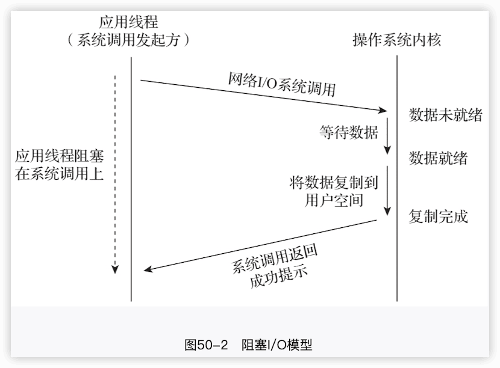

#### 2 非阻塞I/O模型

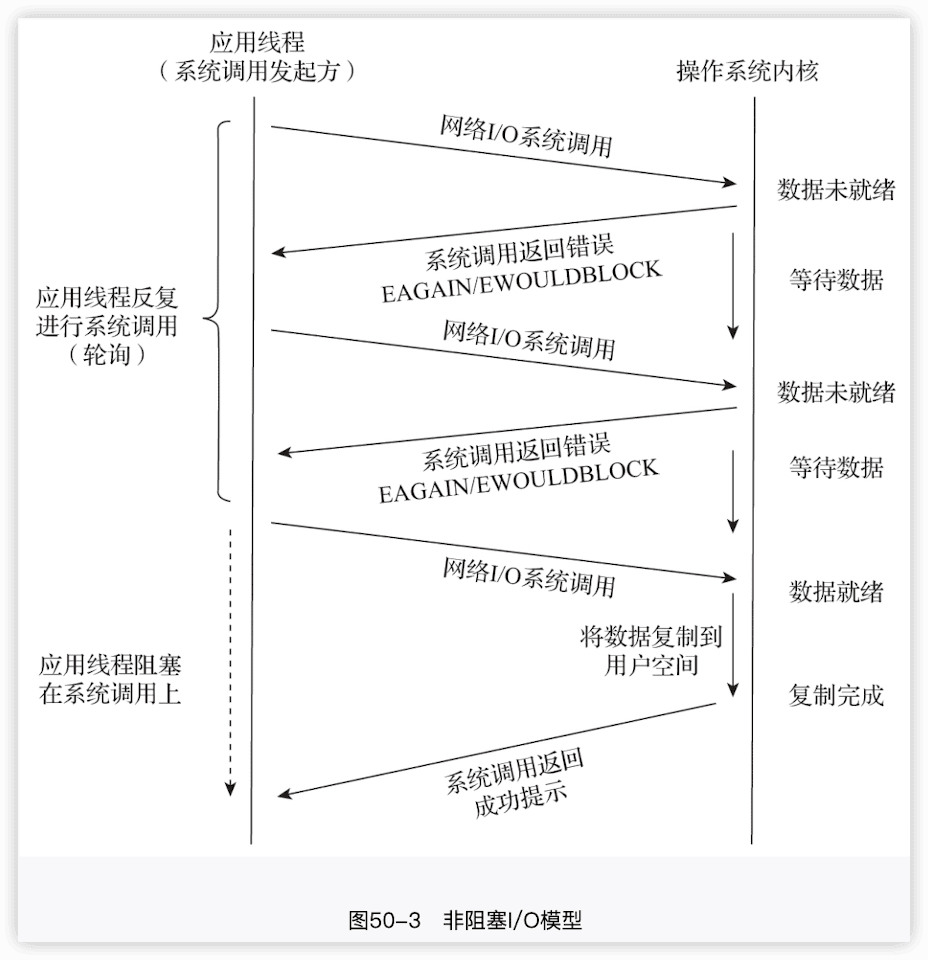


#### 3 I/O多路复用模型

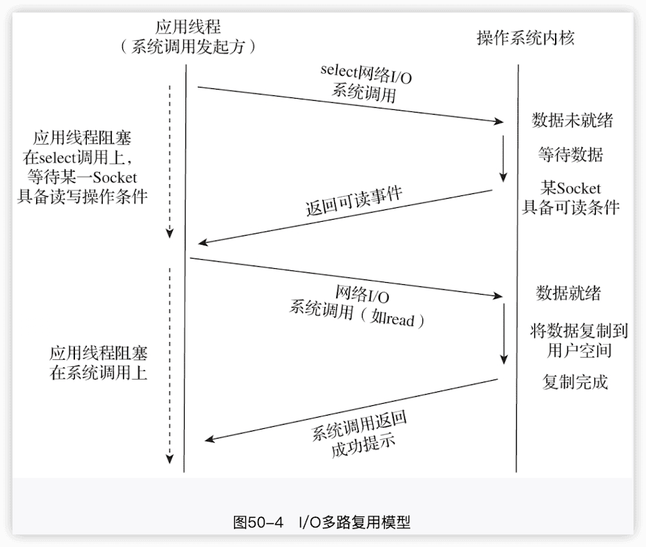


#### 4 异步I/O模型


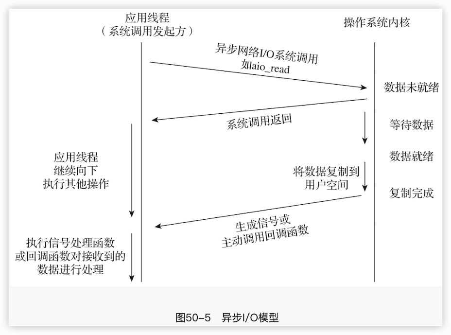


### 63.2 TCP连接的建立

#### 1 网络不可达或对方服务未启动


#### 2 对方服务的listen backlog队列满了


#### 3 若网络延迟较大，Dial将阻塞并超时


### 63.3 Socket读写


通过几个场景来总结一下conn.Read的行为特点

#### 1 Socket中无数据


#### 2 Socket中有部分数据


#### 3 Socket中有足够多的数据


#### 4 Socket关闭


#### 5 读操作超时


#### 6 成功写


#### 7 写阻塞


#### 8 写入部分数据


#### 9 写入超时


#### 10 goroutine安全的并发读写


### 63.4 Socket属性


### 63.5 关闭连接


## 64 使用net/http包实现安全通信 🔖


### 64.1 HTTPS：在安全传输层上运行的HTTP协议


HTTPS协议就是用来解决传统HTTP协议明文传输不安全的问题的。与普通HTTP协议不同，HTTPS协议在传输层（TCP协议）和应用层（HTTP协议）之间增加了一个==安全传输层==：

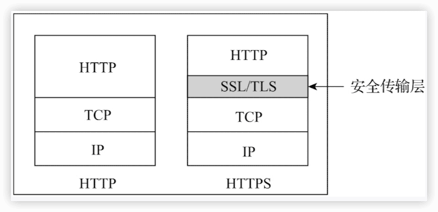

安全传输层通常采用**SSL（Secure Socket Layer）**或**TLS（Transport Layer Security）**协议实现（Go标准库支持TLS 1.3版本协议）。这一层负责HTTP协议传输的**内容加密、通信双方身份验证**等。有了这一层后，HTTP协议就摇身一变，成为拥有**加密、证书身份验证和内容完整性保护功能**的HTTPS协议了。或者反过来说，==HTTPS协议就是在安全传输层上运行的HTTP协议==。


用openssl工具可以生成该示例中HTTPS Web服务所需的server.key和server.crt，并让这个示例中的服务运行起来：

```sh
$ openssl genrsa -out server.key 2048
$ openssl req -new -x509 -key server.key -out server.crt -days 365
```


### 64.2 HTTPS安全传输层的工作机制


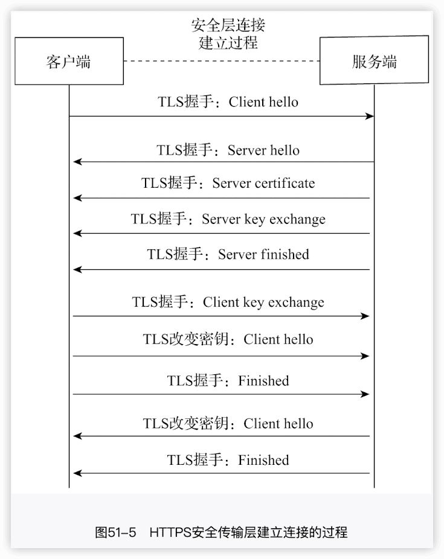


### 64.3 非对称加密和公钥证书


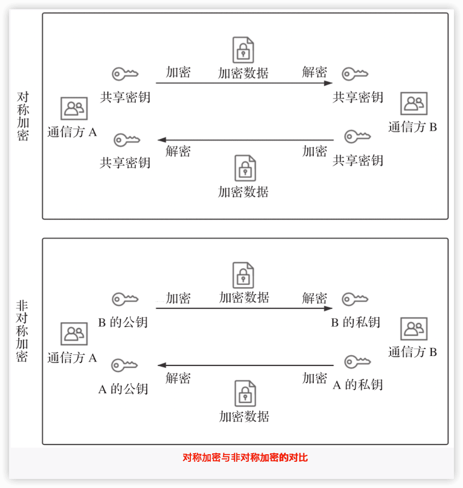


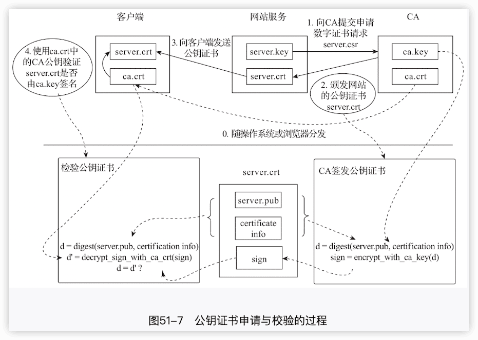


### 64.4 对服务端公钥证书的校验


### 64.5 对客户端公钥证书的校验


# 补充2

## 65 掌握字符集的原理和字符编码方案间的转换

Go语言源码默认使用Unicode字符集，并采用UTF-8编码方案，Go还提供了rune原生类型来表示Unicode字符。

### 65.1 字符与字符集


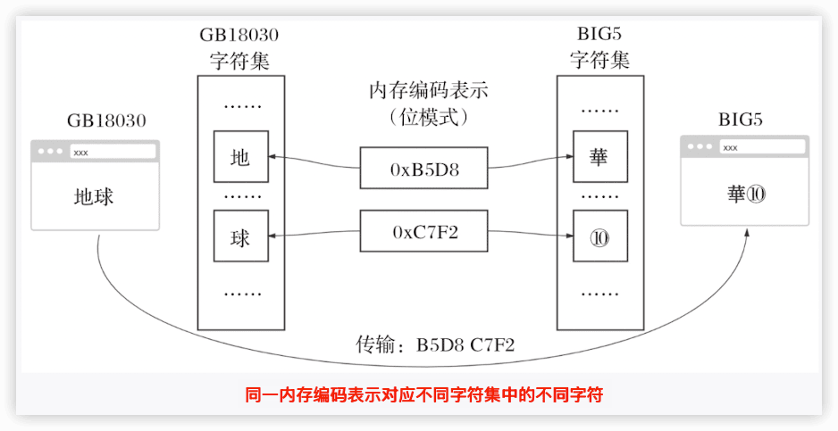


### 65.2 Unicode字符集的诞生与UTF-8编码方案


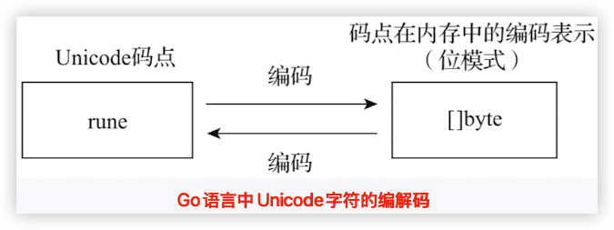


### 65.3 字符编码方案间的转换


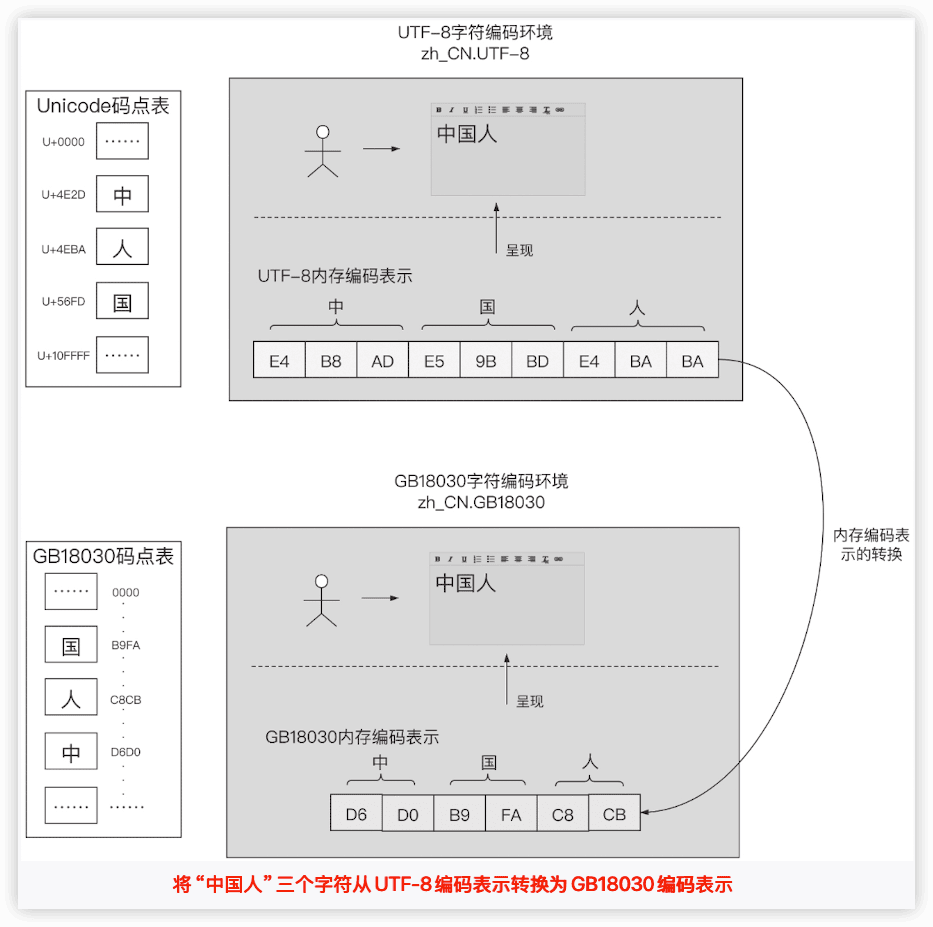


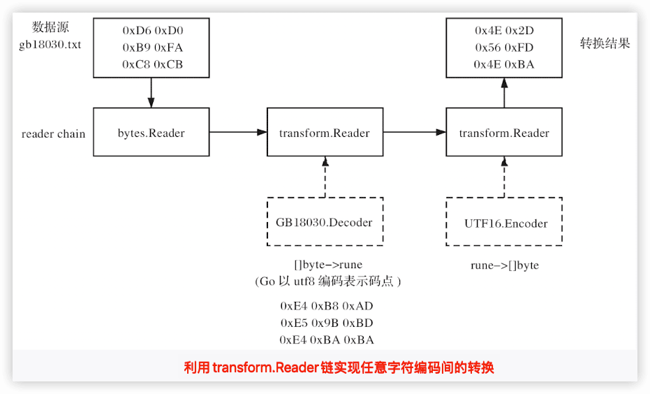


## 66 time包 🔖

常见的时间操作有获取当前时间、时间比较、时区相关的时间操作、时间格式化、定时器（一次性定时器timer和重复定时器ticker）的使用等。

### 66.1 时间的基础操作

#### 1 获取时间

```go
time.Now()
```

time包将Time类型用作对一个**即时时间（time instant）**的抽象。

```go
type Time struct {
  wall uint64
  ext  int64
  loc *Location
}
```

由三个字段组成的Time结构体要同时表示两种时间——==挂钟时间（wall time）==和==单调时间（monotonic time）==，并且精度级别为纳秒。

闰秒🔖


time.Time结构体字段wall的最高比特位是一个名为`hasMonotonic`的**标志比特位**。当hasMonotonic被置为1时，time.Time表示的即时时间中既包含挂钟时间，也包含单调时间。下图是当Time同时包含这两种时间表示时（hasMonotonic比特位被置为1）的原理示意图（基于Go 1.14版本）。

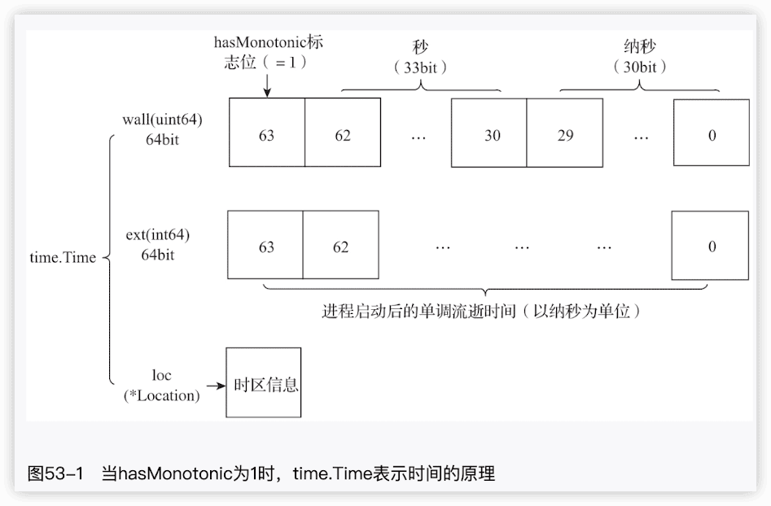

🔖

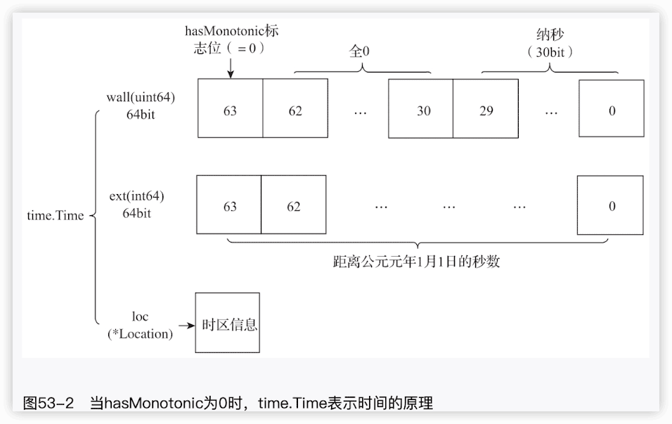


#### 2 获取特定时区的当前时间


#### 3 时间的比较与运算


### 66.2 时间的格式化输出

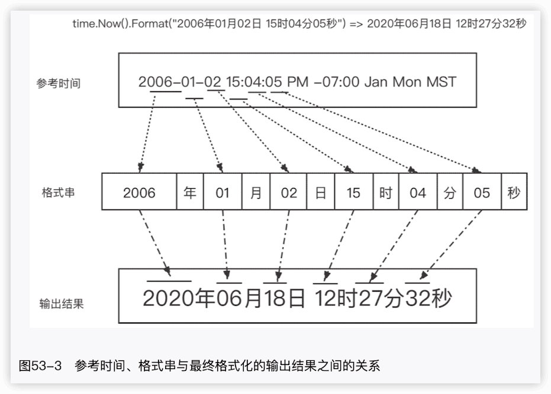


### 66.3 定时器的使用

Timer的三种创建方式：NewTimer、AfterFunc和After。

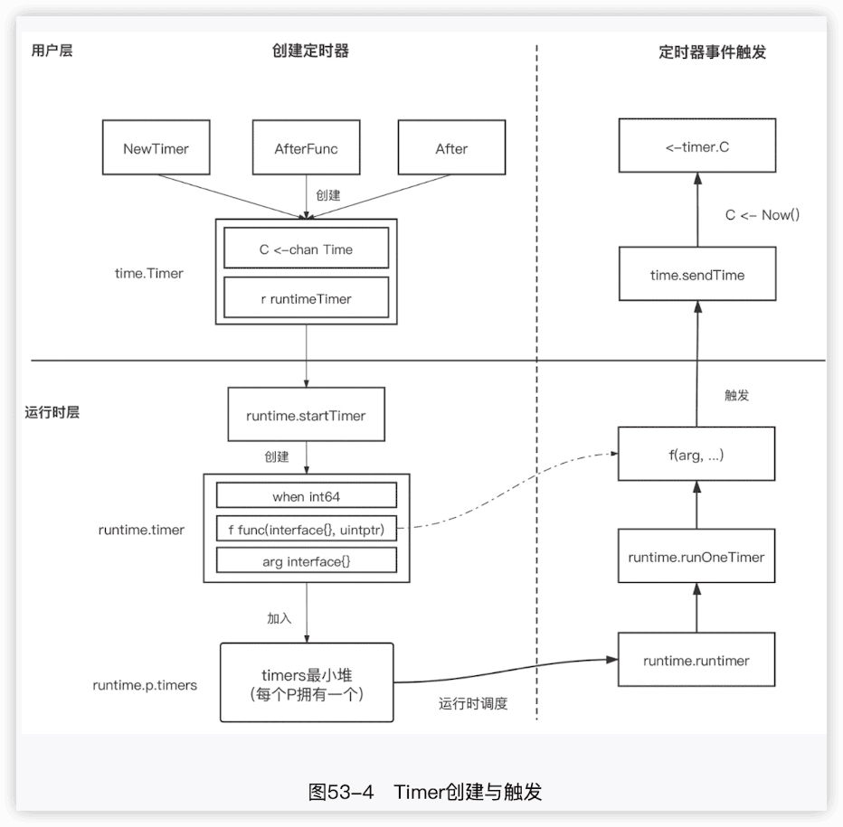


## 67 对系统信号的处理

Go多用于后端应用编程，而后端应用多以守护进程（daemon）的方式运行于机器上。守护程序对健壮性的要求甚高，即便是在退出时也要求做好收尾和清理工作，称之为==优雅退出==。在Go中，通过系统信号是实现优雅退出的一种常见手段。

### 67.1 为什么不能忽略对系统信号的处理

==系统信号（signal）==是一种软件中断，它提供了一种异步的事件处理机制，用于操作系统内核或其他应用进程通知某一应用进程发生了某种事件。

比如：一个在终端前台启动的程序，当用户按下中断键（一般是ctrl+c）时，该程序的进程将会收到内核发来的中断信号（SIGINT）。

```go
func main() {
	var wg sync.WaitGroup
	errChan := make(chan error, 1)
	http.HandleFunc("/", func(w http.ResponseWriter, r *http.Request) {
		fmt.Fprintf(w, "Hello, Singal!\n")
	})
	wg.Add(1)
	go func() {
		defer wg.Done()
		errChan <- http.ListenAndServe(":8080", nil)
	}()

	select {
	case <-time.After(2 * time.Second):
		fmt.Println("web server start ok")
	case err := <-errChan:
		fmt.Printf("web server start failed: %v\n", err)

	}
	wg.Wait()
	fmt.Println("web server shutdown ok")
}
```

```sh
$ go build -o httpserv signal.go
./httpserv
web server start ok
```


应用程序收到系统信号后，一般有三种处理方式。

1. 执行系统默认处理动作

对于中断键触发的SIGINT信号，系统的默认处理动作是终止该应用进程，这是以上示例采用的信号处理方式，也是以上示例没有输出退出提示就退出了的原因。对于大多数系统信号，系统默认的处理动作是终止该进程。

2. 忽略信号

3. 捕捉信号并执行自定义处理动作

可以**预先提供一个包含自定义处理动作的函数**，并告知系统在接收到某些信号时调用这个函数。系统中有两个系统信号是不能被捕捉的：终止程序信号SIGKILL和挂起程序信号SIGSTOP。

**服务端程序**一般都是以**守护进程**的形式运行在后台的，并且一般都是通过系统信号通知这些守护程序执行退出操作的。

在这样的情况下，如果选择以系统默认处理方式处理这些退出通知信号，那么守护进程将会被直接杀死，没有任何机会执行清理和收尾工作，比如：**等待尚未处理完的事务执行完毕，将未保存的数据强制落盘，将某些尚未处理的消息序列化到磁盘（等下次启动后处理）**等。这将导致某些处理过程被强制中断而丢失消息，留下无法恢复的现场，导致消息被破坏，甚至会影响下次应用的启动运行。

因此，对于运行在生产环境下的程序，不要忽略对系统信号的处理，**而应采用捕捉退出信号的方式执行自定义的收尾处理函数**。

### 67.2 Go语言对系统信号处理的支持

**信号机制**的历史久远，早在最初的Unix系统版本上就能看到它的身影。信号机制也一直在演进，从最初的**不可靠信号机制**到后来的**可靠信号机制**，直到POSIX.1将其标准化，系统信号机制才稳定下来，但各个平台对信号机制的支持仍有差异。可以通过`kill -l`命令查看各个系统对信号的支持情况：

```sh
// Ubuntu 18.04
$kill -l
1) SIGHUP        2) SIGINT          3) SIGQUIT        4) SIGILL         5) SIGTRAP
6) SIGABRT       7) SIGBUS          8) SIGFPE         9) SIGKILL       10) SIGUSR1
11) SIGSEGV      12) SIGUSR2        13) SIGPIPE       14) SIGALRM       15) SIGTERM
16) SIGSTKFLT    17) SIGCHLD        18) SIGCONT       19) SIGSTOP       20) SIGTSTP
21) SIGTTIN      22) SIGTTOU        23) SIGURG        24) SIGXCPU       25) SIGXFSZ
26) SIGVTALRM    27) SIGPROF        28) SIGWINCH      29) SIGIO         30) SIGPWR
31) SIGSYS       34) SIGRTMIN       35) SIGRTMIN+1    36) SIGRTMIN+2    37) SIGRTMIN+3
38) SIGRTMIN+4   39) SIGRTMIN+5     40) SIGRTMIN+6    41) SIGRTMIN+7    42) SIGRTMIN+8
43) SIGRTMIN+9   44) SIGRTMIN+10    45) SIGRTMIN+11   46) SIGRTMIN+12   47) SIGRTMIN+13
48) SIGRTMIN+14  49) SIGRTMIN+15    50) SIGRTMAX-14   51) SIGRTMAX-13   52) SIGRTMAX-12
53) SIGRTMAX-11  54) SIGRTMAX-10    55) SIGRTMAX-9    56) SIGRTMAX-8    57) SIGRTMAX-7
58) SIGRTMAX-6   59) SIGRTMAX-5     60) SIGRTMAX-4    61) SIGRTMAX-3    62) SIGRTMAX-2
63) SIGRTMAX-1   64) SIGRTMAX   

// macOS 10.14.6
$kill -l
HUP INT QUIT ILL TRAP ABRT EMT FPE KILL BUS SEGV SYS PIPE ALRM TERM URG STOP TSTP CONT CHLD TTIN TTOU IO XCPU XFSZ VTALRM PROF WINCH INFO USR1 USR2
```

其中每个信号都包含**信号名称**（signal name，比如：SIGINT）和**信号编号**（signal number，比如：SIGINT的编号是2）。

kill命令可以将特定信号（通过信号名称或信号编号）发送给某应用进程：

```sh
$kill -s signal_name pid // 如kill -s SIGINT 20023
$kill -signal_number pid // 如kill -2 20023
```

信号机制经过多年演进，已经变得十分复杂和烦琐（考虑多种平台对标准的支持程度不一），比如不可靠信号、可靠信号、阻塞信号、信号处理函数的可重入等。如果让开发人员自己来处理这些复杂性，那么势必是一份不小的心智负担。Go语言将这些复杂性留给了运行时层，为用户层提供了体验相当友好接口——`os/signal`包。

```go
func Notify(c chan<- os.Signal, sig ...os.Signal)
```

该函数用来设置捕捉那些应用关注的系统信号，并在Go运行时层与Go用户层之间用一个channel相连。Go运行时捕捉到应用关注的信号后，会将信号写入channel，这样监听该channel的用户层代码便可收到该信号通知。下图形象地展示了Go运行时进行系统信号处理以及与用户层交互的原理。

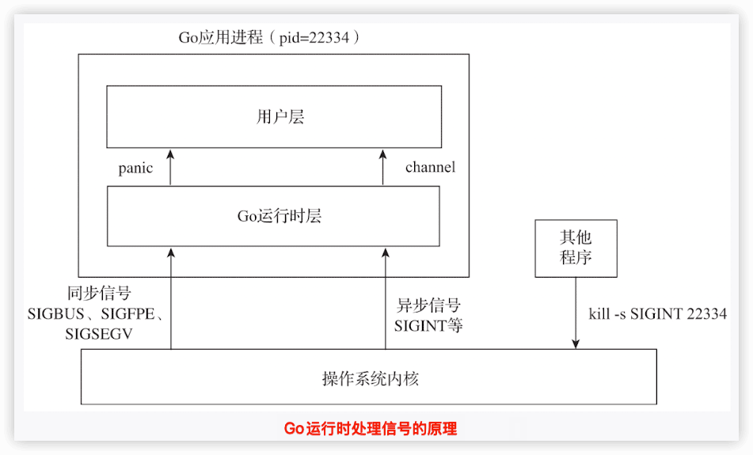

Go运行时与用户层有两个交互点，一个是上面所说的承载信号交互的channel，而另一个则是运行时层引发的panic。

Go将信号分为两大类：

1. 同步信号

   同步信号是指那些由**程序执行错误**引发的信号，包括SIGBUS（总线错误/硬件异常）、SIGFPE（算术异常）和SIGSEGV（段错误/无效内存引用）。一旦应用进程中的Go运行时收到这三个信号中的一个，意味着应用极大可能出现了严重bug，无法继续执行下去，这时Go运行时不会简单地将信号通过channel发送到用户层并等待用户层的异步处理，而是直接将信号转换成一个运行时panic并抛出。如果用户层没有专门的panic恢复代码，那么Go应用将默认异常退出。

2. 异步信号

   同步信号之外的信号都被Go划归为异步信号。异步信号不是由程序执行错误引起的，而是由**其他程序或操作系统内核**发出的。异步信号的默认处理行为因信号而异。

   SIGHUP、SIGINT和SIGTERM这三个信号将导致程序直接退出；

   SIGQUIT、SIGILL、SIGTRAP、SIGABRT、SIGSTKFLT、SIGEMT和SIGSYS在导致程序退出的同时，还会将程序退出时的栈状态打印出来；

   SIGPROF信号则是被Go运行时用于实现**运行时CPU性能剖析指标采集**。

   其他信号不常用，均采用操作系统的默认处理动作。对于用户层通过Notify函数捕获的信号，Go运行时则通过channel将信号发给用户层。

Notify无法捕捉SIGKILL和SIGSTOP（操作系统机制决定的），也无法捕捉同步信号（Go运行时决定的），只有捕捉异步信号才是有意义的。下面的例子直观展示了无法被捕获的信号、同步信号及异步信号的运作机制：

```go
package main

import (
	"fmt"
	"os"
	"os/signal"
	"sync"
	"syscall"
	"time"
)

// 直观展示了无法被捕获的信号、同步信号及异步信号的运作机制

func catchAsyncSignal(c chan os.Signal) {
	for {
		s := <-c
		fmt.Println("收到异步信号:", s)
	}
}

func triggerSyncSignal() {
	time.Sleep(3 * time.Second)
	defer func() {
		if e := recover(); e != nil {
			fmt.Println("恢复panic:", e)
			return
		}
	}()
	var a, b = 1, 0
	fmt.Println(a / b)
}

func main() {
	var wg sync.WaitGroup
	c := make(chan os.Signal, 1)
	signal.Notify(c, syscall.SIGFPE, syscall.SIGINT, syscall.SIGKILL)

	wg.Add(2)
	go func() {
		catchAsyncSignal(c)
		wg.Done()
	}()

	go func() {
		triggerSyncSignal()
		wg.Done()
	}()

	wg.Wait()
}
```

🔖


如果多次调用Notify拦截某信号，但每次调用使用的channel不同，那么当应用进程收到异步信号时，Go运行时会给每个channel发送一份异步信号副本：

```
```

🔖


### 67.3 使用系统信号实现程序的优雅退出

**==优雅退出（gracefully exit）==**指程序在退出前有机会等待尚未完成的事务处理、清理资源（比如关闭文件描述符、关闭socket）、保存必要中间状态、持久化内存数据（比如将内存中的数据落盘到文件中）等。

与优雅退出对立的是==强制退出==，也就是常说的使用kill -9，即kill -s SIGKILL pid。

🔖


## 68 理解标准库的读写模型

Go标准库读写模型

Go基于io.Writer和io.Reader这两个简单的接口类型构建了下图所示的Go标准库读写模型。

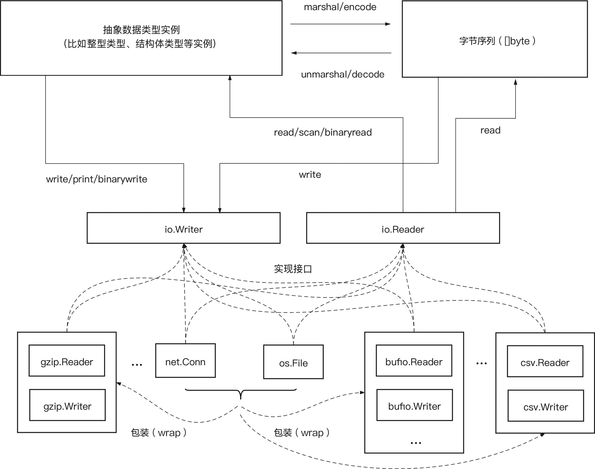

### 直接读写字节序列


### 直接读写抽象数据类型实例


### 通过包裹类型读写数据


## 69 掌握unsafe包的安全使用模式

C语言是一门静态类型语言，**但它却不是类型安全的语言**，可以通过合法的语法轻易“刺透”其==类型系统==：

```c
int main() {
    int a = 0x12345678;
    unsigned char *p = (unsigned char *)&a;
    printf("0x%x\n", a);
    *p = 0x23;
    *(p + 1) = 0x45;
    *(p+2) = 0x67;
    *(p+3) = 0x8a;
    printf("0x%x\n", a); // 0x8a674523 (注：在小端字节序系统中输出此值)
}
```

原本被解释成int类型的一段内存数据（地址为&a）被重新解释成了unsigned char类型数组并可被任意修改。

但在Go语言中，无法通过**常规语法手段**穿透Go在类型系统层面对内存数据的保护的:

```go
func main() {
	a := 0x12345678
	fmt.Printf("%x\n", a)

	var p *byte = (*byte)(&a) // 错误！不允许将&a从*int类型显式转型为*byte类型

	*p = 0x23
	var b byte = byte(a)    // b是一个新变量，有自己所解释的内存空间
	b = 0x23                // 即便强制进行类型转换，原变量a所解释的内存空间的数据依然不变
	fmt.Printf("0x%x\n", b) // 0x23
	fmt.Printf("0x%x\n", a) // 0x12345678
}
```

与C语言相比，**Go在常规操作下是类型安全的**（注：并非绝对的类型安全，绝对的类型安全需要在数学上的形式化证明）。

所谓==类型安全==是指一块内存数据一旦被特定的类型所解释（该内存数据与该类型变量建立关联，也就是变量定义），它就不能再被解释为其他类型，不能再与其他类型变量建立关联。就像上面示例中的变量a，一旦被解释为int类型（a := 0x12345678），它就与某块内存（起始地址为&a，长度为int类型的大小）建立了关联，那么这块内存（&a）就不能再与其他类型（如byte）变量建立关联。

Go语言的类型安全是建立在**Go编译器的静态检查以及Go运行时利用类型信息进行的运行时检查**之上的。在语法层面，为了实现常规操作下的类型安全，Go对语法做了诸多限制。

1. 支持隐式类型转换，所有类型转换必须显式进行

```go
var i int = 17
var j uint64 = i             // 错误：int类型值不能直接赋值给uint64类型变量
var j uint64 = uint64(i)         // 没问题
```

只有**底层类型（underlying type）**相同的两个类型的指针之间才能进行类型转换。

```go
var i int = 11
var p *uint64 = (*uint64)(&i)     // 错误：*int类型不能转换为*uint64类型
type MyInt int
var p *MyInt = (*MyInt)(&i)    // 没问题，MyInt的底层类型为int
```

2. 不支持指针运算

```go
var a [100]int
var p *int = &a[0]
*(p+1) = 10             // 错误：*int类型与int类型无法相加，即不能跨越数组元素的边界
```

不过，Go最初的定位是**系统编程语言**，在考虑类型安全的同时，语言的设计者们还要兼顾性能以及如何实现与操作系统、C代码等互操作的低级代码等问题。最终，Go语言的设计者们选择了在类型系统上开一道“后门”的方案，即在标准库中内置一个特殊的Go包——`unsafe包`。

“后门”意味着**收益与风险并存**。使用unsafe包可以实现**性能更高、与底层系统交互更容易的低级代码**，但unsafe包的存在也让我们有了绕过Go类型安全屏障的“路径”。一旦使用该包不当，便可能会导致引入安全漏洞、引发程序崩溃（panic）等问题，并且难于发现和调试。

为此，Go设计者们明确了unsafe包的安全使用模式。在本条中，我们就来一起了解一下使用unsafe包编写出安全代码的模式。

### 69.1 简洁的unsafe包

```go
// $GOROOT/src/unsafe/unsafe.go
package unsafe
func Alignof(x ArbitraryType) uintptr
func Offsetof(x ArbitraryType) uintptr
func Sizeof(x ArbitraryType) uintptr
type ArbitraryType int
type Pointer *ArbitraryTyp
```

虽然位于unsafe包中，但Alignof、Offsetof和Sizeof这三个函数的使用是绝对安全的。

- `Sizeof`用于获取一个表达式值的大小

```go
func main() {
	type Foo struct {
		a int
		b string
		c [10]byte
		d float64
	}
	var i int = 5
	var a = [100]int{}
	var sl = a[:]
	var f Foo

	fmt.Println(unsafe.Sizeof(i))           // 8
	fmt.Println(unsafe.Sizeof(a))           // 800
	fmt.Println(unsafe.Sizeof(sl))          // 24 (注：返回的是切片描述符的大小)
	fmt.Println(unsafe.Sizeof(f))           // 48
	fmt.Println(unsafe.Sizeof(f.c))         // 10
	fmt.Println(unsafe.Sizeof((*int)(nil))) // 8
	fmt.Println(unsafe.Sizeof(f.b))			// 16
}
```

Sizeof函数不支持直接传入无类型信息的nil值，我们必须显式告知Sizeof传入的nil究竟是什么类型，要么像上面代码那样进行显式转型，要么传入一个值为nil但类型明确的变量，比如`var p *int = nil`。

- Alignof用于获取一个表达式的内存地址对齐系数。

**==对齐系数（alignment factor）==**是一个计算机体系架构（computer architecture）层面的术语。在不同的计算机体系结构下，处理器对变量地址都有着对齐要求，即==变量的地址必须可被该变量的对齐系数整除==。可以用Go代码表述这一要求：

```go
var x unsafe.ArbitraryType // unsafe.ArbitraryType表示任意类型
b := uintptr(unsafe.Pointer(&x)) % unsafe.Alignof(x) == 0
fmt.Println(b) // true
```


```go
	fmt.Println(unsafe.Alignof(i))          // 8
	fmt.Println(unsafe.Alignof(a))          // 8
	fmt.Println(unsafe.Alignof(sl))         // 8
	fmt.Println(unsafe.Alignof(f))          // 8
	fmt.Println(unsafe.Alignof(f.c))        // 1
	fmt.Println(unsafe.Alignof(struct{}{})) // 1  (注：空结构体的对齐系数为1)
	fmt.Println(unsafe.Alignof([0]int{}))   // 8 (注：长度为0的数组，其对齐系数依然与其元素类型的对齐系数相同)
```


- Offsetof用于获取结构体中某字段的地址偏移量（相对于结构体变量的地址）

```go
	fmt.Println(unsafe.Offsetof(f.a)) // 0
	fmt.Println(unsafe.Offsetof(f.b)) // 8
	fmt.Println(unsafe.Offsetof(f.c)) // 24
	fmt.Println(unsafe.Offsetof(f.d)) // 40
```


unsafe包之所以被命名为unsafe，主要是因为该包中定义了`unsafe.Pointer`类型。unsafe.Pointer**可用于表示任意类型的指针**，并且它具备下面四条其他指针类型所不具备的性质：

1. 任意类型的指针值都可以被转换为unsafe.Pointer。

```go
var a int = 5
var b float64 = 5.89
var arr [10]string
var f Foo

p1 := (unsafe.Pointer)(&a)     // *int -> unsafe.Pointer
p2 := (unsafe.Pointer)(&b)     // *float64 -> unsafe.Pointer
p3 := (unsafe.Pointer)(&arr)     // *[10]string -> unsafe.Pointer
p4 := (unsafe.Pointer)(&f)     // *Foo -> unsafe.Pointer
```

2. unsafe.Pointer也可以被转换为任意类型的指针值。

```go
var pa = (*int)(p1)         // unsafe.Pointer -> *int
var pb = (*float64)(p2)         // unsafe.Pointer -> *float64
var parr = (*[10]string)(p3) // unsafe.Pointer -> *[10]string
var pf = (*Foo)(p4) // unsafe.Pointer -> *Foo
```

3. uintptr类型值可以被转换为一个unsafe.Pointer。

```go
var i uintptr = 0x80010203
p := unsafe.Pointer(i)
```

4. unsafe.Pointer也可以被转换为一个uintptr类型值。

```go
p := unsafe.Pointer(&a)
var i = uintptr(p)
```

综合unsafe.Pointer的四个性质，我们发现通过unsafe.Pointer，可以很容易穿透Go的类型安全保护：

```go
// go_is_not_type_safe.go
func main() {
	var a uint32 = 0x12345678
	fmt.Printf("0x%x\n", a)

	p := (unsafe.Pointer)(&a) // 利用unsafe.Pointer的性质1

	b := (*[4]byte)(p) // 利用unsafe.Pointer的性质2
	b[0] = 0x23
	b[1] = 0x45
	b[2] = 0x67
	b[3] = 0x8a

	fmt.Printf("0x%x\n", a)  // 0x8a674523 (注：在小端字节序系统中输出此值)
}
```

原本被解释为uint32类型的一段内存（起始地址为&a，长度为4字节），通过unsafe.Pointer被重新解释成了[4]byte并且通过变量b（*[4]byte类型）可以对该段内存进行修改。

### 69.2　unsafe包的典型应用

Go语言需要unsafe包这样一种机制来实现一些**低级代码**，以满足运行时或性能敏感系统对**性能**的需求。

#### 1 reflect包中unsafe包的典型应用

ValueOf和TypeOf函数是reflect包中用得最多的两个API，它们是进入运行时反射层、获取反射层信息的入口。这两个函数均将任意类型变量转换为一个interface{}类型变量，再利用unsafe.Pointer将这个变量绑定的内存区域重新解释为reflect.emptyInterface类型，以获得传入变量的类型和值的信息。

```go
// $GOROOT/src/reflect/value.go

// emptyInterface用于表示一个interface{}类型的值的头部
type emptyInterface struct {
  typ  *rtype
  word unsafe.Pointer
}

func ValueOf(i interface{}) Value {
  ...
  return unpackEface(i)
}

// unpackEface将empty interface变量i转换成一个reflect.Value
func unpackEface(i interface{}) Value {
  e := (*emptyInterface)(unsafe.Pointer(&i))
  ...
  return Value{t, e.word, f}
}

// $GOROOT/src/reflect/type.go

// TypeOf返回interface{}类型变量i的动态类型信息
func TypeOf(i interface{}) Type {
  eface := *(*emptyInterface)(unsafe.Pointer(&i))
  return toType(eface.typ)
}
```

#### 2 sync包中unsafe包的典型应用

sync.Pool是一个并发安全的高性能临时对象缓冲池。sync.Pool为每个P分配了一个本地缓冲池，并通过下面函数实现快速定位P的本地缓冲池：

```go
// $GOROOT/src/sync/pool.go
func indexLocal(l unsafe.Pointer, i int) *poolLocal {
  lp := unsafe.Pointer(uintptr(l) + uintptr(i)*unsafe.Sizeof(poolLocal{}))
  return (*poolLocal)(lp)
}
```

indexLocal函数的本地缓冲池快速定位是通过结合unsafe.Pointer与uintptr的指针运算实现的。

#### 3 syscall包中unsafe包的典型应用

syscall包封装了与操作系统交互的系统调用接口，比如Stat、Listen、Select等：


#### 4 runtime包中unsafe包的典型应用

runtime包实现的goroutine调度和内存管理（包括GC）都有unsafe包的身影。


#### 使用场景

在其他Go开源项目中，Gopher对unsafe包也是青睐有加。有专门的研究表明，在用Go语言开发的开源项目中，有20%以上的项目在源码中直接使用了unsafe包（不包括vendor目录），并且随着这些项目的演进，项目中unsafe包使用的频度有逐渐提高的趋势。**Go binding项目**（与不是用Go实现的项目进行集成，如gocv、gotk3等）、网络领域项目和数据库领域项目是unsafe的重度“用户”。`unsafe.Pointer`则是unsafe包中被使用最多的特性，占据9成以上份额，而其他三个函数则使用较少。unsafe包在这些项目中主要被用于如下两个场景。

##### 1 操作系统以及非Go编写的代码的通信

Go编写的代码的通信则主要通过cgo方式。

##### 2 高效类型转换

使用unsafe包，Gopher可以绕开Go类型系统的安全检查，因此可以通过unsafe包实现性能更好的类型转换。最常见的类型转换是**string与[]byte类型间的相互转换**：

```go
func Bytes2String(b []byte) string {
  return *(*string)(unsafe.Pointer(&b))
}

func String2Bytes(s string) []byte {
  sh := (*reflect.StringHeader)(unsafe.Pointer(&s))
  bh := reflect.SliceHeader{
    Data: sh.Data,
    Len:  sh.Len,
    Cap:  sh.Len,
  }
  return *(*[]byte)(unsafe.Pointer(&bh))
}
```

在Go中，string类型变量是**不可变的（immutable）**，通过常规方法将一个string类型变量转换为[]byte类型，Go会为[]byte类型变量分配一块新内存，并将string类型变量的值复制到这块新内存中。

而通过上面基于unsafe包实现的String2Bytes函数，这种转换并**不需要额外的内存复制**：转换后的[]byte变量与输入参数中的string类型变量共享底层存储（但注意，我们依旧无法通过对返回的切片的修改来改变原字符串）。而将[]byte变量转换为string类型则更为简单，因为[]byte的内部表示是一个三元组(ptr, len, cap)，string的内部表示为一个二元组(ptr, len)，通过unsafe.Pointer将[]byte的内部表示重新解释为string的内部表示，这就是Bytes2String的原理。

此外unsafe在**自定义高性能序列化函数（marshal）、原子操作（atomic）及内存操作（指针运算）**上都有一定程度的应用。

### 69.3 正确理解unsafe.Pointer与uintptr 🔖

unsafe包在带来强大的低级编程能力的同时，也极容易导致代码出现错误。而出现这些错误的主要原因可归结为对**unsafe.Pointer和uintptr的理解不到位**。

Go语言内存管理是基于垃圾回收的，垃圾回收例程会定期执行。如果一块内存没有被任何对象引用，它就会被垃圾回收器回收。而对象引用是通过指针实现的。

unsafe.Pointer和其他常规类型指针一样，可以作为对象引用。如果一个对象仍然被某个unsafe.Pointer变量引用着，那么该对象是不会被垃圾回收的。但是uintptr并不是指针，它仅仅是一个整型值，即便它存储的是某个对象的内存地址，它也不会被算作对该对象的引用。<u>如果认为将对象地址存储在一个uintptr变量中，该对象就不会被垃圾回收器回收，那就是对uintptr的最大误解</u>。


### 69.4　unsafe.Pointer的安全使用模式 🔖🔖

模式1：`*T1 -> unsafe.Pointer -> *T2`


模式2：unsafe.Poiner -> uintptr


模式3：模拟指针运算


模式4：调用syscall.Syscall系列函数时指针类型到uintptr类型参数的转换


模式5：将reflect.Value.Pointer或reflect.Value.UnsafeAddr转换为指针


模式6：reflect.SliceHeader和reflect.StringHeader必须通过模式1构建


## 70 了解cgo的原理和使用开销

如下一些场景中，很大可能甚至是不可避免地会使用到cgo来实现Go与C的互操作：

- 为了提升**局部代码性能**，用C代码替换一些Go代码。在性能方面，C代码之于Go就好比汇编代码之于C。
- 对Go内存GC的延迟敏感，需要自己手动进行内存管理（分配和释放）；
- 为**一些C语言专有的且没有Go替代品的库**制作Go绑定（binding）或包装。比如：Oracle提供了C版本OCI库（Oracle Call Interface），但并未提供Go版本的OCI库以及连接数据库的协议细节，因此我们只能通过包装C语言的OCI版本与Oracle数据库通信。类似的情况还有一些**图形驱动程序**以及**图形化的窗口系统接口**（如OpenGL库等）。
- 与遗留的且很难重写或替换的C代码进行交互。

### 70.1 Go调用C代码的原理

```go
package main

// #include <stdio.h>
// #include <stdlib.h>
//
// void print(char* s) {
// 	printf("%s\n", s);
// }
import "C"
import "unsafe"

func main() {
	s := "Hello, Cgo"
	cs := C.CString(s)
	defer C.free(unsafe.Pointer(cs))
	C.print(cs)
}
```

常规的Go代码相比，上述代码有几处特殊的地方：

- C代码直接出现在Go源文件中，只是都以注释的形式存在；
- 紧邻注释了的C代码块之后（中间没有空行），我们导入了一个名为C的包；
- 在main函数中通过C这个包调用了C代码中定义的函数print。

这里的“`C`”不是包名，而是一种类似名字空间的概念，也可以理解为伪包名，C语言所有语法元素均在该伪包下面。

编译这个带有C代码的Go源文件与常规的Go源文件没什么区别，依旧可以直接通过go build或go run来编译和执行。

可以通过`go build -x -v`输出带有cgo代码的Go源文件的构建细节：

```sh
$ go build -x -v how_cgo_works.go 
...
```

构建过程输出的内容很多，用下图来描绘一下构建的总体脉络：

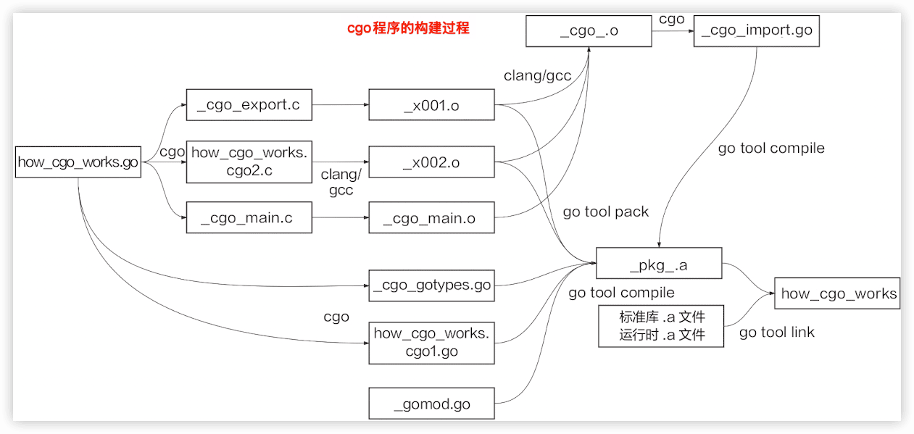

看到在实际编译过程中，go build调用了名为cgo的工具，cgo会识别和读取Go源文件（how_cgo_works.go）中的C代码，并将其提取后交给外部的C编译器（clang或gcc）编译，最后与Go源码编译后的目标文件链接成一个可执行程序。

### 70.2 在Go中使用C语言的类型

#### 1 原生类型

##### 数值类型

```go
C.char,
C.schar (signed char),
C.uchar (unsigned char),
C.short,
C.ushort (unsigned short),
C.int, C.uint (unsigned int),
C.long,
C.ulong (unsigned long),
C.longlong (long long),
C.ulonglong (unsigned long long),
C.float,
C.double
```

Go的数值类型与C中的数值类型不是一一对应的，因此在使用对方类型变量时少不了显式类型转换操作

##### 指针类型

原生数值类型的指针类型可按Go语法在类型前面加上星号`*`，比如`var p *C.int`。但`void*`比较特殊，在Go中用`unsafe.Pointer`表示它，这是因为任何类型的指针值都可以转换为unsafe.Pointer类型，而unsafe.Pointer类型也可以转换回任意类型的指针类型。

##### 字符串类型

C语言中并不存在原生的字符串类型，在C中用带结尾`'\0'`的字符数组来表示字符串；而在Go中，string类型是语言的原生类型，因此这两种语言的互操作势必要进行字符串类型的转换。
通过C.CString函数，我们可以将Go的string类型转换为C的“字符串”类型后再传给C函数使用。

```go
s := "Hello, Cgo\n"
cs := C.CString(s)
C.print(cs)
```

不过这个转型相当于在C语言世界的堆上分配一块新内存空间，这样转型后所得到的C字符串cs并不能由Go的GC（垃圾回收器）管理，我们必须在使用后手动释放cs所占用的内存，这就是例子中通过defer调用C.free释放掉cs的原因。再次强调，**对于在C内部分配的内存，Go中的GC是无法感知到的，因此要记着在使用后手动释放**。

通过C.GoString可将C的字符串`（*C.char）`转换为Go的string类型:

```go
package main

// #include <stdio.h>
// #include <stdlib.h>
// char *foo = "helloChina";
import "C"
import "fmt"

func main() {
	fmt.Printf("%T", C.GoString(C.foo))  // string
}
```

这相当于在Go世界重新分配一块内存对象，并复制了C的字符串（foo）的信息，后续这个位于Go世界的新的string类型对象将和其他Go对象一样接受GC的管理。

##### 数组类型

C语言中的数组与Go语言中的数组差异较大，后者是原生的值类型，而前者与C中的指针在大部分场合可以随意转换。Go仅提供了C.GoBytes来将C中的char类型数组转换为Go中的[]byte切片类型：

```go
package main

// char cArray[] = {'a', 'b', 'c', 'd', 'e', 'f'};
import "C"
import (
	"fmt"
	"unsafe"
)

func main() {
	goArray := C.GoBytes(unsafe.Pointer(&C.cArray[0]), 6)
	fmt.Printf("%c\n", goArray) // [a b c d e f]
}
```

而对于其他类型的C数组，目前似乎无法直接显式地在两者之间进行类型转换。我们可以通过特定转换函数来将C的特定类型数组转换为Go的切片类型（Go中数组是值类型，其大小是静态的，转换为切片更为通用）。下面是一个将C整型数组转换为Go[]int32切片类型的例子：

```go
package main

// int cArray[] = {1, 2, 3, 4, 5, 6, 7, 8};
import "C"
import (
	"fmt"
	"unsafe"
)

// 将C整型数组转换为Go[]int32切片类型
func main() {
	goArray := CArrayToGoArray(unsafe.Pointer(&C.cArray[0]), unsafe.Sizeof(C.cArray[0]), 8)
	fmt.Println(goArray) // [1 2 3 4 5 6 7 8]
}

func CArrayToGoArray(cArray unsafe.Pointer, elemSize uintptr, len int) (goArray []int32) {
	for i := 0; i < len; i++ {
		j := *(*int32)((unsafe.Pointer)(uintptr(cArray) + uintptr(i)*elemSize))
		goArray = append(goArray, j)
	}
	return
}
```

注意：Go编译器并不能将C的cArray自动转换为数组的地址，所以不能像在C中使用数组那样将数组变量直接传递给函数，而是将数组第一个元素的地址传递给函数。

#### 2 自定义类型

##### 枚举（enum）

对于具名的C枚举类型xx，我们可以通过`C.enum_xx`来访问该类型；如果是匿名枚举，则只能访问其字段了。

##### 结构体（struct）

通过C.struct_xx来访问C中定义的结构体类型xx

```go
package main

// #include <stdlib.h>
//
// struct employee {
//   char *id;
//   int age;
// };
import "C"
import (
	"fmt"
	"unsafe"
)

func main() {
	id := C.CString("123456")
	defer C.free(unsafe.Pointer(id))

	var p = C.struct_employee{
		id:  id,
		age: 18,
	}
	// %#v 以 Go 语法格式输出值
	fmt.Printf("%#v\n", p)  // main._Ctype_struct_employee{id:(*main._Ctype_char)(0x600002efc000), age:18, _:[4]uint8{0x0, 0x0, 0x0, 0x0}}
}
```

##### 联合体（union）


##### 别名类型（typedef）

```go
// typedef int myint;
var a C.myint = 5
fmt.Println(a)

// typedef struct employee myemployee;
var m C.struct_myemployee
```

#### 3 Go中获取C类型大小

Go提供了`C.sizeof_T`来获取`C.T`类型的大小。如果是结构体、枚举及联合体类型，我们需要在T前面分别加上`struct_`、`enum_`和`union_`的前缀：

```go
package main

// struct employee {
//   char *id;
//   int age;
// };
import "C"
import "fmt"

func main() {
	fmt.Printf("%#v\n", C.sizeof_int)             // 4
	fmt.Printf("%#v\n", C.sizeof_char)            // 1
	fmt.Printf("%#v\n", C.sizeof_struct_employee) // 16
}
```

### 70.3 在Go中链接外部C库

从代码结构上来讲，在Go源文件中大量编写C代码并不是Go推荐的惯用法。

Go提供了`#cgo`指示符，可以用它指定Go源码在编译后与哪些共享库进行链接。

```go
// foo.go
package main

// #cgo CFLAGS: -I${SRCDIR}
// #cgo LDFLAGS: -L${SRCDIR} -lfoo
// #include <stdio.h>
// #include <stdlib.h>
// #include "foo.h"
import "C"
import "fmt"

func main() {
	fmt.Println(C.count)
	C.foo()
}
```

通过#cgo指示符告诉Go编译器在当前源码目录（`${SRCDIR}`会在编译过程中自动转换为当前源码所在目录的绝对路径）下查找头文件`foo.h`，并链接当前源码目录下的libfoo共享库。`C.count`变量和C.foo函数的定义都在libfoo共享库中。创建这个共享库：

```c
// foo.h
extern int count;
void foo();
```

```c
// foo.c
#include <stdio.h>
#include "foo.h"

int count = 100;
void foo() {
    printf("hello world, I'm foo!\n");
}
```

用ar工具创建一个==静态共享库==文件`libfoo.a`:

```sh
$ gcc -c foo.c
$ ar rv libfoo.a foo.o
```

构建并运行foo.go：

```shell
$ go build foo.go
$ ./foo 
100
hello world, I'm foo!
```

看到foo.go成功链接到libfoo.a并生成最终的二进制文件foo。

Go同样支持链接==动态共享库==，用下面的命令将上面的foo.c编译为一个动态共享库：

```sh
$ gcc -c foo.c
// $ gcc -shared -Wl,-soname,libfoo.so -o libfoo.so  foo.o (在linux上)
$ gcc -shared -o libfoo.so  foo.o
```

重新编译foo.go，并查看（在Linux上可以使用`ldd`，在macOS上使用`otool`）重新生成的二进制文件foo的动态共享库依赖情况：

```sh
$ go build foo.go               
$ otool -L foo
foo:
        libfoo.so (compatibility version 0.0.0, current version 0.0.0)
        /System/Library/Frameworks/CoreFoundation.framework/Versions/A/CoreFoundation (compatibility version 150.0.0, current version 3502.1.255)
        /usr/lib/libresolv.9.dylib (compatibility version 1.0.0, current version 1.0.0)
        /usr/lib/libSystem.B.dylib (compatibility version 1.0.0, current version 1351.0.0)
```


注意，Go支持多返回值，而C并不支持，因此当将C函数用在多返回值的Go调用中时，C的errno将作为函数返回值列表中最后那个error返回值返回。下面是个例子：

```go
// c_errno.go

package main

// #include <stdlib.h>
// #include <stdio.h>
// #include <errno.h>
// int foo(int i) {
//   errno = 0;
//   if (i > 5) {
//     errno = 8;
//     return i - 5;
//   } else {
//     return i;
//   }
// }
import "C"
import "fmt"

func main() {
	i, err := C.foo(C.int(8))
	if err != nil {
		fmt.Println(err)
	} else {
		fmt.Println(i)
	}
}
```


```sh
$g o run c_errno.go
exec format error
```

`exec format error`就是errno为8时的错误描述信息。

### 70.4 在C中使用Go函数

在C中使用Go函数的场合极少。在Go中，可以使用`export + 函数名`来导出Go函数为C所用。目前Go的导出函数供C使用的功能还十分有限，两种语言的调用约定不同，类型无法一一对应，Go中类似垃圾回收这样的高级功能让导出Go函数这一特性难于完美实现，导出的函数依旧无法完全脱离Go的环境，因此其实用性大打折扣。

### 70.5 使用cgo的开销

#### 1 不能忽视的调用开销

在Go代码中调用C函数看起来似乎很平滑，但实际上这种调用的开销要比调用Go函数多出**一个甚至多个数量级**。


```sh
$ go test -bench . -gcflags '-l'
goos: darwin
goarch: arm64
pkg: gofirst/ch70cgo/5
cpu: Apple M1
BenchmarkCGO-8          43136834                28.16 ns/op
BenchmarkGO-8           546780799                2.199 ns/op
PASS
ok      gofirst/ch70cgo/5       3.686s

```


#### 2 增加线程数量暴涨的可能性🔖


#### 3 失去跨平台交叉构建能力🔖


#### 4 其他开销


### 70.6 使用cgo代码的静态构建🔖

所谓静态构建就是指构建后的应用运行所需的所有符号、指令和数据都包含在自身的二进制文件当中，没有任何对外部动态共享库的依赖。静态构建出的二进制文件由于包含所有符号、指令和数据，因而通常要比非静态构建的应用大许多。默认情况下，Go没有采用静态构建。


## 71 使用crypto下的密码学包构建安全应用

密码学（cryptography）是**对信息及其传输的数学性研究**。

在人类进入信息社会，尤其是步入计算机互联网时代之后，**现代密码学便成为整个互联网安全的基石**，为人类在数字世界的活动保驾护航。近几年新兴的互联网技术，如区块链等，无不是建构在现代密码学的基础之上的。可以说，密码学是互联网的信任之源。

密码学本质上是==数学==，密码学的算法多由专业的密码学研究人员设计和实现。因此大多数开发人员无须亲自设计和实现加密算法，仅需了解密码学的基础知识并使用现成的密码学算法实现去构建安全应用即可。

### 71.1 Go密码学包概览与设计原则

分组密码（block cipher）

公钥密码（public-key cryptography，亦称非对称密码asymmetric cryptography）与数字签名（digital signature）

单向散列函数，亦称消息摘要（digest）或指纹（fingerprint）

消息认证码（Message Authentication Code，MAC）

随机数生成


### 71.2 分组密码算法

密码算法可以分为**分组密码（block cipher）**和**流密码（stream cipher）**两种。

流密码是对数据流进行连续处理的一类算法，而我们日常使用最多的DES、AES加密算法则都归于分组密码算法范畴。

分组密码是一种一次仅能处理固定长度数据块的算法。而这个数据块的固定长度（比特数量）则称为该分组密码算法的分组长度（block length）。

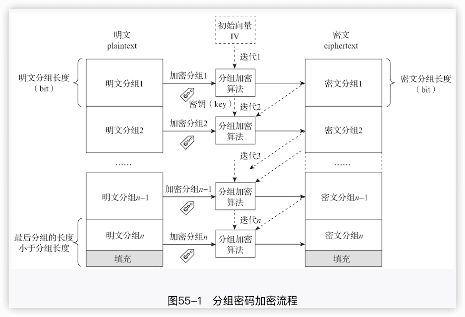


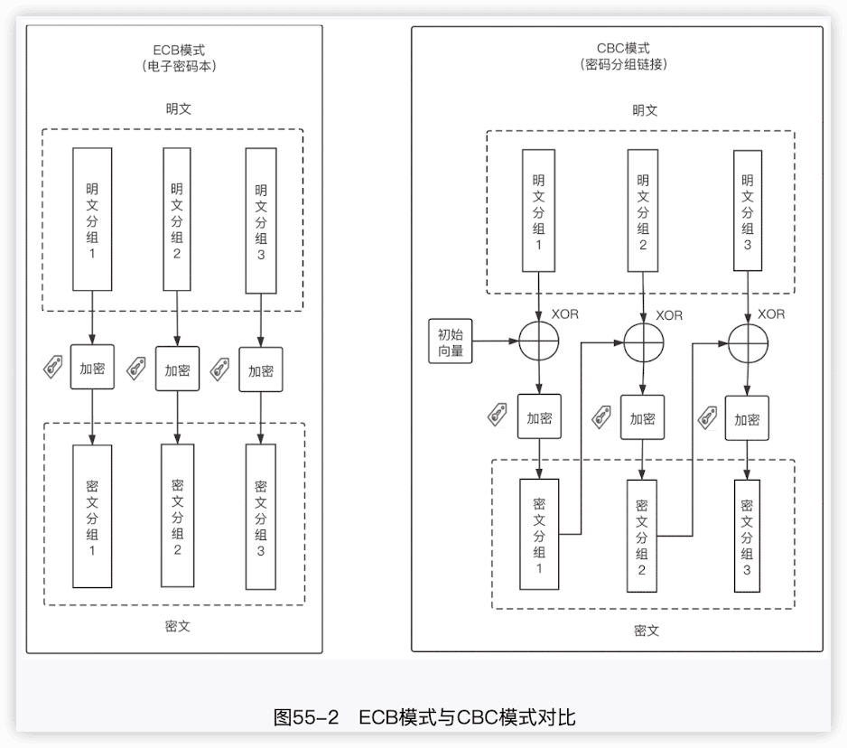


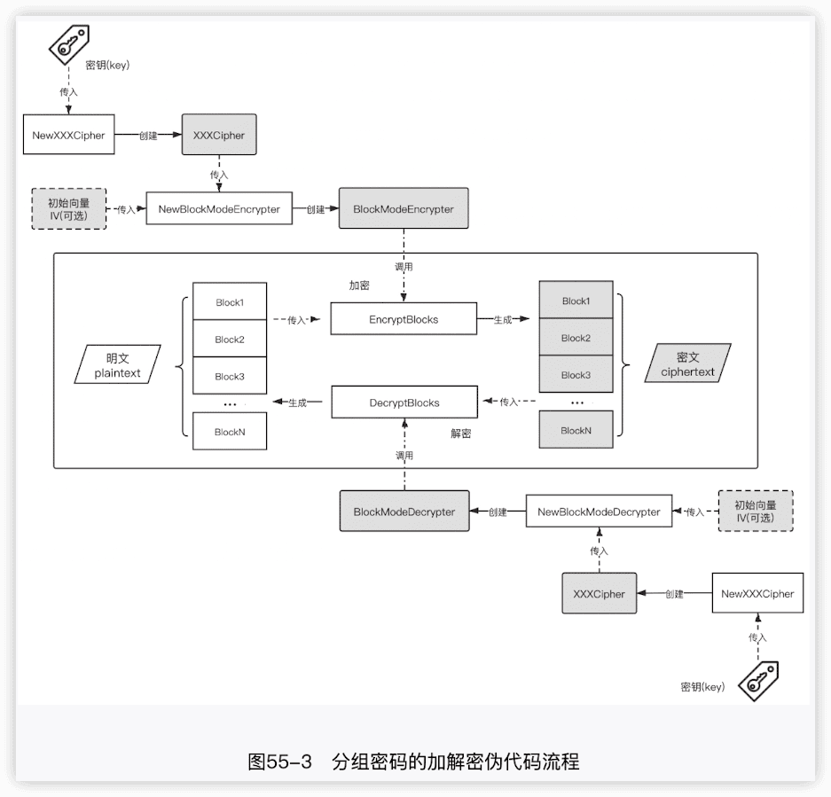


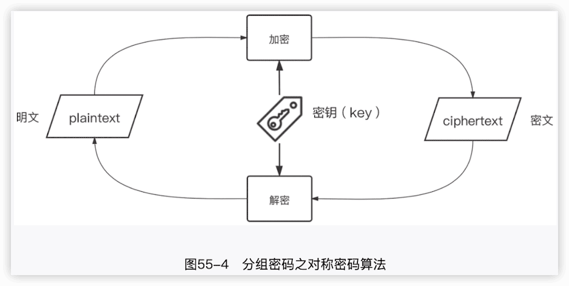


### 71.3 公钥密码


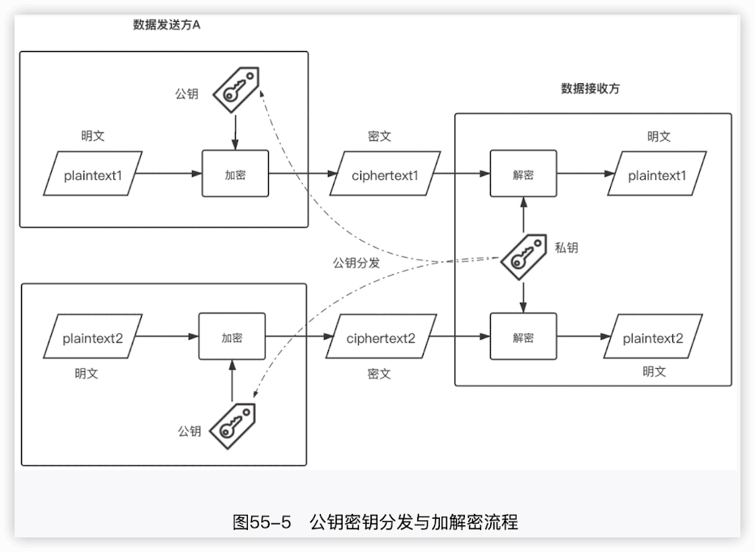


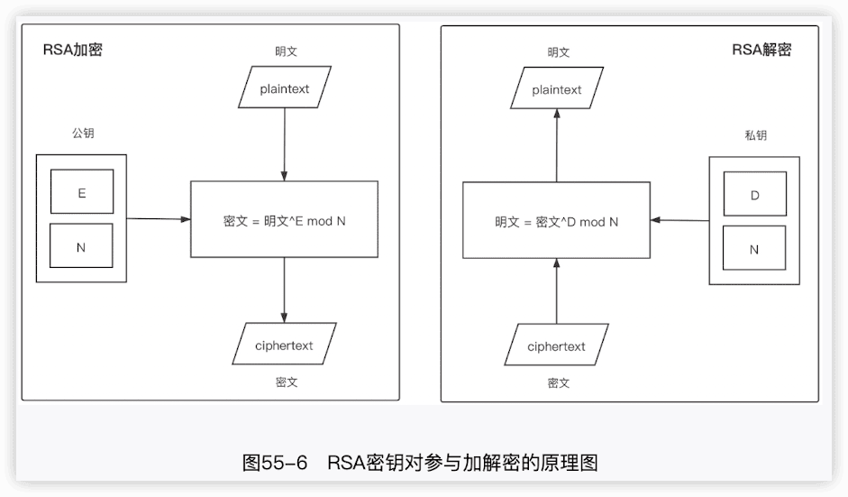

### 71.4 单向散列函数

单向散列函数（one-way hash function）是一个接受不定长输入但产生定长输出的函数，这个定长输出被称为“摘要”（digest）或“指纹”（fingerprint）。

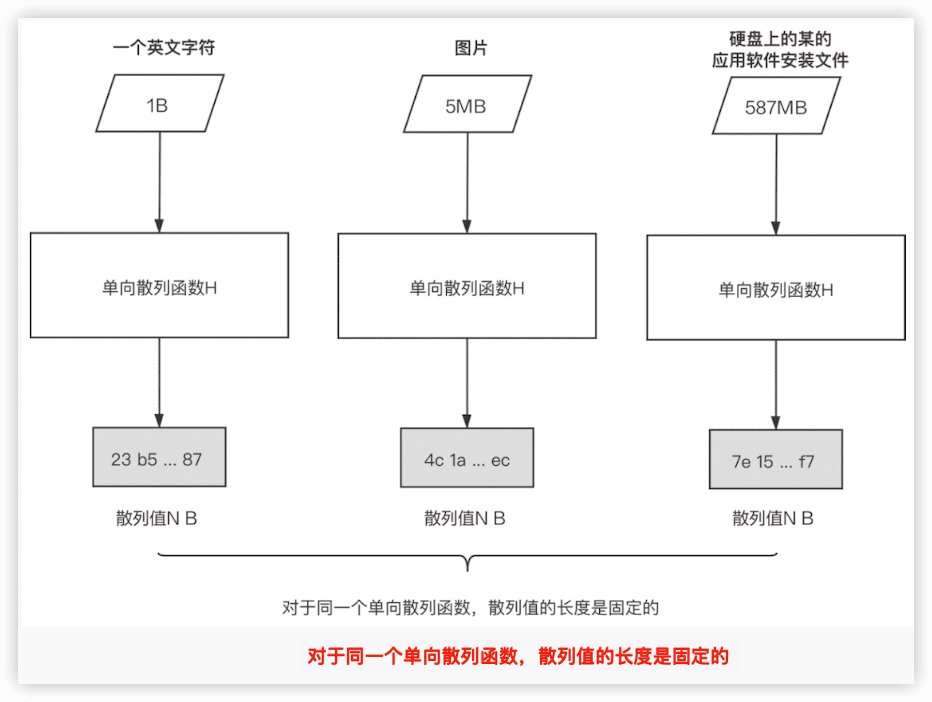


### 71.5 消息认证码

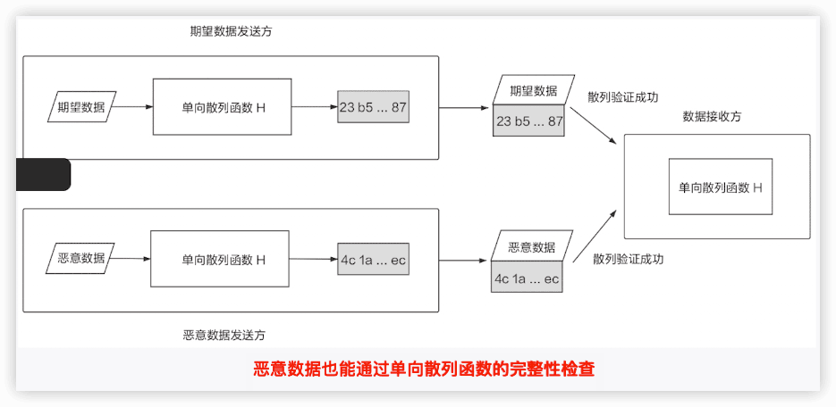


### 71.6 数字签名


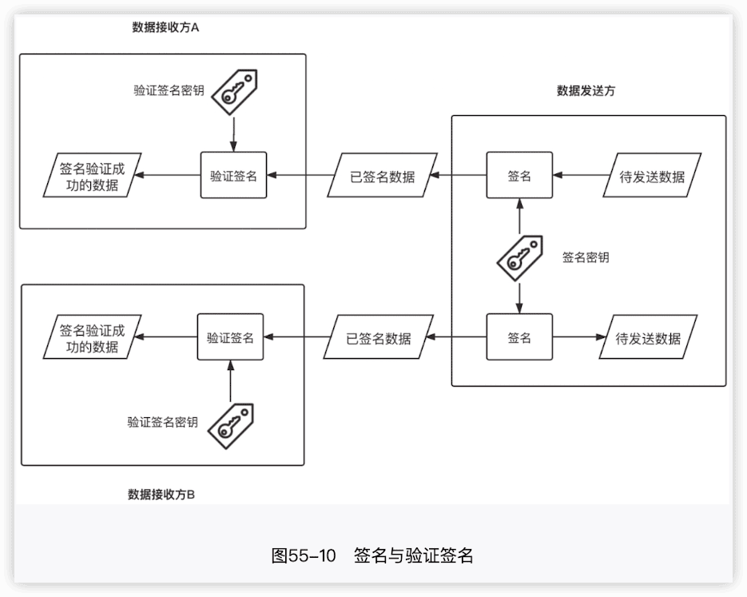


### 71.7 随机数生成


## 72 使用go generate驱动代码生成

把Go工具链中代码生成工具（go generate）单独介绍使用。

### 72.1 go generate：Go原生的代码生成“驱动器”

构建中小规模的Go项目时通常无须借助外部构建管理工具（比如shell脚本、make等），Go工具链便可以很好地满足我们关于构建的大多数需求。

但有些时候，目标的构建需要依赖一些额外的==前置动作==（如代码生成等），在这种情况下，单靠go build我们无法驱动前置动作的执行。

#### make

以往可以借助外部构建管理工具，比如`make`。下面是一个借助make工具对一个依赖代码生成的项目进行构建的示例：

```shell
$ tree protobuf-make
protobuf-make
├── IDL
│    └── msg.proto
├── Makefile
├── go.mod
├── go.sum
├── main.go
└── msg
		 └── msg.pb.go // 待生成的Go源文件
```

```makefile
// ch72/protobuf-make/Makefile
all: build

build: gen-protobuf
	go build

gen-protobuf:
	protoc -I ./IDL msg.proto --gofast_out=./msg
```

```protobuf
// ch72/protobuf-make/IDL/msg.proto

syntax = "proto3";
  
package msg;

message request {
        string msgID = 1;
        string field1 = 2;
        repeated string field2 = 3;
}
```

make命令通过Makefile目标（target）之间的依赖关系实现了在真正构建（go build）之前先生成`msg/msg.pb.go`文件，这样go build执行时就能正常找到msg包的源文件了（生成可执行文件`protobuf-make`）。

```sh
$ make 
protoc -I ./IDL msg.proto --gofast_out=./msg
go build
```


> 上述示例基于protobuf描述文件（msg.proto）生成Go源码（msg.pb.go）。这个生成过程依赖两个工具：
>
> 一个是protobuf编译器protoc（https://github.com/protocolbuffers/protobuf），
>
> 另一个是protobuf go插件protoc-gen-gofast
>
> ```sh
> go install github.com/gogo/protobuf/protoc-gen-gofast@latest
> ```

#### go generate

Go 1.4版本的Go工具链中也增加了这种在构建之前驱动执行前置动作的能力，这就是`go generate`命令。

```sh
$ tree protobuf-go-generate 
protobuf-go-generate
├── IDL
│   └── msg.proto
├── go.mod
├── go.sum
├── main.go
└── msg
		 └── msg.pb.go // 待生成的Go源文件
```

```go
// ch72/protobuf-go-generate/main.go

package main

//go:generate protoc -I ./IDL msg.proto --gofast_out=./msg
func main() {
}
```

删除了Makefile，然后main包的源文件中添加了如下一行特殊的注释。

这就是预先“埋”在代码中的可以被go generate命令识别的**指示符（directive）**。

执行go generate命令时，上面这行指示符中的命令将被go generate识别并被驱动执行，执行的结果就是protoc基于IDL目录下的msg.proto生成了main包所需要的msg包源码。【-x和-v用于查看执行过程】

```sh
$ go generate -x -v
main.go
protoc -I ./IDL msg.proto --gofast_out=./msg
```

代码生成后，编写相关代码：

```go
package main

import (
	"fmt"
	msg "protobuf-go-generate/msg"
)

//go:generate protoc -I ./IDL msg.proto --gofast_out=./msg
func main() {
	var m = msg.Request{
		MsgID:  "xxxx",
		Field1: "field1",
		Field2: []string{"field2-1", "field2-2"},
	}
	fmt.Println(m)
}
```

构建并运行程序:

```sh
$ go build
$ ./protobuf-go-generate 
{xxxx field1 [field2-1 field2-2] {} [] 0}
```

### 72.2 go generate的工作原理

go generate相较于make这样的工具能力和特性比较单一，但“**它是Go工具链内置的，天然适配Go生态系统，无须额外安装其他工具。**”。

go generate并不会按Go语法格式规范去解析Go源码文件，它只是将Go源码文件当成普通文本读取并识别其中可以与下面字符串模式匹配的内容（go generate指示符）：

```go
//go:generate command arg...
```

注释符号//前面没有空格，与go:generate之间亦无任何空格。

上面的go generate指示符可以放在Go源文件中的任意位置，并且一个Go源文件中可以有多个go generate指示符，go generate命令会按其出现的顺序逐个识别和执行：1️⃣

```go
// multi_go_generate_directive.go

//go:generate echo "top"
package main

import "fmt"

//go:generate echo "middle"
func main() {
	fmt.Println("hello, go generate")
}

//go:generate echo "tail"
```

```sh
$ go generate multi_go_generate_directive.go 
top
middle
tail
```

可以像上面示例那样直接将**Go源文件**作为参数传给go generate命令，也可以使用**包**作为go generate的参数。

2️⃣下面的示例演示了不同go generate可接受的不同参数形式：

```sh
$ tree generate-args 
generate-args
├── go.mod
├── main.go
├── subpkg1
│   └── subpkg1.go
└── subpkg2
    └── subpkg2.go

```

main.go、subpkg1.go和subpkg2.go三个源文件中都有一行go generate指示符：

```go
//go:generate pwd
```

go generate执行该指示符中的命令时会输出当前工作目录（Working Directory）：

```sh
// 1 传入某个文件
$ go generate -x -v main.go 
main.go
pwd
/Users/.../gofirst/ch72/generate-args

// 2 传入当前module，匹配到module的main package且仅处理该main package的源文件
$ go generate -x -v
main.go
pwd
/Users/.../gofirst/ch72/generate-args

// 3 传入本地路径，匹配该路径下的包的所有源文件
$ go generate -x -v ./subpkg1 
subpkg1/subpkg1.go
pwd
/Users/.../gofirst/ch72/generate-args/subpkg1

// 4 传入包，由于是module的根路径，因此只处理该module下的main包
$ go generate -x -v github.com/andyron/generate-args
main.go
pwd
/Users/.../gofirst/ch72/generate-args

// 5 传入包，处理subpkg1包下的所有源文件
$ go generate -x -v github.com/andyron/generate-args/subpkg1
subpkg1/subpkg1.go
pwd
/Users/.../gofirst/ch72/generate-args/subpkg1

// 6 传入./...模式，匹配当前路径及其子路径下的所有包
$ go generate -x -v ./...                                   
main.go
pwd
/Users/.../gofirst/ch72/generate-args
subpkg1/subpkg1.go
pwd
/Users/.../gofirst/ch72/generate-args/subpkg1
subpkg2/subpkg2.go
pwd
/Users/.../gofirst/ch72/generate-args/subpkg2
```


3️⃣ go generate还可以通过-run使用正则式去匹配各源文件中go generate指示符中的命令，并仅执行匹配成功的命令：

```sh
// 未匹配到任何go generate指示符中的命令
$ go generate -x -v -run "protoc" ./...
```


### 72.3 go generate的应用场景

上面基于protobuf定义文件（*.proto）生成Go源码文件的示例就是go generate一个极为典型的应用。此外广泛的应用还有：

#### 1 利用stringer工具自动生成枚举类型的String方法

> 安装stringer工具
>
> ```
> go get golang.org/x/tools/cmd/stringer
> ```
>
> or
>
> ```sh
> go install golang.org/x/tools/cmd/stringer
> ```


```go
// enum-demo/main.go

type Weekday int

const (
	Sunday Weekday = iota
	Monday
	Tuesday
	Wednesday
	Thursday
	Friday
	Saturday
)
```

通常会为Weekday类型手写String方法，这样在打印上面枚举常量时能输出有意义的内容：

```go
func (d Weekday) String() string {
	switch d {
	case Sunday:
		return "Sunday"
	case Monday:
		return "Monday"
	case Tuesday:
		return "Tuesday"
	case Wednesday:
		return "Wednesday"
	case Thursday:
		return "Thursday"
	case Friday:
		return "Friday"
	case Saturday:
		return "Saturday"
	}

	return "Sunday" //default 0 -> "Sunday"
}
```

如果一个项目中枚举常量类型有很多，逐个为其手写String方法费时费力。当枚举常量有变化的时候，手动维护String方法十分烦琐且易错。对于这种情况，使用go generate驱动stringer工具为这些枚举类型自动生成String方法的实现不失为一个较为理想的方案。

对上面示例的改造：

```go
package main

import "fmt"

type Weekday int

const (
	Sunday Weekday = iota
	Monday
	Tuesday
	Wednesday
	Thursday
	Friday
	Saturday
)

//go:generate stringer -type=Weekday
func main() {
	var d Weekday
	fmt.Println(d)
	fmt.Println(Weekday(1))
}
```


```go
$ go generate main.go 
```

生成一个weekday_string.go 文件：

```go
// Code generated by "stringer -type=Weekday"; DO NOT EDIT.

package main

import "strconv"

func _() {
	// An "invalid array index" compiler error signifies that the constant values have changed.
	// Re-run the stringer command to generate them again.
	var x [1]struct{}
	_ = x[Sunday-0]
	_ = x[Monday-1]
	_ = x[Tuesday-2]
	_ = x[Wednesday-3]
	_ = x[Thursday-4]
	_ = x[Friday-5]
	_ = x[Saturday-6]
}

const _Weekday_name = "SundayMondayTuesdayWednesdayThursdayFridaySaturday"

var _Weekday_index = [...]uint8{0, 6, 12, 19, 28, 36, 42, 50}

func (i Weekday) String() string {
	if i < 0 || i >= Weekday(len(_Weekday_index)-1) {
		return "Weekday(" + strconv.FormatInt(int64(i), 10) + ")"
	}
	return _Weekday_name[_Weekday_index[i]:_Weekday_index[i+1]]
}
```

编译执行：

```sh
$ go build
$ ./enum-demo         
Sunday
Monday
```


#### 2 go generate驱动从静态资源文件数据到Go源码的转换

语言的优点之一是可以将源码编译成一个对外部没有任何依赖或只有较少依赖的二进制可执行文件，这大大降低了Gopher在部署阶段的心智负担。而为了将这一优势发挥到极致，Go社区甚至开始着手将静态资源文件也嵌入可执行文件中，尤其是在Web开发领域，Gopher希望将一些静态资源文件（比如CSS文件等）嵌入最终的二进制文件中一起发布和部署。

利用go-bindata工具将数据文件嵌入Go源码中。安装：`go get -u github.com/go-bindata/go-bindata/...`或者`go install github.com/go-bindata/go-bindata/v3/go-bindata@latest`。

> 说明：Go 1.16版本内置了静态文件嵌入（embedding）功能，我们可以直接在Go源码中通过`go:embed`指示符将静态资源文件嵌入，无须再使用本方法。

```go
//go:generate go-bindata -o static.go static/img/go-mascot.jpg

func main() {
}
```

```sh
$ go generate  
```

go generate命令会执行main.go中指示符中的命令，即基于static/img/go-mascot.jpg文件数据生成static.go源文件。


```go
//go:generate go-bindata -o static.go static/img/go-mascot.jpg

func main() {
	data, err := Asset("static/img/go-mascot.jpg")
	if err != nil {
		fmt.Println("Asset invoke error:", err)
		return
	}

	http.HandleFunc("/", func(w http.ResponseWriter, req *http.Request) {
		w.Write(data)
	})

	http.ListenAndServe(":8080", nil)
}
```

```sh
$ go build
./bindata-demo
```

此时访问localhost:8080可查看图片。

这时即便你删除bindata-demo/static/img目录下的go-mascot.jpg也不会影响到bindata-demo的应答返回结果，因为图片数据已经嵌入bindata-demo这个二进制程序当中了，go-mascot.jpg将随着bindata-demo这个二进制程序一并分发与部署。

### 小结

go generate这个工具通常是由Go包的作者使用和执行的，其生成的Go源码一般会提交到代码仓库中，这个过程对生成的包的使用者来说是透明的。为了提醒使用者这是一个代码自动生成的源文件，我们通常会在源文件的开始处以注释的形式写入类似下面的文字：

```go
// Code generated by XXX. DO NOT EDIT.
```

