Go语言更多
------


å‚考：

1ï¸âƒ£[《GO语言ä»å…¥é—¨åˆ°é¡¹ç›®å®è·µï¼ˆè¶…值版）》余建熙 2022](http://www.tup.tsinghua.edu.cn/bookscenter/book_09281301.html)

2ï¸âƒ£[《Go语言开å‘å®æˆ˜ï¼ˆæ…•è¯¾ç‰ˆï¼‰ã€‹åƒé”‹æ•™è‚²é«˜æ•™äº§å“ç ”å‘部 2020](https://book.douban.com/subject/34956558/)

3ï¸âƒ£[《Go语言ä»å…¥é—¨åˆ°é¡¹ç›®å®æˆ˜ï¼ˆè§†é¢‘版）》](https://book.douban.com/subject/36049170/) 刘瑜 2022

4ï¸âƒ£ [Go语言精进之路1](https://book.douban.com/subject/35720728/) [Go语言精进之路2](https://book.douban.com/subject/35720729/)  2021

# 补充1

## 47 Go标准库

å‚考：

https://www.topgoer.com/%E5%B8%B8%E7%94%A8%E6%A0%87%E5%87%86%E5%BA%93/

[Golang标准库案例](https://github.com/polaris1119/The-Golang-Standard-Library-by-Example)

### 47.1 IO

### 47.1 fmt包

#### å‘外输出

##### Print系列

区别在äºPrint函数直æ¥è¾“出内容，Printf函数支æŒæ ¼å¼åŒ–输出字符串，Println函数会在输出内容的结尾添加一个æ¢è¡Œç¬¦ã€‚

```go
func Print(a ...interface{}) (n int, err error)
func Printf(format string, a ...interface{}) (n int, err error)
func Println(a ...interface{}) (n int, err error)
```

##### Fprint系列

Fprint系列函数会将内容输出到一个io.Writeræ¥å£ç±»å‹çš„å˜é‡w中，我们通常用这个函数往文件中写入内容。

```go
func Fprint(w io.Writer, a ...interface{}) (n int, err error)
func Fprintf(w io.Writer, format string, a ...interface{}) (n int, err error)
func Fprintln(w io.Writer, a ...interface{}) (n int, err error)
```

```go
// å‘标准输出写入内容
fmt.Fprintln(os.Stdout, "å‘标准输出写入内容")
fileObj, err := os.OpenFile("./xx.txt", os.O_CREATE|os.O_WRONLY|os.O_APPEND, 0644)
if err != nil {
    fmt.Println("打开文件出错，err:", err)
    return
}
name := "æ¯è—¤"
// å‘打开的文件å¥æŸ„中写入内容
fmt.Fprintf(fileObj, "往文件中写如信æ¯ï¼š%s", name)
```

注æ„，åªè¦æ»¡è¶³io.Writeræ¥å£çš„ç±»å‹éƒ½æ”¯æŒå†™å…¥ã€‚

##### Sprint系列

Sprint系列函数会把传入的数æ®ç”Ÿæˆå¹¶è¿”å›ä¸€ä¸ªå­—符串。

```go
func Sprint(a ...interface{}) string
func Sprintf(format string, a ...interface{}) string
func Sprintln(a ...interface{}) string
```

##### Errorf

Errorf函数根æ®formatå‚数生æˆæ ¼å¼åŒ–字符串并返å›ä¸€ä¸ªåŒ…å«è¯¥å­—符串的错误。

```go
func Errorf(format string, a ...interface{}) error
```

通常使用这ç§æ–¹å¼æ¥è‡ªå®šä¹‰é”™è¯¯ç±»å‹ï¼Œä¾‹å¦‚：

```go
err := fmt.Errorf("这是一个错误")
```

#### æ ¼å¼åŒ–å ä½ç¬¦

`*printf`系列函数都支æŒformatæ ¼å¼åŒ–å‚数。

按照å ä½ç¬¦å°†è¢«æ›¿æ¢çš„å˜é‡ç±»å‹åˆ’分：

| 通用å ä½ç¬¦               | è¯´æ˜                                                         |
| ------------------------ | ------------------------------------------------------------ |
| %v                       | 值的默认格å¼è¡¨ç¤º                                             |
| %+v                      | 类似%v，但输出结æ„ä½“æ—¶ä¼šæ·»åŠ å­—æ®µå                           |
| %#v                      | 值的Go语法表示                                               |
| %T                       | 打å°å€¼çš„ç±»å‹                                                 |
| %%                       | ç™¾åˆ†å·                                                       |
| **布尔å ä½ç¬¦**           |                                                              |
| %t                       | true或false                                                  |
| **æ•´å‹å ä½ç¬¦**           |                                                              |
| %b                       | 表示为二进制                                                 |
| %c                       | 该值对应的unicodeç å€¼                                        |
| %d                       | 表示为å进制                                                 |
| %o                       | 表示为八进制                                                 |
| %x                       | 表示为å六进制，使用a-f                                      |
| %X                       | 表示为å六进制，使用A-F                                      |
| %U                       | 表示为Unicodeæ ¼å¼ï¼šU+1234，等价äºâ€U+%04X†                   |
| %q                       | 该值对应的å•å¼•å·æ‹¬èµ·æ¥çš„go语法字符字é¢å€¼ï¼Œå¿…è¦æ—¶ä¼šé‡‡ç”¨å®‰å…¨çš„转义表示 |
| **浮点数ä¸å¤æ•°å ä½ç¬¦**   |                                                              |
| %b                       | æ— å°æ•°éƒ¨åˆ†ã€äºŒè¿›åˆ¶æŒ‡æ•°çš„科学计数法，如-123456p-78            |
| %e                       | 科学计数法，如-1234.456e+78                                  |
| %E                       | 科学计数法，如-1234.456E+78                                  |
| %f                       | 有å°æ•°éƒ¨åˆ†ä½†æ— æŒ‡æ•°éƒ¨åˆ†ï¼Œå¦‚123.456                            |
| %F                       | 等价äº%f                                                     |
| %g                       | æ ¹æ®å®é™…情况采用%e或%fæ ¼å¼ï¼ˆä»¥è·å¾—更简æ´ã€å‡†ç¡®çš„输出）       |
| %G                       | æ ¹æ®å®é™…情况采用%E或%Fæ ¼å¼ï¼ˆä»¥è·å¾—更简æ´ã€å‡†ç¡®çš„输出）       |
| **字符串和[]byteå ä½ç¬¦** |                                                              |
| %s                       | ç›´æ¥è¾“出字符串或者[]byte                                     |
| %q                       | 该值对应的åŒå¼•å·æ‹¬èµ·æ¥çš„go语法字符串字é¢å€¼ï¼Œå¿…è¦æ—¶ä¼šé‡‡ç”¨å®‰å…¨çš„转义表示 |
| %x                       | æ¯ä¸ªå­—节用两字符å六进制数表示（使用a-f                      |
| %X                       | æ¯ä¸ªå­—节用两字符å六进制数表示（使用A-F）                    |
| **指针**                 |                                                              |
| %p                       | 表示为å六进制，并加上å‰å¯¼çš„0x                               |
|                          |                                                              |
|                          |                                                              |
|                          |                                                              |

##### 宽度标识符

| å ä½ç¬¦ | è¯´æ˜               |
| ------ | ------------------ |
| %f     | 默认宽度，默认精度 |
| %9f    | 宽度9，默认精度    |
| %.2f   | 默认宽度，精度2    |
| %9.2f  | 宽度9，精度2       |
| %9.f   | 宽度9，精度0       |

示例代ç å¦‚下：

```go
n := 88.88
fmt.Printf("%f\n", n)
fmt.Printf("%9f\n", n)
fmt.Printf("%.2f\n", n)
fmt.Printf("%9.2f\n", n)
fmt.Printf("%9.f\n", n)
```

输出结æœå¦‚下：

```
    88.880000
    88.880000
    88.88
        88.88
           89
```

##### 其他falg

| å ä½ç¬¦ | è¯´æ˜                                                         |
| ------ | ------------------------------------------------------------ |
| ’+’    | 总是输出数值的正负å·ï¼›å¯¹%q（%+q）会生æˆå…¨éƒ¨æ˜¯ASCII字符的输出（通过转义）； |
| ’ ‘    | 对数值，正数å‰åŠ ç©ºæ ¼è€Œè´Ÿæ•°å‰åŠ è´Ÿå·ï¼›å¯¹å­—符串采用%x或%X时（% x或% X）会给å„打å°çš„字节之间加空格 |
| ’-’    | 在输出å³è¾¹å¡«å……空白而ä¸æ˜¯é»˜è®¤çš„左边（å³ä»é»˜è®¤çš„å³å¯¹é½åˆ‡æ¢ä¸ºå·¦å¯¹é½ï¼‰ï¼› |
| ’#’    | 八进制数å‰åŠ 0（%#o），å六进制数å‰åŠ 0x（%#x）或0X（%#X），指针å»æ‰å‰é¢çš„0x（%#p）对%q（%#q），对%U（%#U）会输出空格和å•å¼•å·æ‹¬èµ·æ¥çš„goå­—é¢å€¼ï¼› |
| ‘0’    | 使用0而ä¸æ˜¯ç©ºæ ¼å¡«å……，对äºæ•°å€¼ç±»å‹ä¼šæŠŠå¡«å……çš„0放在正负å·åé¢ï¼› |

举个例å­ï¼š

```go
s := "æ¯è—¤"
fmt.Printf("%s\n", s)
fmt.Printf("%5s\n", s)
fmt.Printf("%-5s\n", s)
fmt.Printf("%5.7s\n", s)
fmt.Printf("%-5.7s\n", s)
fmt.Printf("%5.2s\n", s)
fmt.Printf("%05s\n", s)
```

输出结æœå¦‚下：

```
    æ¯è—¤
       æ¯è—¤
    æ¯è—¤
       æ¯è—¤
    æ¯è—¤
       æ¯è—¤
    000æ¯è—¤
```

#### è·å–输入

fmt包下有fmt.Scanã€fmt.Scanfã€fmt.Scanln三个函数，å¯ä»¥åœ¨ç¨‹åºè¿è¡Œè¿‡ç¨‹ä¸­ä»æ ‡å‡†è¾“å…¥è·å–用户的输入。

##### fmt.Scan

```go
func Scan(a ...interface{}) (n int, err error)
```

```go
func main() {
    var (
        name    string
        age     int
        married bool
    )
    fmt.Scan(&name, &age, &married)
    fmt.Printf("扫æç»“æœ name:%s age:%d married:%t \n", name, age, married)
}
```

fmt.Scanä»æ ‡å‡†è¾“入中扫æ用户输入的数æ®ï¼Œå°†ä»¥ç©ºç™½ç¬¦åˆ†éš”çš„æ•°æ®åˆ†åˆ«å­˜å…¥æŒ‡å®šçš„å‚数。

##### fmt.Scanf

```go
func Scanf(format string, a ...interface{}) (n int, err error)
```

Scanfä»æ ‡å‡†è¾“入扫æ文本，根æ®formatå‚数指定的格å¼å»è¯»å–由空白符分隔的值ä¿å­˜åˆ°ä¼ é€’给本函数的å‚数中。

```go
func main() {
    var (
        name    string
        age     int
        married bool
    )
    fmt.Scanf("1:%s 2:%d 3:%t", &name, &age, &married)
    fmt.Printf("扫æç»“æœ name:%s age:%d married:%t \n", name, age, married)
}
```

```
$ ./fmt3    
1:andy 2:19 3:true 
扫æç»“æœ name:andy age:19 married:true 

```

fmt.Scanfä¸åŒäºfmt.Scan简å•çš„以空格作为输入数æ®çš„分隔符，fmt.Scanf为输入数æ®æŒ‡å®šäº†å…·ä½“的输入内容格å¼ï¼Œåªæœ‰æŒ‰ç…§æ ¼å¼è¾“入数æ®æ‰ä¼šè¢«æ‰«æ并存入对应å˜é‡ã€‚

##### fmt.Scanln

```go
func Scanln(a ...interface{}) (n int, err error)
```

Scanln类似Scan，它在é‡åˆ°æ¢è¡Œæ—¶æ‰åœæ­¢æ‰«æ。最å一个数æ®åé¢å¿…须有æ¢è¡Œæˆ–者到达结æŸä½ç½®ã€‚

```go
func main() {
	var (
		name    string
		age     int
		married bool
	)
	fmt.Scanln(&name, &age, &married)
	fmt.Printf("扫æç»“æœ name:%s age:%d married:%t \n", name, age, married)
}
```

```
./fmt4
æ德胜 36 true
扫æç»“æœ name:æ德胜 age:36 married:true 
```

##### bufio.NewReader

想完整è·å–输入的内容，而输入的内容å¯èƒ½åŒ…å«ç©ºæ ¼ï¼Œè¿™ç§æƒ…况下å¯ä»¥ä½¿ç”¨bufio包æ¥å®ç°ã€‚


##### Fscan系列

类似之å‰ä¸‰ä¸ªå‡½æ•°ï¼Œåªä¸è¿‡å®ƒä»¬ä¸æ˜¯ä»æ ‡å‡†è¾“入中读å–æ•°æ®è€Œæ˜¯ä»io.Reader中读å–æ•°æ®ã€‚

```go
func Fscan(r io.Reader, a ...interface{}) (n int, err error)
func Fscanln(r io.Reader, a ...interface{}) (n int, err error)
func Fscanf(r io.Reader, format string, a ...interface{}) (n int, err error)
```

##### Sscan系列

ä¸æ˜¯ä»æ ‡å‡†è¾“入中读å–æ•°æ®è€Œæ˜¯ä»æŒ‡å®šå­—符串中读å–æ•°æ®ã€‚

```go
func Sscan(str string, a ...interface{}) (n int, err error)
func Sscanln(str string, a ...interface{}) (n int, err error)
func Sscanf(str string, format string, a ...interface{}) (n int, err error)
```


### 47.2 文本


### 47.3 æ•°æ®ç»“æ„ä¸ç®—法

#### æ’åº

包`sort`

```go
Len()
Less
Reverse
Swap

Sort()
IsSorted()
Search()
// sort包åŸç”Ÿæ”¯æŒ[]intã€[]float64 å’Œ[]string 三ç§å†…建数æ®ç±»å‹åˆ‡ç‰‡çš„æ’åºæ“作
IntSlice
Float64Slice
StringSlice

func Float64s(a []float64)  
func Float64sAreSorted(a []float64) bool
func SearchFloat64s(a []float64, x float64) int

func Strings(a []string)
func StringsAreSorted(a []string) bool
func SearchStrings(a []string, x string) int
```


`[]interface` æ’åºä¸æŸ¥æ‰¾

```go
func Slice(slice interface{}, less func(i, j int) bool) 
func SliceStable(slice interface{}, less func(i, j int) bool) 
func SliceIsSorted(slice interface{}, less func(i, j int) bool) bool 
func Search(n int, f func(int) bool) int
```


#### 容器

包`container`


### 47.4 日期和时间

Go 语言通过标准库 `time` 包处ç†æ—¥æœŸå’Œæ—¶é—´ç›¸å…³çš„问题。

`time` 包æ供了时间的显示和计é‡ç”¨çš„功能。日å†çš„计算采用的是公å†ã€‚æ供的主è¦ç±»å‹ï¼š

- `Location`，代表一个地区，并表示该地区所在的时区（å¯èƒ½å¤šä¸ªï¼‰ã€‚`Location` 通常代表地ç†ä½ç½®çš„å移，比如 CEST å’Œ CET 表示中欧。

- `Time`，代表一个纳秒精度的时间点，是公å†æ—¶é—´ã€‚

- `Duration`，代表两个时间点之间ç»è¿‡çš„时间，以纳秒为å•ä½ã€‚å¯è¡¨ç¤ºçš„最长时间段大约 290 年，也就是说如æœä¸¤ä¸ªæ—¶é—´ç‚¹ç›¸å·®è¶…过 290 å¹´ï¼Œä¼šè¿”å› 290 年，也就是 minDuration(-1 << 63) 或 maxDuration(1 << 63 - 1)。

  ç±»å‹å®šä¹‰ï¼š`type Duration int64`。

  å°† `Duration` ç±»å‹ç›´æ¥è¾“出时，因为å®ç°äº† `fmt.Stringer` æ¥å£ï¼Œä¼šè¾“出人类å‹å¥½çš„å¯è¯»å½¢å¼ï¼Œå¦‚：72h3m0.5s。

- `Timer` å’Œ `Ticker`，定时器相关类å‹

- `Weekday` å’Œ `Month`，åŸå§‹ç±»å‹éƒ½æ˜¯ int，å®ç° `fmt.Stringer` æ¥å£ï¼Œæ–¹ä¾¿è¾“出。

  

47.2 time包


#### 时间类å‹


#### 时间戳


##### 时间间隔


##### 时间æ“作

```
Add
Sub
Equal
Before
After
```

##### 定时器

使用time.Tick(时间间隔)æ¥è®¾ç½®å®šæ—¶å™¨ï¼Œå®šæ—¶å™¨çš„本质上是一个通é“（channel）。

```go
func tickDemo() {
    ticker := time.Tick(time.Second) //定义一个1秒间隔的定时器
    for i := range ticker {
        fmt.Println(i)//æ¯ç§’都会执行的任务
    }
}
```

##### 时间格å¼åŒ–

Go语言中格å¼åŒ–时间模æ¿ä¸æ˜¯å¸¸è§çš„Y-m-d H:M:S而是使用Goçš„è¯ç”Ÿæ—¶é—´2006å¹´1月2å·15点04分（记忆å£è¯€ä¸º2006 1 2 3 4）。

### 47.5 基本数学函数

`math`


math 包å®ç°çš„就是数学函数计算。

#### 三角函数 ####

正弦函数，å正弦函数，åŒæ›²æ­£å¼¦ï¼ŒååŒæ›²æ­£å¼¦

```go
- func Sin(x float64) float64
- func Asin(x float64) float64
- func Sinh(x float64) float64
- func Asinh(x float64) float64
```

ä¸€æ¬¡æ€§è¿”å› sin,cos

- func Sincos(x float64) (sin, cos float64)

余弦函数，å余弦函数，åŒæ›²ä½™å¼¦ï¼ŒååŒæ›²ä½™å¼¦

```go
- func Cos(x float64) float64
- func Acos(x float64) float64
- func Cosh(x float64) float64
- func Acosh(x float64) float64
```

正切函数，å正切函数，åŒæ›²æ­£åˆ‡ï¼ŒååŒæ›²æ­£åˆ‡

```go
- func Tan(x float64) float64
- func Atan(x float64) float64 和 func Atan2(y, x float64) float64
- func Tanh(x float64) float64
- func Atanh(x float64) float64
```

#### 幂次函数 ####

```go
- func Cbrt(x float64) float64 // 立方根函数
- func Pow(x, y float64) float64  // x 的幂函数
- func Pow10(e int) float64 // 10 根的幂函数
- func Sqrt(x float64) float64 // 平方根
- func Log(x float64) float64 // 对数函数
- func Log10(x float64) float64 // 10 为底的对数函数
- func Log2(x float64) float64  // 2 为底的对数函数
- func Log1p(x float64) float64 // log(1 + x)
- func Logb(x float64) float64 // ç›¸å½“äº log2(x) çš„ç»å¯¹å€¼
- func Ilogb(x float64) int // ç›¸å½“äº log2(x) çš„ç»å¯¹å€¼çš„整数部分
- func Exp(x float64) float64 // 指数函数
- func Exp2(x float64) float64 // 2 为底的指数函数
- func Expm1(x float64) float64 // Exp(x) - 1
```

#### 特殊函数 ####

```go
- func Inf(sign int) float64  // 正无穷
- func IsInf(f float64, sign int) bool // 是å¦æ­£æ— ç©·
- func NaN() float64 // 无穷值
- func IsNaN(f float64) (is bool) // 是å¦æ˜¯æ— ç©·å€¼
- func Hypot(p, q float64) float64 // 计算直角三角形的斜边长
```

#### ç±»å‹è½¬åŒ–函数 ####

```go
- func Float32bits(f float32) uint32  // float32 å’Œ unit32 的转æ¢
- func Float32frombits(b uint32) float32 // uint32 å’Œ float32 的转æ¢
- func Float64bits(f float64) uint64 // float64 å’Œ uint64 的转æ¢
- func Float64frombits(b uint64) float64 // uint64 å’Œ float64 的转æ¢
```

#### 其他函数 ####

```go
- func Abs(x float64) float64 // ç»å¯¹å€¼å‡½æ•°
- func Ceil(x float64) float64  // å‘上å–æ•´
- func Floor(x float64) float64 // å‘下å–æ•´
- func Mod(x, y float64) float64 // å–模
- func Modf(f float64) (int float64, frac float64) // 分解 f，以得到 f çš„æ•´æ•°å’Œå°æ•°éƒ¨åˆ†
- func Frexp(f float64) (frac float64, exp int) // 分解 f，得到 f çš„ä½æ•°å’ŒæŒ‡æ•°
- func Max(x, y float64) float64  // å–大值
- func Min(x, y float64) float64  // å–å°å€¼
- func Dim(x, y float64) float64 // å¤æ•°çš„ç»´æ•°
- func J0(x float64) float64  // 0 阶è´å¡å°”函数
- func J1(x float64) float64  // 1 阶è´å¡å°”函数
- func Jn(n int, x float64) float64 // n 阶è´å¡å°”函数
- func Y0(x float64) float64  // 第二类è´å¡å°”函数 0 阶
- func Y1(x float64) float64  // 第二类è´å¡å°”函数 1 阶
- func Yn(n int, x float64) float64 // 第二类è´å¡å°”函数 n 阶
- func Erf(x float64) float64 // 误差函数
- func Erfc(x float64) float64 // 余补误差函数
- func Copysign(x, y float64) float64 // 以 y 的符å·è¿”å› x 值
- func Signbit(x float64) bool // è·å– x 的符å·
- func Gamma(x float64) float64 // ä¼½ç›å‡½æ•°
- func Lgamma(x float64) (lgamma float64, sign int) // ä¼½ç›å‡½æ•°çš„自然对数
- func Ldexp(frac float64, exp int) float64 // value 乘以 2 的 exp 次幂
- func Nextafter(x, y float64) (r float64) // è¿”å›å‚æ•° x 在å‚æ•° y æ–¹å‘上å¯ä»¥è¡¨ç¤ºçš„最æ¥è¿‘的数值，若 x ç­‰äº yï¼Œåˆ™è¿”å› x
- func Nextafter32(x, y float32) (r float32) // è¿”å›å‚æ•° x 在å‚æ•° y æ–¹å‘上å¯ä»¥è¡¨ç¤ºçš„最æ¥è¿‘的数值，若 x ç­‰äº yï¼Œåˆ™è¿”å› x
- func Remainder(x, y float64) float64 // å–ä½™è¿ç®—
- func Trunc(x float64) float64 // 截å–函数
```

### 47.6 文件系统

Go 的标准库æ供了很多工具，å¯ä»¥å¤„ç†æ–‡ä»¶ç³»ç»Ÿä¸­çš„文件ã€æ„造和解æ文件å等。

处ç†æ–‡ä»¶çš„第一步是确定è¦å¤„ç†çš„文件的å字。Go 将文件å表示为简å•çš„字符串，æ供了 `path`ã€`filepath` 等库æ¥æ“作文件å或路径。用 `os` 中 `File` 结æ„çš„ `Readdir` å¯ä»¥åˆ—出一个目录中的内容。

å¯ä»¥ç”¨ `os.Stat` 或 `os.Lstat` æ¥æ£€æŸ¥æ–‡ä»¶çš„一些特性，如æƒé™ã€å¤§å°ç­‰ã€‚

有时需è¦åˆ›å»ºè‰ç¨¿æ–‡ä»¶æ¥ä¿å­˜ä¸´æ—¶æ•°æ®ï¼Œæˆ–将数æ®ç§»åŠ¨åˆ°ä¸€ä¸ªæ°¸ä¹…ä½ç½®ä¹‹å‰éœ€è¦ä¸´æ—¶æ–‡ä»¶å­˜å‚¨ï¼Œ`os.TempDir` å¯ä»¥è¿”å›é»˜è®¤çš„临时目录，用äºå­˜æ”¾ä¸´æ—¶æ–‡ä»¶ã€‚å…³äºä¸´æ—¶æ–‡ä»¶ï¼Œåœ¨ `ioutil` 中已ç»è®²è§£äº†ã€‚

`os` 包还包å«äº†å¾ˆå¤šå…¶ä»–文件系统相关的æ“作，比如创建目录ã€é‡å‘½åã€ç§»åŠ¨æ–‡ä»¶ç­‰ç­‰ã€‚

> `os` 包中还有关äºè¿›ç¨‹ç›¸å…³çŸ¥è¯†ã€‚

#### `os` — å¹³å°æ— å…³çš„æ“作系统功能å®ç°

`os` 包æ供了平å°æ— å…³çš„æ“作系统功能æ¥å£ã€‚尽管错误处ç†æ˜¯ go é£æ ¼çš„，但设计是 Unix é£æ ¼çš„ï¼›æ‰€ä»¥ï¼Œå¤±è´¥çš„è°ƒç”¨ä¼šè¿”å› `error` 而é错误ç ã€‚通常 `error` 里会包å«æ›´å¤šä¿¡æ¯ã€‚例如，如æœä½¿ç”¨ä¸€ä¸ªæ–‡ä»¶å的调用（如 Openã€Stat）失败了，打å°é”™è¯¯æ—¶ä¼šåŒ…å«è¯¥æ–‡ä»¶å，错误类å‹å°†ä¸º `*PathError`，其内部å¯ä»¥è§£åŒ…è·å¾—更多信æ¯ã€‚

os 包规定为所有æ“作系统å®ç°çš„æ¥å£éƒ½æ˜¯ä¸€è‡´çš„。有一些æŸä¸ªç³»ç»Ÿç‰¹å®šçš„功能，需è¦ä½¿ç”¨ `syscall` è·å–。å®é™…上，`os` ä¾èµ–äº `syscall`。在å®é™…编程中，我们应该总是优先使用 `os` 中æ供的功能，而ä¸æ˜¯ `syscall`。


#### `path/filepath` — 兼容æ“作系统的文件路径æ“作

##### 解æ路径å字符串


##### 相对路径和ç»å¯¹è·¯å¾„


##### 路径的切分和拼æ¥


##### 规整化路径


##### 符å·é“¾æ¥æŒ‡å‘的路径å


##### 文件路径匹é…


##### éå†ç›®å½•


##### Windows 起作用的函数


##### å…³äº path 包


#### io/fs — 抽象文件系统

Go è¯­è¨€ä» 1.16 开始å¢åŠ äº† io/fs 包，该包定义了一个文件系统需è¦çš„相关基础æ¥å£ï¼Œå› æ­¤æˆ‘们称之为抽象文件系统。该文件系统是层级文件系统或å«æ ‘形文件系统，Unix 文件系统就是这ç§ç±»å‹ã€‚


### 47.7 æ•°æ®æŒä¹…存储ä¸äº¤æ¢

ç°ä»£ç¨‹åºç¦»ä¸å¼€æ•°æ®å­˜å‚¨ï¼Œç°é˜¶æ®µå¾ˆçƒ­çš„所谓大数æ®å¤„ç†ã€äº‘盘等，更是以存储为ä¾æ‰˜ã€‚有数æ®å­˜å‚¨ï¼Œè‡ªç„¶éœ€è¦è¿›è¡Œæ•°æ®äº¤æ¢ï¼Œå·²è¾¾åˆ°æ•°æ®å…±äº«ç­‰ç›®çš„。

关系å‹æ•°æ®åº“å‘展了很长一段时间，SQL/SQL-like å·²ç»å¾ˆæˆç†Ÿï¼Œä½¿ç”¨ä¹Ÿå¾ˆå¹¿æ³›ï¼ŒGo 语言标准库æ供了对 SQL/SQL-like æ•°æ®åº“çš„æ“作的标准æ¥å£ï¼Œå³ [database/sql](http://docs.studygolang.com/pkg/database/sql) 包。

在数æ®äº¤æ¢æ–¹é¢ï¼Œæœ‰å¾ˆå¤šæˆç†Ÿçš„åè®®å¯ä»¥ä½¿ç”¨ï¼Œå¸¸ç”¨çš„有：JSONã€XML ç­‰ï¼Œä¼¼ä¹ Java 社区更喜欢 XML，而目å‰ä¼¼ä¹ä½¿ç”¨æ›´å¤šçš„是 JSON。在交æ¢å议选择方é¢ï¼Œè€ƒè™‘的主è¦è¿™å‡ ä¸ªæ–¹é¢å› ç´ ï¼šæ€§èƒ½ã€è·¨è¯­è¨€ï¼ˆé€šç”¨æ€§ï¼‰ã€ä¼ è¾“é‡ç­‰ã€‚因此，对äºæ€§èƒ½è¦æ±‚高的场景，会使用 protobufã€msgpack 之类的åè®®ã€‚ç”±äº JSON å’Œ XML 使用很广泛，Go 语言æ供了解æ它们的标准库；åŒæ—¶ï¼Œä¸ºäº†æ–¹ä¾¿ Go 程åºç›´æ¥æ•°æ®äº¤æ¢ï¼ŒGo 专门æ供了 [gob](http://docs.studygolang.com/pkg/) è¿™ç§äº¤æ¢å议。

#### `database/sql` — SQL/SQL-Like æ•°æ®åº“æ“作æ¥å£


#### `encoding/csv` — 逗å·åˆ†éš”值文件


### 47.8 æ•°æ®å‹ç¼©ä¸å½’æ¡£


---


### 47.3 flag包

```go
func main() {
	if len(os.Args) > 0 {
		for index, arg := range os.Args {
			fmt.Printf("args[%d]=%v\n", index, arg)
		}
	}
}
```

```
./flag1 a b c d
args[0]=./flag1
args[1]=a
args[2]=b
args[3]=c
args[4]=d
```

#### flagå‚æ•°ç±»å‹

flag包支æŒçš„命令行å‚æ•°ç±»å‹æœ‰boolã€intã€int64ã€uintã€uint64ã€float float64ã€stringã€duration。

| flagå‚æ•°     | 有效值                                                       |
| ------------ | ------------------------------------------------------------ |
| 字符串flag   | åˆæ³•å­—符串                                                   |
| æ•´æ•°flag     | 1234ã€0664ã€0x1234等类å‹ï¼Œä¹Ÿå¯ä»¥æ˜¯è´Ÿæ•°ã€‚                     |
| 浮点数flag   | åˆæ³•æµ®ç‚¹æ•°                                                   |
| boolç±»å‹flag | 1, 0, t, f, T, F, true, false, TRUE, FALSE, True, False。    |
| 时间段flag   | 任何åˆæ³•çš„时间段字符串。如â€300msâ€ã€â€-1.5hâ€ã€â€2h45mâ€ã€‚ åˆæ³•çš„å•ä½æœ‰â€nsâ€ã€â€us†/“µsâ€ã€â€msâ€ã€â€sâ€ã€â€mâ€ã€â€hâ€ã€‚ |

#### 两ç§å®šä¹‰å‘½ä»¤è¡Œflagå‚数的方法

##### flag.Type()

`flag.Type(flagå, 默认值, 帮助信æ¯)*Type`

```go
name := flag.String("name", "张三", "姓å")
age := flag.Int("age", 18, "年龄")
married := flag.Bool("married", false, "å©šå¦")
delay := flag.Duration("d", 0, "时间间隔")
```

此时nameã€ageã€marriedã€delayå‡ä¸ºå¯¹åº”ç±»å‹çš„指针。

##### flag.TypeVar()

`flag.TypeVar(Type指针, flagå, 默认值, 帮助信æ¯)`

```go
var name string
var age int
var married bool
var delay time.Duration
flag.StringVar(&name, "name", "张三", "姓å")
flag.IntVar(&age, "age", 18, "年龄")
flag.BoolVar(&married, "married", false, "å©šå¦")
flag.DurationVar(&delay, "d", 0, "时间间隔")
```


#### 其他函数

##### flag.Parse()

定义好命令行flagå‚æ•°å，需è¦é€šè¿‡è°ƒç”¨flag.Parse()æ¥å¯¹å‘½ä»¤è¡Œå‚数进行解æ。

支æŒçš„命令行å‚æ•°æ ¼å¼æœ‰ä»¥ä¸‹å‡ ç§ï¼š

- -flag xxx （使用空格，一个-符å·ï¼‰
- --flag xxx （使用空格，两个-符å·ï¼‰
- -flag=xxx （使用等å·ï¼Œä¸€ä¸ª-符å·ï¼‰
- --flag=xxx （使用等å·ï¼Œä¸¤ä¸ª-符å·ï¼‰

其中，布尔类å‹çš„å‚数必须使用等å·çš„æ–¹å¼æŒ‡å®šã€‚

Flag解æ在第一个éflagå‚数（å•ä¸ªâ€-“ä¸æ˜¯flagå‚数）之å‰åœæ­¢ï¼Œæˆ–者在终止符â€â€““之ååœæ­¢ã€‚


- flag.Args() ////è¿”å›å‘½ä»¤è¡Œå‚æ•°å的其他å‚数，以[]stringç±»å‹
- flag.NArg() //è¿”å›å‘½ä»¤è¡Œå‚æ•°å的其他å‚数个数
- flag.NFlag() //è¿”å›ä½¿ç”¨çš„命令行å‚数个数

#### 使用案例

```go
func main() {
	// //定义命令行å‚æ•°æ–¹å¼
	var name string
	var age int
	var married bool
	var delay time.Duration
	flag.StringVar(&name, "name", "andyron", "姓å")
	flag.IntVar(&age, "age", 18, "年龄")
	flag.BoolVar(&married, "married", false, "å©šå¦")
	flag.DurationVar(&delay, "d", 0, "延迟的时间间隔")

	// 解æ命令行å‚æ•°
	flag.Parse()
	fmt.Println(name, age, married, delay)
	// è¿”å›å‘½ä»¤è¡Œå‚æ•°å的其他å‚æ•°
	fmt.Println(flag.Args())
	// è¿”å›å‘½ä»¤è¡Œå‚æ•°å的其他å‚数个数
	fmt.Println(flag.NArg())
	// è¿”å›ä½¿ç”¨çš„命令行å‚数个数
	fmt.Println(flag.NFlag())
}
```


命令行å‚数使用æ示：

```shell
./flag_demo -help
Usage of ./flag_demo:
  -age int
        年龄 (default 18)
  -d duration
        延迟的时间间隔
  -married
        å©šå¦
  -name string
        姓å (default "andyron")
```

正常使用命令行flagå‚数：

```shell
$ ./flag_demo -name pprof -age 19 -married=false -d=24s
pprof 19 false 24s
[]
0
4
```

使用éflag命令行å‚数：

```shell
$ ./flag_demo a c d
andyron 18 false 0s
[a c d]
3
0
```


### 47.4 strings包——字符串处ç†


#### 检索字符串


#### 分割字符串


#### 大å°å†™è½¬æ¢


#### 修剪字符串


#### 比较字符串


### 47.5 strconv包

字符串ä¸å…¶ä»–基本数æ®ç±»å‹ä¹‹é—´çš„ç±»å‹è½¬æ¢ã€‚

#### Parse类函数

Parse类函数主è¦çš„功能是将字符串转æ¢ä¸ºå…¶ä»–ç±»å‹ã€‚


#### Format类函数

Format类函数主è¦çš„功能是将其他类å‹æ ¼å¼åŒ–æˆå­—符串。


### 47.6 regexp正则表达å¼åŒ…

#### 正则表达å¼ä¸­ä¸»è¦å…ƒå­—符


#### regexp包中核心函数åŠæ–¹æ³•

🔖


### 47.8 éšæœºæ•°

“math/randâ€åŒ…å®ç°äº†ä¼ªéšæœºæ•°ç”Ÿæˆå™¨ï¼Œèƒ½å¤Ÿç”Ÿæˆæ•´å‹å’Œæµ®ç‚¹å‹çš„éšæœºæ•°ã€‚使用éšæœºæ•°ç”Ÿæˆå™¨éœ€è¦æ”¾å…¥ç§å­ã€‚å¯ä»¥ä½¿ç”¨Seed()函数生æˆä¸€ä¸ªä¸ç¡®å®šçš„ç§å­æ”¾å…¥éšæœºæ•°ç”Ÿæˆå™¨ï¼Œè¿™æ ·æ¯æ¬¡è¿è¡Œéšæœºæ•°ç”Ÿæˆå™¨éƒ½ä¼šç”Ÿæˆä¸åŒçš„åºåˆ—。如æœæ²¡æœ‰åœ¨éšæœºæ•°ç”Ÿæˆå™¨ä¸­æ”¾å…¥ç§å­ï¼Œåˆ™é»˜è®¤ä½¿ç”¨å…·æœ‰ç¡®å®šæ€§çŠ¶æ€çš„ç§å­ï¼Œæ­¤æ—¶å¯ä»¥ç†è§£ä¸ºç§å­çš„值是一个常数1，å³Seed(1)。

#### rand包的核心方法


#### è·å–éšæœºæ•°çš„几ç§æ–¹å¼


### 47.9 log


其它

`log/slog`

第三方日志库

[zap](https://github.com/uber-go/zap)

[logrus](https://github.com/appleboy/gorush)

https://github.com/rs/zerolog


### net包

net/http


### 文件æ“作相关

os包

io/ioutil 包


### 并å‘相关

**`sync` 包**

**`context` 包**


### æ•°æ®ç»“æ„ä¸ç®—法相关

**`sort` 包**

**`container` 目录下的相关包（如 `list`ã€`map`ã€`heap` 等）**


### template


### encoding

æ•°æ®æ ¼å¼ï¼šJSONã€XMLã€MSGPackç­‰


### reflectåå°„


## 48 åå°„

å‚考：《Go语言ä»å…¥é—¨åˆ°é¡¹ç›®å®æˆ˜ã€‹-10

å射是指在程åºè¿è¡ŒæœŸå¯¹ç¨‹åºæœ¬èº«è¿›è¡Œè®¿é—®å’Œä¿®æ”¹çš„能力。程åºåœ¨ç¼–译时，å˜é‡è¢«è½¬æ¢ä¸ºå†…存地å€ï¼Œå˜é‡åä¸ä¼šè¢«ç¼–译器写入å¯æ‰§è¡Œéƒ¨åˆ†ã€‚在è¿è¡Œç¨‹åºæ—¶ï¼Œç¨‹åºæ— æ³•è·å–自身的信æ¯ã€‚

支æŒå射的语言å¯ä»¥åœ¨ç¨‹åºç¼–译期将å˜é‡çš„åå°„ä¿¡æ¯ï¼Œå¦‚字段å称ã€ç±»å‹ä¿¡æ¯ã€ç»“æ„体信æ¯ç­‰æ•´åˆåˆ°å¯æ‰§è¡Œæ–‡ä»¶ä¸­ï¼Œå¹¶ç»™ç¨‹åºæä¾›æ¥å£è®¿é—®åå°„ä¿¡æ¯ï¼Œè¿™æ ·å°±å¯ä»¥åœ¨ç¨‹åºè¿è¡ŒæœŸè·å–ç±»å‹çš„åå°„ä¿¡æ¯ï¼Œå¹¶ä¸”有能力修改它们。

Go语言程åºåœ¨è¿è¡ŒæœŸä½¿ç”¨reflect包访问程åºçš„åå°„ä¿¡æ¯ã€‚

### 48.1　使用å射访问å˜é‡

`reflect`包

#### è·å–å˜é‡çš„ç±»å‹

#### è·å–å˜é‡çš„值

#### å射值的é空和有效性判定


### 48.2 å射值的é空和有效性判定


### 48.3 使用å射访问结æ„体


### 48.4 使用å射修改值


### 48.5 使用å射调用函数


### 48.6 使用å射创建å˜é‡


## 48-2 åå°„2

ref：[Go语言精进之路2](https://book.douban.com/subject/35720729/) 59æ¡

å射是程åºåœ¨è¿è¡Œæ—¶è®¿é—®ã€æ£€æµ‹å’Œä¿®æ”¹å®ƒæœ¬èº«çŠ¶æ€æˆ–行为的一ç§èƒ½åŠ›ï¼Œå„ç§ç¼–程语言所å®ç°çš„å射机制å„有ä¸åŒã€‚

Go语言的`interface{}`ç±»å‹å˜é‡å…·æœ‰æ出任æ„ç±»å‹å˜é‡çš„ç±»å‹ä¿¡æ¯ï¼ˆtype）和值信æ¯ï¼ˆvalue）的能力，Goçš„å射本质上就是**利用interface{}çš„è¿™ç§èƒ½åŠ›åœ¨è¿è¡Œæ—¶å¯¹ä»»æ„å˜é‡çš„==ç±»å‹å’Œå€¼ä¿¡æ¯==进行检视甚至是对值进行修改的机制**。

### 1 Goå射的三大法则

å射让é™æ€ç±»å‹è¯­è¨€Go在è¿è¡Œæ—¶å…·å¤‡äº†æŸç§åŸºäºç±»å‹ä¿¡æ¯çš„**动æ€ç‰¹æ€§**。

利用这ç§ç‰¹æ€§ï¼Œfmt.Println在无法æå‰è·çŸ¥ä¼ å…¥å‚数的真正类å‹çš„情况下ä¾æ—§å¯ä»¥å¯¹å…¶è¿›è¡Œæ­£ç¡®çš„æ ¼å¼åŒ–输出；

json.Marshal也是通过这ç§ç‰¹æ€§å¯¹ä¼ å…¥çš„ä»»æ„结æ„体类å‹è¿›è¡Œè§£æ„并正确生æˆå¯¹åº”çš„JSON文本。

通过一个简å•çš„æ„建SQL查询语å¥çš„例å­æ¥ç›´è§‚æ„Ÿå—Goå射的“魔法â€:

```go
func main() {
	stmt, err := ConstructQueryStmt(&Product{})
	if err != nil {
		fmt.Println("construct query stmt for Product error: ", err)
		return
	}
	fmt.Println(stmt)

	stmt, err = ConstructQueryStmt(Person{})
	if err != nil {
		fmt.Println("construct query stmt for Person error: ", err)
		return
	}
	fmt.Println(stmt)
}

// ConstructQueryStmt å‚数是结æ„体å®ä¾‹ï¼Œå¾—到的是该结æ„体对应的表的数æ®æŸ¥è¯¢è¯­å¥æ–‡æœ¬
// 采用了一ç§ORM（Object Relational Mapping，对象关系映射）é£æ ¼çš„å®ç°ã€‚
// ConstructQueryStmt通过åå°„è·å¾—传入的å‚æ•°objçš„ç±»å‹ä¿¡æ¯ï¼ŒåŒ…括（导出）字段数é‡ã€å­—段åã€å­—段标签值等，并根æ®è¿™äº›ç±»å‹ä¿¡æ¯ç”ŸæˆSQL查询语å¥æ–‡æœ¬ã€‚如æœç»“æ„体字段带有orm标签，该函数会使用标签值替代默认列å（字段å）。
func ConstructQueryStmt(obj any) (stmt string, err error) {
	// 仅支æŒstruct或struct指针类å‹
	typ := reflect.TypeOf(obj)
	if typ.Kind() == reflect.Ptr {
		typ = typ.Elem()
	}
	if typ.Kind() != reflect.Struct {
		err = errors.New("only struct is supported")
		return
	}

	buffer := bytes.NewBufferString("")
	buffer.WriteString("SELECT ")

	if typ.NumField() == 0 {
		fmt.Errorf("the type[%s] has no fields", typ.Name())
		return
	}

	for i := 0; i < typ.NumField(); i++ {
		field := typ.Field(i)

		if i != 0 {
			buffer.WriteString(", ")
		}
		column := field.Name
		if tag := field.Tag.Get("orm"); tag != "" {
			column = tag
		}

		buffer.WriteString(column)
	}

	stmt = fmt.Sprintf("%s FROM %s", buffer.String(), typ.Name())
	return
}

type Product struct {
	ID        uint32
	Name      string
	Price     uint32
	LeftCount uint32 `orm:"left_count"`
	Batch     string `orm:"batch_number"`
	Updated   time.Time
}

type Person struct {
	ID      string
	Name    string
	Age     uint32
	Gender  string
	Addr    string `orm:"address"`
	Updated time.Time
}
```

Goåå°„å分适åˆå¤„ç†è¿™ä¸€ç±»é—®é¢˜ï¼Œå…¸å‹ç‰¹ç‚¹ï¼š

- 输入å‚æ•°çš„ç±»å‹æ— æ³•æå‰ç¡®å®šï¼›
- 函数或方法的处ç†ç»“æœå› ä¼ å…¥å‚数（的类å‹ä¿¡æ¯å’Œå€¼ä¿¡æ¯ï¼‰çš„ä¸åŒè€Œå¼‚。

å射在带æ¥å¼ºå¤§åŠŸèƒ½çš„åŒæ—¶ï¼Œä¹Ÿæ˜¯å¾ˆå¤šå›°æ‰°ä½ çš„问题的根æºï¼Œæ¯”如：

- å射让你的代ç é€»è¾‘看起æ¥ä¸é‚£ä¹ˆæ¸…晰，难äºç†è§£ï¼›
- å射让你的代ç è¿è¡Œå¾—更慢；
- 在编译阶段，编译器无法检测到使用å射的代ç ä¸­çš„问题（这ç§é—®é¢˜åªèƒ½åœ¨Go程åºè¿è¡Œæ—¶æš´éœ²å‡ºæ¥ï¼Œå¹¶ä¸”一旦暴露，很大å¯èƒ½ä¼šå¯¼è‡´è¿è¡Œæ—¶çš„panic）。

Rob Pike还为Goå射的规范使用定义了三大法则，如æœç»è¿‡è¯„估，你必须使用åå°„æ‰èƒ½å®ç°ä½ è¦çš„功能特性，那么你在使用å射时需è¦ç‰¢è®°è¿™ä¸‰æ¡æ³•åˆ™ã€‚

- å射世界的入å£ï¼šç»ç”±æ¥å£ï¼ˆinterface{}）类å‹å˜é‡å€¼è¿›å…¥å射的世界并è·å¾—对应的å射对象（reflect.Value或reflect.Type）。
- å射世界的出å£ï¼šå射对象（reflect.Value）通过化身为一个æ¥å£ï¼ˆinterface{}）类å‹å˜é‡å€¼çš„å½¢å¼èµ°å‡ºå射世界。
- 修改å射对象的å‰æ：å射对象对应的reflect.Value必须是å¯è®¾ç½®çš„（**Settable**）。

å‰ä¸¤æ¡æ³•åˆ™å¯ä»¥ç”¨ä¸‹å›¾æ¥è¡¨ç¤ºï¼š

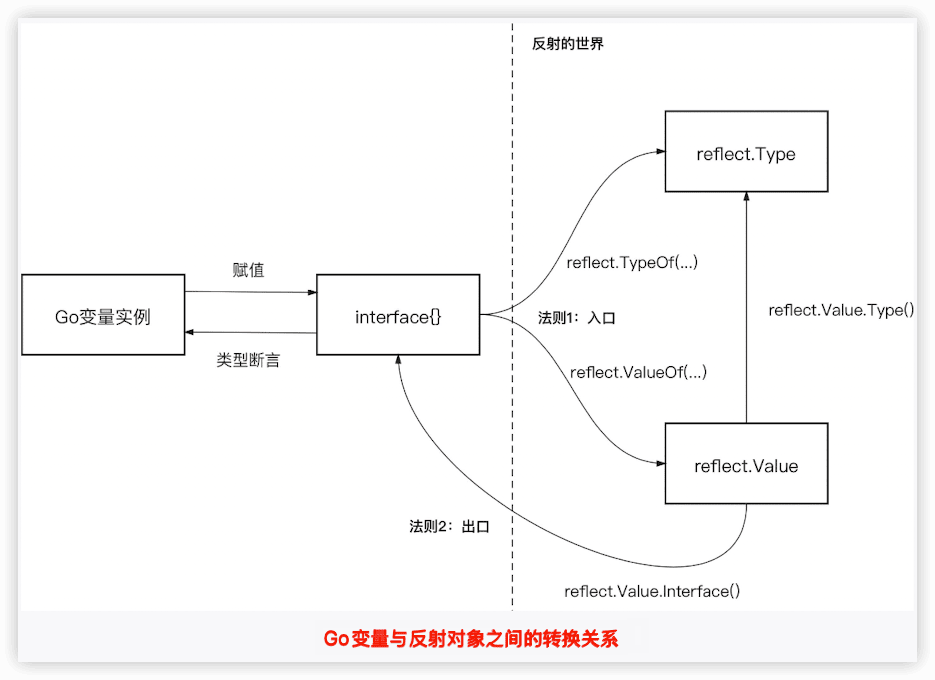

### 2 å射世界的入å£

`reflect.TypeOf`å’Œ`reflect.ValueOf`是进入å射世界仅有的两扇“大门â€ã€‚

通过reflect.TypeOf这扇“门â€è¿›å…¥å射世界，你将得到一个reflect.Type对象，该对象中包å«äº†è¢«åå°„çš„Goå˜é‡å®ä¾‹çš„**所有类å‹ä¿¡æ¯**ï¼›

而通过reflect.ValueOf这扇“门â€è¿›å…¥å射世界，你将得到一个reflect.Value对象。**`Value`对象是å射世界的核心**，ä¸ä»…该对象中包å«äº†è¢«åå°„çš„Goå˜é‡å®ä¾‹çš„值信æ¯ï¼Œè€Œä¸”通过调用该对象的Type方法，我们还å¯ä»¥å¾—到Goå˜é‡å®ä¾‹çš„ç±»å‹ä¿¡æ¯ï¼Œè¿™ä¸é€šè¿‡reflect.TypeOfè·å¾—ç±»å‹ä¿¡æ¯æ˜¯ç­‰ä»·çš„：

```go
// reflect.ValueOf().Type()等价äºreflect.TypeOf()
var i int = 5
val := reflect.ValueOf(i)
typ := reflect.TypeOf(i)
fmt.Println(reflect.DeepEqual(typ, val.Type())) // true
```


### 3 å射世界的出å£

reflect.Value.Interface()是reflect.ValueOf()的逆过程，通过Interface方法我们å¯ä»¥å°†reflect.Value对象æ¢å¤æˆä¸€ä¸ªinterface{}ç±»å‹çš„å˜é‡å€¼ã€‚这个离开å射世界的过程å®è´¨æ˜¯å°†reflect.Value中的类å‹ä¿¡æ¯å’Œå€¼ä¿¡æ¯é‡æ–°æ‰“包æˆä¸€ä¸ªinterface{}的内部表示。之å，我们就å¯ä»¥é€šè¿‡ç±»å‹æ–­è¨€å¾—到一个åå°„å‰çš„ç±»å‹å˜é‡å€¼


### 4 输出å‚æ•°ã€interface{}ç±»å‹å˜é‡åŠå射对象的å¯è®¾ç½®æ€§

reflect.Valueæ供了CanSetã€CanAddråŠCanInterface等方法æ¥å¸®åŠ©æˆ‘们判断å射对象是å¦å¯è®¾ç½®ï¼ˆSettable）ã€å¯å¯»å€ã€å¯æ¢å¤ä¸ºä¸€ä¸ªinterface{}ç±»å‹å˜é‡ã€‚


- 当被å射对象以值类å‹ï¼ˆT）传递给reflect.ValueOf时，所得到的å射对象（Value）是ä¸å¯è®¾ç½®å’Œä¸å¯å¯»å€çš„。
- 当被å射对象以指针类å‹ï¼ˆ`*T`或`&T`）传递给reflect.ValueOf时，通过reflect.Valueçš„Elem方法å¯ä»¥å¾—到代表该指针所指内存对象的Valueå射对象。而这个å射对象是å¯è®¾ç½®å’Œå¯å¯»å€çš„，对其进行修改（比如利用Valueçš„SetInt方法）将会åƒå‡½æ•°çš„输出å‚数那样直æ¥ä¿®æ”¹è¢«å射对象所指å‘的内存空间的值。
- 当传入结æ„体或数组指针时，通过Field或Index方法得到的代表结æ„体字段或数组元素的Valueå射对象也是å¯è®¾ç½®å’Œå¯å¯»å€çš„。如æœç»“æ„体中æŸä¸ªå­—段是é导出字段，则该字段是å¯å¯»å€ä½†ä¸å¯è®¾ç½®çš„（比如上é¢ä¾‹å­ä¸­çš„age字段）。
- 当被å射对象的é™æ€ç±»å‹æ˜¯æ¥å£ç±»å‹æ—¶ï¼ˆå°±åƒä¸Šé¢çš„interface{}ç±»å‹å˜é‡i），该被å射对象的动æ€ç±»å‹å†³å®šäº†å…¶è¿›å…¥å射世界åçš„å¯è®¾ç½®æ€§ã€‚如æœåŠ¨æ€ç±»å‹ä¸º`*T`或`&T`时，就åƒä¸Šé¢ä¼ ç»™å˜é‡i的是`&Person{}`，那么通过Elem方法è·å¾—çš„å射对象就是å¯è®¾ç½®å’Œå¯å¯»å€çš„。
- mapç±»å‹è¢«å射对象比较特殊，它的keyå’Œvalue都是ä¸å¯å¯»å€å’Œä¸å¯è®¾ç½®çš„。但我们å¯ä»¥é€šè¿‡Valueæ供的SetMapIndex方法对mapå射对象进行修改，这ç§ä¿®æ”¹ä¼šåŒæ­¥åˆ°è¢«åå°„çš„mapå˜é‡ä¸­ã€‚


## 49 Go常用工具

Ref: [Go语言精进之路2](https://book.douban.com/subject/35720729/) 64


### 49.1 è·å–ä¸å®‰è£…

#### 1 `go get`

go get 命令的默认行为主è¦åŒ…括以下核心æ“作：

1. 下载ä¾èµ–到模å—缓存

   ä»è¿œç¨‹ä»£ç ä»“库（如 GitHubã€GitLab）拉å–指定的包åŠå…¶ä¾èµ–项，存储到本地模å—缓存目录（通常为 `$GOPATH/pkg/mod`）。

   缓存的ä¾èµ–会按「模å—路径+版本ã€éš”离，é¿å…ä¸åŒé¡¹ç›®é—´ä¾èµ–冲çªã€‚

2. 更新 go.mod 和 go.sum 文件

   修改 go.mod：在文件中添加或更新ä¾èµ–声æ˜ï¼Œæ ¼å¼ä¸º require <模å—路径> <版本>。

   生æˆã€æ›´æ–° go.sum：记录ä¾èµ–包的哈希值，用äºæ ¡éªŒä¾èµ–完整性，确ä¿åç»­æ„建时ä¾èµ–未被篡改。

3. 安装å¯æ‰§è¡ŒåŒ…（若适用）

   如æœæ‹‰å–çš„åŒ…åŒ…å« main 包（å³å¯æ‰§è¡Œç¨‹åºï¼Œå¦‚命令行工具），go get 会将其编译并安装到 `$GOPATH/bin` 或 `$GOBIN` 目录，使其å¯ç›´æ¥é€šè¿‡å‘½ä»¤è¡Œè°ƒç”¨ã€‚

- `go get -u` 强制更新包至最新版本，需注æ„版本兼容性é£é™©

> 在bitbucket.org上托管的三个项目pã€qå’Œr为例（pç›´æ¥ä¾èµ–q，qç›´æ¥ä¾èµ–r）

```shell
$ go get -u bitbucket.org/bigwhite/p
go: downloading bitbucket.org/bigwhite/p v0.0.0-20201018015115-ed01ba7d1494
go: downloading bitbucket.org/bigwhite/q v0.2.0
go: downloading bitbucket.org/bigwhite/r v0.2.0
go: added bitbucket.org/bigwhite/p v0.0.0-20201018015115-ed01ba7d1494
go: added bitbucket.org/bigwhite/q v0.2.0
go: added bitbucket.org/bigwhite/r v0.2.0

```

go get -u会将pã€qåŠr的当å‰æœ€æ–°ç‰ˆæœ¬ä»£ç å…¨éƒ¨è·å–到本地并编译安装。

> 在bitbucket.org上托管了三个module：sã€tå’Œu。sä¾èµ–module t中的包tã€module t中的包tä¾èµ–module u中的包u。åˆå§‹çŠ¶æ€ä¸‹ï¼Œmodule tå’Œu都å‘布了v1.0.0版本。

```sh
$ go get -u bitbucket.org/bigwhite/s
go: downloading bitbucket.org/bigwhite/s v0.0.0-20201022021324-e944764a88be
go: downloading bitbucket.org/bigwhite/t v1.1.0
go: downloading bitbucket.org/bigwhite/u v1.0.0
go: downloading bitbucket.org/bigwhite/u v1.1.0
go: added bitbucket.org/bigwhite/s v0.0.0-20201022021324-e944764a88be
go: added bitbucket.org/bigwhite/t v1.1.0
go: added bitbucket.org/bigwhite/u v1.1.0

```


```sh
$ ll ~/myfield/go/pkg/mod/bitbucket.org/bigwhite 
total 0
dr-xr-xr-x@ 4 andyron  staff   128B Aug  7 13:17 p@v0.0.0-20201018015115-ed01ba7d1494
dr-xr-xr-x@ 4 andyron  staff   128B Aug  7 13:17 q@v0.2.0
dr-xr-xr-x@ 4 andyron  staff   128B Aug  7 13:17 r@v0.2.0
dr-xr-xr-x@ 5 andyron  staff   160B Aug  7 13:29 s@v0.0.0-20201022021324-e944764a88be
dr-xr-xr-x@ 6 andyron  staff   192B Aug  7 13:30 t@v1.1.0
dr-xr-xr-x@ 5 andyron  staff   160B Aug  7 13:30 u@v1.0.0
dr-xr-xr-x@ 5 andyron  staff   160B Aug  7 13:30 u@v1.1.0

```


#### 2 `go install`

编译并安装命令Go程åºæˆ–包:

```go
go install
```

生æˆçš„å¯æ‰§è¡Œæ–‡ä»¶ä¼šè¢«æ”¾åˆ° `$GOPATH/bin` 或模å—模å¼ä¸‹çš„ `GOBIN` 路径中。

```sh
go install -x -v bitbucket.org/bigwhite/p
```

ç”±äºä¼ å…¥äº†-x -v选项，go install会输出大é‡æ—¥å¿—。

#### 3 `go get -u` ä¸ `go install` 对比 

`go get -u`，下载或更新ä¾èµ–包到本地模å—缓存（$GOPATH/pkg/mod），将ä¾èµ–ä¿¡æ¯å†™å…¥ go.mod å’Œ go.sum（如添加新ä¾èµ–或更新版本）。

`go install`，仅编译安装å¯æ‰§è¡Œæ–‡ä»¶ï¼Œä¸ä¿®æ”¹é¡¹ç›®ä¾èµ–关系，输出路径由 `$GOBIN` 或 `$GOPATH/bin` æ§åˆ¶ã€‚

|   **特性**   |              **`go get -u`**              |           **`go install`**            |
| :----------: | :---------------------------------------: | :-----------------------------------: |
| **主è¦ç›®çš„** |     添加/æ›´æ–°ä¾èµ–并修改 `go.mod` 文件     | 编译安装å¯æ‰§è¡Œæ–‡ä»¶ï¼ˆä¸ä¿®æ”¹ `go.mod`） |
| **ä¾èµ–管ç†** | ✅ æ›´æ–°ä¾èµ–版本，修改 `go.mod` å’Œ `go.sum` |           ⌠ä¸ä¿®æ”¹æ¨¡å—文件            |
| **安装ä½ç½®** |    ⌠默认ä¸å®‰è£…二进制文件（Go 1.16+）     |  ✅ 安装到 `$GOPATH/bin` 或 `$GOBIN`   |
| **版本指定** |     æ”¯æŒ `@v1.2.3`ã€`@latest` 等语法      | **å¿…é¡»** 显å¼æŒ‡å®šç‰ˆæœ¬ï¼ˆå¦‚ `@latest`） |
| **适用对象** |           项目ä¾èµ–（库或工具）            |   å¯æ‰§è¡Œæ–‡ä»¶ï¼ˆå…¨å±€å·¥å…·æˆ–本地命令）    |


### 49.2 包或module检视

`go list`用äºåˆ—出关äºåŒ…/moduleçš„å„类信æ¯ã€‚这里把输出这类信æ¯çš„行为称为检视。

#### 49.2.1 go list基础

go list默认列出当å‰è·¯å¾„下的包的导入路径。

如æœè¦åˆ—出**当å‰è·¯å¾„åŠå…¶å­è·¯å¾„（递归）下的所有包**，å¯ä»¥ç”¨`go list {当å‰è·¯å¾„}/...`：

```sh
✠ gocmpp@v0.0.0-20240917054108-b238366bff0b $ go list ./...               
github.com/bigwhite/gocmpp
github.com/bigwhite/gocmpp/examples/cmpp2-client
github.com/bigwhite/gocmpp/examples/cmpp3-client
github.com/bigwhite/gocmpp/examples/cmpp3-server
github.com/bigwhite/gocmpp/fuzztest/fwd/gen
github.com/bigwhite/gocmpp/fuzztest/submit/gen
github.com/bigwhite/gocmpp/utils
```

也å¯ä»¥ä½¿ç”¨`包导入路径+...`çš„æ–¹å¼ï¼Œè¡¨ç¤ºåˆ—出该路径下所有å­è·¯å¾„下的包导入路径：

```sh
✠ gocmpp@v0.0.0-20240917054108-b238366bff0b $ go list github.com/bigwhite/gocmpp/examples/...
github.com/bigwhite/gocmpp/examples/cmpp2-client
github.com/bigwhite/gocmpp/examples/cmpp3-client
github.com/bigwhite/gocmpp/examples/cmpp3-server
```

GoåŸç”Ÿä¿ç•™äº†å‡ ä¸ªä»£è¡¨ç‰¹å®šåŒ…或包集åˆçš„路径关键字：**mainã€allã€cmdå’Œstd**。这些ä¿ç•™çš„路径关键字ä¸è¦ç”¨äºGo包的æ„建中。

1. main：表示独立å¯æ‰§è¡Œç¨‹åºçš„顶层包。
2. all：展开为主module（当å‰è·¯å¾„下的module）下的所有包åŠå…¶æ‰€æœ‰ä¾èµ–包，包括测试代ç çš„ä¾èµ–包

```sh
go list all
```

3. std：代表标准库所有包的集åˆã€‚

```sh
go list std
```

4. cmd：代ç Go语言自身项目仓库下的src/cmd下的所有包åŠinternal包。

```sh
go list cmd
```


默认情况下，go list输出的都是包的导入路径信æ¯ï¼Œå¦‚æœè¦åˆ—出**moduleä¿¡æ¯**，å¯ä»¥ä¸ºlist命令传入`-m`命令行标志选项：

```sh
✠ gocmpp@v0.0.0-20240917054108-b238366bff0b $ go list -m
github.com/bigwhite/gocmpp
✠ gocmpp@v0.0.0-20240917054108-b238366bff0b $ go list -m all
github.com/bigwhite/gocmpp
github.com/dvyukov/go-fuzz v0.0.0-20190516070045-5cc3605ccbb6
github.com/yuin/goldmark v1.4.13
golang.org/x/crypto v0.0.0-20210921155107-089bfa567519
golang.org/x/mod v0.6.0-dev.0.20220419223038-86c51ed26bb4
golang.org/x/net v0.0.0-20220722155237-a158d28d115b
golang.org/x/sync v0.0.0-20220722155255-886fb9371eb4
golang.org/x/sys v0.0.0-20220722155257-8c9f86f7a55f
golang.org/x/term v0.0.0-20210927222741-03fcf44c2211
golang.org/x/text v0.3.8
golang.org/x/tools v0.1.12
golang.org/x/xerrors v0.0.0-20190717185122-a985d3407aa7

```

#### 49.2.2 定制输出内容的格å¼

`-f`用äºå®šåˆ¶å…¶è¾“出内容的格å¼ã€‚-f标志选项的值是一个格å¼å­—符串，采用的是Go template包的语法。go list的默认输出等价äºï¼š

```sh
go list -f '{{.ImportPath}}'
```

ImportPath这个字段æ¥è‡ª`$GOROOT/src/cmd/go/internal/pkg.go`文件中的结æ„体类å‹`PackagePublic`，其结æ„如下：

```go
// $GOROOT/src/cmd/go/internal/pkg.go (go 1.14)
type PackagePublic struct {
	Dir           string `json:",omitempty"`  // 包å«åŒ…æºç çš„目录
  ImportPath    string `json:",omitempty"`  // dir下包的导入路径
  ImportComment string `json:",omitempty"`  // 包声æ˜è¯­å¥åé¢çš„注释中的路径
  Name          string `json:",omitempty"`  // 包å
  Doc           string `json:",omitempty"`  // 包文档字符串
  Target        string `json:",omitempty"`  // 该软件包的安装目标（å¯ä»¥æ˜¯å¯æ‰§è¡Œçš„）
  ...
  
  TestGoFiles  []string `json:",omitempty"` // 包中的_test.go文件
  TestImports  []string `json:",omitempty"` // TestGoFiles导入的包
  XTestGoFiles []string `json:",omitempty"` // 包外的_test.go
  XTestImports []string `json:",omitempty"` // XTestGoFiles导入的包
}
```

结æ„体包å«äº†åŒ…相关的å„类信æ¯ï¼Œæˆ‘们å¯ä»¥æ ¹æ®éœ€è¦ä»¥Go template包的语法格å¼æ¥è¾“出å„ç§åŒ…ä¿¡æ¯ï¼Œä¹Ÿå¯ä»¥åˆ©ç”¨æ¨¡æ¿è¯­æ³•ä¸­çš„内置函数输出上述结æ„体的所有信æ¯ã€‚以标准库的fmt包为例：

```sh
✠ fmt git:(stable) go list -f '{{printf "%#v" .}}'
&load.PackagePublic{Dir:"/opt/homebrew/Cellar/go/1.24.2/libexec/src/fmt", ImportPath:"fmt", ImportComment:"", Name:"fmt", Doc:"Package fmt implements formatted I/O with functions analogous to C's printf and scanf.", Target:"", Shlib:"", Root:"/opt/homebrew/Cellar/go/1.24.2/libexec", ConflictDir:"", ForTest:"", Export:"", BuildID:"", Module:(*modinfo.ModulePublic)(nil), Match:[]string{"."}, Goroot:true, Standard:true, DepOnly:false, BinaryOnly:false, Incomplete:false, DefaultGODEBUG:"", Stale:false, StaleReason:"", GoFiles:[]string{"doc.go", "errors.go", "format.go", "print.go", "scan.go"}, CgoFiles:[]string(nil), CompiledGoFiles:[]string(nil), IgnoredGoFiles:[]string(nil), InvalidGoFiles:[]string(nil), IgnoredOtherFiles:[]string(nil), CFiles:[]string(nil), CXXFiles:[]string(nil), MFiles:[]string(nil), HFiles:[]string(nil), FFiles:[]string(nil), SFiles:[]string(nil), SwigFiles:[]string(nil), SwigCXXFiles:[]string(nil), SysoFiles:[]string(nil), EmbedPatterns:[]string{}, EmbedFiles:[]string(nil), CgoCFLAGS:[]string(nil), CgoCPPFLAGS:[]string(nil), CgoCXXFLAGS:[]string(nil), CgoFFLAGS:[]string(nil), CgoLDFLAGS:[]string(nil), CgoPkgConfig:[]string(nil), Imports:[]string{"errors", "internal/fmtsort", "io", "math", "os", "reflect", "slices", "strconv", "sync", "unicode/utf8"}, ImportMap:map[string]string(nil), Deps:[]string{"cmp", "errors", "internal/abi", "internal/asan", "internal/bisect", "internal/bytealg", "internal/byteorder", "internal/chacha8rand", "internal/coverage/rtcov", "internal/cpu", "internal/filepathlite", "internal/fmtsort", "internal/goarch", "internal/godebug", "internal/godebugs", "internal/goexperiment", "internal/goos", "internal/itoa", "internal/msan", "internal/oserror", "internal/poll", "internal/profilerecord", "internal/race", "internal/reflectlite", "internal/runtime/atomic", "internal/runtime/exithook", "internal/runtime/maps", "internal/runtime/math", "internal/runtime/sys", "internal/stringslite", "internal/sync", "internal/syscall/execenv", "internal/syscall/unix", "internal/testlog", "internal/unsafeheader", "io", "io/fs", "iter", "math", "math/bits", "os", "path", "reflect", "runtime", "slices", "strconv", "sync", "sync/atomic", "syscall", "time", "unicode", "unicode/utf8", "unsafe"}, Error:(*load.PackageError)(nil), DepsErrors:[]*load.PackageError{}, TestGoFiles:[]string{"export_test.go"}, TestImports:[]string(nil), TestEmbedPatterns:[]string{}, TestEmbedFiles:[]string(nil), XTestGoFiles:[]string{"errors_test.go", "example_test.go", "fmt_test.go", "gostringer_example_test.go", "scan_test.go", "state_test.go", "stringer_example_test.go", "stringer_test.go"}, XTestImports:[]string{"bufio", "bytes", "errors", "fmt", "internal/race", "io", "math", "os", "reflect", "regexp", "strings", "testing", "testing/iotest", "time", "unicode", "unicode/utf8"}, XTestEmbedPatterns:[]string{}, XTestEmbedFiles:[]string(nil)}

```

##### 1 ImportPath

ImportPath表示当å‰è·¯å¾„下的包的导入路径，该字段唯一标识一个包。

##### 2 Target

Target表示包的安装路径，该字段采用ç»å¯¹è·¯å¾„å½¢å¼ã€‚

##### 3 Root

Root表示包所在的GOROOT或GOPATH顶层路径，或者包å«è¯¥åŒ…çš„module根路径。

```sh
$ go list -f '{{.Root}}'
/opt/homebrew/Cellar/go/1.24.2/libexec

✠ gofirst git:(main) $ go list -f '{{.Root}}'
...github/LearnGo/Go语言第一课/gofirst
```

##### 4 GoFiles

GoFiles表示当å‰åŒ…包å«çš„Goæºæ–‡ä»¶åˆ—表，ä¸åŒ…å«å¯¼å…¥â€œCâ€çš„cgo文件ã€æµ‹è¯•ä»£ç æºæ–‡ä»¶ã€‚

```sh
// 在GOROOT/src/os/user目录下执行
$ go list -f '{{.GoFiles}}'
[lookup.go user.go]
```

##### 5 CgoFiles

CgoFiles表示当å‰åŒ…下导入了“Câ€çš„cgo文件。

##### 6 IgnoredGoFiles

IgnoredGoFiles表示当å‰åŒ…中在当å‰æ„建上下文约æŸæ¡ä»¶ä¸‹è¢«å¿½ç•¥çš„Goæºæ–‡ä»¶ã€‚

```sh
// 在GOROOT/src/os/user目录下执行
$ go list -f '{{.IgnoredGoFiles}}'
[cgo_lookup_cgo.go getgrouplist_unix.go listgroups_stub.go listgroups_unix.go listgroups_unix_test.go lookup_android.go lookup_plan9.go lookup_stubs.go lookup_unix.go lookup_unix_test.go lookup_windows.go user_windows_test.go]
```

##### 7 Imports

Imports表示当å‰åŒ…导入的ä¾èµ–包的导入路径集åˆã€‚

```sh
// 在GOROOT/src/os/user目录下执行
$ go list -f '{{.Imports}}'
[fmt internal/syscall/unix runtime strconv strings sync syscall unsafe]
```

##### 8 Deps

Deps表示当å‰åŒ…的所有ä¾èµ–包导入路径集åˆã€‚å’ŒImportsä¸åŒçš„是，Deps是递归查询当å‰åŒ…的所有ä¾èµ–包。

```sh
go list -f '{{.Deps}}'
```

##### 9 TestGoFiles

TestGoFiles表示当å‰åŒ…的包内测试代ç çš„文件集åˆã€‚

```sh
go list -f '{{.TestGoFiles}}'
```

##### 10 XTestGoFiles

XTestGoFiles表示当å‰åŒ…的包外测试代ç çš„文件集åˆã€‚

```sh
// 在$GOPATH/src/github.com/bigwhite/gocmpp目录下执行
$ go list -f '{{.XTestGoFiles}}'
[activetest_test.go conn_test.go connect_test.go deliver_test.go fwd_test.go receipt_test.go submit_fuzz_test.go submit_test.go terminate_test.go]
```


-json标志选项以将包的全部信æ¯ä»¥JSONæ ¼å¼è¾“出：

```sh
go list -json
```


#### 49.2.3 有关moduleçš„å¯ç”¨å‡çº§ç‰ˆæœ¬ä¿¡æ¯

`-m`标志选项，å¯ä»¥è®©go list列出moduleä¿¡æ¯ï¼Œå†ä¼ å…¥`-u`å¯ä»¥è·å–到å¯ç”¨çš„moduleå‡çº§ç‰ˆæœ¬ï¼š

```sh
// 在$GOPATH/src/github.com/bigwhite/gocmpp目录下执行
$ go list -m  all  
github.com/bigwhite/gocmpp
github.com/dvyukov/go-fuzz v0.0.0-20190516070045-5cc3605ccbb6
github.com/yuin/goldmark v1.4.13
golang.org/x/crypto v0.0.0-20210921155107-089bfa567519
golang.org/x/mod v0.6.0-dev.0.20220419223038-86c51ed26bb4
golang.org/x/net v0.0.0-20220722155237-a158d28d115b
golang.org/x/sync v0.0.0-20220722155255-886fb9371eb4
golang.org/x/sys v0.0.0-20220722155257-8c9f86f7a55f
golang.org/x/term v0.0.0-20210927222741-03fcf44c2211
golang.org/x/text v0.3.8
golang.org/x/tools v0.1.12
golang.org/x/xerrors v0.0.0-20190717185122-a985d3407aa7
$ go list -m -u all
github.com/bigwhite/gocmpp
github.com/dvyukov/go-fuzz v0.0.0-20190516070045-5cc3605ccbb6 [v0.0.0-20240924070022-e577bee5275c]
github.com/yuin/goldmark v1.4.13 [v1.7.13]
golang.org/x/crypto v0.0.0-20210921155107-089bfa567519 [v0.40.0]
golang.org/x/mod v0.6.0-dev.0.20220419223038-86c51ed26bb4 [v0.26.0]
golang.org/x/net v0.0.0-20220722155237-a158d28d115b [v0.42.0]
golang.org/x/sync v0.0.0-20220722155255-886fb9371eb4 [v0.16.0]
golang.org/x/sys v0.0.0-20220722155257-8c9f86f7a55f [v0.34.0]
golang.org/x/term v0.0.0-20210927222741-03fcf44c2211 [v0.33.0]
golang.org/x/text v0.3.8 [v0.27.0]
golang.org/x/tools v0.1.12 [v0.35.0]
golang.org/x/xerrors v0.0.0-20190717185122-a985d3407aa7 [v0.0.0-20240903120638-7835f813f4da]
```

### 49.3 æ„建

go build

go build命令常用å‚数：

```
-v 编译时显示包å
-p n 指定编译时并å‘çš„æ•°é‡ï¼ˆä½¿ç”¨n表示），该值默认为CPU 的逻
-a 强制进行é‡æ–°æ„建
-n 仅输出编译时执行的所有命令
-x 执行编译并输出编译时执行的所有命令
-race å¼€å¯ç«æ€æ£€æµ‹
```

- **基本编译**：`go build main.go` 生æˆå¯æ‰§è¡Œæ–‡ä»¶ï¼ˆé»˜è®¤ä¸ç›®å½•åŒå）
- **优化体积**：`go build -ldflags "-s -w"` 移除符å·è¡¨å’Œè°ƒè¯•ä¿¡æ¯ï¼Œå‡å°‘二进制文件大å°
- **交å‰ç¼–译**：GOOS=linux GOARCH=amd64 go build 生æˆè·¨å¹³å°äºŒè¿›åˆ¶æ–‡ä»¶

#### 1 -x -v：让æ„建过程一目了然

go build过程会执行很多命令

go build执行命令的顺åºå¤§è‡´å¦‚下：

1. 创建用äºæ„建的临时目录；
2. 下载æ„建module sä¾èµ–çš„module tå’Œuï¼›
3. 分别编译module tå’Œu，将编译å的结æœå­˜å‚¨åˆ°ä¸´æ—¶ç›®å½•åŠGOCACHE目录下；
4. 编译module s；
5. 定ä½å’Œæ±‡æ€»module sçš„å„个ä¾èµ–包æ„建å的目标文件（.a文件）的ä½ç½®ï¼Œå½¢æˆimportcfg.link文件，供å续链æ¥å™¨ä½¿ç”¨ï¼›
6. 链æ¥æˆå¯æ‰§è¡Œæ–‡ä»¶ï¼›
7. 清ç†ä¸´æ—¶æ„建ç¯å¢ƒã€‚


🔖

### 49.4 è¿è¡Œä¸è¯Šæ–­


### 49.5 查看文档

#### `go doc`

- 文档查询：`go doc fmt.Printf` 查看标准库函数文档

```sh
go doc net/http
go doc http

go doc http.Get

go doc http.Request.Form
```

- 查看当å‰é¡¹ç›®æ–‡æ¡£

查看当å‰è·¯å¾„下的包的文档：

```sh
$ go doc
```

查看当å‰è·¯å¾„下包的导出元素的文档：

```sh
$ go doc core 
package core // import "github.com/flipped-aurora/gin-vue-admin/server/core"

func RunWindowsServer()
func Viper() *viper.Viper
func Zap() (logger *zap.Logger)
```

é导出元素的文档：

```sh
$ go doc -u core
package core // import "github.com/flipped-aurora/gin-vue-admin/server/core"

func RunWindowsServer()
func Viper() *viper.Viper
func Zap() (logger *zap.Logger)
func getConfigPath() (config string)
type server interface{ ... }
    func initServer(address string, router *gin.Engine) server
```

- 查看项目ä¾èµ–的第三方module的文档

`go doc`在查看项目ä¾èµ–的第三方module的文档时，会自动到go mod cache中找到该module（已ç»ä¸‹è½½åˆ°æœ¬åœ°çš„），并显示其文档：

```sh
$ go doc github.com/casbin/casbin/v2
package casbin // import "github.com/casbin/casbin/v2"

func CasbinJsGetPermissionForUser(e IEnforcer, user string) (string, error)
func CasbinJsGetPermissionForUserOld(e IEnforcer, user string) ([]byte, error)
func GetCacheKey(params ...interface{}) (string, bool)
type CacheableParam interface{ ... }
...
```

- 查看æºç 

```sh
go doc -src fmt.Printf

go doc -src NewClient
go doc -u -src newPacketWriter
go doc -src github.com/casbin/casbin/v2 CasbinJsGetPermissionForUser
```

##### pkgsite

[pkgsite](https://github.com/golang/pkgsite)是官方æ¨å‡ºçš„新版Go包文档站点（本地）。

```sh
$ go install golang.org/x/pkgsite/cmd/pkgsite@latest
$ cd myproject
$ pkgsite 
```

- 查看包内特定函数/ç±»å‹çš„文档

```sh
go doc <包å>.<函数å/ç±»å‹å>
```

```sh
go doc slices.Delete
```

- 查看详细文档（包å«æœªå¯¼å‡ºæˆå‘˜ï¼Œé€šå¸¸ç”¨äºè°ƒè¯•ï¼‰

```sh
go doc -u <包å>.<目标>
```

```sh
go doc -u slices.overlaps
```


- 查看包内所有导出æˆå‘˜çš„文档

```sh
go doc -all <包å>
```

```sh
go doc -all slices
```


### 49.6 模å—管ç†

#### `go mod`

包管ç†ç³»ç»Ÿ

- åˆå§‹åŒ–模å—：`go mod init <模å—å>` 创建 go.mod 文件，定义模å—路径和版本
- ä¾èµ–æ•´ç†ï¼š`go mod tidy` 自动清ç†æœªä½¿ç”¨çš„ä¾èµ–，åŒæ­¥ go.mod ä¸å®é™…代ç çš„ä¾èµ–关系
- 离线æ„建：`go mod vendor` å°†ä¾èµ–å¤åˆ¶åˆ°æœ¬åœ° vendor 目录，支æŒæ— ç½‘络ç¯å¢ƒç¼–译
- 查看模å—ä¾èµ–图：`go mod graph`


### 49.7 è¿è¡Œ


#### `go run`

编译并立å³è¿è¡ŒGo程åºï¼Œé€‚åˆå¿«é€Ÿæµ‹è¯•ã€‚

执行go run命令时也会编译Goæºç æ–‡ä»¶ï¼Œä½†ç”Ÿæˆçš„å¯æ‰§è¡Œæ–‡ä»¶è¢«å­˜æ”¾åœ¨ä¸´æ—¶ç›®å½•ä¸­ï¼Œå¹¶è‡ªåŠ¨è¿è¡Œè¿™ä¸ªå¯æ‰§è¡Œæ–‡ä»¶ã€‚

```go
func main() {
	fmt.Println(os.Args)
}
```

```sh
go run main.go -color blue
[/var/folders/8k/ntbhdf615p34cflx1_qwv38r0000gn/T/go-build692689547/b001/exe/main -color blue]
```


### 49.8 代ç è´¨é‡ä¸æµ‹è¯•

#### `go test`

- å•å…ƒæµ‹è¯•ï¼šè‡ªåŠ¨æ‰§è¡Œ `_test.go` 文件中以 Test 开头的函数
- 覆盖ç‡åˆ†æ：`go test -coverprofile=cover.out` 生æˆä»£ç è¦†ç›–ç‡æŠ¥å‘Šï¼Œé€šè¿‡ `go tool cover -html=cover.out` å¯è§†åŒ–
- 基准测试：`go test -bench=.` è¿è¡Œä»¥ Benchmark 开头的性能测试函数

#### `go vet`

- é™æ€æ£€æŸ¥ï¼š`go vet ./...` 检测代ç ä¸­çš„潜在错误（如未使用的å˜é‡ã€é”™è¯¯æ ¼å¼åŒ–字符串）

#### `go fmt`

对Goæºä»£ç è¿›è¡Œæ ¼å¼åŒ–，符åˆGo的官方é£æ ¼ï¼š

```go
go fmt main.go
```

ç°åœ¨Golandå¯ä»¥è‡ªåŠ¨å®Œæˆã€‚


### 49.9 系统交互ä¸è°ƒè¯•

#### `go version`

#### `go env`

- 查看ç¯å¢ƒå˜é‡ï¼š`go env` 显示 GOPATHã€GOROOT 等关键é…ç½®
- 动æ€ä¿®æ”¹ï¼š`go env -w GOPROXY=https://goproxy.cn` 设置国内镜åƒåŠ é€Ÿä¾èµ–下载

### 49.10 辅助工具

#### `go clean`

清ç†æ‰€æœ‰ç¼–译生æˆçš„文件，具体包括：

1. 当å‰ç›®å½•ä¸‹ç”Ÿæˆçš„ä¸åŒ…å或Goæºç æ–‡ä»¶å相åŒçš„å¯æ‰§è¡Œæ–‡ä»¶ï¼Œä»¥åŠå½“å‰ç›®å½•ä¸­çš„_objå’Œ_test目录中å称为_testmain.goã€test.outã€build.outã€a.outåŠå缀为.5ã€.6ã€.8ã€.aã€.oå’Œ.so的文件。这些文件通常是执行go build命令å生æˆçš„。
2. 以当å‰ç›®å½•ä¸‹ç”Ÿæˆçš„包å加“.testâ€å缀为å的文件。这些文件通常是执行go test命令å生æˆçš„。
3. 工作区中pkgå’Œbin目录的相应归档文件和å¯æ‰§è¡Œæ–‡ä»¶ã€‚这些文件通常是执行go install命令å生æˆçš„。

go clean命令通常用äºä½¿ç”¨VCS（版本æ§åˆ¶ç³»ç»Ÿï¼Œå¦‚Git）的团队，在æ交代ç å‰è¿è¡Œï¼Œä»¥å…将编译时生æˆçš„临时文件åŠç¼–译å生æˆçš„å¯æ‰§è¡Œæ–‡ä»¶ç­‰é”™è¯¯åœ°æ交到代ç ä»“库中。

```
-i	清除关è”的安装包和å¯è¿è¡Œæ–‡ä»¶ï¼Œè¿™äº›æ–‡ä»¶é€šå¸¸æ˜¯æ‰§è¡Œ gQ install 命令å生æˆçš„
-n	仅输出清ç†æ—¶æ‰§è¡Œçš„所有命令
-r	递归清除在 import 中引入的包
-x	执行清ç†å¹¶è¾“出清ç†æ—¶æ‰§è¡Œçš„所有命令
-cache	清ç†ç¼“存，这些缓存文件通常是执行go build命令å生æˆçš„
-testcache	清ç†æµ‹è¯•ç»“æœ
```


- 清ç†æ„建产物：`go clean -modcache` 删除模å—缓存，`go clean -x` 显示清ç†è¿‡ç¨‹ç»†èŠ‚

#### `go bug`

跳转到goçš„GitHub页é¢ï¼ŒæŠ¥å‘Šbug


## 50 文件处ç†

### 50.1 文件æ“作

大多数文件æ“作的函数都是在os包中的，几个目录æ“作例å­ï¼š

```go
func Mkdir(name string, perm FileMode) error  // 创建å称为name的目录，æƒé™è®¾ç½®æ˜¯perm，如0555
func MkdirAll(path string, perm FileMode) error // æ ¹æ®path创建多级å­ç›®å½•ï¼Œå¦‚zuolan/test1/test2
func Remove(name string) error  // 删除å称为name的目录，当目录下有文件或者其他目录时会出错
func RemoveAll(path string) error  // æ ¹æ®path删除多级å­ç›®å½•ï¼Œå¦‚æœpath是å•ä¸ªå称，那么该目录下的å­ç›®å½•å…¨éƒ¨åˆ é™¤
```

#### 创建文件ä¸æŸ¥çœ‹çŠ¶æ€

```go
// 1 新建文件
func Create(name string) (file *File, err Erroe)  // æ ¹æ®æ供的文件å称创建新的文件，返å›ä¸€ä¸ªæ–‡ä»¶å¯¹è±¡ï¼Œé»˜è®¤æƒé™æ˜¯0666的文件，返å›çš„文件对象是å¯è¯»å†™çš„
func NewFile(fd uintptr, name string) *File  // æ ¹æ®æ–‡ä»¶æ述符创建相应的文件，返å›ä¸€ä¸ªæ–‡ä»¶å¯¹è±¡
// 2 新建文件夹
func MkdirAll(path sring, perm FileMode) eror
// 3 文件/文件夹状æ€
func Stat(name string) (FileInfo, error)
```

在创建文件夹或者文件时，æƒé™æ˜¯ä¸€æ¬¡æ€§æŒ‡å®šçš„，åç»­è‹¥è¦ä¿®æ”¹æ–‡ä»¶æƒé™ï¼Œéœ€è¦ä½¿ç”¨å…¶ä»–函数。

判断文件是å¦å­˜åœ¨ï¼Œå¯ä»¥ä½¿ç”¨å‡½æ•°os.IsNotExit(err)，这个函数å¯ä»¥é€šè¿‡ä¼ å…¥çš„ertå‚数判断文件是å¦å­˜åœ¨å¹¶è¿”å›ä¸€ä¸ªå¸ƒå°”值。


#### é‡å‘½åä¸ç§»åŠ¨

```go
func Rename(oldpath, newpath string) error
```


#### 打开ä¸å…³é—­

```go
// åªè¯»æ–¹å¼ï¼Œå†…部调用OpenFile()
func Open(name string) (file *File, err Error)
// flag是打开的方å¼ï¼ŒåŒ…括åªè¯»ã€è¯»å†™ç­‰
func OpenFile(name string, flag int, perm uint32) (file *File, err Error)
```

flagå±æ€§å¯ä»¥å•ç‹¬ä½¿ç”¨ï¼Œä¹Ÿå¯ä»¥ç»„åˆä½¿ç”¨:

```go
os.O_CREATE | os. O_APPEND
os.O_CREATE | os. O_TRUNC | os. O_WRONLY
//os. O_RDONLY      //åªè¯»
//os. O_WRONLY       //åªå†™
//os. O_RDWR         //读写
//os. O_APPEND       //往文件中添加（Append）
//os. O_CREATE       //如æœæ–‡ä»¶ä¸å­˜åœ¨åˆ™å…ˆåˆ›å»º
//os. O_TRUNC        //文件打开时è£å‰ªæ–‡ä»¶
//os. O_EXCL         //å’ŒO_CREATE一起使用,文件ä¸èƒ½å­˜åœ¨
//os. O_SYNC         //以åŒæ­¥I/Oçš„æ–¹å¼æ‰“å¼€
```


#### 删除ä¸æˆªæ–­

```go
err := os. Remove("test.txt")
if err !=nil{
  log. Fatal(err)
}
```

```go
err := os.Truncate("test.txt", 100)
if err !=nil{
  log. Fatal(err)
}
```

è£å‰ªä¸€ä¸ªæ–‡ä»¶åˆ°100B，如æœæ–‡ä»¶æœ¬æ¥å°±å°‘äº100B，则文件中åŸå§‹å†…容得以ä¿ç•™ï¼Œå‰©ä½™çš„字节以null字节填充。

如æœæ–‡ä»¶æœ¬æ¥è¶…过100B，则超过的字节会被抛弃，这样总是得到精确的100B的文件。而如æœä¼ å…¥0，则会清空文件。

#### 读写文件

读写文件中最常è§çš„æ“作有å¤åˆ¶æ–‡ä»¶ã€ç¼–辑ã€è·³è½¬ã€æ›¿æ¢ç­‰ã€‚

##### 1å¤åˆ¶æ–‡ä»¶

`io.Copy(dst Writer, src Reader) (written int64, err error)`

注æ„：

Create函数执行之å需è¦Close()函数关闭å›æ”¶èµ„æºã€‚

调用io包中的å¤åˆ¶å‡½æ•°ä¹‹å文件内容并没有真正ä¿å­˜åœ¨æ–‡ä»¶ä¸­ï¼Œè€Œæ˜¯ä½¿ç”¨Sync()函数åŒæ­¥ä¹‹åæ‰çœŸæ­£ä¿å­˜åˆ°ç¡¬ç›˜ä¸­ã€‚

##### 2跳转函数

Seek()函数的特点类似äºé¼ æ ‡å…‰æ ‡çš„定ä½ï¼ŒæŒ‡å®šä½ç½®ä¹‹åå¯ä»¥æ‰§è¡Œå¤åˆ¶ã€å‰ªåˆ‡ã€ç²˜è´´ç­‰æ“作。

##### 3写入函数

```go
func (file *File) Write(b []byte) (n int, err Error)             //写入byteç±»å‹çš„ä¿¡æ¯åˆ°æ–‡ä»¶
func (file *File) WriteAt(b []byte, off int64) (n int, err Error)//在指定ä½ç½®å¼€å§‹å†™å…¥byteç±»å‹çš„ä¿¡æ¯
func (file *File) WriteString(s string) (ret int, err Error)     //写入stringä¿¡æ¯åˆ°æ–‡ä»¶
```


#### æƒé™æ§åˆ¶


#### 文件链æ¥

在Linux系统中肯定会ç»å¸¸é‡åˆ°ç¡¬é“¾æ¥æˆ–者软链æ¥ä¹‹ç±»çš„文件，对äºä¸€ä¸ªæ™®é€šæ–‡ä»¶ï¼Œå®ƒå®é™…上指å‘了硬盘的一个索引地å€ã€‚硬链æ¥ä¼šåˆ›å»ºä¸€ä¸ªæ–°çš„指针并且指å‘åŒä¸€ä¸ªåœ°æ–¹ï¼Œç¡¬é“¾æ¥ä¼šä¿æŒä¸åŸæ–‡ä»¶åŒå‘åŒæ­¥ï¼Œå…¶ä¸­ä¸€ä¸ªæ–‡ä»¶æ”¹åŠ¨ï¼Œå¦ä¸€ä¸ªæ–‡ä»¶ä¹Ÿä¼šæ”¹åŠ¨ï¼Œä½†åªæœ‰æ‰€æœ‰çš„链æ¥è¢«åˆ é™¤å文件æ‰ä¼šè¢«åˆ é™¤ï¼ˆå³ç§»åŠ¨å’Œé‡å‘½å都ä¸ä¼šå½±å“硬链æ¥ï¼‰ã€‚硬链æ¥åªåœ¨ç›¸åŒçš„文件系统中æ‰èƒ½å·¥ä½œã€‚

软链æ¥å’Œç¡¬é“¾æ¥ä¸ä¸€æ ·ï¼Œå®ƒä¸ç›´æ¥æŒ‡å‘硬盘中相åŒçš„地方，而是通过å字引用其他文件，它们å¯ä»¥æŒ‡å‘ä¸åŒçš„文件系统中的ä¸åŒæ–‡ä»¶ã€‚Windowsæ“作系统ä¸æ”¯æŒè½¯é“¾æ¥ã€‚

```go
// 创建一个硬链æ¥
	// 创建ååŒä¸€ä¸ªæ–‡ä»¶å†…容会有两个文件å,改å˜ä¸€ä¸ªæ–‡ä»¶çš„内容会影å“å¦ä¸€ä¸ª
	// 删除和é‡å‘½åä¸ä¼šå½±å“å¦ä¸€ä¸ª
	hardLink := filePath + "_hl"
	err := os.Link(filePath, hardLink)
	if err != nil {
		log.Fatal(err)
	}
	fmt.Println("创建硬链æ¥")
	// 创建一个软链æ¥
	softLink := filePath + "_sl"
	err = os.Symlink(fileName, softLink)
	if err != nil {
		log.Fatal(err)
	}
	fmt.Println("创建软链æ¥")

	// Lstatè¿”å›ä¸€ä¸ªæ–‡ä»¶çš„ä¿¡æ¯,但是当文件是一个软链æ¥æ—¶,它返å›è½¯é“¾æ¥çš„ä¿¡æ¯,而ä¸æ˜¯å¼•ç”¨çš„文件的信æ¯
	// Symlink在Windows中ä¸å·¥ä½œ
	fileInfo, err := os.Lstat(softLink)
	if err != nil {
		log.Fatal(err)
	}
	fmt.Printf("链æ¥ä¿¡æ¯: %+v", fileInfo)
	// 改å˜è½¯é“¾æ¥çš„拥有者ä¸ä¼šå½±å“åŸå§‹æ–‡ä»¶
	err = os.Lchown(softLink, os.Getuid(), os.Getgid())
	if err != nil {
		log.Fatal(err)
	}
```

os.Lstat()的函数å中å¯ä»¥çœ‹å‡ºè¿™æ˜¯ä¸€ä¸ªé’ˆå¯¹è½¯é“¾æ¥çš„函数，用äºæŸ¥çœ‹è½¯é“¾æ¥è‡ªå·±çš„å±æ€§ï¼Œä½¿ç”¨os.Stat()函数会è·å–软链æ¥æŒ‡å‘çš„åŸæ–‡ä»¶ä¿¡æ¯ã€‚

需è¦æ³¨æ„软链æ¥å’Œç¡¬é“¾æ¥å®ç°çš„异åŒï¼Œä»ä¸Šé¢è¿™ä¸¤ä¸ªå‡½æ•°çš„第一个å‚æ•°æ¥çœ‹ï¼Œè™½ç„¶éƒ½æ˜¯oldname，但å®é™…例å­ä¸­ä¼ é€’给函数的并ä¸æ˜¯åŒä¸€ä¸ªå‡½æ•°ï¼Œç¡¬é“¾æ¥æ˜¯filePath，而软链æ¥æ˜¯fileName，因为硬链æ¥æ˜¯ä»é¡¹ç›®æ ¹ç›®å½•å¼€å§‹åˆ›å»ºç¡¬é“¾æ¥çš„，而软链æ¥æ˜¯æ ¹æ®ç›®æ ‡æ–‡ä»¶çš„相对ä½ç½®åˆ›å»ºè½¯é“¾æ¥çš„。

### 50.2 XML文件处ç†

```xml
<?xml version="1.0" encoding="utf-8"?>
<servers version="1">
    <server>
        <serverName>Local_Web</serverName>
        <serverIP>172.0.0.1</serverIP>
    </server>
    <server>
        <serverName> Local_DB</serverName>
        <serverIP>172.0.0.2</serverIP>
    </server>
</servers>
```

#### 解æXML

```go
package main

import (
	"encoding/xml"
	"fmt"
	"io/ioutil"
	"os"
)

type Recurlyservers struct {
	XMLName     xml.Name `xml:"servers"`
	Version     string   `xml:"version,attr"`
	Svs         []server `xml:"server"`
	Description string   `xml:",innerxml"`
}
type server struct {
	XMLName    xml.Name `xml:"server"`
	ServerName string   `xml:"serverName"`
	ServerIP   string   `xml:"serverIP"`
}

func main() {
	file, err := os.Open("servers.xml")
	if err != nil {
		fmt.Printf("error: %v", err)
		return
	}
	defer file.Close()
	data, err := ioutil.ReadAll(file)
	if err != nil {
		fmt.Printf("error: %v", err)
		return
	}
	v := Recurlyservers{}
	err = xml.Unmarshal(data, &v)
	if err != nil {
		fmt.Printf("error: %v", err)
		return
	}
	fmt.Println(v)
}
```

结æœï¼š

```sh
$ go run xml.go
{{ servers} 1 [{{ server} Local_Web 172.0.0.1} {{ server}  Local_DB 172.0.0.2}] 
    <server>
        <serverName>Local_Web</serverName>
        <serverIP>172.0.0.1</serverIP>
    </server>
    <server>
        <serverName> Local_DB</serverName>
        <serverIP>172.0.0.2</serverIP>
    </server>
}
```

XML文件解ææˆå¯¹åº”çš„struct对象是通过xml包的Unmarshal函数æ¥è§£æXML文件：

```go
func Unmarshal(data []byte, v interface{}) error
```

dataæ¥æ”¶çš„是XMLæ•°æ®æµï¼Œv是需è¦è¾“出的结æ„，定义为interface，目å‰æ”¯æŒstructã€sliceå’Œstring，xml包内部采用了å射进行数æ®çš„映射，所以v中的字段必须是导出的。Unmarshal解ææ—¶XML元素和字段是æ€æ ·å¯¹åº”èµ·æ¥çš„呢？这是有一个优先级读å–æµç¨‹çš„，首先会读å–struct tag，如æœæ²¡æœ‰ï¼Œé‚£ä¹ˆå°±ä¼šè¯»å–对应字段å。必须注æ„的一点是，解æ的时候，tagã€å­—段åã€XML元素都是大å°å†™æ•æ„Ÿçš„，所以，字段必须一一对应。

Go语言的å射机制，å¯ä»¥åˆ©ç”¨è¿™äº›tagä¿¡æ¯å°†æ¥è‡ªXML文件中的数æ®åå°„æˆå¯¹åº”çš„struct对象。

解æXML到struct时需è¦éµå¾ªä»¥ä¸‹è§„则：

1. 如æœstruct的一个字段是string或者[]byteç±»å‹ï¼Œä¸”它的tagå«æœ‰",innerxml"，Unmarshal会将此字段所对应的元素内所有内嵌的åŸå§‹XML累加到此字段上，如上é¢ä¾‹å­ä¸­çš„Description定义，最å的输出如下：

   ```xml
   		<server>
           <serverName>Local_Web</serverName>
           <serverIP>172.0.0.1</serverIP>
       </server>
       <server>
           <serverName> Local_DB</serverName>
           <serverIP>172.0.0.2</serverIP>
       </server>
   ```

2. 如æœstruct中有一个å为XMLName，且类å‹ä¸ºxml.Name的字段，那么在解æ时就会ä¿å­˜è¿™ä¸ªelementçš„å字到该字段，如上é¢ä¾‹å­ä¸­çš„servers。

3. 如æœæŸä¸ªstruct字段的tag定义中å«æœ‰XML结æ„中elementçš„å称，那么解æ时就会把相应的element值赋给该字段，如上é¢ä¾‹å­ä¸­çš„serverNameå’ŒserverIP定义。

4. 如æœæŸä¸ªstruct字段的tag定义了å«æœ‰",attr"，那么解æ时就会将该结æ„所对应的elementçš„ä¸å­—段åŒåçš„å±æ€§çš„值赋给该字段，如上version定义。

5. 如æœæŸä¸ªstruct字段的tag定义形如"a>b>c"，则解æ时，会将XML结æ„a下é¢çš„b下é¢çš„c元素的值赋给该字段。

6. 如æœæŸä¸ªstruct字段的tag定义了"-"，那么ä¸ä¼šä¸ºè¯¥å­—段解æ匹é…任何XMLæ•°æ®ã€‚

7. 如æœstruct字段åé¢çš„tag定义了",any"，当它的å­å…ƒç´ åœ¨ä¸æ»¡è¶³å…¶ä»–规则时就会匹é…到这个字段。

8. 如æœæŸä¸ªXML元素包å«ä¸€æ¡æˆ–者多æ¡æ³¨é‡Šï¼Œé‚£ä¹ˆè¿™äº›æ³¨é‡Šå°†è¢«ç´¯åŠ åˆ°ç¬¬ä¸€ä¸ªtagå«æœ‰",comments"的字段上，这个字段的类å‹å¯èƒ½æ˜¯[]byte或string，如æœæ²¡æœ‰è¿™æ ·çš„字段存在，那么注释将会被抛弃。

#### 生æˆXML

```go
func Marshal(v interface{}) ([]byte, error)
func MarshalIndent(v interface{}, prefix, indent string) ([]byte, error)
```


```go
package main

import (
	"encoding/xml"
	"fmt"
	"os"
)

type servers struct {
	XMLName xml.Name `xml:"servers"`
	Version string   `xml:"version,attr"`
	Svs     []server `xml:"server"`
}
type server struct {
	ServerName string `xml:"serverName"`
	ServerIP   string `xml:"serverIP"`
}

func main() {
	v := &servers{Version: "1"}
	v.Svs = append(v.Svs, server{"Local_Web", "172.0.0.1"})
	v.Svs = append(v.Svs, server{"Local_DB", "172.0.0.2"})
	output, err := xml.MarshalIndent(v, "  ", "  ")
	if err != nil {
		fmt.Printf("error: %v\n", err)
	}
	os.Stdout.Write([]byte(xml.Header))
	os.Stdout.Write(output)
}
```

结æœï¼š

```xml
<?xml version="1.0" encoding="UTF-8"?>
  <servers version="1">
    <server>
      <serverName>Local_Web</serverName>
      <serverIP>172.0.0.1</serverIP>
    </server>
    <server>
      <serverName>Local_DB</serverName>
      <serverIP>172.0.0.2</serverIP>
    </server>
  </servers>
```


Marshal函数æ¥æ”¶çš„å‚æ•°v是interface{}ç±»å‹ï¼Œå³å®ƒå¯ä»¥æ¥æ”¶ä»»æ„ç±»å‹çš„å‚数，xml包会根æ®ä¸‹é¢çš„规则æ¥ç”Ÿæˆç›¸åº”çš„XML文件：

1. 如æœv是array或者slice，那么便输出æ¯ä¸€ä¸ªå…ƒç´ ï¼Œç±»ä¼¼äºvalue。
2. 如æœv是指针，那么会输出Marshal指针指å‘的内容，如æœæŒ‡é’ˆä¸ºç©ºï¼Œä»€ä¹ˆéƒ½ä¸è¾“出。
3. 如æœv是interface，那么就处ç†interface所包å«çš„æ•°æ®ã€‚
4. 如æœv是其他数æ®ç±»å‹ï¼Œå°±ä¼šè¾“出这个数æ®ç±»å‹æ‰€æ‹¥æœ‰çš„字段信æ¯ã€‚

生æˆçš„XML文件中的elementçš„åå­—æ ¹æ®å¦‚下优先级ä»struct中è·å–：

1. 如æœv是struct，XMLNameçš„tag中定义的å称。
2. ç±»å‹ä¸ºxml.Nameçš„åå«XMLName的字段的值。
3. 通过struct中字段的tagæ¥è·å–。
4. 通过struct的字段åæ¥è·å–。
5. marshallçš„ç±»å‹å称。

设置struct中字段的tagä¿¡æ¯ä»¥æ§åˆ¶æœ€ç»ˆXML文件的生æˆï¼š

1. XMLNameä¸ä¼šè¢«è¾“出。

2. tag中å«æœ‰"-"的字段ä¸ä¼šè¾“出。

3. tag中å«æœ‰"name,ttr"，会以name作为å±æ€§å，字段值作为值输出为这个XML元素的å±æ€§ï¼Œå¦‚上version字段所æ述。

4. tag中å«æœ‰",attr"，会以这个struct的字段å作为å±æ€§å输出为XML元素的å±æ€§ï¼Œç±»ä¼¼äºä¸Šä¸€æ¡ï¼Œåªæ˜¯è¿™ä¸ªname默认是字段å。

5. tag中å«æœ‰",chardata"，输出为XMLçš„character data而éelement。

6. tag中å«æœ‰",innerxml"，将会被åŸæ ·è¾“出，而ä¸ä¼šè¿›è¡Œå¸¸è§„çš„ç¼–ç è¿‡ç¨‹ã€‚

7. tag中å«æœ‰",comment"，将被当作XML注释æ¥è¾“出，而ä¸ä¼šè¿›è¡Œå¸¸è§„çš„ç¼–ç è¿‡ç¨‹ï¼Œå­—段值中ä¸èƒ½å«æœ‰"--"字符串。

8. tag中å«æœ‰"omitempty"，如æœè¯¥å­—段的值为空值，那么该字段就ä¸ä¼šè¢«è¾“出到XML，空值包括falseã€0ã€nil指针或nilæ¥å£ï¼Œä»¥åŠä»»ä½•é•¿åº¦ä¸º0çš„arrayã€sliceã€map或者string。

9. tag中å«æœ‰"a>b>c"，那么就会循ç¯è¾“出3个元素，a包å«b，b包å«c，例如：

   ```
       FirstName string `xml: "name>first"`
       LastName string `xml :"name>last"`
       <name>
           <first>Asta</first>
           <1ast>Xie</last>
       </name>
   ```

   

#### XML文件的读写æ“作


### 50.3 JSON文件处ç†

#### 解æJSON

解æJSON解æJSON有两ç§æ–¹æ³•ï¼Œä¸€ç§æ˜¯è§£æ到结æ„体，å¦ä¸€ç§æ˜¯è§£æ到æ¥å£ï¼Œå‰è€…是在知晓被解æçš„JSONæ•°æ®ç»“æ„çš„å‰æ下采å–的方案，如æœä¸çŸ¥é“被解æçš„æ•°æ®çš„æ ¼å¼ï¼Œåˆ™åº”该采用解æ到æ¥å£çš„方案。

json包有对应的函数：

```go
func Unmarshal(data []byte, v interface{}) error
```


#### 生æˆJSON


#### JSON文件的读写æ“作


### 50.4 日志

```sh
go get -u github.com/sirupsen/logrus
```


### 50.5 å‹ç¼©

#### 打包ä¸è§£åŒ…

`archive/zip`

打包

解包


#### å‹ç¼©ä¸è§£å‹

`compress/gzip`


## 51 Go Protobuf

https://geektutu.com/post/quick-go-protobuf.html

protobuf å³ Protocol Buffers，是一ç§è½»ä¾¿é«˜æ•ˆçš„结æ„化数æ®å­˜å‚¨æ ¼å¼ï¼Œä¸è¯­è¨€ã€å¹³å°æ— å…³ï¼Œå¯æ‰©å±•å¯åºåˆ—化。protobuf 性能和效ç‡å¤§å¹…åº¦ä¼˜äº JSONã€XML 等其他的结æ„化数æ®æ ¼å¼ã€‚

https://github.com/protocolbuffers/protobuf

protobuf 是以二进制方å¼å­˜å‚¨çš„，å ç”¨ç©ºé—´å°ï¼Œä½†ä¹Ÿå¸¦æ¥äº†å¯è¯»æ€§å·®çš„缺点。protobuf 在通信å议和数æ®å­˜å‚¨ç­‰é¢†åŸŸåº”用广泛。例如著å的分布å¼ç¼“存工具 [Memcached](https://memcached.org/) çš„ Go 语言版本[groupcache](https://github.com/golang/groupcache) 就使用了 protobuf 作为其 RPC æ•°æ®æ ¼å¼ã€‚

Protobuf 在 `.proto` 定义需è¦å¤„ç†çš„结æ„化数æ®ï¼Œå¯ä»¥é€šè¿‡ `protoc` 工具，将 `.proto` 文件转æ¢ä¸º Cã€C++ã€Golangã€Javaã€Python 等多ç§è¯­è¨€çš„代ç ï¼Œå…¼å®¹æ€§å¥½ï¼Œæ˜“äºä½¿ç”¨ã€‚

### 安装

```sh
brew install protobuf

$ wget https://github.com/protocolbuffers/protobuf/releases/download/v3.11.2/protoc-3.11.2-linux-x86_64.zip
# 解å‹åˆ° /usr/local 目录下
$ sudo 7z x protoc-3.11.2-linux-x86_64.zip -o/usr/local

protoc --version
```

 Golang中使用 protobuf，还需è¦å®‰è£…protoc-gen-go，这个工具用æ¥å°† `.proto` 文件转æ¢ä¸º Golang 代ç ï¼š

```sh
go get -u github.com/golang/protobuf/protoc-gen-go
```


### 定义消æ¯ç±»å‹

`student.proto`

```protobuf
syntax = "proto3";
package main;

option go_package ="./model";

// this is comment
message Student {
  string name = 1;
  int32 age = 2;
  repeated int32 scores = 3;
}
```

```sh
$ protoc --go_out=. *.proto
$ ls
student.pb.go  student.proto
```

将该目录下的所有的 .proto 文件转æ¢ä¸º Go 代ç ã€‚

```go
// ...
type Student struct {
	state         protoimpl.MessageState `protogen:"open.v1"`
	Name          string                 `protobuf:"bytes,1,opt,name=name,proto3" json:"name,omitempty"`
	Age           int32                  `protobuf:"varint,2,opt,name=age,proto3" json:"age,omitempty"`
	Scores        []int32                `protobuf:"varint,3,rep,packed,name=scores,proto3" json:"scores,omitempty"`
	unknownFields protoimpl.UnknownFields
	sizeCache     protoimpl.SizeCache
}
// ...
```


é€è¡Œè§£è¯»`student.proto`

- protobuf 有2个版本，默认版本是 proto2，如æœéœ€è¦ proto3，则需è¦åœ¨é空é注释第一行使用 `syntax = "proto3"` æ ‡æ˜ç‰ˆæœ¬ã€‚

- `package`，å³åŒ…å声æ˜ç¬¦æ˜¯å¯é€‰çš„，用æ¥é˜²æ­¢ä¸åŒçš„消æ¯ç±»å‹æœ‰å‘½å冲çªã€‚
- 消æ¯ç±»å‹ 使用 `message` 关键字定义，Student 是类å‹å，name, male, scores 是该类å‹çš„ 3 个字段，类å‹åˆ†åˆ«ä¸º string, bool å’Œ []int32。字段å¯ä»¥æ˜¯æ ‡é‡ç±»å‹ï¼Œä¹Ÿå¯ä»¥æ˜¯åˆæˆç±»å‹ã€‚
- æ¯ä¸ªå­—段的修饰符默认是 `singular`，一般çœç•¥ä¸å†™ï¼Œ`repeated` 表示字段å¯é‡å¤ï¼Œå³ç”¨æ¥è¡¨ç¤º Go 语言中的数组类å‹ã€‚
- æ¯ä¸ªå­—符 `=`åé¢çš„数字称为**标识符**，æ¯ä¸ªå­—段都需è¦æ供一个唯一的标识符。标识符用æ¥åœ¨æ¶ˆæ¯çš„二进制格å¼ä¸­è¯†åˆ«å„个字段，一旦使用就ä¸èƒ½å¤Ÿå†æ”¹å˜ï¼Œæ ‡è¯†ç¬¦çš„å–值范围为 `[1, 2^29 - 1]` 。
- .proto 文件å¯ä»¥å†™æ³¨é‡Šï¼Œå•è¡Œæ³¨é‡Š `//`，多行注释 `/* ... */`
- 一个 .proto 文件中å¯ä»¥å†™å¤šä¸ªæ¶ˆæ¯ç±»å‹ï¼Œå³å¯¹åº”多个结æ„体(struct)。


æ¥ä¸‹æ¥ï¼Œå°±å¯ä»¥åœ¨é¡¹ç›®ä»£ç ä¸­ç›´æ¥ä½¿ç”¨äº†ï¼Œä»¥ä¸‹æ˜¯ä¸€ä¸ªé常简å•çš„例å­ï¼Œå³è¯æ˜è¢«åºåˆ—化的和ååºåˆ—化åçš„å®ä¾‹ï¼ŒåŒ…å«ç›¸åŒçš„æ•°æ®ã€‚

```go
package main

import (
	. "ch51/model"
	"google.golang.org/protobuf/proto"
	"log"
)

func main() {
	test := &Student{
		Name: "andyron",
		Male: true,
		Scores: []int32{
			100, 99, 98,
		},
	}
	data, err := proto.Marshal(test)
	if err != nil {
		log.Fatal("marshaling error: ", err)
	}
	newTest := &Student{}
	err = proto.Unmarshal(data, newTest)
	if err != nil {
		log.Fatal("unmarshaling error: ", err)
	}

	if test.GetName() != newTest.GetName() {
		log.Fatalf("data mismatch %q != %q", test.GetName(), newTest.GetName())
	}
}
```


### 字段类å‹

#### æ ‡é‡ç±»å‹(Scalar)

| protoç±»å‹ | goç±»å‹  | 备注                          | protoç±»å‹ | goç±»å‹  | 备注                       |
| :-------- | :------ | :---------------------------- | :-------- | :------ | :------------------------- |
| double    | float64 |                               | float     | float32 |                            |
| int32     | int32   |                               | int64     | int64   |                            |
| uint32    | uint32  |                               | uint64    | uint64  |                            |
| sint32    | int32   | 适åˆè´Ÿæ•°                      | sint64    | int64   | 适åˆè´Ÿæ•°                   |
| fixed32   | uint32  | 固长编ç ï¼Œé€‚åˆå¤§äº2^28的值    | fixed64   | uint64  | 固长编ç ï¼Œé€‚åˆå¤§äº2^56的值 |
| sfixed32  | int32   | å›ºé•¿ç¼–ç                       | sfixed64  | int64   | å›ºé•¿ç¼–ç                    |
| bool      | bool    |                               | string    | string  | UTF8 ç¼–ç ï¼Œé•¿åº¦ä¸è¶…过 2^32 |
| bytes     | []byte  | ä»»æ„字节åºåˆ—，长度ä¸è¶…过 2^32 |           |         |                            |

æ ‡é‡ç±»å‹å¦‚æœæ²¡æœ‰è¢«èµ‹å€¼ï¼Œåˆ™ä¸ä¼šè¢«åºåˆ—化，解æ时，会赋予默认值。

- strings：空字符串
- bytes：空åºåˆ—
- bools：false
- 数值类å‹ï¼š0

#### æšä¸¾(Enumerations)

æšä¸¾ç±»å‹é€‚用äºæ供一组预定义的值，选择其中一个。

```protobuf
message Student {

  enum Gender {
    FEMALE = 0;
    MALE = 1;
  }
  Gender gender = 5;
}
```

- æšä¸¾ç±»å‹çš„第一个选项的标识符必须是0，这也是æšä¸¾ç±»å‹çš„默认值。
- 别å（Alias），å…许为ä¸åŒçš„æšä¸¾å€¼èµ‹äºˆç›¸åŒçš„标识符，称之为别å，需è¦æ‰“å¼€`allow_alias`选项。\

```protobuf
message EnumAllowAlias {
  enum Status {
    option allow_alias = true;
    UNKOWN = 0;
    STARTED = 1;
    RUNNING = 1;
  }
}
```

#### 使用其他消æ¯ç±»å‹

`Result`是å¦ä¸€ä¸ªæ¶ˆæ¯ç±»å‹ï¼Œåœ¨ SearchReponse 作为一个消æ¯å­—段类å‹ä½¿ç”¨ã€‚

```protobuf
message SearchResponse {
  repeated Result results = 1; 
}

message Result {
  string url = 1;
  string title = 2;
  repeated string snippets = 3;
}
```

嵌套写也是支æŒçš„：

```protobuf
message SearchResponse {
  message Result {
    string url = 1;
    string title = 2;
    repeated string snippets = 3;
  }
  repeated Result results = 1;
}
```

如æœå®šä¹‰åœ¨å…¶ä»–文件中，å¯ä»¥å¯¼å…¥å…¶ä»–消æ¯ç±»å‹æ¥ä½¿ç”¨ï¼š

```protobuf
import "myproject/other_protos.proto";
```

#### ä»»æ„ç±»å‹(Any)

Any å¯ä»¥è¡¨ç¤ºä¸åœ¨ .proto 中定义任æ„的内置类å‹ã€‚

```
import "google/protobuf/any.proto";

message ErrorStatus {
  string message = 1;
  repeated google.protobuf.Any details = 2;
}
```

#### oneof

```protobuf
message SampleMessage {
  oneof test_oneof {
    string name = 4;
    SubMessage sub_message = 9;
  }
}
```

#### map

```protobuf
message MapRequest {
  map<string, int32> points = 1;
}
```


### 定义æœåŠ¡(Services)

如æœæ¶ˆæ¯ç±»å‹æ˜¯ç”¨æ¥è¿œç¨‹é€šä¿¡çš„(Remote Procedure Call, RPC)，å¯ä»¥åœ¨ .proto 文件中定义 RPC æœåŠ¡æ¥å£ã€‚例如定义了一个å为 SearchService çš„ RPC æœåŠ¡ï¼Œæ供了 `Search` æ¥å£ï¼Œå…¥å‚是 `SearchRequest` ç±»å‹ï¼Œè¿”å›ç±»å‹æ˜¯ `SearchResponse`

```protobuf
service SearchService {
  rpc Search (SearchRequest) returns (SearchResponse);
}
```

官方仓库也æ供了一个[æ’件列表](https://github.com/protocolbuffers/protobuf/blob/master/docs/third_party.md)，帮助开å‘åŸºäº Protocol Buffer çš„ RPC æœåŠ¡ã€‚


### protoc 其他å‚æ•°

命令行使用方法

```
protoc --proto_path=IMPORT_PATH --<lang>_out=DST_DIR path/to/file.proto
```

- `--proto_path=IMPORT_PATH`：å¯ä»¥åœ¨ .proto 文件中 import 其他的 .proto 文件，proto_path å³ç”¨æ¥æŒ‡å®šå…¶ä»– .proto 文件的查找目录。如æœæ²¡æœ‰å¼•å…¥å…¶ä»–çš„ .proto 文件，该å‚æ•°å¯ä»¥çœç•¥ã€‚
- `--<lang>_out=DST_DIR`：指定生æˆä»£ç çš„目标文件夹，例如 –go_out=. å³ç”Ÿæˆ GO 代ç åœ¨å½“å‰æ–‡ä»¶å¤¹ï¼Œå¦å¤–æ”¯æŒ cpp/java/python/ruby/objc/csharp/php 等语言

### æ¨èé£æ ¼

- 文件(Files)
  - 文件å使用å°å†™ä¸‹åˆ’线的命åé£æ ¼ï¼Œä¾‹å¦‚ lower_snake_case.proto
  - æ¯è¡Œä¸è¶…过 80 字符
  - 使用 2 个空格缩进
- 包(Packages)
  - 包å应该和目录结æ„对应，例如文件在`my/package/`目录下，包å应为 `my.package`
- 消æ¯å’Œå­—段(Messages & Fields)
  - 消æ¯å使用首字æ¯å¤§å†™é©¼å³°é£æ ¼(CamelCase)，例如`message StudentRequest { ... }`
  - 字段å使用å°å†™ä¸‹åˆ’线的é£æ ¼ï¼Œä¾‹å¦‚ `string status_code = 1`
  - æšä¸¾ç±»å‹ï¼Œæšä¸¾å使用首字æ¯å¤§å†™é©¼å³°é£æ ¼ï¼Œä¾‹å¦‚ `enum FooBar`，æšä¸¾å€¼ä½¿ç”¨å…¨å¤§å†™ä¸‹åˆ’线隔开的é£æ ¼(CAPITALS_WITH_UNDERSCORES )，例如 FOO_DEFAULT=1
- æœåŠ¡(Services)
  - RPC æœåŠ¡å和方法å，å‡ä½¿ç”¨é¦–å­—æ¯å¤§å†™é©¼å³°é£æ ¼ï¼Œä¾‹å¦‚`service FooService{ rpc GetSomething() }`

## 52 Go语言密ç å­¦ç®—法

ref：2ï¸âƒ£-13

### 52.1 Hash算法

#### Hash的定义

Hash（哈希或散列）算法是IT领域é常基础也é常é‡è¦çš„一类算法，å¯ä»¥å°†ä»»æ„长度的二进制值（æ˜æ–‡ï¼‰æ˜ å°„为较短的固定长度的二进制值（Hash值），并且ä¸åŒçš„æ˜æ–‡å¾ˆéš¾æ˜ å°„为相åŒçš„Hash值。==Hash值==在应用中åˆè¢«ç§°ä¸º**数字指纹（fingerprint）或数字摘è¦ï¼ˆdigest）ã€æ¶ˆæ¯æ‘˜è¦**。

一个优秀的Hash算法，在给定æ˜æ–‡å’Œç®—法的情况下，å¯ä»¥åŸºäºæœ‰é™æ—¶é—´å’Œæœ‰é™èµ„æºè®¡ç®—出Hash值。在给定（若干）Hash值的情况下，**很难（基本ä¸å¯èƒ½ï¼‰**在有é™æ—¶é—´å†…逆æ¨å‡ºæ˜æ–‡ã€‚å³ä½¿ä¿®æ”¹ä¸€ç‚¹ç‚¹åŸå§‹è¾“入信æ¯ï¼Œä¹Ÿèƒ½ä½¿Hash值å‘生巨大的改å˜ã€‚ä¸åŒçš„输入信æ¯å‡ ä¹ä¸å¯èƒ½äº§ç”Ÿç›¸åŒçš„Hash值。

#### æµè¡Œçš„Hash算法

Message Digest（==MD==）系列和Secure Hash Algorithm（==SHA==）系列算法。

MD算法主è¦åŒ…括MD4å’ŒMD5两个算法。

- MD4（RFC 1320）是MITçš„Ronald L. Rivest在1990年设计的，其输出为128ä½ã€‚**MD4已被è¯æ˜ä¸å¤Ÿå®‰å…¨**。
- MD5（RFC 1321）是Rivestäº1991å¹´å‘布的MD4改进版本。它对输入ä»ä»¥512ä½è¿›è¡Œåˆ†ç»„，其输出是128ä½ã€‚MD5比MD4更加安全，但过程更加å¤æ‚，计算速度è¦æ…¢ä¸€ç‚¹ã€‚**MD5å·²äº2004年被æˆåŠŸç¢°æ’，其安全性已ä¸è¶³ä»¥åº”用äºå•†ä¸šåœºæ™¯**。

SHA算法由ç¾å›½å›½å®¶æ ‡å‡†ä¸æŠ€æœ¯ç ”究院（National Institute of Standards and Technology，NIST）å¾é›†åˆ¶å®šã€‚

- SHA-0算法äº1993年问世，1998å¹´å³é­ç ´è§£ã€‚éšå的修订版本SHA-1算法在1995å¹´é¢ä¸–，它的输出为长度160ä½çš„Hash值，安全性更好。
- SHA-1设计采用了MD4算法类似åŸç†ã€‚SHA-1å·²äº2005年被æˆåŠŸç¢°æ’，æ„味ç€æ— æ³•æ»¡è¶³å•†ç”¨éœ€æ±‚。
- 为了æ高安全性，NISTåæ¥åˆ¶å®šå‡ºæ›´å®‰å…¨çš„SHA-224ã€SHA-256ã€SHA-384å’ŒSHA-512算法（统称为**==SHA-2算法==**）。
- 新一代的**SHA-3算法**也正在研究中。

ç›®å‰MD5å’ŒSHA-1å·²ç»ä¸å¤Ÿå®‰å…¨ï¼Œæ¨è至少使用SHA-256算法。**比特å¸**系统就是使用==SHA-256算法==。

SHA-3算法åˆåKeccak算法。Keccak的输出长度有：512ä½ã€384ä½ã€256ä½ã€224ä½ã€‚

SHA-3并ä¸æ˜¯è¦å–代SHA-2，因为SHA-2ç›®å‰å¹¶æ²¡æœ‰æš´éœ²æ˜æ˜¾çš„弱点。由äºå¯¹MD5出ç°æˆåŠŸçš„破解，以åŠå¯¹SHA-1出ç°ç†è®ºä¸Šç ´è§£çš„方法，NIST认为需è¦ä¸€ä¸ªä¸ä¹‹å‰ç®—法ä¸åŒçš„ã€å¯æ›¿æ¢çš„加密æ‚凑算法，也就是ç°åœ¨çš„SHA-3。**区å—链**中的以太åŠç³»ç»Ÿå°±æ˜¯ä½¿ç”¨==Keccak256算法==。


>  RIPEMD - 160å’ŒKeccak-256算法，golang标准库没有，需è¦å¦å¤–下载包。


#### Hashä¸åŠ å¯†è§£å¯†çš„区别

Hash是将目标文本转æ¢æˆå…·æœ‰ç›¸åŒé•¿åº¦çš„ã€ä¸å¯é€†çš„æ‚凑字符串，而加密（Encrypt）是将目标文本转æ¢æˆå…·æœ‰ä¸åŒé•¿åº¦çš„ã€å¯é€†çš„密文。

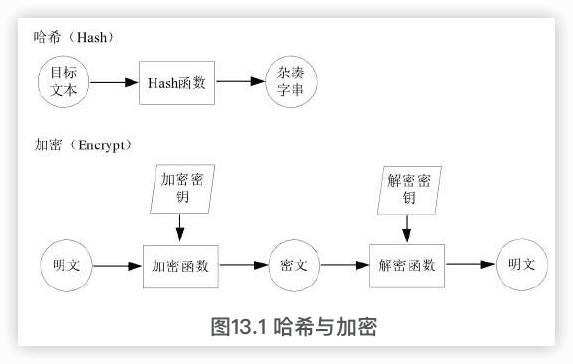

选择Hash或加密的基本åŸåˆ™ï¼š

- 如æœè¢«ä¿æŠ¤æ•°æ®ä»…仅用äºæ¯”较验è¯ï¼Œä»¥åä¸éœ€è¦è¿˜åŸæˆæ˜æ–‡å½¢å¼ï¼Œåˆ™ä½¿ç”¨Hash。
- 如æœè¢«ä¿æŠ¤æ•°æ®ä»¥å需è¦è¢«è¿˜åŸæˆæ˜æ–‡ï¼Œåˆ™ä½¿ç”¨åŠ å¯†ã€‚

对简å•Hash的攻击方法主è¦æœ‰ä¸¤ç§ï¼š

1. 寻找碰æ’法

ç›®å‰å¯¹äºMD5å’ŒSHA-1并ä¸å­˜åœ¨æœ‰æ•ˆçš„寻找碰æ’方法。我国æ°å‡ºçš„数学家ç‹å°äº‘æ•™æˆæ›¾ç»åœ¨å›½é™…密ç å­¦ä¼šè®®ä¸Šå‘布了针对MD5å’ŒSHA-1的寻找碰æ’改进算法，但这ç§æ–¹æ³•å’Œâ€œç ´è§£â€ç›¸å»ç”šè¿œã€‚该ç†è®ºç›®å‰ä»…具有数学上的æ„义，她将破解MD5的预期步骤é™ä½äº†å¥½å‡ ä¸ªæ•°é‡çº§ï¼Œä½†å¯¹äºå®é™…应用æ¥è¯´ä»ç„¶æ˜¯ä¸€ä¸ªå¤©æ–‡æ•°å­—。

2. 穷举法（或暴力破解法）

通俗地说，穷举法就是将一个范围内（如ä»000000到999999）的所有值一个一个用Hash算法映射，然å将结æœå’Œæ‚凑串比较，如æœç›¸åŒï¼Œåˆ™è¿™ä¸ªå€¼ä¸€å®šæ˜¯æºå­—串或æºå­—串的一个碰æ’，äºæ˜¯å°±å¯ä»¥ç”¨è¿™ä¸ªå€¼é法登录了。

穷举法看似笨拙，但目å‰å‡ ä¹æ‰€æœ‰çš„MD5破解机或MD5在线破解都是用这ç§ç©·ä¸¾æ³•ã€‚究其缘由，就是相当一部分å£ä»¤æ˜¯é常简å•çš„，如“123456â€æˆ–“000000â€ã€‚穷举法是å¦èƒ½æˆåŠŸå¾ˆå¤§ç¨‹åº¦ä¸Šå–决äºå£ä»¤çš„å¤æ‚性。因为穷举法扫æ的区间往往是å•å­—符集ã€è§„则的区间，或者由字典数æ®è¿›è¡Œç»„åˆï¼Œå› æ­¤ï¼Œå¦‚æœä½¿ç”¨å¤æ‚çš„å£ä»¤ï¼Œå¦‚“!@#$%^＆*()â€ï¼Œç©·ä¸¾æ³•å°±å¾ˆéš¾å¥æ•ˆäº†ã€‚


#### SHA-256

SHA-256算法输入报文的最大长度是2^64^ bit，产生的输出是一个256bit的报文摘è¦ã€‚步骤：

1. 附加填充比特

   对报文进行填充，使报文长度ä¸448模512åŒä½™ï¼ˆé•¿åº¦=448 mod 512），填充的比特数范围是1到512，填充比特串的最高ä½ä¸º1，其余ä½ä¸º0。就是先在报文åé¢åŠ ä¸€ä¸ª1，å†åŠ å¾ˆå¤šä¸ª0，直到长度满足mod 512=448。为什么是448？因为448+64=512。第二步会加上一个64bitçš„åŸå§‹æŠ¥æ–‡çš„长度信æ¯ã€‚

2. 附加长度值

   将用64bit表示的åˆå§‹æŠ¥æ–‡ï¼ˆå¡«å……å‰ï¼‰çš„ä½é•¿åº¦é™„加在步骤1的结æœå（ä½ä½å­—节优先）。

3. åˆå§‹åŒ–缓存

​	使用一个256bit的缓存æ¥å­˜æ”¾è¯¥Hash函数的中间åŠæœ€ç»ˆç»“æœã€‚该缓存表示为A=0x6A09E667，B=0xBB67AE85，C=0x3C6EF372，D=0xA54FF53A，E=0x510E527F，F=0x9B05688C，G=0x1F83D9AB，H=0x5BE0CD19。

4. 处ç†512bit（16个字）报文分组åºåˆ—

   该算法使用了6ç§åŸºæœ¬é€»è¾‘函数，由64步迭代è¿ç®—组æˆã€‚æ¯æ­¥éƒ½ä»¥256bit缓存值ABCDEFGH为输入，然å更新缓存内容。

æ¯æ­¥ä½¿ç”¨ä¸€ä¸ª32bit Kt（常数值）和一个32bit Wt（分组å的报文）。

#### 核心代ç 

🔖

### 52.3 对称加密算法

#### 对称加密简介

对称加密（也å«==ç§é’¥åŠ å¯†ç®—法==）指加密和解密使用相åŒå¯†é’¥çš„加密算法。它è¦æ±‚å‘é€æ–¹å’Œæ¥æ”¶æ–¹åœ¨å®‰å…¨é€šä¿¡ä¹‹å‰ï¼Œå•†å®šä¸€ä¸ªå¯†é’¥ã€‚对称算法的安全性ä¾èµ–äºå¯†é’¥ï¼Œæ³„露密钥就æ„味ç€ä»»ä½•äººéƒ½å¯ä»¥å¯¹ä»–们å‘é€æˆ–æ¥æ”¶çš„消æ¯è§£å¯†ï¼Œæ‰€ä»¥å¯†é’¥çš„ä¿å¯†æ€§å¯¹é€šä¿¡çš„安全性至关é‡è¦ã€‚

优点是**计算é‡å°ï¼ŒåŠ å¯†é€Ÿåº¦å¿«ï¼ŒåŠ å¯†æ•ˆç‡é«˜**。

ä¸è¶³æ˜¯å‚ä¸æ–¹éœ€è¦æå‰æŒæœ‰å¯†é’¥ï¼Œä¸€æ—¦æœ‰äººæ³„露则系统安全性被破åï¼›å¦å¤–，如何在ä¸å®‰å…¨é€šé“中æå‰åˆ†å‘密钥也是个问题，密钥管ç†é常困难。

基äºâ€œå¯¹ç§°å¯†é’¥â€çš„加密算法主è¦æœ‰**DESã€3DES（TripleDES）ã€AESã€RC2ã€RC4ã€RC5å’ŒBlowfish**等。


#### DES和3DES算法

æ•°æ®åŠ å¯†æ ‡å‡†ç®—法（Data Encryption Standard，DES）  1975 IBM

DES算法的入å£å‚数有3个：

- ==Key==是DES算法的工作密钥，8个字节共64ä½ã€‚
- ==Data==是è¦è¢«åŠ å¯†æˆ–被解密的数æ®ã€‚
- ==Mode==为DES的工作方å¼ï¼Œæœ‰ä¸¤ç§ï¼šåŠ å¯†æˆ–解密。

在没有密钥的情况下，解密耗费时间é常长，基本上认为没有å¯èƒ½ã€‚加密解密耗时和需è¦åŠ å¯†çš„文本大å°æˆæ­£æ¯”，这是**P问题**。知é“æ˜æ–‡å’Œå¯¹åº”的密文，求解所用的密钥，这是**NP问题**。

ç›®å‰è¿˜æ²¡æœ‰NP的求解算法，但是密钥很容易得到验è¯ã€‚想得到NP的解，åªèƒ½æš´åŠ›ç ´è§£ï¼ˆç©·ä¸¾ç ´è§£ï¼‰ï¼Œæ”»å‡»è€…使用自己的用户å和密ç å­—典，é€ä¸€å°è¯•ç™»å½•ã€‚穷举验è¯æ˜¯å¯¹ç§°åŠ å¯†ä»…有的求解方å¼ï¼Œæ±‚解时间呈指数级å¢é•¿ã€‚

DES算法把64ä½çš„æ˜æ–‡è¾“å…¥å—å˜ä¸ºæ•°æ®é•¿åº¦ä¸º64ä½çš„密文输出å—，其中8ä½ä¸ºå¥‡å¶æ ¡éªŒä½ï¼Œå¦å¤–56ä½ä½œä¸ºå¯†ç çš„长度。

首先，DES把输入的64ä½æ•°æ®å—按ä½é‡æ–°ç»„åˆï¼Œå¹¶æŠŠè¾“出分为L0ã€R0两部分，æ¯éƒ¨åˆ†å„é•¿32ä½ï¼Œå¹¶è¿›è¡Œå‰åç½®æ¢ï¼Œæœ€ç»ˆç”±L0输出左32ä½ï¼ŒR0输出å³32ä½ã€‚æ ¹æ®è¿™ä¸ªæ³•åˆ™ç»è¿‡16次迭代è¿ç®—å，得到L16ã€R16，将此作为输入，进行ä¸åˆå§‹ç½®æ¢ç›¸å的逆置æ¢ï¼Œå³å¾—到密文输出。DES算法具有æ高的安全性，到目å‰ä¸ºæ­¢ï¼Œé™¤äº†ç”¨ç©·ä¸¾æœç´¢æ³•å¯¹DES算法进行攻击外，还没有å‘ç°æ›´æœ‰æ•ˆçš„åŠæ³•ã€‚56ä½é•¿å¯†é’¥çš„穷举空间为256，这æ„味ç€å¦‚æœä¸€å°è®¡ç®—机的速度是æ¯ç§’检测100万个密钥，那么它æœç´¢å®Œå…¨éƒ¨å¯†é’¥å°±éœ€è¦å°†è¿‘2285年的时间，因此DES算法是一ç§å¾ˆå¯é çš„加密方法。3DES密钥是24字节，å³192ä½äºŒè¿›åˆ¶ã€‚

#### AES算法

高级加密标准算法（Advanced Encryption Standard，AES）  ç¾å›½å›½å®¶æ ‡å‡†ä¸æŠ€æœ¯ç ”究院（NIST）  2002

2006年，AES算法已然æˆä¸ºå¯¹ç§°å¯†é’¥åŠ å¯†ä¸­æœ€æµè¡Œçš„算法之一。

#### AES的加密模å¼

- ECB（Electronic Code Book，电å­å¯†ç æœ¬æ¨¡å¼ï¼‰ï¼šæœ€åŸºæœ¬çš„加密模å¼ï¼Œä¹Ÿå°±æ˜¯é€šå¸¸ç†è§£çš„加密。相åŒçš„æ˜æ–‡å°†æ°¸è¿œåŠ å¯†æˆç›¸åŒçš„密文，无åˆå§‹å‘é‡ï¼Œå®¹æ˜“å—到密ç æœ¬é‡æ”¾æ”»å‡»ï¼Œä¸€èˆ¬æƒ…况下很少用。
- CBC（Cipher Block Chaining，密ç åˆ†ç»„链æ¥æ¨¡å¼ï¼‰ï¼šæ˜æ–‡è¢«åŠ å¯†å‰è¦ä¸å‰é¢çš„密文进行异或è¿ç®—，因此åªè¦é€‰æ‹©ä¸åŒçš„åˆå§‹å‘é‡ï¼Œç›¸åŒçš„æ˜æ–‡åŠ å¯†å会形æˆä¸åŒçš„密文。这是目å‰åº”用最广泛的模å¼ã€‚CBC加密å的密文是上下文相关的，但æ˜æ–‡çš„错误ä¸ä¼šä¼ é€’到å续分组；但如æœä¸€ä¸ªåˆ†ç»„丢失，åé¢çš„分组将全部作废（åŒæ­¥é”™è¯¯ï¼‰ã€‚
- CFB（Cipher Feedback Mode，加密å馈模å¼ï¼‰ï¼šç±»ä¼¼äºè‡ªåŒæ­¥åºåˆ—密ç ï¼Œåˆ†ç»„加密å，按8ä½åˆ†ç»„将密文和æ˜æ–‡è¿›è¡Œç§»ä½å¼‚或å得到输出，åŒæ—¶å馈å›ç§»ä½å¯„存器。优点是最å°å¯ä»¥æŒ‰å­—节进行加解密，也å¯ä»¥æ˜¯nä½çš„。CFB也是上下文相关的，CFB模å¼ä¸‹ï¼Œæ˜æ–‡çš„一个错误会影å“åé¢çš„密文（错误扩散）。
- OFB（Output Feedback Mode，输出å馈模å¼ï¼‰ï¼šå°†åˆ†ç»„密ç ä½œä¸ºåŒæ­¥åºåˆ—密ç è¿è¡Œï¼Œå’ŒCFB相似。ä¸è¿‡OFB用å‰ä¸€ä¸ªnä½å¯†æ–‡è¾“出分组å馈å›ç§»ä½å¯„存器，没有错误扩散问题。

#### å¡«å……æ–¹å¼

行使DESã€3DESå’ŒAES三ç§å¯¹ç§°åŠ å¯†ç®—法时，常采用的是PKCS5å¡«å……ã€Zeros填充（0填充）。

1. PKCS5å¡«å……

æ¯ä¸ªå¡«å……的字节都记录了填充的总字节数。

“aâ€å¡«å……å结æœä¸ºï¼š[97 7 7 7 7 7 7 7]。

“abâ€å¡«å……å结æœä¸ºï¼š[97 98 6 6 6 6 6 6]。

“—aâ€å¡«å……å结æœä¸ºï¼š[228 184 128 97 4 4 4 4]。

2. Zeroså¡«å……

全部填充为0的字节。

“aâ€å¡«å……å结æœä¸ºï¼š[97 0 0 0 0 0 0 0]。

“abâ€å¡«å……å结æœä¸ºï¼š[97 98 0 0 0 0 0 0]。

“—aâ€å¡«å……å结æœä¸ºï¼š[228 184 128 97 0 0 0 0]。

#### 核心代ç 

🔖

### 52.3 é对称加密算法

#### é对称加密简介

é对称加密åˆå«ä½œ**公开密钥加密**（Public Key Cryptography）或==公钥加密==，指加密和解密使用ä¸åŒå¯†é’¥çš„加密算法。公钥加密需è¦ä¸¤ä¸ªå¯†é’¥ï¼Œä¸€ä¸ªæ˜¯å…¬å¼€å¯†é’¥ï¼Œå¦ä¸€ä¸ªæ˜¯ç§æœ‰å¯†é’¥ï¼›ä¸€ä¸ªç”¨äºåŠ å¯†ï¼Œå¦ä¸€ä¸ªç”¨äºè§£å¯†ã€‚

==RSA==是目å‰æœ€æœ‰å½±å“力的公钥加密算法，它能够抵抗到目å‰ä¸ºæ­¢å·²çŸ¥çš„所有密ç æ”»å‡»ï¼Œå·²è¢«ISOæ¨è为公钥数æ®åŠ å¯†æ ‡å‡†ã€‚

其他常è§çš„公钥加密算法有：**ElGamalã€èƒŒåŒ…算法ã€Rabin（RSA的特例）ã€æ¤­åœ†æ›²çº¿åŠ å¯†ç®—法（Elliptic Curve Cryptography，ECC）**。

缺点是加解密速度远远慢äºå¯¹ç§°åŠ å¯†ï¼Œåœ¨æŸäº›æ端情况下，需è¦çš„时间甚至是对称加密的1000å€ã€‚

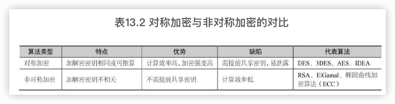

#### é对称加密算法å®ç°æ•°å­—ç­¾å

é对称加密ä¸åŒäºåŠ å¯†å’Œè§£å¯†éƒ½ä½¿ç”¨åŒä¸€ä¸ªå¯†é’¥çš„对称加密，虽然两个密钥在数学上相关，但如æœçŸ¥é“了其中一个，并ä¸èƒ½å‡­æ­¤è®¡ç®—出å¦å¤–一个。加密消æ¯çš„密钥是ä¸èƒ½è§£å¯†æ¶ˆæ¯çš„。因此两个密钥中，一个å¯ä»¥å…¬å¼€ï¼Œç§°ä¸º==公钥==ï¼›ä¸å…¬å¼€çš„密钥称为==ç§é’¥==，必须由用户自行严格秘密ä¿ç®¡ï¼Œç»ä¸é€šè¿‡ä»»ä½•é€”径å‘任何人æ供。

é对称加密算法分为两ç§ï¼š==公钥加密ã€ç§é’¥è§£å¯†==å’Œ==ç§é’¥åŠ å¯†ã€å…¬é’¥è§£å¯†==。å‰è€…是**普通的é对称算法**，而å者被称为==æ•°å­—ç­¾å==。

ç›®å‰ä¸»æµçš„æ•°å­—ç­¾å算法是椭圆曲线数字签å算法（ECDSA）。

总之，é对称加密算法中，公钥的作用是加密消æ¯å’ŒéªŒè¯ç­¾å，而ç§é’¥çš„作用是解密消æ¯å’Œè¿›è¡Œæ•°å­—ç­¾å。

#### RSA算法

RSA算法基äºä¸€ä¸ªå分简å•çš„数论事å®ï¼š**将两个大素数相乘å分容易，想è¦å¯¹å…¶ä¹˜ç§¯è¿›è¡Œå› å¼åˆ†è§£æ其困难**，因此å¯ä»¥å°†ä¹˜ç§¯å…¬å¼€ä½œä¸ºåŠ å¯†å¯†é’¥ã€‚

密钥对的生æˆæ­¥éª¤ï¼š

1. éšæœºé€‰æ‹©ä¸¤ä¸ªä¸ç›¸ç­‰çš„质数på’Œq（比特å¸ä¸­p长度为512ä½äºŒè¿›åˆ¶æ•°å€¼ï¼Œq长度为1024ä½ï¼‰ã€‚
2. 计算p和q的乘积N。
3. 计算p-1和q-1的乘积φ (N)。
4. éšæœºé€‰ä¸€ä¸ªæ•´æ•°e，eä¸mè¦äº’质，且0＜e＜φ (N)。
5. 计算e的模å元素d。
6. 公钥是（N,e），ç§é’¥æ˜¯ï¼ˆN,d）。

加解密步骤：

1. å‡è®¾ä¸€ä¸ªæ˜æ–‡m（0＜=m＜N）。
2. 对æ˜æ–‡m加密得到密文c
3. 对密文c解密得到æ˜æ–‡m

#### 核心代ç 

🔖

### 52.4 椭圆曲线加密算法和椭圆曲线数字签å算法

#### 椭圆曲线加密简介

椭圆曲线加密算法（Elliptic Curve Cryptography，==ECC==）是基äºæ¤­åœ†æ›²çº¿æ•°å­¦ç†è®ºå®ç°çš„一ç§é对称加密算法。

椭圆曲线算法åˆç»†åˆ†ä¸ºå¤šç§å…·ä½“的算法。Go语言内置的是**secp256R1算法**，而比特å¸ç³»ç»Ÿä¸­ä½¿ç”¨**secp256K1算法**。以太åŠç³»ç»Ÿè™½ç„¶ä¹Ÿé‡‡ç”¨secp256K1算法，但是跟比特å¸ç³»ç»Ÿçš„secp256K1算法上åˆæœ‰æ‰€å·®å¼‚。

椭圆曲线公钥系统是RSA的强有力ç«äº‰è€…，ä¸ç»å…¸çš„RSA公钥密ç ä½“制相比，椭圆密ç ä½“制有æ˜æ˜¾çš„优势。

1. 安全性能更高（ECCå¯ä»¥ä½¿ç”¨æ›´çŸ­çš„密钥）。åŒç­‰å®‰å…¨å¼ºåº¦ä¸‹ï¼Œä¸¤è€…密钥长度的对比：


2. 处ç†é€Ÿåº¦å¿«ï¼Œè®¡ç®—é‡å°ã€‚在ç§é’¥çš„处ç†é€Ÿåº¦ä¸Šï¼ˆè§£å¯†å’Œç­¾å），ECC远比RSA快得多。
3. 存储空间å°ã€‚ECC的密钥尺寸和系统å‚æ•°ä¸RSA相比è¦å°å¾—多，所以å ç”¨çš„存储空间å°å¾—多。
4. 带宽è¦æ±‚ä½ä½¿å¾—ECC具有广泛的应用å‰æ™¯ã€‚

ECC的这些特点使它必将å–代RSA，æˆä¸ºé€šç”¨çš„公钥加密算法。

#### æ•°å­—ç­¾å的概念

æ•°å­—ç­¾å（Digital Signature）åˆç§°å…¬å¼€å¯†é’¥æ•°å­—ç­¾åã€ç”µå­ç­¾ç« ï¼Œæ˜¯ä¸€ç§ç±»ä¼¼å†™åœ¨çº¸ä¸Šçš„普通的物ç†ç­¾å，但是使用了公钥加密领域的技术，用äºé‰´åˆ«æ•°å­—ä¿¡æ¯çš„方法。一套数字签å通常定义两ç§äº’补的è¿ç®—，一个用äº**ç­¾å**，å¦ä¸€ä¸ªç”¨äº**验è¯**。数字签åå¯ä»¥éªŒè¯æ•°æ®çš„æ¥æºï¼Œå¯ä»¥éªŒè¯æ•°æ®ä¼ è¾“过程中是å¦è¢«ä¿®æ”¹ã€‚

æ•°å­—ç­¾å是通过é对称加密算法中的ç§é’¥åŠ å¯†ã€å…¬é’¥è§£å¯†è¿‡ç¨‹æ¥å®ç°çš„。

ç§é’¥åŠ å¯†å°±æ˜¯ç§é’¥ç­¾å，公钥解密就是公钥验è¯ç­¾å。因此数字签å由两部分组æˆï¼š

- 第一部分是使用ç§é’¥ä¸ºæ¶ˆæ¯åˆ›å»ºç­¾å的算法，
- 第二部分是å…许任何人用公钥æ¥éªŒè¯ç­¾å的算法。

æ•°å­—ç­¾å的使用æµç¨‹å¦‚图：


æ•°å­—ç­¾å应该满足如下è¦æ±‚。

- ç­¾åä¸å¯ä¼ªé€ ã€‚
- ç­¾åä¸å¯æŠµèµ–。
- ç­¾å的识别和应用相对容易，任何人都å¯ä»¥éªŒè¯ç­¾å的有效性。
- ç­¾åä¸å¯å¤åˆ¶ï¼Œç­¾åä¸åŸæ–‡æ˜¯ä¸å¯åˆ†å‰²çš„整体。
- ç­¾å消æ¯ä¸å¯ç¯¡æ”¹ï¼Œä»»æ„比特数æ®è¢«ç¯¡æ”¹ï¼Œå…¶ç­¾å便éšä¹‹æ”¹å˜ï¼Œä»»ä½•äººéƒ½å¯ä»¥ç»éªŒè¯è€Œæ‹’ç»æ¥å—此签å。

#### 核心代ç ğŸ”–


### 52.5 字符编ç ä¸è§£ç 

#### Base64

Base64是一ç§åŸºäº64个å¯æ‰“å°å­—符æ¥è¡¨ç¤ºäºŒè¿›åˆ¶æ•°æ®çš„ç¼–ç æ–¹å¼ã€‚Base64使用了**26个å°å†™å­—æ¯ã€26个大写字æ¯ã€10个数字以åŠ2个符å·ï¼ˆå¦‚“+â€å’Œâ€œ/â€ï¼‰**，用äºåœ¨ç”µå­é‚®ä»¶è¿™æ ·çš„基äºæ–‡æœ¬çš„媒介中传输二进制数æ®ã€‚Base64通常用äºç¼–ç é‚®ä»¶ä¸­çš„附件。

Base64çš„ç¼–ç è¿‡ç¨‹:

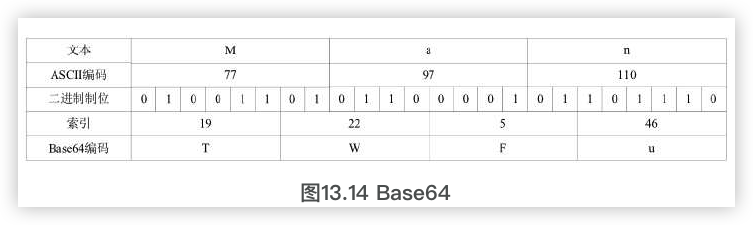

步骤:

- å°†æ¯ä¸ªå­—符转æˆASCIIç¼–ç ï¼ˆå进制）。
- å°†å进制编ç è½¬æˆäºŒè¿›åˆ¶ç¼–ç ã€‚
- 将二进制编ç æŒ‰ç…§6ä½ä¸€ç»„进行平分。
- å°†6ä½ä¸€ç»„的二进制数高ä½è¡¥é›¶ï¼Œç„¶å转æˆå进制数。
- 以å进制数作为索引，ä»Base64ç¼–ç è¡¨ä¸­æŸ¥æ‰¾å­—符。
- æ¯3个字符的文本将编ç ä¸º4个字符长度（3×8=4×6）。若文本为3个字符，则正好编ç ä¸º4个字符长度；若文本为2个字符，则编ç ä¸º3个字符，由äºä¸è¶³4个字符，则在尾部用一个“=â€è¡¥é½ï¼›è‹¥æ–‡æœ¬ä¸º1个字符，则编ç ä¸º2个字符，由äºä¸è¶³4个字符，则在尾部用两个“=â€è¡¥é½ã€‚如图13.15所示。

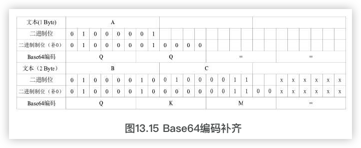

🔖

#### Base58

Base58是一ç§åŸºäºæ–‡æœ¬çš„二进制编ç æ–¹å¼ã€‚è¿™ç§ç¼–ç æ–¹å¼ä¸ä»…å®ç°äº†æ•°æ®å‹ç¼©ï¼Œä¿æŒäº†æ˜“读性，还具有错误诊断功能。

==Base58是Base64çš„å­é›†==，åŒæ ·ä½¿ç”¨å¤§å°å†™å­—æ¯å’Œ10个数字，但èˆå¼ƒäº†ä¸€äº›å®¹æ˜“错读和在特定字体中容易混淆的字符。

Base58ä¸å«Base64中的**0（数字0）ã€O（大写字æ¯O）ã€l（å°å†™å­—æ¯l）ã€I（大写字æ¯I），以åŠâ€œ+â€å’Œâ€œ/â€ä¸¤ä¸ªå­—符**，目的就是å»é™¤å®¹æ˜“混淆的字符。简而言之，Base58ç”±ä¸åŒ…括“0â€â€œOâ€â€œlâ€â€œIâ€çš„大å°å†™å­—æ¯å’Œæ•°å­—组æˆã€‚

base58ç¼–ç çš„整体步骤就是ä¸æ–­å°†æ•°å€¼å¯¹58å–模，如æœå•†å¤§äº58，则对商继续å–模。以字符串“aâ€ä¸ºä¾‹ã€‚在ASCIIç ä¸­ï¼Œâ€œaâ€å¯¹åº”çš„å进制数为97，具体步骤如下。

- 97对58å–模，余数为39，商为1。
- base58字符集中，索引下标39为g。
- base58字符集中，索引下标1为2。
- 得到结æœä¸ºï¼šg2。
- ååºåˆ—化å为：2g。

以字符串“abâ€ä¸ºä¾‹ã€‚“abâ€è½¬å六进制为6162，å†è½¬å进制为24930，具体步骤如下。

- 24930对58å–模，余数为48，商为429。
- base58字符集中，索引下标48为q。
- 429对58å–模，余数为23，商为7。
- base58字符集中，索引下标23为Q。
- base58字符集中，索引下标7为8。
- 得到结æœä¸ºï¼šqQ8。
- ååºåˆ—化å为：8Qq。

🔖

# 测试ã€æ€§èƒ½å‰–æä¸è°ƒè¯•

å‚考：《Go语言精进之路2》

## 53 ç†è§£åŒ…内测试ä¸åŒ…外测试的差别

测试代ç ä¸åŒ…代ç æ”¾åœ¨åŒä¸€ä¸ªåŒ…目录下，并且Goè¦æ±‚所有测试代ç éƒ½å­˜æ”¾åœ¨ä»¥`*_test.go`结尾的文件中。这使Goå¼€å‘人员一眼就能分辨出哪些文件存放的是==包代ç ==，哪些文件存放的是针对该包的==测试代ç ==。

`go test`将所有包目录下的`*_test.go`文件编译æˆä¸€ä¸ªä¸´æ—¶äºŒè¿›åˆ¶æ–‡ä»¶ï¼ˆå¯ä»¥é€šè¿‡`go test -c`显å¼ç¼–译出该文件），并执行该文件，å者将执行å„个测试æºæ–‡ä»¶ä¸­åå­—æ ¼å¼ä¸º`TestXxx`的函数所代表的测试用例并输出测试执行结æœã€‚

### 官方文档的“自相矛盾â€

GoåŸç”Ÿæ”¯æŒæµ‹è¯•çš„两大è¦ç´ â€”—go test命令和testing包。

testing包的一段官方文档（Go 1.14版本）摘录：

> è¦ç¼–写一个新的测试集（test suite），创建一个包å«`TestXxx`函数的以_test.go为文件å结尾的文件。将这个测试文件放在ä¸è¢«æµ‹è¯•åŒ…相åŒçš„包下é¢ã€‚编译被测试包时，该文件将被æ’除在外；执行go test时，该文件将被包å«åœ¨å†…。

go test命令官方文档：

> 那些包å中带有_testå缀的测试文件将被编译æˆä¸€ä¸ªç‹¬ç«‹çš„包，这个包之å会被链æ¥åˆ°ä¸»æµ‹è¯•äºŒè¿›åˆ¶æ–‡ä»¶ä¸­å¹¶è¿è¡Œã€‚


“自相矛盾â€çš„地方：testing包文档告诉我们将测试代ç æ”¾å…¥ä¸è¢«æµ‹è¯•åŒ…åŒå的包中，而go test命令行帮助文档则æ到会将包å中带有_testå缀的测试文件编译æˆä¸€ä¸ªç‹¬ç«‹çš„包。

例å­æ¥ç›´è§‚说æ˜ä¸€ä¸‹è¿™ä¸ªâ€œçŸ›ç›¾â€ï¼š

> 如æœæˆ‘们è¦æµ‹è¯•çš„包为foo，testing包的帮助文档告诉我们把对foo包的测试代ç **放在包å为foo的测试文件**中；
>
> 而go test命令行帮助文档则告诉我们把foo包的测试代ç **放在包å为foo_test的测试文件**中。

将测试代ç æ”¾åœ¨ä¸è¢«æµ‹åŒ…åŒå的包中的测试方法称为“==包内测试==â€ï¼š

```sh
$ go list -f={{.TestGoFiles}} . 
```

将测试代ç æ”¾åœ¨å为被测包包å+"_test"的包中的测试方法称为“==包外测试==â€:

```sh
$ go list -f={{.XTestGoFiles}} .
```

```sh
$ cd cd /usr/local/go/src/sync
$ go list -f={{.TestGoFiles}} . 
[export_test.go]
$ go list -f={{.XTestGoFiles}} .
[cond_test.go example_pool_test.go example_test.go map_bench_test.go map_reference_test.go map_test.go mutex_test.go once_test.go oncefunc_test.go pool_test.go runtime_sema_test.go rwmutex_test.go waitgroup_test.go]
```


### 包内测试ä¸åŒ…外测试

#### Go标准库中包内测试和包外测试的使用情况

```sh
// 统计标准库中采用包内测试的测试文件数é‡
$ find /usr/local/go/src  -name "*_test.go" | xargs grep package | grep ':package' | grep -v "_test$" | wc -l
    1019


// 统计标准库中采用包外测试的测试文件数é‡
$ find /usr/local/go/src  -name "*_test.go" | xargs grep package | grep ':package' | grep  "_test$" | wc -l 
     658
```


#### 包内测试的优势ä¸ä¸è¶³

ç”±äºGoæ„建工具链在编译包时会自动根æ®æ–‡ä»¶å是å¦å…·æœ‰_test.goå缀将包æºæ–‡ä»¶å’ŒåŒ…的测试æºæ–‡ä»¶åˆ†å¼€ï¼Œæµ‹è¯•ä»£ç ä¸ä¼šè¿›å…¥åŒ…正常æ„建的范畴，因此测试代ç ä½¿ç”¨ä¸è¢«æµ‹åŒ…å相åŒçš„包内测试方法是一个很自然的选择。

包内测试这ç§æ–¹æ³•æœ¬è´¨ä¸Šæ˜¯ä¸€ç§==白盒测试==方法。由äºæµ‹è¯•ä»£ç ä¸è¢«æµ‹åŒ…æºç åœ¨åŒä¸€åŒ…å下，测试代ç å¯ä»¥è®¿é—®è¯¥åŒ…下的所有符å·ï¼Œæ— è®ºæ˜¯å¯¼å‡ºç¬¦å·è¿˜æ˜¯æœªå¯¼å‡ºç¬¦å·ï¼›å¹¶ä¸”ç”±äºåŒ…的内部å®ç°é€»è¾‘对测试代ç æ˜¯é€æ˜çš„，包内测试**å¯ä»¥æ›´ä¸ºç›´æ¥åœ°æ„造测试数æ®å’Œå®æ–½æµ‹è¯•é€»è¾‘**，å¯ä»¥å¾ˆå®¹æ˜“地达到较高的测试覆盖ç‡ã€‚因此对äºè¿½æ±‚高测试覆盖ç‡çš„项目而言，包内测试是ä¸äºŒä¹‹é€‰ã€‚

🔖


## 54 有层次地组织测试代ç 

### 54.1 ç»å…¸æ¨¡å¼â€”—平铺

go test并没有对测试代ç çš„组织æ出任何约æŸæ¡ä»¶ã€‚

以标准库strings包为例：

```sh
cd /usr/local/go/src/strings
go test -v .
=== RUN   TestBuilder
--- PASS: TestBuilder (0.00s)
=== RUN   TestBuilderString
--- PASS: TestBuilderString (0.00s)
=== RUN   TestBuilderReset
--- PASS: TestBuilderReset (0.00s)
=== RUN   TestBuilderGrow
--- PASS: TestBuilderGrow (0.00s)
=== RUN   TestBuilderWrite2
=== RUN   TestBuilderWrite2/Write
=== RUN   TestBuilderWrite2/WriteRune
=== RUN   TestBuilderWrite2/WriteRuneWide
=== RUN   TestBuilderWrite2/WriteString
--- PASS: TestBuilderWrite2 (0.00s)
    --- PASS: TestBuilderWrite2/Write (0.00s)
    --- PASS: TestBuilderWrite2/WriteRune (0.00s)
    --- PASS: TestBuilderWrite2/WriteRuneWide (0.00s)
    --- PASS: TestBuilderWrite2/WriteString (0.00s)
=== RUN   TestBuilderWriteByte
--- PASS: TestBuilderWriteByte (0.00s)
=== RUN   TestBuilderAllocs
--- PASS: TestBuilderAllocs (0.00s)
=== RUN   TestBuilderCopyPanic
--- PASS: TestBuilderCopyPanic (0.00s)
=== RUN   TestBuilderWriteInvalidRune
--- PASS: TestBuilderWriteInvalidRune (0.00s)
=== RUN   TestClone
--- PASS: TestClone (0.00s)

...
=== RUN   ExampleTrim
--- PASS: ExampleTrim (0.00s)
=== RUN   ExampleTrimSpace
--- PASS: ExampleTrimSpace (0.00s)
=== RUN   ExampleTrimPrefix
--- PASS: ExampleTrimPrefix (0.00s)
=== RUN   ExampleTrimSuffix
--- PASS: ExampleTrimSuffix (0.00s)
=== RUN   ExampleTrimFunc
--- PASS: ExampleTrimFunc (0.00s)
=== RUN   ExampleTrimLeft
--- PASS: ExampleTrimLeft (0.00s)
=== RUN   ExampleTrimLeftFunc
--- PASS: ExampleTrimLeftFunc (0.00s)
=== RUN   ExampleTrimRight
--- PASS: ExampleTrimRight (0.00s)
=== RUN   ExampleTrimRightFunc
--- PASS: ExampleTrimRightFunc (0.00s)
=== RUN   ExampleToValidUTF8
--- PASS: ExampleToValidUTF8 (0.00s)
PASS
ok      strings 1.100s

```

以strings包的Compare函数为例，ä¸ä¹‹å¯¹åº”的测试函数有三个：TestCompareã€TestCompareIdenticalStringå’ŒTestCompareStrings。这些测试函数å„自独立，测试函数之间没有层级关系，**所有测试平铺在顶层**。测试函数å称**既用æ¥åŒºåˆ†æµ‹è¯•ï¼Œåˆç”¨æ¥å…³è”测试**。

我们通过测试函数åçš„å‰ç¼€æ‰ä¼šçŸ¥é“，TestCompareã€TestCompareIdenticalStringå’ŒTestCompareStrings三个函数是针对strings包Compare函数的测试。

选项-runæ供正则表达å¼æ¥åŒ¹é…并选择执行哪些测试函数。

```sh
$ go test -run=TestCompare -v .
=== RUN   TestCompare
--- PASS: TestCompare (0.00s)
=== RUN   TestCompareIdenticalString
--- PASS: TestCompareIdenticalString (0.00s)
=== RUN   TestCompareStrings
--- PASS: TestCompareStrings (0.00s)
PASS
ok    strings     0.088s
```


平铺模å¼çš„测试代ç ç»„织方å¼çš„优点是显而易è§çš„。

- 简å•ï¼šæ²¡æœ‰é¢å¤–的抽象，上手容易。
- 独立：æ¯ä¸ªæµ‹è¯•å‡½æ•°éƒ½æ˜¯ç‹¬ç«‹çš„，互ä¸å…³è”，é¿å…相互干扰。

### 54.2 xUnit家æ—模å¼

在Javaã€Pythonã€C#等主æµç¼–程语言中，测试代ç çš„组织形å¼æ·±å—ç”±æé™ç¼–程倡导者Kent Beckå’ŒErich Gamma建立的xUnit家æ—测试框æ¶ï¼ˆå¦‚JUnitã€PyUnit等）的影å“。


è¿™ç§æµ‹è¯•ä»£ç ç»„织形å¼ä¸»è¦æœ‰==测试套件（Test Suite）==å’Œ==测试用例（Test Case）==两个层级。

一个**测试工程（Test Project）**由若干个测试套件组æˆï¼Œè€Œæ¯ä¸ªæµ‹è¯•å¥—件åˆåŒ…å«å¤šä¸ªæµ‹è¯•ç”¨ä¾‹ã€‚

Go 1.7中加入的对subtest的支æŒè®©æˆ‘们在Go中也å¯ä»¥ä½¿ç”¨ä¸Šé¢è¿™ç§æ–¹å¼ç»„织Go测试代ç ã€‚之å‰ç‰ˆæœ¬ä¸å¯ä»¥ã€‚对标准库strings包的部分测试代ç ç»„织形å¼æ”¹é€ ä¸€ä¸‹ï¼š

```go
// ch54/compare_test.go

package strings_test

...

func testCompare(t *testing.T) {
	...
}

func testCompareIdenticalString(t *testing.T) {
	...
}

func testCompareStrings(t *testing.T) {
	...
}

func TestCompare(t *testing.T) {
	t.Run("Compare", testCompare)
	t.Run("CompareString", testCompareStrings)
	t.Run("CompareIdenticalString", testCompareIdenticalString)
}

// ch54/builder_test.go

package strings_test

...

func check(t *testing.T, b *strings.Builder, want string) {
	...
}

func testBuilder(t *testing.T) {
	...
}

func testBuilderString(t *testing.T) {
	...
}

func testBuilderReset(t *testing.T) {
	...
}

func testBuilderGrow(t *testing.T) {
	...
}

func TestBuilder(t *testing.T) {
	t.Run("TestBuilder", testBuilder)
	t.Run("TestBuilderString", testBuilderString)
	t.Run("TestBuilderReset", testBuilderReset)
	t.Run("TestBuilderGrow", testBuilderGrow)
}

```

改造å‰å测试代ç çš„组织结æ„对比:


改造åçš„å字形如TestXxx的测试函数对应ç€æµ‹è¯•å¥—件，一般针对被测包的一个导出函数或方法的所有测试都放入一个测试套件中。平铺模å¼ä¸‹çš„测试函数TestXxx都改å为testXxx，并作为测试套件对应的测试函数内部的å­æµ‹è¯•ï¼ˆsubtest）。

åŸå…ˆçš„TestBuilderStringå˜ä¸ºäº†testBuilderString。这样的一个å­æµ‹è¯•ç­‰ä»·äºä¸€ä¸ªæµ‹è¯•ç”¨ä¾‹ã€‚

通过对比，仅通过查看测试套件内的å­æµ‹è¯•ï¼ˆæµ‹è¯•ç”¨ä¾‹ï¼‰å³å¯å…¨é¢äº†è§£åˆ°ç©¶ç«Ÿå¯¹è¢«æµ‹å‡½æ•°/方法进行了哪些测试。仅仅å¢åŠ äº†ä¸€ä¸ªå±‚次，测试代ç çš„组织就更加清晰了。


### 54.3 测试固件

==测试固件（test fixture）==是指一个人造的ã€ç¡®å®šæ€§çš„ç¯å¢ƒï¼Œä¸€ä¸ªæµ‹è¯•ç”¨ä¾‹æˆ–一个测试套件（下的一组测试用例）在这个ç¯å¢ƒä¸­è¿›è¡Œæµ‹è¯•ï¼Œå…¶æµ‹è¯•ç»“æœæ˜¯å¯é‡å¤çš„（多次测试è¿è¡Œçš„结æœæ˜¯ç›¸åŒçš„）。

一般使用`setUp`å’Œ`tearDown`æ¥ä»£è¡¨æµ‹è¯•å›ºä»¶çš„**创建/设置ä¸æ‹†é™¤/销æ¯**的动作。

使用测试固件的常è§åœºæ™¯ï¼š

- 将一组已知的特定数æ®åŠ è½½åˆ°æ•°æ®åº“中，测试结æŸå清除这些数æ®ï¼›
- å¤åˆ¶ä¸€ç»„特定的已知文件，测试结æŸå清除这些文件；
- 创建伪对象（fake object）或模拟对象（mock object），并为这些对象设定测试时所需的特定数æ®å’ŒæœŸæœ›ç»“æœã€‚


```go
func setUp(testName string) func() {
	fmt.Printf("\tsetUp fixture for %s\n", testName)
	return func() {
		fmt.Printf("\ttearDown fixture for %s\n", testName)
	}
}

func TestFunc1(t *testing.T) {
	defer setUp(t.Name())()
	fmt.Printf("\tExecute test: %s\n", t.Name())
}

func TestFunc2(t *testing.T) {
	defer setUp(t.Name())()
	fmt.Printf("\tExecute test: %s\n", t.Name())
}

func TestFunc3(t *testing.T) {
	defer setUp(t.Name())()
	fmt.Printf("\tExecute test: %s\n", t.Name())
}
```

```sh
$ go test -v classic_testfixture_test.go 
=== RUN   TestFunc1
        setUp fixture for TestFunc1
        Execute test: TestFunc1
        tearDown fixture for TestFunc1
--- PASS: TestFunc1 (0.00s)
=== RUN   TestFunc2
        setUp fixture for TestFunc2
        Execute test: TestFunc2
        tearDown fixture for TestFunc2
--- PASS: TestFunc2 (0.00s)
=== RUN   TestFunc3
        setUp fixture for TestFunc3
        Execute test: TestFunc3
        tearDown fixture for TestFunc3
--- PASS: TestFunc3 (0.00s)
PASS
ok      command-line-arguments  0.438s
```

上é¢çš„示例**在è¿è¡Œæ¯ä¸ªæµ‹è¯•å‡½æ•°TestXxx时，都会先通过setUp函数建立测试固件，并在defer函数中注册测试固件的销æ¯å‡½æ•°ï¼Œä»¥ä¿è¯åœ¨æ¯ä¸ªTestXxx执行完毕时为之建立的测试固件会被销æ¯ï¼Œä½¿å¾—å„个测试函数之间的测试执行互ä¸å¹²æ‰°ã€‚**

在Go 1.14版本以å‰ï¼Œæµ‹è¯•å›ºä»¶çš„setUpä¸tearDown一般å®ç°æ ¼å¼ï¼š

```go
func setUp() func() {
	...
	return func() {
	}
}

func TestXxx(t *testing.T) {
	defer setUp()()
	...
}
```

在setUp中返å›åŒ¿å函数æ¥å®ç°tearDown的好处是，å¯ä»¥åœ¨setUp中利用闭包特性在两个函数间共享一些å˜é‡ï¼Œé¿å…了包级å˜é‡çš„使用。

Go 1.14版本testing包å¢åŠ äº†testing.Cleanup方法，为测试固件的销æ¯æ供了包级åŸç”Ÿçš„支æŒï¼š

```go
func setUp() func() {
	...
	return func() {
	}
}

func TestXxx(t *testing.T) {
  t.Cleanup(setUp())
	...
}
```

有些时候，我们需è¦å°†æ‰€æœ‰æµ‹è¯•å‡½æ•°æ”¾å…¥ä¸€ä¸ªæ›´å¤§èŒƒå›´çš„测试固件ç¯å¢ƒä¸­æ‰§è¡Œï¼Œè¿™å°±æ˜¯==包级别测试固件==。在Go 1.4版本以å‰ï¼Œæˆ‘们仅能在init函数中创建测试固件，而无法销æ¯åŒ…级别测试固件。Go 1.4版本引入了TestMain，使得包级别测试固件的创建和销æ¯ç»ˆäºæœ‰äº†æ­£å¼çš„施展èˆå°ã€‚示例：

```go
// 包级别测试固件

// Go 1.14版本testing包å¢åŠ äº†testing.Cleanup方法，为测试固件的销æ¯æ供了包级åŸç”Ÿçš„支æŒ
// Go 1.4版本引入了TestMain，使得包级别测试固件的创建和销æ¯ç»ˆäºæœ‰äº†æ­£å¼çš„施展èˆå°ã€‚

func setUp(testName string) func() {
	fmt.Printf("\tsetUp fixture for %s\n", testName)
	return func() {
		fmt.Printf("\ttearDown fixture for %s\n", testName)
	}
}

func TestFunc1(t *testing.T) {
	t.Cleanup(setUp(t.Name()))
	fmt.Printf("\tExecute test: %s\n", t.Name())
}

func TestFunc2(t *testing.T) {
	t.Cleanup(setUp(t.Name()))
	fmt.Printf("\tExecute test: %s\n", t.Name())
}

func TestFunc3(t *testing.T) {
	t.Cleanup(setUp(t.Name()))
	fmt.Printf("\tExecute test: %s\n", t.Name())
}

func pkgSetUp(pkgName string) func() {
	fmt.Printf("package SetUp fixture for %s\n", pkgName)
	return func() {
		fmt.Printf("package TearDown fixture for %s\n", pkgName)
	}
}

func TestMain(m *testing.M) {
	defer pkgSetUp("package demo_test")()
	m.Run()
}
```

```sh
$ go test -v classic_package_level_testfixture_test.go 
package SetUp fixture for package demo_test
=== RUN   TestFunc1
        setUp fixture for TestFunc1
        Execute test: TestFunc1
        tearDown fixture for TestFunc1
--- PASS: TestFunc1 (0.00s)
=== RUN   TestFunc2
        setUp fixture for TestFunc2
        Execute test: TestFunc2
        tearDown fixture for TestFunc2
--- PASS: TestFunc2 (0.00s)
=== RUN   TestFunc3
        setUp fixture for TestFunc3
        Execute test: TestFunc3
        tearDown fixture for TestFunc3
--- PASS: TestFunc3 (0.00s)
PASS
package TearDown fixture for package demo_test
ok      command-line-arguments  0.470s

```

结æœæ˜¾ç¤ºï¼Œ**在所有测试函数è¿è¡Œä¹‹å‰ï¼ŒåŒ…级别测试固件被创建；在所有测试函数è¿è¡Œå®Œæ¯•å，包级别测试固件被销æ¯**。

用图æ¥æ€»ç»“（带测试固件的）平铺模å¼ä¸‹çš„测试执行æµã€‚

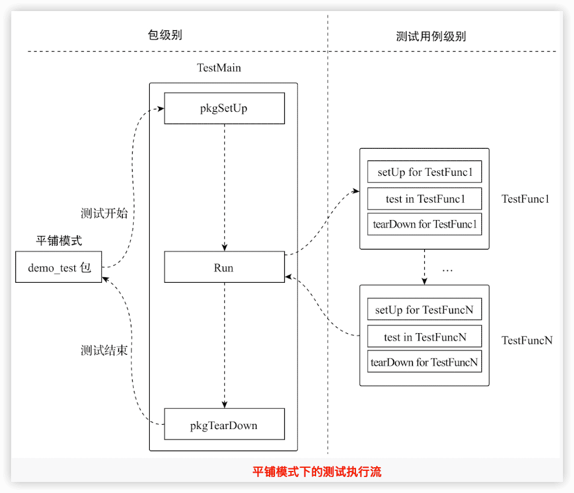


有些时候，一些测试函数所需的测试固件是相åŒçš„，在平铺模å¼ä¸‹ä¸ºæ¯ä¸ªæµ‹è¯•å‡½æ•°éƒ½å•ç‹¬åˆ›å»º/销æ¯ä¸€æ¬¡æµ‹è¯•å›ºä»¶å°±æ˜¾å¾—有些é‡å¤å’Œå†—余。在这样的情况下，我们å¯ä»¥å°è¯•é‡‡ç”¨æµ‹è¯•å¥—件æ¥å‡å°‘测试固件的é‡å¤åˆ›å»ºã€‚

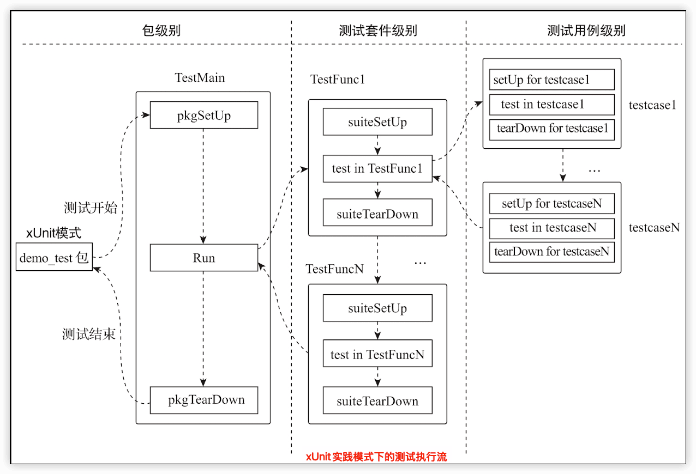

## 55 优先编写表驱动的测试

å‰ä¸¤ç« ä¸­ï¼Œæ˜ç¡®äº†**测试代ç æ”¾ç½®çš„ä½ç½®ï¼ˆåŒ…内测试或包外测试）以åŠå¦‚何根æ®å®é™…情况更有层次地组织测试代ç **。

这章将èšç„¦äº**测试函数的内部代ç è¯¥å¦‚何编写**。

### 55.1 Go测试代ç çš„一般逻辑

Go的测试函数就是一个普通的Go函数，Go仅对测试函数的**函数å和函数åŸå‹**有特定è¦æ±‚，对在测试函数`TestXxx`或其å­æµ‹è¯•å‡½æ•°ï¼ˆsubtest）中如何编写测试逻辑并没有显å¼çš„约æŸã€‚

对测试失败ä¸å¦çš„判断在äºæµ‹è¯•ä»£ç é€»è¾‘是å¦è¿›å…¥äº†åŒ…å«`Error/Errorf`ã€`Fatal/Fatalf`等方法调用的代ç åˆ†æ”¯ã€‚一旦进入这些分支，å³ä»£è¡¨è¯¥æµ‹è¯•å¤±è´¥ã€‚ä¸åŒçš„是Error/Errorf并ä¸ä¼šç«‹åˆ»ç»ˆæ­¢å½“å‰goroutine的执行，还会继续执行该goroutineå续的测试，而Fatal/Fatalf则会立刻åœæ­¢å½“å‰goroutine的测试执行。

```go
func TestCompare(t *testing.T) {
	var a, b string
	var i int

	a, b = "", ""
	i = 0
	cmp := strings.Compare(a, b)
	if cmp != i {
		t.Errorf("want %v, but Compare(%q, %q) = %v", i, a, b, cmp)
	}

	a, b = "a", ""
	i = 1
	cmp = strings.Compare(a, b)
	if cmp != i {
		t.Errorf("want %v, but Compare(%q, %q) = %v", i, a, b, cmp)
	}

	a, b = "", "a"
	i = -1
	cmp = strings.Compare(a, b)
	if cmp != i {
		t.Errorf("want %v, but Compare(%q, %q) = %v", i, a, b, cmp)
	}
}
```

Go测试代ç çš„一般逻辑是==针对给定的输入数æ®ï¼Œæ¯”较被测函数/方法返å›çš„å®é™…结æœå€¼ä¸é¢„期值，如有差异，则通过testing包æ供的相关函数输出差异信æ¯ã€‚==

### 55.2 表驱动的测试å®è·µ

```go
func TestCompare2(t *testing.T) {
	compareTests := []struct {
		a, b string
		i    int
	}{
		{"", "", 0},
		{"a", "", 1},
		{"", "a", -1},
	}
	for _, tt := range compareTests {
		cmp := strings.Compare(tt.a, tt.b)
		if cmp != tt.i {
			t.Errorf("want %v, but Compare(%q, %q) = %v", tt.i, tt.a, tt.b, cmp)
		}
	}
}

```

改进，将预置的输入数æ®æ”¾å…¥ä¸€ä¸ªè‡ªå®šä¹‰ç»“æ„体类å‹çš„切片中。

无须改动åé¢çš„测试逻辑，åªéœ€åœ¨åˆ‡ç‰‡ä¸­å¢åŠ æ•°æ®æ¡ç›®å³å¯ã€‚在这ç§æµ‹è¯•è®¾è®¡ä¸­ï¼Œè¿™ä¸ªè‡ªå®šä¹‰ç»“æ„体类å‹çš„切片（上述示例中的compareTests）就是一个表（自定义结æ„体类å‹çš„字段就是列），而基äºè¿™ä¸ªæ•°æ®è¡¨çš„测试设计和å®ç°åˆ™è¢«ç§°ä¸ºâ€œ**表驱动的测试**â€ã€‚

### 55.3 表驱动测试的优点

表驱动测试本身是编程语言无关的。Go核心团队和Go早期开å‘者在å®è·µè¿‡ç¨‹ä¸­å‘ç°è¡¨é©±åŠ¨æµ‹è¯•å分适åˆGo代ç æµ‹è¯•å¹¶åœ¨æ ‡å‡†åº“和第三方项目中大é‡ä½¿ç”¨æ­¤ç§æµ‹è¯•è®¾è®¡ï¼Œè¿™æ ·è¡¨é©±åŠ¨æµ‹è¯•ä¹Ÿå°±é€æ¸æˆä¸ºGo的一个惯用法。

优点：

- 简å•å’Œç´§å‡‘

- æ•°æ®å³æµ‹è¯•

  表驱动测试的å®è´¨æ˜¯æ•°æ®é©±åŠ¨çš„测试，扩展输入数æ®é›†å³æ‰©å±•æµ‹è¯•ã€‚通过扩展数æ®é›†ï¼Œæˆ‘们å¯ä»¥å¾ˆå®¹æ˜“地å®ç°æ高被测目标测试覆盖ç‡çš„目的。

- 结åˆ**å­æµ‹è¯•**å，å¯å•ç‹¬è¿è¡ŒæŸä¸ªæ•°æ®é¡¹çš„测试

```go
// 表驱动测试ä¸å­æµ‹è¯•ï¼ˆsubtest）结åˆ

func TestCompare4(t *testing.T) {
	compareTests := []struct {
		name, a, b string
		i          int
	}{
		{`compareTwoEmptyString`, "", "", 0},
		{`compareSecondParamIsEmpty`, "a", "", 1},
		{`compareFirstParamIsEmpty`, "", "a", -1},
	}

	for _, tt := range compareTests {
		t.Run(tt.name, func(t *testing.T) {
			cmp := strings.Compare(tt.a, tt.b)
			if cmp != tt.i {
				t.Errorf(`want %v, but Compare(%q, %q) = %v`, tt.i, tt.a, tt.b, cmp)
			}
		})
	}
}
```

测试结æœçš„判定逻辑放入一个å•ç‹¬çš„å­æµ‹è¯•ä¸­ï¼Œè¿™æ ·å¯ä»¥å•ç‹¬æ‰§è¡Œè¡¨ä¸­æŸé¡¹æ•°æ®çš„测试。比如：å•ç‹¬æ‰§è¡Œè¡¨ä¸­ç¬¬ä¸€ä¸ªæ•°æ®é¡¹å¯¹åº”的测试：

```sh
$ go test -v -run /TwoEmptyString table_driven_strings_with_subtest_test.go 
=== RUN   TestCompare4
=== RUN   TestCompare4/compareTwoEmptyString
--- PASS: TestCompare4 (0.00s)
    --- PASS: TestCompare4/compareTwoEmptyString (0.00s)
PASS
ok      command-line-arguments  0.278s

```


综上，**建议在编写Go测试代ç æ—¶ä¼˜å…ˆç¼–写基äºè¡¨é©±åŠ¨çš„测试。**

### 55.4 表驱动测试å®è·µä¸­çš„注æ„事项

#### 1 表的å®ç°æ–¹å¼

表除了用自定义结æ„体的切片å®ç°çš„，表也å¯ä»¥ä½¿ç”¨åŸºäºè‡ªå®šä¹‰ç»“æ„体的其他**集åˆç±»å‹**（如map）æ¥å®ç°ã€‚


**ä¸è¿‡ä½¿ç”¨map作为数æ®è¡¨æ—¶è¦æ³¨æ„，表内数æ®é¡¹çš„测试先å顺åºæ˜¯ä¸ç¡®å®šçš„。**

#### 2 测试失败时的数æ®é¡¹çš„定ä½

对äºé表驱动的测试，在测试失败时，往往通过失败点所在的行数å³å¯åˆ¤å®šç©¶ç«Ÿæ˜¯å“ªå—测试代ç æœªé€šè¿‡ï¼š

```sh
$ go test -v non_table_driven_strings_test.go
=== RUN   TestCompare
    non_table_driven_strings_test.go:18: want 1, but Compare("", "") = 0
--- FAIL: TestCompare (0.00s)
FAIL
FAIL    command-line-arguments  0.387s
FAIL
```

但在表驱动的测试中，由äºä¸€èˆ¬æƒ…况下表驱动的测试的测试结æœæˆåŠŸä¸å¦çš„判定逻辑是共享的，因此å†é€šè¿‡è¡Œæ•°æ¥å®šä½é—®é¢˜å°±ä¸å¯è¡Œäº†ï¼Œå› ä¸ºæ— è®ºæ˜¯è¡¨ä¸­å“ªä¸€é¡¹å¯¼è‡´çš„测试失败，失败结æœä¸­è¾“出的引å‘错误的行å·éƒ½æ˜¯ç›¸åŒçš„：

```shell
$ go test -v table_driven_strings_test.go
=== RUN   TestCompare2
    table_driven_strings_test.go:20: want 1, but Compare("", "") = 0
    table_driven_strings_test.go:20: want 6, but Compare("a", "") = 1
    table_driven_strings_test.go:20: want 0, but Compare("", "a") = -1
--- FAIL: TestCompare2 (0.00s)
=== RUN   TestCompare3
--- PASS: TestCompare3 (0.00s)
FAIL
FAIL    command-line-arguments  0.276s
FAIL
```


需è¦åœ¨æµ‹è¯•å¤±è´¥çš„输出结æœä¸­è¾“出数æ®è¡¨é¡¹çš„**唯一标识**。最简å•çš„方法是通过输出数æ®è¡¨é¡¹åœ¨æ•°æ®è¡¨ä¸­çš„**å移é‡**æ¥è¾…助定ä½â€œå…ƒå‡¶â€ï¼š

```go
func TestCompare6(t *testing.T) {
	compareTests := []struct {
		a, b string
		i    int
	}{
		{"", "", 7},
		{"a", "", 6},
		{"", "a", -1},
	}

	for i, tt := range compareTests {
		cmp := strings.Compare(tt.a, tt.b)
		if cmp != tt.i {
			t.Errorf(`[table offset: %v] want %v, but Compare(%q, %q) = %v`, i+1, tt.i, tt.a, tt.b, cmp)
		}
	}
}
```


```sh
$ go test -v table_driven_strings_by_offset_test.go 
=== RUN   TestCompare6
    table_driven_strings_by_offset_test.go:23: [table offset: 1] want 7, but Compare("", "") = 0
    table_driven_strings_by_offset_test.go:23: [table offset: 2] want 6, but Compare("a", "") = 1
--- FAIL: TestCompare6 (0.00s)
FAIL
FAIL    command-line-arguments  0.433s
FAIL

```

一个更直观的方å¼æ˜¯ä½¿ç”¨åå­—æ¥åŒºåˆ†ä¸åŒçš„æ•°æ®é¡¹ï¼š

```sh
$ go test -v table_driven_strings_by_name_test.go  
=== RUN   TestCompare7
    table_driven_strings_by_name_test.go:23: [compareTwoEmptyString] want 7, but Compare("", "") = 0
    table_driven_strings_by_name_test.go:23: [compareSecondStringEmpty] want 6, but Compare("a", "") = 1
--- FAIL: TestCompare7 (0.00s)
FAIL
FAIL    command-line-arguments  0.433s
FAIL

```


#### 3 Errorf还是Fatalf

一般而言，如æœä¸€ä¸ªæ•°æ®é¡¹å¯¼è‡´çš„测试失败ä¸ä¼šå¯¹åç»­æ•°æ®é¡¹çš„测试结æœé€ æˆå½±å“，那么æ¨èErrorf，这样å¯ä»¥é€šè¿‡æ‰§è¡Œä¸€æ¬¡æµ‹è¯•çœ‹åˆ°æ‰€æœ‰å¯¼è‡´æµ‹è¯•å¤±è´¥çš„æ•°æ®é¡¹ï¼›å¦åˆ™ï¼Œå¦‚æœæ•°æ®é¡¹å¯¼è‡´çš„测试失败会直æ¥å½±å“到åç»­æ•°æ®é¡¹çš„测试结æœï¼Œé‚£ä¹ˆå¯ä»¥ä½¿ç”¨Fatalf让测试尽快结æŸï¼Œå› ä¸ºç»§ç»­æ‰§è¡Œçš„测试的æ„义已ç»ä¸å¤§äº†ã€‚


## 56 使用testdata管ç†æµ‹è¯•ä¾èµ–的外部数æ®æ–‡ä»¶

测试固件是Go测试执行所需的上下文ç¯å¢ƒï¼Œå…¶ä¸­æµ‹è¯•ä¾èµ–çš„**外部数æ®**文件就是一ç§å¸¸è§çš„测试固件（å¯ä»¥ç†è§£ä¸ºé™æ€æµ‹è¯•å›ºä»¶ï¼Œå› ä¸ºæ— é¡»åœ¨æµ‹è¯•ä»£ç ä¸­ä¸ºå…¶å•ç‹¬ç¼–写固件的创建和清ç†è¾…助函数）。

一些包å«æ–‡ä»¶I/O的包的测试中，我们ç»å¸¸éœ€è¦ä»å¤–部数æ®æ–‡ä»¶ä¸­åŠ è½½æ•°æ®æˆ–å‘外部文件写入结æœæ•°æ®ä»¥æ»¡è¶³æµ‹è¯•å›ºä»¶çš„需求。

其他主æµç¼–程语言中，如何管ç†æµ‹è¯•ä¾èµ–的外部数æ®æ–‡ä»¶å¾€å¾€æ˜¯ç”±ç¨‹åºå‘˜è‡ªè¡Œå†³å®šçš„，但Go语言是一门é¢å‘软件工程的语言。ä»å·¥ç¨‹åŒ–的角度出å‘，Go的设计者们将一些在传统语言中由程åºå‘˜è‡ªèº«ä¹ æƒ¯å†³å®šçš„事情一一**规范化**了，这样å¯ä»¥æœ€å¤§é™åº¦åœ°æå‡ç¨‹åºå‘˜é—´çš„å作效ç‡ã€‚

### 56.1 testdata目录

Go语言规定：**Go工具链将忽略å为testdata的目录**。这样开å‘者在编写测试时，就å¯ä»¥åœ¨å为testdata的目录下**存放和管ç†æµ‹è¯•ä»£ç ä¾èµ–çš„æ•°æ®æ–‡ä»¶**。

```go
f, err := os.Open(filepath.Join("testdata", "data-001.txt"))
```


在$GOROOT/src路径：

```sh
 $ find . -name "testdata" -print
 ./cmd/vet/testdata
./cmd/objdump/testdata
./cmd/asm/internal/asm/testdata
...
./image/testdata
./image/png/testdata
./time/testdata
./mime/testdata
./mime/multipart/testdata
./os/testdata
./text/template/testdata
./debug/pe/testdata
./debug/macho/testdata
./debug/gosym/testdata
./debug/plan9obj/testdata
./debug/buildinfo/testdata

```


ç»å¸¸å°†é¢„期结æœæ•°æ®ä¿å­˜åœ¨æ–‡ä»¶ä¸­å¹¶æ”¾ç½®åœ¨testdata下，然å在测试代ç ä¸­å°†è¢«æµ‹å¯¹è±¡è¾“出的数æ®ä¸è¿™äº›é¢„置在文件中的数æ®è¿›è¡Œæ¯”较，一致则测试通过；å之，测试失败。


### 56.2 golden文件惯用法

> 能å¦æŠŠå°†é¢„期数æ®é‡‡é›†åˆ°æ–‡ä»¶çš„过程ä¸æµ‹è¯•ä»£ç èåˆåˆ°ä¸€èµ·å‘¢ï¼Ÿ
>
> Go标准库æ供了一ç§æƒ¯ç”¨æ³•ï¼š==golden文件==。


## 57 正确è¿ç”¨fakeã€stubå’Œmock等辅助å•å…ƒæµ‹è¯•

> ä½ ä¸éœ€è¦ä¸€ä¸ªçœŸå®çš„æ•°æ®åº“æ¥æ»¡è¶³è¿è¡Œå•å…ƒæµ‹è¯•çš„需求。 

在对Go代ç è¿›è¡Œæµ‹è¯•çš„过程中，除了会é‡åˆ°ä¸Šä¸€ç« ä¸­æ‰€æ到的测试代ç å¯¹å¤–部文件数æ®çš„ä¾èµ–之外，还会ç»å¸¸é¢å¯¹**被测代ç å¯¹å¤–部业务组件或æœåŠ¡çš„ä¾èµ–**。此外，**越是æ¥è¿‘业务层，被测代ç å¯¹å¤–部组件或æœåŠ¡ä¾èµ–çš„å¯èƒ½æ€§è¶Šå¤§**。比如：

- 被测代ç éœ€è¦è¿æ¥å¤–部RedisæœåŠ¡ï¼›
- 被测代ç ä¾èµ–一个外部邮件æœåŠ¡å™¨æ¥å‘é€ç”µå­é‚®ä»¶ï¼›
- 被测代ç éœ€ä¸å¤–部数æ®åº“建立è¿æ¥å¹¶è¿›è¡Œæ•°æ®æ“作；
- 被测代ç ä½¿ç”¨äº†æŸä¸ªå¤–部RESTfulæœåŠ¡ã€‚

在生产ç¯å¢ƒä¸­ä¸ºè¿è¡Œçš„业务代ç æ供其ä¾èµ–的真å®ç»„件或æœåŠ¡æ˜¯å¿…ä¸å¯å°‘的，也是相对容易的。但是在开å‘测试ç¯å¢ƒä¸­ï¼Œæˆ‘们无法åƒåœ¨ç”Ÿäº§ç¯å¢ƒä¸­é‚£æ ·ï¼Œä¸ºæµ‹è¯•ï¼ˆå°¤å…¶æ˜¯å•å…ƒæµ‹è¯•ï¼‰æ供真å®è¿è¡Œçš„外部ä¾èµ–。这是因为测试（尤其是å•å…ƒæµ‹è¯•ï¼‰è¿è¡Œåœ¨å„ç±»**å¼€å‘ç¯å¢ƒã€æŒç»­é›†æˆæˆ–æŒç»­äº¤ä»˜ç¯å¢ƒ**中，我们很难è¦æ±‚所有ç¯å¢ƒä¸ºè¿è¡Œæµ‹è¯•è€Œæ­å»ºç»Ÿä¸€ç‰ˆæœ¬ã€ç»Ÿä¸€è®¿é—®æ–¹å¼ã€ç»Ÿä¸€è¡Œä¸ºæ§åˆ¶ä»¥åŠä¿æŒè¿”å›æ•°æ®ä¸€è‡´çš„真å®å¤–部ä¾èµ–组件或æœåŠ¡ã€‚å过æ¥è¯´ï¼Œä¸ºè¢«æµ‹å¯¹è±¡å»ºç«‹ä¾èµ–真å®å¤–部组件或æœåŠ¡çš„测试代ç æ˜¯å分ä¸æ˜æ™ºçš„，因为这ç§æµ‹è¯•ï¼ˆå°¤æŒ‡å•å…ƒæµ‹è¯•ï¼‰è¿è¡Œå¤±è´¥çš„概ç‡è¦è¿œå¤§äºå…¶è¿è¡ŒæˆåŠŸçš„概ç‡ï¼Œå¤±å»äº†å­˜åœ¨çš„æ„义。

为了能让对此类被测代ç çš„测试进行下å»ï¼Œæˆ‘们需è¦ä¸ºè¿™äº›è¢«æµ‹ä»£ç æ供其ä¾èµ–的外部组件或æœåŠ¡çš„**替身**：

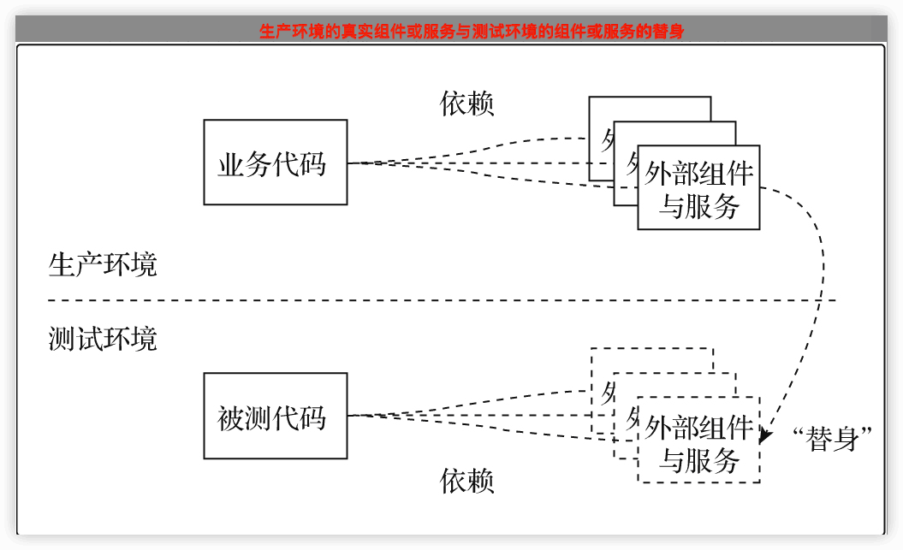

显然用äºä»£ç æµ‹è¯•çš„“替身â€ä¸å¿…ä¸çœŸå®ç»„件或æœåŠ¡å®Œå…¨ç›¸åŒï¼Œæ›¿èº«åªéœ€è¦æä¾›ä¸çœŸå®ç»„件或æœåŠ¡ç›¸åŒçš„æ¥å£ï¼Œåªè¦è¢«æµ‹ä»£ç è®¤ä¸ºå®ƒæ˜¯çœŸå®çš„å³å¯ã€‚

替身的概念是在[测试驱动编程](https://www.agilealliance.org/glossary/tdd)ç†è®ºä¸­è¢«æ出的。作为测试驱动编程ç†è®ºçš„最佳å®è·µï¼ŒxUnit家æ—框æ¶å°†æ›¿èº«çš„概念在å•å…ƒæµ‹è¯•ä¸­åº”用得淋漓尽致，并总结出多ç§æ›¿èº«ï¼Œæ¯”如fakeã€stubã€mock等。这些概念åŠå…¶åº”用模å¼è¢«æ±‡é›†åœ¨[《xUnit Test Patterns》](https://book.douban.com/subject/1859393)一书中，该书已æˆä¸ºæµ‹è¯•é©±åŠ¨å¼€å‘å’ŒxUnit框æ¶æ‹¥è¶¸äººæ‰‹ä¸€å†Œçš„“圣ç»â€ã€‚

在本章看一下如何将xUnit最佳å®è·µä¸­çš„fakeã€stubå’Œmock等概念应用到Go语言å•å…ƒæµ‹è¯•ä¸­ä»¥ç®€åŒ–测试（区别äºç›´æ¥ä¸ºè¢«æµ‹ä»£ç å»ºç«‹å…¶ä¾èµ–的真å®å¤–部组件或æœåŠ¡ï¼‰ï¼Œä»¥åŠè¿™äº›æ¦‚念是如何促进被测代ç é‡æ„以æå‡å¯æµ‹è¯•æ€§çš„。

ä¸è¿‡fakeã€stubã€mock等替身概念之间并é泾渭分æ˜çš„，ç†è§£è¿™äº›æ¦‚念并清晰区分它们本身就是一é“门槛。本章尽é‡ä¸æ¶‰åŠè¿™äº›æ¦‚念间的交集以é¿å…讲解过äºçç¢ã€‚想è¦æ·±å…¥äº†è§£è¿™äº›æ¦‚念间差别的读者å¯ä»¥è‡ªè¡Œç²¾è¯»xUnit Test Patterns。

### 57.1 fake：真å®ç»„件或æœåŠ¡çš„简化å®ç°ç‰ˆæ›¿èº«

fake（“伪造的â€â€œå‡çš„â€â€œä¼ªè£…çš„â€ï¼‰æµ‹è¯•å°±æ˜¯æŒ‡é‡‡ç”¨çœŸå®ç»„件或æœåŠ¡çš„简化版å®ç°ä½œä¸ºæ›¿èº«ï¼Œä»¥æ»¡è¶³è¢«æµ‹ä»£ç çš„外部ä¾èµ–需求。

比如：当被测代ç éœ€è¦è¿æ¥æ•°æ®åº“进行相关æ“作时，虽然我们在开å‘测试ç¯å¢ƒä¸­æ— æ³•æ供一个真å®çš„关系数æ®åº“æ¥æ»¡è¶³æµ‹è¯•éœ€æ±‚，但是å¯ä»¥åŸºäºå“ˆå¸Œè¡¨å®ç°ä¸€ä¸ªå†…存版数æ®åº“æ¥æ»¡è¶³æµ‹è¯•ä»£ç è¦æ±‚，我们用这样一个伪数æ®åº“作为真å®æ•°æ®åº“的替身，使得测试顺利进行下å»ã€‚

Go标准库中的`$GOROOT/src/database/sql/fakedb_test.go`就是一个sql.Driveræ¥å£çš„简化版å®ç°ï¼Œå®ƒå¯ä»¥ç”¨æ¥æ‰“开一个基äºå†…存的数æ®åº“（sql.fakeDB）的è¿æ¥å¹¶æ“作该内存数æ®åº“：

```go
// $GOROOT/src/database/sql/fakedb_test.go
...
type fakeDriver struct {
	mu         sync.Mutex // guards 3 following fields
	openCount  int        // conn opens
	closeCount int        // conn closes
	waitCh     chan struct{}
	waitingCh  chan struct{}
	dbs        map[string]*fakeDB
}
...
var fdriver driver.Driver = &fakeDriver{}

func init() {
	Register("test", fdriver)
}
```

在sql_test.go中，标准库利用上é¢çš„fakeDriver进行相关测试：

```go
// $GOROOT/src/database/sql/sql_test.go


const fakeDBName = "foo"

func newTestDB(t testing.TB, name string) *DB {
	return newTestDBConnector(t, &fakeConnector{name: fakeDBName}, name)
}

func newTestDBConnector(t testing.TB, fc *fakeConnector, name string) *DB {
	fc.name = fakeDBName
	db := OpenDB(fc)
	if _, err := db.Exec("WIPE"); err != nil {
		t.Fatalf("exec wipe: %v", err)
	}
	if name == "people" {
		exec(t, db, "CREATE|people|name=string,age=int32,photo=blob,dead=bool,bdate=datetime")
		exec(t, db, "INSERT|people|name=Alice,age=?,photo=APHOTO", 1)
		exec(t, db, "INSERT|people|name=Bob,age=?,photo=BPHOTO", 2)
		exec(t, db, "INSERT|people|name=Chris,age=?,photo=CPHOTO,bdate=?", 3, chrisBirthday)
	}
	if name == "magicquery" {
		// Magic table name and column, known by fakedb_test.go.
		exec(t, db, "CREATE|magicquery|op=string,millis=int32")
		exec(t, db, "INSERT|magicquery|op=sleep,millis=10")
	}
	if name == "tx_status" {
		// Magic table name and column, known by fakedb_test.go.
		exec(t, db, "CREATE|tx_status|tx_status=string")
		exec(t, db, "INSERT|tx_status|tx_status=invalid")
	}
	return db
}

...

func TestUnsupportedOptions(t *testing.T) {
	db := newTestDB(t, "people")
	defer closeDB(t, db)
	_, err := db.BeginTx(context.Background(), &TxOptions{
		Isolation: LevelSerializable, ReadOnly: true,
	})
	if err == nil {
		t.Fatal("expected error when using unsupported options, got nil")
	}
}
```

标准库中fakeDriver的这个简化版å®ç°è¿˜æ˜¯æ¯”较å¤æ‚。

看一个自定义的简å•ä¾‹å­æ¥è¿›ä¸€æ­¥ç†è§£fake的概念åŠå…¶åœ¨Goå•å…ƒæµ‹è¯•ä¸­çš„应用。

在这个例å­ä¸­ï¼Œè¢«æµ‹ä»£ç ä¸ºåŒ…mailclient中结æ„体类å‹mailClient的方法：ComposeAndSend：

```go
// faketest1/mailclient.go
type mailClient struct {
	mlr mailer.Mailer
}

func New(mlr mailer.Mailer) *mailClient {
	return &mailClient{
		mlr: mlr,
	}
}

// 被测方法
func (c *mailClient) ComposeAndSend(subject string, destinations []string, body string) (string, error) {
	signTxt := sign.Get()
	newBody := body + "\n" + signTxt

	for _, dest := range destinations {
		err := c.mlr.SendMail(subject, dest, newBody)
		if err != nil {
			return "", err
		}
	}
	return newBody, nil
}
```

å¯ä»¥çœ‹åˆ°åœ¨åˆ›å»ºmailClientå®ä¾‹çš„时候，需è¦ä¼ å…¥ä¸€ä¸ªmailer.Maileræ¥å£å˜é‡ï¼Œè¯¥æ¥å£å®šä¹‰å¦‚下：

```go
// faketest1/mailer/mailer.go
type Mailer interface {
	SendMail(subject, destination, body string) error
}
```

ComposeAndSend方法将传入的电å­é‚®ä»¶å†…容（body）ä¸ç­¾å（signTxt）编æ’åˆå¹¶åä¼ ç»™Maileræ¥å£å®ç°è€…çš„SendMail方法，由其将邮件å‘é€å‡ºå»ã€‚

在生产ç¯å¢ƒä¸­ï¼Œmailer.Maileræ¥å£çš„å®ç°è€…是è¦ä¸è¿œç¨‹é‚®ä»¶æœåŠ¡å™¨å»ºç«‹è¿æ¥å¹¶é€šè¿‡ç‰¹å®šçš„电å­é‚®ä»¶å议（如SMTP）将邮件内容å‘é€å‡ºå»çš„。但在å•å…ƒæµ‹è¯•ä¸­ï¼Œæˆ‘们无法满足被测代ç çš„这个è¦æ±‚，äºæ˜¯æˆ‘们为mailClientå®ä¾‹æ供了两个**简化版的å®ç°**：fakeOkMailerå’ŒfakeFailMailer，å‰è€…代表å‘é€æˆåŠŸï¼Œå者代表å‘é€å¤±è´¥ã€‚代ç å¦‚下：

```go
// faketest1/mailclient_test.go
type fakeOkMailer struct{}
func (m *fakeOkMailer) SendMail(subject string, dest string, body string) error {
	return nil
}

type fakeFailMailer struct{}
func (m *fakeFailMailer) SendMail(subject string, dest string, body string) error {
	return fmt.Errorf("can not reach the mail server of dest [%s]", dest)
}
```

这两个替身在测试中的使用方法：

```go
// faketest1/mailclient_test.go
func TestComposeAndSendOk(t *testing.T) {
	m := &fakeOkMailer{}
	mc := mailclient.New(m)
	_, err := mc.ComposeAndSend("hello, fake test", []string{"xxx@example.com"}, "the test body")
	if err != nil {
		t.Errorf("want nil, got %v", err)
	}
}

func TestComposeAndSendFail(t *testing.T) {
	m := &fakeFailMailer{}
	mc := mailclient.New(m)
	_, err := mc.ComposeAndSend("hello, fake test", []string{"xxx@example.com"}, "the test body")
	if err == nil {
		t.Errorf("want non-nil, got nil")
	}
}
```

看到这个测试中mailer.Mailerçš„fakeå®ç°çš„确很简å•ï¼Œ**简å•åˆ°åªæœ‰ä¸€ä¸ªè¿”å›è¯­å¥**。但就这样一个æ其简化的å®ç°å´æ»¡è¶³äº†å¯¹ComposeAndSend方法进行测试的所有需求。
使用fake替身进行测试的最常è§ç†ç”±æ˜¯**在测试ç¯å¢ƒæ— æ³•æ„造被测代ç æ‰€ä¾èµ–的外部组件或æœåŠ¡ï¼Œæˆ–者这些组件/æœåŠ¡æœ‰å‰¯ä½œç”¨**。

fake替身的å®ç°ä¹Ÿæœ‰ä¸¤ä¸ªæ端：è¦ä¹ˆåƒæ ‡å‡†åº“fakedb_test.go那样å®ç°ä¸€ä¸ªå…¨åŠŸèƒ½çš„简化版内存数æ®åº“driver，è¦ä¹ˆåƒfaketest1例å­ä¸­é‚£æ ·é’ˆå¯¹è¢«æµ‹ä»£ç çš„调用请求仅**è¿”å›ç¡¬ç¼–ç çš„æˆåŠŸæˆ–失败**。

这两ç§æ端å®ç°æœ‰ä¸€ä¸ªå…±åŒç‚¹ï¼š**并ä¸å…·å¤‡åœ¨æµ‹è¯•å‰å¯¹è¿”å›ç»“æœè¿›è¡Œé¢„设置的能力**。这也是上é¢ä¾‹å­ä¸­æˆ‘们针对æˆåŠŸå’Œå¤±è´¥ä¸¤ä¸ªç”¨ä¾‹åˆ†åˆ«å®ç°äº†ä¸€ä¸ªæ›¿èº«çš„åŸå› ã€‚（如æœéè¦è¯´æˆåŠŸå’Œå¤±è´¥ä¹Ÿæ˜¯é¢„设置的，那么fake替身的预设置能力也仅é™äºè®¾ç½®å•ä¸€çš„è¿”å›å€¼ï¼Œå³æ— è®ºè°ƒç”¨å¤šå°‘次，传入什么å‚数，返å›å€¼éƒ½æ˜¯ä¸€ä¸ªã€‚）

### 57.2 stub：对返å›ç»“æœæœ‰ä¸€å®šé¢„设æ§åˆ¶èƒ½åŠ›çš„替身🔖

stub也是一ç§æ›¿èº«æ¦‚念，和fake替身相比，stub替身**å¢å¼ºäº†å¯¹æ›¿èº«è¿”å›ç»“æœçš„é—´æ¥æ§åˆ¶èƒ½åŠ›**，这ç§æ§åˆ¶å¯ä»¥é€šè¿‡æµ‹è¯•å‰å¯¹è°ƒç”¨ç»“æœ**预设置**æ¥å®ç°ã€‚ä¸è¿‡ï¼Œstub替身通常仅针对**计划之内的结æœ**进行设置，对计划之外的请求也无能为力。


### 57.3 mock：专用äºè¡Œä¸ºè§‚察和验è¯çš„替身🔖

mock替身比之å‰ä¸¤ä¸ªæ›´ä¸ºå¼ºå¤§ï¼šå®ƒé™¤äº†èƒ½æ供测试å‰çš„预设置返å›ç»“æœèƒ½åŠ›ä¹‹å¤–，还å¯ä»¥å¯¹mock替身对象在测试过程中的行为进行观察和验è¯ã€‚

ä¸è¿‡ç›¸æ¯”äºå‰ä¸¤ç§æ›¿èº«å½¢å¼ï¼Œmock存在应用局é™ï¼ˆå°¤æŒ‡åœ¨Go中）。

- å’Œå‰ä¸¤ç§æ›¿èº«ç›¸æ¯”，mock的应用范围è¦çª„很多，åªç”¨äºå®ç°æŸæ¥å£çš„å®ç°ç±»å‹çš„替身。
- 一般需è¦é€šè¿‡ç¬¬ä¸‰æ–¹æ¡†æ¶å®ç°mock替身。Go官方维护了一个mock框æ¶â€”—[gomock](https://github.com/golang/mock)，该框æ¶é€šè¿‡ä»£ç ç”Ÿæˆçš„æ–¹å¼ç”Ÿæˆå®ç°æŸæ¥å£çš„替身类å‹ã€‚


## 58 使用模糊测试让潜在bug无处éå½¢

==模糊测试（fuzz testing）==是指åŠè‡ªåŠ¨æˆ–自动地为程åºæä¾›é法的ã€é预期ã€éšæœºçš„æ•°æ®ï¼Œå¹¶ç›‘æ§ç¨‹åºåœ¨è¿™äº›è¾“入数æ®ä¸‹æ˜¯å¦ä¼šå‡ºç°å´©æºƒã€å†…置断言失败ã€å†…存泄露ã€å®‰å…¨æ¼æ´ç­‰æƒ…况。


模糊测试始äº**1988**å¹´Barton Miller所åšçš„一项有关Unixéšæœºæµ‹è¯•çš„项目。到目å‰ä¸ºæ­¢ï¼Œå·²ç»æœ‰è®¸å¤šæœ‰å…³æ¨¡ç³Šæµ‹è¯•çš„ç†è®ºæ”¯æ’‘，并且越æ¥è¶Šå¤šçš„编程语言开始æ供对模糊测试的支æŒï¼Œæ¯”如在编译器层é¢åŸç”Ÿæ供模糊测试支æŒçš„LLVM fuzzer项目libfuzzerã€å†å²æœ€æ‚ ä¹…çš„é¢å‘安全的fuzzer方案afl-fuzzã€è°·æ­Œå¼€æºçš„é¢å‘å¯ä¼¸ç¼©æ¨¡ç³Šæµ‹è¯•åŸºç¡€è®¾æ–½çš„ClusterFuzz等。

**传统软件测试技术越æ¥è¶Šæ— æ³•æ»¡è¶³ç°ä»£è½¯ä»¶æ—¥ç›Šå¢é•¿çš„规模ã€å¤æ‚性以åŠå¯¹å¼€å‘速度的è¦æ±‚。**传统软件测试一般会针对被测目标的特性进行人工测试设计。在设计一些异常测试用例的时候，测试用例质é‡å¥½å往往å–决äºæµ‹è¯•è®¾è®¡äººå‘˜å¯¹è¢«æµ‹ç³»ç»Ÿçš„ç†è§£ç¨‹åº¦åŠå…¶ä¸ªäººèƒ½åŠ›ã€‚å³ä¾¿æµ‹è¯•è®¾è®¡äººå‘˜ä¸ªäººèƒ½åŠ›å¾ˆå¼ºï¼Œå¯¹è¢«æµ‹ç³»ç»Ÿä¹Ÿæœ‰è¾ƒæ·±å…¥çš„ç†è§£ï¼Œä»–也很难在有é™çš„时间内想到所有å¯èƒ½çš„异常组åˆå’Œå¼‚常输入，尤其是é¢å¯¹åºå¤§çš„分布å¼ç³»ç»Ÿçš„时候。系统涉åŠçš„自身æœåŠ¡ç»„件ã€ä¸­é—´ä»¶ã€ç¬¬ä¸‰æ–¹ç³»ç»Ÿç­‰å¤šä¸”å¤æ‚，这些系统中的潜在bug或者组åˆåå½¢æˆçš„潜在bug是我们无法预知的。而将éšæœºæµ‹è¯•ã€è¾¹ç•Œæµ‹è¯•ã€è¯•æ¢æ€§æ”»å‡»ç­‰æµ‹è¯•æŠ€æœ¯é›†äºä¸€èº«çš„模糊测试对äºä¸Šè¿°ä¼ ç»Ÿæµ‹è¯•æŠ€æœ¯å­˜åœ¨çš„问题是一个很好的补充和解决方案

### 58.1 模糊测试在挖æ˜Go代ç çš„潜在bug中的作用

`go-fuzz`


### 58.2 go-fuzzçš„åˆæ­¥å·¥ä½œåŸç†

```go
func Fuzz(data []byte) int
```

go-fuzz进一步完善了Goå¼€å‘测试工具集，很多较早æ¥å—Go语言的公å¸ï¼ˆå¦‚Cloudflare等）已ç»å¼€å§‹ä½¿ç”¨go-fuzzæ¥æµ‹è¯•è‡ªå·±çš„产å“以æ高产å“è´¨é‡äº†ã€‚

go-fuzz的工作æµç¨‹ï¼š

1. 生æˆéšæœºæ•°æ®ï¼›
2. 将上述数æ®ä½œä¸ºè¾“入传递给被测程åºï¼›
3. 观察是å¦æœ‰å´©æºƒè®°å½•ï¼ˆcrash），如æœå‘ç°å´©æºƒè®°å½•ï¼Œåˆ™è¯´æ˜æ‰¾åˆ°äº†æ½œåœ¨çš„bug。

之åå¼€å‘者å¯ä»¥æ ¹æ®crash记录情况å»ç¡®è®¤å’Œä¿®å¤bug。修å¤bugå，我们一般会为被测代ç æ·»åŠ é’ˆå¯¹è¿™ä¸ªbugçš„å•å…ƒæµ‹è¯•ç”¨ä¾‹ä»¥éªŒè¯bugå·²ç»ä¿®å¤ã€‚

go-fuzz采用的是**代ç è¦†ç›–ç‡å¼•å¯¼çš„fuzzing算法**（Coverage-guided fuzzing）。

go-fuzzè¿è¡Œèµ·æ¥å将进入一个死循ç¯ï¼Œè¯¥å¾ªç¯ä¸­çš„逻辑的伪代ç å¤§è‡´å¦‚下：

```go
// go-fuzz-build在æ„建用äºgo-fuzz的二进制文件(*.zip)的过程中
// 在被测对象代ç ä¸­åŸ‹å…¥ç”¨äºç»Ÿè®¡ä»£ç è¦†ç›–ç‡çš„桩代ç åŠå…¶ä»–ä¿¡æ¯
Instrument program for code coverage

Collect initial corpus of inputs  // 收集åˆå§‹è¾“入数æ®è¯­æ–™(ä½äºå·¥ä½œè·¯å¾„下的corpus目录下)
for {
  // ä»corpus中读å–语料并åšéšæœºå˜åŒ–
  Randomly mutate an input from the corpus
  
  // 执行Fuzz，收集代ç è¦†ç›–ç‡æ•°æ®
  Execute and collect coverage
  
  // 如æœè¾“入数æ®æ供了新的代ç è¦†ç›–ç‡ï¼Œåˆ™å°†è¯¥è¾“入数æ®å­˜å…¥è¯­æ–™åº“(corpus)
  If the input gives new coverage, add it to corpus
}  
```

go-fuzz的核心是**对语料库的输入数æ®å¦‚何进行å˜åŒ–**。go-fuzz内部使用两ç§å¯¹è¯­æ–™åº“的输入数æ®è¿›è¡Œå˜åŒ–的方法：**çªå˜ï¼ˆmutation）和改写（versify）**。

çªå˜æ˜¯ä¸€ç§ä½çº§æ–¹æ³•ï¼Œä¸»è¦æ˜¯å¯¹è¯­æ–™åº“的字节进行å°ä¿®æ”¹ã€‚下é¢æ˜¯ä¸€äº›å¸¸è§çš„çªå˜ç­–ç•¥

- æ’å…¥/删除/é‡å¤/å¤åˆ¶éšæœºèŒƒå›´çš„éšæœºå­—节；
- ä½ç¿»è½¬ï¼›
- 交æ¢2字节；
- 将一个字节设置为éšæœºå€¼ï¼›
- ä»ä¸€ä¸ªbyte/uint16/uint32/uint64中添加/å‡å»ï¼›
- 将一个byte/uint16/uint32替æ¢ä¸ºå¦ä¸€ä¸ªå€¼ï¼›
- 将一个ASCII数字替æ¢ä¸ºå¦ä¸€ä¸ªæ•°å­—ï¼›
- 拼æ¥å¦ä¸€ä¸ªè¾“入；
- æ’入其他输入的一部分；
- æ’入字符串/æ•´æ•°å­—é¢å€¼ï¼›
- 替æ¢ä¸ºå­—符串/æ•´æ•°å­—é¢å€¼ã€‚

例如，下é¢æ˜¯å¯¹è¾“入语料采用çªå˜æ–¹æ³•çš„输入数æ®æ¼”è¿›åºåˆ—：

```go
""
"", "A"
"", "A", "AB"
"", "A", "AB", "ABC"
"", "A", "AB", "ABC", "ABCD"
```

改写是比较先进的高级方法，它会学习文本的结æ„，对输入进行简å•åˆ†æ，识别出输入语料数æ®ä¸­å„个部分的类å‹ï¼Œæ¯”如数字ã€å­—æ¯æ•°å­—ã€åˆ—表ã€å¼•ç”¨ç­‰ï¼Œç„¶å针对ä¸åŒéƒ¨åˆ†è¿ç”¨çªå˜ç­–略。 

下é¢æ˜¯åº”用改写方法进行语料处ç†çš„例å­ï¼š

åŸå§‹è¯­æ–™è¾“入：

```go
`<item name="foo"><prop name="price">100</prop></item>`
```

è¿ç”¨æ”¹å†™æ–¹æ³•å的输入数æ®ä¾‹å­ï¼š

```html
<item name="rb54ana"><item name="foo"><prop name="price"></prop><prop/></item></item>
<item name=""><prop name="price">=</prop><prop/> </item>
<item name=""><prop F="">-026023767521520230564132665e0333302100</prop><prop/>
</item>
<item SN="foo_P"><prop name="_G_nx">510</prop><prop name="vC">-9e-07036514</prop></item>
<item name="foo"><prop name="c8">prop name="p"</prop>/}<prop name=" price">01e-6</prop></item>
<item name="foo"><item name="foo"><prop JY="">100</prop></item>8<prop/></item>
```

### 58.3 go-fuzz使用方法


### 58.4 使用go-fuzz建立模糊测试的示例


### 58.5 让模糊测试æˆä¸ºâ€œä¸€ç­‰å…¬æ°‘â€


## 59 为被测对象建立性能基准

是å¦ä¼˜åŒ–ã€ä½•æ—¶ä¼˜åŒ–å®è´¨ä¸Šæ˜¯ä¸€ä¸ª==决策问题==，但==决策ä¸èƒ½é ç›´è§‰ï¼Œè¦é æ•°æ®è¯´è¯==。借用上é¢å言中的å¥å‹ï¼š**没有数æ®æ”¯æ’‘的过早决策是万æ¶ä¹‹æº**。

作为一åGoå¼€å‘者，我们该如何åšå‡ºæ˜¯å¦å¯¹ä»£ç è¿›è¡Œæ€§èƒ½ä¼˜åŒ–的决策呢？å¯ä»¥é€šè¿‡**为被测对象建立性能基准的方å¼**å»è·å¾—决策是å¦ä¼˜åŒ–的支撑数æ®ï¼ŒåŒæ—¶å¯ä»¥æ ¹æ®è¿™äº›æ€§èƒ½åŸºå‡†æ•°æ®åˆ¤æ–­å‡ºå¯¹ä»£ç æ‰€åšçš„任何更改是å¦å¯¹ä»£ç æ€§èƒ½æœ‰æ‰€å½±å“。

### 59.1 性能基准测试在Go语言中是“一等公民â€

**性能基准测试在Go语言中是和普通的å•å…ƒæµ‹è¯•ä¸€æ ·è¢«åŸç”Ÿæ”¯æŒçš„**，得到的是“一等公民â€çš„å¾…é‡ã€‚我们å¯ä»¥åƒå¯¹æ™®é€šå•å…ƒæµ‹è¯•é‚£æ ·åœ¨*_test.go文件中创建被测对象的性能基准测试，æ¯ä¸ªä»¥Benchmarkå‰ç¼€å¼€å¤´çš„函数都会被当作一个独立的性能基准测试：

```go
func BenchmarkXxx(b *testing.B) {
  //...
}
```


### 59.2 顺åºæ‰§è¡Œå’Œå¹¶è¡Œæ‰§è¡Œçš„性能基准测试

æ ¹æ®æ˜¯å¦å¹¶è¡Œæ‰§è¡Œï¼ŒGo的性能基准测试å¯ä»¥åˆ†ä¸ºä¸¤ç±»ï¼š**顺åºæ‰§è¡Œçš„性能基准测试和并行执行的性能基准测试**。

#### 1 顺åºæ‰§è¡Œçš„性能基准测试

其代ç å†™æ³•å¦‚下：

```go
func BenchmarkXxx(b *testing.B) {
  // ...
  for i := 0; i < b.N; i++ {
    // 被测对象的执行代ç 
  }
}
```

🔖🔖


#### 2 并行执行的性能基准测试

```go
func BenchmarkXxx(b *testing.B) {
  // ...
	b.RunParallel(func(pb *testing.PB) {
		for pb.Next() {
			// 被测对象的执行代ç 
		}
	})
}
```

并行执行的基准测试主è¦ç”¨äºä¸ºåŒ…å«å¤šgoroutineåŒæ­¥è®¾æ–½ï¼ˆå¦‚互斥é”ã€è¯»å†™é”ã€åŸå­æ“作等）的被测代ç å»ºç«‹æ€§èƒ½åŸºå‡†ã€‚相比äºé¡ºåºæ‰§è¡Œçš„基准测试，并行执行的基准测试更能真å®å映出多goroutine情况下，被测代ç åœ¨goroutineåŒæ­¥ä¸Šçš„真å®æ¶ˆè€—。

🔖🔖

### 59.3 使用性能基准比较工具

#### 1 [benchcmp](https://github.com/golang/tools/tree/master/cmd/benchcmp) ã€deprecation】

```sh
go install golang.org/x/tools/cmd/benchcmp@latest
```


ä¸è¿‡æ€§èƒ½åŸºå‡†æµ‹è¯•çš„输出结æœå—到很多因素的影å“，比如：åŒä¸€æµ‹è¯•çš„è¿è¡Œæ¬¡æ•°ï¼›æ€§èƒ½åŸºå‡†æµ‹è¯•ä¸å…¶ä»–正在è¿è¡Œçš„程åºå…±äº«ä¸€å°æœºå™¨ï¼›è¿è¡Œæµ‹è¯•çš„系统本身就在虚拟机上，ä¸å…¶ä»–虚拟机共享硬件；ç°ä»£æœºå™¨çš„一些节能和功ç‡ç¼©æ”¾ï¼ˆæ¯”如CPU的自动é™é¢‘å’Œç¿é¢‘）等。这些因素都会造æˆå³ä¾¿æ˜¯å¯¹åŒä¸€ä¸ªåŸºå‡†æµ‹è¯•è¿›è¡Œå¤šæ¬¡è¿è¡Œï¼Œè¾“出的结æœä¹Ÿå¯èƒ½æœ‰è¾ƒå¤§å差。但benchcmp工具并ä¸å…³å¿ƒè¿™äº›ç»“æœæ•°æ®åœ¨ç»Ÿè®¡å­¦å±‚é¢æ˜¯å¦æœ‰æ•ˆï¼Œåªå¯¹ç»“æœåšç®€å•æ¯”较。

#### 2 [benchstat](https://github.com/golang/perf/tree/master/benchstat)

为了æ高对性能基准数æ®æ¯”较的科学性，Go核心团队åˆå¼€å‘了benchstat这款工具以替代benchcmp。

```sh
benchstat old.txt new.txt
name      old time/op    new time/op   delta
Strcat-8  92.3ns ± 4%   52.2ns ± 6%   -43.43%  (p=0.008 n=5+5
```

看到，å³ä¾¿old.txtå’Œnew.txt中å„自有5次è¿è¡Œçš„æ•°æ®ï¼Œbenchstat也ä¸ä¼šåƒbenchcmp那样输出5行比较结æœï¼Œè€Œæ˜¯è¾“出一行ç»è¿‡ç»Ÿè®¡å­¦æ–¹æ³•å¤„ç†å的比较结æœã€‚以第二列数æ®92.3ns ± 4%为例，这是benchcmp对old.txt中的数æ®è¿›è¡Œå¤„ç†å的结æœï¼Œå…¶ä¸­Â±4%是样本数æ®ä¸­æœ€å¤§å€¼å’Œæœ€å°å€¼è·æ ·æœ¬å¹³å‡å€¼çš„最大å差百分比。如æœè¿™ä¸ªå差百分比大äº5%，则说æ˜æ ·æœ¬æ•°æ®è´¨é‡ä¸ä½³ï¼Œæœ‰äº›æ ·æœ¬æ•°æ®æ˜¯ä¸å¯ä¿¡çš„。由此å¯ä»¥çœ‹å‡ºï¼Œè¿™é‡Œnew.txt中的样本数æ®æ˜¯è´¨é‡ä¸ä½³çš„。

benchstat输出结æœçš„最å一列（delta）为两次基准测试对比的å˜åŒ–é‡ã€‚我们看到，采用strings.Join方法è¿æ¥å­—符串的平å‡è€—时比采用åŸç”Ÿæ“作符è¿æ¥å­—符串短43%，这个指标åé¢æ‹¬å·ä¸­çš„p=0.008是一个用äºè¡¡é‡ä¸¤ä¸ªæ ·æœ¬é›†åˆçš„å‡å€¼æ˜¯å¦æœ‰æ˜¾è‘—差异的指标。benchstat支æŒä¸¤ç§æ£€éªŒç®—法：一ç§æ˜¯UTest（Mann Whitney UTest，曼-惠特尼U检验），UTest是默认的检验算法；å¦å¤–一ç§æ˜¯Welch T检验（TTest）。一般p值å°äº0.05的结æœæ˜¯å¯æ¥å—的。


```sh
$ go test -run=NONE -count 5 -bench . strcat_test.go -benchmem > old_with_mem.txt
$ go test -run=NONE -count 5 -bench . strcat_test.go -benchmem > new_with_mem.txt

$ benchstat old_with_mem.txt new_with_mem.txt
goos: darwin
goarch: arm64
cpu: Apple M1
         │ old_with_mem.txt │          new_with_mem.txt           │
         │      sec/op      │    sec/op     vs base               │
Strcat-8       47.38n ± ∠¹   30.07n ± ∠¹  -36.53% (p=0.008 n=5)
¹ need >= 6 samples for confidence interval at level 0.95

         │ old_with_mem.txt │          new_with_mem.txt          │
         │       B/op       │    B/op      vs base               │
Strcat-8        80.00 ± ∠¹   48.00 ± ∠¹  -40.00% (p=0.008 n=5)
¹ need >= 6 samples for confidence interval at level 0.95

         │ old_with_mem.txt │          new_with_mem.txt          │
         │    allocs/op     │  allocs/op   vs base               │
Strcat-8        2.000 ± ∠¹   1.000 ± ∠¹  -50.00% (p=0.008 n=5)
¹ need >= 6 samples for confidence interval at level 0.95
```


### 59.4 æ’除é¢å¤–干扰，让基准测试更精确

有些å¤æ‚的基准测试在真正执行For循ç¯ä¹‹å‰æˆ–者在æ¯ä¸ªå¾ªç¯ä¸­ï¼Œé™¤äº†æ‰§è¡ŒçœŸæ­£çš„被测代ç ä¹‹å¤–，å¯èƒ½è¿˜éœ€è¦åšä¸€äº›æµ‹è¯•å‡†å¤‡å·¥ä½œï¼Œæ¯”如**建立基准测试所需的测试上下文等**。如æœä¸åšç‰¹æ®Šå¤„ç†ï¼Œè¿™äº›æµ‹è¯•å‡†å¤‡å·¥ä½œæ‰€æ¶ˆè€—的时间也会被算入最终结æœä¸­ï¼Œè¿™å°±ä¼šå¯¼è‡´æœ€ç»ˆåŸºå‡†æµ‹è¯•çš„æ•°æ®å—到干扰而ä¸å¤Ÿç²¾ç¡®ã€‚为此，testing.B中æ供了**多ç§çµæ´»æ“æ§åŸºå‡†æµ‹è¯•è®¡æ—¶å™¨çš„方法，通过这些方法å¯ä»¥æ’除æ‰é¢å¤–干扰**，让基准测试结æœæ›´èƒ½å映被测代ç çš„真å®æ€§èƒ½ã€‚

```sh
$ go test -bench . benchmark_with_expensive_context_setup_test.go 
goos: darwin
goarch: arm64
cpu: Apple M1
BenchmarkStrcatWithTestContextSetup-8                   25617231                39.55 ns/op
BenchmarkStrcatWithTestContextSetupAndResetTimer-8      37295137                30.54 ns/op
BenchmarkStrcatWithTestContextSetupAndRestartTimer-8    37561339                31.29 ns/op
BenchmarkStrcat-8                                       39039942                31.76 ns/op
PASS
ok      command-line-arguments  11.767s

```

如æœä¸é€šè¿‡testing.Bæ供的计数器æ§åˆ¶æ¥å£å¯¹æµ‹è¯•ä¸Šä¸‹æ–‡å¸¦æ¥çš„消耗进行隔离，最终基准测试得到的数æ®ï¼ˆBenchmarkStrcatWithTestContextSetup）将å离准确数æ®ï¼ˆBenchmarkStrcat）很远。而通过testing.Bæ供的计数器æ§åˆ¶æ¥å£å¯¹æµ‹è¯•ä¸Šä¸‹æ–‡å¸¦æ¥çš„消耗进行隔离å，得到的基准测试数æ®ï¼ˆBenchmarkStrcatWithTestContextSetupAndResetTimerå’ŒBench-markStrcatWithTestContextSetupAndRestartTimer）则é常æ¥è¿‘真å®æ•°æ®ã€‚

### å°ç»“

无论你是å¦è®¤ä¸ºæ€§èƒ½å¾ˆé‡è¦ï¼Œéƒ½è¯·ä½ ä¸ºè¢«æµ‹ä»£ç ï¼ˆå°¤å…¶æ˜¯ä½äºç³»ç»Ÿå…³é”®ä¸šåŠ¡è·¯å¾„上的代ç ï¼‰å»ºç«‹æ€§èƒ½åŸºå‡†ã€‚如æœä½ ç¼–写的是供其他人使用的软件包，则更应如此。åªæœ‰è¿™æ ·ï¼Œæˆ‘们æ‰èƒ½è‡³å°‘ä¿è¯å续对代ç çš„修改ä¸ä¼šå¸¦æ¥æ€§èƒ½å›é€€ã€‚å·²ç»å»ºç«‹çš„性能基准å¯ä»¥ä¸ºå续是å¦è¿›ä¸€æ­¥ä¼˜åŒ–的决策æ供数æ®æ”¯æ’‘，而ä¸æ˜¯é ç¨‹åºå‘˜çš„直觉。


## 60 使用pprof对程åºè¿›è¡Œæ€§èƒ½å‰–æ

Go是“自带电池â€ï¼ˆbattery included）的编程语言，拥有ç€è®©å…¶ä»–主æµè¯­è¨€ç¾¡æ…•çš„工具链，Go还内置了对代ç è¿›è¡Œæ€§èƒ½å‰–æ的工具：pprof。

`pprof` 的全称是 **Performance Profiler**（性能分æ器），它是 Go 语言官方æ供的**性能分æ工具**，主è¦ç”¨äºè¯Šæ–­ç¨‹åºåœ¨ CPUã€å†…å­˜ã€é˜»å¡ã€å程等方é¢çš„性能瓶颈。

### 60.1 pprof的工作åŸç†

使用pprof对程åºè¿›è¡Œæ€§èƒ½å‰–æ的工作一般分为两个阶段：**æ•°æ®é‡‡é›†å’Œæ•°æ®å‰–æ**。


#### 1 采集数æ®ç±»å‹

在数æ®é‡‡é›†é˜¶æ®µï¼ŒGoè¿è¡Œæ—¶ä¼šå®šæœŸå¯¹å‰–æ阶段所需的ä¸åŒç±»å‹æ•°æ®è¿›è¡Œé‡‡æ ·è®°å½•ã€‚当å‰ä¸»è¦æ”¯æŒçš„采样数æ®ç±»å‹æœ‰å¦‚下几ç§

1. CPUæ•°æ®ï¼ˆcpu.prof）

CPUç±»å‹é‡‡æ ·æ•°æ®æ˜¯æ€§èƒ½å‰–æ中å分常è§çš„采样数æ®ç±»å‹ï¼Œå®ƒèƒ½å¸®åŠ©æˆ‘们识别出代ç å…³é”®è·¯å¾„上消耗CPU最多的函数。一旦å¯ç”¨CPUæ•°æ®é‡‡æ ·ï¼ŒGoè¿è¡Œæ—¶ä¼šæ¯éš”一段短暂的时间（10ms）就中断一次（由SIGPROFä¿¡å·å¼•å‘）并记录当å‰æ‰€æœ‰goroutine的函数栈信æ¯ï¼ˆå­˜å…¥cpu.prof）。

2. 堆内存分é…æ•°æ®ï¼ˆmem.prof）

堆内存分é…采样数æ®å’ŒCPU采样数æ®ä¸€æ ·ï¼Œä¹Ÿæ˜¯æ€§èƒ½å‰–æ中å分常è§çš„采样数æ®ç±»å‹ï¼Œå®ƒèƒ½å¸®åŠ©æˆ‘们了解Go程åºçš„当å‰å’Œå†å²å†…存使用情况。堆内存分é…的采样频ç‡å¯é…置，默认æ¯1000次堆内存分é…会åšä¸€æ¬¡é‡‡æ ·ï¼ˆå­˜å…¥mem.prof）

3. é”ç«äº‰æ•°æ®ï¼ˆmutex.prof）

é”ç«äº‰é‡‡æ ·æ•°æ®è®°å½•äº†å½“å‰Go程åºä¸­äº’æ–¥é”争用导致延迟的æ“作。如æœä½ è®¤ä¸ºå¾ˆå¤§å¯èƒ½æ˜¯äº’æ–¥é”争用导致CPU利用ç‡ä¸é«˜ï¼Œé‚£ä¹ˆä½ å¯ä»¥ä¸º`go tool pprof`工具æ供此类采样文件以供性能剖æ阶段使用。该类å‹é‡‡æ ·æ•°æ®åœ¨é»˜è®¤æƒ…况下是ä¸å¯ç”¨çš„，请å‚è§`runtime.SetMutexProfileFraction`或`go test -bench . xxx_test.go -mutexprofile mutex.out`å¯ç”¨å®ƒã€‚

4. 阻å¡æ—¶é—´æ•°æ®ï¼ˆblock.prof）

该类å‹é‡‡æ ·æ•°æ®è®°å½•çš„是goroutine在æŸå…±äº«èµ„æºï¼ˆä¸€èˆ¬æ˜¯ç”±åŒæ­¥åŸè¯­ä¿æŠ¤ï¼‰ä¸Šçš„阻å¡æ—¶é—´ï¼ŒåŒ…括ä»æ— ç¼“冲channel收å‘æ•°æ®ã€é˜»å¡åœ¨ä¸€ä¸ªå·²ç»è¢«å…¶ä»–goroutineé”ä½çš„互斥é”ã€å‘一个满了的channelå‘é€æ•°æ®æˆ–ä»ä¸€ä¸ªç©ºçš„channelæ¥æ”¶æ•°æ®ç­‰ã€‚该类å‹é‡‡æ ·æ•°æ®åœ¨é»˜è®¤æƒ…况下也是ä¸å¯ç”¨çš„，请å‚è§`runtime.SetBlockProfileRate`或`go test -bench . xxx_test.go -blockprofile block.out`å¯ç”¨å®ƒã€‚

#### 2 性能数æ®é‡‡é›†çš„æ–¹å¼

Goç›®å‰ä¸»è¦æ”¯æŒä¸¤ç§æ€§èƒ½æ•°æ®é‡‡é›†æ–¹å¼ï¼šæ€§èƒ½åŸºå‡†æµ‹è¯•å’Œç‹¬ç«‹ç¨‹åºã€‚

1. 性能基准测试

为应用中的关键函数/方法建立起性能基准测试之å，便å¯ä»¥é€šè¿‡æ‰§è¡Œæ€§èƒ½åŸºå‡†æµ‹è¯•é‡‡é›†åˆ°æ•´ä¸ªæµ‹è¯•æ‰§è¡Œè¿‡ç¨‹ä¸­æœ‰å…³è¢«æµ‹æ–¹æ³•çš„å„类性能数æ®ã€‚è¿™ç§æ–¹å¼å°¤å…¶é€‚用äºå¯¹åº”用中关键路径上关键函数/方法性能的剖æ。

仅需为go testå¢åŠ ä¸€äº›å‘½ä»¤è¡Œé€‰é¡¹å³å¯åœ¨æ‰§è¡Œæ€§èƒ½åŸºå‡†æµ‹è¯•çš„åŒæ—¶è¿›è¡Œæ€§èƒ½æ•°æ®é‡‡é›†ã€‚以CPU采样数æ®ç±»å‹ä¸ºä¾‹ï¼š

```sh
$ go test -bench . xxx_test.go -cpuprofile=cpu.prof
$ ls
cpu.prof xxx.test* xxx_test.go
```

一旦开å¯æ€§èƒ½æ•°æ®é‡‡é›†ï¼ˆæ¯”如传入-cpuprofile），go testçš„-c命令选项便会自动开å¯ï¼Œgo test命令执行å会自动编译出一个ä¸è¯¥æµ‹è¯•å¯¹åº”çš„å¯æ‰§è¡Œæ–‡ä»¶ï¼ˆè¿™é‡Œæ˜¯xxx.test）。该å¯æ‰§è¡Œæ–‡ä»¶å¯ä»¥åœ¨æ€§èƒ½æ•°æ®å‰–æ过程中æ供剖æ所需的符å·ä¿¡æ¯ï¼ˆå¦‚æœæ²¡æœ‰è¯¥å¯æ‰§è¡Œæ–‡ä»¶ï¼Œgo tool pprofçš„disasm命令将无法给出对应符å·çš„汇编代ç ï¼‰ã€‚而cpu.prof就是存储CPU性能采样数æ®çš„结æœæ–‡ä»¶ï¼Œå续将作为数æ®å‰–æ过程的输入。

其他类å‹çš„采样数æ®:

```sh
go test -bench . xxx_test.go -memprofile=mem.prof
go test -bench . xxx_test.go -blockprofile=block.prof
go test -bench . xxx_test.go -mutexprofile=mutex.prof
```

2. 独立程åºçš„性能数æ®é‡‡é›†

å¯ä»¥é€šè¿‡1ï¸âƒ£æ ‡å‡†åº“`runtime/pprof`å’Œ`runtime`包æ供的ä½çº§API对独立程åºè¿›è¡Œæ€§èƒ½æ•°æ®é‡‡é›†ã€‚


è¿™ç§ç‹¬ç«‹ç¨‹åºçš„性能数æ®é‡‡é›†æ–¹å¼**对业务代ç ä¾µå…¥è¾ƒå¤š**，还è¦è‡ªå·±ç¼–写一些采集逻辑：**定义flagå˜é‡ã€åˆ›å»ºè¾“出文件ã€å…³é—­è¾“出文件**等。æ¯æ¬¡é‡‡é›†éƒ½è¦åœæ­¢ç¨‹åºæ‰èƒ½è·å–结æœã€‚（当然å¯ä»¥é‡æ–°å®šä¹‰æ›´å¤æ‚çš„æ§åˆ¶é‡‡é›†æ—¶é—´çª—å£çš„逻辑，å®ç°ä¸åœæ­¢ç¨‹åºä¹Ÿèƒ½è·å–采集数æ®ç»“æœã€‚）

Go在2ï¸âƒ£`net/http/pprof`包中还æ供了一ç§æ›´ä¸ºé«˜çº§çš„针对独立程åºçš„性能数æ®é‡‡é›†æ–¹å¼ï¼Œè¿™ç§æ–¹å¼å°¤å…¶é€‚åˆé‚£äº›**内置了HTTPæœåŠ¡**的独立程åºã€‚net/http/pprof包å¯ä»¥ç›´æ¥åˆ©ç”¨å·²æœ‰çš„HTTPæœåŠ¡**对外æ供用äºæ€§èƒ½æ•°æ®é‡‡é›†çš„æœåŠ¡ç«¯ç‚¹ï¼ˆendpoint）**。

```go
package main

import (
	"context"
	"fmt"
	"net/http"
	_ "net/http/pprof"
	"os"
	"os/signal"
	"syscall"
)

func main() {
	http.Handle("/hello", http.HandlerFunc(func(w http.ResponseWriter, r *http.Request) {
		fmt.Println(*r)
		w.Write([]byte("hello"))
	}))
	s := http.Server{
		Addr: "localhost:8080",
	}
	c := make(chan os.Signal, 1)
	signal.Notify(c, syscall.SIGINT, syscall.SIGTERM)
	go func() {
		<-c
		s.Shutdown(context.Background())
	}()
	fmt.Println(s.ListenAndServe())
}
```


```go
// //$GOROOT/src/net/http/pprof/pprof.go

func init() {
	prefix := ""
	if godebug.New("httpmuxgo121").Value() != "1" {
		prefix = "GET "
	}
	http.HandleFunc(prefix+"/debug/pprof/", Index)
	http.HandleFunc(prefix+"/debug/pprof/cmdline", Cmdline)
	http.HandleFunc(prefix+"/debug/pprof/profile", Profile)
	http.HandleFunc(prefix+"/debug/pprof/symbol", Symbol)
	http.HandleFunc(prefix+"/debug/pprof/trace", Trace)
}
```

该包的init函数å‘http包的默认请求路由器DefaultServeMux注册了多个æœåŠ¡ç«¯ç‚¹å’Œå¯¹åº”的处ç†å‡½æ•°ã€‚而正是通过这些æœåŠ¡ç«¯ç‚¹ï¼Œæˆ‘们å¯ä»¥åœ¨è¯¥ç‹¬ç«‹ç¨‹åºè¿è¡ŒæœŸé—´è·å–å„ç§ç±»å‹çš„性能采集数æ®ã€‚ç°åœ¨æ‰“å¼€æµè§ˆå™¨ï¼Œè®¿é—®http://localhost:8080/debug/pprof/。

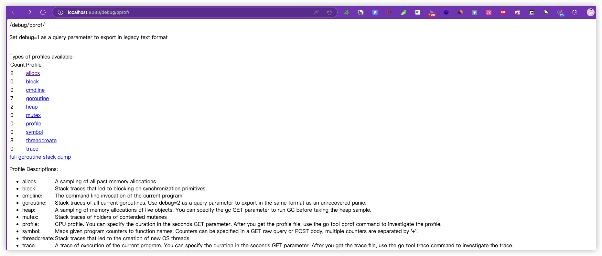

这个页é¢é‡Œåˆ—出了多ç§ç±»å‹çš„性能采集数æ®ï¼Œ**点击其中任何一个å³å¯å®Œæˆè¯¥ç§ç±»å‹æ€§èƒ½æ•°æ®çš„一次采集**。profile是CPUç±»å‹æ•°æ®çš„æœåŠ¡ç«¯ç‚¹ï¼Œç‚¹å‡»è¯¥ç«¯ç‚¹å，该æœåŠ¡é»˜è®¤ä¼šå‘起一次æŒç»­30秒的性能采集，得到的数æ®æ–‡ä»¶ä¼šç”±æµè§ˆå™¨è‡ªåŠ¨ä¸‹è½½åˆ°æœ¬åœ°ã€‚如æœæƒ³è‡ªå®šä¹‰é‡‡é›†æ—¶é•¿ï¼Œå¯ä»¥é€šè¿‡ä¸ºæœåŠ¡ç«¯ç‚¹ä¼ é€’时长å‚æ•°å®ç°ï¼Œæ¯”如下é¢å°±æ˜¯ä¸€ä¸ªé‡‡æ ·60秒的请求：

```
http://localhost:8080/debug/pprof/profile?seconds=60
```


如æœç‹¬ç«‹ç¨‹åºçš„代ç ä¸­æ²¡æœ‰ä½¿ç”¨http包的默认请求路由器DefaultServeMux，那么我们就需è¦é‡æ–°åœ¨æ–°çš„路由器上为pprof包æ供的性能数æ®é‡‡é›†æ–¹æ³•æ³¨å†ŒæœåŠ¡ç«¯ç‚¹


如æœæ˜¯éHTTPæœåŠ¡ç¨‹åºï¼Œåˆ™åœ¨å¯¼å…¥åŒ…çš„åŒæ—¶è¿˜éœ€å•ç‹¬å¯åŠ¨ä¸€ä¸ªç”¨äºæ€§èƒ½æ•°æ®é‡‡é›†çš„goroutine。


通过上é¢å‡ ä¸ªç¤ºä¾‹æˆ‘们å¯ä»¥çœ‹å‡ºï¼Œç›¸æ¯”第一ç§æ–¹å¼ï¼Œå¯¼å…¥net/http/pprof包进行独立程åºæ€§èƒ½æ•°æ®é‡‡é›†çš„æ–¹å¼ä¾µå…¥æ€§æ›´å°ï¼Œä»£ç ä¹Ÿæ›´ä¸ºç‹¬ç«‹ï¼Œå¹¶ä¸”æ— é¡»åœæ­¢ç¨‹åºï¼Œé€šè¿‡é¢„置好的å„类性能数æ®é‡‡é›†æœåŠ¡ç«¯ç‚¹å³å¯éšæ—¶è¿›è¡Œæ€§èƒ½æ•°æ®é‡‡é›†ã€‚

#### 3 性能数æ®çš„剖æ

Go工具链通过pprofå­å‘½ä»¤æ供了两ç§æ€§èƒ½æ•°æ®å‰–æ方法：**命令行交互å¼å’ŒWeb图形化**。命令行交互å¼çš„剖æ方法更常用，也是基本的性能数æ®å‰–æ方法；而基äºWeb图形化的剖æ方法在剖æ结æœå±•ç¤ºä¸Šæ›´ä¸ºç›´è§‚。

##### 命令行交互方å¼

三ç§æ–¹å¼æ‰§è¡Œgo tool pprof以进入采用命令行交互å¼çš„性能数æ®å‰–æç¯èŠ‚：

```sh
// 剖æ通过性能基准测试采集的数æ®
$ go tool pprof xxx.test cpu.prof 
// 剖æ独立程åºè¾“出的性能采集数æ®ï¿¼
$ go tool pprof standalone_app cpu.prof 
// 通过net/http/pprof注册的性能采集数æ®æœåŠ¡ç«¯ç‚¹è·å–æ•°æ®å¹¶å‰–æ
$ go tool pprof http://localhost:8080/debug/pprof/profile
```


以pprof_standalone1.go这个示例的性能采集数æ®ä¸ºä¾‹ï¼Œçœ‹ä¸€ä¸‹åœ¨å‘½ä»¤è¡Œäº¤äº’å¼çš„剖æç¯èŠ‚，有哪些常用命令å¯ç”¨ã€‚

首先生æˆCPUç±»å‹æ€§èƒ½é‡‡é›†æ•°æ®ï¼š

```sh
$ go build -o pprof_standalone1 pprof_standalone1.go
$ ./pprof_standalone1 -cpuprofile pprof_standalone1_cpu.prof
^Cprogram exit
```

通过`go tool pprof`命令进入命令行交互模å¼ï¼š

```sh
$ go tool pprof pprof_standalone1 pprof_standalone1_cpu.prof
File: pprof_standalone1
Type: cpu
Time: 2025-07-23 21:36:26 CST
Duration: 6.73s, Total samples = 40ms ( 0.59%)
Entering interactive mode (type "help" for commands, "o" for options)
(pprof) 
```

ä»pprofå­å‘½ä»¤çš„输出中我们看到：程åºè¿è¡Œ6.73s，采样总时间为40ms，å æ€»æ—¶é—´çš„0.59%。

最常用的命令是topN（N为数字，如æœä¸æŒ‡å®šï¼Œé»˜è®¤ç­‰äº10）：

```sh
(pprof) top
Showing nodes accounting for 40ms, 100% of 40ms total
Showing top 10 nodes out of 16
      flat  flat%   sum%        cum   cum%
      20ms 50.00% 50.00%       20ms 50.00%  runtime.kevent
      10ms 25.00% 75.00%       10ms 25.00%  fmt.Fprintln
      10ms 25.00%   100%       10ms 25.00%  runtime.pthread_cond_signal
         0     0%   100%       10ms 25.00%  fmt.Println (inline)
         0     0%   100%       10ms 25.00%  main.main
         0     0%   100%       20ms 50.00%  runtime.findRunnable
         0     0%   100%       10ms 25.00%  runtime.main
         0     0%   100%       30ms 75.00%  runtime.mcall
         0     0%   100%       20ms 50.00%  runtime.netpoll
         0     0%   100%       10ms 25.00%  runtime.notewakeup
(pprof)
```

🔖

```sh
(pprof) top -cum
```


```sh
(pprof) list main.main
```


```sh
(pprof) list time.Sleep
```


还å¯ä»¥ç”ŸæˆCPU采样数æ®çš„函数调用图:

```sh
(pprof) png
Generating report in profile001.png
```


##### Web图形化方å¼

```sh
$ go tool pprof -http=:9090 pprof_standalone1_cpu.prof
```


### 60.2 使用pprof进行性能剖æçš„å®ä¾‹ 🔖🔖

#### 1 待优化程åºï¼ˆstep0）


#### 2 CPU类性能数æ®é‡‡æ ·åŠæ•°æ®å‰–æ（step1）


```sh
$ go test -v -run=^$ -bench=.
goos: darwin
goarch: arm64
pkg: gofirst/ch60pprof/2/step1
cpu: Apple M1
BenchmarkHi
BenchmarkHi-8             675636              1499 ns/op
PASS
ok      gofirst/ch60pprof/2/step1       1.240s

```


```sh
$ go test -v -run=^$ -bench=^BenchmarkHi$ -benchtime=2s -cpuprofile=cpu.prof
goos: darwin
goarch: arm64
pkg: gofirst/ch60pprof/2/step1
cpu: Apple M1
BenchmarkHi
BenchmarkHi-8            1585893              1561 ns/op
PASS
ok      gofirst/ch60pprof/2/step1       4.176s

$ go tool pprof step1.test cpu.prof
File: step1.test
Type: cpu
Time: 2025-07-23 22:01:33 CST
Duration: 3.73s, Total samples = 3.39s (90.85%)
Entering interactive mode (type "help" for commands, "o" for options)
(pprof) top -cum
Showing nodes accounting for 1.41s, 41.59% of 3.39s total
Dropped 56 nodes (cum <= 0.02s)
Showing top 10 nodes out of 131
      flat  flat%   sum%        cum   cum%
         0     0%     0%      2.38s 70.21%  gofirst/ch60pprof/2/step1.BenchmarkHi
     0.01s  0.29%  0.29%      2.38s 70.21%  gofirst/ch60pprof/2/step1.handleHi
         0     0%  0.29%      2.38s 70.21%  testing.(*B).launch
         0     0%  0.29%      2.38s 70.21%  testing.(*B).runN
     1.40s 41.30% 41.59%      1.40s 41.30%  runtime.memmove
         0     0% 41.59%      1.37s 40.41%  bytes.(*Buffer).Write
         0     0% 41.59%      1.37s 40.41%  net/http/httptest.(*ResponseRecorder).Write
         0     0% 41.59%      0.94s 27.73%  runtime.systemstack
         0     0% 41.59%      0.92s 27.14%  regexp.MatchString
         0     0% 41.59%      0.90s 26.55%  regexp.Compile (inline)
(pprof) list handleHi
Total: 3.39s
ROUTINE ======================== gofirst/ch60pprof/2/step1.handleHi in /Users/andyron/myfield/github/LearnGo/Go语言第一课/gofirst/ch60pprof/2/step1/demo.go
      10ms      2.38s (flat, cum) 70.21% of Total
         .          .     13:func handleHi(w http.ResponseWriter, r *http.Request) {
      10ms      930ms     14:   if match, _ := regexp.MatchString(`^\w*$`, r.FormValue("color")); !match {
         .          .     15:           http.Error(w, "Optional color is invalid", http.StatusBadRequest)
         .          .     16:           return
         .          .     17:   }
         .          .     18:   visitNum := atomic.AddInt64(&visitors, 1)
         .       30ms     19:   w.Header().Set("Content-Type", "text/html; charset=utf-8")
         .      1.37s     20:   w.Write([]byte("<h1 style='color: " + r.FormValue("color") +
         .       50ms     21:           "'>Welcome!</h1>You are visitor number " + fmt.Sprint(visitNum) + "!"))
         .          .     22:}
         .          .     23:
         .          .     24:func main() {
         .          .     25:   log.Printf("Starting on port 8080")
         .          .     26:   http.HandleFunc("/hi", handleHi)
(pprof) 

```


#### 3 第一次优化（step2）


```sh
$ go test -v -run=^$ -bench=.
goos: darwin
goarch: arm64
pkg: gofirst/ch60pprof/2/step2
cpu: Apple M1
BenchmarkHi
BenchmarkHi-8            5292670               226.6 ns/op           298 B/op          4 allocs/op
PASS
ok      gofirst/ch60pprof/2/step2       1.916s

```


#### 4 内存分é…采样数æ®å‰–æ


#### 5 第二次优化（step3）


#### 6 零内存分é…（step4）


#### 7 查看并å‘下的阻å¡æƒ…况（step5）


## 61 使用expvar输出度é‡æ•°æ®ï¼Œè¾…助定ä½æ€§èƒ½ç“¶é¢ˆç‚¹

上一æ¡æ到，è¦æƒ³å¯¹Go应用存在的**性能瓶颈进行剖æ**，首先就è¦å¯¹ä¸åŒç±»å‹çš„性能数æ®è¿›è¡Œæ”¶é›†å’Œé‡‡æ ·ã€‚

有两ç§æ”¶é›†å’Œé‡‡æ ·æ•°æ®çš„方法。在微观层é¢ï¼Œé‡‡ç”¨é€šè¿‡è¿è¡Œæ€§èƒ½åŸºå‡†æµ‹è¯•æ”¶é›†å’Œé‡‡æ ·æ•°æ®çš„方法，这ç§æ–¹æ³•é€‚用äº**定ä½å‡½æ•°æˆ–方法å®ç°**中存在性能瓶颈点的情形；在å®è§‚层é¢ï¼Œé‡‡ç”¨ç‹¬ç«‹ç¨‹åºæ”¶é›†å’Œé‡‡æ ·æ•°æ®çš„方法。但通过独立程åºè¿›è¡Œæ€§èƒ½æ•°æ®é‡‡æ ·æ—¶ï¼Œå¾€å¾€å¾ˆéš¾å¿«é€Ÿæ•æ‰åˆ°çœŸæ­£çš„瓶颈点，尤其是对äºé‚£äº›**内部结æ„å¤æ‚ã€ä¸šåŠ¡é€»è¾‘过多ã€å†…部有较多并å‘çš„**Go程åºã€‚我们在对这样的程åºè¿›è¡Œæ€§èƒ½é‡‡æ ·æ—¶ï¼ŒçœŸæ­£çš„瓶颈点很å¯èƒ½è¢«å…¶ä»–æ•°æ®é®ç›–。

那么**如何能更高效地æ•æ‰åˆ°åº”用的性能瓶颈点呢**？

需è¦çŸ¥é“Go应用è¿è¡ŒçŠ¶æ€ï¼ˆä¸€èˆ¬ä»¥**度é‡æ•°æ®**çš„å½¢å¼å‘ˆç°ï¼‰ã€‚通过了解应用**关键路径**上的度é‡æ•°æ®ï¼Œå¯ä»¥ç¡®å®šåœ¨æŸä¸ªåº¦é‡ç‚¹ä¸Šåº”用的性能是符åˆé¢„期性能指标还是较大å离预期，这样就å¯ä»¥æœ€å¤§é™åº¦åœ°ç¼©å°æ€§èƒ½ç“¶é¢ˆç‚¹çš„æœç´¢èŒƒå›´ï¼Œä»è€Œå¿«é€Ÿå®šä½åº”用中的瓶颈点并进行优化。

这些å¯ä»¥å映应用è¿è¡ŒçŠ¶æ€çš„æ•°æ®ä¹Ÿè¢«ç§°ä¸ºåº”用的==内çœï¼ˆintrospection）数æ®==。相比äºé€šè¿‡æŸ¥è¯¢åº”用外部特å¾è€Œè·å–çš„==æ¢é’ˆç±»ï¼ˆprobing）数æ®==（比如查看应用æŸç«¯å£æ˜¯å¦æœ‰å“应并返å›æ­£ç¡®çš„æ•°æ®æˆ–状æ€ç ï¼‰ï¼Œå†…çœæ•°æ®å¯ä»¥ä¼ è¾¾æ›´ä¸ºä¸°å¯Œã€æ›´å¤šçš„有关应用程åºçŠ¶æ€çš„上下文信æ¯ã€‚这些上下文信æ¯å¯ä»¥æ˜¯åº”用**对å„类资æºçš„å ç”¨ä¿¡**æ¯ï¼Œæ¯”如应用è¿è¡Œå ç”¨äº†å¤šå°‘内存空间，也å¯ä»¥æ˜¯**自定义的性能指标信æ¯**，比如<u>å•ä½æ—¶é—´å¤„ç†çš„外部请求数é‡ã€åº”答延迟ã€é˜Ÿåˆ—积å‹é‡ç­‰</u>。

传统编程语言（如C++ã€Java等）并没有内置输出应用状æ€åº¦é‡æ•°æ®çš„设施（æ¥å£æ–¹å¼ã€æŒ‡æ ‡å®šä¹‰æ–¹æ³•ã€æ•°æ®è¾“出格å¼ç­‰ï¼‰ï¼Œéœ€è¦å¼€å‘者自己通过编ç å®ç°æˆ–利用第三方库å®ç°ã€‚

Go标准库æ供的`expvar`包å¯ä»¥**按统一æ¥å£ã€ç»Ÿä¸€æ•°æ®æ ¼å¼ã€ä¸€è‡´çš„指标**定义方法输出自定义的度é‡æ•°æ®ã€‚

> `expvar` 包的全称是 **Exported Variables**（导出å˜é‡ï¼‰ã€‚其核心功能：**å°† Go 程åºå†…部的è¿è¡Œæ—¶å˜é‡ï¼ˆå¦‚计数器ã€å†…存状æ€ã€è‡ªå®šä¹‰æŒ‡æ ‡ï¼‰ä»¥æ ‡å‡†åŒ–æ–¹å¼å¯¼å‡º**，供外部监æ§ç³»ç»Ÿè®¿é—®å’Œåˆ†æ。

### 61.1 expvar包的工作åŸç†

Go标准库中的expvar包æ供了一ç§**输出应用内部状æ€ä¿¡æ¯çš„==标准化方案==**：

- æ•°æ®è¾“出æ¥å£å½¢å¼ï¼›  
- 输出数æ®çš„ç¼–ç æ ¼å¼ï¼›
- 用户自定义性能指标的方法。

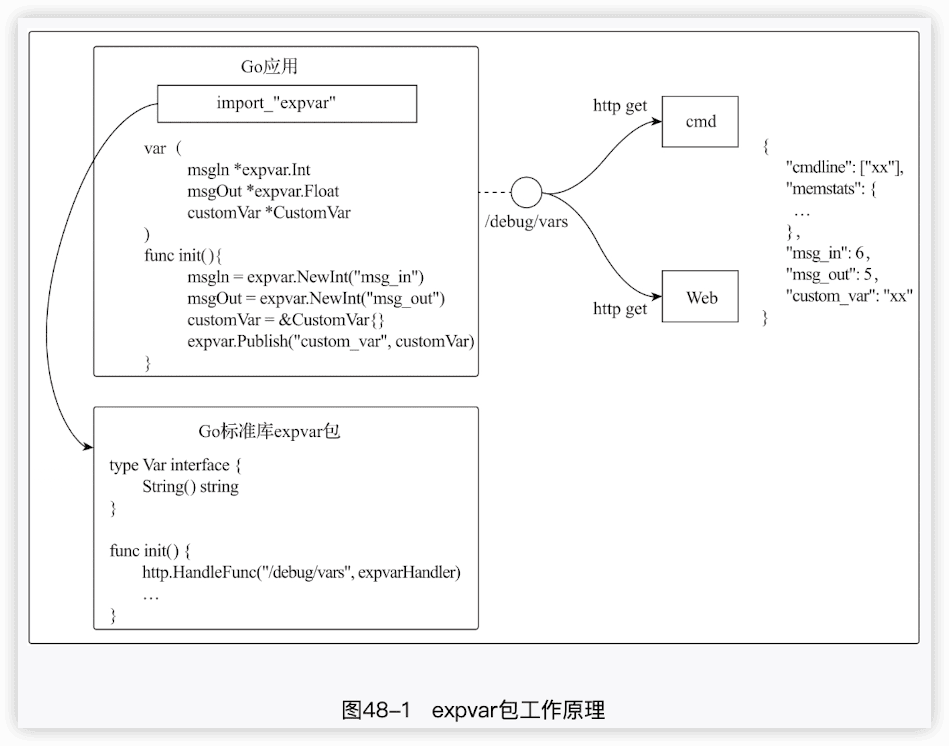

导入expvar：

```go
import _ "expvar"
```

å’Œnet/http/pprof类似，expvar包也在自己的init函数中å‘http包的默认请求“路由器â€`DefaultServeMux`🔖注册一个æœåŠ¡ç«¯ç‚¹/debug/vars：

```
/ $GOROOT/src/expvar/expvar.go

func init() {
	http.HandleFunc("/debug/vars", expvarHandler)
	...
}
```

这个æœåŠ¡ç«¯ç‚¹å°±æ˜¯expvaræ供给外部的è·å–应用内部状æ€çš„**唯一标准æ¥å£**，外部工具（无论是命令行还是基äºWeb的图形化程åºï¼‰éƒ½å¯ä»¥é€šè¿‡æ ‡å‡†çš„http get请求ä»è¯¥æœåŠ¡ç«¯ç‚¹è·å–应用内部状æ€æ•°æ®ã€‚

```go
package main

import (
	_ "expvar"
	"fmt"
	"net/http"
)

func main() {
	http.Handle("/hi", http.HandlerFunc(func(w http.ResponseWriter, r *http.Request) {
		w.Write([]byte("hi"))
	}))
	fmt.Println(http.ListenAndServe("localhost:8080", nil))
}

// http://localhost:8080/debug/vars
```


```go
// 手动将expvar包的æœåŠ¡ç«¯ç‚¹æ³¨å†Œåˆ°åº”用程åºæ‰€ä½¿ç”¨çš„“路由器â€ä¸Š
func main() {
	mux := http.NewServeMux()
	mux.Handle("/hi", http.HandlerFunc(func(w http.ResponseWriter, r *http.Request) {
		w.Write([]byte("hi2"))
	}))
	mux.Handle("/debug/vars", expvar.Handler())
	fmt.Println(http.ListenAndServe("localhost:8080", mux))
}
```


如æœåº”用程åºæœ¬èº«å¹¶æ²¡æœ‰å¯åŠ¨HTTPæœåŠ¡ï¼Œé‚£ä¹ˆè¿˜éœ€åœ¨ä¸€ä¸ªå•ç‹¬çš„goroutine中å¯åŠ¨ä¸€ä¸ªHTTPæœåŠ¡ï¼Œè¿™æ ·expvaræ供的æœåŠ¡æ‰èƒ½æœ‰æ•ˆã€‚


```json
{
  "cmdline": [
  "/var/folders/8k/ntbhdf615p34cflx1_qwv38r0000gn/T/go-build899428462/b001/exe/expvar_demo2"
  ],
  "memstats": {
    "Alloc": 272512,
    "TotalAlloc": 272512,
    "Sys": 6966288,
    "Lookups": 0,
    "Mallocs": 1201,
    "Frees": 90,
    "HeapAlloc": 272512,
    "HeapSys": 3899392,
    ...
  }
}
```

在默认返å›çš„状æ€æ•°æ®ä¸­åŒ…å«äº†ä¸¤ä¸ªå­—段：cmdlineå’Œmemstats。这两个输出数æ®æ˜¯expvar包在init函数中就已ç»å‘布（Publish）了的å˜é‡ï¼š

```go
//$GOROOT/src/expvar/expvar.go

func init() {
  http.HandleFunc("/debug/vars", expvarHandler)
  Publish("cmdline", Func(cmdline))
  Publish("memstats", Func(memstats))
}
```

cmdline字段的å«ä¹‰æ˜¯è¾“出数æ®çš„应用å，这里因为是通过go runè¿è¡Œçš„应用，所以cmdline的值是一个临时路径下的应用。

而memstats输出的数æ®å¯¹åº”的是`runtime.Memstats`结æ„体，å映的是应用在**è¿è¡ŒæœŸé—´å †å†…存分é…ã€æ ˆå†…存分é…åŠGC的状æ€**。runtime.Memstats结æ„体的字段å¯èƒ½ä¼šéšç€Go版本的演进而å‘生å˜åŒ–，其字段具体å«ä¹‰å¯ä»¥å‚考Memstats结æ„体中的注释。

### 61.2 自定义应用通过expvar输出的度é‡æ•°æ®

上文两个标准：

- 标准的æ¥å£ï¼šé€šè¿‡http get（默认ä»/debug/varsæœåŠ¡ç«¯ç‚¹è·å–æ•°æ®ï¼‰ã€‚
- 标准的数æ®ç¼–ç æ ¼å¼ï¼šJSON。

第三个标准：

- 自定义输出的度é‡æ•°æ®çš„标准方法。

在图48-1中我们å‘ç°ï¼Œä»debug/varsæœåŠ¡ç«¯ç‚¹è·å–到的JSON结æœæ•°æ®ä¸­æœ‰ä¸€ä¸ªå为custom_var的字段，这是一个自定义的度é‡æ•°æ®ã€‚

通过在init函数中添加å‘布函数，而添加到返å›ç»“æœä¸­ï¼š

```go
func init() {
    expvar.Publish("custom_var", customVar)
}
```

expvar包æ供了Publish函数，该函数用äºå‘布通过debug/varsæœåŠ¡ç«¯ç‚¹è¾“出的数æ®ï¼Œä¸Šé¢expvar内置输出的cmdlineå’Œmemstats就是通过Publish函数å‘布的。Publish函数的åŸå‹å¦‚下：

```go
// $GOROOT/src/expvar/expvar.go
func Publish(name string, v Var)

type Var interface {
  String() string
}
```

`name`是对应字段在输出结æœä¸­çš„字段å，而v是字段值，类å‹ä¸ºæ¥å£`Var`。
所有å®ç°äº†`Var`æ¥å£ç±»å‹çš„å˜é‡éƒ½å¯ä»¥è¢«å‘布并作为输出的应用内部状æ€çš„一部分。

🔖

### 61.3 输出数æ®çš„展示

JSONæ ¼å¼æ–‡æœ¬å¾ˆå®¹æ˜“ååºåˆ—化，开å‘者å¯è‡ªè¡Œè§£æå使用，比如：编写一个Prometheus exporter，将数æ®å¯¼å…¥Prometheus背å的存储（比如InfluxDB）中，并利用一些基äºWeb图形化的方å¼ç›´è§‚展示出æ¥ï¼›æˆ–者导入Elasticsearch，å†é€šè¿‡Kibana或Grafana的页é¢å±•ç¤ºå‡ºæ¥ã€‚

Goå¼€å‘者Ivan Danilukå¼€å‘了一款å为expvarmonçš„å¼€æºå·¥å…·ï¼Œè¯¥å·¥å…·æ”¯æŒå°†ä»expvar输出的数æ®ä»¥åŸºäºç»ˆç«¯çš„图形化方å¼å±•ç¤ºå‡ºæ¥ã€‚

```sh
go install github.com/divan/expvarmon
```

è¿è¡Œexpvar_demo6，然åè¿è¡Œï¼š

```sh
$ expvarmon -ports="8080" -vars="custom:customVar.field1,custom:customVar.field2,mem:memstats.Alloc,mem:memstats.Sys,mem:memstats.HeapAlloc,mem:memstats.HeapInuse,duration:memstats.PauseNs,duration:memstats.PauseTotalNs"
```


## 62 使用Delve调试Go代ç 

软件开å‘å¯ä¸åªæ˜¯ç¼–ç ï¼Œè°ƒè¯•ä¹Ÿæ˜¯æ¯ä¸ªç¨‹åºå‘˜çš„必备技能，å æ®äº†ç¨‹åºå‘˜å¾ˆå¤§ä¸€éƒ¨åˆ†ç²¾åŠ›ã€‚

调试的目标是修正代ç ä¸­ç¡®è®¤å­˜åœ¨çš„bug。

### 62.1 å…³äºè°ƒè¯•ï¼Œä½ é¦–先应该知é“的几件事

#### 1 调试å‰ï¼Œé¦–å…ˆåšå¥½å¿ƒç†å‡†å¤‡

#### 2 预防bugçš„å‘生，é™ä½bugçš„å‘生概ç‡

bugå¯ç®€å•åˆ†ä¸º**产å“å‘布å‰bug和产å“å‘布åçš„bug**。

无论哪一ç§ï¼Œéƒ½è¦ç»å†**收集数æ®ã€é‡ç°bugã€å®šä½é—®é¢˜ã€ä¿®æ­£é—®é¢˜å’Œä¿®æ­£å的版本验è¯**等多个步骤。

这其中å‘布åçš„bug花费的æˆæœ¬æ›´é«˜ã€‚既然事å®è¯æ˜**调试bugçš„æˆæœ¬æ¯”ç¼–ç æ›´é«˜**，那我们何ä¸é‡‡ç”¨ä¸€äº›æ‰‹æ®µæ¥é¢„防bugçš„å‘生，é™ä½bugå‘生的概ç‡å‘¢ï¼Ÿ

虽然ä»ä¸€ä¸ªè½¯ä»¶çš„整个生命周期æ¥çœ‹ï¼Œä¿è¯è½¯ä»¶è´¨é‡åº”ä»éœ€æ±‚开始，但这里我们主è¦å…³æ³¨**ç¼–ç é˜¶æ®µ**。对äºä¸ªä½“å¼€å‘者，å¯ä»¥ä»ä»¥ä¸‹å‡ ä¸ªæ–¹é¢è€ƒè™‘。

- 充分的代ç æ£€æŸ¥ã€‚

  充分利用你手头上的工具对你编写的代ç è¿›è¡Œä¸¥æ ¼çš„检查，这些工具包括编译器（尽å¯èƒ½å°†è­¦å‘Šçº§åˆ«æå‡åˆ°ä½ å¯ä»¥æ¥å—的最高级别）ã€é™æ€ä»£ç æ£€æŸ¥å·¥å…·ï¼ˆlinter，如go vet）等。

- 为调试版添加断言。

  在调试版代ç ä¸­é€‚当的地方添加断言（Go没有æä¾›åŸç”Ÿæ–­è¨€æœºåˆ¶ï¼Œå¯ä»¥è‡ªè¡Œç®€å•å®ç°æˆ–利用第三方库），这样的方法åŒæ ·å¯ä»¥å¸®åŠ©ä½ åŠæ—¶å‘ç°ä»£ç ä¸­éšè—的缺陷。

- 充分的å•å…ƒæµ‹è¯•

- 代ç åŒçº§è¯„审

#### 3 bugçš„åŸå› å®šä½å’Œä¿®æ­£

1. 收集“ç°åœºæ•°æ®â€

   通过编程语言内置的输出语å¥ï¼ˆå¦‚Goçš„printã€fmt.Printf等）输出我们需è¦çš„ä¿¡æ¯ï¼Œè€Œæ›´ä¸ºä¸“业的方法是通过编程语言æ供的专业调试工具（如GDB）设置断点æ¥é‡‡é›†ç°åœºæ•°æ®æˆ–é‡ç°bug。

2. 定ä½é—®é¢˜æ‰€åœ¨

   有了“ç°åœºæ•°æ®â€ï¼Œæ¥ä¸‹æ¥ä½ éœ€è¦ç”¨â€œç«çœ¼é‡‘ç›â€ä»ä¸­æ‰¾å‡ºä½ çœŸæ­£éœ€è¦çš„æ•°æ®ã€‚如æœæ— æ³•ç›´æ¥è¯†åˆ«å‡ºçœŸæ•°æ®ï¼Œé‚£ä¹ˆå¯ä»¥æ ¹æ®æ•°æ®åšå‡ ç»„ä¸åŒæ•°æ®ç»„åˆçš„模拟测试，在数æ®å˜åŒ–中å»ä¼ªå­˜çœŸï¼Œæ‰¾åˆ°çœŸæ•°æ®ã€‚有了å¯ä¿¡èµ–的真å®æ•°æ®ï¼Œä½ ä¸€èˆ¬éƒ½å¯ä»¥æ ¹æ®ä»£ç é€»è¾‘æ¨ç†å‡ºé—®é¢˜æ‰€åœ¨ã€‚但有些时候还是需è¦é€šè¿‡éš”离代ç ã€ç¼©å°å«Œç–‘代ç èŒƒå›´ç­‰æ–¹æ³•æ‰èƒ½é”定一些较难bug的具体问题所在。

3. 修正并验è¯

   既然找到了问题所在，那剩下的工作就是修正它并é‡ç°éªŒè¯ã€‚为验è¯é—®é¢˜å·²ç»ä¿®å¤è€Œæ·»åŠ çš„新测试用例åŒæ—¶ä¹Ÿè¡¥å……了你的å•å…ƒæµ‹è¯•ç”¨ä¾‹åº“。如æœä¿®æ­£å¤±è´¥ï¼Œé‚£å°±ä»å¤´å¼€å§‹æ–°ä¸€è½®åˆ†æ。

最å，定期å›é¡¾ä½ è‡ªå·±â€œå‡ºäº§â€çš„bug列表，你å¯èƒ½ä¼šå‘ç°å¾ˆå¤šbug是你在预防阶段åšå¾—ä¸å¤Ÿå¥½å¯¼è‡´çš„。这样å›è¿‡å¤´æ¥æ€è€ƒå¦‚何在上一个阶段预防此类“æ¼ç½‘之鱼â€ï¼Œå°±ä¼šå½¢æˆè‰¯æ€§å¾ªç¯ã€‚

### 62.2 Go调试工具的选择

https://blog.golang.org/survey2019-results

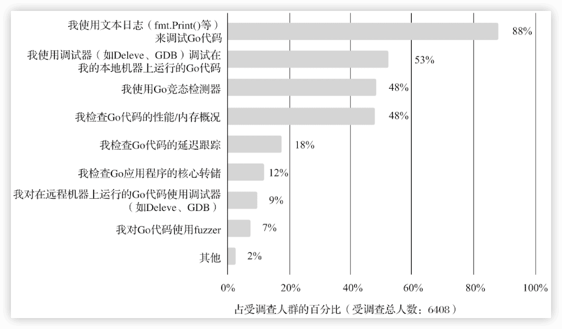

常用的两ç§è°ƒè¯•æ–¹å¼æ˜¯ä½¿ç”¨æ–‡æœ¬è¾“出（fmt.Print等）调试Go代ç ã€printæ´¾â€ã€‘和使用专业调试器（如Delveã€GDB）在本机上调试Go代ç ã€â€œä¸“业工具派â€ã€‘。

用print语å¥è¾…助调试ä¸é‡‡ç”¨ä¸“业调试器对代ç è¿›è¡Œè°ƒè¯•å¹¶ä¸çŸ›ç›¾ï¼Œå®ƒä»¬ä¹‹é—´æ˜¯äº’相补充和相辅相æˆçš„。

print辅助调试â€æ›´å¤šç”¨äºä»£ç å¯ä¿®æ”¹çš„本地ç¯å¢ƒï¼Œé€šè¿‡â€œ**在特定ä½ç½®æ·»åŠ æ‰“å°å€¼â†’编译执行→根æ®è¾“出结æœè°ƒæŸ¥æ€è€ƒ**â€çš„调试循ç¯æ¥é€æ¸é€¼è¿‘“真相â€ã€‚针对本地ç¯å¢ƒä¸‹çš„代ç è°ƒè¯•ï¼Œä¸“业调试器具有åŒæ ·çš„功能，åªæ˜¯è°ƒè¯•å¾ªç¯ç•¥çƒ¦ç，包括**å¯åŠ¨è°ƒè¯•å™¨â†’设置断点→在调试器内è¿è¡Œç¨‹åºâ†’断点处使用命令打å°éœ€è¦çš„ä¿¡æ¯â†’å•æ­¥è°ƒè¯•ç­‰â†’退出调试器**。

但专业调试器å¯ä»¥è¿ç”¨åœ¨â€œprint辅助调试â€æ— æ³•èƒœä»»çš„场景下，比如：

- ä¸IDE集æˆï¼Œé€šè¿‡å›¾å½¢åŒ–æ“作å¯å¤§å¹…简化专业调试器的调试循ç¯ï¼Œæ供更佳的体验；
- 事å调查（postmortem）
- 调试core dump文件；
- 在生产ç¯å¢ƒé€šè¿‡æŒ‚æ¥ï¼ˆattach）应用进程，深入应用进程内部进行调试。


GDB显然也ä¸æ˜¯Go调试工具的最佳选择，虽然其适用äºè°ƒè¯•å¸¦æœ‰cgo代ç çš„Go程åºæˆ–事å调查调试。

Delve（https://github.com/go-delve/delve）是å¦ä¸€ä¸ªGo语言调试器，该调试器工程äº2014å¹´ç”±Derek Parker创建。Delve旨在为Goæ供一个简å•ã€åŠŸèƒ½é½å…¨ã€æ˜“用使用和调用的调试工具。它紧跟Go语言版本演进，是目å‰Go调试器的事å®æ ‡å‡†ã€‚å’ŒGDB相比，Delve的优势在äºå®ƒå¯ä»¥**更好地ç†è§£Go的一切，对并å‘程åºæœ‰ç€å¾ˆå¥½çš„支æŒï¼Œæ”¯æŒè·¨å¹³å°ï¼ˆæ”¯æŒWindowsã€macOSã€Linux三大主æµå¹³å°ï¼‰ï¼Œè€Œä¸”å‰å端分离的设计使得它å¯ä»¥é常容易地被集æˆåˆ°å„ç§IDE（如GoLand）ã€ç¼–译器æ’件（vscode goã€vim-go等）ã€å›¾å½¢åŒ–调试器å‰ç«¯ï¼ˆå¦‚gdlv）中**。

### 62.3 Delve调试基础ã€åŸç†ä¸æ¶æ„ 🔖


常用的查看命令：

- print（简写为p）：输出æºç ä¸­å˜é‡çš„值。
- whatis：输出åé¢çš„表达å¼çš„ç±»å‹ã€‚
- regs：当å‰å¯„存器中的值。
- locals：当å‰å‡½æ•°æ ˆæœ¬åœ°å˜é‡åˆ—表（包括å˜é‡çš„值）。
- args：当å‰å‡½æ•°æ ˆå‚数和返å›å€¼åˆ—表（包括å‚数和返å›å€¼çš„值）。
- examinemem（简写为x）：查看æŸä¸€å†…存地å€ä¸Šçš„值。


#### Delveæ¶æ„ä¸åŸç†

为了便äºå„ç§è°ƒè¯•å™¨å‰ç«¯ï¼ˆå‘½ä»¤è¡Œã€IDEã€ç¼–辑器æ’件ã€å›¾å½¢åŒ–å‰ç«¯ï¼‰ä¸Delve集æˆï¼ŒDelve采用了一个å‰å分离的æ¶æ„

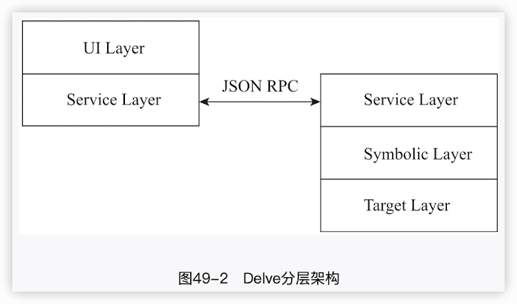

UI Layer对应的就是我们使用的dlv命令行或Goland/vim-go中的调试器å‰ç«¯ï¼Œè€ŒService Layer显然用äºå‰å端通信。Delve真正施展的“魔法â€æ˜¯ç”±Symbolic Layerå’ŒTarget Layer两层åˆä½œå®ç°çš„。

Target Layer通过å„个æ“作系统æ供的系统APIæ¥æ§åˆ¶è¢«è°ƒè¯•ç›®æ ‡è¿›ç¨‹ï¼Œå®ƒå¯¹è¢«è°ƒè¯•ç›®æ ‡çš„æºç æ²¡æœ‰ä»»ä½•äº†è§£ï¼Œå®ç°çš„功能包括：

- 挂æ¥ï¼ˆattach）/分离（detach）目标进程；
- æšä¸¾ç›®æ ‡è¿›ç¨‹ä¸­çš„线程；
- å¯åŠ¨/åœæ­¢å•ä¸ªçº¿ç¨‹ï¼ˆæˆ–整个进程）；
- æ¥æ”¶å’Œå¤„ç†â€œè°ƒè¯•äº‹ä»¶â€ï¼ˆçº¿ç¨‹åˆ›å»º/退出以åŠçº¿ç¨‹åœ¨æ–­ç‚¹å¤„æš‚åœï¼‰ï¼›
- 读写目标进程的内存；
- 读写åœæ­¢çº¿ç¨‹çš„CPU寄存器；
- 读å–core dump文件。

真正了解被调试目标æºç æ–‡ä»¶çš„是Symbolic Layer，这一层通过读å–Go编译器（包括链æ¥å™¨ï¼‰ä»¥DWARFæ ¼å¼ï¼ˆä¸€ç§æ ‡å‡†çš„调试信æ¯æ ¼å¼ï¼‰å†™å…¥ç›®æ ‡äºŒè¿›åˆ¶æ–‡ä»¶ä¸­çš„调试符å·ä¿¡æ¯æ¥äº†è§£è¢«è°ƒè¯•ç›®æ ‡æºç ï¼Œå¹¶å®ç°äº†è¢«è°ƒè¯•ç›®æ ‡è¿›ç¨‹ä¸­çš„地å€ã€äºŒè¿›åˆ¶æ–‡ä»¶ä¸­çš„调试符å·åŠæºç ç›¸å…³ä¿¡æ¯ä¸‰è€…之间的关系映射：

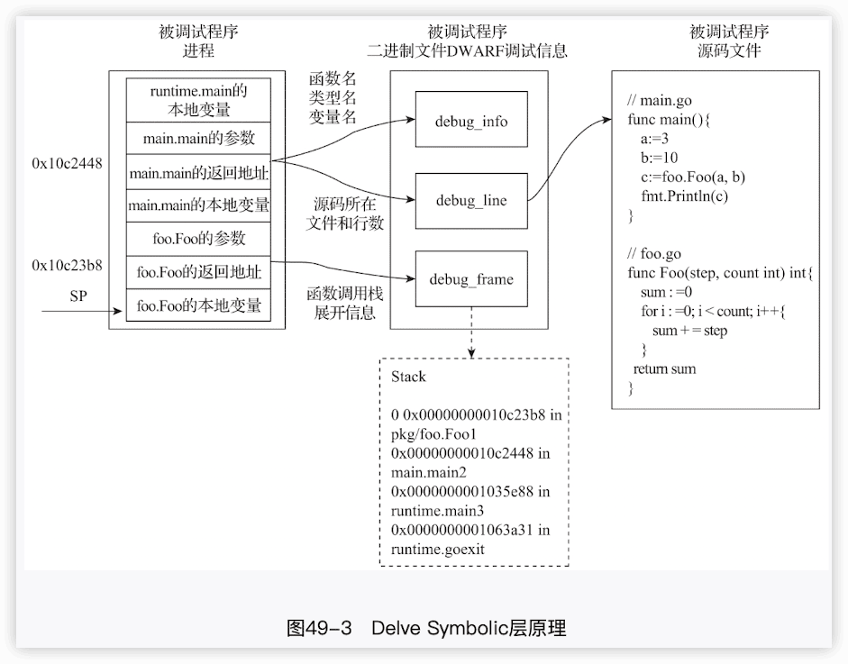

### 62.4 并å‘ã€Coredump文件ä¸æŒ‚æ¥è¿›ç¨‹è°ƒè¯•


# Go网络编程


## 63 ç†è§£Go TCP Socket网络编程模å‹

日常编程中，我们å¯ä»¥çœ‹åˆ°Go语言中的net包åŠå…¶å­ç›®å½•ä¸‹çš„包（如http）å‡è‡ªå¸¦é«˜é¢‘和刚需的主角光ç¯ã€‚而**基äºTCP Socket（套æ¥å­—）的通信则是网络编程的主æµ**，å³ä¾¿ä½ æ²¡æœ‰ç›´æ¥ç”¨è¿‡net包中有关TCP Socket的函数/方法或æ¥å£ï¼Œä½ ä¹Ÿæ€»ç”¨è¿‡net/http包。http包å®ç°çš„是HTTP这个应用层å议，其**在传输层使用的ä¾æ—§æ˜¯TCP Socket**。

Go是自带è¿è¡Œæ—¶çš„跨平å°ç¼–程语言，Go中暴露给语言使用者的TCP Socketæ¥å£æ˜¯å»ºç«‹åœ¨**æ“作系统åŸç”ŸTCP Socketæ¥å£**之上的。由äºGoè¿è¡Œæ—¶è°ƒåº¦çš„需è¦ï¼ŒGo设计了一套适åˆè‡ªå·±çš„TCP Socket网络编程模å‹ã€‚

### 63.1 TCP Socket网络编程模å‹

网络I/O模å‹å®šä¹‰çš„是**应用线程ä¸æ“作系统内核之间的交互行为模å¼**。

通常用**阻å¡ï¼ˆBlocking）和é阻å¡ï¼ˆNon-Blocking）**æ¥æ述网络I/O模å‹ã€‚ä¸åŒæ ‡å‡†å¯¹äºç½‘络I/O模å‹çš„说法有所ä¸åŒï¼Œæ¯”如POSIX.1标准还定义了åŒæ­¥ï¼ˆSync）和异步（Async）这两个术语æ¥æ述模å‹ã€‚

阻å¡å’Œé阻å¡æ˜¯**以==内核是å¦ç­‰æ•°æ®å…¨éƒ¨å°±ç»ªæ‰è¿”å›==（给å‘起系统调用的应用线程）æ¥åŒºåˆ†çš„**。如æœå†…核一直等到全部数æ®å°±ç»ªæ‰è¿”å›ï¼Œåˆ™è¿™ç§è¡Œä¸ºæ¨¡å¼ç§°ä¸º**阻å¡ï¼ˆBlocking）**；如æœå†…核查看数æ®å°±ç»ªçŠ¶æ€å，å³ä¾¿æ²¡æœ‰å°±ç»ªä¹Ÿç«‹å³è¿”å›é”™è¯¯ï¼ˆç»™å‘起系统调用的应用线程），则这ç§è¡Œä¸ºæ¨¡å¼ç§°ä¸º**é阻å¡ï¼ˆNon-Blocking）**。

常用的网络I/O模å‹åŒ…括:

#### 1 阻å¡I/O模å‹

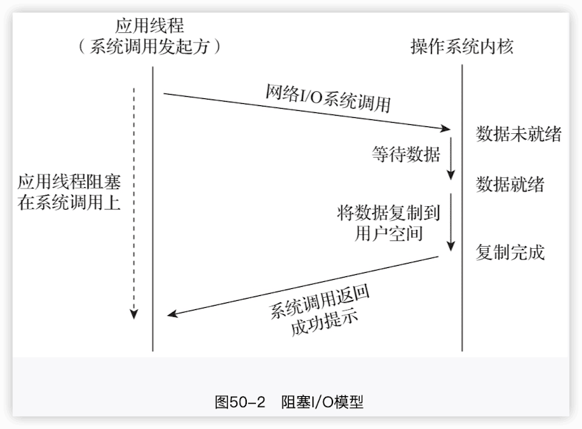

在阻å¡I/O模å‹ä¸‹ï¼Œåœ¨ç”¨æˆ·ç©ºé—´åº”用线程å‘æ“作系统内核å‘èµ·I/O请求å（一般为æ“作系统æ供的I/O系统调用），内核将å°è¯•æ‰§è¡Œè¯¥I/Oæ“作，并等所有数æ®å°±ç»ªå，将数æ®ä»å†…核空间å¤åˆ¶åˆ°ç”¨æˆ·ç©ºé—´ï¼Œæœ€å系统调用ä»å†…核空间返å›ã€‚而在这期间，用户空间应用线程将阻å¡åœ¨è¯¥I/O系统调用上，无法进行å续处ç†ï¼Œåªèƒ½ç­‰å¾…。

因此，在这样的模å‹ä¸‹ï¼Œ**所有Socket默认都是阻å¡çš„**。一个线程仅能处ç†ä¸€ä¸ªç½‘络è¿æ¥ä¸Šçš„æ•°æ®é€šä¿¡ã€‚å³ä¾¿è¿æ¥ä¸Šæ²¡æœ‰æ•°æ®ï¼Œçº¿ç¨‹ä¹Ÿåªèƒ½é˜»å¡åœ¨å¯¹Socket的读æ“作上，等待对端的数æ®ã€‚ä¸è¿‡ï¼Œè™½ç„¶è¯¥æ¨¡å‹å¯¹åº”用整体而言是ä½æ•ˆçš„，但对开å‘人员æ¥è¯´ï¼ŒåŸºäºè¯¥æ¨¡å‹å¼€å‘网络通信应用å´æ˜¯æœ€å®¹æ˜“的。

#### 2 é阻å¡I/O模å‹

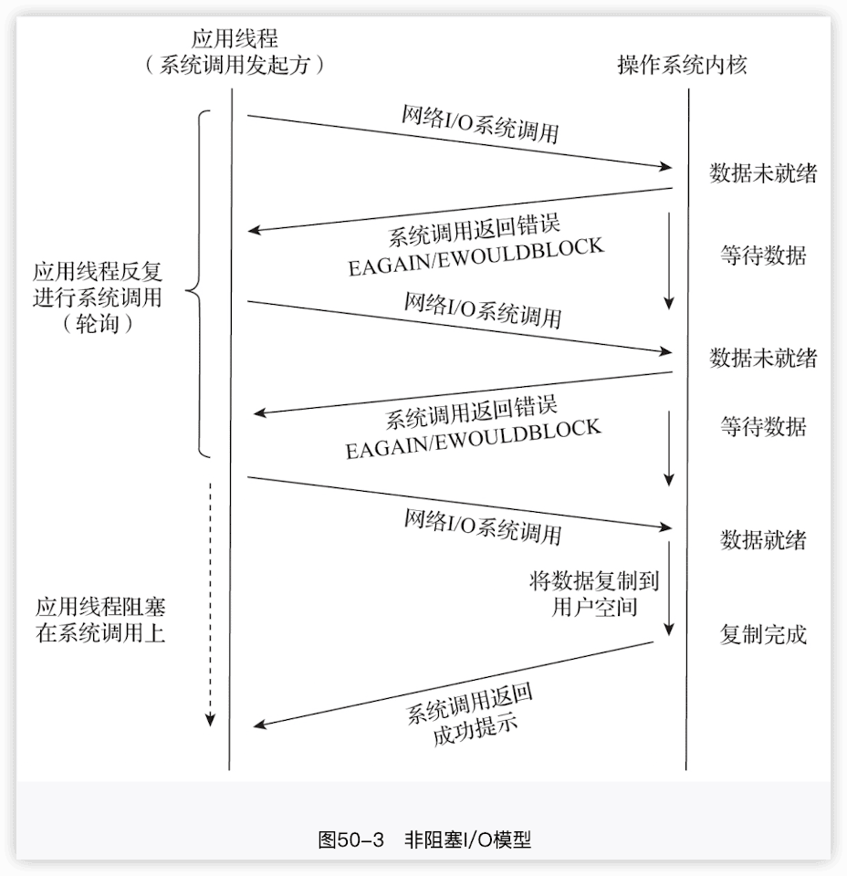

在é阻å¡æ¨¡å‹ä¸‹ï¼Œåœ¨ç”¨æˆ·ç©ºé—´çº¿ç¨‹å‘æ“作系统内核å‘èµ·I/O请求å，内核会执行该I/Oæ“作。如æœæ­¤åˆ»æ•°æ®å°šæœªå°±ç»ªï¼Œåˆ™ä¼šç«‹å³å°†â€œæœªå°±ç»ªâ€çš„状æ€ä»¥é”™è¯¯ç å½¢å¼ï¼ˆå¦‚EAGAIN/EWOULDBLOCK）返å›ç»™æ­¤æ¬¡I/O系统调用的å‘起者。而å者则根æ®ç³»ç»Ÿè°ƒç”¨çš„è¿”å›çŠ¶æ€å†³å®šä¸‹ä¸€æ­¥å¦‚何åšã€‚

在é阻å¡æ¨¡å‹ä¸‹ï¼Œä½äºç”¨æˆ·ç©ºé—´çš„I/O请求å‘起者通常会通过**轮询**çš„æ–¹å¼ä¸€æ¬¡æ¬¡å‘èµ·I/O请求，直到读到所需的数æ®ã€‚ä¸è¿‡ï¼Œè¿™æ ·çš„轮询是对CPU计算资æºçš„æ大浪费，因此**é阻å¡I/O模å‹å•ç‹¬åº”用的比例并ä¸é«˜**。阻å¡çš„Socket默认å¯ä»¥é€šè¿‡`fcntl`调用转å˜ä¸ºé阻å¡Socket。

#### 3 I/O多路å¤ç”¨æ¨¡å‹

为了é¿å…é阻å¡I/O模å‹è½®è¯¢å¯¹è®¡ç®—资æºçš„浪费以åŠé˜»å¡I/O模å‹çš„ä½æ•ˆï¼Œå¼€å‘人员开始首选I/O多路å¤ç”¨æ¨¡å‹ä½œä¸ºç½‘络I/O模å‹ã€‚

I/O多路å¤ç”¨æ¨¡å‹å»ºç«‹åœ¨æ“作系统æ供的`select/poll`等多路å¤ç”¨å‡½æ•°ï¼ˆä»¥åŠæ€§èƒ½æ›´å¥½çš„`epoll`等函数）的基础上。

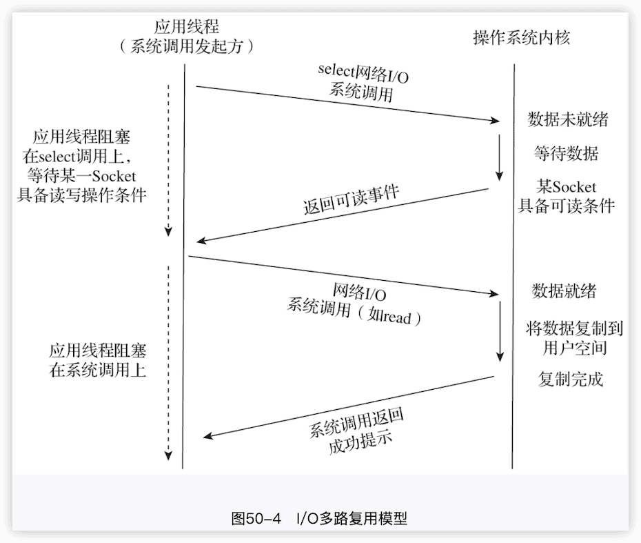

该模å‹ä¸‹ï¼Œåº”用线程首先将需è¦è¿›è¡ŒI/Oæ“作的Socket都添加到**多路å¤ç”¨å‡½æ•°**中（这里以select为例），æ¥ç€é˜»å¡ï¼Œç­‰å¾…select系统调用返å›ã€‚当内核å‘ç°æœ‰æ•°æ®åˆ°è¾¾æ—¶ï¼Œå¯¹åº”çš„Socket具备通信æ¡ä»¶ï¼Œselect函数返å›ã€‚然å用户线程针对该Socketå†æ¬¡å‘起网络I/O请求（如read）。由äºæ•°æ®å·²å°±ç»ªï¼Œå› æ­¤å³ä¾¿Socket是阻å¡çš„，第二次网络I/Oæ“作也é常快。

阻å¡æ¨¡å‹ä¸€ä¸ªçº¿ç¨‹ä»…能处ç†ä¸€ä¸ªSocket，而在I/O多路å¤ç”¨æ¨¡å‹ä¸­ï¼Œåº”用线程å¯ä»¥åŒæ—¶å¤„ç†å¤šä¸ªSocket；虽然å¯åŒæ—¶å¤„ç†å¤šä¸ªSocket，但I/O多路å¤ç”¨æ¨¡å‹**由内核å®ç°å¯è¯»/å¯å†™äº‹ä»¶çš„通知**，é¿å…了é阻å¡æ¨¡å‹ä¸­è½®è¯¢å¸¦æ¥çš„CPU计算资æºçš„浪费。

#### 4 异步I/O模å‹

在异步I/O模å‹ä¸‹ï¼Œç”¨æˆ·åº”用线程ä¸æ“作系统内核的交互行为模å¼ä¸åœ¨å‰å‡ ç§æ¨¡å‹ä¸‹å·®å¼‚较大：

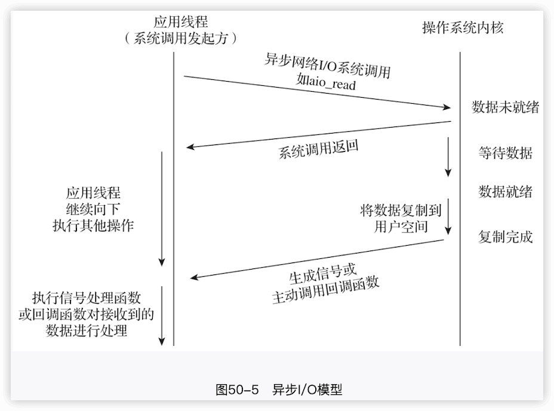

用户应用线程å‘起异步I/O调用å，内核将å¯åŠ¨ç­‰å¾…æ•°æ®çš„æ“作**并马上返å›**。

之å，用户应用线程å¯ä»¥ç»§ç»­æ‰§è¡Œå…¶ä»–æ“作，**既无须阻å¡ï¼Œä¹Ÿæ— é¡»è½®è¯¢å¹¶å†æ¬¡å‘èµ·I/O调用**。在内核空间数æ®å°±ç»ªå¹¶è¢«ä»å†…核空间å¤åˆ¶åˆ°ç”¨æˆ·ç©ºé—´å，内核会主动生æˆä¿¡å·ä»¥é©±åŠ¨æ‰§è¡Œç”¨æˆ·çº¿ç¨‹åœ¨å¼‚æ­¥I/O调用时注册的信å·å¤„ç†å‡½æ•°ï¼Œæˆ–主动执行用户线程注册的å›è°ƒå‡½æ•°ï¼Œè®©ç”¨æˆ·çº¿ç¨‹å®Œæˆå¯¹æ•°æ®çš„处ç†ã€‚

相较äºä¸Šè¿°å‡ ä¸ªæ¨¡å‹ï¼Œå¼‚æ­¥I/O模å‹å—å„个平å°çš„支æŒç¨‹åº¦ä¸ä¸€ï¼Œä¸”**使用起æ¥å¤æ‚度较高**，在如何进行**内存管ç†ã€ä¿¡å·å¤„ç†/å›è°ƒå‡½æ•°**等逻辑设计上会给开å‘人员带æ¥ä¸å°çš„心智负担。

有些标准使用åŒæ­¥å’Œå¼‚æ­¥æ¥æ述网络I/Oæ“作模å‹ã€‚所谓**åŒæ­¥I/O指的是能引起请求线程阻å¡ï¼Œç›´åˆ°I/Oæ“作完æˆï¼›è€Œå¼‚æ­¥I/O则ä¸å¼•èµ·è¯·æ±‚线程的阻å¡**。按照这个说法，å‰é¢æ到的<u>阻å¡I/Oã€é阻å¡I/Oã€I/O多路å¤ç”¨å‡å¯çœ‹æˆåŒæ­¥I/O模å‹ï¼Œè€Œåªæœ‰å¼‚æ­¥I/Oæ‰æ˜¯å副其å®çš„“异步I/Oâ€æ¨¡å‹</u>。

ä¼´éšç€æ¨¡å‹çš„演进，æœåŠ¡ç¨‹åºæ„ˆå‘强大，å¯ä»¥æ”¯æŒæ›´å¤šçš„è¿æ¥ï¼Œè·å¾—更好的处ç†æ€§èƒ½ã€‚ç›®å‰**主æµç½‘络æœåŠ¡å™¨é‡‡ç”¨çš„多是I/O多路å¤ç”¨æ¨¡å‹**，有的也结åˆäº†å¤šçº¿ç¨‹ã€‚ä¸è¿‡I/O多路å¤ç”¨æ¨¡å‹åœ¨æ”¯æŒæ›´å¤šè¿æ¥ã€æå‡I/Oæ“作效ç‡çš„åŒæ—¶ï¼Œä¹Ÿç»™ä½¿ç”¨è€…带æ¥äº†ä¸ä½çš„å¤æ‚性，以至äºå‡ºç°äº†è®¸å¤šé«˜æ€§èƒ½çš„I/O多路å¤ç”¨æ¡†æ¶ï¼ˆå¦‚libeventã€libevã€libuv等）以é™ä½å¼€å‘å¤æ‚性，å‡è½»å¼€å‘者的心智负担。

ä¸è¿‡Go语言的设计者认为I/O多路å¤ç”¨çš„è¿™ç§**通过å›è°ƒå‰²è£‚æ§åˆ¶æµçš„模å‹ä¾æ—§å¤æ‚**，且有悖äºä¸€èˆ¬é¡ºåºçš„逻辑设计，为此他们结åˆGo语言的自身特点，将该“å¤æ‚性â€éšè—在了Goè¿è¡Œæ—¶ä¸­ã€‚这样，在大多数情况下，Goå¼€å‘者无须关心Socket是ä¸æ˜¯é˜»å¡çš„，也无须亲自将Socket文件æ述符的å›è°ƒå‡½æ•°æ³¨å†Œåˆ°ç±»ä¼¼select这样的系统调用中，而åªéœ€åœ¨æ¯ä¸ªè¿æ¥å¯¹åº”çš„goroutine中以最简å•ã€æœ€æ˜“用的阻å¡I/O模å‹çš„æ–¹å¼è¿›è¡ŒSocketæ“作å³å¯ï¼Œè¿™ç§è®¾è®¡å¤§å¤§å‡è½»äº†ç½‘络应用开å‘人员的心智负担。

一个典å‹çš„Go网络æœåŠ¡ç«¯ç¨‹åºå¤§è‡´å¦‚下：

```go
func handleConn(c net.Conn) {
	defer c.Close()
	for {
		// read from the connection
		// ... ...
		// write to the connection
		//... ...
	}
}

func main() {
	l, err := net.Listen("tcp", ":8888")
	if err != nil {
		fmt.Println("listen error:", err)
		return
	}

	for {
		c, err := l.Accept()
		if err != nil {
			fmt.Println("accept error:", err)
			break
		}
		// å¯åŠ¨ä¸€ä¸ªæ–°çš„goroutine处ç†è¿™ä¸ªæ–°è¿æ¥ï¿¼
		go handleConn(c)
	}
}
```

在Go程åºçš„**用户层**（相对äºGo**è¿è¡Œæ—¶å±‚**）看æ¥ï¼Œgoroutine采用了“阻å¡I/O模å‹â€è¿›è¡Œç½‘络I/Oæ“作，Socket都是“阻å¡â€çš„。但å®é™…上，这样的å‡è±¡æ˜¯Goè¿è¡Œæ—¶ä¸­çš„**netpoller（网络轮询器）**通过I/O多路å¤ç”¨æœºåˆ¶æ¨¡æ‹Ÿå‡ºæ¥çš„，对应的底层æ“作系统Socketå®é™…上是é阻å¡çš„：

```go
// $GOROOT/src/net/sock_cloexec.go
func sysSocket(family, sotype, proto int) (int, error) {
  ...
  if err = syscall.SetNonblock(s, true); err != nil {
		poll.CloseFunc(s)
    return -1, os.NewSyscallError("setnonblock", err)
  }
  ...
}
```

åªæ˜¯è¿è¡Œæ—¶æ‹¦æˆªäº†é’ˆå¯¹åº•å±‚Socket的系统调用返å›çš„错误ç ï¼Œå¹¶é€šè¿‡netpollerå’Œgoroutine调度让goroutine“阻å¡â€åœ¨ç”¨æˆ·å±‚所看到的Socketæ述符上。

比如：当用户层针对æŸä¸ªSocketæ述符å‘èµ·readæ“作时，如æœè¯¥Socket对应的è¿æ¥ä¸Šå°šæ— æ•°æ®ï¼Œé‚£ä¹ˆGoè¿è¡Œæ—¶ä¼šå°†è¯¥Socketæ述符加入netpoller中监å¬ï¼Œç›´åˆ°Goè¿è¡Œæ—¶æ”¶åˆ°è¯¥Socketæ•°æ®å¯è¯»çš„通知，Goè¿è¡Œæ—¶æ‰ä¼šé‡æ–°å”¤é†’等待在该Socket上准备读数æ®çš„那个goroutine。而这个过程ä»goroutine的视角æ¥çœ‹ï¼Œå°±åƒæ˜¯readæ“作一直阻å¡åœ¨é‚£ä¸ªSocketæ述符上似的。

Go语言在netpoller中采用了I/O多路å¤ç”¨æ¨¡å‹ã€‚考虑到最常è§çš„多路å¤ç”¨ç³»ç»Ÿè°ƒç”¨select有比较多的é™åˆ¶ï¼Œæ¯”如**监å¬Socketçš„æ•°é‡æœ‰ä¸Šé™ï¼ˆ1024）ã€æ—¶é—´å¤æ‚度高**等，Goè¿è¡Œæ—¶é€‰æ‹©äº†åœ¨ä¸åŒæ“作系统上使用æ“作系统å„自å®ç°çš„高性能多路å¤ç”¨å‡½æ•°ï¼Œæ¯”如Linux上的`epoll`ã€Windows上的`iocp`ã€FreeBSD/macOS上的`kqueue`ã€Solaris上的`event port`等，这样å¯ä»¥æœ€å¤§é™åº¦åœ°æ高netpoller的调度和执行性能。

### 63.2 TCPè¿æ¥çš„建立

众所周知，建立TCP Socketè¿æ¥éœ€è¦ç»å†å®¢æˆ·ç«¯å’ŒæœåŠ¡ç«¯çš„三次æ¡æ‰‹è¿‡ç¨‹ã€‚在è¿æ¥çš„建立过程中，æœåŠ¡ç«¯æ˜¯ä¸€ä¸ªæ ‡å‡†çš„**Listen+Accept**的结æ„（å¯å‚考上é¢çš„代ç ï¼‰ï¼Œè€Œåœ¨å®¢æˆ·ç«¯Go语言使用**Dial或DialTimeout函数**å‘èµ·è¿æ¥å»ºç«‹è¯·æ±‚。

Dial在调用å将一直阻å¡ï¼Œç›´åˆ°è¿æ¥å»ºç«‹æˆåŠŸæˆ–失败。

```go
conn, err := net.Dial("tcp", "taobao.com:80")
if err != nil {
  // 处ç†é”™è¯¯
}
// è¿æ¥å»ºç«‹æˆåŠŸï¼Œå¯ä»¥è¿›è¡Œè¯»å†™æ“作
```

DialTimeout是带有超时机制的Dial：

```go
conn, err := net.DialTimeout("tcp", "localhost:8080", 2 * time.Second)
if err != nil {
  // 处ç†é”™è¯¯
}
// è¿æ¥å»ºç«‹æˆåŠŸï¼Œå¯ä»¥è¿›è¡Œè¯»å†™æ“作
```

对äºå®¢æˆ·ç«¯è€Œè¨€ï¼Œå»ºç«‹è¿æ¥æ—¶å¯èƒ½ä¼šé‡åˆ°å¦‚下几ç§æƒ…形。

#### 1 网络ä¸å¯è¾¾æˆ–对方æœåŠ¡æœªå¯åŠ¨

如æœä¼ ç»™Dialçš„æœåŠ¡ç«¯åœ°å€æ˜¯ç½‘络ä¸å¯è¾¾çš„，或者æœåŠ¡åœ°å€ä¸­ç«¯å£å¯¹åº”çš„æœåŠ¡å¹¶æ²¡æœ‰å¯åŠ¨ï¼Œç«¯å£æœªè¢«ç›‘å¬ï¼ˆListen），则Dial几ä¹ä¼šç«‹å³è¿”å›é”™è¯¯ã€‚

```go
func main() {
	log.Println("begin dial...")
	conn, err := net.Dial("tcp", ":8888")
	if err != nil {
		log.Println("dial error:", err)
		return
	}
	defer conn.Close()
	log.Println("dial ok")
}
```

```
2025/08/08 11:06:31 begin dial...
2025/08/08 11:06:31 dial error: dial tcp :8888: connect: connection refused
```

#### 2 对方æœåŠ¡çš„listen backlog队列满了

还有一ç§åœºæ™¯æ˜¯å¯¹æ–¹æœåŠ¡å™¨å¾ˆå¿™ï¼Œç¬é—´æœ‰å¤§é‡å®¢æˆ·ç«¯å°è¯•ä¸æœåŠ¡ç«¯å»ºç«‹è¿æ¥ï¼ŒæœåŠ¡ç«¯å¯èƒ½ä¼šå‡ºç°listen backlog队列满了，æ¥æ”¶è¿æ¥ï¼ˆaccept）ä¸åŠæ—¶çš„情况，这将导致客户端的Dial调用阻å¡ã€‚（通常，å³ä¾¿æœåŠ¡ç«¯ä¸è°ƒç”¨acceptæ¥æ”¶å®¢æˆ·ç«¯è¿æ¥ï¼Œåœ¨backlogæ•°é‡èŒƒå›´ä¹‹å†…，客户端的è¿æ¥æ“作也都是会æˆåŠŸçš„，因为新的è¿æ¥å·²ç»åŠ å…¥æœåŠ¡ç«¯çš„内核listen队列中了，acceptæ“作åªæ˜¯ä»è¿™ä¸ªé˜Ÿåˆ—中å–出一个è¿æ¥è€Œå·²ã€‚）


```sh
$ sysctl -a | grep kern.ipc.somaxconn
kern.ipc.somaxconn: 128
```


#### 3 若网络延迟较大，Dial将阻å¡å¹¶è¶…æ—¶

如æœç½‘络延迟较大，TCPæ¡æ‰‹è¿‡ç¨‹å°†æ›´åŠ è‰°éš¾åå·ï¼ˆç»å†å„ç§ä¸¢åŒ…），时间消耗自然也会更长，Dial此时会阻å¡ã€‚如æœç»è¿‡é•¿æ—¶é—´é˜»å¡åä¾æ—§æ— æ³•å»ºç«‹è¿æ¥ï¼Œé‚£ä¹ˆDial也会返å›ç±»ä¼¼â€œgetsockopt: operation timed outâ€çš„错误。

在è¿æ¥å»ºç«‹é˜¶æ®µï¼Œå¤šæ•°æƒ…况下Dial是å¯ä»¥æ»¡è¶³éœ€æ±‚的，å³ä¾¿æ˜¯é˜»å¡ä¸€å°ä¼šå„¿ã€‚但对äºé‚£äº›æœ‰ä¸¥æ ¼çš„è¿æ¥æ—¶é—´é™å®šçš„Go应用，如æœä¸€å®šæ—¶é—´å†…没能æˆåŠŸå»ºç«‹è¿æ¥ï¼Œç¨‹åºå¯èƒ½éœ€è¦æ‰§è¡Œä¸€æ®µå¼‚常处ç†é€»è¾‘，为此我们就需è¦DialTimeout函数了。


### 63.3 Socket读写🔖

**è¿æ¥å»ºç«‹èµ·æ¥å，就è¦åœ¨è¿æ¥ä¸Šè¿›è¡Œè¯»å†™ä»¥å®Œæˆä¸šåŠ¡é€»è¾‘。**

å‰é¢è¯´è¿‡ï¼Œ**Goè¿è¡Œæ—¶éšè—了I/O多路å¤ç”¨çš„å¤æ‚性**。

语言使用者åªéœ€é‡‡ç”¨goroutine+阻å¡I/O模å‹å³å¯æ»¡è¶³å¤§éƒ¨åˆ†åœºæ™¯éœ€æ±‚。Dialè¿æ¥æˆåŠŸå会返å›ä¸€ä¸ªnet.Connæ¥å£ç±»å‹çš„å˜é‡å€¼ï¼Œè¿™ä¸ªæ¥å£å˜é‡çš„底层类å‹ä¸ºä¸€ä¸ª`*TCPConn`:

```go
//$GOROOT/src/net/tcpsock_posix.go
type TCPConn struct {
  conn
}
```

TCPConn内嵌了一个é导出类å‹conn，因此“继承â€äº†connç±»å‹çš„Readå’ŒWrite方法，å续通过Dial函数返å›å€¼è°ƒç”¨çš„Writeå’ŒRead方法å‡æ˜¯net.conn的方法：

```go
//$GOROOT/src/net/net.go
type conn struct {
	fd *netFD
}

func (c *conn) ok() bool { return c != nil && c.fd != nil }

// å®ç°Connæ¥å£ï¿¼

func (c *conn) Read(b []byte) (int, error) {
	if !c.ok() {
		return 0, syscall.EINVAL
	}
	n, err := c.fd.Read(b)
	if err != nil && err != io.EOF {
		err = &OpError{Op: "read", Net: c.fd.net, Source: c.fd.laddr, Addr: c.fd.raddr, Err: err}
	}
	return n, err
}

func (c *conn) Write(b []byte) (int, error) {
	if !c.ok() {
		return 0, syscall.EINVAL
	}
	n, err := c.fd.Write(b)
	if err != nil {
		err = &OpError{Op: "write", Net: c.fd.net, Source: c.fd.laddr, Addr: c.fd.raddr, Err: err}
	}
	return n, err
}
```

通过几个场景æ¥æ€»ç»“一下conn.Read的行为特点

#### 1 Socket中无数æ®

è¿æ¥å»ºç«‹å，如æœå®¢æˆ·ç«¯æœªå‘é€æ•°æ®ï¼ŒæœåŠ¡ç«¯ä¼šé˜»å¡åœ¨Socket的读æ“作上，这和å‰é¢æ到的阻å¡I/O模å‹çš„行为模å¼æ˜¯ä¸€è‡´çš„。执行该读æ“作的goroutine也会被挂起。Goè¿è¡Œæ—¶ä¼šç›‘视该Socket，直到其有数æ®è¯»äº‹ä»¶æ‰ä¼šé‡æ–°è°ƒåº¦è¯¥Socket对应的goroutine完æˆè¯»æ“作。


#### 2 Socket中有部分数æ®

如æœSocket中有部分数æ®å°±ç»ªï¼Œä¸”æ•°æ®æ•°é‡å°äºä¸€æ¬¡è¯»æ“作所期望读出的数æ®é•¿åº¦ï¼Œé‚£ä¹ˆè¯»æ“作将会æˆåŠŸè¯»å‡ºè¿™éƒ¨åˆ†æ•°æ®å¹¶è¿”å›ï¼Œè€Œä¸æ˜¯ç­‰å¾…期望长度数æ®å…¨éƒ¨è¯»å–åå†è¿”å›ã€‚


#### 3 Socket中有足够多的数æ®

如æœè¿æ¥ä¸Šæœ‰æ•°æ®ï¼Œä¸”æ•°æ®é•¿åº¦å¤§äºæˆ–ç­‰äºä¸€æ¬¡Readæ“作所期望读出的数æ®é•¿åº¦ï¼Œé‚£ä¹ˆRead将会æˆåŠŸè¯»å‡ºè¿™éƒ¨åˆ†æ•°æ®å¹¶è¿”å›ã€‚


#### 4 Socket关闭


#### 5 读æ“作超时


#### 6 æˆåŠŸå†™


#### 7 写阻å¡


#### 8 写入部分数æ®


#### 9 写入超时


#### 10 goroutine安全的并å‘读写


### 63.4 Socketå±æ€§

åŸç”ŸSocket APIæ供了丰富的sockopt设置æ¥å£ï¼Œè€ŒGo有自己的网络编程模å‹ã€‚Goæ供的socket optionsæ¥å£ä¹Ÿæ˜¯åŸºäºä¸Šè¿°æ¨¡å‹çš„å¿…è¦çš„å±æ€§è®¾ç½®ï¼ŒåŒ…括SetKeepAliveã€SetKeep-AlivePeriodã€SetLingerã€SetNoDelay （默认为no delay）ã€SetWriteBufferã€SetReadBuffer。

ä¸è¿‡ä¸Šé¢çš„方法是TCPConnç±»å‹çš„，而ä¸æ˜¯Connç±»å‹çš„。è¦ä½¿ç”¨ä¸Šé¢çš„方法，需è¦è¿›è¡Œç±»å‹æ–­è¨€ï¼ˆtype assertion）æ“作：

```go
tcpConn, ok := c.(*TCPConn)
if !ok {
  // 错误处ç†
}

tcpConn.SetNoDelay(true)
```

对äºlistener的监å¬Socket，Go默认设置了SO_REUSEADDR，这样当你é‡å¯æœåŠ¡ç¨‹åºæ—¶ï¼Œä¸ä¼šå› ä¸ºaddress in use的错误而é‡å¯å¤±è´¥ã€‚

### 63.5 关闭è¿æ¥


## 64 使用net/http包å®ç°å®‰å…¨é€šä¿¡

### 64.1 HTTPS：在安全传输层上è¿è¡Œçš„HTTPåè®®

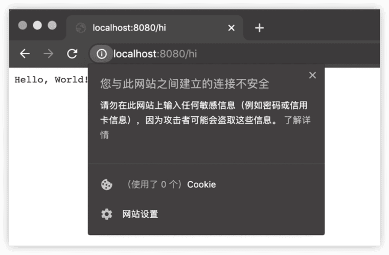


HTTPSå议就是用æ¥è§£å†³ä¼ ç»ŸHTTPåè®®æ˜æ–‡ä¼ è¾“ä¸å®‰å…¨çš„问题的。ä¸æ™®é€šHTTPåè®®ä¸åŒï¼ŒHTTPSå议在传输层（TCPå议）和应用层（HTTPå议）之间å¢åŠ äº†ä¸€ä¸ª==安全传输层==：

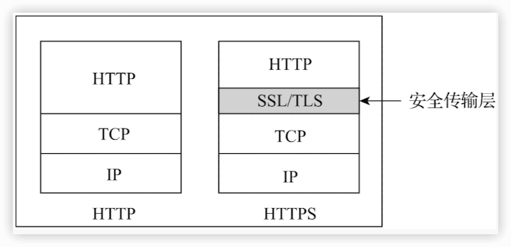

安全传输层通常采用**SSL（Secure Socket Layer）**或**TLS（Transport Layer Security）**åè®®å®ç°ï¼ˆGo标准库支æŒTLS 1.3版本å议）。这一层负责HTTPå议传输的**内容加密ã€é€šä¿¡åŒæ–¹èº«ä»½éªŒè¯**等。有了这一层å，HTTPå议就摇身一å˜ï¼Œæˆä¸ºæ‹¥æœ‰**加密ã€è¯ä¹¦èº«ä»½éªŒè¯å’Œå†…容完整性ä¿æŠ¤åŠŸèƒ½**çš„HTTPSå议了。或者å过æ¥è¯´ï¼Œ==HTTPSå议就是在安全传输层上è¿è¡Œçš„HTTPåè®®==。

Go标准库net/http包åŒæ ·æ供了对采用HTTPSå议的WebæœåŠ¡çš„支æŒã€‚åªéœ€ä¿®æ”¹ä¸€è¡Œä»£ç å°±èƒ½å°†ä¸Šé¢ç¤ºä¾‹ä¸­çš„那个基äºHTTPå议的WebæœåŠ¡æ”¹ä¸ºä¸€ä¸ªé‡‡ç”¨HTTPSå议的WebæœåŠ¡ï¼š

```go
func main() {
	http.HandleFunc("/", func(w http.ResponseWriter, r *http.Request) {
		w.Write([]byte("hello https"))
		fmt.Fprintf(w, " golang \n")
	})
	fmt.Println(http.ListenAndServeTLS(":8081", "server.crt", "server.key", nil))
}
```

`http.ListenAndServeTLS`有两个å‚æ•°certFileå’ŒkeyFile，是http包针对HTTPSå议进行内容加密ã€èº«ä»½éªŒè¯å’Œå†…容完整性验è¯çš„å‰æ。

用openssl工具å¯ä»¥ç”Ÿæˆè¯¥ç¤ºä¾‹ä¸­HTTPS WebæœåŠ¡æ‰€éœ€çš„server.keyå’Œserver.crt，并让这个示例中的æœåŠ¡è¿è¡Œèµ·æ¥ï¼š

```sh
$ openssl genrsa -out server.key 2048
$ openssl req -new -x509 -key server.key -out server.crt -days 365
```

https://localhost:8081/，æµè§ˆå™¨ä¼šæ˜¾ç¤ºè­¦å‘Šé¡µé¢ï¼ˆå› ä¸ºæˆ‘们使用的是自签åè¯ä¹¦ï¼‰

使用curl访问è¦åŠ -k。

```sh
$ curl -k https://localhost:8081/
hello https golang 
$ curl https://localhost:8081/
curl: (60) SSL certificate problem: self signed certificate
More details here: https://curl.se/docs/sslcerts.html

curl failed to verify the legitimacy of the server and therefore could not
establish a secure connection to it. To learn more about this situation and
how to fix it, please visit the web page mentioned above.
```

报错的主è¦åŸå› æ˜¯ç¤ºä¾‹ä¸­HTTPS WebæœåŠ¡æ‰€ä½¿ç”¨è¯ä¹¦ï¼ˆserver.crt）是我们自己生æˆçš„自签åè¯ä¹¦ï¼Œcurl使用测试ç¯å¢ƒç³»ç»Ÿä¸­å†…置的å„ç§æ•°å­—è¯ä¹¦æˆæƒæœºæ„的公钥è¯ä¹¦æ— æ³•å¯¹å…¶è¿›è¡ŒéªŒè¯ã€‚而-k选项则表示忽略对示例中HTTPS WebæœåŠ¡çš„æœåŠ¡ç«¯è¯ä¹¦çš„校验。

### 64.2 HTTPS安全传输层的工作机制

HTTPS是建æ„在基äºSSL/TLSåè®®å®ç°çš„传输安全层之上的HTTPå议，也就是说，一旦通信åŒæ–¹åœ¨ä¼ è¾“安全层上æˆåŠŸå»ºç«‹è¿æ¥ï¼Œé‚£ä¹ˆ**å续的通信就和普通HTTPå议一样**，åªä¸è¿‡æ‰€æœ‰çš„HTTPå议数æ®ç»è¿‡å®‰å…¨å±‚传输时都会被自动加密/解密。

安全传输层是整个HTTPSå议的核心，了解其工作机制对ç†è§£HTTPSå议至关é‡è¦ã€‚

通过curl命令æ¢ç©¶å®‰å…¨ä¼ è¾“层è¿æ¥çš„建立过程:

```sh
$ curl -v -k https://127.0.0.1:8081/
*   Trying 127.0.0.1:8081...
* Connected to 127.0.0.1 (127.0.0.1) port 8081
* ALPN: curl offers h2,http/1.1
* (304) (OUT), TLS handshake, Client hello (1):
* (304) (IN), TLS handshake, Server hello (2):
* (304) (IN), TLS handshake, Unknown (8):
* (304) (IN), TLS handshake, Certificate (11):
* (304) (IN), TLS handshake, CERT verify (15):
* (304) (IN), TLS handshake, Finished (20):
* (304) (OUT), TLS handshake, Finished (20):
* SSL connection using TLSv1.3 / AEAD-CHACHA20-POLY1305-SHA256 / [blank] / UNDEF
* ALPN: server accepted h2
* Server certificate:
*  subject: C=AU; ST=Some-State; O=Internet Widgits Pty Ltd
*  start date: Sep  8 03:47:07 2025 GMT
*  expire date: Sep  8 03:47:07 2026 GMT
*  issuer: C=AU; ST=Some-State; O=Internet Widgits Pty Ltd
*  SSL certificate verify result: self signed certificate (18), continuing anyway.
* using HTTP/2
* [HTTP/2] [1] OPENED stream for https://127.0.0.1:8081/
* [HTTP/2] [1] [:method: GET]
* [HTTP/2] [1] [:scheme: https]
* [HTTP/2] [1] [:authority: 127.0.0.1:8081]
* [HTTP/2] [1] [:path: /]
* [HTTP/2] [1] [user-agent: curl/8.7.1]
* [HTTP/2] [1] [accept: */*]
> GET / HTTP/2
> Host: 127.0.0.1:8081
> User-Agent: curl/8.7.1
> Accept: */*
> 
* Request completely sent off
< HTTP/2 200 
< content-type: text/plain; charset=utf-8
< content-length: 20
< date: Mon, 08 Sep 2025 03:54:55 GMT
< 
hello https golang 
* Connection #0 to host 127.0.0.1 left intact
```

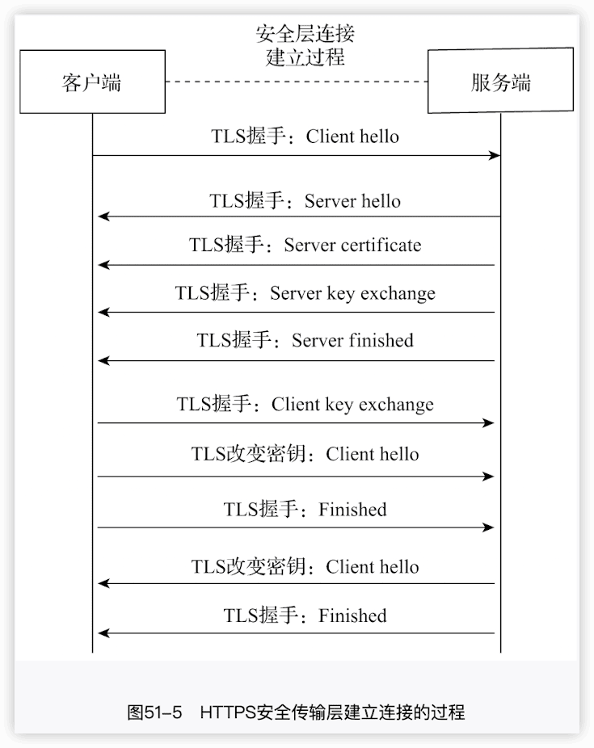

安全传输层建立è¿æ¥çš„过程也称为**“æ¡æ‰‹é˜¶æ®µâ€ï¼ˆhandshake）**，涉åŠå››è½®é€šä¿¡ï¼š

1. ClientHello（客户端 → æœåŠ¡ç«¯ï¼‰

   客户端å‘æœåŠ¡ç«¯å‘出建立安全层传输è¿æ¥ï¼Œæ„建加密通信通é“的请求。在这个请求中，客户端会å‘æœåŠ¡ç«¯æ供本地最新TLS版本ã€æ”¯æŒçš„加密算法组åˆçš„集åˆï¼ˆæ¯”如上é¢curl示例所建立的安全层传输会è¯æœ€ç»ˆé€‰æ‹©çš„ECDHE-RSA-AES128-GCM-SHA256组åˆï¼‰ä»¥åŠéšæœºæ•°ç­‰ã€‚

2. ServerHello & Server certificate &ServerKeyExchange（æœåŠ¡ç«¯ → 客户端）

   这一轮通信分为三个é‡è¦æ­¥éª¤ã€‚

   - 第一步，æœåŠ¡ç«¯æ”¶åˆ°å®¢æˆ·ç«¯å‘过æ¥çš„ClientHello请求å，用客户端å‘æ¥çš„ä¿¡æ¯ä¸è‡ªå·±æœ¬åœ°æ”¯æŒçš„TLS版本ã€åŠ å¯†ç®—法组åˆçš„集åˆåšæ¯”较，选出一个TLS版本和一个åˆé€‚的加密算法组åˆï¼Œç„¶å生æˆä¸€ä¸ªéšæœºæ•°ï¼Œä¸€èµ·æ‰“包到ServerHello中返å›ç»™å®¢æˆ·ç«¯ã€‚

   - 第二步，æœåŠ¡å™¨ä¼šå°†è‡ªå·±çš„æœåŠ¡ç«¯å…¬é’¥è¯ä¹¦å‘é€ç»™å®¢æˆ·ç«¯ï¼ˆServer certificate），这个æœåŠ¡ç«¯å…¬é’¥è¯ä¹¦èº«å…¼ä¸¤å¤§èŒè´£ï¼šå®¢æˆ·ç«¯å¯¹æœåŠ¡ç«¯èº«ä»½çš„验è¯ä»¥åŠåç»­åŒæ–¹ä¼šè¯å¯†é’¥çš„å商和生æˆã€‚

     如æœæœåŠ¡ç«¯è¦éªŒè¯å®¢æˆ·ç«¯èº«ä»½ï¼ˆå¯é€‰çš„），那么这里æœåŠ¡ç«¯è¿˜ä¼šå‘é€ä¸€ä¸ªCertificateRequest的请求给客户端，è¦æ±‚对客户端的公钥è¯ä¹¦è¿›è¡ŒéªŒè¯ã€‚

   - 第三步，å‘é€å¼€å¯åŒæ–¹ä¼šè¯å¯†é’¥å商的请求（ServerKeyExchange）。相比é对称加密算法，对称加密算法的性能è¦é«˜å‡ºå‡ ä¸ªæ•°é‡çº§ï¼Œå› æ­¤HTTPS在开始真正传输应用层的用户数æ®ä¹‹å‰ï¼Œé€‰æ‹©äº†åœ¨é对称加密算法的帮助下å商一个基äºå¯¹ç§°åŠ å¯†ç®—法的密钥。在密钥å商ç¯èŠ‚，通常会使用到Diffie-Hellman（DH）密钥交æ¢ç®—法，这是一ç§å¯†é’¥å商的å议，支æŒé€šä¿¡åŒæ–¹åœ¨ä¸å®‰å…¨çš„通é“上生æˆå¯¹ç§°åŠ å¯†ç®—法所需的共享密钥。因此，在这个步骤的请求中，æœåŠ¡ç«¯ä¼šå‘客户端å‘é€å¯†é’¥äº¤æ¢ç®—法的相关å‚æ•°ä¿¡æ¯ã€‚

   - 最å，æœåŠ¡ç«¯ä»¥Server Finished（åˆç§°ä¸ºServerDone）作为该轮通信的结æŸæ ‡å¿—。

3. ClientKeyExchange & ClientChangeCipher & Finished （客户端 → æœåŠ¡ç«¯ï¼‰

   客户端在收到æœåŠ¡ç«¯çš„公钥è¯ä¹¦å会对æœåŠ¡ç«¯çš„身份进行验è¯ï¼ˆå½“然也å¯ä»¥é€‰æ‹©ä¸éªŒè¯ï¼‰ï¼Œå¦‚æœéªŒè¯å¤±è´¥ï¼Œåˆ™æ­¤æ¬¡å®‰å…¨ä¼ è¾“层è¿æ¥å»ºç«‹å°±ä¼šä»¥å¤±è´¥å‘Šç»ˆã€‚

   如æœéªŒè¯é€šè¿‡ï¼Œé‚£ä¹ˆå®¢æˆ·ç«¯å°†ä»è¯ä¹¦ä¸­æå–出æœåŠ¡ç«¯çš„公钥，用äºåŠ å¯†åç»­å商密钥时å‘é€ç»™æœåŠ¡ç«¯çš„ä¿¡æ¯ã€‚

   如æœæœåŠ¡ç«¯è¦æ±‚对客户端进行身份验è¯ï¼ˆæ¥åˆ°æœåŠ¡ç«¯å‘é€çš„CertificateRequest请求），那么客户端还需通过ClientCertificate将自己的公钥è¯ä¹¦å‘é€ç»™æœåŠ¡ç«¯è¿›è¡ŒéªŒè¯ã€‚

   收到æœåŠ¡ç«¯å¯¹ç§°åŠ å¯†å…±äº«å¯†é’¥å商的请求å，客户端根æ®ä¹‹å‰çš„éšæœºæ•°ã€ç¡®å®šçš„加密算法组åˆä»¥åŠæœåŠ¡ç«¯å‘æ¥çš„å‚数计算出最终的会è¯å¯†é’¥ï¼Œç„¶åå°†æœåŠ¡ç«¯å•ç‹¬è®¡ç®—出会è¯å¯†é’¥æ‰€éœ€çš„ä¿¡æ¯ç”¨æœåŠ¡ç«¯çš„公钥加密å以ClientKeyExchange请求å‘é€ç»™æœåŠ¡ç«¯ã€‚

   éšå客户端用ClientChangeCipher通知æœåŠ¡ç«¯ä»ç°åœ¨å¼€å§‹å‘é€çš„消æ¯éƒ½æ˜¯åŠ å¯†è¿‡çš„。

   最å，伴éšç€ClientChangeCipher消æ¯ï¼Œæ€»ä¼šæœ‰ä¸€ä¸ªFinished消æ¯æ¥éªŒè¯åŒæ–¹çš„对称加密共享密钥å商是å¦æˆåŠŸã€‚其验è¯çš„方法就是通过å商好的新共享密钥和对称加密算法对一段特定内容进行加密，并以æœåŠ¡ç«¯æ˜¯å¦èƒ½å¤Ÿæ­£ç¡®è§£å¯†è¯¥è¯·æ±‚报文作为密钥å商æˆåŠŸä¸å¦çš„判定标准。而被加密的这段特定内容包å«çš„是è¿æ¥è‡³ä»Šçš„全部报文内容。Finished报文作为该轮通信的结æŸæ ‡å¿—，也是客户端å‘出的第一æ¡ä½¿ç”¨å商密钥加密的信æ¯ã€‚

4. ServerChangeCipher & Finished（æœåŠ¡ç«¯ → 客户端）

   æœåŠ¡ç«¯æ”¶åˆ°å®¢æˆ·ç«¯å‘过æ¥çš„ClientKeyExchange中的å‚æ•°å，也将å•ç‹¬è®¡ç®—出会è¯å¯†é’¥ã€‚之å和客户端一样，æœåŠ¡ç«¯ç”¨ServerChangeCipher通知客户端ä»ç°åœ¨å¼€å§‹å‘é€çš„消æ¯éƒ½æ˜¯åŠ å¯†è¿‡çš„。

   最å，æœåŠ¡ç«¯ç”¨ä¸€ä¸ªFinished消æ¯è·Ÿåœ¨ServerChangeCipheråé¢ï¼Œæ—¢ç”¨äºæ ‡è¯†è¯¥è½®æ¡æ‰‹ç»“æŸï¼Œä¹Ÿç”¨äºéªŒè¯å¯¹æ–¹è®¡ç®—出æ¥çš„共享密钥是å¦æœ‰æ•ˆã€‚这也是æœåŠ¡ç«¯å‘出的第一æ¡ä½¿ç”¨å商密钥加密的信æ¯ã€‚

   一旦HTTPS安全传输层的è¿æ¥æˆåŠŸå»ºç«‹èµ·æ¥ï¼Œåç»­åŒæ–¹é€šä¿¡çš„内容（应用层的HTTPå议）就会在一个ç»è¿‡åŠ å¯†å¤„ç†çš„安全通é“中得以传输。

### 64.3 é对称加密和公钥è¯ä¹¦ 🔖

在上é¢HTTPS安全传输层è¿æ¥çš„建立过程中，æœåŠ¡ç«¯çš„公钥è¯ä¹¦åœ¨éªŒè¯æœåŠ¡ç«¯èº«ä»½ä»¥åŠè¾…助对称加密算法共享密钥的å商和生æˆæ–¹é¢èµ·åˆ°äº†å…³é”®ä½œç”¨ã€‚

公钥è¯ä¹¦ï¼ˆpublic-key certificate）是é对称加密体系的é‡è¦å†…容。所谓é对称加密体系，åˆç§°å…¬é’¥åŠ å¯†ä½“系，是和我们熟知的对称加密体系相对的，两者的对比è§å›¾51-6。

ä»å›¾51-6中我们看到：对称加密指的是通信åŒæ–¹ä½¿ç”¨ä¸€ä¸ªå…±äº«å¯†é’¥ï¼Œè¯¥å¯†é’¥æ—¢ç”¨äºä¼ è¾“æ•°æ®çš„加密（å‘é€æ–¹ï¼‰ï¼Œä¹Ÿç”¨äºæ•°æ®çš„解密（æ¥æ”¶æ–¹ï¼‰ï¼›è€Œé对称加密则指通信的æ¯ä¸€æ–¹éƒ½æœ‰ä¸¤ä¸ªå¯†é’¥ï¼Œä¸€ä¸ªå…¬é’¥ï¼ˆpublic key），一个ç§é’¥ï¼ˆprivate key）。通信的å‘é€æ–¹ï¼ˆå¦‚图51-6中的A）使用对方（如图51-6中的B）的公钥对数æ®è¿›è¡ŒåŠ å¯†ï¼Œæ•°æ®æ¥æ”¶æ–¹ï¼ˆå¦‚图51-6中B）使用自己的ç§é’¥å¯¹æ•°æ®è¿›è¡Œè§£å¯†ã€‚

对称加密和é对称加密å„有优缺点。

对称加密性能好，但密钥的ä¿å­˜ã€ç®¡ç†å’Œåˆ†å‘存在较大安全é£é™©ï¼›è€Œé对称加密就是为了解决对称加密的密钥分å‘安全éšæ‚£è€Œè®¾è®¡çš„。

在é对称加密体系中，任何å‚ä¸é€šä¿¡çš„一方都有两把密钥，一把是需è¦è‡ªå·±ä¿å­˜å¥½çš„ç§é’¥ï¼Œä¸€æŠŠåˆ™æ˜¯å¯¹å¤–公开的ã€ç”¨äºåŠ å¯†çš„公钥。以图51-6中的A为例，任何想ä¸A通信的å¦ä¸€æ–¹éƒ½å¯ä»¥è·å–到A的公钥，并将通过这把公钥加密的消æ¯å‘ç»™A。A使用自己的ç§é’¥å¯ä»¥å¯¹æ”¶åˆ°çš„消æ¯è¿›è¡Œè§£å¯†ã€‚ç”±äºå…¬é’¥æ˜¯å…¬å¼€çš„，因此其分å‘的安全é£é™©æ˜¾ç„¶è¦æ¯”对称加密ä½å¾ˆå¤šã€‚ä¸è¿‡ï¼Œé对称加密的性能相较äºå¯¹ç§°åŠ å¯†è¦å·®å¾ˆå¤šï¼Œè¿™ä¹Ÿæ˜¯åœ¨å®é™…应用（比如HTTPS的传输安全层）中会将两ç§åŠ å¯†æ–¹å¼ç»“åˆä½¿ç”¨çš„åŸå› ã€‚

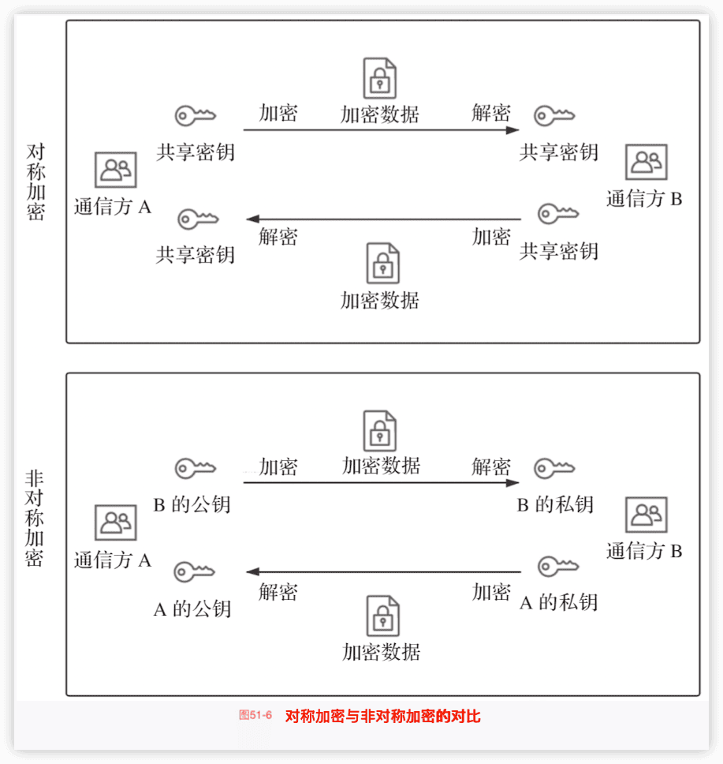

é对称加密体系的公钥是对外公开的，这大大é™ä½äº†å¯†é’¥åˆ†å‘çš„å¤æ‚性。但直æ¥åˆ†å‘公钥信æ¯ä»ç„¶å¯èƒ½å­˜åœ¨å®‰å…¨éšæ‚£ã€‚比如上é¢HTTPSå议安全传输层è¿æ¥å»ºç«‹çš„过程中，如何ä¿è¯HTTPSæœåŠ¡ç«¯å‘é€ç»™å®¢æˆ·ç«¯çš„公钥信æ¯æ²¡æœ‰è¢«ç¯¡æ”¹å‘¢ï¼Ÿæˆ‘们也看到了HTTPS建立è¿æ¥çš„过程并éç›´æ¥ä¼ è¾“公钥信æ¯ï¼Œè€Œæ˜¯ä½¿ç”¨æºå¸¦å…¬é’¥ä¿¡æ¯çš„æ•°å­—è¯ä¹¦æ¥ä¿è¯å…¬é’¥ä¿¡æ¯çš„正确性和完整性。

==æ•°å­—è¯ä¹¦==，被称为互è”网上的“身份è¯â€ï¼Œç”¨äºå”¯ä¸€æ ‡è¯†ç½‘络上的一个域å地å€æˆ–一å°æœåŠ¡å™¨ä¸»æœºï¼Œè¿™å°±å¥½æ¯”我们日常生活中使用的“居民身份è¯â€ï¼Œç”¨äºå”¯ä¸€æ ‡è¯†ä¸€ä¸ªå…¬æ°‘。æœåŠ¡ç«¯å°†åŒ…å«å…¬é’¥ä¿¡æ¯çš„æ•°å­—è¯ä¹¦ä¼ è¾“给客户端，客户端如何校验这个è¯ä¹¦çš„真伪呢？我们知é“居民身份è¯æ˜¯ç”±å›½å®¶ç»Ÿä¸€åˆ¶ä½œå’Œé¢å‘的，个体公民å‘户å£æ‰€åœ¨åœ°å…¬å®‰æœºå…³ç”³è¯·åŠç†ã€‚åªæœ‰å›½å®¶é¢å‘的身份è¯æ‰æ˜¯å…·æœ‰æ³•å¾‹æ•ˆåŠ›çš„，在中国境内这个身份è¯éƒ½æ˜¯æœ‰æ•ˆå’Œå¯è¢«æ¥çº³çš„。大悦åŸçš„会员å¡ä¹Ÿæ˜¯ä¸€ç§èº«ä»½æ ‡è¯†ï¼Œä½†ä½ ä¸èƒ½ç”¨å®ƒå»ä¹°æœºç¥¨ï¼Œå› ä¸ºèˆªç©ºå…¬å¸ä¸è®¤å¤§æ‚¦åŸçš„会员å¡ï¼Œåªè®¤å±…民身份è¯ã€‚网站的è¯ä¹¦ä¹Ÿæ˜¯åŒæ ·çš„é“ç†ã€‚一般æ¥è¯´ï¼Œæ•°å­—è¯ä¹¦æ˜¯ä»å—ä¿¡çš„æƒå¨è¯ä¹¦æˆæƒæœºæ„（CA）买æ¥çš„，当然也有å…费的。一般æµè§ˆå™¨æˆ–æ“作系统在出å‚时就内置了诸多知åCA（如Verisignã€GoDaddyã€CNNIC等）的公钥数字è¯ä¹¦ï¼Œè¿™äº›CA的公钥è¯ä¹¦å¯ä»¥ç”¨äºéªŒè¯è¿™äº›CA机æ„为网站é¢å‘的公钥è¯ä¹¦ã€‚对äºè¿™äº›å†…ç½®CA公钥è¯ä¹¦æ— æ³•è¯†åˆ«çš„è¯ä¹¦ï¼Œæµè§ˆå™¨å°±ä¼šæŠ¥é”™ï¼Œå°±åƒä¸Šé¢Chromeæµè§ˆå™¨é’ˆå¯¹æˆ‘们的那个自签åè¯ä¹¦æŠ¥é”™é‚£æ ·ã€‚

那么CA的公钥è¯ä¹¦æ˜¯å¦‚何校验æœåŠ¡ç«¯å…¬é’¥è¯ä¹¦çš„有效性的呢？这就涉åŠæ•°å­—公钥è¯ä¹¦åˆ°åº•æ˜¯ä»€ä¹ˆçš„问题了。

我们å¯ä»¥é€šè¿‡æµè§ˆå™¨ä¸­çš„“HTTPS/SSLè¯ä¹¦ç®¡ç†â€æ¥æŸ¥çœ‹è¯ä¹¦çš„内容。一般公钥è¯ä¹¦éƒ½ä¼šåŒ…å«ç«™ç‚¹çš„å称ã€ä¸»æœºåã€å…¬é’¥ã€è¯ä¹¦ç­¾å‘机æ„（CA）å称和æ¥è‡ªç­¾å‘机æ„çš„ç­¾å等。我们é‡ç‚¹å…³æ³¨æ¥è‡ªç­¾å‘机æ„çš„ç­¾å，因为对äºå…¬é’¥è¯ä¹¦çš„校验方法就是使用本地CA公钥è¯ä¹¦æ¥éªŒè¯æ¥è‡ªé€šä¿¡å¯¹ç«¯çš„公钥è¯ä¹¦ä¸­çš„ç­¾å是ä¸æ˜¯è¿™ä¸ªCA签的。

下é¢å°±æ¥çœ‹çœ‹å…¬é’¥è¯ä¹¦çš„申请ä¸æ ¡éªŒè¿‡ç¨‹ï¼Œå¦‚图51-7所示。

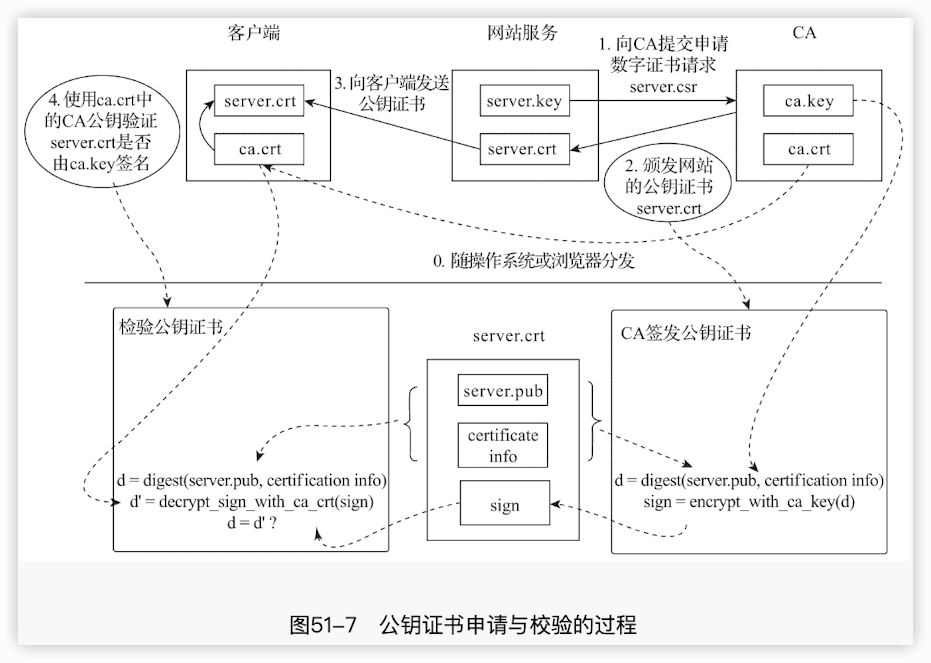


🔖

### 64.4 对æœåŠ¡ç«¯å…¬é’¥è¯ä¹¦çš„校验


### 64.5 对客户端公钥è¯ä¹¦çš„校验


# 补充2

## 65 æŒæ¡å­—符集的åŸç†å’Œå­—符编ç æ–¹æ¡ˆé—´çš„转æ¢

Go语言æºç é»˜è®¤ä½¿ç”¨Unicode字符集，并采用UTF-8ç¼–ç æ–¹æ¡ˆï¼ŒGo还æ供了runeåŸç”Ÿç±»å‹æ¥è¡¨ç¤ºUnicode字符。

### 65.1 字符ä¸å­—符集


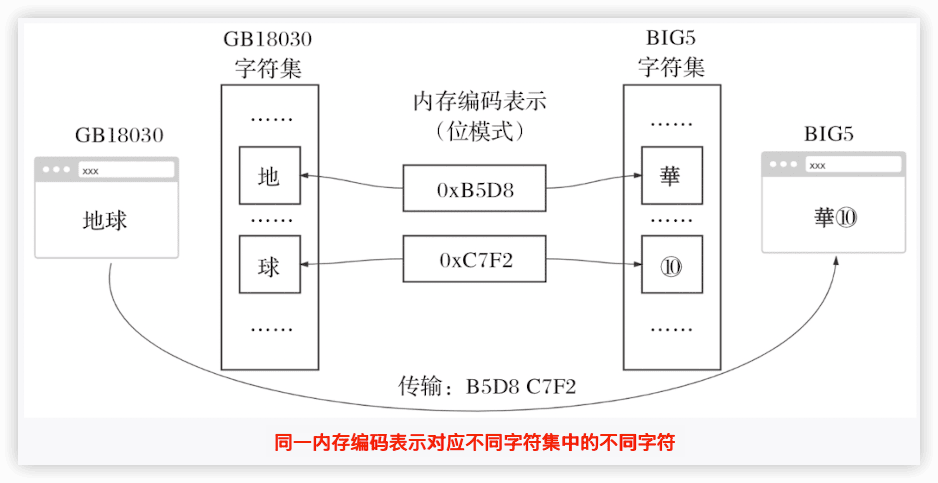


### 65.2 Unicode字符集的è¯ç”Ÿä¸UTF-8ç¼–ç æ–¹æ¡ˆ


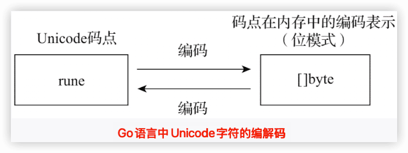


### 65.3 字符编ç æ–¹æ¡ˆé—´çš„转æ¢


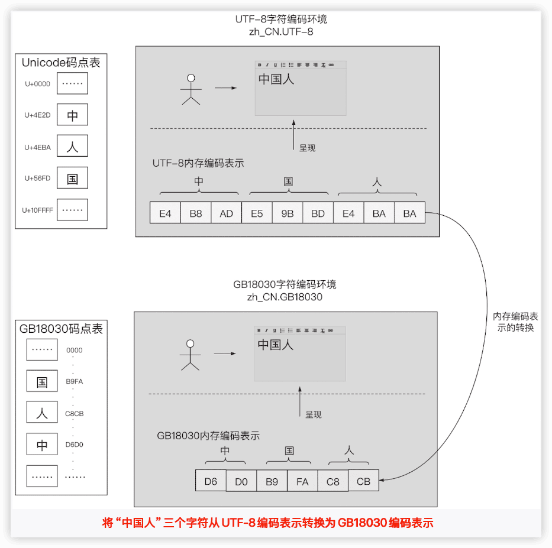


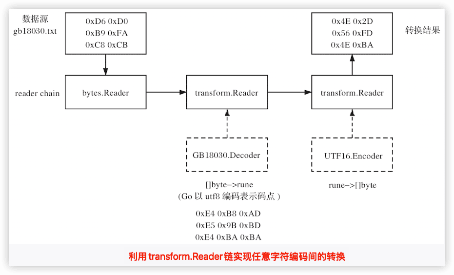


## 66 time包 🔖

常è§çš„时间æ“作有è·å–当å‰æ—¶é—´ã€æ—¶é—´æ¯”较ã€æ—¶åŒºç›¸å…³çš„时间æ“作ã€æ—¶é—´æ ¼å¼åŒ–ã€å®šæ—¶å™¨ï¼ˆä¸€æ¬¡æ€§å®šæ—¶å™¨timerå’Œé‡å¤å®šæ—¶å™¨ticker）的使用等。

### 66.1 时间的基础æ“作

#### 1 è·å–时间

```go
time.Now()
```

time包将Timeç±»å‹ç”¨ä½œå¯¹ä¸€ä¸ª**å³æ—¶æ—¶é—´ï¼ˆtime instant）**的抽象。

```go
type Time struct {
  wall uint64
  ext  int64
  loc *Location
}
```

由三个字段组æˆçš„Time结æ„体è¦åŒæ—¶è¡¨ç¤ºä¸¤ç§æ—¶é—´â€”—==挂钟时间（wall time）==å’Œ==å•è°ƒæ—¶é—´ï¼ˆmonotonic time）==，并且精度级别为纳秒。

闰秒🔖


time.Time结æ„体字段wall的最高比特ä½æ˜¯ä¸€ä¸ªå为`hasMonotonic`çš„**标志比特ä½**。当hasMonotonic被置为1时，time.Time表示的å³æ—¶æ—¶é—´ä¸­æ—¢åŒ…å«æŒ‚钟时间，也包å«å•è°ƒæ—¶é—´ã€‚下图是当TimeåŒæ—¶åŒ…å«è¿™ä¸¤ç§æ—¶é—´è¡¨ç¤ºæ—¶ï¼ˆhasMonotonic比特ä½è¢«ç½®ä¸º1）的åŸç†ç¤ºæ„图（基äºGo 1.14版本）。

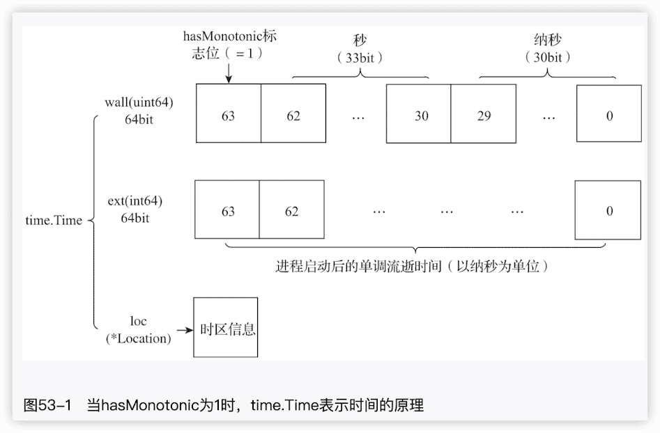

🔖

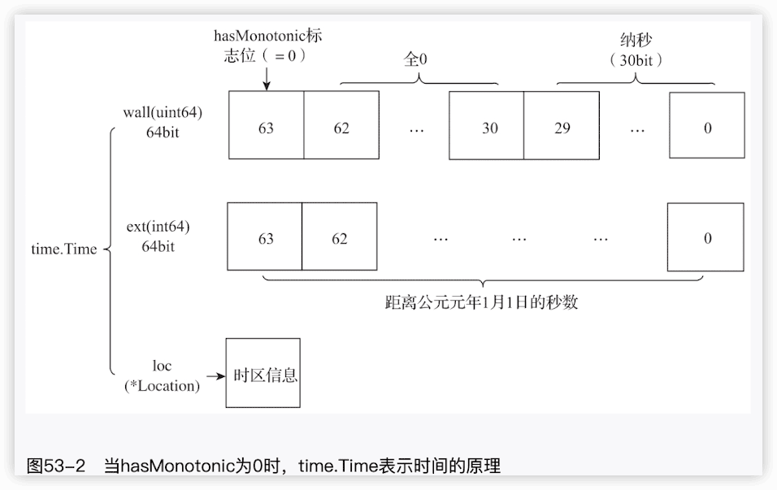


#### 2 è·å–特定时区的当å‰æ—¶é—´


#### 3 时间的比较ä¸è¿ç®—


### 66.2 时间的格å¼åŒ–输出

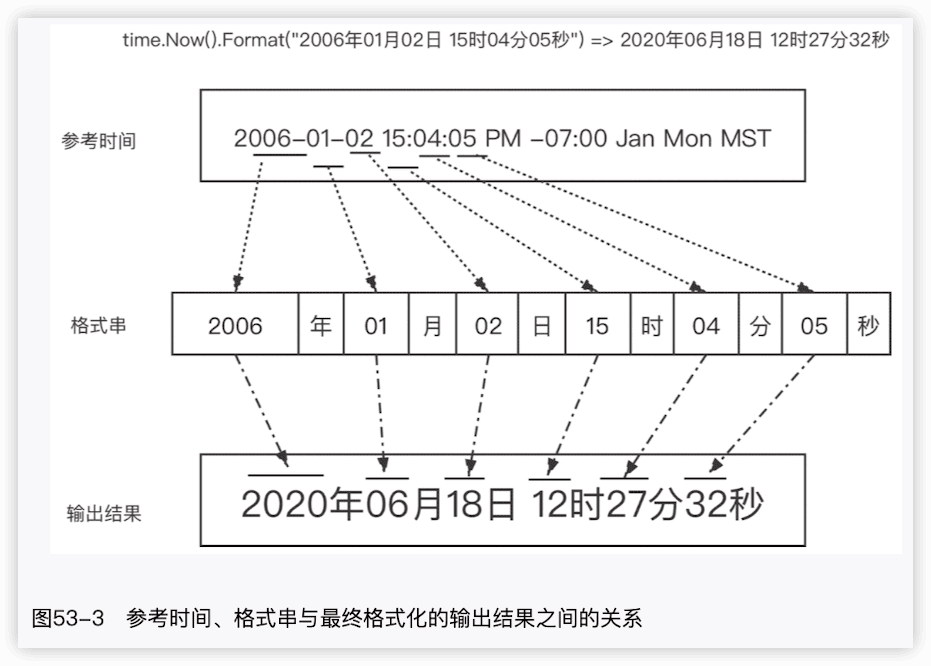


### 66.3 定时器的使用

Timer的三ç§åˆ›å»ºæ–¹å¼ï¼šNewTimerã€AfterFuncå’ŒAfter。

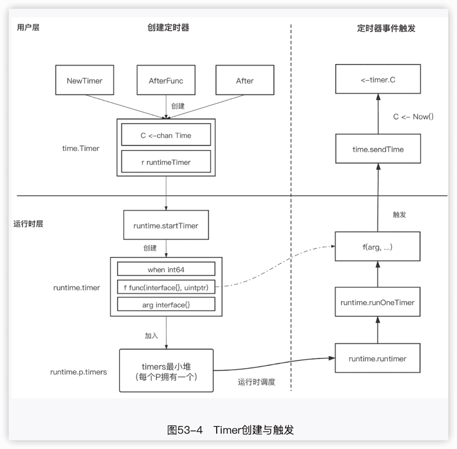


## 67 对系统信å·çš„处ç†

Go多用äºå端应用编程，而å端应用多以守护进程（daemon）的方å¼è¿è¡Œäºæœºå™¨ä¸Šã€‚守护程åºå¯¹å¥å£®æ€§çš„è¦æ±‚甚高，å³ä¾¿æ˜¯åœ¨é€€å‡ºæ—¶ä¹Ÿè¦æ±‚åšå¥½æ”¶å°¾å’Œæ¸…ç†å·¥ä½œï¼Œç§°ä¹‹ä¸º==优雅退出==。在Go中，通过系统信å·æ˜¯å®ç°ä¼˜é›…退出的一ç§å¸¸è§æ‰‹æ®µã€‚

### 67.1 为什么ä¸èƒ½å¿½ç•¥å¯¹ç³»ç»Ÿä¿¡å·çš„处ç†

==系统信å·ï¼ˆsignal）==是一ç§è½¯ä»¶ä¸­æ–­ï¼Œå®ƒæ供了一ç§å¼‚步的事件处ç†æœºåˆ¶ï¼Œç”¨äºæ“作系统内核或其他应用进程通知æŸä¸€åº”用进程å‘生了æŸç§äº‹ä»¶ã€‚

比如：一个在终端å‰å°å¯åŠ¨çš„程åºï¼Œå½“用户按下中断键（一般是ctrl+c）时，该程åºçš„进程将会收到内核å‘æ¥çš„中断信å·ï¼ˆSIGINT）。

```go
func main() {
	var wg sync.WaitGroup
	errChan := make(chan error, 1)
	http.HandleFunc("/", func(w http.ResponseWriter, r *http.Request) {
		fmt.Fprintf(w, "Hello, Singal!\n")
	})
	wg.Add(1)
	go func() {
		defer wg.Done()
		errChan <- http.ListenAndServe(":8080", nil)
	}()

	select {
	case <-time.After(2 * time.Second):
		fmt.Println("web server start ok")
	case err := <-errChan:
		fmt.Printf("web server start failed: %v\n", err)

	}
	wg.Wait()
	fmt.Println("web server shutdown ok")
}
```

```sh
$ go build -o httpserv signal.go
./httpserv
web server start ok
```


应用程åºæ”¶åˆ°ç³»ç»Ÿä¿¡å·å，一般有三ç§å¤„ç†æ–¹å¼ã€‚

1. 执行系统默认处ç†åŠ¨ä½œ

对äºä¸­æ–­é”®è§¦å‘çš„SIGINTä¿¡å·ï¼Œç³»ç»Ÿçš„默认处ç†åŠ¨ä½œæ˜¯ç»ˆæ­¢è¯¥åº”用进程，这是以上示例采用的信å·å¤„ç†æ–¹å¼ï¼Œä¹Ÿæ˜¯ä»¥ä¸Šç¤ºä¾‹æ²¡æœ‰è¾“出退出æ示就退出了的åŸå› ã€‚对äºå¤§å¤šæ•°ç³»ç»Ÿä¿¡å·ï¼Œç³»ç»Ÿé»˜è®¤çš„处ç†åŠ¨ä½œæ˜¯ç»ˆæ­¢è¯¥è¿›ç¨‹ã€‚

2. 忽略信å·

3. æ•æ‰ä¿¡å·å¹¶æ‰§è¡Œè‡ªå®šä¹‰å¤„ç†åŠ¨ä½œ

å¯ä»¥**预先æ供一个包å«è‡ªå®šä¹‰å¤„ç†åŠ¨ä½œçš„函数**，并告知系统在æ¥æ”¶åˆ°æŸäº›ä¿¡å·æ—¶è°ƒç”¨è¿™ä¸ªå‡½æ•°ã€‚系统中有两个系统信å·æ˜¯ä¸èƒ½è¢«æ•æ‰çš„：终止程åºä¿¡å·SIGKILL和挂起程åºä¿¡å·SIGSTOP。

**æœåŠ¡ç«¯ç¨‹åº**一般都是以**守护进程**çš„å½¢å¼è¿è¡Œåœ¨åå°çš„，并且一般都是通过系统信å·é€šçŸ¥è¿™äº›å®ˆæŠ¤ç¨‹åºæ‰§è¡Œé€€å‡ºæ“作的。

在这样的情况下，如æœé€‰æ‹©ä»¥ç³»ç»Ÿé»˜è®¤å¤„ç†æ–¹å¼å¤„ç†è¿™äº›é€€å‡ºé€šçŸ¥ä¿¡å·ï¼Œé‚£ä¹ˆå®ˆæŠ¤è¿›ç¨‹å°†ä¼šè¢«ç›´æ¥æ€æ­»ï¼Œæ²¡æœ‰ä»»ä½•æœºä¼šæ‰§è¡Œæ¸…ç†å’Œæ”¶å°¾å·¥ä½œï¼Œæ¯”如：**等待尚未处ç†å®Œçš„事务执行完毕，将未ä¿å­˜çš„æ•°æ®å¼ºåˆ¶è½ç›˜ï¼Œå°†æŸäº›å°šæœªå¤„ç†çš„消æ¯åºåˆ—化到ç£ç›˜ï¼ˆç­‰ä¸‹æ¬¡å¯åŠ¨å处ç†ï¼‰**等。这将导致æŸäº›å¤„ç†è¿‡ç¨‹è¢«å¼ºåˆ¶ä¸­æ–­è€Œä¸¢å¤±æ¶ˆæ¯ï¼Œç•™ä¸‹æ— æ³•æ¢å¤çš„ç°åœºï¼Œå¯¼è‡´æ¶ˆæ¯è¢«ç ´å，甚至会影å“下次应用的å¯åŠ¨è¿è¡Œã€‚

因此，对äºè¿è¡Œåœ¨ç”Ÿäº§ç¯å¢ƒä¸‹çš„程åºï¼Œä¸è¦å¿½ç•¥å¯¹ç³»ç»Ÿä¿¡å·çš„处ç†ï¼Œ**而应采用æ•æ‰é€€å‡ºä¿¡å·çš„æ–¹å¼æ‰§è¡Œè‡ªå®šä¹‰çš„收尾处ç†å‡½æ•°**。

### 67.2 Go语言对系统信å·å¤„ç†çš„支æŒ

**ä¿¡å·æœºåˆ¶**çš„å†å²ä¹…远，早在最åˆçš„Unix系统版本上就能看到它的身影。信å·æœºåˆ¶ä¹Ÿä¸€ç›´åœ¨æ¼”进，ä»æœ€åˆçš„**ä¸å¯é ä¿¡å·æœºåˆ¶**到åæ¥çš„**å¯é ä¿¡å·æœºåˆ¶**，直到POSIX.1将其标准化，系统信å·æœºåˆ¶æ‰ç¨³å®šä¸‹æ¥ï¼Œä½†å„个平å°å¯¹ä¿¡å·æœºåˆ¶çš„支æŒä»æœ‰å·®å¼‚。å¯ä»¥é€šè¿‡`kill -l`命令查看å„个系统对信å·çš„支æŒæƒ…况：

```sh
// Ubuntu 18.04
$kill -l
1) SIGHUP        2) SIGINT          3) SIGQUIT        4) SIGILL         5) SIGTRAP
6) SIGABRT       7) SIGBUS          8) SIGFPE         9) SIGKILL       10) SIGUSR1
11) SIGSEGV      12) SIGUSR2        13) SIGPIPE       14) SIGALRM       15) SIGTERM
16) SIGSTKFLT    17) SIGCHLD        18) SIGCONT       19) SIGSTOP       20) SIGTSTP
21) SIGTTIN      22) SIGTTOU        23) SIGURG        24) SIGXCPU       25) SIGXFSZ
26) SIGVTALRM    27) SIGPROF        28) SIGWINCH      29) SIGIO         30) SIGPWR
31) SIGSYS       34) SIGRTMIN       35) SIGRTMIN+1    36) SIGRTMIN+2    37) SIGRTMIN+3
38) SIGRTMIN+4   39) SIGRTMIN+5     40) SIGRTMIN+6    41) SIGRTMIN+7    42) SIGRTMIN+8
43) SIGRTMIN+9   44) SIGRTMIN+10    45) SIGRTMIN+11   46) SIGRTMIN+12   47) SIGRTMIN+13
48) SIGRTMIN+14  49) SIGRTMIN+15    50) SIGRTMAX-14   51) SIGRTMAX-13   52) SIGRTMAX-12
53) SIGRTMAX-11  54) SIGRTMAX-10    55) SIGRTMAX-9    56) SIGRTMAX-8    57) SIGRTMAX-7
58) SIGRTMAX-6   59) SIGRTMAX-5     60) SIGRTMAX-4    61) SIGRTMAX-3    62) SIGRTMAX-2
63) SIGRTMAX-1   64) SIGRTMAX   

// macOS 10.14.6
$kill -l
HUP INT QUIT ILL TRAP ABRT EMT FPE KILL BUS SEGV SYS PIPE ALRM TERM URG STOP TSTP CONT CHLD TTIN TTOU IO XCPU XFSZ VTALRM PROF WINCH INFO USR1 USR2
```

其中æ¯ä¸ªä¿¡å·éƒ½åŒ…å«**ä¿¡å·å称**（signal name，比如：SIGINT）和**ä¿¡å·ç¼–å·**（signal number，比如：SIGINTçš„ç¼–å·æ˜¯2）。

kill命令å¯ä»¥å°†ç‰¹å®šä¿¡å·ï¼ˆé€šè¿‡ä¿¡å·å称或信å·ç¼–å·ï¼‰å‘é€ç»™æŸåº”用进程：

```sh
$kill -s signal_name pid // 如kill -s SIGINT 20023
$kill -signal_number pid // 如kill -2 20023
```

ä¿¡å·æœºåˆ¶ç»è¿‡å¤šå¹´æ¼”进，已ç»å˜å¾—å分å¤æ‚和烦ç（考虑多ç§å¹³å°å¯¹æ ‡å‡†çš„支æŒç¨‹åº¦ä¸ä¸€ï¼‰ï¼Œæ¯”如ä¸å¯é ä¿¡å·ã€å¯é ä¿¡å·ã€é˜»å¡ä¿¡å·ã€ä¿¡å·å¤„ç†å‡½æ•°çš„å¯é‡å…¥ç­‰ã€‚如æœè®©å¼€å‘人员自己æ¥å¤„ç†è¿™äº›å¤æ‚性，那么势必是一份ä¸å°çš„心智负担。Go语言将这些å¤æ‚性留给了è¿è¡Œæ—¶å±‚，为用户层æ供了体验相当å‹å¥½æ¥å£â€”—`os/signal`包。

```go
func Notify(c chan<- os.Signal, sig ...os.Signal)
```

该函数用æ¥è®¾ç½®æ•æ‰é‚£äº›åº”用关注的系统信å·ï¼Œå¹¶åœ¨Goè¿è¡Œæ—¶å±‚ä¸Go用户层之间用一个channel相è¿ã€‚Goè¿è¡Œæ—¶æ•æ‰åˆ°åº”用关注的信å·å，会将信å·å†™å…¥channel，这样监å¬è¯¥channel的用户层代ç ä¾¿å¯æ”¶åˆ°è¯¥ä¿¡å·é€šçŸ¥ã€‚下图形象地展示了Goè¿è¡Œæ—¶è¿›è¡Œç³»ç»Ÿä¿¡å·å¤„ç†ä»¥åŠä¸ç”¨æˆ·å±‚交互的åŸç†ã€‚

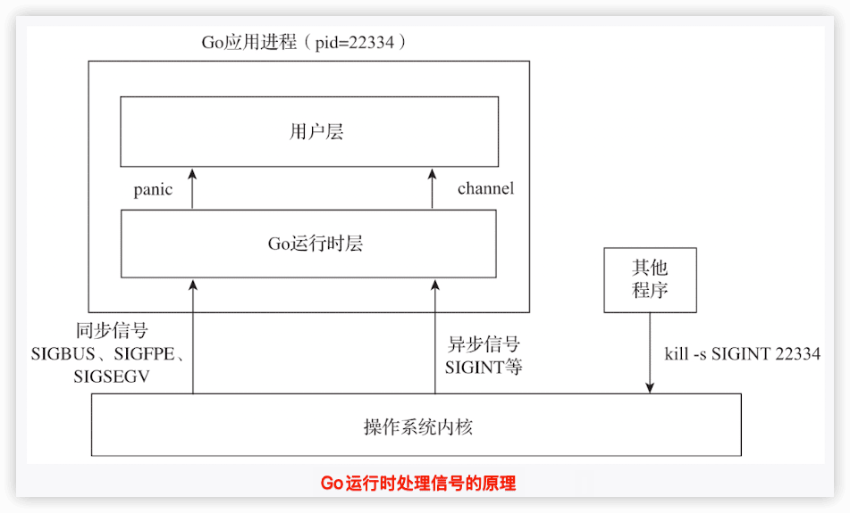

Goè¿è¡Œæ—¶ä¸ç”¨æˆ·å±‚有两个交互点，一个是上é¢æ‰€è¯´çš„承载信å·äº¤äº’çš„channel，而å¦ä¸€ä¸ªåˆ™æ˜¯è¿è¡Œæ—¶å±‚引å‘çš„panic。

Go将信å·åˆ†ä¸ºä¸¤å¤§ç±»ï¼š

1. åŒæ­¥ä¿¡å·

   åŒæ­¥ä¿¡å·æ˜¯æŒ‡é‚£äº›ç”±**程åºæ‰§è¡Œé”™è¯¯**引å‘çš„ä¿¡å·ï¼ŒåŒ…括SIGBUS（总线错误/硬件异常）ã€SIGFPE（算术异常）和SIGSEGV（段错误/无效内存引用）。一旦应用进程中的Goè¿è¡Œæ—¶æ”¶åˆ°è¿™ä¸‰ä¸ªä¿¡å·ä¸­çš„一个，æ„味ç€åº”用æ大å¯èƒ½å‡ºç°äº†ä¸¥é‡bug，无法继续执行下å»ï¼Œè¿™æ—¶Goè¿è¡Œæ—¶ä¸ä¼šç®€å•åœ°å°†ä¿¡å·é€šè¿‡channelå‘é€åˆ°ç”¨æˆ·å±‚并等待用户层的异步处ç†ï¼Œè€Œæ˜¯ç›´æ¥å°†ä¿¡å·è½¬æ¢æˆä¸€ä¸ªè¿è¡Œæ—¶panic并抛出。如æœç”¨æˆ·å±‚没有专门的panicæ¢å¤ä»£ç ï¼Œé‚£ä¹ˆGo应用将默认异常退出。

2. 异步信å·

   åŒæ­¥ä¿¡å·ä¹‹å¤–çš„ä¿¡å·éƒ½è¢«Go划归为异步信å·ã€‚异步信å·ä¸æ˜¯ç”±ç¨‹åºæ‰§è¡Œé”™è¯¯å¼•èµ·çš„，而是由**其他程åºæˆ–æ“作系统内核**å‘出的。异步信å·çš„默认处ç†è¡Œä¸ºå› ä¿¡å·è€Œå¼‚。

   SIGHUPã€SIGINTå’ŒSIGTERM这三个信å·å°†å¯¼è‡´ç¨‹åºç›´æ¥é€€å‡ºï¼›

   SIGQUITã€SIGILLã€SIGTRAPã€SIGABRTã€SIGSTKFLTã€SIGEMTå’ŒSIGSYS在导致程åºé€€å‡ºçš„åŒæ—¶ï¼Œè¿˜ä¼šå°†ç¨‹åºé€€å‡ºæ—¶çš„栈状æ€æ‰“å°å‡ºæ¥ï¼›

   SIGPROFä¿¡å·åˆ™æ˜¯è¢«Goè¿è¡Œæ—¶ç”¨äºå®ç°**è¿è¡Œæ—¶CPU性能剖æ指标采集**。

   其他信å·ä¸å¸¸ç”¨ï¼Œå‡é‡‡ç”¨æ“作系统的默认处ç†åŠ¨ä½œã€‚对äºç”¨æˆ·å±‚通过Notify函数æ•è·çš„ä¿¡å·ï¼ŒGoè¿è¡Œæ—¶åˆ™é€šè¿‡channel将信å·å‘给用户层。

Notify无法æ•æ‰SIGKILLå’ŒSIGSTOP（æ“作系统机制决定的），也无法æ•æ‰åŒæ­¥ä¿¡å·ï¼ˆGoè¿è¡Œæ—¶å†³å®šçš„），åªæœ‰æ•æ‰å¼‚步信å·æ‰æ˜¯æœ‰æ„义的。下é¢çš„例å­ç›´è§‚展示了无法被æ•è·çš„ä¿¡å·ã€åŒæ­¥ä¿¡å·åŠå¼‚步信å·çš„è¿ä½œæœºåˆ¶ï¼š

```go
package main

import (
	"fmt"
	"os"
	"os/signal"
	"sync"
	"syscall"
	"time"
)

// 直观展示了无法被æ•è·çš„ä¿¡å·ã€åŒæ­¥ä¿¡å·åŠå¼‚步信å·çš„è¿ä½œæœºåˆ¶

func catchAsyncSignal(c chan os.Signal) {
	for {
		s := <-c
		fmt.Println("收到异步信å·:", s)
	}
}

func triggerSyncSignal() {
	time.Sleep(3 * time.Second)
	defer func() {
		if e := recover(); e != nil {
			fmt.Println("æ¢å¤panic:", e)
			return
		}
	}()
	var a, b = 1, 0
	fmt.Println(a / b)
}

func main() {
	var wg sync.WaitGroup
	c := make(chan os.Signal, 1)
	signal.Notify(c, syscall.SIGFPE, syscall.SIGINT, syscall.SIGKILL)

	wg.Add(2)
	go func() {
		catchAsyncSignal(c)
		wg.Done()
	}()

	go func() {
		triggerSyncSignal()
		wg.Done()
	}()

	wg.Wait()
}
```

🔖


如æœå¤šæ¬¡è°ƒç”¨Notify拦截æŸä¿¡å·ï¼Œä½†æ¯æ¬¡è°ƒç”¨ä½¿ç”¨çš„channelä¸åŒï¼Œé‚£ä¹ˆå½“应用进程收到异步信å·æ—¶ï¼ŒGoè¿è¡Œæ—¶ä¼šç»™æ¯ä¸ªchannelå‘é€ä¸€ä»½å¼‚步信å·å‰¯æœ¬ï¼š

```
```

🔖


### 67.3 使用系统信å·å®ç°ç¨‹åºçš„优雅退出

**==优雅退出（gracefully exit）==**指程åºåœ¨é€€å‡ºå‰æœ‰æœºä¼šç­‰å¾…尚未完æˆçš„事务处ç†ã€æ¸…ç†èµ„æºï¼ˆæ¯”如关闭文件æ述符ã€å…³é—­socket）ã€ä¿å­˜å¿…è¦ä¸­é—´çŠ¶æ€ã€æŒä¹…化内存数æ®ï¼ˆæ¯”如将内存中的数æ®è½ç›˜åˆ°æ–‡ä»¶ä¸­ï¼‰ç­‰ã€‚

ä¸ä¼˜é›…退出对立的是==强制退出==，也就是常说的使用kill -9，å³kill -s SIGKILL pid。

🔖


## 68 ç†è§£æ ‡å‡†åº“的读写模å‹

Go标准库读写模å‹

Go基äºio.Writerå’Œio.Reader这两个简å•çš„æ¥å£ç±»å‹æ„建了下图所示的Go标准库读写模å‹ã€‚


### ç›´æ¥è¯»å†™å­—节åºåˆ—


### ç›´æ¥è¯»å†™æŠ½è±¡æ•°æ®ç±»å‹å®ä¾‹


### 通过包裹类å‹è¯»å†™æ•°æ®


## 69 æŒæ¡unsafe包的安全使用模å¼

C语言是一门é™æ€ç±»å‹è¯­è¨€ï¼Œ**但它å´ä¸æ˜¯ç±»å‹å®‰å…¨çš„语言**，å¯ä»¥é€šè¿‡åˆæ³•çš„语法轻易“刺é€â€å…¶==ç±»å‹ç³»ç»Ÿ==：

```c
int main() {
    int a = 0x12345678;
    unsigned char *p = (unsigned char *)&a;
    printf("0x%x\n", a);
    *p = 0x23;
    *(p + 1) = 0x45;
    *(p+2) = 0x67;
    *(p+3) = 0x8a;
    printf("0x%x\n", a); // 0x8a674523 (注：在å°ç«¯å­—节åºç³»ç»Ÿä¸­è¾“出此值)
}
```

åŸæœ¬è¢«è§£é‡Šæˆintç±»å‹çš„一段内存数æ®ï¼ˆåœ°å€ä¸º&a）被é‡æ–°è§£é‡Šæˆäº†unsigned charç±»å‹æ•°ç»„并å¯è¢«ä»»æ„修改。

但在Go语言中，无法通过**常规语法手段**ç©¿é€Go在类å‹ç³»ç»Ÿå±‚é¢å¯¹å†…存数æ®çš„ä¿æŠ¤çš„:

```go
func main() {
	a := 0x12345678
	fmt.Printf("%x\n", a)

	var p *byte = (*byte)(&a) // 错误ï¼ä¸å…许将&aä»*intç±»å‹æ˜¾å¼è½¬å‹ä¸º*byteç±»å‹

	*p = 0x23
	var b byte = byte(a)    // b是一个新å˜é‡ï¼Œæœ‰è‡ªå·±æ‰€è§£é‡Šçš„内存空间
	b = 0x23                // å³ä¾¿å¼ºåˆ¶è¿›è¡Œç±»å‹è½¬æ¢ï¼ŒåŸå˜é‡a所解释的内存空间的数æ®ä¾ç„¶ä¸å˜
	fmt.Printf("0x%x\n", b) // 0x23
	fmt.Printf("0x%x\n", a) // 0x12345678
}
```

ä¸C语言相比，**Go在常规æ“作下是类å‹å®‰å…¨çš„**（注：并éç»å¯¹çš„ç±»å‹å®‰å…¨ï¼Œç»å¯¹çš„ç±»å‹å®‰å…¨éœ€è¦åœ¨æ•°å­¦ä¸Šçš„å½¢å¼åŒ–è¯æ˜ï¼‰ã€‚

所谓==ç±»å‹å®‰å…¨==是指一å—内存数æ®ä¸€æ—¦è¢«ç‰¹å®šçš„ç±»å‹æ‰€è§£é‡Šï¼ˆè¯¥å†…存数æ®ä¸è¯¥ç±»å‹å˜é‡å»ºç«‹å…³è”，也就是å˜é‡å®šä¹‰ï¼‰ï¼Œå®ƒå°±ä¸èƒ½å†è¢«è§£é‡Šä¸ºå…¶ä»–ç±»å‹ï¼Œä¸èƒ½å†ä¸å…¶ä»–ç±»å‹å˜é‡å»ºç«‹å…³è”。就åƒä¸Šé¢ç¤ºä¾‹ä¸­çš„å˜é‡a，一旦被解释为intç±»å‹ï¼ˆa := 0x12345678），它就ä¸æŸå—内存（起始地å€ä¸º&a，长度为intç±»å‹çš„大å°ï¼‰å»ºç«‹äº†å…³è”，那么这å—内存（&a）就ä¸èƒ½å†ä¸å…¶ä»–ç±»å‹ï¼ˆå¦‚byte）å˜é‡å»ºç«‹å…³è”。

Go语言的类å‹å®‰å…¨æ˜¯å»ºç«‹åœ¨**Go编译器的é™æ€æ£€æŸ¥ä»¥åŠGoè¿è¡Œæ—¶åˆ©ç”¨ç±»å‹ä¿¡æ¯è¿›è¡Œçš„è¿è¡Œæ—¶æ£€æŸ¥**之上的。在语法层é¢ï¼Œä¸ºäº†å®ç°å¸¸è§„æ“作下的类å‹å®‰å…¨ï¼ŒGo对语法åšäº†è¯¸å¤šé™åˆ¶ã€‚

1. 支æŒéšå¼ç±»å‹è½¬æ¢ï¼Œæ‰€æœ‰ç±»å‹è½¬æ¢å¿…须显å¼è¿›è¡Œ

```go
var i int = 17
var j uint64 = i             // 错误：intç±»å‹å€¼ä¸èƒ½ç›´æ¥èµ‹å€¼ç»™uint64ç±»å‹å˜é‡ï¿¼
var j uint64 = uint64(i)         // 没问题
```

åªæœ‰**底层类å‹ï¼ˆunderlying type）**相åŒçš„两个类å‹çš„指针之间æ‰èƒ½è¿›è¡Œç±»å‹è½¬æ¢ã€‚

```go
var i int = 11
var p *uint64 = (*uint64)(&i)     // 错误：*intç±»å‹ä¸èƒ½è½¬æ¢ä¸º*uint64ç±»å‹ï¿¼
type MyInt int
var p *MyInt = (*MyInt)(&i)    // 没问题，MyInt的底层类å‹ä¸ºint
```

2. ä¸æ”¯æŒæŒ‡é’ˆè¿ç®—

```go
var a [100]int
var p *int = &a[0]
*(p+1) = 10             // 错误：*intç±»å‹ä¸intç±»å‹æ— æ³•ç›¸åŠ ï¼Œå³ä¸èƒ½è·¨è¶Šæ•°ç»„元素的边界
```

ä¸è¿‡ï¼ŒGo最åˆçš„定ä½æ˜¯**系统编程语言**，在考虑类å‹å®‰å…¨çš„åŒæ—¶ï¼Œè¯­è¨€çš„设计者们还è¦å…¼é¡¾æ€§èƒ½ä»¥åŠå¦‚何å®ç°ä¸æ“作系统ã€C代ç ç­‰äº’æ“作的ä½çº§ä»£ç ç­‰é—®é¢˜ã€‚最终，Go语言的设计者们选择了在类å‹ç³»ç»Ÿä¸Šå¼€ä¸€é““åé—¨â€çš„方案，å³åœ¨æ ‡å‡†åº“中内置一个特殊的Go包——`unsafe包`。

“åé—¨â€æ„味ç€**收益ä¸é£é™©å¹¶å­˜**。使用unsafe包å¯ä»¥å®ç°**性能更高ã€ä¸åº•å±‚系统交互更容易的ä½çº§ä»£ç **，但unsafe包的存在也让我们有了绕过Goç±»å‹å®‰å…¨å±éšœçš„“路径â€ã€‚一旦使用该包ä¸å½“，便å¯èƒ½ä¼šå¯¼è‡´å¼•å…¥å®‰å…¨æ¼æ´ã€å¼•å‘程åºå´©æºƒï¼ˆpanic）等问题，并且难äºå‘ç°å’Œè°ƒè¯•ã€‚

为此，Go设计者们æ˜ç¡®äº†unsafe包的安全使用模å¼ã€‚在本æ¡ä¸­ï¼Œæˆ‘们就æ¥ä¸€èµ·äº†è§£ä¸€ä¸‹ä½¿ç”¨unsafe包编写出安全代ç çš„模å¼ã€‚

### 69.1 简æ´çš„unsafe包

```go
// $GOROOT/src/unsafe/unsafe.go
package unsafe
func Alignof(x ArbitraryType) uintptr
func Offsetof(x ArbitraryType) uintptr
func Sizeof(x ArbitraryType) uintptr
type ArbitraryType int
type Pointer *ArbitraryTyp
```

虽然ä½äºunsafe包中，但Alignofã€Offsetofå’ŒSizeof这三个函数的使用是ç»å¯¹å®‰å…¨çš„。

- `Sizeof`用äºè·å–一个表达å¼å€¼çš„大å°

```go
func main() {
	type Foo struct {
		a int
		b string
		c [10]byte
		d float64
	}
	var i int = 5
	var a = [100]int{}
	var sl = a[:]
	var f Foo

	fmt.Println(unsafe.Sizeof(i))           // 8
	fmt.Println(unsafe.Sizeof(a))           // 800
	fmt.Println(unsafe.Sizeof(sl))          // 24 (注：返å›çš„是切片æ述符的大å°)
	fmt.Println(unsafe.Sizeof(f))           // 48
	fmt.Println(unsafe.Sizeof(f.c))         // 10
	fmt.Println(unsafe.Sizeof((*int)(nil))) // 8
	fmt.Println(unsafe.Sizeof(f.b))			// 16
}
```

Sizeof函数ä¸æ”¯æŒç›´æ¥ä¼ å…¥æ— ç±»å‹ä¿¡æ¯çš„nil值，我们必须显å¼å‘ŠçŸ¥Sizeof传入的nil究竟是什么类å‹ï¼Œè¦ä¹ˆåƒä¸Šé¢ä»£ç é‚£æ ·è¿›è¡Œæ˜¾å¼è½¬å‹ï¼Œè¦ä¹ˆä¼ å…¥ä¸€ä¸ªå€¼ä¸ºnil但类å‹æ˜ç¡®çš„å˜é‡ï¼Œæ¯”如`var p *int = nil`。

- Alignof用äºè·å–一个表达å¼çš„内存地å€å¯¹é½ç³»æ•°ã€‚

**==对é½ç³»æ•°ï¼ˆalignment factor）==**是一个计算机体系æ¶æ„（computer architecture）层é¢çš„术语。在ä¸åŒçš„计算机体系结æ„下，处ç†å™¨å¯¹å˜é‡åœ°å€éƒ½æœ‰ç€å¯¹é½è¦æ±‚，å³==å˜é‡çš„地å€å¿…é¡»å¯è¢«è¯¥å˜é‡çš„对é½ç³»æ•°æ•´é™¤==。å¯ä»¥ç”¨Go代ç è¡¨è¿°è¿™ä¸€è¦æ±‚：

```go
var x unsafe.ArbitraryType // unsafe.ArbitraryType表示任æ„ç±»å‹ï¿¼
b := uintptr(unsafe.Pointer(&x)) % unsafe.Alignof(x) == 0
fmt.Println(b) // true
```


```go
	fmt.Println(unsafe.Alignof(i))          // 8
	fmt.Println(unsafe.Alignof(a))          // 8
	fmt.Println(unsafe.Alignof(sl))         // 8
	fmt.Println(unsafe.Alignof(f))          // 8
	fmt.Println(unsafe.Alignof(f.c))        // 1
	fmt.Println(unsafe.Alignof(struct{}{})) // 1  (注：空结æ„体的对é½ç³»æ•°ä¸º1)
	fmt.Println(unsafe.Alignof([0]int{}))   // 8 (注：长度为0的数组，其对é½ç³»æ•°ä¾ç„¶ä¸å…¶å…ƒç´ ç±»å‹çš„对é½ç³»æ•°ç›¸åŒ)
```


- Offsetof用äºè·å–结æ„体中æŸå­—段的地å€å移é‡ï¼ˆç›¸å¯¹äºç»“æ„体å˜é‡çš„地å€ï¼‰

```go
	fmt.Println(unsafe.Offsetof(f.a)) // 0
	fmt.Println(unsafe.Offsetof(f.b)) // 8
	fmt.Println(unsafe.Offsetof(f.c)) // 24
	fmt.Println(unsafe.Offsetof(f.d)) // 40
```


unsafe包之所以被命å为unsafe，主è¦æ˜¯å› ä¸ºè¯¥åŒ…中定义了`unsafe.Pointer`ç±»å‹ã€‚unsafe.Pointer**å¯ç”¨äºè¡¨ç¤ºä»»æ„ç±»å‹çš„指针**，并且它具备下é¢å››æ¡å…¶ä»–指针类å‹æ‰€ä¸å…·å¤‡çš„性质：

1. ä»»æ„ç±»å‹çš„指针值都å¯ä»¥è¢«è½¬æ¢ä¸ºunsafe.Pointer。

```go
var a int = 5
var b float64 = 5.89
var arr [10]string
var f Foo

p1 := (unsafe.Pointer)(&a)     // *int -> unsafe.Pointer
p2 := (unsafe.Pointer)(&b)     // *float64 -> unsafe.Pointer
p3 := (unsafe.Pointer)(&arr)     // *[10]string -> unsafe.Pointer
p4 := (unsafe.Pointer)(&f)     // *Foo -> unsafe.Pointer
```

2. unsafe.Pointer也å¯ä»¥è¢«è½¬æ¢ä¸ºä»»æ„ç±»å‹çš„指针值。

```go
var pa = (*int)(p1)         // unsafe.Pointer -> *int
var pb = (*float64)(p2)         // unsafe.Pointer -> *float64
var parr = (*[10]string)(p3) // unsafe.Pointer -> *[10]string
var pf = (*Foo)(p4) // unsafe.Pointer -> *Foo
```

3. uintptrç±»å‹å€¼å¯ä»¥è¢«è½¬æ¢ä¸ºä¸€ä¸ªunsafe.Pointer。

```go
var i uintptr = 0x80010203
p := unsafe.Pointer(i)
```

4. unsafe.Pointer也å¯ä»¥è¢«è½¬æ¢ä¸ºä¸€ä¸ªuintptrç±»å‹å€¼ã€‚

```go
p := unsafe.Pointer(&a)
var i = uintptr(p)
```

综åˆunsafe.Pointer的四个性质，我们å‘ç°é€šè¿‡unsafe.Pointer，å¯ä»¥å¾ˆå®¹æ˜“ç©¿é€Goçš„ç±»å‹å®‰å…¨ä¿æŠ¤ï¼š

```go
// go_is_not_type_safe.go
func main() {
	var a uint32 = 0x12345678
	fmt.Printf("0x%x\n", a)

	p := (unsafe.Pointer)(&a) // 利用unsafe.Pointer的性质1

	b := (*[4]byte)(p) // 利用unsafe.Pointer的性质2
	b[0] = 0x23
	b[1] = 0x45
	b[2] = 0x67
	b[3] = 0x8a

	fmt.Printf("0x%x\n", a)  // 0x8a674523 (注：在å°ç«¯å­—节åºç³»ç»Ÿä¸­è¾“出此值)
}
```

åŸæœ¬è¢«è§£é‡Šä¸ºuint32ç±»å‹çš„一段内存（起始地å€ä¸º&a，长度为4字节），通过unsafe.Pointer被é‡æ–°è§£é‡Šæˆäº†[4]byte并且通过å˜é‡b（*[4]byteç±»å‹ï¼‰å¯ä»¥å¯¹è¯¥æ®µå†…存进行修改。

### 69.2　unsafe包的典å‹åº”用

Go语言需è¦unsafe包这样一ç§æœºåˆ¶æ¥å®ç°ä¸€äº›**ä½çº§ä»£ç **，以满足è¿è¡Œæ—¶æˆ–性能æ•æ„Ÿç³»ç»Ÿå¯¹**性能**的需求。

#### 1 reflect包中unsafe包的典å‹åº”用

ValueOfå’ŒTypeOf函数是reflect包中用得最多的两个API，它们是进入è¿è¡Œæ—¶å射层ã€è·å–å射层信æ¯çš„å…¥å£ã€‚这两个函数å‡å°†ä»»æ„ç±»å‹å˜é‡è½¬æ¢ä¸ºä¸€ä¸ªinterface{}ç±»å‹å˜é‡ï¼Œå†åˆ©ç”¨unsafe.Pointer将这个å˜é‡ç»‘定的内存区域é‡æ–°è§£é‡Šä¸ºreflect.emptyInterfaceç±»å‹ï¼Œä»¥è·å¾—ä¼ å…¥å˜é‡çš„ç±»å‹å’Œå€¼çš„ä¿¡æ¯ã€‚

```go
// $GOROOT/src/reflect/value.go

// emptyInterface用äºè¡¨ç¤ºä¸€ä¸ªinterface{}ç±»å‹çš„值的头部
type emptyInterface struct {
  typ  *rtype
  word unsafe.Pointer
}

func ValueOf(i interface{}) Value {
  ...
  return unpackEface(i)
}

// unpackEfaceå°†empty interfaceå˜é‡i转æ¢æˆä¸€ä¸ªreflect.Value
func unpackEface(i interface{}) Value {
  e := (*emptyInterface)(unsafe.Pointer(&i))
  ...
  return Value{t, e.word, f}
}

// $GOROOT/src/reflect/type.go

// TypeOfè¿”å›interface{}ç±»å‹å˜é‡i的动æ€ç±»å‹ä¿¡æ¯
func TypeOf(i interface{}) Type {
  eface := *(*emptyInterface)(unsafe.Pointer(&i))
  return toType(eface.typ)
}
```

#### 2 sync包中unsafe包的典å‹åº”用

sync.Pool是一个并å‘安全的高性能临时对象缓冲池。sync.Pool为æ¯ä¸ªP分é…了一个本地缓冲池，并通过下é¢å‡½æ•°å®ç°å¿«é€Ÿå®šä½P的本地缓冲池：

```go
// $GOROOT/src/sync/pool.go
func indexLocal(l unsafe.Pointer, i int) *poolLocal {
  lp := unsafe.Pointer(uintptr(l) + uintptr(i)*unsafe.Sizeof(poolLocal{}))
  return (*poolLocal)(lp)
}
```

indexLocal函数的本地缓冲池快速定ä½æ˜¯é€šè¿‡ç»“åˆunsafe.Pointerä¸uintptr的指针è¿ç®—å®ç°çš„。

#### 3 syscall包中unsafe包的典å‹åº”用

syscall包å°è£…了ä¸æ“作系统交互的系统调用æ¥å£ï¼Œæ¯”如Statã€Listenã€Select等：


#### 4 runtime包中unsafe包的典å‹åº”用

runtime包å®ç°çš„goroutine调度和内存管ç†ï¼ˆåŒ…括GC）都有unsafe包的身影。


#### 使用场景

在其他Goå¼€æºé¡¹ç›®ä¸­ï¼ŒGopher对unsafe包也是é’ç有加。有专门的研究表æ˜ï¼Œåœ¨ç”¨Go语言开å‘çš„å¼€æºé¡¹ç›®ä¸­ï¼Œæœ‰20%以上的项目在æºç ä¸­ç›´æ¥ä½¿ç”¨äº†unsafe包（ä¸åŒ…括vendor目录），并且éšç€è¿™äº›é¡¹ç›®çš„演进，项目中unsafe包使用的频度有é€æ¸æ高的趋势。**Go binding项目**（ä¸ä¸æ˜¯ç”¨Goå®ç°çš„项目进行集æˆï¼Œå¦‚gocvã€gotk3等）ã€ç½‘络领域项目和数æ®åº“领域项目是unsafeçš„é‡åº¦â€œç”¨æˆ·â€ã€‚`unsafe.Pointer`则是unsafe包中被使用最多的特性，å æ®9æˆä»¥ä¸Šä»½é¢ï¼Œè€Œå…¶ä»–三个函数则使用较少。unsafe包在这些项目中主è¦è¢«ç”¨äºå¦‚下两个场景。

##### 1 æ“作系统以åŠéGo编写的代ç çš„通信

Go编写的代ç çš„通信则主è¦é€šè¿‡cgoæ–¹å¼ã€‚

##### 2 高效类å‹è½¬æ¢

使用unsafe包，Gopherå¯ä»¥ç»•å¼€Goç±»å‹ç³»ç»Ÿçš„安全检查，因此å¯ä»¥é€šè¿‡unsafe包å®ç°æ€§èƒ½æ›´å¥½çš„ç±»å‹è½¬æ¢ã€‚最常è§çš„ç±»å‹è½¬æ¢æ˜¯**stringä¸[]byteç±»å‹é—´çš„相互转æ¢**：

```go
func Bytes2String(b []byte) string {
  return *(*string)(unsafe.Pointer(&b))
}

func String2Bytes(s string) []byte {
  sh := (*reflect.StringHeader)(unsafe.Pointer(&s))
  bh := reflect.SliceHeader{
    Data: sh.Data,
    Len:  sh.Len,
    Cap:  sh.Len,
  }
  return *(*[]byte)(unsafe.Pointer(&bh))
}
```

在Go中，stringç±»å‹å˜é‡æ˜¯**ä¸å¯å˜çš„（immutable）**，通过常规方法将一个stringç±»å‹å˜é‡è½¬æ¢ä¸º[]byteç±»å‹ï¼ŒGo会为[]byteç±»å‹å˜é‡åˆ†é…一å—新内存，并将stringç±»å‹å˜é‡çš„值å¤åˆ¶åˆ°è¿™å—新内存中。

而通过上é¢åŸºäºunsafe包å®ç°çš„String2Bytes函数，这ç§è½¬æ¢å¹¶**ä¸éœ€è¦é¢å¤–的内存å¤åˆ¶**：转æ¢åçš„[]byteå˜é‡ä¸è¾“å…¥å‚数中的stringç±»å‹å˜é‡å…±äº«åº•å±‚存储（但注æ„，我们ä¾æ—§æ— æ³•é€šè¿‡å¯¹è¿”å›çš„切片的修改æ¥æ”¹å˜åŸå­—符串）。而将[]byteå˜é‡è½¬æ¢ä¸ºstringç±»å‹åˆ™æ›´ä¸ºç®€å•ï¼Œå› ä¸º[]byte的内部表示是一个三元组(ptr, len, cap)，string的内部表示为一个二元组(ptr, len)，通过unsafe.Pointerå°†[]byte的内部表示é‡æ–°è§£é‡Šä¸ºstring的内部表示，这就是Bytes2Stringçš„åŸç†ã€‚

此外unsafe在**自定义高性能åºåˆ—化函数（marshal）ã€åŸå­æ“作（atomic）åŠå†…å­˜æ“作（指针è¿ç®—）**上都有一定程度的应用。

### 69.3 正确ç†è§£unsafe.Pointerä¸uintptr 🔖

unsafe包在带æ¥å¼ºå¤§çš„ä½çº§ç¼–程能力的åŒæ—¶ï¼Œä¹Ÿæ容易导致代ç å‡ºç°é”™è¯¯ã€‚而出ç°è¿™äº›é”™è¯¯çš„主è¦åŸå› å¯å½’结为对**unsafe.Pointerå’Œuintptrçš„ç†è§£ä¸åˆ°ä½**。

Go语言内存管ç†æ˜¯åŸºäºåƒåœ¾å›æ”¶çš„，åƒåœ¾å›æ”¶ä¾‹ç¨‹ä¼šå®šæœŸæ‰§è¡Œã€‚如æœä¸€å—内存没有被任何对象引用，它就会被åƒåœ¾å›æ”¶å™¨å›æ”¶ã€‚而对象引用是通过指针å®ç°çš„。

unsafe.Pointer和其他常规类å‹æŒ‡é’ˆä¸€æ ·ï¼Œå¯ä»¥ä½œä¸ºå¯¹è±¡å¼•ç”¨ã€‚如æœä¸€ä¸ªå¯¹è±¡ä»ç„¶è¢«æŸä¸ªunsafe.Pointerå˜é‡å¼•ç”¨ç€ï¼Œé‚£ä¹ˆè¯¥å¯¹è±¡æ˜¯ä¸ä¼šè¢«åƒåœ¾å›æ”¶çš„。但是uintptr并ä¸æ˜¯æŒ‡é’ˆï¼Œå®ƒä»…仅是一个整å‹å€¼ï¼Œå³ä¾¿å®ƒå­˜å‚¨çš„是æŸä¸ªå¯¹è±¡çš„内存地å€ï¼Œå®ƒä¹Ÿä¸ä¼šè¢«ç®—作对该对象的引用。<u>如æœè®¤ä¸ºå°†å¯¹è±¡åœ°å€å­˜å‚¨åœ¨ä¸€ä¸ªuintptrå˜é‡ä¸­ï¼Œè¯¥å¯¹è±¡å°±ä¸ä¼šè¢«åƒåœ¾å›æ”¶å™¨å›æ”¶ï¼Œé‚£å°±æ˜¯å¯¹uintptr的最大误解</u>。


### 69.4　unsafe.Pointerçš„å®‰å…¨ä½¿ç”¨æ¨¡å¼ ğŸ”–ğŸ”–

模å¼1：`*T1 -> unsafe.Pointer -> *T2`


模å¼2：unsafe.Poiner -> uintptr


模å¼3：模拟指针è¿ç®—


模å¼4：调用syscall.Syscall系列函数时指针类å‹åˆ°uintptrç±»å‹å‚数的转æ¢


模å¼5：将reflect.Value.Pointer或reflect.Value.UnsafeAddr转æ¢ä¸ºæŒ‡é’ˆ


模å¼6：reflect.SliceHeaderå’Œreflect.StringHeader必须通过模å¼1æ„建


## 70 了解cgoçš„åŸç†å’Œä½¿ç”¨å¼€é”€

如下一些场景中，很大å¯èƒ½ç”šè‡³æ˜¯ä¸å¯é¿å…地会使用到cgoæ¥å®ç°Goä¸C的互æ“作：

- 为了æå‡**局部代ç æ€§èƒ½**，用C代ç æ›¿æ¢ä¸€äº›Go代ç ã€‚在性能方é¢ï¼ŒC代ç ä¹‹äºGo就好比汇编代ç ä¹‹äºC。
- 对Go内存GC的延迟æ•æ„Ÿï¼Œéœ€è¦è‡ªå·±æ‰‹åŠ¨è¿›è¡Œå†…存管ç†ï¼ˆåˆ†é…和释放）；
- 为**一些C语言专有的且没有Go替代å“的库**制作Go绑定（binding）或包装。比如：Oracleæ供了C版本OCI库（Oracle Call Interface），但并未æä¾›Go版本的OCI库以åŠè¿æ¥æ•°æ®åº“çš„å议细节，因此我们åªèƒ½é€šè¿‡åŒ…装C语言的OCI版本ä¸Oracleæ•°æ®åº“通信。类似的情况还有一些**图形驱动程åº**以åŠ**图形化的窗å£ç³»ç»Ÿæ¥å£**（如OpenGL库等）。
- ä¸é—留的且很难é‡å†™æˆ–替æ¢çš„C代ç è¿›è¡Œäº¤äº’。

### 70.1 Go调用C代ç çš„åŸç†

```go
package main

// #include <stdio.h>
// #include <stdlib.h>
//
// void print(char* s) {
// 	printf("%s\n", s);
// }
import "C"
import "unsafe"

func main() {
	s := "Hello, Cgo"
	cs := C.CString(s)
	defer C.free(unsafe.Pointer(cs))
	C.print(cs)
}
```

常规的Go代ç ç›¸æ¯”，上述代ç æœ‰å‡ å¤„特殊的地方：

- C代ç ç›´æ¥å‡ºç°åœ¨Goæºæ–‡ä»¶ä¸­ï¼Œåªæ˜¯éƒ½ä»¥æ³¨é‡Šçš„å½¢å¼å­˜åœ¨ï¼›
- 紧邻注释了的C代ç å—之å（中间没有空行），我们导入了一个å为C的包；
- 在main函数中通过C这个包调用了C代ç ä¸­å®šä¹‰çš„函数print。

这里的“`C`â€ä¸æ˜¯åŒ…å，而是一ç§ç±»ä¼¼å字空间的概念，也å¯ä»¥ç†è§£ä¸ºä¼ªåŒ…å，C语言所有语法元素å‡åœ¨è¯¥ä¼ªåŒ…下é¢ã€‚

编译这个带有C代ç çš„Goæºæ–‡ä»¶ä¸å¸¸è§„çš„Goæºæ–‡ä»¶æ²¡ä»€ä¹ˆåŒºåˆ«ï¼Œä¾æ—§å¯ä»¥ç›´æ¥é€šè¿‡go build或go runæ¥ç¼–译和执行。

å¯ä»¥é€šè¿‡`go build -x -v`输出带有cgo代ç çš„Goæºæ–‡ä»¶çš„æ„建细节：

```sh
$ go build -x -v how_cgo_works.go 
...
```

æ„建过程输出的内容很多，用下图æ¥æ绘一下æ„建的总体脉络：

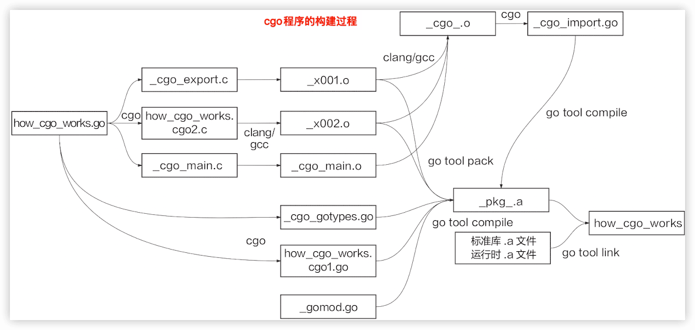

看到在å®é™…编译过程中，go build调用了å为cgo的工具，cgo会识别和读å–Goæºæ–‡ä»¶ï¼ˆhow_cgo_works.go）中的C代ç ï¼Œå¹¶å°†å…¶æå–å交给外部的C编译器（clang或gcc）编译，最åä¸Goæºç ç¼–译å的目标文件链æ¥æˆä¸€ä¸ªå¯æ‰§è¡Œç¨‹åºã€‚

### 70.2 在Go中使用C语言的类å‹

#### 1 åŸç”Ÿç±»å‹

##### 数值类å‹

```go
C.char,
C.schar (signed char),
C.uchar (unsigned char),
C.short,
C.ushort (unsigned short),
C.int, C.uint (unsigned int),
C.long,
C.ulong (unsigned long),
C.longlong (long long),
C.ulonglong (unsigned long long),
C.float,
C.double
```

Go的数值类å‹ä¸C中的数值类å‹ä¸æ˜¯ä¸€ä¸€å¯¹åº”的，因此在使用对方类å‹å˜é‡æ—¶å°‘ä¸äº†æ˜¾å¼ç±»å‹è½¬æ¢æ“作

##### 指针类å‹

åŸç”Ÿæ•°å€¼ç±»å‹çš„指针类å‹å¯æŒ‰Go语法在类å‹å‰é¢åŠ ä¸Šæ˜Ÿå·`*`，比如`var p *C.int`。但`void*`比较特殊，在Go中用`unsafe.Pointer`表示它，这是因为任何类å‹çš„指针值都å¯ä»¥è½¬æ¢ä¸ºunsafe.Pointerç±»å‹ï¼Œè€Œunsafe.Pointerç±»å‹ä¹Ÿå¯ä»¥è½¬æ¢å›ä»»æ„ç±»å‹çš„指针类å‹ã€‚

##### 字符串类å‹

C语言中并ä¸å­˜åœ¨åŸç”Ÿçš„字符串类å‹ï¼Œåœ¨C中用带结尾`'\0'`的字符数组æ¥è¡¨ç¤ºå­—符串；而在Go中，stringç±»å‹æ˜¯è¯­è¨€çš„åŸç”Ÿç±»å‹ï¼Œå› æ­¤è¿™ä¸¤ç§è¯­è¨€çš„互æ“作势必è¦è¿›è¡Œå­—符串类å‹çš„转æ¢ã€‚
通过C.CString函数，我们å¯ä»¥å°†Goçš„stringç±»å‹è½¬æ¢ä¸ºC的“字符串â€ç±»å‹åå†ä¼ ç»™C函数使用。

```go
s := "Hello, Cgo\n"
cs := C.CString(s)
C.print(cs)
```

ä¸è¿‡è¿™ä¸ªè½¬å‹ç›¸å½“äºåœ¨C语言世界的堆上分é…一å—新内存空间，这样转å‹å所得到的C字符串cs并ä¸èƒ½ç”±Goçš„GC（åƒåœ¾å›æ”¶å™¨ï¼‰ç®¡ç†ï¼Œæˆ‘们必须在使用å手动释放cs所å ç”¨çš„内存，这就是例å­ä¸­é€šè¿‡defer调用C.free释放æ‰csçš„åŸå› ã€‚å†æ¬¡å¼ºè°ƒï¼Œ**对äºåœ¨C内部分é…的内存，Go中的GC是无法感知到的，因此è¦è®°ç€åœ¨ä½¿ç”¨å手动释放**。

通过C.GoStringå¯å°†C的字符串`（*C.char）`转æ¢ä¸ºGoçš„stringç±»å‹:

```go
package main

// #include <stdio.h>
// #include <stdlib.h>
// char *foo = "helloChina";
import "C"
import "fmt"

func main() {
	fmt.Printf("%T", C.GoString(C.foo))  // string
}
```

这相当äºåœ¨Go世界é‡æ–°åˆ†é…一å—内存对象，并å¤åˆ¶äº†C的字符串（foo）的信æ¯ï¼Œå续这个ä½äºGo世界的新的stringç±»å‹å¯¹è±¡å°†å’Œå…¶ä»–Go对象一样æ¥å—GC的管ç†ã€‚

##### 数组类å‹

C语言中的数组ä¸Go语言中的数组差异较大，å者是åŸç”Ÿçš„值类å‹ï¼Œè€Œå‰è€…ä¸C中的指针在大部分场åˆå¯ä»¥éšæ„转æ¢ã€‚Goä»…æ供了C.GoBytesæ¥å°†C中的charç±»å‹æ•°ç»„转æ¢ä¸ºGo中的[]byte切片类å‹ï¼š

```go
package main

// char cArray[] = {'a', 'b', 'c', 'd', 'e', 'f'};
import "C"
import (
	"fmt"
	"unsafe"
)

func main() {
	goArray := C.GoBytes(unsafe.Pointer(&C.cArray[0]), 6)
	fmt.Printf("%c\n", goArray) // [a b c d e f]
}
```

而对äºå…¶ä»–ç±»å‹çš„C数组，目å‰ä¼¼ä¹æ— æ³•ç›´æ¥æ˜¾å¼åœ°åœ¨ä¸¤è€…之间进行类å‹è½¬æ¢ã€‚我们å¯ä»¥é€šè¿‡ç‰¹å®šè½¬æ¢å‡½æ•°æ¥å°†C的特定类å‹æ•°ç»„转æ¢ä¸ºGo的切片类å‹ï¼ˆGo中数组是值类å‹ï¼Œå…¶å¤§å°æ˜¯é™æ€çš„，转æ¢ä¸ºåˆ‡ç‰‡æ›´ä¸ºé€šç”¨ï¼‰ã€‚下é¢æ˜¯ä¸€ä¸ªå°†Cæ•´å‹æ•°ç»„转æ¢ä¸ºGo[]int32切片类å‹çš„例å­ï¼š

```go
package main

// int cArray[] = {1, 2, 3, 4, 5, 6, 7, 8};
import "C"
import (
	"fmt"
	"unsafe"
)

// å°†Cæ•´å‹æ•°ç»„转æ¢ä¸ºGo[]int32切片类å‹
func main() {
	goArray := CArrayToGoArray(unsafe.Pointer(&C.cArray[0]), unsafe.Sizeof(C.cArray[0]), 8)
	fmt.Println(goArray) // [1 2 3 4 5 6 7 8]
}

func CArrayToGoArray(cArray unsafe.Pointer, elemSize uintptr, len int) (goArray []int32) {
	for i := 0; i < len; i++ {
		j := *(*int32)((unsafe.Pointer)(uintptr(cArray) + uintptr(i)*elemSize))
		goArray = append(goArray, j)
	}
	return
}
```

注æ„：Go编译器并ä¸èƒ½å°†Cçš„cArray自动转æ¢ä¸ºæ•°ç»„的地å€ï¼Œæ‰€ä»¥ä¸èƒ½åƒåœ¨C中使用数组那样将数组å˜é‡ç›´æ¥ä¼ é€’给函数，而是将数组第一个元素的地å€ä¼ é€’给函数。

#### 2 自定义类å‹

##### æšä¸¾ï¼ˆenum）

对äºå…·åçš„Cæšä¸¾ç±»å‹xx，我们å¯ä»¥é€šè¿‡`C.enum_xx`æ¥è®¿é—®è¯¥ç±»å‹ï¼›å¦‚æœæ˜¯åŒ¿åæšä¸¾ï¼Œåˆ™åªèƒ½è®¿é—®å…¶å­—段了。

##### 结æ„体（struct）

通过C.struct_xxæ¥è®¿é—®C中定义的结æ„体类å‹xx

```go
package main

// #include <stdlib.h>
//
// struct employee {
//   char *id;
//   int age;
// };
import "C"
import (
	"fmt"
	"unsafe"
)

func main() {
	id := C.CString("123456")
	defer C.free(unsafe.Pointer(id))

	var p = C.struct_employee{
		id:  id,
		age: 18,
	}
	// %#v 以 Go 语法格å¼è¾“出值
	fmt.Printf("%#v\n", p)  // main._Ctype_struct_employee{id:(*main._Ctype_char)(0x600002efc000), age:18, _:[4]uint8{0x0, 0x0, 0x0, 0x0}}
}
```

##### è”åˆä½“（union）


##### 别åç±»å‹ï¼ˆtypedef）

```go
// typedef int myint;
var a C.myint = 5
fmt.Println(a)

// typedef struct employee myemployee;
var m C.struct_myemployee
```

#### 3 Go中è·å–Cç±»å‹å¤§å°

Goæ供了`C.sizeof_T`æ¥è·å–`C.T`ç±»å‹çš„大å°ã€‚如æœæ˜¯ç»“æ„体ã€æšä¸¾åŠè”åˆä½“ç±»å‹ï¼Œæˆ‘们需è¦åœ¨Tå‰é¢åˆ†åˆ«åŠ ä¸Š`struct_`ã€`enum_`å’Œ`union_`çš„å‰ç¼€ï¼š

```go
package main

// struct employee {
//   char *id;
//   int age;
// };
import "C"
import "fmt"

func main() {
	fmt.Printf("%#v\n", C.sizeof_int)             // 4
	fmt.Printf("%#v\n", C.sizeof_char)            // 1
	fmt.Printf("%#v\n", C.sizeof_struct_employee) // 16
}
```

### 70.3 在Go中链æ¥å¤–部C库

ä»ä»£ç ç»“æ„上æ¥è®²ï¼Œåœ¨Goæºæ–‡ä»¶ä¸­å¤§é‡ç¼–写C代ç å¹¶ä¸æ˜¯Goæ¨è的惯用法。

Goæ供了`#cgo`指示符，å¯ä»¥ç”¨å®ƒæŒ‡å®šGoæºç åœ¨ç¼–译åä¸å“ªäº›å…±äº«åº“进行链æ¥ã€‚

```go
// foo.go
package main

// #cgo CFLAGS: -I${SRCDIR}
// #cgo LDFLAGS: -L${SRCDIR} -lfoo
// #include <stdio.h>
// #include <stdlib.h>
// #include "foo.h"
import "C"
import "fmt"

func main() {
	fmt.Println(C.count)
	C.foo()
}
```

通过#cgo指示符告诉Go编译器在当å‰æºç ç›®å½•ï¼ˆ`${SRCDIR}`会在编译过程中自动转æ¢ä¸ºå½“å‰æºç æ‰€åœ¨ç›®å½•çš„ç»å¯¹è·¯å¾„）下查找头文件`foo.h`，并链æ¥å½“å‰æºç ç›®å½•ä¸‹çš„libfoo共享库。`C.count`å˜é‡å’ŒC.foo函数的定义都在libfoo共享库中。创建这个共享库：

```c
// foo.h
extern int count;
void foo();
```

```c
// foo.c
#include <stdio.h>
#include "foo.h"

int count = 100;
void foo() {
    printf("hello world, I'm foo!\n");
}
```

用ar工具创建一个==é™æ€å…±äº«åº“==文件`libfoo.a`:

```sh
$ gcc -c foo.c
$ ar rv libfoo.a foo.o
```

æ„建并è¿è¡Œfoo.go：

```shell
$ go build foo.go
$ ./foo 
100
hello world, I'm foo!
```

看到foo.goæˆåŠŸé“¾æ¥åˆ°libfoo.a并生æˆæœ€ç»ˆçš„二进制文件foo。

GoåŒæ ·æ”¯æŒé“¾æ¥==动æ€å…±äº«åº“==，用下é¢çš„命令将上é¢çš„foo.c编译为一个动æ€å…±äº«åº“：

```sh
$ gcc -c foo.c
// $ gcc -shared -Wl,-soname,libfoo.so -o libfoo.so  foo.o (在linux上)
$ gcc -shared -o libfoo.so  foo.o
```

é‡æ–°ç¼–译foo.go，并查看（在Linux上å¯ä»¥ä½¿ç”¨`ldd`，在macOS上使用`otool`）é‡æ–°ç”Ÿæˆçš„二进制文件foo的动æ€å…±äº«åº“ä¾èµ–情况：

```sh
$ go build foo.go               
$ otool -L foo
foo:
        libfoo.so (compatibility version 0.0.0, current version 0.0.0)
        /System/Library/Frameworks/CoreFoundation.framework/Versions/A/CoreFoundation (compatibility version 150.0.0, current version 3502.1.255)
        /usr/lib/libresolv.9.dylib (compatibility version 1.0.0, current version 1.0.0)
        /usr/lib/libSystem.B.dylib (compatibility version 1.0.0, current version 1351.0.0)
```


注æ„，Go支æŒå¤šè¿”å›å€¼ï¼Œè€ŒC并ä¸æ”¯æŒï¼Œå› æ­¤å½“å°†C函数用在多返å›å€¼çš„Go调用中时，Cçš„errno将作为函数返å›å€¼åˆ—表中最å那个errorè¿”å›å€¼è¿”å›ã€‚下é¢æ˜¯ä¸ªä¾‹å­ï¼š

```go
// c_errno.go

package main

// #include <stdlib.h>
// #include <stdio.h>
// #include <errno.h>
// int foo(int i) {
//   errno = 0;
//   if (i > 5) {
//     errno = 8;
//     return i - 5;
//   } else {
//     return i;
//   }
// }
import "C"
import "fmt"

func main() {
	i, err := C.foo(C.int(8))
	if err != nil {
		fmt.Println(err)
	} else {
		fmt.Println(i)
	}
}
```


```sh
$g o run c_errno.go
exec format error
```

`exec format error`就是errno为8时的错误æè¿°ä¿¡æ¯ã€‚

### 70.4 在C中使用Go函数

在C中使用Go函数的场åˆæ少。在Go中，å¯ä»¥ä½¿ç”¨`export + 函数å`æ¥å¯¼å‡ºGo函数为C所用。目å‰Go的导出函数供C使用的功能还å分有é™ï¼Œä¸¤ç§è¯­è¨€çš„调用约定ä¸åŒï¼Œç±»å‹æ— æ³•ä¸€ä¸€å¯¹åº”，Go中类似åƒåœ¾å›æ”¶è¿™æ ·çš„高级功能让导出Go函数这一特性难äºå®Œç¾å®ç°ï¼Œå¯¼å‡ºçš„函数ä¾æ—§æ— æ³•å®Œå…¨è„±ç¦»Goçš„ç¯å¢ƒï¼Œå› æ­¤å…¶å®ç”¨æ€§å¤§æ‰“折扣。

### 70.5 使用cgo的开销

#### 1 ä¸èƒ½å¿½è§†çš„调用开销

在Go代ç ä¸­è°ƒç”¨C函数看起æ¥ä¼¼ä¹å¾ˆå¹³æ»‘，但å®é™…上这ç§è°ƒç”¨çš„开销è¦æ¯”调用Go函数多出**一个甚至多个数é‡çº§**。


```sh
$ go test -bench . -gcflags '-l'
goos: darwin
goarch: arm64
pkg: gofirst/ch70cgo/5
cpu: Apple M1
BenchmarkCGO-8          43136834                28.16 ns/op
BenchmarkGO-8           546780799                2.199 ns/op
PASS
ok      gofirst/ch70cgo/5       3.686s

```


#### 2 å¢åŠ çº¿ç¨‹æ•°é‡æš´æ¶¨çš„å¯èƒ½æ€§ğŸ”–


#### 3 失å»è·¨å¹³å°äº¤å‰æ„建能力🔖


#### 4 其他开销


### 70.6 使用cgo代ç çš„é™æ€æ„建🔖

所谓é™æ€æ„建就是指æ„建å的应用è¿è¡Œæ‰€éœ€çš„所有符å·ã€æŒ‡ä»¤å’Œæ•°æ®éƒ½åŒ…å«åœ¨è‡ªèº«çš„二进制文件当中，没有任何对外部动æ€å…±äº«åº“çš„ä¾èµ–。é™æ€æ„建出的二进制文件由äºåŒ…å«æ‰€æœ‰ç¬¦å·ã€æŒ‡ä»¤å’Œæ•°æ®ï¼Œå› è€Œé€šå¸¸è¦æ¯”éé™æ€æ„建的应用大许多。默认情况下，Go没有采用é™æ€æ„建。


## 71 使用crypto下的密ç å­¦åŒ…æ„建安全应用

密ç å­¦ï¼ˆcryptography）是**对信æ¯åŠå…¶ä¼ è¾“的数学性研究**。

在人类进入信æ¯ç¤¾ä¼šï¼Œå°¤å…¶æ˜¯æ­¥å…¥è®¡ç®—机互è”网时代之å，**ç°ä»£å¯†ç å­¦ä¾¿æˆä¸ºæ•´ä¸ªäº’è”网安全的基石**，为人类在数字世界的活动ä¿é©¾æŠ¤èˆªã€‚近几年新兴的互è”网技术，如区å—链等，无ä¸æ˜¯å»ºæ„在ç°ä»£å¯†ç å­¦çš„基础之上的。å¯ä»¥è¯´ï¼Œå¯†ç å­¦æ˜¯äº’è”网的信任之æºã€‚

密ç å­¦æœ¬è´¨ä¸Šæ˜¯==æ•°å­¦==，密ç å­¦çš„算法多由专业的密ç å­¦ç ”究人员设计和å®ç°ã€‚因此大多数开å‘人员无须亲自设计和å®ç°åŠ å¯†ç®—法，仅需了解密ç å­¦çš„基础知识并使用ç°æˆçš„密ç å­¦ç®—法å®ç°å»æ„建安全应用å³å¯ã€‚

### 71.1 Go密ç å­¦åŒ…概览ä¸è®¾è®¡åŸåˆ™

分组密ç ï¼ˆblock cipher）

公钥密ç ï¼ˆpublic-key cryptography，亦称é对称密ç asymmetric cryptography）ä¸æ•°å­—ç­¾å（digital signature）

å•å‘散列函数，亦称消æ¯æ‘˜è¦ï¼ˆdigest）或指纹（fingerprint）

消æ¯è®¤è¯ç ï¼ˆMessage Authentication Code，MAC）

éšæœºæ•°ç”Ÿæˆ


### 71.2 分组密ç ç®—法

密ç ç®—法å¯ä»¥åˆ†ä¸º**分组密ç ï¼ˆblock cipher）**å’Œ**æµå¯†ç ï¼ˆstream cipher）**两ç§ã€‚

æµå¯†ç æ˜¯å¯¹æ•°æ®æµè¿›è¡Œè¿ç»­å¤„ç†çš„一类算法，而我们日常使用最多的DESã€AES加密算法则都归äºåˆ†ç»„密ç ç®—法范畴。

分组密ç æ˜¯ä¸€ç§ä¸€æ¬¡ä»…能处ç†å›ºå®šé•¿åº¦æ•°æ®å—的算法。而这个数æ®å—的固定长度（比特数é‡ï¼‰åˆ™ç§°ä¸ºè¯¥åˆ†ç»„密ç ç®—法的分组长度（block length）。

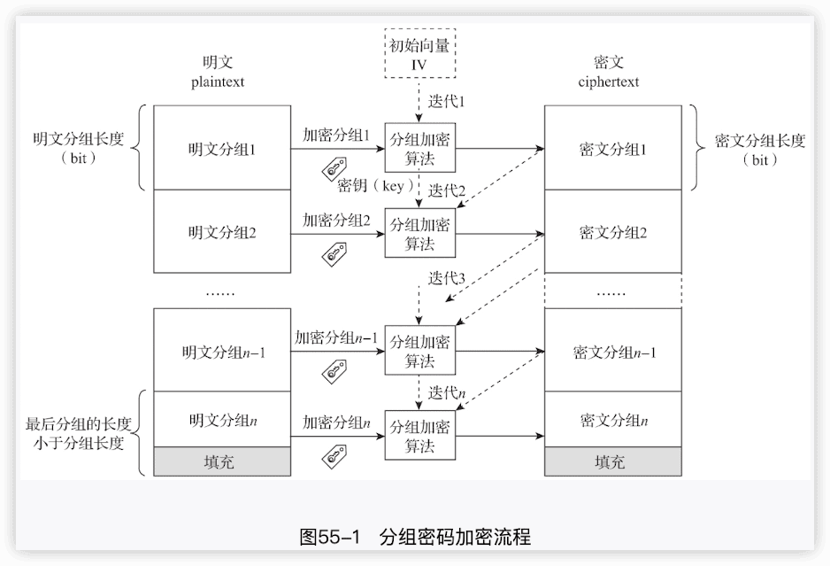


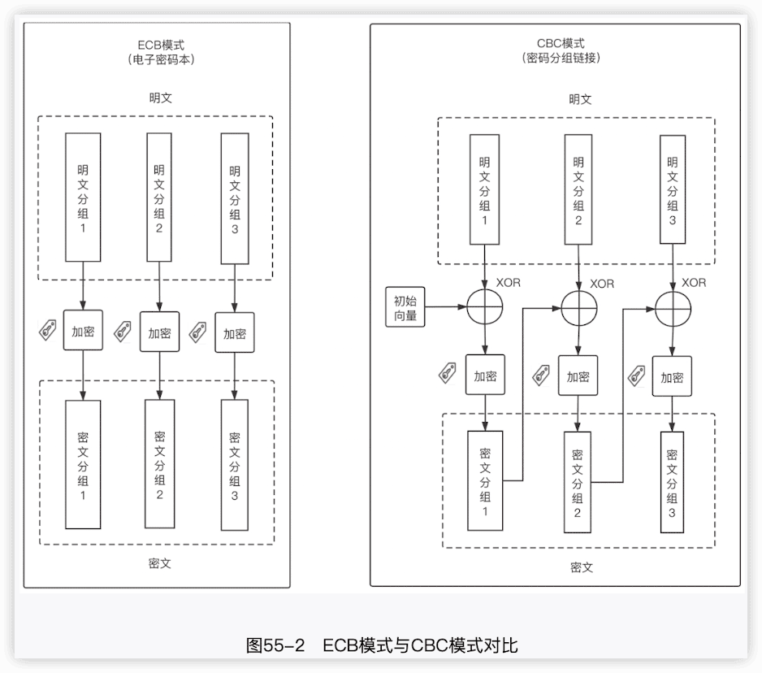


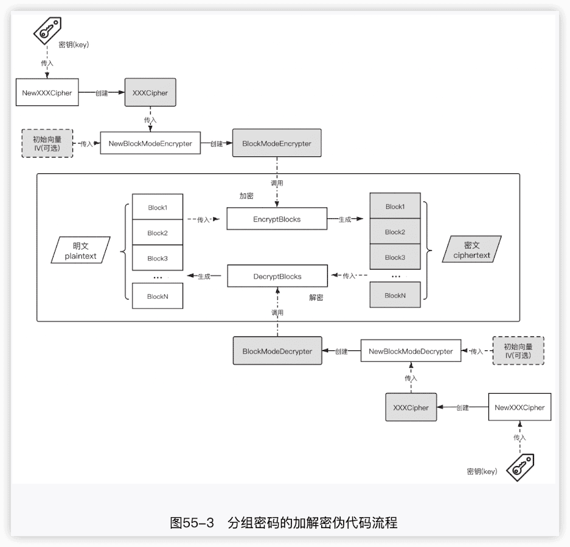


### 71.3 公钥密ç 


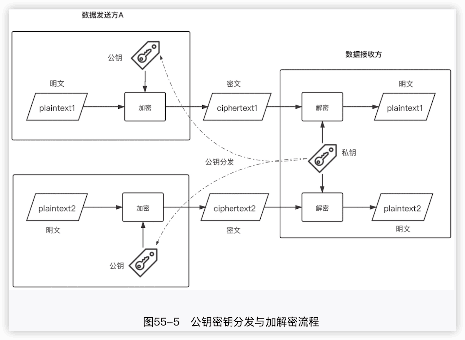


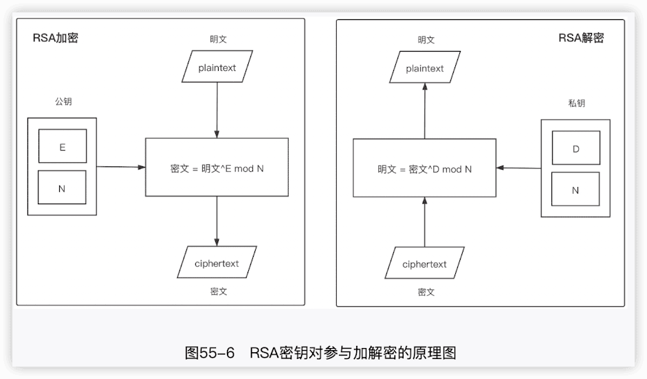

### 71.4 å•å‘散列函数

å•å‘散列函数（one-way hash function）是一个æ¥å—ä¸å®šé•¿è¾“入但产生定长输出的函数，这个定长输出被称为“摘è¦â€ï¼ˆdigest）或“指纹â€ï¼ˆfingerprint）。

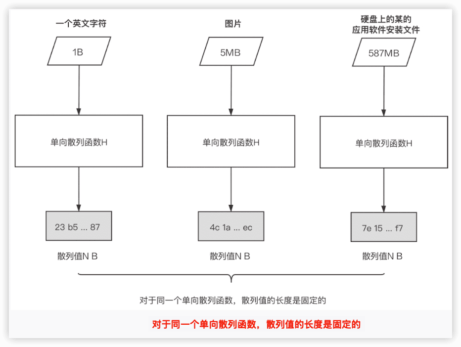


### 71.5 消æ¯è®¤è¯ç 

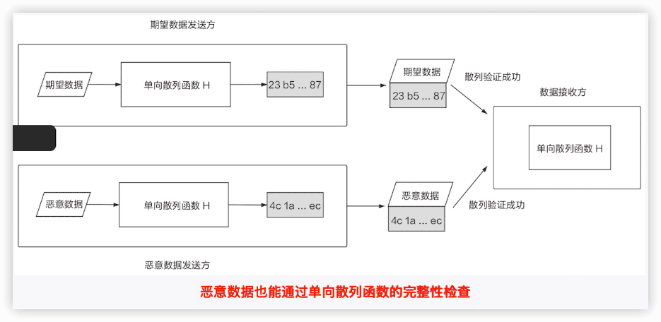


### 71.6 æ•°å­—ç­¾å


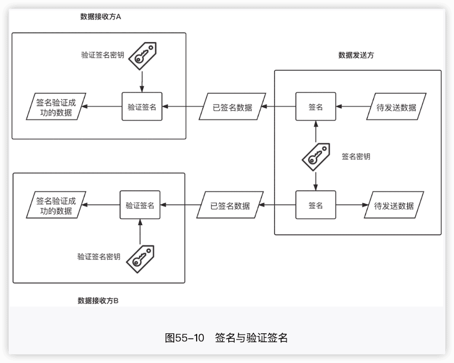


### 71.7 éšæœºæ•°ç”Ÿæˆ


## 72 使用go generate驱动代ç ç”Ÿæˆ

把Go工具链中代ç ç”Ÿæˆå·¥å…·ï¼ˆgo generate）å•ç‹¬ä»‹ç»ä½¿ç”¨ã€‚

### 72.1 go generate：GoåŸç”Ÿçš„代ç ç”Ÿæˆâ€œé©±åŠ¨å™¨â€

æ„建中å°è§„模的Go项目时通常无须借助外部æ„建管ç†å·¥å…·ï¼ˆæ¯”如shell脚本ã€make等），Go工具链便å¯ä»¥å¾ˆå¥½åœ°æ»¡è¶³æˆ‘们关äºæ„建的大多数需求。

但有些时候，目标的æ„建需è¦ä¾èµ–一些é¢å¤–çš„==å‰ç½®åŠ¨ä½œ==（如代ç ç”Ÿæˆç­‰ï¼‰ï¼Œåœ¨è¿™ç§æƒ…况下，å•é go build我们无法驱动å‰ç½®åŠ¨ä½œçš„执行。

#### make

以往å¯ä»¥å€ŸåŠ©å¤–部æ„建管ç†å·¥å…·ï¼Œæ¯”如`make`。下é¢æ˜¯ä¸€ä¸ªå€ŸåŠ©make工具对一个ä¾èµ–代ç ç”Ÿæˆçš„项目进行æ„建的示例：

```shell
$ tree protobuf-make
protobuf-make
├── IDL
│    └── msg.proto
├── Makefile
├── go.mod
├── go.sum
├── main.go
└── msg
		 └── msg.pb.go // 待生æˆçš„Goæºæ–‡ä»¶
```

```makefile
// ch72/protobuf-make/Makefile
all: build

build: gen-protobuf
	go build

gen-protobuf:
	protoc -I ./IDL msg.proto --gofast_out=./msg
```

```protobuf
// ch72/protobuf-make/IDL/msg.proto

syntax = "proto3";
  
package msg;

message request {
        string msgID = 1;
        string field1 = 2;
        repeated string field2 = 3;
}
```

make命令通过Makefile目标（target）之间的ä¾èµ–关系å®ç°äº†åœ¨çœŸæ­£æ„建（go build）之å‰å…ˆç”Ÿæˆ`msg/msg.pb.go`文件，这样go build执行时就能正常找到msg包的æºæ–‡ä»¶äº†ï¼ˆç”Ÿæˆå¯æ‰§è¡Œæ–‡ä»¶`protobuf-make`）。

```sh
$ make 
protoc -I ./IDL msg.proto --gofast_out=./msg
go build
```


> 上述示例基äºprotobufæ述文件（msg.proto）生æˆGoæºç ï¼ˆmsg.pb.go）。这个生æˆè¿‡ç¨‹ä¾èµ–两个工具：
>
> 一个是protobuf编译器protoc（https://github.com/protocolbuffers/protobuf），
>
> å¦ä¸€ä¸ªæ˜¯protobuf goæ’件protoc-gen-gofast
>
> ```sh
> go install github.com/gogo/protobuf/protoc-gen-gofast@latest
> ```

#### go generate

Go 1.4版本的Go工具链中也å¢åŠ äº†è¿™ç§åœ¨æ„建之å‰é©±åŠ¨æ‰§è¡Œå‰ç½®åŠ¨ä½œçš„能力，这就是`go generate`命令。

```sh
$ tree protobuf-go-generate 
protobuf-go-generate
├── IDL
│   └── msg.proto
├── go.mod
├── go.sum
├── main.go
└── msg
		 └── msg.pb.go // 待生æˆçš„Goæºæ–‡ä»¶
```

```go
// ch72/protobuf-go-generate/main.go

package main

//go:generate protoc -I ./IDL msg.proto --gofast_out=./msg
func main() {
}
```

删除了Makefile，然åmain包的æºæ–‡ä»¶ä¸­æ·»åŠ äº†å¦‚下一行特殊的注释。

这就是预先“埋â€åœ¨ä»£ç ä¸­çš„å¯ä»¥è¢«go generate命令识别的**指示符（directive）**。

执行go generate命令时，上é¢è¿™è¡ŒæŒ‡ç¤ºç¬¦ä¸­çš„命令将被go generate识别并被驱动执行，执行的结æœå°±æ˜¯protoc基äºIDL目录下的msg.proto生æˆäº†main包所需è¦çš„msg包æºç ã€‚ã€-xå’Œ-v用äºæŸ¥çœ‹æ‰§è¡Œè¿‡ç¨‹ã€‘

```sh
$ go generate -x -v
main.go
protoc -I ./IDL msg.proto --gofast_out=./msg
```

代ç ç”Ÿæˆå，编写相关代ç ï¼š

```go
package main

import (
	"fmt"
	msg "protobuf-go-generate/msg"
)

//go:generate protoc -I ./IDL msg.proto --gofast_out=./msg
func main() {
	var m = msg.Request{
		MsgID:  "xxxx",
		Field1: "field1",
		Field2: []string{"field2-1", "field2-2"},
	}
	fmt.Println(m)
}
```

æ„建并è¿è¡Œç¨‹åº:

```sh
$ go build
$ ./protobuf-go-generate 
{xxxx field1 [field2-1 field2-2] {} [] 0}
```

### 72.2 go generate的工作åŸç†

go generate相较äºmake这样的工具能力和特性比较å•ä¸€ï¼Œä½†â€œ**它是Go工具链内置的，天然适é…Go生æ€ç³»ç»Ÿï¼Œæ— é¡»é¢å¤–安装其他工具。**â€ã€‚

go generate并ä¸ä¼šæŒ‰Go语法格å¼è§„范å»è§£æGoæºç æ–‡ä»¶ï¼Œå®ƒåªæ˜¯å°†Goæºç æ–‡ä»¶å½“æˆæ™®é€šæ–‡æœ¬è¯»å–并识别其中å¯ä»¥ä¸ä¸‹é¢å­—符串模å¼åŒ¹é…的内容（go generate指示符）：

```go
//go:generate command arg...
```

注释符å·//å‰é¢æ²¡æœ‰ç©ºæ ¼ï¼Œä¸go:generate之间亦无任何空格。

上é¢çš„go generate指示符å¯ä»¥æ”¾åœ¨Goæºæ–‡ä»¶ä¸­çš„ä»»æ„ä½ç½®ï¼Œå¹¶ä¸”一个Goæºæ–‡ä»¶ä¸­å¯ä»¥æœ‰å¤šä¸ªgo generate指示符，go generate命令会按其出ç°çš„顺åºé€ä¸ªè¯†åˆ«å’Œæ‰§è¡Œï¼š1ï¸âƒ£

```go
// multi_go_generate_directive.go

//go:generate echo "top"
package main

import "fmt"

//go:generate echo "middle"
func main() {
	fmt.Println("hello, go generate")
}

//go:generate echo "tail"
```

```sh
$ go generate multi_go_generate_directive.go 
top
middle
tail
```

å¯ä»¥åƒä¸Šé¢ç¤ºä¾‹é‚£æ ·ç›´æ¥å°†**Goæºæ–‡ä»¶**作为å‚æ•°ä¼ ç»™go generate命令，也å¯ä»¥ä½¿ç”¨**包**作为go generateçš„å‚数。

2ï¸âƒ£ä¸‹é¢çš„示例演示了ä¸åŒgo generateå¯æ¥å—çš„ä¸åŒå‚æ•°å½¢å¼ï¼š

```sh
$ tree generate-args 
generate-args
├── go.mod
├── main.go
├── subpkg1
│   └── subpkg1.go
└── subpkg2
    └── subpkg2.go

```

main.goã€subpkg1.goå’Œsubpkg2.go三个æºæ–‡ä»¶ä¸­éƒ½æœ‰ä¸€è¡Œgo generate指示符：

```go
//go:generate pwd
```

go generate执行该指示符中的命令时会输出当å‰å·¥ä½œç›®å½•ï¼ˆWorking Directory）：

```sh
// 1 ä¼ å…¥æŸä¸ªæ–‡ä»¶
$ go generate -x -v main.go 
main.go
pwd
/Users/.../gofirst/ch72/generate-args

// 2 传入当å‰module，匹é…到moduleçš„main package且仅处ç†è¯¥main packageçš„æºæ–‡ä»¶ï¿¼
$ go generate -x -v
main.go
pwd
/Users/.../gofirst/ch72/generate-args

// 3 传入本地路径，匹é…该路径下的包的所有æºæ–‡ä»¶ï¿¼
$ go generate -x -v ./subpkg1 
subpkg1/subpkg1.go
pwd
/Users/.../gofirst/ch72/generate-args/subpkg1

// 4 传入包，由äºæ˜¯module的根路径，因此åªå¤„ç†è¯¥module下的main包
$ go generate -x -v github.com/andyron/generate-args
main.go
pwd
/Users/.../gofirst/ch72/generate-args

// 5 传入包，处ç†subpkg1包下的所有æºæ–‡ä»¶ï¿¼
$ go generate -x -v github.com/andyron/generate-args/subpkg1
subpkg1/subpkg1.go
pwd
/Users/.../gofirst/ch72/generate-args/subpkg1

// 6 ä¼ å…¥./...模å¼ï¼ŒåŒ¹é…当å‰è·¯å¾„åŠå…¶å­è·¯å¾„下的所有包
$ go generate -x -v ./...                                   
main.go
pwd
/Users/.../gofirst/ch72/generate-args
subpkg1/subpkg1.go
pwd
/Users/.../gofirst/ch72/generate-args/subpkg1
subpkg2/subpkg2.go
pwd
/Users/.../gofirst/ch72/generate-args/subpkg2
```


3ï¸âƒ£ go generate还å¯ä»¥é€šè¿‡-run使用正则å¼å»åŒ¹é…å„æºæ–‡ä»¶ä¸­go generate指示符中的命令，并仅执行匹é…æˆåŠŸçš„命令：

```sh
// 未匹é…到任何go generate指示符中的命令
$ go generate -x -v -run "protoc" ./...
```


### 72.3 go generate的应用场景

上é¢åŸºäºprotobuf定义文件（*.proto）生æˆGoæºç æ–‡ä»¶çš„示例就是go generate一个æ为典å‹çš„应用。此外广泛的应用还有：

#### 1 利用stringer工具自动生æˆæšä¸¾ç±»å‹çš„String方法

> 安装stringer工具
>
> ```
> go get golang.org/x/tools/cmd/stringer
> ```
>
> or
>
> ```sh
> go install golang.org/x/tools/cmd/stringer
> ```


```go
// enum-demo/main.go

type Weekday int

const (
	Sunday Weekday = iota
	Monday
	Tuesday
	Wednesday
	Thursday
	Friday
	Saturday
)
```

通常会为Weekdayç±»å‹æ‰‹å†™String方法，这样在打å°ä¸Šé¢æšä¸¾å¸¸é‡æ—¶èƒ½è¾“出有æ„义的内容：

```go
func (d Weekday) String() string {
	switch d {
	case Sunday:
		return "Sunday"
	case Monday:
		return "Monday"
	case Tuesday:
		return "Tuesday"
	case Wednesday:
		return "Wednesday"
	case Thursday:
		return "Thursday"
	case Friday:
		return "Friday"
	case Saturday:
		return "Saturday"
	}

	return "Sunday" //default 0 -> "Sunday"
}
```

如æœä¸€ä¸ªé¡¹ç›®ä¸­æšä¸¾å¸¸é‡ç±»å‹æœ‰å¾ˆå¤šï¼Œé€ä¸ªä¸ºå…¶æ‰‹å†™String方法费时费力。当æšä¸¾å¸¸é‡æœ‰å˜åŒ–的时候，手动维护String方法å分烦ç且易错。对äºè¿™ç§æƒ…况，使用go generate驱动stringer工具为这些æšä¸¾ç±»å‹è‡ªåŠ¨ç”ŸæˆString方法的å®ç°ä¸å¤±ä¸ºä¸€ä¸ªè¾ƒä¸ºç†æƒ³çš„方案。

对上é¢ç¤ºä¾‹çš„改造：

```go
package main

import "fmt"

type Weekday int

const (
	Sunday Weekday = iota
	Monday
	Tuesday
	Wednesday
	Thursday
	Friday
	Saturday
)

//go:generate stringer -type=Weekday
func main() {
	var d Weekday
	fmt.Println(d)
	fmt.Println(Weekday(1))
}
```


```go
$ go generate main.go 
```

生æˆä¸€ä¸ªweekday_string.go 文件：

```go
// Code generated by "stringer -type=Weekday"; DO NOT EDIT.

package main

import "strconv"

func _() {
	// An "invalid array index" compiler error signifies that the constant values have changed.
	// Re-run the stringer command to generate them again.
	var x [1]struct{}
	_ = x[Sunday-0]
	_ = x[Monday-1]
	_ = x[Tuesday-2]
	_ = x[Wednesday-3]
	_ = x[Thursday-4]
	_ = x[Friday-5]
	_ = x[Saturday-6]
}

const _Weekday_name = "SundayMondayTuesdayWednesdayThursdayFridaySaturday"

var _Weekday_index = [...]uint8{0, 6, 12, 19, 28, 36, 42, 50}

func (i Weekday) String() string {
	if i < 0 || i >= Weekday(len(_Weekday_index)-1) {
		return "Weekday(" + strconv.FormatInt(int64(i), 10) + ")"
	}
	return _Weekday_name[_Weekday_index[i]:_Weekday_index[i+1]]
}
```

编译执行：

```sh
$ go build
$ ./enum-demo         
Sunday
Monday
```


#### 2 go generate驱动ä»é™æ€èµ„æºæ–‡ä»¶æ•°æ®åˆ°Goæºç çš„转æ¢

语言的优点之一是å¯ä»¥å°†æºç ç¼–译æˆä¸€ä¸ªå¯¹å¤–部没有任何ä¾èµ–或åªæœ‰è¾ƒå°‘ä¾èµ–的二进制å¯æ‰§è¡Œæ–‡ä»¶ï¼Œè¿™å¤§å¤§é™ä½äº†Gopher在部署阶段的心智负担。而为了将这一优势å‘挥到æ致，Go社区甚至开始ç€æ‰‹å°†é™æ€èµ„æºæ–‡ä»¶ä¹ŸåµŒå…¥å¯æ‰§è¡Œæ–‡ä»¶ä¸­ï¼Œå°¤å…¶æ˜¯åœ¨Webå¼€å‘领域，Gopher希望将一些é™æ€èµ„æºæ–‡ä»¶ï¼ˆæ¯”如CSS文件等）嵌入最终的二进制文件中一起å‘布和部署。

利用go-bindata工具将数æ®æ–‡ä»¶åµŒå…¥Goæºç ä¸­ã€‚安装：`go get -u github.com/go-bindata/go-bindata/...`或者`go install github.com/go-bindata/go-bindata/v3/go-bindata@latest`。

> 说æ˜ï¼šGo 1.16版本内置了é™æ€æ–‡ä»¶åµŒå…¥ï¼ˆembedding）功能，我们å¯ä»¥ç›´æ¥åœ¨Goæºç ä¸­é€šè¿‡`go:embed`指示符将é™æ€èµ„æºæ–‡ä»¶åµŒå…¥ï¼Œæ— é¡»å†ä½¿ç”¨æœ¬æ–¹æ³•ã€‚

```go
//go:generate go-bindata -o static.go static/img/go-mascot.jpg

func main() {
}
```

```sh
$ go generate  
```

go generate命令会执行main.go中指示符中的命令，å³åŸºäºstatic/img/go-mascot.jpg文件数æ®ç”Ÿæˆstatic.goæºæ–‡ä»¶ã€‚


```go
//go:generate go-bindata -o static.go static/img/go-mascot.jpg

func main() {
	data, err := Asset("static/img/go-mascot.jpg")
	if err != nil {
		fmt.Println("Asset invoke error:", err)
		return
	}

	http.HandleFunc("/", func(w http.ResponseWriter, req *http.Request) {
		w.Write(data)
	})

	http.ListenAndServe(":8080", nil)
}
```

```sh
$ go build
./bindata-demo
```

此时访问localhost:8080å¯æŸ¥çœ‹å›¾ç‰‡ã€‚

这时å³ä¾¿ä½ åˆ é™¤bindata-demo/static/img目录下的go-mascot.jpg也ä¸ä¼šå½±å“到bindata-demo的应答返å›ç»“æœï¼Œå› ä¸ºå›¾ç‰‡æ•°æ®å·²ç»åµŒå…¥bindata-demo这个二进制程åºå½“中了，go-mascot.jpgå°†éšç€bindata-demo这个二进制程åºä¸€å¹¶åˆ†å‘ä¸éƒ¨ç½²ã€‚

### å°ç»“

go generate这个工具通常是由Go包的作者使用和执行的，其生æˆçš„Goæºç ä¸€èˆ¬ä¼šæ交到代ç ä»“库中，这个过程对生æˆçš„包的使用者æ¥è¯´æ˜¯é€æ˜çš„。为了æ醒使用者这是一个代ç è‡ªåŠ¨ç”Ÿæˆçš„æºæ–‡ä»¶ï¼Œæˆ‘们通常会在æºæ–‡ä»¶çš„开始处以注释的形å¼å†™å…¥ç±»ä¼¼ä¸‹é¢çš„文字：

```go
// Code generated by XXX. DO NOT EDIT.
```


## 73 内存管ç†

ref：[《Go语言设计ä¸å®ç°ã€‹7ç« ](https://draven.co/golang/docs/part3-runtime/ch07-memory/golang-memory-allocator/)

### 73.1 内存分é…器

程åºä¸­çš„æ•°æ®å’Œå˜é‡éƒ½ä¼šè¢«åˆ†é…到程åºæ‰€åœ¨çš„虚拟内存中，内存空间包å«ä¸¤ä¸ªé‡è¦åŒºåŸŸï¼š**栈区（Stack）和堆区（Heap）**。<u>函数调用的å‚æ•°ã€è¿”å›å€¼ä»¥åŠå±€éƒ¨å˜é‡</u>大都会被分é…到栈上，这部分内存会由**编译器**进行管ç†ï¼›ä¸åŒç¼–程语言使用ä¸åŒçš„方法**管ç†å †åŒºçš„内存**，C++等编程语言会由工程师主动申请和释放内存，Go ä»¥åŠ Java 等编程语言会由**工程师和编译器共åŒç®¡ç†**，堆中的对象由**内存分é…器**分é…并由åƒåœ¾æ”¶é›†å™¨å›æ”¶ã€‚

ä¸åŒçš„编程语言会选择ä¸åŒçš„æ–¹å¼ç®¡ç†å†…存，本节会介ç»Go语言内存分é…器，详细分æ内存分é…的过程以åŠå…¶èƒŒå的设计ä¸å®ç°åŸç†ã€‚

#### 73.1.1 设计åŸç†

内存管ç†ä¸€èˆ¬åŒ…å«ä¸‰ä¸ªä¸åŒçš„组件，分别是==用户程åºï¼ˆMutator）==ã€==分é…器（Allocator）==å’Œ==收集器（Collector)==，当用户程åºç”³è¯·å†…存时，它会通过内存分é…器申请新内存，而分é…器会负责ä»å †ä¸­åˆå§‹åŒ–相应的内存区域。

Go语言的内存分é…器å®ç°é常å¤æ‚。

##### 1ï¸âƒ£åˆ†é…方法

编程语言的内存分é…器一般包å«ä¸¤ç§åˆ†é…方法，

- 一ç§æ˜¯**线性分é…器（Sequential Allocator，Bump Allocator）**，
- å¦ä¸€ç§æ˜¯**空闲链表分é…器（Free-List Allocator）**，

这两ç§åˆ†é…方法有ç€ä¸åŒçš„å®ç°æœºåˆ¶å’Œç‰¹æ€§ã€‚

###### 线性分é…器

线性分é…（Bump Allocator）是一ç§é«˜æ•ˆçš„内存分é…方法，但是有较大的局é™æ€§ã€‚当我们使用线性分é…器时，åªéœ€è¦åœ¨å†…存中维护一个指å‘内存特定ä½ç½®çš„指针，如æœç”¨æˆ·ç¨‹åºå‘分é…器申请内存，分é…器åªéœ€è¦æ£€æŸ¥å‰©ä½™çš„空闲内存ã€è¿”å›åˆ†é…的内存区域并修改指针在内存中的ä½ç½®ï¼Œå³ç§»åŠ¨ä¸‹å›¾ä¸­çš„指针：

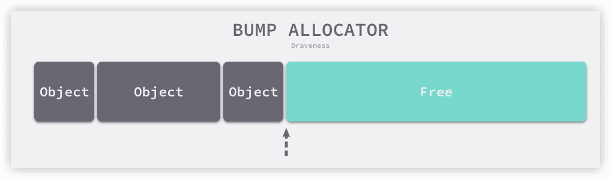

虽然线性分é…器å®ç°ä¸ºå®ƒå¸¦æ¥äº†è¾ƒå¿«çš„执行速度以åŠè¾ƒä½çš„å®ç°å¤æ‚度，但是线性分é…器**无法在内存被释放时é‡ç”¨å†…å­˜**。如下图所示，如æœå·²ç»åˆ†é…的内存被å›æ”¶ï¼Œçº¿æ€§åˆ†é…器无法é‡æ–°åˆ©ç”¨çº¢è‰²çš„内存：

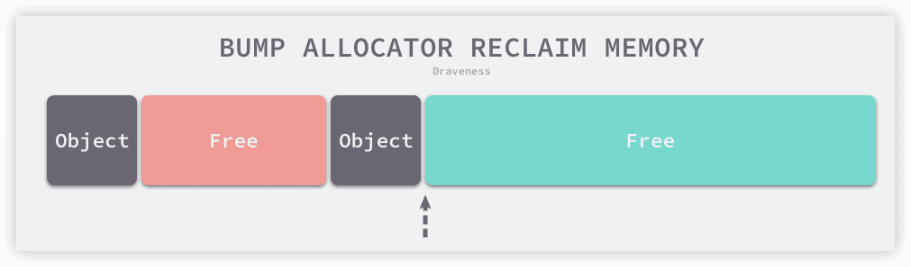

因为线性分é…器具有上述特性，所以**需è¦ä¸åˆé€‚çš„åƒåœ¾å›æ”¶ç®—法é…åˆä½¿ç”¨**，例如：**标记å‹ç¼©ï¼ˆMark-Compact）ã€å¤åˆ¶å›æ”¶ï¼ˆCopying GC）和分代å›æ”¶ï¼ˆGenerational GC）**等算法，它们å¯ä»¥é€šè¿‡æ‹·è´çš„æ–¹å¼æ•´ç†å­˜æ´»å¯¹è±¡çš„ç¢ç‰‡ï¼Œå°†ç©ºé—²å†…存定期åˆå¹¶ï¼Œè¿™æ ·å°±èƒ½åˆ©ç”¨çº¿æ€§åˆ†é…器的效ç‡æå‡å†…存分é…器的性能了。

因为线性分é…器需è¦ä¸å…·æœ‰**æ‹·è´ç‰¹æ€§**çš„åƒåœ¾å›æ”¶ç®—法é…åˆï¼Œæ‰€ä»¥ C å’Œ C++ 等需è¦**ç›´æ¥å¯¹å¤–暴露指针**的语言就无法使用该策略。

###### 空闲链表分é…器

空闲链表分é…器（Free-List Allocator）å¯ä»¥é‡ç”¨å·²ç»è¢«é‡Šæ”¾çš„内存，它在内部会维护一个类似链表的数æ®ç»“æ„。当用户程åºç”³è¯·å†…存时，**空闲链表**分é…器会ä¾æ¬¡éå†ç©ºé—²çš„内存å—，找到足够大的内存，然å申请新的资æºå¹¶ä¿®æ”¹é“¾è¡¨ï¼š

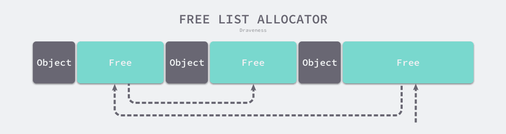

因为ä¸åŒçš„内存å—通过指针æ„æˆäº†é“¾è¡¨ï¼Œæ‰€ä»¥ä½¿ç”¨è¿™ç§æ–¹å¼çš„分é…器å¯ä»¥é‡æ–°åˆ©ç”¨å›æ”¶çš„资æºï¼Œä½†æ˜¯å› ä¸ºåˆ†é…内存时需è¦éå†é“¾è¡¨ï¼Œæ‰€ä»¥å®ƒçš„时间å¤æ‚度是 ğ‘‚(ğ‘›)。空闲链表分é…器å¯ä»¥é€‰æ‹©**ä¸åŒçš„策略在链表中的内存å—中进行选择**，最常è§çš„是以下四ç§ï¼š

- 首次适应（First-Fit）— ä»é“¾è¡¨å¤´å¼€å§‹éå†ï¼Œé€‰æ‹©ç¬¬ä¸€ä¸ªå¤§å°å¤§äºç”³è¯·å†…存的内存å—ï¼›
- 循ç¯é¦–次适应（Next-Fit）— ä»ä¸Šæ¬¡éå†çš„结æŸä½ç½®å¼€å§‹éå†ï¼Œé€‰æ‹©ç¬¬ä¸€ä¸ªå¤§å°å¤§äºç”³è¯·å†…存的内存å—ï¼›
- 最优适应（Best-Fit）— ä»é“¾è¡¨å¤´éå†æ•´ä¸ªé“¾è¡¨ï¼Œé€‰æ‹©æœ€åˆé€‚的内存å—ï¼›
- ==隔离适应（Segregated-Fit）==— 将内存分割æˆå¤šä¸ªé“¾è¡¨ï¼Œæ¯ä¸ªé“¾è¡¨ä¸­çš„内存å—大å°ç›¸åŒï¼Œç”³è¯·å†…存时先找到满足æ¡ä»¶çš„链表，å†ä»é“¾è¡¨ä¸­é€‰æ‹©åˆé€‚的内存å—ï¼›

Go语言使用的内存分é…ç­–ç•¥ä¸ç¬¬å››ç§ç­–略有些相似：

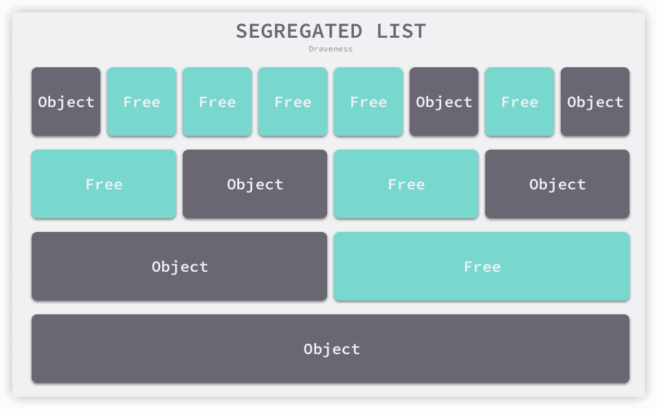

如上图所示，该策略会将内存分割æˆç”± 4ã€8ã€16ã€32 字节的内存å—组æˆçš„链表，当我们å‘内存分é…器申请 8 字节的内存时，它会在上图中找到满足æ¡ä»¶çš„空闲内存å—并返å›ã€‚隔离适应的分é…ç­–ç•¥å‡å°‘了需è¦éå†çš„内存å—æ•°é‡ï¼Œæ高了内存分é…的效ç‡ã€‚

##### 2ï¸âƒ£åˆ†çº§åˆ†é…

线程缓存分é…（Thread-Caching Malloc，TCMalloc）是用äºåˆ†é…内存的机制，它比`glibc`中的`malloc`还è¦å¿«å¾ˆå¤šã€‚Go语言的内存分é…器就借鉴了 `TCMalloc`的设计å®ç°é«˜é€Ÿçš„内存分é…，它的核心ç†å¿µæ˜¯**使用多级缓存将对象根æ®å¤§å°åˆ†ç±»ï¼Œå¹¶æŒ‰ç…§ç±»åˆ«å®æ–½ä¸åŒçš„分é…ç­–ç•¥**。

###### 对象大å°

Go语言的内存分é…器会根æ®ç”³è¯·åˆ†é…的内存大å°é€‰æ‹©ä¸åŒçš„处ç†é€»è¾‘，è¿è¡Œæ—¶æ ¹æ®å¯¹è±¡çš„大å°å°†å¯¹è±¡åˆ†æˆå¾®å¯¹è±¡ã€å°å¯¹è±¡å’Œå¤§å¯¹è±¡ä¸‰ç§ï¼š

|  类别  |     å¤§å°      |
| :----: | :-----------: |
| 微对象 |  `(0, 16B)`   |
| å°å¯¹è±¡ | `[16B, 32KB]` |
| 大对象 | `(32KB, +âˆ)`  |

因为程åºä¸­çš„ç»å¤§å¤šæ•°å¯¹è±¡çš„大å°éƒ½åœ¨32KB以下，而申请的内存大å°å½±å“Go语言è¿è¡Œæ—¶åˆ†é…内存的过程和开销，所以分别处ç†å¤§å¯¹è±¡å’Œå°å¯¹è±¡æœ‰åˆ©äºæ高内存分é…器的性能。

###### 多级缓存

内存分é…器ä¸ä»…会区别对待大å°ä¸åŒçš„对象，还会将内存分æˆä¸åŒçš„级别分别管ç†ï¼ŒTCMallocå’ŒGoè¿è¡Œæ—¶åˆ†é…器都会引入**线程缓存（Thread Cache）ã€ä¸­å¿ƒç¼“存（Central Cache）和页堆（Page Heap）**三个组件分级管ç†å†…存：

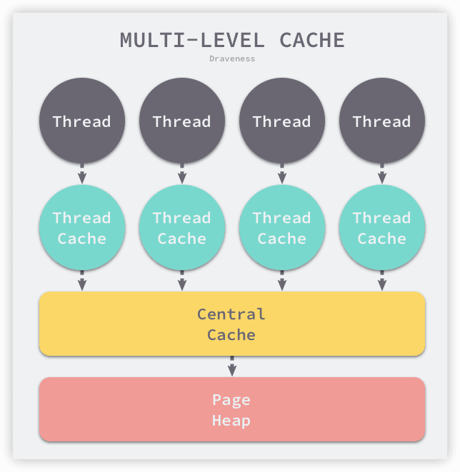

**线程缓存å±äºæ¯ä¸€ä¸ªç‹¬ç«‹çš„线程，它能够满足线程上ç»å¤§å¤šæ•°çš„内存分é…需求，因为ä¸æ¶‰åŠå¤šçº¿ç¨‹ï¼Œæ‰€ä»¥ä¹Ÿä¸éœ€è¦ä½¿ç”¨äº’æ–¥é”æ¥ä¿æŠ¤å†…存，这能够å‡å°‘é”ç«äº‰å¸¦æ¥çš„性能æŸè€—。当线程缓存ä¸èƒ½æ»¡è¶³éœ€æ±‚时，è¿è¡Œæ—¶ä¼šä½¿ç”¨ä¸­å¿ƒç¼“存作为补充解决å°å¯¹è±¡çš„内存分é…，在é‡åˆ° 32KB 以上的对象时，内存分é…器会选择页堆直æ¥åˆ†é…大内存。**

è¿™ç§å¤šå±‚级的内存分é…设计ä¸è®¡ç®—机æ“作系统中的**多级缓存**有些类似，因为多数的对象都是å°å¯¹è±¡ï¼Œæˆ‘们å¯ä»¥é€šè¿‡çº¿ç¨‹ç¼“存和中心缓存æ供足够的内存空间，å‘ç°èµ„æºä¸è¶³æ—¶ä»ä¸Šä¸€çº§ç»„件中è·å–更多的内存资æºã€‚

##### 3ï¸âƒ£è™šæ‹Ÿå†…存布局

这里会介ç»Go语言堆区内存地å€ç©ºé—´çš„设计以åŠæ¼”进过程，在 Go 语言 1.10 以å‰çš„版本，堆区的内存空间都是è¿ç»­çš„；但是在 1.11 版本，Go 团队使用**稀ç–的堆内存**空间替代了è¿ç»­çš„内存，解决了è¿ç»­å†…存带æ¥çš„é™åˆ¶ä»¥åŠåœ¨ç‰¹æ®Šåœºæ™¯ä¸‹å¯èƒ½å‡ºç°çš„问题。

###### 线性内存

Go 语言程åºçš„ 1.10 版本在å¯åŠ¨æ—¶ä¼šåˆå§‹åŒ–整片虚拟内存区域，如下所示的三个区域 `spans`ã€`bitmap` å’Œ `arena` 分别预留了 512MBã€16GB ä»¥åŠ 512GB 的内存空间，这些内存并ä¸æ˜¯çœŸæ­£å­˜åœ¨çš„物ç†å†…存，而是虚拟内存：

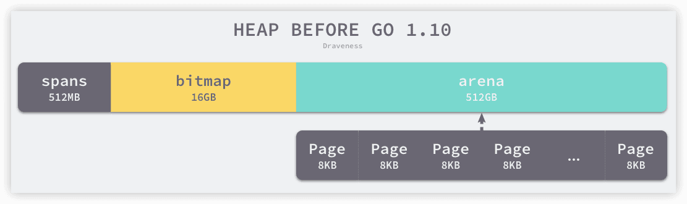

- spans 区域存储了指å‘内存管ç†å•å…ƒ runtime.mspan 的指针，æ¯ä¸ªå†…å­˜å•å…ƒä¼šç®¡ç†å‡ é¡µçš„内存空间，æ¯é¡µå¤§å°ä¸º 8KBï¼›
- bitmap 用äºæ ‡è¯† arena 区域中的那些地å€ä¿å­˜äº†å¯¹è±¡ï¼Œä½å›¾ä¸­çš„æ¯ä¸ªå­—节都会表示堆区中的 32 字节是å¦ç©ºé—²ï¼›
- arena 区域是真正的堆区，è¿è¡Œæ—¶ä¼šå°† 8KB 看åšä¸€é¡µï¼Œè¿™äº›å†…存页中存储了所有在堆上åˆå§‹åŒ–的对象；

对äºä»»æ„一个地å€ï¼Œæˆ‘们都å¯ä»¥æ ¹æ® arena 的基地å€è®¡ç®—该地å€æ‰€åœ¨çš„页数并通过 spans 数组è·å¾—管ç†è¯¥ç‰‡å†…存的管ç†å•å…ƒ `runtime.mspan`，spans 数组中多个è¿ç»­çš„ä½ç½®å¯èƒ½å¯¹åº”åŒä¸€ä¸ª `runtime.mspan` 结æ„。

Go 语言在åƒåœ¾å›æ”¶æ—¶ä¼šæ ¹æ®æŒ‡é’ˆçš„地å€åˆ¤æ–­å¯¹è±¡æ˜¯å¦åœ¨å †ä¸­ï¼Œå¹¶é€šè¿‡ä¸Šä¸€æ®µä¸­ä»‹ç»çš„过程找到管ç†è¯¥å¯¹è±¡çš„ runtime.mspan。这些都建立在**堆区的内存是è¿ç»­**的这一å‡è®¾ä¸Šã€‚è¿™ç§è®¾è®¡è™½ç„¶ç®€å•å¹¶ä¸”方便，但是在 C å’Œ Go æ··åˆä½¿ç”¨æ—¶ä¼šå¯¼è‡´ç¨‹åºå´©æºƒï¼š

1. 分é…的内存地å€ä¼šå‘生冲çªï¼Œå¯¼è‡´å †çš„åˆå§‹åŒ–和扩容失败；
2. 没有被预留的大å—内存å¯èƒ½ä¼šè¢«åˆ†é…ç»™ C 语言的二进制，导致扩容åçš„å †ä¸è¿ç»­ï¼›

线性的堆内存需è¦é¢„留大å—的内存空间，但是申请大å—的内存空间而ä¸ä½¿ç”¨æ˜¯ä¸åˆ‡å®é™…的，ä¸é¢„留内存空间å´ä¼šåœ¨ç‰¹æ®Šåœºæ™¯ä¸‹é€ æˆç¨‹åºå´©æºƒã€‚虽然è¿ç»­å†…存的å®ç°æ¯”较简å•ï¼Œä½†æ˜¯è¿™äº›é—®é¢˜ä¹Ÿæ²¡æœ‰åŠæ³•å¿½ç•¥ã€‚

###### 稀ç–内存

稀ç–内存是 Go 语言在 1.11 中æ出的方案，使用稀ç–的内存布局ä¸ä»…能移除堆大å°çš„上é™5，还能解决 C å’Œ Go æ··åˆä½¿ç”¨æ—¶çš„地å€ç©ºé—´å†²çªé—®é¢˜6。ä¸è¿‡å› ä¸ºåŸºäºç¨€ç–内存的内存管ç†å¤±å»äº†å†…存的è¿ç»­æ€§è¿™ä¸€å‡è®¾ï¼Œè¿™ä¹Ÿä½¿å†…存管ç†å˜å¾—更加å¤æ‚：

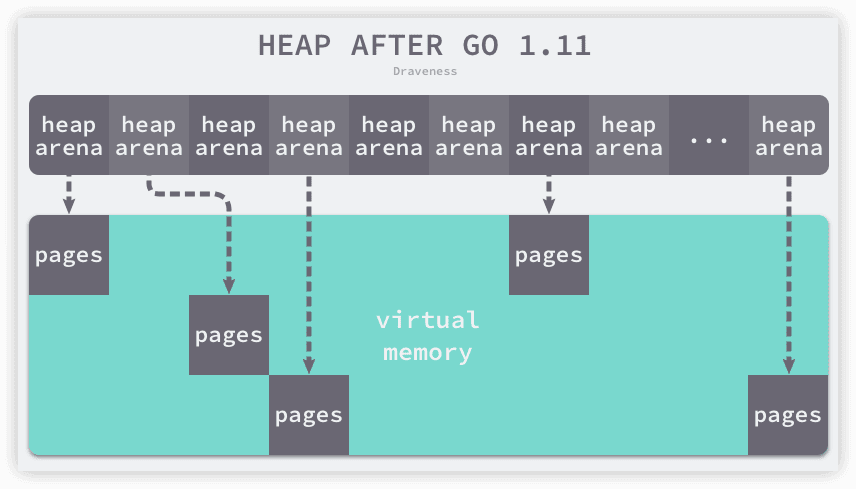

如上图所示，è¿è¡Œæ—¶ä½¿ç”¨äºŒç»´çš„ [`runtime.heapArena`](https://draven.co/golang/tree/runtime.heapArena) 数组管ç†æ‰€æœ‰çš„内存，æ¯ä¸ªå•å…ƒéƒ½ä¼šç®¡ç† 64MB 的内存空间：

```go
type heapArena struct {
	bitmap       [heapArenaBitmapBytes]byte
	spans        [pagesPerArena]*mspan
	pageInUse    [pagesPerArena / 8]uint8
	pageMarks    [pagesPerArena / 8]uint8
	pageSpecials [pagesPerArena / 8]uint8
	checkmarks   *checkmarksMap
	zeroedBase   uintptr
}
```

该结æ„体中的 `bitmap` å’Œ `spans` ä¸çº¿æ€§å†…存中的 `bitmap` å’Œ `spans` 区域一一对应，`zeroedBase` 字段指å‘了该结æ„体管ç†çš„内存的基地å€ã€‚上述设计将åŸæœ‰çš„è¿ç»­å¤§å†…存切分æˆç¨€ç–çš„å°å†…存，而用äºç®¡ç†è¿™äº›å†…存的元信æ¯ä¹Ÿè¢«åˆ‡æˆäº†å°å—。

ä¸åŒå¹³å°å’Œæ¶æ„的二维数组大å°å¯èƒ½å®Œå…¨ä¸åŒï¼Œå¦‚æœæˆ‘们的 Go 语言æœåŠ¡åœ¨ Linux çš„ x86-64 æ¶æ„上è¿è¡Œï¼ŒäºŒç»´æ•°ç»„的一维大å°ä¼šæ˜¯ 1，而二维大å°æ˜¯ 4,194,304，因为æ¯ä¸€ä¸ªæŒ‡é’ˆå ç”¨ 8 字节的内存空间，所以元信æ¯çš„总大å°ä¸º 32MB。由äºæ¯ä¸ª [`runtime.heapArena`](https://draven.co/golang/tree/runtime.heapArena) éƒ½ä¼šç®¡ç† 64MB 的内存，整个堆区最多å¯ä»¥ç®¡ç† 256TB 的内存，这比之å‰çš„ 512GB 多好几个数é‡çº§ã€‚

Go 语言团队在 1.11 版本中通过以下几个æ交将线性内存å˜æˆç¨€ç–内存，移除了 512GB 的内存上é™ä»¥åŠå †åŒºå†…å­˜è¿ç»­æ€§çš„å‡è®¾ï¼š

- [runtime: use sparse mappings for the heap](https://github.com/golang/go/commit/2b415549b813ba36caafa34fc34d72e47ee8335c)
- [runtime: fix various contiguous bitmap assumptions](https://github.com/golang/go/commit/f61057c497e9ccb88dae093778d97aeee941af13)
- [runtime: make the heap bitmap sparse](https://github.com/golang/go/commit/c0392d2e7fbdcd38aafb959e94daf6bbafe2e4e9)
- [runtime: abstract remaining mheap.spans access](https://github.com/golang/go/commit/0de5324d61ba6d4c362f9fa76b6522e28155c83d)
- [runtime: make span map sparse](https://github.com/golang/go/commit/d6e821858157b7cb4ece22fcc1a5c8604478ebaa)
- [runtime: eliminate most uses of mheap*.arena**](https://github.com/golang/go/commit/45ffeab549fa4b03b231a0872025364e13c7f7f0)
- [runtime: remove non-reserved heap logic](https://github.com/golang/go/commit/51ae88ee2f9a1063c272a497527751d786291c89)
- [runtime: move comment about address space sizes to malloc.go](https://github.com/golang/go/commit/90666b8a3d5545f4295d9c2517ad607ce5d45e52)

ç”±äºå†…存的管ç†å˜å¾—更加å¤æ‚，上述改动对åƒåœ¾å›æ”¶ç¨æœ‰å½±å“，大约会å¢åŠ  1% çš„åƒåœ¾å›æ”¶å¼€é”€ï¼Œä¸è¿‡è¿™ä¹Ÿæ˜¯æˆ‘们为了解决已有问题必须付出的æˆæœ¬ã€‚

##### 4ï¸âƒ£åœ°å€ç©ºé—´

因为所有的内存最终都是è¦ä»æ“作系统中申请的，所以Go语言的è¿è¡Œæ—¶æ„建了**æ“作系统的内存管ç†æŠ½è±¡å±‚**，该抽象层将è¿è¡Œæ—¶ç®¡ç†çš„地å€ç©ºé—´åˆ†æˆä»¥ä¸‹å››ç§çŠ¶æ€ï¼š

|    çŠ¶æ€    |                             解释                             |
| :--------: | :----------------------------------------------------------: |
|   `None`   |         内存没有被ä¿ç•™æˆ–者映射，是地å€ç©ºé—´çš„é»˜è®¤çŠ¶æ€         |
| `Reserved` |        è¿è¡Œæ—¶æŒæœ‰è¯¥åœ°å€ç©ºé—´ï¼Œä½†æ˜¯è®¿é—®è¯¥å†…存会导致错误        |
| `Prepared` | 内存被ä¿ç•™ï¼Œä¸€èˆ¬æ²¡æœ‰å¯¹åº”的物ç†å†…存访问该片内存的行为是未定义的å¯ä»¥å¿«é€Ÿè½¬æ¢åˆ° `Ready` çŠ¶æ€ |
|  `Ready`   |                        å¯ä»¥è¢«å®‰å…¨è®¿é—®                        |

æ¯ä¸ªä¸åŒçš„æ“作系统都会包å«ä¸€ç»„用äºç®¡ç†å†…存的特定方法，这些方法å¯ä»¥è®©å†…存地å€ç©ºé—´åœ¨ä¸åŒçš„状æ€ä¹‹é—´è½¬æ¢ï¼Œæˆ‘们å¯ä»¥é€šè¿‡ä¸‹å›¾äº†è§£ä¸åŒçŠ¶æ€ä¹‹é—´çš„转æ¢è¿‡ç¨‹ï¼š

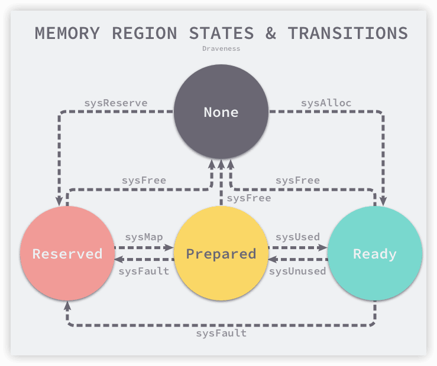

è¿è¡Œæ—¶ä¸­åŒ…å«å¤šä¸ªæ“作系统å®ç°çš„状æ€è½¬æ¢æ–¹æ³•ï¼Œæ‰€æœ‰çš„å®ç°éƒ½åŒ…å«åœ¨ä»¥ `mem_` å¼€å¤´çš„æ–‡ä»¶ä¸­ï¼Œæœ¬èŠ‚å°†ä»‹ç» Linux æ“作系统对上图中方法的å®ç°ï¼šğŸ”–

- [`runtime.sysAlloc`](https://draven.co/golang/tree/runtime.sysAlloc) 会ä»æ“作系统中è·å–一大å—å¯ç”¨çš„内存空间，å¯èƒ½ä¸ºå‡ ç™¾ KB 或者几 MBï¼›
- [`runtime.sysFree`](https://draven.co/golang/tree/runtime.sysFree) 会在程åºå‘生内存ä¸è¶³ï¼ˆOut-of Memory，OOM）时调用并无æ¡ä»¶åœ°è¿”å›å†…存；
- [`runtime.sysReserve`](https://draven.co/golang/tree/runtime.sysReserve) 会ä¿ç•™æ“作系统中的一片内存区域，访问这片内存会触å‘异常；
- [`runtime.sysMap`](https://draven.co/golang/tree/runtime.sysMap) ä¿è¯å†…存区域å¯ä»¥å¿«é€Ÿè½¬æ¢è‡³å°±ç»ªçŠ¶æ€ï¼›
- [`runtime.sysUsed`](https://draven.co/golang/tree/runtime.sysUsed) 通知æ“作系统应用程åºéœ€è¦ä½¿ç”¨è¯¥å†…存区域，ä¿è¯å†…存区域å¯ä»¥å®‰å…¨è®¿é—®ï¼›
- [`runtime.sysUnused`](https://draven.co/golang/tree/runtime.sysUnused) 通知æ“作系统虚拟内存对应的物ç†å†…存已ç»ä¸å†éœ€è¦ï¼Œå¯ä»¥é‡ç”¨ç‰©ç†å†…存；
- [`runtime.sysFault`](https://draven.co/golang/tree/runtime.sysFault) 将内存区域转æ¢æˆä¿ç•™çŠ¶æ€ï¼Œä¸»è¦ç”¨äºè¿è¡Œæ—¶çš„调试；

è¿è¡Œæ—¶ä½¿ç”¨ Linux æ供的 `mmap`ã€`munmap` å’Œ `madvise` 等系统调用å®ç°äº†æ“作系统的内存管ç†æŠ½è±¡å±‚，抹平了ä¸åŒæ“作系统的差异，为è¿è¡Œæ—¶æ供了更加方便的æ¥å£ï¼Œé™¤äº† Linux 之外，è¿è¡Œæ—¶è¿˜å®ç°äº† BSDã€Darwinã€Plan9 ä»¥åŠ Windows 等平å°ä¸ŠæŠ½è±¡å±‚。

#### 73.1.2 内存管ç†ç»„件

Go 语言的内存分é…器包å«ï¼š**内存管ç†å•å…ƒã€çº¿ç¨‹ç¼“å­˜ã€ä¸­å¿ƒç¼“存和页堆**，分别对应的数æ®ç»“æ„：`runtime.mspan`ã€`runtime.mcache`ã€`runtime.mcentral` å’Œ `runtime.mheap`。

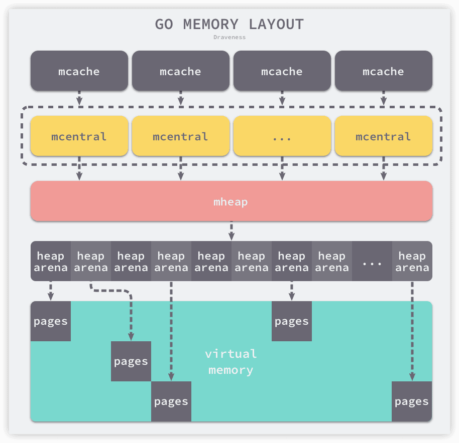

所有的 Go 语言程åºéƒ½ä¼šåœ¨å¯åŠ¨æ—¶åˆå§‹åŒ–如上图所示的内存布局，æ¯ä¸€ä¸ªå¤„ç†å™¨éƒ½ä¼šåˆ†é…一个线程缓存 [`runtime.mcache`](https://draven.co/golang/tree/runtime.mcache) 用äºå¤„ç†å¾®å¯¹è±¡å’Œå°å¯¹è±¡çš„分é…，它们会æŒæœ‰å†…存管ç†å•å…ƒ [`runtime.mspan`](https://draven.co/golang/tree/runtime.mspan)。

æ¯ä¸ªç±»å‹çš„内存管ç†å•å…ƒéƒ½ä¼šç®¡ç†ç‰¹å®šå¤§å°çš„对象，当内存管ç†å•å…ƒä¸­ä¸å­˜åœ¨ç©ºé—²å¯¹è±¡æ—¶ï¼Œå®ƒä»¬ä¼šä» [`runtime.mheap`](https://draven.co/golang/tree/runtime.mheap) æŒæœ‰çš„ 134 个中心缓存 [`runtime.mcentral`](https://draven.co/golang/tree/runtime.mcentral) 中è·å–新的内存å•å…ƒï¼Œä¸­å¿ƒç¼“å­˜å±äºå…¨å±€çš„堆结æ„体 [`runtime.mheap`](https://draven.co/golang/tree/runtime.mheap)，它会ä»æ“作系统中申请内存。

在 amd64 çš„ Linux æ“作系统上，[`runtime.mheap`](https://draven.co/golang/tree/runtime.mheap) 会æŒæœ‰ 4,194,304 [`runtime.heapArena`](https://draven.co/golang/tree/runtime.heapArena)，æ¯ä¸ª [`runtime.heapArena`](https://draven.co/golang/tree/runtime.heapArena) éƒ½ä¼šç®¡ç† 64MB 的内存，å•ä¸ª Go 语言程åºçš„内存上é™ä¹Ÿå°±æ˜¯ 256TB。

##### 73.1.2.1 内存管ç†å•å…ƒ

[`runtime.mspan`](https://draven.co/golang/tree/runtime.mspan) 是 Go 语言内存管ç†çš„基本å•å…ƒï¼Œè¯¥ç»“æ„ä½“ä¸­åŒ…å« `next` å’Œ `prev` 两个字段，它们分别指å‘了å‰ä¸€ä¸ªå’Œå一个 [`runtime.mspan`](https://draven.co/golang/tree/runtime.mspan)：

```go
type mspan struct {
	next *mspan
	prev *mspan
	...
}
```

串è”å的上述结æ„体会æ„æˆå¦‚下åŒå‘链表，è¿è¡Œæ—¶ä¼šä½¿ç”¨ [`runtime.mSpanList`](https://draven.co/golang/tree/runtime.mSpanList) 存储åŒå‘链表的头结点和尾节点并在线程缓存以åŠä¸­å¿ƒç¼“存中使用。

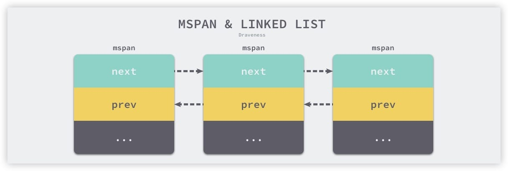

###### 页和内存

æ¯ä¸ª [`runtime.mspan`](https://draven.co/golang/tree/runtime.mspan) éƒ½ç®¡ç† `npages` 个大å°ä¸º 8KB 的页，这里的页ä¸æ˜¯æ“作系统中的内存页，它们是æ“作系统内存页的整数å€ï¼Œè¯¥ç»“æ„体会使用下é¢è¿™äº›å­—段æ¥ç®¡ç†å†…存页的分é…å’Œå›æ”¶ï¼š

```go
type mspan struct {
	startAddr uintptr // 起始地å€
	npages    uintptr // 页数
	freeindex uintptr

	allocBits  *gcBits
	gcmarkBits *gcBits
	allocCache uint64
	...
}
```

- `startAddr` å’Œ `npages` —— 确定该结æ„体管ç†çš„多个页所在的内存，æ¯ä¸ªé¡µçš„大å°éƒ½æ˜¯ 8KBï¼›
- `freeindex` —— 扫æ页中空闲对象的åˆå§‹ç´¢å¼•ï¼›
- `allocBits` å’Œ `gcmarkBits` —— 分别用äºæ ‡è®°å†…存的å ç”¨å’Œå›æ”¶æƒ…况；
- `allocCache` —— `allocBits` çš„è¡¥ç ï¼Œå¯ä»¥ç”¨äºå¿«é€ŸæŸ¥æ‰¾å†…存中未被使用的内存；

[`runtime.mspan`](https://draven.co/golang/tree/runtime.mspan) 会以两ç§ä¸åŒçš„视角看待管ç†çš„内存，当结æ„体管ç†çš„内存ä¸è¶³æ—¶ï¼Œè¿è¡Œæ—¶ä¼šä»¥é¡µä¸ºå•ä½å‘堆申请内存：

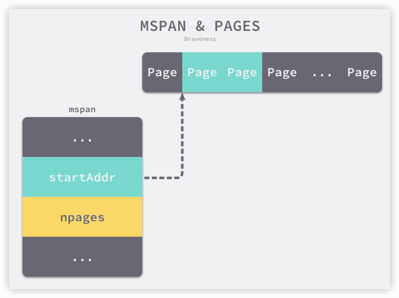

当用户程åºæˆ–è€…çº¿ç¨‹å‘ [`runtime.mspan`](https://draven.co/golang/tree/runtime.mspan) 申请内存时，它会使用 `allocCache` 字段以对象为å•ä½åœ¨ç®¡ç†çš„内存中快速查找待分é…的空间：

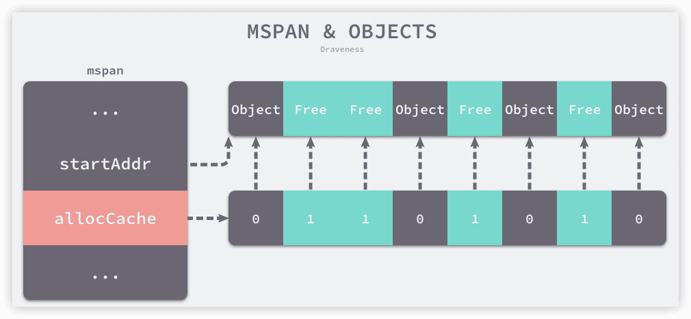

如æœæˆ‘们能在内存中找到空闲的内存å•å…ƒä¼šç›´æ¥è¿”å›ï¼Œå½“内存中ä¸åŒ…å«ç©ºé—²çš„内存时，上一级的组件 [`runtime.mcache`](https://draven.co/golang/tree/runtime.mcache) 会为调用 [`runtime.mcache.refill`](https://draven.co/golang/tree/runtime.mcache.refill) 更新内存管ç†å•å…ƒä»¥æ»¡è¶³ä¸ºæ›´å¤šå¯¹è±¡åˆ†é…内存的需求。

###### çŠ¶æ€ 

è¿è¡Œæ—¶ä¼šä½¿ç”¨ [`runtime.mSpanStateBox`](https://draven.co/golang/tree/runtime.mSpanStateBox) 存储内存管ç†å•å…ƒçš„çŠ¶æ€ [`runtime.mSpanState`](https://draven.co/golang/tree/runtime.mSpanState)：

```go
type mspan struct {
	...
	state       mSpanStateBox
	...
}
```

该状æ€å¯èƒ½å¤„äº `mSpanDead`ã€`mSpanInUse`ã€`mSpanManual` å’Œ `mSpanFree` å››ç§æƒ…况。当 [`runtime.mspan`](https://draven.co/golang/tree/runtime.mspan) åœ¨ç©ºé—²å †ä¸­ï¼Œå®ƒä¼šå¤„äº `mSpanFree` 状æ€ï¼›å½“ [`runtime.mspan`](https://draven.co/golang/tree/runtime.mspan) å·²ç»è¢«åˆ†é…æ—¶ï¼Œå®ƒä¼šå¤„äº `mSpanInUse`ã€`mSpanManual` 状æ€ï¼Œè¿è¡Œæ—¶ä¼šéµå¾ªä¸‹é¢çš„规则转æ¢è¯¥çŠ¶æ€ï¼š

- 在åƒåœ¾å›æ”¶çš„ä»»æ„阶段，å¯èƒ½ä» `mSpanFree` 转æ¢åˆ° `mSpanInUse` å’Œ `mSpanManual`ï¼›
- 在åƒåœ¾å›æ”¶çš„清除阶段，å¯èƒ½ä» `mSpanInUse` å’Œ `mSpanManual` 转æ¢åˆ° `mSpanFree`ï¼›
- 在åƒåœ¾å›æ”¶çš„标记阶段，ä¸èƒ½ä» `mSpanInUse` å’Œ `mSpanManual` 转æ¢åˆ° `mSpanFree`ï¼›

设置 [`runtime.mspan`](https://draven.co/golang/tree/runtime.mspan) 状æ€çš„æ“作必须是åŸå­æ€§çš„以é¿å…åƒåœ¾å›æ”¶é€ æˆçš„线程ç«äº‰é—®é¢˜ã€‚

###### 跨度类

[`runtime.spanClass`](https://draven.co/golang/tree/runtime.spanClass) 是 [`runtime.mspan`](https://draven.co/golang/tree/runtime.mspan) 的跨度类，它决定了内存管ç†å•å…ƒä¸­å­˜å‚¨çš„对象大å°å’Œä¸ªæ•°ï¼š

```go
type mspan struct {
	...
	spanclass   spanClass
	...
}
```

Go 语言的内存管ç†æ¨¡å—ä¸­ä¸€å…±åŒ…å« 67 ç§è·¨åº¦ç±»ï¼Œæ¯ä¸€ä¸ªè·¨åº¦ç±»éƒ½ä¼šå­˜å‚¨ç‰¹å®šå¤§å°çš„对象并且包å«ç‰¹å®šæ•°é‡çš„页数以åŠå¯¹è±¡ï¼Œæ‰€æœ‰çš„æ•°æ®éƒ½ä¼šè¢«é¢„选计算好并存储在 [`runtime.class_to_size`](https://draven.co/golang/tree/runtime.class_to_size) å’Œ [`runtime.class_to_allocnpages`](https://draven.co/golang/tree/runtime.class_to_allocnpages) ç­‰å˜é‡ä¸­ï¼š

**表 7-3 跨度类的数æ®**

| class | bytes/obj | bytes/span | objects | tail waste | max waste |
| :---: | --------: | ---------: | ------: | :--------: | :-------: |
|   1   |         8 |       8192 |    1024 |     0      |  87.50%   |
|   2   |        16 |       8192 |     512 |     0      |  43.75%   |
|   3   |        24 |       8192 |     341 |     0      |  29.24%   |
|   4   |        32 |       8192 |     256 |     0      |  46.88%   |
|   5   |        48 |       8192 |     170 |     32     |  31.52%   |
|   6   |        64 |       8192 |     128 |     0      |  23.44%   |
|   7   |        80 |       8192 |     102 |     32     |  19.07%   |
|   …   |         … |          … |       … |     …      |     …     |
|  67   |     32768 |      32768 |       1 |     0      |  12.50%   |

上表展示了对象大å°ä» 8B 到 32KB，总共 67 ç§è·¨åº¦ç±»çš„大å°ã€å­˜å‚¨çš„对象数以åŠæµªè´¹çš„内存空间，以表中的第四个跨度类为例，跨度类为 5 çš„ [`runtime.mspan`](https://draven.co/golang/tree/runtime.mspan) 中对象的大å°ä¸Šé™ä¸º 48 字节ã€ç®¡ç† 1 个页ã€æœ€å¤šå¯ä»¥å­˜å‚¨ 170 个对象。因为内存需è¦æŒ‰ç…§é¡µè¿›è¡Œç®¡ç†ï¼Œæ‰€ä»¥åœ¨å°¾éƒ¨ä¼šæµªè´¹ 32 字节的内存，当页中存储的对象都是 33 字节时，最多会浪费 31.52% 的资æºï¼š

$$\frac{(48 - 33) * 170 + 32}{8192} = 0.31518$$

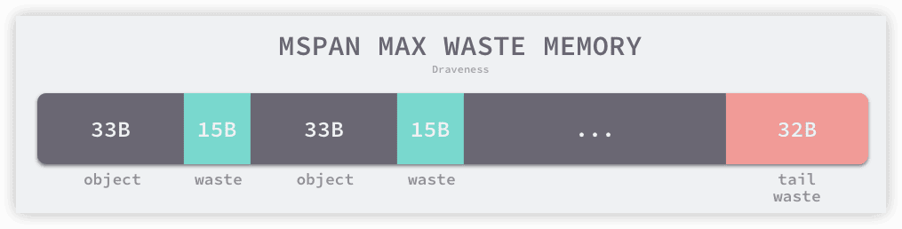

除了上述 67 个跨度类之外，è¿è¡Œæ—¶ä¸­è¿˜åŒ…å« ID 为 0 的特殊跨度类，它能够管ç†å¤§äº 32KB 的特殊对象，我们会在åé¢è¯¦ç»†ä»‹ç»å¤§å¯¹è±¡çš„分é…过程，在这里就ä¸å±•å¼€è¯´æ˜äº†ã€‚

跨度类中除了存储类别的 ID 之外，它还会存储一个 `noscan` 标记ä½ï¼Œè¯¥æ ‡è®°ä½è¡¨ç¤ºå¯¹è±¡æ˜¯å¦åŒ…å«æŒ‡é’ˆï¼Œåƒåœ¾å›æ”¶ä¼šå¯¹åŒ…å«æŒ‡é’ˆçš„ [`runtime.mspan`](https://draven.co/golang/tree/runtime.mspan) 结æ„体进行扫æ。我们å¯ä»¥é€šè¿‡ä¸‹é¢çš„几个函数和方法了解 ID 和标记ä½çš„底层存储方å¼ï¼š

```go
func makeSpanClass(sizeclass uint8, noscan bool) spanClass {
	return spanClass(sizeclass<<1) | spanClass(bool2int(noscan))
}

func (sc spanClass) sizeclass() int8 {
	return int8(sc >> 1)
}

func (sc spanClass) noscan() bool {
	return sc&1 != 0
}
```

[`runtime.spanClass`](https://draven.co/golang/tree/runtime.spanClass) 是一个 `uint8` ç±»å‹çš„æ•´æ•°ï¼Œå®ƒçš„å‰ 7 ä½å­˜å‚¨ç€è·¨åº¦ç±»çš„ ID，最å一ä½è¡¨ç¤ºæ˜¯å¦åŒ…å«æŒ‡é’ˆï¼Œè¯¥ç±»å‹æ供的两个方法能够帮我们快速è·å–对应的字段。

##### 73.1.2.2 线程缓存

[`runtime.mcache`](https://draven.co/golang/tree/runtime.mcache) 是 Go 语言中的线程缓存，它会ä¸çº¿ç¨‹ä¸Šçš„处ç†å™¨ä¸€ä¸€ç»‘定，主è¦ç”¨æ¥ç¼“存用户程åºç”³è¯·çš„å¾®å°å¯¹è±¡ã€‚æ¯ä¸€ä¸ªçº¿ç¨‹ç¼“存都æŒæœ‰ 68 * 2 个 [`runtime.mspan`](https://draven.co/golang/tree/runtime.mspan)，这些内存管ç†å•å…ƒéƒ½å­˜å‚¨åœ¨ç»“æ„体的 `alloc` 字段中：

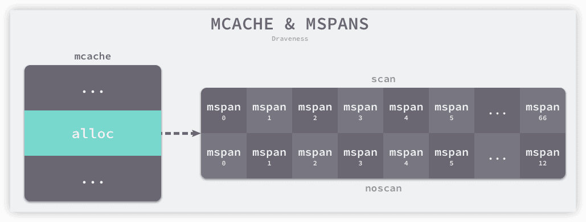

线程缓存在刚刚被åˆå§‹åŒ–时是ä¸åŒ…å« [`runtime.mspan`](https://draven.co/golang/tree/runtime.mspan) 的，åªæœ‰å½“用户程åºç”³è¯·å†…存时æ‰ä¼šä»ä¸Šä¸€çº§ç»„件è·å–æ–°çš„ [`runtime.mspan`](https://draven.co/golang/tree/runtime.mspan) 满足内存分é…的需求。

###### åˆå§‹åŒ– 

è¿è¡Œæ—¶åœ¨åˆå§‹åŒ–处ç†å™¨æ—¶ä¼šè°ƒç”¨ [`runtime.allocmcache`](https://draven.co/golang/tree/runtime.allocmcache) åˆå§‹åŒ–线程缓存，该函数会在系统栈中使用 [`runtime.mheap`](https://draven.co/golang/tree/runtime.mheap) 中的线程缓存分é…器åˆå§‹åŒ–æ–°çš„ [`runtime.mcache`](https://draven.co/golang/tree/runtime.mcache) 结æ„体：

```go
func allocmcache() *mcache {
	var c *mcache
	systemstack(func() {
		lock(&mheap_.lock)
		c = (*mcache)(mheap_.cachealloc.alloc())
		c.flushGen = mheap_.sweepgen
		unlock(&mheap_.lock)
	})
	for i := range c.alloc {
		c.alloc[i] = &emptymspan
	}
	c.nextSample = nextSample()
	return c
}
```

å°±åƒæˆ‘们在上é¢æ到的，åˆå§‹åŒ–åçš„ [`runtime.mcache`](https://draven.co/golang/tree/runtime.mcache) 中的所有 [`runtime.mspan`](https://draven.co/golang/tree/runtime.mspan) 都是空的å ä½ç¬¦ `emptymspan`。

###### 替æ¢

[`runtime.mcache.refill`](https://draven.co/golang/tree/runtime.mcache.refill) 会为线程缓存è·å–一个指定跨度类的内存管ç†å•å…ƒï¼Œè¢«æ›¿æ¢çš„å•å…ƒä¸èƒ½åŒ…å«ç©ºé—²çš„内存空间，而è·å–çš„å•å…ƒä¸­éœ€è¦è‡³å°‘包å«ä¸€ä¸ªç©ºé—²å¯¹è±¡ç”¨äºåˆ†é…内存：

```go
func (c *mcache) refill(spc spanClass) {
	s := c.alloc[spc]
	s = mheap_.central[spc].mcentral.cacheSpan()
	c.alloc[spc] = s
}
```

如上述代ç æ‰€ç¤ºï¼Œè¯¥æ–¹æ³•ä¼šä»ä¸­å¿ƒç¼“存中申请新的 [`runtime.mspan`](https://draven.co/golang/tree/runtime.mspan) 存储到线程缓存中，这也是å‘线程缓存æ’入内存管ç†å•å…ƒçš„唯一方法。

###### 微分é…器

线程缓存中还包å«å‡ ä¸ªç”¨äºåˆ†é…微对象的字段，下é¢çš„这三个字段组æˆäº†å¾®å¯¹è±¡åˆ†é…å™¨ï¼Œä¸“é—¨ç®¡ç† 16 字节以下的对象：

```go
type mcache struct {
	tiny             uintptr
	tinyoffset       uintptr
	local_tinyallocs uintptr
}
```

微分é…器åªä¼šç”¨äºåˆ†é…é指针类å‹çš„内存，上述三个字段中 `tiny` 会指å‘堆中的一片内存，`tinyOffset` 是下一个空闲内存所在的å移é‡ï¼Œæœ€åçš„ `local_tinyallocs` 会记录内存分é…器中分é…的对象个数。


##### 73.1.2.3 中心缓存

[`runtime.mcentral`](https://draven.co/golang/tree/runtime.mcentral) 是内存分é…器的中心缓存，ä¸çº¿ç¨‹ç¼“å­˜ä¸åŒï¼Œè®¿é—®ä¸­å¿ƒç¼“存中的内存管ç†å•å…ƒéœ€è¦ä½¿ç”¨äº’æ–¥é”：

```go
type mcentral struct {
	spanclass spanClass
	partial  [2]spanSet
	full     [2]spanSet
}
```

æ¯ä¸ªä¸­å¿ƒç¼“存都会管ç†æŸä¸ªè·¨åº¦ç±»çš„内存管ç†å•å…ƒï¼Œå®ƒä¼šåŒæ—¶æŒæœ‰ä¸¤ä¸ª [`runtime.spanSet`](https://draven.co/golang/tree/runtime.spanSet)，分别存储包å«ç©ºé—²å¯¹è±¡å’Œä¸åŒ…å«ç©ºé—²å¯¹è±¡çš„内存管ç†å•å…ƒã€‚

###### 内存管ç†å•å…ƒ 

线程缓存会通过中心缓存的 [`runtime.mcentral.cacheSpan`](https://draven.co/golang/tree/runtime.mcentral.cacheSpan) 方法è·å–新的内存管ç†å•å…ƒï¼Œè¯¥æ–¹æ³•çš„å®ç°æ¯”较å¤æ‚，我们å¯ä»¥å°†å…¶åˆ†æˆä»¥ä¸‹å‡ ä¸ªéƒ¨åˆ†ï¼š

1. 调用 [`runtime.mcentral.partialSwept`](https://draven.co/golang/tree/runtime.mcentral.partialSwept) ä»æ¸…ç†è¿‡çš„ã€åŒ…å«ç©ºé—²ç©ºé—´çš„ [`runtime.spanSet`](https://draven.co/golang/tree/runtime.spanSet) 结æ„中查找å¯ä»¥ä½¿ç”¨çš„内存管ç†å•å…ƒï¼›
2. 调用 [`runtime.mcentral.partialUnswept`](https://draven.co/golang/tree/runtime.mcentral.partialUnswept) ä»æœªè¢«æ¸…ç†è¿‡çš„ã€æœ‰ç©ºé—²å¯¹è±¡çš„ [`runtime.spanSet`](https://draven.co/golang/tree/runtime.spanSet) 结æ„中查找å¯ä»¥ä½¿ç”¨çš„内存管ç†å•å…ƒï¼›
3. 调用 [`runtime.mcentral.fullUnswept`](https://draven.co/golang/tree/runtime.mcentral.fullUnswept) è·å–未被清ç†çš„ã€ä¸åŒ…å«ç©ºé—²ç©ºé—´çš„ [`runtime.spanSet`](https://draven.co/golang/tree/runtime.spanSet) 中è·å–内存管ç†å•å…ƒå¹¶é€šè¿‡ [`runtime.mspan.sweep`](https://draven.co/golang/tree/runtime.mspan.sweep) 清ç†å®ƒçš„内存空间；
4. 调用 [`runtime.mcentral.grow`](https://draven.co/golang/tree/runtime.mcentral.grow) ä»å †ä¸­ç”³è¯·æ–°çš„内存管ç†å•å…ƒï¼›
5. 更新内存管ç†å•å…ƒçš„ `allocCache` 等字段帮助快速分é…内存；

首先我们会在中心缓存的空闲集åˆä¸­æŸ¥æ‰¾å¯ç”¨çš„ [`runtime.mspan`](https://draven.co/golang/tree/runtime.mspan)，è¿è¡Œæ—¶æ€»æ˜¯ä¼šå…ˆä»è·å–清ç†è¿‡çš„内存管ç†å•å…ƒï¼Œå检查未清ç†çš„内存管ç†å•å…ƒï¼š

```go
func (c *mcentral) cacheSpan() *mspan {
	sg := mheap_.sweepgen
	spanBudget := 100

	var s *mspan
	if s = c.partialSwept(sg).pop(); s != nil {
		goto havespan
	}

	for ; spanBudget >= 0; spanBudget-- {
		s = c.partialUnswept(sg).pop()
		if s == nil {
			break
		}
		if atomic.Load(&s.sweepgen) == sg-2 && atomic.Cas(&s.sweepgen, sg-2, sg-1) {
ã€			s.sweep(true)
			goto havespan
		}
	}
	...
}
```

当找到需è¦å›æ”¶çš„内存å•å…ƒæ—¶ï¼Œè¿è¡Œæ—¶ä¼šè§¦å‘ [`runtime.mspan.sweep`](https://draven.co/golang/tree/runtime.mspan.sweep) 进行清ç†ï¼Œå¦‚æœåœ¨åŒ…å«ç©ºé—²ç©ºé—´çš„集åˆä¸­æ²¡æœ‰æ‰¾åˆ°ç®¡ç†å•å…ƒï¼Œé‚£ä¹ˆè¿è¡Œæ—¶å°è¯•ä¼šä»æœªæ¸…ç†çš„集åˆä¸­è·å–：

```go
func (c *mcentral) cacheSpan() *mspan {
	...
	for ; spanBudget >= 0; spanBudget-- {
		s = c.fullUnswept(sg).pop()
		if s == nil {
			break
		}
		if atomic.Load(&s.sweepgen) == sg-2 && atomic.Cas(&s.sweepgen, sg-2, sg-1) {
ã€			s.sweep(true)
ã€			freeIndex := s.nextFreeIndex()
			if freeIndex != s.nelems {
				s.freeindex = freeIndex
				goto havespan
			}
ã€			c.fullSwept(sg).push(s)
		}
ã€	}
	...
}
```

å¦‚æœ [`runtime.mcentral`](https://draven.co/golang/tree/runtime.mcentral) 通过上述两个阶段都没有找到å¯ç”¨çš„å•å…ƒï¼Œå®ƒä¼šè°ƒç”¨ [`runtime.mcentral.grow`](https://draven.co/golang/tree/runtime.mcentral.grow) 触å‘扩容ä»å †ä¸­ç”³è¯·æ–°çš„内存：

```go
func (c *mcentral) cacheSpan() *mspan {
	...
	s = c.grow()
	if s == nil {
		return nil
	}

havespan:
	freeByteBase := s.freeindex &^ (64 - 1)
	whichByte := freeByteBase / 8
	s.refillAllocCache(whichByte)

	s.allocCache >>= s.freeindex % 64

	return s
}
```

无论通过哪ç§æ–¹æ³•è·å–到了内存å•å…ƒï¼Œè¯¥æ–¹æ³•çš„最å都会更新内存å•å…ƒçš„ `allocBits` å’Œ `allocCache` 等字段，让è¿è¡Œæ—¶åœ¨åˆ†é…内存时能够快速找到空闲的对象。

###### 扩容

中心缓存的扩容方法 [`runtime.mcentral.grow`](https://draven.co/golang/tree/runtime.mcentral.grow) 会根æ®é¢„先计算的 `class_to_allocnpages` å’Œ `class_to_size` è·å–待分é…的页数以åŠè·¨åº¦ç±»å¹¶è°ƒç”¨ [`runtime.mheap.alloc`](https://draven.co/golang/tree/runtime.mheap.alloc) è·å–æ–°çš„ [`runtime.mspan`](https://draven.co/golang/tree/runtime.mspan) 结æ„：

```go
func (c *mcentral) grow() *mspan {
	npages := uintptr(class_to_allocnpages[c.spanclass.sizeclass()])
	size := uintptr(class_to_size[c.spanclass.sizeclass()])

	s := mheap_.alloc(npages, c.spanclass, true)
	if s == nil {
		return nil
	}

	n := (npages << _PageShift) >> s.divShift * uintptr(s.divMul) >> s.divShift2
	s.limit = s.base() + size*n
	heapBitsForAddr(s.base()).initSpan(s)
	return s
}
```

è·å–了 [`runtime.mspan`](https://draven.co/golang/tree/runtime.mspan) å，我们会在上述方法中åˆå§‹åŒ– `limit` 字段并清除该结æ„在堆上对应的ä½å›¾ã€‚

##### 73.1.2.4 页堆

[`runtime.mheap`](https://draven.co/golang/tree/runtime.mheap) 是内存分é…的核心结æ„体，Go 语言程åºä¼šå°†å…¶ä½œä¸ºå…¨å±€å˜é‡å­˜å‚¨ï¼Œè€Œå †ä¸Šåˆå§‹åŒ–的所有对象都由该结æ„体统一管ç†ï¼Œè¯¥ç»“æ„体中包å«ä¸¤ç»„é常é‡è¦çš„字段，其中一个是全局的中心缓存列表 `central`，å¦ä¸€ä¸ªæ˜¯ç®¡ç†å †åŒºå†…存区域的 `arenas` 以åŠç›¸å…³å­—段。

页堆中包å«ä¸€ä¸ªé•¿åº¦ä¸º 136 çš„ [`runtime.mcentral`](https://draven.co/golang/tree/runtime.mcentral) 数组，其中 68 ä¸ªä¸ºè·¨åº¦ç±»éœ€è¦ `scan` 的中心缓存，å¦å¤–çš„ 68 个是 `noscan` 的中心缓存：

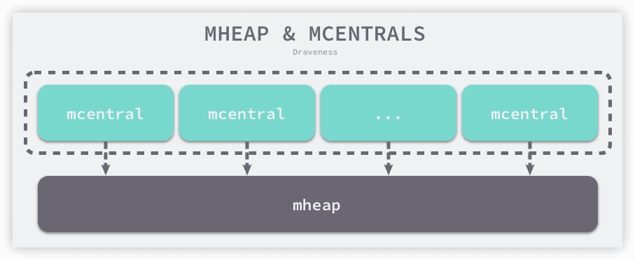

在设计åŸç†ä¸€èŠ‚中已ç»ä»‹ç»è¿‡ Go 语言所有的内存空间都由如下所示的二维矩阵 [`runtime.heapArena`](https://draven.co/golang/tree/runtime.heapArena) 管ç†ï¼Œè¿™ä¸ªäºŒç»´çŸ©é˜µç®¡ç†çš„内存å¯ä»¥æ˜¯ä¸è¿ç»­çš„：

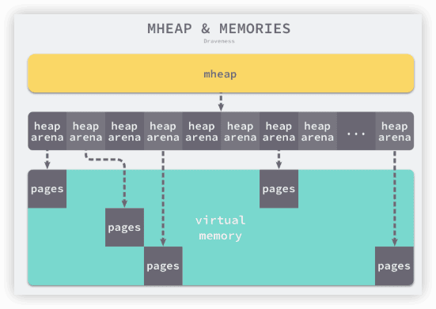

在除了 Windows 以外的 64 ä½æ“作系统中，æ¯ä¸€ä¸ª [`runtime.heapArena`](https://draven.co/golang/tree/runtime.heapArena) éƒ½ä¼šç®¡ç† 64MB 的内存空间，如下所示的表格展示了ä¸åŒå¹³å°ä¸Š Go 语言程åºç®¡ç†çš„堆区大å°ä»¥åŠ [`runtime.heapArena`](https://draven.co/golang/tree/runtime.heapArena) å ç”¨çš„内存空间：

|           å¹³å° | 地å€ä½æ•° | Arena å¤§å° | ä¸€ç»´å¤§å° |   äºŒç»´å¤§å° |
| -------------: | -------: | ---------: | -------: | ---------: |
|       */64-bit |       48 |       64MB |        1 |  4M (32MB) |
| windows/64-bit |       48 |        4MB |       64 |   1M (8MB) |
|       */32-bit |       32 |        4MB |        1 | 1024 (4KB) |
|     */mips(le) |       31 |        4MB |        1 |  512 (2KB) |

**表 7-3 å¹³å°ä¸é¡µå †å¤§å°çš„关系**

本节将介ç»é¡µå †çš„åˆå§‹åŒ–ã€å†…存分é…以åŠå†…存管ç†å•å…ƒåˆ†é…的过程，这些过程能够帮助我们ç†è§£å…¨å±€å˜é‡é¡µå †ä¸å…¶ä»–组件的关系以åŠå®ƒç®¡ç†å†…存的方å¼ã€‚

###### åˆå§‹åŒ–

堆区的åˆå§‹åŒ–会使用 [`runtime.mheap.init`](https://draven.co/golang/tree/runtime.mheap.init) 方法，我们能看到该方法åˆå§‹åŒ–了é常多的结æ„体和字段，ä¸è¿‡å…¶ä¸­åˆå§‹åŒ–的两类å˜é‡æ¯”较é‡è¦ï¼š

1. `spanalloc`ã€`cachealloc` ä»¥åŠ `arenaHintAlloc` ç­‰ [`runtime.fixalloc`](https://draven.co/golang/tree/runtime.fixalloc) ç±»å‹çš„空闲链表分é…器；
2. `central` 切片中 [`runtime.mcentral`](https://draven.co/golang/tree/runtime.mcentral) ç±»å‹çš„中心缓存；

```go
func (h *mheap) init() {
	h.spanalloc.init(unsafe.Sizeof(mspan{}), recordspan, unsafe.Pointer(h), &memstats.mspan_sys)
	h.cachealloc.init(unsafe.Sizeof(mcache{}), nil, nil, &memstats.mcache_sys)
	h.specialfinalizeralloc.init(unsafe.Sizeof(specialfinalizer{}), nil, nil, &memstats.other_sys)
	h.specialprofilealloc.init(unsafe.Sizeof(specialprofile{}), nil, nil, &memstats.other_sys)
	h.arenaHintAlloc.init(unsafe.Sizeof(arenaHint{}), nil, nil, &memstats.other_sys)

	h.spanalloc.zero = false

	for i := range h.central {
		h.central[i].mcentral.init(spanClass(i))
	}

	h.pages.init(&h.lock, &memstats.gc_sys)
}
```

堆中åˆå§‹åŒ–的多个空闲链表分é…器ä¸è®¾è®¡åŸç†ä¸­æ到的分é…器没有太多区别，当我们调用 [`runtime.fixalloc.init`](https://draven.co/golang/tree/runtime.fixalloc.init) åˆå§‹åŒ–分é…器时，需è¦ä¼ å…¥å¾…åˆå§‹åŒ–的结æ„体大å°ç­‰ä¿¡æ¯ï¼Œè¿™ä¼šå¸®åŠ©åˆ†é…器分割待分é…的内存，它æ供了以下两个用äºåˆ†é…和释放内存的方法：

1. [`runtime.fixalloc.alloc`](https://draven.co/golang/tree/runtime.fixalloc.alloc) — è·å–下一个空闲的内存空间；
2. [`runtime.fixalloc.free`](https://draven.co/golang/tree/runtime.fixalloc.free) — 释放指针指å‘的内存空间；

除了这些空闲链表分é…器之外，我们还会在该方法中åˆå§‹åŒ–所有的中心缓存，这些中心缓存会维护全局的内存管ç†å•å…ƒï¼Œå„个线程会通过中心缓存è·å–新的内存å•å…ƒã€‚

###### 内存管ç†å•å…ƒ

[`runtime.mheap`](https://draven.co/golang/tree/runtime.mheap) 是内存分é…器中的核心组件，è¿è¡Œæ—¶ä¼šé€šè¿‡å®ƒçš„ [`runtime.mheap.alloc`](https://draven.co/golang/tree/runtime.mheap.alloc) 方法在系统栈中è·å–æ–°çš„ [`runtime.mspan`](https://draven.co/golang/tree/runtime.mspan) å•å…ƒï¼š

```go
func (h *mheap) alloc(npages uintptr, spanclass spanClass, needzero bool) *mspan {
	var s *mspan
	systemstack(func() {
		if h.sweepdone == 0 {
			h.reclaim(npages)
		}
		s = h.allocSpan(npages, false, spanclass, &memstats.heap_inuse)
	})
	...
	return s
}
```

为了阻止内存的大é‡å ç”¨å’Œå †çš„å¢é•¿ï¼Œæˆ‘们在分é…对应页数的内存å‰éœ€è¦å…ˆè°ƒç”¨ [`runtime.mheap.reclaim`](https://draven.co/golang/tree/runtime.mheap.reclaim) 方法å›æ”¶ä¸€éƒ¨åˆ†å†…存，éšåè¿è¡Œæ—¶é€šè¿‡ [`runtime.mheap.allocSpan`](https://draven.co/golang/tree/runtime.mheap.allocSpan) 分é…新的内存管ç†å•å…ƒï¼Œæˆ‘们会将该方法的执行过程拆分æˆä¸¤ä¸ªéƒ¨åˆ†ï¼š

1. ä»å †ä¸Šåˆ†é…新的内存页和内存管ç†å•å…ƒ [`runtime.mspan`](https://draven.co/golang/tree/runtime.mspan)ï¼›
2. åˆå§‹åŒ–内存管ç†å•å…ƒå¹¶å°†å…¶åŠ å…¥ [`runtime.mheap`](https://draven.co/golang/tree/runtime.mheap) æŒæœ‰å†…å­˜å•å…ƒåˆ—表；

首先我们需è¦åœ¨å †ä¸Šç”³è¯· `npages` æ•°é‡çš„内存页并åˆå§‹åŒ– [`runtime.mspan`](https://draven.co/golang/tree/runtime.mspan)：

```go
func (h *mheap) allocSpan(npages uintptr, typ spanAllocType, spanclass spanClass) (s *mspan) {
	gp := getg()
	base, scav := uintptr(0), uintptr(0)
	pp := gp.m.p.ptr()
	if pp != nil && npages < pageCachePages/4 {
		c := &pp.pcache
		base, scav = c.alloc(npages)
		if base != 0 {
			s = h.tryAllocMSpan()
			if s != nil && gcBlackenEnabled == 0 && (manual || spanclass.sizeclass() != 0) {
				goto HaveSpan
			}
		}
	}

	if base == 0 {
		base, scav = h.pages.alloc(npages)
		if base == 0 {
			h.grow(npages)
            base, scav = h.pages.alloc(npages)
			if base == 0 {
				throw("grew heap, but no adequate free space found")
			}
		}
	}
	if s == nil {
		s = h.allocMSpanLocked()
	}
	...
}
```

上述方法会通过处ç†å™¨çš„页缓存 [`runtime.pageCache`](https://draven.co/golang/tree/runtime.pageCache) 或者全局的页分é…器 [`runtime.pageAlloc`](https://draven.co/golang/tree/runtime.pageAlloc) 两ç§é€”径ä»å †ä¸­ç”³è¯·å†…存：

1. 如æœç”³è¯·çš„内存比较å°ï¼Œè·å–申请内存的处ç†å™¨å¹¶å°è¯•è°ƒç”¨ [`runtime.pageCache.alloc`](https://draven.co/golang/tree/runtime.pageCache.alloc) è·å–内存区域的基地å€å’Œå¤§å°ï¼›
2. 如æœç”³è¯·çš„内存比较大或者线程的页缓存中内存ä¸è¶³ï¼Œä¼šé€šè¿‡ [`runtime.pageAlloc.alloc`](https://draven.co/golang/tree/runtime.pageAlloc.alloc) 在页堆上申请内存；
3. 如æœå‘ç°é¡µå †ä¸Šçš„内存ä¸è¶³ï¼Œä¼šå°è¯•é€šè¿‡`runtime.mheap.grow`扩容并é‡æ–°è°ƒç”¨`runtime.pageAlloc.alloc`申请内存；
   1. 如æœç”³è¯·åˆ°å†…存，æ„味ç€æ‰©å®¹æˆåŠŸï¼›
   2. 如æœæ²¡æœ‰ç”³è¯·åˆ°å†…存，æ„味ç€æ‰©å®¹å¤±è´¥ï¼Œå®¿ä¸»æœºå¯èƒ½ä¸å­˜åœ¨ç©ºé—²å†…存，è¿è¡Œæ—¶ä¼šç›´æ¥ä¸­æ­¢å½“å‰ç¨‹åºï¼›

无论通过哪ç§æ–¹å¼è·å¾—内存页，我们都会在该函数中分é…æ–°çš„ [`runtime.mspan`](https://draven.co/golang/tree/runtime.mspan) 结æ„体；该方法的剩余部分会通过页数ã€å†…存空间以åŠè·¨åº¦ç±»ç­‰å‚æ•°åˆå§‹åŒ–它的多个字段：

```go
func (h *mheap) alloc(npages uintptr, spanclass spanClass, needzero bool) *mspan {
	...
HaveSpan:
	s.init(base, npages)

	...

	s.freeindex = 0
	s.allocCache = ^uint64(0)
	s.gcmarkBits = newMarkBits(s.nelems)
	s.allocBits = newAllocBits(s.nelems)
	h.setSpans(s.base(), npages, s)
	return s
}
```

在上述代ç ä¸­ï¼Œæˆ‘们通过调用 [`runtime.mspan.init`](https://draven.co/golang/tree/runtime.mspan.init) 设置å‚æ•°åˆå§‹åŒ–刚刚分é…çš„ [`runtime.mspan`](https://draven.co/golang/tree/runtime.mspan) 结æ„并通过 [`runtime.mheaps.setSpans`](https://draven.co/golang/tree/runtime.mheaps.setSpans) 建立页堆ä¸å†…å­˜å•å…ƒçš„è”系。

###### 扩容

[`runtime.mheap.grow`](https://draven.co/golang/tree/runtime.mheap.grow) 会å‘æ“作系统申请更多的内存空间，传入的页数ç»è¿‡å¯¹é½å¯ä»¥å¾—到期望的内存大å°ï¼Œæˆ‘们å¯ä»¥å°†è¯¥æ–¹æ³•çš„执行过程分æˆä»¥ä¸‹å‡ ä¸ªéƒ¨åˆ†ï¼š

1. 通过传入的页数è·å–期望分é…的内存空间大å°ä»¥åŠå†…存的基地å€ï¼›
2. å¦‚æœ `arena` 区域没有足够的空间，调用 [`runtime.mheap.sysAlloc`](https://draven.co/golang/tree/runtime.mheap.sysAlloc) ä»æ“作系统中申请更多的内存；
3. 扩容 [`runtime.mheap`](https://draven.co/golang/tree/runtime.mheap) æŒæœ‰çš„ `arena` 区域并更新页分é…器的元信æ¯ï¼›
4. 在æŸäº›åœºæ™¯ä¸‹ï¼Œè°ƒç”¨ [`runtime.pageAlloc.scavenge`](https://draven.co/golang/tree/runtime.pageAlloc.scavenge) å›æ”¶ä¸å†ä½¿ç”¨çš„空闲内存页；

在页堆扩容的过程中，[`runtime.mheap.sysAlloc`](https://draven.co/golang/tree/runtime.mheap.sysAlloc) 是页堆用æ¥ç”³è¯·è™šæ‹Ÿå†…存的方法，我们会分几部分介ç»è¯¥æ–¹æ³•çš„å®ç°ã€‚首先，该方法会å°è¯•åœ¨é¢„ä¿ç•™çš„区域申请内存：

```go
func (h *mheap) sysAlloc(n uintptr) (v unsafe.Pointer, size uintptr) {
	n = alignUp(n, heapArenaBytes)

	v = h.arena.alloc(n, heapArenaBytes, &memstats.heap_sys)
	if v != nil {
		size = n
		goto mapped
	}
	...
}
```

上述代ç ä¼šè°ƒç”¨çº¿æ€§åˆ†é…器的 [`runtime.linearAlloc.alloc`](https://draven.co/golang/tree/runtime.linearAlloc.alloc) 在预先ä¿ç•™çš„内存中申请一å—å¯ä»¥ä½¿ç”¨çš„空间。如æœæ²¡æœ‰å¯ç”¨çš„空间，我们会根æ®é¡µå †çš„ `arenaHints` 在目标地å€ä¸Šå°è¯•æ‰©å®¹ï¼š

```go
func (h *mheap) sysAlloc(n uintptr) (v unsafe.Pointer, size uintptr) {
	...
	for h.arenaHints != nil {
		hint := h.arenaHints
		p := hint.addr
		v = sysReserve(unsafe.Pointer(p), n)
		if p == uintptr(v) {
			hint.addr = p
			size = n
			break
		}
		h.arenaHints = hint.next
		h.arenaHintAlloc.free(unsafe.Pointer(hint))
	}
	...
	sysMap(v, size, &memstats.heap_sys)
	...
}
```

[`runtime.sysReserve`](https://draven.co/golang/tree/runtime.sysReserve) å’Œ [`runtime.sysMap`](https://draven.co/golang/tree/runtime.sysMap) 是上述代ç çš„核心部分，它们会ä»æ“作系统中申请内存并将内存转æ¢è‡³ `Prepared` 状æ€ã€‚

```go
func (h *mheap) sysAlloc(n uintptr) (v unsafe.Pointer, size uintptr) {
	...
mapped:
	for ri := arenaIndex(uintptr(v)); ri <= arenaIndex(uintptr(v)+size-1); ri++ {
		l2 := h.arenas[ri.l1()]
		r := (*heapArena)(h.heapArenaAlloc.alloc(unsafe.Sizeof(*r), sys.PtrSize, &memstats.gc_sys))
		...
		h.allArenas = h.allArenas[:len(h.allArenas)+1]
		h.allArenas[len(h.allArenas)-1] = ri
		atomic.StorepNoWB(unsafe.Pointer(&l2[ri.l2()]), unsafe.Pointer(r))
	}
	return
}
```

[`runtime.mheap.sysAlloc`](https://draven.co/golang/tree/runtime.mheap.sysAlloc) 方法在最å会åˆå§‹åŒ–一个新的 [`runtime.heapArena`](https://draven.co/golang/tree/runtime.heapArena) æ¥ç®¡ç†åˆšåˆšç”³è¯·çš„内存空间，该结æ„会被加入页堆的二维矩阵中。


#### 73.1.3 内存分é…

堆上所有的对象都会通过调用 `runtime.newobject` 函数分é…内存，该函数会调用 `runtime.mallocgc` 分é…指定大å°çš„内存空间，这也是用户程åºå‘堆上申请内存空间的必ç»å‡½æ•°ï¼š

```go
func mallocgc(size uintptr, typ *_type, needzero bool) unsafe.Pointer {
	mp := acquirem()
	mp.mallocing = 1

	c := gomcache()
	var x unsafe.Pointer
	noscan := typ == nil || typ.ptrdata == 0
	if size <= maxSmallSize {
		if noscan && size < maxTinySize {
			// 微对象分é…
		} else {
			// å°å¯¹è±¡åˆ†é…
		}
	} else {
		// 大对象分é…
	}

	publicationBarrier()
	mp.mallocing = 0
	releasem(mp)

	return x
}
```

上述代ç ä½¿ç”¨ [`runtime.gomcache`](https://draven.co/golang/tree/runtime.gomcache) è·å–线程缓存并判断申请内存的类å‹æ˜¯å¦ä¸ºæŒ‡é’ˆã€‚我们ä»è¿™ä¸ªä»£ç ç‰‡æ®µå¯ä»¥çœ‹å‡º [`runtime.mallocgc`](https://draven.co/golang/tree/runtime.mallocgc) 会根æ®å¯¹è±¡çš„大å°æ‰§è¡Œä¸åŒçš„分é…逻辑，在å‰é¢çš„章节也曾ç»ä»‹ç»è¿‡è¿è¡Œæ—¶æ ¹æ®å¯¹è±¡å¤§å°å°†å®ƒä»¬åˆ†æˆå¾®å¯¹è±¡ã€å°å¯¹è±¡å’Œå¤§å¯¹è±¡ï¼Œè¿™é‡Œä¼šæ ¹æ®å¤§å°é€‰æ‹©ä¸åŒçš„分é…逻辑：

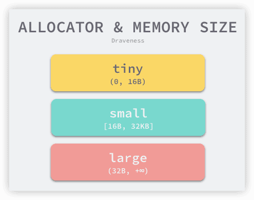

- 微对象 `(0, 16B)` — 先使用微å‹åˆ†é…器，å†ä¾æ¬¡å°è¯•çº¿ç¨‹ç¼“å­˜ã€ä¸­å¿ƒç¼“存和堆分é…内存；
- å°å¯¹è±¡ `[16B, 32KB]` — ä¾æ¬¡å°è¯•ä½¿ç”¨çº¿ç¨‹ç¼“å­˜ã€ä¸­å¿ƒç¼“存和堆分é…内存；
- 大对象 `(32KB, +âˆ)` — ç›´æ¥åœ¨å †ä¸Šåˆ†é…内存；

##### 微对象

Go 语言è¿è¡Œæ—¶å°†å°äº 16 字节的对象划分为微对象，它会使用线程缓存上的微分é…器æ高微对象分é…的性能，我们主è¦ä½¿ç”¨å®ƒæ¥åˆ†é…较å°çš„字符串以åŠé€ƒé€¸çš„临时å˜é‡ã€‚微分é…器å¯ä»¥å°†å¤šä¸ªè¾ƒå°çš„内存分é…请求åˆå…¥åŒä¸€ä¸ªå†…å­˜å—中，åªæœ‰å½“内存å—中的所有对象都需è¦è¢«å›æ”¶æ—¶ï¼Œæ•´ç‰‡å†…å­˜æ‰å¯èƒ½è¢«å›æ”¶ã€‚

微分é…器管ç†çš„对象ä¸å¯ä»¥æ˜¯æŒ‡é’ˆç±»å‹ï¼Œç®¡ç†å¤šä¸ªå¯¹è±¡çš„内存å—å¤§å° `maxTinySize` 是å¯ä»¥è°ƒæ•´çš„，在默认情况下，内存å—的大å°ä¸º 16 字节。`maxTinySize` 的值越大，组åˆå¤šä¸ªå¯¹è±¡çš„å¯èƒ½æ€§å°±è¶Šé«˜ï¼Œå†…存浪费也就越严é‡ï¼›`maxTinySize` 越å°ï¼Œå†…存浪费就会越少，ä¸è¿‡æ— è®ºå¦‚何调整，8 çš„å€æ•°éƒ½æ˜¯ä¸€ä¸ªå¾ˆå¥½çš„选择。

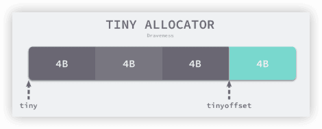

如上图所示，微分é…器已ç»åœ¨ 16 字节的内存å—中分é…了 12 字节的对象，如æœä¸‹ä¸€ä¸ªå¾…分é…的对象å°äº 4 字节，它会直æ¥ä½¿ç”¨ä¸Šè¿°å†…å­˜å—的剩余部分，å‡å°‘内存ç¢ç‰‡ï¼Œä¸è¿‡è¯¥å†…å­˜å—åªæœ‰æ‰€æœ‰å¯¹è±¡éƒ½è¢«æ ‡è®°ä¸ºåƒåœ¾æ—¶æ‰ä¼šå›æ”¶ã€‚

线程缓存 [`runtime.mcache`](https://draven.co/golang/tree/runtime.mcache) 中的 `tiny` 字段指å‘了 `maxTinySize` 大å°çš„å—，如æœå½“å‰å—中还包å«å¤§å°åˆé€‚的空闲内存，è¿è¡Œæ—¶ä¼šé€šè¿‡åŸºåœ°å€å’Œå移é‡è·å–并返å›è¿™å—内存：

```go
func mallocgc(size uintptr, typ *_type, needzero bool) unsafe.Pointer {
	...
	if size <= maxSmallSize {
		if noscan && size < maxTinySize {
			off := c.tinyoffset
			if off+size <= maxTinySize && c.tiny != 0 {
				x = unsafe.Pointer(c.tiny + off)
				c.tinyoffset = off + size
				c.local_tinyallocs++
				releasem(mp)
				return x
			}
			...
		}
		...
	}
	...
}
```

当内存å—中ä¸åŒ…å«ç©ºé—²çš„内存时，下é¢çš„这段代ç ä¼šå…ˆä»çº¿ç¨‹ç¼“存找到跨度类对应的内存管ç†å•å…ƒ [`runtime.mspan`](https://draven.co/golang/tree/runtime.mspan)，调用 [`runtime.nextFreeFast`](https://draven.co/golang/tree/runtime.nextFreeFast) è·å–空闲的内存；当ä¸å­˜åœ¨ç©ºé—²å†…存时，我们会调用 [`runtime.mcache.nextFree`](https://draven.co/golang/tree/runtime.mcache.nextFree) ä»ä¸­å¿ƒç¼“存或者页堆中è·å–å¯åˆ†é…的内存å—：

```go
func mallocgc(size uintptr, typ *_type, needzero bool) unsafe.Pointer {
	...
	if size <= maxSmallSize {
		if noscan && size < maxTinySize {
			...
			span := c.alloc[tinySpanClass]
			v := nextFreeFast(span)
			if v == 0 {
				v, _, _ = c.nextFree(tinySpanClass)
			}
			x = unsafe.Pointer(v)
			(*[2]uint64)(x)[0] = 0
			(*[2]uint64)(x)[1] = 0
			if size < c.tinyoffset || c.tiny == 0 {
				c.tiny = uintptr(x)
				c.tinyoffset = size
			}
			size = maxTinySize
		}
		...
	}
	...
	return x
}
```

è·å–新的空闲内存å—之å，上述代ç ä¼šæ¸…空空闲内存中的数æ®ã€æ›´æ–°æ„æˆå¾®å¯¹è±¡åˆ†é…器的几个字段 `tiny` å’Œ `tinyoffset` 并返å›æ–°çš„空闲内存。

##### å°å¯¹è±¡

å°å¯¹è±¡æ˜¯æŒ‡å¤§å°ä¸º 16 字节到 32,768 字节的对象以åŠæ‰€æœ‰å°äº 16 字节的指针类å‹çš„对象，å°å¯¹è±¡çš„分é…å¯ä»¥è¢«åˆ†æˆä»¥ä¸‹çš„三个步骤：

1. 确定分é…对象的大å°ä»¥åŠè·¨åº¦ç±» [`runtime.spanClass`](https://draven.co/golang/tree/runtime.spanClass)ï¼›
2. ä»çº¿ç¨‹ç¼“å­˜ã€ä¸­å¿ƒç¼“存或者堆中è·å–内存管ç†å•å…ƒå¹¶ä»å†…存管ç†å•å…ƒæ‰¾åˆ°ç©ºé—²çš„内存空间；
3. 调用 [`runtime.memclrNoHeapPointers`](https://draven.co/golang/tree/runtime.memclrNoHeapPointers) 清空空闲内存中的所有数æ®ï¼›

确定待分é…的对象大å°ä»¥åŠè·¨åº¦ç±»éœ€è¦ä½¿ç”¨é¢„先计算好的 `size_to_class8`ã€`size_to_class128` ä»¥åŠ `class_to_size` 字典，这些字典能够帮助我们快速è·å–对应的值并æ„建 [`runtime.spanClass`](https://draven.co/golang/tree/runtime.spanClass)：

```go
func mallocgc(size uintptr, typ *_type, needzero bool) unsafe.Pointer {
	...
	if size <= maxSmallSize {
		...
		} else {
			var sizeclass uint8
			if size <= smallSizeMax-8 {
				sizeclass = size_to_class8[(size+smallSizeDiv-1)/smallSizeDiv]
			} else {
				sizeclass = size_to_class128[(size-smallSizeMax+largeSizeDiv-1)/largeSizeDiv]
			}
			size = uintptr(class_to_size[sizeclass])
			spc := makeSpanClass(sizeclass, noscan)
			span := c.alloc[spc]
			v := nextFreeFast(span)
			if v == 0 {
				v, span, _ = c.nextFree(spc)
			}
			x = unsafe.Pointer(v)
			if needzero && span.needzero != 0 {
				memclrNoHeapPointers(unsafe.Pointer(v), size)
			}
		}
	} else {
		...
	}
	...
	return x
}
```

在上述代ç ç‰‡æ®µä¸­ï¼Œæˆ‘们会é‡ç‚¹åˆ†æ两个方法的å®ç°åŸç†ï¼Œå®ƒä»¬åˆ†åˆ«æ˜¯ [`runtime.nextFreeFast`](https://draven.co/golang/tree/runtime.nextFreeFast) å’Œ [`runtime.mcache.nextFree`](https://draven.co/golang/tree/runtime.mcache.nextFree)，这两个方法会帮助我们è·å–空闲的内存空间。[`runtime.nextFreeFast`](https://draven.co/golang/tree/runtime.nextFreeFast) 会利用内存管ç†å•å…ƒä¸­çš„ `allocCache` 字段，快速找到该字段为 1 çš„ä½æ•°ï¼Œæˆ‘们在上é¢ä»‹ç»è¿‡ 1 表示该ä½å¯¹åº”的内存空间是空闲的：

```go
func nextFreeFast(s *mspan) gclinkptr {
	theBit := sys.Ctz64(s.allocCache)
	if theBit < 64 {
		result := s.freeindex + uintptr(theBit)
		if result < s.nelems {
			freeidx := result + 1
			if freeidx%64 == 0 && freeidx != s.nelems {
				return 0
			}
			s.allocCache >>= uint(theBit + 1)
			s.freeindex = freeidx
			s.allocCount++
			return gclinkptr(result*s.elemsize + s.base())
		}
	}
	return 0
}
```

找到了空闲的对象å，我们就å¯ä»¥æ›´æ–°å†…存管ç†å•å…ƒçš„ `allocCache`ã€`freeindex` 等字段并返å›è¯¥ç‰‡å†…存；如æœæˆ‘们没有找到空闲的内存，è¿è¡Œæ—¶ä¼šé€šè¿‡ [`runtime.mcache.nextFree`](https://draven.co/golang/tree/runtime.mcache.nextFree) 找到新的内存管ç†å•å…ƒï¼š

```go
func (c *mcache) nextFree(spc spanClass) (v gclinkptr, s *mspan, shouldhelpgc bool) {
	s = c.alloc[spc]
	freeIndex := s.nextFreeIndex()
	if freeIndex == s.nelems {
		c.refill(spc)
		s = c.alloc[spc]
		freeIndex = s.nextFreeIndex()
	}

	v = gclinkptr(freeIndex*s.elemsize + s.base())
	s.allocCount++
	return
}
```

在上述方法中，如æœæˆ‘们在线程缓存中没有找到å¯ç”¨çš„内存管ç†å•å…ƒï¼Œä¼šé€šè¿‡å‰é¢ä»‹ç»çš„ [`runtime.mcache.refill`](https://draven.co/golang/tree/runtime.mcache.refill) 使用中心缓存中的内存管ç†å•å…ƒæ›¿æ¢å·²ç»ä¸å­˜åœ¨å¯ç”¨å¯¹è±¡çš„结æ„体，该方法会调用新结æ„体的 [`runtime.mspan.nextFreeIndex`](https://draven.co/golang/tree/runtime.mspan.nextFreeIndex) è·å–空闲的内存并返å›ã€‚

##### 大对象

è¿è¡Œæ—¶å¯¹äºå¤§äº 32KB 的大对象会å•ç‹¬å¤„ç†ï¼Œæˆ‘们ä¸ä¼šä»çº¿ç¨‹ç¼“存或者中心缓存中è·å–内存管ç†å•å…ƒï¼Œè€Œæ˜¯ç›´æ¥è°ƒç”¨ [`runtime.mcache.allocLarge`](https://draven.co/golang/tree/runtime.mcache.allocLarge) 分é…大片内存：

```go
func mallocgc(size uintptr, typ *_type, needzero bool) unsafe.Pointer {
	...
	if size <= maxSmallSize {
		...
	} else {
		var s *mspan
		span = c.allocLarge(size, needzero, noscan)
		span.freeindex = 1
		span.allocCount = 1
		x = unsafe.Pointer(span.base())
		size = span.elemsize
	}

	publicationBarrier()
	mp.mallocing = 0
	releasem(mp)

	return x
}
```

[`runtime.mcache.allocLarge`](https://draven.co/golang/tree/runtime.mcache.allocLarge) 会计算分é…该对象所需è¦çš„页数，它按照 8KB çš„å€æ•°åœ¨å †ä¸Šç”³è¯·å†…存：

```go
func (c *mcache) allocLarge(size uintptr, needzero bool, noscan bool) *mspan {
	npages := size >> _PageShift
	if size&_PageMask != 0 {
		npages++
	}
	...
	s := mheap_.alloc(npages, spc, needzero)
	mheap_.central[spc].mcentral.fullSwept(mheap_.sweepgen).push(s)
	s.limit = s.base() + size
	heapBitsForAddr(s.base()).initSpan(s)
	return s
}
```

申请内存时会创建一个跨度类为 0 çš„ [`runtime.spanClass`](https://draven.co/golang/tree/runtime.spanClass) 并调用 [`runtime.mheap.alloc`](https://draven.co/golang/tree/runtime.mheap.alloc) 分é…一个管ç†å¯¹åº”内存的管ç†å•å…ƒã€‚

#### 73.1.4 å°ç»“

内存分é…是 Go 语言è¿è¡Œæ—¶å†…存管ç†çš„核心逻辑，è¿è¡Œæ—¶çš„内存分é…器使用类似 TCMalloc 的分é…策略将对象根æ®å¤§å°åˆ†ç±»ï¼Œå¹¶è®¾è®¡å¤šå±‚级的组件æ高内存分é…器的性能。本节ä¸ä»…介ç»äº† Go 语言内存分é…器的设计ä¸å®ç°åŸç†ï¼ŒåŒæ—¶ä¹Ÿä»‹ç»äº†å†…存分é…器的常è§è®¾è®¡ï¼Œå¸®åŠ©æˆ‘们ç†è§£ä¸åŒç¼–程语言在设计内存分é…器时åšå‡ºçš„ä¸åŒé€‰æ‹©ã€‚

内存分é…器虽然é常é‡è¦ï¼Œä½†æ˜¯å®ƒåªè§£å†³äº†å¦‚何分é…内存的问题，我们在本节中çœç•¥äº†å¾ˆå¤šä¸åƒåœ¾å›æ”¶ç›¸å…³çš„代ç ï¼Œæ²¡æœ‰åˆ†æè¿è¡Œæ—¶åƒåœ¾å›æ”¶çš„å®ç°åŸç†ï¼Œåœ¨ä¸‹ä¸€èŠ‚中我们将详细分æ Go 语言åƒåœ¾å›æ”¶çš„设计ä¸å®ç°åŸç†ã€‚

### 73.2 åƒåœ¾æ”¶é›†å™¨

编程语言的内存管ç†ç³»ç»Ÿé™¤äº†è´Ÿè´£å †å†…存的分é…之外，它还需è¦è´Ÿè´£å›æ”¶ä¸å†ä½¿ç”¨çš„对象和内存空间。

#### 73.2.1 设计åŸç†

##### 标记清除

==标记清除（Mark-Sweep）==算法是最常è§çš„åƒåœ¾æ”¶é›†ç®—法，标记清除收集器是跟踪å¼åƒåœ¾æ”¶é›†å™¨ï¼Œå…¶æ‰§è¡Œè¿‡ç¨‹å¯ä»¥åˆ†æˆ==标记（Mark）==å’Œ==清除（Sweep）==两个阶段：

1. 标记阶段 — ä»æ ¹å¯¹è±¡å‡ºå‘查找并标记堆中所有存活的对象；
2. 清除阶段 — éå†å †ä¸­çš„全部对象，å›æ”¶æœªè¢«æ ‡è®°çš„åƒåœ¾å¯¹è±¡å¹¶å°†å›æ”¶çš„内存加入空闲链表；

如下图所示，内存空间中包å«å¤šä¸ªå¯¹è±¡ï¼Œæˆ‘们ä»æ ¹å¯¹è±¡å‡ºå‘ä¾æ¬¡éå†å¯¹è±¡çš„å­å¯¹è±¡å¹¶å°†ä»æ ¹èŠ‚点å¯è¾¾çš„对象都标记æˆå­˜æ´»çŠ¶æ€ï¼Œå³ Aã€C å’Œ D 三个对象，剩余的 Bã€E å’Œ F 三个对象因为ä»æ ¹èŠ‚点ä¸å¯è¾¾ï¼Œæ‰€ä»¥ä¼šè¢«å½“åšåƒåœ¾ï¼š

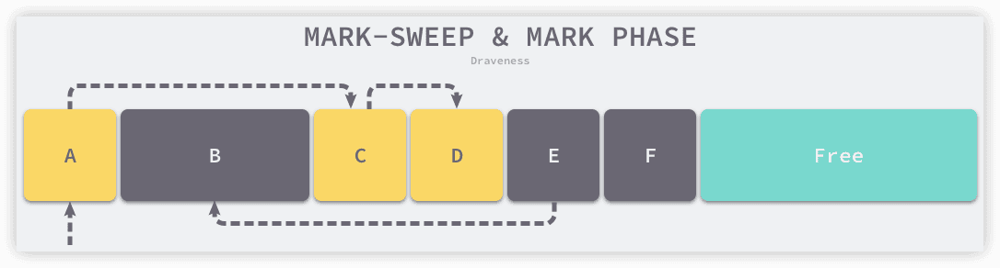

标记阶段结æŸå会进入清除阶段，在该阶段中收集器会ä¾æ¬¡éå†å †ä¸­çš„所有对象，释放其中没有被标记的 Bã€E å’Œ F 三个对象并将新的空闲内存空间以链表的结æ„串è”èµ·æ¥ï¼Œæ–¹ä¾¿å†…存分é…器的使用。

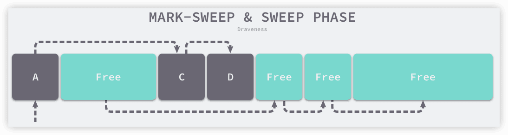

这里介ç»çš„是最传统的标记清除算法，åƒåœ¾æ”¶é›†å™¨ä»åƒåœ¾æ”¶é›†çš„根对象出å‘，递归éå†è¿™äº›å¯¹è±¡æŒ‡å‘çš„å­å¯¹è±¡å¹¶å°†æ‰€æœ‰å¯è¾¾çš„对象标记æˆå­˜æ´»ï¼›æ ‡è®°é˜¶æ®µç»“æŸå，åƒåœ¾æ”¶é›†å™¨ä¼šä¾æ¬¡éå†å †ä¸­çš„对象并清除其中的åƒåœ¾ï¼Œæ•´ä¸ªè¿‡ç¨‹éœ€è¦æ ‡è®°å¯¹è±¡çš„存活状æ€ï¼Œç”¨æˆ·ç¨‹åºåœ¨åƒåœ¾æ”¶é›†çš„过程中也ä¸èƒ½æ‰§è¡Œï¼Œæˆ‘们需è¦ç”¨åˆ°æ›´å¤æ‚的机制æ¥è§£å†³ STW 的问题。

##### 三色抽象

为了解决åŸå§‹æ ‡è®°æ¸…除算法带æ¥çš„长时间 STW，多数ç°ä»£çš„追踪å¼åƒåœ¾æ”¶é›†å™¨éƒ½ä¼šå®ç°ä¸‰è‰²æ ‡è®°ç®—法的å˜ç§ä»¥ç¼©çŸ­ STW 的时间。三色标记算法将程åºä¸­çš„对象分æˆç™½è‰²ã€é»‘色和ç°è‰²ä¸‰ç±»ï¼š

- 白色对象 — 潜在的åƒåœ¾ï¼Œå…¶å†…å­˜å¯èƒ½ä¼šè¢«åƒåœ¾æ”¶é›†å™¨å›æ”¶ï¼›
- 黑色对象 — 活跃的对象，包括ä¸å­˜åœ¨ä»»ä½•å¼•ç”¨å¤–部指针的对象以åŠä»æ ¹å¯¹è±¡å¯è¾¾çš„对象；
- ç°è‰²å¯¹è±¡ — 活跃的对象，因为存在指å‘白色对象的外部指针，åƒåœ¾æ”¶é›†å™¨ä¼šæ‰«æ这些对象的å­å¯¹è±¡ï¼›

在åƒåœ¾æ”¶é›†å™¨å¼€å§‹å·¥ä½œæ—¶ï¼Œç¨‹åºä¸­ä¸å­˜åœ¨ä»»ä½•çš„黑色对象，åƒåœ¾æ”¶é›†çš„根对象会被标记æˆ**ç°è‰²**，åƒåœ¾æ”¶é›†å™¨åªä¼šä»ç°è‰²å¯¹è±¡é›†åˆä¸­å–出对象开始扫æ，当ç°è‰²é›†åˆä¸­ä¸å­˜åœ¨ä»»ä½•å¯¹è±¡æ—¶ï¼Œæ ‡è®°é˜¶æ®µå°±ä¼šç»“æŸã€‚

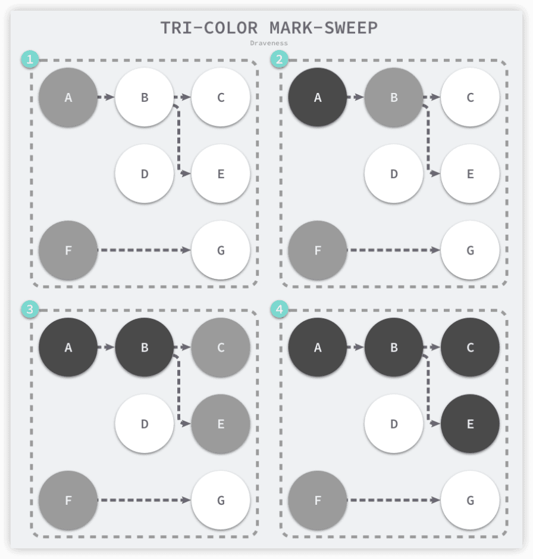

三色标记åƒåœ¾æ”¶é›†å™¨çš„工作åŸç†å¾ˆç®€å•ï¼Œæˆ‘们å¯ä»¥å°†å…¶å½’纳æˆä»¥ä¸‹å‡ ä¸ªæ­¥éª¤ï¼š

1. ä»ç°è‰²å¯¹è±¡çš„集åˆä¸­é€‰æ‹©ä¸€ä¸ªç°è‰²å¯¹è±¡å¹¶å°†å…¶æ ‡è®°æˆé»‘色；
2. 将黑色对象指å‘的所有对象都标记æˆç°è‰²ï¼Œä¿è¯è¯¥å¯¹è±¡å’Œè¢«è¯¥å¯¹è±¡å¼•ç”¨çš„对象都ä¸ä¼šè¢«å›æ”¶ï¼›
3. é‡å¤ä¸Šè¿°ä¸¤ä¸ªæ­¥éª¤ç›´åˆ°å¯¹è±¡å›¾ä¸­ä¸å­˜åœ¨ç°è‰²å¯¹è±¡ï¼›

当三色的标记清除的标记阶段结æŸä¹‹å，应用程åºçš„堆中就ä¸å­˜åœ¨ä»»ä½•çš„ç°è‰²å¯¹è±¡ï¼Œæˆ‘们åªèƒ½çœ‹åˆ°é»‘色的存活对象以åŠç™½è‰²çš„åƒåœ¾å¯¹è±¡ï¼Œåƒåœ¾æ”¶é›†å™¨å¯ä»¥å›æ”¶è¿™äº›ç™½è‰²çš„åƒåœ¾ï¼Œä¸‹é¢æ˜¯ä½¿ç”¨ä¸‰è‰²æ ‡è®°åƒåœ¾æ”¶é›†å™¨æ‰§è¡Œæ ‡è®°å的堆内存，堆中åªæœ‰å¯¹è±¡ D 为待å›æ”¶çš„åƒåœ¾ï¼š

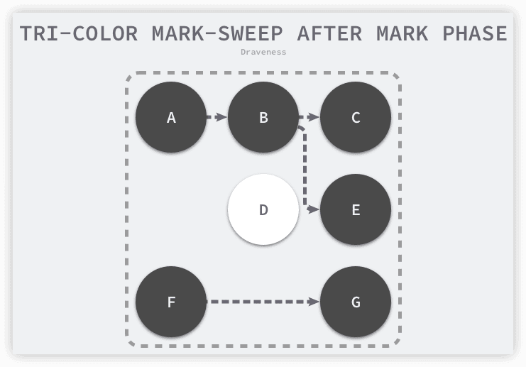

因为用户程åºå¯èƒ½åœ¨æ ‡è®°æ‰§è¡Œçš„过程中修改对象的指针，所以三色标记清除算法本身是ä¸å¯ä»¥å¹¶å‘或者å¢é‡æ‰§è¡Œçš„，它ä»ç„¶éœ€è¦ STW，在如下所示的三色标记过程中，用户程åºå»ºç«‹äº†ä» A 对象到 D 对象的引用，但是因为程åºä¸­å·²ç»ä¸å­˜åœ¨ç°è‰²å¯¹è±¡äº†ï¼Œæ‰€ä»¥ D 对象会被åƒåœ¾æ”¶é›†å™¨é”™è¯¯åœ°å›æ”¶ã€‚

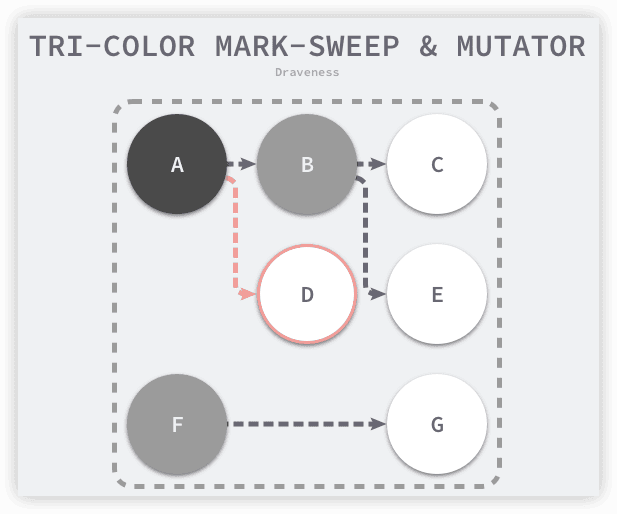

本æ¥ä¸åº”该被å›æ”¶çš„对象å´è¢«å›æ”¶äº†ï¼Œè¿™åœ¨å†…存管ç†ä¸­æ˜¯é常严é‡çš„错误，我们将这ç§é”™è¯¯ç§°ä¸º**悬挂指针**，å³æŒ‡é’ˆæ²¡æœ‰æŒ‡å‘特定类å‹çš„åˆæ³•å¯¹è±¡ï¼Œå½±å“了内存的安全性，想è¦å¹¶å‘或者å¢é‡åœ°æ ‡è®°å¯¹è±¡è¿˜æ˜¯éœ€è¦ä½¿ç”¨å±éšœæŠ€æœ¯ã€‚

##### å±éšœæŠ€æœ¯

内存å±éšœæŠ€æœ¯æ˜¯ä¸€ç§å±éšœæŒ‡ä»¤ï¼Œå®ƒå¯ä»¥è®© CPU 或者编译器在执行内存相关æ“作时éµå¾ªç‰¹å®šçš„约æŸï¼Œç›®å‰å¤šæ•°çš„ç°ä»£å¤„ç†å™¨éƒ½ä¼šä¹±åºæ‰§è¡ŒæŒ‡ä»¤ä»¥æœ€å¤§åŒ–性能，但是该技术能够ä¿è¯å†…å­˜æ“作的顺åºæ€§ï¼Œåœ¨å†…å­˜å±éšœå‰æ‰§è¡Œçš„æ“作一定会先äºå†…å­˜å±éšœå执行的æ“作。

想è¦åœ¨å¹¶å‘或者å¢é‡çš„标记算法中ä¿è¯æ­£ç¡®æ€§ï¼Œæˆ‘们需è¦è¾¾æˆä»¥ä¸‹ä¸¤ç§ä¸‰è‰²ä¸å˜æ€§ï¼ˆTri-color invariant）中的一ç§ï¼š

- 强三色ä¸å˜æ€§ — 黑色对象ä¸ä¼šæŒ‡å‘白色对象，åªä¼šæŒ‡å‘ç°è‰²å¯¹è±¡æˆ–者黑色对象；
- 弱三色ä¸å˜æ€§ — 黑色对象指å‘的白色对象必须包å«ä¸€æ¡ä»ç°è‰²å¯¹è±¡ç»ç”±å¤šä¸ªç™½è‰²å¯¹è±¡çš„å¯è¾¾è·¯å¾„ï¼›

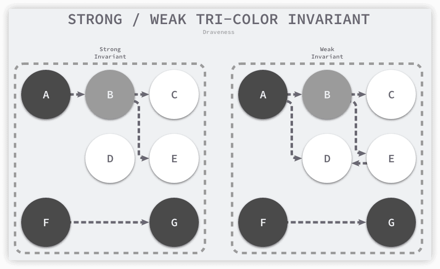

上图分别展示了éµå¾ªå¼ºä¸‰è‰²ä¸å˜æ€§å’Œå¼±ä¸‰è‰²ä¸å˜æ€§çš„堆内存，éµå¾ªä¸Šè¿°ä¸¤ä¸ªä¸å˜æ€§ä¸­çš„ä»»æ„一个，我们都能ä¿è¯åƒåœ¾æ”¶é›†ç®—法的正确性，而å±éšœæŠ€æœ¯å°±æ˜¯åœ¨å¹¶å‘或者å¢é‡æ ‡è®°è¿‡ç¨‹ä¸­ä¿è¯ä¸‰è‰²ä¸å˜æ€§çš„é‡è¦æŠ€æœ¯ã€‚

åƒåœ¾æ”¶é›†ä¸­çš„å±éšœæŠ€æœ¯æ›´åƒæ˜¯ä¸€ä¸ªé’©å­æ–¹æ³•ï¼Œå®ƒæ˜¯åœ¨ç”¨æˆ·ç¨‹åºè¯»å–对象ã€åˆ›å»ºæ–°å¯¹è±¡ä»¥åŠæ›´æ–°å¯¹è±¡æŒ‡é’ˆæ—¶æ‰§è¡Œçš„一段代ç ï¼Œæ ¹æ®æ“作类å‹çš„ä¸åŒï¼Œæˆ‘们å¯ä»¥å°†å®ƒä»¬åˆ†æˆè¯»å±éšœï¼ˆRead barrier）和写å±éšœï¼ˆWrite barrier）两ç§ï¼Œå› ä¸ºè¯»å±éšœéœ€è¦åœ¨è¯»æ“作中加入代ç ç‰‡æ®µï¼Œå¯¹ç”¨æˆ·ç¨‹åºçš„性能影å“很大，所以编程语言往往都会采用写å±éšœä¿è¯ä¸‰è‰²ä¸å˜æ€§ã€‚

我们在这里想è¦ä»‹ç»çš„是 Go 语言中使用的两ç§å†™å±éšœæŠ€æœ¯ï¼Œåˆ†åˆ«æ˜¯ Dijkstra æ出的æ’入写å±éšœå’Œ Yuasa æ出的删除写å±éšœï¼Œè¿™é‡Œä¼šåˆ†æ它们如何ä¿è¯ä¸‰è‰²ä¸å˜æ€§å’Œåƒåœ¾æ”¶é›†å™¨çš„正确性。

###### æ’入写å±éšœğŸ”–


###### 删除写å±éšœ


##### å¢é‡å’Œå¹¶å‘

###### å¢é‡æ”¶é›†å™¨


###### 并å‘收集器

#### 73.2.2 演进过程

1. [v1.0](https://github.com/golang/go/blob/go1.0.1/src/pkg/runtime/mgc0.c#L882) — 完全串行的标记和清除过程，需è¦æš‚åœæ•´ä¸ªç¨‹åºï¼›
2. [v1.1](https://github.com/golang/go/blob/go1.1/src/pkg/runtime/mgc0.c#L1938) — 在多核主机并行执行åƒåœ¾æ”¶é›†çš„标记和清除阶段；
3. [v1.3](https://github.com/golang/go/blob/go1.3/src/pkg/runtime/mgc0.c#L2268) — è¿è¡Œæ—¶åŸºäº**åªæœ‰æŒ‡é’ˆç±»å‹çš„值包å«æŒ‡é’ˆ**çš„å‡è®¾å¢åŠ äº†å¯¹æ ˆå†…存的精确扫æ支æŒï¼Œå®ç°äº†çœŸæ­£ç²¾ç¡®çš„åƒåœ¾æ”¶é›†ï¼›
   - å°† `unsafe.Pointer` ç±»å‹è½¬æ¢æˆæ•´æ•°ç±»å‹çš„值认定为ä¸åˆæ³•çš„，å¯èƒ½ä¼šé€ æˆæ‚¬æŒ‚指针等严é‡é—®é¢˜ï¼›
4. [v1.5](https://github.com/golang/go/blob/go1.5/src/runtime/mgc.go#L903) — å®ç°äº†åŸºäº**三色标记清扫的并å‘**åƒåœ¾æ”¶é›†å™¨ï¼›
   - 大幅度é™ä½åƒåœ¾æ”¶é›†çš„延迟ä»å‡ ç™¾ ms é™ä½è‡³ 10ms 以下；
   - 计算åƒåœ¾æ”¶é›†å¯åŠ¨çš„åˆé€‚时间并通过并å‘加速åƒåœ¾æ”¶é›†çš„过程；
5. [v1.6](https://github.com/golang/go/blob/go1.6/src/runtime/mgc.go#L869) — å®ç°äº†**å»ä¸­å¿ƒåŒ–**çš„åƒåœ¾æ”¶é›†å调器；
   - 基äºæ˜¾å¼çš„状æ€æœºä½¿å¾—ä»»æ„ Goroutine 都能触å‘åƒåœ¾æ”¶é›†çš„状æ€è¿ç§»ï¼›
   - 使用密集的ä½å›¾æ›¿ä»£ç©ºé—²é“¾è¡¨è¡¨ç¤ºçš„堆内存，é™ä½æ¸…除阶段的 CPU å ç”¨ï¼›
6. [v1.7](https://github.com/golang/go/blob/go1.7/src/runtime/mgc.go#L884) — 通过**并行栈收缩**å°†åƒåœ¾æ”¶é›†çš„时间缩短至 2ms 以内；
7. [v1.8](https://github.com/golang/go/blob/go1.8/src/runtime/mgc.go#L930) — 使用**æ··åˆå†™å±éšœ**å°†åƒåœ¾æ”¶é›†çš„时间缩短至 0.5ms 以内；
8. [v1.9](https://github.com/golang/go/blob/go1.9/src/runtime/mgc.go#L1187) — 彻底移除暂åœç¨‹åºçš„é‡æ–°æ‰«æ栈的过程；
9. [v1.10](https://github.com/golang/go/blob/go1.10/src/runtime/mgc.go#L1239) — 更新了åƒåœ¾æ”¶é›†è°ƒé¢‘器（Pacer）的å®ç°ï¼Œåˆ†ç¦»è½¯ç¡¬å †å¤§å°çš„目标；
10. [v1.12](https://github.com/golang/go/blob/go1.12/src/runtime/mgc.go#L1199) — 使用**新的标记终止算法**简化åƒåœ¾æ”¶é›†å™¨çš„几个阶段；
11. [v1.13](https://github.com/golang/go/blob/go1.13/src/runtime/mgc.go#L1200) — 通过新的 Scavenger 解决ç¬æ—¶å†…å­˜å ç”¨è¿‡é«˜çš„应用程åºå‘æ“作系统归还内存的问题；
12. [v1.14](https://github.com/golang/go/blob/go1.14/src/runtime/mgc.go#L1221) — 使用全新的页分é…器**优化内存分é…的速度**ï¼›

##### 并å‘åƒåœ¾æ”¶é›†


##### å›æ”¶å †ç›®æ ‡


##### æ··åˆå†™å±éšœ


#### 73.2.3 å®ç°åŸç†

##### 全局å˜é‡


##### 触å‘时机


##### åƒåœ¾æ”¶é›†å¯åŠ¨


##### 并å‘扫æä¸æ ‡è®°è¾…助


##### 标记终止


##### 内存清ç†


### 73.3 栈空间管ç†

#### 73.3.1 设计åŸç†

栈区的内存一般由编译器自动分é…和释放，其中存储ç€å‡½æ•°çš„å…¥å‚以åŠå±€éƒ¨å˜é‡ï¼Œè¿™äº›å‚数会éšç€å‡½æ•°çš„创建而创建，函数的返å›è€Œæ¶ˆäº¡ï¼Œä¸€èˆ¬ä¸ä¼šåœ¨ç¨‹åºä¸­é•¿æœŸå­˜åœ¨ï¼Œè¿™ç§çº¿æ€§çš„内存分é…策略有ç€æ高地效ç‡ï¼Œä½†æ˜¯å·¥ç¨‹å¸ˆä¹Ÿå¾€å¾€ä¸èƒ½æ§åˆ¶æ ˆå†…存的分é…，这部分工作基本都是由编译器完æˆçš„。

##### 寄存器

寄存器是中央处ç†å™¨ï¼ˆCPU）中的稀缺资æºï¼Œå®ƒçš„存储能力é常有é™ï¼Œä½†æ˜¯èƒ½æ供最快的读写速度，充分利用寄存器的速度å¯ä»¥æ„建高性能的应用程åºã€‚寄存器在物ç†æœºä¸Šé常有é™ï¼Œç„¶è€Œæ ˆåŒºçš„æ“作会使用到两个以上的寄存器，这足以说æ˜æ ˆå†…存在应用程åºçš„é‡è¦æ€§ã€‚

**栈寄存器是 CPU 寄存器中的一ç§**，它的主è¦ä½œç”¨æ˜¯**跟踪函数的调用栈**，Go 语言的汇编代ç åŒ…å« ==BP== å’Œ ==SP== 两个栈寄存器，它们分别存储了栈的**基å€æŒ‡é’ˆå’Œæ ˆé¡¶çš„地å€**，栈内存ä¸å‡½æ•°è°ƒç”¨çš„关系é常紧密，我们在函数调用一节中曾ç»ä»‹ç»è¿‡æ ˆåŒºï¼ŒBP å’Œ SP 之间的内存就是当å‰å‡½æ•°çš„调用栈。

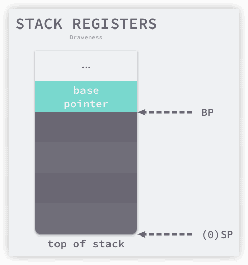

因为å†å²åŸå› ï¼Œæ ˆåŒºå†…存都是ä»é«˜åœ°å€å‘ä½åœ°å€æ‰©å±•çš„，当应用程åºç”³è¯·æˆ–者释放栈内存时åªéœ€è¦ä¿®æ”¹ SP 寄存器的值，这ç§çº¿æ€§çš„内存分é…æ–¹å¼ä¸å †å†…存相比更加快速，仅会带æ¥æå°‘çš„é¢å¤–开销。

##### 线程栈

如æœæˆ‘们在 Linux æ“作系统中执行 `pthread_create` 系统调用，进程会å¯åŠ¨ä¸€ä¸ªæ–°çš„线程，如æœç”¨æˆ·æ²¡æœ‰é€šè¿‡è½¯èµ„æºé™åˆ¶ `RLIMIT_STACK` 指定线程栈的大å°ï¼Œé‚£ä¹ˆæ“作系统会根æ®æ¶æ„选择ä¸åŒçš„默认栈大å°ã€‚

| æ¶æ„    | é»˜è®¤æ ˆå¤§å° |
| :------ | ---------: |
| i386    |       2 MB |
| IA-64   |      32 MB |
| PowerPC |       4 MB |
| …       |          … |
| x86_64  |       2 MB |

**表 7-4 æ¶æ„和线程默认栈大å°**

多数æ¶æ„上默认栈大å°éƒ½åœ¨ 2 ~ 4 MB å·¦å³ï¼Œæå°‘æ•°æ¶æ„会使用 32 MB 的栈，用户程åºå¯ä»¥åœ¨åˆ†é…的栈上存储函数å‚数和局部å˜é‡ã€‚然而这个固定的栈大å°åœ¨æŸäº›åœºæ™¯ä¸‹ä¸æ˜¯åˆé€‚的值，如æœç¨‹åºéœ€è¦åŒæ—¶è¿è¡Œå‡ ç™¾ä¸ªç”šè‡³ä¸Šåƒä¸ªçº¿ç¨‹ï¼Œè¿™äº›çº¿ç¨‹ä¸­çš„大部分都åªä¼šç”¨åˆ°å¾ˆå°‘的栈空间，当函数的调用栈é常深时，固定栈大å°ä¹Ÿæ— æ³•æ»¡è¶³ç”¨æˆ·ç¨‹åºçš„需求。

线程和进程都是代ç æ‰§è¡Œçš„上下文，但是如æœä¸€ä¸ªåº”用程åºåŒ…å«æˆç™¾ä¸Šåƒä¸ªæ‰§è¡Œä¸Šä¸‹æ–‡å¹¶ä¸”æ¯ä¸ªä¸Šä¸‹æ–‡éƒ½æ˜¯çº¿ç¨‹ï¼Œä¼šå ç”¨å¤§é‡çš„内存空间并带æ¥å…¶ä»–çš„é¢å¤–开销，Go 语言在设计时认为执行上下文是轻é‡çº§çš„，所以它在用户æ€å®ç° Goroutine 作为执行上下文。

##### 逃逸分æ


##### 栈内存空间

###### 分段栈

###### è¿ç»­æ ˆ


#### 73.3.2 æ ˆæ“作

Go 语言中的执行栈由 [`runtime.stack`](https://draven.co/golang/tree/runtime.stack) 表示，该结æ„体中åªåŒ…å«ä¸¤ä¸ªå­—段，分别表示栈的顶部和栈的底部，æ¯ä¸ªæ ˆç»“æ„体都表示范围为 `[lo, hi)` 的内存空间：

```go
type stack struct {
	lo uintptr
	hi uintptr
}
```

栈的结æ„虽然é常简å•ï¼Œä½†æ˜¯æƒ³è¦ç†è§£ Goroutine 栈的å®ç°åŸç†ï¼Œè¿˜æ˜¯éœ€è¦æˆ‘们ä»ç¼–译期间和è¿è¡Œæ—¶ä¸¤ä¸ªé˜¶æ®µå…¥æ‰‹ï¼š

1. 编译器会在编译阶段会通过 [`cmd/internal/obj/x86.stacksplit`](https://draven.co/golang/tree/cmd/internal/obj/x86.stacksplit) 在调用函数å‰æ’å…¥ [`runtime.morestack`](https://draven.co/golang/tree/runtime.morestack) 或者 [`runtime.morestack_noctxt`](https://draven.co/golang/tree/runtime.morestack_noctxt) 函数；
2. è¿è¡Œæ—¶åœ¨åˆ›å»ºæ–°çš„ Goroutine 时会在 [`runtime.malg`](https://draven.co/golang/tree/runtime.malg) 中调用 [`runtime.stackalloc`](https://draven.co/golang/tree/runtime.stackalloc) 申请新的栈内存，并在编译器æ’入的 [`runtime.morestack`](https://draven.co/golang/tree/runtime.morestack) 中检查栈空间是å¦å……足；

需è¦æ³¨æ„的是，Go 语言的编译器ä¸ä¼šä¸ºæ‰€æœ‰çš„函数æ’å…¥ [`runtime.morestack`](https://draven.co/golang/tree/runtime.morestack)，它åªä¼šåœ¨å¿…è¦æ—¶æ’入指令以å‡å°‘è¿è¡Œæ—¶çš„é¢å¤–开销，编译指令 `nosplit` å¯ä»¥è·³è¿‡æ ˆæº¢å‡ºçš„检查，虽然这能é™ä½ä¸€äº›å¼€é”€ï¼Œä¸è¿‡å›ºå®šå¤§å°çš„栈也存在溢出的é£é™©ã€‚本节将分别分æ栈的åˆå§‹åŒ–ã€åˆ›å»º Goroutine 时栈的分é…ã€ç¼–译器和è¿è¡Œæ—¶å作完æˆçš„栈扩容以åŠå½“栈空间利用ç‡ä¸è¶³æ—¶çš„缩容过程。

##### æ ˆåˆå§‹åŒ–


##### 栈分é…


##### 栈扩容


##### 栈缩容

