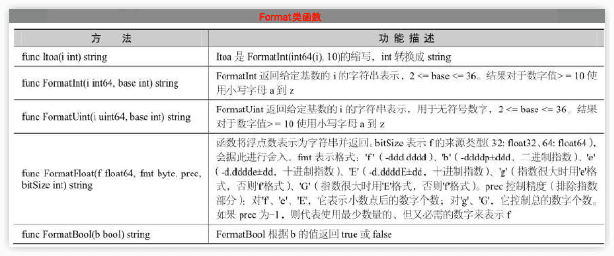

Go语言更多
------


参考：

[《GO语言从入门到项目实践（超值版）》余建熙 2022](http://www.tup.tsinghua.edu.cn/bookscenter/book_09281301.html)

[《Go语言开发实战（慕课版）》千锋教育高教产品研发部 2020](https://book.douban.com/subject/34956558/)

[《Go语言从入门到项目实战（视频版）》](https://book.douban.com/subject/36049170/) 刘瑜 2022

## 47 Go标准库

参考：

https://www.topgoer.com/%E5%B8%B8%E7%94%A8%E6%A0%87%E5%87%86%E5%BA%93/

### 47.1 fmt包

#### 向外输出

##### Print系列

区别在于Print函数直接输出内容，Printf函数支持格式化输出字符串，Println函数会在输出内容的结尾添加一个换行符。

```go
func Print(a ...interface{}) (n int, err error)
func Printf(format string, a ...interface{}) (n int, err error)
func Println(a ...interface{}) (n int, err error)
```

##### Fprint系列

Fprint系列函数会将内容输出到一个io.Writer接口类型的变量w中，我们通常用这个函数往文件中写入内容。

```go
func Fprint(w io.Writer, a ...interface{}) (n int, err error)
func Fprintf(w io.Writer, format string, a ...interface{}) (n int, err error)
func Fprintln(w io.Writer, a ...interface{}) (n int, err error)
```

```go
// 向标准输出写入内容
fmt.Fprintln(os.Stdout, "向标准输出写入内容")
fileObj, err := os.OpenFile("./xx.txt", os.O_CREATE|os.O_WRONLY|os.O_APPEND, 0644)
if err != nil {
    fmt.Println("打开文件出错，err:", err)
    return
}
name := "枯藤"
// 向打开的文件句柄中写入内容
fmt.Fprintf(fileObj, "往文件中写如信息：%s", name)
```

注意，只要满足io.Writer接口的类型都支持写入。

##### Sprint系列

Sprint系列函数会把传入的数据生成并返回一个字符串。

```go
func Sprint(a ...interface{}) string
func Sprintf(format string, a ...interface{}) string
func Sprintln(a ...interface{}) string
```

##### Errorf

Errorf函数根据format参数生成格式化字符串并返回一个包含该字符串的错误。

```go
func Errorf(format string, a ...interface{}) error
```

通常使用这种方式来自定义错误类型，例如：

```go
err := fmt.Errorf("这是一个错误")
```

#### 格式化占位符

`*printf`系列函数都支持format格式化参数。

按照占位符将被替换的变量类型划分：

| 通用占位符               | 说明                                                         |
| ------------------------ | ------------------------------------------------------------ |
| %v                       | 值的默认格式表示                                             |
| %+v                      | 类似%v，但输出结构体时会添加字段名                           |
| %#v                      | 值的Go语法表示                                               |
| %T                       | 打印值的类型                                                 |
| %%                       | 百分号                                                       |
| **布尔占位符**           |                                                              |
| %t                       | true或false                                                  |
| **整型占位符**           |                                                              |
| %b                       | 表示为二进制                                                 |
| %c                       | 该值对应的unicode码值                                        |
| %d                       | 表示为十进制                                                 |
| %o                       | 表示为八进制                                                 |
| %x                       | 表示为十六进制，使用a-f                                      |
| %X                       | 表示为十六进制，使用A-F                                      |
| %U                       | 表示为Unicode格式：U+1234，等价于”U+%04X”                    |
| %q                       | 该值对应的单引号括起来的go语法字符字面值，必要时会采用安全的转义表示 |
| **浮点数与复数占位符**   |                                                              |
| %b                       | 无小数部分、二进制指数的科学计数法，如-123456p-78            |
| %e                       | 科学计数法，如-1234.456e+78                                  |
| %E                       | 科学计数法，如-1234.456E+78                                  |
| %f                       | 有小数部分但无指数部分，如123.456                            |
| %F                       | 等价于%f                                                     |
| %g                       | 根据实际情况采用%e或%f格式（以获得更简洁、准确的输出）       |
| %G                       | 根据实际情况采用%E或%F格式（以获得更简洁、准确的输出）       |
| **字符串和[]byte占位符** |                                                              |
| %s                       | 直接输出字符串或者[]byte                                     |
| %q                       | 该值对应的双引号括起来的go语法字符串字面值，必要时会采用安全的转义表示 |
| %x                       | 每个字节用两字符十六进制数表示（使用a-f                      |
| %X                       | 每个字节用两字符十六进制数表示（使用A-F）                    |
| **指针**                 |                                                              |
| %p                       | 表示为十六进制，并加上前导的0x                               |
|                          |                                                              |
|                          |                                                              |
|                          |                                                              |

##### 宽度标识符

| 占位符 | 说明               |
| ------ | ------------------ |
| %f     | 默认宽度，默认精度 |
| %9f    | 宽度9，默认精度    |
| %.2f   | 默认宽度，精度2    |
| %9.2f  | 宽度9，精度2       |
| %9.f   | 宽度9，精度0       |

示例代码如下：

```go
n := 88.88
fmt.Printf("%f\n", n)
fmt.Printf("%9f\n", n)
fmt.Printf("%.2f\n", n)
fmt.Printf("%9.2f\n", n)
fmt.Printf("%9.f\n", n)
```

输出结果如下：

```
    88.880000
    88.880000
    88.88
        88.88
           89
```

##### 其他falg

| 占位符 | 说明                                                         |
| ------ | ------------------------------------------------------------ |
| ’+’    | 总是输出数值的正负号；对%q（%+q）会生成全部是ASCII字符的输出（通过转义）； |
| ’ ‘    | 对数值，正数前加空格而负数前加负号；对字符串采用%x或%X时（% x或% X）会给各打印的字节之间加空格 |
| ’-’    | 在输出右边填充空白而不是默认的左边（即从默认的右对齐切换为左对齐）； |
| ’#’    | 八进制数前加0（%#o），十六进制数前加0x（%#x）或0X（%#X），指针去掉前面的0x（%#p）对%q（%#q），对%U（%#U）会输出空格和单引号括起来的go字面值； |
| ‘0’    | 使用0而不是空格填充，对于数值类型会把填充的0放在正负号后面； |

举个例子：

```go
s := "枯藤"
fmt.Printf("%s\n", s)
fmt.Printf("%5s\n", s)
fmt.Printf("%-5s\n", s)
fmt.Printf("%5.7s\n", s)
fmt.Printf("%-5.7s\n", s)
fmt.Printf("%5.2s\n", s)
fmt.Printf("%05s\n", s)
```

输出结果如下：

```
    枯藤
       枯藤
    枯藤
       枯藤
    枯藤
       枯藤
    000枯藤
```

#### 获取输入

fmt包下有fmt.Scan、fmt.Scanf、fmt.Scanln三个函数，可以在程序运行过程中从标准输入获取用户的输入。

##### fmt.Scan

```go
func Scan(a ...interface{}) (n int, err error)
```

```go
func main() {
    var (
        name    string
        age     int
        married bool
    )
    fmt.Scan(&name, &age, &married)
    fmt.Printf("扫描结果 name:%s age:%d married:%t \n", name, age, married)
}
```

fmt.Scan从标准输入中扫描用户输入的数据，将以空白符分隔的数据分别存入指定的参数。

##### fmt.Scanf

```go
func Scanf(format string, a ...interface{}) (n int, err error)
```

Scanf从标准输入扫描文本，根据format参数指定的格式去读取由空白符分隔的值保存到传递给本函数的参数中。

```go
func main() {
    var (
        name    string
        age     int
        married bool
    )
    fmt.Scanf("1:%s 2:%d 3:%t", &name, &age, &married)
    fmt.Printf("扫描结果 name:%s age:%d married:%t \n", name, age, married)
}
```

```
$ ./fmt3    
1:andy 2:19 3:true 
扫描结果 name:andy age:19 married:true 

```

fmt.Scanf不同于fmt.Scan简单的以空格作为输入数据的分隔符，fmt.Scanf为输入数据指定了具体的输入内容格式，只有按照格式输入数据才会被扫描并存入对应变量。

##### fmt.Scanln

```go
func Scanln(a ...interface{}) (n int, err error)
```

Scanln类似Scan，它在遇到换行时才停止扫描。最后一个数据后面必须有换行或者到达结束位置。

```go
func main() {
	var (
		name    string
		age     int
		married bool
	)
	fmt.Scanln(&name, &age, &married)
	fmt.Printf("扫描结果 name:%s age:%d married:%t \n", name, age, married)
}
```

```
./fmt4
李德胜 36 true
扫描结果 name:李德胜 age:36 married:true 
```

##### bufio.NewReader

想完整获取输入的内容，而输入的内容可能包含空格，这种情况下可以使用bufio包来实现。


##### Fscan系列

类似之前三个函数，只不过它们不是从标准输入中读取数据而是从io.Reader中读取数据。

```go
func Fscan(r io.Reader, a ...interface{}) (n int, err error)
func Fscanln(r io.Reader, a ...interface{}) (n int, err error)
func Fscanf(r io.Reader, format string, a ...interface{}) (n int, err error)
```

##### Sscan系列

不是从标准输入中读取数据而是从指定字符串中读取数据。

```go
func Sscan(str string, a ...interface{}) (n int, err error)
func Sscanln(str string, a ...interface{}) (n int, err error)
func Sscanf(str string, format string, a ...interface{}) (n int, err error)
```


### 47.2 time包


#### 时间类型


#### 时间戳


##### 时间间隔


##### 时间操作

```
Add
Sub
Equal
Before
After
```

##### 定时器

使用time.Tick(时间间隔)来设置定时器，定时器的本质上是一个通道（channel）。

```go
func tickDemo() {
    ticker := time.Tick(time.Second) //定义一个1秒间隔的定时器
    for i := range ticker {
        fmt.Println(i)//每秒都会执行的任务
    }
}
```

##### 时间格式化

Go语言中格式化时间模板不是常见的Y-m-d H:M:S而是使用Go的诞生时间2006年1月2号15点04分（记忆口诀为2006 1 2 3 4）。


### 47.3 flag包

```go
func main() {
	if len(os.Args) > 0 {
		for index, arg := range os.Args {
			fmt.Printf("args[%d]=%v\n", index, arg)
		}
	}
}
```

```
./flag1 a b c d
args[0]=./flag1
args[1]=a
args[2]=b
args[3]=c
args[4]=d
```

#### flag参数类型

flag包支持的命令行参数类型有bool、int、int64、uint、uint64、float float64、string、duration。

| flag参数     | 有效值                                                       |
| ------------ | ------------------------------------------------------------ |
| 字符串flag   | 合法字符串                                                   |
| 整数flag     | 1234、0664、0x1234等类型，也可以是负数。                     |
| 浮点数flag   | 合法浮点数                                                   |
| bool类型flag | 1, 0, t, f, T, F, true, false, TRUE, FALSE, True, False。    |
| 时间段flag   | 任何合法的时间段字符串。如”300ms”、”-1.5h”、”2h45m”。 合法的单位有”ns”、”us” /“µs”、”ms”、”s”、”m”、”h”。 |

#### 两种定义命令行flag参数的方法

##### flag.Type()

`flag.Type(flag名, 默认值, 帮助信息)*Type`

```go
name := flag.String("name", "张三", "姓名")
age := flag.Int("age", 18, "年龄")
married := flag.Bool("married", false, "婚否")
delay := flag.Duration("d", 0, "时间间隔")
```

此时name、age、married、delay均为对应类型的指针。

##### flag.TypeVar()

`flag.TypeVar(Type指针, flag名, 默认值, 帮助信息)`

```go
var name string
var age int
var married bool
var delay time.Duration
flag.StringVar(&name, "name", "张三", "姓名")
flag.IntVar(&age, "age", 18, "年龄")
flag.BoolVar(&married, "married", false, "婚否")
flag.DurationVar(&delay, "d", 0, "时间间隔")
```


#### 其他函数

##### flag.Parse()

定义好命令行flag参数后，需要通过调用flag.Parse()来对命令行参数进行解析。

支持的命令行参数格式有以下几种：

- -flag xxx （使用空格，一个-符号）
- --flag xxx （使用空格，两个-符号）
- -flag=xxx （使用等号，一个-符号）
- --flag=xxx （使用等号，两个-符号）

其中，布尔类型的参数必须使用等号的方式指定。

Flag解析在第一个非flag参数（单个”-“不是flag参数）之前停止，或者在终止符”–“之后停止。


- flag.Args() ////返回命令行参数后的其他参数，以[]string类型
- flag.NArg() //返回命令行参数后的其他参数个数
- flag.NFlag() //返回使用的命令行参数个数

#### 使用案例

```go
func main() {
	// //定义命令行参数方式
	var name string
	var age int
	var married bool
	var delay time.Duration
	flag.StringVar(&name, "name", "andyron", "姓名")
	flag.IntVar(&age, "age", 18, "年龄")
	flag.BoolVar(&married, "married", false, "婚否")
	flag.DurationVar(&delay, "d", 0, "延迟的时间间隔")

	// 解析命令行参数
	flag.Parse()
	fmt.Println(name, age, married, delay)
	// 返回命令行参数后的其他参数
	fmt.Println(flag.Args())
	// 返回命令行参数后的其他参数个数
	fmt.Println(flag.NArg())
	// 返回使用的命令行参数个数
	fmt.Println(flag.NFlag())
}
```


命令行参数使用提示：

```shell
./flag_demo -help
Usage of ./flag_demo:
  -age int
        年龄 (default 18)
  -d duration
        延迟的时间间隔
  -married
        婚否
  -name string
        姓名 (default "andyron")
```

正常使用命令行flag参数：

```shell
$ ./flag_demo -name pprof -age 19 -married=false -d=24s
pprof 19 false 24s
[]
0
4
```

使用非flag命令行参数：

```shell
$ ./flag_demo a c d
andyron 18 false 0s
[a c d]
3
0
```


### 47.4 strings包——字符串处理


#### 检索字符串


#### 分割字符串


#### 大小写转换


#### 修剪字符串


#### 比较字符串


### 47.5 strconv包

字符串与其他基本数据类型之间的类型转换。

#### Parse类函数

Parse类函数主要的功能是将字符串转换为其他类型。


#### Format类函数

Format类函数主要的功能是将其他类型格式化成字符串。




### 47.6 regexp正则表达式包

#### 正则表达式中主要元字符


#### regexp包中核心函数及方法

🔖


### 47.7 math包


### 47.8 随机数

“math/rand”包实现了伪随机数生成器，能够生成整型和浮点型的随机数。使用随机数生成器需要放入种子。可以使用Seed()函数生成一个不确定的种子放入随机数生成器，这样每次运行随机数生成器都会生成不同的序列。如果没有在随机数生成器中放入种子，则默认使用具有确定性状态的种子，此时可以理解为种子的值是一个常数1，即Seed(1)。

#### rand包的核心方法


#### 获取随机数的几种方式


### net包

net/http


### 文件操作相关

os包

io/ioutil 包


### 并发相关

**`sync` 包**

**`context` 包**


### 数据结构与算法相关

**`sort` 包**

**`container` 目录下的相关包（如 `list`、`map`、`heap` 等）**


### log 🔖

https://www.topgoer.com/%E5%B8%B8%E7%94%A8%E6%A0%87%E5%87%86%E5%BA%93/log.html


### template


### encoding

数据格式：JSON、XML、MSGPack等


### reflect反射


## 48 反射

参考：《Go语言从入门到项目实战》-10

反射是指在程序运行期对程序本身进行访问和修改的能力。程序在编译时，变量被转换为内存地址，变量名不会被编译器写入可执行部分。在运行程序时，程序无法获取自身的信息。

支持反射的语言可以在程序编译期将变量的反射信息，如字段名称、类型信息、结构体信息等整合到可执行文件中，并给程序提供接口访问反射信息，这样就可以在程序运行期获取类型的反射信息，并且有能力修改它们。

Go语言程序在运行期使用reflect包访问程序的反射信息。

### 48.1　使用反射访问变量

`reflect`包

#### 获取变量的类型

#### 获取变量的值

#### 反射值的非空和有效性判定


### 48.2 反射值的非空和有效性判定


### 48.3 使用反射访问结构体


### 48.4 使用反射修改值


### 48.5 使用反射调用函数


### 48.6 使用反射创建变量

