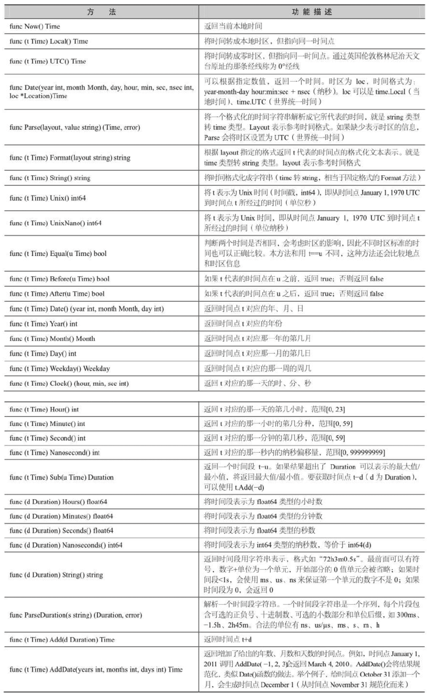
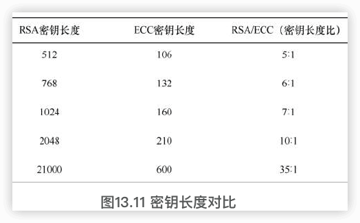
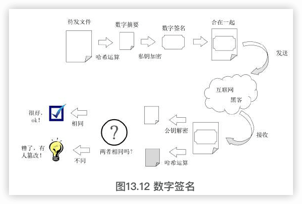

Go语言更多
------


参考：

1️⃣[《GO语言从入门到项目实践（超值版）》余建熙 2022](http://www.tup.tsinghua.edu.cn/bookscenter/book_09281301.html)

2️⃣[《Go语言开发实战（慕课版）》千锋教育高教产品研发部 2020](https://book.douban.com/subject/34956558/)

3️⃣[《Go语言从入门到项目实战（视频版）》](https://book.douban.com/subject/36049170/) 刘瑜 2022

4️⃣ [Go语言精进之路1](https://book.douban.com/subject/35720728/) [Go语言精进之路2](https://book.douban.com/subject/35720729/)  2021

# 补充1

## 47 Go标准库

参考：

https://www.topgoer.com/%E5%B8%B8%E7%94%A8%E6%A0%87%E5%87%86%E5%BA%93/

### 47.1 fmt包

#### 向外输出

##### Print系列

区别在于Print函数直接输出内容，Printf函数支持格式化输出字符串，Println函数会在输出内容的结尾添加一个换行符。

```go
func Print(a ...interface{}) (n int, err error)
func Printf(format string, a ...interface{}) (n int, err error)
func Println(a ...interface{}) (n int, err error)
```

##### Fprint系列

Fprint系列函数会将内容输出到一个io.Writer接口类型的变量w中，我们通常用这个函数往文件中写入内容。

```go
func Fprint(w io.Writer, a ...interface{}) (n int, err error)
func Fprintf(w io.Writer, format string, a ...interface{}) (n int, err error)
func Fprintln(w io.Writer, a ...interface{}) (n int, err error)
```

```go
// 向标准输出写入内容
fmt.Fprintln(os.Stdout, "向标准输出写入内容")
fileObj, err := os.OpenFile("./xx.txt", os.O_CREATE|os.O_WRONLY|os.O_APPEND, 0644)
if err != nil {
    fmt.Println("打开文件出错，err:", err)
    return
}
name := "枯藤"
// 向打开的文件句柄中写入内容
fmt.Fprintf(fileObj, "往文件中写如信息：%s", name)
```

注意，只要满足io.Writer接口的类型都支持写入。

##### Sprint系列

Sprint系列函数会把传入的数据生成并返回一个字符串。

```go
func Sprint(a ...interface{}) string
func Sprintf(format string, a ...interface{}) string
func Sprintln(a ...interface{}) string
```

##### Errorf

Errorf函数根据format参数生成格式化字符串并返回一个包含该字符串的错误。

```go
func Errorf(format string, a ...interface{}) error
```

通常使用这种方式来自定义错误类型，例如：

```go
err := fmt.Errorf("这是一个错误")
```

#### 格式化占位符

`*printf`系列函数都支持format格式化参数。

按照占位符将被替换的变量类型划分：

| 通用占位符               | 说明                                                         |
| ------------------------ | ------------------------------------------------------------ |
| %v                       | 值的默认格式表示                                             |
| %+v                      | 类似%v，但输出结构体时会添加字段名                           |
| %#v                      | 值的Go语法表示                                               |
| %T                       | 打印值的类型                                                 |
| %%                       | 百分号                                                       |
| **布尔占位符**           |                                                              |
| %t                       | true或false                                                  |
| **整型占位符**           |                                                              |
| %b                       | 表示为二进制                                                 |
| %c                       | 该值对应的unicode码值                                        |
| %d                       | 表示为十进制                                                 |
| %o                       | 表示为八进制                                                 |
| %x                       | 表示为十六进制，使用a-f                                      |
| %X                       | 表示为十六进制，使用A-F                                      |
| %U                       | 表示为Unicode格式：U+1234，等价于”U+%04X”                    |
| %q                       | 该值对应的单引号括起来的go语法字符字面值，必要时会采用安全的转义表示 |
| **浮点数与复数占位符**   |                                                              |
| %b                       | 无小数部分、二进制指数的科学计数法，如-123456p-78            |
| %e                       | 科学计数法，如-1234.456e+78                                  |
| %E                       | 科学计数法，如-1234.456E+78                                  |
| %f                       | 有小数部分但无指数部分，如123.456                            |
| %F                       | 等价于%f                                                     |
| %g                       | 根据实际情况采用%e或%f格式（以获得更简洁、准确的输出）       |
| %G                       | 根据实际情况采用%E或%F格式（以获得更简洁、准确的输出）       |
| **字符串和[]byte占位符** |                                                              |
| %s                       | 直接输出字符串或者[]byte                                     |
| %q                       | 该值对应的双引号括起来的go语法字符串字面值，必要时会采用安全的转义表示 |
| %x                       | 每个字节用两字符十六进制数表示（使用a-f                      |
| %X                       | 每个字节用两字符十六进制数表示（使用A-F）                    |
| **指针**                 |                                                              |
| %p                       | 表示为十六进制，并加上前导的0x                               |
|                          |                                                              |
|                          |                                                              |
|                          |                                                              |

##### 宽度标识符

| 占位符 | 说明               |
| ------ | ------------------ |
| %f     | 默认宽度，默认精度 |
| %9f    | 宽度9，默认精度    |
| %.2f   | 默认宽度，精度2    |
| %9.2f  | 宽度9，精度2       |
| %9.f   | 宽度9，精度0       |

示例代码如下：

```go
n := 88.88
fmt.Printf("%f\n", n)
fmt.Printf("%9f\n", n)
fmt.Printf("%.2f\n", n)
fmt.Printf("%9.2f\n", n)
fmt.Printf("%9.f\n", n)
```

输出结果如下：

```
    88.880000
    88.880000
    88.88
        88.88
           89
```

##### 其他falg

| 占位符 | 说明                                                         |
| ------ | ------------------------------------------------------------ |
| ’+’    | 总是输出数值的正负号；对%q（%+q）会生成全部是ASCII字符的输出（通过转义）； |
| ’ ‘    | 对数值，正数前加空格而负数前加负号；对字符串采用%x或%X时（% x或% X）会给各打印的字节之间加空格 |
| ’-’    | 在输出右边填充空白而不是默认的左边（即从默认的右对齐切换为左对齐）； |
| ’#’    | 八进制数前加0（%#o），十六进制数前加0x（%#x）或0X（%#X），指针去掉前面的0x（%#p）对%q（%#q），对%U（%#U）会输出空格和单引号括起来的go字面值； |
| ‘0’    | 使用0而不是空格填充，对于数值类型会把填充的0放在正负号后面； |

举个例子：

```go
s := "枯藤"
fmt.Printf("%s\n", s)
fmt.Printf("%5s\n", s)
fmt.Printf("%-5s\n", s)
fmt.Printf("%5.7s\n", s)
fmt.Printf("%-5.7s\n", s)
fmt.Printf("%5.2s\n", s)
fmt.Printf("%05s\n", s)
```

输出结果如下：

```
    枯藤
       枯藤
    枯藤
       枯藤
    枯藤
       枯藤
    000枯藤
```

#### 获取输入

fmt包下有fmt.Scan、fmt.Scanf、fmt.Scanln三个函数，可以在程序运行过程中从标准输入获取用户的输入。

##### fmt.Scan

```go
func Scan(a ...interface{}) (n int, err error)
```

```go
func main() {
    var (
        name    string
        age     int
        married bool
    )
    fmt.Scan(&name, &age, &married)
    fmt.Printf("扫描结果 name:%s age:%d married:%t \n", name, age, married)
}
```

fmt.Scan从标准输入中扫描用户输入的数据，将以空白符分隔的数据分别存入指定的参数。

##### fmt.Scanf

```go
func Scanf(format string, a ...interface{}) (n int, err error)
```

Scanf从标准输入扫描文本，根据format参数指定的格式去读取由空白符分隔的值保存到传递给本函数的参数中。

```go
func main() {
    var (
        name    string
        age     int
        married bool
    )
    fmt.Scanf("1:%s 2:%d 3:%t", &name, &age, &married)
    fmt.Printf("扫描结果 name:%s age:%d married:%t \n", name, age, married)
}
```

```
$ ./fmt3    
1:andy 2:19 3:true 
扫描结果 name:andy age:19 married:true 

```

fmt.Scanf不同于fmt.Scan简单的以空格作为输入数据的分隔符，fmt.Scanf为输入数据指定了具体的输入内容格式，只有按照格式输入数据才会被扫描并存入对应变量。

##### fmt.Scanln

```go
func Scanln(a ...interface{}) (n int, err error)
```

Scanln类似Scan，它在遇到换行时才停止扫描。最后一个数据后面必须有换行或者到达结束位置。

```go
func main() {
	var (
		name    string
		age     int
		married bool
	)
	fmt.Scanln(&name, &age, &married)
	fmt.Printf("扫描结果 name:%s age:%d married:%t \n", name, age, married)
}
```

```
./fmt4
李德胜 36 true
扫描结果 name:李德胜 age:36 married:true 
```

##### bufio.NewReader

想完整获取输入的内容，而输入的内容可能包含空格，这种情况下可以使用bufio包来实现。


##### Fscan系列

类似之前三个函数，只不过它们不是从标准输入中读取数据而是从io.Reader中读取数据。

```go
func Fscan(r io.Reader, a ...interface{}) (n int, err error)
func Fscanln(r io.Reader, a ...interface{}) (n int, err error)
func Fscanf(r io.Reader, format string, a ...interface{}) (n int, err error)
```

##### Sscan系列

不是从标准输入中读取数据而是从指定字符串中读取数据。

```go
func Sscan(str string, a ...interface{}) (n int, err error)
func Sscanln(str string, a ...interface{}) (n int, err error)
func Sscanf(str string, format string, a ...interface{}) (n int, err error)
```


### 47.2 time包



#### 时间类型


#### 时间戳


##### 时间间隔


##### 时间操作

```
Add
Sub
Equal
Before
After
```

##### 定时器

使用time.Tick(时间间隔)来设置定时器，定时器的本质上是一个通道（channel）。

```go
func tickDemo() {
    ticker := time.Tick(time.Second) //定义一个1秒间隔的定时器
    for i := range ticker {
        fmt.Println(i)//每秒都会执行的任务
    }
}
```

##### 时间格式化

Go语言中格式化时间模板不是常见的Y-m-d H:M:S而是使用Go的诞生时间2006年1月2号15点04分（记忆口诀为2006 1 2 3 4）。


### 47.3 flag包

```go
func main() {
	if len(os.Args) > 0 {
		for index, arg := range os.Args {
			fmt.Printf("args[%d]=%v\n", index, arg)
		}
	}
}
```

```
./flag1 a b c d
args[0]=./flag1
args[1]=a
args[2]=b
args[3]=c
args[4]=d
```

#### flag参数类型

flag包支持的命令行参数类型有bool、int、int64、uint、uint64、float float64、string、duration。

| flag参数     | 有效值                                                       |
| ------------ | ------------------------------------------------------------ |
| 字符串flag   | 合法字符串                                                   |
| 整数flag     | 1234、0664、0x1234等类型，也可以是负数。                     |
| 浮点数flag   | 合法浮点数                                                   |
| bool类型flag | 1, 0, t, f, T, F, true, false, TRUE, FALSE, True, False。    |
| 时间段flag   | 任何合法的时间段字符串。如”300ms”、”-1.5h”、”2h45m”。 合法的单位有”ns”、”us” /“µs”、”ms”、”s”、”m”、”h”。 |

#### 两种定义命令行flag参数的方法

##### flag.Type()

`flag.Type(flag名, 默认值, 帮助信息)*Type`

```go
name := flag.String("name", "张三", "姓名")
age := flag.Int("age", 18, "年龄")
married := flag.Bool("married", false, "婚否")
delay := flag.Duration("d", 0, "时间间隔")
```

此时name、age、married、delay均为对应类型的指针。

##### flag.TypeVar()

`flag.TypeVar(Type指针, flag名, 默认值, 帮助信息)`

```go
var name string
var age int
var married bool
var delay time.Duration
flag.StringVar(&name, "name", "张三", "姓名")
flag.IntVar(&age, "age", 18, "年龄")
flag.BoolVar(&married, "married", false, "婚否")
flag.DurationVar(&delay, "d", 0, "时间间隔")
```


#### 其他函数

##### flag.Parse()

定义好命令行flag参数后，需要通过调用flag.Parse()来对命令行参数进行解析。

支持的命令行参数格式有以下几种：

- -flag xxx （使用空格，一个-符号）
- --flag xxx （使用空格，两个-符号）
- -flag=xxx （使用等号，一个-符号）
- --flag=xxx （使用等号，两个-符号）

其中，布尔类型的参数必须使用等号的方式指定。

Flag解析在第一个非flag参数（单个”-“不是flag参数）之前停止，或者在终止符”–“之后停止。


- flag.Args() ////返回命令行参数后的其他参数，以[]string类型
- flag.NArg() //返回命令行参数后的其他参数个数
- flag.NFlag() //返回使用的命令行参数个数

#### 使用案例

```go
func main() {
	// //定义命令行参数方式
	var name string
	var age int
	var married bool
	var delay time.Duration
	flag.StringVar(&name, "name", "andyron", "姓名")
	flag.IntVar(&age, "age", 18, "年龄")
	flag.BoolVar(&married, "married", false, "婚否")
	flag.DurationVar(&delay, "d", 0, "延迟的时间间隔")

	// 解析命令行参数
	flag.Parse()
	fmt.Println(name, age, married, delay)
	// 返回命令行参数后的其他参数
	fmt.Println(flag.Args())
	// 返回命令行参数后的其他参数个数
	fmt.Println(flag.NArg())
	// 返回使用的命令行参数个数
	fmt.Println(flag.NFlag())
}
```


命令行参数使用提示：

```shell
./flag_demo -help
Usage of ./flag_demo:
  -age int
        年龄 (default 18)
  -d duration
        延迟的时间间隔
  -married
        婚否
  -name string
        姓名 (default "andyron")
```

正常使用命令行flag参数：

```shell
$ ./flag_demo -name pprof -age 19 -married=false -d=24s
pprof 19 false 24s
[]
0
4
```

使用非flag命令行参数：

```shell
$ ./flag_demo a c d
andyron 18 false 0s
[a c d]
3
0
```


### 47.4 strings包——字符串处理


#### 检索字符串


#### 分割字符串


#### 大小写转换


#### 修剪字符串


#### 比较字符串


### 47.5 strconv包

字符串与其他基本数据类型之间的类型转换。

#### Parse类函数

Parse类函数主要的功能是将字符串转换为其他类型。


#### Format类函数

Format类函数主要的功能是将其他类型格式化成字符串。


### 47.6 regexp正则表达式包

#### 正则表达式中主要元字符


#### regexp包中核心函数及方法

🔖


### 47.7 math包


### 47.8 随机数

“math/rand”包实现了伪随机数生成器，能够生成整型和浮点型的随机数。使用随机数生成器需要放入种子。可以使用Seed()函数生成一个不确定的种子放入随机数生成器，这样每次运行随机数生成器都会生成不同的序列。如果没有在随机数生成器中放入种子，则默认使用具有确定性状态的种子，此时可以理解为种子的值是一个常数1，即Seed(1)。

#### rand包的核心方法


#### 获取随机数的几种方式


### 47.9 log


其它

`log/slog`

第三方日志库

[zap](https://github.com/uber-go/zap)

[logrus](https://github.com/appleboy/gorush)

https://github.com/rs/zerolog


### net包

net/http


### 文件操作相关

os包

io/ioutil 包


### 并发相关

**`sync` 包**

**`context` 包**


### 数据结构与算法相关

**`sort` 包**

**`container` 目录下的相关包（如 `list`、`map`、`heap` 等）**


### template


### encoding

数据格式：JSON、XML、MSGPack等


### reflect反射


## 48 反射

参考：《Go语言从入门到项目实战》-10

反射是指在程序运行期对程序本身进行访问和修改的能力。程序在编译时，变量被转换为内存地址，变量名不会被编译器写入可执行部分。在运行程序时，程序无法获取自身的信息。

支持反射的语言可以在程序编译期将变量的反射信息，如字段名称、类型信息、结构体信息等整合到可执行文件中，并给程序提供接口访问反射信息，这样就可以在程序运行期获取类型的反射信息，并且有能力修改它们。

Go语言程序在运行期使用reflect包访问程序的反射信息。

### 48.1　使用反射访问变量

`reflect`包

#### 获取变量的类型

#### 获取变量的值

#### 反射值的非空和有效性判定


### 48.2 反射值的非空和有效性判定


### 48.3 使用反射访问结构体


### 48.4 使用反射修改值


### 48.5 使用反射调用函数


### 48.6 使用反射创建变量


## 49 命令行工具

### 编译命令go build

go build命令常用参数：

```
-v 编译时显示包名
-p n 指定编译时并发的数量（使用n表示），该值默认为CPU 的逻
-a 强制进行重新构建
-n 仅输出编译时执行的所有命令
-x 执行编译并输出编译时执行的所有命令
-race 开启竞态检测
```

### 清理命令go clean

清理所有编译生成的文件，具体包括：

1. 当前目录下生成的与包名或Go源码文件名相同的可执行文件，以及当前目录中的_obj和_test目录中名称为_testmain.go、test.out、build.out、a.out及后缀为.5、.6、.8、.a、.o和.so的文件。这些文件通常是执行go build命令后生成的。
2. 以当前目录下生成的包名加“.test”后缀为名的文件。这些文件通常是执行go test命令后生成的。
3. 工作区中pkg和bin目录的相应归档文件和可执行文件。这些文件通常是执行go install命令后生成的。

go clean命令通常用于使用VCS（版本控制系统，如Git）的团队，在提交代码前运行，以免将编译时生成的临时文件及编译后生成的可执行文件等错误地提交到代码仓库中。

```
-i	清除关联的安装包和可运行文件，这些文件通常是执行 gQ install 命令后生成的
-n	仅输出清理时执行的所有命令
-r	递归清除在 import 中引入的包
-x	执行清理并输出清理时执行的所有命令
-cache	清理缓存，这些缓存文件通常是执行go build命令后生成的
-testcache	清理测试结果
```

### 运行命令go run

执行go run命令时也会编译Go源码文件，但生成的可执行文件被存放在临时目录中，并自动运行这个可执行文件。

```go
func main() {
	fmt.Println(os.Args)
}
```

```sh
go run main.go -color blue
[/var/folders/8k/ntbhdf615p34cflx1_qwv38r0000gn/T/go-build692689547/b001/exe/main -color blue]
```

### 代码格式化命令gofmt


### 编译并安装命令go install


### 获取包命令go get


## 50 文件处理

### 50.1 文件操作

大多数文件操作的函数都是在os包中的，几个目录操作例子：

```go
func Mkdir(name string, perm FileMode) error  // 创建名称为name的目录，权限设置是perm，如0555
func MkdirAll(path string, perm FileMode) error // 根据path创建多级子目录，如zuolan/test1/test2
func Remove(name string) error  // 删除名称为name的目录，当目录下有文件或者其他目录时会出错
func RemoveAll(path string) error  // 根据path删除多级子目录，如果path是单个名称，那么该目录下的子目录全部删除
```

#### 创建文件与查看状态

```go
// 1 新建文件
func Create(name string) (file *File, err Erroe)  // 根据提供的文件名称创建新的文件，返回一个文件对象，默认权限是0666的文件，返回的文件对象是可读写的
func NewFile(fd uintptr, name string) *File  // 根据文件描述符创建相应的文件，返回一个文件对象
// 2 新建文件夹
func MkdirAll(path sring, perm FileMode) eror
// 3 文件/文件夹状态
func Stat(name string) (FileInfo, error)
```

在创建文件夹或者文件时，权限是一次性指定的，后续若要修改文件权限，需要使用其他函数。

判断文件是否存在，可以使用函数os.IsNotExit(err)，这个函数可以通过传入的ert参数判断文件是否存在并返回一个布尔值。


#### 重命名与移动

```go
func Rename(oldpath, newpath string) error
```


#### 打开与关闭

```go
// 只读方式，内部调用OpenFile()
func Open(name string) (file *File, err Error)
// flag是打开的方式，包括只读、读写等
func OpenFile(name string, flag int, perm uint32) (file *File, err Error)
```

flag属性可以单独使用，也可以组合使用:

```go
os.O_CREATE | os. O_APPEND
os.O_CREATE | os. O_TRUNC | os. O_WRONLY
//os. O_RDONLY      //只读
//os. O_WRONLY       //只写
//os. O_RDWR         //读写
//os. O_APPEND       //往文件中添加（Append）
//os. O_CREATE       //如果文件不存在则先创建
//os. O_TRUNC        //文件打开时裁剪文件
//os. O_EXCL         //和O_CREATE一起使用,文件不能存在
//os. O_SYNC         //以同步I/O的方式打开
```


#### 删除与截断

```go
err := os. Remove("test.txt")
if err !=nil{
  log. Fatal(err)
}
```

```go
err := os.Truncate("test.txt", 100)
if err !=nil{
  log. Fatal(err)
}
```

裁剪一个文件到100B，如果文件本来就少于100B，则文件中原始内容得以保留，剩余的字节以null字节填充。

如果文件本来超过100B，则超过的字节会被抛弃，这样总是得到精确的100B的文件。而如果传入0，则会清空文件。

#### 读写文件

读写文件中最常见的操作有复制文件、编辑、跳转、替换等。

##### 1复制文件

`io.Copy(dst Writer, src Reader) (written int64, err error)`

注意：

Create函数执行之后需要Close()函数关闭回收资源。

调用io包中的复制函数之后文件内容并没有真正保存在文件中，而是使用Sync()函数同步之后才真正保存到硬盘中。

##### 2跳转函数

Seek()函数的特点类似于鼠标光标的定位，指定位置之后可以执行复制、剪切、粘贴等操作。

##### 3写入函数

```go
func (file *File) Write(b []byte) (n int, err Error)             //写入byte类型的信息到文件
func (file *File) WriteAt(b []byte, off int64) (n int, err Error)//在指定位置开始写入byte类型的信息
func (file *File) WriteString(s string) (ret int, err Error)     //写入string信息到文件
```


#### 权限控制


#### 文件链接

在Linux系统中肯定会经常遇到硬链接或者软链接之类的文件，对于一个普通文件，它实际上指向了硬盘的一个索引地址。硬链接会创建一个新的指针并且指向同一个地方，硬链接会保持与原文件双向同步，其中一个文件改动，另一个文件也会改动，但只有所有的链接被删除后文件才会被删除（即移动和重命名都不会影响硬链接）。硬链接只在相同的文件系统中才能工作。

软链接和硬链接不一样，它不直接指向硬盘中相同的地方，而是通过名字引用其他文件，它们可以指向不同的文件系统中的不同文件。Windows操作系统不支持软链接。

```go
// 创建一个硬链接
	// 创建后同一个文件内容会有两个文件名,改变一个文件的内容会影响另一个
	// 删除和重命名不会影响另一个
	hardLink := filePath + "_hl"
	err := os.Link(filePath, hardLink)
	if err != nil {
		log.Fatal(err)
	}
	fmt.Println("创建硬链接")
	// 创建一个软链接
	softLink := filePath + "_sl"
	err = os.Symlink(fileName, softLink)
	if err != nil {
		log.Fatal(err)
	}
	fmt.Println("创建软链接")

	// Lstat返回一个文件的信息,但是当文件是一个软链接时,它返回软链接的信息,而不是引用的文件的信息
	// Symlink在Windows中不工作
	fileInfo, err := os.Lstat(softLink)
	if err != nil {
		log.Fatal(err)
	}
	fmt.Printf("链接信息: %+v", fileInfo)
	// 改变软链接的拥有者不会影响原始文件
	err = os.Lchown(softLink, os.Getuid(), os.Getgid())
	if err != nil {
		log.Fatal(err)
	}
```

os.Lstat()的函数名中可以看出这是一个针对软链接的函数，用于查看软链接自己的属性，使用os.Stat()函数会获取软链接指向的原文件信息。

需要注意软链接和硬链接实现的异同，从上面这两个函数的第一个参数来看，虽然都是oldname，但实际例子中传递给函数的并不是同一个函数，硬链接是filePath，而软链接是fileName，因为硬链接是从项目根目录开始创建硬链接的，而软链接是根据目标文件的相对位置创建软链接的。

### 50.2 XML文件处理

```xml
<?xml version="1.0" encoding="utf-8"?>
<servers version="1">
    <server>
        <serverName>Local_Web</serverName>
        <serverIP>172.0.0.1</serverIP>
    </server>
    <server>
        <serverName> Local_DB</serverName>
        <serverIP>172.0.0.2</serverIP>
    </server>
</servers>
```

#### 解析XML

```go
package main

import (
	"encoding/xml"
	"fmt"
	"io/ioutil"
	"os"
)

type Recurlyservers struct {
	XMLName     xml.Name `xml:"servers"`
	Version     string   `xml:"version,attr"`
	Svs         []server `xml:"server"`
	Description string   `xml:",innerxml"`
}
type server struct {
	XMLName    xml.Name `xml:"server"`
	ServerName string   `xml:"serverName"`
	ServerIP   string   `xml:"serverIP"`
}

func main() {
	file, err := os.Open("servers.xml")
	if err != nil {
		fmt.Printf("error: %v", err)
		return
	}
	defer file.Close()
	data, err := ioutil.ReadAll(file)
	if err != nil {
		fmt.Printf("error: %v", err)
		return
	}
	v := Recurlyservers{}
	err = xml.Unmarshal(data, &v)
	if err != nil {
		fmt.Printf("error: %v", err)
		return
	}
	fmt.Println(v)
}
```

结果：

```sh
$ go run xml.go
{{ servers} 1 [{{ server} Local_Web 172.0.0.1} {{ server}  Local_DB 172.0.0.2}] 
    <server>
        <serverName>Local_Web</serverName>
        <serverIP>172.0.0.1</serverIP>
    </server>
    <server>
        <serverName> Local_DB</serverName>
        <serverIP>172.0.0.2</serverIP>
    </server>
}
```

XML文件解析成对应的struct对象是通过xml包的Unmarshal函数来解析XML文件：

```go
func Unmarshal(data []byte, v interface{}) error
```

data接收的是XML数据流，v是需要输出的结构，定义为interface，目前支持struct、slice和string，xml包内部采用了反射进行数据的映射，所以v中的字段必须是导出的。Unmarshal解析时XML元素和字段是怎样对应起来的呢？这是有一个优先级读取流程的，首先会读取struct tag，如果没有，那么就会读取对应字段名。必须注意的一点是，解析的时候，tag、字段名、XML元素都是大小写敏感的，所以，字段必须一一对应。

Go语言的反射机制，可以利用这些tag信息将来自XML文件中的数据反射成对应的struct对象。

解析XML到struct时需要遵循以下规则：

1. 如果struct的一个字段是string或者[]byte类型，且它的tag含有",innerxml"，Unmarshal会将此字段所对应的元素内所有内嵌的原始XML累加到此字段上，如上面例子中的Description定义，最后的输出如下：

   ```xml
   		<server>
           <serverName>Local_Web</serverName>
           <serverIP>172.0.0.1</serverIP>
       </server>
       <server>
           <serverName> Local_DB</serverName>
           <serverIP>172.0.0.2</serverIP>
       </server>
   ```

2. 如果struct中有一个名为XMLName，且类型为xml.Name的字段，那么在解析时就会保存这个element的名字到该字段，如上面例子中的servers。

3. 如果某个struct字段的tag定义中含有XML结构中element的名称，那么解析时就会把相应的element值赋给该字段，如上面例子中的serverName和serverIP定义。

4. 如果某个struct字段的tag定义了含有",attr"，那么解析时就会将该结构所对应的element的与字段同名的属性的值赋给该字段，如上version定义。

5. 如果某个struct字段的tag定义形如"a>b>c"，则解析时，会将XML结构a下面的b下面的c元素的值赋给该字段。

6. 如果某个struct字段的tag定义了"-"，那么不会为该字段解析匹配任何XML数据。

7. 如果struct字段后面的tag定义了",any"，当它的子元素在不满足其他规则时就会匹配到这个字段。

8. 如果某个XML元素包含一条或者多条注释，那么这些注释将被累加到第一个tag含有",comments"的字段上，这个字段的类型可能是[]byte或string，如果没有这样的字段存在，那么注释将会被抛弃。

#### 生成XML

```go
func Marshal(v interface{}) ([]byte, error)
func MarshalIndent(v interface{}, prefix, indent string) ([]byte, error)
```


```go
package main

import (
	"encoding/xml"
	"fmt"
	"os"
)

type servers struct {
	XMLName xml.Name `xml:"servers"`
	Version string   `xml:"version,attr"`
	Svs     []server `xml:"server"`
}
type server struct {
	ServerName string `xml:"serverName"`
	ServerIP   string `xml:"serverIP"`
}

func main() {
	v := &servers{Version: "1"}
	v.Svs = append(v.Svs, server{"Local_Web", "172.0.0.1"})
	v.Svs = append(v.Svs, server{"Local_DB", "172.0.0.2"})
	output, err := xml.MarshalIndent(v, "  ", "  ")
	if err != nil {
		fmt.Printf("error: %v\n", err)
	}
	os.Stdout.Write([]byte(xml.Header))
	os.Stdout.Write(output)
}
```

结果：

```xml
<?xml version="1.0" encoding="UTF-8"?>
  <servers version="1">
    <server>
      <serverName>Local_Web</serverName>
      <serverIP>172.0.0.1</serverIP>
    </server>
    <server>
      <serverName>Local_DB</serverName>
      <serverIP>172.0.0.2</serverIP>
    </server>
  </servers>
```


Marshal函数接收的参数v是interface{}类型，即它可以接收任意类型的参数，xml包会根据下面的规则来生成相应的XML文件：

1. 如果v是array或者slice，那么便输出每一个元素，类似于value。
2. 如果v是指针，那么会输出Marshal指针指向的内容，如果指针为空，什么都不输出。
3. 如果v是interface，那么就处理interface所包含的数据。
4. 如果v是其他数据类型，就会输出这个数据类型所拥有的字段信息。

生成的XML文件中的element的名字根据如下优先级从struct中获取：

1. 如果v是struct，XMLName的tag中定义的名称。
2. 类型为xml.Name的名叫XMLName的字段的值。
3. 通过struct中字段的tag来获取。
4. 通过struct的字段名来获取。
5. marshall的类型名称。

设置struct中字段的tag信息以控制最终XML文件的生成：

1. XMLName不会被输出。

2. tag中含有"-"的字段不会输出。

3. tag中含有"name,ttr"，会以name作为属性名，字段值作为值输出为这个XML元素的属性，如上version字段所描述。

4. tag中含有",attr"，会以这个struct的字段名作为属性名输出为XML元素的属性，类似于上一条，只是这个name默认是字段名。

5. tag中含有",chardata"，输出为XML的character data而非element。

6. tag中含有",innerxml"，将会被原样输出，而不会进行常规的编码过程。

7. tag中含有",comment"，将被当作XML注释来输出，而不会进行常规的编码过程，字段值中不能含有"--"字符串。

8. tag中含有"omitempty"，如果该字段的值为空值，那么该字段就不会被输出到XML，空值包括false、0、nil指针或nil接口，以及任何长度为0的array、slice、map或者string。

9. tag中含有"a>b>c"，那么就会循环输出3个元素，a包含b，b包含c，例如：

   ```
       FirstName string `xml: "name>first"`
       LastName string `xml :"name>last"`
       <name>
           <first>Asta</first>
           <1ast>Xie</last>
       </name>
   ```

   

#### XML文件的读写操作


### 50.3 JSON文件处理

#### 解析JSON

解析JSON解析JSON有两种方法，一种是解析到结构体，另一种是解析到接口，前者是在知晓被解析的JSON数据结构的前提下采取的方案，如果不知道被解析的数据的格式，则应该采用解析到接口的方案。

json包有对应的函数：

```go
func Unmarshal(data []byte, v interface{}) error
```


#### 生成JSON


#### JSON文件的读写操作


### 50.4 日志

```sh
go get -u github.com/sirupsen/logrus
```


### 50.5 压缩

#### 打包与解包

`archive/zip`

打包

解包


#### 压缩与解压

`compress/gzip`


## 51 Go Protobuf

https://geektutu.com/post/quick-go-protobuf.html

protobuf 即 Protocol Buffers，是一种轻便高效的结构化数据存储格式，与语言、平台无关，可扩展可序列化。protobuf 性能和效率大幅度优于 JSON、XML 等其他的结构化数据格式。

https://github.com/protocolbuffers/protobuf

protobuf 是以二进制方式存储的，占用空间小，但也带来了可读性差的缺点。protobuf 在通信协议和数据存储等领域应用广泛。例如著名的分布式缓存工具 [Memcached](https://memcached.org/) 的 Go 语言版本[groupcache](https://github.com/golang/groupcache) 就使用了 protobuf 作为其 RPC 数据格式。

Protobuf 在 `.proto` 定义需要处理的结构化数据，可以通过 `protoc` 工具，将 `.proto` 文件转换为 C、C++、Golang、Java、Python 等多种语言的代码，兼容性好，易于使用。

```sh
brew install protobuf
protoc --version
```


```sh
go get -u github.com/golang/protobuf/protoc-gen-go
```


### 定义消息类型

`student.proto`

```protobuf
syntax = "proto3";
package main;

option go_package ="./"; // 指定RPC文件生成路径地址

// this is comment
message Student {
  string name = 1;
  int32 age = 2;
  repeated int32 scores = 3;
}
```


可能需要：

```sh
go install google.golang.org/protobuf/cmd/protoc-gen-go@latest
```


```sh
$ protoc --go_out=. *.proto
$ ls
student.pb.go  student.proto
```

将该目录下的所有的 .proto 文件转换为 Go 代码。


🔖


## 52 Go语言密码学算法

ref：2️⃣-13

### 52.1 Hash算法

#### Hash的定义

Hash（哈希或散列）算法是IT领域非常基础也非常重要的一类算法，可以将任意长度的二进制值（明文）映射为较短的固定长度的二进制值（Hash值），并且不同的明文很难映射为相同的Hash值。==Hash值==在应用中又被称为**数字指纹（fingerprint）或数字摘要（digest）、消息摘要**。

一个优秀的Hash算法，在给定明文和算法的情况下，可以基于有限时间和有限资源计算出Hash值。在给定（若干）Hash值的情况下，**很难（基本不可能）**在有限时间内逆推出明文。即使修改一点点原始输入信息，也能使Hash值发生巨大的改变。不同的输入信息几乎不可能产生相同的Hash值。

#### 流行的Hash算法

Message Digest（==MD==）系列和Secure Hash Algorithm（==SHA==）系列算法。

MD算法主要包括MD4和MD5两个算法。

- MD4（RFC 1320）是MIT的Ronald L. Rivest在1990年设计的，其输出为128位。**MD4已被证明不够安全**。
- MD5（RFC 1321）是Rivest于1991年发布的MD4改进版本。它对输入仍以512位进行分组，其输出是128位。MD5比MD4更加安全，但过程更加复杂，计算速度要慢一点。**MD5已于2004年被成功碰撞，其安全性已不足以应用于商业场景**。

SHA算法由美国国家标准与技术研究院（National Institute of Standards and Technology，NIST）征集制定。

- SHA-0算法于1993年问世，1998年即遭破解。随后的修订版本SHA-1算法在1995年面世，它的输出为长度160位的Hash值，安全性更好。
- SHA-1设计采用了MD4算法类似原理。SHA-1已于2005年被成功碰撞，意味着无法满足商用需求。
- 为了提高安全性，NIST后来制定出更安全的SHA-224、SHA-256、SHA-384和SHA-512算法（统称为**==SHA-2算法==**）。
- 新一代的**SHA-3算法**也正在研究中。

目前MD5和SHA-1已经不够安全，推荐至少使用SHA-256算法。**比特币**系统就是使用==SHA-256算法==。

SHA-3算法又名Keccak算法。Keccak的输出长度有：512位、384位、256位、224位。

SHA-3并不是要取代SHA-2，因为SHA-2目前并没有暴露明显的弱点。由于对MD5出现成功的破解，以及对SHA-1出现理论上破解的方法，NIST认为需要一个与之前算法不同的、可替换的加密杂凑算法，也就是现在的SHA-3。**区块链**中的以太坊系统就是使用==Keccak256算法==。


>  RIPEMD - 160和Keccak-256算法，golang标准库没有，需要另外下载包。


#### Hash与加密解密的区别

Hash是将目标文本转换成具有相同长度的、不可逆的杂凑字符串，而加密（Encrypt）是将目标文本转换成具有不同长度的、可逆的密文。


选择Hash或加密的基本原则：

- 如果被保护数据仅仅用于比较验证，以后不需要还原成明文形式，则使用Hash。
- 如果被保护数据以后需要被还原成明文，则使用加密。

对简单Hash的攻击方法主要有两种：

1. 寻找碰撞法

目前对于MD5和SHA-1并不存在有效的寻找碰撞方法。我国杰出的数学家王小云教授曾经在国际密码学会议上发布了针对MD5和SHA-1的寻找碰撞改进算法，但这种方法和“破解”相去甚远。该理论目前仅具有数学上的意义，她将破解MD5的预期步骤降低了好几个数量级，但对于实际应用来说仍然是一个天文数字。

2. 穷举法（或暴力破解法）

通俗地说，穷举法就是将一个范围内（如从000000到999999）的所有值一个一个用Hash算法映射，然后将结果和杂凑串比较，如果相同，则这个值一定是源字串或源字串的一个碰撞，于是就可以用这个值非法登录了。

穷举法看似笨拙，但目前几乎所有的MD5破解机或MD5在线破解都是用这种穷举法。究其缘由，就是相当一部分口令是非常简单的，如“123456”或“000000”。穷举法是否能成功很大程度上取决于口令的复杂性。因为穷举法扫描的区间往往是单字符集、规则的区间，或者由字典数据进行组合，因此，如果使用复杂的口令，如“!@#$%^＆*()”，穷举法就很难奏效了。


#### SHA-256

SHA-256算法输入报文的最大长度是2^64^ bit，产生的输出是一个256bit的报文摘要。步骤：

1. 附加填充比特

   对报文进行填充，使报文长度与448模512同余（长度=448 mod 512），填充的比特数范围是1到512，填充比特串的最高位为1，其余位为0。就是先在报文后面加一个1，再加很多个0，直到长度满足mod 512=448。为什么是448？因为448+64=512。第二步会加上一个64bit的原始报文的长度信息。

2. 附加长度值

   将用64bit表示的初始报文（填充前）的位长度附加在步骤1的结果后（低位字节优先）。

3. 初始化缓存

​	使用一个256bit的缓存来存放该Hash函数的中间及最终结果。该缓存表示为A=0x6A09E667，B=0xBB67AE85，C=0x3C6EF372，D=0xA54FF53A，E=0x510E527F，F=0x9B05688C，G=0x1F83D9AB，H=0x5BE0CD19。

4. 处理512bit（16个字）报文分组序列

   该算法使用了6种基本逻辑函数，由64步迭代运算组成。每步都以256bit缓存值ABCDEFGH为输入，然后更新缓存内容。

每步使用一个32bit Kt（常数值）和一个32bit Wt（分组后的报文）。

#### 核心代码

🔖

### 52.3 对称加密算法

#### 对称加密简介

对称加密（也叫==私钥加密算法==）指加密和解密使用相同密钥的加密算法。它要求发送方和接收方在安全通信之前，商定一个密钥。对称算法的安全性依赖于密钥，泄露密钥就意味着任何人都可以对他们发送或接收的消息解密，所以密钥的保密性对通信的安全性至关重要。

优点是**计算量小，加密速度快，加密效率高**。

不足是参与方需要提前持有密钥，一旦有人泄露则系统安全性被破坏；另外，如何在不安全通道中提前分发密钥也是个问题，密钥管理非常困难。

基于“对称密钥”的加密算法主要有**DES、3DES（TripleDES）、AES、RC2、RC4、RC5和Blowfish**等。


#### DES和3DES算法

数据加密标准算法（Data Encryption Standard，DES）  1975 IBM

DES算法的入口参数有3个：

- ==Key==是DES算法的工作密钥，8个字节共64位。
- ==Data==是要被加密或被解密的数据。
- ==Mode==为DES的工作方式，有两种：加密或解密。

在没有密钥的情况下，解密耗费时间非常长，基本上认为没有可能。加密解密耗时和需要加密的文本大小成正比，这是**P问题**。知道明文和对应的密文，求解所用的密钥，这是**NP问题**。

目前还没有NP的求解算法，但是密钥很容易得到验证。想得到NP的解，只能暴力破解（穷举破解），攻击者使用自己的用户名和密码字典，逐一尝试登录。穷举验证是对称加密仅有的求解方式，求解时间呈指数级增长。

DES算法把64位的明文输入块变为数据长度为64位的密文输出块，其中8位为奇偶校验位，另外56位作为密码的长度。

首先，DES把输入的64位数据块按位重新组合，并把输出分为L0、R0两部分，每部分各长32位，并进行前后置换，最终由L0输出左32位，R0输出右32位。根据这个法则经过16次迭代运算后，得到L16、R16，将此作为输入，进行与初始置换相反的逆置换，即得到密文输出。DES算法具有极高的安全性，到目前为止，除了用穷举搜索法对DES算法进行攻击外，还没有发现更有效的办法。56位长密钥的穷举空间为256，这意味着如果一台计算机的速度是每秒检测100万个密钥，那么它搜索完全部密钥就需要将近2285年的时间，因此DES算法是一种很可靠的加密方法。3DES密钥是24字节，即192位二进制。

#### AES算法

高级加密标准算法（Advanced Encryption Standard，AES）  美国国家标准与技术研究院（NIST）  2002

2006年，AES算法已然成为对称密钥加密中最流行的算法之一。

#### AES的加密模式

- ECB（Electronic Code Book，电子密码本模式）：最基本的加密模式，也就是通常理解的加密。相同的明文将永远加密成相同的密文，无初始向量，容易受到密码本重放攻击，一般情况下很少用。
- CBC（Cipher Block Chaining，密码分组链接模式）：明文被加密前要与前面的密文进行异或运算，因此只要选择不同的初始向量，相同的明文加密后会形成不同的密文。这是目前应用最广泛的模式。CBC加密后的密文是上下文相关的，但明文的错误不会传递到后续分组；但如果一个分组丢失，后面的分组将全部作废（同步错误）。
- CFB（Cipher Feedback Mode，加密反馈模式）：类似于自同步序列密码，分组加密后，按8位分组将密文和明文进行移位异或后得到输出，同时反馈回移位寄存器。优点是最小可以按字节进行加解密，也可以是n位的。CFB也是上下文相关的，CFB模式下，明文的一个错误会影响后面的密文（错误扩散）。
- OFB（Output Feedback Mode，输出反馈模式）：将分组密码作为同步序列密码运行，和CFB相似。不过OFB用前一个n位密文输出分组反馈回移位寄存器，没有错误扩散问题。

#### 填充方式

行使DES、3DES和AES三种对称加密算法时，常采用的是PKCS5填充、Zeros填充（0填充）。

1. PKCS5填充

每个填充的字节都记录了填充的总字节数。

“a”填充后结果为：[97 7 7 7 7 7 7 7]。

“ab”填充后结果为：[97 98 6 6 6 6 6 6]。

“—a”填充后结果为：[228 184 128 97 4 4 4 4]。

2. Zeros填充

全部填充为0的字节。

“a”填充后结果为：[97 0 0 0 0 0 0 0]。

“ab”填充后结果为：[97 98 0 0 0 0 0 0]。

“—a”填充后结果为：[228 184 128 97 0 0 0 0]。

#### 核心代码

🔖

### 52.3 非对称加密算法

#### 非对称加密简介

非对称加密又叫作**公开密钥加密**（Public Key Cryptography）或==公钥加密==，指加密和解密使用不同密钥的加密算法。公钥加密需要两个密钥，一个是公开密钥，另一个是私有密钥；一个用于加密，另一个用于解密。

==RSA==是目前最有影响力的公钥加密算法，它能够抵抗到目前为止已知的所有密码攻击，已被ISO推荐为公钥数据加密标准。

其他常见的公钥加密算法有：**ElGamal、背包算法、Rabin（RSA的特例）、椭圆曲线加密算法（Elliptic Curve Cryptography，ECC）**。

缺点是加解密速度远远慢于对称加密，在某些极端情况下，需要的时间甚至是对称加密的1000倍。


#### 非对称加密算法实现数字签名

非对称加密不同于加密和解密都使用同一个密钥的对称加密，虽然两个密钥在数学上相关，但如果知道了其中一个，并不能凭此计算出另外一个。加密消息的密钥是不能解密消息的。因此两个密钥中，一个可以公开，称为==公钥==；不公开的密钥称为==私钥==，必须由用户自行严格秘密保管，绝不通过任何途径向任何人提供。

非对称加密算法分为两种：==公钥加密、私钥解密==和==私钥加密、公钥解密==。前者是**普通的非对称算法**，而后者被称为==数字签名==。

目前主流的数字签名算法是椭圆曲线数字签名算法（ECDSA）。

总之，非对称加密算法中，公钥的作用是加密消息和验证签名，而私钥的作用是解密消息和进行数字签名。

#### RSA算法

RSA算法基于一个十分简单的数论事实：**将两个大素数相乘十分容易，想要对其乘积进行因式分解极其困难**，因此可以将乘积公开作为加密密钥。

密钥对的生成步骤：

1. 随机选择两个不相等的质数p和q（比特币中p长度为512位二进制数值，q长度为1024位）。
2. 计算p和q的乘积N。
3. 计算p-1和q-1的乘积φ (N)。
4. 随机选一个整数e，e与m要互质，且0＜e＜φ (N)。
5. 计算e的模反元素d。
6. 公钥是（N,e），私钥是（N,d）。

加解密步骤：

1. 假设一个明文m（0＜=m＜N）。
2. 对明文m加密得到密文c
3. 对密文c解密得到明文m

#### 核心代码

🔖

### 52.4 椭圆曲线加密算法和椭圆曲线数字签名算法

#### 椭圆曲线加密简介

椭圆曲线加密算法（Elliptic Curve Cryptography，==ECC==）是基于椭圆曲线数学理论实现的一种非对称加密算法。

椭圆曲线算法又细分为多种具体的算法。Go语言内置的是**secp256R1算法**，而比特币系统中使用**secp256K1算法**。以太坊系统虽然也采用secp256K1算法，但是跟比特币系统的secp256K1算法上又有所差异。

椭圆曲线公钥系统是RSA的强有力竞争者，与经典的RSA公钥密码体制相比，椭圆密码体制有明显的优势。

1. 安全性能更高（ECC可以使用更短的密钥）。同等安全强度下，两者密钥长度的对比：



2. 处理速度快，计算量小。在私钥的处理速度上（解密和签名），ECC远比RSA快得多。
3. 存储空间小。ECC的密钥尺寸和系统参数与RSA相比要小得多，所以占用的存储空间小得多。
4. 带宽要求低使得ECC具有广泛的应用前景。

ECC的这些特点使它必将取代RSA，成为通用的公钥加密算法。

#### 数字签名的概念

数字签名（Digital Signature）又称公开密钥数字签名、电子签章，是一种类似写在纸上的普通的物理签名，但是使用了公钥加密领域的技术，用于鉴别数字信息的方法。一套数字签名通常定义两种互补的运算，一个用于**签名**，另一个用于**验证**。数字签名可以验证数据的来源，可以验证数据传输过程中是否被修改。

数字签名是通过非对称加密算法中的私钥加密、公钥解密过程来实现的。

私钥加密就是私钥签名，公钥解密就是公钥验证签名。因此数字签名由两部分组成：

- 第一部分是使用私钥为消息创建签名的算法，
- 第二部分是允许任何人用公钥来验证签名的算法。

数字签名的使用流程如图：


数字签名应该满足如下要求。

- 签名不可伪造。
- 签名不可抵赖。
- 签名的识别和应用相对容易，任何人都可以验证签名的有效性。
- 签名不可复制，签名与原文是不可分割的整体。
- 签名消息不可篡改，任意比特数据被篡改，其签名便随之改变，任何人都可以经验证而拒绝接受此签名。

#### 核心代码🔖


### 52.5 字符编码与解码

#### Base64

Base64是一种基于64个可打印字符来表示二进制数据的编码方式。Base64使用了**26个小写字母、26个大写字母、10个数字以及2个符号（如“+”和“/”）**，用于在电子邮件这样的基于文本的媒介中传输二进制数据。Base64通常用于编码邮件中的附件。

Base64的编码过程:


步骤:

- 将每个字符转成ASCII编码（十进制）。
- 将十进制编码转成二进制编码。
- 将二进制编码按照6位一组进行平分。
- 将6位一组的二进制数高位补零，然后转成十进制数。
- 以十进制数作为索引，从Base64编码表中查找字符。
- 每3个字符的文本将编码为4个字符长度（3×8=4×6）。若文本为3个字符，则正好编码为4个字符长度；若文本为2个字符，则编码为3个字符，由于不足4个字符，则在尾部用一个“=”补齐；若文本为1个字符，则编码为2个字符，由于不足4个字符，则在尾部用两个“=”补齐。如图13.15所示。


🔖

#### Base58

Base58是一种基于文本的二进制编码方式。这种编码方式不仅实现了数据压缩，保持了易读性，还具有错误诊断功能。

==Base58是Base64的子集==，同样使用大小写字母和10个数字，但舍弃了一些容易错读和在特定字体中容易混淆的字符。

Base58不含Base64中的**0（数字0）、O（大写字母O）、l（小写字母l）、I（大写字母I），以及“+”和“/”两个字符**，目的就是去除容易混淆的字符。简而言之，Base58由不包括“0”“O”“l”“I”的大小写字母和数字组成。

base58编码的整体步骤就是不断将数值对58取模，如果商大于58，则对商继续取模。以字符串“a”为例。在ASCII码中，“a”对应的十进制数为97，具体步骤如下。

- 97对58取模，余数为39，商为1。
- base58字符集中，索引下标39为g。
- base58字符集中，索引下标1为2。
- 得到结果为：g2。
- 反序列化后为：2g。

以字符串“ab”为例。“ab”转十六进制为6162，再转十进制为24930，具体步骤如下。

- 24930对58取模，余数为48，商为429。
- base58字符集中，索引下标48为q。
- 429对58取模，余数为23，商为7。
- base58字符集中，索引下标23为Q。
- base58字符集中，索引下标7为8。
- 得到结果为：qQ8。
- 反序列化后为：8Qq。

🔖

# 测试、性能剖析与调试

参考：《Go语言精进之路2》

## 53 理解包内测试与包外测试的差别

测试代码与包代码放在同一个包目录下，并且Go要求所有测试代码都存放在以`*_test.go`结尾的文件中。这使Go开发人员一眼就能分辨出哪些文件存放的是==包代码==，哪些文件存放的是针对该包的==测试代码==。

`go test`将所有包目录下的`*_test.go`文件编译成一个临时二进制文件（可以通过`go test -c`显式编译出该文件），并执行该文件，后者将执行各个测试源文件中名字格式为`TestXxx`的函数所代表的测试用例并输出测试执行结果。

### 官方文档的“自相矛盾”

Go原生支持测试的两大要素——go test命令和testing包。

testing包的一段官方文档（Go 1.14版本）摘录：

> 要编写一个新的测试集（test suite），创建一个包含`TestXxx`函数的以_test.go为文件名结尾的文件。将这个测试文件放在与被测试包相同的包下面。编译被测试包时，该文件将被排除在外；执行go test时，该文件将被包含在内。

go test命令官方文档：

> 那些包名中带有_test后缀的测试文件将被编译成一个独立的包，这个包之后会被链接到主测试二进制文件中并运行。


“自相矛盾”的地方：testing包文档告诉我们将测试代码放入与被测试包同名的包中，而go test命令行帮助文档则提到会将包名中带有_test后缀的测试文件编译成一个独立的包。

例子来直观说明一下这个“矛盾”：

> 如果我们要测试的包为foo，testing包的帮助文档告诉我们把对foo包的测试代码**放在包名为foo的测试文件**中；
>
> 而go test命令行帮助文档则告诉我们把foo包的测试代码**放在包名为foo_test的测试文件**中。

将测试代码放在与被测包同名的包中的测试方法称为“==包内测试==”：

```sh
$ go list -f={{.TestGoFiles}} . 
```

将测试代码放在名为被测包包名+"_test"的包中的测试方法称为“==包外测试==”:

```sh
$ go list -f={{.XTestGoFiles}} .
```

```sh
$ cd cd /usr/local/go/src/sync
$ go list -f={{.TestGoFiles}} . 
[export_test.go]
$ go list -f={{.XTestGoFiles}} .
[cond_test.go example_pool_test.go example_test.go map_bench_test.go map_reference_test.go map_test.go mutex_test.go once_test.go oncefunc_test.go pool_test.go runtime_sema_test.go rwmutex_test.go waitgroup_test.go]
```


### 包内测试与包外测试

#### Go标准库中包内测试和包外测试的使用情况

```sh
// 统计标准库中采用包内测试的测试文件数量
$ find /usr/local/go/src  -name "*_test.go" | xargs grep package | grep ':package' | grep -v "_test$" | wc -l
    1019


// 统计标准库中采用包外测试的测试文件数量
$ find /usr/local/go/src  -name "*_test.go" | xargs grep package | grep ':package' | grep  "_test$" | wc -l 
     658
```


#### 包内测试的优势与不足

由于Go构建工具链在编译包时会自动根据文件名是否具有_test.go后缀将包源文件和包的测试源文件分开，测试代码不会进入包正常构建的范畴，因此测试代码使用与被测包名相同的包内测试方法是一个很自然的选择。

包内测试这种方法本质上是一种==白盒测试==方法。由于测试代码与被测包源码在同一包名下，测试代码可以访问该包下的所有符号，无论是导出符号还是未导出符号；并且由于包的内部实现逻辑对测试代码是透明的，包内测试**可以更为直接地构造测试数据和实施测试逻辑**，可以很容易地达到较高的测试覆盖率。因此对于追求高测试覆盖率的项目而言，包内测试是不二之选。

🔖


## 54 有层次地组织测试代码

### 经典模式——平铺

```sh
cd /usr/local/go/src/strings
go test -v .
=== RUN   TestBuilder
--- PASS: TestBuilder (0.00s)
=== RUN   TestBuilderString
--- PASS: TestBuilderString (0.00s)
=== RUN   TestBuilderReset
--- PASS: TestBuilderReset (0.00s)
=== RUN   TestBuilderGrow
--- PASS: TestBuilderGrow (0.00s)
=== RUN   TestBuilderWrite2
=== RUN   TestBuilderWrite2/Write
=== RUN   TestBuilderWrite2/WriteRune
=== RUN   TestBuilderWrite2/WriteRuneWide
=== RUN   TestBuilderWrite2/WriteString
--- PASS: TestBuilderWrite2 (0.00s)
    --- PASS: TestBuilderWrite2/Write (0.00s)
    --- PASS: TestBuilderWrite2/WriteRune (0.00s)
    --- PASS: TestBuilderWrite2/WriteRuneWide (0.00s)
    --- PASS: TestBuilderWrite2/WriteString (0.00s)
=== RUN   TestBuilderWriteByte
--- PASS: TestBuilderWriteByte (0.00s)
=== RUN   TestBuilderAllocs
--- PASS: TestBuilderAllocs (0.00s)
=== RUN   TestBuilderCopyPanic
--- PASS: TestBuilderCopyPanic (0.00s)
=== RUN   TestBuilderWriteInvalidRune
--- PASS: TestBuilderWriteInvalidRune (0.00s)
=== RUN   TestClone
--- PASS: TestClone (0.00s)

...
=== RUN   ExampleTrim
--- PASS: ExampleTrim (0.00s)
=== RUN   ExampleTrimSpace
--- PASS: ExampleTrimSpace (0.00s)
=== RUN   ExampleTrimPrefix
--- PASS: ExampleTrimPrefix (0.00s)
=== RUN   ExampleTrimSuffix
--- PASS: ExampleTrimSuffix (0.00s)
=== RUN   ExampleTrimFunc
--- PASS: ExampleTrimFunc (0.00s)
=== RUN   ExampleTrimLeft
--- PASS: ExampleTrimLeft (0.00s)
=== RUN   ExampleTrimLeftFunc
--- PASS: ExampleTrimLeftFunc (0.00s)
=== RUN   ExampleTrimRight
--- PASS: ExampleTrimRight (0.00s)
=== RUN   ExampleTrimRightFunc
--- PASS: ExampleTrimRightFunc (0.00s)
=== RUN   ExampleToValidUTF8
--- PASS: ExampleToValidUTF8 (0.00s)
PASS
ok      strings 1.100s

```


```sh
# go test -run=TestCompare -v .
=== RUN   TestCompare
--- PASS: TestCompare (0.00s)
=== RUN   TestCompareIdenticalString
--- PASS: TestCompareIdenticalString (0.00s)
=== RUN   TestCompareStrings
--- PASS: TestCompareStrings (0.00s)
PASS
ok    strings     0.088s
```


平铺模式的测试代码组织方式的优点是显而易见的。

- 简单：没有额外的抽象，上手容易。
- 独立：每个测试函数都是独立的，互不关联，避免相互干扰。


### xUnit家族模式

在Java、Python、C#等主流编程语言中，测试代码的组织形式深受由极限编程倡导者Kent Beck和Erich Gamma建立的xUnit家族测试框架（如JUnit、PyUnit等）的影响。


这种测试代码组织形式主要有==测试套件（Test Suite）==和==测试用例（Test Case）==两个层级。

一个测试工程（Test Project）由若干个测试套件组成，而每个测试套件又包含多个测试用例。


🔖


### 测试固件

==测试固件（test fixture）==是指一个人造的、确定性的环境，一个测试用例或一个测试套件（下的一组测试用例）在这个环境中进行测试，其测试结果是可重复的（多次测试运行的结果是相同的）。

一般使用setUp和tearDown来代表测试固件的创建/设置与拆除/销毁的动作。

使用测试固件的常见场景：

- 将一组已知的特定数据加载到数据库中，测试结束后清除这些数据；
- 复制一组特定的已知文件，测试结束后清除这些文件；
- 创建伪对象（fake object）或模拟对象（mock object），并为这些对象设定测试时所需的特定数据和期望结果。

🔖

## 55 优先编写表驱动的测试

前两章中，明确了**测试代码放置的位置（包内测试或包外测试）以及如何根据实际情况更有层次地组织测试代码**。

这章将聚焦于**测试函数的内部代码该如何编写**。

### Go测试代码的一般逻辑


Go测试代码的一般逻辑是==针对给定的输入数据，比较被测函数/方法返回的实际结果值与预期值，如有差异，则通过testing包提供的相关函数输出差异信息。==

### 表驱动的测试实践


无须改动后面的测试逻辑，只需在切片中增加数据条目即可。在这种测试设计中，这个自定义结构体类型的切片（上述示例中的compareTests）就是一个表（自定义结构体类型的字段就是列），而基于这个数据表的测试设计和实现则被称为“**表驱动的测试**”。

### 表驱动测试的优点

表驱动测试本身是编程语言无关的。

- 简单和紧凑
- 数据即测试
- 结合子测试后，可单独运行某个数据项的测试

### 表驱动测试实践中的注意事项

- 表的实现方式
- 测试失败时的数据项的定位
- Errorf还是Fatalf

## 56 使用testdata管理测试依赖的外部数据文件🔖


### testdata目录

Go语言规定：**Go工具链将忽略名为testdata的目录**。这样开发者在编写测试时，就可以在名为testdata的目录下**存放和管理测试代码依赖的数据文件**。


在$GOROOT/src路径：

```sh
 find . -name "testdata"
```


### golden文件惯用法

> 能否把将预期数据采集到文件的过程与测试代码融合到一起呢？
>
> Go标准库提供了一种惯用法：==golden文件==。


## 57 正确运用fake、stub和mock等辅助单元测试🔖

> 你不需要一个真实的数据库来满足运行单元测试的需求。 

在对Go代码进行测试的过程中，除了会遇到上一条中所提到的测试代码对外部文件数据的依赖之外，还会经常面对被测代码对外部业务组件或服务的依赖。此外，越是接近业务层，被测代码对外部组件或服务依赖的可能性越大。比如：

- 被测代码需要连接外部Redis服务；
- 被测代码依赖一个外部邮件服务器来发送电子邮件；
- 被测代码需与外部数据库建立连接并进行数据操作；
- 被测代码使用了某个外部RESTful服务。


### fake：真实组件或服务的简化实现版替身


### stub：对返回结果有一定预设控制能力的替身

stub也是一种替身概念，和fake替身相比，stub替身增强了对替身返回结果的间接控制能力，这种控制可以通过测试前对调用结果预设置来实现。不过，stub替身通常仅针对计划之内的结果进行设置，对计划之外的请求也无能为力。


### mock：专用于行为观察和验证的替身


## 58 使用模糊测试让潜在bug无处遁形

==模糊测试（fuzz testing）==是指半自动或自动地为程序提供非法的、非预期、随机的数据，并监控程序在这些输入数据下是否会出现崩溃、内置断言失败、内存泄露、安全漏洞等情况。


`go-fuzz`

### 模糊测试在挖掘Go代码的潜在bug中的作用


### go-fuzz的初步工作原理


go-fuzz的工作流程：

1. 生成随机数据；
2. 将上述数据作为输入传递给被测程序；
3. 观察是否有崩溃记录（crash），如果发现崩溃记录，则说明找到了潜在的bug。


go-fuzz采用的是**代码覆盖率引导的fuzzing算法**（Coverage-guided fuzzing）。


### go-fuzz使用方法


使用go-fuzz建立模糊测试的示例


## 59 为被测对象建立性能基准 🔖

是否优化、何时优化实质上是一个==决策问题==，但==决策不能靠直觉，要靠数据说话==。


### 性能基准测试在Go语言中是“一等公民”


### 顺序执行和并行执行的性能基准测试


### 使用性能基准比较工具

[benchstat](https://github.com/golang/perf/tree/master/benchstat)


### 排除额外干扰，让基准测试更精确


## 60 使用pprof对程序进行性能剖析 🔖

### pprof的工作原理

使用pprof对程序进行性能剖析的工作一般分为两个阶段：**数据采集和数据剖析**。


#### 采集数据类型

1. CPU数据（cpu.prof）


2. 堆内存分配数据（mem.prof）


3. 锁竞争数据（mutex.prof）


4. 阻塞时间数据（block.prof）


#### 性能数据采集的方式

1. 通过性能基准测试进行数据采集

```sh
go test -bench . xxx_test.go -cpuprofile=cpu.prof
go test -bench . xxx_test.go -memprofile=mem.prof
go test -bench . xxx_test.go -blockprofile=block.prof
go test -bench . xxx_test.go -mutexprofile=mutex.prof
```


2. 独立程序的性能数据采集

可以通过标准库runtime/pprof和runtime包提供的低级API对独立程序进行性能数据采集。


#### 性能数据的剖析


### 使用pprof进行性能剖析的实例


## 61 使用expvar输出度量数据，辅助定位性能瓶颈点

### expvar包的工作原理

Go标准库中的expvar包提供了一种**输出应用内部状态信息的标准化方案**：

- 数据输出接口形式；  
- 输出数据的编码格式；
- 用户自定义性能指标的方法。


### 自定义应用通过expvar输出的度量数据

- 标准的接口：通过http get（默认从/debug/vars服务端点获取数据）。
- 标准的数据编码格式：JSON。


### 输出数据的展示


```sh
go get github.com/divan/expvarmon
```


## 62 使用Delve调试Go代码

软件开发可不只是编码，调试也是每个程序员的必备技能，占据了程序员很大一部分精力。


# Go网络编程


## 63 理解Go TCP Socket网络编程模型

Go是自带运行时的跨平台编程语言，Go中暴露给语言使用者的TCP Socket接口是建立在操作系统原生TCP Socket接口之上的。由于Go运行时调度的需要，Go设计了一套适合自己的TCP Socket网络编程模型。

### TCP Socket网络编程模型

阻塞和非阻塞是**以内核是否等数据全部就绪才返回（给发起系统调用的应用线程）来区分的**。如果内核一直等到全部数据就绪才返回，则这种行为模式称为**阻塞（Blocking）**；如果内核查看数据就绪状态后，即便没有就绪也立即返回错误（给发起系统调用的应用线程），则这种行为模式称为**非阻塞（Non-Blocking）**。


### TCP连接的建立


### Socket读写


### Socket属性


### 关闭连接


## 64 使用net/http包实现安全通信


### HTTPS：在安全传输层上运行的HTTP协议


### HTTPS安全传输层的工作机制


### 非对称加密和公钥证书


### 对服务端公钥证书的校验


### 对客户端公钥证书的校验


# 补充2

## 65 掌握字符集的原理和字符编码方案间的转换

Go语言源码默认使用Unicode字符集，并采用UTF-8编码方案，Go还提供了rune原生类型来表示Unicode字符。


## 66 time包


## 67 对系统信号的处理

Go多用于后端应用编程，而后端应用多以守护进程（daemon）的方式运行于机器上。守护程序对健壮性的要求甚高，即便是在退出时也要求做好收尾和清理工作，称之为==优雅退出==。在Go中，通过系统信号是实现优雅退出的一种常见手段。

### 为什么不能忽略对系统信号的处理

系统信号（signal）是一种软件中断，它提供了一种异步的事件处理机制，用于操作系统内核或其他应用进程通知某一应用进程发生了某种事件。

比如：一个在终端前台启动的程序，当用户按下中断键（一般是ctrl+c）时，该程序的进程将会收到内核发来的中断信号（SIGINT）。


应用程序收到系统信号后，一般有三种处理方式。

1. 执行系统默认处理动作


2. 忽略信号


3. 捕捉信号并执行自定义处理动作


### Go语言对系统信号处理的支持


### 使用系统信号实现程序的优雅退出


## 68 理解标准库的读写模型

Go标准库读写模型

Go基于io.Writer和io.Reader这两个简单的接口类型构建了下图所示的Go标准库读写模型。


### 直接读写字节序列


### 直接读写抽象数据类型实例


### 通过包裹类型读写数据


