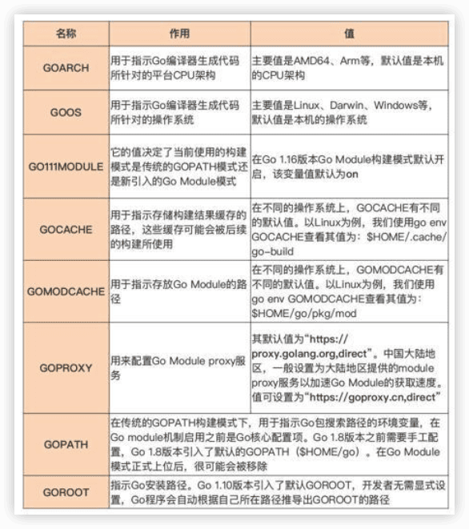
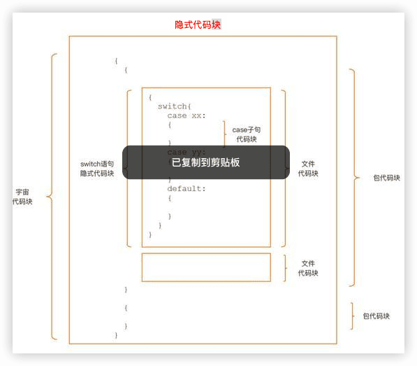
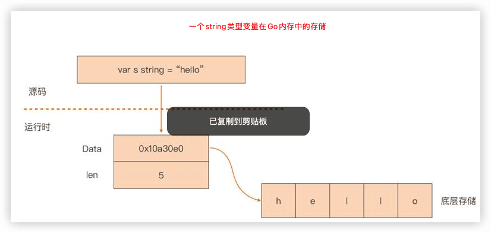
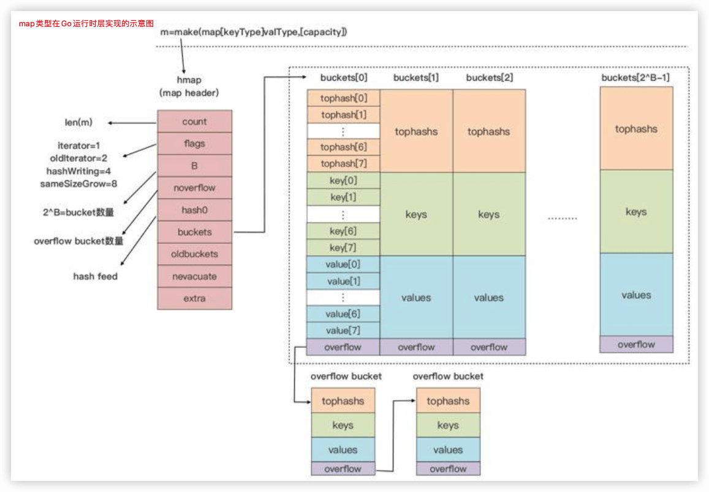
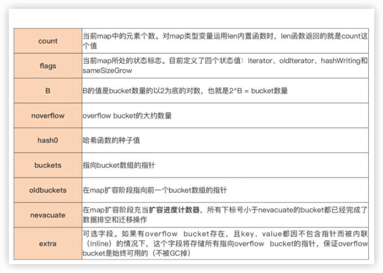
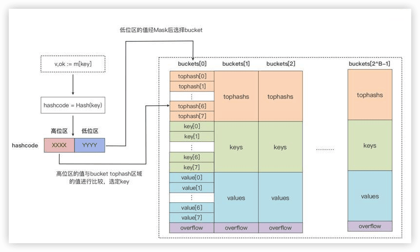
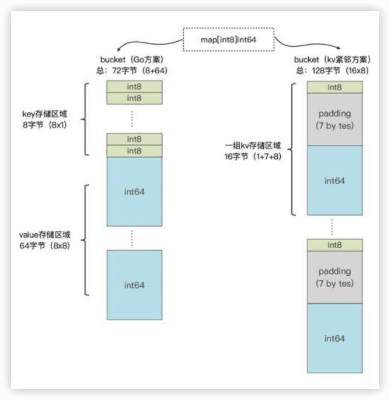

Go语言第一课
---

[Go 语言第一课](https://time.geekbang.org/column/intro/100093501)


官方网站：https://golang.google.cn/ or https://go.dev/


## 0 这样入门Go，才能少走弯路


### 入坑Go的三大理由


#### 1 对初学者足够友善，能够快速上手


#### 2 生产力与性能的最佳结合

Go已经成为了云基础架构语言，它在**云原生基础设施、中间件与云服务**领域大放异彩。同时，GO在**DevOps/SRE、区块链、命令行交互程序（CLI）、Web服务，还有数据处理**等方面也有大量拥趸，我们甚至可以看到Go在**微控制器、机器人、游戏领域**也有广泛应用。


#### 3 快乐又有“钱景”

简单的语法、得心应手的工具链、丰富和健壮的标准库，还有生产力与性能的完美结合、免除内存管理的心智负担，对并发设计的原生支持


# 前置篇：心定之旅

## 01 前世今生：Go的历史和现状

了解一门编程语言的历史和现状，以及未来的走向，可以建立起**学习的“安全感”**，相信它能够给你带来足够的价值和收益，更加坚定地学习下去

。

### 诞生

Go语言的创始人有三位：

- 图灵奖获得者、C语法联合发明人、Unix之父肯·汤普森（Ken Thompson）
- Plan 9操作系统领导者、UTF-8编码的最初设计者罗伯·派克（Rob Pike）
- Java的HotSpot虚拟机和Chrome浏览器的JavaScript V8引擎的设计者之一罗伯特·格瑞史莫（Robert Griesemer）。


- 2007年9月20日 讨论

不便：C++的巨大复杂性、编译构建速度慢以及在编写服务端程序时对并发支持的不足

思路：在C语言的基础上，修正一些明显的缺陷，删除一些被诟病较多的特性，增加一些缺失的功能，比如，使用import替代include、去掉宏、增加垃圾回收、支持接口等。

9月25日，罗伯·派克 命名为“go”。

“Golang”仅应用于命名Go语言官方网站。

### 从“三人行”到“众人拾柴”

- 2008年初，肯·汤普森实现了第一版Go编译器，用于验证之前的设计。这个编译器先将Go代码转换为C代码，再由C编译器编译成二进制文件。

- 2008年年中，Go的第一版设计就基本结束了。伊恩·泰勒（Ian Lance Taylor）为Go语言实现了一个gcc的前端，这也是Go语言的第二个编译器。

之后他成为了Go语言，以及其工具设计和实现的核心人物之一。

- 2008年，罗斯·考克斯（Russ Cox）利用函数类型是“一等公民”，而且它也可以拥有自己的方法这个特性巧妙设计出了http包的HandlerFunc类型。这样，我们通过显式转型就可以让一个普通函数成为满足http.Handler接口的类型了。

- 2009年10月30日，Go语言第一次公之于众。
- 2009年11月10日，谷歌官方宣布Go语言项目开源，之后这一天也被Go官方确定为Go语言的诞生日。

“吉祥物”，是一只由罗伯·派克夫人芮妮·弗伦奇（Renee French）设计的地鼠，从此地鼠（gopher）也就成为了世界各地Go程序员的象征，Go程序员也被昵称为Gopher。

- 2012年3月28日，Go 1.0版本正式发布


### Go是否值得我们学习？

现代云计算基础设施软件的大部分流行和可靠的作品，都是用Go编写的，比如：Docker、Kubernetes、Prometheus、Ethereum（以太坊）、Istio、CockroachDB、InfluxDB、Terraform、Etcd、Consul等等。

## 02 Go语言的设计哲学

编程语言的设计哲学，就是指决定这门**语言演化进程的高级原则和依据**。

Go语言的设计哲学总结为五点：简单、显式、组合、并发和面向工程。

### 简单

> “大多数编程语言创建伊始都致力于成为一门简单的语言，但最终都只是满足于做一个强大的编程语言”。

Go语言的设计者们在语言设计之初，就拒绝了走语言特性融合的道路，选择了“做减法”并致力于打造一门简单的编程语言。

其实，Go语言也没它看起来那么简单，自身实现起来并不容易，但这些**复杂性被Go语言的设计者们“隐藏”了**，所以Go语法层面上呈现了这样的状态：

- 仅有25个关键字，主流编程语言最少；
- 内置垃圾收集，降低开发人员内存管理的心智负担；
- 首字母大小写决定可见性，无需通过额外关键字修饰；
- 变量初始为类型零值，避免以随机值作为初值的问题；
- 内置数组边界检查，极大减少越界访问带来的安全隐患；

- 内置并发支持，简化并发程序设计；
- 内置接口类型，为组合的设计哲学奠定基础；
- 原生提供完善的工具链，开箱即用；
- … …

> 任何的设计都存在着权衡与折中

> 简单意味着可以使用**更少的代码**实现相同的功能；简单意味着代码具有更好的**可读性**，而可读性好的代码通常意味着更好的**可维护性以及可靠性**。

### 显式

Go不允许不同类型的整型变量进行混合计算，它同样也不会对其进行隐式的自动转换。

Go希望开发人员明确知道自己在做什么，这与C语言的“信任程序员”原则完全不同。

除此之外，Go设计者所崇尚的显式哲学还直接决定了Go语言错误处理的形态：Go语言采用了显式的基于值比较的错误处理方案，函数/方法中的错误都会通过return语句显式地返回，并且通常调用者不能忽略对返回的错误的处理。

### 组合

Go语言不像C++、Java等主流面向对象语言，在Go中是找不到经典的面向对象语法元素、类型体系和继承机制的，Go推崇的是组合的设计哲学。

在Go语言设计层面，Go设计者为开发者们提供了**正交的语法元素**，以供后续组合使用，包括：

- Go语言无类型层次体系，各类型之间是相互独立的，没有子类型的概念；
- 每个类型都可以有自己的方法集合，类型定义与方法实现是**正交独立**的；
- 实现某个接口时，无需像Java那样采用特定关键字修饰；
- 包之间是相对独立的，没有子包的概念。

Go语言为支撑组合的设计提供了==类型嵌入（Type Embedding）==。通过类型嵌入，我们可以将已经实现的功能嵌入到新类型中，以快速满足新类型的功能需求，这种方式有些类似经典面向对象语言中的“继承”机制，但在原理上却与面向对象中的继承完全不同，这是一种Go设计者们精心设计的“语法糖”。

被嵌入的类型和新类型两者之间没有任何关系，甚至相互完全不知道对方的存在，更没有经典面向对象语言中的那种父类、子类的关系，以及==向上、向下转型（Type Casting）==。通过新类型实例调用方法时，方法的匹配主要取决于**方法名字**，而不是类型。这种组合方式，我称之为==垂直组合==，即通过类型嵌入，快速让一个新类型“复用”其他类型已经实现的能力，实现功能的==垂直扩展==。

```go
// $GOROOT/src/sync/pool.go
type poolLocal struct {
    private interface{}   
    shared  []interface{}
    Mutex               
    pad     [128]byte  
}
```

在poolLocal这个结构体类型中嵌入了类型Mutex，这就使得poolLocal这个类型具有了互斥同步的能力，可以通过poolLocal类型的变量，直接调用Mutex类型的方法Lock或Unlock。

```go
// $GOROOT/src/io/io.go
type ReadWriter interface {
    Reader
    Writer
}
```

通过嵌入接口类型的方式来实现接口行为的聚合，组成==大接口==，这种方式在标准库中尤为常用，并且已经成为了Go语言的一种惯用法。

垂直组合本质上是一种“==能力继承==”，采用嵌入方式定义的新类型继承了嵌入类型的能力。Go还有一种常见的组合方式，叫==水平组合==。和垂直组合的能力继承不同，水平组合是一种==能力委托（Delegate）==，通常使用接口类型来实现水平组合。

Go语言中的接口只是**方法集合**，并且它与实现者之间的关系无需通过显式关键字修饰，它让程序内部各部分之间的耦合降至最低，同时它也是连接程序各个部分之间“纽带”。

水平组合的模式1️⃣，通过接受接口类型参数的普通函数进行组合：

```go
// $GOROOT/src/io/ioutil/ioutil.go
func ReadAll(r io.Reader)([]byte, error)

// $GOROOT/src/io/io.go
func Copy(dst Writer, src Reader)(written int64, err error)
```

函数ReadAll通过io.Reader这个接口，将io.Reader的实现与ReadAll所在的包低耦合地水平组合在一起了，从而达到从任意实现io.Reader的数据源读取所有数据的目的。类似的水平组合“模式”还有点缀器、中间件等。

2️⃣将Go语言内置的并发能力进行灵活组合以实现，比如，通过goroutine+channel的组合，可以实现类似Unix Pipe的能力。

总之，组合原则的应用实质上是塑造了Go程序的骨架结构。类型嵌入为类型提供了垂直扩展能力，而接口是水平组合的关键。

### 并发

> “并发”出现的背景
>
> CPU都是靠提高主频来改进性能的，但是现在这个做法已经遇到了瓶颈。主频提高导致CPU的功耗和发热量剧增，反过来制约了CPU性能的进一步提高。2007年开始，处理器厂商的竞争焦点从主频转向了多核。

Go放弃了传统的基于**操作系统线程**的并发模型，而采用了**用户层轻量级线程**，Go将之称为==goroutine==。

goroutine占用的资源非常小，Go运行时默认为每个goroutine分配的栈空间仅==2KB==。goroutine调度的切换也不用陷入（trap）操作系统内核层完成，代价很低。因此，一个Go程序中可以创建**成千上万**个并发的goroutine。而且，所有的Go代码都在goroutine中执行，哪怕是go运行时的代码也不例外。

Go还在语言层面内置了辅助并发设计的原语：`channel`和`select`。开发者可以通过语言内置的channel**传递消息或实现同步**，并通过select实现**多路channel的并发控制**。

并发与组合的哲学是一脉相承的，**并发是一个更大的组合的概念**，它在程序设计的全局层面对程序进行拆解组合，再映射到程序执行层面上：goroutines各自执行特定的工作，通过channel+select将goroutines组合连接起来

### 面向工程

Go语言设计的初衷，就是面向解决真实世界中Google内部大规模软件开发存在的各种问题，为这些问题提供答案，这些问题包括：**程序构建慢、依赖管理失控、代码难于理解、跨语言构建难**等。

Go在语法设计细节上做了精心的打磨。比如：

- 重新设计编译单元和目标文件格式，实现Go源码快速构建，让大工程的构建时间缩短到类似动态语言的交互式解释的编译速度；
- 如果源文件导入它不使用的包，则程序将无法编译。这可以充分保证任何Go程序的**依赖树是精确的**。这也可以保证在构建程序时不会编译额外的代码，从而最大限度地缩短编译时间；
- **去除包的循环依赖**，循环依赖会在大规模的代码中引发问题，因为它们要求编译器同时处理更大的源文件集，这会减慢增量构建；
- **包路径是唯一的，而包名不必唯一的**。导入路径必须唯一标识要导入的包，而名称只是包的使用者如何引用其内容的约定。“包名称不必是唯一的”这个约定，大大降低了开发人员给包起唯一名字的心智负担；🔖
- 故意**不支持默认函数参数**。因为在规模工程中，很多开发者利用默认函数参数机制，向函数添加过多的参数以弥补函数API的设计缺陷，这会导致函数拥有太多的参数，降低清晰度和可读性；
- 增加**类型别名（type alias）**，支持大规模代码库的重构。

Go**标准库功能丰富**，多数功能不需要依赖外部的第三方包或库。

Go语言就提供了足以让所有其它主流语言开发人员羡慕的**工具链**，涵盖了**编译构建、代码格式化、包依赖管理、静态代码检查、测试、文档生成与查看、性能剖析、语言服务器、运行时程序跟踪**等方方面面。其中`gofmt`统一了Go语言的代码风格

Go在标准库中提供了官方的**词法分析器、语法解析器和类型检查器**相关包，开发者可以基于这些包快速构建并扩展Go工具链。


### 思考题

> 还能举出哪些符合Go语言设计哲学的例子吗？


# 入门篇：勤加练手

## 03 配好环境：选择一种最适合你的Go安装方法

### 选择Go版本

Go语言的版本发布策略:

- 每年发布两次大版本，一般是在二月份和八月份发布
- 对最新的两个Go稳定大版本提供支持

- 支持的范围主要包括**修复版本中存在的重大问题、文档变更以及安全问题更新**等。

### 安装Go


### 安装多个Go版本 🔖


### 配置Go

`go env`



`go help environment`


## 04 初窥门径：一个Go程序的结构是怎样的？

Go源文件总是用全小写字母形式的短小单词命名，并且以.go扩展名结尾。多个单词就直接连接起来，不要用下划线连接（下划线在在Go源文件命名中有特殊作用）。

```go
package main

import "fmt"

func main() {
    fmt.Println("hello, world")
} 
```


整个Go程序中仅允许存在一个名为main的包。

`Gofmt`是Go语言在解决规模化（scale）问题上的一个最佳实践。

import “fmt” 一行中“`fmt`”代表的是包的导入路径（Import），它表示的是标准库下的fmt目录，整个import声明语句的含义是导入标准库fmt目录下的包；`fmt.Println`函数调用一行中的“`fmt`”代表的则是包名。两者是不一样的。

在Go语言中，只有首字母为大写的标识符才是导出的（Exported），才能对包外的代码可见。

### Go语言中程序是怎么编译的？

```shell
go build main.go
```

`go run`这类命令更多用于开发调试阶段，真正的交付成果还是需要使用go build命令构建的

### 复杂项目下Go程序的编译是怎样的

==Go module==构建模式是在Go 1.11版本正式引入的，为的是**彻底解决Go项目复杂版本依赖的问题**，在Go 1.16版本中，Go module已经成为了Go默认的**包依赖管理机制和Go源码构建机制**。

`go mod init github.com/andyron/hellomodule`创建`go.mod`文件：

```
module github.com/andyron/hellomodule

go 1.22.1
```

一个module就是一个包的集合，这些包和module一起打版本、发布和分发。go.mod所在的目录被称为它声明的module的根目录。

第一行内容是用于声明==module路径（module path）==的。而且，module隐含了一个==命名空间==的概念，module下每个包的导入路径都是由**==module path==和==包所在子目录的名字==**结合在一起构成。比如，如果hellomodule下有子目录pkg/pkg1，那么pkg1下面的包的导入路径就是由module path（`github.com/andyron/hellomodule`）和包所在子目录的名字（pkg/pkg1）结合而成，也就是`github.com/andyron/hellomodule/pkg/pkg1`。

`go 1.22.1`是一个Go版本指示符，用于表示这个module是在某个特定的Go版本的module语义的基础上编写的。

> `go mod tidy`，用于清理和管理项目的依赖关系，可以确保你的 `go.mod` 和 `go.sum` 文件是最新的，它会执行下面的操作：
>
> - **添加缺失的依赖**
> - **移除未使用的依赖**
> - **更新依赖的版本**

`go.sum`文件记录了hellomodule的**直接依赖和间接依赖包的相关版本的hash值，用来校验本地包的真实性**。在构建的时候，如果本地依赖包的hash值与go.sum文件中记录的不一致，就会被拒绝构建。


## 05 标准先行：Go项目的布局标准是什么？

### Go语言“创世项目”结构是怎样的？

“Go语言的创世项目”就是Go语言项目自身。


### 现在的Go项目的典型结构布局是怎样的？

#### 1️⃣可执行程序项目

典型五个部分：

- 放在项目顶层的Go Module相关文件，包括go.mod和go.sum；
- cmd目录：存放项目要编译构建的可执行文件所对应的main包的源码文件；
- 项目包目录：每个项目下的非main包都“平铺”在项目的根目录下，每个目录对应一个Go包；
- internal目录：存放仅项目内部引用的Go包，这些包无法被项目之外引用；
- vendor目录：这是一个可选目录，为了兼容Go 1.5引入的vendor构建模式而存在的。这个目录下的内容均由Go命令自动维护，不需要开发者手工干预。


#### 2️⃣库项目

去掉cmd目录和vendor目录。


## 06 构建模式：Go是怎么解决包依赖管理问题的？

### Go构建模式是怎么演化的？

Go程序由Go包组合而成的，Go程序的==构建过程==就是**确定包版本、编译包以及将编译后得到的目标文件链接在一起**的过程。

Go语言的构建模式历经了三个迭代和演化过程：

### 1️⃣最初期的GOPATH


### 2️⃣1.5版本的Vendor机制

vendor机制本质上就是在Go项目的某个特定目录下，将项目的所有依赖包缓存起来，这个特定目录名就是vendor。


### 3️⃣现在的Go Module

一个Go Module是一个Go包的集合。module是有版本的，所以module下的包也就有了版本属性。这个module与这些包会组成一个独立的版本单元，它们一起打版本、发布和分发。

在Go Module模式下，通常一个代码仓库对应一个Go Module。一个Go Module的顶层目录下会放置一个go.mod文件，每个go.mod文件会定义唯一一个module，也就是说Go Module与go.mod是一一对应的。

go.mod文件所在的顶层目录也被称为**module的根目录**，module根目录以及它子目录下的所有Go包均归属于这个Go Module，这个module也被称为**main module**。

### 创建一个Go Module

步骤：

1. 第一步，通过go mod init创建go.mod文件，将当前项目变为一个Go Module；
2. 第二步，通过go mod tidy命令自动更新当前module的依赖信息；
3. 第三步，执行go build，执行新module的构建。


由`go mod tidy`下载的依赖module会被放置在本地的module缓存路径下，默认值为`$GOPATH[0]/pkg/mod`，Go 1.15及以后版本可以通过`GOMODCACHE`环境变量，自定义本地module的缓存路径。

> 推荐把go.mod和go.sum两个文件与源码，一并提交到代码版本控制服务器上。

go build命令会读取go.mod中的依赖及版本信息，并在本地module缓存路径下找到对应版本的依赖module，执行编译和链接。


项目所依赖的包有很多版本，Go Module是如何选出最适合的那个版本的呢？

### 深入Go Module构建模式

#### 语义导入版本(Semantic Import Versioning)

版本号，都符合`vX.Y.Z`的格式，由==前缀v==和一个==满足语义版本规范的版本号==组成。语义版本号分成3部分：主版本号(major)、次版本号(minor)和补丁版本号(patch)。


借助于语义版本规范，Go命令可以确定同一module的两个版本发布的先后次序，而且可以确定它们是否兼容。

按照语义版本规范，**主版本号不同的两个版本是相互不兼容的**。而且，在主版本号相同的情况下，**次版本号大都是向后兼容次版本号小的版本。补丁版本号也不影响兼容性**。

而且，Go Module规定：**如果同一个包的新旧版本是兼容的，那么它们的包导入路径应该是相同的**。以logrus为例，选出两个版本v1.7.0和v1.8.1.。按照上面的语义版本规则，这两个版本的主版本号相同，新版本v1.8.1是兼容老版本v1.7.0的。那么，我们就可以知道，如果一个项目依赖logrus，无论它使用的是v1.7.0版本还是v1.8.1版本，它都可以使用下面的包导入语句导入logrus包：

```go
import "github.com/sirupsen/logrus"
```

> 新问题：
>
> 假如在未来的某一天，logrus的作者发布了logrus v2.0.0版本。那么根据语义版本规则，该版本的主版本号为2，已经与v1.7.0、v1.8.1的主版本号不同了，那么v2.0.0与v1.7.0、v1.8.1就是不兼容的包版本。然后我们再按照Go Module的规定，如果一个项目依赖logrus v2.0.0版本，那么它的包导入路径就不能再与上面的导入方式相同了。那我们应该使用什么方式导入logrus v2.0.0版本呢？

Go Module创新性地给出了一个方法：**将包主版本号引入到包导入路径中**：

```go
import "github.com/sirupsen/logrus/v2"
```

甚至可以同时依赖一个包的两个不兼容版本：

```go
import (
  "github.com/sirupsen/logrus"
  logv2 "github.com/sirupsen/logrus/v2"
)
```


> v0.y.z版本应该使用哪种导入路径呢？
>
> v0.y.z这样的版本号是用于项目初始开发阶段的版本号。在这个阶段任何事情都有可能发生，其API也不应该被认为是稳定的。Go Module将这样的版本(v0)与主版本号v1做同等对待，也就是采用不带主版本号的包导入路径，这样一定程度降低了Go开发人员使用这样版本号包时的心智负担。

#### 最小版本选择(Minimal Version Selection)


> myproject有两个直接依赖A和B，A和B有一个共同的依赖包C，但A依赖C的v1.1.0版本，而B依赖的是C的v1.3.0版本，并且此时C包的最新发布版为C v1.7.0。这个时候，Go命令是如何为myproject选出间接依赖包C的版本呢？选出的究竟是v1.7.0、v1.1.0还是v1.3.0呢？

当前存在的主流编程语言，以及Go Module出现之前的很多Go包依赖管理工具都会选择依赖项的“**最新最大(Latest Greatest)版本**”，也就是v1.7.0。

Go设计者另辟蹊径，在诸多兼容性版本间，他们不光要考虑最新最大的稳定与安全，还要尊重各个module的述求：A明明说只要求C v1.1.0，B明明说只要求C v1.3.0。所以Go会在该项目依赖项的所有版本中，选出符合项目整体要求的“最小版本”。

这个例子中，C v1.3.0是符合项目整体要求的版本集合中的版本最小的那个，于是Go命令选择了C v1.3.0，而不是最新最大的C v1.7.0。Go团队认为**“最小版本选择”为Go程序实现持久的和可重现的构建提供了最佳的方案**。


### Go各版本构建模式机制和切换


## 07 构建模式：GoModule的6类常规操作

### 为当前module添加一个依赖

```go
package main

import "github.com/sirupsen/logrus"
import "github.com/google/uuid"

func main() {
	logrus.Println("hello, go module mode.")
	logrus.Println(uuid.NewString())
}
```

可以`go get github.com/google/uuid`，也可以使用`go mod tidy`命令，在执行构建前自动分析源码中的依赖变化，识别新增依赖项并下载它们。

### 升级/降级依赖的版本

```sh
$ go list -m -versions github.com/sirupsen/logrus
github.com/sirupsen/logrus v0.1.0 v0.1.1 v0.2.0 v0.3.0 v0.4.0 v0.4.1 v0.5.0 v0.5.1 v0.6.0 v0.6.1 v0.6.2 v0.6.3 v0.6.4 v0.6.5 v0.6.6 v0.7.0 v0.7.1 v0.7.2 v0.7.3 v0.8.0 v0.8.1 v0.8.2 v0.8.3 v0.8.4 v0.8.5 v0.8.6 v0.8.7 v0.9.0 v0.10.0 v0.11.0 v0.11.1 v0.11.2 v0.11.3 v0.11.4 v0.11.5 v1.0.0 v1.0.1 v1.0.3 v1.0.4 v1.0.5 v1.0.6 v1.1.0 v1.1.1 v1.2.0 v1.3.0 v1.4.0 v1.4.1 v1.4.2 v1.5.0 v1.6.0 v1.7.0 v1.7.1 v1.8.0 v1.8.1 v1.8.2 v1.8.3 v1.9.0 v1.9.1 v1.9.2 v1.9.3
```

降级：

```sh
$ go get github.com/google/uuid@v1.7.0
```

或

```sh
$ go mod edit -require=github.com/sirupsen/logrus@v1.7.0
$ go mod tidy       
go: downloading github.com/sirupsen/logrus v1.7.0
```


升级：

```sh
$ go get github.com/google/uuid@v1.7.1
```


在Go Module构建模式下，当依赖的主版本号为0或1的时候，我们在Go源码中导入依赖包，不需要在包的导入路径上增加版本号，也就是：

```go
import github.com/user/repo/v0 等价于 import github.com/user/repo
import github.com/user/repo/v1 等价于 import github.com/user/repo
```


### 添加一个主版本号大于1的依赖

语义导入版本机制有一个原则：**如果新旧版本的包使用相同的导入路径，那么新包与旧包是兼容的**。也就是说，如果新旧两个包不兼容，那么我们就应该采用不同的导入路径。

```go
import github.com/user/repo/v2/xxx
```

主版本号大于1的依赖，**在声明它的导入路径的基础上，加上版本号信息**。


### 升级依赖版本到一个不兼容版本


### 移除一个依赖

列出当前module的所有依赖：

```sh
$ go list -m all
```


删除代码中对包依赖，然后`go build`是不会从当前module中移除相关依赖的，需要使用`go mod tidy`命令。

go mod tidy会自动分析源码依赖，而且将不再使用的依赖从go.mod和go.sum中移除。


### 特殊情况：使用vendor🔖


### 思考题

> 如果你是一个公共Go包的作者，在发布你的Go包时，有哪些需要注意的地方？


## 08 入口函数与包初始化：搞清Go程序的执行次序

### main.main函数：Go应用的入口函数

Go语言要求：**可执行程序的main包必须定义main函数，否则Go编译器会报错**。在启动了多个Goroutine的Go应用中，main.main函数将在Go应用的主Goroutine中执行。

不过很有意思的是，在多Goroutine的Go应用中，相较于main.main作为Go应用的入口，**main.main函数返回的意义其实更大**，因为main函数返回就意味着整个Go程序的终结，而且你也不用管这个时候是否还有其他子Goroutine正在执行。


除了main包外，其他包也可以拥有自己的名为main的函数或方法。但按照Go的可见性规则（小写字母开头的标识符为非导出标识符），非main包中自定义的main函数仅限于包内使用。

> 对于main包的main函数来说，虽然是用户层逻辑的入口函数，但它却**不一定是用户层第一个被执行的函数**。

### init函数：Go包的初始化函数

如果main包依赖的包中定义了init函数，或者是main包自身定义了init函数，那么Go程序在这个包初始化的时候，就会自动调用它的init函数，因此这些init函数的执行就都会发生在main函数之前。


### Go包的初始化次序

从程序逻辑结构角度来看，Go包是程序逻辑封装的基本单元，每个包都可以理解为是一个“自治”的、封装良好的、对外部暴露有限接口的基本单元。一个Go程序就是由一组包组成的，程序的初始化就是这些包的初始化。每个Go包还会有自己的依赖包、常量、变量、init函数（其中main包有main函数）等。

> 注意📢：我们在阅读和理解代码的时候，需要知道这些元素在在程序初始化过程中的初始化顺序，这样便于我们确定在某一行代码处这些元素的当前状态。

Go包的初始化次序：


1. 首先，main包依赖pkg1和pkg4两个包，所以第一步，Go会根据包导入的顺序，先去初始化main包的第一个依赖包pkg1。
2. 第二步，Go在进行包初始化的过程中，会采用“==深度优先==”的原则，递归初始化各个包的依赖包。在上图里，pkg1包依赖pkg2包，pkg2包依赖pkg3包，pkg3没有依赖包，于是Go在pkg3包中按照“==常量 -> 变量 -> init函数==”的顺序先对pkg3包进行初始化；
3. 紧接着，在pkg3包初始化完毕后，Go会回到pkg2包并对pkg2包进行初始化，接下来再回到pkg1包并对pkg1包进行初始化。在调用完pkg1包的init函数后，Go就完成了main包的第一个依赖包pkg1的初始化。
4. 接下来，Go会初始化main包的第二个依赖包pkg4，pkg4包的初始化过程与pkg1包类似，也是先初始化它的依赖包pkg5，然后再初始化自身；然后，当Go初始化完pkg4包后也就完成了对main包所有依赖包的初始化，接下来初始化main包自身。
5. 最后，在main包中，Go同样会按照“常量 -> 变量 -> init函数”的顺序进行初始化，执行完这些初始化工作后才正式进入程序的入口函数main函数。


🔖  包引入错误？变量和常量的执行顺序为什么反了？


Go包的初始化次序，三点：

- 依赖包按“深度优先”的次序进行初始化；
- 每个包内按以“常量 -> 变量 -> init函数”的顺序进行初始化；
- 包内的多个init函数按出现次序进行自动调用。


### init函数的用途

Go包初始化时，init函数的初始化次序在变量之后，这给了开发人员在init函数中**对包级变量进行进一步检查与操作**的机会。

#### 用途1：重置包级变量值

负责对包内部以及暴露到外部的包级数据（主要是包级变量）的初始状态进行检查。

例如，标准库flag包：🔖

flag包定义了一个导出的包级变量CommandLine，如果用户没有通过flag.NewFlagSet创建新的代表命令行标志集合的实例，那么CommandLine就会作为flag包各种导出函数背后，默认的代表命令行标志集合的实例。

```go
var CommandLine = NewFlagSet(os.Args[0], ExitOnError)

func NewFlagSet(name string, errorHandling ErrorHandling) *FlagSet {
    f := &FlagSet{
        name:          name,
        errorHandling: errorHandling,
    }
    f.Usage = f.defaultUsage
    return f
}

func (f *FlagSet) defaultUsage() {
    if f.name == "" {
        fmt.Fprintf(f.Output(), "Usage:\n")
    } else {
        fmt.Fprintf(f.Output(), "Usage of %s:\n", f.name)
    }
    f.PrintDefaults()
}
```

在通过NewFlagSet创建CommandLine变量绑定的FlagSet类型实例时，CommandLine的Usage字段被赋值为defaultUsage。也就是说，如果保持现状，那么使用flag包默认CommandLine的用户就无法自定义usage的输出了。于是，flag包在init函数中重置了CommandLine的Usage字段：

```go
func init() {
    CommandLine.Usage = commandLineUsage // 重置CommandLine的Usage字段
}

func commandLineUsage() {
    Usage()
}

var Usage = func() {
    fmt.Fprintf(CommandLine.Output(), "Usage of %s:\n", os.Args[0])
    PrintDefaults()
}
```

这个时候我们会发现，CommandLine的Usage字段，设置为了一个flag包内的未导出函数commandLineUsage，后者则直接使用了flag包的另外一个导出包变量Usage。这样，就可以通过init函数，将CommandLine与包变量Usage关联在一起了。

然后，当用户将自定义的usage赋值给了flag.Usage后，就相当于改变了默认代表命令行标志集合的CommandLine变量的Usage。这样当flag包完成初始化后，CommandLine变量便处于一个合理可用的状态了。

#### 用途2：实现对包级变量的复杂初始化

些包级变量需要一个比较复杂的初始化过程，有些时候，使用它的**类型零值**（每个Go类型都具有一个零值定义）或通过简单初始化表达式不能满足业务逻辑要求，而init函数则非常适合完成此项工作，标准库http包中就有这样一个典型示例：

```go
// net/http/h2_bundle.go
var (
    http2VerboseLogs    bool // 初始化时默认值为false
    http2logFrameWrites bool // 初始化时默认值为false
    http2logFrameReads  bool // 初始化时默认值为false
    http2inTests        bool // 初始化时默认值为false
)

func init() {
    e := os.Getenv("GODEBUG")
    if strings.Contains(e, "http2debug=1") {
        http2VerboseLogs = true // 在init中对http2VerboseLogs的值进行重置
    }
    if strings.Contains(e, "http2debug=2") {
        http2VerboseLogs = true // 在init中对http2VerboseLogs的值进行重置
        http2logFrameWrites = true // 在init中对http2logFrameWrites的值进行重置
        http2logFrameReads = true // 在init中对http2logFrameReads的值进行重置
    }
}
```

http包定义了一系列布尔类型的特性开关变量，可以通过GODEBUG环境变量的值，开启相关特性开关。

#### 用途3：在init函数中实现“注册模式”

lib/pq包访问PostgreSQL数据库的代码示例：

```go
import (
    "database/sql"
    _ "github.com/lib/pq"
)

func main() {
    db, err := sql.Open("postgres", "user=pqgotest dbname=pqgotest sslmode=verify-full")
    if err != nil {
        log.Fatal(err)
    }
    
    age := 21
    rows, err := db.Query("SELECT name FROM users WHERE age = $1", age)
    ...
}
```

以空导入的方式导入[lib/pq](https://github.com/lib/pq)包的，main函数中没有使用pq包的任何变量、函数或方法，这样就实现了对PostgreSQL数据库的访问。而这一切的奥秘，全在pq包的init函数中：

```go
func init() {
    sql.Register("postgres", &Driver{})
}
```

利用了用空导入的方式导入lib/pq包时产生的一个“副作用”，也就是lib/pq包作为main包的依赖包，它的init函数会在pq包初始化的时候得以执行。

init函数中，pq包将自己实现的sql驱动注册到了sql包中。这样只要应用层代码在Open数据库的时候，传入驱动的名字（这里是“postgres”)，那么通过sql.Open函数，返回的数据库实例句柄对数据库进行的操作，实际上调用的都是pq包中相应的驱动实现。

实际上，这种**通过在init函数中注册自己的实现的模式，就有效降低了Go包对外的直接暴露，尤其是包级变量的暴露**，从而避免了外部通过包级变量对包状态的改动。

另外，从标准库database/sql包的角度来看，这种“注册模式”实质是一种**工厂设计模式**的实现，sql.Open函数就是这个模式中的工厂方法，它根据外部传入的驱动名称“生产”出不同类别的数据库实例句柄。

这种“注册模式”在标准库的其他包中也有广泛应用，比如说，使用标准库image包获取各种格式图片的宽和高：

```go
package main

import (
    "fmt"
    "image"
    _ "image/gif" // 以空导入方式注入gif图片格式驱动
    _ "image/jpeg" // 以空导入方式注入jpeg图片格式驱动
    _ "image/png" // 以空导入方式注入png图片格式驱动
    "os"
)

func main() {
    // 支持png, jpeg, gif
    width, height, err := imageSize(os.Args[1]) // 获取传入的图片文件的宽与高
    if err != nil {
        fmt.Println("get image size error:", err)
        return
    }
    fmt.Printf("image size: [%d, %d]\n", width, height)
}

func imageSize(imageFile string) (int, int, error) {
    f, _ := os.Open(imageFile) // 打开图文文件
    defer f.Close()

    img, _, err := image.Decode(f) // 对文件进行解码，得到图片实例
    if err != nil {
        return 0, 0, err
    }

    b := img.Bounds() // 返回图片区域
    return b.Max.X, b.Max.Y, nil
}
```

上面这个示例程序支持png、jpeg、gif三种格式的图片，而达成这一目标的原因，正是image/png、image/jpeg和image/gif包都在各自的init函数中，将自己“注册”到image的支持格式列表中了：

```go
// $GOROOT/src/image/png/reader.go
func init() {
    image.RegisterFormat("png", pngHeader, Decode, DecodeConfig)
}

// $GOROOT/src/image/jpeg/reader.go
func init() {
    image.RegisterFormat("jpeg", "\xff\xd8", Decode, DecodeConfig)
}

// $GOROOT/src/image/gif/reader.go
func init() {
    image.RegisterFormat("gif", "GIF8?a", Decode, DecodeConfig)
}  
```


### 思考题

> 当init函数在检查包数据初始状态时遇到失败或错误的情况，我们该如何处理呢？

## 09 即学即练：构建一个Web服务就是这么简单

### 最简单的HTTP服务

```go
package main

import "net/http"

func main() {
	http.HandleFunc("/", func(w http.ResponseWriter, r *http.Request) {
		w.Write([]byte("hello, world!"))
	})
	http.ListenAndServe(":8080", nil)
}
```

ListenAndServe

HandleFunc

第二个参数r代表来自客户端的HTTP请求，第一个参数w则是用来操作返回给客户端的应答的，基于http包实现的HTTP服务的处理函数都要符合这一原型。

将请求中的URI路径与设置的模式字符串进行==最长前缀匹配==，并执行匹配到的模式字符串所对应的处理函数。

### 图书管理API服务 ❤️


#### 项目建立与布局设计

bookstore

服务大体拆分为两大部分：

- 一部分是HTTP服务器，用来对外提供API服务；
- 另一部分是图书数据的存储模块，所有的图书数据均存储在这里。

Go项目布局标准：

```
├── cmd/
│   └── bookstore/         // 放置bookstore main包源码
│       └── main.go
├── go.mod                 // module bookstore的go.mod
├── go.sum
├── internal/              // 存放项目内部包的目录
│   └── store/
│       └── memstore.go     
├── server/                // HTTP服务器模块
│   ├── middleware/
│   │   └── middleware.go
│   └── server.go          
└── store/                 // 图书数据存储模块
    ├── factory/
    │   └── factory.go
    └── store.go
```

#### 项目main包


```go
// cmd/bookstore/main.go
package main

import (
	_ "bookstore/internal/store"
	"bookstore/server"
	"bookstore/store/factory"
	"context"
	"log"
	"os"
	"os/signal"
	"syscall"
	"time"
)

func main() {
	s, err := factory.New("mem") // 1️⃣创建图书数据存储模块实例
	if err != nil {
		panic(err)
	}

	srv := server.NewBookStoreServer(":8080", s) // 2️⃣创建http服务实例

	errChan, err := srv.ListenAndServe() // 运行http服务
	if err != nil {
		log.Println("web server start failed: ", err)
		return
	}
	log.Println("web server start ok")

	// 3️⃣通过监视系统信号实现了http服务实例的优雅退出
	c := make(chan os.Signal, 1)
	signal.Notify(c, syscall.SIGINT, syscall.SIGTERM) // 捕获系统信号SIGINT、SIGTERM

	select { // 监视来自errChan以及c的事件
	case err = <-errChan:
		log.Println("web server run failed:", err)
		return
	case <-c:
		log.Println("bookstore program is exiting...")
		ctx, cf := context.WithTimeout(context.Background(), time.Second)
		defer cf()
		err = srv.Shutdown(ctx) // 优雅关闭http服务实例
	}

	if err != nil {
		log.Println("bookstore program exit error: ", err)
		return
	}
	log.Println("bookstore program exit ok")
}
```

> 在Go中，main包是整个程序的入口，还是整个程序中==主要模块初始化与组装的场所==。

优雅退出，指的就是**程序有机会等待其他的事情处理完再退出**。比如**尚未完成的事务处理、清理资源（比如关闭文件描述符、关闭socket）、保存必要中间状态、内存数据持久化落盘**等等。

http服务实例内部的退出清理工作，包括：**立即关闭所有listener、关闭所有空闲的连接、等待处于活动状态的连接处理完毕**等等。


#### 图书数据存储模块（store)

用来**存储整个bookstore的图书数据**的。

图书数据存储有很多种实现方式，最简单的方式莫过于在内存中创建一个map，以图书id作为key，来保存图书信息。生产环境，需要通过Nosql数据库或关系型数据库。

考虑到对多种存储实现方式的支持，将针对图书的有限种存储操作，放置在一个接口类型Store中：

```go
// store/store.go
 type Book struct {
     Id      string   `json:"id"`      // 图书ISBN ID
     Name    string   `json:"name"`    // 图书名称
     Authors []string `json:"authors"` // 图书作者
     Press   string   `json:"press"`   // 出版社
 }
 
 type Store interface {
     Create(*Book) error        // 创建一个新图书条目
     Update(*Book) error        // 更新某图书条目
     Get(string) (Book, error)  // 获取某图书信息
     GetAll() ([]Book, error)   // 获取所有图书信息
     Delete(string) error       // 删除某图书条目
 }
```

一个对应图书条目的抽象数据类型Book，以及针对Book存取的接口类型Store。这样，对于想要进行图书数据操作的一方来说，他只需要得到一个满足Store接口的实例，就可以实现对图书数据的存储操作了，不用再关心图书数据究竟采用了何种存储方式。这就实现了**图书存储操作与底层图书数据存储方式的解耦**。而且，这种==面向接口编程==也是Go组合设计哲学的一个重要体现。

> 如何创建一个满足Store接口的实例呢？

参考《设计模式》提供的多种创建型模式，选择一种Go风格的工厂模式（创建型模式的一种）来实现满足Store接口实例的创建。`store/factory`包:

```go
// store/factory/factory.go
package factory

import (
	"bookstore/store"
	"fmt"
	"sync"
)

var (
	providersMu sync.RWMutex
	providers   = make(map[string]store.Store) // 使用map类型对工厂可以“生产”的、满足Store接口的实例类型进行管理
)

// Register 让各个实现Store接口的类型可以把自己“注册”到工厂中来
func Register(name string, p store.Store) {
	providersMu.Lock()
	defer providersMu.Unlock()
	if p == nil {
		panic("store: Register provider is nil")
	}

	if _, dup := providers[name]; dup {
		panic("store: Register called twice for provider " + name)
	}
	providers[name] = p
}

// New 传入期望使用的图书存储实现的名称，得到对应的类型实例
func New(providerName string) (store.Store, error) {
	providersMu.RLock()
	p, ok := providers[providerName]
	providersMu.RUnlock()
	if !ok {
		return nil, fmt.Errorf("store: unknown provider %s", providerName)
	}
	return p, nil
}
```


一个基于内存map的Store接口的实现:

```go
// internal/store/memstore.go
package store

import (
	mystore "bookstore/store"
	factory "bookstore/store/factory"
	"sync"
)

func init() {
	factory.Register("mem", &MemStore{
		books: make(map[string]*mystore.Book),
	})
}

// MemStore 是一个基于内存map的Store接口的实现
type MemStore struct {
	sync.RWMutex
	books map[string]*mystore.Book
}

// ...具体实现方法
```

init函数中调用factory包提供的Register函数，把自己的实例以“mem”的名称注册到factory中的。这样做有一个好处，依赖Store接口进行图书数据管理的一方，只要导入internal/store这个包，就可以自动完成注册动作了。

```go
import (
  ... ...
  _ "bookstore/internal/store" // internal/store将自身注册到factory中
)

func main() {
    s, err := factory.New("mem") // 创建名为"mem"的图书数据存储模块实例
    if err != nil {
        panic(err)
    }
    ... ...
}   
```

#### HTTP服务模块（server）

HTTP服务模块的职责是**对外提供HTTP API服务，处理来自客户端的各种请求，并通过Store接口实例执行针对图书数据的相关操作**。


#### 编译、运行与验证


```sh
$ curl -X POST -H "Content-Type:application/json" -d '{"id": "978-7-111-55842-2", "name": "The Go Programming Language", "authors":["Alan A.A.Donovan", "Brian W. Kergnighan"],"press": "Pearson Education"}' localhost:8080/book


$ curl -X GET -H "Content-Type:application/json" localhost:8080/book/978-7-111-55842-2
{"id":"978-7-111-55842-2","name":"The Go Programming Language","authors":["Alan A.A.Donovan","Brian W. Kergnighan"],"press":"Pearson Education"}
```


# 基础篇：“脑勤”多理解

## 10 变量声明：静态语言有别于动态语言的重要特征

在编程语言中，为了方便操作内存特定位置的数据，我们**用一个特定的名字与位于特定位置的内存块绑定在一起**，这个名字被称为==变量==。

变量所绑定的内存区域是要有一个明确的边界的。

> 编程语言的编译器或解释器是如何知道一个变量所能引用的内存区域边界呢？

动态语言的解释器可以在运行时通过对变量赋值的分析，自动确定变量的边界。

静态语言通过==变量声明==，语言使用者可以显式告知编译器一个变量的边界信息。

### Go语言的变量声明方法


变量声明分为四个部分：

- var是修饰变量声明的关键字；
- a为变量名；
- int为该变量的类型；
- 10是变量的初值。

如果没有显式为变量赋予初值，Go编译器会为变量赋予这个类型的**零值**。


==变量声明块（block）==：

```go
var (
  a int = 128
  b int8 = 6
  s string = "hello"
  c rune = 'A'
  t bool = true
)
```

```go
var a, b, c int = 5, 6, 7


var (
  a, b, c int = 5, 6, 7
  c, d, e rune = 'C', 'D', 'E'
) 
```


两种变量声明的“语法糖”:

1️⃣省略类型信息的声明

```go
var b = 13
```

Go编译器会根据右侧变量初值自动推导出变量的类型，并给这个变量赋予初值所对应的默认类型。

```go
var a, b, c = 12, 'A', "hello"
```

2️⃣短变量声明

```go
a := 12
b := 'A'
c := "hello"

    
```


Go语言的变量可以分为两类：

1. 一类称为==包级变量(package varible)==，也就是在包级别可见的变量。如果是导出变量（大写字母开头），那么这个包级变量也可以被视为==全局变量==；
2. 另一类则是==局部变量(local varible)==，也就是Go函数或方法体内声明的变量，仅在函数或方法体内可见。

### 包级变量的声明形式

包级变量只能使用带有var关键字的变量声明形式，不能使用短变量声明形式，但在形式细节上可以有一定灵活度。


### 局部变量的声明形式

1. 第一类：对于延迟初始化的局部变量声明，我们采用通用的变量声明形式

```go
var err error
```

2. 第二类：对于声明且显式初始化的局部变量，建议使用短变量声明形式


小结：


### 思考题

> Go语言变量声明中，类型是放在变量名的后面的，有什么好处？


## 11 代码块与作用域：如何保证变量不会被遮蔽？

==变量遮蔽（Variable Shadowing）==

### 代码块与作用域(Scope)

代码块(Block)是包裹在一对大括号内部的声明和语句序列。

如果一对大括号内部没有任何声明或其他语句，叫做==空代码块==。Go代码块支持嵌套。

```go
func foo() { //代码块1
    { // 代码块2
        { // 代码块3
            { // 代码块4

            }
        }
    }
}
```

1-4都是==显式代码块（Explicit Blocks）==

==隐式代码块（Implicit Block）==



隐式代码块从大到小：

- ==宇宙代码块（Universe Block）==，所有Go源码都在这个隐式代码块中

- ==包代码块（Package Block）==，每个Go包都对应一个隐式包代码块

- ==文件代码块（File Block）==，

- 控制语句层面（if、for与switch）。注意，这里的控制语句隐式代码块与控制语句使用大括号包裹的显式代码块并不是一个代码块。
- case/default子句


==作用域==的概念是**针对标识符的，不局限于变量**。每个标识符都有自己的作用域，而**一个标识符的作用域就是指这个标识符在被声明后可以被有效使用的源码区域**。

作用域是一个编译期的概念，也就是说，编译器在编译过程中会对每个标识符的作用域进行检查，对于在标识符作用域外使用该标识符的行为会给出编译错误的报错。

**声明于外层代码块中的标识符，其作用域包括所有内层代码块**。


Go语言==预定义标识符==：


🔖

### 避免变量遮蔽的原则


### 利用工具检测变量遮蔽问题

`go vet`


## 12 基本数据类型：Go原生支持的数值类型有哪些？

类型不仅是静态语言编译器的要求，更是我们**对现实事物进行抽象的基础**。

Go语言的类型大体可分为三种：==基本数据类型==、==复合数据类型==和==接口类型==。

Go语言原生支持的==数值类型==包括**整型、浮点型以及复数类型**。

### 被广泛使用的整型

Go语言的整型，主要用来表示现实世界中整型数量，比如：人的年龄、班级人数等。

它可以分为==平台无关整型==和==平台相关整型==，区别是在**不同CPU架构或操作系统下长度是否是一致**。

#### 平台无关整型


Go采用**2的补码（Two’s Complement）**作为整型的比特位编码方法。

🔖

#### 平台相关整型


`int`、`uint`与`uintptr`

**在编写有移植性要求的代码时，千万不要强依赖这些类型的长度**。

```go
	var a, b = int(5), uint(6)
	var p uintptr = 0x12345678
	fmt.Println("signed integer a's length is", unsafe.Sizeof(a))   // 8
	fmt.Println("unsigned integer b's length is", unsafe.Sizeof(b)) // 8
	fmt.Println("uintptr's length is", unsafe.Sizeof(p))            // 8
```

#### 整型的溢出问题

由于整型无法表示它溢出后的那个“结果”，所以出现溢出情况后，对应的整型变量的值依然会落到它的取值范围内，只是结果值与我们的预期不符，导致程序逻辑出错。

```go
var s int8 = 127
s += 1 // 预期128，实际结果-128

var u uint8 = 1
u -= 2 // 预期-1，实际结果255
```


最容易发生在**循环语句的结束条件判断**中。

#### 字面值与格式化输出

Go语言在设计开始，继承了C语言的==数值字面值（Number Literal）==的语法形式：

```go
a := 53        // 十进制
b := 0700      // 八进制，以"0"为前缀
c1 := 0xaabbcc // 十六进制，以"0x"为前缀
c2 := 0Xddeeff // 十六进制，以"0X"为前缀
```

Go1.13版本又增加了对二进制字面值的支持和两种八进制字面值的形式:

```go
d1 := 0b10000001 // 二进制，以"0b"为前缀
d2 := 0B10000001 // 二进制，以"0B"为前缀
e1 := 0o700      // 八进制，以"0o"为前缀
e2 := 0O700      // 八进制，以"0O"为前缀 
```

为提升字面值的可读性，Go 1.13版本还支持在字面值中增加数字分隔符“`_`”:

```go
a := 5_3_7   // 十进制: 537
b := 0b_1000_0111  // 二进制位表示为10000111 
c1 := 0_700  // 八进制: 0700
c2 := 0o_700 // 八进制: 0700
d1 := 0x_5c_6d // 十六进制：0x5c6d
```

通过标准库fmt包的格式化输出函数，将一个整型变量输出为不同进制的形式。

### 浮点型

和使用广泛的整型相比，浮点型的使用场景就相对聚焦了，主要集中在**科学数值计算、图形图像处理和仿真、多媒体游戏以及人工智能**等领域。

#### 浮点型的二进制表示

[IEEE 754标准](https://zh.wikipedia.org/wiki/IEEE_754)是IEEE制定的二进制浮点数算术标准，它是20世纪80年代以来最广泛使用的浮点数运算标准，被许多CPU与浮点运算器采用。现存的大部分主流编程语言，包括Go语言，都提供了符合IEEE 754标准的浮点数格式与算术运算。

EE 754标准规定了四种表示浮点数值的方式：**单精度（32位）、双精度（64位）**、扩展单精度（43比特以上）与扩展双精度（79比特以上，通常以80位实现）。后两种其实很少使用

`float32`与`float64`（没有`float`），默认值都为`0.0`，占用的内存**空间大小**不同，可以表示的浮点数的**范围与精度**也不同。

IEEE 754规范给出了在内存中存储和表示一个浮点数的标准形式：


符号位、阶码（即经过换算的指数），以及尾数


当符号位为1时，浮点值为负值；当符号位为0时，浮点值为正值。公式中offset被称为==阶码偏移值==。


- 单精度浮点类型（float32）为符号位分配了1个bit，为阶码分配了8个bit，剩下的23个bit分给了尾数。
- 双精度浮点类型，除了符号位的长度与单精度一样之外，其余两个部分的长度都要远大于单精度浮点型，阶码可用的bit位数量为11，尾数则更是拥有了52个bit位。

🔖

#### 字面值与格式化输出

1. 一类是直白地用十进制表示的浮点值形式

```go
3.1415
.15  // 整数部分如果为0，整数部分可以省略不写
81.80
82. // 小数部分如果为0，小数点后的0可以省略不写
```

2. 另一类则是科学计数法形式

```go
6674.28e-2 // 6674.28 * 10^(-2) = 66.742800
.12345E+5  // 0.12345 * 10^5 = 12345.000000


0x2.p10  // 2.0 * 2^10 = 2048.000000
0x1.Fp+0 // 1.9375 * 2^0 = 1.937500
```


```go
var f float64 = 123.45678
fmt.Printf("%f\n", f) // 123.456780

fmt.Printf("%e\n", f) // 1.234568e+02
fmt.Printf("%x\n", f) // 0x1.edd3be22e5de1p+06

    
```


### 复数类型

🔖


### 延展：创建自定义的数值类型

- 可以通过type关键字基于原生数值类型来声明一个新类型:

```go
type MyInt int32
```

MyInt类型的底层类型是int32，它的数值性质与int32完全相同，但它们仍然是**完全不同的两种类型**。

```go
var m int = 5
var n int32 = 6
var a MyInt = m // 错误：在赋值中不能将m（int类型）作为MyInt类型使用
var a MyInt = n // 错误：在赋值中不能将n（int32类型）作为MyInt类型使用   
```

- 也可以通过Go提供的**类型别名（Type Alias）**语法来自定义数值类型。

和上面使用标准type语法的定义不同的是，通过类型别名语法定义的新类型与原类型别无二致，可以完全相互替代。

```go
type MyInt = int32

var n int32 = 6
var a MyInt = n // ok
```


## 13 基本数据类型：为什么Go要原生支持字符串类型？

### 原生支持字符串有什么好处？

C语言没有提供对字符串类型的原生支持，字符串是以字符串字面值或以’`\0`’结尾的字符类型数组来呈现的。

```c
#define GO_SLOGAN "less is more"
const char * s1 = "hello, gopher"
char s2[] = "I love go"   
```

这样定义的非原生字符串在使用过程中会有很多问题，比如：

- 不是原生类型，编译器不会对它进行类型校验，导致类型安全性差；
- 字符串操作时要时刻考虑结尾的’\0’，防止缓冲区溢出；
- 以字符数组形式定义的“字符串”，它的值是可变的，在并发场景中需要考虑同步问题；
- 获取一个字符串的长度代价较大，通常是O(n)时间复杂度；
- C语言没有内置对非ASCII字符（如中文字符）的支持。

Go语言通过string类型统一了对“字符串”的抽象。这样无论是**字符串常量、字符串变量**或是代码中出现的**字符串字面值**，它们的类型都被统一设置为`string`。

```go
const (
	GO_SLOGAN = "less is more" // GO_SLOGAN是string类型常量
	s1 = "hello, gopher"       // s1是string类型常量
)

var s2 = "I love go" // s2是string类型变量
```

这样的设计带来的好处：

- 第一点：string类型的数据是**==不可变==**的，提高了字符串的==并发安全性==和==存储利用率==。

Go字符串可以被多个Goroutine共享，开发者不用因为担心并发安全问题。

由于字符串的不可变性，针对同一个字符串值，无论它在程序的几个位置被使用，Go编译器只需要为它分配一块存储就好了，大大提高了存储利用率。

- 第二点：没有结尾’\0’，而且获取长度的时间复杂度是常数时间，消除了获取字符串长度的开销。 🔖


- 第三点：原生支持“所见即所得”的原始字符串，大大降低构造多行字符串时的心智负担。

```go
var s string = `         ,_---~~~~~----._
    _,,_,*^____      _____*g*\"*,--,
   / __/ /'     ^.  /      \ ^@q   f
  [  @f | @))    |  | @))   l  0 _/
   \/   \~____ / __ \_____/     \
    |           _l__l_           I
    }          [______]           I
    ]            | | |            |
    ]             ~ ~             |
    |                            |
     |                           |`
fmt.Println(s)
```

- 第四点：对非ASCII字符提供原生支持，消除了源码在不同环境下显示乱码的可能。


### Go字符串的组成 🔖

Go语言在看待Go字符串组成这个问题上，有两种视角。

一种是**字节视角**，也就是和所有其它支持字符串的主流语言一样，Go语言中的字符串值也是一个可空的==字节序列==，字节序列中的字节个数称为该字符串的长度。一个个的字节只是孤立数据，不表意。

```go
var s = "中国人"
fmt.Printf("the length of s = %d\n", len(s)) // 9

for i := 0; i < len(s); i++ {
	fmt.Printf("0x%x ", s[i]) // 0xe4 0xb8 0xad 0xe5 0x9b 0xbd 0xe4 0xba 0xba
}
fmt.Printf("\n")
```


如果要表意，就需要从字符串的另外一个视角来看：字符串是由一个可空的==字符序列==构成。

```go
var s = "中国人"
fmt.Println("the character count in s is", utf8.RuneCountInString(s)) // 3

for _, c := range s {
	fmt.Printf("0x%x ", c) // 0x4e2d 0x56fd 0x4eba
}
fmt.Printf("\n")
```

Go采用的是Unicode字符集，每个字符都是一个Unicode字符，那么这里输出的0x4e2d、0x56fd和0x4eba就应该是某种Unicode字符的表示了。以0x4e2d为例，它是汉字“中”在Unicode字符集表中的==码点（Code Point）==。

> Unicode字符集中的每个字符，都被分配了统一且唯一的字符编号。所谓**Unicode码点**，就是指将Unicode字符集中的所有字符“排成一队”，字符在这个“队伍”中的**位次**，就是它在Unicode字符集中的码点。也就说，一个码点唯一对应一个字符。

#### rune类型与字符字面值

Go使用`rune`这个类型来表示一个Unicode码点。rune本质上是int32类型的别名类型，它与int32类型是完全等价的：

```go
// $GOROOT/src/builtin.go
type rune = int32
```

**一个rune实例就是一个Unicode字符，一个Go字符串也可以被视为rune实例的集合。可以通过字符字面值来初始化一个rune变量。**

字符字面值有多种表示法:

- 单引号括起的字符字面值

```go
'a'  // ASCII字符
'中' // Unicode字符集中的中文字符
'\n' // 换行字符
'\'' // 单引号字符
```

- Unicode专用的转义字符\u或\U作为前缀

```go
'\u4e2d'     // 字符：中
'\U00004e2d' // 字符：中
'\u0027'     // 单引号字符
```

`\u`后面接两个十六进制数。如果是用两个十六进制数无法表示的Unicode字符，可以使用`\U`，\U后面可以接四个十六进制数来表示一个Unicode字符。

- 由于表示码点的rune本质上就是一个整型数，还可**用整型值来直接作为字符字面值给rune变量赋值**

```go
'\x27'  // 使用十六进制表示的单引号字符
'\047'  // 使用八进制表示的单引号字符
```

#### 字符串字面值

**把表示单个字符的单引号，换为表示多个字符组成的字符串的双引号**

```go
"abc\n"
"中国人"
"\u4e2d\u56fd\u4eba" // 中国人
"\U00004e2d\U000056fd\U00004eba" // 中国人
"中\u56fd\u4eba" // 中国人，不同字符字面值形式混合在一起
"\xe4\xb8\xad\xe5\x9b\xbd\xe4\xba\xba" // 十六进制表示的字符串字面值：中国人
```


#### UTF-8编码方案 🔖


### Go字符串类型的内部表示

```go
// $GOROOT/src/reflect/value.go

// StringHeader是一个string的运行时表示
type StringHeader struct {
    Data uintptr
    Len  int
}
```

string类型其实是一个“描述符”，它本身并不真正存储字符串数据，而仅是由一个指向底层存储的指针和字符串的长度字段组成的。



🔖


### Go字符串类型的常见操作

#### 下标操作


#### 字符迭代

常规for迭代与for range迭代

> 注意，这两种形式的迭代对字符串进行操作得到的结果是不同的。

#### 字符串连接

`+`/`+=`

#### 字符串比较

`==`、`!=` 、`>=`、`<=`、`>` 和 `<`

#### 字符串转换

Go支持字符串与字节切片、字符串与rune切片的双向转换，并且这种转换无需调用任何函数，只需使用显式类型转换就可以了。

```go
var s string = "中国人"
                      
// string -> []rune
rs := []rune(s) 
fmt.Printf("%x\n", rs) // [4e2d 56fd 4eba]
                
// string -> []byte
bs := []byte(s) 
fmt.Printf("%x\n", bs) // e4b8ade59bbde4baba
                
// []rune -> string
s1 := string(rs)
fmt.Println(s1) // 中国人
                
// []byte -> string
s2 := string(bs)
fmt.Println(s2) // 中国人
```


### 思考题

> Go提供多种字符串连接服务，包括基于+/+=的字符连接、基于strings.Builder、strings.Join、fmt.Sprintf等函数来进行字符串连接操作。那么，哪种连接方式是性能最高的呢？


## 14 常量：Go在“常量”设计上的创新有哪些？

Go语言在常量方面的创新：

- 支持无类型常量；
- 支持隐式自动转型；
- 可用于实现枚举。

### 常量以及Go原生支持常量的好处

Go语言的常量是一种**在源码编译期间被创建的语法元素**。


```go
const Pi float64 = 3.14159265358979323846 // 单行常量声明

// 以const代码块形式声明常量
const (
    size int64 = 4096
    i, j, s = 13, 14, "bar" // 单行声明多个常量
)

    
```

Go常量的类型只局限于基本数据类型，包括**数值类型、字符串类型，以及只有两个取值（true和false）的布尔类型**。

> 原生不支持常量的C语言
>
> 在C语言中，**字面值担负着常量的角色**，可以使用数值型、字符串型字面值来应对不同场合对常量的需求。
>
> 为了不让这些字面值以“魔数（Magic Number）”的形式分布于源码各处，早期C语言的常用实践是使用**宏（macro）**定义记号来指代这些字面值，这种定义方式被称为**宏定义常量**，比如：
>
> ```c
> #define FILE_MAX_LEN 0x22334455
> #define PI 3.1415926
> #define GO_GREETING "Hello, Gopher"
> #define A_CHAR 'a'
> ```
>
> **宏定义的常量会有很多问题**。比如，它是一种仅在预编译阶段进行替换的字面值，继承了宏替换的复杂性和易错性，而且还有类型不安全、无法在调试时通过宏名字输出常量的值，等等问题。
>
> 后续C标准中提供的const关键字修饰的标识符，也依然不是一种圆满方案。因为const关键字修饰的标识符本质上依旧是变量，它甚至无法用作数组变量声明中的初始长度（除非用GNU扩展C）。
>
> ```c
> const int size = 5;
> int a[size] = {1,2,3,4,5}; // size本质不是常量，这将导致编译器错误 
> ```
>
> 

### 无类型常量

Go语言对类型安全是有严格要求的：**即便两个类型拥有着相同的底层类型，但它们仍然是不同的数据类型，不可以被相互比较或混在一个表达式中进行运算**。

这一要求不仅仅适用于变量，也同样适用于有类型常量（Typed Constant）。

```go
type myInt int
const n myInt = 13
const m int = n + 5 // 编译器报错：cannot use n + 5 (type myInt) as type int in const initializer

func main() {
    var a int = 5
    fmt.Println(a + n) // 编译器报错：invalid operation: a + n (mismatched types int and myInt)
}
```

而且，**有类型常量与变量混合在一起进行运算求值的时候，也必须遵守类型相同这一要求**，否则我们只能通过显式转型才能让上面代码正常工作

```go
type myInt int
const n myInt = 13
const m int = int(n) + 5  // OK

func main() {
    var a int = 5
    fmt.Println(a + int(n))  // 输出：18
}
```

也可以使用Go中的==无类型常量（Untyped Constant）==来实现：

```go
type myInt int
const n = 13

func main() {
    var a myInt = 5
    fmt.Println(a + n)  // 输出：18
} 
```


常量n的默认类型int与myInt并不是同一个类型啊，为什么可以放在一个表达式中计算而没有报编译错误呢？

### 隐式转型

对于无类型常量参与的表达式求值，Go编译器会根据上下文中的类型信息，把无类型常量自动转换为相应的类型后，再参与求值计算，这一转型动作是隐式进行的。

但由于转型的对象是一个常量，所以这并不会引发类型安全问题，Go编译器会保证这一转型的安全性。

如果Go编译器在做隐式转型时，发现无法将常量转换为目标类型，Go编译器也会报错：

```go
const m = 1333333333

var k int8 = 1
j := k + m // 编译器报错：constant 1333333333 overflows int8 
```

### 实现枚举

Go语言其实并没有原生提供枚举类型。

Go语言中，可以使用**const代码块**定义的常量集合，来实现枚举。这是因为枚举类型本质上就是一个由**有限数量常量**所构成的集合。

Go将C语言枚举类型的这种基于前一个枚举值加1的特性，分解成了Go中的两个特性：**自动重复上一行，以及引入const块中的行偏移量指示器`iota`**，这样它们就可以分别独立使用了。

- Go的const语法提供了“隐式重复前一个非空表达式”的机制

```go
const (
  Apple, Banana = 11, 22
  Strawberry, Grape 
  Pear, Watermelon 
)
```

这里常量定义的后两行并没有被显式地赋予初始值，所以Go编译器就为它们自动使用上一行的表达式，也就获得了下面这个等价的代码：

```go
const (
  Apple, Banana = 11, 22
  Strawberry, Grape  = 11, 22 // 使用上一行的初始化表达式
  Pear, Watermelon  = 11, 22 // 使用上一行的初始化表达式
) 
```

- `iota`

iota是Go语言的一个==预定义标识符==，它表示的是const声明块（包括单行声明）中，每个常量所处位置在块中的**偏移值**（从零开始）。

同时，每一行中的iota自身也是一个无类型常量，可以像前面我们提到的无类型常量那样，自动参与到不同类型的求值过程中来，不需要我们再对它进行显式转型操作。

比如Go标准库中sync/mutex.go中的一段基于iota的枚举常量的定义：

```go
// $GOROOT/src/sync/mutex.go 
const ( 
    mutexLocked = 1 << iota
    mutexWoken
    mutexStarving
    mutexWaiterShift = iota
    starvationThresholdNs = 1e6
)
```

首先，这个const声明块的第一行是`mutexLocked = 1 << iota` ，iota的值是这行在const块中的偏移，因此iota的值为0，得到`mutexLocked`这个常量的值为`1 << 0`，也就是1。

着，第二行：mutexWorken 。因为这个const声明块中并没有显式的常量初始化表达式，所以我们根据const声明块里“隐式重复前一个非空表达式”的机制，这一行就等价于mutexWorken = 1 << iota。而且，又因为这一行是const块中的第二行，所以它的偏移量iota的值为1，我们得到mutexWorken这个常量的值为1 << 1，也就是2。

然后是mutexStarving。这个常量同mutexWorken一样，这一行等价于mutexStarving = 1 << iota。而且，也因为这行的iota的值为2，我们可以得到mutexStarving这个常量的值为 1 << 2，也就是4;

再然后看mutexWaiterShift = iota 这一行，这一行为常量mutexWaiterShift做了显式初始化，这样就不用再重复前一行了。由于这一行是第四行，而且作为行偏移值的iota的值为3，因此mutexWaiterShift的值就为3。

最后一行，代码中直接用了一个具体值1e6给常量starvationThresholdNs进行了赋值，那么这个常量值就是1e6本身了。

> 提醒:位于同一行的iota即便出现多次，多个iota的值也是一样的.
>
> ```go
> const (
>   Apple, Banana = iota, iota + 10 // 0, 10 (iota = 0)
>   Strawberry, Grape // 1, 11 (iota = 1)
>   Pear, Watermelon  // 2, 12 (iota = 2)
> )
> ```
>
> 

```go
// $GOROOT/src/syscall/net_js.go
const (
    _ = iota
    IPV6_V6ONLY  // 1
    SOMAXCONN    // 2
    SO_ERROR     // 3
)
```

枚举常量值并不连续时，也可以借助空白标识符来实现：

```go
const (
  _ = iota // 0
  Pin1
  Pin2
  Pin3
  _
  Pin5    // 5   
) 
```


iota特性让**维护枚举常量列表变得更加容易**。

比如使用传统的枚举常量声明方式，来声明一组按首字母排序的“颜色”常量：

```go
const ( 
  Black  = 1 
  Red    = 2
  Yellow = 3
)
```

要增加一个新颜色Blue:

```go
const (
  Blue   = 1
  Black  = 2
  Red    = 3
  Yellow = 4
)
```

使用iota重新定义:

```go
const (
  _ = iota     
  Blue
  black
  Red 
  Yellow     
) 
```

这样，无论后期我们需要增加多少种颜色，只需将常量名插入到对应位置就可以，其他就不需要再做任何手工调整了。


如果一个Go源文件中有多个const代码块定义的不同枚举，每个const代码块中的iota也是独立变化的:

```go
const (
  a = iota + 1 // 1, iota = 0
  b            // 2, iota = 1
  c            // 3, iota = 2
)

const (
    i = iota << 1 // 0, iota = 0
    j             // 2, iota = 1
    k             // 4, iota = 2
)
```

### 思考题

> 虽然iota带来了灵活性与便利，但是否存在一些场合，在定义枚举常量时使用显式字面值更为适合呢？


## 15 同构复合类型：从定长数组到变长切片

==复合类型==：由多个同构类型（相同类型）或异构类型（不同类型）的元素的值组合而成。

Go原生内置了多种复合数据类型，包括**数组、切片（slice）、map、结构体，以及channel**等。

### 数组有哪些基本特性？

Go语言的数组是一个长度固定的、由同构类型元素组成的连续序列。

两个重要属性：==元素的类型==和==数组长度==。

```go
var arr [N]T
```

组元素的类型可以为**任意的Go原生类型或自定义类型**。

如果两个数组类型的元素类型T与数组长度N都是一样的，那么这两个数组类型是等价的，如果有一个属性不同，它们就是两个不同的数组类型。

**数组类型不仅是逻辑上的连续序列，而且在实际内存分配时也占据着一整块内存**。


预定义函数`len`可以用于获取一个数组类型变量的长度，通过unsafe包提供的`Sizeof`函数可以获得一个数组变量的总大小：

```go
var arr = [6]int{1, 2, 3, 4, 5, 6}
fmt.Println("数组长度：", len(arr))           // 6
fmt.Println("数组大小：", unsafe.Sizeof(arr)) // 48 
```


声明一个数组类型变量，如果不进行显式初始化，那么数组中的元素值就是它类型的零值。

```go
var arr1 [6]int // [0 0 0 0 0 0]
```

显示初始化：

```go
var arr2 = [6]int {
  11, 12, 13, 14, 15, 16,
} // [11 12 13 14 15 16]

var arr3 = [...]int {
    21, 22, 23,
} // [21 22 23]
fmt.Printf("%T\n", arr3) // [3]int
```

可以忽略掉右值初始化表达式中数组类型的长度，用“`…`”替代，Go编译器会根据数组元素的个数，自动计算出数组长度。

对一个长度较大的稀疏数组进行显式初始化：

```go
var arr4 = [...]int{
  99: 39, // 将第100个元素(下标值为99)的值赋值为39，其余元素值均为0
}
fmt.Printf("%T\n", arr4) // [100]int
```

### 多维数组

```go
var mArr [2][3][4]int
```


数组类型变量是一个整体，这就意味着**一个数组变量表示的是整个数组**。这点与C语言完全不同，在C语言中，**数组变量可视为指向数组第一个元素的指针**。

这样一来，无论是参与迭代，还是作为实际参数传给一个函数/方法，Go传递数组的方式都是纯粹的**值拷贝**，这会带来较大的内存拷贝开销。解决办法：指针或切片。

### 切片

数组两点不足：**固定的元素个数，以及传值机制下导致的开销较大**。

==切片（slice）==，来弥补数组的这两处不足。

切片的声明并初始化，相对于数组少了长度：

```go
var nums = []int{1,2,3,4,5,6}
```

```go
fmt.Println(len(nums)) // 6

nums = append(nums, 7) // 切片变为[1 2 3 4 5 6 7]
fmt.Println(len(nums)) // 7
```

#### Go是如何实现切片类型的？

Go切片在运行时其实是一个三元组结构:

```go
// runtime/slice.go
type slice struct {
	array unsafe.Pointer
	len   int
	cap   int
}
```

- array: 是指向底层数组的指针；
- len: 是切片的长度，即切片中当前元素的个数；
- cap: 是底层数组的长度，也是切片的最大容量，cap值永远大于等于len值。


**Go编译器会自动为每个新创建的切片**，建立一个底层数组，默认底层数组的长度与切片初始元素个数相同。

创建切片的其他方式：

- 方法一：通过`make`函数来创建切片，并指**定底层数组的长度**。

```go
sl := make([]byte, 6, 10) // 其中10为cap值，即底层数组长度，6为切片的初始长度

sl := make([]byte, 6) // cap = len = 6
```

- 方法二：采用`array[low : high : max]`语法基于一个已存在的数组创建切片。这种方式被称为==数组的切片化==

```go
arr := [10]int{1, 2, 3, 4, 5, 6, 7, 8, 9, 10}
sl := arr[3:7:9]
```


基于数组创建的切片，它的起始元素从low所标识的下标值开始，切片的长度（len）是high - low，它的容量是max - low。而且，由于切片sl的底层数组就是数组arr，对切片sl中元素的修改将直接影响数组arr变量。比如，如果我们将切片的第一个元素加10，那么数组arr的第四个元素将变为14：

```go
sl[0] += 10
fmt.Println("arr[3] =", arr[3]) // 14
```

这样看来，**切片好比打开了一个访问与修改数组的“窗口”**，通过这个窗口，可以直接操作底层数组中的**部分元素**。这有些类似于操作文件之前打开的“**文件描述符**”（Windows上称为**句柄**），通过文件描述符我们可以对底层的真实文件进行相关操作。可以说，**切片之于数组就像是文件描述符之于文件**。

在Go语言中，数组更多是“退居幕后”，承担的是**底层存储空间**的角色。切片就是数组的“描述符”，也正是因为这一特性，切片才能在函数参数传递时**避免较大性能开销**。因为传递的并不是数组本身，而是数组的“描述符”，而这个**描述符的大小是固定的**（见上面的三元组结构），无论底层的数组有多大，切片打开的“窗口”长度有多长，它都是不变的。此外，在进行数组切片化的时候，通常省略max，而max的默认值为数组的长度。

另外，针对一个已存在的数组，我们还可以建立多个操作数组的切片，这些切片共享同一底层数组，切片对底层数组的操作也同样会**反映到其他切片中**。


- 方法三：基于切片创建切片。

这种切片的运行时表示原理与上面的是一样的。

#### 切片的动态扩容

“动态扩容”指当通过append操作向切片追加数据的时候，如果这时切片的len值和cap值是相等的，也就是说切片**底层数组已经没有空闲空间**再来存储追加的值了，Go运行时就会对这个切片做扩容操作，来保证切片始终能存储下追加的新值。也就是会重新分配了其底层数组。

```go
var s []int
s = append(s, 11) 
fmt.Println(len(s), cap(s)) //1 1
s = append(s, 12) 
fmt.Println(len(s), cap(s)) //2 2
s = append(s, 13) 
fmt.Println(len(s), cap(s)) //3 4
s = append(s, 14) 
fmt.Println(len(s), cap(s)) //4 4
s = append(s, 15) 
fmt.Println(len(s), cap(s)) //5 8
```

- 最开始，s初值为零值（nil），这个时候s没有“绑定”底层数组。先通过append操作向切片s添加一个元素11，这个时候，append会先分配底层数组u1（数组长度1），然后将s内部表示中的array指向u1，并设置len = 1, cap = 1;
- 接着，我们通过append操作向切片s再添加第二个元素12，这个时候len(s) = 1，cap(s) = 1，append判断底层数组剩余空间已经不能够满足添加新元素的要求了，于是它就创建了一个新的底层数组u2，长度为2（u1数组长度的2倍），并把u1中的元素拷贝到u2中，最后将s内部表示中的array指向u2，并设置len = 2, cap = 2；
- 然后，第三步，我们通过append操作向切片s添加了第三个元素13，这时len(s) = 2，cap(s) = 2，append判断底层数组剩余空间不能满足添加新元素的要求了，于是又创建了一个新的底层数组u3，长度为4（u2数组长度的2倍），并把u2中的元素拷贝到u3中，最后把s内部表示中的array指向u3，并设置len = 3, cap为u3数组长度，也就是4；
- 第四步，我们依然通过append操作向切片s添加第四个元素14，此时len(s) = 3,cap(s) = 4，append判断底层数组剩余空间可以满足添加新元素的要求，所以就把14放在下一个元素的位置(数组u3末尾），并把s内部表示中的len加1，变为4；
- 第五步又通过append操作，向切片s添加最后一个元素15，这时len(s) = 4，cap(s) = 4，append判断底层数组剩余空间又不够了，于是创建了一个新的底层数组u4，长度为8（u3数组长度的2倍），并将u3中的元素拷贝到u4中，最后将s内部表示中的array指向u4，并设置len = 5, cap为u4数组长度，也就是8。

总结，针对元素是int型的数组，新数组的容量是当前数组的**==2倍==**。新数组建立后，append会把旧数组中的数据拷贝到新数组中，之后新数组便成为了切片的底层数组，旧数组会被垃圾回收掉。

不过append操作的这种自动扩容行为，有些时候会给我们开发者带来一些困惑，比如基于一个已有数组建立的切片，一旦追加的数据操作触碰到切片的容量上限（实质上也是数组容量的上界)，切片就会和原数组==解除“绑定”==，后续对切片的任何修改都不会反映到原数组中了。

```go
u := [...]int{11, 12, 13, 14, 15}
fmt.Println("array:", u) // [11, 12, 13, 14, 15]
s := u[1:3]
fmt.Printf("slice(len=%d, cap=%d): %v\n", len(s), cap(s), s) // [12, 13]
s = append(s, 24)
fmt.Println("after append 24, array:", u)
fmt.Printf("after append 24, slice(len=%d, cap=%d): %v\n", len(s), cap(s), s)
s = append(s, 25)
fmt.Println("after append 25, array:", u)
fmt.Printf("after append 25, slice(len=%d, cap=%d): %v\n", len(s), cap(s), s)
s = append(s, 26)
fmt.Println("after append 26, array:", u)
fmt.Printf("after append 26, slice(len=%d, cap=%d): %v\n", len(s), cap(s), s)

s[0] = 22
fmt.Println("after reassign 1st elem of slice, array:", u)
fmt.Printf("after reassign 1st elem of slice, slice(len=%d, cap=%d): %v\n", len(s), cap(s), s)
```

结果：

```go
array: [11 12 13 14 15]
slice(len=2, cap=4): [12 13]
after append 24, array: [11 12 13 24 15]
after append 24, slice(len=3, cap=4): [12 13 24]
after append 25, array: [11 12 13 24 25]
after append 25, slice(len=4, cap=4): [12 13 24 25]
after append 26, array: [11 12 13 24 25]
after append 26, slice(len=5, cap=8): [12 13 24 25 26]
after reassign 1st elem of slice, array: [11 12 13 24 25]
after reassign 1st elem of slice, slice(len=5, cap=8): [22 13 24 25 26]
```

### 思考题

下下面这两个切片变量sl1与sl2的差异:

```go
var sl1 []int
var sl2 = []int{}
```

`sl1` 是一个未初始化的切片，它指向一个空数组，而 `sl2` 是一个初始化的切片，它指向一个虽然为空但实际存在的数组。在使用切片时，需要确保其不为 `nil`，因为 `nil` 切片无法被索引，也不能进行其他操作。

## 16 复合数据类型：原生map类型的实现机制是怎样的？

map(映射、哈希表或字典)

map是切片之后，第二个由**Go编译器与运行时联合实现**的复合数据类型，它有着**复杂的内部实现**，但却提供了十分简单友好的开发者使用接口。

### 什么是map类型？

```go
map[key_type]value_type
```

```go
map[string]string // key与value元素的类型相同
map[int]string    // key与value元素的类型不同
```

如果两个map类型的key元素类型相同，value元素类型也相同，那么它们是**同一个map类型**，否则就是不同的map类型。

map类型对value的类型没有限制，但是对key的类型却有严格要求，因为map类型要保证**key的唯一性**，**key的类型必须支持“==”和“!=”两种比较操作符**。

在Go语言中，**函数类型、map类型自身，以及切片**只支持与nil的比较，而不支持同类型两个变量的比较，不能作为map的key类型的。

```go
s1 := make([]int, 1)
s2 := make([]int, 2)
f1 := func() {}
f2 := func() {}
m1 := make(map[int]string)
m2 := make(map[int]string)
println(s1 == s2) // 错误：invalid operation: s1 == s2 (slice can only be compared to nil)
println(f1 == f2) // 错误：invalid operation: f1 == f2 (func can only be compared to nil)
println(m1 == m2) // 错误：invalid operation: m1 == m2 (map can only be compared to nil)
```

### map变量的声明和初始化

```go
var m map[string]int // 一个map[string]int类型的变量
```

有显式地赋予map变量初值，map类型变量的默认值为nil。

初值为零值nil的切片类型变量，可以借助内置的append的函数进行操作，这种在Go语言中被称为“==零值可用==”。定义“零值可用”的类型，可以提升开发者的使用体验，不用再担心变量的初始状态是否有效。

但map类型，因为它**内部实现的复杂性，无法“零值可用”**。所以，如果对处于零值状态的map变量直接进行操作，就会导致运行时异常（panic），从而导致程序进程异常退出：

```go
var m map[string]int // m = nil
m["key"] = 1         // 发生运行时异常：panic: assignment to entry in nil map
```

所以，**必须对map类型变量进行显式初始化后才能使用**。

为map类型变量显式赋值有两种方式:

#### 方法一：使用复合字面值初始化map类型变量

```go
m := map[int]string{}
```

此时m不是nil，对其进行键值对操作，不会引发运行时异常

```go
m1 := map[int][]string{
  1: []string{"val1_1", "val1_2"},
  3: []string{"val3_1", "val3_2", "val3_3"},
  7: []string{"val7_1"},
}
```

```go
type Position struct { 
  x float64 
  y float64
}

m2 := map[Position]string{
  Position{29.935523, 52.568915}: "school",
  Position{25.352594, 113.304361}: "shopping-mall",
  Position{73.224455, 111.804306}: "hospital",
}
```

“语法糖”，允许省略字面值中的元素类型，简写为：

```go
m2 := map[Position]string{
  {29.935523, 52.568915}: "school",
  {25.352594, 113.304361}: "shopping-mall",
  {73.224455, 111.804306}: "hospital",
}
```

#### 方法二：使用make为map类型变量进行显式初始化

```go
m1 := make(map[int]string) // 未指定初始容量
m2 := make(map[int]string, 8) // 指定初始容量为8
```

### map的基本操作

#### 1️⃣插入新键值对

```go
m := make(map[int]string)
m[1] = "value1"
m[2] = "value2"
m[3] = "value3"


m := map[string]int {
	"key1" : 1,
	"key2" : 2,
}

m["key1"] = 11 // 11会覆盖掉"key1"对应的旧值1
m["key3"] = 3  // 此时m为map[key1:11 key2:2 key3:3]

     
```

#### 2️⃣获取键值对数量

```go
m := map[string]int {
	"key1" : 1,
	"key2" : 2,
}

fmt.Println(len(m)) // 2
m["key3"] = 3  
fmt.Println(len(m)) // 3 
```

> 不能对map类型变量调用cap，来获取当前容量

#### 3️⃣查找和数据读取

```go
m := make(map[string]int)
v := m["key1"]  // 如果这个键在map中并不存在，也会得到一个值：value元素类型的零值。
```

不能用上面的方法判断某个key是否在map中。

Go语言的map类型支持通过用一种名为“==comma ok==”的惯用法，进行对某个key的查询。

```go
m := make(map[string]int)
v, ok := m["key1"]
if !ok {
    // "key1"不在map中
}

// "key1"在map中，v将被赋予"key1"键对应的value
```

#### 4️⃣删除数据

```go
delete(m, "key2")
```

delete函数是从map中删除键的唯一方法。

#### 5️⃣遍历map中的键值数据

在Go中，遍历map的键值对只有一种方法，那就是像对待切片那样通过**for range**语句对map数据进行遍历。

```go
package main
  
import "fmt"

func main() {
    m := map[int]int{
        1: 11,
        2: 12,
        3: 13,
    }

    fmt.Printf("{ ")
    for k, v := range m {
        fmt.Printf("[%d, %d] ", k, v)
    }
    fmt.Printf("}\n")
} 
```


> 程序逻辑千万不要依赖遍历map所得到的的元素次序。

### map变量的传递开销


```go
package main
  
import "fmt"

func foo(m map[string]int) {
    m["key1"] = 11
    m["key2"] = 12
}

func main() {
    m := map[string]int{
        "key1": 1,
        "key2": 2,
    }

    fmt.Println(m) // map[key1:1 key2:2]  
    foo(m)
    fmt.Println(m) // map[key1:11 key2:12] 
}
```


### map的内部实现 🔖

Go运行时使用一张哈希表来实现抽象的map类型。运行时实现了map类型操作的所有功能，包括查找、插入、删除等。在编译阶段，Go编译器会将Go语法层面的map操作，重写成运行时对应的函数调用。大致的对应关系是这样的：

```go
// 创建map类型变量实例
m := make(map[keyType]valType, capacityhint) → m := runtime.makemap(maptype, capacityhint, m)

// 插入新键值对或给键重新赋值
m["key"] = "value" → v := runtime.mapassign(maptype, m, "key") v是用于后续存储value的空间的地址

// 获取某键的值 
v := m["key"]      → v := runtime.mapaccess1(maptype, m, "key")
v, ok := m["key"]  → v, ok := runtime.mapaccess2(maptype, m, "key")

// 删除某键
delete(m, "key")   → runtime.mapdelete(maptype, m, “key”)
```

map类型在Go运行时层实现的示意图：



#### 初始状态



##### tophash区域




##### key存储区域


```go
type maptype struct {
  typ        _type
  key        *_type
  elem       *_type
  bucket     *_type // internal type representing a hash bucket
  keysize    uint8  // size of key slot
  elemsize   uint8  // size of elem slot
  bucketsize uint16 // size of bucket
  flags      uint32
} 

    
```


Go运行时就是利用maptype参数中的信息确定key的类型和大小的。


##### value存储区域



### map扩容


### map与并发


## 17 复合数据类型：用结构体建立对真实世界的抽象

> 编写程序的目的就是与真实世界交互，解决真实世界的问题，帮助真实世界提高运行效率与改善运行质量。

之前有基本数据类型和三个复合数据类型，还缺少一种**==通用的、对实体对象进行聚合抽象==**的能力。==结构体类型==（`struct`）

### 如何自定义一个新类型？

1. 第一种是==类型定义==（Type Definition）

```go
type T S // 定义一个新类型T
```

S可以是任何一个已定义的类型，包括Go原生类型或者自定义类型

```go
type T1 int 
type T2 T1  
```

如果一个新类型是基于某个Go原生类型定义的，那么这个Go原生类型为新类型的==底层类型（Underlying Type)==。上面的例子中，T1、T2的底层类型都是int。

> 为什么要提到底层类型这个概念呢？
>
> 因为底层类型在Go语言中有重要作用，它被用来==判断两个类型本质上是否相同==（Identical）。

T1和T2的底层类型都是类型int，所以它们在本质上是相同的。而**本质上相同的两个类型，它们的变量可以通过显式转型进行相互赋值，相反，如果本质上是不同的两个类型，它们的变量间连显式转型都不可能，更不要说相互赋值了**。

除了基于已有类型定义新类型之外，还可以**==基于类型字面值==**来定义新类型，这种方式多用于自定义一个新的复合类型：

```go
type M map[int]string
type S []string
```

类型定义也支持通过type块的方式:

```go
type (
   T1 int
   T2 T1
   T3 string
)
```

2. 第二种是类型别名（Type Alias）。这种类型定义方式通常用在项目的**渐进式重构**，还有对已有包的**二次封装方面**。

```go
type T = S // type alias
```

类型别名并没有定义出新类型，T与S实际上就是**同一种类型**。

### 如何定义一个结构体类型？

复合类型的定义一般都是通过类型字面值的方式来进行的，作为复合类型之一的结构体类型也不例外:

```go
type T struct {
    Field1 T1
    Field2 T2
    ... ...
    FieldN Tn
}
```


还可以用**空标识符“`_`”作为结构体类型定义中的字段名称**。这样以空标识符为名称的字段，不能被外部包引用，甚至无法被结构体所在的包使用。

其他几种特殊情况：

#### 空结构体

```go
type Empty struct{} // Empty是一个不包含任何字段的空结构体类型
```

空结构体类型有什么用呢？

```go
var s Empty
println(unsafe.Sizeof(s)) // 0
```

空结构体类型变量的内存占用为0。基于**空结构体类型内存零开销**这样的特性，在日常Go开发中会经常使用空结构体类型元素，作为一种“事件”信息进行Goroutine之间的通信:

```go
var c = make(chan Empty) // 声明一个元素类型为Empty的channel
c<-Empty{}               // 向channel写入一个“事件”
```

这种以空结构体为元素类建立的channel，是目前能实现的、内存占用最小的Goroutine间通信方式。

#### 使用其他结构体作为自定义结构体中字段的类型

```go
type Person struct {
  Name string
  Phone string
  Addr string
}

type Book struct {
  Title string
  Author Person
  ... ...
}  
```


嵌入字段（Embedded Field） 🔖


### 结构体变量的声明与初始化

#### 零值初始化


#### 使用复合字面值

最简单的对结构体变量进行显式初始化的方式，就是**按顺序依次给每个结构体字段进行赋值**。


“`field:value`”形式的复合字面值

```go
var t = T{
  F2: "hello",
  F1: 11,
  F4: 14,
} 
```


#### 使用特定的构造函数

```go
// $GOROOT/src/time/sleep.go
type runtimeTimer struct {
    pp       uintptr
    when     int64
    period   int64
    f        func(interface{}, uintptr) 
    arg      interface{}
    seq      uintptr
    nextwhen int64
    status   uint32
}

type Timer struct {
    C <-chan Time
    r runtimeTimer
}


func NewTimer(d Duration) *Timer {
    c := make(chan Time, 1)
    t := &Timer{
        C: c,
        r: runtimeTimer{
            when: when(d),
            f:    sendTime,
            arg:  c,
        },
    }
    startTimer(&t.r)
    return t
}
```


### 结构体类型的内存布局 🔖


## 18 控制结构：if的“快乐路径”原则

Go中程序的分支结构：if和switch-case两种语句形式；循环结构：只有for。


## 19 控制结构：Go的for循环，仅此一种

### for语句的经典使用形式


### for range


### 带label的continue语句


### break语句的使用


### for语句的常见“坑”与避坑方法

#### 1️⃣循环变量的重用


#### 2️⃣参与循环的是range表达式的副本


#### 3️⃣遍历map中元素的随机性


## 20 控制结构：Go中的switch语句有哪些变化？

### switch语句的灵活性

**首先，switch语句各表达式的求值结果可以为各种类型值，只要它的类型支持比较操作就可以了。**

**第二点：switch语句支持声明临时变量。**

**第三点：case语句支持表达式列表。**

**第四点：取消了默认执行下一个case代码逻辑的语义。**

### type switch

```go
func main() {
    var x interface{} = 13
    switch x.(type) {
    case nil:
        println("x is nil")
    case int:
        println("the type of x is int")
    case string:
        println("the type of x is string")
    case bool:
        println("the type of x is string")
    default:
        println("don't support the type")
    }
}
```


### 跳不出循环的break


## 21 函数：请叫我“一等公民”

函数是现代编程语言的基本语法元素，无论是在命令式语言、面向对象语言还是动态脚本语言中，函数都位列C位。

在Go语言中，**函数是唯一一种基于特定输入，实现特定任务并可返回任务执行结果的代码块**（Go语言中的方法本质上也是函数）。

如果忽略Go包在Go代码组织层面的作用，可以说**Go程序就是一组函数的集合**。

### Go函数与函数声明

普通Go函数的声明：


==变长参数==，在类型前面增加了一个“`…`”符号。

**具名返回值**

把上面的函数声明等价转换为变量声明的形式：


**这不就是在声明一个类型为函数类型的变量吗**！

**函数声明中的函数名其实就是变量名**，函数声明中的**func关键字、参数列表和返回值列表**共同构成了**==函数类型==**。而参数列表与返回值列表的组合也被称为**==函数签名==**，它是决定两个函数类型是否相同的决定因素。因此，函数类型也可以看成是由func关键字与函数签名组合而成的。

通常，在表述函数类型时会省略函数签名参数列表中的参数名，以及返回值列表中的返回值变量名：

```go
func(io.Writer, string, ...interface{}) (int, error)
```

这样，如果两个函数类型的函数签名是相同的，即便参数列表中的参数名，以及返回值列表中的返回值变量名都是不同的，那么这两个函数类型也是相同类型。

结论：**每个函数声明所定义的函数，仅仅是对应的函数类型的一个实例**，就像var a int = 13这个变量声明语句中a是int类型的一个实例一样。


类似17中，使用复合类型字面值对结构体类型变量进行显式初始化的内容

```go
s := T{}      // 使用复合类型字面值对结构体类型T的变量进行显式初始化
f := func(){} // 使用变量声明形式的函数声明
```

`T{}`被为==复合类型字面值==；`func(){}`就叫“==函数字面值（Function Literal）==”，它特别像一个没有函数名的函数声明，因此也叫它==匿名函数==。


#### 函数参数的那些事儿

由于函数分为声明与使用两个阶段，在不同阶段，参数的称谓也有不同。在函数声明阶段，把参数列表中的参数叫做**形式参数**（Parameter，简称形参），在函数体中，使用的都是形参；而在函数实际调用时传入的参数被称为**实际参数**（Argument，简称实参）。


当我们实际调用函数的时候，实参会传递给函数，并和形式参数逐一绑定，编译器会根据各个形参的类型与数量，来检查传入的实参的类型与数量是否匹配。只有匹配，程序才能继续执行函数调用，否则编译器就会报错。

Go语言中，函数参数传递采用是值传递的方式。所谓“**值传递**”，就是将实际参数在内存中的表示**==逐位拷贝==（Bitwise Copy）**到形式参数中。对于像**整型、数组、结构体**这类类型，它们的内存表示就是它们自身的数据内容，因此当这些类型作为实参类型时，值传递拷贝的就是它们自身，传递的开销也与它们自身的大小成正比。

但是像**string、切片、map**这些类型就不是了，它们的内存表示对应的是它们数据内容的“描述符”。当这些类型作为实参类型时，值传递拷贝的也是它们数据内容的“描述符”，不包括数据内容本身，所以这些类型传递的开销是**固定**的，与数据内容大小无关。这种只拷贝“描述符”，不拷贝实际数据内容的拷贝过程，也被称为“**浅拷贝**”。

不过函数参数的传递也有两个例外，当函数的形参为**接口类型**，或者形参是**变长参数**时，简单的值传递就不能满足要求了，这时Go编译器会介入：对于类型为接口类型的形参，Go编译器会把传递的实参赋值给对应的接口类型形参；对于为变长参数的形参，Go编译器会将零个或多个实参按一定形式转换为对应的变长形参。


那么这里，零个或多个传递给变长形式参数的实参，被Go编译器转换为何种形式了呢？

```go
func myAppend(sl []int, elems ...int) []int {
    fmt.Printf("%T\n", elems) // []int
    if len(elems) == 0 {
        println("no elems to append")
        return sl
    }

    sl = append(sl, elems...)
    return sl
}

func main() {
    sl := []int{1, 2, 3}
    sl = myAppend(sl) // no elems to append
    fmt.Println(sl) // [1 2 3]
    sl = myAppend(sl, 4, 5, 6)
    fmt.Println(sl) // [1 2 3 4 5 6]
}
```

在Go中，**变长参数实际上是通过切片来实现的**。所以，在函数体中，就可以**使用切片支持的所有操作来操作变长参数**，这会大大简化了变长参数的使用复杂度。比如myAppend中，我们使用len函数就可以获取到传给变长参数的实参个数。


#### 函数支持多返回值

```go
func foo()                       // 无返回值
func foo() error                 // 仅有一个返回值
func foo() (int, string, error)  // 有2或2个以上返回值
```

==具名返回值==（Named Return Value）变量可以像函数体中声明的局部变量一样在函数体内使用。

> 日常编码中，究竟该使用普通返回值形式，还是具名返回值形式呢？
>
> **Go标准库以及大多数项目代码中的函数，都选择了使用普通的非具名返回值形式**。但在一些特定场景下，具名返回值也会得到应用。比如，当函数使用defer，而且还在defer函数中修改外部函数返回值时，具名返回值可以让代码显得更优雅清晰。
>
> 当函数的返回值个数较多时，每次显式使用return语句时都会接一长串返回值，这时，用具名返回值可以让函数实现的可读性更好一些:
>
> ```go
> // $GOROOT/src/time/format.go
> func parseNanoseconds(value string, nbytes int) (ns int, rangeErrString string, err error) {
>     if !commaOrPeriod(value[0]) {
>         err = errBad
>         return
>     }
>     if ns, err = atoi(value[1:nbytes]); err != nil {
>         return
>     }
>     if ns < 0 || 1e9 <= ns {
>         rangeErrString = "fractional second"
>         return
>     }
> 
>     scaleDigits := 10 - nbytes
>     for i := 0; i < scaleDigits; i++ {
>         ns *= 10
>     }
>     return
> }  
> ```


### 函数是“一等公民”

> wiki发明人、C2站点作者[沃德·坎宁安(Ward Cunningham)](http://c2.com/)对“一等公民”的[解释](http://wiki.c2.com//?FirstClass)：
>
> 如果一门编程语言对某种语言元素的创建和使用没有限制，我们可以像对待值（value）一样对待这种语法元素，那么我们就称这种语法元素是这门编程语言的“一等公民”。拥有“一等公民”待遇的语法元素可以存储在变量中，可以作为参数传递给函数，可以在函数内部创建并可以作为返回值从函数返回。

#### 特征一：Go函数可以存储在变量中。

#### 特征二：支持在函数内创建并通过返回值返回。

#### 特征三：作为参数传入函数。

#### 特征四：拥有自己的类型。


### 函数“一等公民”特性的高效运用

#### 应用一：函数类型的妙用

函数也可以被显式转型。

🔖

#### 应用二：利用闭包简化函数调用。


## 22 函数：怎么结合多返回值进行错误处理？

### Go语言是如何进行错误处理的？


### error类型与错误值构造


使用error类型，而不是传统意义上的整型或其他类型作为错误类型，三点好处：

- 第一点：统一了错误类型。
- 第二点：错误是值。
- 第三点：易扩展，支持自定义错误上下文。


Go语言的几种错误处理的惯用策略，学习这些策略将有助于我们提升函数错误处理设计的能力。

### 策略一：透明错误处理策略


### 策略二：“哨兵”错误处理策略


### 策略三：错误值类型检视策略


### 策略四：错误行为特征检视策略


## 23 函数：怎么让函数更简洁健壮？

### 健壮性的“三不要”原则

- 原则一：不要相信任何外部输入的参数。
- 原则二：不要忽略任何一个错误。
- 原则三：不要假定异常不会发生。

### 认识Go语言中的异常：panic

在Go中，panic主要有两类来源，一类是来自**Go运行时**，另一类则是**Go开发人员通过panic函数主动触发的**。

无论是哪种，一旦panic被触发，后续Go程序的执行过程都是一样的，这个过程被Go语言称为**panicking**。


### 如何应对panic？

- 第一点：评估程序对panic的忍受度
- 第二点：提示潜在bug
- 第三点：不要混淆异常与错误


### 使用defer简化函数实现

Go语言引入defer的初衷，就是解决这些问题。那么，defer具体是怎么解决这些问题的呢？或者说，defer具体的运作机制是怎样的呢？


### defer使用的几个注意事项

- 第一点：明确哪些函数可以作为deferred函数
- 第二点：注意defer关键字后面表达式的求值时机
- 第三点：知晓defer带来的性能损耗


## 24 方法：理解“方法”的本质

### 认识Go方法


**这个`receiver`参数也是方法与类型之间的纽带，也是方法与函数的最大不同。**

Go中的方法必须是归属于一个类型的，而receiver参数的类型就是这个方法归属的类型，或者说这个方法就是这个类型的一个方法。


### 方法的本质是什么？

Go语言中的方法的本质就是，一个以方法的receiver参数作为第一个参数的普通函数。


巧解难题


## 25 方法：方法集合与如何选择receiver类型？

由于在Go语言中，**方法本质上就是函数**，所以之前关于函数设计的内容对方法也同样适用，比如错误处理设计、针对异常的处理策略、使用defer提升简洁性，等等。

### receiver参数类型对Go方法的影响


### 选择receiver参数类型的第一个原则

如果Go方法要把对receiver参数代表的类型实例的修改，反映到原类型实例上，那么我们应该选择*T作为receiver参数的类型。


### 选择receiver参数类型的第二个原则


### 方法集合


### 选择receiver参数类型的第三个原则


## 26 方法：如何用类型嵌入模拟实现“继承”？

### 什么是类型嵌入

==类型嵌入（Type Embedding）==指的就是在一个类型的定义中嵌入了其他类型。Go语言支持两种类型嵌入，分别是==接口类型的类型嵌入==和==结构体类型的类型嵌入==。

#### 接口类型的类型嵌入

```go
type E interface {
  M1()
  M2()
}
```


```go
type I interface {
  M1()
  M2()
  M3()
}
```


```go
type I interface {
  E
  M3()
}
```


接口类型嵌入的语义就是新接口类型（如接口类型I）将嵌入的接口类型（如接口类型E）的方法集合，并入到自己的方法集合中。


#### 结构体类型的类型嵌入

```go
type T1 int
type t2 struct{
    n int
    m int
}

type I interface {
    M1()
}

type S1 struct {
    T1
    *t2
    I            
    a int
    b string
}
```

结构体S1定义中有三个“非常规形式”的标识符，分别是T1、t2和I，它们**既代表字段的名字，也代表字段的类型**。

这种以某个类型名、类型的指针类型名或接口类型名，直接作为结构体字段的方式就叫做结**构体的类型嵌入**，这些字段也被叫做**嵌入字段**（Embedded Field）。

🔖

#### “实现继承”的原理


### 类型嵌入与方法集合

- 结构体类型中嵌入接口类型
- 结构体类型中嵌入结构体类型


### defined类型与alias类型的方法集合

Go语言中，凡通过类型声明语法声明的类型都被称为==defined类型==。

```go
type I interface {
  M1()
  M2()
}
type T int
type NT T // 基于已存在的类型T创建新的defined类型NT
type NI I // 基于已存在的接口类型I创建新defined接口类型NI
```


## 27 即学即练：跟踪函数调用链，理解代码更直观

### 引子


### 自动获取所跟踪函数的函数名


### 增加Goroutine标识


### 让输出的跟踪信息更具层次感


### 利用代码生成自动注入Trace函数

- 将Trace函数放入一个独立的module中
- 自动注入Trace函数
- 利用instrument工具注入跟踪代码


# 核心篇：“脑勤+”洞彻核心

## 28 接口：接口即契约

### 认识接口类型


### 尽量定义“小接口”

- 隐式契约，无需签署，自动生效
- 更倾向于“小契约”


### 小接口有哪些优势？

- 第一点：接口越小，抽象程度越高

- 第二点：小接口易于实现和测试
- 第三点：小接口表示的“契约”职责单一，易于复用组合

### 定义小接口，你可以遵循的几点

- 首先，别管接口大小，先抽象出接口。


- 第二，将大接口拆分为小接口。


- 最后，我们要注意接口的单一契约职责。


## 29 接口：为什么nil接口不等于nil？

接口是Go这门静态语言中唯一“==动静兼备==”的语法特性。

### 接口的静态特性与动态特性


### nil error值 != nil


### 接口类型变量的内部表示

- 第一种：nil接口变量
- 第二种：空接口类型变量
- 第三种：非空接口类型变量
- 第四种：空接口类型变量与非空接口类型变量的等值比较


### 输出接口类型变量内部表示的详细信息


### 接口类型的装箱（boxing）原理


## 30 接口：Go中最强大的魔法


### 一切皆组合

如果C++和Java是关于类型层次结构和类型分类的语言，那么Go则是关于组合的语言。

如果把Go应用程序比作是一台机器的话，那么组合关注的就是如何将散落在各个包中的“零件”关联并组装到一起。

正交性

> ==正交（Orthogonality）==是从几何学中借用的术语，说的是如果两条线以直角相交，那么这两条线就是正交的，比如我们在代数课程中经常用到的坐标轴就是这样。用向量术语说，这两条直线互不依赖，沿着某一条直线移动，你投影到另一条直线上的位置不变。

在计算机技术中，正交性用于表示某种**不相依赖性或是解耦性**。如果两个或更多事物中的一个发生变化，不会影响其他事物，那么这些事物就是正交的。比如，在设计良好的系统中，数据库代码与用户界面是正交的：你可以改动界面，而不影响数据库；更换数据库，而不用改动界面。

**编程语言的语法元素间和语言特性也存在着正交的情况，并且通过将这些正交的特性组合起来，我们可以实现更为高级的特性**。在语言设计层面，Go语言就为广大Gopher提供了诸多**正交的语法元素**供后续组合使用，包括：

- Go语言无类型体系（Type Hierarchy），没有父子类的概念，类型定义是正交独立的；
- 方法和类型是正交的，每种类型都可以拥有自己的方法集合，方法本质上只是一个将receiver参数作为第一个参数的函数而已；
- 接口与它的实现者之间无“显式关联”，也就说接口与Go语言其他部分也是正交的。


在这些正交语法元素当中，接口作为**Go语言提供的具有天然正交性的语法元素**，在Go程序的静态结构搭建与耦合设计中扮演着至关重要的角色。


### 垂直组合

- 第一种：通过嵌入接口构建接口
- 第二种：通过嵌入接口构建结构体类型
- 第三种：通过嵌入结构体类型构建新结构体类型


### 水平组合


### 接口应用的几种模式

- 基本模式
- 创建模式
- 包装器模式
- 适配器模式
- 中间件（Middleware）


### 尽量避免使用空接口作为函数参数类型


## 31 并发：Go的并发方案实现方案是怎样的？

### 什么是并发？

- 粗略看起来，多进程应用与单进程应用相比并没有什么质的提升。那我们为什么还要将应用设计为多进程呢？
- 首先就是复杂。
- 第二就是难于规模化（scale）。


### Go的并发方案：goroutine

- goroutine的基本用法
- goroutine间的通信


## 32 并发：聊聊Goroutine调度器的原理

### Goroutine调度器

可是，在操作系统层面，线程竞争的“CPU”资源是真实的物理CPU，但在Go程序层面，各个Goroutine要竞争的“CPU”资源又是什么呢？


### Goroutine调度器模型与演化过程


### 深入G-P-M模型

#### G、P和M


#### G被抢占调度

- 第一种：channel阻塞或网络I/O情况下的调度。
- 第二种：系统调用阻塞情况下的调度。


## 33 并发：小channel中蕴含大智慧

CSP（Communicating Sequential Processes）理论

Go语言的CSP模型的实现包含两个主要组成部分：一个是Goroutine，它是Go应用并发设计的基本构建与执行单元；另一个就是channel，它在并发模型中扮演着重要的角色。

### 作为一等公民的channel

- 创建channel
- 发送与接收
- 关闭channel
- select

### 无缓冲channel的惯用法

- 第一种用法：用作信号传递
- 第二种用法：用于替代锁机制

### 带缓冲channel的惯用法

- 第一种用法：用作消息队列
- 第二种用法：用作计数信号量（counting semaphore）
- len(channel)的应用

### nil channel的妙用

### 与select结合使用的一些惯用法

- 第一种用法：利用default分支避免阻塞
- 第二种用法：实现超时机制
- 第三种用法：实现心跳机制


## 34 并发：如何使用共享变量？

### sync包低级同步原语可以用在哪？

- 首先是需要高性能的临界区（critical section）同步机制场景。
- 第二种就是在不想转移结构体对象所有权，但又要保证结构体内部状态数据的同步访问的场景。

### sync包中同步原语使用的注意事项


### 互斥锁（Mutex）还是读写锁（RWMutex）？


### 条件变量


### 原子操作（atomic operations）


## 35 即学即练：如何实现一个轻量级线程池？


# 实战篇：打通“最后一公里”

## 36 打稳根基：怎么实现一个TCP服务器？（上）


### 什么是网络编程

基于TCP协议，我们实现了各种各样的满足用户需求的应用层协议。比如，我们常用的HTTP协议就是应用层协议的一种，而且是使用得最广泛的一种。而基于HTTP的Web编程就是一种**针对应用层的网络编程**。我们还可以**基于传输层暴露给开发者的编程接口，实现应用层的自定义应用协议**。

目前各大主流操作系统平台中，最常用的传输层暴露给用户的网络编程接口，就是==套接字（socket）==。**直接基于socket编程实现应用层通信业务，也是最常见的一种网络编程形式。**

### 问题描述

> 实现一个基于TCP的**自定义**应用层协议的通信服务端。


基于TCP的自定义应用层协议通常有两种常见的定义模式：

- ==二进制模式==：采用长度字段标识独立数据包的边界。采用这种方式定义的常见协议包括**MQTT**（物联网最常用的应用层协议之一）、**SMPP**（短信网关点对点接口协议）等；
- ==文本模式==：采用特定分隔符标识流中的数据包的边界，常见的包括HTTP协议等。

相比之下，二进制模式要比文本模式编码更紧凑也更高效，所以我们这个问题中的自定义协议也采用了二进制模式，协议规范内容如下图：


这个协议的通信两端的通信流程：


而我们的任务，就是实现支持这个协议通信的服务端。


### TCP Socket编程模型


常用的网络I/O模型:

- 阻塞I/O(Blocking I/O)


- 非阻塞I/O（Non-Blocking I/O）


- I/O多路复用（I/O Multiplexing）


### Go语言socket编程模型


### socket监听（listen）与接收连接（accept）


### 向服务端建立TCP连接

- 第一种情况：网络不可达或对方服务未启动。
- 第二种情况：对方服务的listen backlog队列满。
- 第三种情况：若网络延迟较大，Dial将阻塞并超时。


### 全双工通信


### Socket读操作

- 首先是Socket中无数据的场景。
- 第二种情况是Socket中有部分数据。
- 第三种情况是Socket中有足够数据。
- 最后一种情况是设置读操作超时。


### Socket写操作

- 第一种情况：写阻塞。
- 第二种情况：写入部分数据。
- 第三种情况：写入超时。


### 并发Socket读写


### Socket关闭


## 37 代码操练：怎么实现一个TCP服务器？（中）

### 1 建立对协议的抽象

#### 深入协议字段


#### 建立Frame和Packet抽象


### 2 协议的解包与打包

#### Frame的实现


#### Packet的实现


### 3 服务端的组装


### 4 验证测试


## 38 成果优化：怎么实现一个TCP服务器？（下）

### 1 Go程序优化的基本套路

Go程序的优化，也有着固定的套路可循:


- 首先我们要建立性能基准。要想对程序实施优化，我们首先要有一个初始“参照物”，这样我们才能在执行优化措施后，检验优化措施是否有效，所以这是优化循环的第一步。
- 第二步是性能剖析。要想优化程序，我们首先要找到可能影响程序性能的“瓶颈点”，这一步的任务，就是通过各种工具和方法找到这些“瓶颈点”。
- 第三步是代码优化。我们要针对上一步找到的“瓶颈点”进行分析，找出它们成为瓶颈的原因，并有针对性地实施优化。
- 第四步是与基准比较，确定优化效果。这一步，我们会采集优化后的程序的性能数据，与第一步的性能基准进行比较，看执行上述的优化措施后，是否提升了程序的性能。

### 2 建立性能基准

#### 建立观测设施


#### 配置Grafana


#### 在服务端埋入度量数据采集点

哪些度量数据能反映出服务端的性能指标呢？

- 当前已连接的客户端数量（client_connected）；
- 每秒接收消息请求的数量（req_recv_rate）；
- 每秒发送消息响应的数量（rsp_send_rate）。


#### 第一版性能基准


### 3 尝试用pprof剖析


### 4 代码优化

#### 带缓存的网络I/O


#### 重用内存对象


# 泛型篇

## Go泛型


# 更多

## 如何拉取私有的GoModule？


## 作为GoModule的作者，你应该知道的几件事


## Go指针


## Go语言学习资料


## 未来


字节的开源组织：https://github.com/cloudwego
