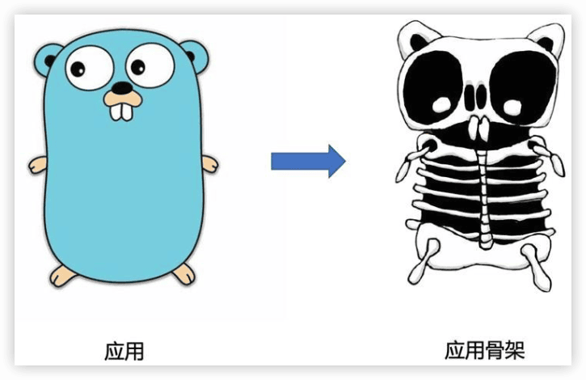
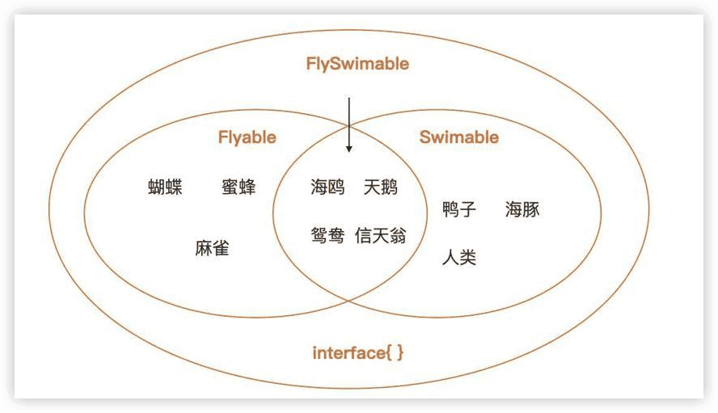
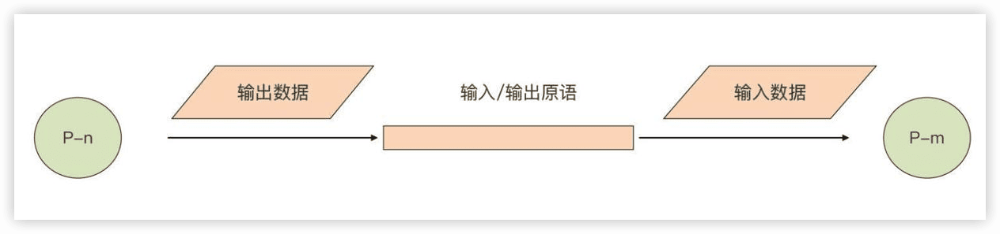

Go语言第一课
---

[Go 语言第一课](https://time.geekbang.org/column/intro/100093501)

官方网站：https://golang.google.cn/ or https://go.dev/

发布时间：2021-2022

## 0 这样入门Go，才能少走弯路

### 入坑Go的三大理由

#### 1 对初学者足够友善，能够快速上手

#### 2 生产力与性能的最佳结合

Go已经成为了云基础架构语言，它在**云原生基础设施、中间件与云服务**领域大放异彩。同时，GO在**DevOps/SRE、区块链、命令行交互程序（CLI）、Web服务，还有数据处理**等方面也有大量拥趸，我们甚至可以看到Go在**微控制器、机器人、游戏领域**也有广泛应用。

#### 3 快乐又有“钱景”

简单的语法、得心应手的工具链、丰富和健壮的标准库，还有生产力与性能的完美结合、免除内存管理的心智负担，对并发设计的原生支持

# 前置篇：心定之旅

## 1 前世今生：Go的历史和现状

了解一门编程语言的历史和现状，以及未来的走向，可以建立起**学习的“安全感”**，相信它能够给你带来足够的价值和收益，更加坚定地学习下去。

### 诞生

Go语言的创始人有三位：

- 图灵奖获得者、C语法联合发明人、Unix之父肯·汤普森（Ken Thompson）
- Plan 9操作系统领导者、UTF-8编码的最初设计者罗伯·派克（Rob Pike）
- Java的HotSpot虚拟机和Chrome浏览器的JavaScript V8引擎的设计者之一罗伯特·格瑞史莫（Robert Griesemer）。

开始：

- 2007年9月20日 讨论

不便：C++的巨大复杂性、编译构建速度慢以及在编写服务端程序时对并发支持的不足

思路：在C语言的基础上，修正一些明显的缺陷，删除一些被诟病较多的特性，增加一些缺失的功能，比如，使用import替代include、去掉宏、增加垃圾回收、支持接口等。

9月25日，罗伯·派克 命名为“go”。

“Golang”仅应用于命名Go语言官方网站。

### 从“三人行”到“众人拾柴”

- 2008年初，肯·汤普森实现了第一版Go编译器，用于验证之前的设计。这个编译器先将Go代码转换为C代码，再由C编译器编译成二进制文件。

- 2008年年中，Go的第一版设计就基本结束了。伊恩·泰勒（Ian Lance Taylor）为Go语言实现了一个gcc的前端，这也是Go语言的第二个编译器。

之后他成为了Go语言，以及其工具设计和实现的核心人物之一。

- 2008年，罗斯·考克斯（Russ Cox）利用函数类型是“一等公民”，而且它也可以拥有自己的方法这个特性巧妙设计出了http包的`HandlerFunc`类型。这样，我们通过显式转型就可以让一个普通函数成为满足http.Handler接口的类型了。

- 2009年10月30日，Go语言第一次公之于众。

- 2009年11月10日，谷歌官方宣布Go语言项目开源，之后这一天也被Go官方确定为Go语言的诞生日。

“吉祥物”，是一只由罗伯·派克夫人芮妮·弗伦奇（Renee French）设计的地鼠，从此地鼠（gopher）也就成为了世界各地Go程序员的象征，Go程序员也被昵称为Gopher。


- 2012年3月28日，Go 1.0版本正式发布


### Go是否值得我们学习？

现代**云计算基础设施软件**的大部分流行和可靠的作品，都是用Go编写的，比如：Docker、Kubernetes、Prometheus、Ethereum（以太坊）、Istio、CockroachDB、InfluxDB、Terraform、Etcd、Consul等等。

## 2 Go语言的设计哲学

编程语言的设计哲学，就是指决定这门**语言==演化进程==的高级原则和依据**。

Go语言的设计哲学总结为五点：简单、显式、组合、并发和面向工程。

### 简单

> “大多数编程语言创建伊始都致力于成为一门简单的语言，但最终都只是满足于做一个强大的编程语言”。

Go语言的设计者们在语言设计之初，就拒绝了走**语言特性融合**的道路，选择了“做减法”并致力于打造一门简单的编程语言。

其实，Go语言也没它看起来那么简单，自身实现起来并不容易，但这些**复杂性被Go语言的设计者们“隐藏”了**，所以Go语法层面上呈现了这样的状态：

- 仅有25个关键字，主流编程语言最少；

- 内置垃圾收集，降低开发人员内存管理的心智负担；

- 首字母大小写决定可见性，无需通过额外关键字修饰；

- 变量初始为类型零值，避免以随机值作为初值的问题；

- 内置数组边界检查，极大减少越界访问带来的安全隐患；

- 内置并发支持，简化并发程序设计；

- 内置接口类型，为组合的设计哲学奠定基础；

- 原生提供完善的工具链，开箱即用；

- … …

> 任何的设计都存在着**权衡与折中**。

> 简单意味着可以使用**更少的代码**实现相同的功能；简单意味着代码具有更好的**可读性**，而可读性好的代码通常意味着更好的**可维护性以及可靠性**。

### 显式

Go不允许不同类型的整型变量进行混合计算，它同样也不会对其进行隐式的自动转换。

Go希望开发人员明确知道自己在做什么，这与C语言的“信任程序员”原则完全不同。

除此之外，Go设计者所崇尚的显式哲学还直接决定了Go语言错误处理的形态：Go语言采用了显式的基于值比较的错误处理方案，**函数/方法中的错误都会通过return语句显式地返回**，并且通常调用者不能忽略对返回的错误的处理。

### 组合

Go语言不像C++、Java等主流面向对象语言，在Go中是找不到经典的面向对象语法元素、类型体系和继承机制的，Go推崇的是==组合==的设计哲学。

在Go语言设计层面，Go设计者为开发者们提供了**正交的语法元素**，以供后续组合使用，包括：

- Go语言**无类型层次体系**，各类型之间是相互独立的，**没有子类型**的概念；
- 每个类型都可以有自己的方法集合，类型定义与方法实现是**正交独立**的；
- 实现某个接口时，无需像Java那样采用特定关键字修饰；
- 包之间是相对独立的，**没有子包**的概念。

Go语言为支撑组合的设计提供了==类型嵌入（Type Embedding）==。通过类型嵌入，我们可以将已经实现的功能嵌入到新类型中，以快速满足新类型的功能需求，这种方式有些类似经典面向对象语言中的“继承”机制，但在原理上却与面向对象中的继承完全不同，这是一种Go设计者们精心设计的“语法糖”。

被嵌入的类型和新类型两者之间**没有任何关系**，甚至相互完全**不知道对方的存在**，更没有经典面向对象语言中的那种父类、子类的关系，以及==向上、向下转型（Type Casting）==。通过新类型实例调用方法时，方法的匹配主要取决于**方法名字**，而不是类型。这种组合方式，我称之为==垂直组合==，即通过类型嵌入，快速让一个新类型“复用”其他类型已经实现的能力，实现功能的==垂直扩展==。

```go
// $GOROOT/src/sync/pool.go
type poolLocal struct {
    private interface{}   
    shared  []interface{}
    Mutex               
    pad     [128]byte  
}
```

在poolLocal这个结构体类型中嵌入了类型Mutex，这就使得poolLocal这个类型具有了互斥同步的能力，可以通过poolLocal类型的变量，直接调用Mutex类型的方法Lock或Unlock。

```go
// $GOROOT/src/io/io.go
type ReadWriter interface {
    Reader
    Writer
}
```

通过嵌入接口类型的方式来实现接口行为的聚合，组成==大接口==，这种方式在标准库中尤为常用，并且已经成为了Go语言的一种惯用法。

垂直组合本质上是一种“==能力继承==”，采用嵌入方式定义的新类型继承了嵌入类型的能力。Go还有一种常见的组合方式，叫==水平组合==。和垂直组合的能力继承不同，水平组合是一种==能力委托（Delegate）==，通常使用接口类型来实现水平组合。

Go语言中的接口只是**方法集合**，并且它与实现者之间的关系无需通过显式关键字修饰，它让程序内部各部分之间的耦合降至最低，同时它也是连接程序各个部分之间“纽带”。

水平组合的模式1️⃣，通过接受接口类型参数的普通函数进行组合：

```go
// $GOROOT/src/io/ioutil/ioutil.go
func ReadAll(r io.Reader)([]byte, error)

// $GOROOT/src/io/io.go
func Copy(dst Writer, src Reader)(written int64, err error)
```

函数ReadAll通过io.Reader这个接口，将io.Reader的实现与ReadAll所在的包低耦合地水平组合在一起了，从而达到从任意实现io.Reader的数据源读取所有数据的目的。类似的水平组合“模式”还有**点缀器、中间件**等。

2️⃣将Go语言内置的并发能力进行灵活组合以实现，比如，通过goroutine+channel的组合，可以实现类似Unix Pipe的能力。

总之，组合原则的应用实质上是塑造了Go程序的骨架结构。类型嵌入为类型提供了垂直扩展能力，而接口是水平组合的关键。

### 并发

> “并发”出现的背景
> 
> CPU都是靠提高**主频**来改进性能的，但是现在这个做法已经遇到了瓶颈。主频提高导致CPU的功耗和发热量剧增，反过来制约了CPU性能的进一步提高。2007年开始，处理器厂商的竞争焦点从主频转向了**多核**。

Go放弃了传统的基于**操作系统线程**的并发模型，而采用了**用户层轻量级线程**，Go将之称为==goroutine==。

goroutine占用的资源非常小，Go运行时默认为每个goroutine分配的栈空间仅==2KB==。goroutine调度的切换也不用**陷入（trap）**操作系统内核层完成，代价很低。因此，一个Go程序中可以创建**成千上万**个并发的goroutine。而且，所有的Go代码都在goroutine中执行，哪怕是go运行时的代码也不例外。

Go还在语言层面内置了辅助并发设计的原语：`channel`和`select`。开发者可以通过语言内置的channel**传递消息或实现同步**，并通过select实现**多路channel的并发控制**。

并发与组合的哲学是一脉相承的，**并发是一个更大的组合的概念**，它在程序设计的全局层面对程序进行拆解组合，再映射到程序执行层面上：**goroutines各自执行特定的工作，通过channel+select将goroutines组合连接起来**。并发的存在鼓励程序员在程序设计时进行**独立计算的分解**，而对并发的原生支持让Go语言也更适应现代计算环境。

### 面向工程

Go语言设计的初衷，就是面向解决真实世界中Google内部大规模软件开发存在的各种问题，为这些问题提供答案，这些问题包括：**程序构建慢、依赖管理失控、代码难于理解、跨语言构建难**等。

Go在语法设计细节上做了精心的打磨。比如：

- 重新设计**编译单元和目标文件格式**，实现Go源码快速构建，让大工程的构建时间缩短到类似动态语言的交互式解释的编译速度；
- 如果源文件导入它不使用的包，则程序将无法编译。这可以充分保证任何Go程序的**依赖树是精确的**。这也可以保证在构建程序时不会编译额外的代码，从而最大限度地缩短编译时间；
- **去除包的循环依赖**，循环依赖会在大规模的代码中引发问题，因为它们要求编译器同时处理更大的源文件集，这会减慢增量构建；
- **包路径是唯一的，而包名不必唯一的**。导入路径必须唯一标识要导入的包，而名称只是包的使用者如何引用其内容的约定。“包名称不必是唯一的”这个约定，大大降低了开发人员给包起唯一名字的心智负担；
- 故意**不支持默认函数参数**。因为在规模工程中，很多开发者利用默认函数参数机制，向函数添加过多的参数以弥补函数API的设计缺陷，这会导致函数拥有太多的参数，降低清晰度和可读性；
- 增加**类型别名（type alias）**，支持大规模代码库的重构。

Go**标准库功能丰富**，多数功能不需要依赖外部的第三方包或库。

Go语言就提供了足以让所有其它主流语言开发人员羡慕的**工具链**，涵盖了**编译构建、代码格式化、包依赖管理、静态代码检查、测试、文档生成与查看、性能剖析、语言服务器、运行时程序跟踪**等方方面面。其中`gofmt`统一了Go语言的代码风格

Go在标准库中提供了官方的**词法分析器、语法解析器和类型检查器**相关包，开发者可以基于这些包快速构建并扩展Go工具链。

### 思考题

> 还能举出哪些符合Go语言设计哲学的例子吗？

# 入门篇：勤加练手

## 3 配好环境：选择一种最适合你的Go安装方法

### 选择Go版本

Go语言的版本发布策略:

- 每年发布两次大版本，一般是在二月份和八月份发布

- 对最新的两个Go稳定大版本提供支持

- 支持的范围主要包括**修复版本中存在的重大问题、文档变更以及安全问题更新**等。

### 安装Go

### 安装多个Go版本 🔖

### 配置Go

`go env`


`go help environment`

## 4 初窥门径：一个Go程序的结构是怎样的？

Go源文件总是用全小写字母形式的短小单词命名，并且以.go扩展名结尾。多个单词就直接连接起来，不要用下划线连接（下划线在在Go源文件命名中有特殊作用）。

```go
package main

import "fmt"

func main() {
    fmt.Println("hello, world")
} 
```

整个Go程序中仅允许存在一个名为main的包。

`Gofmt`是Go语言在解决规模化（scale）问题上的一个最佳实践。

import “fmt” 一行中“`fmt`”代表的是包的导入路径（Import），它表示的是标准库下的fmt目录，整个import声明语句的含义是导入标准库fmt目录下的包；`fmt.Println`函数调用一行中的“`fmt`”代表的则是包名。两者是不一样的。

在Go语言中，只有首字母为大写的标识符才是导出的（Exported），才能对包外的代码可见。

### Go语言中程序是怎么编译的？

```shell
go build main.go
```

`go run`这类命令更多用于开发调试阶段，真正的交付成果还是需要使用go build命令构建的

### 复杂项目下Go程序的编译是怎样的

==Go module==构建模式是在Go 1.11版本正式引入的，为的是**彻底解决Go项目复杂版本依赖的问题**，在Go 1.16版本中，Go module已经成为了Go默认的**包依赖管理机制和Go源码构建机制**。

`go mod init github.com/andyron/hellomodule`创建`go.mod`文件：

```
module github.com/andyron/hellomodule

go 1.22.1
```

一个module就是一个包的集合，这些包和module一起打版本、发布和分发。go.mod所在的目录被称为它声明的module的根目录。

第一行内容是用于声明==module路径（module path）==的。而且，module隐含了一个==命名空间==的概念，module下每个包的导入路径都是由**==module path==和==包所在子目录的名字==**结合在一起构成。比如，如果hellomodule下有子目录pkg/pkg1，那么pkg1下面的包的导入路径就是由module path（`github.com/andyron/hellomodule`）和包所在子目录的名字（pkg/pkg1）结合而成，也就是`github.com/andyron/hellomodule/pkg/pkg1`。

`go 1.22.1`是一个Go版本指示符，用于表示这个module是在某个特定的Go版本的module语义的基础上编写的。

> `go mod tidy`，用于清理和管理项目的依赖关系，可以确保你的 `go.mod` 和 `go.sum` 文件是最新的，它会执行下面的操作：
> 
> - **添加缺失的依赖**
> - **移除未使用的依赖**
> - **更新依赖的版本**

`go.sum`文件记录了hellomodule的**直接依赖和间接依赖包的相关版本的hash值，用来校验本地包的真实性**。在构建的时候，如果本地依赖包的hash值与go.sum文件中记录的不一致，就会被拒绝构建。

## 5 标准先行：Go项目的布局标准是什么？

### Go语言“创世项目”结构是怎样的？

“Go语言的创世项目”就是Go语言项目自身。

### 现在的Go项目的典型结构布局是怎样的？

#### 1️⃣可执行程序项目

典型五个部分：

- 放在项目顶层的Go Module相关文件，包括go.mod和go.sum；
- cmd目录：存放项目要编译构建的可执行文件所对应的main包的源码文件；
- 项目包目录：每个项目下的非main包都“平铺”在项目的根目录下，每个目录对应一个Go包；
- internal目录：存放仅项目内部引用的Go包，这些包无法被项目之外引用；
- vendor目录：这是一个可选目录，为了兼容Go 1.5引入的vendor构建模式而存在的。这个目录下的内容均由Go命令自动维护，不需要开发者手工干预。

#### 2️⃣库项目

去掉cmd目录和vendor目录。

## 6 构建模式：Go是怎么解决包依赖管理问题的？

### Go构建模式是怎么演化的？

Go程序由Go包组合而成的，Go程序的==构建过程==就是**确定包版本、编译包以及将编译后得到的目标文件链接在一起**的过程。

Go语言的构建模式历经了三个迭代和演化过程：

### 1️⃣最初期的GOPATH

### 2️⃣1.5版本的Vendor机制

vendor机制本质上就是在Go项目的某个特定目录下，将项目的所有依赖包缓存起来，这个特定目录名就是vendor。

### 3️⃣现在的Go Module

一个Go Module是一个Go包的集合。module是有版本的，所以module下的包也就有了版本属性。这个module与这些包会组成一个独立的版本单元，它们一起打版本、发布和分发。

在Go Module模式下，通常一个代码仓库对应一个Go Module。一个Go Module的顶层目录下会放置一个go.mod文件，每个go.mod文件会定义唯一一个module，也就是说Go Module与go.mod是一一对应的。

go.mod文件所在的顶层目录也被称为**module的根目录**，module根目录以及它子目录下的所有Go包均归属于这个Go Module，这个module也被称为**main module**。

### 创建一个Go Module

步骤：

1. 第一步，通过go mod init创建go.mod文件，将当前项目变为一个Go Module；
2. 第二步，通过go mod tidy命令自动更新当前module的依赖信息；
3. 第三步，执行go build，执行新module的构建。

由`go mod tidy`下载的依赖module会被放置在本地的module缓存路径下，默认值为`$GOPATH[0]/pkg/mod`，Go 1.15及以后版本可以通过`GOMODCACHE`环境变量，自定义本地module的缓存路径。

> 推荐把go.mod和go.sum两个文件与源码，一并提交到代码版本控制服务器上。

go build命令会读取go.mod中的依赖及版本信息，并在本地module缓存路径下找到对应版本的依赖module，执行编译和链接。

项目所依赖的包有很多版本，Go Module是如何选出最适合的那个版本的呢？

### 深入Go Module构建模式

#### 语义导入版本(Semantic Import Versioning)

版本号，都符合`vX.Y.Z`的格式，由==前缀v==和一个==满足语义版本规范的版本号==组成。语义版本号分成3部分：主版本号(major)、次版本号(minor)和补丁版本号(patch)。


借助于语义版本规范，Go命令可以确定同一module的两个版本发布的先后次序，而且可以确定它们是否兼容。

按照语义版本规范，**主版本号不同的两个版本是相互不兼容的**。而且，在主版本号相同的情况下，**次版本号大都是向后兼容次版本号小的版本。补丁版本号也不影响兼容性**。

而且，Go Module规定：**如果同一个包的新旧版本是兼容的，那么它们的包导入路径应该是相同的**。以logrus为例，选出两个版本v1.7.0和v1.8.1.。按照上面的语义版本规则，这两个版本的主版本号相同，新版本v1.8.1是兼容老版本v1.7.0的。那么，我们就可以知道，如果一个项目依赖logrus，无论它使用的是v1.7.0版本还是v1.8.1版本，它都可以使用下面的包导入语句导入logrus包：

```go
import "github.com/sirupsen/logrus"
```

> 新问题：
> 
> 假如在未来的某一天，logrus的作者发布了logrus v2.0.0版本。那么根据语义版本规则，该版本的主版本号为2，已经与v1.7.0、v1.8.1的主版本号不同了，那么v2.0.0与v1.7.0、v1.8.1就是不兼容的包版本。然后我们再按照Go Module的规定，如果一个项目依赖logrus v2.0.0版本，那么它的包导入路径就不能再与上面的导入方式相同了。那我们应该使用什么方式导入logrus v2.0.0版本呢？

Go Module创新性地给出了一个方法：**将包主版本号引入到包导入路径中**：

```go
import "github.com/sirupsen/logrus/v2"
```

甚至可以同时依赖一个包的两个不兼容版本：

```go
import (
  "github.com/sirupsen/logrus"
  logv2 "github.com/sirupsen/logrus/v2"
)
```

> v0.y.z版本应该使用哪种导入路径呢？
> 
> v0.y.z这样的版本号是用于项目初始开发阶段的版本号。在这个阶段任何事情都有可能发生，其API也不应该被认为是稳定的。Go Module将这样的版本(v0)与主版本号v1做同等对待，也就是采用不带主版本号的包导入路径，这样一定程度降低了Go开发人员使用这样版本号包时的心智负担。

#### 最小版本选择(Minimal Version Selection)


> myproject有两个直接依赖A和B，A和B有一个共同的依赖包C，但A依赖C的v1.1.0版本，而B依赖的是C的v1.3.0版本，并且此时C包的最新发布版为C v1.7.0。这个时候，Go命令是如何为myproject选出间接依赖包C的版本呢？选出的究竟是v1.7.0、v1.1.0还是v1.3.0呢？

当前存在的主流编程语言，以及Go Module出现之前的很多Go包依赖管理工具都会选择依赖项的“**最新最大(Latest Greatest)版本**”，也就是v1.7.0。

Go设计者另辟蹊径，在诸多兼容性版本间，他们不光要考虑最新最大的稳定与安全，还要尊重各个module的述求：A明明说只要求C v1.1.0，B明明说只要求C v1.3.0。所以Go会在该项目依赖项的所有版本中，选出符合项目整体要求的“最小版本”。

这个例子中，C v1.3.0是符合项目整体要求的版本集合中的版本最小的那个，于是Go命令选择了C v1.3.0，而不是最新最大的C v1.7.0。Go团队认为**“最小版本选择”为Go程序实现持久的和可重现的构建提供了最佳的方案**。

### Go各版本构建模式机制和切换


## 7 构建模式：GoModule的6类常规操作

### 为当前module添加一个依赖

```go
package main

import "github.com/sirupsen/logrus"
import "github.com/google/uuid"

func main() {
    logrus.Println("hello, go module mode.")
    logrus.Println(uuid.NewString())
}
```

可以`go get github.com/google/uuid`，也可以使用`go mod tidy`命令，在执行构建前自动分析源码中的依赖变化，识别新增依赖项并下载它们。

### 升级/降级依赖的版本

```sh
$ go list -m -versions github.com/sirupsen/logrus
github.com/sirupsen/logrus v0.1.0 v0.1.1 v0.2.0 v0.3.0 v0.4.0 v0.4.1 v0.5.0 v0.5.1 v0.6.0 v0.6.1 v0.6.2 v0.6.3 v0.6.4 v0.6.5 v0.6.6 v0.7.0 v0.7.1 v0.7.2 v0.7.3 v0.8.0 v0.8.1 v0.8.2 v0.8.3 v0.8.4 v0.8.5 v0.8.6 v0.8.7 v0.9.0 v0.10.0 v0.11.0 v0.11.1 v0.11.2 v0.11.3 v0.11.4 v0.11.5 v1.0.0 v1.0.1 v1.0.3 v1.0.4 v1.0.5 v1.0.6 v1.1.0 v1.1.1 v1.2.0 v1.3.0 v1.4.0 v1.4.1 v1.4.2 v1.5.0 v1.6.0 v1.7.0 v1.7.1 v1.8.0 v1.8.1 v1.8.2 v1.8.3 v1.9.0 v1.9.1 v1.9.2 v1.9.3
```

降级：

```sh
$ go get github.com/google/uuid@v1.7.0
```

或

```sh
$ go mod edit -require=github.com/sirupsen/logrus@v1.7.0
$ go mod tidy       
go: downloading github.com/sirupsen/logrus v1.7.0
```

升级：

```sh
$ go get github.com/google/uuid@v1.7.1
```

在Go Module构建模式下，当依赖的主版本号为0或1的时候，我们在Go源码中导入依赖包，不需要在包的导入路径上增加版本号，也就是：

```go
import github.com/user/repo/v0 等价于 import github.com/user/repo
import github.com/user/repo/v1 等价于 import github.com/user/repo
```

### 添加一个主版本号大于1的依赖

语义导入版本机制有一个原则：**如果新旧版本的包使用相同的导入路径，那么新包与旧包是兼容的**。也就是说，如果新旧两个包不兼容，那么我们就应该采用不同的导入路径。

```go
import github.com/user/repo/v2/xxx
```

主版本号大于1的依赖，**在声明它的导入路径的基础上，加上版本号信息**。

### 升级依赖版本到一个不兼容版本

### 移除一个依赖

列出当前module的所有依赖：

```sh
$ go list -m all
```

删除代码中对包依赖，然后`go build`是不会从当前module中移除相关依赖的，需要使用`go mod tidy`命令。

go mod tidy会自动分析源码依赖，而且将不再使用的依赖从go.mod和go.sum中移除。

### 特殊情况：使用vendor

vendor机制虽然诞生于GOPATH构建模式主导的年代，但在Go Module构建模式下，它依旧被保留了下来，并且成为了Go Module构建机制的一个很好的**补充**。特别是在一些不方便访问外部网络，并且对Go应用构建性能敏感的环境，比如在一些内部的持续集成或持续交付环境（CI/CD）中，使用vendor机制可以实现与Go Module等价的构建。

和GOPATH构建模式不同，Go Module构建模式下，我们再也无需手动维护vendor目录下的依赖包了，Go提供了可以快速建立和更新vendor的命令:

```sh
$ go mod vendor
$ tree -LF 2 vendor
vendor
├── github.com/
│   ├── google/
│   ├── magefile/
│   └── sirupsen/
├── golang.org/
│   └── x/
└── modules.txt
```

`go mod vendor`命令在vendor目录下，创建了一份这个项目的依赖包的副本，并且通过`vendor/modules.txt`记录了vendor下的module以及版本。

如果我们要基于vendor构建，而不是基于本地缓存的Go Module构建，我们需要在go build后面加上`-mod=vendor`参数。

在Go 1.14及以后版本中，如果Go项目的顶层目录下存在vendor目录，那么go build**默认也会优先基于vendor构建**，除非你给go build传入`-mod=mod`的参数。

### 思考题

> 如果你是一个公共Go包的作者，在发布你的Go包时，有哪些需要注意的地方？

## 8 入口函数与包初始化：搞清Go程序的执行次序

### main.main函数：Go应用的入口函数

Go语言要求：**可执行程序的main包必须定义main函数，否则Go编译器会报错**。在启动了多个Goroutine的Go应用中，main.main函数将在Go应用的主Goroutine中执行。

不过很有意思的是，在多Goroutine的Go应用中，相较于main.main作为Go应用的==入口==，**main.main函数==返回==的意义其实更大**，因为main函数返回就意味着**整个Go程序的终结**，而且你也不用管这个时候是否还有其他子Goroutine正在执行。

除了main包外，其他包也可以拥有自己的名为main的函数或方法。但按照Go的**可见性规则**（小写字母开头的标识符为非导出标识符），非main包中自定义的main函数仅限于包内使用。

> 对于main包的main函数来说，虽然是用户层逻辑的入口函数，但它却**不一定是用户层第一个被执行的函数**。

### init函数：Go包的初始化函数

如果main包依赖的包中定义了init函数，或者是main包自身定义了init函数，那么Go程序在这个包初始化的时候，就会自动调用它的init函数，因此这些init函数的执行就都会发生在main函数之前。

每个组成Go包的Go源文件中，可以定义多个init函数。

在初始化Go包时，Go会按照一定的次序，**逐一、顺序地**调用这个包的init函数。一般来说，先传递给Go编译器的源文件中的init函数，会先被执行；而同一个源文件中的多个init函数，会按**声明顺序**依次执行。

### Go包的初始化次序

从程序逻辑结构角度来看，Go包是程序逻辑封装的基本单元，每个包都可以理解为是一个“自治”的、封装良好的、对外部暴露**有限接口**的**基本单元**。**一个Go程序就是由一组包组成的，程序的初始化就是这些包的初始化**。每个Go包还会有自己的依赖包、常量、变量、init函数（其中main包有main函数）等。

> 注意📢：我们在阅读和理解代码的时候，需要知道这些元素在在程序初始化过程中的初始化顺序，这样便于我们确定在某一行代码处这些元素的当前状态。

Go包的初始化次序：


1. 首先，main包依赖pkg1和pkg4两个包，所以第一步，Go会根据包导入的顺序，先去初始化main包的第一个依赖包pkg1。
2. 第二步，Go在进行包初始化的过程中，会采用“==深度优先==”的原则，递归初始化各个包的依赖包。在上图里，pkg1包依赖pkg2包，pkg2包依赖pkg3包，pkg3没有依赖包，于是Go在pkg3包中按照“==常量 -> 变量 -> init函数==”的顺序先对pkg3包进行初始化；
3. 紧接着，在pkg3包初始化完毕后，Go会回到pkg2包并对pkg2包进行初始化，接下来再回到pkg1包并对pkg1包进行初始化。在调用完pkg1包的init函数后，Go就完成了main包的第一个依赖包pkg1的初始化。
4. 接下来，Go会初始化main包的第二个依赖包pkg4，pkg4包的初始化过程与pkg1包类似，也是先初始化它的依赖包pkg5，然后再初始化自身；然后，当Go初始化完pkg4包后也就完成了对main包所有依赖包的初始化，接下来初始化main包自身。
5. 最后，在main包中，Go同样会按照“常量 -> 变量 -> init函数”的顺序进行初始化，执行完这些初始化工作后才正式进入程序的入口函数main函数。

🔖  包引入错误？变量和常量的执行顺序为什么反了？  [Go 1.22引入的包级变量初始化次序问题 | Tony Bai](https://tonybai.com/2024/03/29/the-issue-in-pkg-level-var-init-order-in-go-1-22/)

Go包的初始化次序，三点：

- 依赖包按“深度优先”的次序进行初始化；
- 每个包内按以“常量 -> 变量 -> init函数”的顺序进行初始化；
- 包内的多个init函数按出现次序进行自动调用。

### init函数的用途

Go包初始化时，init函数的初始化次序在变量之后，这给了开发人员在init函数中**对包级变量进行进一步检查与操作**的机会。

#### 用途1：重置包级变量值

负责对包内部以及暴露到外部的包级数据（主要是包级变量）的**初始状态进行检查**。

例如，标准库flag包：🔖

flag包定义了一个导出的包级变量`CommandLine`，如果用户没有通过flag.NewFlagSet创建新的代表命令行标志集合的实例，那么CommandLine就会作为flag包各种导出函数背后，默认的代表命令行标志集合的实例。

```go
var CommandLine = NewFlagSet(os.Args[0], ExitOnError)

func NewFlagSet(name string, errorHandling ErrorHandling) *FlagSet {
    f := &FlagSet{
        name:          name,
        errorHandling: errorHandling,
    }
    f.Usage = f.defaultUsage
    return f
}

func (f *FlagSet) defaultUsage() {
    if f.name == "" {
        fmt.Fprintf(f.Output(), "Usage:\n")
    } else {
        fmt.Fprintf(f.Output(), "Usage of %s:\n", f.name)
    }
    f.PrintDefaults()
}
```

在通过NewFlagSet创建CommandLine变量绑定的FlagSet类型实例时，CommandLine的Usage字段被赋值为defaultUsage。也就是说，如果保持现状，那么使用flag包默认CommandLine的用户就无法自定义usage的输出了。于是，flag包在init函数中重置了CommandLine的Usage字段：

```go
func init() {
    CommandLine.Usage = commandLineUsage // 重置CommandLine的Usage字段
}

func commandLineUsage() {
    Usage()
}

var Usage = func() {
    fmt.Fprintf(CommandLine.Output(), "Usage of %s:\n", os.Args[0])
    PrintDefaults()
}
```

这个时候我们会发现，CommandLine的Usage字段，设置为了一个flag包内的未导出函数commandLineUsage，后者则直接使用了flag包的另外一个导出包变量Usage。这样，就可以通过init函数，将CommandLine与包变量Usage关联在一起了。

然后，当用户将自定义的usage赋值给了flag.Usage后，就相当于改变了默认代表命令行标志集合的CommandLine变量的Usage。这样当flag包完成初始化后，CommandLine变量便处于一个合理可用的状态了。

#### 用途2：实现对包级变量的复杂初始化

有些包级变量需要一个比较复杂的初始化过程，有些时候，使用它的**类型零值**（每个Go类型都具有一个零值定义）或通过简单初始化表达式不能满足业务逻辑要求，而init函数则非常适合完成此项工作，标准库http包中就有这样一个典型示例：

```go
// net/http/h2_bundle.go
var (
    http2VerboseLogs    bool // 初始化时默认值为false
    http2logFrameWrites bool // 初始化时默认值为false
    http2logFrameReads  bool // 初始化时默认值为false
    http2inTests        bool // 初始化时默认值为false
)

func init() {
    e := os.Getenv("GODEBUG")
    if strings.Contains(e, "http2debug=1") {
        http2VerboseLogs = true // 在init中对http2VerboseLogs的值进行重置
    }
    if strings.Contains(e, "http2debug=2") {
        http2VerboseLogs = true // 在init中对http2VerboseLogs的值进行重置
        http2logFrameWrites = true // 在init中对http2logFrameWrites的值进行重置
        http2logFrameReads = true // 在init中对http2logFrameReads的值进行重置
    }
}
```

http包定义了一系列布尔类型的特性开关变量，可以通过GODEBUG环境变量的值，开启相关特性开关。

#### 用途3：在init函数中实现“注册模式” 🔖

lib/pq包访问PostgreSQL数据库的代码示例：

```go
import (
    "database/sql"
    _ "github.com/lib/pq"
)

func main() {
    db, err := sql.Open("postgres", "user=pqgotest dbname=pqgotest sslmode=verify-full")
    if err != nil {
        log.Fatal(err)
    }

    age := 21
    rows, err := db.Query("SELECT name FROM users WHERE age = $1", age)
    ...
}
```

以空导入的方式导入[lib/pq](https://github.com/lib/pq)包的，main函数中没有使用pq包的任何变量、函数或方法，这样就实现了对PostgreSQL数据库的访问。而这一切的奥秘，全在pq包的init函数中：

```go
func init() {
    sql.Register("postgres", &Driver{})
}
```

利用了用空导入的方式导入lib/pq包时产生的一个“副作用”，也就是lib/pq包作为main包的依赖包，它的init函数会在pq包初始化的时候得以执行。

init函数中，pq包将自己实现的sql驱动注册到了sql包中。这样只要应用层代码在Open数据库的时候，传入驱动的名字（这里是“postgres”)，那么通过sql.Open函数，返回的数据库实例句柄对数据库进行的操作，实际上调用的都是pq包中相应的驱动实现。

实际上，这种**通过在init函数中注册自己的实现的模式，就有效降低了Go包对外的直接暴露，尤其是包级变量的暴露**，从而避免了外部通过包级变量对包状态的改动。

另外，从标准库database/sql包的角度来看，这种“注册模式”实质是一种**工厂设计模式**的实现，sql.Open函数就是这个模式中的工厂方法，它根据外部传入的驱动名称“生产”出不同类别的数据库实例句柄。🔖

这种“注册模式”在标准库的其他包中也有广泛应用，比如说，使用标准库image包获取各种格式图片的宽和高：

```go
package main

import (
    "fmt"
    "image"
    _ "image/gif"  // 以空导入方式注入gif图片格式驱动
    _ "image/jpeg" // 以空导入方式注入jpeg图片格式驱动
    _ "image/png"  // 以空导入方式注入png图片格式驱动
    "os"
)

func main() {
    width, height, err := imageSize(os.Args[1])
    if err != nil {
        fmt.Println("获取图片大小错误：", err)
        return
    }
    fmt.Printf("图片大小：[%d, %d]\n", width, height)
}

func imageSize(imageFile string) (int, int, error) {
    f, _ := os.Open(imageFile) // 打开图文文件
    defer f.Close()

    img, _, err := image.Decode(f) // 对文件进行解码，得到图片实例
    if err != nil {
        return 0, 0, err
    }

    b := img.Bounds() // 返回图片区域
    return b.Max.X, b.Max.Y, nil
}
```

上面这个示例程序支持png、jpeg、gif三种格式的图片，而达成这一目标的原因，正是image/png、image/jpeg和image/gif包都在各自的init函数中，将自己“注册”到image的支持格式列表中了：

```go
// $GOROOT/src/image/png/reader.go
func init() {
    image.RegisterFormat("png", pngHeader, Decode, DecodeConfig)
}

// $GOROOT/src/image/jpeg/reader.go
func init() {
    image.RegisterFormat("jpeg", "\xff\xd8", Decode, DecodeConfig)
}

// $GOROOT/src/image/gif/reader.go
func init() {
    image.RegisterFormat("gif", "GIF8?a", Decode, DecodeConfig)
}  
```

```sh
$ go run main.go go.png
图片大小：[276, 348]
```

### 思考题

> 当init函数在检查包数据初始状态时遇到失败或错误的情况，我们该如何处理呢？

## 9 即学即练：构建一个Web服务就是这么简单

### 最简单的HTTP服务

[Go Developer Survey 2024 H1 Results](https://go.dev/blog/survey2024-h1-results) Go应用最广泛的领域调查结果图


两个web服务相关，API/RPC服务和Web服务（返回html页面）。

```go
package main

import "net/http"

func main() {
    http.HandleFunc("/", func(w http.ResponseWriter, r *http.Request) {
        w.Write([]byte("hello, world!"))
    })
    http.ListenAndServe(":8080", nil)
}
```

`ListenAndServe`

`HandleFunc`

第二个参数r代表来自客户端的HTTP请求，第一个参数w则是用来操作返回给客户端的应答的，基于http包实现的HTTP服务的处理函数都要符合这一原型。

将请求中的URI路径与设置的模式字符串进行==最长前缀匹配==，并执行匹配到的模式字符串所对应的处理函数。

### 图书管理API服务 ❤️


#### 项目建立与布局设计

bookstore

服务大体拆分为两大部分：

- 一部分是HTTP服务器，用来对外提供API服务；
- 另一部分是图书数据的存储模块，所有的图书数据均存储在这里。

Go项目布局标准：

```
├── cmd/
│   └── bookstore/         // 放置bookstore main包源码
│       └── main.go
├── go.mod                 // module bookstore的go.mod
├── go.sum
├── internal/              // 存放项目内部包的目录
│   └── store/
│       └── memstore.go     
├── server/                // HTTP服务器模块
│   ├── middleware/
│   │   └── middleware.go
│   └── server.go          
└── store/                 // 图书数据存储模块
    ├── factory/
    │   └── factory.go
    └── store.go
```

#### 项目main包


```go
// cmd/bookstore/main.go
package main

import (
    _ "bookstore/internal/store"
    "bookstore/server"
    "bookstore/store/factory"
    "context"
    "log"
    "os"
    "os/signal"
    "syscall"
    "time"
)

func main() {
    s, err := factory.New("mem") // 1️⃣创建图书数据存储模块实例
    if err != nil {
        panic(err)
    }

    srv := server.NewBookStoreServer(":8080", s) // 2️⃣创建http服务实例

    errChan, err := srv.ListenAndServe() // 运行http服务
    if err != nil {
        log.Println("web server start failed: ", err)
        return
    }
    log.Println("web server start ok")

    // 3️⃣通过监视系统信号实现了http服务实例的优雅退出
    c := make(chan os.Signal, 1)
    signal.Notify(c, syscall.SIGINT, syscall.SIGTERM) // 捕获系统信号SIGINT、SIGTERM

    select { // 监视来自errChan以及c的事件
    case err = <-errChan:
        log.Println("web server run failed:", err)
        return
    case <-c:
        log.Println("bookstore program is exiting...")
        ctx, cf := context.WithTimeout(context.Background(), time.Second)
        defer cf()
        err = srv.Shutdown(ctx) // 优雅关闭http服务实例
    }

    if err != nil {
        log.Println("bookstore program exit error: ", err)
        return
    }
    log.Println("bookstore program exit ok")
}
```

> 在Go中，main包是整个程序的入口，还是整个程序中==主要模块初始化与组装的场所==。

优雅退出，指的就是**程序有机会等待其他的事情处理完再退出**。比如**尚未完成的事务处理、清理资源（比如关闭文件描述符、关闭socket）、保存必要中间状态、内存数据持久化落盘**等等。

http服务实例内部的退出清理工作，包括：**立即关闭所有listener、关闭所有空闲的连接、等待处于活动状态的连接处理完毕**等等。

#### 图书数据存储模块（store)

用来**存储整个bookstore的图书数据**的。

图书数据存储有很多种实现方式，最简单的方式莫过于在内存中创建一个map，以图书id作为key，来保存图书信息。生产环境，需要通过Nosql数据库或关系型数据库。

考虑到对多种存储实现方式的支持，将针对图书的有限种存储操作，放置在一个接口类型Store中：

```go
// store/store.go
 type Book struct {
     Id      string   `json:"id"`      // 图书ISBN ID
     Name    string   `json:"name"`    // 图书名称
     Authors []string `json:"authors"` // 图书作者
     Press   string   `json:"press"`   // 出版社
 }

 type Store interface {
     Create(*Book) error        // 创建一个新图书条目
     Update(*Book) error        // 更新某图书条目
     Get(string) (Book, error)  // 获取某图书信息
     GetAll() ([]Book, error)   // 获取所有图书信息
     Delete(string) error       // 删除某图书条目
 }
```

一个对应图书条目的抽象数据类型Book，以及针对Book存取的接口类型Store。这样，对于想要进行图书数据操作的一方来说，他只需要得到一个满足Store接口的实例，就可以实现对图书数据的存储操作了，不用再关心图书数据究竟采用了何种存储方式。这就实现了**图书存储操作与底层图书数据存储方式的解耦**。而且，这种==面向接口编程==也是Go组合设计哲学的一个重要体现。

> 如何创建一个满足Store接口的实例呢？

参考《设计模式》提供的多种创建型模式，选择一种Go风格的工厂模式（创建型模式的一种）来实现满足Store接口实例的创建。`store/factory`包:

```go
// store/factory/factory.go
package factory

import (
    "bookstore/store"
    "fmt"
    "sync"
)

var (
    providersMu sync.RWMutex
    providers   = make(map[string]store.Store) // 使用map类型对工厂可以“生产”的、满足Store接口的实例类型进行管理
)

// Register 让各个实现Store接口的类型可以把自己“注册”到工厂中来
func Register(name string, p store.Store) {
    providersMu.Lock()
    defer providersMu.Unlock()
    if p == nil {
        panic("store: Register provider is nil")
    }

    if _, dup := providers[name]; dup {
        panic("store: Register called twice for provider " + name)
    }
    providers[name] = p
}

// New 传入期望使用的图书存储实现的名称，得到对应的类型实例
func New(providerName string) (store.Store, error) {
    providersMu.RLock()
    p, ok := providers[providerName]
    providersMu.RUnlock()
    if !ok {
        return nil, fmt.Errorf("store: unknown provider %s", providerName)
    }
    return p, nil
}
```

一个基于内存map的Store接口的实现:

```go
// internal/store/memstore.go
package store

import (
    mystore "bookstore/store"
    factory "bookstore/store/factory"
    "sync"
)

func init() {
    factory.Register("mem", &MemStore{
        books: make(map[string]*mystore.Book),
    })
}

// MemStore 是一个基于内存map的Store接口的实现
type MemStore struct {
    sync.RWMutex
    books map[string]*mystore.Book
}

// ...具体实现方法
```

init函数中调用factory包提供的Register函数，把自己的实例以“mem”的名称注册到factory中的。这样做有一个好处，依赖Store接口进行图书数据管理的一方，只要导入internal/store这个包，就可以自动完成注册动作了。

```go
import (
  ... ...
  _ "bookstore/internal/store" // internal/store将自身注册到factory中
)

func main() {
    s, err := factory.New("mem") // 创建名为"mem"的图书数据存储模块实例
    if err != nil {
        panic(err)
    }
    ... ...
}   
```

#### HTTP服务模块（server）

HTTP服务模块的职责是**对外提供HTTP API服务，处理来自客户端的各种请求，并通过Store接口实例执行针对图书数据的相关操作**。

#### 编译、运行与验证

```sh
$ curl -X POST -H "Content-Type:application/json" -d '{"id": "978-7-111-55842-2", "name": "The Go Programming Language", "authors":["Alan A.A.Donovan", "Brian W. Kergnighan"],"press": "Pearson Education"}' localhost:8080/book


$ curl -X GET -H "Content-Type:application/json" localhost:8080/book/978-7-111-55842-2
{"id":"978-7-111-55842-2","name":"The Go Programming Language","authors":["Alan A.A.Donovan","Brian W. Kergnighan"],"press":"Pearson Education"}
```

### 思考题 🔖

> 基于nosql数据库，怎么实现一个新store.Store接口的实现？

# 基础篇：“脑勤”多理解

## 10 变量声明：静态语言有别于动态语言的重要特征

在编程语言中，为了方便操作内存特定位置的数据，我们**用一个特定的名字与位于特定位置的内存块绑定在一起**，这个名字被称为==变量==。

变量所绑定的内存区域是要有一个明确的边界的。

> 编程语言的编译器或解释器是如何知道一个变量所能引用的内存区域边界呢？

动态语言的解释器可以在运行时通过对变量赋值的分析，自动确定变量的边界。

静态语言通过==变量声明==，语言使用者可以显式告知编译器一个变量的边界信息。

### Go语言的变量声明方法


变量声明分为四个部分：

- var是修饰变量声明的关键字；
- a为变量名；
- int为该变量的类型；
- 10是变量的初值。

如果没有显式为变量赋予初值，Go编译器会为变量赋予这个类型的**零值**。


==变量声明块（block）==：

```go
var (
  a int = 128
  b int8 = 6
  s string = "hello"
  c rune = 'A'
  t bool = true
)
```

```go
var a, b, c int = 5, 6, 7


var (
  a, b, c int = 5, 6, 7
  c, d, e rune = 'C', 'D', 'E'
) 
```

两种变量声明的“语法糖”:

1️⃣省略类型信息的声明

```go
var b = 13
```

Go编译器会根据右侧变量初值自动推导出变量的类型，并给这个变量赋予初值所对应的默认类型。

```go
var a, b, c = 12, 'A', "hello"
```

2️⃣短变量声明

```go
a := 12
b := 'A'
c := "hello"
```

Go语言的变量可以分为两类：

1. 一类称为==包级变量(package varible)==，也就是在包级别可见的变量。如果是导出变量（大写字母开头），那么这个包级变量也可以被视为==全局变量==；
2. 另一类则是==局部变量(local varible)==，也就是Go函数或方法体内声明的变量，仅在函数或方法体内可见。

### 包级变量的声明形式

包级变量只能使用带有var关键字的变量声明形式，不能使用短变量声明形式，但在形式细节上可以有一定灵活度。

### 局部变量的声明形式

1. 第一类：对于延迟初始化的局部变量声明，我们采用通用的变量声明形式

```go
var err error
```

2. 第二类：对于声明且显式初始化的局部变量，建议使用短变量声明形式

小结：


### 思考题

> Go语言变量声明中，类型是放在变量名的后面的，有什么好处？

## 11 代码块与作用域：如何保证变量不会被遮蔽？

==变量遮蔽（Variable Shadowing）==

### 11.3 代码块与作用域

Go语言中的==代码块(Block)==是包裹在一对大括号内部的声明和语句序列。

如果一对大括号内部没有任何声明或其他语句，叫做==空代码块==。Go代码块支持嵌套。

```go
func foo() { //代码块1
    { // 代码块2
        { // 代码块3
            { // 代码块4

            }
        }
    }
}
```

1-4都是==显式代码块（Explicit Blocks）==

==隐式代码块（Implicit Block）==是没有显式代码块那样的肉眼可见的配对大括号包裹，无法通过大括号来识别隐式代码块。


隐式代码块从大到小：

- ==宇宙代码块（Universe Block）==，所有Go源码都在这个隐式代码块中

- ==包代码块（Package Block）==，每个Go包都对应一个隐式包代码块

- ==文件代码块（File Block）==，

- 控制语句层面（if、for与switch）。注意，这里的控制语句隐式代码块与控制语句使用大括号包裹的显式代码块并不是一个代码块。

- case/default子句

==作用域(Scope)==的概念是**针对标识符的，不局限于变量**。每个标识符都有自己的作用域，而**一个标识符的作用域就是指这个标识符在被声明后可以被有效使用的源码区域**。

作用域是一个编译期的概念，也就是说，编译器在编译过程中会对每个标识符的作用域进行检查，对于在标识符作用域外使用该标识符的行为会给出编译错误的报错。

**声明于外层代码块中的标识符，其作用域包括所有内层代码块**。

- 首先看看位于最外层的宇宙隐式代码块的标识符。

我们并不能声明这一块的标识符，因为这一区域是Go语言==预定义标识符==：


由于这些预定义标识符位于包代码块的外层，所以它们的作用域是范围最大的，对于开发者而言，它们的作用域就是源代码中的任何位置。不过，**这些预定义标识符不是关键字**，我们**同样可以在内层代码块中声明同名的标识符**。

- 第二个问题：既然宇宙代码块里存在预定义标识符，而且宇宙代码块的下一层是包代码块，那还有哪些标识符具有包代码块级作用域呢？

答案是，**包顶层声明**中的常量、类型、变量或函数（不包括方法）对应的标识符的作用域是包代码块。

不过，对于作用域为包代码块的标识符，我需要你知道一个特殊情况。那就是当一个包A导入另外一个包B后，包A仅可以使用被导入包包B中的==导出标识符（Exported Identifier）==。

> 什么是导出标识符呢？
> 
> 按照Go语言定义，一个标识符要成为导出标识符需同时具备两个条件：
> 
> - 一是这个标识符声明在包代码块中，或者它是一个字段名或方法名；
> - 二是它名字第一个字符是一个大写的Unicode字符。
> 
> 这两个条件缺一不可。

🔖

```go
func (t T) M1(x int) (err error) {
// 代码块1
    m := 13

    // 代码块1是包含m、t、x和err三个标识符的最内部代码块
    { // 代码块2

        // "代码块2"是包含类型bar标识符的最内部的那个包含代码块
        type bar struct {} // 类型标识符bar的作用域始于此
        { // 代码块3

            // "代码块3"是包含变量a标识符的最内部的那个包含代码块
            a := 5 // a作用域开始于此
            {  // 代码块4 
                //... ...
            }
            // a作用域终止于此
        }
        // 类型标识符bar的作用域终止于此
    }
    // m、t、x和err的作用域终止于此
}
```

上面示例中定义了类型T的一个方法M1，方法接收器(receiver)变量t、函数参数x，以及返回值变量err对应的标识符的作用域范围是M1函数体对应的显式代码块1。虽然t、x和err并没有被函数体的大括号所显式包裹，但它们属于函数定义的一部分，所以作用域依旧是代码块1。

**函数内部声明的常量或变量对应的标识符**的作用域范围开始于常量或变量声明语句的末尾，并终止于其最内部的那个包含块的末尾。在上述例子中，变量m、自定义类型bar以及在代码块3中声明的变量a均符合这个划分规则。

位于控制语句隐式代码块中的标识符的作用域划分

```go
func bar() {
  if a := 1; false {
  } else if b := 2; false {
  } else if c := 3; false {
  } else {
    println(a, b, c)
  }
} 
```

将上面示例中隐式代码块转换为显式代码块后:

```go
func bar() {
    { // 等价于第一个if的隐式代码块
        a := 1 // 变量a作用域始于此
        if false {

        } else {
            { // 等价于第一个else if的隐式代码块
                b := 2 // 变量b的作用域始于此
                if false {

                } else {
                    { // 等价于第二个else if的隐式代码块
                        c := 3 // 变量c作用域始于此
                        if false {

                        } else {
                            println(a, b, c)
                        }
                        // 变量c的作用域终止于此
                    }
                }
                // 变量b的作用域终止于此
            }
        }
        // 变量a作用域终止于此
    }
}
```

### 11.2 避免变量遮蔽的原则

**一个变量的作用域起始于其声明所在的代码块，并且可以一直扩展到嵌入到该代码块中的所有内层代码块**，而正是这样的作用域规则，成为了滋生“变量遮蔽问题”的土壤。

变量遮蔽问题的根本原因，就是**内层代码块中声明了一个与外层代码块同名且同类型的变量**。

🔖

### 11.3 利用工具检测变量遮蔽问题

`go vet`

## 12 基本数据类型：Go原生支持的数值类型有哪些？

类型不仅是静态语言编译器的要求，更是我们**对现实事物进行抽象的基础**。

Go语言的类型大体可分为三种：==基本数据类型==、==复合数据类型==和==接口类型==。

Go语言原生支持的==数值类型==包括**整型、浮点型以及复数类型**。

### 被广泛使用的整型

Go语言的整型，主要用来表示现实世界中整型数量，比如：人的年龄、班级人数等。

它可以分为==平台无关整型==和==平台相关整型==，区别是在**不同CPU架构或操作系统下长度是否是一致**。

#### 平台无关整型


Go采用**2的补码（Two’s Complement）**作为整型的比特位编码方法。因此，不能简单地将最高比特位看成负号，把其余比特位表示的值看成负号后面的数值。Go的补码是通过**原码逐位取反后再加1**得到的，比如，以-127这个值为例，它的补码转换过程就是这样的：


#### 平台相关整型


三个平台相关整型：`int`、`uint`与`uintptr`。

**在编写有移植性要求的代码时，千万不要强依赖这些类型的长度**。

```go
    var a, b = int(5), uint(6)
    var p uintptr = 0x12345678
    fmt.Println("signed integer a's length is", unsafe.Sizeof(a))   // 8
    fmt.Println("unsigned integer b's length is", unsafe.Sizeof(b)) // 8
    fmt.Println("uintptr's length is", unsafe.Sizeof(p))            // 8
```

#### 整型的溢出问题

由于整型无法表示它溢出后的那个“结果”，所以出现溢出情况后，对应的整型变量的值依然会落到它的取值范围内，只是结果值与预期不符，导致程序逻辑出错。

```go
var s int8 = 127
s += 1 // 预期128，实际结果-128

var u uint8 = 1
u -= 2 // 预期-1，实际结果255
```

最容易发生在**循环语句的结束条件判断**中。

#### 字面值与格式化输出

Go语言在设计开始，继承了C语言的==数值字面值（Number Literal）==的语法形式：

```go
a := 53        // 十进制
b := 0700      // 八进制，以"0"为前缀
c1 := 0xaabbcc // 十六进制，以"0x"为前缀
c2 := 0Xddeeff // 十六进制，以"0X"为前缀
```

Go1.13版本又增加了对二进制字面值的支持和两种八进制字面值的形式:

```go
d1 := 0b10000001 // 二进制，以"0b"为前缀
d2 := 0B10000001 // 二进制，以"0B"为前缀
e1 := 0o700      // 八进制，以"0o"为前缀
e2 := 0O700      // 八进制，以"0O"为前缀 
```

为提升字面值的可读性，Go 1.13版本还支持在字面值中增加数字分隔符“`_`”:

```go
a := 5_3_7   // 十进制: 537
b := 0b_1000_0111  // 二进制位表示为10000111 
c1 := 0_700  // 八进制: 0700
c2 := 0o_700 // 八进制: 0700
d1 := 0x_5c_6d // 十六进制：0x5c6d
```

通过标准库fmt包的格式化输出函数，将一个整型变量输出为不同进制的形式。

### 浮点型

和使用广泛的整型相比，浮点型的使用场景就相对聚焦了，主要集中在**科学数值计算、图形图像处理和仿真、多媒体游戏以及人工智能**等领域。

#### 浮点型的二进制表示

[IEEE 754标准](https://zh.wikipedia.org/wiki/IEEE_754)是IEEE制定的二进制浮点数算术标准，它是20世纪80年代以来最广泛使用的浮点数运算标准，被许多CPU与浮点运算器采用。现存的大部分主流编程语言，包括Go语言，都提供了符合IEEE 754标准的浮点数格式与算术运算。

EE 754标准规定了四种表示浮点数值的方式：**单精度（32位）、双精度（64位）**、扩展单精度（43比特以上）与扩展双精度（79比特以上，通常以80位实现）。后两种其实很少使用

`float32`与`float64`（没有`float`），默认值都为`0.0`，占用的内存**空间大小**不同，可以表示的浮点数的**范围与精度**也不同。

IEEE 754规范给出了在内存中存储和表示一个浮点数的标准形式：


符号位、阶码（即经过换算的指数），以及尾数


当符号位为1时，浮点值为负值；当符号位为0时，浮点值为正值。公式中offset被称为==阶码偏移值==。


- 单精度浮点类型（float32）为符号位分配了1个bit，为阶码分配了8个bit，剩下的23个bit分给了尾数。
- 双精度浮点类型，除了符号位的长度与单精度一样之外，其余两个部分的长度都要远大于单精度浮点型，阶码可用的bit位数量为11，尾数则更是拥有了52个bit位。

🔖

#### 字面值与格式化输出

1. 一类是直白地用十进制表示的浮点值形式

```go
3.1415
.15  // 整数部分如果为0，整数部分可以省略不写
81.80
82. // 小数部分如果为0，小数点后的0可以省略不写
```

2. 另一类则是科学计数法形式

```go
6674.28e-2 // 6674.28 * 10^(-2) = 66.742800
.12345E+5  // 0.12345 * 10^5 = 12345.000000


0x2.p10  // 2.0 * 2^10 = 2048.000000
0x1.Fp+0 // 1.9375 * 2^0 = 1.937500
```

```go
var f float64 = 123.45678
fmt.Printf("%f\n", f) // 123.456780

fmt.Printf("%e\n", f) // 1.234568e+02
fmt.Printf("%x\n", f) // 0x1.edd3be22e5de1p+06
```

### 复数类型

🔖

### 延展：创建自定义的数值类型

- 可以通过type关键字基于原生数值类型来声明一个新类型:

```go
type MyInt int32
```

MyInt类型的底层类型是int32，它的数值性质与int32完全相同，但它们仍然是**完全不同的两种类型**。

```go
var m int = 5
var n int32 = 6
var a MyInt = m // 错误：在赋值中不能将m（int类型）作为MyInt类型使用
var a MyInt = n // 错误：在赋值中不能将n（int32类型）作为MyInt类型使用   
```

- 也可以通过Go提供的**类型别名（Type Alias）**语法来自定义数值类型。

和上面使用标准type语法的定义不同的是，通过类型别名语法定义的新类型与原类型别无二致，可以完全相互替代。

```go
type MyInt = int32

var n int32 = 6
var a MyInt = n // ok
```

### 思考题

> 下面例子中f1为何会与f2相等？
> 
> ```go
> var f1 float32 = 16777216.0
> var f2 float32 = 16777217.0
> f1 == f2 // true
> ```

## 13 基本数据类型：为什么Go要原生支持字符串类型？

### 13.1 原生支持字符串有什么好处？

C语言没有提供对字符串类型的原生支持，字符串是以字符串字面值或以’`\0`’结尾的字符类型数组来呈现的。

```c
#define GO_SLOGAN "less is more"
const char * s1 = "hello, gopher"
char s2[] = "I love go"   
```

这样定义的非原生字符串在使用过程中会有很多问题，比如：

- 不是原生类型，编译器不会对它进行类型校验，导致类型安全性差；
- 字符串操作时要时刻考虑结尾的’\0’，防止缓冲区溢出；
- 以字符数组形式定义的“字符串”，它的值是可变的，在并发场景中需要考虑同步问题；
- 获取一个字符串的长度代价较大，通常是O(n)时间复杂度；
- C语言没有内置对非ASCII字符（如中文字符）的支持。

Go语言通过string类型统一了对“字符串”的抽象。这样无论是**字符串常量、字符串变量**或是代码中出现的**字符串字面值**，它们的类型都被统一设置为`string`。

```go
const (
    GO_SLOGAN = "less is more" // GO_SLOGAN是string类型常量
    s1 = "hello, gopher"       // s1是string类型常量
)

var s2 = "I love go" // s2是string类型变量
```

这样的设计带来的好处：

- 第一点：string类型的数据是**==不可变==**的，提高了字符串的==并发安全性==和==存储利用率==。

Go字符串可以被多个Goroutine共享，开发者不用因为担心并发安全问题。

由于字符串的不可变性，针对同一个字符串值，无论它在程序的几个位置被使用，Go编译器只需要为它分配一块存储就好了，大大提高了存储利用率。

- 第二点：没有结尾’\0’，而且获取长度的时间复杂度是常数时间，消除了获取字符串长度的开销。 

在C语言中，获取一个字符串的长度可以调用标准库的strlen函数，这个函数的实现原理是遍历字符串中的每个字符并做计数，直到遇到字符串的结尾’\0’停止。显然这是一个线性时间复杂度的算法，执行时间与字符串中字符个数成正比。并且，它存在一个约束，那就是传入的字符串必须有结尾’\0’，结尾’\0’是字符串的结束标志。

Go字符串中没有结尾’\0’，获取字符串长度更不需要结尾’\0’作为结束标志。并且，Go获取字符串长度是一个常数级时间复杂度，无论字符串中字符个数有多少，我们都可以快速得到字符串的长度值。

- 第三点：原生支持“所见即所得”的原始字符串，大大降低构造多行字符串时的心智负担。

```go
var s string = `         ,_---~~~~~----._
    _,,_,*^____      _____*g*\"*,--,
   / __/ /'     ^.  /      \ ^@q   f
  [  @f | @))    |  | @))   l  0 _/
   \/   \~____ / __ \_____/     \
    |           _l__l_           I
    }          [______]           I
    ]            | | |            |
    ]             ~ ~             |
    |                            |
     |                           |`
fmt.Println(s)
```

- 第四点：对非ASCII字符提供原生支持，消除了源码在不同环境下显示乱码的可能。

Go字符串中的每个字符都是一个Unicode字符，并且这些Unicode字符是以UTF-8编码格式存储在内存当中的。

### 13.2 Go字符串的组成

Go语言在看待Go字符串组成这个问题上，有两种视角。

一种是**字节视角**，也就是和所有其它支持字符串的主流语言一样，Go语言中的字符串值也是一个可空的==字节序列==，字节序列中的字节个数称为该字符串的长度。一个个的字节只是孤立数据，不表意。

```go
var s = "中国人"
fmt.Printf("the length of s = %d\n", len(s)) // 9

for i := 0; i < len(s); i++ {
    fmt.Printf("0x%x ", s[i]) // 0xe4 0xb8 0xad 0xe5 0x9b 0xbd 0xe4 0xba 0xba
}
fmt.Printf("\n")
```

如果要表意，就需要从字符串的另外一个视角来看：字符串是由一个可空的==字符序列==构成。

```go
var s = "中国人"
fmt.Println("the character count in s is", utf8.RuneCountInString(s)) // 3

for _, c := range s {
    fmt.Printf("0x%x ", c) // 0x4e2d 0x56fd 0x4eba
}
fmt.Printf("\n")
```

Go采用的是Unicode字符集，每个字符都是一个Unicode字符，那么这里输出的0x4e2d、0x56fd和0x4eba就应该是某种Unicode字符的表示了。以0x4e2d为例，它是汉字“中”在Unicode字符集表中的==码点（Code Point）==。

> Unicode字符集中的每个字符，都被分配了统一且唯一的字符编号。所谓**Unicode码点**，就是指将Unicode字符集中的所有字符“排成一队”，字符在这个“队伍”中的**位次**，就是它在Unicode字符集中的码点。也就说，一个码点唯一对应一个字符。

#### rune类型与字符字面值

Go使用`rune`这个类型来表示一个Unicode码点。rune本质上是int32类型的别名类型，它与int32类型是完全等价的：

```go
// $GOROOT/src/builtin.go
type rune = int32
```

**一个rune实例就是一个Unicode字符，一个Go字符串也可以被视为rune实例的集合。可以通过字符字面值来初始化一个rune变量。**

字符字面值有多种表示法:

- 单引号括起的字符字面值

```go
'a'  // ASCII字符
'中' // Unicode字符集中的中文字符
'\n' // 换行字符
'\'' // 单引号字符
```

- Unicode专用的转义字符\u或\U作为前缀

```go
'\u4e2d'     // 字符：中
'\U00004e2d' // 字符：中
'\u0027'     // 单引号字符
```

`\u`后面接两个十六进制数。如果是用两个十六进制数无法表示的Unicode字符，可以使用`\U`，\U后面可以接四个十六进制数来表示一个Unicode字符。

- 由于表示码点的rune本质上就是一个整型数，还可**用整型值来直接作为字符字面值给rune变量赋值**

```go
'\x27'  // 使用十六进制表示的单引号字符
'\047'  // 使用八进制表示的单引号字符
```

#### 字符串字面值

**把表示单个字符的单引号，换为表示多个字符组成的字符串的双引号**

```go
"abc\n"
"中国人"
"\u4e2d\u56fd\u4eba" // 中国人
"\U00004e2d\U000056fd\U00004eba" // 中国人
"中\u56fd\u4eba" // 中国人，不同字符字面值形式混合在一起
"\xe4\xb8\xad\xe5\x9b\xbd\xe4\xba\xba" // 十六进制表示的字符串字面值：中国人
```

> 最后一行使用的是十六进制形式的字符串字面值，但每个字节的值与前面几行的码点值完全对应不上啊，这是为什么呢？
> 
> utf8

#### UTF-8编码方案

UTF-8编码解决的是**Unicode码点值在计算机中如何存储和表示（位模式）的问题**。

> 码点唯一确定一个Unicode字符，直接用码点值不行么？

这的确是可以的，并且UTF-32编码标准就是采用的这个方案。UTF-32编码方案固定使用4个字节表示每个Unicode字符码点，这带来的好处就是编解码简单，但缺点也很明显，主要有下面几点：

- 这种编码方案使用4个字节存储和传输一个整型数的时候，需要考虑不同平台的字节序问题;
- 由于采用4字节的固定长度编码，与采用1字节编码的ASCII字符集无法兼容；
- 所有Unicode字符码点都用4字节编码，显然空间利用率很差。

针对这些问题，Go语言之父Rob Pike发明了UTF-8编码方案。和UTF-32方案不同，UTF-8方案使用**变长度字节**，对Unicode字符的码点进行编码。编码采用的字节数量与Unicode字符在码点表中的序号有关：**表示序号（码点）小的字符使用的字节数量少，表示序号（码点）大的字符使用的字节数多。**

UTF-8编码使用的字节数量从1个到4个不等。

- 前128个与ASCII字符重合的码点（U+0000~U+007F）使用1个字节表示；
- 带变音符号的拉丁文、希腊文、西里尔字母、阿拉伯文等使用2个字节来表示；
- 而东亚文字（包括汉字）使用3个字节表示；
- 其他极少使用的语言的字符则使用4个字节表示。

这样的编码方案是兼容ASCII字符内存表示的，这意味着采用UTF-8方案在内存中表示Unicode字符时，已有的ASCII字符可以被直接当成Unicode字符进行存储和传输，不用再做任何改变。

此外，UTF-8的编码单元为一个字节（也就是一次编解码一个字节），所以我们在处理UTF-8方案表示的Unicode字符的时候，就不需要像UTF-32方案那样考虑字节序问题了。相对于UTF-32方案，UTF-8方案的**空间利用率**也是最高的。

现在，UTF-8编码方案已经成为Unicode字符编码方案的事实标准，各个平台、浏览器等默认均使用UTF-8编码方案对Unicode字符进行编、解码。Go语言也不例外，采用了UTF-8编码方案存储Unicode字符，我们在前面按字节输出一个字符串值时看到的字节序列，就是对字符进行UTF-8编码后的值。

使用Go在标准库中提供的UTF-8包，对Unicode字符（rune）进行编解码:

```go
// rune -> []byte
func encodeRune() {
    var r rune = 0x4e2d
    fmt.Printf("这个unicode字符是：%c\n", r)
    buf := make([]byte, 3)
    _ = utf8.EncodeRune(buf, r) // 对rune进行utf8编码
    fmt.Printf("这个字符的utf8描述为：0x%X\n", buf)
}

// []byte -> rune
func decodeRune() {
    var buf = []byte{0xe4, 0xb8, 0xad}
    r, _ := utf8.DecodeRune(buf) // 对buf进行utf8解码
    fmt.Printf("字节序列解码后的unicode字符是：%s\n", string(r))
}
```

### 13.3 Go字符串类型的内部表示

Go字符串类型的优秀的性质，与其在**编译器和运行时中的内部表示**是分不开的。

```go
// $GOROOT/src/reflect/value.go

// StringHeader是一个string的运行时表示
type StringHeader struct {
    Data uintptr
    Len  int
}
```

string类型其实是一个“描述符”，它本身并不真正存储字符串数据，而仅是由一个**指向底层存储的指针和字符串的长度**字段组成的。


Go编译器把源码中的string类型映射为运行时的一个**二元组（Data, Len）**，真实的字符串值数据就存储在一个被Data指向的底层数组中。

```go
// 字符串内部表示
func str4() {
    var s = "hello"
    hdr := (*reflect.StringHeader)(unsafe.Pointer(&s)) // 将string类型变量地址显式转型为reflect.StringHeader
    fmt.Printf("0x%x\n", hdr.Data)                     // 0x10a30e0
    p := (*[5]byte)(unsafe.Pointer(hdr.Data))          // 获取Data字段所指向的数组的指针
    dumpBytesArray((*p)[:])                            // [h e l l o ]   // 输出底层数组的内容
}
func dumpBytesArray(arr []byte) {
    fmt.Printf("[")
    for _, b := range arr {
        fmt.Printf("%c ", b)
    }
    fmt.Printf("]\n")
}
```

🔖 新版本reflect.StringHeader过期

### 13.4 Go字符串类型的常见操作

#### 下标操作

#### 字符迭代

常规for迭代与for range迭代

> 注意，这两种形式的迭代对字符串进行操作得到的结果是不同的。

#### 字符串连接

`+`/`+=`

#### 字符串比较

`==`、`!=` 、`>=`、`<=`、`>` 和 `<`

#### 字符串转换

Go支持字符串与字节切片、字符串与rune切片的双向转换，并且这种转换无需调用任何函数，只需使用显式类型转换就可以了。

```go
var s string = "中国人"

// string -> []rune
rs := []rune(s) 
fmt.Printf("%x\n", rs) // [4e2d 56fd 4eba]

// string -> []byte
bs := []byte(s) 
fmt.Printf("%x\n", bs) // e4b8ade59bbde4baba

// []rune -> string
s1 := string(rs)
fmt.Println(s1) // 中国人

// []byte -> string
s2 := string(bs)
fmt.Println(s2) // 中国人
```

### 思考题

> Go提供多种字符串连接服务，包括基于+/+=的字符连接、基于strings.Builder、strings.Join、fmt.Sprintf等函数来进行字符串连接操作。那么，哪种连接方式是性能最高的呢？

## 14 常量：Go在“常量”设计上的创新有哪些？

Go语言在常量方面的创新：

- 支持无类型常量；
- 支持隐式自动转型；
- 可用于实现枚举。

### 常量以及Go原生支持常量的好处

Go语言的常量是一种**在源码编译期间被创建的语法元素**。

```go
const Pi float64 = 3.14159265358979323846 // 单行常量声明

// 以const代码块形式声明常量
const (
    size int64 = 4096
    i, j, s = 13, 14, "bar" // 单行声明多个常量
)
```

Go常量的类型只局限于基本数据类型，包括**数值类型、字符串类型，以及只有两个取值（true和false）的布尔类型**。

> 原生不支持常量的C语言
> 
> 在C语言中，**字面值担负着常量的角色**，可以使用数值型、字符串型字面值来应对不同场合对常量的需求。
> 
> 为了不让这些字面值以“魔数（Magic Number）”的形式分布于源码各处，早期C语言的常用实践是使用**宏（macro）**定义记号来指代这些字面值，这种定义方式被称为**宏定义常量**，比如：
> 
> ```c
> #define FILE_MAX_LEN 0x22334455
> #define PI 3.1415926
> #define GO_GREETING "Hello, Gopher"
> #define A_CHAR 'a'
> ```
> 
> **宏定义的常量会有很多问题**。比如，它是一种仅在预编译阶段进行替换的字面值，继承了宏替换的复杂性和易错性，而且还有类型不安全、无法在调试时通过宏名字输出常量的值，等等问题。
> 
> 后续C标准中提供的const关键字修饰的标识符，也依然不是一种圆满方案。因为const关键字修饰的标识符本质上依旧是变量，它甚至无法用作数组变量声明中的初始长度（除非用GNU扩展C）。
> 
> ```c
> const int size = 5;
> int a[size] = {1,2,3,4,5}; // size本质不是常量，这将导致编译器错误 
> ```

### 无类型常量

Go语言对类型安全是有严格要求的：**即便两个类型拥有着相同的底层类型，但它们仍然是不同的数据类型，不可以被相互比较或混在一个表达式中进行运算**。

这一要求不仅仅适用于变量，也同样适用于有类型常量（Typed Constant）。

```go
type myInt int
const n myInt = 13
const m int = n + 5 // 编译器报错：cannot use n + 5 (type myInt) as type int in const initializer

func main() {
    var a int = 5
    fmt.Println(a + n) // 编译器报错：invalid operation: a + n (mismatched types int and myInt)
}
```

而且，**有类型常量与变量混合在一起进行运算求值的时候，也必须遵守类型相同这一要求**，否则我们只能通过显式转型才能让上面代码正常工作：

```go
type myInt int
const n myInt = 13
const m int = int(n) + 5  // OK

func main() {
    var a int = 5
    fmt.Println(a + int(n))  // 输出：18
}
```

也可以使用Go中的==无类型常量（Untyped Constant）==来实现：

```go
type myInt int
const n = 13

func main() {
    var a myInt = 5
    fmt.Println(a + n)  // 输出：18
} 
```

常量n的默认类型int与myInt并不是同一个类型啊，为什么可以放在一个表达式中计算而没有报编译错误呢？

### 隐式转型

对于无类型常量参与的表达式求值，Go编译器会根据上下文中的类型信息，把无类型常量自动转换为相应的类型后，再参与求值计算，这一转型动作是隐式进行的。

但由于转型的对象是一个常量，所以这并不会引发类型安全问题，Go编译器会保证这一转型的安全性。

如果Go编译器在做隐式转型时，发现无法将常量转换为目标类型，Go编译器也会报错：

```go
const m = 1333333333

var k int8 = 1
j := k + m // 编译器报错：constant 1333333333 overflows int8 
```

### 实现枚举

Go语言其实并没有原生提供枚举类型。

Go语言中，可以使用**const代码块**定义的常量集合，来实现枚举。这是因为枚举类型本质上就是一个由**有限数量常量**所构成的集合。

Go将C语言枚举类型的这种基于前一个枚举值加1的特性，分解成了Go中的两个特性：**自动重复上一行，以及引入const块中的行偏移量指示器`iota`**，这样它们就可以分别独立使用了。

- Go的const语法提供了“隐式重复前一个非空表达式”的机制

```go
const (
  Apple, Banana = 11, 22
  Strawberry, Grape 
  Pear, Watermelon 
)
```

这里常量定义的后两行并没有被显式地赋予初始值，所以Go编译器就为它们自动使用上一行的表达式，也就获得了下面这个等价的代码：

```go
const (
  Apple, Banana = 11, 22
  Strawberry, Grape  = 11, 22 // 使用上一行的初始化表达式
  Pear, Watermelon  = 11, 22 // 使用上一行的初始化表达式
) 
```

- `iota`

iota是Go语言的一个==预定义标识符==，它表示的是const声明块（包括单行声明）中，每个常量所处位置在块中的**偏移值**（从零开始）。

同时，每一行中的iota自身也是一个无类型常量，可以像前面我们提到的无类型常量那样，自动参与到不同类型的求值过程中来，不需要我们再对它进行显式转型操作。

比如Go标准库中sync/mutex.go中的一段基于iota的枚举常量的定义：

```go
// $GOROOT/src/sync/mutex.go 
const ( 
    mutexLocked = 1 << iota
    mutexWoken
    mutexStarving
    mutexWaiterShift = iota
    starvationThresholdNs = 1e6
)
```

- 首先，这个const声明块的第一行是`mutexLocked = 1 << iota` ，iota的值是这行在const块中的偏移，因此iota的值为0，得到`mutexLocked`这个常量的值为`1 << 0`，也就是1。

- 接着，第二行：mutexWorken 。因为这个const声明块中并没有显式的常量初始化表达式，所以我们根据const声明块里“**隐式重复前一个非空表达式**”的机制，这一行就等价于mutexWorken = 1 << iota。而且，又因为这一行是const块中的第二行，所以它的偏移量iota的值为1，我们得到mutexWorken这个常量的值为1 << 1，也就是2。

- 然后是mutexStarving。这个常量同mutexWorken一样，这一行等价于mutexStarving = 1 << iota。而且，也因为这行的iota的值为2，我们可以得到mutexStarving这个常量的值为 1 << 2，也就是4;

- 再然后看mutexWaiterShift = iota 这一行，这一行为常量mutexWaiterShift做了显式初始化，这样就不用再重复前一行了。由于这一行是第四行，而且作为行偏移值的iota的值为3，因此mutexWaiterShift的值就为3。

- 最后一行，代码中直接用了一个具体值1e6给常量starvationThresholdNs进行了赋值，那么这个常量值就是1e6本身了。

> 提醒:位于同一行的iota即便出现多次，多个iota的值也是一样的.
> 
> ```go
> const (
>   Apple, Banana = iota, iota + 10 // 0, 10 (iota = 0)
>   Strawberry, Grape // 1, 11 (iota = 1)
>   Pear, Watermelon  // 2, 12 (iota = 2)
> )
> ```

```go
// $GOROOT/src/syscall/net_js.go
const (
    _ = iota
    IPV6_V6ONLY  // 1
    SOMAXCONN    // 2
    SO_ERROR     // 3
)
```

枚举常量值并不连续时，也可以借助空白标识符来实现：

```go
const (
  _ = iota // 0
  Pin1
  Pin2
  Pin3
  _
  Pin5    // 5   
) 
```

iota特性让**维护枚举常量列表变得更加容易**。

比如使用传统的枚举常量声明方式，来声明一组按首字母排序的“颜色”常量：

```go
const ( 
  Black  = 1 
  Red    = 2
  Yellow = 3
)
```

要增加一个新颜色Blue:

```go
const (
  Blue   = 1
  Black  = 2
  Red    = 3
  Yellow = 4
)
```

使用iota重新定义:

```go
const (
  _ = iota     
  Blue
  black
  Red 
  Yellow     
) 
```

这样，无论后期我们需要增加多少种颜色，只需将常量名插入到对应位置就可以，其他就不需要再做任何手工调整了。

如果一个Go源文件中有多个const代码块定义的不同枚举，每个const代码块中的iota也是独立变化的:

```go
const (
  a = iota + 1 // 1, iota = 0
  b            // 2, iota = 1
  c            // 3, iota = 2
)

const (
    i = iota << 1 // 0, iota = 0
    j             // 2, iota = 1
    k             // 4, iota = 2
)
```

### 思考题

> 虽然iota带来了灵活性与便利，但是否存在一些场合，在定义枚举常量时使用显式字面值更为适合呢？

## 15 同构复合类型：从定长数组到变长切片

==复合类型==：由多个**同构类型（相同类型）**或**异构类型（不同类型）**的元素的值组合而成。

Go原生内置了多种复合数据类型，包括**数组、切片（slice）、map、结构体，以及channel**等。

### 15.1 数组有哪些基本特性？

Go语言的数组是一个长度固定的、由同构类型元素组成的连续序列。

两个重要属性：==元素的类型==和==数组长度==。

```go
var arr [N]T
```

数组元素的类型可以为**任意的Go原生类型或自定义类型**。

如果两个数组类型的元素类型T与数组长度N都是一样的，那么这两个**数组类型是等价**的，如果有一个属性不同，它们就是两个不同的数组类型。

**数组类型不仅是逻辑上的连续序列，而且在实际内存分配时也占据着一整块内存**。


预定义函数`len`可以用于获取一个数组类型变量的长度，通过unsafe包提供的`Sizeof`函数可以获得一个数组变量的总大小：

```go
var arr = [6]int{1, 2, 3, 4, 5, 6}
fmt.Println("数组长度：", len(arr))           // 6
fmt.Println("数组大小：", unsafe.Sizeof(arr)) // 48 
```

数组大小就是所有元素的大小之和。

声明一个数组类型变量，如果不进行显式初始化，那么数组中的元素值就是它类型的零值。

```go
var arr1 [6]int // [0 0 0 0 0 0]
```

显示初始化：

```go
var arr2 = [6]int {
  11, 12, 13, 14, 15, 16,
} // [11 12 13 14 15 16]

var arr3 = [...]int {
    21, 22, 23,
} // [21 22 23]
fmt.Printf("%T\n", arr3) // [3]int
```

可以忽略掉右值初始化表达式中数组类型的长度，用“`…`”替代，Go编译器会根据数组元素的个数，自动计算出数组长度。

对一个长度较大的稀疏数组进行显式初始化：

```go
var arr4 = [...]int{
  99: 39, // 将第100个元素(下标值为99)的值赋值为39，其余元素值均为0
}
fmt.Printf("%T\n", arr4) // [100]int
```

### 15.2 多维数组

```go
var mArr [2][3][4]int
```


数组类型变量是一个整体，这就意味着**一个数组变量表示的是整个数组**。这点与C语言完全不同，在C语言中，**数组变量可视为指向数组第一个元素的指针**。

这样一来，无论是参与迭代，还是作为实际参数传给一个函数/方法，Go传递数组的方式都是纯粹的**值拷贝**，这会带来较大的内存拷贝开销。解决办法：指针或切片。

### 15.3 切片❤️

数组两点不足：**固定的元素个数，以及传值机制下导致的开销较大**。

==切片（slice）==，来弥补数组的这两处不足。

切片的声明并初始化，相对于数组少了长度：

```go
var nums = []int{1,2,3,4,5,6}
```

```go
fmt.Println(len(nums)) // 6

nums = append(nums, 7) // 切片变为[1 2 3 4 5 6 7]
fmt.Println(len(nums)) // 7
```

#### Go是如何实现切片类型的？

Go切片在运行时其实是一个三元组结构:

```go
// runtime/slice.go
type slice struct {
    array unsafe.Pointer
    len   int
    cap   int
}
```

- array: 是指向底层数组的指针；
- len: 是切片的长度，即切片中当前元素的个数；
- cap: 是底层数组的长度，也是切片的最大容量，cap值永远大于等于len值。


**Go编译器会自动为每个新创建的切片**，建立一个底层数组，默认底层数组的长度与切片初始元素个数相同。

创建切片的其他方式：

- 方法一：通过`make`函数来创建切片，并指**定底层数组的长度**。

```go
sl := make([]byte, 6, 10) // 其中10为cap值，即底层数组长度，6为切片的初始长度

sl := make([]byte, 6) // cap = len = 6
```

- 方法二：采用`array[low : high : max]`语法基于一个已存在的数组创建切片。这种方式被称为==数组的切片化==

```go
arr := [10]int{1, 2, 3, 4, 5, 6, 7, 8, 9, 10}
sl := arr[3:7:9]
```


基于数组创建的切片，它的起始元素从low所标识的下标值开始，切片的长度（len）是high - low，它的容量是max - low。而且，由于切片sl的底层数组就是数组arr，对切片sl中元素的修改将直接影响数组arr变量。比如，如果我们将切片的第一个元素加10，那么数组arr的第四个元素将变为14：

```go
sl[0] += 10
fmt.Println("arr[3] =", arr[3]) // 14
```

这样看来，**切片好比打开了一个访问与修改数组的“窗口”**，通过这个窗口，可以直接操作底层数组中的**部分元素**。这有些类似于操作文件之前打开的“**文件描述符**”（Windows上称为**句柄**），通过文件描述符我们可以对底层的真实文件进行相关操作。可以说，**切片之于数组就像是文件描述符之于文件**。

在Go语言中，数组更多是“退居幕后”，承担的是**底层存储空间**的角色。切片就是数组的“描述符”，也正是因为这一特性，切片才能在函数参数传递时**避免较大性能开销**。因为传递的并不是数组本身，而是数组的“描述符”，而这个**描述符的大小是固定的**（见上面的三元组结构），无论底层的数组有多大，切片打开的“窗口”长度有多长，它都是不变的。此外，在进行数组切片化的时候，通常省略max，而max的默认值为数组的长度。

另外，针对一个已存在的数组，我们还可以建立多个操作数组的切片，这些切片共享同一底层数组，切片对底层数组的操作也同样会**反映到其他切片中**。


- 方法三：基于切片创建切片。

这种切片的运行时表示原理与上面的是一样的。

#### 切片的动态扩容

“动态扩容”指当通过`append`操作向切片追加数据的时候，如果这时切片的len值和cap值是相等的，也就是说切片**底层数组已经没有空闲空间**再来存储追加的值了，Go运行时就会对这个切片做扩容操作，来保证切片始终能存储下追加的新值。也就是会重新分配了其底层数组。

```go
var s []int
s = append(s, 11) 
fmt.Println(len(s), cap(s)) //1 1
s = append(s, 12) 
fmt.Println(len(s), cap(s)) //2 2
s = append(s, 13) 
fmt.Println(len(s), cap(s)) //3 4
s = append(s, 14) 
fmt.Println(len(s), cap(s)) //4 4
s = append(s, 15) 
fmt.Println(len(s), cap(s)) //5 8
```

- 最开始，s初值为零值（nil），这个时候s没有“绑定”底层数组。先通过append操作向切片s添加一个元素11，这个时候，append会先分配底层数组u1（数组长度1），然后将s内部表示中的array指向u1，并设置len = 1, cap = 1;
- 接着，我们通过append操作向切片s再添加第二个元素12，这个时候len(s) = 1，cap(s) = 1，append判断底层数组剩余空间已经不能够满足添加新元素的要求了，于是它就创建了一个新的底层数组u2，长度为2（u1数组长度的2倍），并把u1中的元素拷贝到u2中，最后将s内部表示中的array指向u2，并设置len = 2, cap = 2；
- 然后，第三步，我们通过append操作向切片s添加了第三个元素13，这时len(s) = 2，cap(s) = 2，append判断底层数组剩余空间不能满足添加新元素的要求了，于是又创建了一个新的底层数组u3，长度为4（u2数组长度的2倍），并把u2中的元素拷贝到u3中，最后把s内部表示中的array指向u3，并设置len = 3, cap为u3数组长度，也就是4；
- 第四步，我们依然通过append操作向切片s添加第四个元素14，此时len(s) = 3,cap(s) = 4，append判断底层数组剩余空间可以满足添加新元素的要求，所以就把14放在下一个元素的位置(数组u3末尾），并把s内部表示中的len加1，变为4；
- 第五步又通过append操作，向切片s添加最后一个元素15，这时len(s) = 4，cap(s) = 4，append判断底层数组剩余空间又不够了，于是创建了一个新的底层数组u4，长度为8（u3数组长度的2倍），并将u3中的元素拷贝到u4中，最后将s内部表示中的array指向u4，并设置len = 5, cap为u4数组长度，也就是8。

总结，针对元素是int型的数组，新数组的容量是当前数组的**==2倍==**。新数组建立后，append会把旧数组中的数据拷贝到新数组中，之后新数组便成为了切片的底层数组，旧数组会被垃圾回收掉。

不过append操作的这种自动扩容行为，有些时候会给我们开发者带来一些困惑，比如基于一个已有数组建立的切片，一旦追加的数据操作触碰到切片的容量上限（实质上也是数组容量的上界)，切片就会和原数组==解除“绑定”==，后续对切片的任何修改都不会反映到原数组中了。

```go
u := [...]int{11, 12, 13, 14, 15}
fmt.Println("array:", u) // [11, 12, 13, 14, 15]
s := u[1:3]
fmt.Printf("slice(len=%d, cap=%d): %v\n", len(s), cap(s), s) // [12, 13]
s = append(s, 24)
fmt.Println("after append 24, array:", u)
fmt.Printf("after append 24, slice(len=%d, cap=%d): %v\n", len(s), cap(s), s)
s = append(s, 25)
fmt.Println("after append 25, array:", u)
fmt.Printf("after append 25, slice(len=%d, cap=%d): %v\n", len(s), cap(s), s)
s = append(s, 26)
fmt.Println("after append 26, array:", u)
fmt.Printf("after append 26, slice(len=%d, cap=%d): %v\n", len(s), cap(s), s)

s[0] = 22
fmt.Println("after reassign 1st elem of slice, array:", u)
fmt.Printf("after reassign 1st elem of slice, slice(len=%d, cap=%d): %v\n", len(s), cap(s), s)
```

结果：

```go
array: [11 12 13 14 15]
slice(len=2, cap=4): [12 13]
after append 24, array: [11 12 13 24 15]
after append 24, slice(len=3, cap=4): [12 13 24]
after append 25, array: [11 12 13 24 25]
after append 25, slice(len=4, cap=4): [12 13 24 25]
after append 26, array: [11 12 13 24 25]
after append 26, slice(len=5, cap=8): [12 13 24 25 26]
after reassign 1st elem of slice, array: [11 12 13 24 25]
after reassign 1st elem of slice, slice(len=5, cap=8): [22 13 24 25 26]
```

### 思考题

下下面这两个切片变量sl1与sl2的差异:

```go
var sl1 []int
var sl2 = []int{}
```

`sl1` 是一个未初始化的切片，它指向一个空数组，而 `sl2` 是一个初始化的切片，它指向一个虽然为空但实际存在的数组。在使用切片时，需要确保其不为 `nil`，因为 `nil` 切片无法被索引，也不能进行其他操作。

## 16 复合数据类型：原生map类型的实现机制是怎样的？

map(映射、哈希表或字典)

map是切片之后，第二个由**Go编译器与运行时联合实现**的复合数据类型，它有着**复杂的内部实现**，但却提供了十分简单友好的开发者使用接口。

### 什么是map类型？

```go
map[key_type]value_type
```

```go
map[string]string // key与value元素的类型相同
map[int]string    // key与value元素的类型不同
```

如果两个map类型的key元素类型相同，value元素类型也相同，那么它们是**同一个map类型**，否则就是不同的map类型。

map类型对value的类型没有限制，但是对key的类型却有严格要求，因为map类型要保证**key的==唯一性==**，**key的类型必须支持“==”和“!=”两种比较操作符**。

在Go语言中，**函数类型、map类型自身，以及切片**只支持与nil的比较，而不支持同类型两个变量的比较，不能作为map的key类型的。

```go
s1 := make([]int, 1)
s2 := make([]int, 2)
f1 := func() {}
f2 := func() {}
m1 := make(map[int]string)
m2 := make(map[int]string)
println(s1 == s2) // 错误：invalid operation: s1 == s2 (slice can only be compared to nil)
println(f1 == f2) // 错误：invalid operation: f1 == f2 (func can only be compared to nil)
println(m1 == m2) // 错误：invalid operation: m1 == m2 (map can only be compared to nil)
```

### map变量的声明和初始化

```go
var m map[string]int // 一个map[string]int类型的变量
```

有显式地赋予map变量初值，map类型变量的默认值为nil。

初值为零值nil的切片类型变量，可以借助内置的append的函数进行操作，这种在Go语言中被称为“==零值可用==”。定义“零值可用”的类型，可以提升开发者的使用体验，不用再担心变量的初始状态是否有效。

但map类型，因为它**内部实现的复杂性，无法“零值可用”**。所以，如果对处于零值状态的map变量直接进行操作，就会导致运行时异常（panic），从而导致程序进程异常退出：

```go
var m map[string]int // m = nil
m["key"] = 1         // 发生运行时异常：panic: assignment to entry in nil map
```

所以，**必须对map类型变量进行显式初始化后才能使用**。

为map类型变量显式赋值有两种方式:

#### 方法一：使用复合字面值初始化map类型变量

```go
m := map[int]string{}
```

此时m不是nil，对其进行键值对操作，不会引发运行时异常

```go
m1 := map[int][]string{
  1: []string{"val1_1", "val1_2"},
  3: []string{"val3_1", "val3_2", "val3_3"},
  7: []string{"val7_1"},
}
```

```go
type Position struct { 
  x float64 
  y float64
}

m2 := map[Position]string{
  Position{29.935523, 52.568915}: "school",
  Position{25.352594, 113.304361}: "shopping-mall",
  Position{73.224455, 111.804306}: "hospital",
}
```

“语法糖”，允许省略字面值中的元素类型，简写为：

```go
m2 := map[Position]string{
  {29.935523, 52.568915}: "school",
  {25.352594, 113.304361}: "shopping-mall",
  {73.224455, 111.804306}: "hospital",
}
```

#### 方法二：使用make为map类型变量进行显式初始化

```go
m1 := make(map[int]string) // 未指定初始容量
m2 := make(map[int]string, 8) // 指定初始容量为8
```

### map的基本操作

#### 1️⃣插入新键值对

```go
m := make(map[int]string)
m[1] = "value1"
m[2] = "value2"
m[3] = "value3"


m := map[string]int {
    "key1" : 1,
    "key2" : 2,
}

m["key1"] = 11 // 11会覆盖掉"key1"对应的旧值1
m["key3"] = 3  // 此时m为map[key1:11 key2:2 key3:3]
```

#### 2️⃣获取键值对数量

```go
m := map[string]int {
    "key1" : 1,
    "key2" : 2,
}

fmt.Println(len(m)) // 2
m["key3"] = 3  
fmt.Println(len(m)) // 3 
```

> 不能对map类型变量调用cap，来获取当前容量

#### 3️⃣查找和数据读取

```go
m := make(map[string]int)
v := m["key1"]  // 如果这个键在map中并不存在，也会得到一个值：value元素类型的零值。
```

不能用上面的方法判断某个key是否在map中。

Go语言的map类型支持通过用一种名为“==comma ok==”的惯用法，进行对某个key的查询。

```go
m := make(map[string]int)
v, ok := m["key1"]
if !ok {
    // "key1"不在map中
}

// "key1"在map中，v将被赋予"key1"键对应的value
```

#### 4️⃣删除数据

```go
delete(m, "key2")
```

delete函数是从map中删除键的唯一方法。

#### 5️⃣遍历map中的键值数据

在Go中，遍历map的键值对只有一种方法，那就是像对待切片那样通过**for range**语句对map数据进行遍历。

```go
package main

import "fmt"

func main() {
    m := map[int]int{
        1: 11,
        2: 12,
        3: 13,
    }

    fmt.Printf("{ ")
    for k, v := range m {
        fmt.Printf("[%d, %d] ", k, v)
    }
    fmt.Printf("}\n")
} 
```

> 程序逻辑千万不要依赖遍历map所得到的的元素次序。

### map变量的传递开销

```go
package main

import "fmt"

func foo(m map[string]int) {
    m["key1"] = 11
    m["key2"] = 12
}

func main() {
    m := map[string]int{
        "key1": 1,
        "key2": 2,
    }

    fmt.Println(m) // map[key1:1 key2:2]  
    foo(m)
    fmt.Println(m) // map[key1:11 key2:12] 
}
```

### map的内部实现 🔖

Go运行时使用一张哈希表来实现抽象的map类型。运行时实现了map类型操作的所有功能，包括查找、插入、删除等。在编译阶段，Go编译器会将Go语法层面的map操作，重写成运行时对应的函数调用。大致的对应关系是这样的：

```go
// 创建map类型变量实例
m := make(map[keyType]valType, capacityhint) → m := runtime.makemap(maptype, capacityhint, m)

// 插入新键值对或给键重新赋值
m["key"] = "value" → v := runtime.mapassign(maptype, m, "key") v是用于后续存储value的空间的地址

// 获取某键的值 
v := m["key"]      → v := runtime.mapaccess1(maptype, m, "key")
v, ok := m["key"]  → v, ok := runtime.mapaccess2(maptype, m, "key")

// 删除某键
delete(m, "key")   → runtime.mapdelete(maptype, m, “key”)
```

map类型在Go运行时层实现的示意图：


#### 1️⃣初始状态


##### tophash区域


##### key存储区域

```go
type maptype struct {
  typ        _type
  key        *_type
  elem       *_type
  bucket     *_type // internal type representing a hash bucket
  keysize    uint8  // size of key slot
  elemsize   uint8  // size of elem slot
  bucketsize uint16 // size of bucket
  flags      uint32
} 
```

Go运行时就是利用maptype参数中的信息确定key的类型和大小的。

##### value存储区域


#### 2️⃣map扩容

map会对底层使用的内存进行自动管理。因此，在使用过程中，当插入元素个数超出一定数值后，map一定会存在自动扩容的问题，也就是怎么扩充bucket的数量，并重新在bucket间均衡分配数据的问题。


#### 3️⃣map与并发

### 思考题

> 对map类型进行遍历所得到的键的次序是随机的，实现一个方法，让能对map的进行稳定次序遍历？

## 17 复合数据类型：用结构体建立对真实世界的抽象

> 编写程序的目的就是与真实世界交互，解决真实世界的问题，帮助真实世界提高运行效率与改善运行质量。

之前有基本数据类型和三个复合数据类型，还缺少一种**==通用的、对实体对象进行聚合抽象==**的能力。==结构体类型==（`struct`）

### 17.1 如何自定义一个新类型？

1. 第一种是==类型定义==（Type Definition）

```go
type T S // 定义一个新类型T
```

S可以是任何一个已定义的类型，包括Go原生类型或者自定义类型

```go
type T1 int 
type T2 T1  
```

如果一个新类型是基于某个Go原生类型定义的，那么这个Go原生类型为新类型的==底层类型（Underlying Type)==。上面的例子中，T1、T2的底层类型都是int。

> 为什么要提到底层类型这个概念呢？
> 
> 因为底层类型在Go语言中有重要作用，它被用来==判断两个类型本质上是否相同==（Identical）。

T1和T2的底层类型都是类型int，所以它们在本质上是相同的。而**本质上相同的两个类型，它们的变量可以通过显式转型进行相互赋值，相反，如果本质上是不同的两个类型，它们的变量间连显式转型都不可能，更不要说相互赋值了**。

除了基于已有类型定义新类型之外，还可以**==基于类型字面值==**来定义新类型，这种方式多用于自定义一个新的复合类型：

```go
type M map[int]string
type S []string
```

类型定义也支持通过type块的方式:

```go
type (
   T1 int
   T2 T1
   T3 string
)
```

2. 第二种是类型别名（Type Alias）。这种类型定义方式通常用在项目的**渐进式重构**，还有对已有包的**二次封装方面**。

```go
type T = S // type alias
```

类型别名并没有定义出新类型，T与S实际上就是**同一种类型**。

### 17.2 如何定义一个结构体类型？

复合类型的定义一般都是通过类型字面值的方式来进行的，作为复合类型之一的结构体类型也不例外:

```go
type T struct {
    Field1 T1
    Field2 T2
    ... ...
    FieldN Tn
}
```

还可以用**空标识符“`_`”作为结构体类型定义中的字段名称**。这样以空标识符为名称的字段，不能被外部包引用，甚至无法被结构体所在的包使用。

其他几种特殊情况：

#### 空结构体

```go
type Empty struct{} // Empty是一个不包含任何字段的空结构体类型
```

空结构体类型有什么用呢？

```go
var s Empty
println(unsafe.Sizeof(s)) // 0
```

空结构体类型变量的内存占用为0。基于**空结构体类型内存零开销**这样的特性，在日常Go开发中会经常使用空结构体类型元素，作为**一种“事件”信息**进行Goroutine之间的通信:

```go
var c = make(chan Empty) // 声明一个元素类型为Empty的channel
c<-Empty{}               // 向channel写入一个“事件”
```

这种以空结构体为元素类建立的channel，是目前能实现的、内存占用最小的Goroutine间通信方式。

#### 使用其他结构体作为自定义结构体中字段的类型

```go
type Person struct {
  Name string
  Phone string
  Addr string
}

type Book struct {
  Title string
  Author Person
  ... ...
}  
```

嵌入字段（Embedded Field） 

### 17.3 结构体变量的声明与初始化

#### 零值初始化

如果一种类型采用零值初始化得到的**零值变量**，是有意义的，而且是直接可用的，我称这种类型为**“零值可用”类型**。

在Go语言标准库和运行时的代码中，有很多践行“零值可用”理念的好例子，最典型的莫过于sync包的`Mutex`类型了。Mutex是Go标准库中提供的、用于**多个并发Goroutine之间进行同步的互斥锁**。

运用“零值可用”类型，给Go语言中的线程互斥锁带来了什么好处呢？横向对比一下C语言，要在C语言中使用线程互斥锁，通常需要：

```c
pthread_mutex_t mutex; 
pthread_mutex_init(&mutex, NULL);

pthread_mutex_lock(&mutex); 
... ...
pthread_mutex_unlock(&mutex); 
```

在C中使用互斥锁，需要首先声明一个mutex变量，还必须使用pthread_mutex_init函数对其进行专门的初始化操作后，它才能处于可用状态。

go语言：

```go
var mu sync.Mutex
mu.Lock()
mu.Unlock()  
```

另一个例子，标准库中的bytes.Buffer结构体类型：

```go
var b bytes.Buffer
b.Write([]byte("Hello, Go"))
fmt.Println(b.String()) // 输出：Hello, Go 
```

#### 使用复合字面值

最简单的对结构体变量进行显式初始化的方式，就是**按顺序依次给每个结构体字段进行赋值**。

```go
type Book struct {
    Title string              // 书名
    Pages int                 // 书的页数
    Indexes map[string]int    // 书的索引
}

var book = Book{"The Go Programming Language", 700, make(map[string]int)}
```

这样依次赋值的问题：

- 当结构体类型定义中的字段顺序发生变化，或者字段出现增删操作时，我们就需要手动调整该结构体类型变量的显式初始化代码，让赋值顺序与调整后的字段顺序一致。

- 当一个结构体的字段较多时，这种逐一字段赋值的方式实施起来就会比较困难

- 一旦结构体中包含非导出字段，那么这种逐一字段赋值的方式就不再被支持了，编译器会报错

> 事实上，Go语言并不推荐按字段顺序对一个结构体类型变量进行显式初始化，甚至Go官方还在提供的`go vet`工具中专门内置了一条检查规则：“`composites`”，用来静态检查代码中结构体变量初始化是否使用了这种方法，一旦发现，就会给出警告。

推荐使用**“`field:value`”形式的复合字面值**：

```go
var t = T{
  F2: "hello",
  F1: 11,
  F4: 14,
} 
```

#### 使用特定的构造函数

```go
// $GOROOT/src/time/sleep.go
type runtimeTimer struct {
    pp       uintptr
    when     int64
    period   int64
    f        func(interface{}, uintptr) 
    arg      interface{}
    seq      uintptr
    nextwhen int64
    status   uint32
}

type Timer struct {
    C <-chan Time
    r runtimeTimer
}

// Timer结构体专用的构造函数
func NewTimer(d Duration) *Timer {
    c := make(chan Time, 1)
    t := &Timer{
        C: c,
        r: runtimeTimer{
            when: when(d),
            f:    sendTime,
            arg:  c,
        },
    }
    startTimer(&t.r)
    return t
}
```

### 17.4 结构体类型的内存布局

Go结构体类型是既数组类型之后，第二个将它的元素（结构体字段）一个接着一个以“平铺”形式，存放在一个连**续内存块**中的。


在真实情况下，虽然Go编译器没有在结构体变量占用的内存空间中插入额外字段，但结构体字段实际上可能并不是紧密相连的，中间可能存在“缝隙”。这些“缝隙”同样是结构体变量占用的内存空间的一部分，它们是Go编译器插入的“==填充物（Padding）==”。


填充物是因为需要==内存对齐==，指的就是各种内存对象的内存地址不是随意确定的，必须满足特定要求。

对于各种**基本数据类型**来说，它的变量的内存地址值必须是**其类型本身大小的整数倍**，比如，一个int64类型的变量的内存地址，应该能被int64类型自身的大小，也就是8整除；一个uint16类型的变量的内存地址，应该能被uint16类型自身的大小，也就是2整除。

对于结构体而言，它的变量的内存地址，只要是**它最长字段长度与系统对齐系数两者之间较小的那个的整数倍**就可以了。但对于结构体类型来说，还要让它**每个字段的内存地址都严格满足内存对齐要求**。

```go
type T struct {
   b byte
   i int64
   u uint16
}
```

计算过程：


整个计算过程分为两个阶段。

第一个阶段是**对齐结构体的各个字段**。

- 首先，第一个字段b是长度1个字节的byte类型变量，这样字段b放在任意地址上都可以被1整除，所以它是天生对齐的。用一个sum来表示当前已经对齐的内存空间的大小，这个时候sum=1；
- 接下来，第二个字段i是一个长度为8个字节的int64类型变量。按照内存对齐要求，它应该被放在可以被8整除的地址上。但是，如果把i紧邻b进行分配，当i的地址可以被8整除时，b的地址就无法被8整除。这个时候，需要在b与i之间做一些填充，使得i的地址可以被8整除时，b的地址也始终可以被8整除，于是我们在i与b之间填充了7个字节，此时此刻sum=1+7+8；
- 再下来，第三个字段u是一个长度为2个字节的uint16类型变量，按照内存对其要求，它应该被放在可以被2整除的地址上。有了对其的i作为基础，现在知道将u与i相邻而放，是可以满足其地址的对齐要求的。i之后的那个字节的地址肯定可以被8整除，也一定可以被2整除。于是我们把u直接放在i的后面，中间不需要填充，此时此刻，sum=1+7+8+2。

现在结构体T的所有字段都已经对齐了，开始第二个阶段，也就是**对齐整个结构体**。

结构体的内存地址为min（结构体最长字段的长度，系统内存对齐系数）的整数倍，那么这里结构体T最长字段为i，它的长度为8，而64bit系统上的系统内存对齐系数一般为8，两者相同，我们取8就可以了。那么整个结构体的对齐系数就是8。

> 为什么上面的示意图还要在结构体的尾部填充了6个字节呢？

结构体T的对齐系数是8，那么就要保证每个结构体T的变量的内存地址，都能被8整除。如果只分配一个T类型变量，不再继续填充，也可能保证其内存地址为8的倍数。但如果考虑我们分配的是一个元素为T类型的数组，比如下面这行代码，我们虽然可以保证T[0]这个元素地址可以被8整除，但能保证T[1]的地址也可以被8整除吗？

```go
var array [10]T
```

数组是元素连续存储的一种类型，元素T[1]的地址为T[0]地址+T的大小(18)，显然无法被8整除，这将导致T[1]及后续元素的地址都无法对齐，这显然不能满足内存对齐的要求。加6变成24，就能被8整除了。

> 为什么会出现内存对齐的要求呢？

出于对处理器**存取数据效率**的考虑。在早期的一些处理器中，比如Sun公司的Sparc处理器仅支持内存对齐的地址，如果它遇到没有对齐的内存地址，会引发段错误，导致程序崩溃。我们常见的x86-64架构处理器虽然处理未对齐的内存地址不会出现段错误，但数据的存取性能也会受到影响。

从上可看出，Go语言中结构体类型的大小受内存对齐约束的影响。不**同的字段排列顺序也会影响到“填充字节”的多少，从而影响到整个结构体大小**。

```go
type T struct {
    b byte
    i int64
    u uint16
}

type S struct {
    b byte
    u uint16
    i int64
}

func main() {
    var t T
    println(unsafe.Sizeof(t)) // 24
    var s S
    println(unsafe.Sizeof(s)) // 16
}
```

所以，在日常定义结构体时，一定要注意**结构体中字段顺序**，尽量合理排序，降低结构体对内存空间的占用。

有些时候，为了保证某个字段的内存地址有更为严格的约束，也会做**主动填充**。比如runtime包中的mstats结构体定义就采用了主动填充：

```go
// $GOROOT/src/runtime/mstats.go
type mstats struct {
    ... ...
    // Add an uint32 for even number of size classes to align below fields
    // to 64 bits for atomic operations on 32 bit platforms.
    _ [1 - _NumSizeClasses%2]uint32 // 这里做了主动填充

    last_gc_nanotime uint64 // last gc (monotonic time)
    last_heap_inuse  uint64 // heap_inuse at mark termination of the previous GC
    ... ...
}
```

通过空标识符来进行主动填充。

### 思考题

> Go语言不支持在结构体类型定义中，递归地放入其自身类型字段，但却可以拥有自身类型的指针类型、以自身类型为元素类型的切片类型，以及以自身类型作为value类型的map类型的字段，你能思考一下其中的原因吗？

## 18 控制结构：if的“快乐路径”原则

Go中程序的分支结构：if和switch-case两种语句形式；循环结构：只有for。


## 19 控制结构：Go的for循环，仅此一种

### for语句的经典使用形式

### for range

### 带label的continue语句

🔖

### break语句的使用

### for语句的常见“坑”与避坑方法

#### 1️⃣循环变量的重用

#### 2️⃣参与循环的是range表达式的副本

#### 3️⃣遍历map中元素的随机性

## 20 控制结构：Go中的switch语句有哪些变化？

### switch语句的灵活性

**首先，switch语句各表达式的求值结果可以为各种类型值，只要它的类型支持比较操作就可以了。**

**第二点：switch语句支持声明临时变量。**

**第三点：case语句支持表达式列表。**

**第四点：取消了默认执行下一个case代码逻辑的语义。**

### type switch

```go
func main() {
    var x interface{} = 13
    switch x.(type) {
    case nil:
        println("x is nil")
    case int:
        println("the type of x is int")
    case string:
        println("the type of x is string")
    case bool:
        println("the type of x is string")
    default:
        println("don't support the type")
    }
}
```

switch关键字后面跟着的表达式为`x.(type)`，这种表达式形式是switch语句**专有的**，而且也只能在switch语句中使用。这个表达式中的**x必须是一个接口类型变量**，表达式的求值结果是这个接口类型变量对应的**动态类型**。

case关键字后面接的就不是普通意义上的表达式了，而是一个个**具体的类型**。

### 跳不出循环的break

## 21 函数：请叫我“一等公民”

函数是现代编程语言的基本语法元素，无论是在命令式语言、面向对象语言还是动态脚本语言中，函数都位列C位。

在Go语言中，**函数是唯一一种基于特定输入，实现特定任务并可返回任务执行结果的代码块**（Go语言中的方法本质上也是函数）。

如果忽略Go包在Go代码组织层面的作用，可以说**Go程序就是一组函数的集合**。

### 21.1 Go函数与函数声明

普通Go函数的声明：


==变长参数==，在类型前面增加了一个“`…`”符号。

**具名返回值**

把上面的函数声明等价转换为变量声明的形式：


**这不就是在声明一个类型为函数类型的变量吗**！

**函数声明中的函数名其实就是变量名**，函数声明中的**func关键字、参数列表和返回值列表**共同构成了**==函数类型==**。而参数列表与返回值列表的组合也被称为**==函数签名==**，它是决定两个函数类型是否相同的决定因素。因此，函数类型也可以看成是由func关键字与函数签名组合而成的。

通常，在表述函数类型时会省略函数签名参数列表中的参数名，以及返回值列表中的返回值变量名：

```go
func(io.Writer, string, ...interface{}) (int, error)
```

这样，如果两个函数类型的函数签名是相同的，即便参数列表中的参数名，以及返回值列表中的返回值变量名都是不同的，那么这两个函数类型也是相同类型。

结论：**每个函数声明所定义的函数，仅仅是对应的函数类型的一个实例**，就像var a int = 13这个变量声明语句中a是int类型的一个实例一样。

类似17中，使用复合类型字面值对结构体类型变量进行显式初始化的内容

```go
s := T{}      // 使用复合类型字面值对结构体类型T的变量进行显式初始化
f := func(){} // 使用变量声明形式的函数声明
```

`T{}`被为==复合类型字面值==；`func(){}`就叫“==函数字面值（Function Literal）==”，它特别像一个没有函数名的函数声明，因此也叫它==匿名函数==。

#### 函数参数的那些事儿

由于函数分为**声明**与**使用**两个阶段，在不同阶段，参数的称谓也有不同。在函数声明阶段，把参数列表中的参数叫做**形式参数**（Parameter，简称形参），在函数体中，使用的都是形参；而在函数实际调用时传入的参数被称为**实际参数**（Argument，简称实参）。


当实际调用函数的时候，实参会传递给函数，并和形式参数逐一绑定，编译器会根据各个形参的类型与数量，来检查传入的实参的类型与数量是否匹配。只有匹配，程序才能继续执行函数调用，否则编译器就会报错。

Go语言中，函数参数传递采用是值传递的方式。所谓“**值传递**”，就是将实际参数在内存中的表示**==逐位拷贝==（Bitwise Copy）**到形式参数中。对于像**整型、数组、结构体**这类类型，它们的内存表示就是它们自身的数据内容，因此当这些类型作为实参类型时，值传递拷贝的就是它们自身，传递的开销也与它们自身的大小成正比。

但是像**string、切片、map**这些类型就不是了，它们的内存表示对应的是它们数据内容的“描述符”。当这些类型作为实参类型时，值传递拷贝的也是它们数据内容的“描述符”，不包括数据内容本身，所以这些类型传递的开销是**固定**的，与数据内容大小无关。这种只拷贝“描述符”，不拷贝实际数据内容的拷贝过程，也被称为“**浅拷贝**”。

不过函数参数的传递也有两个例外，当函数的形参为**接口类型**，或者形参是**变长参数**时，简单的值传递就不能满足要求了，这时Go编译器会介入：对于类型为接口类型的形参，Go编译器会把传递的实参赋值给对应的接口类型形参；对于为变长参数的形参，Go编译器会将零个或多个实参按一定形式转换为对应的变长形参。

那么这里，零个或多个传递给变长形式参数的实参，被Go编译器转换为何种形式了呢？

```go
func myAppend(sl []int, elems ...int) []int {
    fmt.Printf("%T\n", elems) // []int
    if len(elems) == 0 {
        println("no elems to append")
        return sl
    }

    sl = append(sl, elems...)
    return sl
}

func main() {
    sl := []int{1, 2, 3}
    sl = myAppend(sl) // no elems to append
    fmt.Println(sl) // [1 2 3]
    sl = myAppend(sl, 4, 5, 6)
    fmt.Println(sl) // [1 2 3 4 5 6]
}
```

在Go中，**变长参数实际上是通过切片来实现的**。所以，在函数体中，就可以**使用切片支持的所有操作来操作变长参数**，这会大大简化了变长参数的使用复杂度。比如myAppend中，我们使用len函数就可以获取到传给变长参数的实参个数。

#### 函数支持多返回值

```go
func foo()                       // 无返回值
func foo() error                 // 仅有一个返回值
func foo() (int, string, error)  // 有2或2个以上返回值
```

==具名返回值==（Named Return Value）变量可以像函数体中声明的局部变量一样在函数体内使用。

> 日常编码中，究竟该使用普通返回值形式，还是具名返回值形式呢？
> 
> **Go标准库以及大多数项目代码中的函数，都选择了使用普通的非具名返回值形式**。但在一些特定场景下，具名返回值也会得到应用。比如，当函数使用defer，而且还在defer函数中修改外部函数返回值时，具名返回值可以让代码显得更优雅清晰。
> 
> 当函数的返回值个数较多时，每次显式使用return语句时都会接一长串返回值，这时，用具名返回值可以让函数实现的可读性更好一些:
> 
> ```go
> // $GOROOT/src/time/format.go
> func parseNanoseconds(value string, nbytes int) (ns int, rangeErrString string, err error) {
>     if !commaOrPeriod(value[0]) {
>         err = errBad
>         return
>     }
>     if ns, err = atoi(value[1:nbytes]); err != nil {
>         return
>     }
>     if ns < 0 || 1e9 <= ns {
>         rangeErrString = "fractional second"
>         return
>     }
> 
>     scaleDigits := 10 - nbytes
>     for i := 0; i < scaleDigits; i++ {
>         ns *= 10
>     }
>     return
> }  
> ```

### 21.2 函数是“一等公民”

> wiki发明人、C2站点作者[沃德·坎宁安(Ward Cunningham)](http://c2.com/)对“一等公民”的[解释](http://wiki.c2.com//?FirstClass)：
> 
> 如果一门编程语言对某种语言元素的创建和使用没有限制，我们可以像对待值（value）一样对待这种语法元素，那么我们就称这种语法元素是这门编程语言的“一等公民”。拥有“一等公民”待遇的语法元素可以存储在变量中，可以作为参数传递给函数，可以在函数内部创建并可以作为返回值从函数返回。

#### 特征一：Go函数可以存储在变量中

```go
var (
    myFprintf = func(w io.Writer, format string, a ...interface{}) (int, error) {
        return fmt.Fprintf(w, format, a...)
    }
)

func main() {
    fmt.Printf("%T\n", myFprintf) // func(io.Writer, string, ...interface {}) (int, error)
    myFprintf(os.Stdout, "%s\n", "Hello, Go") // 输出Hello，Go
}
```

#### 特征二：支持在函数内创建并通过返回值返回。

```go
func setup(task string) func() {
    println("do some setup stuff for", task)
    return func() {
        println("do some teardown stuff for", task)
    }
}

func main() {
    teardown := setup("demo")
    defer teardown()
    println("do some bussiness stuff")
}
```

这个例子，模拟了执行一些重要逻辑之前的上下文建立（setup），以及之后的上下文拆除（teardown）。在一些单元测试的代码中，我们也经常会在执行某些用例之前，建立此次执行的上下文（setup），并在这些用例执行后拆除上下文（teardown），避免这次执行对后续用例执行的干扰。

在这个例子中，在setup函数中创建了这次执行的上下文拆除函数，并通过返回值的形式，将这个拆除函数返回给了setup函数的调用者。setup函数的调用者，在执行完对应这次执行上下文的重要逻辑后，再调用setup函数返回的拆除函数，就可以完成对上下文的拆除了。

setup函数中创建的拆除函数也是一个匿名函数，但和前面看到的匿名函数有一个不同，这个不同就在于这个匿名函数**使用了定义它的函数setup的局部变量task**，这样的匿名函数在Go中也被称为==闭包（Closure）==。

闭包本质上就是一个**匿名函数或叫函数字面值**，它们可以引用它的包**裹函数**，也就是创建它们的函数中定义的**变**量。然后，这些变量在包裹函数和匿名函数之间**共享**，只要闭包可以被访问，这些共享的变量就会继续存在。

#### 特征三：作为参数传入函数。

```go
time.AfterFunc(time.Second*2, func() { println("timer fired") })
```

#### 特征四：拥有自己的类型。

每个函数都和整型值、字符串值等一等公民一样，拥有自己的类型，也就是==函数类型==。

也可以基于函数类型来自定义类型，就像基于整型、字符串类型等类型来自定义类型一样。

```go
// $GOROOT/src/net/http/server.go
type HandlerFunc func(ResponseWriter, *Request)

// $GOROOT/src/sort/genzfunc.go
type visitFunc func(ast.Node) ast.Visitor
```

### 21.3 函数“一等公民”特性的高效运用🔖

#### 应用一：函数类型的妙用

函数也可以被显式转型。

#### 应用二：利用闭包简化函数调用。

### 思考题

> 还能列举出其他的高效运用函数“一等公民”特性的例子吗？

## 22 函数：怎么结合多返回值进行错误处理？

多返回值是Go语言函数，区别于其他主流静态编程语言中函数的一个重要特点。

### 22.1 Go语言是如何进行错误处理的？

C语言的错误处理机制，通常用一个类型为**整型的函数返回值作为错误状态标识**，函数调用者会基于值比较的方式，对这一代表错误状态的返回值进行检视。通常，这个返回值为0，就代表函数调用成功；如果这个返回值是其它值，那就代表函数调用出现错误。也就是说，**函数调用者需要根据这个返回值代表的错误状态，来决定后续执行哪条错误处理路径上的代码**。

C语言的这种简单的、基于错误值比较的错误处理机制有什么优点呢？

- 首先，它让每个开发人员必须**显式地去关注和处理每个错误**，经过显式错误处理的代码会更健壮，也会让开发人员对这些代码更有信心。
- 另外，这些错误就是**普通的值**，所以不需要用额外的语言机制去处理它们，只需利用已有的语言机制，像处理其他普通类型值一样的去处理错误就可以了，这也让代码更容易调试，更容易针对每个错误处理的决策分支进行测试覆盖。【Go继承了这种简单与显示结合的特征】

C这种错误处理机制的缺点：

- C的函数最多仅支持一个返回值，很多开发者会把这单一的返回值“一值多用”。一个返回值，不仅要承载函数要返回给**调用者的信息**，又要承载函数调用的**最终错误状态**。
  
  比如C标准库中的fprintf函数，在正常情况下，它的返回值表示输出到FILE流中的字符数量，但如果出现错误，这个返回值就变成了一个负数，代表具体的错误值。
  
  ```c
  // stdio.h
  int fprintf(FILE * restrict stream, const char * restrict format, ...);
  ```
  
  特别是当返回值为其他类型，比如字符串的时候，还很难将它与错误状态融合到一起。这个时候，很多C开发人员要么使用输出参数，承载要返回给调用者的信息，要么自定义一个包含返回信息与错误状态的结构体，作为返回值类型。大家做法不一，就很难形成统一的错误处理策略。

为了避免这种情况，Go函数增加了多返回值机制。

```go
// fmt包
func Fprintf(w io.Writer, format string, a ...interface{}) (n int, err error)
```

Go语言惯用法，是使用error这个接口类型表示错误，并且按惯例，通常将error类型返回值放**在返回值列表的末尾**。

### 22.2 error类型与错误值构造

> `error`接口类型究竟如何表示错误？

```go
// $GOROOT/src/builtin/builtin.go
type interface error {
    Error() string
}
```

任何实现了error的Error方法的类型的实例，都可以作为错误值赋值给error接口变量。

两种构造错误值的方法： `errors.New`和`fmt.Errorf`:

```go
err := errors.New("your first demo error")
errWithCtx = fmt.Errorf("index %d is out of bounds", i)
```

未导出的类型就是`errors.errorString`:

```go
// $GOROOT/src/errors/errors.go
type errorString struct {
    s string
}

func (e *errorString) Error() string {
    return e.s
}
```

但在一些场景下，错误处理者需要从错误值中提取出**更多信息**，帮助他选择错误处理路径，显然这两种方法就不能满足了。这个时候，可以自定义错误类型来满足这一需求。比如：标准库中的net包就定义了一种携带额外错误上下文的错误类型：

```go
// $GOROOT/src/net/net.go
type OpError struct {
    Op string
    Net string
    Source Addr
    Addr Addr
    Err error
}
```

这样，错误处理者就可以根据这个类型的错误值提供的**额外上下文信息**，比如Op、Net、Source等，做出错误处理路径的选择，比如下面标准库中的代码：

```go
// $GOROOT/src/net/http/server.go
func isCommonNetReadError(err error) bool {
    if err == io.EOF {
        return true
    }
    if neterr, ok := err.(net.Error); ok && neterr.Timeout() {
        return true
    }
    if oe, ok := err.(*net.OpError); ok && oe.Op == "read" {
        return true
    }
    return false
}
```

这段代码利用==类型断言（Type Assertion）==，判断error类型变量err的**动态类型**是否为`*net.OpError`或 `net.Error`。如果err的动态类型是 `*net.OpError`，那么类型断言就会返回这个动态类型的值（存储在oe中），代码就可以通过判断它的Op字段是否为"read"来判断它是否为CommonNetRead类型的错误。

使用error类型，而不是传统意义上的整型或其他类型作为错误类型，三点好处：

- 第一点：统一了错误类型。
- 第二点：错误是值。 可以像整型值那样对错误做“==”和“!=”的逻辑比较。
- 第三点：易扩展，支持自定义错误上下文。

error接口是错误值的提供者与错误值的检视者之间的**契约**。error接口的实现者负责提供**错误上下文**，供负责错误处理的代码使用。这种**错误具体上下文与作为错误值类型的error接口类型的解耦**，也体现了Go组合设计哲学中“==正交==”的理念。

Go语言的几种错误处理的惯用策略，学习这些策略将有助于我们提升函数错误处理设计的能力。

### 策略一：透明错误处理策略

简单来说，Go语言中的错误处理，就是**根据函数/方法返回的error类型变量中携带的错误值信息做决策，并选择后续代码执行路径的过程**。

最简单的错误策略莫过于**完全不关心返回错误值携带的具体上下文信息**，只要发生错误就进入唯一的错误处理执行路径：

```go
err := doSomething()
if err != nil {
    // 不关心err变量底层错误值所携带的具体上下文信息
    // 执行简单错误处理逻辑并返回
    ... ...
    return err
}
```

这也是Go语言中**最常见的错误处理策略**，80%以上的Go错误处理情形都可以归类到这种策略下。

此种情况，错误值的构造方（如上面的函数doSomething）可以直接使用Go标准库提供的两个基本错误值构造方法errors.New和fmt.Errorf来构造错误值：

```go
func doSomething(...) error {
    ... ...
    return errors.New("some error occurred")
}
```

这样构造出的错误值代表的上下文信息，对错误处理方是透明的，因此这种策略称为“**透明错误处理策略**”。

### 策略二：“哨兵”错误处理策略 🔖

当错误处理方不能只根据“透明的错误值”就做出错误处理路径选取的情况下，错误处理方会尝试对返回的错误值进行检视，于是就有可能出现下面代码中的**反模式**：

```go
data, err := b.Peek(1)
if err != nil {
    switch err.Error() {
    case "bufio: negative count":
        // ... ...
        return
    case "bufio: buffer full":
        // ... ...
        return
    case "bufio: invalid use of UnreadByte":
        // ... ...
        return
    default:
        // ... ...
        return
    }
}
```

简单来说，反模式就是，**错误处理方以透明错误值所能提供的唯一上下文信息（描述错误的字符串），作为错误处理路径选择的依据**。

但这种“反模式”会造成严重的**隐式耦合**。这也就意味着，错误值构造方不经意间的一次错误描述字符串的改动，都会造成错误处理方处理行为的变化，并且这种通过字符串比较的方式，对错误值进行检视的性能也很差。

那这有什么办法吗？

Go标准库采用了定义导出的（Exported）“哨兵”错误值的方式，来辅助错误处理方检视（inspect）错误值并做出错误处理分支的决策，比如下面的bufio包中定义的“哨兵错误”：

```go
// $GOROOT/src/bufio/bufio.go
var (
    ErrInvalidUnreadByte = errors.New("bufio: invalid use of UnreadByte")
    ErrInvalidUnreadRune = errors.New("bufio: invalid use of UnreadRune")
    ErrBufferFull        = errors.New("bufio: buffer full")
    ErrNegativeCount     = errors.New("bufio: negative count")
)
```

```go
data, err := b.Peek(1)
if err != nil {
    switch err {
    case bufio.ErrNegativeCount:
        // ... ...
        return
    case bufio.ErrBufferFull:
        // ... ...
        return
    case bufio.ErrInvalidUnreadByte:
        // ... ...
        return
    default:
        // ... ...
        return
    }
}
```

一般“哨兵”错误值变量以ErrXXX格式命名。和透明错误策略相比，“哨兵”策略让错误处理方在有检视错误值的需求时候，可以“有的放矢”。

不过，对于API的开发者而言，暴露“哨兵”错误值也意味着这些**错误值和包的公共函数/方法一起成为了API的一部分**。一旦发布出去，开发者就要对它进行很好的维护。而“哨兵”错误值也让使用这些值的错误处理方对它产生了依赖。

从Go 1.13版本开始，标准库errors包提供了`Is`函数用于错误处理方对错误值的检视。Is函数类似于把一个error类型变量与“哨兵”错误值进行比较:

```go
// 类似 if err == ErrOutOfBounds{ … }
if errors.Is(err, ErrOutOfBounds) {
    // 越界的错误处理
} 
```

不同的是，如果error类型变量的底层错误值是一个**包装错误（Wrapped Error）**，errors.Is方法会沿着该包装错误所在**错误链（Error Chain)**，与链上所有被包装的错误（Wrapped Error）进行比较，直至找到一个匹配的错误为止。

```go
var ErrSentinel = errors.New("the underlying sentinel error")

func main() {
    err1 := fmt.Errorf("wrap sentinel: %w", ErrSentinel)
    err2 := fmt.Errorf("wrap err1: %w", err1)
  println(err2 == ErrSentinel) //false
    if errors.Is(err2, ErrSentinel) {
        println("err2 is ErrSentinel")
        return
    }

    println("err2 is not ErrSentinel")
}
```

这里通过fmt.Errorf函数，并且使用%w创建包装错误变量err1和err2，其中err1实现了对ErrSentinel这个“哨兵错误值”的包装，而err2又对err1进行了包装，这样就形成了一条错误链。位于错误链最上层的是err2，位于最底层的是ErrSentinel。之后，再分别通过值比较和errors.Is这两种方法，判断err2与ErrSentinel的关系。

### 策略三：错误值类型检视策略

如果遇到错误处理方需要错误值提供更多的“错误上下文”的情况，那么就通过**自定义错误类型的构造错误值**的方式来实现。

由于错误值都通过error接口变量统一呈现，要得到底层错误类型携带的错误上下文信息，错误处理方需要使用Go提供的==类型断言机制（Type Assertion）==或==类型选择机制（Type Switch）==，这种错误处理方式，可称之为**错误值类型检视策略**。

```go
// $GOROOT/src/encoding/json/decode.go
type UnmarshalTypeError struct {
    Value  string       
    Type   reflect.Type 
    Offset int64        
    Struct string       
    Field  string      
}

func (d *decodeState) addErrorContext(err error) error {
    if d.errorContext.Struct != nil || len(d.errorContext.FieldStack) > 0 {
        switch err := err.(type) {
        case *UnmarshalTypeError:
            err.Struct = d.errorContext.Struct.Name()
            err.Field = strings.Join(d.errorContext.FieldStack, ".")
            return err
        }
    }
    return err
} 
```

这段代码通过类型switch语句得到了err变量代表的动态类型和值，然后在匹配的case分支中利用错误上下文信息进行处理。

从Go 1.13版本开始，标准库errors包提供了`As`函数给错误处理方检视错误值。As函数类似于通过类型断言判断一个error类型变量是否为特定的自定义错误类型:

```go
// 类似 if e, ok := err.(*MyError); ok { … }
var e *MyError
if errors.As(err, &e) {
    // 如果err类型为*MyError，变量e将被设置为对应的错误值
}
```

不同的是，如果error类型变量的动态错误值是一个包装错误，errors.As函数会沿着该包装错误所在错误链，与链上所有被包装的错误的类型进行比较，直至找到一个匹配的错误类型，就像errors.Is函数那样。

```go
type MyError struct {
    e string
}

func (e *MyError) Error() string {
    return e.e
}

func main() {
    var err = &MyError{"MyError error demo"}
    err1 := fmt.Errorf("wrap err: %w", err)
    err2 := fmt.Errorf("wrap err1: %w", err1)
    var e *MyError
    if errors.As(err2, &e) {
        println("MyError is on the chain of err2")
        println(e == err)                  
        return                             
    }                                      
    println("MyError is not on the chain of err2")
} 
```

### 策略四：错误行为特征检视策略

除了第一种策略有效降低了错误的构造方与错误处理方两者之间的耦合。其它两种策略依然在错误的构造方与错误处理方两者之间建立了耦合。

错误行为特征检视策略：**将某个包中的错误类型归类，统一提取出一些公共的错误行为特征，并将这些错误行为特征放入一个公开的接口类型中**。

以标准库中的net包为例，它将包内的所有错误类型的公共行为特征抽象并放入net.Error这个接口中：

```go
// $GOROOT/src/net/net.go
type Error interface {
    error
    Timeout() bool  
    Temporary() bool
}
```

net.Error接口包含两个用于判断错误行为特征的方法：Timeout用来判断是否是超时（Timeout）错误，Temporary用于判断是否是临时（Temporary）错误。

而错误处理方只需要依赖这个公共接口，就可以检视具体错误值的错误行为特征信息，并根据这些信息做出后续错误处理分支选择的决策。

```go
// $GOROOT/src/net/http/server.go
func (srv *Server) Serve(l net.Listener) error {
    ... ...
    for {
        rw, e := l.Accept()
        if e != nil {
            select {
            case <-srv.getDoneChan():
                return ErrServerClosed
            default:
            }
            if ne, ok := e.(net.Error); ok && ne.Temporary() {
                // 注：这里对临时性(temporary)错误进行处理
                ... ...
                time.Sleep(tempDelay)
                continue
            }
            return e
        }
        ...
    }
    ... ...
}
```

Accept方法实际上返回的错误类型为*OpError，它是net包中的一个自定义错误类型，它实现了错误公共特征接口net.Error:

```go
// $GOROOT/src/net/net.go
type OpError struct {
    ... ...
    // Err is the error that occurred during the operation.
    Err error
}

type temporary interface {
    Temporary() bool
}

func (e *OpError) Temporary() bool {
  if ne, ok := e.Err.(*os.SyscallError); ok {
      t, ok := ne.Err.(temporary)
      return ok && t.Temporary()
  }
  t, ok := e.Err.(temporary)
  return ok && t.Temporary()
}
```

错误处理策略选择上的建议：

- 请尽量使用“透明错误”处理策略，降低错误处理方与错误值构造方之间的耦合；
- 如果可以通过错误值类型的特征进行错误检视，那么请尽量使用“错误行为特征检视策略”;
- 在上述两种策略无法实施的情况下，再使用“哨兵”策略和“错误值类型检视”策略；
- Go 1.13及后续版本中，尽量用errors.Is和errors.As函数替换原先的错误检视比较语句。

## 23 函数：怎么让函数更简洁健壮？

健壮的函数意味着，**无论调用者如何使用你的函数，它都能以合理的方式处理调用者的任何输入，并给调用者返回预设的、清晰的错误值**。即便你的函数发生内部异常，函数也会尽力从异常中恢复，尽可能地不让异常蔓延到整个程序。

而简洁优雅，则意味着函数的实现易读、易理解、更易维护，同时简洁也意味着统计意义上的更少的bug。

### 23.1 健壮性的“三不要”原则

- 原则一：不要相信任何外部输入的参数。
- 原则二：不要忽略任何一个错误。

对应函数实现中，对标准库或第三方包提供的函数或方法调用，不能假定它一定会成功，**一定要显式地检查这些调用返回的错误值**。一旦发现错误，要及时终止函数执行，防止错误继续传播。

- 原则三：不要假定异常不会发生。

**异常不是错误**。错误是可预期的，也是经常会发生的，我们有对应的公开错误码和错误处理预案，但异常却是少见的、意料之外的。通常意义上的异常，指的是硬件异常、操作系统异常、语言运行时异常，还有更大可能是代码中潜在bug导致的异常，比如代码中出现了以0作为分母，或者是数组越界访问等情况。

### 23.2 认识Go语言中的异常：panic

在Go中，panic主要有两类来源，一类是来自**Go运行时**，另一类则是**Go开发人员通过panic函数主动触发的**。

无论是哪种，一旦panic被触发，后续Go程序的执行过程都是一样的，这个过程被Go语言称为**==panicking==**。

当函数F调用panic函数时，函数F的执行将停止。不过，函数F中已进行求值的deferred函数都会得到正常执行，执行完这些deferred函数后，函数F才会把控制权返还给其调用者。

对于函数F的调用者而言，函数F之后的行为就如同调用者调用的函数是panic一样，该panicking过程将继续在栈上进行下去，直到当前Goroutine中的所有函数都返回为止，然后Go程序将崩溃退出。

```go
func foo() {
    println("call foo")
    bar()
    println("exit foo")
}

func bar() {
    println("call bar")
    panic("panic occurs in bar")  // 调用panic函数手动触发了panic
    zoo()
    println("exit bar")
}

func zoo() {
    println("call zoo")
    println("exit zoo")
}

func main() {
    println("call main")
    foo()
    println("exit main")
}
```

函数的调用次序依次为main -> foo ->bar -> zoo。在bar函数中，调用panic函数手动触发了panic。结果为：

```
call main
call foo
call bar
panic: panic occurs in bar
```

panicking过程:

- 程序从入口函数main开始依次调用了foo、bar函数，在bar函数中，代码在调用zoo函数之前调用了panic函数触发了异常。那示例的panicking过程就从这开始了。bar函数调用panic函数之后，它自身的执行就此停止了，所以我们也没有看到代码继续进入zoo函数执行。并且，bar函数没有捕捉这个panic，这样这个panic就会沿着函数调用栈向上走，来到了bar函数的调用者foo函数中。
- 从foo函数的视角来看，**这就好比将它对bar函数的调用，换成了对panic函数的调用一样**。这样一来，foo函数的执行也被停止了。由于foo函数也没有捕捉panic，于是panic继续沿着函数调用栈向上走，来到了foo函数的调用者main函数中。
- 同理，从main函数的视角来看，这就好比将它对foo函数的调用，换成了对panic函数的调用一样。结果就是，main函数的执行也被终止了，于是整个程序异常退出，日志"exit main"也没有得到输出的机会。

可以通过`recover`函数来实现捕捉panic并恢复程序正常执行秩序:

```go
func bar() {
    defer func() {
        if e := recover(); e != nil {
            fmt.Println("recover the panic:", e)
        }
    }()

    println("call bar")
    panic("panic occurs in bar")
    zoo()
    println("exit bar")
}
```

### 23.3 如何应对panic？

#### 第一点：评估程序对panic的忍受度

**不同应用对异常引起的程序崩溃退出的忍受度是不一样的。**

比如，一个单次运行于控制台窗口中的命令行交互类程序（CLI），和一个常驻内存的后端HTTP服务器程序，对异常崩溃的忍受度就是不同的。

前者即便因异常崩溃，对用户来说也仅仅是再重新运行一次而已。但后者一旦崩溃，就很可能导致整个网站停止服务。

所以，**针对各种应用对panic忍受度的差异，采取的应对panic的策略也应该有不同**。

🔖

#### 第二点：提示潜在bug

🔖

在Go标准库中，**大多数panic的使用都是充当类似断言的作用的**。

#### 第三点：不要混淆异常与错误

### 23.4 使用defer简化函数实现

Go语言引入defer的初衷，就是解决这些问题。那么，defer具体是怎么解决这些问题的呢？或者说，defer具体的运作机制是怎样的呢？


### 23.5 defer使用的几个注意事项

defer不仅可以用来**捕捉和恢复panic**，还能让函数变得**更简洁和健壮**。

#### 第一点：明确哪些函数可以作为deferred函数

#### 第二点：注意defer关键字后面表达式的求值时机

#### 第三点：知晓defer带来的性能损耗

## 24 方法：理解“方法”的本质

函数是Go代码中的基本功能逻辑单元，它承载了**Go程序的所有执行逻**辑。可以说，Go程序的执行流本质上就是**在函数调用栈中上下流动，从一个函数到另一个函数**。

### 认识Go方法

Go引入方法这一元素，并不是要支持面向对象编程范式，而是Go践行组合设计哲学的一种实现层面的需要。


**这个`receiver`参数也是方法与类型之间的纽带，也是方法与函数的最大不同。**

Go中的方法必须是归属于一个类型的，而receiver参数的类型就是这个方法归属的类型，或者说这个方法就是这个类型的一个方法。

方法的一般声明形式：

```go
func (t *T或T) MethodName(参数列表) (返回值列表) {
    // 方法体
}
```

无论receiver参数的类型为`*T`还是T，都把一般声明形式中的T叫做receiver参数t的==基类型==。

如果t的类型为T，那么说这个方法是类型`T`的一个方法；如果t的类型为`*T`，那么就说这个方法是类型`*T`的一个方法。

每个方法只能有一个receiver参数。

> 方法接收器（receiver）参数、函数/方法参数，以及返回值变量对应的作用域范围，都是函数/方法体对应的显式代码块。

这就意味着，receiver部分的参数名不能与方法参数列表中的形参名，以及具名返回值中的变量名存在冲突，必须在这个方法的作用域中具有唯一性。

如果在方法体中，没有用到receiver参数，也可以省略receiver的参数名。

**receiver参数的基类型本身不能为指针类型或接口类型。**

```go
type MyInt *int
func (r MyInt) String() string { // r的基类型为MyInt，编译器报错：invalid receiver type MyInt (MyInt is a pointer type)
    return fmt.Sprintf("%d", *(*int)(r))
}

type MyReader io.Reader
func (r MyReader) Read(p []byte) (int, error) { // r的基类型为MyReader，编译器报错：invalid receiver type MyReader (MyReader is an interface type)
    return r.Read(p)
}
```

Go要求，**方法声明(的位置)要与receiver参数的基类型声明放在同一个包内**。基于这个约束可以得到两个推论：

1. 不能为原生类型（诸如int、float64、map等）添加方法。

```go
func (i int) Foo() string { // 编译器报错：cannot define new methods on non-local type int
    return fmt.Sprintf("%d", i) 
}
```

2. 不能跨越Go包为其他包的类型声明新方法。

```go
import "net/http"

func (s http.Server) Foo() { // 编译器报错：cannot define new methods on non-local type http.Server
} 
```

🔖

### 方法的本质是什么？🔖

Go语言中的方法的本质就是，**一个以方法的receiver参数作为第一个参数的普通函数**。

巧解难题

## 25 方法：方法集合与如何选择receiver类型？🔖

由于在Go语言中，**方法本质上就是函数**，所以之前关于函数设计的内容对方法也同样适用，比如错误处理设计、针对异常的处理策略、使用defer提升简洁性，等等。

### 25.1 receiver参数类型对Go方法的影响

### 25.1 选择receiver参数类型的第一个原则

如果Go方法要把对receiver参数代表的类型实例的修改，反映到原类型实例上，那么应该选择*T作为receiver参数的类型。

### 25.1 选择receiver参数类型的第二个原则

### 25.1 方法集合

### 25.1 选择receiver参数类型的第三个原则

## 26 方法：如何用类型嵌入模拟实现“继承”？

==独立的自定义类型==就是这个类型的所有方法都是自己显式实现的。

Go语言不支持经典面向对象的编程范式与语法元素，所以我们这里只是借用了“继承”这个词汇而已，说是“继承”，实则依旧是一种**组合**的思想。

而这种“继承”，我们是通过Go语言的类型嵌入（Type Embedding）来实现的。

### 26.1 什么是类型嵌入

==类型嵌入（Type Embedding）==指的就是在一个类型的定义中嵌入了其他类型。Go语言支持两种类型嵌入，分别是==接口类型的类型嵌入==和==结构体类型的类型嵌入==。

#### 接口类型的类型嵌入

```go
type E interface {
  M1()
  M2()
}
```

```go
type I interface {
  M1()
  M2()
  M3()
}
```

```go
type I interface {
  E
  M3()
}
```

接口类型嵌入的语义就是新接口类型（如接口类型I）将嵌入的接口类型（如接口类型E）的方法集合，并入到自己的方法集合中。

#### 结构体类型的类型嵌入

```go
type T1 int
type t2 struct{
    n int
    m int
}

type I interface {
    M1()
}

type S1 struct {
    T1
    *t2
    I            
    a int
    b string
}
```

结构体S1定义中有三个“非常规形式”的标识符，分别是T1、t2和I，它们**既代表字段的名字，也代表字段的类型**。

这种以某个类型名、类型的指针类型名或接口类型名，直接作为结构体字段的方式就叫做结**构体的类型嵌入**，这些字段也被叫做**嵌入字段**（Embedded Field）。

🔖

#### “实现继承”的原理

### 26.2 类型嵌入与方法集合

- 结构体类型中嵌入接口类型
- 结构体类型中嵌入结构体类型

### 26.3 类型与alias类型的方法集合

Go语言中，凡通过类型声明语法声明的类型都被称为==defined类型==。

```go
type I interface {
  M1()
  M2()
}
type T int
type NT T // 基于已存在的类型T创建新的defined类型NT
type NI I // 基于已存在的接口类型I创建新defined接口类型NI
```

## 27 即学即练：跟踪函数调用链，理解代码更直观

### 27.1 引子

使用defer可以跟踪函数的执行过程。

```go
package main

func main() {
    defer Trace("main")()
    foo()
}

func Trace(name string) func() {
    println("enter: ", name)
    return func() {
        println("exit: ", name)
    }
}

func foo() {
    defer Trace("foo")()
    bar()
}

func bar() {
    defer Trace("bar")()
}
```

函数调用跟踪：

```
enter:  main
enter:  foo
enter:  bar
exit:  bar
exit:  foo
exit:  main
```

程序按main -> foo -> bar的函数调用次序执行，代码在函数的入口与出口处分别输出了跟踪日志。

不足之处：

- 调用Trace时需手动显式传入要跟踪的函数名；
- 如果是并发应用，不同Goroutine中函数链跟踪混在一起无法分辨；
- 输出的跟踪结果缺少层次感，调用关系不易识别；
- 对要跟踪的函数，需手动调用Trace函数。

> 目标：**实现一个自动注入跟踪代码，并输出有层次感的函数调用链跟踪命令行工具**。

### 27.2 自动获取所跟踪函数的函数名

### 27.3 增加Goroutine标识 🔖

### 27.4 让输出的跟踪信息更具层次感 🔖

对于程序员来说，缩进是最能体现出“层次感”的方法。

### 27.5 利用代码生成自动注入Trace函数 🔖

#### 将Trace函数放入一个独立的module中

#### 自动注入Trace函数

#### 利用instrument工具注入跟踪代码

# 核心篇：“脑勤+”洞彻核心

核心篇主要涵盖**接口类型语法与Go原生提供的三个并发原语（Goroutine、channel与select）**，之所以将它们放在核心语法的位置，是因为它们不仅代表了Go语言在**编程语言领域的创新**，更是影响Go**==应用骨架==（Application Skeleton）**设计的重要元素。

所谓应用骨架，就是指将应用代码中的**业务逻辑、算法实现逻辑、错误处理逻辑**等“皮肉”逐一揭去后所呈现出的应用结构。



从静态角度去看，我们能清晰地看到应用程序的组成部分以及各个部分之间的连接；从动态角度去看，我们能看到这幅骨架上可独立运动的几大机构。

前者我们可以将其理解为Go应用内部的耦合设计，而后者我们可以理解为应用的并发设计。

## 28 接口：接口即契约 ❤️

### 28.1 认识接口类型

**==接口类型==是由type和interface关键字定义的一组方法集合**，其中，方法集合唯一确定了这个接口类型所表示的接口。

```go
type MyInterface interface {
    M1(int) error
    M2(io.Writer, ...string)
}
```

接口类型MyInterface所表示的接口的方法集合，包含两个方法M1和M2。之所以称M1和M2为“方法”，更多是**从这个接口的实现者的角度考虑的**。但从上面接口类型声明中各个“方法”的形式上来看，这更像是**不带有func关键字的函数名+函数签名（参数列表+返回值列表）**的组合。

并且，接口类型的方法集合中声明的方法，它的**参数列表和返回值列表都不需要写出形参名字**。也就是说，**方法的参数列表中形参名字与返回值列表中的具名返回值，都不作为区分两个方法的凭据**。比如，下面两个等价：

```go
type MyInterface interface {
    M1(a int) error
    M2(w io.Writer, strs ...string)
}

type MyInterface interface {
    M1(n int) error
    M2(w io.Writer, args ...string)
} 
```

不过，Go语言要求接口类型声明中的**方法必须是具名的**，并且方法名字在这个接口类型的方法集合中是**唯一**的。

Go接口类型允许嵌入的不同接口类型的方法集合存在**交集**，但前提是交集中的方法不仅名字要一样，它的函数签名部分也要保持一致，也就是参数列表与返回值列表也要相同，否则Go编译器照样会报错。

```go
type Interface1 interface {
    M1()
}
type Interface2 interface {
    M1(string) 
    M2()
}

type Interface3 interface{
    Interface1
    Interface2 // 编译器报错：duplicate method M1
    M3()
}
```

在Go接口类型的方法集合中放入首字母小写的**非导出方法**也是合法的。

```go
// $GOROOT/src/context.go

// A canceler is a context type that can be canceled directly. The
// implementations are *cancelCtx and *timerCtx.
type canceler interface {
    cancel(removeFromParent bool, err error)
    Done() <-chan struct{}
}
```

如果接口类型的方法集合中包含非导出方法，那么这个接口类型自身通常也是非导出的，它的应用范围也仅局限于包内。【很少会用这种带有非导出方法的接口类型】

==空接口类型== `interface{}`

接口类型一旦被定义后，它就和其他Go类型一样可以用于声明变量:

```go
var err error   // err是一个error接口类型的实例变量
var r io.Reader // r是一个io.Reader接口类型的实例变量 
```

这些类型为接口类型的变量被称为**==接口类型变量==**，如果没有被显式赋予初值，接口类型变量的默认值为nil。如果要为接口类型变量显式赋予初值，我们就要为接口类型变量选择合法的右值。

Go规定：**如果一个类型T的方法集合是某接口类型I的方法集合的等价集合或超集，我们就说类型T实现了接口类型I，那么类型T的变量就可以作为合法的右值赋值给接口类型I的变量。**

可以将任何类型的值作为右值，赋值给空接口类型的变量。

```go
var i interface{} = 15 // ok
i = "hello, golang" // ok
type T struct{}
var t T
i = t  // ok
i = &t // ok
```

空接口类型的这一可接受任意类型变量值作为右值的特性，让他成为Go加入泛型语法之前**唯一一种具有“泛型”能力的语法元素**。

Go语言还支持接口类型变量赋值的“**逆操作**”，也就是通过接口类型变量“还原”它的右值的类型与值信息，这个过程被称为“**==类型断言==（Type Assertion）**”：

```go
v, ok := i.(T) 
```

其中i是某一个接口类型变量，如果T是一个非接口类型且T是想要还原的类型，那么这句代码的含义就是**断言存储在接口类型变量i中的值的类型为T**。

如果接口类型变量i之前被赋予的值确为T类型的值，那么这个语句执行后，左侧“comma, ok”语句中的变量ok的值将为true，变量v的类型为T，它值会是之前变量i的右值。如果i之前被赋予的值不是T类型的值，那么这个语句执行后，变量ok的值为false，**变量v的类型还是那个要还原的类型，但它的值是类型T的零值**。

```go
var a int64 = 13
var i interface{} = a
v1, ok := i.(int64) 
fmt.Printf("v1=%d, the type of v1 is %T, ok=%t\n", v1, v1, ok) // v1=13, the type of v1 is int64, ok=true
v2, ok := i.(string)
fmt.Printf("v2=%s, the type of v2 is %T, ok=%t\n", v2, v2, ok) // v2=, the type of v2 is string, ok=false
v3 := i.(int64) 
fmt.Printf("v3=%d, the type of v3 is %T\n", v3, v3) // v3=13, the type of v3 is int64
v4 := i.([]int) // panic: interface conversion: interface {} is int64, not []int
fmt.Printf("the type of v4 is %T\n", v4)
```

如果`v, ok := i.(T)`中的T是一个接口类型，那么类型断言的语义就会变成：**断言i的值实现了接口类型T**。如果断言成功，变量v的类型为i的值的类型，而并非接口类型T。如果断言失败，v的类型信息为接口类型T，它的值为nil。

```go
type MyInterface interface {
    M1()
}

type T int

func (T) M1() {
    println("T's M1")
}              

func main() {  
    var t T    
    var i interface{} = t
    v1, ok := i.(MyInterface)
    if !ok {   
        panic("the value of i is not MyInterface")
    }          
    v1.M1()    
    fmt.Printf("the type of v1 is %T\n", v1) // the type of v1 is main.T

    i = int64(13)
    v2, ok := i.(MyInterface)
    fmt.Printf("the type of v2 is %T\n", v2) // the type of v2 is <nil>
    // v2 = 13 //  cannot use 1 (type int) as type MyInterface in assignment: int does not implement MyInterface (missing M1   method) 
}
```


### 28.2 尽量定义“小接口”

- 隐式契约，无需签署，自动生效

Go语言中接口类型与它的实现者之间的关系是**隐式**的，不需要像其他语言（比如Java）那样要求实现者显式放置“implements”进行修饰，实现者只需要实现接口方法集合中的全部方法便算是遵守了契约，并立即生效了。

- 更倾向于“小契约”

Go选择了使用“小契约”，表现在代码上就是尽量定义小接口，即**方法个数在1~3个之间的接口**。

早期版本的Go标准库（Go 1.13版本）、Docker项目（Docker 19.03版本）以及Kubernetes项目（Kubernetes 1.17版本）中定义的接口类型方法集合中方法数量：


### 28.3 小接口有哪些优势？

#### 第一点：接口越小，抽象程度越高

计算机程序本身就是对真实世界的==抽象与再建构==。抽象就是**对同类事物去除它具体的、次要的方面，抽取它相同的、主要的方面**。不同的抽象程度，会导致抽象出的概念对应的事物的集合不同。**抽象程度越高，对应的集合空间就越大；抽象程度越低，也就是越具像化，更接近事物真实面貌，对应的集合空间越小。**

对生活中不同抽象程度的形象诠释：


这张图中我们分别建立了三个抽象：

- 会飞的。这个抽象对应的事物集合包括：蝴蝶、蜜蜂、麻雀、天鹅、鸳鸯、海鸥和信天翁；
- 会游泳的。鸭子、海豚、人类、天鹅、鸳鸯、海鸥和信天翁；
- 会飞且会游泳的。天鹅、鸳鸯、海鸥和信天翁。

“会飞的”、“会游泳的”这两个抽象对应的事物集合，要大于“会飞且会游泳的”所对应的事物集合空间，也就是说“会飞的”、“会游泳的”这两个抽象程度更高。

```go
// 会飞的
type Flyable interface {
    Fly()
}

// 会游泳的
type Swimable interface {
    Swim()
}

// 会飞且会游泳的
type FlySwimable interface {
    Flyable
    Swimable
}
```



Flyable只有一个Fly方法，FlySwimable则包含两个方法Fly和Swim。我们看到，具有更少方法的Flyable的抽象程度相对于FlySwimable要高，包含的事物集合（7种动物）也要比FlySwimable的事物集合（4种动物）大。也就是说，接口越小（接口方法少)，抽象程度越高，对应的事物集合越大。

#### 第二点：小接口易于实现和测试

#### 第三点：小接口表示的“契约”职责单一，易于复用组合

Go推崇通过组合的方式构建程序。Go开发人员一般会尝试通过嵌入其他已有接口类型的方式来构建新接口类型，就像通过嵌入io.Reader和io.Writer构建io.ReadWriter那样。

那构建时，如果有众多候选接口类型供我们选择，我们会怎么选择呢？

显然，我们会选择那些**新接口类型需要的契约职责，同时也要求不要引入我们不需要的契约职责**。在这样的情况下，拥有单一或少数方法的小接口便更有可能成为我们的目标，而那些拥有较多方法的大接口，可能会因引入了诸多不需要的契约职责而被放弃。由此可见，小接口更契合Go的组合思想，也更容易发挥出组合的威力。

### 28.4 定义小接口，你可以遵循的几点

- 首先，**别管接口大小，先抽象出接口**。

尽管接口不是Go独有的，但**专注于接口是编写强大而灵活的Go代码的关键**。因此，在定义小接口之前，我们需要先针对==问题领域==进行深入理解，聚焦抽象并发现接口，就像下图所展示的那样，先针对领域对象的行为进行抽象，形成一个接口集合：


**初期，我们先不要介意这个接口集合中方法的数量**，因为对问题域的理解是循序渐进的，在第一版代码中直接定义出小接口可能并不现实。而且，标准库中的io.Reader和io.Writer也不是在Go刚诞生时就有的，而是在发现对网络、文件、其他字节数据处理的实现十分相似之后才抽象出来的。并且越偏向业务层，抽象难度就越高，这或许也是前面图中Go标准库小接口（1~3个方法）占比略高于Docker和Kubernetes的原因。

- 第二，将大接口拆分为小接口。


- 最后，我们要注意接口的**单一契约职责**。

## 29 接口：为什么nil接口不等于nil？

接口是Go这门静态语言中唯一“==动静兼备==”的语法特性。

### 29.1 接口的静态特性与动态特性

接口的**静态特性**体现在**接口类型变量具有静态类型**，比如`var err error`中变量err的静态类型为error。拥有静态类型，那就意味着编译器会在编译阶段对所有接口类型变量的赋值操作进行类型检查，编译器会**检查右值的类型是否实现了该接口方法集合中的所有方法**。如果不满足，就会报错：

```go
var err error = 1 // cannot use 1 (type int) as type error in assignment: int does not implement error (missing Error method)
```

而接口的**动态特性**，就体现在**接口类型变量在运行时还存储了右值的==真实类型信息==**，这个右值的真实类型被称为接口类型变量的==动态类型==。

```go
var err error
err = errors.New("error1")
fmt.Printf("%T\n", err)  // *errors.errorString
```

这个示例通过`errros.New`构造了一个错误值，赋值给了error接口类型变量err，并通过fmt.Printf函数输出接口类型变量err的动态类型为`*errors.errorString`。

接口的这种“动静皆备”的特性的好处是：

- 首先，接口类型变量在程序**运行时可以被赋值为不同的动态类型变量**，每次赋值后，接口类型变量中存储的动态类型信息都会发生变化，这让Go语言可以像动态语言（比如Python）那样拥有使用Duck Typing（鸭子类型）的灵活性。所谓==鸭子类型==，就是指某类型所表现出的特性（比如是否可以作为某接口类型的右值），不是由其**基因**（比如C++中的父类）决定的，而是由类型所表现出来的**行为**（比如类型拥有的方法）决定的。

```go
type QuackableAnimal interface {
    Quack()
}

type Duck struct{}

func (Duck) Quack() {
    println("duck quack!")
}

type Dog struct{}

func (Dog) Quack() {
    println("dog quack!")
}

type Bird struct{}

func (Bird) Quack() {
    println("bird quack!")
}                         
                          
func AnimalQuackInForest(a QuackableAnimal) {
    a.Quack()             
}                         
                          
func main() {             
    animals := []QuackableAnimal{new(Duck), new(Dog), new(Bird)}
    for _, animal := range animals {
        AnimalQuackInForest(animal)
    }  
}
```

接口类型QuackableAnimal来代表具有“会叫”这一特征的动物，而Duck、Bird和Dog类型各自都具有这样的特征，于是我们可以将这三个类型的变量赋值给QuackableAnimal接口类型变量a。每次赋值，变量a中存储的动态类型信息都不同，Quack方法的执行结果将根据变量a中存储的动态类型信息而定。

这里的Duck、Bird、Dog都是“鸭子类型”，但它们之间并没有什么联系，之所以能作为右值赋值给QuackableAnimal类型变量，只是因为他们表现出了QuackableAnimal所要求的特征罢了。

不过，与动态语言不同的是，Go接口还可以**保证“动态特性”使用时的安全性**。比如，编译器在编译期就可以捕捉到将int类型变量传给QuackableAnimal接口类型变量这样的明显错误，决不会让这样的错误遗漏到运行时才被发现。

### 29.2 nil error值 != nil

```go
type MyError struct {
    error
}

var ErrBad = MyError{
    error: errors.New("bad things happened"),
}

func bad() bool {
    return false
}

func returnsError() error {
    var p *MyError = nil
    if bad() {
        p = &ErrBad
    }
    return p
}

func main() {
    err := returnsError()
    if err != nil {
        fmt.Printf("error occur: %+v\n", err)  // 结果
        return
    }
    fmt.Println("ok")
}
```


### 29.3 接口类型变量的内部表示 ❤️

接口类型“动静兼备”的特性也决定了它的变量的内部表示绝不像一个静态类型变量（如int、float64）那样简单。

在`$GOROOT/src/runtime/runtime2.go`中找到接口类型变量在运行时的表示：

```go
// $GOROOT/src/runtime/runtime2.go
type iface struct {
    tab  *itab
    data unsafe.Pointer
}

type eface struct {
    _type *_type
    data  unsafe.Pointer
} 
```

在运行时层面，接口类型变量有两种内部表示:

- `eface`用于表示没有方法的空接口（empty interface）类型变量，也就是`interface{}`类型的变量；
- `iface`用于表示其余拥有方法的接口interface类型变量。

这两个结构的共同点是它们**都有两个指针字段**，并且第二个指针字段的功能相同，都是指向**当前赋值给该接口类型变量的动态类型变量的值**。

不同点就在于eface表示的空接口类型并**没有方法列表**，因此它的第一个指针字段指向一个`_type`类型结构，这个结构为该接口类型变量的**==动态类型的信息==**，它的定义是这样的：

```go
// $GOROOT/src/runtime/type.go
type _type struct {
    size       uintptr
    ptrdata    uintptr // size of memory prefix holding all pointers
    hash       uint32
    tflag      tflag
    align      uint8
    fieldAlign uint8
    kind       uint8
    // function for comparing objects of this type
    // (ptr to object A, ptr to object B) -> ==?
    equal func(unsafe.Pointer, unsafe.Pointer) bool
    // gcdata stores the GC type data for the garbage collector.
    // If the KindGCProg bit is set in kind, gcdata is a GC program.
    // Otherwise it is a ptrmask bitmap. See mbitmap.go for details.
    gcdata    *byte
    str       nameOff
    ptrToThis typeOff
}
```

而iface除了要存储动态类型信息之外，还要存储**接口本身的信息**（**==接口的类型信息、方法列表信息==**等）以及**==动态类型所实现的方法的信息==**，因此iface的第一个字段指向一个itab类型结构。

```go
// $GOROOT/src/runtime/runtime2.go
type itab struct {
    inter *interfacetype
    _type *_type
    hash  uint32 // copy of _type.hash. Used for type switches.
    _     [4]byte
    fun   [1]uintptr // variable sized. fun[0]==0 means _type does not implement inter.
}
```

`interfacetype`结构，存储着这个接口类型自身的信息，由**类型信息（typ）、包路径名（pkgpath）和接口方法集合切片（mhdr）**组成。

```go
// $GOROOT/src/runtime/type.go
type interfacetype struct {
    typ     _type
    pkgpath name
    mhdr    []imethod
}
```

字段`_type`则存储着这个接口类型变量的动态类型的信息，字段`fun`则是动态类型**已实现的接口方法的调用地址数组**。

一个用eface表示的空接口类型变量的例子：

```go
type T struct {
    n int
    s string
}

func main() {
    var t = T {
        n: 17,
        s: "hello, interface",
    }
    
    var ei interface{} = t // Go运行时使用eface结构表示ei
}
```

这个例子中的空接口类型变量ei在Go运行时的表示是这样的：


空接口类型的表示较为简单，图中上半部分_type字段指向它的动态类型T的类型信息，下半部分的data则是指向一个T类型的实例值。

更复杂的用iface表示非空接口类型变量的例子：

```go
type T struct {
    n int
    s string
}

func (T) M1() {}
func (T) M2() {}

type NonEmptyInterface interface {
    M1()
    M2()
}

func main() {
    var t = T{
        n: 18,
        s: "hello, interface",
    }
    var i NonEmptyInterface = t
} 
```

NonEmptyInterface接口类型变量在Go运行时表示的示意图：


每个接口类型变量在运行时的表示都是由两部分组成的，针对不同接口类型我们可以简化记作：`eface(_type, data)`和`iface(tab, data)`。

eface和iface的第一个字段tab和_type可以统一看作是**动态类型的类型信息**。

Go语言中每种类型都会有唯一的`_type`信息，无论是内置原生类型，还是自定义类型都有。Go运行时会为程序内的全部类型建立只读的共享`_type`信息表，因此拥有相同动态类型的同类接口类型变量的`_type/tab`信息是相同的。

而接口类型变量的data部分则是指向一个**动态分配的内存空间**，这个内存空间存储的是赋值给接口类型变量的动态类型变量的值。未显式初始化的接口类型变量的值为nil，也就是这个变量的`_type/tab`和data都为nil。

也就是说，我们判断两个接口类型变量是否相同，只需要判断_type/tab是否相同，以及data指针指向的内存空间所存储的数据值是否相同就可以了。这里要注意不是data指针的值相同噢。

由于eface和iface是runtime包中的非导出结构体定义，不能直接在包外使用，所以也就无法直接访问到两个结构体中的数据。不过，Go语言提供了`println`预定义函数，可以用来输出eface或iface的两个指针字段的值。

在编译阶段，编译器会根据要输出的参数的类型将println替换为特定的函数:

```go
// $GOROOT/src/runtime/print.go
func printeface(e eface) {
    print("(", e._type, ",", e.data, ")")
}

func printiface(i iface) {
    print("(", i.tab, ",", i.data, ")")
}
```


使用println函数输出各类接口类型变量的内部表示信息，并结合输出结果，解析接口类型变量的等值比较操作:

#### 第一种：nil接口变量

```go
func printNilInterface() {
	// nil接口变量
	var i interface{} // 空接口类型
	var err error     // 非空接口类型
	println(i)
	println(err)
	println("i = nil:", i == nil)
	println("err = nil:", err == nil)
	println("i = err:", i == err)
}

/*
(0x0,0x0)
(0x0,0x0)
i = nil: true
err = nil: true
i = err: true
*/
```

无论是空接口类型还是非空接口类型变量，一旦变量值为nil，那么它们内部表示均为(0x0,0x0)，也就是类型信息、数据值信息均为空。

#### 第二种：空接口类型变量

```go
func printEmptyInterface() {
   var eif1 interface{} // 空接口类型
   var eif2 interface{} // 空接口类型
   var n, m int = 17, 18

   eif1 = n
   eif2 = m

   println("eif1:", eif1)
   println("eif2:", eif2)
   println("eif1 = eif2:", eif1 == eif2) // false

   eif2 = 17
   println("eif1:", eif1)
   println("eif2:", eif2)
   println("eif1 = eif2:", eif1 == eif2) // true

   eif2 = int64(17)
   println("eif1:", eif1)
   println("eif2:", eif2)
   println("eif1 = eif2:", eif1 == eif2) // false
}
```

对于空接口类型变量，只有_type和data所指数据内容一致的情况下，两个空接口类型变量之间才能划等号。

#### 第三种：非空接口类型变量

```go
type T int

func (t T) Error() string {
	return "bad error"
}
func printNonEmptyInterface() {
	var err1 error // 非空接口类型
	var err2 error // 非空接口类型
	err1 = (*T)(nil)
	println("err1:", err1)
	println("err1 = nil:", err1 == nil)

	err1 = T(5)
	err2 = T(6)
	println("err1:", err1)
	println("err2:", err2)
	println("err1 = err2:", err1 == err2)

	err2 = fmt.Errorf("%d\n", 5)
	println("err1:", err1)
	println("err2:", err2)
	println("err1 = err2:", err1 == err2)
}
/**
err1: (0x102e30558,0x0)
err1 = nil: false
err1: (0x102e30578,0x102e0feb8)
err2: (0x102e30578,0x102e0fec0)
err1 = err2: false
err1: (0x102e30578,0x102e0feb8)
err2: (0x102e305d8,0x14000010040)
err1 = err2: false
 */
```

第一个输出err1是`(0x102e30558,0x0)`，也就是**非空接口类型变量的类型信息并不为空，数据指针为空**，因此它与`nil（0x0,0x0）`之间不能划等号。

这就解释了[29.2](#29.2 nil error值 != nil)中的问题。

#### 第四种：空接口类型变量与非空接口类型变量的等值比较

```go
func printEmptyInterfaceAndNonEmptyInterface() {
	var eif interface{} = T(5)
	var err error = T(5)
	println("eif:", eif)
	println("err:", err)
	println("eif = err:", eif == err) // true

	err = T(6)
	println("eif:", eif)
	println("err:", err)
	println("eif = err:", eif == err) // false
}
```

接口类型变量和非空接口类型变量内部表示的结构有所不同（第一个字段：`_type` vs. `tab`)，两者似乎一定不能相等。但Go在进行等值比较时，类型比较使用的是eface的`_type`和iface的`tab._type`。

### 29.4 输出接口类型变量内部表示的详细信息 ❤️

println输出的接口类型变量的内部表示信息，有些时候又显得过于简略。

通过“**复制代码**”的方式将它们拿到runtime包外面来


### 29.5 接口类型的装箱（boxing）原理

==装箱（boxing）==是编程语言领域的一个基础概念，一般是指**把一个值类型转换成引用类型**，比如在支持装箱概念的Java语言中，将一个int变量转换成Integer对象就是一个装箱操作。

在Go语言中，**将任意类型赋值给一个接口类型变量**也是装箱操作。

```go
// interface_internal.go
  type T struct {
      n int
      s string
  }
  
  func (T) M1() {}
  func (T) M2() {}
  
  type NonEmptyInterface interface {
      M1()
      M2()
  }
  
  func main() {
      var t = T{
          n: 17,
          s: "hello, interface",
      }
      var ei interface{}
      ei = t
 
      var i NonEmptyInterface
      i = t
      fmt.Println(ei)
      fmt.Println(i)
  }
```


```sh
go tool compile -S interface_internal.go > interface_internal.s
```

> 问题： 🔖
>
> `could not import fmt (file not found)`
>
> 可能原因：https://github.com/golang/go/issues/58629


## 30 接口：Go中最强大的魔法

### 30.1 一切皆组合

如果C++和Java是关于类型**层次**结构和类型**分类**的语言，那么Go则是关于**组合**的语言。

如果把Go应用程序比作是一台机器的话，那么组合关注的就是如何将散落在各个包中的“零件”关联并组装到一起。

正交性

> ==正交（Orthogonality）==是从几何学中借用的术语，说的是如果两条线以直角相交，那么这两条线就是正交的，比如我们在代数课程中经常用到的坐标轴就是这样。用向量术语说，**这两条直线互不依赖，沿着某一条直线移动，你投影到另一条直线上的位置不变。**

在计算机技术中，正交性用于表示某种**不相依赖性或是解耦性**。如果两个或更多事物中的一个发生变化，不会影响其他事物，那么这些事物就是正交的。比如，在设计良好的系统中，数据库代码与用户界面是正交的：你可以改动界面，而不影响数据库；更换数据库，而不用改动界面。

**编程语言的语法元素间和语言特性也存在着正交的情况，并且通过将这些正交的特性组合起来，我们可以实现更为高级的特性**。在语言设计层面，Go语言就为广大Gopher提供了诸多**正交的语法元素**供后续组合使用，包括：🔖

- Go语言无类型体系（Type Hierarchy），没有父子类的概念，类型定义是正交独立的；
- 方法和类型是正交的，每种类型都可以拥有自己的方法集合，方法本质上只是一个将receiver参数作为第一个参数的函数而已；
- 接口与它的实现者之间无“显式关联”，也就说接口与Go语言其他部分也是正交的。

在这些正交语法元素当中，接口作为**Go语言提供的具有天然正交性的语法元素**，在Go程序的静态结构搭建与耦合设计中扮演着至关重要的角色。


### 30.2 垂直组合

类型嵌入（Type Embedding）

#### 第一种：通过嵌入接口构建接口

```go
// $GOROOT/src/io/io.go
type ReadWriter interface {
    Reader
    Writer
}
```

#### 第二种：通过嵌入接口构建结构体类型

```go
type MyReader struct {
	io.Reader // underlying reader
	N int64   // max bytes remaining
}
```

#### 第三种：通过嵌入结构体类型构建新结构体类型

### 30.3 水平组合 🔖

接口分离原则（ISP原则，Interface Segregation Principle）


```go
func Save(f *os.File, data []byte) error
```

改成：

```go
func Save(w io.Writer, data []byte) error
```

io.Writer仅包含一个Write方法，而且这个方法恰恰是Save唯一需要的方法。

以io.Writer接口类型表示数据写入的目的地，既可以支持向磁盘写入，也可以支持向网络存储写入，并支持任何实现了Write方法的写入行为，这让Save函数的**扩展性**得到了质的提升。

对Save函数的测试也将变得十分容易:

```go
func TestSave(t *testing.T) {
    b := make([]byte, 0, 128)
    buf := bytes.NewBuffer(b)
    data := []byte("hello, golang")
    err := Save(buf, data)
    if err != nil {
        t.Errorf("want nil, actual %s", err.Error())
    }

    saved := buf.Bytes()
    if !reflect.DeepEqual(saved, data) {
        t.Errorf("want %s, actual %s", string(data), string(saved))
    }
}
```

由于bytes.Buffer实现了Write方法，进而实现了io.Writer接口，可以合法地将变量buf传递给Save函数。此后过程中，不需要创建任何磁盘文件或建立任何网络连接。

### 30.4 接口应用的几种模式

通过接口进行水平组合的基本模式就是：**使用接受接口类型参数的函数或方法**。在这个基本模式基础上，还有其他几种“衍生品”。

#### 基本模式

接受接口类型参数的函数或方法是水平组合的基本语法:

```go
func YourFuncName(param YourInterfaceType)
```


函数/方法参数中的接口类型作为“关节（连接点）”，支持将位于多个包中的多个类型与YourFuncName函数连接到一起，共同实现某一新特性。

同时，接口类型和它的实现者之间隐式的关系却在不经意间满足了：依赖抽象（DIP）、里氏替换原则（LSP）、接口隔离（ISP）等代码设计原则，这在其他语言中是需要很“刻意”地设计谋划的，但对Go接口来看，这一切却是自然而然的。

#### 创建模式

Go社区流传一个经验法则：“**接受接口，返回结构体（Accept interfaces, return structs）**”，这其实就是一种把接口作为“关节”的应用模式。我这里把它叫做**创建模式**，是因为这个经验法则多用于创建某一结构体类型的实例。

```go
// $GOROOT/src/sync/cond.go
type Cond struct {
    ... ...
    L Locker
}

func NewCond(l Locker) *Cond {
    return &Cond{L: l}
}

// $GOROOT/src/log/log.go
type Logger struct {
    mu     sync.Mutex 
    prefix string     
    flag   int        
    out    io.Writer  
    buf    []byte    
}

func New(out io.Writer, prefix string, flag int) *Logger {
    return &Logger{out: out, prefix: prefix, flag: flag}
}

// $GOROOT/src/log/log.go
type Writer struct {
    err error
    buf []byte
    n   int
    wr  io.Writer
}

func NewWriterSize(w io.Writer, size int) *Writer {
    // Is it already a Writer?
    b, ok := w.(*Writer)
    if ok && len(b.buf) >= size {
        return b
    }
    if size <= 0 {
        size = defaultBufSize
    }
    return &Writer{
        buf: make([]byte, size),
        wr:  w,
    }
} 
```


#### 包装器模式

在基本模式的基础上，当返回值的类型与参数类型相同时:

```go
func YourWrapperFunc(param YourInterfaceType) YourInterfaceType
```

通过这个函数，我们可以实现对输入参数的类型的包装，并在不改变被包装类型（输入参数类型）的定义的情况下，返回具备新功能特性的、实现相同接口类型的新类型。这种接口应用模式我们叫它**包装器模式**，也叫**装饰器模式**。包装器多用于**对输入数据的过滤、变换等**操作。

```go
// $GOROOT/src/io/io.go
func LimitReader(r Reader, n int64) Reader { return &LimitedReader{r, n} }

type LimitedReader struct {
    R Reader // underlying reader
    N int64  // max bytes remaining
}

func (l *LimitedReader) Read(p []byte) (n int, err error) {
    // ... ...
}
```


#### 适配器模式

适配器模式不是基本模式的直接衍生模式，但这种模式是中间件模式的前提。

适配器模式的核心是**适配器函数类型（Adapter Function Type）**，它是一个辅助水平组合实现的“工具”类型。


#### 中间件（Middleware）

中间件（Middleware）这个词的含义可大可小。在Go Web编程中，“中间件”常常指的是一个实现了http.Handler接口的http.HandlerFunc类型实例。实质上，这里的**中间件就是包装模式和适配器模式结合的产物**。


### 30.5 尽量避免使用空接口作为函数参数类型

> 空接口不提供任何信息（The empty interface says nothing）。


## 31 并发：Go的并发方案实现方案是怎样的？

Go的设计者将面向多核、**原生支持并发**作为了Go语言的设计目标之一，并将面向并发作为Go的设计哲学。

### 31.1 什么是并发？

并发（concurrency）

并行（parallelism）

很久以前，面向大众消费者的主流处理器（CPU）都是单核的，操作系统的**基本调度与执行单元**是==进程（process）==。这个时候，**用户层的应用**有两种设计方式，一种是==单进程应用==，也就是每次启动一个应用，操作系统都只启动一个进程来运行这个应用。

单进程应用的情况下，用户层应用、操作系统进程以及处理器之间的关系:


这个设计下，每个单进程应用对应一个操作系统进程，操作系统内的多个进程按时间片大小，被轮流调度到仅有的一颗单核处理器上执行。换句话说，这颗单核处理器在某个时刻只能执行一个进程对应的程序代码，两个进程不存在并行执行的可能。

**并行（parallelism），指的就是在同一时刻，有两个或两个以上的任务（这里指进程）的代码在处理器上执行**。从这个概念我们也可以知道，多个处理器或多核处理器是并行执行的必要条件。

总的来说，单进程应用的设计比较简单，它的内部仅有一条代码执行流，代码从头执行到尾，**不存在竞态，无需考虑同步问题**。

用户层的另外一种设计方式，就是==多进程应用==，也就是应用通过fork等系统调用创建多个子进程，共同实现应用的功能。多进程应用的情况下，用户层应用、操作系统进程以及处理器之间的关系:


以图中的App1为例，这个应用设计者将应用内部划分为多个模块，每个模块用一个进程承载执行，每个模块都是一个单独的执行流，这样，App1内部就有了多个独立的代码执行流。

但限于当前仅有一颗单核处理器，这些进程（执行流）依旧无法并行执行，无论是App1内部的某个模块对应的进程，还是其他App对应的进程，都得逐个按时间片被操作系统调度到处理器上执行。

**粗略看起来，多进程应用与单进程应用相比并没有什么质的提升。那我们为什么还要将应用设计为多进程呢？**

这更多是从**应用的结构**角度去考虑的，多进程应用由于**将功能职责做了划分**，并指定专门的模块来负责，所以从结构上来看，要比单进程更为清晰简洁，可读性与可维护性也更好。**这种将程序分成多个可独立执行的部分的结构化程序的设计方法，就是==并发设计==**。采用了并发设计的应用也可以看成是**一组独立执行的模块的组合**。


不过，进程并不适合用于承载采用了并发设计的应用的模块执行流。因为进程是操作系统中资源拥有的基本单位，它不仅包含应用的代码和数据，还有系统级的资源，比如文件描述符、内存地址空间等等。进程的“包袱”太重，这导致它的创建、切换与撤销的代价都很大。

于是线程便走入了人们的视野，==线程==就是**运行于进程上下文中的更轻量级的执行流**。同时随着处理器技术的发展，多核处理器硬件成为了主流，这让真正的并行成为了可能，于是主流的应用设计模型变成了这样：


基于线程的应用通常采用**单进程多线程的模型**，一个应用对应一个进程，应用通过并发设计将自己**划分为多个模块，每个模块由一个线程独立承载执行**。多个线程共享这个进程所拥有的资源，但线程作为执行单元可被独立调度到处理器上运行。

线程的创建、切换与撤销的代价相对于进程是要小得多。当这个应用的多个线程同时被调度到不同的处理器核上执行时，我们就说这个应用是并行的。

> Rob Pike：**并发不是并行，并发关乎结构，并行关乎执行**。

总的来说，并发是**在应用设计与实现阶段要考虑的问题**。并发考虑的是如何将应用划分为多个互相配合的、可独立执行的模块的问题。采用并发设计的程序并不一定是并行执行的。

在不满足并行必要条件的情况下（也就是仅有一个单核CPU的情况下），即便是采用并发设计的程序，依旧不可以并行执行。而在满足并行必要条件的情况下，采用并发设计的程序是可以并行执行的。而那些没有采用并发设计的应用程序，除非是启动多个程序实例，否则是无法并行执行的。

在多核处理器成为主流的时代，即使采用并发设计的应用程序以单实例的方式运行，其中的每个内部模块也都是运行于一个单独的线程中的，多核资源也可以得到充分利用。而且，**并发让并行变得更加容易**，采用并发设计的应用可以将负载自然扩展到各个CPU核上，从而提升处理器的利用效率。


在传统编程语言（如C、C++等）中，基于**多线程模型**的应用设计就是一种典型的并发程序设计。但传统编程语言并非面向并发而生，没有对并发设计提供过多的帮助。并且，这些语言多以操作系统线程作为承载分解后的代码片段（模块）的执行单元，由操作系统执行调度。传统支持并发的方式的不足：

- 首先就是复杂。

  创建容易**退出难**。如果你做过C/C++编程，那你肯定知道，如果我们要利用libpthread库中提供的API创建一个线程，虽然要传入的参数个数不少，但好歹还是可以接受的。但一旦涉及线程的退出，就要考虑新创建的线程是否要与主线程分离（detach），还是需要主线程等待子线程终止（join）并获取其终止状态？又或者是否需要在新线程中设置取消点（cancel point）来保证被主线程取消（cancel）的时候能顺利退出。

  而且，并发执行单元间的通信困难且易错。多个线程之间的通信虽然有多种机制可选，但用起来也是相当复杂。并且一旦涉及共享内存，就会用到各种锁互斥机制，死锁便成为家常便饭。另外，线程栈大小也需要设定，开发人员需要选择使用默认的，还是自定义设置

- 第二就是难于规模化（scale）。每个线程占用的资源不小之，操作系统调度切换线程的代价也不小。

  对于很多网络服务程序来说，由于不能大量创建线程，只能选择在少量线程里做网络多路复用的方案，也就是使用epoll/kqueue/IoCompletionPort这套机制，即便有像[libevent](https://github.com/libevent/libevent)和[libev](http://software.schmorp.de/pkg/libev.html)这样的第三方库帮忙，写起这样的程序也是很不容易的，存在大量钩子回调，给开发人员带来不小的心智负担。


### 31.2 Go的并发方案：goroutine

Go并没有使用操作系统线程作为承载分解后的代码片段（模块）的基本执行单元，而是实现了`goroutine`这一**由Go运行时（runtime）负责调度的、轻量的用户级线程**，为并发程序设计提供原生支持。

相比传统操作系统线程来说，goroutine的优势主要是：

- 资源占用小，每个goroutine的**初始栈**大小仅为2k；
- 由Go运行时而不是操作系统调度，goroutine上下文切换在用户层完成，开销更小；
- 在**语言层**面而不是通过标准库提供。goroutine由`go`关键字创建，**一退出就会被回收或销毁**，开发体验更佳；
- 语言内置`channel`作为goroutine间通信原语，为并发设计提供了强大支撑。

通过并发设计的Go应用可以更好地、更自然地适应**规模化（scale）**。

比如，当应用被分配到更多计算资源，或者计算处理硬件增配后，Go应用不需要再进行结构调整，就可以充分利用新增的计算资源。而且，经过并发设计后的Go应用也会更加契合Gopher们的开发分工协作。

#### goroutine的基本用法

**并发**是一种能力，它让你的程序可以由若干个代码片段**组合**而成，并且每个片段都是独立运行的。

无论是==Go自身运行时代码==还是==用户层Go代码==，都无一例外地运行在goroutine中。

Go语言通过`go关键字+函数/方法`的方式创建一个goroutine。创建后，新goroutine将拥有独立的代码执行流，并与创建它的goroutine一起被Go运行时调度。

```go
go fmt.Println("I am a goroutine")

var c = make(chan int)
go func(a, b int) {
    c <- a + b
}(3,4)
 
// $GOROOT/src/net/http/server.go
c := srv.newConn(rw)
go c.serve(connCtx)
```


多数情况下，我们不需要考虑对goroutine的退出进行控制：**goroutine的执行函数的返回，就意味着goroutine退出。**

如果main goroutine退出了，那么也意味着整个应用程序的退出。此外，你还要注意的是，**goroutine执行的函数或方法即便有返回值，Go也会忽略这些返回值**。所以，如果你要获取goroutine执行后的返回值，你需要另行考虑其他方法，比如通过goroutine间的通信来实现。

#### goroutine间的通信

传统的编程语言（比如：C++、Java、Python等）并非面向并发而生的，所以他们面对并发的逻辑多是**基于操作系统的线程**。并发的执行单元（线程）之间的通信，利用的也是操作系统提供的线程或进程间通信的原语，比如：**共享内存、信号（signal）、管道（pipe）、消息队列、套接字（socket）**等。

在这些通信原语中，使用最多、最广泛的（也是最高效的）是结合了线程同步原语（比如：锁以及更为低级的原子操作）的共享内存方式，因此，我们可以说传统语言的并发模型是**基于对内存的共享的**。

不过，这种传统的基于共享内存的并发模型很**难用**，且**易错**，尤其是在大型或复杂程序中，开发人员在设计并发程序时，需要根据线程模型对程序进行建模，同时规划线程之间的通信方式。如果选择的是高效的基于共享内存的机制，那么他们还要花费大量心思设计**线程间的同步机制**，并且在设计同步机制的时候，还要考虑多线程间复杂的内存管理，以及如何防止死锁等情况。

这种情况下，开发人员承受着巨大的心智负担，并且基于这类传统并发模型的程序难于编写、阅读、理解和维护。一旦程序发生问题，查找Bug的过程更是漫长和艰辛。

Go语言从设计伊始，就将解决上面这个传统并发模型的问题作为Go的一个目标，并在新并发模型设计中借鉴了著名计算机科学家[Tony Hoare](https://en.wikipedia.org/wiki/Tony_Hoare)提出的**==CSP==（Communicating Sequential Processes，通信顺序进程）**并发模型。

CSP模型旨在简化并发程序的编写，让并发程序的编写与编写顺序程序一样简单。Tony Hoare认为输入输出应该是基本的编程原语，**数据处理逻辑**（也就是CSP中的P）<u>只需调用输入原语获取数据，顺序地处理数据，并将结果数据通过输出原语输出就可以了。</u>

因此，在Tony Hoare眼中，**一个符合CSP模型的并发程序应该是一组通过输入输出原语连接起来的P的集合**。从这个角度来看，CSP理论不仅是一个并发参考模型，也是一种**并发程序的程序组织方法**。它的组合思想与Go的设计哲学不谋而合。

Tony Hoare的CSP理论中的P，也就是“Process（进程）”，是一个抽象概念，它代表**任何顺序处理逻辑的封装**，它获取输入数据（或从其他P的输出获取），并生产出可以被其他P消费的输出数据。CSP通信模型的示意图：



这里的P并不一定与操作系统的进程或线程划等号。在Go中，与“Process”对应的是`goroutine`。为了实现CSP并发模型中的输入和输出原语，Go还引入了**goroutine（P）之间的通信原语**`channel`。goroutine可以从channel获取输入数据，再将处理后得到的结果数据通过channel输出。通过channel将goroutine（P）组合连接在一起，让设计和编写大型并发系统变得更加简单和清晰。

上面提到的获取goroutine的退出状态，就可以使用channel原语实现：

```go
func spawn(f func() error) <-chan error {
    c := make(chan error)

    go func() {
        c <- f()
    }()

    return c
}

func main() {
    c := spawn(func() error {
        time.Sleep(2 * time.Second)
        return errors.New("timeout")
    })
    fmt.Println(<-c)
}
```

在main goroutine与子goroutine之间建立了一个元素类型为error的channel，子goroutine退出时，会将它执行的函数的错误返回值写入这个channel，main goroutine可以通过读取channel的值来获取子goroutine的退出状态。


然CSP模型已经成为Go语言支持的主流并发模型，但Go也支持传统的、基于共享内存的并发模型，并提供了基本的低级别同步原语（主要是sync包中的互斥锁、条件变量、读写锁、原子操作等）。

**Go始终推荐以CSP并发模型风格构建并发程序**。不过，对于局部情况，比如涉及性能敏感的区域或需要保护的结构体数据时，我们可以使用更为高效的低级同步原语（如mutex），保证goroutine对数据的同步访问。


## 32 并发：聊聊Goroutine调度器的原理

> Go运行时是如何将一个个Goroutine调度到CPU上执行的？

### 32.1 Goroutine调度器

将这些Goroutine按照一定算法放到==“CPU”==上执行的程序，就被称为==Goroutine调度器（Goroutine Scheduler）==。

一个Go程序对于操作系统来说只是一个**用户层程序**，操作系统眼中只有线程。

一个Go程序中：用户层代码 + Go运行时。

Goroutine们要竞争的“CPU”资源就是**操作系统线程**。

Goroutine调度器的任务也就明确了：**将Goroutine按照一定算法放到不同的操作系统线程中去执行**。


### 32.2 Goroutine调度器模型与演化过程

Goroutine调度器的实现不是一蹴而就的，它的调度模型与算法也是几经演化，**从最初的G-M模型、到G-P-M模型，从不支持抢占，到支持协作式抢占，再到支持基于信号的异步抢占**，Goroutine调度器经历了不断地优化与打磨。

#### G-M模型

2012年3月28日，Go 1.0

在这个调度器中，每个Goroutine对应于运行时中的一个抽象结构：==G==(Goroutine)；而被视作“物理CPU”的操作系统线程被抽象为：==M==(machine)。

调度器的工作就是将G调度到M上去运行。

G-M模型的一个重要不足：**限制了Go并发程序的伸缩性，尤其是对那些有高吞吐或并行计算需求的服务程序**。这个问题主要体现在：

- 单一全局互斥锁`(Sched.Lock)` 和集中状态存储的存在，导致所有Goroutine相关操作，比如创建、重新调度等，都要上锁；
- Goroutine传递问题：M经常在M之间传递“可运行”的Goroutine，这导致调度延迟增大，也增加了额外的性能损耗；
- 每个M都做内存缓存，导致内存占用过高，数据局部性较差；
- 由于系统调用（syscall）而形成的频繁的工作线程阻塞和解除阻塞，导致额外的性能损耗。


#### G-P-M调度模型

Go 1.1

[work stealing算法](http://supertech.csail.mit.edu/papers/steal.pdf)

德米特里·维尤科夫通过向G-M模型中增加了一个P，让Go调度器具有很好的伸缩性。

P是一个“逻辑Proccessor”，每个G（Goroutine）要想真正运行起来，首先需要被分配一个P，也就是进入到P的本地运行队列（local runq）中。对于G来说，P就是运行它的“CPU”，可以说：**在G的眼里只有P**。但从Go调度器的视角来看，真正的“CPU”是M，只有将P和M绑定，才能让P的runq中的G真正运行起来。


此时，调度器仍然有一个令人头疼的问题，那就是**不支持抢占式调度**，这导致一旦某个G中出现死循环的代码逻辑，那么G将永久占用分配给它的P和M，而位于同一个P中的其他G将得不到调度，出现“**饿死**”的情况。

#### “抢占式”调度

德米特里·维尤科夫在Go 1.2中实现了基于协作的“抢占式”调度。

这个抢占式调度的原理就是，Go编译器在每个函数或方法的入口处加上了一段额外的代码(`runtime.morestack_noctxt`)，让运行时有机会在这段代码中检查是否需要执行抢占调度。

这种解决方案只能说局部解决了“饿死”问题，只在有函数调用的地方才能插入“抢占”代码（埋点），对于没有函数调用而是纯算法循环计算的G，Go调度器依然无法抢占。

比如，死循环等并没有给编译器插入抢占代码的机会，这就会导致GC在等待所有Goroutine停止时的等待时间过长，从而[导致GC延迟](https://github.com/golang/go/issues/10958)，内存占用瞬间冲高；甚至在一些特殊情况下，导致在STW（stop the world）时死锁。

为了解决这些问题，Go在1.14版本中接受了奥斯汀·克莱门茨（Austin Clements）的[提案](https://go.googlesource.com/proposal/+/master/design/24543-non-cooperative-preemption.md)，增加了**对非协作的抢占式调度的支持**，这种抢占式调度是基于系统信号的，也就是通过向线程发送信号的方式来抢占正在运行的Goroutine。

除了这些大的迭代外，Goroutine的调度器还有一些小的优化改动，比如**通过文件I/O poller减少M的阻塞等**。

Go运行时已经实现了netpoller，这使得即便G发起网络I/O操作，也不会导致M被阻塞（仅阻塞G），也就不会导致大量线程（M）被创建出来。

但是对于文件I/O操作来说，一旦阻塞，那么线程（M）将进入挂起状态，等待I/O返回后被唤醒。这种情况下P将与挂起的M分离，再选择一个处于空闲状态（idle）的M。如果此时没有空闲的M，就会新创建一个M（线程），所以，这种情况下，大量I/O操作仍然会导致大量线程被创建。

为了解决这个问题，Go开发团队的伊恩·兰斯·泰勒（Ian Lance Taylor）在Go 1.9中增加了一个[针对文件I/O的Poller](https://groups.google.com/forum/#!topic/golang-dev/tT8SoKfHty0)的功能，这个功能可以像netpoller那样，在G操作那些支持监听（pollable）的文件描述符时，仅会阻塞G，而不会阻塞M。不过这个功能依然不能对常规文件有效，常规文件是不支持监听的（pollable）。但对于Go调度器而言，这也算是一个不小的进步了。

从Go 1.2以后，Go调度器就一直稳定在G-P-M调度模型上，尽管有各种优化和改进，但也都是基于这个模型之上的。那未来的Go调度器会往哪方面发展呢？德米特里·维尤科夫在2014年9月提出了一个新的设计草案文档：《[NUMA‐aware scheduler for Go](https://docs.google.com/document/u/0/d/1d3iI2QWURgDIsSR6G2275vMeQ_X7w-qxM2Vp7iGwwuM/pub)》，作为对未来Goroutine调度器演进方向的一个提议，不过至今似乎这个提议也没有列入开发计划。

### 32.3 深入G-P-M模型 

Go语言中Goroutine的调度、GC、内存管理等是Go语言原理最复杂、最难懂的地方，并且这三方面的内容随着Go版本的演进也在不断更新。

#### G、P和M

`$GOROOT/src/runtime/runtime2.go`

- G: 代表Goroutine，存储了Goroutine的执行栈信息、Goroutine状态以及Goroutine的任务函数等，而且G对象是可以重用的；
- P: 代表逻辑processor，P的数量决定了系统内最大可并行的G的数量，P的最大作用还是其拥有的各种G对象队列、链表、一些缓存和状态；
- M: M代表着真正的执行计算资源。在绑定有效的P后，进入一个调度循环，而调度循环的机制大致是**从P的本地运行队列以及全局队列中获取G，切换到G的执行栈上并执行G的函数，调用goexit做清理工作并回到M，如此反复**。M并不保留G状态，这是G可以跨M调度的基础。

```go
//src/runtime/runtime2.go
type g struct {
    stack      stack   // offset known to runtime/cgo
    sched      gobuf
    goid       int64
    gopc       uintptr // pc of go statement that created this goroutine
    startpc    uintptr // pc of goroutine function
    ... ...
}

type p struct {
    lock mutex

    id          int32
    status      uint32 // one of pidle/prunning/...
  
    mcache      *mcache
    racectx     uintptr

    // Queue of runnable goroutines. Accessed without lock.
    runqhead uint32
    runqtail uint32
    runq     [256]guintptr

    runnext guintptr

    // Available G's (status == Gdead)
    gfree    *g
    gfreecnt int32

    ... ...
}


type m struct {
    g0            *g     // goroutine with scheduling stack
    mstartfn      func()
    curg          *g     // current running goroutine
    ... ...
}
```


#### G被抢占调度

如果某个G没有进行系统调用（syscall）、没有进行I/O操作、没有阻塞在一个channel操作上，**调度器是如何让G停下来并调度下一个可运行的G的呢**？

答案就是：**G是被抢占调度的**。

🔖


除了这个常规调度之外，还有两个特殊情况下G的调度方法:

- 第一种：channel阻塞或网络I/O情况下的调度。
- 第二种：系统调用阻塞情况下的调度。


## 33 并发：小channel中蕴含大智慧

Go语言的CSP模型的实现包含两个主要组成部分：

- 一个是Goroutine，它是Go应用并发设计的基本构建与执行单元；
- 另一个就是channel，它在并发模型中扮演着重要的角色。

channel既可以用来实现Goroutine间的==通信==，还可以实现Goroutine间的==同步==。

### 33.1 作为一等公民的channel

可以像使用普通变量那样使用channel。

#### 创建channel

和切片、结构体、map等一样，channel也是一种复合数据类型。也就是说，我们在声明一个channel类型变量时，必须给出其具体的元素类型。

```go
var ch chan int  // 声明了一个元素为int类型的channel类型变量ch
```

为channel类型变量赋初值的唯一方法就是`make`:

```go
ch1 := make(chan int)     // 无缓冲channel
ch2 := make(chan int, 5)   // 带缓冲channel
```


#### 发送与接收

`<-`操作符用于对channel类型变量进行发送与接收操作：

```go
ch1 <- 13    // 将整型字面值13发送到无缓冲channel类型变量ch1中
n := <- ch1  // 从无缓冲channel类型变量ch1中接收一个整型值存储到整型变量n中
ch2 <- 17    // 将整型字面值17发送到带缓冲channel类型变量ch2中
m := <- ch2  // 从带缓冲channel类型变量ch2中接收一个整型值存储到整型变量m中
```

1️⃣由于无缓冲channel的运行时层实现不带有缓冲区，所以Goroutine对无缓冲channel的接收和发送操作是同步的。也就是说，对同一个无缓冲channel，只有对它进行接收操作的Goroutine和对它进行发送操作的Goroutine都存在的情况下，通信才能得以进行，否则单方面的操作会让对应的Goroutine陷入挂起状态，如：

```go
func main() {
    ch1 := make(chan int)
    ch1 <- 13 // fatal error: all goroutines are asleep - deadlock!
    n := <-ch1
    println(n)
}
```

创建了一个无缓冲的channel类型变量ch1，对ch1的读写都放在了一个Goroutine中。

只需要将接收操作，或者发送操作放到另外一个Goroutine中就可以了：

```go
func main() {
    ch1 := make(chan int)
    go func() {
        ch1 <- 13 // 将发送操作放入一个新goroutine中执行
    }()
    n := <-ch1
    println(n)
}
```

结论：**对无缓冲channel类型的发送与接收操作，一定要放在两个不同的Goroutine中进行，否则会导致deadlock**。

2️⃣和无缓冲channel相反，带缓冲channel的运行时层实现带有缓冲区，因此，对带缓冲channel的发送操作在缓冲区未满、接收操作在缓冲区非空的情况下是**异步**的（发送或接收不需要阻塞等待）。

也就是说，对一个带缓冲channel来说，在缓冲区未满的情况下，对它进行发送操作的Goroutine并不会阻塞挂起；在缓冲区有数据的情况下，对它进行接收操作的Goroutine也不会阻塞挂起。

但当缓冲区满了的情况下，对它进行发送操作的Goroutine就会阻塞挂起；当缓冲区为空的情况下，对它进行接收操作的Goroutine也会阻塞挂起。

几个关于带缓冲channel的操作的例子:

```go
ch2 := make(chan int, 1)
n := <-ch2 // 由于此时ch2的缓冲区中无数据，因此对其进行接收操作将导致goroutine挂起

ch3 := make(chan int, 1)
ch3 <- 17  // 向ch3发送一个整型数17
ch3 <- 27  // 由于此时ch3中缓冲区已满，再向ch3发送数据也将导致goroutine挂起
```

操作符`<-`还可以声明**只发送channel类型**（send-only）和**只接收channel类型**（recv-only）: 🔖

```go
ch1 := make(chan<- int, 1) // 只发送channel类型
ch2 := make(<-chan int, 1) // 只接收channel类型

<-ch1       // invalid operation: <-ch1 (receive from send-only type chan<- int)
ch2 <- 13   // invalid operation: ch2 <- 13 (send to receive-only type <-chan int)
```

**试图从一个只发送channel类型变量中接收数据，或者向一个只接收channel类型发送数据，都会导致编译错误**。

通常只发送channel类型和只接收channel类型，会被用作函数的参数类型或返回值，用于限制对channel内的操作，或者是明确可对channel进行的操作的类型，例子：

```go
func produce(ch chan<- int) {
    for i := 0; i < 10; i++ {
        ch <- i + 1
        time.Sleep(time.Second)
    }
    close(ch)
}

func consume(ch <-chan int) {
    for n := range ch {
        println(n)
    }
}

func main() {
    ch := make(chan int, 5)
    var wg sync.WaitGroup
    wg.Add(2)
    go func() {
        produce(ch)
        wg.Done()
    }()

    go func() {
        consume(ch)
        wg.Done()
    }()

    wg.Wait()
}
```

启动了两个Goroutine，分别代表生产者（produce）与消费者（consume）。生产者只能向channel中发送数据，我们使用`chan<- int`作为produce函数的参数类型；消费者只能从channel中接收数据，我们使用`<-chan int`作为consume函数的参数类型。

在消费者函数consume中，我们使用了for range循环语句来从channel中接收数据，for range会阻塞在对channel的接收操作上，直到channel中有数据可接收或channel被关闭循环，才会继续向下执行。channel被关闭后，for range循环也就结束了。

#### 关闭channel


```go
ch := make(chan int, 5)
close(ch)
ch <- 13 // panic: send on closed channel
```


#### select

同时对多个channel进行操作时

通过select，可以同时在多个channel上进行发送/接收操作：

```go
select {
case x := <-ch1:     // 从channel ch1接收数据
	... ...

case y, ok := <-ch2: // 从channel ch2接收数据，并根据ok值判断ch2是否已经关闭
	... ...

case ch3 <- z:       // 将z值发送到channel ch3中:
	... ...

default:             // 当上面case中的channel通信均无法实施时，执行该默认分支
}
```

当select语句中没有default分支，而且所有case中的channel操作都阻塞了的时候，整个select语句都将被阻塞，直到某一个case上的channel变成可发送，或者某个case上的channel变成可接收，select语句才可以继续进行下去。


### 33.2 无缓冲channel的惯用法 🔖

无缓冲channel兼具通信和同步特性，在并发程序中应用颇为广泛。

#### 第一种用法：用作信号传递

- 1对1通知信号


- 1对n通知信号

#### 第二种用法：用于替代锁机制

- 一个传统的、基于“共享内存”+“互斥锁”的Goroutine安全的计数器


- 无缓冲channel替代锁

### 33.3 带缓冲channel的惯用法 🔖

#### 第一种用法：用作消息队列


#### 第二种用法：用作计数信号量（counting semaphore）


#### len(channel)的应用


### 33.4 nil channel的妙用

如果一个channel类型变量的值为nil，称它为**nil channel**。nil channel有一个特性，那就是**对nil channel的读写都会发生阻塞**。


### 33.5 与select结合使用的一些惯用法

#### 第一种用法：利用default分支避免阻塞


#### 第二种用法：实现超时机制


#### 第三种用法：实现心跳机制


## 34 并发：如何使用共享变量？

> Rob Pike：“不要通过共享内存来通信，应该通过通信来共享内存（Don’t communicate by sharing memory, share memory by communicating）”

Go主流风格：**使用channel进行不同Goroutine间的通信**。

不过，Go也并没有彻底放弃基于共享内存的并发模型，而是在提供CSP并发模型原语的同时，还通过标准库的sync包，提供了针对传统的、基于共享内存并发模型的低级同步原语，包括：互斥锁（`sync.Mutex`）、读写锁（sync.RWMutex）、条件变量（`sync.Cond`）等，并通过atomic包提供了原子操作原语等等。

### sync包低级同步原语可以用在哪？

- 首先是需要高性能的临界区（critical section）同步机制场景。
- 第二种就是在不想转移结构体对象所有权，但又要保证结构体内部状态数据的同步访问的场景。

### sync包中同步原语使用的注意事项


### 互斥锁（Mutex）还是读写锁（RWMutex）？


### 条件变量


### 原子操作（atomic operations）


### 小结

如果考虑使用低级同步原语，一般都是因为低级同步原语可以提供**更佳的性能表现**，性能基准测试结果告诉我们，使用低级同步原语的性能可以高出channel许多倍。在性能敏感的场景下，我们依然离不开这些低级同步原语。

在使用sync包提供的同步原语之前，一定要牢记这些原语使用的注意事项：**不要复制首次使用后的Mutex/RWMutex/Cond等**。一旦复制，你将很大可能得到意料之外的运行结果。

sync包中的低级同步原语各有各的擅长领域：

- 在具有一定并发量且读多写少的场合使用RWMutex；
- 在需要“等待某个条件成立”的场景下使用Cond；
- 当你不确定使用什么原语时，那就使用Mutex吧。

如果你对同步的性能有极致要求，且并发量较大，读多写少，那么可以考虑一下atomic包提供的原子操作函数。


## 35 即学即练：如何实现一个轻量级线程池？

### 为什么要用到Goroutine池？

**Goroutine的开销虽然“廉价”，但也不是免费的**。

最明显的，一旦规模化后，这种非零成本也会成为瓶颈。我们以一个Goroutine分配2KB执行栈为例，100w Goroutine就是2GB的内存消耗。

其次，Goroutine从[Go 1.4版本](https://go.dev/doc/go1.4)开始采用了连续栈的方案，也就是每个Goroutine的执行栈都是一块连续内存，如果空间不足，运行时会分配一个更大的连续内存空间作为这个Goroutine的执行栈，将原栈内容拷贝到新分配的空间中来。

连续栈的方案，虽然能避免Go 1.3采用的分段栈会导致的[“hot split”问题](https://docs.google.com/document/d/1wAaf1rYoM4S4gtnPh0zOlGzWtrZFQ5suE8qr2sD8uWQ/pub)，但连续栈的原理也决定了，一旦Goroutine的执行栈发生了grow，那么即便这个Goroutine不再需要那么大的栈空间，这个Goroutine的栈空间也不会被Shrink（收缩）了，这些空间可能会处于长时间闲置的状态，直到Goroutine退出。

另外，随着Goroutine数量的增加，Go运行时进行Goroutine调度的处理器消耗，也会随之增加，成为阻碍Go应用性能提升的重要因素。


面对这样的问题，Goroutine池就是一种常见的解决方案。这个方案的核心思想是对Goroutine的重用，也就是把M个计算任务调度到N个Goroutine上，而不是为每个计算任务分配一个独享的Goroutine，从而提高计算资源的利用率。


### workerpool的实现原理

采用完全基于channel+select的实现方案，不使用其他数据结构，也不使用sync包提供的各种同步结构

workerpool的实现主要分为三个部分：

- pool的创建与销毁；
- pool中worker（Goroutine）的管理；
- task的提交与调度。


capacity是pool的一个属性，代表整个pool中worker的最大容量。我们使用一个带缓冲的channel：active，作为worker的“计数器”，这种channel使用模式就是[33]()中的**计数信号量**。

当active channel可写时，我们就创建一个worker，用于处理用户通过Schedule函数提交的待处理的请求。当active channel满了的时候，pool就会停止worker的创建，直到某个worker因故退出，active channel又空出一个位置时，pool才会创建新的worker填补那个空位。

这张图里，我们把用户要提交给workerpool执行的请求抽象为一个Task。Task的提交与调度也很简单：Task通过Schedule函数提交到一个task channel中，已经创建的worker将从这个task channel中读取task并执行。


### workerpool的一个最小可行实现


### 添加功能选项机制


# 实战篇：打通“最后一公里”

## 36 打稳根基：怎么实现一个TCP服务器？（上）


### 什么是网络编程

基于TCP协议，我们实现了各种各样的满足用户需求的应用层协议。比如，我们常用的HTTP协议就是应用层协议的一种，而且是使用得最广泛的一种。而基于HTTP的Web编程就是一种**针对应用层的网络编程**。我们还可以**基于传输层暴露给开发者的编程接口，实现应用层的自定义应用协议**。

目前各大主流操作系统平台中，最常用的传输层暴露给用户的网络编程接口，就是==套接字（socket）==。**直接基于socket编程实现应用层通信业务，也是最常见的一种网络编程形式。**

### 问题描述

> 实现一个基于TCP的**自定义**应用层协议的通信服务端。

基于TCP的自定义应用层协议通常有两种常见的定义模式：

- ==二进制模式==：采用长度字段标识独立数据包的边界。采用这种方式定义的常见协议包括**MQTT**（物联网最常用的应用层协议之一）、**SMPP**（短信网关点对点接口协议）等；
- ==文本模式==：采用特定分隔符标识流中的数据包的边界，常见的包括HTTP协议等。

相比之下，二进制模式要比文本模式编码更紧凑也更高效，所以我们这个问题中的自定义协议也采用了二进制模式，协议规范内容如下图：


这个协议的通信两端的通信流程：


而我们的任务，就是实现支持这个协议通信的服务端。

### TCP Socket编程模型

常用的网络I/O模型:

- 阻塞I/O(Blocking I/O)


- 非阻塞I/O（Non-Blocking I/O）


- I/O多路复用（I/O Multiplexing）


### Go语言socket编程模型

### socket监听（listen）与接收连接（accept）

### 向服务端建立TCP连接

- 第一种情况：网络不可达或对方服务未启动。
- 第二种情况：对方服务的listen backlog队列满。
- 第三种情况：若网络延迟较大，Dial将阻塞并超时。

### 全双工通信

### Socket读操作

- 首先是Socket中无数据的场景。
- 第二种情况是Socket中有部分数据。
- 第三种情况是Socket中有足够数据。
- 最后一种情况是设置读操作超时。

### Socket写操作

- 第一种情况：写阻塞。
- 第二种情况：写入部分数据。
- 第三种情况：写入超时。

### 并发Socket读写

### Socket关闭

## 37 代码操练：怎么实现一个TCP服务器？（中）

### 1 建立对协议的抽象

#### 深入协议字段

#### 建立Frame和Packet抽象

### 2 协议的解包与打包

#### Frame的实现

#### Packet的实现

### 3 服务端的组装

### 4 验证测试

## 38 成果优化：怎么实现一个TCP服务器？（下）

### 1 Go程序优化的基本套路

Go程序的优化，也有着固定的套路可循:


- 首先我们要建立性能基准。要想对程序实施优化，我们首先要有一个初始“参照物”，这样我们才能在执行优化措施后，检验优化措施是否有效，所以这是优化循环的第一步。
- 第二步是性能剖析。要想优化程序，我们首先要找到可能影响程序性能的“瓶颈点”，这一步的任务，就是通过各种工具和方法找到这些“瓶颈点”。
- 第三步是代码优化。我们要针对上一步找到的“瓶颈点”进行分析，找出它们成为瓶颈的原因，并有针对性地实施优化。
- 第四步是与基准比较，确定优化效果。这一步，我们会采集优化后的程序的性能数据，与第一步的性能基准进行比较，看执行上述的优化措施后，是否提升了程序的性能。

### 2 建立性能基准

#### 建立观测设施

#### 配置Grafana

#### 在服务端埋入度量数据采集点

哪些度量数据能反映出服务端的性能指标呢？

- 当前已连接的客户端数量（client_connected）；
- 每秒接收消息请求的数量（req_recv_rate）；
- 每秒发送消息响应的数量（rsp_send_rate）。

#### 第一版性能基准

### 3 尝试用pprof剖析

### 4 代码优化

#### 带缓存的网络I/O

#### 重用内存对象

# 泛型篇

## Go泛型诞生过程

[Go 1.18 Beta2版本](https://go.dev/blog/go1.18beta2)

### 为什么要加入泛型？

[维基百科-泛型编程](https://en.wikipedia.org/wiki/Generic_programming)，最初泛型编程概念的文章中给了解释：“**泛型编程的中心思想是对具体的、高效的算法进行抽象，以获得通用的算法，然后这些算法可以与不同的数据表示法结合起来，产生各种各样有用的软件**”。

将**算法与类型解耦**

### Go泛型设计的简史


### Go泛型的基本语法

#### 类型参数（type parameter）

类型参数是在函数声明、方法声明的receiver部分或类型定义的类型参数列表中，声明的（非限定）类型名称。类型参数在声明中充当了一个未知类型的占位符（placeholder），在泛型函数或泛型类型实例化时，类型参数会被一个类型实参替换。


#### 约束（constraint）

约束（constraint）规定了一个类型实参（type argument）必须满足的条件要求。如果某个类型满足了某个约束规定的所有条件要求，那么它就是这个约束修饰的类型形参的一个合法的类型实参。


#### 类型具化（instantiation）

#### 泛型类型


### Go泛型的性能


### Go泛型的使用建议

什么情况适合使用泛型
什么情况不宜使用泛型


## 39 类型参数

Go的泛型与其他主流编程语言的泛型不同点（[不支持的若干特性](https://github.com/golang/proposal/blob/master/design/43651-type-parameters.md#omissions)）：

- **不支持泛型特化（specialization）**，即不支持编写一个泛型函数针对某个具体类型的特殊版本；
- **不支持元编程（metaprogramming）**，即不支持编写在编译时执行的代码来生成在运行时执行的代码；
- **不支持操作符方法（operator method）**，即只能用普通的方法（method）操作类型实例（比如：getIndex(k)），而不能将操作符视为方法并自定义其实现，比如一个容器类型的下标访问c[k]；
- **不支持变长的类型参数（type parameters）**；
- …


### 例子：返回切片中值最大的元素


Go语言提供的any（interface{}的别名）

### 类型参数（type parameters）

#### 泛型函数

调用泛型函数
泛型函数实例化（instantiation）

#### 泛型类型

使用泛型类型
泛型方法


## 40 定义泛型约束

虽然泛型是开发人员表达“通用代码”的一种重要方式，但这并不意味着所有泛型代码对所有类型都适用。更多的时候，我们需要对泛型函数的类型参数以及泛型函数中的实现代码**设置限制**。泛型函数调用者只能传递满足限制条件的类型实参，泛型函数内部也只能以类型参数允许的方式使用这些类型实参值。在Go泛型语法中，我们使用**类型参数约束**（type parameter constraint）（以下简称**约束**）来表达这种限制条件。

约束之于类型参数就好比函数参数列表中的类型之于参数：


### 最宽松的约束：any


### 支持比较操作的内置约束：comparable


### 自定义约束


### 类型集合（type set）


### 简化版的约束形式


### 约束的类型推断


## 41 明确使用时机

### 何时适合使用泛型？

#### 场景一：编写通用数据结构时

#### 场景二：函数操作的是Go原生的容器类型时

#### 场景三：不同类型实现一些方法的逻辑相同时


### Go泛型实现原理简介

#### Stenciling方案

#### Dictionaries方案

#### Go最终采用的方案：GC Shape Stenciling方案


### 泛型对执行效率的影响


# 补充

## 如何拉取私有的GoModule？

### 导入本地module


### 拉取私有module的需求与参考方案

#### 第一个方案是通过直连组织公司内部的私有Go Module服务器拉取。

#### 第二种方案，是将外部Go Module与私有Go Module都交给内部统一的GOPROXY服务去处理：


### 统一Goproxy方案的实现思路与步骤

#### 选择一个GOPROXY实现

#### 自定义包导入路径并将其映射到内部的vcs仓库

#### 开发机(客户端)的设置

#### 方案的“不足”

##### 第一点：开发者还是需要额外配置GONOSUMDB变量。

###### 第二点：新增私有Go Module，vanity.yaml需要手工同步更新。

###### 第三点：无法划分权限。


## 作为GoModule的作者，你应该知道的几件事

### 仓库布局：是单module还是多module

### 发布Go Module

### 作废特定版本的Go Module

#### 修复broken版本并重新发布

#### 发布module的新patch版本


### 升级module的major版本号

#### 第一种情况：repo下的所有module统一进行版本发布。

#### 第二个情况：repo下的module各自独立进行版本发布。


## Go指针

### 什么是指针类型

**如果我们拥有一个类型T，那么以T作为基类型的指针类型为\*T**。

unsafe.Pointer类似于C语言中的void*，用于表示一个通用指针类型，也就是**任何指针类型都可以显式转换为一个unsafe.Pointer，而unsafe.Pointer也可以显式转换为任意指针类型**，如下面代码所示：

```go
var p *T
var p1 = unsafe.Pointer(p) // 任意指针类型显式转换为unsafe.Pointer
p = (*T)(p1)               // unsafe.Pointer也可以显式转换为任意指针类型
```


### 二级指针


### Go中的指针用途与使用限制

#### 限制一：限制了显式指针类型转换。

#### 限制二：不支持指针运算。


## Go语言学习资料


## 未来


字节的开源组织：https://github.com/cloudwego
