Go语言第一课
---

[Go 语言第一课](https://time.geekbang.org/column/intro/100093501)

官方网站：https://golang.google.cn/ or https://go.dev/

发布时间：2021-2022


# 核心篇：“脑勤+”洞彻核心

核心篇主要涵盖**接口类型语法与Go原生提供的三个并发原语（Goroutine、channel与select）**，之所以将它们放在核心语法的位置，是因为它们不仅代表了Go语言在**编程语言领域的创新**，更是影响Go**==应用骨架==（Application Skeleton）**设计的重要元素。

所谓应用骨架，就是指将应用代码中的**业务逻辑、算法实现逻辑、错误处理逻辑**等“皮肉”逐一揭去后所呈现出的应用结构。


从静态角度去看，能清晰地看到应用程序的组成部分以及各个部分之间的连接；从动态角度去看，能看到这幅骨架上可独立运动的几大机构。

前者可以将其理解为Go应用内部的耦合设计，而后者可以理解为应用的并发设计。

## 28 接口：接口即契约 ❤️

### 28.1 认识接口类型

**==接口类型==是由type和interface关键字定义的一组方法集合**，其中，方法集合唯一确定了这个接口类型所表示的接口。

```go
type MyInterface interface {
    M1(int) error
    M2(io.Writer, ...string)
}
```

接口类型MyInterface所表示的接口的方法集合，包含两个方法M1和M2。之所以称M1和M2为“方法”，更多是**从这个接口的实现者的角度考虑的**。但从上面接口类型声明中各个“方法”的形式上来看，这更像是**不带有func关键字的函数名+函数签名（参数列表+返回值列表）**的组合。

并且，接口类型的方法集合中声明的方法，它的**参数列表和返回值列表都不需要写出形参名字**。也就是说，**方法的参数列表中形参名字与返回值列表中的具名返回值，都不作为区分两个方法的凭据**。比如，下面两个等价：

```go
type MyInterface interface {
    M1(a int) error
    M2(w io.Writer, strs ...string)
}

type MyInterface interface {
    M1(n int) error
    M2(w io.Writer, args ...string)
} 
```

不过，Go语言要求接口类型声明中的**方法必须是具名的**，并且方法名字在这个接口类型的方法集合中是**唯一**的。

Go接口类型允许嵌入的不同接口类型的方法集合存在**交集**，但前提是交集中的方法不仅名字要一样，它的函数签名部分也要保持一致，也就是参数列表与返回值列表也要相同，否则Go编译器照样会报错。

```go
type Interface1 interface {
    M1()
}
type Interface2 interface {
    M1(string) 
    M2()
}

type Interface3 interface{
    Interface1
    Interface2 // 编译器报错：duplicate method M1
    M3()
}
```

在Go接口类型的方法集合中放入首字母小写的**非导出方法**也是合法的。

```go
// $GOROOT/src/context.go

// A canceler is a context type that can be canceled directly. The
// implementations are *cancelCtx and *timerCtx.
type canceler interface {
    cancel(removeFromParent bool, err error)
    Done() <-chan struct{}
}
```

如果接口类型的方法集合中包含非导出方法，那么这个接口类型自身通常也是非导出的，它的应用范围也仅局限于包内。【很少会用这种带有非导出方法的接口类型】

==空接口类型== `interface{}`

接口类型一旦被定义后，它就和其他Go类型一样可以用于声明变量:

```go
var err error   // err是一个error接口类型的实例变量
var r io.Reader // r是一个io.Reader接口类型的实例变量 
```

这些类型为接口类型的变量被称为**==接口类型变量==**，如果没有被显式赋予初值，接口类型变量的默认值为nil。如果要为接口类型变量显式赋予初值，我们就要为接口类型变量选择合法的右值。

Go规定：**如果一个类型T的方法集合是某接口类型I的方法集合的等价集合或超集，我们就说类型T实现了接口类型I，那么类型T的变量就可以作为合法的右值赋值给接口类型I的变量。**

可以将任何类型的值作为右值，赋值给空接口类型的变量。

```go
var i interface{} = 15 // ok
i = "hello, golang" // ok
type T struct{}
var t T
i = t  // ok
i = &t // ok
```

空接口类型的这一可接受任意类型变量值作为右值的特性，让他成为Go加入泛型语法之前**唯一一种具有“泛型”能力的语法元素**。

Go语言还支持接口类型变量赋值的“**逆操作**”，也就是通过接口类型变量“还原”它的右值的类型与值信息，这个过程被称为“**==类型断言==（Type Assertion）**”：

```go
v, ok := i.(T) 
```

其中i是某一个接口类型变量，如果T是一个非接口类型且T是想要还原的类型，那么这句代码的含义就是**断言存储在接口类型变量i中的值的类型为T**。

如果接口类型变量i之前被赋予的值确为T类型的值，那么这个语句执行后，左侧“comma, ok”语句中的变量ok的值将为true，变量v的类型为T，它值会是之前变量i的右值。如果i之前被赋予的值不是T类型的值，那么这个语句执行后，变量ok的值为false，**变量v的类型还是那个要还原的类型，但它的值是类型T的零值**。

```go
var a int64 = 13
var i interface{} = a
v1, ok := i.(int64) 
fmt.Printf("v1=%d, the type of v1 is %T, ok=%t\n", v1, v1, ok) // v1=13, the type of v1 is int64, ok=true
v2, ok := i.(string)
fmt.Printf("v2=%s, the type of v2 is %T, ok=%t\n", v2, v2, ok) // v2=, the type of v2 is string, ok=false
v3 := i.(int64) 
fmt.Printf("v3=%d, the type of v3 is %T\n", v3, v3) // v3=13, the type of v3 is int64
v4 := i.([]int) // panic: interface conversion: interface {} is int64, not []int
fmt.Printf("the type of v4 is %T\n", v4)
```

如果`v, ok := i.(T)`中的T是一个接口类型，那么类型断言的语义就会变成：**断言i的值实现了接口类型T**。如果断言成功，变量v的类型为i的值的类型，而并非接口类型T。如果断言失败，v的类型信息为接口类型T，它的值为nil。

```go
type MyInterface interface {
    M1()
}

type T int

func (T) M1() {
    println("T's M1")
}              

func main() {  
    var t T    
    var i interface{} = t
    v1, ok := i.(MyInterface)
    if !ok {   
        panic("the value of i is not MyInterface")
    }          
    v1.M1()    
    fmt.Printf("the type of v1 is %T\n", v1) // the type of v1 is main.T

    i = int64(13)
    v2, ok := i.(MyInterface)
    fmt.Printf("the type of v2 is %T\n", v2) // the type of v2 is <nil>
    // v2 = 13 //  cannot use 1 (type int) as type MyInterface in assignment: int does not implement MyInterface (missing M1   method) 
}
```


### 28.2 尽量定义“小接口”

- 隐式契约，无需签署，自动生效

Go语言中接口类型与它的实现者之间的关系是**隐式**的，不需要像其他语言（比如Java）那样要求实现者显式放置“implements”进行修饰，实现者只需要实现接口方法集合中的全部方法便算是遵守了契约，并立即生效了。

- 更倾向于“小契约”

Go选择了使用“小契约”，表现在代码上就是尽量定义小接口，即**方法个数在1~3个之间的接口**。

早期版本的Go标准库（Go 1.13版本）、Docker项目（Docker 19.03版本）以及Kubernetes项目（Kubernetes 1.17版本）中定义的接口类型方法集合中方法数量：


### 28.3 小接口有哪些优势？

#### 第一点：接口越小，抽象程度越高

计算机程序本身就是对真实世界的==抽象与再建构==。抽象就是**对同类事物去除它具体的、次要的方面，抽取它相同的、主要的方面**。不同的抽象程度，会导致抽象出的概念对应的事物的集合不同。**抽象程度越高，对应的集合空间就越大；抽象程度越低，也就是越具像化，更接近事物真实面貌，对应的集合空间越小。**

对生活中不同抽象程度的形象诠释：


这张图中我们分别建立了三个抽象：

- 会飞的。这个抽象对应的事物集合包括：蝴蝶、蜜蜂、麻雀、天鹅、鸳鸯、海鸥和信天翁；
- 会游泳的。鸭子、海豚、人类、天鹅、鸳鸯、海鸥和信天翁；
- 会飞且会游泳的。天鹅、鸳鸯、海鸥和信天翁。

“会飞的”、“会游泳的”这两个抽象对应的事物集合，要大于“会飞且会游泳的”所对应的事物集合空间，也就是说“会飞的”、“会游泳的”这两个抽象程度更高。

```go
// 会飞的
type Flyable interface {
    Fly()
}

// 会游泳的
type Swimable interface {
    Swim()
}

// 会飞且会游泳的
type FlySwimable interface {
    Flyable
    Swimable
}
```


Flyable只有一个Fly方法，FlySwimable则包含两个方法Fly和Swim。我们看到，具有更少方法的Flyable的抽象程度相对于FlySwimable要高，包含的事物集合（7种动物）也要比FlySwimable的事物集合（4种动物）大。也就是说，接口越小（接口方法少)，抽象程度越高，对应的事物集合越大。

#### 第二点：小接口易于实现和测试

#### 第三点：小接口表示的“契约”职责单一，易于复用组合

Go推崇通过组合的方式构建程序。Go开发人员一般会尝试通过嵌入其他已有接口类型的方式来构建新接口类型，就像通过嵌入io.Reader和io.Writer构建io.ReadWriter那样。

那构建时，如果有众多候选接口类型供我们选择，我们会怎么选择呢？

显然，我们会选择那些**新接口类型需要的契约职责，同时也要求不要引入我们不需要的契约职责**。在这样的情况下，拥有单一或少数方法的小接口便更有可能成为我们的目标，而那些拥有较多方法的大接口，可能会因引入了诸多不需要的契约职责而被放弃。由此可见，小接口更契合Go的组合思想，也更容易发挥出组合的威力。

### 28.4 定义小接口，你可以遵循的几点

- 首先，**别管接口大小，先抽象出接口**。

尽管接口不是Go独有的，但**专注于接口是编写强大而灵活的Go代码的关键**。因此，在定义小接口之前，我们需要先针对==问题领域==进行深入理解，聚焦抽象并发现接口，就像下图所展示的那样，先针对领域对象的行为进行抽象，形成一个接口集合：


**初期，我们先不要介意这个接口集合中方法的数量**，因为对问题域的理解是循序渐进的，在第一版代码中直接定义出小接口可能并不现实。而且，标准库中的io.Reader和io.Writer也不是在Go刚诞生时就有的，而是在发现对网络、文件、其他字节数据处理的实现十分相似之后才抽象出来的。并且越偏向业务层，抽象难度就越高，这或许也是前面图中Go标准库小接口（1~3个方法）占比略高于Docker和Kubernetes的原因。

- 第二，将大接口拆分为小接口。


- 最后，我们要注意接口的**单一契约职责**。


## 29 接口：为什么nil接口不等于nil？

接口是Go这门静态语言中唯一“==动静兼备==”的语法特性。

### 29.1 接口的静态特性与动态特性

接口的**静态特性**体现在**接口类型变量具有静态类型**，比如`var err error`中变量err的静态类型为error。拥有静态类型，那就意味着编译器会在编译阶段对所有接口类型变量的赋值操作进行类型检查，编译器会**检查右值的类型是否实现了该接口方法集合中的所有方法**。如果不满足，就会报错：

```go
var err error = 1 // cannot use 1 (type int) as type error in assignment: int does not implement error (missing Error method)
```

而接口的**动态特性**，就体现在**接口类型变量在运行时还存储了右值的==真实类型信息==**，这个右值的真实类型被称为接口类型变量的==动态类型==。

```go
var err error
err = errors.New("error1")
fmt.Printf("%T\n", err)  // *errors.errorString
```

这个示例通过`errros.New`构造了一个错误值，赋值给了error接口类型变量err，并通过fmt.Printf函数输出接口类型变量err的动态类型为`*errors.errorString`。

接口的这种“动静皆备”的特性的好处是：

- 首先，接口类型变量在程序**运行时可以被赋值为不同的动态类型变量**，每次赋值后，接口类型变量中存储的动态类型信息都会发生变化，这让Go语言可以像动态语言（比如Python）那样拥有使用Duck Typing（鸭子类型）的灵活性。所谓==鸭子类型==，就是指某类型所表现出的特性（比如是否可以作为某接口类型的右值），不是由其**基因**（比如C++中的父类）决定的，而是由类型所表现出来的**行为**（比如类型拥有的方法）决定的。

```go
type QuackableAnimal interface {
    Quack()
}

type Duck struct{}

func (Duck) Quack() {
    println("duck quack!")
}

type Dog struct{}

func (Dog) Quack() {
    println("dog quack!")
}

type Bird struct{}

func (Bird) Quack() {
    println("bird quack!")
}                         
                          
func AnimalQuackInForest(a QuackableAnimal) {
    a.Quack()             
}                         
                          
func main() {             
    animals := []QuackableAnimal{new(Duck), new(Dog), new(Bird)}
    for _, animal := range animals {
        AnimalQuackInForest(animal)
    }  
}
```

接口类型QuackableAnimal来代表具有“会叫”这一特征的动物，而Duck、Bird和Dog类型各自都具有这样的特征，于是我们可以将这三个类型的变量赋值给QuackableAnimal接口类型变量a。每次赋值，变量a中存储的动态类型信息都不同，Quack方法的执行结果将根据变量a中存储的动态类型信息而定。

这里的Duck、Bird、Dog都是“鸭子类型”，但它们之间并没有什么联系，之所以能作为右值赋值给QuackableAnimal类型变量，只是因为他们表现出了QuackableAnimal所要求的特征罢了。

不过，与动态语言不同的是，Go接口还可以**保证“动态特性”使用时的安全性**。比如，编译器在编译期就可以捕捉到将int类型变量传给QuackableAnimal接口类型变量这样的明显错误，决不会让这样的错误遗漏到运行时才被发现。

### 29.2 nil error值 != nil

```go
type MyError struct {
    error
}

var ErrBad = MyError{
    error: errors.New("bad things happened"),
}

func bad() bool {
    return false
}

func returnsError() error {
    var p *MyError = nil
    if bad() {
        p = &ErrBad
    }
    return p
}

func main() {
    err := returnsError()
    if err != nil {
        fmt.Printf("error occur: %+v\n", err)  // 结果
        return
    }
    fmt.Println("ok")
}
```


### 29.3 接口类型变量的内部表示 ❤️

接口类型“动静兼备”的特性也决定了它的变量的内部表示绝不像一个静态类型变量（如int、float64）那样简单。

在`$GOROOT/src/runtime/runtime2.go`中找到接口类型变量在运行时的表示：

```go
// $GOROOT/src/runtime/runtime2.go
type iface struct {
    tab  *itab
    data unsafe.Pointer
}

type eface struct {
    _type *_type
    data  unsafe.Pointer
} 
```

在运行时层面，接口类型变量有两种内部表示:

- `eface`用于表示没有方法的空接口（empty interface）类型变量，也就是`interface{}`类型的变量；
- `iface`用于表示其余拥有方法的接口interface类型变量。

这两个结构的共同点是它们**都有两个指针字段**，并且第二个指针字段的功能相同，都是指向**当前赋值给该接口类型变量的动态类型变量的值**。

不同点就在于eface表示的空接口类型并**没有方法列表**，因此它的第一个指针字段指向一个`_type`类型结构，这个结构为该接口类型变量的**==动态类型的信息==**，它的定义是这样的：

```go
// $GOROOT/src/runtime/type.go
type _type struct {
    size       uintptr
    ptrdata    uintptr // size of memory prefix holding all pointers
    hash       uint32
    tflag      tflag
    align      uint8
    fieldAlign uint8
    kind       uint8
    // function for comparing objects of this type
    // (ptr to object A, ptr to object B) -> ==?
    equal func(unsafe.Pointer, unsafe.Pointer) bool
    // gcdata stores the GC type data for the garbage collector.
    // If the KindGCProg bit is set in kind, gcdata is a GC program.
    // Otherwise it is a ptrmask bitmap. See mbitmap.go for details.
    gcdata    *byte
    str       nameOff
    ptrToThis typeOff
}
```

而iface除了要存储动态类型信息之外，还要存储**接口本身的信息**（**==接口的类型信息、方法列表信息==**等）以及**==动态类型所实现的方法的信息==**，因此iface的第一个字段指向一个itab类型结构。

```go
// $GOROOT/src/runtime/runtime2.go
type itab struct {
    inter *interfacetype
    _type *_type
    hash  uint32 // copy of _type.hash. Used for type switches.
    _     [4]byte
    fun   [1]uintptr // variable sized. fun[0]==0 means _type does not implement inter.
}
```

`interfacetype`结构，存储着这个接口类型自身的信息，由**类型信息（typ）、包路径名（pkgpath）和接口方法集合切片（mhdr）**组成。

```go
// $GOROOT/src/runtime/type.go
type interfacetype struct {
    typ     _type
    pkgpath name
    mhdr    []imethod
}
```

字段`_type`则存储着这个接口类型变量的动态类型的信息，字段`fun`则是动态类型**已实现的接口方法的调用地址数组**。

一个用eface表示的空接口类型变量的例子：

```go
type T struct {
    n int
    s string
}

func main() {
    var t = T {
        n: 17,
        s: "hello, interface",
    }
    
    var ei interface{} = t // Go运行时使用eface结构表示ei
}
```

这个例子中的空接口类型变量ei在Go运行时的表示是这样的：


空接口类型的表示较为简单，图中上半部分_type字段指向它的动态类型T的类型信息，下半部分的data则是指向一个T类型的实例值。

更复杂的用iface表示非空接口类型变量的例子：

```go
type T struct {
    n int
    s string
}

func (T) M1() {}
func (T) M2() {}

type NonEmptyInterface interface {
    M1()
    M2()
}

func main() {
    var t = T{
        n: 18,
        s: "hello, interface",
    }
    var i NonEmptyInterface = t
} 
```

NonEmptyInterface接口类型变量在Go运行时表示的示意图：


每个接口类型变量在运行时的表示都是由两部分组成的，针对不同接口类型我们可以简化记作：`eface(_type, data)`和`iface(tab, data)`。

eface和iface的第一个字段tab和_type可以统一看作是**动态类型的类型信息**。

Go语言中每种类型都会有唯一的`_type`信息，无论是内置原生类型，还是自定义类型都有。Go运行时会为程序内的全部类型建立只读的共享`_type`信息表，因此拥有相同动态类型的同类接口类型变量的`_type/tab`信息是相同的。

而接口类型变量的data部分则是指向一个**动态分配的内存空间**，这个内存空间存储的是赋值给接口类型变量的动态类型变量的值。未显式初始化的接口类型变量的值为nil，也就是这个变量的`_type/tab`和data都为nil。

也就是说，我们判断两个接口类型变量是否相同，只需要判断_type/tab是否相同，以及data指针指向的内存空间所存储的数据值是否相同就可以了。这里要注意不是data指针的值相同噢。

由于eface和iface是runtime包中的非导出结构体定义，不能直接在包外使用，所以也就无法直接访问到两个结构体中的数据。不过，Go语言提供了`println`预定义函数，可以用来输出eface或iface的两个指针字段的值。

在编译阶段，编译器会根据要输出的参数的类型将println替换为特定的函数:

```go
// $GOROOT/src/runtime/print.go
func printeface(e eface) {
    print("(", e._type, ",", e.data, ")")
}

func printiface(i iface) {
    print("(", i.tab, ",", i.data, ")")
}
```


使用println函数输出各类接口类型变量的内部表示信息，并结合输出结果，解析接口类型变量的等值比较操作:

#### 第一种：nil接口变量

```go
func printNilInterface() {
	// nil接口变量
	var i interface{} // 空接口类型
	var err error     // 非空接口类型
	println(i)
	println(err)
	println("i = nil:", i == nil)
	println("err = nil:", err == nil)
	println("i = err:", i == err)
}

/*
(0x0,0x0)
(0x0,0x0)
i = nil: true
err = nil: true
i = err: true
*/
```

无论是空接口类型还是非空接口类型变量，一旦变量值为nil，那么它们内部表示均为(0x0,0x0)，也就是类型信息、数据值信息均为空。

#### 第二种：空接口类型变量

```go
func printEmptyInterface() {
   var eif1 interface{} // 空接口类型
   var eif2 interface{} // 空接口类型
   var n, m int = 17, 18

   eif1 = n
   eif2 = m

   println("eif1:", eif1)
   println("eif2:", eif2)
   println("eif1 = eif2:", eif1 == eif2) // false

   eif2 = 17
   println("eif1:", eif1)
   println("eif2:", eif2)
   println("eif1 = eif2:", eif1 == eif2) // true

   eif2 = int64(17)
   println("eif1:", eif1)
   println("eif2:", eif2)
   println("eif1 = eif2:", eif1 == eif2) // false
}
```

对于空接口类型变量，只有_type和data所指数据内容一致的情况下，两个空接口类型变量之间才能划等号。

#### 第三种：非空接口类型变量

```go
type T int

func (t T) Error() string {
	return "bad error"
}
func printNonEmptyInterface() {
	var err1 error // 非空接口类型
	var err2 error // 非空接口类型
	err1 = (*T)(nil)
	println("err1:", err1)
	println("err1 = nil:", err1 == nil)

	err1 = T(5)
	err2 = T(6)
	println("err1:", err1)
	println("err2:", err2)
	println("err1 = err2:", err1 == err2)

	err2 = fmt.Errorf("%d\n", 5)
	println("err1:", err1)
	println("err2:", err2)
	println("err1 = err2:", err1 == err2)
}
/**
err1: (0x102e30558,0x0)
err1 = nil: false
err1: (0x102e30578,0x102e0feb8)
err2: (0x102e30578,0x102e0fec0)
err1 = err2: false
err1: (0x102e30578,0x102e0feb8)
err2: (0x102e305d8,0x14000010040)
err1 = err2: false
 */
```

第一个输出err1是`(0x102e30558,0x0)`，也就是**非空接口类型变量的类型信息并不为空，数据指针为空**，因此它与`nil（0x0,0x0）`之间不能划等号。

这就解释了[29.2](#29.2 nil error值 != nil)中的问题。

#### 第四种：空接口类型变量与非空接口类型变量的等值比较

```go
func printEmptyInterfaceAndNonEmptyInterface() {
	var eif interface{} = T(5)
	var err error = T(5)
	println("eif:", eif)
	println("err:", err)
	println("eif = err:", eif == err) // true

	err = T(6)
	println("eif:", eif)
	println("err:", err)
	println("eif = err:", eif == err) // false
}
```

接口类型变量和非空接口类型变量内部表示的结构有所不同（第一个字段：`_type` vs. `tab`)，两者似乎一定不能相等。但Go在进行等值比较时，类型比较使用的是eface的`_type`和iface的`tab._type`。

### 29.4 输出接口类型变量内部表示的详细信息 ❤️

println输出的接口类型变量的内部表示信息，有些时候又显得过于简略。

通过“**复制代码**”的方式将它们拿到runtime包外面来


### 29.5 接口类型的装箱（boxing）原理

==装箱（boxing）==是编程语言领域的一个基础概念，一般是指**把一个值类型转换成引用类型**，比如在支持装箱概念的Java语言中，将一个int变量转换成Integer对象就是一个装箱操作。

在Go语言中，**将任意类型赋值给一个接口类型变量**也是装箱操作。

```go
// interface_internal.go
  type T struct {
      n int
      s string
  }
  
  func (T) M1() {}
  func (T) M2() {}
  
  type NonEmptyInterface interface {
      M1()
      M2()
  }
  
  func main() {
      var t = T{
          n: 17,
          s: "hello, interface",
      }
      var ei interface{}
      ei = t
 
      var i NonEmptyInterface
      i = t
      fmt.Println(ei)
      fmt.Println(i)
  }
```


```sh
go tool compile -S interface_internal.go > interface_internal.s
```

> 问题： 🔖
>
> `could not import fmt (file not found)`
>
> 可能原因：https://github.com/golang/go/issues/58629


## 30 接口：Go中最强大的魔法

### 30.1 一切皆组合

如果C++和Java是关于类型**层次**结构和类型**分类**的语言，那么Go则是关于**组合**的语言。

如果把Go应用程序比作是一台机器的话，那么组合关注的就是如何将散落在各个包中的“零件”关联并组装到一起。

正交性

> ==正交（Orthogonality）==是从几何学中借用的术语，说的是如果两条线以直角相交，那么这两条线就是正交的，比如我们在代数课程中经常用到的坐标轴就是这样。用向量术语说，**这两条直线互不依赖，沿着某一条直线移动，你投影到另一条直线上的位置不变。**

在计算机技术中，正交性用于表示某种**不相依赖性或是解耦性**。如果两个或更多事物中的一个发生变化，不会影响其他事物，那么这些事物就是正交的。比如，在设计良好的系统中，数据库代码与用户界面是正交的：你可以改动界面，而不影响数据库；更换数据库，而不用改动界面。

**编程语言的语法元素间和语言特性也存在着正交的情况，并且通过将这些正交的特性组合起来，我们可以实现更为高级的特性**。在语言设计层面，Go语言就为广大Gopher提供了诸多**正交的语法元素**供后续组合使用，包括：🔖

- Go语言无类型体系（Type Hierarchy），没有父子类的概念，类型定义是正交独立的；
- 方法和类型是正交的，每种类型都可以拥有自己的方法集合，方法本质上只是一个将receiver参数作为第一个参数的函数而已；
- 接口与它的实现者之间无“显式关联”，也就说接口与Go语言其他部分也是正交的。

在这些正交语法元素当中，接口作为**Go语言提供的具有天然正交性的语法元素**，在Go程序的静态结构搭建与耦合设计中扮演着至关重要的角色。

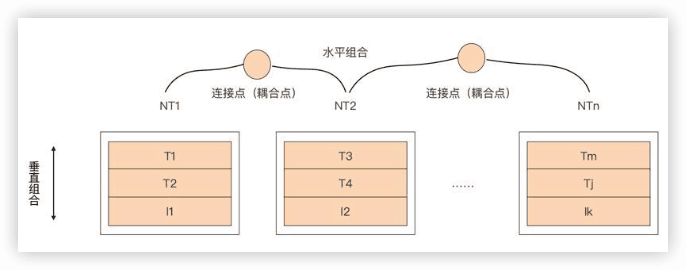

### 30.2 垂直组合

类型嵌入（Type Embedding）

#### 第一种：通过嵌入接口构建接口

```go
// $GOROOT/src/io/io.go
type ReadWriter interface {
    Reader
    Writer
}
```

#### 第二种：通过嵌入接口构建结构体类型

```go
type MyReader struct {
	io.Reader // underlying reader
	N int64   // max bytes remaining
}
```

#### 第三种：通过嵌入结构体类型构建新结构体类型

### 30.3 水平组合 🔖

接口分离原则（ISP原则，Interface Segregation Principle）


```go
func Save(f *os.File, data []byte) error
```

改成：

```go
func Save(w io.Writer, data []byte) error
```

io.Writer仅包含一个Write方法，而且这个方法恰恰是Save唯一需要的方法。

以io.Writer接口类型表示数据写入的目的地，既可以支持向磁盘写入，也可以支持向网络存储写入，并支持任何实现了Write方法的写入行为，这让Save函数的**扩展性**得到了质的提升。

对Save函数的测试也将变得十分容易:

```go
func TestSave(t *testing.T) {
    b := make([]byte, 0, 128)
    buf := bytes.NewBuffer(b)
    data := []byte("hello, golang")
    err := Save(buf, data)
    if err != nil {
        t.Errorf("want nil, actual %s", err.Error())
    }

    saved := buf.Bytes()
    if !reflect.DeepEqual(saved, data) {
        t.Errorf("want %s, actual %s", string(data), string(saved))
    }
}
```

由于bytes.Buffer实现了Write方法，进而实现了io.Writer接口，可以合法地将变量buf传递给Save函数。此后过程中，不需要创建任何磁盘文件或建立任何网络连接。

### 30.4 接口应用的几种模式

通过接口进行水平组合的基本模式就是：**使用接受接口类型参数的函数或方法**。在这个基本模式基础上，还有其他几种“衍生品”。

#### 基本模式

接受接口类型参数的函数或方法是水平组合的基本语法:

```go
func YourFuncName(param YourInterfaceType)
```


函数/方法参数中的接口类型作为“关节（连接点）”，支持将位于多个包中的多个类型与YourFuncName函数连接到一起，共同实现某一新特性。

同时，接口类型和它的实现者之间隐式的关系却在不经意间满足了：依赖抽象（DIP）、里氏替换原则（LSP）、接口隔离（ISP）等代码设计原则，这在其他语言中是需要很“刻意”地设计谋划的，但对Go接口来看，这一切却是自然而然的。

#### 创建模式

Go社区流传一个经验法则：“**接受接口，返回结构体（Accept interfaces, return structs）**”，这其实就是一种把接口作为“关节”的应用模式。我这里把它叫做**创建模式**，是因为这个经验法则多用于创建某一结构体类型的实例。

```go
// $GOROOT/src/sync/cond.go
type Cond struct {
    ... ...
    L Locker
}

func NewCond(l Locker) *Cond {
    return &Cond{L: l}
}

// $GOROOT/src/log/log.go
type Logger struct {
    mu     sync.Mutex 
    prefix string     
    flag   int        
    out    io.Writer  
    buf    []byte    
}

func New(out io.Writer, prefix string, flag int) *Logger {
    return &Logger{out: out, prefix: prefix, flag: flag}
}

// $GOROOT/src/log/log.go
type Writer struct {
    err error
    buf []byte
    n   int
    wr  io.Writer
}

func NewWriterSize(w io.Writer, size int) *Writer {
    // Is it already a Writer?
    b, ok := w.(*Writer)
    if ok && len(b.buf) >= size {
        return b
    }
    if size <= 0 {
        size = defaultBufSize
    }
    return &Writer{
        buf: make([]byte, size),
        wr:  w,
    }
} 
```


#### 包装器模式

在基本模式的基础上，当返回值的类型与参数类型相同时:

```go
func YourWrapperFunc(param YourInterfaceType) YourInterfaceType
```

通过这个函数，我们可以实现对输入参数的类型的包装，并在不改变被包装类型（输入参数类型）的定义的情况下，返回具备新功能特性的、实现相同接口类型的新类型。这种接口应用模式我们叫它**包装器模式**，也叫**装饰器模式**。包装器多用于**对输入数据的过滤、变换等**操作。

```go
// $GOROOT/src/io/io.go
func LimitReader(r Reader, n int64) Reader { return &LimitedReader{r, n} }

type LimitedReader struct {
    R Reader // underlying reader
    N int64  // max bytes remaining
}

func (l *LimitedReader) Read(p []byte) (n int, err error) {
    // ... ...
}
```


#### 适配器模式

适配器模式不是基本模式的直接衍生模式，但这种模式是中间件模式的前提。

适配器模式的核心是**适配器函数类型（Adapter Function Type）**，它是一个辅助水平组合实现的“工具”类型。


#### 中间件（Middleware）

中间件（Middleware）这个词的含义可大可小。在Go Web编程中，“中间件”常常指的是一个实现了http.Handler接口的http.HandlerFunc类型实例。实质上，这里的**中间件就是包装模式和适配器模式结合的产物**。


### 30.5 尽量避免使用空接口作为函数参数类型

空接口：`interface{}`（`any`是别名）。 

> 空接口不提供任何信息（The empty interface says nothing）。

**尽量不要使用可以“逃过”编译器类型安全检查的空接口类型（interface{}）。**


标准库中以interface{}为参数类型的方法和函数少之甚少。使用`interface{}`作为参数类型的函数或方法主要有两类：

- 容器算法类，比如：container下的heap、list和ring包、sort包、sync.Map等；
- 格式化/日志类，比如：fmt包、log包等。

它们面对的都是未知类型的数据，所以在这里使用具有“泛型”能力的interface{}类型。


## 31 并发：Go的并发方案实现方案是怎样的？❤️

Go的设计者将面向多核、**原生支持并发**作为了Go语言的设计目标之一，并将面向并发作为Go的设计哲学。

### 31.1 什么是并发？

并发（concurrency） 

并行（parallelism）

很久以前，面向大众消费者的主流处理器（CPU）都是单核的，操作系统的**基本调度与执行单元**是==进程（process）==。这个时候，**用户层的应用**有两种设计方式，一种是==单进程应用==，也就是每次启动一个应用，操作系统都只启动一个进程来运行这个应用。

单进程应用的情况下，用户层应用、操作系统进程以及处理器之间的关系:

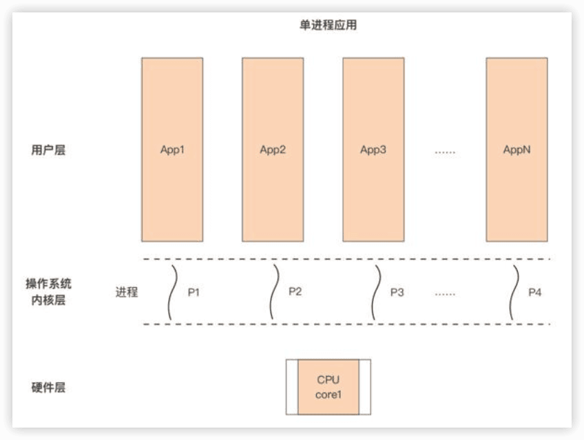

这个设计下，每个单进程应用对应一个操作系统进程，操作系统内的多个进程按**时间片**大小，被轮流调度到仅有的一颗单核处理器上执行。换句话说，这颗单核处理器在某个时刻只能执行一个进程对应的程序代码，两个进程不存在并行执行的可能。

**==并行（parallelism）==，指的就是在同一时刻，有两个或两个以上的任务（这里指进程）的代码在处理器上执行**。从这个概念也可以知道，多个处理器或多核处理器是并行执行的必要条件。

总的来说，单进程应用的设计比较简单，它的内部仅有一条代码执行流，代码从头执行到尾，**不存在==竞态==，无需考虑同步问题**。

用户层的另外一种设计方式，就是==多进程应用==，也就是应用通过fork等系统调用创建多个子进程，共同实现应用的功能。多进程应用的情况下，用户层应用、操作系统进程以及处理器之间的关系:


以图中的App1为例，这个应用设计者将应用内部划分为多个模块，每个模块用一个进程承载执行，每个模块都是一个单独的执行流，这样，App1内部就有了多个独立的代码执行流。

但限于当前仅有一颗单核处理器，这些进程（执行流）依旧无法并行执行，无论是App1内部的某个模块对应的进程，还是其他App对应的进程，都得逐个按时间片被操作系统调度到处理器上执行。

**粗略看起来，多进程应用与单进程应用相比并没有什么质的提升。那我们为什么还要将应用设计为多进程呢？**

这更多是从**应用的结构**角度去考虑的，多进程应用由于**将==功能职责==做了划分**，并指定专门的模块来负责，所以从结构上来看，要比单进程更为清晰简洁，可读性与可维护性也更好。**这种将程序分成多个可独立执行的部分的结构化程序的设计方法，就是==并发设计==**。采用了并发设计的应用也可以看成是**一组独立执行的模块的组合**。

不过，进程并不适合用于承载采用了并发设计的应用的模块执行流。因为进程是操作系统中资源拥有的基本单位，它不仅包含应用的代码和数据，还有**系统级的资源**，比如**文件描述符、内存地址空间**等等。进程的“包袱”太重，这导致它的创建、切换与撤销的代价都很大。

于是线程便走入了人们的视野，==线程==就是**运行于进程上下文中的更轻量级的执行流**。同时随着处理器技术的发展，多核处理器硬件成为了主流，这让真正的并行成为了可能，于是主流的应用设计模型变成了这样：


基于线程的应用通常采用**==单进程多线程的模型==**，一个应用对应一个进程，应用通过并发设计将自己**划分为多个模块，每个模块由一个线程独立承载执行**。多个线程共享这个进程所拥有的资源，但线程作为执行单元可被独立调度到处理器上运行。

线程的创建、切换与撤销的代价相对于进程是要小得多。当这个应用的多个线程同时被调度到不同的处理器核上执行时，我们就说这个应用是并行的。

> Rob Pike：**并发不是并行，并发关乎结构，并行关乎执行**。

总的来说，并发是**在==应用设计与实现阶段==要考虑的问题**。并发考虑的是如何将应用划分为多个互相配合的、可独立执行的模块的问题。采用并发设计的程序并不一定是并行执行的。

<u>在不满足并行必要条件的情况下（也就是仅有一个单核CPU的情况下），即便是采用并发设计的程序，依旧不可以并行执行。而在满足并行必要条件的情况下，采用并发设计的程序是可以并行执行的。而那些没有采用并发设计的应用程序，除非是启动多个程序实例，否则是无法并行执行的。</u>

在多核处理器成为主流的时代，即使采用并发设计的应用程序以单实例的方式运行，其中的每个内部模块也都是运行于一个单独的线程中的，多核资源也可以得到充分利用。而且，**==并发让并行变得更加容易==**，采用**并发设计的应用**可以将负载自然扩展到各个CPU核上，从而提升处理器的利用效率。

在传统编程语言（如C、C++等）中，基于**多线程模型**的应用设计就是一种典型的并发程序设计。但传统编程语言并非面向并发而生，没有对并发设计提供过多的帮助。并且，这些语言多**以操作系统线程作为承载分解后的代码片段（模块）的执行单元**，由操作系统执行调度。传统支持并发的方式的不足：

- 首先就是==复杂==。

  **创建容易==退出难==**。如果你做过C/C++编程，那你肯定知道，如果我们要利用`libpthread`库中提供的API创建一个线程，虽然要传入的参数个数不少，但好歹还是可以接受的。但一旦涉及线程的退出，就要考虑**新创建的线程是否要与主线程==分离（detach）==**，还是需要**主线程等待子线程终止（join）并获取其终止状态**？又或者是否需要在**新线程中设置==取消点（cancel point）==来保证被主线程==取消（cancel）==的时候能顺利退出**。

  而且，并发执行单元间的==通信困难且易错==。多个线程之间的通信虽然有多种机制可选，但用起来也是相当复杂。并且一旦涉及共享内存，就会用到各种锁互斥机制，死锁便成为家常便饭。另外，线程栈大小也需要设定，开发人员需要选择使用默认的，还是自定义设置。

- 第二就是难于==规模化（scale）==。每个线程占用的资源不小，操作系统调度切换线程的代价也不小。

  对于很多网络服务程序来说，由于不能大量创建线程，只能选择在少量线程里做网络多路复用的方案，也就是使用epoll/kqueue/IoCompletionPort这套机制，即便有像[libevent](https://github.com/libevent/libevent)和[libev](http://software.schmorp.de/pkg/libev.html)这样的第三方库帮忙，写起这样的程序也是很不容易的，存在大量**钩子回调**，给开发人员带来不小的**心智负担**。


### 31.2 Go的并发方案：goroutine

Go并没有使用操作系统线程作为承载分解后的代码片段（模块）的基本执行单元，而是实现了`goroutine`这一**由Go运行时（runtime）负责调度的、轻量的用户级线程**，为并发程序设计提供原生支持。【Goroutine可以被称为**==协程==**或**Go协程**。】

相比传统操作系统线程来说，goroutine的优势主要是：

- 资源占用小，每个goroutine的**初始栈**大小仅为==2k==；
- 由Go运行时而不是操作系统调度，goroutine上下文切换在用户层完成，开销更小；
- 在**==语言层==**面而不是通过标准库提供。goroutine由`go`关键字创建，**一退出就会被回收或销毁**，开发体验更佳；
- 语言内置`channel`作为goroutine间通信原语，为并发设计提供了强大支撑。

通过并发设计的Go应用可以更好地、更自然地适应**规模化（scale）**。

比如，当应用被分配到更多计算资源，或者计算处理硬件增配后，Go应用不需要再进行结构调整，就可以充分利用新增的计算资源。而且，经过并发设计后的Go应用也会更加契合Gopher们的开发分工协作。

#### goroutine的基本用法

**并发**是一种能力，它让你的程序可以由若干个代码片段**组合**而成，并且每个片段都是独立运行的。

无论是==Go自身运行时代码==还是==用户层Go代码==，都无一例外地运行在goroutine中。

Go语言通过`go关键字+函数/方法`的方式创建一个goroutine。创建后，新goroutine将拥有独立的代码执行流，并与创建它的goroutine一起被Go运行时调度。

```go
go fmt.Println("I am a goroutine")

var c = make(chan int)
go func(a, b int) {
    c <- a + b
}(3,4)
 
// $GOROOT/src/net/http/server.go
c := srv.newConn(rw)
go c.serve(connCtx)
```

上面例子中，通过go关键字，可以基于已有的具名函数/方法创建goroutine，也可以基于匿名函数/闭包创建goroutine。

多数情况下，不需要考虑对goroutine的退出进行控制：**==goroutine的执行函数的返回，就意味着goroutine退出。==**

如果main goroutine退出了，那么也意味着整个应用程序的退出。此外，你还要注意的是，**goroutine执行的函数或方法即便有返回值，Go也会忽略这些返回值**。所以，如果你要获取goroutine执行后的返回值，你需要另行考虑其他方法，比如通过goroutine间的通信来实现。

#### goroutine间的通信

传统的编程语言（比如：C++、Java、Python等）并非==面向并发==而生的，所以他们面对并发的逻辑多是**基于操作系统的线程**。并发的执行单元（线程）之间的通信，利用的也是操作系统提供的**线程或进程间通信**的原语，比如：**共享内存、信号（signal）、管道（pipe）、消息队列、套接字（socket）**等。

在这些通信原语中，使用最多、最广泛的（也是最高效的）是<u>结合了线程同步原语（比如：锁以及更为低级的原子操作）的共享内存方式</u>，因此，我们可以说传统语言的并发模型是**==基于对内存的共享的==**。

不过，这种传统的基于共享内存的并发模型很**难用**，且**易错**，尤其是在大型或复杂程序中，开发人员在设计并发程序时，需要根据线程模型对程序进行建模，同时规划线程之间的通信方式。如果选择的是高效的基于共享内存的机制，那么他们还要花费大量心思设计**线程间的同步机制**，并且在设计同步机制的时候，还要考虑多线程间复杂的内存管理，以及如何防止死锁等情况。

这种情况下，开发人员承受着巨大的心智负担，并且基于这类传统并发模型的程序难于编写、阅读、理解和维护。一旦程序发生问题，查找Bug的过程更是漫长和艰辛。

Go语言从设计伊始，就将解决上面这个传统并发模型的问题作为Go的一个目标，并在新并发模型设计中借鉴了著名计算机科学家[Tony Hoare](https://en.wikipedia.org/wiki/Tony_Hoare)提出的**==CSP==（Communicating Sequential Processes，==通信顺序进程==）**并发模型。

CSP模型旨在简化并发程序的编写，让并发程序的编写与编写顺序程序一样简单。Tony Hoare认为输入输出应该是基本的编程原语，**数据处理逻辑**（也就是CSP中的P）<u>只需调用输入原语获取数据，顺序地处理数据，并将结果数据通过输出原语输出就可以了。</u>

因此，在Tony Hoare眼中，**一个符合CSP模型的并发程序应该是一组通过输入输出原语连接起来的P的集合**。从这个角度来看，CSP理论不仅是一个并发参考模型，也是一种**并发程序的程序组织方法**。它的组合思想与Go的设计哲学不谋而合。

Tony Hoare的CSP理论中的P，也就是“Process（进程）”，是一个抽象概念，它代表**任何顺序==处理逻辑==的封装**，它获取输入数据（或从其他P的输出获取），并生产出可以被其他P消费的输出数据。CSP通信模型的示意图：


这里的P并不一定与操作系统的进程或线程划等号。在Go中，与“Process”对应的是`goroutine`。为了实现CSP并发模型中的输入和输出原语，Go还引入了**goroutine（P）之间的通信原语**`channel`。goroutine可以从channel获取输入数据，再将处理后得到的结果数据通过channel输出。通过channel将goroutine（P）组合连接在一起，让设计和编写大型并发系统变得更加简单和清晰。

上面提到的获取goroutine的退出状态，就可以使用channel原语实现：

```go
func spawn(f func() error) <-chan error {
    c := make(chan error)

    go func() {
        c <- f()
    }()

    return c
}

func main() {
    c := spawn(func() error {
        time.Sleep(2 * time.Second)
        return errors.New("timeout")
    })
    fmt.Println(<-c)
}
```

<u>在main goroutine与子goroutine之间建立了一个元素类型为error的channel，子goroutine退出时，会将它执行的函数的错误返回值写入这个channel，main goroutine可以通过读取channel的值来获取子goroutine的退出状态。</u>

虽然CSP模型已经成为Go语言支持的主流并发模型，但Go也支持传统的、基于共享内存的并发模型，并提供了基本的低级别同步原语（主要是`sync`包中的互斥锁、条件变量、读写锁、原子操作等）。

**Go始终推荐以CSP并发模型风格构建并发程序**。不过，对于局部情况，比如涉及**性能敏感的区域**或**需要保护的结构体数据**时，我们可以使用更为高效的低级同步原语（如`mutex`），保证goroutine对数据的同步访问。

### 小结

**并发不是并行**。并发是应用结构设计相关的概念，而并行只是程序执行期的概念，并行的必要条件是具有多个处理器或多核处理器，否则无论是否是并发的设计，程序执行时都有且仅有一个任务可以被调度到处理器上执行。

传统的编程语言（比如：C、C++）的并发程序设计方案是基于操作系统的线程调度模型的，这种模型与操作系统的调度强耦合，并且对于开发人员来说十分复杂，开发体验较差并且易错。

而Go给出的并发方案是基于轻量级线程goroutine的。goroutine占用的资源非常小，创建、切换以及销毁的开销很小。并且Go在语法层面原生支持基于goroutine的并发，通过一个go关键字便可以轻松创建goroutine，goroutine占用的资源非常小，创建、切换以及销毁的开销很小。这给开发者带来极佳的开发体验。

### 思考

> goroutine作为Go应用的基本执行单元，它的创建、退出以及goroutine间的通信都有很多常见的模式可循。日常开发中实用的goroutine使用模式有哪些？
>

在Go语言的并发编程中，goroutine的高效管理是提升程序性能和稳定性的核心。以下是日常开发中实用的goroutine使用模式，涵盖创建、通信、同步与退出等关键环节，结合代码示例与场景分析说明其应用：

#### **一、基础创建与通信模式**

##### 1. 轻量级任务并发（Fire-and-Forget）

- **场景**：执行独立且无需返回值的后台任务（如日志记录、心跳检测）。

- 实现：直接使用go关键字启动，但需注意主程序退出可能导致任务终止。

  ```go
  go func() {
      fmt.Println("Async task running")
      time.Sleep(time.Second)
  }()
  ```

- **注意**：需通过 `sync.WaitGroup` 或 `time.Sleep` 确保主程序等待。

##### 2. Channel返回值传递

- **场景**：需要收集goroutine计算结果（如并发处理数据后聚合）。

- 实现：结合带缓冲Channel和sync.WaitGroup：

  ```go
  func worker(num int, ch chan int, wg *sync.WaitGroup) {
      defer wg.Done()
      ch <- num * num // 发送结果
  }
  func main() {
      nums := []int{1, 2, 3}
      ch := make(chan int, len(nums))
      var wg sync.WaitGroup
      for _, n := range nums {
          wg.Add(1)
          go worker(n, ch, &wg)
      }
      wg.Wait()
      close(ch)
      for res := range ch { // 读取结果
          fmt.Println(res)
      }
  }
  ```

- **优点**：避免共享内存竞争，确保线程安全。

#### 二、同步控制模式

##### 1. WaitGroup等待组

- **场景**：主程序需等待一组goroutine全部完成（如批量处理文件后继续流程）。
- 关键点：
  - `wg.Add(1)` 在启动goroutine**前**调用。
  - `defer wg.Done()` 确保任务结束标记。
  - `wg.Wait()` 阻塞主程序直至所有任务完成。
- **示例**：见上文Channel返回值传递代码。

##### 2. Context生命周期管理

- **场景**：需超时控制、取消传播或传递请求上下文（如HTTP请求处理）。

- 实现：

  ```go
  func worker(ctx context.Context) {
      for {
          select {
          case <-ctx.Done(): // 监听取消信号
              fmt.Println("Canceled:", ctx.Err())
              return
          default:
              fmt.Println("Working...")
              time.Sleep(500 * time.Millisecond)
          }
      }
  }
  func main() {
      ctx, cancel := context.WithTimeout(context.Background(), 2*time.Second)
      defer cancel()
      go worker(ctx)
      time.Sleep(3 * time.Second) // 超时后自动触发ctx.Done()
  }
  ```

- **优势**：支持级联取消，避免goroutine泄漏。

#### 三、优雅退出模式

##### 1. 通道信号通知

- **场景**：主动通知goroutine退出（如服务关闭时清理资源）。

- 实现：通过关闭Channel广播退出信号：

  ```go
  quit := make(chan struct{})
  go func() {
      for {
          select {
          case <-quit: // 关闭Channel触发零值返回
              fmt.Println("Exiting")
              return
          default: // 正常任务逻辑
          }
      }
  }()
  time.Sleep(2 * time.Second)
  close(quit) // 通知退出
  ```

- **注意**：关闭Channel而非发送数据，确保所有监听goroutine均收到。

##### 2. 原子标志位控制

- **场景**：高频循环任务需快速响应退出（如实时数据处理）。

- 实现：使用 atomic.Bool避免竞态：

  ```go
  var running atomic.Bool
  running.Store(true)
  go func() {
      for running.Load() { // 原子读取
          // 执行任务
      }
  }()
  running.Store(false) // 安全停止
  ```

- **适用性**：简单场景替代Channel，减少调度开销。

#### 四、高级并发模式

##### 1. Worker Pool（协程池）

- **场景**：控制并发量，避免资源耗尽（如高并发API调用）。

- 实现：固定数量goroutine + 任务队列Channel：

  ```go
  func worker(id int, jobs <-chan int, results chan<- int) {
      for j := range jobs { // 自动退出
          results <- j * 2
      }
  }
  func main() {
      jobs := make(chan int, 10)
      results := make(chan int, 10)
      // 启动3个worker
      for w := 1; w <= 3; w++ {
          go worker(w, jobs, results)
      }
      // 投递任务
      for j := 1; j <= 5; j++ {
          jobs <- j
      }
      close(jobs) // 关闭jobs触发worker退出
      // 收集结果...
  }
  ```

- **优势**：平衡负载，避免过度创建goroutine。

##### 2. Pub/Sub（发布-订阅）

- **场景**：事件驱动架构（如消息广播、状态变更通知）。

- 实现：通过Channel实现多订阅者：

  ```go
  type PubSub struct {
      mu   sync.RWMutex
      subs map[string][]chan string
  }
  func (ps *PubSub) Publish(topic, msg string) {
      ps.mu.RLock()
      defer ps.mu.RUnlock()
      for _, ch := range ps.subs[topic] {
          ch <- msg // 向所有订阅者发送
      }
  }
  func (ps *PubSub) Subscribe(topic string) chan string {
      ch := make(chan string, 1)
      ps.mu.Lock()
      ps.subs[topic] = append(ps.subs[topic], ch)
      ps.mu.Unlock()
      return ch
  }
  ```

- **扩展**：支持通配符订阅、消息过滤等。

#### 五、反模式与避坑指南

1. Goroutine泄漏
   - **原因**：未设置退出条件，导致goroutine永久阻塞。
   - **规避**：始终结合Context/Channel/WaitGroup管理生命周期。
2. **共享内存竞态**
   - **错误示例**：多个goroutine直接修改全局变量。
   - **修正**：改用Channel传递数据，或使用 `sync.Mutex`/`atomic` 包。
3. **过度创建goroutine**
   - **风险**：大量goroutine引发调度开销，甚至OOM。
   - **建议**：使用Worker Pool限制并发数。

#### **模式选择决策树**

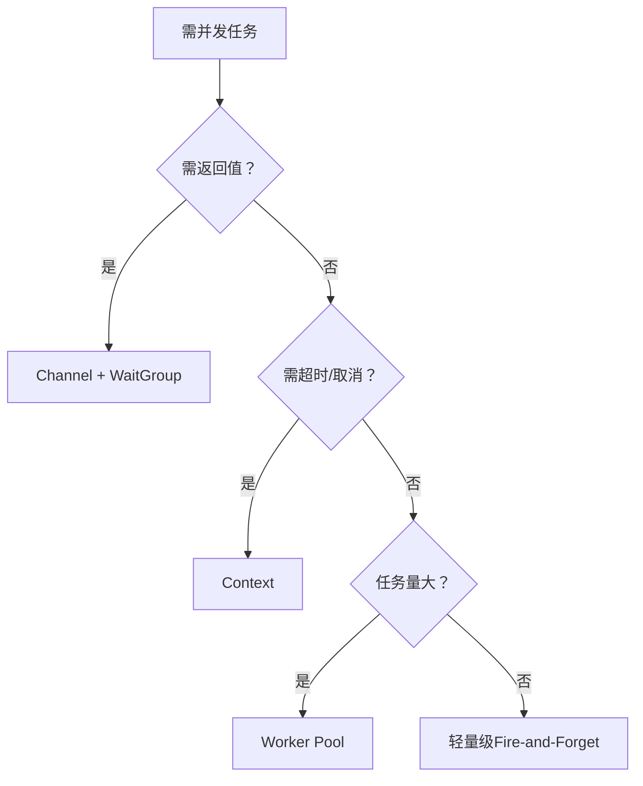
```mermaid
graph TD
    A[需并发任务] --> B{需返回值？}
    B -->|是| C[Channel + WaitGroup]
    B -->|否| D{需超时/取消？}
    D -->|是| E[Context]
    D -->|否| F{任务量大？}
    F -->|是| G[Worker Pool]
    F -->|否| H[轻量级Fire-and-Forget]
```

掌握上述模式后，可覆盖90%的并发场景。关键原则：**优先Channel通信替代共享内存，用Context管理生命周期，通过池化控制资源**。更多实践细节可参考源码示例。


## 32 并发：聊聊Goroutine调度器的原理

> Go运行时是如何将一个个Goroutine调度到CPU上执行的？

### 32.1 Goroutine调度器

将这些Goroutine按照一定算法放到==“CPU”==上执行的程序，就被称为==Goroutine调度器（Goroutine Scheduler）==。

一个Go程序对于操作系统来说只是一个**用户层程序**，操作系统眼中只有线程。

==一个Go程序 = 用户层代码 + Go运行时==。

于是，Goroutine的调度问题就演变为，**Go运行时如何将程序内的众多Goroutine，按照一定==算法==调度到“CPU”资源上运行的问题了**。

<u>可是，在操作系统层面，线程竞争的“CPU”资源是**真实的物理CPU**，但在Go程序层面，各个Goroutine要竞争的“CPU”资源又是什么呢？</u>

Go程序是用户层程序，它本身就是整体运行在一个或多个操作系统线程上的。所以，Goroutine们要竞争的“CPU”资源就是**操作系统线程**。

这样，Goroutine调度器的任务也就明确了：**==将Goroutine按照一定算法放到不同的操作系统线程中去执行==**。

### 32.2 Goroutine调度器模型与演化过程 🔖

Goroutine调度器的实现不是一蹴而就的，它的调度模型与算法也是几经演化，**从最初的G-M模型、到G-P-M模型，从不支持抢占，到支持协作式抢占，再到支持基于信号的异步抢占**，Goroutine调度器经历了不断地优化与打磨。

#### G-M模型

2012年3月28日，Go 1.0

在这个调度器中，每个Goroutine对应于运行时中的一个抽象结构：==G==(Goroutine)；而被视作“物理CPU”的操作系统线程被抽象为：==M==(machine)。

调度器的工作就是将G调度到M上去运行。

G-M模型的一个重要不足：**限制了Go并发程序的伸缩性，尤其是对那些有高吞吐或并行计算需求的服务程序**。这个问题主要体现在：

- 单一全局互斥锁`(Sched.Lock)` 和集中状态存储的存在，导致所有Goroutine相关操作，比如创建、重新调度等，都要上锁；
- Goroutine传递问题：M经常在M之间传递“可运行”的Goroutine，这导致调度延迟增大，也增加了额外的性能损耗；
- 每个M都做内存缓存，导致内存占用过高，数据局部性较差；
- 由于系统调用（syscall）而形成的频繁的工作线程阻塞和解除阻塞，导致额外的性能损耗。

#### G-P-M调度模型

==Go 1.1==

[work stealing算法](http://supertech.csail.mit.edu/papers/steal.pdf)

为了解决上面的一些问题，德米特里·维尤科夫通过向G-M模型中增加了一个P，让Go调度器具有很好的伸缩性。在Go 1.1版本中实现了**G-P-M调度模型**和[work stealing算法](http://supertech.csail.mit.edu/papers/steal.pdf)，这个模型一直沿用至今。模型如下图：


==P==是一个“逻辑Proccessor”，每个G（Goroutine）要想真正运行起来，首先需要被分配一个P，也就是进入到P的本地运行队列（local runq）中。对于G来说，P就是运行它的“CPU”，可以说：**在G的眼里只有P**。但从Go调度器的视角来看，真正的“CPU”是M，只有将P和M绑定，才能让P的runq中的G真正运行起来。

G-P-M模型的实现算是`Go调度器`的一大进步，但调度器仍然有一个令人头疼的问题，那就是**不支持抢占式调度**，这导致一旦某个G中出现死循环的代码逻辑，那么G将永久占用分配给它的P和M，而位于同一个P中的其他G将得不到调度，出现“**饿死**”的情况。

更为严重的是，当只有一个P（GOMAXPROCS=1）时，整个Go程序中的其他G都将“饿死”。于是德米特里·维尤科夫又提出了《[Go Preemptive Scheduler Design](https://docs.google.com/document/d/1ETuA2IOmnaQ4j81AtTGT40Y4_Jr6_IDASEKg0t0dBR8/edit#!)》并在**Go 1.2中实现了基于协作的“抢占式”调度**。

#### “抢占式”调度

Go 1.2

这个抢占式调度的原理就是，**Go编译器在每个函数或方法的入口处加上了一段额外的代码(`runtime.morestack_noctxt`)，让运行时有机会在这段代码中检查是否需要执行抢占调度。**

这种解决方案只能说局部解决了“饿死”问题，只在有函数调用的地方才能插入“抢占”代码（**埋点**），对于没有函数调用而是纯算法循环计算的G，Go调度器依然无法抢占。

比如，死循环等并没有给编译器插入抢占代码的机会，这就会导致GC在等待所有Goroutine停止时的等待时间过长，从而[导致GC延迟](https://github.com/golang/go/issues/10958)，内存占用瞬间冲高；甚至在一些特殊情况下，导致在**STW**（stop the world）时死锁。

为了解决这些问题，在==Go 1.14==版本中接受了奥斯汀·克莱门茨（Austin Clements）的[提案](https://go.googlesource.com/proposal/+/master/design/24543-non-cooperative-preemption.md)，增加了**对非协作的抢占式调度的支持**，这种抢占式调度是基于**系统信号**的，也就是通过向线程发送信号的方式来抢占正在运行的Goroutine。

除了这些大的迭代外，Goroutine的调度器还有一些小的优化改动，比如**通过文件I/O poller减少M的阻塞等**。

Go运行时已经实现了`netpoller`，这使得即便G发起网络I/O操作，也不会导致M被阻塞（仅阻塞G），也就不会导致大量线程（M）被创建出来。

但是对于文件I/O操作来说，一旦阻塞，那么线程（M）将进入挂起状态，等待I/O返回后被唤醒。这种情况下P将与挂起的M分离，再选择一个处于空闲状态（idle）的M。如果此时没有空闲的M，就会新创建一个M（线程），所以，这种情况下，大量I/O操作仍然会导致大量线程被创建。

为了解决这个问题，Go开发团队的伊恩·兰斯·泰勒（Ian Lance Taylor）在==Go 1.9==中增加了一个[针对文件I/O的Poller](https://groups.google.com/forum/#!topic/golang-dev/tT8SoKfHty0)的功能，这个功能可以像netpoller那样，在G操作那些支持监听（`pollable`）的文件描述符时，仅会阻塞G，而不会阻塞M。不过这个功能依然不能对常规文件有效，常规文件是不支持监听的（pollable）。但对于Go调度器而言，这也算是一个不小的进步了。

从Go 1.2以后，Go调度器就一直稳定在G-P-M调度模型上，尽管有各种优化和改进，但也都是基于这个模型之上的。那未来的Go调度器会往哪方面发展呢？

德米特里·维尤科夫在2014年9月提出了一个新的设计草案文档：《[NUMA‐aware scheduler for Go](https://docs.google.com/document/u/0/d/1d3iI2QWURgDIsSR6G2275vMeQ_X7w-qxM2Vp7iGwwuM/pub)》，作为对未来Goroutine调度器演进方向的一个提议，不过至今似乎这个提议也没有列入开发计划。

### 32.3 深入G-P-M模型 🔖

Go语言中Goroutine的调度、GC、内存管理等是Go语言原理最复杂、最难懂的地方，并且这三方面的内容随着Go版本的演进也在不断更新。

基于Go 1.12.7版本（支持基于协作的抢占式调度）

#### G、P和M

`$GOROOT/src/runtime/runtime2.go`

- G: 代表Goroutine，存储了Goroutine的执行栈信息、Goroutine状态以及Goroutine的任务函数等，而且G对象是可以重用的；
- P: 代表逻辑processor，**P的数量决定了系统内最大可并行的G的数量**，P的最大作用还是其拥有的各种**G对象队列、链表、一些缓存和状态**；
- M: M代表着真正的执行计算资源。在绑定有效的P后，进入一个调度循环，而调度循环的机制大致是**从P的本地运行队列以及全局队列中获取G，切换到G的执行栈上并执行G的函数，调用goexit做清理工作并回到M，如此反复**。M并不保留G状态，这是G可以跨M调度的基础。

```go
//src/runtime/runtime2.go
type g struct {
    stack      stack   // offset known to runtime/cgo
    sched      gobuf
    goid       int64
    gopc       uintptr // pc of go statement that created this goroutine
    startpc    uintptr // pc of goroutine function
    ... ...
}

type p struct {
    lock mutex

    id          int32
    status      uint32 // one of pidle/prunning/...
  
    mcache      *mcache
    racectx     uintptr

    // Queue of runnable goroutines. Accessed without lock.
    runqhead uint32
    runqtail uint32
    runq     [256]guintptr

    runnext guintptr

    // Available G's (status == Gdead)
    gfree    *g
    gfreecnt int32

    ... ...
}


type m struct {
    g0            *g     // goroutine with scheduling stack
    mstartfn      func()
    curg          *g     // current running goroutine
    ... ...
}
```

Goroutine调度器的目标，就是公平合理地将各个G调度到P上“运行”。

下面重点看看**G是如何被调度**的。

#### G被抢占调度

如果某个G没有进行系统调用（syscall）、没有进行I/O操作、没有阻塞在一个channel操作上，**调度器是如何让G停下来并调度下一个可运行的G的呢**？

答案就是：**G是被抢占调度的**。

前面说过，除非极端的无限循环，否则只要G调用函数，Go运行时就有了抢占G的机会。Go程序启动时，运行时会去启动一个名为`sysmon`的M（一般称为**==监控线程==**），这个M的特殊之处在于它不需要绑定P就可以运行（以g0这个G的形式），这个M在整个Go程序的运行过程中至关重要，下面是对sysmon被创建的部分代码以及sysmon的执行逻辑摘录：

```go
//$GOROOT/src/runtime/proc.go

// The main goroutine.
func main() {
     ... ...
    systemstack(func() {
        newm(sysmon, nil)
    })
    .... ...
}

// Always runs without a P, so write barriers are not allowed.
//
//go:nowritebarrierrec
func sysmon() {
    // If a heap span goes unused for 5 minutes after a garbage collection,
    // we hand it back to the operating system.
    scavengelimit := int64(5 * 60 * 1e9)
    ... ...

    if  .... {
        ... ...
        // retake P's blocked in syscalls
        // and preempt long running G's
        if retake(now) != 0 {
            idle = 0
        } else {
            idle++
        }
       ... ...
    }
}
```

sysmon每`20us~10ms`启动一次，主要完成了这些工作：

- 释放闲置超过5分钟的**span内存**；
- 如果超过2分钟没有垃圾回收，强制执行；
- 将长时间未处理的`netpoll`结果添加到任务队列；
- 向长时间运行的G任务发出抢占调度；
- 收回因`syscall`长时间阻塞的P；

sysmon将“向长时间运行的G任务发出抢占调度”，这个事情由函数`retake`实施：

```go
// $GOROOT/src/runtime/proc.go

// forcePreemptNS is the time slice given to a G before it is
// preempted.
const forcePreemptNS = 10 * 1000 * 1000 // 10ms

func retake(now int64) uint32 {
          ... ...
           // Preempt G if it's running for too long.
            t := int64(_p_.schedtick)
            if int64(pd.schedtick) != t {
                pd.schedtick = uint32(t)
                pd.schedwhen = now
                continue
            }
            if pd.schedwhen+forcePreemptNS > now {
                continue
            }
            preemptone(_p_)
         ... ...
}

func preemptone(_p_ *p) bool {
    mp := _p_.m.ptr()
    if mp == nil || mp == getg().m {
        return false
    }
    gp := mp.curg
    if gp == nil || gp == mp.g0 {
        return false
    }

    gp.preempt = true //设置被抢占标志

    // Every call in a go routine checks for stack overflow by
    // comparing the current stack pointer to gp->stackguard0.
    // Setting gp->stackguard0 to StackPreempt folds
    // preemption into the normal stack overflow check.
    gp.stackguard0 = stackPreempt
    return true
}
```

上面的代码中显示，**如果一个G任务运行10ms，sysmon就会认为它的运行时间太久而发出抢占式调度的请求**。一旦G的抢占标志位被设为true，那么等到这个G下一次调用函数或方法时，运行时就可以将G抢占并移出运行状态，放入队列中，等待下一次被调度。

除了这个常规调度之外，还有两个特殊情况下G的调度方法:

- 第一种：channel阻塞或网络I/O情况下的调度。

  如果G被阻塞在某个channel操作或网络I/O操作上时，G会被放置到某个等待（wait）队列中，而M会尝试运行P的下一个可运行的G。如果这个时候P没有可运行的G供M运行，那么M将解绑P，并进入挂起状态。当I/O操作完成或channel操作完成，在等待队列中的G会被唤醒，标记为可运行（runnable），并被放入到某P的队列中，绑定一个M后继续执行。

- 第二种：系统调用阻塞情况下的调度。

  如果G被阻塞在某个系统调用（system call）上，那么不光G会阻塞，执行这个G的M也会解绑P，与G一起进入挂起状态。如果此时有空闲的M，那么P就会和它绑定，并继续执行其他G；如果没有空闲的M，但仍然有其他G要去执行，那么Go运行时就会创建一个新M（线程）。

当系统调用返回后，阻塞在这个系统调用上的G会尝试获取一个可用的P，如果没有可用的P，那么G会被标记为runnable，之前的那个挂起的M将再次进入挂起状态。

### 小结


基于Goroutine的并发设计离不开一个高效的生产级调度器。Goroutine调度器演进了十余年，先后经历了**G-M模型、G-P-M模型和work stealing算法、协作式的抢占调度以及基于信号的异步抢占**等改进与优化，目前Goroutine调度器相对稳定和成熟，可以适合绝大部分生产场合。

现在的G-P-M模型和最初的G-M模型相比，通过向G-M模型中增加了一个代表**逻辑处理器**的P，使得Goroutine调度器具有了更好的伸缩性。

M是Go**代码运行的真实载体**，包括Goroutine调度器自身的逻辑也是在M中运行的。

P在G-P-M模型中占据核心地位，它拥有待调度的G的队列，同时M要想运行G必须绑定一个P。一个G被调度执行的时间不能过长，超过特定长的时间后，G会被设置为**可抢占**，并在下一次执行函数或方法时被Go运行时移出运行状态。

如果G被阻塞在某个channel操作或网络I/O操作上时，M可以不被阻塞，这避免了大量创建M导致的开销。但如果G因慢系统调用而阻塞，那么M也会一起阻塞，但在阻塞前会与P解绑，P会尝试与其他M绑定继续运行其他G。但若没有现成的M，Go运行时会建立新的M，这也是系统调用可能导致系统线程数量增加的原因，你一定要注意这一点。

### 思考

```go
func deadloop() {
    for {
    } 
}

func main() {
    go deadloop()
    for {
        time.Sleep(time.Second * 1)
        fmt.Println("I got scheduled!")
    }
}
```

问题：

1. 在一个拥有多核处理器的主机上，使用 Go 1.13.x 版本运行这个示例代码，你在命令行终端上是否能看到“I got scheduled!”输出呢？也就是 main goroutine 在创建 deadloop goroutine 之后是否能继续得到调度呢？
2. 我们通过什么方法可以让上面示例中的 main goroutine，在创建 deadloop goroutine 之后无法继续得到调度？


答案：🔖

go1.13的话加上runtime.GOMAXPROCS(1)， main goroutine在创建 deadloop goroutine 之后就无法继续得到调度。

但如果是go1.14之后的话即使加上runtime.GOMAXPROCS(1)， main goroutine在创建 deadloop goroutine 之后还是可以得到调度，应该是因为增加了对非协作的抢占式调度的支持。


## 33 并发：小channel中蕴含大智慧

Go语言的CSP模型的实现包含两个主要组成部分：

- 一个是Goroutine，它是Go应用并发设计的基本构建与执行单元；
- 另一个就是channel，它在并发模型中扮演着重要的角色。

channel既可以用来实现Goroutine间的==通信==，还可以实现Goroutine间的==同步==。

### 33.1 作为一等公民的channel

意味着可以像使用普通变量那样使用channel。

#### 创建channel

和切片、结构体、map等一样，channel也是一种复合数据类型。也就是说，我们在声明一个channel类型变量时，必须给出其**具体的元素类型**。

```go
var ch chan int  // 声明了一个元素为int类型的channel类型变量ch
```

为channel类型变量赋初值的唯一方法就是`make`:

```go
ch1 := make(chan int)     // 无缓冲channel
ch2 := make(chan int, 5)   // 带缓冲channel
```

`make(chan T)`创建的、元素类型为T的channel类型，是**无缓冲channel**；

`make(chan T, capacity)`创建的元素类型为T、缓冲区长度为capacity的channel类型，是**带缓冲channel**。

这两种类型的变量关于发送（send）与接收（receive）的特性是不同的。

#### 发送与接收

`<-`操作符用于对channel类型变量进行**发送与接收**操作：

```go
ch1 <- 13    // 将整型字面值13发送到无缓冲channel类型变量ch1中
n := <- ch1  // 从无缓冲channel类型变量ch1中接收一个整型值存储到整型变量n中
ch2 <- 17    // 将整型字面值17发送到带缓冲channel类型变量ch2中
m := <- ch2  // 从带缓冲channel类型变量ch2中接收一个整型值存储到整型变量m中
```

1️⃣由于无缓冲channel的运行时层实现不带有缓冲区，所以Goroutine对无缓冲channel的接收和发送操作是**==同步的==**。也就是说，对同一个无缓冲channel，只有对它进行接收操作的Goroutine和对它进行发送操作的Goroutine都存在的情况下，通信才能得以进行，否则单方面的操作会让对应的Goroutine陷入挂起状态，如：

```go
func main() {
    ch1 := make(chan int)
    ch1 <- 13 // fatal error: all goroutines are asleep - deadlock!
    n := <-ch1
    println(n)
}
```

创建了一个无缓冲的channel类型变量ch1，对ch1的读写都放在了一个Goroutine中。

运行结果提示我们所有Goroutine都处于休眠状态，程序处于==死锁==状态。要想解除这种错误状态，只需要将接收操作，或者发送操作放到另外一个Goroutine中就可以了：

```go
func main() {
    ch1 := make(chan int)
    go func() {
        ch1 <- 13 // 将发送操作放入一个新goroutine中执行
    }()
    n := <-ch1
    println(n)
}
```

结论：**对无缓冲channel类型的发送与接收操作，一定要==放在两个不同的Goroutine==中进行，否则会导致deadlock**。

2️⃣和无缓冲channel相反，带缓冲channel的运行时层实现带有缓冲区，因此，对带缓冲channel的发送操作在缓冲区未满、接收操作在缓冲区非空的情况下是**==异步==**的（发送或接收不需要阻塞等待）。

也就是说，对一个带缓冲channel来说，在缓冲区未满的情况下，对它进行发送操作的Goroutine并不会阻塞挂起；在缓冲区有数据的情况下，对它进行接收操作的Goroutine也不会阻塞挂起。

但当缓冲区满了的情况下，对它进行发送操作的Goroutine就会阻塞挂起；当缓冲区为空的情况下，对它进行接收操作的Goroutine也会阻塞挂起。

几个关于带缓冲channel的操作的例子:

```go
ch2 := make(chan int, 1)
n := <-ch2 // 由于此时ch2的缓冲区中无数据，因此对其进行接收操作将导致goroutine挂起

ch3 := make(chan int, 1)
ch3 <- 17  // 向ch3发送一个整型数17
ch3 <- 27  // 由于此时ch3中缓冲区已满，再向ch3发送数据也将导致goroutine挂起
```

操作符`<-`还可以声明**只发送channel类型**（send-only）和**只接收channel类型**（recv-only）: 🔖

```go
ch1 := make(chan<- int, 1) // 只发送channel类型
ch2 := make(<-chan int, 1) // 只接收channel类型

<-ch1       // invalid operation: <-ch1 (receive from send-only type chan<- int)
ch2 <- 13   // invalid operation: ch2 <- 13 (send to receive-only type <-chan int)
```

**试图从一个只发送channel类型变量中接收数据，或者向一个只接收channel类型发送数据，都会导致编译错误**。

通常只发送channel类型和只接收channel类型，会被用作函数的参数类型或返回值，用于限制对channel内的操作，或者是明确可对channel进行的操作的类型，例子：

```go
func produce(ch chan<- int) {
    for i := 0; i < 10; i++ {
        ch <- i + 1
        time.Sleep(time.Second)
    }
    close(ch)
}

func consume(ch <-chan int) {
    for n := range ch {
        println(n)
    }
}

func main() {
    ch := make(chan int, 5)
    var wg sync.WaitGroup
    wg.Add(2)
    go func() {
        produce(ch)
        wg.Done()
    }()

    go func() {
        consume(ch)
        wg.Done()
    }()

    wg.Wait()
}
```

启动了两个Goroutine，分别代表生产者（produce）与消费者（consume）。生产者只能向channel中发送数据，我们使用`chan<- int`作为produce函数的参数类型；消费者只能从channel中接收数据，我们使用`<-chan int`作为consume函数的参数类型。

在消费者函数consume中，我们使用了for range循环语句来从channel中接收数据，for range会阻塞在对channel的接收操作上，直到channel中有数据可接收或channel被关闭循环，才会继续向下执行。channel被关闭后，for range循环也就结束了。

#### 关闭channel

produce函数在发送完数据后，调用Go内置的close函数关闭了channel。channel关闭后，所有等待从这个channel接收数据的操作都将返回。

看一下采用不同接收语法形式的语句，在channel被关闭后的返回值的情况：

```go
n := <- ch      // 当ch被关闭后，n将被赋值为ch元素类型的零值
m, ok := <-ch   // 当ch被关闭后，m将被赋值为ch元素类型的零值, ok值为false
for v := range ch { // 当ch被关闭后，for range循环结束
    ... ...
}
```

通过“comma, ok”惯用法或for range语句，可以准确地判定channel是否被关闭。而单纯采用n := <-ch形式的语句，就无法判定从ch返回的元素类型零值，究竟是不是因为channel被关闭后才返回的。

另外，从前面produce的示例程序中，我们也可以看到，channel是在produce函数中被关闭的，这也是channel的一个使用惯例，那就是发送端负责关闭channel。

<u>为什么要在发送端关闭channel呢？</u>

这是因为发送端没有像接受端那样的、可以安全判断channel是否被关闭了的方法。同时，一旦向一个已经关闭的channel执行发送操作，这个操作就会引发panic，比如下面这个示例：

```go
ch := make(chan int, 5)
close(ch)
ch <- 13 // panic: send on closed channel
```

#### select 

同时对多个channel进行操作时，会结合Go为CSP并发模型提供的另外一个原语**select**，一起使用。

通过select，可以同时在多个channel上进行发送/接收操作：

```go
select {
case x := <-ch1:     // 从channel ch1接收数据
	... ...
case y, ok := <-ch2: // 从channel ch2接收数据，并根据ok值判断ch2是否已经关闭
	... ...
case ch3 <- z:       // 将z值发送到channel ch3中:
	... ...
default:             // 当上面case中的channel通信均无法实施时，执行该默认分支
}
```

当select语句中没有default分支，而且所有case中的channel操作都阻塞了的时候，整个select语句都将被阻塞，直到某一个case上的channel变成**可发送**，或者某个case上的channel变成可接收，select语句才可以继续进行下去。

channel和select两种原语的操作都十分简单，它们都遵循了Go语言“追求简单”的设计哲学，但它们却为Go并发程序带来了强大的表达能力。


### 33.2 无缓冲channel的惯用法

无缓冲channel兼具通信和同步特性，在并发程序中应用颇为广泛。

#### 第一种用法：用作信号传递

- 1对1通知信号

```go
type signal struct{}

func worker() {
    println("worker is working...")
    time.Sleep(1 * time.Second)
}

func spawn(f func()) <-chan signal {
    c := make(chan signal)
    go func() {
        println("worker start to work...")
        f()
        c <- signal{}
    }()
    return c
}

func main() {
    println("start a worker...")
    c := spawn(worker)
    <-c
    fmt.Println("worker work done!")
}
```

spawn函数返回的channel，被用于承载新Goroutine退出的“通知信号”，这个信号专门用作通知main goroutine。main goroutine在调用spawn函数后一直阻塞在对这个“通知信号”的接收动作上。

结果：

```
start a worker...
worker start to work...
worker is working...
worker work done!
```

- 1对n通知信号，常被用于协调多个Goroutine一起工作

```go
func worker(i int) {
	fmt.Printf("worker %d: is working...\n", i)
	time.Sleep(1 * time.Second)
	fmt.Printf("worker %d: works done\n", i)
}

type signal struct{}

func spawnGroup(f func(i int), num int, groupSignal <-chan signal) <-chan signal {
	c := make(chan signal)
	var wg sync.WaitGroup

	for i := 0; i < num; i++ {
		wg.Add(1)
		go func(i int) {
			<-groupSignal
			fmt.Printf("worker %d: start to work...\n", i)
			f(i)
			wg.Done()
		}(i + 1)
	}

	go func() {
		wg.Wait()
		c <- signal{}
	}()
	return c
}

func main() {
	fmt.Println("start a group of workers...")
	groupSignal := make(chan signal)
	c := spawnGroup(worker, 5, groupSignal)
	time.Sleep(5 * time.Second)
	fmt.Println("the group of workers start to work...")
	close(groupSignal)
	<-c
	fmt.Println("the group of workers work done!")
}
```

这个例子中，main goroutine创建了一组5个worker goroutine，这些Goroutine启动后会阻塞在名为groupSignal的无缓冲channel上。main goroutine通过`close(groupSignal)`向所有worker goroutine广播“开始工作”的信号，收到groupSignal后，所有worker goroutine会**“同时”**开始工作，就像起跑线上的运动员听到了裁判员发出的起跑信号枪声。

运行结果：

```go
start a group of workers...
the group of workers start to work...
worker 3: start to work...
worker 3: is working...
worker 4: start to work...
worker 4: is working...
worker 1: start to work...
worker 1: is working...
worker 5: start to work...
worker 5: is working...
worker 2: start to work...
worker 2: is working...
worker 3: works done
worker 4: works done
worker 5: works done
worker 1: works done
worker 2: works done
the group of workers work done!
```

可以看到，关闭一个无缓冲channel会让所有阻塞在这个channel上的接收操作返回，从而实现了一种1对n的**“广播”**机制。

#### 第二种用法：用于替代锁机制

无缓冲channel具有**同步特性**，这让它在某些场合可以替代锁，让程序更加清晰，可读性也更好。对比：

- 一个传统的、基于“共享内存”+“互斥锁”的Goroutine安全的计数器

```go
type counter struct {
    sync.Mutex
    i int
}

var cter counter

func Increase() int {
    cter.Lock()
    defer cter.Unlock()
    cter.i++
    return cter.i
}

func main() {
    var wg sync.WaitGroup

    for i := 0; i < 10; i++ {
        wg.Add(1)
        go func(i int) {
            v := Increase()
            fmt.Printf("goroutine-%d: current counter value is %d\n", i, v)
            wg.Done()
        }(i)
    }

    wg.Wait()
}
```

这个示例中，使用了一个带有互斥锁保护的全局变量作为计数器，所有要操作计数器的Goroutine共享这个全局变量，并在互斥锁的同步下对计数器进行自增操作。

- 无缓冲channel替代锁

```go
type counter struct {
    c chan int
    i int
}

func NewCounter() *counter {
    cter := &counter{
        c: make(chan int),
    }
    go func() {
        for {
            cter.i++
            cter.c <- cter.i
        }
    }()
    return cter
}

func (cter *counter) Increase() int {
    return <-cter.c
}

func main() {
    cter := NewCounter()
    var wg sync.WaitGroup
    for i := 0; i < 10; i++ {
        wg.Add(1)
        go func(i int) {
            v := cter.Increase()
            fmt.Printf("goroutine-%d: current counter value is %d\n", i, v)
            wg.Done()
        }(i)
    }
    wg.Wait()
}
```

这个实现中将计数器操作全部交给一个独立的Goroutine去处理，并通过无缓冲channel的同步阻塞特性，实现了计数器的控制。这样其他Goroutine通过Increase函数试图增加计数器值的动作，实质上就转化为了一次无缓冲channel的接收动作。

这种并发设计逻辑更符合Go语言所倡导的**“不要通过共享内存来通信，而是通过通信来共享内存”**的原则。

```
goroutine-9: current counter value is 10
goroutine-0: current counter value is 1
goroutine-6: current counter value is 7
goroutine-2: current counter value is 3
goroutine-8: current counter value is 9
goroutine-4: current counter value is 5
goroutine-5: current counter value is 6
goroutine-1: current counter value is 2
goroutine-7: current counter value is 8
goroutine-3: current counter value is 4
```


### 33.3 带缓冲channel的惯用法 🔖🔖

带缓冲的channel与无缓冲的channel的最大不同之处，就在于它的**==异步性==**。也就是说，对一个带缓冲channel，在缓冲区未满的情况下，对它进行发送操作的Goroutine不会阻塞挂起；在缓冲区有数据的情况下，对它进行接收操作的Goroutine也不会阻塞挂起。

#### 第一种用法：用作消息队列

channel的原生特性与消息队列十分相似，包括Goroutine安全、有FIFO（first-in, first out）保证等。

其实，和无缓冲channel更多用于信号/事件管道相比，可自行设置容量、异步收发的带缓冲channel更适合被用作为消息队列，并且，带缓冲channel在数据收发的性能上要明显好于无缓冲channel。

以通过对channel读写的基本测试来印证这一点 🔖

- **单接收单发送性能的基准测试**


- **多接收多发送性能基准测试**


总结：

- 无论是1收1发还是多收多发，带缓冲channel的收发性能都要好于无缓冲channel；
- 对于带缓冲channel而言，发送与接收的Goroutine数量越多，收发性能会有所下降；
- 对于带缓冲channel而言，选择适当容量会在一定程度上提升收发性能。


#### 第二种用法：用作计数信号量（counting semaphore）

Go并发设计的一个惯用法，就是将带缓冲channel用作计数信号量（counting semaphore）。

带缓冲channel中的当前数据个数代表的是，当前同时处于活动状态（处理业务）的Goroutine的数量，而带缓冲channel的容量（capacity），就代表了允许同时处于活动状态的Goroutine的最大数量。向带缓冲channel的一个发送操作表示获取一个信号量，而从channel的一个接收操作则表示释放一个信号量。


#### len(channel)的应用

**len**是Go语言的一个内置函数，它支持接收数组、切片、map、字符串和channel类型的参数，并返回对应类型的“长度”，也就是一个整型值。

针对channel ch的类型不同，len(ch)有如下两种语义：

- 当ch为无缓冲channel时，len(ch)总是返回0；
- 当ch为带缓冲channel时，len(ch)返回当前channel ch中**尚未被读取的元素个数**。


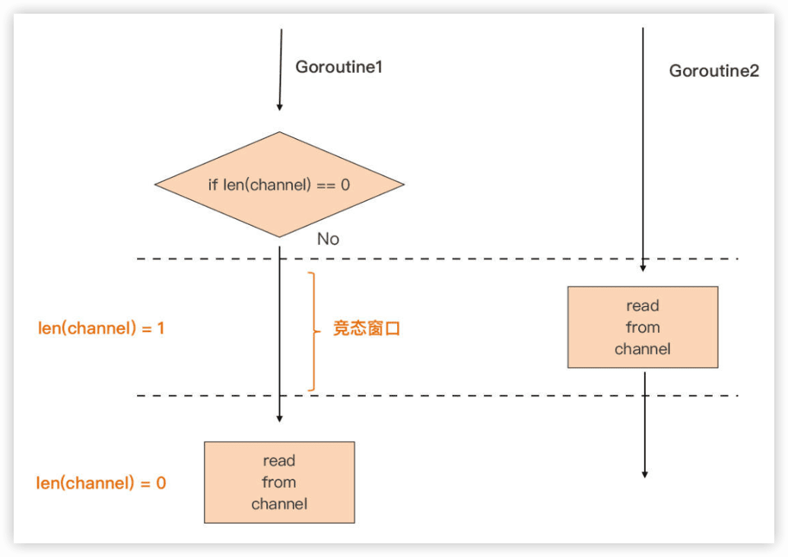


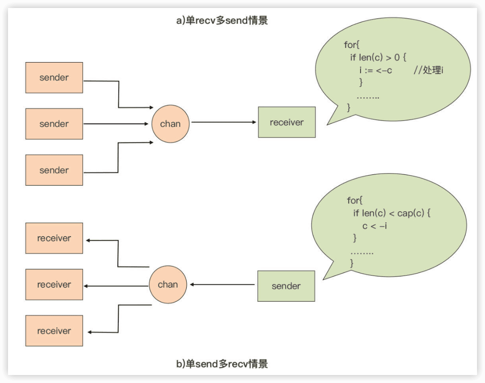


### 33.4 nil channel的妙用

如果一个channel类型变量的值为nil，称它为**nil channel**。nil channel有一个特性，那就是**对nil channel的读写都会发生阻塞**。


### 33.5 与select结合使用的一些惯用法

#### 第一种用法：利用default分支避免阻塞


#### 第二种用法：实现超时机制

带超时机制的select，是Go中常见的一种select和channel的组合用法。通过超时事件，既可以避免长期陷入某种操作的等待中，也可以做一些异常处理工作。


#### 第三种用法：实现心跳机制

结合time包的Ticker，可以实现带有心跳机制的select。这种机制让我们可以在监听channel的同时，执行一些**周期性的任务**


### 小结

Go为了原生支持并发，把channel视作一等公民身份，这就大幅提升了开发人员使用channel进行并发设计和实现的体验。

通过预定义函数make可以创建两类channel：无缓冲channel与带缓冲的channel。这两类channel具有不同的收发特性，可以适用于不同的应用场合：无缓冲channel兼具通信与同步特性，常用于作为信号通知或替代同步锁；而带缓冲channel的异步性，让它更适合用来实现基于内存的消息队列、计数信号量等。

值为nil的channel的阻塞特性，有些时候它也能帮上大忙。而面对已关闭的channel也一定要小心，尤其要避免向已关闭的channel发送数据，那会导致panic。

select是Go为了支持同时操作多个channel，而引入的另外一个并发原语，select与channel有几种常用的固定搭配。

### 思考

> 日常开发中还见过哪些实用的channel使用模式呢？


## 34 并发：如何使用共享变量？

> Rob Pike：“不要通过共享内存来通信，应该通过通信来共享内存（Don’t communicate by sharing memory, share memory by communicating）”

Go主流风格：**使用channel进行不同Goroutine间的通信**。

不过，<u>Go也并没有彻底放弃基于共享内存的并发模型，而是在提供CSP并发模型原语的同时，还通过标准库的sync包，提供了针对传统的、基于共享内存并发模型的低级同步原语</u>，包括：互斥锁（`sync.Mutex`）、读写锁（sync.RWMutex）、条件变量（`sync.Cond`）等，并通过atomic包提供了原子操作原语等等。

### 34.1 sync包低级同步原语可以用在哪？

一般建议优先考虑CSP并发模型进行并发程序设计。下面一些场景依然需要sync包提供的低级同步原语。

- 首先是**需要高性能的临界区（critical section）同步机制场景**。

sync.Mutex和channel各自实现的临界区同步机制，做个简单的性能基准测试对比：

`sync_test.go`

```go
package main

import (
	"sync"
	"testing"
)

var cs = 0 // 模拟临界区要保护的数据
var mu sync.Mutex
var c = make(chan struct{}, 1)

func criticalSectionSyncByMutex() {
	mu.Lock()
	cs++
	mu.Unlock()
}

func criticalSectionSyncByChan() {
	c <- struct{}{}
	cs++
	<-c
}

func BenchmarkCriticalSectionSyncByMutex(b *testing.B) {
	for i := 0; i < b.N; i++ {
		criticalSectionSyncByMutex()
	}
}

func BenchmarkCriticalSectionSyncByMutexInParallel(b *testing.B) {
	b.RunParallel(func(pb *testing.PB) {
		for pb.Next() {
			criticalSectionSyncByMutex()
		}
	})
}

func BenchmarkCriticalSectionSyncByChan(b *testing.B) {
	for n := 0; n < b.N; n++ {
		criticalSectionSyncByChan()
	}
}

func BenchmarkCriticalSectionSyncByChanInParallel(b *testing.B) {
	b.RunParallel(func(pb *testing.PB) {
		for pb.Next() {
			criticalSectionSyncByChan()
		}
	})
}
```


```sh
$ go test -bench .
goos: darwin
goarch: arm64
pkg: gofirst/ch34
BenchmarkCriticalSectionSyncByMutex-8             	88083549	        13.64 ns/op
BenchmarkCriticalSectionSyncByMutexInParallel-8   	22337848	        55.29 ns/op
BenchmarkCriticalSectionSyncByChan-8              	28172056	        42.48 ns/op
BenchmarkCriticalSectionSyncByChanInParallel-8    	 5722972	       208.1 ns/op
PASS

```

结果：无论是在单Goroutine情况下，还是在并发测试情况下，`sync.Mutex`实现的同步机制的性能，都要比channel实现的高出三倍多。

- 第二种就是**在不想转移结构体对象所有权，但又要保证结构体内部状态数据的同步访问的场景**。

基于channel的并发设计，有一个特点：在Goroutine间通过channel转移数据对象的所有权。所以，只有拥有数据对象所有权（从channel接收到该数据）的Goroutine才可以对该数据对象进行状态变更。

如果你的设计中没有转移结构体对象所有权，但又要保证结构体内部状态数据在多个Goroutine之间同步访问，那么你可以使用sync包提供的低级同步原语来实现，比如最常用的`sync.Mutex`。

> 基准测试用于衡量代码性能（如执行时间、内存分配），帮助优化算法或实现方式。其核心是通过反复调用被测代码（次数由 `b.N` 动态决定），统计单位时间内的操作次数和资源消耗。
>
> 基准测试文件必须以 `_test.go` 结尾，并与被测试代码位于同一包中。
>
> 基准测试函数必须以 `Benchmark` 开头，参数为 `*testing.B`，无返回值。
>
> |       **场景**       |           **推荐参数**            |        **作用**        |
> | :------------------: | :-------------------------------: | :--------------------: |
> | 快速运行所有基准测试 |        `go test -bench .`         |      基础性能评估      |
> |     详细内存分析     |   `go test -bench . -benchmem`    |      分析内存分配      |
> |   长时间稳定性测试   | `go test -bench . -benchtime=30s` | 检测代码在高压下的表现 |
> |     并发性能测试     |  结合 `RunParallel` 和 `-cpu=4`   |     多核利用率评估     |

### 34.2 sync包中同步原语使用的注意事项 

```go
// $GOROOT/src/sync/mutex.go
// Values containing the types defined in this package should not be copied.
```

“不应复制那些包含了此包中类型的值”。

sync包的其他源文件的一些注释：

```go
// $GOROOT/src/sync/mutex.go
// A Mutex must not be copied after first use. （禁止复制首次使用后的Mutex）

// $GOROOT/src/sync/rwmutex.go
// A RWMutex must not be copied after first use.（禁止复制首次使用后的RWMutex）

// $GOROOT/src/sync/cond.go
// A Cond must not be copied after first use.（禁止复制首次使用后的Cond）
... ...
```

> 为什么首次使用Mutex等sync包中定义的结构类型后，我们不应该再对它们进行复制操作呢？

以Mutex为例：

```go
// $GOROOT/src/sync/mutex.go
type Mutex struct {
    state int32			// 表示当前互斥锁的状态
    sema  uint32		// 用于控制锁状态的信号量
}
```

初始情况下，Mutex的实例处于**Unlocked**状态（state和sema均为0）。对Mutex实例的复制也就是两个整型字段的复制。一旦发生复制，原变量与副本就是两个单独的内存块，各自发挥同步作用，互相就没有了关联。

🔖


在使用sync包中的类型的时候，推荐通过==闭包==方式，或者是==传递类型实例（或包裹该类型的类型实例）的地址（指针）==的方式进行。

### 34.3 互斥锁（Mutex）还是读写锁（RWMutex）？ 

Mutex的应用方法：

```go
var mu sync.Mutex
mu.Lock()   // 加锁
doSomething()
mu.Unlock() // 解锁
```


使用互斥锁的两个原则：

- **尽量减少在锁中的操作**。这可以减少其他因Goroutine阻塞而带来的损耗与延迟。
- **一定要记得调用Unlock解锁**。忘记解锁会导致程序局部死锁，甚至是整个程序死锁，会导致严重的后果。同时，我们也可以结合第23讲学习到的defer，优雅地执行解锁操作。

读写锁与互斥锁用法大致相同，只不过多了一组加读锁和解读锁的方法：

```go
var rwmu sync.RWMutex
rwmu.RLock()   //加读锁
readSomething()
rwmu.RUnlock() //解读锁
rwmu.Lock()    //加写锁
changeSomething()
rwmu.Unlock()  //解写
```

写锁与Mutex的行为十分类似，一旦某Goroutine持有写锁，其他Goroutine无论是尝试加读锁，还是加写锁，都会被阻塞在写锁上。

但读锁就宽松多了，一旦某个Goroutine持有读锁，它不会阻塞其他尝试加读锁的Goroutine，但加写锁的Goroutine依然会被阻塞住。

通常，**互斥锁（Mutex）是临时区同步原语的首选**，它常被用来对结构体对象的内部状态、缓存等进行保护，是使用最为广泛的临界区同步原语。相比之下，读写锁的应用就没那么广泛了，只活跃于它擅长的场景下。

读写锁（RWMutex）究竟擅长在哪种场景下呢？看一组基准测试：

```go
package main

import (
	"sync"
	"testing"
)

var cs1 = 0 // 模拟临界区要保护的数据
var mu1 sync.Mutex

var cs2 = 0 // 模拟临界区要保护的数据
var mu2 sync.RWMutex

func BenchmarkWriteSyncByMutex(b *testing.B) {
	b.RunParallel(func(pb *testing.PB) {
		for pb.Next() {
			mu1.Lock()
			cs1++
			mu1.Unlock()
		}
	})
}

func BenchmarkReadSyncByMutex(b *testing.B) {
	b.RunParallel(func(pb *testing.PB) {
		for pb.Next() {
			mu1.Lock()
			_ = cs1
			mu1.Unlock()
		}
	})
}

func BenchmarkReadSyncByRWMutex(b *testing.B) {
	b.RunParallel(func(pb *testing.PB) {
		for pb.Next() {
			mu2.RLock()
			_ = cs2
			mu2.RUnlock()
		}
	})
}

func BenchmarkWriteSyncByRWMutex(b *testing.B) {
	b.RunParallel(func(pb *testing.PB) {
		for pb.Next() {
			mu2.Lock()
			cs2++
			mu2.Unlock()
		}
	})
}
```

```shell
$ go test -bench="Write|Read" -cpu=2,8,16,32
```


结论：

- 并发量较小的情况下，Mutex性能最好；随着并发量增大，Mutex的竞争激烈，导致加锁和解锁性能下降；
- RWMutex的读锁性能并没有随着并发量的增大，而发生较大变化，性能始终恒定在40ns左右；
- 在并发量较大的情况下，RWMutex的写锁性能和Mutex、RWMutex读锁相比，是最差的，并且随着并发量增大，RWMutex写锁性能有继续下降趋势。

**读写锁适合应用在具有一定并发量且读多写少的场合**。在大量并发读的情况下，多个Goroutine可以同时持有读锁，从而减少在锁竞争中等待的时间。

而互斥锁，即便是读请求的场合，同一时刻也只能有一个Goroutine持有锁，其他Goroutine只能阻塞在加锁操作上等待被调度。

### 34.4 条件变量

`sync.Cond`是传统的条件变量原语概念在Go语言中的实现。

可以把一个条件变量理解为一个容器，这个容器中存放着一个或一组等待着某个条件成立的Goroutine。当条件成立后，这些处于等待状态的Goroutine将得到通知，并被唤醒继续进行后续的工作。这与百米飞人大战赛场上，各位运动员等待裁判员的发令枪声的情形十分类似。

条件变量是同步原语的一种，如果没有条件变量，开发人员可能需要在Goroutine中通过连续轮询的方式，检查某条件是否为真，这种连续轮询非常消耗资源，因为Goroutine在这个过程中是处于活动状态的，但它的工作又没有进展。

🔖


### 34.5 原子操作（atomic operations）

`atomic`包

原子操作（atomic operations）是相对于普通指令操作而言的。

🔖


### 小结

如果考虑使用低级同步原语，一般都是因为低级同步原语可以提供**更佳的性能表现**，性能基准测试结果告诉我们，使用低级同步原语的性能可以高出channel许多倍。在性能敏感的场景下，我们依然离不开这些低级同步原语。

在使用sync包提供的同步原语之前，一定要牢记这些原语使用的注意事项：**不要复制首次使用后的Mutex/RWMutex/Cond等**。一旦复制，你将很大可能得到意料之外的运行结果。

sync包中的低级同步原语各有各的擅长领域：

- 在具有一定并发量且读多写少的场合使用RWMutex；
- 在需要“等待某个条件成立”的场景下使用Cond；
- 当你不确定使用什么原语时，那就使用Mutex吧。

如果你对同步的性能有极致要求，且并发量较大，读多写少，那么可以考虑一下atomic包提供的原子操作函数。


### 思考

> 使用基于共享内存的并发模型时，最令人头疼的可能就是“死锁”问题的存在了。
>
> 死锁的产生条件？编写一个程序模拟一下死锁的发生？


## 35 即学即练：如何实现一个轻量级线程池？🔖

### 35.1 为什么要用到Goroutine池？

**Goroutine的开销虽然“廉价”，但也不是免费的**。

最明显的，一旦规模化后，这种非零成本也会成为瓶颈。我们以一个Goroutine分配2KB执行栈为例，100w Goroutine就是2GB的内存消耗。

其次，Goroutine从[Go 1.4版本](https://go.dev/doc/go1.4)开始采用了连续栈的方案，也就是每个Goroutine的执行栈都是一块连续内存，如果空间不足，运行时会分配一个更大的连续内存空间作为这个Goroutine的执行栈，将原栈内容拷贝到新分配的空间中来。

连续栈的方案，虽然能避免Go 1.3采用的分段栈会导致的[“hot split”问题](https://docs.google.com/document/d/1wAaf1rYoM4S4gtnPh0zOlGzWtrZFQ5suE8qr2sD8uWQ/pub)，但连续栈的原理也决定了，一旦Goroutine的执行栈发生了grow，那么即便这个Goroutine不再需要那么大的栈空间，这个Goroutine的栈空间也不会被Shrink（收缩）了，这些空间可能会处于长时间闲置的状态，直到Goroutine退出。

另外，随着Goroutine数量的增加，Go运行时进行Goroutine调度的处理器消耗，也会随之增加，成为阻碍Go应用性能提升的重要因素。

面对这样的问题，**Goroutine池**就是一种常见的解决方案。这个方案的核心思想是对Goroutine的==重用==，也就是把M个计算任务调度到N个Goroutine上，而不是为每个计算任务分配一个独享的Goroutine，从而提高计算资源的利用率。

### 35.2 workerpool的实现原理

workerpool有很多种实现方式，这里为了更好地演示Go并发模型的应用模式，以及并发原语间的协作，这里采用完全基于channel+select的实现方案，不使用其他数据结构，也不使用sync包提供的各种同步结构（比如Mutex、RWMutex，以及Cond等）。

workerpool的实现主要分为三个部分：

- pool的创建与销毁；
- pool中worker（Goroutine）的管理；
- task的提交与调度。


capacity是pool的一个属性，代表整个pool中worker的最大容量。我们使用一个带缓冲的channel：active，作为worker的“计数器”，这种channel使用模式就是[33]()中的**计数信号量**。

当active channel可写时，我们就创建一个worker，用于处理用户通过Schedule函数提交的待处理的请求。当active channel满了的时候，pool就会停止worker的创建，直到某个worker因故退出，active channel又空出一个位置时，pool才会创建新的worker填补那个空位。

这张图里，我们把用户要提交给workerpool执行的请求抽象为一个Task。Task的提交与调度也很简单：Task通过Schedule函数提交到一个task channel中，已经创建的worker将从这个task channel中读取task并执行。


### 35.3 workerpool的一个最小可行实现


### 35.4 添加功能选项机制


# 实战篇：打通“最后一公里”

## 36 打稳根基：怎么实现一个TCP服务器？（上）

“最后一公里”就是**面对一个实际问题的解决思路**。

遇到一个实际问题，通常使用这个思路：

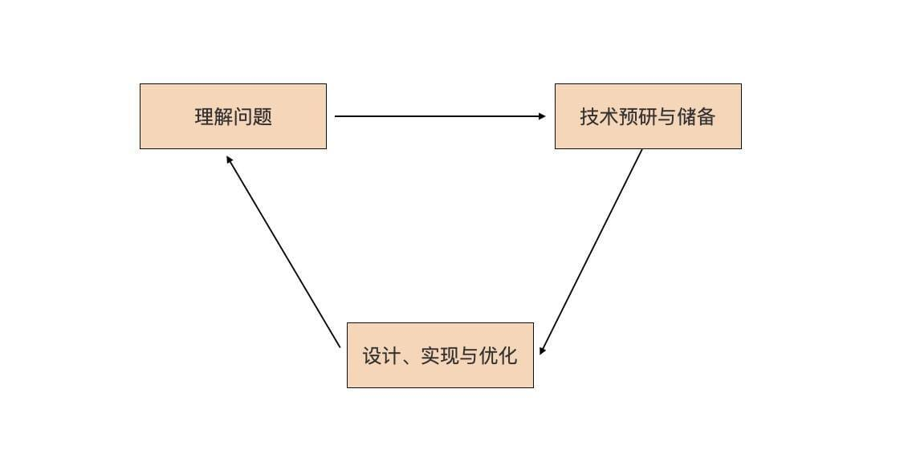

- 首先是要理解问题。==解决实际问题的过程起始于对问题的理解==。我们要搞清楚为什么会有这个问题，问题究竟是什么。对于技术人员来说，最终目的是识别出可能要用到的技术点。

- 然后我们要对识别出的技术点，做相应的==技术预研与储备==。怎么做技术预研呢？我们至少要了解**技术诞生的背景、技术的原理、技术能解决哪些问题以及不能解决哪些问题，还有技术的优点与不足**，等等。当然，如果没有新技术点，可以忽略这一步。

- 最后，我们要基于技术预研和储备的结果，进行解决方案的设计与实现，这个是技术人最擅长的。

> 那为什么这个解决实际问题的步骤是一个循环呢？
>
> 这是由问题的难易程度，以及人的认知能力有差别所决定的。如果问题简单或人的认知能力很强，我们可以一次性解决这个实际问题；如果问题复杂或人的认知能力稍弱，那么一个循环可能无法彻底解决这个问题，我们就会再一次进入该循环，直到问题得到完美解决。


### 36.1 什么是网络编程


通常来说，我们更多关注OSI网络模型中的传输层（四层）与应用层（七层），也就是TCP/IP网络模型中的最上面两层。

TCP/IP网络模型，实现了两种传输层协议：TCP和UDP。

- TCP是面向连接的流协议，为通信的两端提供稳定可靠的数据传输服务；
- 而UDP则提供了一种无需建立连接就可以发送数据包的方法。

两种协议各有擅长的应用场景。

日常开发中使用最多的是TCP协议。基于TCP协议，我们实现了各种各样的满足用户需求的应用层协议。比如，常用的HTTP协议就是应用层协议的一种，而且是使用得最广泛的一种。而基于HTTP的Web编程就是一种**针对应用层的网络编程**。还可以**基于传输层暴露给开发者的编程接口，实现应用层的自定义应用协议**。

目前各大主流操作系统平台中，最常用的传输层暴露给用户的**网络编程接口**，就是==套接字（socket）==。**直接基于socket编程实现应用层通信业务，也是最常见的一种网络编程形式。**

### 36.2 问题描述

> 实现一个基于TCP的**自定义**应用层协议的通信服务端。

基于TCP的自定义应用层协议通常有两种常见的定义模式：

- ==二进制模式==：采用长度字段标识独立数据包的边界。采用这种方式定义的常见协议包括**MQTT**（物联网最常用的应用层协议之一）、**SMPP**（短信网关点对点接口协议）等；
- ==文本模式==：采用特定分隔符标识流中的数据包的边界，常见的包括HTTP协议等。

相比之下，二进制模式要比文本模式编码更紧凑也更高效，所以我们这个问题中的自定义协议也采用了二进制模式，协议规范内容如下图：

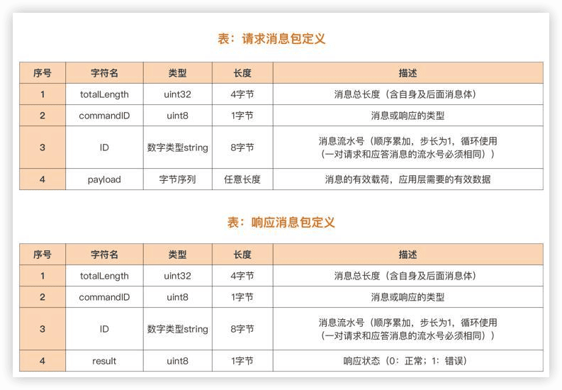

这个协议的通信两端的通信流程：


现在任务，就是实现支持这个协议通信的服务端。

- 首先，socket是传输层给用户提供的编程接口，要进行的网络通信绕不开socket  ->  【了解socket编程模型】
- 其次，一旦通过socket将双方的连接建立后，剩下的就是通过网络I/O操作在两端收发数据了  ->  【学习基本网络I/O操作的方法与注意事项】
- 最后，任何一端准备发送数据或收到数据后都要对数据进行操作，由于TCP是流协议  ->  【了解针对字节的操作】

在Go中，字节操作基本上就是byte切片的操作。

### 36.3 TCP Socket编程模型

TCP Socket诞生以来，它的**编程模型**，也就是**网络I/O模型**已几经演化。

网络I/O模型定义的是**应用线程与操作系统内核之间的交互行为模式**。通常用**阻塞（Blocking）**/**非阻塞（Non-Blocking）**来描述网络I/O模型。

常用的网络I/O模型:

- 阻塞I/O(Blocking I/O)


在**阻塞I/O模型**下，当用户空间应用线程，向操作系统内核发起I/O请求后（一般为操作系统提供的I/O系列系统调用），内核会尝试执行这个I/O操作，并等所有数据就绪后，将数据从内核空间拷贝到用户空间，最后系统调用从内核空间返回。而在这个期间内，用户空间应用线程将阻塞在这个I/O系统调用上，无法进行后续处理，只能等待。

因此，在这样的模型下，**一个线程仅能处理一个网络连接上的数据通信**。即便连接上没有数据，线程也只能阻塞在对Socket的读操作上（以等待对端的数据）。

虽然这个模型对应用整体来说是低效的，但对开发人员来说，这个模型却是最容易实现和使用的，所以，各大平台在默认情况下都将Socket设置为阻塞的。

- 非阻塞I/O（Non-Blocking I/O）

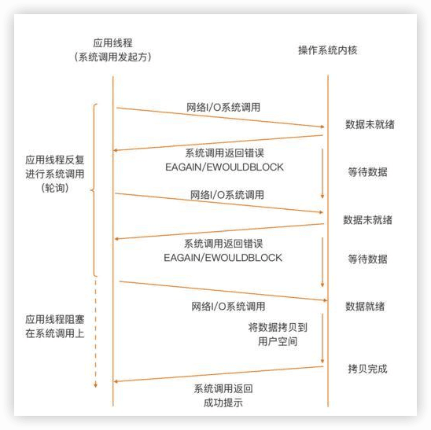

和阻塞I/O模型正相反，在**非阻塞模型**下，当用户空间线程向操作系统内核发起I/O请求后，内核会执行这个I/O操作，如果这个时候数据尚未就绪，就会立即将“未就绪”的状态以错误码形式（比如：EAGAIN/EWOULDBLOCK），返回给这次I/O系统调用的发起者。而后者就会根据系统调用的返回状态来决定下一步该怎么做。

在非阻塞模型下，位于用户空间的I/O请求发起者通常会通过==轮询==的方式，去一次次发起I/O请求，直到读到所需的数据为止。不过，这样的轮询是**对CPU计算资源的极大浪费**，因此，非阻塞I/O模型单独应用于实际生产的比例并不高。

- I/O多路复用（I/O Multiplexing）

为了避免非阻塞I/O模型轮询对计算资源的浪费，同时也考虑到阻塞I/O模型的低效，**开发人员首选的网络I/O模型**，逐渐变成了建立在内核提供的多路复用函数`select`/`poll`等（以及性能更好的`epoll`等函数）基础上的**I/O多路复用模型**。


在这种模型下，应用线程首先将需要进行I/O操作的Socket，都添加到多路复用函数中（这里以`select`为例），然后阻塞，等待select系统调用返回。

当内核发现有数据到达时，对应的Socket具备了通信条件，这时select函数返回。然后用户线程会针对这个Socket再次发起网络I/O请求，比如一个`read`操作。由于数据已就绪，这次网络I/O操作将得到预期的操作结果。


相比于阻塞模型一个线程只能处理一个Socket的低效，I/O多路复用模型中，一个应用线程可以同时处理多个Socket。同时，I/O多路复用模型由内核实现可读/可写事件的通知，避免了非阻塞模型中轮询，带来的CPU计算资源浪费的问题。

目前，主流网络服务器采用的都是“I/O多路复用”模型，有的也结合了多线程。不过，**I/O多路复用**模型在支持更多连接、提升I/O操作效率的同时，也给使用者带来了不小的复杂度，以至于后面出现了许多**高性能的I/O多路复用框架**，比如：[libevent](http://libevent.org/)、[libev](http://software.schmorp.de/pkg/libev.html)、[libuv](https://github.com/libuv/libuv)等，以帮助开发者简化开发复杂性，降低心智负担。

### 36.4 Go语言socket编程模型

阻塞I/O模型是对开发人员最友好的，也是心智负担最低的模型，而**I/O多路复用**的这种**通过回调割裂执行流**的模型，对开发人员来说还是过于复杂了，于是Go选择了为开发人员提供**阻塞I/O模型**，Gopher只需在Goroutine中以最简单、最易用的**“阻塞I/O模型”**的方式，进行Socket操作就可以了。

再加上，Go没有使用基于线程的并发模型，而是使用了开销更小的Goroutine作为基本执行单元，这让每个Goroutine处理一个TCP连接成为可能，并且在高并发下依旧表现出色。

不过，网络I/O操作都是系统调用，Goroutine执行I/O操作的话，一旦阻塞在系统调用上，就会导致M也被阻塞，为了解决这个问题，Go设计者将这个“复杂性”隐藏在Go运行时中，他们在运行时中实现了==网络轮询器（netpoller)==，netpoller的作用，就是只阻塞执行网络I/O操作的Goroutine，但不阻塞执行Goroutine的线程（也就是M）。

这样一来，对于Go程序的用户层（相对于Go运行时层）来说，它眼中看到的goroutine采用了“阻塞I/O模型”进行网络I/O操作，Socket都是“阻塞”的。

但实际上，这样的“假象”，是通过Go运行时中的netpoller **I/O多路复用机制**，“模拟”出来的，对应的、真实的底层操作系统Socket，实际上是非阻塞的。只是运行时拦截了针对底层Socket的系统调用返回的错误码，并通过**netpoller**和Goroutine调度，让Goroutine“阻塞”在用户层所看到的Socket描述符上。

比如：当用户层针对某个Socket描述符发起`read`操作时，如果这个Socket对应的连接上还没有数据，运行时就会将这个Socket描述符加入到netpoller中监听，同时发起此次读操作的Goroutine会被挂起。

直到Go运行时收到这个Socket数据可读的通知，Go运行时才会重新唤醒等待在这个Socket上准备读数据的那个Goroutine。而这个过程，从Goroutine的视角来看，就像是read操作一直阻塞在那个Socket描述符上一样。

而且，Go语言在网络轮询器（netpoller）中采用了I/O多路复用的模型。考虑到最常见的多路复用系统调用select有比较多的限制，比如：**监听Socket的数量有上限（1024）、时间复杂度高，**等等，Go运行时选择了在不同操作系统上，使用操作系统各自实现的高性能多路复用函数，比如：Linux上的`epoll`、Windows上的`iocp`、FreeBSD/MacOS上的`kqueue`、Solaris上的`event port`等，这样可以最大程度提高netpoller的调度和执行性能。


### 36.5 socket监听（listen）与接收连接（accept）

**socket编程的核心在于服务端**，而服务端有着自己一套相对固定的套路：==Listen+Accept==。在这套固定套路的基础上，服务端程序通常采用一个Goroutine处理一个连接，它的大致结构如下：

```go
func handleConn(c net.Conn) {
     defer c.Close()
     for {
         // read from the connection
         // ... ...
         // write to the connection
         //... ...
     }
 }
 
 func main() {
     l, err := net.Listen("tcp", ":8888")
     if err != nil {
         fmt.Println("listen error:", err)
         return
     }
 
     for {
         c, err := l.Accept()
         if err != nil {
             fmt.Println("accept error:", err)
             break
         }
         // start a new goroutine to handle
         // the new connection.
         go handleConn(c)
     }
 }
```

在第12行使用了net包的Listen函数绑定（bind）服务器端口8888，并将它转换为监听状态，Listen返回成功后，这个服务会进入一个循环，并调用net.Listener的Accept方法接收新客户端连接。

在没有新连接的时候，这个服务会阻塞在Accept调用上，直到有客户端连接上来，Accept方法将返回一个net.Conn实例。通过这个`net.Conn`，我们可以和新连上的客户端进行通信。这个服务程序启动了一个新Goroutine，并将net.Conn传给这个Goroutine，这样这个Goroutine就专职负责处理与这个客户端的通信了。

而net.Listen函数很少报错，除非是监听的端口已经被占用。

```sh
netstat -an | grep 8888 
```


### 36.6 向服务端建立TCP连接

一旦服务端按照上面的`Listen + Accept`结构成功启动，客户端便可以使用`net.Dial`或`net.DialTimeout`向服务端发起连接建立的请求：

> ==Dial==**是一个源自传统通信术语的隐喻，意指**主动发起网络连接的行为，类似于电话拨号（Dial）的动作。这一术语在编程中广泛用于表示客户端主动向服务端建立通信通道的过程。

```go
conn, err := net.Dial("tcp", "localhost:8888")
conn, err := net.DialTimeout("tcp", "localhost:8888", 2 * time.Second)
```

Dial函数向服务端发起TCP连接，这个函数会一直阻塞，直到连接成功或失败后，才会返回。而DialTimeout带有超时机制，如果连接耗时大于超时时间，这个函数会返回超时错误。 对于客户端来说，连接的建立还可能会遇到几种特殊情形。

- 第一种情况：网络不可达或对方服务未启动。

如果传给`Dial`的服务端地址是网络不可达的，或者服务地址中端口对应的服务并没有启动，端口未被监听（Listen），`Dial`几乎会立即返回类似这样的错误：

```go
dial error: dial tcp :8888: getsockopt: connection refused
```

- 第二种情况：对方服务的listen backlog队列满。

当对方服务器很忙，瞬间有大量客户端尝试向服务端建立连接时，服务端可能会出现listen backlog队列满，接收连接（accept）不及时的情况，这就会导致客户端的`Dial`调用阻塞，直到服务端进行一次accept，从backlog队列中腾出一个槽位，客户端的Dial才会返回成功。

而且，不同操作系统下backlog队列的长度是不同的，在macOS下，这个默认值如下：

```sh
$ sysctl -a | grep kern.ipc.somaxconn
kern.ipc.somaxconn: 128
```

🔖

- 第三种情况：若网络延迟较大，Dial将阻塞并超时。

如果网络延迟较大，TCP连接的建立过程（三次握手）将更加艰难坎坷，会经历各种丢包，时间消耗自然也会更长，这种情况下，`Dial`函数会阻塞。如果经过长时间阻塞后依旧无法建立连接，那么`Dial`也会返回类似`getsockopt: operation timed out`的错误。

在连接建立阶段，多数情况下`Dial`是可以满足需求的，即便是阻塞一小会儿也没事。但对于那些需要有严格的连接时间限定的Go应用，如果一定时间内没能成功建立连接，程序可能会需要执行一段“错误”处理逻辑，所以，这种情况下，我们使用`DialTimeout`函数更适合。

### 36.7 全双工通信

一旦客户端调用Dial成功，就在客户端与服务端之间建立起了一条全双工的通信通道。通信双方通过各自获得的Socket，可以在向对方发送数据包的同时，接收来自对方的数据包。下图展示了系统层面对这条全双工通信通道的实现原理：

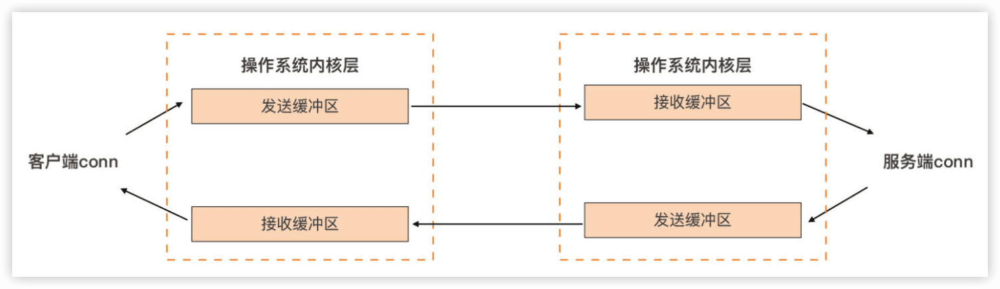

任何一方的操作系统，都会为已建立的连接分配一个**发送缓冲区**和一个**接收缓冲区**。

以客户端为例，客户端会通过成功连接服务端后得到的conn（封装了底层的socket）向服务端发送数据包。这些数据包会先进入到己方的发送缓冲区中，之后，这些数据会被操作系统内核通过网络设备和链路，发到服务端的接收缓冲区中，服务端程序再通过代表客户端连接的conn读取服务端接收缓冲区中的数据，并处理。

反之，服务端发向客户端的数据包也是先后经过服务端的发送缓冲区、客户端的接收缓冲区，最终到达客户端的应用的。

### 36.8 Socket读操作

连接建立起来后，就要在连接上进行读写以完成业务逻辑。

Go运行时隐藏了**I/O多路复用**的复杂性。Go语言使用者只需采用**Goroutine+阻塞I/O模型**，就可以满足大部分场景需求。Dial连接成功后，会返回一个net.Conn接口类型的变量值，这个接口变量的底层类型为一个`*TCPConn`：

```go
//$GOROOT/src/net/tcpsock.go
type TCPConn struct {
    conn
}
```

TCPConn内嵌了一个非导出类型：`conn`（封装了底层的socket），因此，TCPConn“继承”了`conn`类型的`Read`和`Write`方法，后续通过`Dial`函数返回值调用的`Read`和`Write`方法都是net.conn的方法，它们分别代表了对socket的读和写。

通过几个场景来总结Go中从socket读取数据的行为特点：

- 首先是Socket中无数据的场景。

  连接建立后，如果客户端未发送数据，服务端会阻塞在Socket的读操作上，这和前面提到的“阻塞I/O模型”的行为模式是一致的。执行该这个操作的Goroutine也会被挂起。Go运行时会监视这个Socket，直到它有数据读事件，才会重新调度这个Socket对应的Goroutine完成读操作。

- 第二种情况是Socket中有部分数据。

  如果Socket中有部分数据就绪，且数据数量小于一次读操作期望读出的数据长度，那么读操作将会成功读出这部分数据，并返回，而不是等待期望长度数据全部读取后，再返回。

  举个例子，服务端创建一个长度为10的切片作为接收数据的缓冲区，等待Read操作将读取的数据放入切片。当客户端在已经建立成功的连接上，成功写入两个字节的数据（比如：hi）后，服务端的Read方法将成功读取数据，并返回`n=2，err=nil`，而不是等收满10个字节后才返回。

- 第三种情况是Socket中有足够数据。

  如果连接上有数据，且数据长度大于等于一次`Read`操作期望读出的数据长度，那么`Read`将会成功读出这部分数据，并返回。这个情景是最符合我们对`Read`的期待的了。

  以上面的例子为例，当客户端在已经建立成功的连接上，成功写入15个字节的数据后，服务端进行第一次`Read`时，会用连接上的数据将我们传入的切片缓冲区（长度为10）填满后返回：`n = 10, err = nil`。这个时候，内核缓冲区中还剩5个字节数据，当服务端再次调用`Read`方法时，就会把剩余数据全部读出。

- 最后一种情况是设置读操作超时。

有些场合，对socket的读操作的阻塞时间有严格限制的，但由于Go使用的是阻塞I/O模型，如果没有可读数据，Read操作会一直阻塞在对Socket的读操作上。

这时，可以通过net.Conn提供的SetReadDeadline方法，设置读操作的超时时间，当超时后仍然没有数据可读的情况下，Read操作会解除阻塞并返回超时错误，这就给Read方法的调用者提供了进行其他业务处理逻辑的机会。

SetReadDeadline方法接受一个绝对时间作为超时的deadline。一旦通过这个方法设置了某个socket的Read deadline，当发生超时后，如果我们不重新设置Deadline，那么后面与这个socket有关的所有读操作，都会返回超时失败错误。

结合SetReadDeadline设置的服务端一般处理逻辑：

```go
func handleConn(c net.Conn) {
    defer c.Close()
    for {
        // read from the connection
        var buf = make([]byte, 128)
        c.SetReadDeadline(time.Now().Add(time.Second))
        n, err := c.Read(buf)
        if err != nil {
            log.Printf("conn read %d bytes,  error: %s", n, err)
            if nerr, ok := err.(net.Error); ok && nerr.Timeout() {
                // 进行其他业务逻辑的处理
                continue
            }
            return
        }
        log.Printf("read %d bytes, content is %s\n", n, string(buf[:n]))
    }
}
```

使用SetReadDeadline（time.Time{}）实现取消超时设置。


### 36.9 Socket写操作

通过net.Conn实例的Write方法，可以将数据写入Socket。当Write调用的返回值n的值，与预期要写入的数据长度相等，且err = nil时，就执行了一次成功的Socket写操作，这是在调用Write时遇到的最常见的情形。

和Socket的读操作一些特殊情形相比，Socket写操作遇到的特殊情形同样不少：

#### 第一种情况：写阻塞

TCP协议通信两方的操作系统内核，都会为这个连接保留数据缓冲区，调用Write向Socket写入数据，实际上是将数据写入到操作系统协议栈的数据缓冲区中。TCP是全双工通信，因此每个方向都有独立的数据缓冲。当发送方将对方的接收缓冲区，以及自身的发送缓冲区都写满后，再调用Write方法就会出现阻塞的情况。

例子，客户端：

```go
func main() {
    log.Println("begin dial...")
    conn, err := net.Dial("tcp", ":8888")
    if err != nil {
        log.Println("dial error:", err)
        return
    }
    defer conn.Close()
    log.Println("dial ok")

    data := make([]byte, 65536)
    var total int
    for {
        n, err := conn.Write(data)
        if err != nil {
            total += n
            log.Printf("write %d bytes, error:%s\n", n, err)
            break
        }
        total += n
        log.Printf("write %d bytes this time, %d bytes in total\n", n, total)
    }

    log.Printf("write %d bytes in total\n", total)
}
```

客户端每次调用Write方法向服务端写入65536个字节，并在Write方法返回后，输出此次Write的写入字节数和程序启动后写入的总字节数量。

服务端的处理程序逻辑摘录：

```go
... ...
func handleConn(c net.Conn) {
    defer c.Close()
    time.Sleep(time.Second * 10)
    for {
        // read from the connection
        time.Sleep(5 * time.Second)
        var buf = make([]byte, 60000)
        log.Println("start to read from conn")
        n, err := c.Read(buf)
        if err != nil {
            log.Printf("conn read %d bytes,  error: %s", n, err)
            if nerr, ok := err.(net.Error); ok && nerr.Timeout() {
                continue
            }
        }

        log.Printf("read %d bytes, content is %s\n", n, string(buf[:n]))
    }
}
... ...
```

务端在前10秒中并不读取数据，因此当客户端一直调用Write方法写入数据时，写到一定量后就会发生阻塞。

🔖

后续当服务端每隔5秒进行一次读操作后，内核socket缓冲区腾出了空间，客户端就又可以写入了:


#### 第二种情况：写入部分数据


#### 第三种情况：写入超时


### 36.10 并发Socket读写


### 36.11 Socket关闭

通常情况下，当客户端需要断开与服务端的连接时，客户端会调用net.Conn的Close方法关闭与服务端通信的Socket。

如果客户端主动关闭了Socket，那么服务端的`Read`调用将会读到什么呢？

分“有数据关闭”和“无数据关闭”两种情况。

- “==有数据关闭==”是指在客户端关闭连接（Socket）时，Socket中还有服务端尚未读取的数据。在这种情况下，服务端的Read会成功将剩余数据读取出来，最后一次Read操作将得到`io.EOF`错误码，表示客户端已经断开了连接。
- 如果是在“==无数据关闭==”情形下，服务端调用的Read方法将直接返回`io.EOF`。

不过因为Socket是全双工的，客户端关闭Socket后，如果服务端Socket尚未关闭，这个时候服务端向Socket的写入操作依然可能会成功，因为数据会成功写入己方的内核socket缓冲区中，即便最终发不到对方socket缓冲区也会这样。因此，当发现对方socket关闭后，己方应该正确合理处理自己的socket，再继续write已经没有任何意义了。


## 37 代码操练：怎么实现一个TCP服务器？（中）

### 37.1 建立对协议的抽象

程序是对现实世界的抽象。对于现实世界的自定义应用协议规范，我们需要在程序世界建立起对这份**协议的抽象**。

#### 深入协议字段

一个高度简化的、基于二进制模式定义的协议。

二进制模式定义的特点，就是采用长度字段标识独立数据包的边界。

在这个协议规范中：

请求包和应答包的第一个字段（totalLength）都是包的总长度，它就是用来标识包边界的那个字段，也是在应用层用于“分割包”的最重要字段。

请求包与应答包的第二个字段也一样，都是commandID，这个字段用于标识包类型

- 连接请求包（值为0x01）
- 消息请求包（值为0x02）
- 连接响应包（值为0x81）
- 消息响应包（值为0x82）

```go
const (
    CommandConn   = iota + 0x01 // 0x01，连接请求包
    CommandSubmit               // 0x02，消息请求包
)

const (
    CommandConnAck   = iota + 0x81 // 0x81，连接请求的响应包
    CommandSubmitAck               // 0x82，消息请求的响应包
)
```

请求包与应答包的第三个字段都是ID，ID是每个连接上请求包的消息流水号，顺序累加，步长为1，循环使用，多用来请求发送方后匹配响应包，所以要求一对请求与响应消息的流水号必须相同。

请求包与响应包唯一的不同之处，就在于最后一个字段：请求包定义了有效载荷（payload），这个字段承载了应用层需要的业务数据；而响应包则定义了请求包的响应状态字段（result），这里其实简化了响应状态字段的取值，成功的响应用0表示，如果是失败的响应，无论失败原因是什么，我们都用1来表示。

明确了应用层协议的各个字段定义之后，我们接下来就看看如何建立起对这个协议的抽象。

#### 建立Frame和Packet抽象

TCP连接上的数据是一个没有边界的字节流，但在业务层眼中，没有字节流，只有各种协议消息。因此，无论是从客户端到服务端，还是从服务端到客户端，业务层在连接上看到的都应该是一个挨着一个的协议消息流。

建立第一个抽象：**Frame**。每个Frame表示一个协议消息，这样在业务层眼中，连接上的字节流就是由一个接着一个Frame组成的，如下图所示：

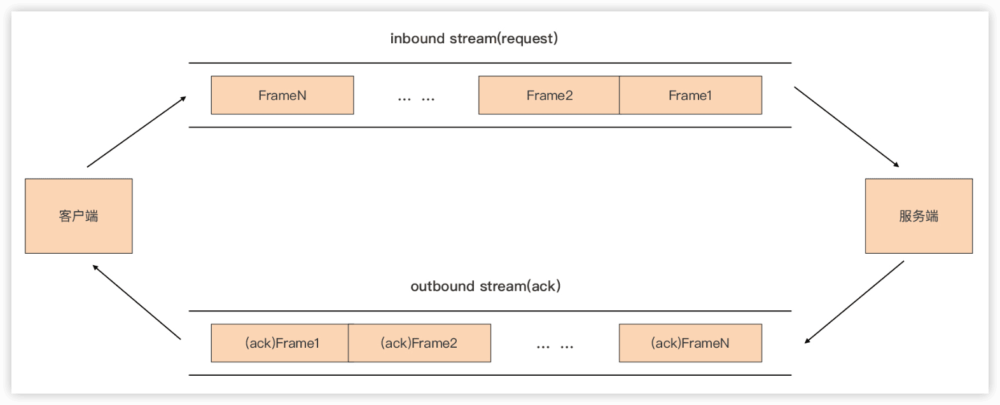

自定义协议就封装在这一个个的Frame中。协议规定了将Frame分割开来的方法，那就是利用每个Frame开始处的totalLength，每个Frame由一个totalLength和Frame的负载（payload）构成。


这样通过Frame header: totalLength就可以将Frame之间隔离开来。

建立协议的第二个抽象：**Packet**。将Frame payload定义为一个Packet。上图右侧展示的就是Packet的结构。

Packet就是业务层真正需要的消息，每个Packet由Packet头和Packet Body部分组成。Packet头就是commandID，用于标识这个消息的类型；而ID和payload（packet payload）或result字段组成了Packet的Body部分，对业务层有价值的数据都包含在Packet Body部分。


### 37.2 协议的解包与打包

所谓协议的**解包（decode）**，就是指识别TCP连接上的字节流，将一组字节“转换”成一个特定类型的协议消息结构，然后这个消息结构会被业务处理逻辑使用。

而**打包（encode）**刚刚好相反，是指将一个特定类型的消息结构转换为一组字节，然后这组字节数据会被放在连接上发送出去。

具体到我们这个自定义协议上，解包就是指`字节流 -> Frame`，打包是指`Frame -> 字节流`。针对这个协议的服务端解包与打包的流程图：


TCP流数据先后经过frame decode和packet decode，得到应用层所需的packet数据，而业务层回复的响应，则先后经过packet的encode与frame的encode，写入TCP数据流中。

#### Frame的实现

协议部分最重要的两个抽象是Frame和Packet，建立frame包与packet包。

frame包的职责是提供识别TCP流边界的编解码器，可以很容易为这样的编解码器，定义出一个统一的接口类型StreamFrameCodec：

```go
// tcp-server-demo1/frame/frame.go

type FramePayload []byte

type StreamFrameCodec interface {
    Encode(io.Writer, FramePayload) error   // data -> frame，并写入io.Writer
    Decode(io.Reader) (FramePayload, error) // 从io.Reader中提取frame payload，并返回给上层
}
```


#### Packet的实现

和Frame不同，Packet有多种类型（这里只定义了Conn、submit、connack、submit ack)。

抽象这些类型需要遵循的共同接口：

```go
// tcp-server-demo1/packet/packet.go

type Packet interface {
    Decode([]byte) error     // []byte -> struct
    Encode() ([]byte, error) //  struct -> []byte
}
```

其中，Decode是将一段字节流数据解码为一个Packet类型，可能是conn，可能是submit等，具体要根据解码出来的commandID判断。

而Encode则是将一个Packet类型编码为一段字节流数据。

🔖

### 37.3 服务端的组装


### 37.4 验证测试


## 38 成果优化：怎么实现一个TCP服务器？（下）

### 38.1 Go程序优化的基本套路

Go程序的优化，也有着固定的套路可循:


- 首先我们要建立性能基准。要想对程序实施优化，我们首先要有一个初始“参照物”，这样我们才能在执行优化措施后，检验优化措施是否有效，所以这是优化循环的第一步。
- 第二步是性能剖析。要想优化程序，我们首先要找到可能影响程序性能的“瓶颈点”，这一步的任务，就是通过各种工具和方法找到这些“瓶颈点”。
- 第三步是代码优化。我们要针对上一步找到的“瓶颈点”进行分析，找出它们成为瓶颈的原因，并有针对性地实施优化。
- 第四步是与基准比较，确定优化效果。这一步，我们会采集优化后的程序的性能数据，与第一步的性能基准进行比较，看执行上述的优化措施后，是否提升了程序的性能。

### 38.2 建立性能基准

建立性能基准的方式大概有两种，

- 一种是通过**编写Go原生提供的性能基准测试（benchmark test）用例**来实现，这相当于对程序的局部热点建立性能基准，常用于一些算法或数据结构的实现，比如分布式全局唯一ID生成算法、树的插入/查找等。

- 另外一种是**基于度量指标为程序建立起图形化的性能基准**，这种方式适合针对程序的整体建立性能基准。而我们的自定义协议服务端程序就十分适合用这种方式，接下来我们就来看一下基于度量指标建立基准的一种可行方案。

#### 建立观测设施

这些年，基于**Web的可视化工具、开源监控系统以及时序数据库**的兴起，给我们建立性能基准带来了很大的便利，业界有比较多成熟的工具组合可以直接使用。但业界最常用的还是**Prometheus+Grafana**的组合。

以Docker为代表的轻量级容器（container）的兴起，让这些工具的部署、安装都变得十分简单。使用docker-compose工具，基于容器安装Prometheus+Grafana的组合。

🔖

#### 配置Grafana


#### 在服务端埋入度量数据采集点

哪些度量数据能反映出服务端的性能指标呢？

- 当前已连接的客户端数量（client_connected）；
- 每秒接收消息请求的数量（req_recv_rate）；
- 每秒发送消息响应的数量（rsp_send_rate）。


#### 第一版性能基准


### 38.3 尝试用pprof剖析

Go内置了对Go代码进行性能剖析的工具：**pprof**。


### 38.4 代码优化

#### 带缓存的网络I/O


#### 重用内存对象


# 泛型篇


## 39 Go泛型诞生过程

[Go 1.18 Beta2版本](https://go.dev/blog/go1.18beta2)

### 39.1 为什么要加入泛型？

[维基百科-泛型编程](https://en.wikipedia.org/wiki/Generic_programming)，最初泛型编程概念的文章中给了解释：“**泛型编程的中心思想是对具体的、高效的算法进行抽象，以获得通用的算法，然后这些算法可以与不同的数据表示法结合起来，产生各种各样有用的软件**”。

将**算法与类型解耦**


在没有泛型的情况下，需要针对不同类型重复实现相同的算法逻辑。

对于简单的、诸如上面这样的加法函数还可忍受，但对于复杂的算法，比如涉及复杂排序、查找、树、图等算法，以及一些容器类型（链表、栈、队列等）的实现时，缺少了泛型的支持还真是麻烦。

在没有泛型之前，Gopher们通常使用空接口类型`interface{}`，作为算法操作的对象的数据类型，不过这样做的不足之处也很明显：**一是无法进行类型安全检查，二是性能有损失**。

既然泛型有这么多优点，为什么Go不早点加入泛型呢？

- 这个语法特性不紧迫，不是Go早期的设计目标；
- 简单的设计哲学有悖；
- 尚未找到合适的、价值足以抵消其引入的复杂性的理想设计方案。

### 39.2 Go泛型设计的简史

[“泛型窘境”](https://research.swtch.com/generic) 2019 Russ Cox提出了Go泛型实现的三个可遵循的方法，以及每种方法的不足，也就是三个slow（拖慢）：

- **拖慢程序员**：不实现泛型，不会引入复杂性，但就像前面例子中那样，需要程序员花费精力重复实现AddInt、AddInt64等；
- **拖慢编译器**：就像C++的泛型实现方案那样，通过增加编译器负担为每个类型实例生成一份单独的泛型函数的实现，这种方案产生了大量的代码，其中大部分是多余的，有时候还需要一个好的链接器来消除重复的拷贝；
- **拖慢执行性能**：就像Java的泛型实现方案那样，通过隐式的装箱和拆箱操作消除类型差异，虽然节省了空间，但代码执行效率低。

在当时，三个slow之间需要取舍，就如同数据一致性的CAP原则一样，无法将三个slow同时消除。

[“Why Generics?”](https://go.dev/blog/why-generics)

[《Featherweight Go》](https://arxiv.org/abs/2005.11710)

[《The Next Step for Generics》](https://go.dev/blog/generics-next-step)

经过很多次不同方案

...

最后，在2021年12月14日，[Go 1.18 beta1版本发布](https://go.dev/blog/go1.18beta1)，这个版本包含了对Go泛型的正式支持。

### 39.3 Go泛型的基本语法

Go泛型是Go开源以来在语法层面的最大一次变动。

[Go泛型的最后一版技术提案](https://go.googlesource.com/proposal/+/refs/heads/master/design/43651-type-parameters.md)

Go泛型的核心是类型参数（type parameter）。

#### 1️⃣ 类型参数（type parameter）

==类型参数==是在函数声明、方法声明的receiver部分或类型定义的类型参数列表中，声明的（非限定）类型名称。类型参数在声明中充当了一个**未知类型的占位符（placeholder）**，在泛型函数或泛型类型实例化时，类型参数会被一个类型实参替换。

普通函数的参数列表：

```go
func Foo(x, y aType, z anotherType)
```

这里，x, y, z是形参（parameter）的名字，也就是变量，而aType，anotherType是形参的类型，也就是类型。

泛型函数的类型参数（type parameter）列表：

```go
func GenericFoo[P aConstraint, Q anotherConstraint](x,y P, z Q)
```

这里，P、Q是类型形参的名字，也就是类型。`aConstraint`，`anotherConstraint`代表类型参数的==约束（constraint）==，可以理解为对类型参数可选值的一种限定。

相较而言多出一个组成部分：==类型参数列表==。

类型参数列表位于函数名与函数参数列表之间，通过一个**==方括号==**括起，不支持变长类型参数。而且，类型参数列表中声明的类型参数，可以作为函数普通参数列表中的形参类型。

P、Q的类型什么时候才能确定呢？等到泛型函数**具化（instantiation）**时才能确定。另外，按惯例，类型参数（type parameter）的名字都是首字母大写的，通常都是用单个大写字母命名。

#### 2️⃣ 约束（constraint）

约束（constraint）规定了一个类型实参（type argument）必须满足的条件要求。如果某个类型满足了某个约束规定的所有条件要求，那么它就是这个约束修饰的类型形参的一个合法的类型实参。

```go
type C1 interface {
	~int | ~int32
	M1()
}

type T struct{}

func (T) M1() {
}

type T1 int

func (T1) M1() {
}

func foo[P C1](t P) {

}

func main() {
	var t1 T1
	foo(t1)
	var t T
	foo(t) // 编译器报错： Cannot use T as the type C1. Type does not implement constraint 'C1' because type is not included in type set ('~int', '~int32')
}
```

C1是定义的约束，它声明了一个方法M1，以及两个可用作类型实参的类型(~int | ~int32)，类型列表中的多个类型实参类型用“|”分隔。

还定义了两个自定义类型T和T1，两个类型都实现了M1方法，但T类型的底层类型为struct{}，而T1类型的底层类型为int，这样就导致了虽然T类型满足了约束C1的方法集合，但类型T因为底层类型并不是int或int32而不满足约束C1，这也就会导致`foo(t)`调用在编译阶段报错。

建议：**做约束的接口类型与做传统接口的接口类型最好要分开定义**，除非约束类型真的既需要方法集合，也需要类型列表。

> `~int | ~int32` 是接口的类型集合。`~`符号表示"基础类型为"，`|`表示"或"，即可以是其中任意一种类型，合起来表示：接受所有基础类型是int或int32的类型。
>
> 这种带类型集合的接口是Go 1.18引入泛型时新增的特性，专门用于对泛型类型参数进行更精确的约束。
>
> 类型集合的作用：
>
> - 限制了哪些具体类型可以用作泛型类型参数
> - 在编译时检查类型是否符合约束
> - 与普通方法要求一起构成完整的接口约束

#### 3️⃣ 类型具化（instantiation）

```go
func Sort[Elem interface{ Less(y Elem) bool }](list []Elem) {
}

type book struct {
}

func (x book) Less(y book) bool {
	return true
}

func main() {
	var bookshelf []book
	Sort[book](bookshelf) // 泛型函数调用
}
```

上面的泛型函数调用`Sort[book](bookhelf)`会分成两个阶段：

第一个阶段就是==具化（instantiation）==。

形象点说，**具化（instantiation）就好比一家生产“排序机器”的工厂根据要排序的对象的类型，将这样的机器生产出来的过程**。整个具化过程如下：

1. 工厂接单：**Sort[book]**，发现要排序的对象类型为book；
2. 模具检查与匹配：检查book类型是否满足模具的约束要求（也就是是否实现了约束定义中的Less方法）。如果满足，就将其作为类型实参替换Sort函数中的类型形参，结果为**Sort[book]**，如果不满足，编译器就会报错；
3. 生产机器：将泛型函数Sort具化为一个**新函数**，这里我们把它起名为**booksort**，其函数原型为**func([]book)**。本质上**booksort := Sort[book]**。

第二阶段是==调用（invocation）==。

一旦“排序机器”被生产出来，那么它就可以对目标对象进行排序了，这和普通的函数调用没有区别。这里就相当于调用booksort（bookshelf），整个过程只需要检查传入的函数实参（bookshelf）的类型与booksort函数原型中的形参类型（[]book）是否匹配就可以了。

伪代码来表述上面两个过程：

```plain
Sort[book](bookshelf)

<=>

具化：booksort := Sort[book]
调用：booksort(bookshelf)
```

简化，调用Sort不需要传入类型实参book，和普通函数调用那样，Go编译器会根据传入的实参变量，进行实参类型参数的自动推导（Argument type inference）：

```go
Sort(bookshelf)
```

#### 4️⃣ 泛型类型

除了函数可以携带类型参数变身为“泛型函数”外，类型也可以拥有类型参数而化身为“泛型类型”，如定义一个向量泛型类型：

```go
type Vector[T any] []T
```

这是一个带有类型参数的类型定义，类型参数位于类型名的后面，同样用方括号括起。在类型定义体中可以引用类型参数列表中的参数名（比如T）。类型参数同样拥有自己的约束，如上面代码中的**any**。在Go 1.18中，`any`是interface{}的别名，也是一个预定义标识符，使用any作为类型参数的约束，代表没有任何约束。

使用泛型类型，我们也要遵循先具化，再使用的顺序，比如下面例子：

```go
type Vector[T any] []T

func (v Vector[T]) Dump() {
    fmt.Printf("%#v\n", v)
}

func main() {
    var iv = Vector[int]{1,2,3,4}
    var sv Vector[string]
    sv = []string{"a","b", "c", "d"}
    iv.Dump()
    sv.Dump()
}
```

在这段代码中，在使用Vector[T]之前都显式用类型实参对泛型类型进行了具化，从而得到具化后的类型Vector[int]和Vector[string]。 Vector[int]的底层类型为[]int，Vector[string]的底层类型为[]string。然后我们再对具化后的类型进行操作。


### 39.4 Go泛型的性能


### 39.5 Go泛型的使用建议

Go核心团队最担心的就是“泛型被滥用”，所以Go核心团队在各种演讲场合都在努力地告诉大家Go泛型的适用场景以及应该如何使用。

#### 什么情况适合使用泛型

首先，类型参数的一种有用的情况，就是**当编写的函数的操作元素的类型为slice、map、channel等特定类型的时候**。如果一个函数接受这些类型的形参，并且函数代码没有对参数的元素类型作出任何假设，那么使用类型参数可能会非常有用。在这种场合下，泛型方案可以替代反射方案，获得更高的性能。

另一个适合使用类型参数的情况是**编写通用数据结构**。所谓的通用数据结构，指的是像切片或map这样，但Go语言又没有提供原生支持的类型。比如一个链表或一个二叉树。

今天，需要这类数据结构的程序会使用特定的元素类型实现它们，或者是使用接口类型（interface{}）来实现。不过，如果我们使用类型参数替换特定元素类型，可以实现一个更通用的数据结构，这个通用的数据结构可以被其他程序复用。而且，用类型参数替换接口类型通常也会让数据存储的更为高效。

另外，在一些场合，使用类型参数替代接口类型，意味着代码可以避免进行类型断言（type assertion），并且在编译阶段还可以进行全面的类型静态检查。

#### 什么情况不宜使用泛型

首先，如果你要对某一类型的值进行的全部操作，仅仅是在那个值上调用一个方法，请使用interface类型，而不是类型参数。比如，io.Reader易读且高效，没有必要像下面代码中这样使用一个类型参数像调用Read方法那样去从一个值中读取数据：

```go
func ReadAll[reader io.Reader](r reader) ([]byte, error)  // 错误的作法
func ReadAll(r io.Reader) ([]byte, error)                 // 正确的作法
```

使用类型参数的原因是它们让你的代码更清晰，**如果它们会让你的代码变得更复杂，就不要使用**。

第二，当不同的类型使用一个共同的方法时，如果一个方法的实现对于所有类型都相同，就使用类型参数；相反，如果每种类型的实现各不相同，请使用不同的方法，不要使用类型参数。

最后，如果你发现自己多次编写完全相同的代码（样板代码），各个版本之间唯一的差别是代码使用不同的类型，那就请你


## 40 类型参数

Go的泛型与其他主流编程语言的泛型不同点（[不支持的若干特性](https://github.com/golang/proposal/blob/master/design/43651-type-parameters.md#omissions)）：

- **不支持泛型特化（specialization）**，即不支持编写一个泛型函数针对某个具体类型的特殊版本；
- **不支持元编程（metaprogramming）**，即不支持编写在编译时执行的代码来生成在运行时执行的代码；
- **不支持操作符方法（operator method）**，即只能用普通的方法（method）操作类型实例（比如：getIndex(k)），而不能将操作符视为方法并自定义其实现，比如一个容器类型的下标访问c[k]；
- **不支持变长的类型参数（type parameters）**；
- …

### 40.1 例子：返回切片中值最大的元素

```go
import "fmt"

func maxAny(sl []any) any {
	if len(sl) == 0 {
		panic("slice is empty")
	}

	max := sl[0]
	for _, v := range sl[1:] {
		switch v.(type) {
		case int:
			if v.(int) > max.(int) {
				max = v
			}
		case string:
			if v.(string) > max.(string) {
				max = v
			}
		case float64:
			if v.(float64) > max.(float64) {
				max = v
			}
		}
	}
	return max
}

func main() {
	i := maxAny([]any{1, 2, -4, -6, 7, 0})
	m := i.(int)
	fmt.Println(m)                                                 // 输出：7
	fmt.Println(maxAny([]any{"11", "22", "44", "66", "77", "10"})) // 输出：77
	fmt.Println(maxAny([]any{1.01, 2.02, 3.03, 5.05, 7.07, 0.01})) // 输出：7.07
}
```

```go
// max_test.go
func BenchmarkMaxInt(b *testing.B) {
    sl := []int{1, 2, 3, 4, 7, 8, 9, 0}
    for i := 0; i < b.N; i++ {
        maxInt(sl)
    }
}

func BenchmarkMaxAny(b *testing.B) {
    sl := []any{1, 2, 3, 4, 7, 8, 9, 0}
    for i := 0; i < b.N; i++ {
        maxAny(sl)
    }
}
```

```shell
$ go test -v -bench . ./max_test.go max_any.go max_int.go
goos: darwin
goarch: arm64
BenchmarkMaxInt
BenchmarkMaxInt-8       325038272                3.453 ns/op
BenchmarkMaxAny
BenchmarkMaxAny-8       100000000               10.66 ns/op
PASS
ok      command-line-arguments  2.960s

```

看到，基于any(interface{})实现的maxAny其执行性能要比像maxInt这样的函数慢上数倍。


```go
// max_generics.go
type ordered interface {
	~int | ~int32 | ~int16 | ~int64 | ~int8 |
		~float32 | ~float64 |
		~string |
		~uint | ~uint8 | ~uint16 | ~uint32 | ~uint64 | ~uintptr
}

func maxGenerics[T ordered](sl []T) T {
	if len(sl) == 0 {
		panic("slice is empty")
	}

	max := sl[0]
	for _, v := range sl {
		if v > max {
			max = v
		}
	}
	return max
}

type myString string

func main() {
	var m int = maxGenerics([]int{1, 2, -4, -6, 7, 0})
	fmt.Println(m)                                                           // 输出：7
	fmt.Println(maxGenerics([]string{"11", "22", "44", "66", "77", "10"}))   // 输出：77
	fmt.Println(maxGenerics([]float64{1.01, 2.02, 3.03, 5.05, 7.07, 0.01}))  // 输出：7.07
	fmt.Println(maxGenerics([]int8{1, 2, -4, -6, 7, 0}))                     // 输出：7
	fmt.Println(maxGenerics([]myString{"11", "22", "44", "66", "77", "10"})) // 输出：77
}
```

```shell
$ go test -v -bench . ./max_test.go max_any.go max_int.go max_generics.go
goos: darwin
goarch: arm64
BenchmarkMaxInt
BenchmarkMaxInt-8               324042938                3.448 ns/op
BenchmarkMaxAny
BenchmarkMaxAny-8               100000000               10.72 ns/op
BenchmarkMaxGenerics
BenchmarkMaxGenerics-8          306493706                3.769 ns/op
PASS
ok      command-line-arguments  4.529s
```


### 40.2 类型参数（type parameters）

**Go泛型方案的实质是对类型参数（type parameter）的支持**，包括：

- 泛型函数（generic function）：带有类型参数的函数；
- 泛型类型（generic type）：带有类型参数的自定义类型；
- 泛型方法（generic method）：泛型类型的方法。

#### 1️⃣ 泛型函数

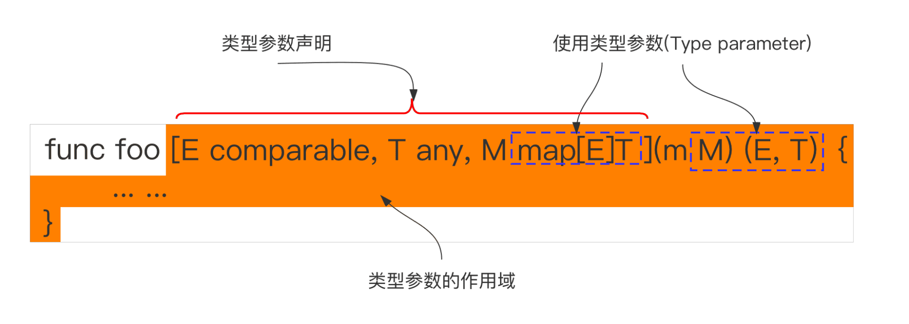

##### 调用泛型函数

和普通函数有形式参数与实际参数一样，类型参数也有**类型形参**（type parameter）和**类型实参**（type argument）之分。其中类型形参就是泛型函数声明中的类型参数：

```go
// 泛型函数声明：T为类型形参
func maxGenerics[T ordered](sl []T) T

// 调用泛型函数：int为类型实参
m := maxGenerics[int]([]int{1, 2, -4, -6, 7, 0})
```

**在调用泛型函数时，除了要传递普通参数列表对应的实参之外，还要显式传递类型实参，比如这里的int**。并且，显式传递的类型实参要放在函数名和普通参数列表前的方括号中。

如果泛型函数的类型形参较多，那么逐一显式传入类型实参会让泛型函数的调用显得十分冗长，比如：

```go
foo[int, string, uint32, float64](1, "hello", 17, 3.14)
```

为了防止这种情况，go提供了：**函数类型实参的自动推断（function argument type inference）**。这个机制就是通过判断传递的函数实参的类型来推断出类型实参的类型，从而允许开发者不必显式提供类型实参：


自动推断的前提必须是**函数的参数列表中使用了的类型形参**，否则出现：

```go
func foo[T comparable, E any](a int, s E) {
}

foo(5, "hello") // 编译器错误：cannot infer T
```

可以给予编译器“部分提示”：

```go
var s = "hello"
foo[int](5, s)  //ok
foo[int,](5, s) //ok
```


##### 泛型函数实例化（instantiation）🔖


#### 2️⃣ 泛型类型

所谓==泛型类型（generic type）==，就是在类型声明中带有类型参数的Go类型。

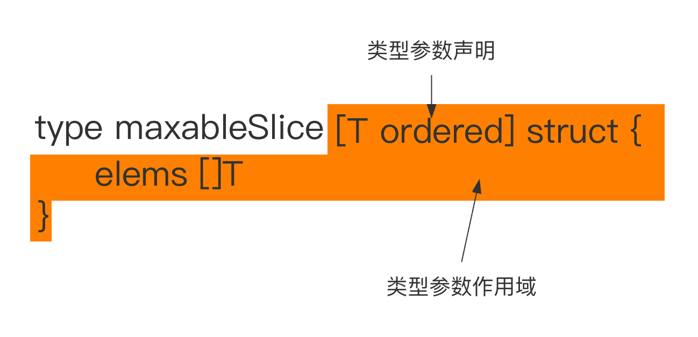

##### 使用泛型类型

和泛型函数一样，使用泛型类型时也会有一个**实例化**（instantiation）过程，比如：

```go
var sl = maxableSlice[int]{
    elems: []int{1, 2, -4, -6, 7, 0},
} 
```

Go会根据传入的类型实参（int）生成一个新的类型并创建该类型的变量实例，sl的类型等价于下面代码：

```go
type maxableIntSlice struct {
    elems []int
}
```


> 最新go版本，泛型类型也可以像泛型函数那样实现类型实参的自动推断了。


##### 泛型方法

Go类型可以拥有自己的方法（method），泛型类型也不例外，为泛型类型定义的方法称为**泛型方法（generic method）**。


### 小结

**类型参数是Go泛型方案的具体实现**，通过类型参数，可以定义泛型函数、泛型类型以及对应的泛型方法。

泛型函数是带有类型参数的函数，在函数名称与参数列表之间声明的类型参数列表使得泛型函数的运行逻辑与参数/返回值类型解耦。调用泛型函数与普通函数略有不同，泛型函数需要进行实例化后才能生成真正执行的、带有类型信息的函数。同时，Go泛型支持的类型实参推断也使得开发者在大多数情况下无需显式传递类型实参，获得与普通函数调用几乎一致的体验。

泛型类型是带有类型参数的类型，泛型类型的类型参数放在类型名称后面的类型参数列表中声明，类型参数后续可以在泛型类型声明中用作成员字段的类型或复合类型成员元素的类型。不过目前（Go 1.19版本）Go尚不支持泛型类型的类型实参的自动推断，我们在泛型类型实例化时需要显式传入类型实参。

与泛型类型绑定的方法被称为泛型方法，泛型方法的参数列表和返回值列表中可以使用泛型类型的类型参数，但泛型方法目前尚不支持声明自己的类型参数列表。

Go泛型的引入，使得Go开发人员在interface{}之后又拥有了一种编写“通用代码”的手段，并且这种新手段因其更多在编译阶段的检查而变得更加安全，也因其减少了运行时的额外开销使得代码性能更好。

### 思考题

> 为什么Go在方括号“`[]`”中声明类型参数，而不是使用其他语言都用的尖括号“`<>`”呢？

Go 语言在泛型设计中采用方括号 `[]` 而非尖括号 `<>` 声明类型参数，是经过语法兼容性、解析效率和语言一致性等多维度权衡后的结果。以下从技术本质、设计哲学和实际影响三方面展开分析：

#### **一、技术本质：解析歧义与语法限制**

1. **尖括号的解析困境**
    尖括号 `< >` 在 Go 中会导致严重的语法歧义，因其与比较运算符（如 `<`、`>`）和位运算符号（如 `<<`、`>>`）冲突。例如：

   ```go
   a := b < c > d  // 是泛型调用还是表达式比较？
   ```

   此类代码无法在**解析阶段**（无需类型信息）明确区分泛型与表达式，需依赖类型检查阶段的信息，但 Go 的解析器设计要求语法树在类型检查前完成构建。

2. **方括号的确定性优势**
    Go 的数组和切片已使用 `[]`（如 `[]int`），而泛型类型参数同样以 `[]` 包裹（如 `type Stack[T any] []T`）。编译器可明确区分：

   - `[]int`：切片类型声明
   - `[T any]`：泛型类型参数声明
      这种设计避免了尖括号的歧义，且无需修改现有解析器逻辑。

3. **其他符号的排除原因**

   - **圆括号 `( )`**：易与函数参数列表混淆（如 `func F(T)(int)` 可能被解析为函数返回类型）。
   - **花括号 `{ }`**：已用于代码块和复合字面量，冲突更严重。
   - **尖括号 `<>`**：如前所述，需无限向前查看（unbounded lookahead），违反 Go 的“快速编译”原则。

#### **二、设计哲学：简洁性与一致性**

1. **从左到右的阅读习惯**
    Go 强调代码的可读性，主张声明从左到右连贯。例如：

   ```
   type Map[K comparable, V any] map[K]V  // 从左到右：类型名 → 泛型参数 → 底层类型
   ```

   方括号的位置与变量名在前、类型在后的声明风格（如 `var x int`）保持一致，降低认知负担。

2. **最小化语法侵入**
    Go 避免引入冗余符号（如 C++ 的 `template` 关键字）。方括号在现有语法中利用率较低（仅用于数组/切片），复用 `[]` 可减少新符号的引入，符合 Go 的“少即是多”哲学。

3. **类型系统的渐进增强**
    泛型需兼容 Go 的接口和类型推断机制。方括号允许无缝嵌入接口约束：

   ```
   type Stringer interface { String() string }
   func Print[T Stringer](s T) { fmt.Println(s.String()) }
   ```

   而尖括号可能导致接口方法与泛型参数的视觉混淆。

#### **三、历史决策与社区反馈**

1. **设计草案的迭代**
    早期草案曾尝试圆括号（如 `type Stack(T any) []T`），但出现嵌套歧义：

   ```
   struct{ (T(int)) }  // 模糊：嵌入字段 or 泛型实例化？
   ```

   方括号方案经原型验证后，在解析歧义测试中表现更优。

2. **社区偏好与妥协**

   - **支持方括号派**：认为 `[]` 更易区分类型参数与普通代码，减少视觉噪音。
   - **支持尖括号派**：习惯其他语言（如 C++/Java），但接受 Go 的差异化选择。
      最终 Go 团队以“减少歧义”优先，采纳方括号。

#### **四、实际影响与对比**

| **括号类型** | **解析难度**     | **语法一致性**     | **开发者接受度**   |
| ------------ | ---------------- | ------------------ | ------------------ |
| 尖括号 `<>`  | 高（需类型信息） | 低（冲突运算符）   | 高（习惯其他语言） |
| 方括号 `[]`  | 低（无歧义）     | 高（复用切片语法） | 中（需适应期）     |
| 圆括号 `()`  | 中（与函数混淆） | 中                 | 低                 |

#### **总结：工程务实的选择**

Go 采用方括号的核心动机是**解决语法歧义**与**保持语言简洁性**。其设计反映了工程优先的思维：

1. **技术可行性**：方括号在解析阶段无歧义，兼容 Go 的编译模型。
2. **认知成本**：延续“从左到右”的声明风格，减少学习曲线。
3. **长期维护**：避免因语法糖引入隐藏的解析复杂度，契合 Go 的“可维护性”目标。

正如 Go 设计者所述：“*语法是表象，语义是核心*”。方括号可能需开发者短暂适应，但换来的是更稳健的泛型系统底层支持。


## 41 定义泛型约束

虽然泛型是开发人员表达“通用代码”的一种重要方式，但这并不意味着所有泛型代码对所有类型都适用。更多的时候，我们需要对泛型函数的类型参数以及泛型函数中的实现代码**设置限制**。泛型函数调用者只能传递满足限制条件的类型实参，泛型函数内部也只能以类型参数允许的方式使用这些类型实参值。在Go泛型语法中，我们使用**类型参数约束**（type parameter constraint）（以下简称**约束**）来表达这种限制条件。

约束之于类型参数就好比函数参数列表中的类型之于参数：

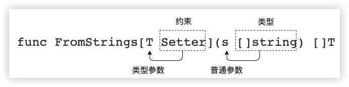

### 41.1 最宽松的约束：any


### 41.2 支持比较操作的内置约束：comparable


### 41.3 自定义约束

Go泛型最终决定使用interface语法来定义约束。这样一来，**凡是接口类型均可作为类型参数的约束**。


```go
type Ia interface {
	int | string  // 仅代表int和string
}

type Ib interface {
	~int | ~string  // 代表以int和string为底层类型的所有类型
}
```


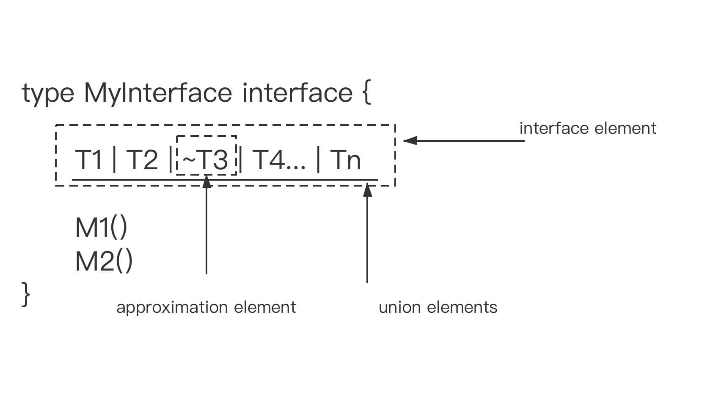


### 41.4 类型集合（type set）

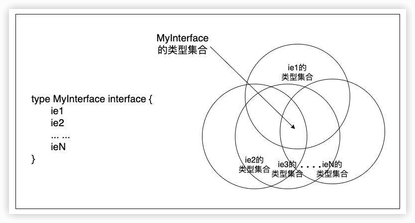


### 41.5 简化版的约束形式

```go
type I interface { // 独立于泛型函数外面定义
    ~int | ~string
}

func doSomething1[T I](t T)
func doSomething2[T interface{~int | ~string}](t T) // 以接口类型字面值作为约束
```

```go
func doSomething2[T ~int | ~string](t T) // 简化版的约束形式
```


一般形式来表述：

```go
func doSomething[T interface {T1 | T2 | ... | Tn}](t T)

等价于下面简化版的约束形式：

func doSomething[T T1 | T2 | ... | Tn](t T) 
```


### 41.6 约束的类型推断


## 42 明确泛型使用时机🔖

Go语言开发人员都有义务去正确、适当的使用泛型，而不是滥用或利用泛型炫技。

### 42.1 何时适合使用泛型？

#### 场景一：编写通用数据结构时


#### 场景二：函数操作的是Go原生的容器类型时


#### 场景三：不同类型实现一些方法的逻辑相同时


### 42.2 Go泛型实现原理简介

Russ Cox [“泛型窘境”](https://research.swtch.com/generic)的文章，三个路径已经每个的不足【三个slow（拖慢）】：

- C语言路径：不实现泛型，不会引入复杂性，但这会**“拖慢程序员”**，因为可能需要程序员花费精力做很多重复实现；
- C++语言路径：就像C++的泛型实现方案那样，通过增加编译器负担为每个类型实参生成一份单独的泛型函数的实现，这种方案产生了大量的代码，其中大部分是多余的，有时候还需要一个好的链接器来消除重复的拷贝，显然这个实现路径会**“拖慢编译器”**；
- Java路径：就像Java的泛型实现方案那样，通过隐式的装箱和拆箱操作消除类型差异，虽然节省了空间，但代码执行效率低，即**“拖慢执行性能”**。

#### Stenciling方案


Stenciling方案也称为模板方案（如上图）， 它也是C++、Rust等语言使用的实现方案。其主要思路就是在编译阶段，根据泛型函数调用时类型实参或约束中的类型元素，为每个实参类型或类型元素中的类型生成一份单独实现。这么说还是很抽象，下图很形象地说明了这一过程：

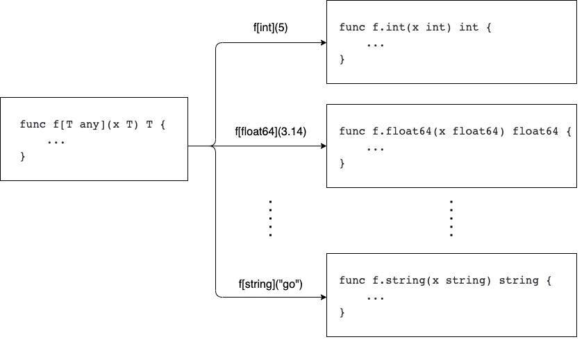

#### Dictionaries方案

Dictionaries方案与Stenciling方案的实现思路正相反，它不会为每个类型实参单独创建一套代码，反之它仅会有一套函数逻辑，但这个函数会多出一个参数dict，这个参数会作为该函数的第一个参数，这和Go方法的receiver参数在方法调用时自动作为第一个参数有些类似。这个dict参数中保存泛型函数调用时的类型实参的类型相关信息。下面是Dictionaries方案的示意图：

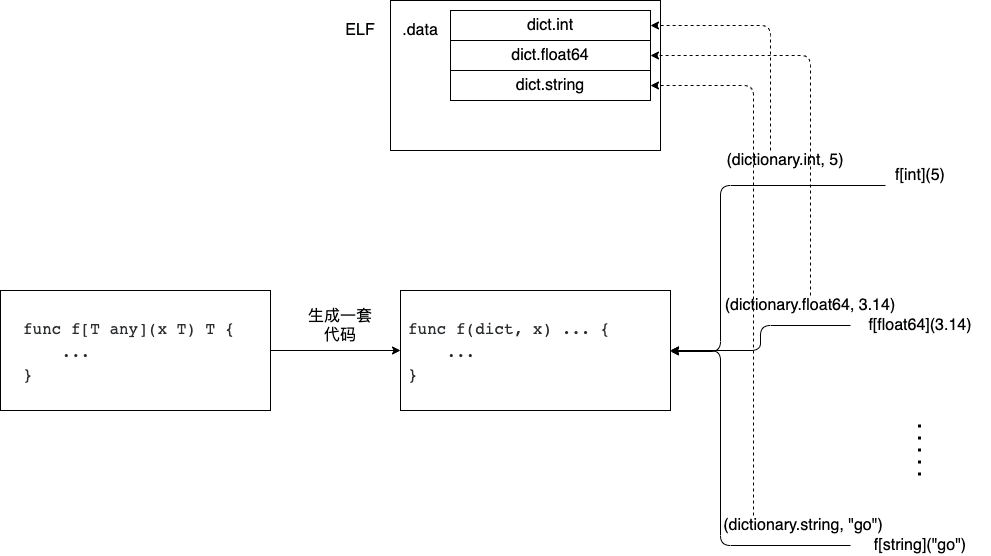


#### Go最终采用的方案：GC Shape Stenciling方案

它基于Stenciling方案，但又没有为所有类型实参生成单独的函数代码，而是**以一个类型的GC shape为单元进行函数代码生成**。一个类型的GC shape是指该类型在Go内存分配器/垃圾收集器中的表示，这个表示由类型的大小、所需的对齐方式以及类型中包含指针的部分所决定。


```go
// gcshape.go
func f[T any](t T) T {
    var zero T
    return zero
}

type MyInt int

func main() {
    f[int](5)
    f[MyInt](15)
    f[int64](6)
    f[uint64](7)
    f[int32](8)
    f[rune](18)
    f[uint32](9)
    f[float64](3.14)
    f[string]("golang")

    var a int = 5
    f[*int](&a)
    var b int32 = 15
    f[*int32](&b)
    var c float64 = 8.88
    f[*float64](&c)
    var s string = "hello"
    f[*string](&s)
}
```


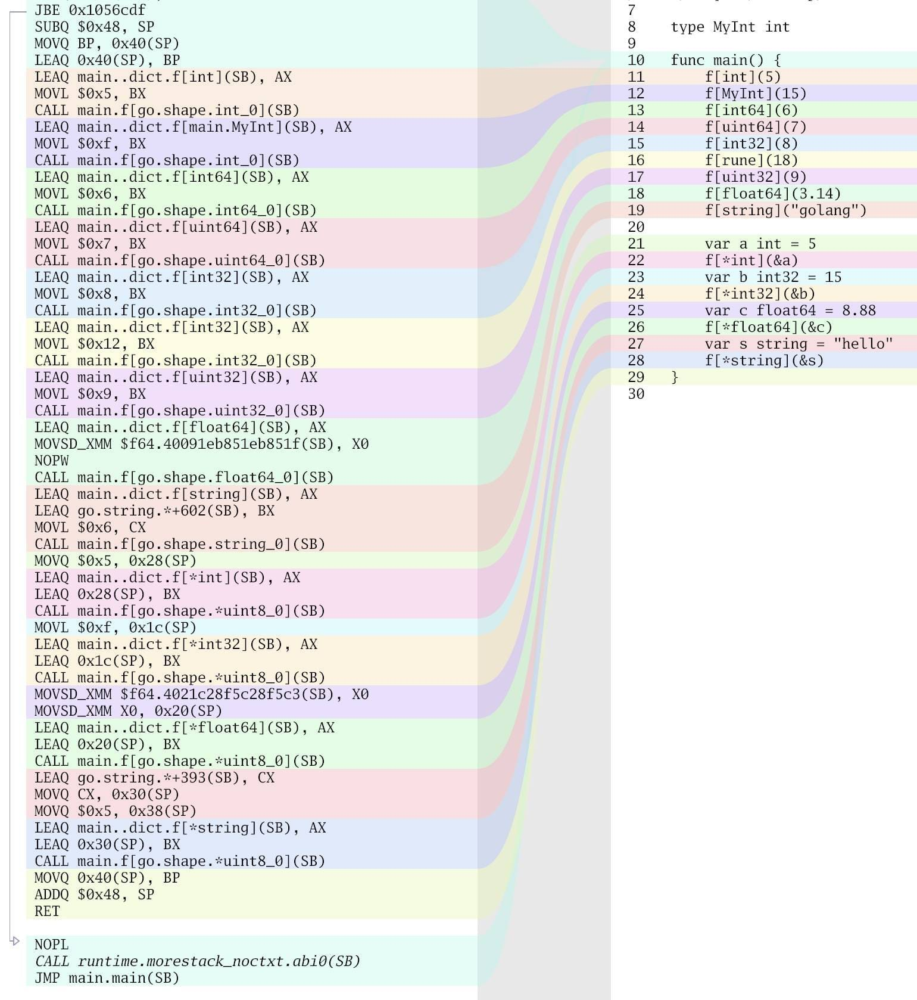

### 42.3 泛型对执行效率的影响


# 补充

## 43 如何拉取私有的Go Module？

### 43.1 导入本地module

彻底抛弃Gopath构建模式，全面拥抱Go Module构建模式。

> **如果我们的项目依赖的是本地正在开发、尚未发布到公共站点上的Go Module，那么我们应该如何做呢？**
>
> 假设你有一个项目，这个项目中的module a依赖module b，而module b是你另外一个项目中的module，它本来是要发布到github.com/user/b上的。
> 但此时此刻，module b还没有发布到公共托管站点上，它源码还在你的开发机器上。也就是说，go命令无法在github.com/user/b上找到并拉取module a的依赖module b，这时，如果你针对module a所在项目使用go mod tidy命令，就会收到类似下面这样的报错信息：
>
> ```sh
> $go mod tidy
> go: finding module for package github.com/user/b
> github.com/user/a imports
>     github.com/user/b: cannot find module providing package github.com/user/b: module github.com/user/b: reading https://goproxy.io/github.com/user/b/@v/list: 404 Not Found
>     server response:
>     not found: github.com/user/b@latest: terminal prompts disabled
>     Confirm the import path was entered correctly.
>     If this is a private repository, see https://golang.org/doc/faq#git_https for additional information.
> ```
>
> 

Go 1.18之前:**go.mod的replace指示符**

Go 1.18之后，Go工作区（Go workspace，也译作Go工作空间），go.work  🔖


### 43.2 拉取私有module的需求与参考方案

配置一个高效好用的公共GOPROXY服务，就可以轻松拉取所有公共Go Module了：


但随着公司内Go使用者和Go项目的增多，“重造轮子”的问题就出现了。抽取公共代码放入一个独立的、可被复用的内部私有仓库成为了必然，这样我们就**有了拉取私有Go Module的需求。**

一些公司或组织的所有代码，都放在公共vcs托管服务商那里（比如github.com），私有Go Module则直接放在对应的公共vcs服务的private repository（私有仓库）中。如果你的公司也是这样，那么拉取托管在公共vcs私有仓库中的私有Go Module，也很容易，见下图：


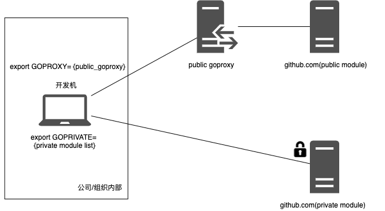

也就是说，只要我们在每个开发机上，配置公共GOPROXY服务拉取公共Go Module，同时再把私有仓库配置到GOPRIVATE环境变量，就可以了。这样，所有私有module的拉取，都会直连代码托管服务器，不会走GOPROXY代理服务，也**不会去GOSUMDB服务器做Go包的hash值校验**。

当然，这个方案有一个前提，那就是每个开发人员都需要具有访问公共vcs服务上的私有Go Module仓库的**权限**，凭证的形式不限，可以是basic auth的user和password，也可以是personal access token（类似GitHub那种），只要按照公共vcs的身份认证要求提供就可以了。

不过，更多的公司/组织，可能会将私有Go Module放在公司/组织内部的vcs（代码版本控制）服务器上，就像下面图中所示：

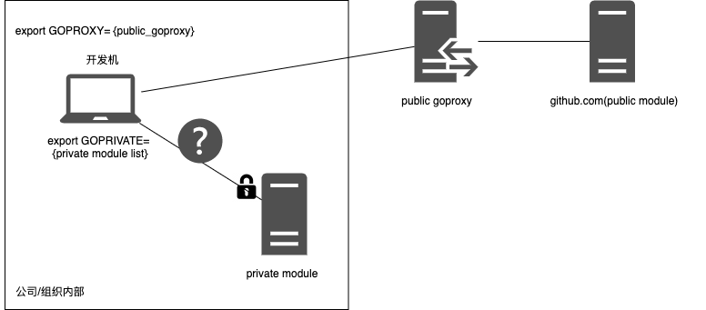

这种情况，让Go命令，自动拉取内部服务器上的私有Go Module有两个参考方案：


#### 第一个方案是通过直连组织公司内部的私有Go Module服务器拉取。


这个方案，公司内部会搭建一个**内部goproxy服务**（in-house goproxy）。这样做有两个目的，

- 一是为那些无法直接访问外网的开发机器，以及ci机器提供拉取外部Go Module的途径，
- 二来，由于in-house goproxy的cache的存在，这样做还可以加速公共Go Module的拉取效率。

另外，对于私有Go Module，开发机只需要将它配置到GOPRIVATE环境变量中就可以了，这样，Go命令在拉取私有Go Module时，就不会再走GOPROXY，而会采用直接访问vcs（如上图中的git.yourcompany.com）的方式拉取私有Go Module。

这个方案十分适合内部**有完备IT基础设施的公司**。这类型的公司内部的vcs服务器都可以通过域名访问（比如git.yourcompany.com/user/repo），因此，公司内部员工可以像访问公共vcs服务那样，访问内部vcs服务器上的私有Go Module。

#### 第二种方案，是将外部Go Module与私有Go Module都交给内部统一的GOPROXY服务去处理：

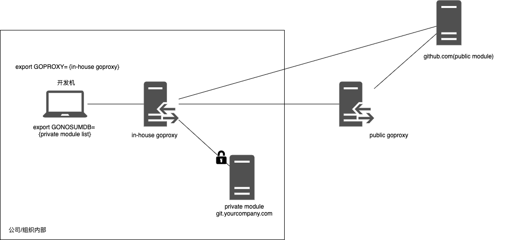

在这种方案中，开发者只需要把GOPROXY配置为in-house goproxy，就可以统一拉取外部Go Module与私有Go Module。

但由于go命令默认会对所有通过goproxy拉取的Go Module，进行sum校验（默认到sum.golang.org)，而我们的私有Go Module在公共sum验证server中又没有数据记录。因此，开发者需要将私有Go Module填到GONOSUMDB环境变量中，这样，go命令就不会对其进行sum校验了。

不过这种方案有一处要注意：in-house goproxy需要拥有对所有private module所在repo的访问权限，才能保证每个私有Go Module都拉取成功。

> 推荐第二个方案，这个方案中，我们可以**将所有复杂性都交给in-house goproxy这个节点**，开发人员可以无差别地拉取公共module与私有module，心智负担降到最低。

### 43.3 统一Goproxy方案的实现思路与步骤🔖


#### 选择一个GOPROXY实现

[Go module proxy协议规范](https://pkg.go.dev/cmd/go@master#hdr-Module_proxy_protocol)发布后，Go社区出现了很多成熟的Goproxy开源实现，比如有最初的[athens](https://github.com/gomods/athens)，还有国内的两个优秀的开源实现：[goproxy.cn](https://github.com/goproxy/goproxy)和[goproxy.io](https://github.com/goproxyio/goproxy)等。其中，goproxy.io在官方站点给出了[企业内部部署的方法](https://goproxy.io/zh/docs/enterprise.html)，所以今天我们就基于goproxy.io来实现我们的方案。


#### 自定义包导入路径并将其映射到内部的vcs仓库


#### 开发机(客户端)的设置


#### 方案的“不足”

- 第一点：开发者还是需要额外配置GONOSUMDB变量。


- 第二点：新增私有Go Module，vanity.yaml需要手工同步更新。


- 第三点：无法划分权限。


## 44 作为Go Module的作者，你应该知道的几件事

从Go Module的作者或维护者的视角，看看在规划、发布和维护Go Module时需要考虑和注意什么事情，包括go项目**仓库布局、Go Module的发布、升级module主版本号、作废特定版本的module**，等等。

### 44.1 仓库布局：是单module还是多module

如果没有单一仓库（monorepo）的强约束，那么在默认情况下，选择**一个仓库管理一个module**是不会错的，这是管理Go Module的最简单的方式，也是最常用的标准方式。这种方式下，module维护者维护起来会很方便，module的使用者在引用module下面的包时，也可以很容易地确定包的导入路径。

🌰例子，在github.com/bigwhite/srsm这个仓库下管理着一个Go Module（==srsm==是single repo single module的缩写）。

通常情况下，module path与仓库地址保持一致，都是github.com/bigwhite/srsm，这点会体现在go.mod中：

```go
// go.mod
module github.com/bigwhite/srsm

go 1.22.1
```

然后对仓库打tag，这个tag也会成为Go Module的版本号，这样，对仓库的版本管理其实就是对Go Module的版本管理。

如果仓库布局如下：

```sh
./srsm
├── go.mod
├── go.sum
├── pkg1/
│   └── pkg1.go
└── pkg2/
    └── pkg2.go
```

那么这个module的使用者可以很轻松地确定pkg1和pkg2两个包的导入路径，一个是`github.com/bigwhite/srsm/pkg1`，另一个则是`github.com/bigwhite/srsm/pkg2`。

如果module演进到了v2.x.x版本，那么以pkg1包为例，它的包的导入路径就变成了`github.com/bigwhite/srsm/v2/pkg1`。


如果组织层面要求采用单一仓库（monorepo）模式，也就是**所有Go Module都必须放在一个repo下**，那只能使用单repo下管理多个Go Module的方法了。

> Go Module的设计者Russ Cox：“在单repo多module的布局下，添加module、删除module，以及对module进行版本管理，都需要相当谨慎和深思熟虑，因此，管理一个单module的版本库，几乎总是比管理现有版本库中的多个module要容易和简单”。

🌰单repo多module的例子，假设repo地址是`github.com/bigwhite/srmm`。这个repo下的结构布局如下（srmm是single repo multiple modules的缩写）：

```sh
./srmm
├── module1
│   ├── go.mod
│   └── pkg1
│       └── pkg1.go
└── module2
    ├── go.mod
    └── pkg2
        └── pkg2.go
```

srmm仓库下面有两个Go Module，分为位于子目录module1和module2的下面，这两个目录也是各自module的根目录（module root）。这种情况下，module的path也不能随意指定，必须包含子目录的名字。

以module1为例分析，它的path是`github.com/bigwhite/srmm/module1`，只有这样，Go命令才能根据用户导入包的路径，找到对应的仓库地址和在仓库中的相对位置。同理，module1下的包名同样是以module path为前缀的，比如：`github.com/bigwhite/srmm/module1/pkg1`。

在单仓库多module模式下，各个module的版本是独立维护的。因此，我们在通过打tag方式发布某个module版本时，tag的名字必须包含子目录名。比如：如果我们要发布module1的v1.0.0版本，我们不能通过给仓库打v1.0.0这个tag号来发布module1的v1.0.0版本，**正确的作法应该是打`module1/v1.0.0`这个tag号**。

现在可能觉得这样理解起来也没有多复杂，但当各个module的主版本号升级时，你就会感受到这种方式带来的繁琐了。


### 44.2 发布Go Module

发布的步骤也十分简单，就是**为repo打上tag并推送到代码服务器上**就好了。


### 44.3 作废特定版本的Go Module🔖


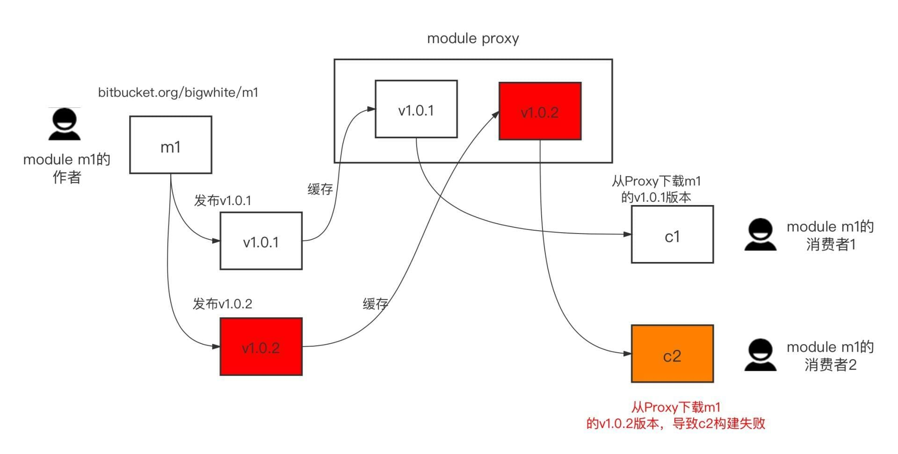


#### 修复broken版本并重新发布

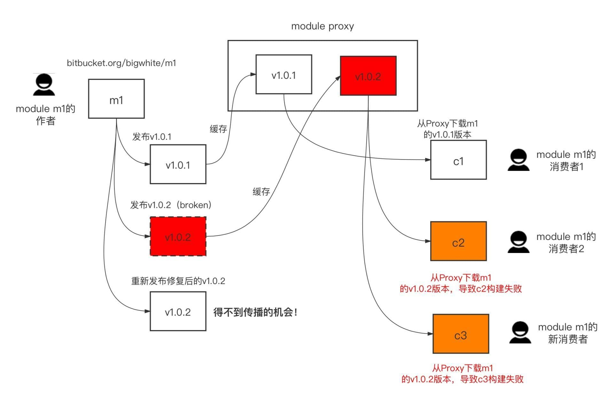

#### 发布module的新patch版本


### 44.4 升级module的major版本号🔖


- 第一种情况：repo下的所有module统一进行版本发布。


- 第二个情况：repo下的module各自独立进行版本发布。


### 思考题

> Go Module只有在引入不兼容的change时才会升级major版本号，那么哪些change属于不兼容的change呢？如何更好更快地识别出这些不兼容change呢？


## 45 Go指针

### 45.1 什么是指针类型

**如果我们拥有一个类型T，那么以T作为基类型的指针类型为*T**。

`unsafe.Pointer`类似于C语言中的`void*`，用于表示一个通用指针类型，也就是**任何指针类型都可以显式转换为一个unsafe.Pointer，而unsafe.Pointer也可以显式转换为任意指针类型**，如下面代码所示：

```go
var p *T
var p1 = unsafe.Pointer(p) // 任意指针类型显式转换为unsafe.Pointer
p = (*T)(p1)               // unsafe.Pointer也可以显式转换为任意指针类型
```

unsafe.Pointer是Go语言的高级特性，在**Go运行时与Go标准库**中unsafe.Pointer都有着广泛的应用。但unsafe.Pointer属于unsafe编程范畴，这里就不深入了。

如果指针类型变量没有被显式赋予初值，那么它的值为**nil**：

```go
var p *T
println(p == nil) // true
```

给一个指针类型变量赋值：

```go
var a int = 13
var p *int = &a  // 给整型指针变量p赋初值
```

`&a`作为*int指针类型变量p的初值，`&`符号称为**取地址符号**，这一行的含义就是将变量a的地址赋值给指针变量p。

只能使用基类型变量的地址给对应的指针类型变量赋值，如果类型不匹配，Go编译器是会报错的。

以最简单的整型变量为例，看看对应的内存单元存储的内容：

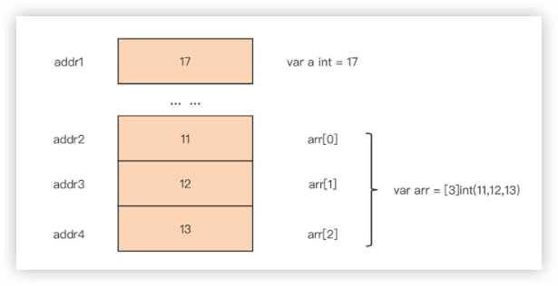

看到，**对于非指针类型变量，Go在对应的内存单元中放置的就是该变量的值**。我们对这些变量进行修改操作的结果，也会直接体现在这个内存单元上：

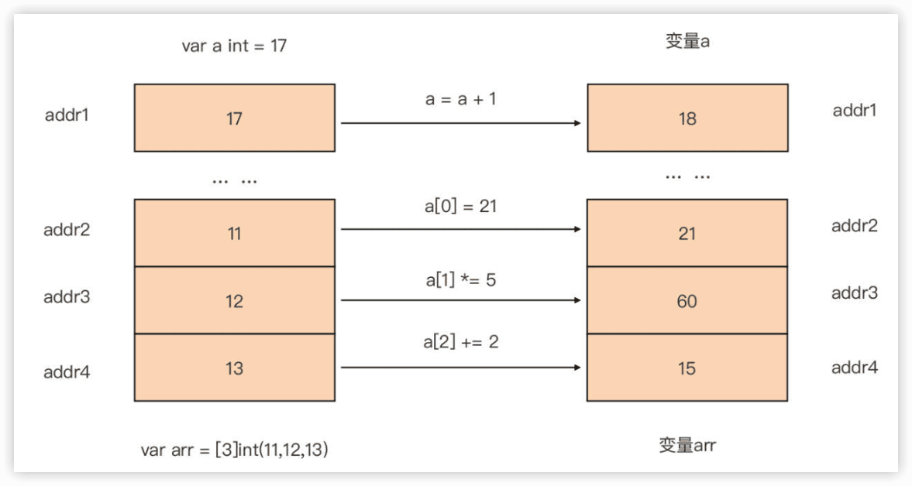


以*int类型指针变量为例，查看指针类型变量在对应的内存空间：

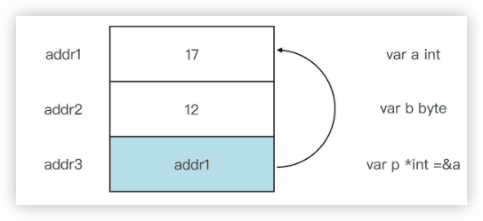

**Go为指针变量p分配的内存单元中存储的是整型变量a对应的内存单元的地址**。也正是由于指针类型变量存储的是内存单元的地址，指针类型变量的大小与其基类型大小无关，而是和系统地址的表示长度有关。

```go
package main

import "unsafe"

type foo struct {
    id   string
    age  int8
    addr string
}

func main() {
    var p1 *int
    var p2 *bool
    var p3 *byte
    var p4 *[20]int
    var p5 *foo
    var p6 unsafe.Pointer
    println(unsafe.Sizeof(p1)) // 8 
    println(unsafe.Sizeof(p2)) // 8
    println(unsafe.Sizeof(p3)) // 8
    println(unsafe.Sizeof(p4)) // 8
    println(unsafe.Sizeof(p5)) // 8
    println(unsafe.Sizeof(p6)) // 8
}
```

unsafe包的Sizeof函数原型：

```go
func Sizeof(x ArbitraryType) uintptr
```

`uintptr`，是一个Go预定义的标识符，**uintptr是一个整数类型，它的大小足以容纳任何指针的比特模式（bit pattern）**，换句话说就是：**在Go语言中uintptr类型的大小就代表了指针类型的大小**。

> `go doc [package路径]`
>
> ```
> go doc fmt
> go doc fmt.Printf
> go doc builtin.uintptr
> go doc unsafe 
> ```

一旦指针变量得到了正确赋值，也就是指针指向某一个合法类型的变量，我们就可以通过指针读取或修改其指向的内存单元所代表的基类型变量，比如：

```go
var a int = 17
var p *int = &a
println(*p) // 17 
(*p) += 3
println(a)  // 20
```

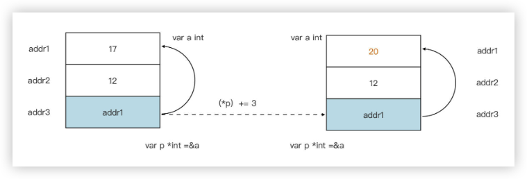

通过指针变量读取或修改其指向的内存地址上的变量值，这个操作被称为指针的**解引用（dereference）**，就是在指针类型变量的前面加上一个星号。

要输出指针自身的值，也就是指向的内存单元的地址，可以使用Printf通过%p来实现：

```go
fmt.Printf("%p\n", p) // 0x14000122018
```


指针变量可以变换其指向的内存单元:

```go
var a int = 5
var b int = 6

var p *int = &a  // 指向变量a所在内存单元
println(*p)      // 输出变量a的值
p = &b           // 指向变量b所在内存单元
println(*p)      // 输出变量b的值
```

多个指针变量可以指向同一个变量的内存单元的，这样通过其中一个指针变量对内存单元的修改，是可以通过另外一个指针变量的解引用反映出来的:

```go
var a int = 5
var p1 *int = &a // p1指向变量a所在内存单元
var p2 *int = &a // p2指向变量b所在内存单元
(*p1) += 5       // 通过p1修改变量a的值
println(*p2)     // 10 对变量a的修改可以通过另外一个指针变量p2的解引用反映出来
```

### 45.2 二级指针

```go
func main() {
	var a int = 5
	var p1 *int = &a
	println(*p1)
	var b int = 55
	var p2 *int = &b
	println(&p2)

	var pp **int = &p1
	println(**pp) // 5
	pp = &p2
	println(**pp) // 55
}
```


对一级指针解引用，得到的其实是指针指向的变量。而对二级指针pp解引用一次，得到将是pp指向的指针变量：

```go
println((*pp) == p1) // true
```

对pp解引用两次，其实就相当于对一级指针解引用一次，得到的是pp指向的指针变量所指向的整型变量：

```go
println((**pp) == (*p1)) // true
println((**pp) == a)     // true
```

一级指针常被用来改变普通变量的值，**二级指针就可以用来改变指针变量的值，也就是指针变量的指向**。


前面提到过，在同一个函数中，改变指针的指向十分容易，只需要给一级指针重新赋值为另外一个变量的地址就可以了。

但是，如果我们需要跨函数改变一个指针变量的指向，我们就不能选择一级指针类型作为形参类型了。因为一级指针只能改变普通变量的值，无法改变指针变量的指向。我们只能选择二级指针类型作为形参类型。

```go
package main

func f(pp **int) {
	var b int = 55
	var p1 *int = &b
	(*pp) = p1
}
func main() {
	var a int = 5
	var p *int = &a
	println(*p) // 5
	f(&p)
	println(*p) // 55
}
```


### 45.3 Go中的指针用途与使用限制

Go是带有垃圾回收的编程语言，指针在Go中依旧位于C位，它的作用不仅体现在==语法层面==上，更体现在Go==运行时层面==，尤其是==内存管理==与==垃圾回收==这两个地方，这两个运行时机制**只关心指针**。

在语法层面，相对于“指针为王”的C语言来说，Go指针的使用要少不少，这很大程度上是因为Go提供了更灵活和高级的复合类型，比如切片、map等，并将使用指针的复杂性隐藏在运行时的实现层面了。这样，Go程序员自己就不需要在语法层面通过指针来实现这些高级复合类型的功能。

指针无论是在Go中，还是在其他支持指针的编程语言中，存在的意义就是为了是**“==可改变==”**。在Go中，我们使用`*T`类型的变量调用方法、以`*T`类型作为函数或方法的形式参数、返回`*T`类型的返回值等的目的，也都是因为指针可以改变其指向的内存单元的值。

当然，指针的好处，还包括它传递的开销是**常数级**的（在x86-64平台上仅仅是8字节的拷贝），**可控可预测**。无论指针指向的是一个字节大小的变量，还是一个拥有10000个元素的[10000]int型数组，**传递指针的开销都是一样的**。

不过，虽然Go在语法层面上保留了指针，但Go语言的目标之一是成为一门**安全**的编程语言，因此，它对指针的使用做了一定的限制，包括这两方面：

#### 限制一：限制了显式指针类型转换。

在C语言中，可以实现显式指针类型转换：

```c
#include <stdio.h>
  
int main() {
    int a = 0x12345678;
    int *p = &a;
    char *p1 = (char*)p; // 将一个整型指针显式转换为一个char型指针
    printf("%x\n", *p1); 
}
```

但是在Go中，这样的显式指针转换会得到Go编译器的报错信息：

```go
package main

import (
    "fmt"
    "unsafe"
)

func main() {
    var a int = 0x12345678
    var pa *int = &a
    var pb *byte = (*byte)(pa) // 编译器报错：cannot convert pa (variable of type *int) to type *byte
    fmt.Printf("%x\n", *pb)
}
```

如果非要进行这个转换，Go也提供了unsafe的方式：

```go
func main() {                                                                         
    var a int = 0x12345678                                                            
    var pa *int = &a                                                                  
    var pb *byte = (*byte)(unsafe.Pointer(pa)) // ok
    fmt.Printf("%x\n", *pb) // 78                                                          
} 
```


#### 限制二：不支持指针运算。

指针运算是C语言的大杀器。

但指针运算也是安全问题的“滋生地”。为了安全性，Go在语法层面抛弃了指针运算这个特性。

如果非要做指针运算，Go依然提供了unsafe的途径。

### 小结

**指针变量**是一种在它对应的内存单元中，存储另外一个变量a对应的内存单元地址的变量，也称该指针指向变量a。**指针类型**通常需要依托某一类型而存在，unsafe包的Pointer类型是个例外。

指针变量的声明与普通变量别无二异，可以用一个指针的基类型的变量的地址，为指针变量赋初值。如果指针变量没有初值，那它的默认值为nil。通过对指针变量的解引用，可以读取和修改其指向的变量的值。

可以声明指向指针的指针变量，这样的指针被称为**二级指针**。二级指针可以用来改变指针变量的值，也就是指针变量的指向。不过二级指针以及多级指针很难理解，一旦使用会降低代码的可读性，建议一定要慎用。

另外，出于内存安全性的考虑，Go语言对指针的使用做出了限制，不允许在Go代码中进行显式指针类型转换以及指针运算，当然可以通过unsafe方式实现这些功能，但在使用unsafe包的类型与函数时，你一定要知道你正在做什么，确保代码的正确性。


## 46 Go语言的GC实现

依赖人去处理复杂的对象内存管理的问题是不科学、不合理的。C和C++程序员已经被折磨了数十年，我们不应该再重蹈覆辙了，于是，后来的很多编程语言就用上垃圾回收（GC）机制。

### 46.1 GC拯救程序员

垃圾回收（Garbage Collection）也被称为**自动内存管理技术**，在现代编程语言中使用得相当广泛，常见的Java、Go、C#均在语言的 runtime 中集成了相应的实现。

在传统的不带GC的编程语言中，我们需要关注对象的分配位置，要自己去选择对象是分配在堆还是栈上，但在 Go 这门有 GC 的语言中，集成了**逃逸分析**功能来帮助我们自动判断对象应该在堆上还是栈上，我们可以使用 `go build -gcflags="-m"` 来观察逃逸分析的结果：

```go
package main

func main() {
    var m = make([]int, 10240)
    println(m[0])
}
```

可以看到，较大的对象也会被放在堆上。

```shell
$ go build -gcflags="-m" escape.go 
# command-line-arguments
./escape.go:3:6: can inline main
./escape.go:4:14: make([]int, 10240) escapes to heap
```

若对象被分配在栈上，它的<u>管理成本就比较低</u>，通过挪动栈顶寄存器就可以实现**对象的分配和释放**。若对象被分配在堆上，就要<u>经历层层的内存申请过程</u>。但这些流程对用户都是透明的，在编写代码时我们并不需要在意它。只有需要优化时，才需要研究具体的**逃逸分析规则**。

逃逸分析与垃圾回收结合在一起，极大地解放了程序员们的心智，我们在编写代码时，似乎再也没必要去担心内存的分配和释放问题了。

**然而，一切抽象皆有成本，这个成本要么花在编译期，要么花在运行期。**

GC这种方案是选择在运行期来解决问题，不过在极端场景下GC本身引起的问题依然是令人难以忽视的：

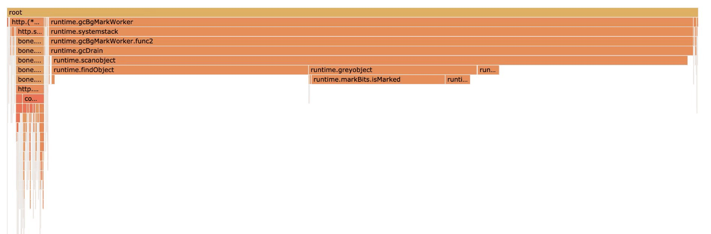

这张图的场景是在内存中缓存了上亿的 kv，这时 GC 使用的 CPU 甚至占到了总 CPU 占用的 90% 以上。简单粗暴地在内存中缓存对象，到头来发现 GC 成为了 CPU 杀手，吃掉了大量的服务器资源，这显然不是我们期望的结果。

想要正确地分析原因，就需要我们对 GC 本身的实现机制有稍微深入一些的理解。

### 46.2 内存管理的三个参与者

- ==mutator==指的是我们的应用，也就是application，我们将堆上的对象看作一个图，跳出应用来看的话，应用的代码就是在不停地修改这张堆对象图里的指向关系。下面的图可以帮我们理解 mutator 对堆上的对象的影响：

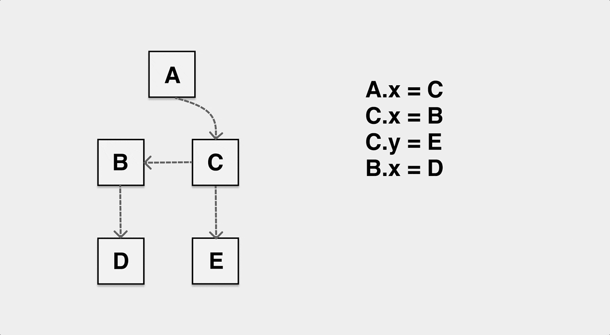

- ==allocator==指的是==内存分配器==，应用需要内存的时候都要向allocator申请。allocator要维护好内存分配的数据结构，在多线程场景下工作的内存分配器还需要考虑高并发场景下锁的影响，并针对性地进行设计以降低锁冲突。

- ==collector==是==垃圾回收器==。死掉的堆对象、不用的堆内存都要由collector回收，最终归还给操作系统。当 GC 扫描流程开始执行时，collector 需要扫描内存中存活的堆对象，扫描完成后，未被扫描到的对象就是无法访问的堆上垃圾，需要将其占用内存回收掉。

三者的交互过程：

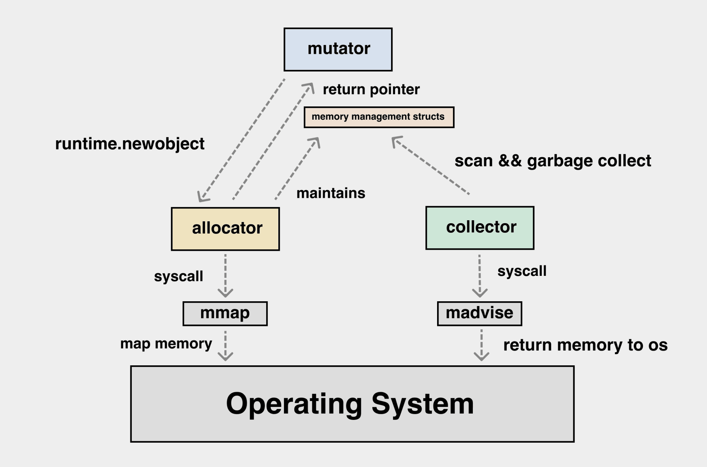

应用需要在堆上申请内存时，会由编译器帮程序员自动调用`runtime.newobject`，这时 allocator 会使用 `mmap` 这个系统调用从操作系统中申请内存，若 allocator 发现之前申请的内存还有富余，会从本地预先分配的数据结构中划分出一块内存，并把它**以指针的形式返回给应用**。在内存分配的过程中，allocator要负责维护内存管理对应的数据结构。

而collector要扫描的就是allocator管理的这些数据结构，应用不再使用的部分便应该被回收，通过`madvise`这个系统调用返还给操作系统。

> `madvise`和`mmap`是 Linux 系统编程中管理内存映射的核心系统调用，二者协同工作以优化内存访问性能。

下面看看这些交互的细节。

### 46.3 分配内存

应用程序使用mmap向 OS 申请内存，操作系统提供的接口比较简单，mmap返回的结果是连续的内存区域。

mutator申请内存是以应用视角来看问题。比如说，我需要的是某一个struct和某一个slice 对应的内存，这与从操作系统中获取内存的接口之间还有一个鸿沟。这就需要由 allocator 进行映射与转换，将以“块”来看待的内存与以“对象”来看待的内存进行映射：


从上面这张图看到，在应用的视角看，我们需要初始化的 a 是一个 1024000 长度的 int 切片；在内存管理的视角来看，我们需要管理的只是start、offset对应的一段内存。

在现代CPU上，除了内存分配的**正确性**以外，还要考虑**分配过程的效率问题**，应用执行期间小对象会不断地生成与销毁，如果每一次对象的分配与释放都需要与操作系统交互，那么成本是很高的。这就需要我们在应用层设计好内存分配的**多级缓存**，尽量**减少小对象高频创建与销毁时的锁竞争**，这个问题在传统的 C/C++语言中已经有了解法，那就是`tcmalloc`：

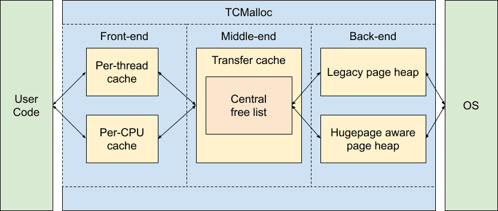

tcmalloc通过维护一套**多级缓存结构**，降低了应用内存分配过程中对全局锁的使用频率，使小对象的内存分配做到了**尽量无锁**。

Go语言的内存分配器基本是tcmalloc的 1:1 搬运……毕竟都是 Google 的项目。

在Go语言中，根据对象中是否有指针以及对象的大小，将内存分配过程分为三类：

- `tiny` ：size < 16 bytes && has no pointer(noscan)；
- `small` ：has pointer(scan) || (size >= 16 bytes && size <= 32 KB)；
- `large` ：size > 32 KB。

在内存分配过程中，最复杂的就是tiny类型的分配。

我们可以将内存分配的路径与CPU的多级缓存作类比，这里 mcache 内部的 tiny 可以类比为 L1 cache，而 alloc 数组中的元素可以类比为 L2 cache，全局的 `mheap.mcentral` 结构为 L3 cache，`mheap.arenas` 是 L4，L4 是以页为单位将内存向下派发的，由 `pageAlloc` 来管理 arena 中的空闲内存。具体你可以看下这张表：


如果 L4 也没法满足我们的内存分配需求，那我们就需要向操作系统去要内存了。

和 tiny 的四级分配路径相比，small 类型的内存没有本地的 mcache.tiny 缓存，其余的与 tiny 分配路径完全一致：


large 内存分配稍微特殊一些，没有前面这两类这样复杂的缓存流程，而是直接从 mheap.arenas 中要内存，直接走 `pageAlloc` **页分配器**。

**页分配器**在 Go 语言中迭代了多个版本，从简单的 freelist 结构，到 treap 结构，再到现在最新版本的 radix 结构，它的查找时间复杂度也从 O(N) -> O(log(n)) -> O(1)。

在当前版本中，我们只需要知道常数时间复杂度就可以确定空闲页组成的 radix tree 是否能够满足内存分配需求。若不满足，则要对 arena 继续进行切分，或向操作系统申请更多的 arena。

只看这些分类文字不太好理解，接下来看看 **arenas、page、mspan、alloc** 这些概念是怎么关联在一起组成 Go 的内存分配流程的。

#### 内存分配的数据结构之间的关系

==arenas==是Go向操作系统申请内存时的最小单位，每个arena为 ==64MB== 大小，在内存中可以部分连续，但整体是个稀疏结构。

单个arena会被切分成以==8KB==为单位的 ==page==，由 **page allocator** 管理，一个或多个 page 可以组成一个 ==mspan==，每个 mspan 可以按照 sizeclass 再划分成多个 element。同样大小的 mspan 又分为 ==scan== 和 ==noscan== 两种，分别对应内部有指针的 object 和内部没有指针的 object。

之前讲到的四级分配结构如下图：

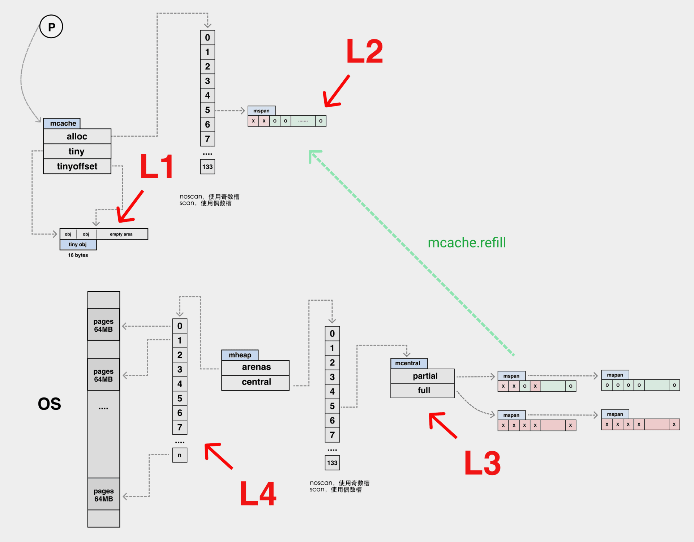

从上图清晰地看到内存分配的多级路径，我们可以再研究一下这里面的 mspan。每一个 mspan 都有一个 allocBits 结构，从 mspan 里分配 element 时，我们只要将 mspan 中对应该 element 位置的 bit 位置一就可以了，其实就是将 mspan 对应 allocBits 中的对应 bit 位置一。每一个 mspan 都会对应一个 allocBits 结构，如下图：

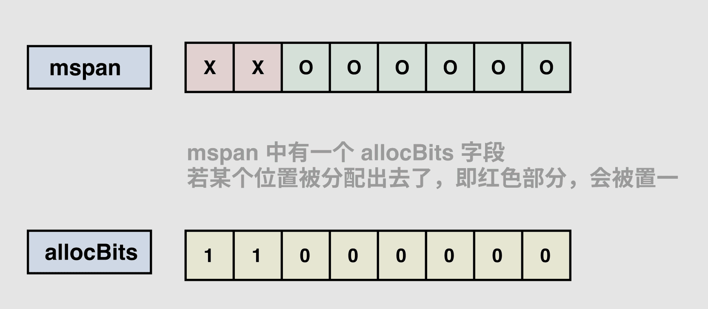

当然，在代码中还有一些位操作优化（如freeIndex、allocCache），之后深入。

### 46.4 垃圾回收

Go语言使用了**==并发标记与清扫算法==**作为它的 GC 实现。

标记、清扫算法是一种古老的 GC 算法，是指将内存中正在使用的对象进行标记，之后清扫掉那些未被标记的对象的一种垃圾回收算法。并发标记与清扫重点在**并发**，是指垃圾回收的**标记和清扫过程能够与应用代码并发执行**。但并发标记清扫算法的一大缺陷是无法解决==内存碎片==问题，而 tcmalloc 恰好一定程度上缓解了内存碎片问题，两者配合使用相得益彰。

**但这并不是说 tcmalloc 完全没有内存碎片，不信你可以在代码里搜搜 max waste**。

#### 垃圾分类

进行垃圾回收之前，我们要先对内存垃圾进行分类，主要可以分为==语义垃圾==和==语法垃圾==两类，但并不是所有垃圾都可以被垃圾回收器回收。

**语义垃圾（semantic garbage）**，有些场景也被称为**内存泄露**，指的是从语法上可达（可以通过局部、全局变量被引用）的对象，但从语义上来讲他们是垃圾，垃圾回收器对此无能为力。

看一个语义垃圾在Go语言中的实例：

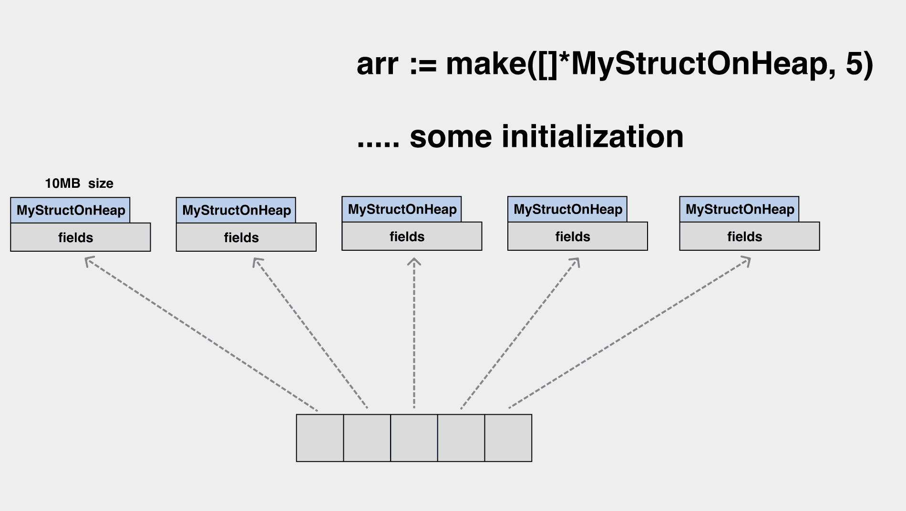

初始化了一个 slice，元素均为指针，每个指针都指向了堆上 10MB 大小的一个对象。


当这个 slice 缩容时，底层数组的后两个元素已经无法再访问了，但它关联的堆上内存依然是无法释放的。

碰到类似的场景，你可能需要在缩容前，**先将数组元素置为 nil**。

另外一种内存垃圾就是**语法垃圾（syntactic garbage）**，讲的是那些从语法上无法到达的对象，这些才是垃圾收集器主要的收集目标。

一个简单的例子来理解一下语法垃圾：

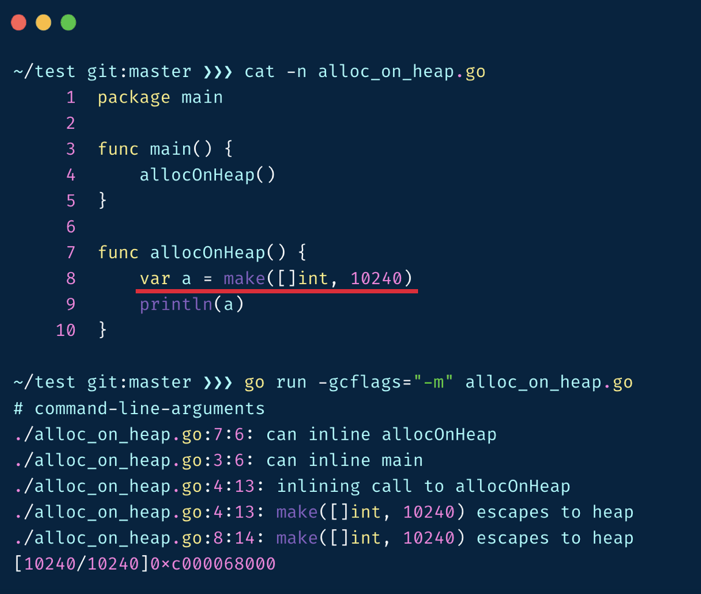

在 allocOnHeap 返回后，堆上的 a 无法访问，便成为了语法垃圾。

#### GC流程

Go 的每一轮版本迭代几乎都会对GC做优化。经过多次优化后，较新的GC流程如下图：

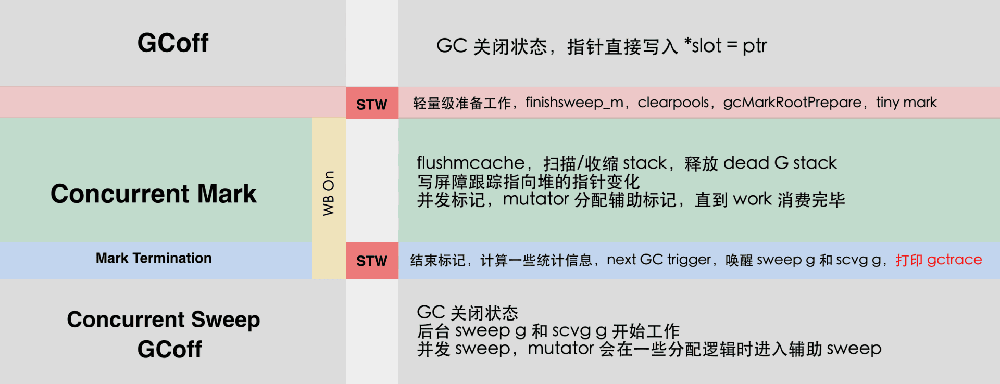

可以看到，在并发标记开始前和并发标记终止时，有两个短暂的 stw，该 stw 可以使用 pprof 的 pauseNs 来观测，也可以直接采集到监控系统中：

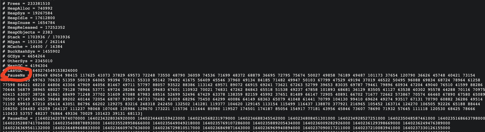

监控系统中的 PauseNs 就是每次 stw 的时长。尽管官方声称 Go 的 stw 已经是亚毫秒级了，但我们在高压力的系统中仍然能够看到毫秒级的 stw。

#### 标记流程

Go语言使用**三色抽象**作为其并发标记的实现。所以这里我们首先要理解三种颜色的抽象：

- 黑表示已经扫描完毕，子节点扫描完毕（gcmarkbits = 1，且在队列外）；
- 灰表示已经扫描完毕，子节点未扫描完毕（gcmarkbits = 1, 在队列内）；
- 白表示未扫描，collector 不知道任何相关信息。

使用三色抽象，主要是为了能让垃圾回收流程与应用流程并发执行，这样将对象扫描过程拆分为多个阶段，不需要一次性完成整个扫描流程。


GC 扫描的起点是根对象，忽略掉那些不重要的（finalizer 相关的先省略），常见的根对象可以参见下图：


所以在 Go 语言中，从根开始扫描的含义是从 .bss 段，.data 段以及 goroutine 的栈开始扫描，最终遍历整个堆上的对象树。

**标记过程是一个广度优先的遍历过程**。它是扫描节点，将节点的子节点推到任务队列中，然后递归扫描子节点的子节点，直到所有工作队列都被排空为止。

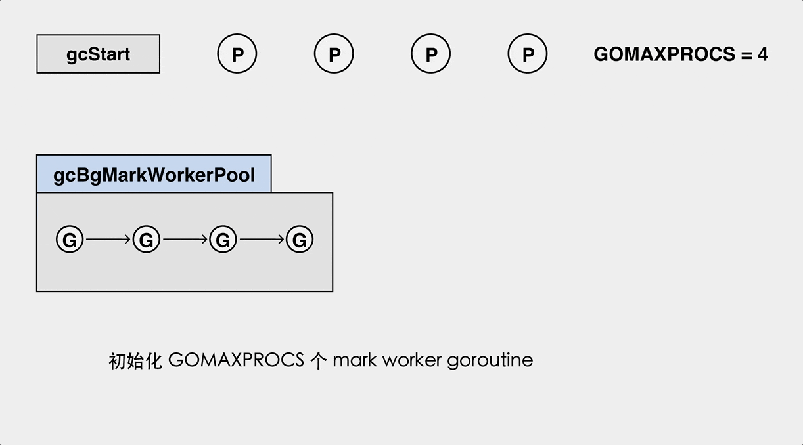

标记过程会将白色对象标记，并推进队列中变成灰色对象。scanobject 的具体过程：


在标记过程中，gc mark worker 会一边从工作队列（gcw）中弹出对象，一边把它的子对象 push 到工作队列（gcw）中，如果工作队列满了，则要将一部分元素向全局队列转移。

我们知道，堆上对象本质上是图，会存储引用关系互相交叉的时候，在标记过程中也有简单的剪枝逻辑：


这里，D 是 A 和 B 的共同子节点，在标记过程中自然会减枝，防止重复标记浪费计算资源：

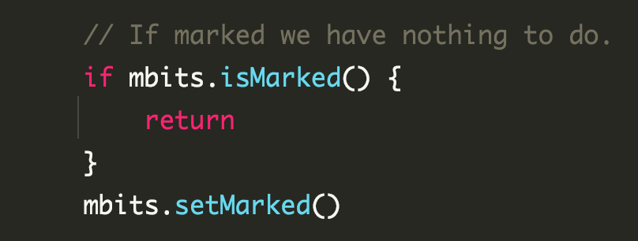

如果多个后台 mark worker 确实产生了并发，标记时使用的是 atomic.Or8，也是并发安全的：


#### 协助标记

当应用分配内存过快时，后台的 mark worker 无法及时完成标记工作，这时应用本身需要进行堆内存分配时，会判断是否需要适当协助 GC 的标记过程，防止应用因为分配过快发生 OOM。

碰到这种情况时，我们会在火焰图中看到对应的协助标记的调用栈：


不过，协助标记会对应用的响应延迟产生影响，我们可以尝试降低应用的对象分配数量进行优化。Go 内部具体是通过一套记账还账系统来实现协助标记的流程的，这一部分深入可以去看看[这里](https://github.com/golang/go/blob/11b28e7e98bce0d92d8b49c6d222fb66858994ff/src/runtime/mgcmark.go#L407) 。

#### 对象丢失问题

前面我们提到了GC线程/协程与应用线程/协程是并发执行的，在 GC 标记 worker 工作期间，应用还会不断地修改堆上对象的引用关系，这就可能导致对象丢失问题。下面是一个典型的应用与 GC 同时执行时，由于应用对指针的变更导致对象漏标记，从而被 GC 误回收的情况。


在这张图表现的 GC 标记过程中，应用动态地修改了 A 和 C 的指针，让 A 对象的内部指针指向了 B，C 的内部指针指向了 D。如果标记过程垃圾收集器无法感知到这种变化，最终 B 对象在标记完成后是白色，会被错误地认作内存垃圾被回收。

为了解决漏标，错标的问题，我们先需要定义“**三色不变性**”，如果我们的堆上对象的引用关系不管怎么修改，都能满足三色不变性，那么也不会发生对象丢失问题。三色不变性可以分为强三色不变性和弱三色不变性两种，

首先是强三色不变性（strong tricolor invariant），禁止黑色对象指向白色对象：


然后是弱三色不变性（weak tricolor invariant），黑色对象可以指向白色对象，但指向的白色对象，必须有能从灰色对象可达的路径：

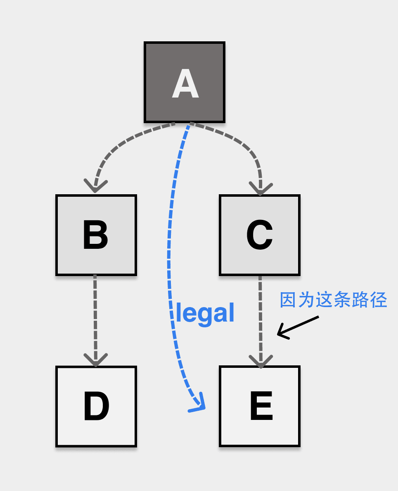

无论应用在与 GC 并发执行期间如何修改堆上对象的关系，只要修改之后，堆上对象能**满足任意一种不变性**，就不会发生对象的丢失问题。

而实现强/弱三色不变性均需要引入屏障技术。在 Go 语言中，使用写屏障，也就是 write barrier 来解决上述问题。

#### write barrier

这里barrier 的本质是 : snippet of code insert before pointer modify。不过，**在并发编程领域也有 memory barrier，但这个含义与 GC 领域的barrier是完全不同的**，在阅读相关材料时，你一定要注意不要混淆这两个概念。

Go 语言的 GC 只有 write barrier，没有 read barrier。

在应用进入 GC 标记阶段前的 stw 阶段，会将全局变量 runtime.writeBarrier.enabled 修改为 true，这时所有的堆上指针修改操作在修改之前便会额外调用 runtime.gcWriteBarrier：

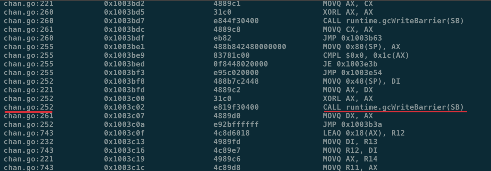

在反汇编结果中，我们可以通过行数找到原始的代码位置：


在GC领域中，常见的 write barrier 有两种：

- Dijistra Insertion Barrier，指针修改时，指向的新对象要标灰：-

- Yuasa Deletion Barrier，指针修改时，修改前指向的对象要标灰：-

​	

从理论上来讲，如果 Go 语言的所有对象都在堆上，使用上述两种屏障的任意一种，都不会发生对象丢失的问题。

但我们不要忽略，在 Go 语言中，还有很多对象被分配在栈上。栈上的对象操作极其频繁，给栈上对象增加写屏障成本很高，所以 Go 是不给栈上对象开启屏障的。

只对堆上对象开启写屏障的话，使用上述两种屏障其中的任意一种，都需要在 stw 阶段对栈进行重扫。所以经过多个版本的迭代，现在 Go 的写屏障混合了上述两种屏障，实现是这样的：


这和 Go 语言在混合屏障的 proposal 上的实现不太相符，本来 proposal 是这么写的：


为什么会有这种差异呢？这主要是因为栈的颜色判断成本是很高的，官方最终还是选择了更为简单的实现，即指针断开的老对象和新对象都标灰的实现。

我们再来详细地看看前面两种屏障的对象丢失问题。

- Dijistra Insertion Barrier 的对象丢失问题：-

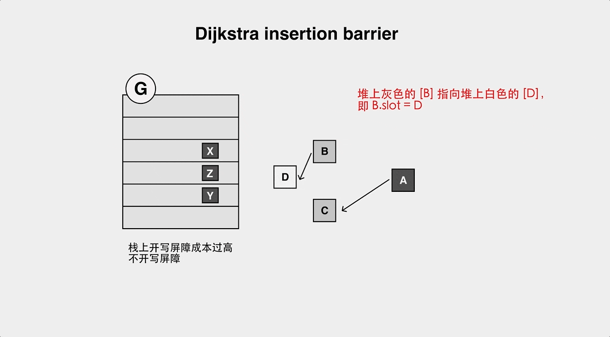

- Yuasa Deletion Barrier 的对象丢失问题：-


早期 Go 只使用了 Dijistra 屏障，但因为会有上述对象丢失问题，需要在第二个 stw 周期进行栈重扫（stack rescan）。当 goroutine 数量较多时，stw 时间会变得很长。

但单独使用任意一种 barrier ，又没法满足 Go 消除栈重扫的要求，所以最新版本中 Go 的混合屏障其实是 Dijistra Insertion Barrier + Yuasa Deletion Barrier。

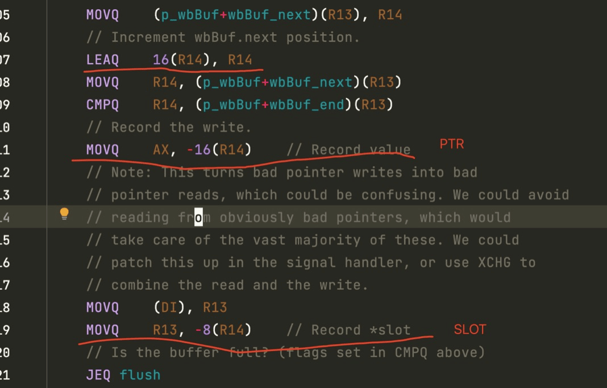

混合 write barrier 会将两个指针推到 p 的 wbBuf 结构去，看看这个过程：


mutator 和后台的 mark worker 在并发执行时的完整过程了：

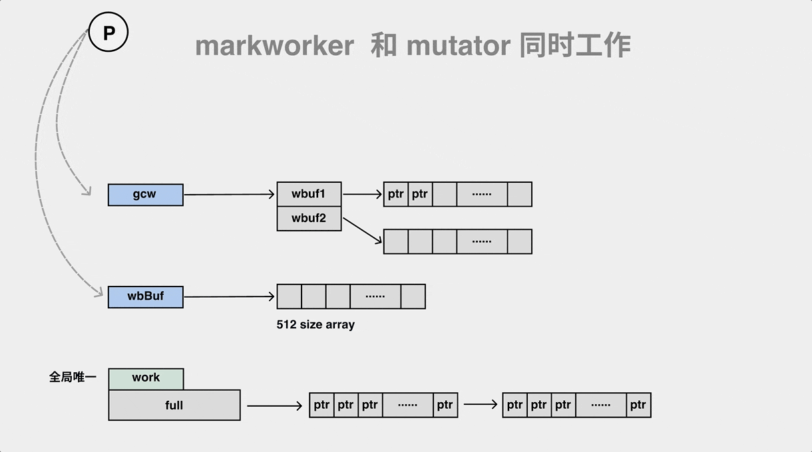

#### 回收流程

相比复杂的标记流程，对象的回收和内存释放就简单多了。

进程启动时会有两个特殊 goroutine：

- 一个叫 sweep.g，主要负责清扫死对象，合并相关的空闲页；
- 一个叫 scvg.g，主要负责向操作系统归还内存。

```
(dlv) goroutines
* Goroutine 1 - User: ./int.go:22 main.main (0x10572a6) (thread 5247606)
  Goroutine 2 - User: /usr/local/go/src/runtime/proc.go:367 runtime.gopark (0x102e596) [force gc (idle) 455634h24m29.787802783s]
  Goroutine 3 - User: /usr/local/go/src/runtime/proc.go:367 runtime.gopark (0x102e596) [GC sweep wait]
  Goroutine 4 - User: /usr/local/go/src/runtime/proc.go:367 runtime.gopark (0x102e596) [GC scavenge wait]
```

这里的 GC sweep wait 和 GC scavenge wait， 就是这两个 goroutine。

当 GC 的标记流程结束之后，sweep goroutine 就会被唤醒，进行清扫工作，其实就是循环执行 sweepone -> sweep。针对每个 mspan，sweep.g 的工作是将标记期间生成的 bitmap 替换掉分配时使用的 bitmap：


然后根据 mspan 中的槽位情况决定该 mspan 的去向：

- 如果 mspan 中存活对象数 = 0，也就是所有 element 都变成了内存垃圾，那执行 freeSpan -> 归还组成该 mspan 所使用的页，并更新全局的页分配器摘要信息；
- 如果 mspan 中没有空槽，说明所有对象都是存活的，将其放入 fullSwept 队列中；
- 如果 mspan 中有空槽，说明这个 mspan 还可以拿来做内存分配，将其放入 partialSweep 队列中。

之后“清道夫” scvg goroutine 被唤醒，执行线性流程，一路运行到将页内存归还给操作系统，也就是 bgscavenge -> pageAlloc.scavenge -> pageAlloc.scavengeOne -> pageAlloc.scavengeRangeLocked -> sysUnused -> madvise：

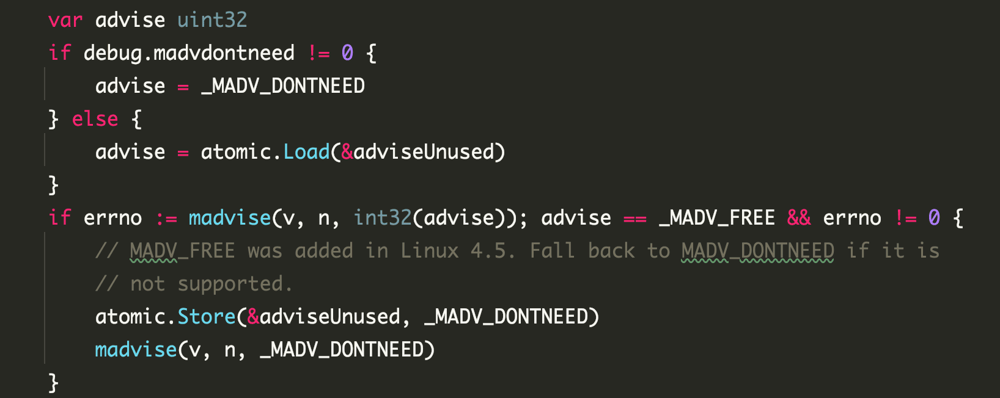


### 46.5 问题分析

从前面的基础知识中，可以总结出Go语言垃圾回收的关键点：

- 无分代；
- 与应用执行并发；
- 协助标记流程；
- 并发执行时开启 write barrier。

我们日常编码中就需要考虑这些关键点，进行一些针对性的设计与优化。比如，因为无分代，当我们遇到一些需要在内存中保留几千万 kv map 的场景（比如机器学习的特征系统）时，就需要想办法降低 GC 扫描成本。

又比如，因为有协助标记，当应用的 GC 占用的 CPU 超过 25% 时，会触发大量的协助标记，影响应用的延迟，这时也要对 GC 进行优化。

简单的业务场景，我们使用 sync.Pool 就可以带来较好的优化效果，若碰到一些复杂的业务场景，还要考虑 offheap 之类的欺骗 GC 的方案，比如 [dgraph 的方案](https://dgraph.io/blog/post/manual-memory-management-golang-jemalloc/)。因为我们这讲聚焦于内存分配和 GC 的实现，就不展开介绍这些具体方案了。

另外，这讲中涉及的所有内存管理的名词，你都可以在：[https://memorymanagement.org](https://memorymanagement.org/) 上找到。如果你还对垃圾回收的理论还有什么不解，我推荐你阅读：《[GC Handbook](https://gchandbook.org/)》，它可以解答你所有的疑问。


## Go语言学习资料


## 未来


字节的开源组织：https://github.com/cloudwego


