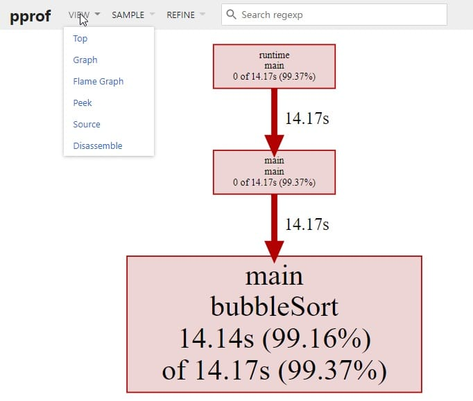
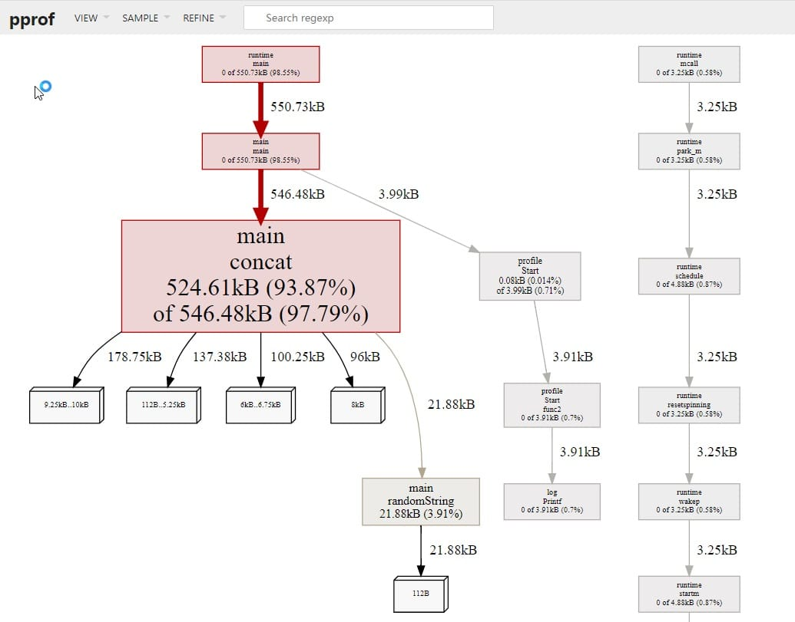

Go语言高性能编程
----


https://geektutu.com/post/high-performance-go.html


# 性能分析


## 1 benchmark基准测试


```shell
$ go test -bench .   
goos: darwin
goarch: arm64
pkg: example
cpu: Apple M1
BenchmarkFib-8               304           3788368 ns/op
PASS
ok      example 1.937s
$ go test -bench='Fib$' .
goos: darwin
goarch: arm64
pkg: example
cpu: Apple M1
BenchmarkFib-8               297           6086992 ns/op
PASS
ok      example 2.442s
```


### benchmark是如何工作的

benchmark 用例的参数 `b *testing.B`，有个属性 `b.N` 表示这个用例需要运行的次数。`b.N` 对于每个用例都是不一样的。

`b.N` 从 1 开始，如果该用例能够在 1s 内完成，`b.N` 的值便会增加，再次执行。`b.N` 的值大概以 1, 2, 3, 5, 10, 20, 30, 50, 100 这样的序列递增，越到后面，增加得越快。

enchmarkFib-8 中的 `-8` 即 `GOMAXPROCS`，默认等于 CPU 核数。可以通过 `-cpu` 参数改变 `GOMAXPROCS`，`-cpu` 支持传入一个列表作为参数，例如：

```sh
$ go test -bench='Fib$' -cpu=2,4 .
goos: darwin
goarch: arm64
pkg: example
cpu: Apple M1
BenchmarkFib-2               307           3940132 ns/op
BenchmarkFib-4               298           4004605 ns/op
PASS
ok      example 3.606s
```

在这个例子中，改变 CPU 的核数对结果几乎没有影响，因为这个 Fib 的调用是串行的。

上面`297` 和 `6086992 ns/op` 表示用例执行了 297 次，每次花费约 0.006s。总耗时1.782s。

### 提升准确度

对于性能测试来说，提升测试准确度的一个重要手段就是增加测试的次数。可以使用 `-benchtime` 和 `-count` 两个参数达到这个目的。

benchmark 的默认时间是 1s，那么可以使用 `-benchtime` 指定为 5s。例如：

```sh
$ go test -bench='Fib$' -benchtime=5s .
goos: darwin
goarch: amd64
pkg: example
BenchmarkFib-8              1033           5769818 ns/op
PASS
ok      example 6.554s
```

> 实际执行的时间是 6.5s，比 benchtime 的 5s 要长，测试用例编译、执行、销毁等是需要时间的。

将 `-benchtime` 设置为 5s，用例执行次数也变成了原来的 5倍，每次函数调用时间仍为 0.6s，几乎没有变化。

`-benchtime` 的值除了是时间外，还可以是具体的次数。例如，执行 30 次可以用 `-benchtime=30x`：

```sh
$ go test -bench='Fib$' -benchtime=50x .
goos: darwin
goarch: amd64
pkg: example
BenchmarkFib-8                50           6121066 ns/op
PASS
ok      example 0.319s
```

调用 50 次 `fib(30)`，仅花费了 0.319s。

`-count` 参数可以用来设置 benchmark 的轮数。例如，进行 3 轮 benchmark。

```sh
$ go test -bench='Fib$' -benchtime=5s -count=3 .
goos: darwin
goarch: arm64
pkg: example
cpu: Apple M1
BenchmarkFib-8              1522           3789071 ns/op
BenchmarkFib-8              1622           3715763 ns/op
BenchmarkFib-8              1624           3714399 ns/op
PASS
ok      example 19.154s
```

### 内存分配情况

`-benchmem` 参数可以度量内存分配的次数。内存分配次数也性能也是息息相关的，例如不合理的切片容量，将导致内存重新分配，带来不必要的开销。

在下面的例子中，`generateWithCap` 和 `generate` 的作用是一致的，生成一组长度为 n 的随机序列。唯一的不同在于，`generateWithCap` 创建切片时，将切片的容量(capacity)设置为 n，这样切片就会一次性申请 n 个整数所需的内存。

```sh
$ go test -bench='Generate' .
goos: darwin
goarch: amd64
pkg: example
BenchmarkGenerateWithCap-8            44          24294582 ns/op
BenchmarkGenerate-8                   34          30342763 ns/op
PASS
ok      example 2.171s
```

可以看到生成 100w 个数字的随机序列，`GenerateWithCap` 的耗时比 `Generate` 少 20%。

可以使用`-benchmem`参数看到内存分配的情况：

```sh
$ go test -bench='Generate' -benchmem   .
goos: darwin
goarch: amd64
pkg: example
BenchmarkGenerateWithCap-8  43  24335658 ns/op  8003641 B/op    1 allocs/op
BenchmarkGenerate-8         33  30403687 ns/op  45188395 B/op  40 allocs/op
PASS
ok      example 2.121s
```

`Generate` 分配的内存是 `GenerateWithCap` 的 6 倍，设置了切片容量，内存只分配一次，而不设置切片容量，内存分配了 40 次。

### 测试不同的输入

不同的函数复杂度不同，O(1)，O(n)，O(n^2) 等，利用 benchmark 验证复杂度一个简单的方式，是构造不同的输入。对刚才的 benchmark 稍作改造，便能够达到目的。

```go
func generate(n int) []int {
	rand.Seed(time.Now().UnixNano())
	nums := make([]int, 0)
	for i := 0; i < n; i++ {
		nums = append(nums, rand.Int())
	}
	return nums
}
func benchmarkGenerate(i int, b *testing.B) {
	for n := 0; n < b.N; n++ {
		generate(i)
	}
}

func BenchmarkGenerate1000(b *testing.B)    { benchmarkGenerate(1000, b) }
func BenchmarkGenerate10000(b *testing.B)   { benchmarkGenerate(10000, b) }
func BenchmarkGenerate100000(b *testing.B)  { benchmarkGenerate(100000, b) }
func BenchmarkGenerate1000000(b *testing.B) { benchmarkGenerate(1000000, b) }
```


```sh
$ go test -bench .                                                       
goos: darwin
goarch: amd64
pkg: example
BenchmarkGenerate1000-8            34048             34643 ns/op
BenchmarkGenerate10000-8            4070            295642 ns/op
BenchmarkGenerate100000-8            403           3230415 ns/op
BenchmarkGenerate1000000-8            39          32083701 ns/op
PASS
ok      example 6.597s
```

通过测试结果可以发现，输入变为原来的 10 倍，函数每次调用的时长也差不多是原来的 10 倍，这说明复杂度是线性的。


### benchmark注意事项

#### ResetTimer

如果在 benchmark 开始前，需要一些准备工作，如果准备工作比较耗时，则需要将这部分代码的耗时忽略掉。比如下面的例子：

```go
func BenchmarkFib(b *testing.B) {
	time.Sleep(time.Second * 3) // 模拟耗时准备任务
	for n := 0; n < b.N; n++ {
		fib(30) // run fib(30) b.N times
	}
}
```

运行结果是：

```sh
$ go test -bench='Fib$' -benchtime=50x .
goos: darwin
goarch: amd64
pkg: example
BenchmarkFib-8                50          65912552 ns/op
PASS
ok      example 6.319s
```

50次调用，每次调用约 0.66s，是之前的 0.06s 的 11 倍。究其原因，受到了耗时准备任务的干扰。我们需要用 `ResetTimer` 屏蔽掉：

```go
func BenchmarkFib(b *testing.B) {
	time.Sleep(time.Second * 3) // 模拟耗时准备任务
	b.ResetTimer() // 重置定时器
	for n := 0; n < b.N; n++ {
		fib(30) // run fib(30) b.N times
	}
}
```

运行结果恢复正常，每次调用约 0.06s。

```sh
$ go test -bench='Fib$' -benchtime=50x .
goos: darwin
goarch: amd64
pkg: example
BenchmarkFib-8                50           6187485 ns/op
PASS
ok      example 6.330s
```


#### StopTimer & StartTimer

还有一种情况，每次函数调用前后需要一些准备工作和清理工作，我们可以使用 `StopTimer` 暂停计时以及使用 `StartTimer` 开始计时。

例如，如果测试一个冒泡函数的性能，每次调用冒泡函数前，需要随机生成一个数字序列，这是非常耗时的操作，这种场景下，就需要使用 `StopTimer` 和 `StartTimer` 避免将这部分时间计算在内。

例如：

```go
// sort_test.go
package main

import (
	"math/rand"
	"testing"
	"time"
)

func generateWithCap(n int) []int {
	rand.Seed(time.Now().UnixNano())
	nums := make([]int, 0, n)
	for i := 0; i < n; i++ {
		nums = append(nums, rand.Int())
	}
	return nums
}

func bubbleSort(nums []int) {
	for i := 0; i < len(nums); i++ {
		for j := 1; j < len(nums)-i; j++ {
			if nums[j] < nums[j-1] {
				nums[j], nums[j-1] = nums[j-1], nums[j]
			}
		}
	}
}

func BenchmarkBubbleSort(b *testing.B) {
	for n := 0; n < b.N; n++ {
		b.StopTimer()
		nums := generateWithCap(10000)
		b.StartTimer()
		bubbleSort(nums)
	}
}
```

执行该用例，每次排序耗时约 0.1s。

```sh
$ go test -bench='Sort$' .
goos: darwin
goarch: amd64
pkg: example
BenchmarkBubbleSort-8                  9         113280509 ns/op
PASS
ok      example 1.146s
```


## 2 pprof性能分析

benchmark(基准测试) 可以度量某个函数或方法的性能，也就是说，如果知道性能的瓶颈点在哪里，benchmark 是一个非常好的方式。但是**面对一个未知的程序，如何去分析这个程序的性能，并找到瓶颈点呢**？

pprof就是用来解决这个问题的。pprof 包含两部分：

- 编译到程序中的`runtime/pprof`包
- 性能剖析工具`go tool pprof`

### 2.1 性能分析类型

#### CPU性能分析

CPU性能分析(CPU profiling) 是最常见的性能分析类型。

启动CPU分析时，运行时(runtime) 将每隔 10ms 中断一次，记录此时正在运行的协程(goroutines) 的堆栈信息。

程序运行结束后，可以分析记录的数据找到最热代码路径(hottest code paths)。

> Compiler hot paths are code execution paths in the compiler in which most of the execution time is spent, and which are potentially executed very often.
> – [What’s the meaning of “hot codepath”](https://english.stackexchange.com/questions/402436/whats-the-meaning-of-hot-codepath-or-hot-code-path)

一个函数在性能分析数据中出现的次数越多，说明执行该函数的代码路径(code path)花费的时间占总运行时间的比重越大。

#### 内存性能分析

内存性能分析(Memory profiling) 记录堆内存分配时的堆栈信息，忽略栈内存分配信息。

内存性能分析启用时，默认每1000次采样1次，这个比例是可以调整的。因为内存性能分析是基于采样的，因此基于内存分析数据来判断程序所有的内存使用情况是很困难的。

#### 阻塞性能分析

阻塞性能分析(block profiling) 是 Go 特有的。

阻塞性能分析用来记录一个协程等待一个共享资源花费的时间。在判断程序的并发瓶颈时会很有用。阻塞的场景包括：

- 在没有缓冲区的信道上发送或接收数据。
- 从空的信道上接收数据，或发送数据到满的信道上。
- 尝试获得一个已经被其他协程锁住的排它锁。

一般情况下，当所有的 CPU 和内存瓶颈解决后，才会考虑这一类分析。

#### 锁性能分析

锁性能分析(mutex profiling) 与阻塞分析类似，但专注于因为锁竞争导致的等待或延时。


### 2.2 CPU性能分析

> 记录性能数据会对程序的性能产生影响，建议一次只记录一类数据。

#### 生成profile

Go 的运行时性能分析接口都位于 `runtime/pprof` 包中。只需要调用 `runtime/pprof` 库即可得到我们想要的数据。

假设实现了这么一个程序，随机生成了 5 组数据，并且使用冒泡排序法排序。

```go
package main

import (
	"math/rand"
	"time"
)

func generate(n int) []int {
	rand.Seed(time.Now().UnixNano())
	nums := make([]int, 0)
	for i := 0; i < n; i++ {
		nums = append(nums, rand.Int())
	}
	return nums
}
func bubbleSort(nums []int) {
	for i := 0; i < len(nums); i++ {
		for j := 1; j < len(nums)-i; j++ {
			if nums[j] < nums[j-1] {
				nums[j], nums[j-1] = nums[j-1], nums[j]
			}
		}
	}
}

func main() {
	n := 10
	for i := 0; i < 5; i++ {
		nums := generate(n)
		bubbleSort(nums)
		n *= 10
	}
}
```

如果我们想度量这个应用程序的 CPU 性能数据，只需要在 main 函数中添加 2 行代码即可：

```go
func main() {
	pprof.StartCPUProfile(os.Stdout)
	defer pprof.StopCPUProfile()
	n := 10
	for i := 0; i < 5; i++ {
		nums := generate(n)
		bubbleSort(nums)
		n *= 10
	}
}
```

为了简单，直接将数据输出到标准输出 `os.Stdout`。运行该程序，将输出定向到文件 `cpu.pprof` 中。

```sh
$ go run main.go > cpu.pprof
```

也可以在程序中直接记录到一个文件中：

```go
	f, _ := os.OpenFile("cpu.pprof", os.O_CREATE|os.O_RDWR, 0644)
	defer f.Close()
	pprof.StartCPUProfile(f)
	defer pprof.StopCPUProfile()
```

#### 分析数据

用 `go tool pprof` 分析这份数据

```sh
$ go tool pprof -http=:9999 cpu.pprof
```

> 如果提示 Graphviz 没有安装，则通过 `brew install graphviz`(MAC) 或 `apt install graphviz`(Ubuntu) 即可。

访问 `localhost:9999`：



也可以在命令行中使用交互模式查看：

```sh
$ go tool pprof cpu.pprof
File: main
Type: cpu
Time: Nov 19, 2020 at 1:43am (CST)
Duration: 16.42s, Total samples = 14.26s (86.83%)
Entering interactive mode (type "help" for commands, "o" for options)
(pprof) top
Showing nodes accounting for 14.14s, 99.16% of 14.26s total
Dropped 34 nodes (cum <= 0.07s)
      flat  flat%   sum%        cum   cum%
    14.14s 99.16% 99.16%     14.17s 99.37%  main.bubbleSort
         0     0% 99.16%     14.17s 99.37%  main.main
         0     0% 99.16%     14.17s 99.37%  runtime.main
(pprof) 

```

可以看到 `main.bubbleSort` 是消耗 CPU 最多的函数。

还可以按照 `cum` (累计消耗)排序：

```
(pprof) top --cum
Showing nodes accounting for 14.14s, 99.16% of 14.26s total
Dropped 34 nodes (cum <= 0.07s)
      flat  flat%   sum%        cum   cum%
    14.14s 99.16% 99.16%     14.17s 99.37%  main.bubbleSort
         0     0% 99.16%     14.17s 99.37%  main.main
         0     0% 99.16%     14.17s 99.37%  runtime.main
```

`help` 可以查看所有支持的命令和选项：

```
(pprof) help
  Commands:
    callgrind        Outputs a graph in callgrind format
    comments         Output all profile comments
    disasm           Output assembly listings annotated with samples
    dot              Outputs a graph in DOT format
    eog              Visualize graph through eog
    evince           Visualize graph through evince
    gif              Outputs a graph image in GIF format
    gv               Visualize graph through gv
	......
```

### 2.3 内存性能分析

#### 生成 profile

使用一个易用性更强的库 `pkg/profile` 来采集性能数据，`pkg/profile` 封装了 `runtime/pprof` 的接口，使用起来更简单。

```sh
go get github.com/pkg/profile
```


想度量 `concat()` 的 CPU 性能数据，只需要一行代码即可生成 profile 文件。

```go
func main() {
	defer profile.Start().Stop()
  
	concat(100)
}
```


运行

```sh
$ go run main.go 
2025/06/25 20:48:13 profile: memory profiling enabled (rate 1), /var/folders/8k/ntbhdf615p34cflx1_qwv38r0000gn/T/profile2089134823/mem.pprof
2025/06/25 20:48:13 profile: memory profiling disabled, /var/folders/8k/ntbhdf615p34cflx1_qwv38r0000gn/T/profile2089134823/mem.pprof
```

CPU profile 文件已经在 tmp 目录生成，得到 profile 文件后，就可以像之前一样，用 `go tool pprof` 命令，在浏览器或命令行进行分析了。

接下来将使用类似的方式，进行采集内存数据，同样地，只需简单地修改 main 函数即可。

```go
func main() {
	defer profile.Start(profile.MemProfile, profile.MemProfileRate(1)).Stop()
	concat(100)
}
```

#### 分析数据

```sh
go tool pprof -http=:9999 /var/folders/8k/ntbhdf615p34cflx1_qwv38r0000gn/T/profile2089134823/mem.pprof
```



`concat` 消耗了 524k 内存，`randomString` 仅消耗了 22k 内存。理论上，`concat` 函数仅仅是将 `randomString` 生成的字符串拼接起来，消耗的内存应该和 `randomString` 一致，但怎么会产生 20 倍的差异呢？这和 Go 语言字符串内存分配的方式有关系。字符串是不可变的，因为将两个字符串拼接时，相当于是产生新的字符串，如果当前的空间不足以容纳新的字符串，则会申请更大的空间，将新字符串完全拷贝过去，这消耗了 2 倍的内存空间。在这 100 次拼接的过程中，会产生多次字符串拷贝，从而消耗大量的内存。

那有什么好的方式呢？使用 `strings.Builder` 替换 `+` 进行字符串拼接，将有效地降低内存消耗。

```go
func concat(n int) string {
	var s strings.Builder
	for i := 0; i < n; i++ {
		s.WriteString(randomString(n))
	}
	return s.String()
}
```

接下来，重新运行 `go run main.go`。


使用交互模式，查看内存消耗情况：

```
$ go tool pprof /tmp/profile061547314/mem.pprof
File: main
Type: inuse_space
Time: Nov 22, 2020 at 7:17pm (CST)
Entering interactive mode (type "help" for commands, "o" for options)
(pprof) top --cum
Showing nodes accounting for 71.22kB, 89.01% of 80.01kB total
Dropped 25 nodes (cum <= 0.40kB)
Showing top 10 nodes out of 50
      flat  flat%   sum%        cum   cum%
         0     0%     0%    71.88kB 89.84%  main.main
         0     0%     0%    71.88kB 89.84%  runtime.main
         0     0%     0%    67.64kB 84.54%  main.concat
   45.77kB 57.20% 57.20%    45.77kB 57.20%  strings.(*Builder).WriteString
   21.88kB 27.34% 84.54%    21.88kB 27.34%  main.randomString
```

可以看到，使用 `strings.Builder` 后，`concat` 内存消耗降为了原来的 1/8 。

### 2.4 benchmark生成profile

benchmark 除了直接在命令行中查看测试的结果外，也可以生成 profile 文件，使用 `go tool pprof` 分析。

`testing` 支持生成 CPU、memory 和 block 的 profile 文件。

- -cpuprofile=$FILE
- -memprofile=$FILE, -memprofilerate=N 调整记录速率为原来的 1/N。
- -blockprofile=$FILE


```sh
go test -bench="Fib$" -cpuprofile=cpu.pprof .
```


使用 `-text` 选项可以直接将结果以文本形式打印出来。

```
$ go tool pprof -text cpu.pprof
File: example.test
Type: cpu
Time: Nov 22, 2020 at 7:52pm (CST)
Duration: 2.01s, Total samples = 1.77s (87.96%)
Showing nodes accounting for 1.77s, 100% of 1.77s total
      flat  flat%   sum%        cum   cum%
     1.76s 99.44% 99.44%      1.76s 99.44%  example.fib
     0.01s  0.56%   100%      0.01s  0.56%  runtime.futex
         0     0%   100%      1.76s 99.44%  example.BenchmarkFib
         0     0%   100%      0.01s  0.56%  runtime.findrunnable
```

pprof 支持多种输出格式（图片、文本、Web等），直接在命令行中运行 `go tool pprof` 即可看到所有支持的选项：

```
$ go tool pprof

Details:
  Output formats (select at most one):
    -dot             Outputs a graph in DOT format
    -png             Outputs a graph image in PNG format
	-text            Outputs top entries in text form
    -tree            Outputs a text rendering of call graph
    -web             Visualize graph through web browser
	...
```