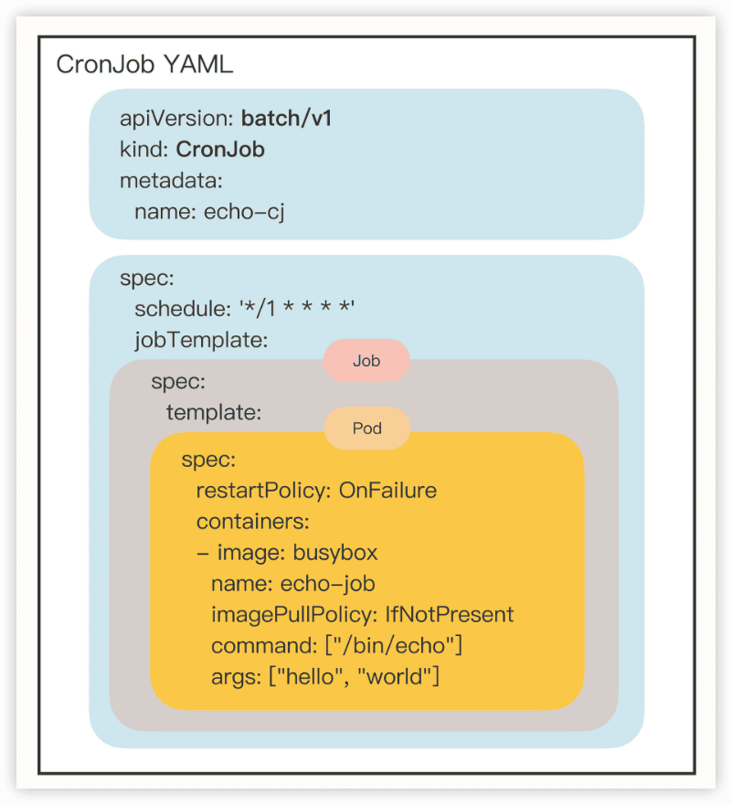

Kubernetes入门实战课
---

https://time.geekbang.org/column/intro/100114501

发布时间：2022

配套的学习项目：https://github.com/chronolaw/k8s_study

## 前言

现在Kubernetes已经没有了实际意义上的竞争对手，它的地位就如同Linux一样，成为了事实上的云原生操作系统，是构建现代应用的基石。

现代应用是什么？是微服务，是服务网格，这些统统要围绕着容器来开发、部署和运行，而使用容器就必然要用到容器编排技术，在现在只有唯一的选项，那就是Kubernetes。

```
 ;
 ;
 ;
```


### 学习Kubernetes有哪些难点

Kubernetes是一个分布式、集群化、云时代的系统，有许多新概念和新思维方式，和我们以往经验、认知的差异很大。

Kubernetes技术栈的特点，四个字概括：“**技术新、领域广、实现杂、方向深**”

- “**新**”是指Kubernetes用到的基本上都是比较前沿、陌生的技术，而且版本升级很快，经常变来变去。
- “**广**”是指Kubernetes涉及的应用领域很多、覆盖面非常广，不太好找到合适的切入点或者突破口。
- “**杂**”是指Kubernetes的各种实现比较杂乱，谁都可以上来“掺和”一下，让人看的眼晕。
- “**深**”是指Kubernetes面对的每个具体问题和方向，都需要有很深的技术背景和底蕴，想要吃透很不容易。


如果你真想做Kubernetes开发，等学会了Kubernetes的基本概念和用法，再回头去学Go语言也完全来得及。

学习Kubernetes最好的方式是**尽快建立一个全局观和大局观，等到你对这个陌生领域的全貌有了粗略但完整的认识之后，再挑选一个自己感兴趣的方向去研究，才是性价比最高的做法**。


2022年初发布的Kubernetes 1.23.3，是最后一个支持Docker的大版本，承上启下，具有很多的新特性，同时也保留了足够的历史兼容性，非常适合用来学习Kubernetes。

## 动手实践才是最好的学习方式


Ubuntu 22.04 Jammy Jellyfish 桌面版（https://ubuntu.com/download/desktop），它有足够新的特性，非常适合运行Kubernetes，而内置的浏览器、终端等工具也很方便我们的调试和测试。


# 入门

## 1 初识容器

### Docker的诞生

除了 Docker，其他容器技术还有 Kata、gVisor、rkt、podman 等，但都不如 Docker 流行。


我们还可以选择从 Docker 软件仓库，而不是Ubuntu 软件仓库来安装 Docker Engine,Docker 提供了官方的安装脚本，可以使用命令 `curl -fsSL
https://get.docker.com | bash -s docker`。用“docker version” 会看到有“Docker Engine - Community”的信息，表示社区版本（相应地还会有一个付费的“Docker Engine - Enterprise”）。

busybox 是一个小巧精致的“工具箱”，把诸多Linux 命令整合在一个可执行文件里，体积一般不超过2MB，非常适合测试任务或者嵌入式系统。

Moby是原来的Docker 开源项目，因为 Docker 已经成为了注册商标，所以在 2017年改了名字，作为目前 Docker 产品的试验上游而存在，类似 Fedora 与 CentOS/RHEL 的关系。

### Docker的形态

Docker Desktop之前一直是可以免费使用的，但在2021年8月31日，Docker 公司改变了策略，只对个人、教育和小型公司免费，其他形式的商业使用需要采用订阅制付费。

事实上，Docker Desktop 内部包含了 Docker Engine，也就是说，Docker Engine是Docker Desktop的核心组件之一。


### Docker的安装


```
{
    "dns": ["8.8.8.8", "8.8.4.4"],
    "registry-mirrors": [
        "https://docker.m.daocloud.io/",
        "https://huecker.io/",
        "https://dockerhub.timeweb.cloud",
        "https://noohub.ru/",
        "https://dockerproxy.com",
        "https://docker.mirrors.ustc.edu.cn",
        "https://docker.nju.edu.cn",
        "https://xx4bwyg2.mirror.aliyuncs.com",
        "http://f1361db2.m.daocloud.io",
        "https://registry.docker-cn.com",
        "http://hub-mirror.c.163.com"
    ]
}
```

### Docker的使用

### Docker的架构


## 2 被隔离的进程：容器的本质

广义上来说，容器技术是动态的容器、静态的镜像和远端的仓库这三者的组合。

### 容器到底是什么

集装箱的作用是标准化封装各种货物，一旦打包完成之后，就可以从一个地方迁移到任意的其他地方。相比散装形式而言，集装箱隔离了箱内箱外两个世界，保持了货物的原始形态，避免了内外部相互干扰，极大地简化了商品的存储、运输、管理等工作。

计算机世界，容器也发挥着同样的作用，不过它封装的货物是运行中的**应用程序**，也就是**进程**，同样它也会把进程与外界隔离开，让进程与外部系统互不影响。

```sh
docker pull ubuntu:18.04
docker run -it ubuntu:18.04 sh

# 下面的命令都是在容器内执行
cat /etc/os-release
apt update
apt install -y wget redis
redis-server &
```


### 为什么要隔离

计算机世界里的隔离目的也是**系统安全**。

对于Linux操作系统来说，一个不受任何限制的应用程序是十分危险的。这个进程能够看到系统里**所有的文件、所有的进程、所有的网络流量，访问内存里的任何数据**，那么恶意程序很容易就会把系统搞瘫痪，正常程序也可能会因为无意的Bug导致信息泄漏或者其他安全事故。虽然Linux提供了用户权限控制，能够限制进程只访问某些资源，但这个机制还是比较薄弱的，和真正的“隔离”需求相差得很远。

**使用容器技术，我们就可以让应用程序运行在一个有严密防护的“沙盒”（Sandbox）环境之内**。

**容器技术的另一个本领就是为应用程序加上==资源隔离==，在系统里切分出一部分资源，让它只能使用指定的配额**。

### 与虚拟机的区别是什么

容器和虚拟机面对的都是相同的问题，使用的也都是虚拟化技术，只是所在的**层次**不同。


（这图并不太准确，容器并不直接运行在Docker上，Docker只是==辅助建立隔离环境==，让容器基于Linux操作系统运行）

容器和虚拟机的目的都是隔离资源，保证系统安全，然后是尽量提高资源的利用率。

在数据中心的服务器上，虚拟机软件（即图中的`Hypervisor`）同样可以把一台物理服务器虚拟成多台逻辑服务器，这些逻辑服务器彼此独立，可以按需分隔物理服务器的资源，为不同的用户所使用。

从实现的角度来看，虚拟机虚拟化出来的是**硬件**，需要在上面再安装一个**操作系统**后才能够运行应用程序，而硬件虚拟化和操作系统都比较“重”，会消耗大量的CPU、内存、硬盘等系统资源，但这些消耗其实并没有带来什么价值，属于“重复劳动”和“无用功”，不过好处就是隔离程度非常高，每个虚拟机之间可以做到完全无干扰。

而**容器（Docker）直接利用了下层的计算机硬件和操作系统**，因为比虚拟机少了一层，所以自然就会节约CPU和内存，显得非常轻量级，能够更高效地利用硬件资源。


### 隔离是怎么实现的

容器隔离奥秘就在于Linux操作系统内核之中，为资源隔离提供了三种技术：**namespace、cgroup、chroot**，虽然这三种技术的初衷并不是为了实现容器，但它们三个结合在一起就会发生奇妙的“化学反应”。

- ==namespace==是2002年从Linux 2.4.19开始出现的，和编程语言里的namespace有点类似，它可以创建出独立的**文件系统、主机名、进程号、网络**等资源空间，相当于给进程盖了一间**小板房**，这样就实现了系统全局资源和进程局部资源的隔离。

- ==cgroup==是2008年从Linux 2.6.24开始出现的，它的全称是Linux Control Group，用来实现**对进程的CPU、内存等资源的优先级和配额限制**，相当于给进程的小板房加了一个**天花板**。

- ==chroot==的历史则要比前面的namespace、cgroup要古老得多，早在1979年的UNIX V7就已经出现了，它可以**更改进程的根目录，也就是限制访问文件系统**，相当于给进程的小板房铺上了**地砖**。


## 3 容器化的应用：会了这些你就是Docker高手

### 3.1 什么是容器化的应用

从功能上来看，镜像和常见的tar、rpm、deb等安装包一样，都打包了应用程序，**但最大的不同点在于它里面不仅有基本的可执行文件，还有应用运行时的整个系统环境。这就让镜像具有了非常好的跨平台便携性和兼容性**，能够让开发者在一个系统上开发（例如Ubuntu），然后打包成镜像，再去另一个系统上运行（例如CentOS），完全不需要考虑环境依赖的问题，是一种更高级的应用打包方式。

**所谓的“容器化的应用”，或者“应用的容器化”，就是指应用程序不再直接和操作系统打交道，而是封装成镜像，再交给容器环境去运行**。


### 3.2 常用的镜像操作有哪些

镜像的完整名字由两个部分组成，名字和标签，中间用:连接起来。


### 3.3 常用的容器操作有哪些

`docker run` 是最复杂的一个容器操作命令，有非常多的额外参数用来调整容器的运行状态，你可以加上 `--help` 来看它的帮助信息。


[Docker官方文档](https://docs.docker.com/reference/)


## 4 创建容器镜像：如何编写正确、高效的Dockerfile

> 这些镜像是怎么创建出来的？我们能不能够制作属于自己的镜像呢？

### 4.1 镜像的内部机制是什么

镜像就是一个打包文件，里面包含了应用程序还有它运行所依赖的环境，例如**文件系统、环境变量、配置参数**等等。

环境变量、配置参数，随便用一个manifest清单就可以管理。为了保证容器运行环境的一致性，镜像必须把应用程序所在操作系统的根目录，也就是rootfs，都包含进来。

> 容器共享了宿主机的内核。

分层

容器镜像内部并不是一个平坦的结构，而是由许多的镜像层组成的，每层都是只读不可修改的一组文件，相同的层可以在镜像之间共享，然后多个层像搭积木一样堆叠起来，再使用一种叫“**Union FS联合文件系统**”的技术把它们合并在一起，就形成了容器最终看到的文件系统。


 通过`docker inspect` 来查看镜像的分层信息，分层信息在“RootFS”部分:

```sh
docker inspect nginx:alpine
```

```json
"RootFS": {
  "Type": "layers",
  "Layers": [
    "sha256:534a70dc82967ee32184e13d28ea485e909b20d3f13d553122bab3e4de03b50c",
    "sha256:b2910501c84396134537ff442a4e2222ab6486c6016ea4c1016ed96337ef64ef",
    "sha256:cbb38b57f14055b3acc7a4bae43e5a41bcd7621c1f56f3f920abb89a65c3c025",
    "sha256:e1482d48072939900a66dbbec794450822aff9176d11302592f230249da91238",
    "sha256:3bc38db2acdbab2b44537e4a354dbcb05ed3bbbcb54674993471ee0c7232f041",
    "sha256:20ca17bb1caf19cc991d7b4bc6915b25c9fbe1e1b297f04712ec692b53017c9a",
    "sha256:856b39837f15b572e89d179002698b4f4e7447d91740590718368b7ebec9ff63",
    "sha256:a81f475c8ce219c6b25147ee82b5b101144ee007c3bd849db063be67e6a78521"
	]
},
```

Docker会检查是否有重复的层，如果本地已经存在就不会重复下载，如果层被其他镜像共享就不会删除，这样就可以节约磁盘和网络成本。

### 4.2 Dockerfile是什么

比起容器、镜像来说，Dockerfile非常普通，它就是一个**纯文本**，里面记录了一系列的构建指令，比如选择基础镜像、拷贝文件、运行脚本等等，**每个指令都会生成一个Layer**，而Docker顺序执行这个文件里的所有步骤，最后就会创建出一个新的镜像出来。

```dockerfile
# Dockerfile.busybox
FROM busybox                  # 选择基础镜像
CMD echo "hello world"        # 启动容器时默认运行的命令
```

- 第一条指令是 `FROM`，所有的Dockerfile都要从它开始，表示选择构建使用的基础镜像，相当于“打地基”。

- 第二条指令是 `CMD`，它指定 `docker run` 启动容器时默认运行的命令。

Dockerfile相当于“施工图纸”，而 `docker build` 就相当于“施工队”，来创建出镜像：

```sh
$ docker build -f Dockerfile.busybox .

[+] Building 0.0s (5/5) FINISHED                                                                                              docker:default
 => [internal] load build definition from Dockerfile.busybox                                                                            0.0s
 => => transferring dockerfile: 81B                                                                                                     0.0s
 => [internal] load metadata for docker.io/library/busybox:latest                                                                       0.0s
 => [internal] load .dockerignore                                                                                                       0.0s
 => => transferring context: 2B                                                                                                         0.0s
 => [1/1] FROM docker.io/library/busybox:latest                                                                                         0.0s
 => exporting to image                                                                                                                  0.0s
 => => exporting layers                                                                                                                 0.0s
 => => writing image sha256:e8c55f4e1cdf24541ba7e31ba2b5363efa2b3c6f939cb370ff1cb5395b9105a5                                            0.0s
```


### 4.3 怎样编写正确、高效的Dockerfile

`COPY`命令的用法和Linux的cp差不多，不过拷贝的源文件必须是“**构建上下文**”路径里的，不能随意指定文件。

```dockerfile
COPY ./a.txt  /tmp/a.txt    # 把构建上下文里的a.txt拷贝到镜像的/tmp目录
COPY /etc/hosts  /tmp       # 错误！不能使用构建上下文之外的文件
```

`RUN`是Dockerfile里最重要的一个指令，它可以执行任意的Shell命令，比如更新系统、安装应用、下载文件、创建目录、编译程序等等，实现任意的镜像构建步骤，非常灵活。

```dockerfile
RUN apt-get update \
    && apt-get install -y \
        build-essential \
        curl \
        make \
        unzip \
    && cd /tmp \
    && curl -fSL xxx.tar.gz -o xxx.tar.gz\
    && tar xzf xxx.tar.gz \
    && cd xxx \
    && ./config \
    && make \
    && make clean
```

太长可以**把这些Shell命令集中到一个脚本文件里，用 `COPY` 命令拷贝进去再用 `RUN` 来执行**：

```dockerfile
COPY setup.sh  /tmp/                # 拷贝脚本到/tmp目录

RUN cd /tmp && chmod +x setup.sh \  # 添加执行权限
    && ./setup.sh && rm setup.sh    # 运行脚本然后再删除
```

`RUN`指令实际上就是Shell编程，有变量的概念，可以实现参数化运行，需要使用两个指令 `ARG` 和 `ENV`。

**它们区别在于 `ARG` 创建的变量只在镜像构建过程中可见，容器运行时不可见，而 `ENV` 创建的变量不仅能够在构建镜像的过程中使用，在容器运行时也能够以环境变量的形式被应用程序使用。**

例子，使用 `ARG` 定义了基础镜像的名字（可以用在“FROM”指令里），使用 `ENV` 定义了两个环境变量：

```dockerfile
ARG IMAGE_BASE="node"
ARG IMAGE_TAG="alpine"

ENV PATH=$PATH:/tmp
ENV DEBUG=OFF
```

 `EXPOSE`令用来声明容器对外服务的端口号，对现在基于Node.js、Tomcat、Nginx、Go等开发的微服务系统来说非常有用：

```dockerfile
EXPOSE 443           # 默认是tcp协议
EXPOSE 53/udp        # 可以指定udp协议
```

> 注意：因为每个指令都会生成一个镜像层，所以Dockerfile里最好不要滥用指令，尽量精简合并，否则太多的层会导致镜像臃肿不堪。

### 4.4 docker build是怎么工作的

Dockerfile必须要经过 `docker build` 才能生效。

因为命令行“docker”是一个简单的客户端，真正的镜像构建工作是由服务器端的“Docker daemon”来完成的，所以“docker”客户端就只能把“构建上下文”目录打包上传（显示信息 `Sending build context to Docker daemon` ），这样服务器才能够获取本地的这些文件。


“构建上下文”其实与Dockerfile并没有直接的关系，它其实指定了要打包进镜像的一些依赖文件。而 `COPY` 命令也只能使用基于“构建上下文”的相对路径，因为“Docker daemon”看不到本地环境，只能看到打包上传的那些文件。

但这个机制也会导致一些麻烦，如果目录里有的文件（例如readme/.git/.svn等）不需要拷贝进镜像，docker也会一股脑地打包上传，效率很低。

为了避免这种问题，可以在“构建上下文”目录里再建立一个 `.dockerignore` 文件，语法与 `.gitignore` 类似，排除那些不需要的文件。

`-t` 参数，为镜像起一个有意义的名字，方便管理。


例子：

```dockerfile
# Dockerfile
# docker build -t ngx-app .
# docker build -t ngx-app:1.0 .

ARG IMAGE_BASE="nginx"
ARG IMAGE_TAG="1.21-alpine"

FROM ${IMAGE_BASE}:${IMAGE_TAG}

COPY ./default.conf /etc/nginx/conf.d/

RUN cd /usr/share/nginx/html \
    && echo "hello nginx" > a.txt

EXPOSE 8081 8082 8083
```


### 思考题

> docker镜像里的层都是只读不可修改的，但容器运行的时候经常会写入数据，这个冲突应该怎么解决呢？

- 当使用 Docker 运行一个容器时，会在镜像之上添加一个可写层。这就是 Docker 解决镜像层只读但容器需要写入数据的方式。
- 当在容器中创建、修改或删除文件时，这些操作实际上是在这个可写层上进行的，而不是直接修改镜像层。

> 镜像的分层结构带来了哪些好处?

1. 高效存储和共享

**复用层减少存储需求**

**快速分发和部署**

2. 易于更新和维护

**增量更新**

**版本控制**

3. 可移植性和隔离性

**跨平台一致性**

**隔离性**

4. 安全性和可靠性

**分层验证**

**故障隔离**

## 5 镜像仓库：该怎样用好Docker Hub这个宝藏

### 什么是镜像仓库（Registry）


Registry，直译就是“注册中心”，意思是所有镜像的Repository都在这里登记保管，就像是一个巨大的档案馆。

左边的“docker pull”，虚线显示了它的工作流程，先到“Docker daemon”，再到Registry，只有当Registry里存有镜像才能真正把它下载到本地。

镜像仓库除了能够拉取镜像，还可以上传、查询、删除等等。


### 什么是Docker Hub

“**Docker Hub**”（https://hub.docker.com/）是默认的官方镜像仓库。


### 如何在Docker Hub上挑选镜像

Docker Hub上有**官方镜像**（“**Official image**”）、**认证镜像**（“**Verified publisher**”）和**非官方镜像**的区别。

官方镜像是指Docker公司官方提供的高质量镜像（https://github.com/docker-library/official-images），都经过了严格的漏洞扫描和安全检测，支持x86_64、arm64等多种硬件架构，还具有清晰易读的文档，一般来说是我们构建镜像的首选，也是我们编写Dockerfile的最佳范例。

认证镜像，也就是认证发行商，比如Bitnami、Rancher、Ubuntu等。它们都是颇具规模的大公司，具有不逊于Docker公司的实力，所以就在Docker Hub上开了个认证账号，发布自己打包的镜像，有点类似我们微博上的“大V”。这些镜像有公司背书，当然也很值得信赖，不过它们难免会带上一些各自公司的“烙印”，比如Bitnami的镜像就统一以“minideb”为基础，灵活性上比Docker官方镜像略差，有的时候也许会不符合我们的需求。

非官方镜像可以分出两类：

1. “**半官方**”镜像
2. 纯粹的“**民间**”镜像


镜像区分：“**用户名/应用名**”，比如`bitnami/nginx`、`ubuntu/nginx`、`rancher/nginx` 等等。


### Docker Hub上镜像命名的规则是什么

官方的Redis镜像作为例子，解释一下标签。


通常来说，镜像标签的格式是**==应用的版本号+操作系统==**。

版本号基本上都是**==主版本号+次版本号+补丁号==**的形式，有的还会在正式发布前出==rc==版（候选版本，release candidate）。而操作系统的情况略微复杂一些，因为各个Linux发行版的命名方式“花样”太多了。

Alpine、CentOS的命名比较简单明了，就是数字的版本号，像这里的 `alpine3.15` ，而Ubuntu、Debian则采用了代号的形式。比如Ubuntu 18.04是 `bionic`，Ubuntu 20.04是 `focal`，Debian 9是 `stretch`，Debian 10是 `buster`，Debian 11是 `bullseye`。

**另外，有的标签还会加上 `slim`、`fat`，来进一步表示这个镜像的内容是经过精简的，还是包含了较多的辅助工具**。通常 `slim` 镜像会比较小，运行效率高，而 `fat` 镜像会比较大，适合用来开发调试。

几个标签的例子来说明一下。

- nginx:1.21.6-alpine，表示版本号是1.21.6，基础镜像是最新的Alpine。
- redis:7.0-rc-bullseye，表示版本号是7.0候选版，基础镜像是Debian 11。
- node:17-buster-slim，表示版本号是17，基础镜像是精简的Debian 10。

### 该怎么上传自己的镜像🔖

- 第一步，在Docker Hub上注册一个用户
- 第二步，在本机上使用 `docker login` 命令
- 第三步，使用 `docker tag` 命令，给镜像改成带用户名的完整名字，表示镜像是属于这个用户的。或者简单一点，直接用 `docker build -t` 在创建镜像的时候就起好名字。
- 第四步，用 `docker push` 把这个镜像推上去


### 离线环境该怎么办🔖

最佳的方法就是在内网环境里仿造Docker Hub，创建一个自己的私有Registry服务，由它来管理我们的镜像，就像我们自己搭建GitLab做版本管理一样。

自建Registry已经有很多成熟的解决方案，比如**Docker Registry**，还有**CNCF Harbor**。


## 6 打破次元壁：容器该如何与外界互联互通

### 6.1 如何拷贝容器内的数据

```sh
# -d、--rm 表示运行在后台，容器结束后自动删除
$ docker run -d --rm redis
e32062413b4aa0491aeec0f9d825e18074b3180c5cd4aac6a3f254e50ff4aff0

# 拷贝文件进入容器
$ docker cp a.txt e32:/tmp
$ docker exec -it e32 sh
# ls /tmp
a.txt


# 从容器中拷贝出文件
$ docker cp e32:/tmp/a.txt ./b.txt
```


### 6.2 如何共享主机上的文件

`-v 宿主机路径:容器内路径`

```sh
$ docker run -d --rm -v /tmp:/tmp redis
b905d006c3757df91434b9e24db36c653f7558e161ecddb4326ee3361650a6e2
$ docker exec -it b90 sh
```

> 简单例子
>
> 比如我本机上只有Python 2.7，但我想用Python 3开发，如果同时安装Python 2和Python 3很容易就会把系统搞乱，所以我就可以这么做：
>
> 1. 先使用 `docker pull` 拉取一个Python 3的镜像，因为它打包了完整的运行环境，运行时有隔离，所以不会对现有系统的Python 2.7产生任何影响。
>
> 2. 在本地的某个目录编写Python代码，然后用 `-v` 参数让容器共享这个目录。
>
> 3. 现在就可以在容器里以Python 3来安装各种包，再运行脚本做开发了。
>
>    ```sh
>    docker pull python:alpine 
>    docker run -it –rm -v `pwd`:/tmp python:alpine sh
>    ```
>
> 显然，这种方式比把文件打包到镜像或者 `docker cp` 会更加灵活，非常适合有频繁修改的开发测试工作。


### 6.3 如何实现网络互通

网络互通的关键在于“打通”容器内外的网络，而处理网络通信无疑是计算机系统里最棘手的工作之一，有许许多多的名词、协议、工具，在这里我也没有办法一下子就把它都完全说清楚，所以只能从“宏观”层面讲个大概，帮助你快速理解。

Docker提供了三种网络模式：

- **==null==**是最简单的模式，也就是没有网络，但允许其他的网络插件来自定义网络连接。
- **==host==**是直接使用宿主机网络，相当于去掉了容器的网络隔离（其他隔离依然保留），所有的容器会共享宿主机的IP地址和网卡。这种模式没有中间层，自然通信效率高，但缺少了隔离，运行太多的容器也容易导致端口冲突。

```sh
$docker run -d --rm --net=host nginx:alpine
efc735d506599d135db234ed3c53c6162e8deea84783b2befa25c93a66502a05
```

```sh
ip addr                    # 本机查看网卡
docker exec efc ip addr    # 容器查看网卡
```

结果两个网卡信息相同。

- **==bridge==**，也就是桥接模式，它有点类似现实世界里的交换机、路由器，只不过是由软件虚拟出来的，容器和宿主机再通过虚拟网卡接入这个网桥（图中的docker0），那么它们之间也就可以正常的收发网络数据包了。不过和host模式相比，bridge模式多了**虚拟网桥和网卡**，通信效率会低一些。


`--net=bridge`设置，但默认动车客人的网络模式就是bridge。

```sh
$ docker run -d --rm nginx:alpine
5e69c563f6f9516553e801b3e912bbd54a8003368a15578bbe8a2b0845e6b0af
$ docker run -d --rm redis
8401b08d75e927ea960cb3bcc59d9ecea5ed2f1f5860a74a997bd8ccfe8c314c
$ docker exec 5e6 ip addr
1: lo: <LOOPBACK,UP,LOWER_UP> mtu 65536 qdisc noqueue state UNKNOWN qlen 1000
    link/loopback 00:00:00:00:00:00 brd 00:00:00:00:00:00
    inet 127.0.0.1/8 scope host lo
       valid_lft forever preferred_lft forever
18: eth0@if19: <BROADCAST,MULTICAST,UP,LOWER_UP,M-DOWN> mtu 1500 qdisc noqueue state UP 
    link/ether 02:42:ac:11:00:02 brd ff:ff:ff:ff:ff:ff
    inet 172.17.0.2/16 brd 172.17.255.255 scope global eth0
       valid_lft forever preferred_lft forever
```

（redis容器里没有ip命令）

eth0是一个虚拟网卡，IP地址是B类私有地址“172.17.0.2”。

用 `docker inspect` 直接查看容器的ip地址：


两个容器的IP地址分别是“172.17.0.2”和“172.17.0.3”，而宿主机的IP地址则是“172.17.0.1”，所以它们都在“172.17.0.0/16”这个Docker的默认网段，彼此之间就能够使用IP地址来实现网络通信了。

### 6.4 如何分配服务端口号

服务器应用都必须要有端口号才能对外提供服务，比如HTTP协议用80、HTTPS用443、Redis是6379、MySQL是3306。

**端口号映射需要使用bridge模式，并且在 `docker run` 启动容器时使用 `-p` 参数，形式和共享目录的 `-v` 参数很类似，用 `:` 分隔本机端口和容器端口**。

```sh
$ docker run -d -p 80:80 --rm nginx:alpine
9726b1db68c288a26d3461961e51cdbc30a7dcdf1ec59c82d01af8391f900bdf
$ docker run -d -p 8080:80 --rm nginx:alpine
1b042e8da44644a5e1e611b19759fd6f3217e87020f3872ddbf3df6a826e82d3
$ curl 127.1:8080 -I
HTTP/1.1 200 OK
Server: nginx/1.27.3
Date: Tue, 14 Jan 2025 07:56:08 GMT
Content-Type: text/html
Content-Length: 615
Last-Modified: Tue, 26 Nov 2024 17:22:24 GMT
Connection: keep-alive
ETag: "674603d0-267"
Accept-Ranges: bytes

$ curl 127.1:80 -I
HTTP/1.1 200 OK
Server: nginx/1.27.3
Date: Tue, 14 Jan 2025 07:56:13 GMT
Content-Type: text/html
Content-Length: 615
Last-Modified: Tue, 26 Nov 2024 17:22:24 GMT
Connection: keep-alive
ETag: "674603d0-267"
Accept-Ranges: bytes
```


### 小结

```
docker cp
docker run -v
docker run -p
```

### 思考题

>  `docker cp` 命令和Dockerfile里的`COPY`指令有什么区别？


> host模式和bridge模式各有什么优缺点，在什么场景下应用最合适？

- Bridge 模式

适合大多数开发、测试和一般的生产场景，提供了较好的网络隔离性和灵活的网络配置，但在性能和网络拓扑复杂时需要考虑性能和网络配置的复杂性。

- Host 模式

适合对性能要求高、需要与主机网络紧密交互的应用，但在使用时要注意网络隔离和安全风险，避免对主机网络造成影响。

在实际应用中，需要根据具体的业务需求、性能要求和安全考虑，合理选择 Docker 的网络模式，确保容器的网络性能和安全。


## 7 实战演练：玩转Docker

### 7.1 容器技术要点回顾

容器技术是后端应用领域的一项重大创新，它彻底变革了应用的开发、交付与部署方式，是“云原生”的根本（[01讲]）。

容器基于Linux底层的namespace、cgroup、chroot等功能，虽然它们很早就出现了，但直到Docker“横空出世”，把它们整合在一起，容器才真正走近了大众的视野，逐渐为广大开发者所熟知（[02讲]）。

容器技术中有三个核心概念：**容器（Container）**、**镜像（Image）**，以及**镜像仓库（Registry）**（[03讲]）。

从本质上来说，容器属于虚拟化技术的一种，和虚拟机（Virtual Machine）很类似，都能够分拆系统资源，隔离应用进程，但容器更加轻量级，运行效率更高，比虚拟机更适合云计算的需求。

镜像是容器的静态形式，它把应用程序连同依赖的操作系统、配置文件、环境变量等等都打包到了一起，因而能够在任何系统上运行，免除了很多部署运维和平台迁移的麻烦。

镜像内部由多个层（Layer）组成，每一层都是一组文件，多个层会使用Union FS技术合并成一个文件系统供容器使用。这种细粒度结构的好处是相同的层可以共享、复用，节约磁盘存储和网络传输的成本，也让构建镜像的工作变得更加容易（[04讲]）。

为了方便管理镜像，就出现了镜像仓库，它集中存放各种容器化的应用，用户可以任意上传下载，是分发镜像的最佳方式（[05讲]）。

目前最知名的公开镜像仓库是Docker Hub，其他的还有quay.io、gcr.io，我们可以在这些网站上找到许多高质量镜像，集成到我们自己的应用系统中。

容器技术有很多具体的实现，Docker是最初也是最流行的容器技术，它的主要形态是运行在Linux上的“Docker Engine”。我们日常使用的 `docker` 命令其实只是一个前端工具，它必须与后台服务“Docker daemon”通信才能实现各种功能。

操作容器的常用命令有 `docker ps`、`docker run`、`docker exec`、`docker stop` 等；

操作镜像的常用命令有 `docker images`、`docker rmi`、`docker build`、`docker tag` 等；

操作镜像仓库的常用命令有 `docker pull`、`docker push` 等。


### 7.2 实战1：建私有镜像仓库

选择最简单的[Docker Registry](https://registry.hub.docker.com/_/registry/)。

```
docker pull registry
```

对外暴露端口，这样Docker Registry才能提供服务，它的容器内端口是5000，简单起见，在外面也可以使用同样的5000端口:

```sh
docker run -d -p 5000:5000 registry
24c8feddb2ce3c78ca87df0874b899a47d0278930b603b2e19fc59a0486ba30c

docker ps
CONTAINER ID   IMAGE          COMMAND                   CREATED          STATUS          PORTS                                       NAMES
24c8feddb2ce   registry       "/entrypoint.sh /etc…"   5 seconds ago    Up 4 seconds    0.0.0.0:5000->5000/tcp, :::5000->5000/tcp   jovial_rubin
```

使用 `docker tag` 命令给镜像打标签再上传了。因为上传的目标不是默认的Docker Hub，而是本地的私有仓库，所以镜像的名字前面还必须再加上仓库的地址（域名或者IP地址都行），形式上和HTTP的URL非常像：

```sh
docker tag nginx:alpine 127.0.0.1:5000/nginx:alpine

docker images
REPOSITORY             TAG           IMAGE ID       CREATED         SIZE
127.0.0.1:5000/nginx   alpine        f9d642c42f7b   6 weeks ago     50.9MB
nginx                  alpine        f9d642c42f7b   6 weeks ago     50.9MB
```

现在，这个镜像有了一个附加仓库地址的完整名字，就可以用 `docker push` 推上去了：

```sh
$ docker push 127.0.0.1:5000/nginx:alpine
The push refers to repository [127.0.0.1:5000/nginx]
a81f475c8ce2: Pushed 
856b39837f15: Pushed 
20ca17bb1caf: Pushed 
3bc38db2acdb: Pushed 
e1482d480729: Pushed 
cbb38b57f140: Pushed 
b2910501c843: Pushed 
534a70dc8296: Pushed 
alpine: digest: sha256:4311264dbcbc9f56fa0809d1b4c551827c64abbc717bcd7a76f4407bbfc863b6 size: 1989
```


为了验证是否已经成功推送，可以把刚才打标签的镜像删掉，再重新下载：

```
docker rmi  127.0.0.1:5000/nginx:alpine
docker pull 127.0.0.1:5000/nginx:alpine
```

```sh
$ docker rmi  127.0.0.1:5000/nginx:alpine
Untagged: 127.0.0.1:5000/nginx:alpine
Untagged: 127.0.0.1:5000/nginx@sha256:4311264dbcbc9f56fa0809d1b4c551827c64abbc717bcd7a76f4407bbfc863b6

$ docker pull 127.0.0.1:5000/nginx:alpine
alpine: Pulling from nginx
Digest: sha256:4311264dbcbc9f56fa0809d1b4c551827c64abbc717bcd7a76f4407bbfc863b6
Status: Downloaded newer image for 127.0.0.1:5000/nginx:alpine
127.0.0.1:5000/nginx:alpine
```

原来的层原本就已经存在，所以不会有实际的下载动作，只会创建一个新的镜像标签。

Docker Registry虽然没有图形界面，但提供了RESTful API，也可以发送HTTP请求来查看仓库里的镜像，具体的端点信息可以参考官方文档（https://docs.docker.com/registry/spec/api/），下面的这两条curl命令就分别获取了镜像列表和Nginx镜像的标签列表：

```sh
curl 127.1:5000/v2/_catalog
curl 127.1:5000/v2/nginx/tags/list
```

```sh
curl 127.1:5000/v2/_catalog
{"repositories":["nginx"]}
curl 127.1:5000/v2/nginx/tags/list
{"name":"nginx","tags":["alpine"]}
```


### 7.3 实战2：搭建WordPress网站

```sh
docker pull wordpress:5
docker pull mariadb:10
docker pull nginx:alpine
```


这个系统可以说是比较典型的网站了。MariaDB作为后面的关系型数据库，端口号是3306；WordPress是中间的应用服务器，使用MariaDB来存储数据，它的端口是80；Nginx是前面的反向代理，它对外暴露80端口，然后把请求转发给WordPress。

用 `--env` 参数来指定启动时的数据库、用户名和密码:

```
docker run -d --rm \
    --env MARIADB_DATABASE=db \
    --env MARIADB_USER=wp \
    --env MARIADB_PASSWORD=123 \
    --env MARIADB_ROOT_PASSWORD=123 \
    mariadb:10
```

使用 `docker exec` 命令，执行数据库的客户端工具“mysql”，验证数据库是否正常运行：

```
docker exec -it 64d mysql -u wp -p
```


```sh
$ docker run -d --rm \
    --env MARIADB_DATABASE=db \
    --env MARIADB_USER=wp \
    --env MARIADB_PASSWORD=123 \
    --env MARIADB_ROOT_PASSWORD=123 \
    mariadb:10
64d53f78a94825e5f36fde8cf3f89215633a322e7075e491128cb3197053754c
$ docker exec -it 64d mysql -u wp -p
Enter password: 
Welcome to the MariaDB monitor.  Commands end with ; or \g.
Your MariaDB connection id is 3
Server version: 10.11.10-MariaDB-ubu2204 mariadb.org binary distribution

Copyright (c) 2000, 2018, Oracle, MariaDB Corporation Ab and others.

Type 'help;' or '\h' for help. Type '\c' to clear the current input statement.

MariaDB [(none)]> show databases;
+--------------------+
| Database           |
+--------------------+
| db                 |
| information_schema |
+--------------------+
2 rows in set (0.001 sec)
```

Docker的bridge网络模式的默认网段是“172.17.0.0/16”，宿主机固定是“172.17.0.1”，而且IP地址是顺序分配的。

```
docker inspect 64d | grep IPAddress
            "SecondaryIPAddresses": null,
            "IPAddress": "172.17.0.7",
                    "IPAddress": "172.17.0.7",
```


运行应用服务器WordPress也要用 `--env` 参数来指定一些环境变量才能连接到MariaDB，注意“WORDPRESS_DB_HOST”必须是MariaDB的IP地址，否则会无法连接数据库：

```sh
$ docker run -d --rm \
    --env WORDPRESS_DB_HOST=172.17.0.7 \
    --env WORDPRESS_DB_USER=wp \
    --env WORDPRESS_DB_PASSWORD=123 \
    --env WORDPRESS_DB_NAME=db \
    wordpress:5
    
36caa9db5e8f437d56fee2334ef0975dae71529331551e2b0c6fe59a4e330111  

$ docker inspect 36c | grep IPAddress
            "SecondaryIPAddresses": null,
            "IPAddress": "172.17.0.8",
                    "IPAddress": "172.17.0.8",
```

WordPress容器在启动的时候并没有使用 `-p` 参数映射端口号，所以外界是不能直接访问的，需要在前面配一个Nginx反向代理，把请求转发给WordPress的80端口。配置Nginx反向代理必须要知道WordPress的IP地址。

nginx的配置文件（wp.conf）：

```nginx
server {
  listen 80;
  default_type text/html;

  location / {
      proxy_http_version 1.1;
      proxy_set_header Host $host;
      proxy_pass http://172.17.0.8;
  }
}
```

有了这个配置文件，就需要用 `-p` 参数把本机的端口映射到Nginx容器内部的80端口，再用 `-v` 参数把配置文件挂载到Nginx的“conf.d”目录下。这样，Nginx就会使用刚才编写好的配置文件，在80端口上监听HTTP请求，再转发到WordPress应用：

```sh
docker run -d --rm \
    -p 80:80 \
    -v `pwd`/wp.conf:/etc/nginx/conf.d/default.conf \
    nginx:alpine
```


可以看到，WordPress和MariaDB虽然使用了80和3306端口，但被容器隔离，外界不可见，只有Nginx有端口映射，能够从外界的80端口收发数据，网络状态和我们的架构图是一致的。


在浏览器访问http://10.211.55.6/，就可以看到WordPress的界面，按步骤创建基本的用户、初始化网站之后，MariaDB中就有相应的表:

```sh
$ docker exec -it 64d mysql -u wp -p
Enter password: 
Welcome to the MariaDB monitor.  Commands end with ; or \g.
Your MariaDB connection id is 3
Server version: 10.11.10-MariaDB-ubu2204 mariadb.org binary distribution

Copyright (c) 2000, 2018, Oracle, MariaDB Corporation Ab and others.

Type 'help;' or '\h' for help. Type '\c' to clear the current input statement.

MariaDB [(none)]> use db;
Database changed
MariaDB [db]> show tables;
Empty set (0.000 sec)

MariaDB [db]> show tables;
+-----------------------+
| Tables_in_db          |
+-----------------------+
| wp_commentmeta        |
| wp_comments           |
| wp_links              |
| wp_options            |
| wp_postmeta           |
| wp_posts              |
| wp_term_relationships |
| wp_term_taxonomy      |
| wp_termmeta           |
| wp_terms              |
| wp_usermeta           |
| wp_users              |
+-----------------------+
12 rows in set (0.001 sec)
```


### 小结


在感受容器便利的同时，还是存在一些遗憾呢？比如说：

- 我们还是要手动运行一些命令来启动应用，然后再人工确认运行状态。
- 运行多个容器组成的应用比较麻烦，需要人工干预（如检查IP地址）才能维护网络通信。
- 现有的网络模式功能只适合单机，多台服务器上运行应用、负载均衡该怎么做？
- 如果要增加应用数量该怎么办？这时容器技术完全帮不上忙。

这个方案已经超越了容器技术本身，是在更高的层次上规划容器的运行次序、网络连接、数据持久化等应用要素，也就是现在我们常说的“**容器编排**”（Container Orchestration）的雏形，也正是后面要学习的Kubernetes的主要出发点。


## 8 视频：入门篇实操总结

```
docker version
docker info 显示的是当前系统相关的信息，例如 CPU、内存、容器数量、镜像数量、容器运行时、存储文件系统等等。
```


# 初级

## 9 走近云原生：如何在本机搭建小巧完备的Kubernetes环境

什么是容器编排
什么是Kubernetes
什么是minikube
如何搭建minikube环境
实际验证minikube环境


## 10 自动化的运维管理：探究Kubernetes工作机制的奥秘

### 10.1 云计算时代的操作系统


### 10.2 Kubernetes的基本架构


### 10.3 节点内部的结构

#### Master里的组件有哪些

Master里有4个组件是**apiserver**、**etcd**、**scheduler**、**controller-manager**。


#### Node里的组件有哪些


#### 插件（Addons）有哪些


### 小结


1. Kubernetes能够在集群级别管理应用和服务器，可以认为是一种集群操作系统。它使用“控制面/数据面”的基本架构，Master节点实现管理控制功能，Worker节点运行具体业务。
2. Kubernetes由很多模块组成，可分为核心的组件和选配的插件两类。
3. Master里有4个组件，分别是apiserver、etcd、scheduler、controller-manager。
4. Node里有3个组件，分别是kubelet、kube-proxy、container-runtime。
5. 通常必备的插件有DNS和Dashboard。


## 11 YAML：Kubernetes世界里的通用语

### 声明式与命令式是怎么回事

### 什么是YAML

### 什么是API对象

### 如何描述API对象

### 如何编写YAML


### 小结

声明式的语言能够更准确更清晰地描述系统状态，避免引入繁琐的操作步骤扰乱系统，与Kubernetes高度自动化的内部结构相得益彰，而且纯文本形式的YAML也很容易版本化，适合CI/CD。

内容要点：

1. YAML是JSON的超集，支持数组和对象，能够描述复杂的状态，可读性也很好。
2. Kubernetes把集群里的一切资源都定义为API对象，通过RESTful接口来管理。描述API对象需要使用YAML语言，必须的字段是**apiVersion、kind、metadata**。
3. 命令 `kubectl api-resources` 可以查看对象的apiVersion和kind，命令 `kubectl explain` 可以查看对象字段的说明文档。
4. 命令 `kubectl apply`、`kubectl delete` 发送HTTP请求，管理API对象。
5. 使用参数 `--dry-run=client -o yaml` 可以生成对象的YAML模板，简化编写工作。


## 12 Pod：如何理解这个Kubernetes里最核心的概念？

### 为什么要有Pod


### 为什么Pod是Kubernetes的核心对象


### 如何使用YAML描述Pod


### 如何使用kubectl操作Pod


### 小结

Pod屏蔽了容器的一些底层细节，同时又具有足够的控制管理能力，比起容器的“细粒度”、虚拟机的“粗粒度”，Pod可以说是“中粒度”，灵活又轻便，非常适合在云计算领域作为应用调度的基本单元，因而成为了Kubernetes世界里构建一切业务的“原子”。

知识要点：

1. 现实中经常会有多个进程密切协作才能完成任务的应用，而仅使用容器很难描述这种关系，所以就出现了Pod，它“打包”一个或多个容器，保证里面的进程能够被整体调度。
2. Pod是Kubernetes管理应用的最小单位，其他的所有概念都是从Pod衍生出来的。
3. Pod也应该使用YAML“声明式”描述，关键字段是“spec.containers”，列出名字、镜像、端口等要素，定义内部的容器运行状态。
4. 操作Pod的命令很多与Docker类似，如 `kubectl run`、`kubectl cp`、`kubectl exec` 等，但有的命令有些小差异，使用的时候需要注意。


在Kubernetes里通常并不会直接创建Pod，因为它只是对容器做了简单的包装，比较脆弱，离复杂的业务需求还有些距离，需要Job、CronJob、Deployment等其他对象增添更多的功能才能投入生产使用。


## 13 Job_CronJob：为什么不直接用Pod来处理业务？

### 为什么不直接使用Pod

### 为什么要有Job/CronJob

#### 如何使用YAML描述Job


#### 如何在Kubernetes里操作Job


### 如何使用YAML描述CronJob




### 小结


1. Pod是Kubernetes的最小调度单元，但为了保持它的独立性，不应该向它添加多余的功能。
2. Kubernetes为离线业务提供了Job和CronJob两种API对象，分别处理“临时任务”和“定时任务”。
3. Job的关键字段是 `spec.template`，里面定义了用来运行业务的Pod模板，其他的重要字段有 `completions`、`parallelism` 等
4. CronJob的关键字段是 `spec.jobTemplate` 和 `spec.schedule`，分别定义了Job模板和定时运行的规则。


## 14 ConfigMap_Secret：怎样配置、定制我的应用

### ConfigMap/Secret

什么是ConfigMap
什么是Secret


### 如何使用

如何以环境变量的方式使用ConfigMap/Secret
如何以Volume的方式使用ConfigMap/Secret


## 15 实战演练：玩转Kubernetes（1）


## 16 视频：初级篇实操总结


# 中级

## 17 更真实的云原生：实际搭建多节点的Kubernetes集群


## 18 Deployment：让应用永不宕机

### 为什么要有Deployment

### 如何使用YAML描述Deployment

### Deployment的关键字段

### 如何使用kubectl操作Deployment


### 小结

Deployment，它表示的是在线业务，和Job/CronJob的结构类似，也包装了Pod对象，通过添加额外的控制功能实现了应用永不宕机。


1. Pod只能管理容器，不能管理自身，所以就出现了Deployment，由它来管理Pod。
2. Deployment里有三个关键字段，其中的template和Job一样，定义了要运行的Pod模板。
3. replicas字段定义了Pod的“期望数量”，Kubernetes会自动维护Pod数量到正常水平。
4. selector字段定义了基于labels筛选Pod的规则，它必须与template里Pod的labels一致。
5. 创建Deployment使用命令 `kubectl apply`，应用的扩容、缩容使用命令 `kubectl scale`。


## 19 Daemonset：忠实可靠的看门狗

为什么要有DaemonSet
如何使用YAML描述DaemonSet
如何在Kubernetes里使用DaemonSet
什么是污点（taint）和容忍度（toleration）
什么是静态Pod


## 20 Service：微服务架构的应对之道

为什么要有Service
如何使用YAML描述Service
如何在Kubernetes里使用Service
如何以域名的方式使用Service
如何让Service对外暴露服务


## 21 Ingress：集群进出流量的总管

为什么要有Ingress
为什么要有Ingress Controller
为什么要有IngressClass
如何使用YAML描述Ingress/Ingress Class
如何在Kubernetes里使用Ingress/Ingress Class
如何在Kubernetes里使用Ingress Controller


## 22 实战演练：玩转Kubernetes（2）


## 23 视频：中级篇实操总结


# 高级

## 24 PersistentVolume：怎么解决数据持久化的难题？

什么是PersistentVolume
什么是PersistentVolumeClaim/StorageClass
如何使用YAML描述PersistentVolume
如何使用YAML描述PersistentVolumeClaim
如何在Kubernetes里使用PersistentVolume
如何为Pod挂载PersistentVolume


## 25 PersistentVolume + NFS：怎么使用网络共享存储？

如何安装NFS服务器
如何安装NFS客户端
如何使用NFS存储卷
如何部署NFS Provisoner
如何使用NFS动态存储卷

## 26 StatefulSet：怎么管理有状态的应用？

什么是有状态的应用
如何使用YAML描述StatefulSet
如何在Kubernetes里使用StatefulSet
如何实现StatefulSet的数据持久化


## 27 滚动更新：如何做到平滑的应用升级降级？

Kubernetes如何定义应用版本
Kubernetes如何实现应用更新
Kubernetes如何管理应用更新
Kubernetes如何添加更新描述

## 28 应用保障：如何让Pod运行得更健康？

容器资源配额
什么是容器状态探针
如何使用容器状态探针

## 29 集群管理：如何用名字空间分隔系统资源？

为什么要有名字空间
如何使用名字空间
什么是资源配额
如何使用资源配额
默认资源配额

## 30 系统监控：如何使用Metrics Server和Prometheus？


## 31 网络通信：CNI是怎么回事？又是怎么工作的？

Kubernetes的网络模型
什么是CNI
CNI插件是怎么工作的
使用Calico网络插件


## 32 实战演练：玩转Kubernetes（3）


## 33 视频：高级篇实操总结


## docker-compose：单机环境下的容器编排工具


## 谈谈Kong Ingress Controller

结束语 是终点，更是起点
