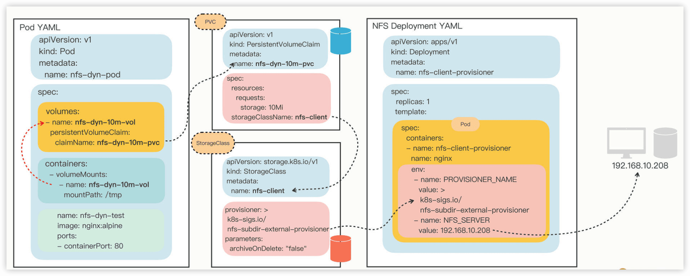
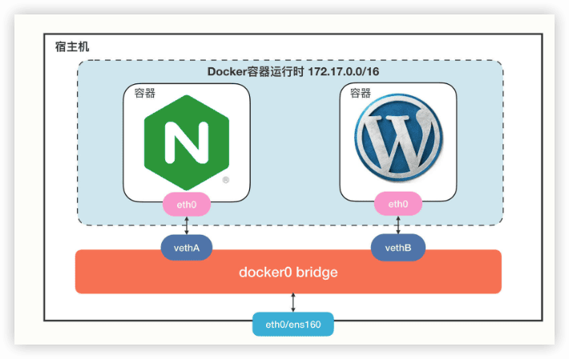

Kubernetes入门实战课
---

https://time.geekbang.org/column/intro/100114501

发布时间：2022

配套的学习项目：https://github.com/chronolaw/k8s_study

## 前言

现在Kubernetes已经没有了实际意义上的竞争对手，它的地位就如同Linux一样，成为了事实上的云原生操作系统，是构建现代应用的基石。

现代应用是什么？是微服务，是服务网格，这些统统要围绕着容器来开发、部署和运行，而使用容器就必然要用到容器编排技术，在现在只有唯一的选项，那就是Kubernetes。

```
 ;
 ;
 ;
```


### 学习Kubernetes有哪些难点

Kubernetes是一个分布式、集群化、云时代的系统，有许多新概念和新思维方式，和我们以往经验、认知的差异很大。

Kubernetes技术栈的特点，四个字概括：“**技术新、领域广、实现杂、方向深**”

- “**新**”是指Kubernetes用到的基本上都是比较前沿、陌生的技术，而且版本升级很快，经常变来变去。
- “**广**”是指Kubernetes涉及的应用领域很多、覆盖面非常广，不太好找到合适的切入点或者突破口。
- “**杂**”是指Kubernetes的各种实现比较杂乱，谁都可以上来“掺和”一下，让人看的眼晕。
- “**深**”是指Kubernetes面对的每个具体问题和方向，都需要有很深的技术背景和底蕴，想要吃透很不容易。


如果你真想做Kubernetes开发，等学会了Kubernetes的基本概念和用法，再回头去学Go语言也完全来得及。

学习Kubernetes最好的方式是**尽快建立一个全局观和大局观，等到你对这个陌生领域的全貌有了粗略但完整的认识之后，再挑选一个自己感兴趣的方向去研究，才是性价比最高的做法**。


2022年初发布的Kubernetes 1.23.3，是最后一个支持Docker的大版本，承上启下，具有很多的新特性，同时也保留了足够的历史兼容性，非常适合用来学习Kubernetes。

### 动手实践才是最好的学习方式


Ubuntu 22.04 Jammy Jellyfish 桌面版（https://ubuntu.com/download/desktop），它有足够新的特性，非常适合运行Kubernetes，而内置的浏览器、终端等工具也很方便我们的调试和测试。


# 入门

## 1 初识容器

### Docker的诞生

除了 Docker，其他容器技术还有 Kata、gVisor、rkt、podman 等，但都不如 Docker 流行。


我们还可以选择从 Docker 软件仓库，而不是Ubuntu 软件仓库来安装 Docker Engine,Docker 提供了官方的安装脚本，可以使用命令 `curl -fsSL
https://get.docker.com | bash -s docker`。用“docker version” 会看到有“Docker Engine - Community”的信息，表示社区版本（相应地还会有一个付费的“Docker Engine - Enterprise”）。

busybox 是一个小巧精致的“工具箱”，把诸多Linux 命令整合在一个可执行文件里，体积一般不超过2MB，非常适合测试任务或者嵌入式系统。

Moby是原来的Docker 开源项目，因为 Docker 已经成为了注册商标，所以在 2017年改了名字，作为目前 Docker 产品的试验上游而存在，类似 Fedora 与 CentOS/RHEL 的关系。

### Docker的形态

Docker Desktop之前一直是可以免费使用的，但在2021年8月31日，Docker 公司改变了策略，只对个人、教育和小型公司免费，其他形式的商业使用需要采用订阅制付费。

事实上，Docker Desktop 内部包含了 Docker Engine，也就是说，Docker Engine是Docker Desktop的核心组件之一。


### Docker的安装


```
{
    "dns": ["8.8.8.8", "8.8.4.4"],
    "registry-mirrors": [
        "https://docker.m.daocloud.io/",
        "https://huecker.io/",
        "https://dockerhub.timeweb.cloud",
        "https://noohub.ru/",
        "https://dockerproxy.com",
        "https://docker.mirrors.ustc.edu.cn",
        "https://docker.nju.edu.cn",
        "https://xx4bwyg2.mirror.aliyuncs.com",
        "http://f1361db2.m.daocloud.io",
        "https://registry.docker-cn.com",
        "http://hub-mirror.c.163.com"
    ]
}
```

### Docker的使用

### Docker的架构


## 2 被隔离的进程：容器的本质

广义上来说，容器技术是==动态的容器==、==静态的镜像==和==远端的仓库==这三者的组合。

### 2.1 容器到底是什么

集装箱的作用是标准化封装各种货物，一旦打包完成之后，就可以从一个地方迁移到任意的其他地方。相比散装形式而言，集装箱隔离了箱内箱外两个世界，保持了货物的原始形态，避免了内外部相互干扰，极大地简化了商品的存储、运输、管理等工作。

计算机世界，容器也发挥着同样的作用，不过它封装的货物是运行中的**应用程序**，也就是**进程**，同样它也会把进程与外界隔离开，让进程与外部系统互不影响。

```sh
docker pull ubuntu:18.04
docker run -it ubuntu:18.04 sh

# 下面的命令都是在容器内执行
cat /etc/os-release
apt update
apt install -y wget redis
redis-server &
```


### 2.2 为什么要隔离

计算机世界里的隔离目的也是**系统安全**。

对于Linux操作系统来说，一个不受任何限制的应用程序是十分危险的。这个进程能够看到系统里**所有的文件、所有的进程、所有的网络流量，访问内存里的任何数据**，那么恶意程序很容易就会把系统搞瘫痪，正常程序也可能会因为无意的Bug导致信息泄漏或者其他安全事故。虽然Linux提供了**用户权限**控制，能够限制进程只访问某些资源，但这个机制还是比较薄弱的，和真正的“隔离”需求相差得很远。

**使用容器技术，我们就可以让应用程序运行在一个有严密防护的“沙盒”（Sandbox）环境之内**。

**容器技术的另一个本领就是为应用程序加上==资源隔离==，在系统里切分出一部分资源，让它只能使用指定的配额**。

### 2.3 与虚拟机的区别是什么

容器和虚拟机面对的都是相同的问题，使用的也都是虚拟化技术，只是所在的**层次**不同。


（这图并不太准确，容器并不直接运行在Docker上，Docker只是==辅助建立隔离环境==，让容器基于Linux操作系统运行）

容器和虚拟机的目的都是隔离资源，保证系统安全，然后是尽量提高资源的利用率。

在数据中心的服务器上，虚拟机软件（即图中的`Hypervisor`）同样可以把一台物理服务器虚拟成多台逻辑服务器，这些逻辑服务器彼此独立，可以按需分隔物理服务器的资源，为不同的用户所使用。

从实现的角度来看，虚拟机虚拟化出来的是**硬件**，需要在上面再安装一个**操作系统**后才能够运行应用程序，而硬件虚拟化和操作系统都比较“重”，会消耗大量的CPU、内存、硬盘等系统资源，但这些消耗其实并没有带来什么价值，属于“重复劳动”和“无用功”，不过好处就是隔离程度非常高，每个虚拟机之间可以做到完全无干扰。

而**容器（Docker）直接利用了下层的计算机硬件和操作系统**，因为比虚拟机少了一层，所以自然就会节约CPU和内存，显得非常轻量级，能够更高效地利用硬件资源。


### 2.4 隔离是怎么实现的

容器隔离奥秘就在于Linux操作系统内核之中，为资源隔离提供了三种技术：**namespace、cgroup、chroot**，虽然这三种技术的初衷并不是为了实现容器，但它们三个结合在一起就会发生奇妙的“化学反应”。

- ==namespace==是2002年从Linux 2.4.19开始出现的，和编程语言里的namespace有点类似，它可以创建出独立的**文件系统、主机名、进程号、网络**等资源空间，相当于给进程盖了一间**小板房**，这样就实现了系统全局资源和进程局部资源的隔离。

- ==cgroup==是2008年从Linux 2.6.24开始出现的，它的全称是Linux Control Group，用来实现**对进程的CPU、内存等资源的优先级和配额限制**，相当于给进程的小板房加了一个**天花板**。

- ==chroot==的历史则要比前面的namespace、cgroup要古老得多，早在1979年的UNIX V7就已经出现了，它可以**更改进程的根目录，也就是限制访问文件系统**，相当于给进程的小板房铺上了**地砖**。

### 小结

1. 容器就是操作系统里一个特殊的“沙盒”环境，里面运行的进程只能看到受限的信息，与外部系统实现了隔离。
2. 容器隔离的目的是为了系统安全，限制了进程能够访问的各种资源。
3. 相比虚拟机技术，容器更加轻巧、更加高效，消耗的系统资源非常少，在云计算时代极具优势。
4. 容器的基本实现技术是Linux系统里的namespace、cgroup、chroot。

### 思考题

> 对比现实中的集装箱，容器技术更多的优点有哪些？

容器技术（如Docker）与现实中的集装箱在概念上有相似之处，都是为了实现**高效、标准化和可移植**的封装和运输。然而，容器技术在软件开发和部署方面具有许多独特的优点。以下是容器技术相对于现实中的集装箱的更多优点：

1. **轻量级**
   - **现实集装箱**：物理集装箱虽然标准化，但仍然有一定的重量和体积限制。
   - **容器技术**：容器是轻量级的，共享宿主操作系统的内核，因此启动速度快，资源占用少。
   
2. **快速部署和启动**

   - **现实集装箱**：运输和装卸集装箱需要时间和物理操作。
   - **容器技术**：容器可以在几秒钟内启动和停止，极大地加快了应用程序的部署和扩展速度。

3. **环境一致性**

   - **现实集装箱**：虽然集装箱标准化，但内部环境可能因货物不同而有所变化。
   - **容器技术**：容器确保开发、测试和生产环境的一致性，避免了“在我机器上能运行”的问题。

4. **可移植性**

   - **现实集装箱**：集装箱的运输依赖于具体的物流网络和基础设施。
   - **容器技术**：容器可以在任何支持容器技术的平台上运行，无论是本地开发机、云服务器还是混合环境。

5. **资源利用率高**

   - **现实集装箱**：集装箱的装载和运输效率受限于物理空间和重量。
   - **容器技术**：容器可以高效利用系统资源，多个容器可以在同一台主机上运行，共享操作系统内核，减少资源浪费。

6. **版本控制和回滚**

   - **现实集装箱**：货物的版本控制和回滚较为复杂，通常需要手动操作。
   - **容器技术**：容器镜像可以版本化，轻松实现应用程序的回滚和更新。

7. **自动化和管理**

   - **现实集装箱**：物流和供应链管理需要大量人力和协调。
   - **容器技术**：容器编排工具（如Kubernetes）可以自动化管理容器的部署、扩展和故障恢复，提高运维效率。

8. **安全性**

   - **现实集装箱**：物理集装箱的安全性依赖于锁具和监控系统。
   - **容器技术**：容器提供了隔离的运行环境，增强了应用程序的安全性。虽然容器共享内核，但通过命名空间和控制组（cgroups）实现了资源隔离。

9. **成本效益**

   - **现实集装箱**：运输和存储集装箱需要一定的成本。
   - **容器技术**：容器减少了硬件需求和运维成本，提高了资源利用率，降低了总体拥有成本（TCO）。

10. **生态系统和工具**

   - **现实集装箱**：物流生态系统相对固定，创新速度较慢。
   - **容器技术**：容器技术有丰富的生态系统和工具支持，如Docker Hub、Kubernetes、Helm等，促进了快速创新和协作。

总结

容器技术在软件开发和部署方面具有许多独特的优点，包括轻量级、快速部署、环境一致性、高资源利用率、自动化管理等。这些优点使得容器技术在现代IT基础设施中得到了广泛应用，极大地提高了开发和运维的效率。

> 有一种说法：容器就是轻量级的虚拟机，你认为这种说法正确吗？

这种说法不完全正确。容器和轻量级虚拟机有一些相似之处，但它们在本质、架构和功能等方面存在明显区别。

**相似点** 

- **资源隔离与封装**：容器和轻量级虚拟机都能实现对应用程序及其依赖的隔离与封装。它们可以将应用运行所需的环境，包括操作系统、库文件、配置等，打包在一个独立的单元中，使应用在不同环境中能稳定运行，避免与其他应用或系统环境相互干扰。 
- **轻量化与高效性**：相较于传统虚拟机，容器和轻量级虚拟机都具有轻量化特点，启动速度快、占用资源少，能在一台物理机上高效运行多个实例，提高了硬件资源的利用率，降低了成本。 

**不同点** 

- **隔离机制**    
  - **容器**：主要利用操作系统的Namespace和Cgroups等技术实现隔离。多个容器共享宿主机的内核，仅在用户空间实现进程、网络、文件系统等资源的隔离，隔离性相对较弱。    
  - **轻量级虚拟机**：借助硬件虚拟化技术，如Intel VT-x或AMD-V，为每个虚拟机创建独立的虚拟硬件环境，包括虚拟CPU、内存、硬盘、网络等，每个虚拟机都有自己独立的操作系统内核，实现了更强的隔离性。 
- **资源占用**    
  - **容器**：由于共享宿主机内核，容器在运行时占用的内存、CPU等资源通常比轻量级虚拟机更少，能更高效地利用宿主机资源，在相同硬件条件下可运行更多的容器实例。    
  - **轻量级虚拟机**：虽然比传统虚拟机轻量化，但因包含完整的操作系统内核和虚拟硬件，其资源占用相对容器较高。 
- **启动速度**    
  - **容器**：启动速度极快，通常只需几秒甚至更短时间。因为容器不需要像虚拟机那样启动完整的操作系统内核，只需启动容器内的应用进程和相关服务。    
  - **轻量级虚拟机**：启动速度虽比传统虚拟机快，但由于要加载内核和初始化虚拟硬件等，启动时间一般比容器长，可能需要几十秒。 
- **应用场景**    
  - **容器**：适用于微服务架构、敏捷开发、持续集成/持续部署等场景，便于快速部署和扩展应用，实现应用的弹性伸缩。如在Kubernetes集群中，容器被广泛用于部署各种微服务应用。    
  - **轻量级虚拟机**：更适合对隔离性和安全性要求较高，需要完整操作系统环境的应用，如数据库服务器、企业级应用等。 


## 3 容器化的应用：会了这些你就是Docker高手

### 3.1 什么是容器化的应用

```sh
docker pull busybox      
docker run busybox echo hello world
```

从功能上来看，镜像和常见的tar、rpm、deb等安装包一样，都打包了应用程序，**但最大的不同点在于它里面不仅有基本的可执行文件，还有应用运行时的整个系统环境。这就让镜像具有了非常好的跨平台便携性和兼容性**，能够让开发者在一个系统上开发（例如Ubuntu），然后打包成镜像，再去另一个系统上运行（例如CentOS），完全不需要考虑环境依赖的问题，是一种更高级的应用打包方式。

- `docker pull busybox` ，就是获取了一个打包了busybox应用的镜像，里面固化了busybox程序和它所需的完整运行环境。

- `docker run busybox echo hello world` ，就是提取镜像里的各种信息，运用namespace、cgroup、chroot技术创建出隔离环境，然后再运行busybox的 `echo` 命令，输出 `hello world` 的字符串。

这两个步骤，由于是基于标准的Linux系统调用和只读的镜像文件，所以，无论是在哪种操作系统上，或者是使用哪种容器实现技术，都会得到完全一致的结果。

**所谓的“容器化的应用”，或者“应用的容器化”，就是指应用程序不再直接和操作系统打交道，而是封装成镜像，再交给容器环境去运行**。

镜像就是静态的应用容器，容器就是动态的应用镜像，两者互相依存，互相转化，密不可分。


### 3.2 常用的镜像操作有哪些

镜像的完整名字由两个部分组成，==名字==和==标签==，中间用:连接起来。


```sh
docker pull
docker images
docker rmi
```

### 3.3 常用的容器操作有哪些

`docker run -h srv alpine hostname` 

 `-h srv` 就是容器的运行参数，`alpine` 是镜像名，它后面的 `hostname` 表示要在容器里运行的“hostname”这个程序，输出主机名。

`docker run` 是最复杂的一个容器操作命令，有非常多的额外参数用来调整容器的运行状态，你可以加上 `--help` 来看它的帮助信息。


[Docker官方文档](https://docs.docker.com/reference/)

### 思考题

> docker run 和 docker exec 的区别在哪里，应该怎么使用它们？

`docker run` 用于创建并启动一个新的容器。它是从镜像启动容器的核心命令。

`docker exec` 用于在正在运行的容器中执行命令。它不会创建新的容器，而是对已有容器进行操作。


## 4 创建容器镜像：如何编写正确、高效的Dockerfile

> 这些镜像是怎么创建出来的？我们能不能够制作属于自己的镜像呢？

### 4.1 镜像的内部机制是什么

镜像就是一个打包文件，里面包含了应用程序还有它运行所依赖的环境，例如**文件系统、环境变量、配置参数**等等。

环境变量、配置参数，随便用一个manifest清单就可以管理。为了保证容器运行环境的一致性，镜像必须把应用程序所在操作系统的根目录，也就是rootfs，都包含进来。

> 容器共享了宿主机的内核。

分层

容器镜像内部并不是一个平坦的结构，而是由许多的镜像层组成的，每层都是只读不可修改的一组文件，相同的层可以在镜像之间共享，然后多个层像搭积木一样堆叠起来，再使用一种叫“**Union FS联合文件系统**”的技术把它们合并在一起，就形成了容器最终看到的文件系统。


 通过`docker inspect` 来查看镜像的分层信息，分层信息在“RootFS”部分:

```sh
docker inspect nginx:alpine
```

```json
"RootFS": {
  "Type": "layers",
  "Layers": [
    "sha256:534a70dc82967ee32184e13d28ea485e909b20d3f13d553122bab3e4de03b50c",
    "sha256:b2910501c84396134537ff442a4e2222ab6486c6016ea4c1016ed96337ef64ef",
    "sha256:cbb38b57f14055b3acc7a4bae43e5a41bcd7621c1f56f3f920abb89a65c3c025",
    "sha256:e1482d48072939900a66dbbec794450822aff9176d11302592f230249da91238",
    "sha256:3bc38db2acdbab2b44537e4a354dbcb05ed3bbbcb54674993471ee0c7232f041",
    "sha256:20ca17bb1caf19cc991d7b4bc6915b25c9fbe1e1b297f04712ec692b53017c9a",
    "sha256:856b39837f15b572e89d179002698b4f4e7447d91740590718368b7ebec9ff63",
    "sha256:a81f475c8ce219c6b25147ee82b5b101144ee007c3bd849db063be67e6a78521"
	]
},
```

Docker会检查是否有重复的层，如果本地已经存在就不会重复下载，如果层被其他镜像共享就不会删除，这样就可以节约磁盘和网络成本。

### 4.2 Dockerfile是什么

比起容器、镜像来说，Dockerfile非常普通，它就是一个**纯文本**，里面记录了一系列的构建指令，比如选择基础镜像、拷贝文件、运行脚本等等，**每个指令都会生成一个Layer**，而Docker顺序执行这个文件里的所有步骤，最后就会创建出一个新的镜像出来。

```dockerfile
# Dockerfile.busybox
FROM busybox                  # 选择基础镜像
CMD echo "hello world"        # 启动容器时默认运行的命令
```

- 第一条指令是 `FROM`，所有的Dockerfile都要从它开始，表示选择构建使用的基础镜像，相当于“打地基”。

- 第二条指令是 `CMD`，它指定 `docker run` 启动容器时默认运行的命令。

Dockerfile相当于“施工图纸”，而 `docker build` 就相当于“施工队”，来创建出镜像：

```sh
$ docker build -f Dockerfile.busybox .

[+] Building 0.0s (5/5) FINISHED                                                                                              docker:default
 => [internal] load build definition from Dockerfile.busybox                                                                            0.0s
 => => transferring dockerfile: 81B                                                                                                     0.0s
 => [internal] load metadata for docker.io/library/busybox:latest                                                                       0.0s
 => [internal] load .dockerignore                                                                                                       0.0s
 => => transferring context: 2B                                                                                                         0.0s
 => [1/1] FROM docker.io/library/busybox:latest                                                                                         0.0s
 => exporting to image                                                                                                                  0.0s
 => => exporting layers                                                                                                                 0.0s
 => => writing image sha256:e8c55f4e1cdf24541ba7e31ba2b5363efa2b3c6f939cb370ff1cb5395b9105a5                                            0.0s
```


### 4.3 怎样编写正确、高效的Dockerfile

`COPY`命令的用法和Linux的cp差不多，不过拷贝的源文件必须是“**构建上下文**”路径里的，不能随意指定文件。

```dockerfile
COPY ./a.txt  /tmp/a.txt    # 把构建上下文里的a.txt拷贝到镜像的/tmp目录
COPY /etc/hosts  /tmp       # 错误！不能使用构建上下文之外的文件
```

`RUN`是Dockerfile里最重要的一个指令（通常也是最复杂的），它可以**执行任意的Shell命令**，比如更新系统、安装应用、下载文件、创建目录、编译程序等等，实现任意的镜像构建步骤，非常灵活。

```dockerfile
RUN apt-get update \
    && apt-get install -y \
        build-essential \
        curl \
        make \
        unzip \
    && cd /tmp \
    && curl -fSL xxx.tar.gz -o xxx.tar.gz\
    && tar xzf xxx.tar.gz \
    && cd xxx \
    && ./config \
    && make \
    && make clean
```

太长可以**把这些Shell命令集中到一个脚本文件里，用 `COPY` 命令拷贝进去再用 `RUN` 来执行**：

```dockerfile
COPY setup.sh  /tmp/                # 拷贝脚本到/tmp目录

RUN cd /tmp && chmod +x setup.sh \  # 添加执行权限
    && ./setup.sh && rm setup.sh    # 运行脚本然后再删除
```

`RUN`指令实际上就是Shell编程，有变量的概念，可以实现参数化运行，需要使用两个指令 `ARG` 和 `ENV`。

**它们区别在于 `ARG` 创建的变量只在镜像构建过程中可见，容器运行时不可见，而 `ENV` 创建的变量不仅能够在构建镜像的过程中使用，在容器运行时也能够以环境变量的形式被应用程序使用。**

例子，使用 `ARG` 定义了基础镜像的名字（可以用在“FROM”指令里），使用 `ENV` 定义了两个环境变量：

```dockerfile
ARG IMAGE_BASE="node"
ARG IMAGE_TAG="alpine"

ENV PATH=$PATH:/tmp
ENV DEBUG=OFF
```

 `EXPOSE`令用来声明容器对外服务的端口号，对现在基于Node.js、Tomcat、Nginx、Go等开发的微服务系统来说非常有用：

```dockerfile
EXPOSE 443           # 默认是tcp协议
EXPOSE 53/udp        # 可以指定udp协议
```

> 注意：因为每个指令都会生成一个镜像层，所以Dockerfile里最好不要滥用指令，尽量精简合并，否则太多的层会导致镜像臃肿不堪。

### 4.4 docker build是怎么工作的

Dockerfile必须要经过 `docker build` 才能生效。

因为命令行“docker”是一个简单的客户端，真正的镜像构建工作是由服务器端的“Docker daemon”来完成的，所以“docker”客户端就只能把“构建上下文”目录打包上传（显示信息 `Sending build context to Docker daemon` ），这样服务器才能够获取本地的这些文件。


“构建上下文”其实与Dockerfile并没有直接的关系，它其实指定了要打包进镜像的一些依赖文件。而 `COPY` 命令也只能使用基于“构建上下文”的相对路径，因为“Docker daemon”看不到本地环境，只能看到打包上传的那些文件。

但这个机制也会导致一些麻烦，如果目录里有的文件（例如readme/.git/.svn等）不需要拷贝进镜像，docker也会一股脑地打包上传，效率很低。

为了避免这种问题，可以在“构建上下文”目录里再建立一个 `.dockerignore` 文件，语法与 `.gitignore` 类似，排除那些不需要的文件。

`-t` 参数，为镜像起一个有意义的名字，方便管理。


例子：

```dockerfile
# Dockerfile
# docker build -t ngx-app .
# docker build -t ngx-app:1.0 .

ARG IMAGE_BASE="nginx"
ARG IMAGE_TAG="1.21-alpine"

FROM ${IMAGE_BASE}:${IMAGE_TAG}

COPY ./default.conf /etc/nginx/conf.d/

RUN cd /usr/share/nginx/html \
    && echo "hello nginx" > a.txt

EXPOSE 8081 8082 8083
```


### 思考题

> docker镜像里的层都是只读不可修改的，但容器运行的时候经常会写入数据，这个冲突应该怎么解决呢？

- 当使用 Docker 运行一个容器时，会在镜像之上添加一个可写层。这就是 Docker 解决镜像层只读但容器需要写入数据的方式。
- 当在容器中创建、修改或删除文件时，这些操作实际上是在这个可写层上进行的，而不是直接修改镜像层。

> 镜像的分层结构带来了哪些好处?

1. 高效存储和共享

**复用层减少存储需求**

**快速分发和部署**

2. 易于更新和维护

**增量更新**

**版本控制**

3. 可移植性和隔离性

**跨平台一致性**

**隔离性**

4. 安全性和可靠性

**分层验证**

**故障隔离**


## 5 镜像仓库：该怎样用好Docker Hub这个宝藏

### 什么是镜像仓库（Registry）


Registry，直译就是“注册中心”，意思是所有镜像的Repository都在这里登记保管，就像是一个巨大的档案馆。

左边的“docker pull”，虚线显示了它的工作流程，先到“Docker daemon”，再到Registry，只有当Registry里存有镜像才能真正把它下载到本地。

镜像仓库除了能够拉取镜像，还可以上传、查询、删除等等。


### 什么是Docker Hub

“**Docker Hub**”（https://hub.docker.com/）是默认的官方镜像仓库。


### 如何在Docker Hub上挑选镜像

Docker Hub上有**官方镜像**（“**Official image**”）、**认证镜像**（“**Verified publisher**”）和**非官方镜像**的区别。

官方镜像是指Docker公司官方提供的高质量镜像（https://github.com/docker-library/official-images），都经过了严格的漏洞扫描和安全检测，支持x86_64、arm64等多种硬件架构，还具有清晰易读的文档，一般来说是我们构建镜像的首选，也是我们编写Dockerfile的最佳范例。

认证镜像，也就是认证发行商，比如Bitnami、Rancher、Ubuntu等。它们都是颇具规模的大公司，具有不逊于Docker公司的实力，所以就在Docker Hub上开了个认证账号，发布自己打包的镜像，有点类似我们微博上的“大V”。这些镜像有公司背书，当然也很值得信赖，不过它们难免会带上一些各自公司的“烙印”，比如Bitnami的镜像就统一以“minideb”为基础，灵活性上比Docker官方镜像略差，有的时候也许会不符合我们的需求。

非官方镜像可以分出两类：

1. “**半官方**”镜像
2. 纯粹的“**民间**”镜像


镜像区分：“**用户名/应用名**”，比如`bitnami/nginx`、`ubuntu/nginx`、`rancher/nginx` 等等。


### Docker Hub上镜像命名的规则是什么

官方的Redis镜像作为例子，解释一下标签。


通常来说，镜像标签的格式是**==应用的版本号+操作系统==**。

版本号基本上都是**==主版本号+次版本号+补丁号==**的形式，有的还会在正式发布前出==rc==版（候选版本，release candidate）。而操作系统的情况略微复杂一些，因为各个Linux发行版的命名方式“花样”太多了。

Alpine、CentOS的命名比较简单明了，就是数字的版本号，像这里的 `alpine3.15` ，而Ubuntu、Debian则采用了代号的形式。比如Ubuntu 18.04是 `bionic`，Ubuntu 20.04是 `focal`，Debian 9是 `stretch`，Debian 10是 `buster`，Debian 11是 `bullseye`。

**另外，有的标签还会加上 `slim`、`fat`，来进一步表示这个镜像的内容是经过精简的，还是包含了较多的辅助工具**。通常 `slim` 镜像会比较小，运行效率高，而 `fat` 镜像会比较大，适合用来开发调试。

几个标签的例子来说明一下。

- nginx:1.21.6-alpine，表示版本号是1.21.6，基础镜像是最新的Alpine。
- redis:7.0-rc-bullseye，表示版本号是7.0候选版，基础镜像是Debian 11。
- node:17-buster-slim，表示版本号是17，基础镜像是精简的Debian 10。

### 该怎么上传自己的镜像🔖

- 第一步，在Docker Hub上注册一个用户
- 第二步，在本机上使用 `docker login` 命令
- 第三步，使用 `docker tag` 命令，给镜像改成带用户名的完整名字，表示镜像是属于这个用户的。或者简单一点，直接用 `docker build -t` 在创建镜像的时候就起好名字。
- 第四步，用 `docker push` 把这个镜像推上去


### 离线环境该怎么办🔖

最佳的方法就是在内网环境里仿造Docker Hub，创建一个自己的私有Registry服务，由它来管理我们的镜像，就像我们自己搭建GitLab做版本管理一样。

自建Registry已经有很多成熟的解决方案，比如**Docker Registry**，还有**CNCF Harbor**。


### 小结

1. 镜像仓库（Registry）是一个提供综合镜像服务的网站，最基本的功能是上传和下载。
2. Docker Hub是目前最大的镜像仓库，拥有许多高质量的镜像。上面的镜像非常多，选择的标准有官方认证、下载量、星数等，需要综合评估。
3. 镜像也有很多版本，应该根据版本号和操作系统仔细确认合适的标签。
4. 在Docker Hub注册之后就可以上传自己的镜像，用 `docker tag` 打上标签再用 `docker push` 推送。
5. 离线环境可以自己搭建私有镜像仓库，或者使用 `docker save` 把镜像存成压缩包，再用 `docker load` 从压缩包恢复成镜像。


### 思考题

> 很多应用（如Nginx、Redis、Go）都已经有了Docker官方镜像，为什么其他公司（Bitnami、Rancher）还要重复劳动，发布自己打包的镜像呢？

其他公司（如Bitnami、Rancher）尽管已有官方Docker镜像，仍自行打包发布镜像的原因主要包括以下几个方面：

**1. 定制化配置**

- **预配置优化**：第三方镜像通常会预装常用工具、调整默认配置，或集成企业级安全策略。例如，Bitnami的镜像可能包含更详细的日志配置、监控工具或预配置的TLS证书。
- **环境适配**：针对特定云平台（如AWS、Azure）或Kubernetes环境优化，确保镜像与目标基础设施无缝兼容。

**2. 安全增强**

- **漏洞修复与加固**：第三方维护者可能更快响应安全漏洞，对基础镜像进行安全补丁更新，并移除不必要的组件以减少攻击面。
- **合规性认证**：满足特定行业标准（如HIPAA、GDPR），提供符合合规要求的镜像版本，例如禁用某些非安全协议或强制加密传输。

**3. 多版本支持**

- **历史版本维护**：官方镜像可能仅支持最新版本，而第三方提供旧版本的长期支持（如Redis 5.x、6.x并行维护），满足企业遗留系统的需求。
- **版本组合**：例如，提供预装特定PHP版本与Nginx组合的镜像，简化复杂依赖管理。

**4. 生态系统集成**

- **工具链整合**：如Rancher的镜像可能集成其自家的容器管理工具（如RancherOS或K3s），简化集群部署。
- **一键部署**：结合Helm Charts、Terraform脚本，提供开箱即用的部署方案，降低用户的学习成本。

**5. 附加服务与支持**

- **企业级支持**：通过订阅模式提供技术保障、优先漏洞修复和定制开发，这是官方镜像通常不提供的。
- **文档与社区**：提供更详细的配置指南、最佳实践和社区支持，帮助用户快速上手。

**6. 性能与优化**

- **资源优化**：调整默认参数（如JVM堆大小、Nginx worker进程数）以适应高负载场景。
- **轻量化镜像**：构建基于Alpine Linux的极简镜像，减少镜像体积，加快拉取和启动速度。

**7. 多架构支持**

- **广泛硬件兼容**：为ARM架构、边缘计算设备或特定云服务商的芯片（如AWS Graviton）提供优化支持，而官方镜像可能仅覆盖主流架构。

**8. 商业策略**

- **品牌绑定**：通过自有镜像增强用户对平台的黏性，促进其他产品（如监控工具、CI/CD服务）的销售。
- **市场差异化**：在竞争激烈的容器生态中，提供独特功能以吸引用户选择其解决方案。

**示例对比**

- **官方Nginx镜像**：仅包含Nginx基础服务，配置默认。
- **Bitnami Nginx镜像**：可能预装Certbot（自动SSL证书管理）、ModSecurity（WAF），并集成Prometheus监控端点。
- **Rancher Nginx镜像**：优化为在Kubernetes中自动注入服务发现配置，支持与Rancher Fleet的GitOps工作流集成。

**潜在风险**

- **维护滞后**：第三方镜像若更新不及时，可能遗留未修复漏洞。
- **依赖膨胀**：过多预装工具可能增加资源消耗和安全风险。
- **信任问题**：需评估第三方维护者的信誉，避免引入恶意代码。

**总结**

第三方镜像并非简单重复，而是针对细分需求提供增强价值。用户应根据实际场景（如是否需要合规支持、特定优化或深度集成）选择官方或第三方镜像，同时关注维护活跃度和安全审计情况。对于企业用户，第三方镜像常能显著降低运维复杂度，加速交付流程。


>对比一下GitHub和Docker Hub，它们两个在功能、服务对象、影响范围等方面的异同点呢？

**1. 核心功能对比**

| **维度**     | **GitHub**                                                   | **Docker Hub**                                               |
| :----------- | :----------------------------------------------------------- | :----------------------------------------------------------- |
| **主要用途** | 代码托管与协作开发                                           | 容器镜像存储与分发                                           |
| **核心功能** | - 版本控制（Git） - Pull Request 协作 - Issue 跟踪 - Actions（CI/CD） - Wiki/文档管理 | - 镜像托管与版本管理 - 自动化构建（与代码仓库联动） - 镜像扫描（安全漏洞检测） - 团队权限管理 |
| **技术栈**   | 围绕代码开发全流程                                           | 围绕容器生命周期管理                                         |
| **集成工具** | 与开发工具（IDE、CI/CD）、云平台深度集成                     | 与容器编排工具（Kubernetes）、云原生生态集成                 |

**2. 服务对象对比**

| **维度**     | **GitHub**                                            | **Docker Hub**                                               |
| :----------- | :---------------------------------------------------- | :----------------------------------------------------------- |
| **主要用户** | - 开发者（个人/团队） - 开源社区维护者 - 企业研发部门 | - DevOps 工程师 - 云原生开发者 - 运维团队                    |
| **使用场景** | - 代码共享与协作 - 开源项目管理 - 私有代码库托管      | - 容器镜像的分发与部署 - 微服务架构的镜像依赖管理 - 企业私有镜像仓库 |
| **典型用户** | 程序员、技术博主、开源贡献者                          | 容器化应用开发者、Kubernetes 用户                            |

**3. 影响范围对比**

| **维度**     | **GitHub**                                            | **Docker Hub**                                       |
| :----------- | :---------------------------------------------------- | :--------------------------------------------------- |
| **生态地位** | **代码协作领域的标杆** （全球最大代码托管平台）       | **容器镜像的事实标准仓库** （Docker 生态的核心组件） |
| **社区规模** | - 超 1 亿开发者用户 - 托管超 2 亿个仓库（含开源项目） | - 官方镜像下载量超千亿次 - 托管数百万公共镜像        |
| **行业渗透** | 几乎覆盖所有软件开发领域                              | 主导云原生与容器化部署场景                           |
| **替代品**   | GitLab、Bitbucket                                     | Quay.io、Google Container Registry                   |

**4. 商业模式对比**

| **维度**       | **GitHub**                                                   | **Docker Hub**                                               |
| :------------- | :----------------------------------------------------------- | :----------------------------------------------------------- |
| **免费服务**   | - 公开仓库免费 - 私有仓库有限制（免费版协作人数限制）        | - 公共镜像免费托管 - 私有镜像仓库限制（1 个免费私有仓库） - 镜像拉取速率限制（匿名用户限速） |
| **付费模式**   | - 企业版（按用户/存储收费） - GitHub Copilot（AI 编程助手订阅） | - 团队版（按镜像仓库数量和功能收费） - 高级安全扫描功能订阅  |
| **商业化场景** | 企业代码管理、私有化部署（GitHub Enterprise）                | 企业级镜像仓库、合规与安全增强功能                           |

**5. 技术生态协同**

| **协同场景**      | **GitHub**                                     | **Docker Hub**                                              |
| :---------------- | :--------------------------------------------- | :---------------------------------------------------------- |
| **与 CI/CD 整合** | 通过 GitHub Actions 实现自动化构建、测试、部署 | 与 GitHub/GitLab 联动，自动构建镜像并推送到 Docker Hub      |
| **云原生支持**    | 托管 Kubernetes 配置文件（如 Helm Charts）     | 直接为 Kubernetes 提供容器镜像源                            |
| **安全合规**      | - 代码漏洞扫描（Dependabot） - 密钥泄露检测    | - 镜像漏洞扫描（CVE 数据库联动） - 签名验证（镜像来源可信） |

**6. 关键差异总结**

| **差异点**       | **GitHub**             | **Docker Hub**               |
| :--------------- | :--------------------- | :--------------------------- |
| **核心价值**     | **代码协作与开源生态** | **容器化应用的分发与标准化** |
| **技术焦点**     | 软件开发全流程管理     | 容器生命周期管理             |
| **用户痛点解决** | 代码版本冲突、协作效率 | 镜像依赖管理、部署一致性     |
| **不可替代性**   | 开源社区文化承载者     | 容器化部署的事实基础设施     |

**7. 典型使用场景示例**

1. **GitHub**：
   - 开发者提交代码 → 通过 Pull Request 协作 → 触发 GitHub Actions 自动化测试 → 合并到主分支。
   - 开源项目（如 React、Vue.js）通过 Issues 和 Discussions 管理社区反馈。
2. **Docker Hub**：
   - 开发者在 GitHub 提交代码 → 自动构建 Docker 镜像并推送到 Docker Hub → Kubernetes 集群从 Docker Hub 拉取镜像部署。
   - 企业使用私有镜像仓库存储内部应用镜像，确保生产环境与开发环境一致性。

**8. 未来趋势**

- **GitHub**：
  向 AI 赋能开发（如 Copilot）和低代码工具扩展，强化端到端 DevOps 能力。
- **Docker Hub**：
  加强安全合规（如 SBOM 支持）、多架构镜像（ARM/x86）管理，并与边缘计算场景深度整合。

**总结**

GitHub 和 Docker Hub 在技术生态中互补性极强：

- **GitHub 是代码的起点**，推动开发协作与创新；
- **Docker Hub 是交付的终点**，确保应用标准化部署。
  两者共同构成现代云原生开发的“流水线”，缺一不可。选择时需根据团队需求：若聚焦代码管理，GitHub 是核心；若构建容器化应用，Docker Hub 不可或缺。


## 6 打破次元壁：容器该如何与外界互联互通

### 6.1 如何拷贝容器内的数据

```sh
# -d、--rm 表示运行在后台，容器结束后自动删除
$ docker run -d --rm redis
e32062413b4aa0491aeec0f9d825e18074b3180c5cd4aac6a3f254e50ff4aff0

# 拷贝文件进入容器
$ docker cp a.txt e32:/tmp
$ docker exec -it e32 sh
# ls /tmp
a.txt


# 从容器中拷贝出文件
$ docker cp e32:/tmp/a.txt ./b.txt
```


### 6.2 如何共享主机上的文件

`-v 宿主机路径:容器内路径`

```sh
$ docker run -d --rm -v /tmp:/tmp redis
b905d006c3757df91434b9e24db36c653f7558e161ecddb4326ee3361650a6e2
$ docker exec -it b90 sh
```

> 简单例子
>
> 比如我本机上只有Python 2.7，但我想用Python 3开发，如果同时安装Python 2和Python 3很容易就会把系统搞乱，所以我就可以这么做：
>
> 1. 先使用 `docker pull` 拉取一个Python 3的镜像，因为它打包了完整的运行环境，运行时有隔离，所以不会对现有系统的Python 2.7产生任何影响。
>
> 2. 在本地的某个目录编写Python代码，然后用 `-v` 参数让容器共享这个目录。
>
> 3. 现在就可以在容器里以Python 3来安装各种包，再运行脚本做开发了。
>
>    ```sh
>    docker pull python:alpine 
>    docker run -it –rm -v `pwd`:/tmp python:alpine sh
>    ```
>
> 显然，这种方式比把文件打包到镜像或者 `docker cp` 会更加灵活，非常适合有频繁修改的开发测试工作。


### 6.3 如何实现网络互通

网络互通的关键在于“打通”容器内外的网络，而处理网络通信无疑是计算机系统里最棘手的工作之一，有许许多多的名词、协议、工具，从“宏观”层面讲个大概，可以快速理解。

Docker提供了三种网络模式：

- **==null==**是最简单的模式，也就是没有网络，但允许其他的网络插件来自定义网络连接。
- **==host==**是直接使用宿主机网络，相当于去掉了容器的网络隔离（其他隔离依然保留），所有的容器会共享宿主机的IP地址和网卡。这种模式没有中间层，自然通信效率高，但缺少了隔离，运行太多的容器也容易导致端口冲突。

```sh
$docker run -d --rm --net=host nginx:alpine
efc735d506599d135db234ed3c53c6162e8deea84783b2befa25c93a66502a05
```

```sh
ip addr                    # 本机查看网卡
docker exec efc ip addr    # 容器查看网卡
```

结果两个网卡信息相同。

- **==bridge==**，也就是桥接模式，它有点类似现实世界里的交换机、路由器，只不过是由软件虚拟出来的，**容器和宿主机再通过虚拟网卡接入这个网桥**（图中的docker0），那么它们之间也就可以正常的收发网络数据包了。不过和host模式相比，bridge模式多了**虚拟网桥和网卡**，通信效率会低一些。


`--net=bridge`设置，但默认动车客人的网络模式就是bridge。

```sh
$ docker run -d --rm nginx:alpine
5e69c563f6f9516553e801b3e912bbd54a8003368a15578bbe8a2b0845e6b0af
$ docker run -d --rm redis
8401b08d75e927ea960cb3bcc59d9ecea5ed2f1f5860a74a997bd8ccfe8c314c
$ docker exec 5e6 ip addr
1: lo: <LOOPBACK,UP,LOWER_UP> mtu 65536 qdisc noqueue state UNKNOWN qlen 1000
    link/loopback 00:00:00:00:00:00 brd 00:00:00:00:00:00
    inet 127.0.0.1/8 scope host lo
       valid_lft forever preferred_lft forever
18: eth0@if19: <BROADCAST,MULTICAST,UP,LOWER_UP,M-DOWN> mtu 1500 qdisc noqueue state UP 
    link/ether 02:42:ac:11:00:02 brd ff:ff:ff:ff:ff:ff
    inet 172.17.0.2/16 brd 172.17.255.255 scope global eth0
       valid_lft forever preferred_lft forever
```

（redis容器里没有ip命令）

eth0是一个虚拟网卡，IP地址是B类私有地址“172.17.0.2”。

用 `docker inspect` 直接查看容器的ip地址：


两个容器的IP地址分别是“172.17.0.2”和“172.17.0.3”，而宿主机的IP地址则是“172.17.0.1”，所以它们都在“172.17.0.0/16”这个Docker的默认网段，彼此之间就能够使用IP地址来实现网络通信了。

### 6.4 如何分配服务端口号

服务器应用都必须要有端口号才能对外提供服务，比如HTTP协议用80、HTTPS用443、Redis是6379、MySQL是3306。

**端口号映射需要使用bridge模式，并且在 `docker run` 启动容器时使用 `-p` 参数，形式和共享目录的 `-v` 参数很类似，用 `:` 分隔本机端口和容器端口**。

```sh
$ docker run -d -p 80:80 --rm nginx:alpine
9726b1db68c288a26d3461961e51cdbc30a7dcdf1ec59c82d01af8391f900bdf
$ docker run -d -p 8080:80 --rm nginx:alpine
1b042e8da44644a5e1e611b19759fd6f3217e87020f3872ddbf3df6a826e82d3
$ curl 127.1:8080 -I
HTTP/1.1 200 OK
Server: nginx/1.27.3
Date: Tue, 14 Jan 2025 07:56:08 GMT
Content-Type: text/html
Content-Length: 615
Last-Modified: Tue, 26 Nov 2024 17:22:24 GMT
Connection: keep-alive
ETag: "674603d0-267"
Accept-Ranges: bytes

$ curl 127.1:80 -I
HTTP/1.1 200 OK
Server: nginx/1.27.3
Date: Tue, 14 Jan 2025 07:56:13 GMT
Content-Type: text/html
Content-Length: 615
Last-Modified: Tue, 26 Nov 2024 17:22:24 GMT
Connection: keep-alive
ETag: "674603d0-267"
Accept-Ranges: bytes
```


### 小结

```
docker cp
docker run -v
docker run -p
```

### 思考题

>  `docker cp` 命令和Dockerfile里的`COPY`指令有什么区别？

前者是宿主机和容器之间复制文件或目录，只有容器处于运行状态时才能使用。

后者是宿主机和正在构建的镜像，只能将宿主机上的文件复制到镜像中，不能反向操作。

> host模式和bridge模式各有什么优缺点，在什么场景下应用最合适？

- Bridge 模式

适合大多数开发、测试和一般的生产场景，提供了较好的网络隔离性和灵活的网络配置，但在性能和网络拓扑复杂时需要考虑性能和网络配置的复杂性。

- Host 模式

适合对性能要求高、需要与主机网络紧密交互的应用，但在使用时要注意网络隔离和安全风险，避免对主机网络造成影响。

在实际应用中，需要根据具体的业务需求、性能要求和安全考虑，合理选择 Docker 的网络模式，确保容器的网络性能和安全。


## 7 实战演练：玩转Docker

### 7.1 容器技术要点回顾

容器技术是后端应用领域的一项重大创新，它彻底变革了应用的开发、交付与部署方式，是“云原生”的根本（[01讲]）。

容器基于Linux底层的namespace、cgroup、chroot等功能，虽然它们很早就出现了，但直到Docker“横空出世”，把它们整合在一起，容器才真正走近了大众的视野，逐渐为广大开发者所熟知（[02讲]）。

容器技术中有三个核心概念：**容器（Container）**、**镜像（Image）**，以及**镜像仓库（Registry）**（[03讲]）。

从本质上来说，容器属于虚拟化技术的一种，和虚拟机（Virtual Machine）很类似，都能够==分拆系统资源，隔离应用进程==，但容器更加轻量级，运行效率更高，比虚拟机更适合云计算的需求。

镜像是容器的静态形式，它把应用程序连同依赖的操作系统、配置文件、环境变量等等都打包到了一起，因而能够在任何系统上运行，免除了很多部署运维和平台迁移的麻烦。

镜像内部由多个层（Layer）组成，每一层都是一组文件，多个层会使用==Union FS技术==合并成一个文件系统供容器使用。这种细粒度结构的好处是相同的层可以共享、复用，节约磁盘存储和网络传输的成本，也让构建镜像的工作变得更加容易（[04讲]）。

为了方便管理镜像，就出现了镜像仓库，它集中存放各种容器化的应用，用户可以任意上传下载，是分发镜像的最佳方式（[05讲]）。

目前最知名的公开镜像仓库是Docker Hub，其他的还有quay.io、gcr.io，我们可以在这些网站上找到许多高质量镜像，集成到我们自己的应用系统中。

容器技术有很多具体的实现，Docker是最初也是最流行的容器技术，它的主要形态是运行在Linux上的“Docker Engine”。我们日常使用的 `docker` 命令其实只是一个前端工具，它必须与后台服务“Docker daemon”通信才能实现各种功能。

操作容器的常用命令有 `docker ps`、`docker run`、`docker exec`、`docker stop` 等；

操作镜像的常用命令有 `docker images`、`docker rmi`、`docker build`、`docker tag` 等；

操作镜像仓库的常用命令有 `docker pull`、`docker push` 等。


### 7.2 实战1：建私有镜像仓库

选择最简单的[Docker Registry](https://registry.hub.docker.com/_/registry/)。

> ### Docker Registry详解
>
> #### 1 定义与核心功能
>
> Docker Registry 是 Docker 生态系统的核心组件之一，**用于集中存储、管理和分发 Docker 镜像**。它相当于容器化应用的“镜像仓库”，支持用户通过标准协议（HTTP/HTTPS）上传（push）和下载（pull）镜像，并提供版本管理、权限控制等关键功能。
>
> #### 2 架构与工作原理
>
> Docker Registry 的架构分为**存储后端、API 服务器和认证服务器**三部分：
>
> - 存储后端：支持文件系统、对象存储（如 AWS S3）等多种存储方式。
> - API 服务器：处理用户请求（如 docker push/pull），并与存储后端交互。
> - 认证服务器（可选）：集成 OAuth、Token 等机制实现身份验证，保障私有仓库的安全性。
>
> 工作流程示例：
>
> 用户通过 docker push 上传镜像时，API 服务器将镜像数据写入存储后端；
> 其他用户通过 docker pull 下载时，API 服务器从存储后端读取数据并返回。
> #### 3 类型与典型应用
>
> Docker Registry 分为公共仓库和私有仓库两类：
>
> - 公共仓库：如 Docker Hub（默认仓库），提供海量开源镜像（如 MySQL、Redis），但下载速度可能受限。
> - 私有仓库：企业自建或使用云服务商（如阿里云 ACR、AWS ECR）托管的仓库，适用于存储敏感镜像或优化内部分发效率。
>
> 典型应用场景：
>
> - CI/CD 流程：自动化构建镜像并推送到仓库，供后续部署使用。
> - 多团队协作：统一存储开发、测试环境的镜像，避免重复构建。
> - 高可用架构：结合负载均衡和缓存策略，支持大规模容器集群的镜像分发。


**4 部署与操作指南**


```
docker pull registry
```

对外暴露端口，这样Docker Registry才能提供服务，它的容器内端口是5000，简单起见，在外面也可以使用同样的5000端口:

```sh
docker run -d -p 5000:5000 registry
24c8feddb2ce3c78ca87df0874b899a47d0278930b603b2e19fc59a0486ba30c

docker ps
CONTAINER ID   IMAGE          COMMAND                   CREATED          STATUS          PORTS                                       NAMES
24c8feddb2ce   registry       "/entrypoint.sh /etc…"   5 seconds ago    Up 4 seconds    0.0.0.0:5000->5000/tcp, :::5000->5000/tcp   jovial_rubin
```

`docker tag` 命令用于为 **本地镜像** 创建新的标签（Tag），使其可以通过新的名称或路径被引用。此操作不会生成新镜像文件，仅添加元数据引用。

因为上传的目标不是默认的Docker Hub，而是本地的私有仓库，所以镜像的名字前面还必须再加上仓库的地址（域名或者IP地址都行），形式上和HTTP的URL非常像：

```sh
docker tag nginx:alpine 127.0.0.1:5000/nginx:alpine

docker images
REPOSITORY             TAG           IMAGE ID       CREATED         SIZE
127.0.0.1:5000/nginx   alpine        f9d642c42f7b   6 weeks ago     50.9MB
nginx                  alpine        f9d642c42f7b   6 weeks ago     50.9MB
```

现在，这个镜像有了一个附加仓库地址的完整名字，就可以用 `docker push` 推上去了：

```sh
$ docker push 127.0.0.1:5000/nginx:alpine
The push refers to repository [127.0.0.1:5000/nginx]
a81f475c8ce2: Pushed 
856b39837f15: Pushed 
20ca17bb1caf: Pushed 
3bc38db2acdb: Pushed 
e1482d480729: Pushed 
cbb38b57f140: Pushed 
b2910501c843: Pushed 
534a70dc8296: Pushed 
alpine: digest: sha256:4311264dbcbc9f56fa0809d1b4c551827c64abbc717bcd7a76f4407bbfc863b6 size: 1989
```


为了验证是否已经成功推送，可以把刚才打标签的镜像删掉，再重新下载：

```
docker rmi  127.0.0.1:5000/nginx:alpine
docker pull 127.0.0.1:5000/nginx:alpine
```

```sh
$ docker rmi  127.0.0.1:5000/nginx:alpine
Untagged: 127.0.0.1:5000/nginx:alpine
Untagged: 127.0.0.1:5000/nginx@sha256:4311264dbcbc9f56fa0809d1b4c551827c64abbc717bcd7a76f4407bbfc863b6

$ docker pull 127.0.0.1:5000/nginx:alpine
alpine: Pulling from nginx
Digest: sha256:4311264dbcbc9f56fa0809d1b4c551827c64abbc717bcd7a76f4407bbfc863b6
Status: Downloaded newer image for 127.0.0.1:5000/nginx:alpine
127.0.0.1:5000/nginx:alpine
```

原来的层原本就已经存在，所以不会有实际的下载动作，只会创建一个新的镜像标签。

Docker Registry虽然没有图形界面，但提供了RESTful API，也可以发送HTTP请求来查看仓库里的镜像，具体的端点信息可以参考官方文档（https://docs.docker.com/registry/spec/api/），下面的这两条curl命令就分别获取了镜像列表和Nginx镜像的标签列表：

```sh
curl 127.1:5000/v2/_catalog
curl 127.1:5000/v2/nginx/tags/list
```

```sh
curl 127.1:5000/v2/_catalog
{"repositories":["nginx"]}
curl 127.1:5000/v2/nginx/tags/list
{"name":"nginx","tags":["alpine"]}
```


### 7.3 实战2：搭建WordPress网站

```sh
docker pull wordpress:5
docker pull mariadb:10
docker pull nginx:alpine
```


这个系统可以说是比较典型的网站了。MariaDB作为后面的关系型数据库，端口号是3306；WordPress是中间的应用服务器，使用MariaDB来存储数据，它的端口是80；Nginx是前面的反向代理，它对外暴露80端口，然后把请求转发给WordPress。

用 `--env` 参数来指定启动时的数据库、用户名和密码:

```
docker run -d --rm \
    --env MARIADB_DATABASE=db \
    --env MARIADB_USER=wp \
    --env MARIADB_PASSWORD=123 \
    --env MARIADB_ROOT_PASSWORD=123 \
    mariadb:10
```

使用 `docker exec` 命令，执行数据库的客户端工具“mysql”，验证数据库是否正常运行：

```
docker exec -it 64d mysql -u wp -p
```


```sh
$ docker run -d --rm \
    --env MARIADB_DATABASE=db \
    --env MARIADB_USER=wp \
    --env MARIADB_PASSWORD=123 \
    --env MARIADB_ROOT_PASSWORD=123 \
    mariadb:10
64d53f78a94825e5f36fde8cf3f89215633a322e7075e491128cb3197053754c
$ docker exec -it 64d mysql -u wp -p
Enter password: 
Welcome to the MariaDB monitor.  Commands end with ; or \g.
Your MariaDB connection id is 3
Server version: 10.11.10-MariaDB-ubu2204 mariadb.org binary distribution

Copyright (c) 2000, 2018, Oracle, MariaDB Corporation Ab and others.

Type 'help;' or '\h' for help. Type '\c' to clear the current input statement.

MariaDB [(none)]> show databases;
+--------------------+
| Database           |
+--------------------+
| db                 |
| information_schema |
+--------------------+
2 rows in set (0.001 sec)
```

Docker的bridge网络模式的默认网段是“172.17.0.0/16”，宿主机固定是“172.17.0.1”，而且IP地址是顺序分配的。

```
docker inspect 64d | grep IPAddress
            "SecondaryIPAddresses": null,
            "IPAddress": "172.17.0.7",
                    "IPAddress": "172.17.0.7",
```


运行应用服务器WordPress也要用 `--env` 参数来指定一些环境变量才能连接到MariaDB，注意“WORDPRESS_DB_HOST”必须是MariaDB的IP地址，否则会无法连接数据库：

```sh
$ docker run -d --rm \
    --env WORDPRESS_DB_HOST=172.17.0.7 \
    --env WORDPRESS_DB_USER=wp \
    --env WORDPRESS_DB_PASSWORD=123 \
    --env WORDPRESS_DB_NAME=db \
    wordpress:5
    
36caa9db5e8f437d56fee2334ef0975dae71529331551e2b0c6fe59a4e330111  

$ docker inspect 36c | grep IPAddress
            "SecondaryIPAddresses": null,
            "IPAddress": "172.17.0.8",
                    "IPAddress": "172.17.0.8",
```

WordPress容器在启动的时候并没有使用 `-p` 参数映射端口号，所以外界是不能直接访问的，需要在前面配一个Nginx反向代理，把请求转发给WordPress的80端口。配置Nginx反向代理必须要知道WordPress的IP地址。

nginx的配置文件（wp.conf）：

```nginx
server {
  listen 80;
  default_type text/html;

  location / {
      proxy_http_version 1.1;
      proxy_set_header Host $host;
      proxy_pass http://172.17.0.8;
  }
}
```

有了这个配置文件，就需要用 `-p` 参数把本机的端口映射到Nginx容器内部的80端口，再用 `-v` 参数把配置文件挂载到Nginx的“conf.d”目录下。这样，Nginx就会使用刚才编写好的配置文件，在80端口上监听HTTP请求，再转发到WordPress应用：

```sh
docker run -d --rm \
    -p 80:80 \
    -v `pwd`/wp.conf:/etc/nginx/conf.d/default.conf \
    nginx:alpine
```


可以看到，WordPress和MariaDB虽然使用了80和3306端口，但被容器隔离，外界不可见，只有Nginx有端口映射，能够从外界的80端口收发数据，网络状态和我们的架构图是一致的。


在浏览器访问http://10.211.55.6/，就可以看到WordPress的界面，按步骤创建基本的用户、初始化网站之后，MariaDB中就有相应的表:

```sh
$ docker exec -it 64d mysql -u wp -p
Enter password: 
Welcome to the MariaDB monitor.  Commands end with ; or \g.
Your MariaDB connection id is 3
Server version: 10.11.10-MariaDB-ubu2204 mariadb.org binary distribution

Copyright (c) 2000, 2018, Oracle, MariaDB Corporation Ab and others.

Type 'help;' or '\h' for help. Type '\c' to clear the current input statement.

MariaDB [(none)]> use db;
Database changed
MariaDB [db]> show tables;
Empty set (0.000 sec)

MariaDB [db]> show tables;
+-----------------------+
| Tables_in_db          |
+-----------------------+
| wp_commentmeta        |
| wp_comments           |
| wp_links              |
| wp_options            |
| wp_postmeta           |
| wp_posts              |
| wp_term_relationships |
| wp_term_taxonomy      |
| wp_termmeta           |
| wp_terms              |
| wp_usermeta           |
| wp_users              |
+-----------------------+
12 rows in set (0.001 sec)
```


### 小结


在感受容器便利的同时，还是存在一些遗憾呢？比如说：

- 我们还是要手动运行一些命令来启动应用，然后再人工确认运行状态。
- 运行多个容器组成的应用比较麻烦，需要人工干预（如检查IP地址）才能维护网络通信。
- 现有的网络模式功能只适合单机，多台服务器上运行应用、负载均衡该怎么做？
- 如果要增加应用数量该怎么办？这时容器技术完全帮不上忙。

这个方案已经超越了容器技术本身，是在更高的层次上规划容器的运行次序、网络连接、数据持久化等应用要素，也就是现在我们常说的“**容器编排**”（Container Orchestration）的雏形，也正是后面要学习的Kubernetes的主要出发点。


## 8 视频：入门篇实操总结 🔖

```sh
docker version
docker info   显示的是当前系统相关的信息，例如 CPU、内存、容器数量、镜像数量、容器运行时、存储文件系统等等。
```


### 构建自己的镜像

```dockerfile
ARG IMAGE_BASE="nginx"
ARG IMAGE_TAG="1.21-alpine"

FROM ${IMAGE_BASE}:${IMAGE_TAG}

ENV PATH=$PATH:/tmp
ENV DEBUG=OFF

COPY ./default.conf /etc/nginx/conf.d/

RUN cd /usr/share/nginx/html \
		&& echo "hello nginx" > a.txt

EXPOSE 8081 8082 8083

WORKDIR /etc/nginx
```


`expose` 是声明容器对外服务的端口号，而 `workdir` 是容器的工作目录。


```sh
docker build -t ngx-app:1.0 .

docker run -it --rm ngx-app:1.0 sh


```


还可以用 docker save/load 命令把它导出成压缩包，方便保存和传输：

```sh
docker save ngx-app:1.0 -o ngx.tar
docker load -i ngx.tar
```


### 与外部系统互通的操作


# 初级

## 9 走近云原生：如何在本机搭建小巧完备的Kubernetes环境

[kubernetes官网](https://kubernetes.io/zh-cn/)

### 9.1 什么是容器编排

容器技术的核心概念是容器、镜像、仓库，使用它们可以轻松地完成应用的打包、分发工作。

不过容器技术在面对服务器集群是，只是解决了运维部署工作的小问题。

现实生产环境的复杂程度实在是太高了，除了最基本的安装，还会有各式各样的需求，比如**服务发现、负载均衡、状态监控、健康检查、扩容缩容、应用迁移、高可用**等等。

虽然容器技术==开启==了云原生时代，但它也只走出了一小步，再继续前进就无能为力了，因为这已经不再是隔离一两个进程的普通问题，而是要**隔离数不清的进程**，还有它们之间**互相通信、互相协作**的超级问题，困难程度可以说是指数级别的上升。

这些容器之上的管理、调度工作，就是这些年最流行的词汇：“**==容器编排==**”（Container Orchestration）。

### 9.2 什么是Kubernetes

Google 集群应用管理系统，代号Borg

==2014==年，Google内部系统要“升级换代”，从原来的Borg切换到Omega。

因为之前在发表MapReduce、BigTable、GFS时吃过亏（被Yahoo开发的Hadoop占领了市场），所以Google决定借着Docker的“东风”，在发论文的同时，把C++开发的Borg系统用Go语言重写并开源，于是Kubernetes就这样诞生了。

由于Kubernetes背后有Borg系统十多年生产环境经验的支持，技术底蕴深厚，理论水平也非常高，一经推出就引起了轰动。然后在==2015==年，Google又联合Linux基金会成立了==CNCF（Cloud Native Computing Foundation，云原生基金会）==，并把Kubernetes捐献出来作为种子项目。

有了Google和Linux这两大家族的保驾护航，再加上宽容开放的社区，作为CNCF的“头把交椅”，Kubernetes旗下很快就汇集了众多行业精英，仅用了两年的时间就打败了同期的竞争对手Apache Mesos和Docker Swarm，成为了这个领域的唯一霸主。

简单来说，Kubernetes就是一个**==生产级别的容器编排平台和集群管理系统==**，不仅能够创建、调度容器，还能够监控、管理服务器，它凝聚了Google等大公司和开源社区的集体智慧，从而让中小型公司也可以具备**轻松运维海量计算节点** —— 也就是“云计算”的能力。

### 9.3 什么是minikube

Kubernetes一般都运行在大规模的计算集群上，管理很严格，这就对我们个人来说造成了一定的障碍，没有实际操作环境怎么能够学好用好呢？

好在Kubernetes充分考虑到了这方面的需求，提供了一些快速搭建Kubernetes环境的工具，在[官网](https://kubernetes.io/zh/docs/tasks/tools/)上推荐的有两个：**kind**和**minikube**，它们都可以在本机上运行完整的Kubernetes环境。

- ==kind==基于Docker，意思是“**Kubernetes in Docker**”。它功能少，用法简单，也因此运行速度快，容易上手。不过它缺少很多Kubernetes的标准功能，例如仪表盘、网络插件，也很难定制化，比较适合有经验的Kubernetes用户做快速开发测试，不太适合学习研究。kind的名字与Kubernetes YAML配置里的字段 `kind` 重名，会对初学者造成误解，干扰学习。

- ==[minikube](https://github.com/kubernetes/minikube)==是一个==“迷你”版本的Kubernetes==，自从2016年发布以来一直在积极地开发维护，紧跟Kubernetes的版本更新，同时也兼容较旧的版本（最多只到之前的6个小版本）。

  可执行文件仅有不到100MB，运行镜像也不过1GB，但就在这么小的空间里却集成了Kubernetes的绝大多数功能特性，不仅有核心的容器编排功能，还有丰富的插件，例如Dashboard、GPU、Ingress、Istio、Kong、Registry等等，综合来看非常完善。

### 9.4 如何搭建minikube环境

https://minikube.sigs.k8s.io/docs/

安装:

```sh
# Linux Intel x86_64
curl -Lo minikube https://storage.googleapis.com/minikube/releases/latest/minikube-linux-amd64

# Apple arm64  虚拟机中的Linux
curl -Lo minikube https://storage.googleapis.com/minikube/releases/latest/minikube-linux-arm64

sudo install minikube /usr/local/bin/
```

```sh
$ minikube version
minikube version: v1.34.0
commit: 210b148df93a80eb872ecbeb7e35281b3c582c61
```

minikube只能够搭建Kubernetes环境，要**操作**Kubernetes，需要客户端工具“**==kubectl==**”。

[kubectl](https://github.com/kubernetes/kubectl)是一个与Kubernetes、minikube彼此独立的项目，所以不包含在minikube里，但minikube提供了安装它的简化方式:

```sh
minikube kubectl
```

它就会把与当前Kubernetes版本匹配的kubectl下载下来，存放在内部目录（例如 `.minikube/cache/linux/arm64/v1.23.3`），然后我们就可以使用它来对Kubernetes“发号施令”了。

在minikube环境里，会用到两个客户端：`minikube`管理Kubernetes集群环境，`kubectl`操作实际的Kubernetes功能:


### 9.5 实际验证minikube环境

现在可以在本机上运行minikube，创建Kubernetes实验环境了。

命令 `minikube start` 会从Docker Hub上拉取镜像，以当前最新版本的Kubernetes启动集群。可以指定版本

```sh
minikube start --kubernetes-version=v1.23.3
```

（选择与minikube相对的最新的Kubernetes版本）

```sh
minikube start --kubernetes-version=v1.31.0
```

​	


```sh
minikube status
minikube node list
```

```sh
$ minikube status
minikube
type: Control Plane
host: Running
kubelet: Running
apiserver: Running
kubeconfig: Configured

$ minikube node list
minikube	192.168.49.2
```

从上面来看，Kubernetes集群里现在只有一个节点，名字就叫“minikube”，类型是“Control Plane”，里面有host、kubelet、apiserver三个服务，IP地址是192.168.49.2。

登录到这个节点：

```sh
minikube ssh
uname -a
exit
```


```sh
kubectl version 
```

不能直接使用，需要：

```sh
minikube kubectl -- version 
```


```sh
$ alias kubectl="minikube kubectl --"
$ source <(kubectl completion bash)  # 为 kubectl 命令在 Bash shell 中启用自动补全功能

$ kubectl  version --client
Client Version: v1.31.0
Kustomize Version: v5.4.2
```

**在Kubernetes里运行一个Nginx应用，命令与Docker一样，也是 `run`，不过形式上有点区别，需要用 `--image` 指定镜像**，然后Kubernetes会自动拉取并运行：

```sh
$ kubectl run ngx --image=nginx:alpine
pod/ngx created
```

Kubernetes里的一个非常重要的概念：**Pod**，你可以暂时把它理解成是“穿了马甲”的容器，查看Pod列表需要使用命令 `kubectl get pod`，它的效果类似 `docker ps`：

```sh
$ kubectl get pod 
NAME   READY   STATUS             RESTARTS   AGE
ngx    0/1     ImagePullBackOff   0          74s
```

看到在Kubernetes集群里就有了一个名字叫ngx的Pod正在运行，表示我们的这个单节点minikube环境已经搭建成功。

### 小结

所谓的“云”，现在就指的是Kubernetes，那么“云原生”的意思就是**应用的开发、部署、运维等一系列工作都要向Kubernetes看齐**，使用容器、微服务、声明式API等技术，保证应用的整个生命周期都能够在Kubernetes环境里顺利实施，不需要附加额外的条件。

换句话说，“云原生”就是Kubernetes里的“原住民”，而不是从其他环境迁过来的“移民”。

1. 容器技术只解决了应用的打包、安装问题，面对复杂的生产环境就束手无策了，解决之道就是容器编排，它能够组织管理各个应用容器之间的关系，让它们顺利地协同运行。
2. Kubernetes源自Google内部的Borg系统，也是当前容器编排领域的事实标准。minikube可以在本机搭建Kubernetes环境，功能很完善，适合学习研究。  
3. 操作Kubernetes需要使用命令行工具kubectl，只有通过它才能与Kubernetes集群交互。
4. kubectl的用法与docker类似，也可以拉取镜像运行，但操作的不是简单的容器，而是Pod。


## 10 自动化的运维管理：探究Kubernetes工作机制的奥秘

### 10.1 云计算时代的操作系统

Kubernetes是**一个生产级别的容器编排平台和集群管理系统**，能够创建、调度容器，监控、管理服务器。

容器是软件，是应用，是进程。服务器是硬件，是CPU、内存、硬盘、网卡。那么，既可以管理软件，也可以管理硬件，这个东西就是一个操作系统（Operating System）！

从某种角度来看，Kubernetes可以说是一个集群级别的操作系统，主要功能就是**资源管理和作业调度**。但Kubernetes不是运行在单机上管理单台计算资源和进程，而是运行在多台服务器上管理几百几千台的计算资源，以及在这些资源上运行的上万上百万的进程，规模要大得多。

Linux的用户通常是两类人：**Dev**和**Ops**，而在Kubernetes里则只有一类人：**DevOps**。

### 10.2 Kubernetes的基本架构

操作系统的一个重要功能就是**==抽象==**，从繁琐的底层事务中抽象出一些简洁的概念，然后基于这些概念去**管理系统资源**。

Kubernetes也是这样，它的管理目标是==大规模的集群和应用==，必须要能够把系统抽象到足够高的层次，分解出一些松耦合的对象，才能简化系统模型，减轻用户的心智负担。

所以，Kubernetes扮演的角色就如同一个==“大师级别”的系统管理员==，具有丰富的集群运维经验，独创了自己的一套工作方式，不需要太多的外部干预，就能够自主实现原先许多复杂的管理工作。


Kubernetes采用了现今流行的“**控制面/数据面**”（Control Plane / Data Plane）架构，集群里的计算机被称为“**==节点==**”（Node），可以是**实机**也可以是**虚机**，少量的节点用作控制面来执行集群的管理维护工作，其他的大部分节点都被划归数据面，用来跑业务应用。

控制面的节点叫做**==Master Node==**，一般简称为**Master**，它是整个集群里最重要的部分，可以说是Kubernetes的大脑和心脏。

数据面的节点叫做**==Worker Node==**，一般就简称为**Worker**或者**Node**，相当于Kubernetes的手和脚，在Master的指挥下干活。

Node的数量非常多，构成了一个资源池，Kubernetes就在这个池里分配资源，调度应用。因为资源被“**池化**”了，所以管理也就变得比较简单，可以在集群中任意添加或者删除节点。

kubectl 是Kubernetes的客户端工具，用来操作Kubernetes，但它位于集群之外，理论上不属于集群。

查看节点状态：

```sh
$ kubectl get node
NAME       STATUS   ROLES           AGE    VERSION
minikube   Ready    control-plane   7d1h   v1.31.0
```


### 10.3 节点内部的结构

节点内部由很多的模块构成的，这些模块又可以分成==组件（Component）==和==插件（Addon）==两类。

组件实现了Kubernetes的核心功能特性，没有这些组件Kubernetes就无法启动，而插件则是Kubernetes的一些附加功能，属于“锦上添花”，不安装也不会影响Kubernetes的正常运行。

#### 10.3.1 Master里的组件有哪些

Master里有4个组件是**==apiserver==**、**==etcd==**、**==scheduler==**、**==controller-manager==**。


- apiserver是Master节点——同时也是整个Kubernetes系统的**唯一入口**，它对外公开了一系列的RESTful API，并且加上了验证、授权等功能，所有其他组件都只能和它直接通信，可以说是Kubernetes里的联络员。

- etcd是一个**高可用的分布式Key-Value数据库**，用来持久化存储系统里的各种**资源对象和状态**，相当于Kubernetes里的**配置管理员**。注意它**只与apiserver有直接联系**，也就是说任何其他组件想要读写etcd里的数据都必须经过apiserver。

- scheduler负责容器的**编排**工作，检查节点的资源状态，把Pod调度到最适合的节点上运行，相当于部署人员。因为节点状态和Pod信息都存储在etcd里，所以scheduler必须通过apiserver才能获得。

- controller-manager负责维护容器和节点等资源的状态，实现**故障检测、服务迁移、应用伸缩**等功能，相当于监控运维人员。同样地，它也必须通过apiserver获得存储在etcd里的信息，才能够实现对资源的各种操作。

这4个组件也都被容器化了，运行在集群的Pod里，可以用kubectl来查看它们的状态：

```sh
kubectl get pod -n kube-system
```


 `-n kube-system` 参数，表示检查“kube-system”名字空间里的Pod。

#### 10.3.2 Node里的组件有哪些

Master里的apiserver、scheduler等组件需要获取节点的各种信息才能够作出管理决策，那这些信息该怎么来呢？

这就需要Node里的3个组件了，分别是**kubelet**、**kube-proxy**、**container-runtime**。

- ==kubelet==是Node的代理，负责管理Node相关的绝大部分操作，Node上只有它能够与apiserver通信，实现状态报告、命令下发、启停容器等功能，相当于是Node上的一个“小管家”。

- ==kube-proxy==的作用有点特别，它是Node的网络代理，只负责管理容器的网络通信，简单来说就是为Pod转发TCP/UDP数据包，相当于是专职的“小邮差”。

- ==container-runtime==是容器和镜像的实际使用者，在kubelet的指挥下创建容器，管理Pod的生命周期，是真正干活的“苦力”。


Kubernetes的定位是容器编排平台，所以它没有限定container-runtime必须是Docker，完全可以替换成任何符合标准的其他容器运行时，例如containerd、CRI-O等等。

这3个组件中只有kube-proxy**被容器化**了🔖，而kubelet因为必须要管理整个节点，容器化会限制它的能力，所以它必须在container-runtime之外运行。

使用 `minikube ssh` 命令登录到节点后，可以用 `docker ps` 看到kube-proxy：

```sh
$ minikube ssh
docker@minikube:~$ docker ps  | grep kube-proxy
8099ff1d77e5   71d55d66fd4e                                                     "/usr/local/bin/kube…"   7 days ago   Up 7 days             k8s_kube-proxy_kube-proxy-65tbs_kube-system_c8ecd249-8501-4296-8a56-016920cfdb1c_0
4e659bec4330   registry.cn-hangzhou.aliyuncs.com/google_containers/pause:3.10   "/pause"                 7 days ago   Up 7 days             k8s_POD_kube-proxy-65tbs_kube-system_c8ecd249-8501-4296-8a56-016920cfdb1c_0
```

而kubelet用 `docker ps` 是找不到的。


再把Node里的组件和Master里的组件放在一起来看，就能够明白Kubernetes的大致工作流程了：

- 每个Node上的kubelet会定期向apiserver上报节点状态，apiserver再存到etcd里。
- 每个Node上的kube-proxy实现了TCP/UDP反向代理，让容器对外提供稳定的服务。
- scheduler通过apiserver得到当前的节点状态，调度Pod，然后apiserver下发命令给某个Node的kubelet，kubelet调用container-runtime启动容器。
- controller-manager也通过apiserver得到实时的节点状态，监控可能的异常情况，再使用相应的手段去调节恢复。


其实，这和我们在Kubernetes出现之前的操作流程也差不了多少，但Kubernetes的高明之处就在于把这些都==抽象化规范化==了。

于是，这些组件就好像是无数个不知疲倦的运维工程师，把原先繁琐低效的人力工作搬进了高效的计算机里，就能够随时发现集群里的变化和异常，再互相协作，维护集群的健康状态。

#### 10.3.3 插件（Addons）有哪些

只要服务器节点上运行了apiserver、scheduler、kubelet、kube-proxy、contaner-runtime等组件，就可以说是一个功能齐全的Kubernetes集群了。

不过就像Linux一样，操作系统提供的基础功能虽然“可用”，但想达到“好用”的程度，还是要再安装一些附加功能，这在Kubernetes里就是插件（Addon）。

由于Kubernetes本身的设计非常灵活，所以就有大量的插件用来扩展、增强它对应用和集群的管理能力。

minikube也支持很多的插件，查看插件列表：

```sh
minikube addons list
```


```sh
minikube dashboard
```

🔖


### 小结


1. Kubernetes能够在集群级别管理应用和服务器，可以认为是一种集群操作系统。它使用“控制面/数据面”的基本架构，Master节点实现管理控制功能，Worker节点运行具体业务。
2. Kubernetes由很多模块组成，可分为核心的组件和选配的插件两类。
3. Master里有4个组件，分别是apiserver、etcd、scheduler、controller-manager。
4. Node里有3个组件，分别是kubelet、kube-proxy、container-runtime。
5. 通常必备的插件有DNS和Dashboard。


## 11 YAML：Kubernetes世界里的通用语

### 11.1 声明式与命令式是怎么回事

“声明式”（Declarative）， “命令式”（Imperative）

Docker命令和Dockerfile就属于“命令式”，大多数编程语言也属于命令式，它的特点是**交互性强，注重顺序和过程**，你必须“告诉”计算机每步该做什么，所有的步骤都列清楚，这样程序才能够一步步走下去，最后完成任务，显得计算机有点“笨”。

“声明式”，在Kubernetes出现之前比较少见，它与“命令式”完全相反，**不关心具体的过程，更注重结果**。我们不需要“教”计算机该怎么做，只要告诉它一个目标状态，它自己就会想办法去完成任务，相比起来自动化、智能化程度更高。

> 🌰 打车
>
> 假设你要打车去高铁站，但司机不熟悉路况，你就只好不厌其烦地告诉他该走哪条路、在哪个路口转向、在哪里进出主路、停哪个站口。虽然最后到达了目的地，但这一路上也费了很多口舌，发出了无数的“命令”。很显然，这段路程就属于“命令式”。
>
> 现在我们来换一种方式，同样是去高铁站，但司机经验丰富，他知道哪里有拥堵、哪条路的红绿灯多、哪段路有临时管控、哪里可以抄小道，此时你再多嘴无疑会干扰他的正常驾驶，所以，你只要给他一个“声明”：我要去高铁站，接下来就可以舒舒服服地躺在后座上休息，顺利到达目的地了。

在这个“打车”的例子里，Kubernetes就是这样的一位熟练的司机，Master/Node架构让它对整个集群的状态了如指掌，内部的众多组件和插件也能够自动监控管理应用。

这个时候我们再用“命令式”跟它打交道就不太合适了，因为它知道的信息比我们更多更全面，不需要我们这个外行去指导它这个内行，所以我们最好是做一个“**甩手掌柜**”，用“声明式”把任务的目标告诉它，比如使用哪个镜像、什么时候运行，让它自己去处理执行过程中的细节。

> 该用什么方式去给Kubernetes发出一个“声明”呢？
>
> 容器技术里的Shell脚本和Dockerfile可以很好地描述“命令式”，但对于“声明式”就不太合适了，这个时候，我们需要使用专门的YAML语言。


### 11.2 什么是YAML

https://yaml.org/

**YAML是JSON的超集**，支持整数、浮点数、布尔、字符串、数组和对象等数据类型。也就是说，任何合法的JSON文档也都是YAML文档。


### 11.3 什么是API对象

作为一个集群操作系统，Kubernetes归纳总结了Google多年的经验，在理论层面抽象出了很多个概念，用来描述系统的管理运维工作，这些概念就叫做“**==API对象==**”。对应**apiserver**组件。

因为apiserver是Kubernetes系统的唯一入口，外部用户和内部组件都必须和它通信，而它采用了HTTP协议的URL资源理念，API风格也用RESTful的GET/POST/DELETE等等，所以，这些概念很自然地就被称为是“API对象”了。

查看当前k8s版本支持的所有对象：

```sh
$ kubectl api-resources
NAME                                SHORTNAMES   APIVERSION                        NAMESPACED   KIND
bindings                                         v1                                true         Binding
componentstatuses                   cs           v1                                false        ComponentStatus
configmaps                          cm           v1                                true         ConfigMap
endpoints                           ep           v1                                true         Endpoints
events                              ev           v1                                true         Event
limitranges                         limits       v1                                true         LimitRange
namespaces                          ns           v1                                false        Namespace
nodes                               no           v1                                false        Node
persistentvolumeclaims              pvc          v1                                true         PersistentVolumeClaim
....

```

SHORTNAMES是简写。

kubectl命令加上一个参数 `--v=9`，它会显示出详细的命令执行过程，清楚地看到发出的HTTP请求，比如：

```sh
$ kubectl get pod --v=9
I0209 10:26:15.130170 2727143 loader.go:395] Config loaded from file:  /home/andyron/.kube/config
I0209 10:26:15.130779 2727143 cert_rotation.go:140] Starting client certificate rotation controller
I0209 10:26:15.133063 2727143 round_trippers.go:466] curl -v -XGET  -H "Accept: application/json;as=Table;v=v1;g=meta.k8s.io,application/json;as=Table;v=v1beta1;g=meta.k8s.io,application/json" -H "User-Agent: kubectl/v1.31.0 (linux/arm64) kubernetes/9edcffc" 'https://192.168.49.2:8443/api/v1/namespaces/default/pods?limit=500'
I0209 10:26:15.133696 2727143 round_trippers.go:510] HTTP Trace: Dial to tcp:192.168.49.2:8443 succeed
I0209 10:26:15.138413 2727143 round_trippers.go:553] GET https://192.168.49.2:8443/api/v1/namespaces/default/pods?limit=500 200 OK in 5 milliseconds
I0209 10:26:15.138472 2727143 round_trippers.go:570] HTTP Statistics: DNSLookup 0 ms Dial 0 ms TLSHandshake 2 ms ServerProcessing 0 ms Duration 5 ms
I0209 10:26:15.138553 2727143 round_trippers.go:577] Response Headers:
I0209 10:26:15.138608 2727143 round_trippers.go:580]     Content-Type: application/json
I0209 10:26:15.138666 2727143 round_trippers.go:580]     X-Kubernetes-Pf-Flowschema-Uid: bf098cf1-a120-4007-a528-c5cf24b2286d
I0209 10:26:15.138720 2727143 round_trippers.go:580]     X-Kubernetes-Pf-Prioritylevel-Uid: b4814726-cc88-4697-aefa-0d11c942e469
I0209 10:26:15.138777 2727143 round_trippers.go:580]     Date: Sun, 09 Feb 2025 02:26:15 GMT
I0209 10:26:15.138841 2727143 round_trippers.go:580]     Audit-Id: 66596758-d05a-43d2-a636-dda712aa4c6e
I0209 10:26:15.138893 2727143 round_trippers.go:580]     Cache-Control: no-cache, private
....
```

上面kubectl客户端等价于调用了curl，向8443端口发送了HTTP GET 请求，URL是 `/api/v1/namespaces/default/pods`。

目前的Kubernetes 1.23版本有50多种API对象，全面地描述了集群的节点、应用、配置、服务、账号等等信息，apiserver会把它们都存储在数据库etcd里，然后kubelet、scheduler、controller-manager等组件通过apiserver来操作它们，就在API对象这个抽象层次实现了对整个集群的管理。

### 11.4 如何描述API对象

运行Nginx的命令：（命令式）

```sh
kubectl run ngx --image=nginx:alpine
```

把它改写成“声明式”的YAML：【先指定想要的Nginx应用的“目标状态”，让Kubernetes自己去决定如何拉取镜像运行】

```yaml
apiVersion: v1
kind: Pod
metadata:
  name: ngx-pod
  labels:
    env: demo
    owner: chrono

spec:
  containers:
  - image: nginx:alpine
    name: ngx
    ports:
    - containerPort: 80
```

因为API对象采用标准的HTTP协议，可以借鉴一下HTTP的报文格式，把API对象的描述分成“header”和“body”两部分。

“header”包含的是API对象的基本信息，有三个字段：

- **==apiVersion==**表示操作这种资源的API版本号，由于Kubernetes的迭代速度很快，不同的版本创建的对象会有差异，为了区分这些版本就需要使用apiVersion这个字段，比如v1、v1alpha1、v1beta1等等。
- **==kind==**表示资源对象的类型，这个应该很好理解，比如Pod、Node、Job、Service等等。
- **==metadata==**这个字段顾名思义，表示的是资源的一些“元信息”，也就是用来标记对象，方便Kubernetes管理的一些信息。

**apiVersion**、**kind**、**metadata**都被kubectl用于生成HTTP请求发给apiserver，可以用 `--v=9` 参数在请求的URL里看到它们，比如：

```bash
https://192.168.49.2:8443/api/v1/namespaces/default/pods/ngx-pod
```

和HTTP协议一样，“header”里的apiVersion、kind、metadata这三个字段是任何对象都必须有的，而“body”部分则会与对象特定相关，每种对象会有不同的规格定义，在YAML里就表现为 `spec` 字段（即specification），表示我们对对象的“期望状态”（desired status）。

🔖


```sh
kubectl apply -f ngx-pod.yml
kubectl delete -f ngx-pod.yml
```


### 11.5 如何编写YAML

怎么知道该用什么apiVersion、什么kind？metadata、spec里又该写哪些字段呢？

https://kubernetes.io/docs/reference/kubernetes-api/  API对象的所有字段都可以查到，太细。简化：

- `kubectl api-resources`
- `kubectl explain xxx`  相当于是Kubernetes自带的API文档，会给出对象字段的详细说明

```sh
kubectl explain pod
kubectl explain pod.metadata
kubectl explain pod.spec
kubectl explain pod.spec.containers
```

- 让kubectl生成一份“文档样板”，两个特殊参数 `--dry-run=client` 和 `-o yaml`

```sh
kubectl run ngx --image=nginx:alpine --dry-run=client -o yaml
```

```sh
export out="--dry-run=client -o yaml"
kubectl run ngx --image=nginx:alpine $out
```


之后，一般不会再使用 `kubectl run` 这样的命令去直接创建Pod，而是会编写YAML，用“声明式”来描述对象，再用 `kubectl apply` 去发布YAML来创建对象。


### 小结

声明式的语言能够更准确更清晰地描述系统状态，避免引入繁琐的操作步骤扰乱系统，与Kubernetes高度自动化的内部结构相得益彰，而且纯文本形式的YAML也很容易版本化，适合CI/CD。

内容要点：

1. YAML是JSON的超集，支持数组和对象，能够描述复杂的状态，可读性也很好。
2. Kubernetes把集群里的一切资源都定义为API对象，通过RESTful接口来管理。描述API对象需要使用YAML语言，必须的字段是**apiVersion、kind、metadata**。
3. 命令 `kubectl api-resources` 可以查看对象的apiVersion和kind，命令 `kubectl explain` 可以查看对象字段的说明文档。
4. 命令 `kubectl apply`、`kubectl delete` 发送HTTP请求，管理API对象。
5. 使用参数 `--dry-run=client -o yaml` 可以生成对象的YAML模板，简化编写工作。


## 12 Pod：如何理解这个Kubernetes里最核心的概念？

### 12.1 为什么要有Pod

Pod “豌豆荚” “舱室”“太空舱”等


容器技术让进程在一个“沙盒”环境里运行，具有良好的隔离性，对应用是一个非常好的封装。

但隔离性也带来了一些麻烦。很少有应用是完全独立运行的，经常需要几个进程互相协作才能完成任务，比如之前搭建WordPress网站的时候，就需要Nginx、WordPress、MariaDB三个容器一起工作，它们关系相对比较松散的，可以分别调度，运行在不同的机器上也能够以IP地址通信。

但还有一些特殊情况，多个应用结合得非常紧密以至于无法把它们拆开。比如，有的应用运行前需要其他应用帮它初始化一些配置，还有就是日志代理，它必须读取另一个应用存储在本地磁盘的文件再转发出去。这些应用如果被强制分离成两个容器，切断联系，就无法正常工作了。

也可以把这些应用都放在一个容器里运行，但这并不是一种好的做法。因为容器的理念是对应用的独立封装，它里面就应该是一个进程、一个应用，如果里面有多个应用，不仅违背了容器的初衷，也会让容器更难以管理。

**为了解决这样多应用联合运行的问题，同时还要不破坏容器的隔离，就需要在容器外面再建立一个“收纳舱”**，让多个容器既保持相对独立，又能够小范围共享网络、存储等资源，而且永远是“绑在一起”的状态。

所以，Pod的概念也就呼之欲出了，容器正是“豆荚”里那些小小的“豌豆”，可以在Pod的YAML里看到，“spec.containers”字段其实是一个数组，里面允许定义多个容器。

拿之前讲过的“小板房”来比喻的话，Pod就是由客厅、卧室、厨房等预制房间拼装成的一个齐全的生活环境，不仅同样具备易于拆装易于搬迁的优点，而且要比单独的“一居室”功能强大得多，能够让进程“住”得更舒服。

### 12.2 为什么Pod是Kubernetes的核心对象

因为Pod是对容器的“打包”，里面的容器是一个整体，总是能够一起调度、一起运行，绝不会出现分离的情况，而且Pod属于Kubernetes，可以在不触碰下层容器的情况下任意定制修改。所以有了Pod这个抽象概念，Kubernetes在集群级别上管理应用就会“得心应手”了。

Kubernetes让Pod去编排处理容器，然后把Pod作为应用调度部署的**==最小单位==**，Pod也因此成为了Kubernetes世界里的“原子”（当然这个“原子”内部是有结构的，不是铁板一块），基于Pod就可以构建出更多更复杂的业务形态了。


重新画一份以Pod为中心的Kubernetes资源对象关系图：

从上图看出所有的Kubernetes资源都直接或者间接地依附在Pod之上，所有的Kubernetes功能都必须通过Pod来实现，所以Pod理所当然地成为了Kubernetes的核心对象。

### 12.3 如何使用YAML描述Pod

`kubectl explain xxx`

Pod也是API对象，所以它也必然具有**apiVersion**、**kind**、**metadata、spec**这四个基本组成部分。

“apiVersion”和“kind”这两个字段很简单，对于Pod来说分别是固定的值 `v1` 和 `Pod`，而一般来说，“metadata”里应该有 `name` 和 `labels` 这两个字段。

在Kubernetes里，Pod必须要有一个名字，这也是Kubernetes里所有资源对象的一个约定。通常会为Pod名字统一加上 `pod` 后缀，这样可以和其他类型的资源区分开。

`name` 只是一个基本的标识，信息有限，所以 `labels` 字段就派上了用处。它可以添加任意数量的Key-Value，给Pod“贴”上归类的标签，结合 `name` 就更方便识别和管理了。

比如说，我们可以根据运行环境，使用标签 `env=dev/test/prod`，或者根据所在的数据中心，使用标签 `region: north/south`，还可以根据应用在系统中的层次，使用 `tier=front/middle/back` ……如此种种，只需要发挥你的想象力。

```yaml
apiVersion: v1
kind: Pod
metadata:
  name: busy-pod
  labels:
    owner: chrono
    env: demo
    region: north
    tier: back
```


“spec”字段由于需要管理、维护Pod这个Kubernetes的基本调度单元，里面有非常多的关键信息。其中最重要的是“**containers**”，其他还有hostname、restartPolicy等。

“containers”是一个数组，里面的每一个元素又是一个container对象，也就是容器。

```yaml
spec:
  containers:
  - image: busybox:latest
    name: busy
    imagePullPolicy: IfNotPresent
    env:
      - name: os
        value: "ubuntu"
      - name: debug
        value: "on"
    command:
      - /bin/echo
    args:
      - "$(os), $(debug)"
```

- **ports**：列出容器对外暴露的端口，和Docker的 `-p` 参数有点像。
- **imagePullPolicy**：指定镜像的==拉取策略==，可以是Always/Never/IfNotPresent，一般默认是IfNotPresent，也就是说只有本地不存在才会远程拉取镜像，可以减少网络消耗。
- **env**：定义Pod的环境变量，和Dockerfile里的 `ENV` 指令有点类似，但它是运行时指定的，更加灵活可配置。
- **command**：定义容器启动时要执行的命令，相当于Dockerfile里的 `ENTRYPOINT` 指令。
- **args**：它是command运行时的参数，相当于Dockerfile里的 `CMD` 指令，这两个命令和Docker的含义不同，要特别注意。

这里为Pod指定使用镜像busybox:latest，拉取策略是 `IfNotPresent` ，然后定义了 `os` 和 `debug` 两个环境变量，启动命令是 `/bin/echo`，参数里输出刚才定义的环境变量。

把这份YAML文件和Docker命令对比一下，就可以看出，YAML在 `spec.containers` 字段里用“声明式”把容器的运行状态描述得非常清晰准确，要比 `docker run` 那长长的命令行要整洁的多，对人、对机器都非常友好。


### 12.4 如何使用kubectl操作Pod 🔖


### 小结

Pod屏蔽了容器的一些底层细节，同时又具有足够的控制管理能力，比起容器的“细粒度”、虚拟机的“粗粒度”，Pod可以说是“中粒度”，灵活又轻便，非常适合在云计算领域作为应用调度的基本单元，因而成为了Kubernetes世界里构建一切业务的“原子”。

知识要点：

1. 现实中经常会有多个进程密切协作才能完成任务的应用，而仅使用容器很难描述这种关系，所以就出现了Pod，它“打包”一个或多个容器，保证里面的进程能够被整体调度。
2. Pod是Kubernetes管理应用的最小单位，其他的所有概念都是从Pod衍生出来的。
3. Pod也应该使用YAML“声明式”描述，关键字段是“spec.containers”，列出名字、镜像、端口等要素，定义内部的容器运行状态。
4. 操作Pod的命令很多与Docker类似，如 `kubectl run`、`kubectl cp`、`kubectl exec` 等，但有的命令有些小差异，使用的时候需要注意。


在Kubernetes里通常并不会直接创建Pod，因为它只是对容器做了简单的包装，比较脆弱，离复杂的业务需求还有些距离，需要Job、CronJob、Deployment等其他对象增添更多的功能才能投入生产使用。


### 思考题

> 如果没有Pod，直接使用容器来管理应用会有什么样的麻烦？

1. **资源隔离和共享问题**

   - **资源隔离**：容器之间无法共享资源（如网络、存储卷等），导致资源利用率低。
   - **资源共享**：某些应用需要多个容器共享资源（如网络命名空间、存储卷），直接使用容器无法实现。

2. **生命周期管理复杂**

   - **启动顺序**：无法确保依赖容器的启动顺序，可能导致应用启动失败。
   - **健康检查**：无法统一管理多个容器的健康状态，增加运维复杂度。

3. **网络配置复杂**

   - **网络通信**：容器之间的网络通信需要手动配置，增加管理难度。
   - **服务发现**：缺乏统一的服务发现机制，容器间通信困难。

4. **存储管理不便**

   - **存储卷共享**：无法在多个容器间共享存储卷，导致数据同步问题。
   - **持久化存储**：缺乏统一的持久化存储管理机制，数据管理复杂。

5. **扩展和调度困难**

   - **扩展性**：无法统一调度和扩展多个容器，影响应用的扩展性。
   - **负载均衡**：缺乏统一的负载均衡机制，影响应用的高可用性。

6. **监控和日志管理不便**

   - **监控**：无法统一监控多个容器的状态，增加监控难度。
   - **日志**：日志分散在多个容器中，难以统一管理和分析。

7. **安全性问题**

   - **安全策略**：无法统一应用安全策略，增加安全风险。
   - **权限管理**：缺乏统一的权限管理机制，影响安全性。

> Pod和容器之间有什么区别和联系？

**Pod 和容器的区别**

| **特性**     | **Pod**                                                      | **容器**                                                     |
| ------------ | ------------------------------------------------------------ | ------------------------------------------------------------ |
| **定义**     | Pod 是 Kubernetes 中最小的调度和管理单元，可以包含一个或多个容器。 | 容器是应用程序及其依赖的运行时环境，是实际运行应用的实例。   |
| **资源隔离** | Pod 内的容器共享网络、存储和资源（如 CPU、内存）。           | 容器之间默认是资源隔离的，无法直接共享网络或存储。           |
| **生命周期** | Pod 的生命周期由 Kubernetes 管理，Pod 启动、停止或删除时会影响到其内的容器。 | 容器的生命周期由容器运行时（如 Docker）管理，独立于 Kubernetes。 |
| **网络**     | Pod 内的容器共享同一个网络命名空间，可以通过 `localhost` 互相通信。 | 容器默认有独立的网络命名空间，需要通过外部网络配置才能通信。 |
| **存储**     | Pod 内的容器可以共享存储卷（Volume），实现数据共享。         | 容器默认有独立的文件系统，无法直接共享数据。                 |
| **调度**     | Kubernetes 调度的是 Pod，而不是单个容器。                    | 容器无法直接被 Kubernetes 调度。                             |
| **健康检查** | Kubernetes 可以对整个 Pod 进行健康检查，而不是单个容器。     | 健康检查通常针对单个容器。                                   |

**Pod 和容器的联系**

1. **容器是 Pod 的核心组成部分** 
   Pod 是一个逻辑单元，可以包含一个或多个容器。这些容器共享 Pod 的资源（如网络、存储卷等），并作为一个整体被 Kubernetes 管理。

2. **Pod 为容器提供运行环境** 
   Pod 为容器提供了共享的网络、存储和资源环境，使得容器可以更方便地协同工作。

3. **Pod 是容器的抽象层**
   Kubernetes 通过 Pod 对容器进行抽象，隐藏了容器运行时的细节（如 Docker、containerd 等），使得用户可以通过声明式的方式管理应用。

4. **Pod 和容器共同实现应用部署**
   在实际应用中，Pod 是 Kubernetes 调度的最小单位，而容器是实际运行应用的实例。Pod 和容器共同协作，完成应用的部署和管理。

**示例说明**

假设有一个 Web 应用和一个日志收集器，可以将它们放在同一个 Pod 中：

- **Web 容器**：运行 Web 应用。
- **日志收集器容器**：收集 Web 应用的日志。

这两个容器共享同一个网络命名空间（可以通过 `localhost` 通信）和存储卷（可以共享日志文件）。Kubernetes 将这两个容器作为一个整体（Pod）进行调度和管理。

### **总结**

- **Pod** 是 Kubernetes 的抽象层，用于管理一个或多个容器，提供资源共享和统一调度。
- **容器** 是实际运行应用的实例，是 Pod 的核心组成部分。
- Pod 和容器共同协作，简化了应用的管理和部署。

理解 Pod 和容器的区别与联系，是掌握 Kubernetes 的基础。


## 13 Job_CronJob：为什么不直接用Pod来处理业务？

### 13.1 为什么不直接使用Pod

Kubernetes使用的是RESTful API，把集群中的各种业务都抽象为HTTP资源对象。

虽然面向对象的设计思想多用于软件开发，但它放到Kubernetes里却**意外地合适**。因为Kubernetes使用YAML来描述资源，**把业务简化成了一个个的对象**，内部有**属性**，外部有**联系**，也需要互相协作，只不过我们不需要编程，完全由Kubernetes自动处理（其实Kubernetes的Go语言内部实现就大量应用了面向对象）。

“单一职责”的意思是对象应该只专注于做好一件事情，不要贪大求全，保持足够小的粒度才更方便复用和管理。

“组合优于继承”的意思是应该尽量让对象在运行时产生联系，保持松耦合，而不要用硬编码的方式固定对象的关系。

### 13.2 为什么要有Job/CronJob

Kubernetes里的两大类业务：

1. 一类是像Nginx这样长时间运行的“**在线业务**”，比如Nginx、Node.js、MySQL、Redis等等，一旦运行起来基本上不会停，也就是永远在线。
2. 另一类是像busybox这样短时间运行的“**离线业务**”。它们一般不直接服务于外部用户，只对内部用户有意义，比如日志分析、数据建模、视频转码等等，虽然计算量很大，但只会运行一段时间。

“离线业务”的特点是**必定会退出**，不会无期限地运行下去，所以它的调度策略也就与“在线业务”存在很大的不同，需要考虑运行超时、状态检查、失败重试、获取计算结果等管理事项。

而这些业务特性与容器管理没有必然的联系，如果由Pod来实现就会承担不必要的义务，违反了“单一职责”，所以我们应该把这部分功能分离到另外一个对象上实现，让这个对象去控制Pod的运行，完成附加的工作。

“离线业务”也可以分为两种：

1. 一种是“**临时任务**”，跑完就完事了，下次有需求了说一声再重新安排；对应到k8s中就是API对象【==Job==】
2. 另一种是“**定时任务**”，可以按时按点周期运行，不需要过多干预。【==CronJob==】

#### 如何使用YAML描述Job


#### 如何在Kubernetes里操作Job


### 13.3 如何使用YAML描述CronJob


### 小结


1. Pod是Kubernetes的最小调度单元，但为了保持它的独立性，不应该向它添加多余的功能。
2. Kubernetes为离线业务提供了Job和CronJob两种API对象，分别处理“临时任务”和“定时任务”。
3. Job的关键字段是 `spec.template`，里面定义了用来运行业务的Pod模板，其他的重要字段有 `completions`、`parallelism` 等
4. CronJob的关键字段是 `spec.jobTemplate` 和 `spec.schedule`，分别定义了Job模板和定时运行的规则。

### 思考题

> 怎么理解Kubernetes组合对象的方式的？它带来了什么好处？


> Job和CronJob的具体应用场景有哪些？能够解决什么样的问题？


## 14 ConfigMap_Secret：怎样配置、定制我的应用


Kubernetes里专门用来管理配置信息的两种对象：**ConfigMap**和**Secret**。

### 14.1 ConfigMap/Secret

应用程序有很多类别的配置信息，但从数据安全的角度来看可以分成两类：

- 一类是==明文配置==，也就是不保密，可以任意查询修改，比如服务端口、运行参数、文件路径等等。
- 另一类则是==机密配置==，由于涉及敏感信息需要保密，不能随便查看，比如密码、密钥、证书等等。

#### 什么是ConfigMap


```sh
export out="--dry-run=client -o yaml"        # 定义Shell变量
kubectl create cm info $out
```


#### 什么是Secret

- 访问私有镜像仓库的认证信息
- 身份识别的凭证信息
- HTTPS通信的证书和私钥
- 一般的机密信息（格式由用户自行解释）


### 14.2 如何使用

#### 如何以环境变量的方式使用ConfigMap/Secret


```yaml
apiVersion: v1
kind: Pod
metadata:
  name: env-pod

spec:
  containers:
  - env:
      - name: COUNT
        valueFrom:
          configMapKeyRef:
            name: info
            key: count
      - name: GREETING
        valueFrom:
          configMapKeyRef:
            name: info
            key: greeting
      - name: USERNAME
        valueFrom:
          secretKeyRef:
            name: user
            key: name
      - name: PASSWORD
        valueFrom:
          secretKeyRef:
            name: user
            key: pwd

    image: busybox
    name: busy
    imagePullPolicy: IfNotPresent
    command: ["/bin/sleep", "300"]
```


#### 如何以Volume的方式使用ConfigMap/Secret


### 小结

两种在Kubernetes里管理配置信息的API对象ConfigMap和Secret，它们分别代表了明文信息和机密敏感信息，存储在etcd里，在需要的时候可以注入Pod供Pod使用。

1. ConfigMap记录了一些Key-Value格式的字符串数据，描述字段是“data”，不是“spec”。
2. Secret与ConfigMap很类似，也使用“data”保存字符串数据，但它要求数据必须是Base64编码，起到一定的保密效果。
3. 在Pod的“env.valueFrom”字段中可以引用ConfigMap和Secret，把它们变成应用可以访问的环境变量。
4. 在Pod的“spec.volumes”字段中可以引用ConfigMap和Secret，把它们变成存储卷，然后在“spec.containers.volumeMounts”字段中加载成文件的形式。
5. ConfigMap和Secret对存储数据的大小没有限制，但小数据用环境变量比较适合，大数据应该用存储卷，可根据具体场景灵活应用。


## 15 实战演练：玩转Kubernetes（1）

### Kubernetes技术要点回顾


### WordPress网站基本架构


### WordPress网站搭建步骤


### 使用Dashboard管理Kubernetes


### 小结


## 16 视频：初级篇实操总结

### 16.1 minikube环境


### 16.2 用kubectl操作API对象


### 16.3 Pod对象


### 16.4 离线业务对象Job、CronJob


### 16.5 配置信息对象ConfigMap和Secret


### 16.6 在Kubernetes里搭建WordPress


# 中级

## 17 更真实的云原生：实际搭建多节点的Kubernetes集群

### 什么是kubeadm

为了简化Kubernetes的部署工作，让它能够更“接地气”，社区里就出现了一个专门用来在集群中安装Kubernetes的工具，名字就叫“**[kubeadm](https://github.com/kubernetes/kubeadm)**”，意思就是“**Kubernetes管理员**”。

kubeadm，原理和minikube类似，也是用**容器和镜像来封装Kubernetes的各种组件**，但它的目标不是单机部署，而是要能够轻松地在集群环境里部署Kubernetes，并且让这个集群接近甚至达到生产级质量。


### 实验环境的架构是什么样的


### 安装前的准备工作


### 安装kubeadm


### 下载Kubernetes组件镜像


### 安装Master节点


### 安装Flannel网络插件


### 安装Worker节点


## 18 Deployment：让应用永不宕机

“**Deployment**”是专门用来部署应用程序的，能够让应用永不宕机，多用来发布无状态的应用，是Kubernetes里最常用也是最有用的一个对象。

### 18.1 为什么要有Deployment


### 18.2 如何使用YAML描述Deployment

### 

```sh
kubectl api-resources

NAME         SHORTNAMES   APIVERSION   NAMESPACED   KIND
deployments  deploy       apps/v1      true        Deployment
```


### 18.3 Deployment的关键字段


### 18.4 如何使用kubectl操作Deployment


### 小结

Deployment，它表示的是在线业务，和Job/CronJob的结构类似，也包装了Pod对象，通过添加额外的控制功能实现了应用永不宕机。


1. Pod只能管理容器，不能管理自身，所以就出现了Deployment，由它来管理Pod。
2. Deployment里有三个关键字段，其中的template和Job一样，定义了要运行的Pod模板。
3. replicas字段定义了Pod的“期望数量”，Kubernetes会自动维护Pod数量到正常水平。
4. selector字段定义了基于labels筛选Pod的规则，它必须与template里Pod的labels一致。
5. 创建Deployment使用命令 `kubectl apply`，应用的扩容、缩容使用命令 `kubectl scale`。


## 19 Daemonset：忠实可靠的看门狗

另一类代表在线业务API对象：**DaemonSet**，它会在Kubernetes集群的每个节点上都运行一个Pod，就好像是Linux系统里的“守护进程”（Daemon）。

### 19.1 为什么要有DaemonSet

Deployment的不足


- 网络应用（如kube-proxy），必须每个节点都运行一个Pod，否则节点就无法加入Kubernetes网络。
- 监控应用（如Prometheus），必须每个节点都有一个Pod用来监控节点的状态，实时上报信息。
- 日志应用（如Fluentd），必须在每个节点上运行一个Pod，才能够搜集容器运行时产生的日志数据。
- 安全应用，同样的，每个节点都要有一个Pod来执行安全审计、入侵检查、漏洞扫描等工作。


### 19.2 如何使用YAML描述DaemonSet


### 19.3 如何在Kubernetes里使用DaemonSet


### 19.4 什么是污点（taint）和容忍度（toleration）


### 19.5 什么是静态Pod


### 小结

DaemonSet与Deployment很类似，差别只在于Pod的调度策略，适用于在系统里运行节点的“守护进程”。

1. DaemonSet的目标是为集群里的每个节点部署唯一的Pod，常用于监控、日志等业务。
2. DaemonSet的YAML描述与Deployment非常接近，只是没有 `replicas` 字段。
3. “污点”和“容忍度”是与DaemonSet相关的两个重要概念，分别从属于Node和Pod，共同决定了Pod的调度策略。
4. 静态Pod也可以实现和DaemonSet同样的效果，但它不受Kubernetes控制，必须在节点上纯手动部署，应当慎用。


## 20 Service：微服务架构的应对之道

Service是集群内部的负载均衡机制，用来解决服务发现的关键问题。

### 20.1 为什么要有Service


### 20.2 如何使用YAML描述Service


### 20.3 如何在Kubernetes里使用Service


### 20.4 如何以域名的方式使用Service


### 20.5 如何让Service对外暴露服务


Service的缺点：

1. 它的端口数量很有限。Kubernetes为了避免端口冲突，默认只在“30000~32767”这个范围内随机分配，只有2000多个，而且都不是标准端口号，这对于具有大量业务应用的系统来说根本不够用。

2. 它会在每个节点上都开端口，然后使用kube-proxy路由到真正的后端Service，这对于有很多计算节点的大集群来说就带来了一些网络通信成本，不是特别经济。

3. 它要求向外界暴露节点的IP地址，这在很多时候是不可行的，为了安全还需要在集群外再搭一个反向代理，增加了方案的复杂度。

### 小结

1. Pod的生命周期很短暂，会不停地创建销毁，所以就需要用Service来实现负载均衡，它由Kubernetes分配固定的IP地址，能够屏蔽后端的Pod变化。
2. Service对象使用与Deployment、DaemonSet相同的“selector”字段，选择要代理的后端Pod，是松耦合关系。
3. 基于DNS插件，我们能够以域名的方式访问Service，比静态IP地址更方便。
4. 名字空间是Kubernetes用来隔离对象的一种方式，实现了逻辑上的对象分组，Service的域名里就包含了名字空间限定。
5. Service的默认类型是“ClusterIP”，只能在集群内部访问，如果改成“NodePort”，就会在节点上开启一个随机端口号，让外界也能够访问内部的服务。


## 21 Ingress：集群进出流量的总管

复杂的现代应用架构的网络流量的管理：Ingress。

### 21.1 为什么要有Ingress


### 21.2 为什么要有Ingress Controller


### 21.3 为什么要有IngressClass


### 21.4 如何使用YAML描述Ingress/Ingress Class


### 21.5 如何在Kubernetes里使用Ingress/Ingress Class


### 21.6 如何在Kubernetes里使用Ingress Controller


### 小结

Kubernetes里七层的反向代理和负载均衡对象，包括Ingress、Ingress Controller、Ingress Class，它们联合起来管理了集群的进出流量，是集群入口的总管。

1. Service是四层负载均衡，能力有限，所以就出现了Ingress，它基于HTTP/HTTPS协议定义路由规则。
2. Ingress只是规则的集合，自身不具备流量管理能力，需要Ingress Controller应用Ingress规则才能真正发挥作用。
3. Ingress Class解耦了Ingress和Ingress Controller，我们应当使用Ingress Class来管理Ingress资源。
4. 最流行的Ingress Controller是Nginx Ingress Controller，它基于经典反向代理软件Nginx。


### 思考题

> 四层负载均衡（Service）与七层负载均衡（Ingress）有哪些异同点？


> Ingress Controller作为集群的流量入口还应该做哪些事情？


## 22 实战演练：玩转Kubernetes（2）


### 小结


## 23 视频：中级篇实操总结

### 23.1 安装kubeadm


### 23.2 安装Kubernetes


### 23.3 Kubernetes集群部署


### 23.4 Deployment的使用


### 23.5 DaemonSet的使用


### 23.6 Service的使用


### 23.7 Ingress的使用


### 23.8 搭建WordPress网站


# 高级

## 24 PersistentVolume：怎么解决数据持久化的难题？

Kubernetes管理存储资源的API对象PersistentVolume、PersistentVolumeClaim、StorageClass。


### 24.1 什么是PersistentVolume


### 24.2 什么是PersistentVolumeClaim/StorageClass


### 24.3 如何使用YAML描述PersistentVolume


```yaml
apiVersion: v1
kind: PersistentVolume
metadata:
  name: host-10m-pv

spec:
  storageClassName: host-test
  accessModes:
  - ReadWriteOnce
  capacity:
    storage: 10Mi
  hostPath:
    path: /tmp/host-10m-pv/
```


### 24.4 如何使用YAML描述PersistentVolumeClaim


### 24.5 如何在Kubernetes里使用PersistentVolume


### 24.6 如何为Pod挂载PersistentVolume


### 小结

PersistentVolume、PersistentVolumeClaim、StorageClass 管理的是集群里的存储资源，简单来说就是磁盘，Pod必须通过它们才能够实现数据持久化。

1. PersistentVolume简称为PV，是Kubernetes对存储设备的抽象，由系统管理员维护，需要描述清楚存储设备的类型、访问模式、容量等信息。
2. PersistentVolumeClaim简称为PVC，代表Pod向系统申请存储资源，它声明对存储的要求，Kubernetes会查找最合适的PV然后绑定。
3. StorageClass抽象特定类型的存储系统，归类分组PV对象，用来简化PV/PVC的绑定过程。
4. HostPath是最简单的一种PV，数据存储在节点本地，速度快但不能跟随Pod迁移。


## 25 PersistentVolume + NFS：怎么使用网络共享存储？

### 25.1 如何安装NFS服务器


### 25.2 如何安装NFS客户端


### 25.3 如何使用NFS存储卷


### 25.4 如何部署NFS Provisoner


### 25.5 如何使用NFS动态存储卷





### 小结


1. 在Kubernetes集群里，网络存储系统更适合数据持久化，NFS是最容易使用的一种网络存储系统，要事先安装好服务端和客户端。
2. 可以编写PV手工定义NFS静态存储卷，要指定NFS服务器的IP地址和共享目录名。
3. 使用NFS动态存储卷必须要部署相应的Provisioner，在YAML里正确配置NFS服务器。
4. 动态存储卷不需要手工定义PV，而是要定义StorageClass，由关联的Provisioner自动创建PV完成绑定。


### 思考题

> 动态存储卷相比静态存储卷有什么好处？有没有缺点？


>StorageClass在动态存储卷的分配过程中起到了什么作用？


## 26 StatefulSet：怎么管理有状态的应用？

### 26.1 什么是有状态的应用


### 26.2 如何使用YAML描述StatefulSet


### 26.3 如何在Kubernetes里使用StatefulSet


### 26.4 如何实现StatefulSet的数据持久化


### 小结

1. StatefulSet的YAML描述和Deployment几乎完全相同，只是多了一个关键字段 `serviceName`。
2. 要为StatefulSet里的Pod生成稳定的域名，需要定义Service对象，它的名字必须和StatefulSet里的 `serviceName` 一致。
3. 访问StatefulSet应该使用每个Pod的单独域名，形式是“Pod名.服务名”，不应该使用Service的负载均衡功能。
4. 在StatefulSet里可以用字段“volumeClaimTemplates”直接定义PVC，让Pod实现数据持久化存储。


## 27 滚动更新：如何做到平滑的应用升级降级？

滚动更新，使用 `kubectl rollout` 实现用户无感知的应用升级和降级。

### 27.1 Kubernetes如何定义应用版本


### 27.2 Kubernetes如何实现应用更新


### 27.3 Kubernetes如何管理应用更新


### 27.4 Kubernetes如何添加更新描述


### 小结

滚动更新会自动缩放新旧版本的Pod数量，能够在用户无感知的情况下实现服务升级或降级，让原本复杂棘手的运维工作变得简单又轻松。

1. 在Kubernetes里应用的版本不仅仅是容器镜像，而是整个Pod模板，为了便于处理使用了摘要算法，计算模板的Hash值作为版本号。
2. Kubernetes更新应用采用的是滚动更新策略，减少旧版本Pod的同时增加新版本Pod，保证在更新过程中服务始终可用。
3. 管理应用更新使用的命令是 `kubectl rollout`，子命令有 `status`、`history`、`undo` 等。
4. Kubernetes会记录应用的更新历史，可以使用 `history --revision` 查看每个版本的详细信息，也可以在每次更新时添加注解 `kubernetes.io/change-cause`。


## 28 应用保障：如何让Pod运行得更健康？

### 28.1 容器资源配额


### 28.2 什么是容器状态探针


- **Startup**，启动探针，用来检查应用是否已经启动成功，适合那些有大量初始化工作要做，启动很慢的应用。
- **Liveness**，存活探针，用来检查应用是否正常运行，是否存在死锁、死循环。
- **Readiness**，就绪探针，用来检查应用是否可以接收流量，是否能够对外提供服务。


### 28.3 如何使用容器状态探针


- **periodSeconds**，执行探测动作的时间间隔，默认是10秒探测一次。
- **timeoutSeconds**，探测动作的超时时间，如果超时就认为探测失败，默认是1秒。
- **successThreshold**，连续几次探测成功才认为是正常，对于startupProbe和livenessProbe来说它只能是1。
- **failureThreshold**，连续探测失败几次才认为是真正发生了异常，默认是3次。


3种探测方式：Shell、TCP Socket、HTTP GET。

- **exec**，执行一个Linux命令，比如ps、cat等等，和container的command字段很类似。
- **tcpSocket**，使用TCP协议尝试连接容器的指定端口。
- **httpGet**，连接端口并发送HTTP GET请求。


### 小结

两种为Pod配置运行保障的方式：Resources和Probe。Resources就是为容器加上资源限制，而Probe就是主动健康检查，让Kubernetes实时地监控应用的运行状态。

1. 资源配额使用的是cgroup技术，可以限制容器使用的CPU和内存数量，让Pod合理利用系统资源，也能够让Kubernetes更容易调度Pod。
2. Kubernetes定义了Startup、Liveness、Readiness三种健康探针，它们分别探测应用的启动、存活和就绪状态。
3. 探测状态可以使用Shell、TCP Socket、HTTP Get三种方式，还可以调整探测的频率和超时时间等参数。


## 29 集群管理：如何用名字空间分隔系统资源？

### 29.1 为什么要有名字空间

**Kubernetes的名字空间并不是一个实体对象，只是一个逻辑上的概念**。


### 29.2 如何使用名字空间

```sh
kubectl create ns test-ns 
kubectl get ns
```


### 29.3 什么是资源配额


### 29.4 如何使用资源配额


### 29.5 默认资源配额


## 30 系统监控：如何使用Metrics Server和Prometheus？

集群的可观测性

### Metrics Server

```sh
kubectl top
```

[Metrics Server](https://github.com/kubernetes-sigs/metrics-server)是一个专门用来收集Kubernetes核心资源指标（metrics）的工具，它定时从所有节点的kubelet里采集信息，但是对集群的整体性能影响极小，每个节点只大约会占用1m的CPU和2MB的内存，所以性价比非常高。

Metrics Server的工作方式是，它调用kubelet的API拿到节点和Pod的指标，再把这些信息交给apiserver，这样kubectl、HPA就可以利用apiserver来读取指标了：


### HorizontalPodAutoscaler

“**HorizontalPodAutoscaler**”，简称是“**hpa**”。它是专门用来自动伸缩Pod数量的对象，适用于Deployment和StatefulSet，但不能用于DaemonSet。

HorizontalPodAutoscaler的能力完全基于Metrics Server，它从Metrics Server获取当前应用的运行指标，主要是CPU使用率，再依据预定的策略增加或者减少Pod的数量。


### Prometheus

Prometheus比Metrics Server和HorizontalPodAutoscaler更全面。

Prometheus的历史比Kubernetes还要早一些，它最初是由Google的离职员工在2012年创建的开源项目，灵感来源于Borg配套的BorgMon监控系统。后来在2016年，Prometheus作为第二个项目加入了CNCF，并在2018年继Kubernetes之后顺利毕业，成为了CNCF的不折不扣的“二当家”，也是云原生监控领域的“事实标准”。

和Kubernetes一样，Prometheus也是一个庞大的系统。


### 小结

1. Metrics Server是一个Kubernetes插件，能够收集系统的核心资源指标，相关的命令是 `kubectl top`。
2. Prometheus是云原生监控领域的“事实标准”，用PromQL语言来查询数据，配合Grafana可以展示直观的图形界面，方便监控。
3. HorizontalPodAutoscaler实现了应用的自动水平伸缩功能，它从Metrics Server获取应用的运行指标，再实时调整Pod数量，可以很好地应对突发流量。


## 31 网络通信：CNI是怎么回事？又是怎么工作的？

Kubernetes的网络接口标准CNI，以及Calico、Cilium等性能更好的网络插件。

### 31.1 Kubernetes的网络模型

Docker里最常用的bridge网络模式：



Docker会创建一个名字叫“docker0”的网桥，默认是私有网段“172.17.0.0/16”。每个容器都会创建一个虚拟网卡对（veth pair），两个虚拟网卡分别“插”在容器和网桥上，这样容器之间就可以互联互通了。

Docker的网络方案简单有效，但问题是它只局限在单机环境里工作，跨主机通信非常困难（需要做端口映射和网络地址转换）。

针对Docker的网络缺陷，Kubernetes提出了一个自己的网络模型“**IP-per-pod**”，能够很好地适应集群系统的网络需求，它有下面的这4点基本假设：

- 集群里的每个Pod都会有唯一的一个IP地址。
- Pod里的所有容器共享这个IP地址。
- 集群里的所有Pod都属于同一个网段。
- Pod直接可以基于IP地址直接访问另一个Pod，不需要做麻烦的网络地址转换（NAT）。

Kubernetes网络模型的示意图：


这个网络让Pod摆脱了主机的硬限制，是一个“平坦”的网络模型，很好理解，通信自然也非常简单。

因为Pod都具有独立的IP地址，相当于一台虚拟机，而且直连互通，也就可以很容易地实施域名解析、负载均衡、服务发现等工作，以前的运维经验都能够直接使用，对应用的管理和迁移都非常友好。

### 31.2 什么是CNI

Kubernetes定义的这个网络模型很完美，但要把这个模型落地实现就不那么容易了。所以Kubernetes就专门制定了一个标准：**CNI**（Container Networking Interface）。


三个插件：

[Flannel](https://github.com/flannel-io/flannel/)  性能不是太好，不建议在生产环境里使用

[Calico](https://github.com/projectcalico/calico)  

[Cilium](https://github.com/cilium/cilium)

### 31.3 CNI插件是怎么工作的


### 31.4 使用Calico网络插件


### 小结

Kubernetes的整个网络数据传输过程有大量的细节，非常多的环节都参与其中，想把它彻底弄明白还真不是件容易的事情。

不过好在CNI通过“依赖倒置”的原则把这些工作都交给插件去解决了，不管下层是什么样的环境，不管插件是怎么实现的，我们在Kubernetes集群里只会有一个干净、整洁的网络空间。

1. Kubernetes使用的是“IP-per-pod”网络模型，每个Pod都会有唯一的IP地址，所以简单易管理。
2. CNI是Kubernetes定义的网络插件接口标准，按照实现方式可以分成“Overlay”“Route”和“Underlay”三种，常见的CNI插件有Flannel、Calico和Cilium。
3. Flannel支持Overlay模式，它使用了cni0网桥和flannel.1设备，本机通信直接走cni0，跨主机通信会把原始数据包封装成VXLAN包再走宿主机网卡发送，有性能损失。
4. Calico支持Route模式，它不使用cni0网桥，而是创建路由规则，把数据包直接发送到目标网卡，所以性能高。


## 32 实战演练：玩转Kubernetes（3）

### 要点回顾一：API对象


### 要点回顾二：应用管理


### 要点回顾三：集群管理


### 搭建WordPress网站


### 部署Dashboard


### 部署Ingress/Ingress Controller


### 访问Dashboard


## 33 视频：高级篇实操总结


## 结束语 是终点，更是起点

**学Kubernetes最好是结合自己的实际情况，定个“小目标”**，比如“我要学会在Kubernetes里开发云原生应用”“我要运维Kubernetes的监控系统”“我要搭建出高可用的Kubernetes生产系统”等等，而我当初的目标就是“要搞明白Nginx Ingress Controller的用法”。

有了这样比较明确的目标，你就会有方向、有重点地去研究Kubernetes，方便检查自己的学习进度，也更容易集中精力“钻进去”，否则漫无目的学习就很容易迷失在Kubernetes的知识海洋里（[图片来源](https://www.itopstimes.com/contain/itops-times-news-digest-platform9s-kubernetes-managed-apps-kontena-pharos-2-4-and-arm-data-center-softwares-new-network-analytics-capabilities/)），也很难构建起完整的知识体系。


# 补充

## docker-compose：单机环境下的容器编排工具


## 谈谈Kong Ingress Controller

