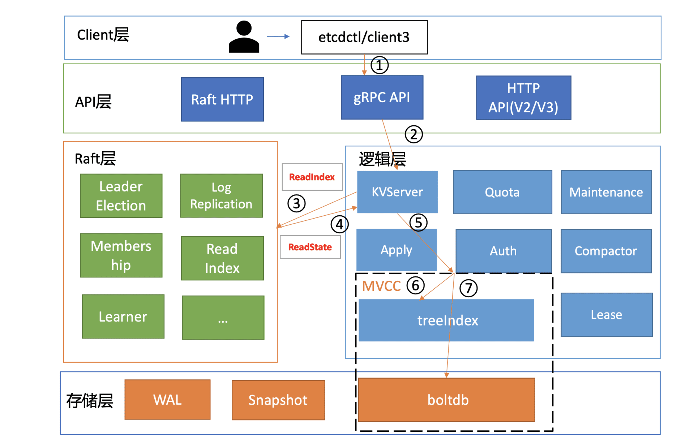

etcd实战课
---

https://time.geekbang.org/column/intro/100069901

2021

分布式存储

## 为什么你要学习etcd

最热门的云原生存储

# 基础篇

## 1 etcd的前世今生：为什么Kubernetes使用etcd？

### etcd v1和v2诞生

### 为什么Kubernetes使用etcd?

### etcd v3诞生

## 2 基础架构：etcd一个读请求是如何执行的？

### 基础架构

- **Client层**：Client层包括client v2和v3两个大版本API客户端库，提供了简洁易用的API，同时支持负载均衡、节点间故障自动转移，可极大降低业务使用etcd复杂度，提升开发效率、服务可用性。
- **API网络层**：API网络层主要包括client访问server和server节点之间的通信协议。一方面，client访问etcd server的API分为v2和v3两个大版本。v2 API使用HTTP/1.x协议，v3 API使用gRPC协议。同时v3通过etcd grpc-gateway组件也支持HTTP/1.x协议，便于各种语言的服务调用。另一方面，server之间通信协议，是指节点间通过Raft算法实现数据复制和Leader选举等功能时使用的HTTP协议。
- **Raft算法层**：Raft算法层实现了Leader选举、日志复制、ReadIndex等核心算法特性，用于保障etcd多个节点间的数据一致性、提升服务可用性等，是etcd的基石和亮点。
- **功能逻辑层**：etcd核心特性实现层，如典型的KVServer模块、MVCC模块、Auth鉴权模块、Lease租约模块、Compactor压缩模块等，其中MVCC模块主要由treeIndex模块和boltdb模块组成。
- **存储层**：存储层包含预写日志(WAL)模块、快照(Snapshot)模块、boltdb模块。其中WAL可保障etcd crash后数据不丢失，boltdb则保存了集群元数据和用户写入的数据。

### 环境准备

### client

### KVServer

#### 拦截器

#### 串行读与线性读

#### 线性读之ReadIndex

### MVCC

#### treeIndex

#### buffer

#### boltdb

## 3 基础架构：etcd一个写请求是如何执行的？

### 整体架构

### Quota模块

### KVServer模块

Preflight Check
Propose

### WAL模块

### Apply模块

### MVCC

treeIndex
boltdb

## 4 Raft协议：etcd如何实现高可用、数据强一致的？

### 如何避免单点故障

多副本复制是如何实现的呢？
如何解决以上复制算法的困境呢？

### Leader选举

### 日志复制

### 安全性

选举规则
日志复制规则

## 5 鉴权：如何保护你的数据安全？

### 整体架构

### 认证

#### 密码认证

##### 如何保障密码安全性

那应该如何进一步增强不可逆hash算法的破解难度？
etcd的鉴权模块如何安全存储用户密码？

##### 如何提升密码认证性能

Simple Token
JWT Token

#### 证书认证

### 授权

RBAC

## 6 租约：如何检测你的客户端存活？

### 什么是Lease

### Lease整体架构

### key如何关联Lease

### 如何优化Lease续期性能

### 如何高效淘汰过期Lease

### 为什么需要checkpoint机制

## 7 MVCC：如何实现多版本并发控制？

### 什么是MVCC

MVCC（Multiversion concurrency control），一个基于多版本技术实现的一种并发控制机制

### MVCC特性初体验

### 整体架构

### treeIndex原理

### MVCC更新key原理

### MVCC查询key原理

### MVCC删除key原理

## 8 Watch：如何高效获取数据变化通知？

### Watch特性初体验

### 轮询 vs 流式推送

### 滑动窗口 vs MVCC

### 可靠的事件推送机制

整体架构
最新事件推送机制
异常场景重试机制
历史事件推送机制

### 高效的事件匹配

## 9 事务：如何安全地实现多key操作？

### 事务特性初体验及API

### 整体流程

### 事务ACID特性

原子性与持久性
T1时间点
T2时间点
一致性
隔离性
未提交读
已提交读、可重复读
串行化快照隔离
转账案例应用

## 10 boltdb：如何持久化存储你的key-value数据？

### boltdb磁盘布局

### boltdb API

### 核心数据结构介绍

page磁盘页结构
meta page数据结构
meta page十六进制分析
bucket数据结构
leaf page
branch page
freelist

### Open原理

### Put原理

### 事务提交原理

## 11 压缩：如何回收旧版本数据？

整体架构
压缩特性初体验
周期性压缩
版本号压缩
压缩原理
为什么压缩后db大小不减少呢?

# 实践篇

## 12 一致性：为什么基于Raft实现的etcd还会出现数据不一致？

### 从消失的Node说起

### 一步步解密真相

### 为什么会不一致

### 其他典型不一致Bug

### 最佳实践

开启etcd的数据毁坏检测功能
应用层的数据一致性检测
定时数据备份
良好的运维规范

## 13 db大小：为什么etcd社区建议db大小不超过8G？

分析整体思路
构造大集群
启动耗时
节点内存配置
treeIndex
boltdb性能
集群稳定性
快照

## 14 延时：为什么你的etcd请求会出现超时？

分析思路及工具
网络
磁盘I/O
expensive request
集群容量、节点CPU/Memory瓶颈

## 15 内存：为什么你的etcd内存占用那么高？

## 16 性能及稳定性（上）：如何优化及扩展etcd性能？

性能分析链路
负载均衡
选择合适的鉴权
选择合适的读模式
线性读实现机制、网络延时
磁盘IO性能、写QPS
RBAC规则数、Auth锁
expensive request、treeIndex锁
大key-value、boltdb锁

## 17 性能及稳定性（下）：如何优化及扩展etcd性能？

性能分析链路
db quota
限速
心跳及选举参数优化
网络和磁盘IO延时
快照参数优化
大value
boltdb锁

扩展性能
扩展读
扩展Watch
扩展Lease

## 18 实战：如何基于Raft从0到1构建一个支持多存储引擎分布式KV服务？

### 整体架构设计

API设计
复制状态机
多存储引擎
boltdb
leveldb

### 实现分析

Raft算法库
Raft API
支持多存储引擎
boltdb
leveldb
读写流程
写流程
读流程

## 19 Kubernetes基础应用：创建一个Pod背后etcd发生了什么？

Kubernetes基础架构
创建Pod案例
kube-apiserver请求执行链路
Kubernetes资源存储格式
通用存储模块
资源安全创建及更新
Watch机制在Kubernetes中应用
Resource Version与etcd版本号

## 20 Kubernetes高级应用：如何优化业务场景使etcd能支撑上万节点集群？

大集群核心问题分析
如何减少expensive request
分页
资源按namespace拆分
Informer机制
Watch bookmark机制
更高效的Watch恢复机制
如何控制db size
如何优化key-value大小
etcd优化
并发读特性
改善Watch Notify机制

## 21 分布式锁：为什么基于etcd实现分布式锁比Redis锁更安全？

### 从茅台超卖案例看分布式锁要素

因此分布式锁的第一核心要素就是互斥性、安全性。在同一时间内，不允许多个client同时获得锁。

这就是分布式锁第二个核心要素，活性。在实现分布式锁的过程中要考虑到client可能会出现crash或者网络分区，你需要原子申请分布式锁及设置锁的自动过期时间，通过过期、超时等机制自动释放锁，避免出现死锁，导致业务中断。

从这个问题中我们可以看到，分布式锁实现具备一定的复杂度，它不仅依赖存储服务提供的核心机制，同时依赖业务领域的实现。无论是遭遇高负载、还是宕机、网络分区等故障，都需确保锁的互斥性、安全性，否则就会出现严重的超卖生产事故。

这就是分布式锁第三个核心要素，高性能、高可用。加锁、释放锁的过程性能开销要尽量低，同时要保证高可用，确保业务不会出现中断。

### Redis分布式锁问题

主备切换、脑裂是Redis分布式锁的两个典型不安全的因素，本质原因是Redis为了满足高性能，采用了主备异步复制协议，同时也与负责主备切换的Redis Sentinel服务是否合理部署有关。

### 分布式锁常见实现方案

### etcd分布式锁实现

事务与锁的安全性
Lease与锁的活性
Watch与锁的可用性
etcd自带的concurrency包

## 22 配置及服务发现：解析etcd在API Gateway开源项目中应用

服务发现
单体架构
分布式及微服务架构
为什么需要服务发现中间件?
etcd服务发现原理
Apache APISIX原理
etcd在Apache APISIX中的应用
数据存储格式
Watch机制的应用
鉴权机制的应用
Lease特性的应用
事务特性的应用

## 23 选型：etcd_ZooKeeper_Consul等我们该如何选择？

### 基本架构及原理

#### etcd架构及原理

#### ZooKeeper架构及原理

#### Consul架构及原理

### 重点特性比较

并发原语
健康检查、服务发现
数据模型比较
Watch特性比较
其他比较

## 24 运维：如何构建高可靠的etcd集群运维体系？

整体解决方案
集群部署
集群组建
监控及告警体系
备份及还原
巡检
高可用及自愈
混沌工程

## 成员变更：为什么集群看起来正常，移除节点却会失败呢？

从一次诡异的故障说起
静态配置变更 VS 动态配置变更
如何通过Raft实现成员信息同步
成员变更流程
为什么需要Learner
联合一致性（joint consensus）
集群扩容节点完整流程
新集群如何组建
如何从备份恢复集群
故障分析

## 搞懂etcd，掌握通往分布式存储系统之门的钥匙
