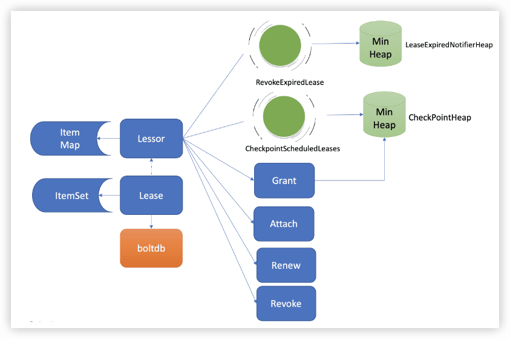
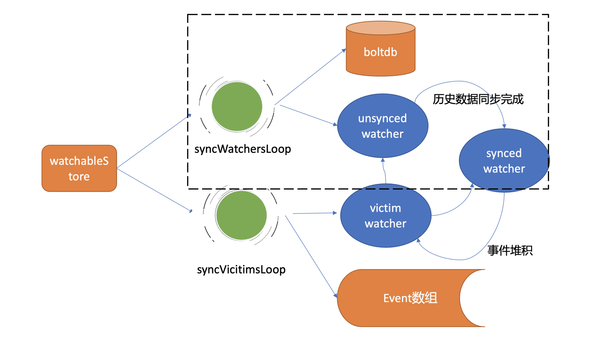
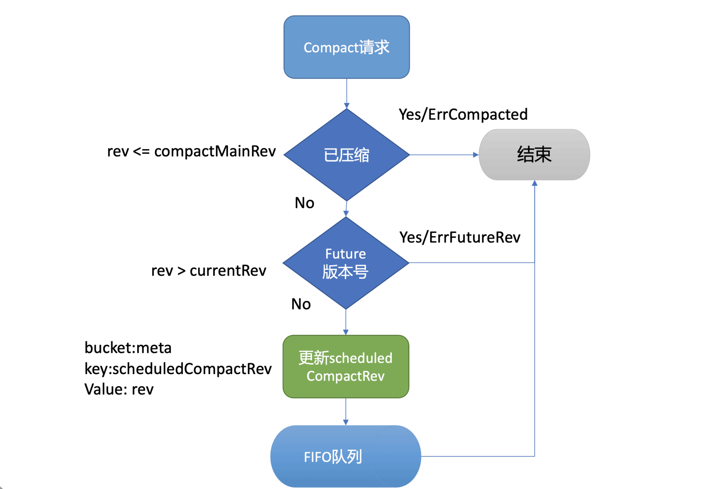

etcd实战课
---

https://time.geekbang.org/column/intro/100069901

2021

分布式存储

## 0 为什么要学习etcd

最热门的云原生存储

### etcd典型问题

#### 原理

为什么etcd适合读多写少？线性读和串行读各自适用什么业务场景，分别是如何实现的？

如何判断etcd是否适合你的业务场景？

为什么Follower节点的Raft日志条目可能会与Leader冲突？冲突时Follower节点的WAL日志如何删除已持久化但冲突的日志条目？

etcd Watch机制能保证事件不丢失吗？

不小心删除一个key后，可以马上找回来吗？

#### 稳定性及性能

哪些因素会导致Leader发生切换？

为什么etcd社区压测结果显示读能达到10几万每秒，在你的业务集群中QPS可能未过百就出现超时错误了？

etcd能跨地域部署吗？

如何优化、提升etcd性能及稳定性？

#### 一致性/延时/内存

为什么基于Raft的实现etcd还会出现数据不一致？

为什么集群各节点磁盘1/0延时很低，写请求也会超时呢？

为什么你只存储了1个几百KB的key/value，etcd进程却可能消耗数G的内存？

如何分析etcd内存和延时异常背后的原因？

#### db大小

为什么你删除了大量数据，db大小不减少？

为什么etcd社区建议db大小不要超过8G？

哪些因素会导致db大小增加？

#### Kubernetes

Kubernetes创建Pod背后etcd是如何工作的？

etcd如何为Kubernetes控制器编程模型提供支撑？

APIServer的"too old resource version"错误跟etcd有什么关系？

#### 最佳实践

当你在一个namespace下创建了数万个Pod/CRD资源时，同时频繁通过标签去查询指定Pod/CRD资源时，Apiserver和etcd为什么扛不住？

快速增长的业务应如何避免单etcd集群出现性能瓶颈？

如何构建安全、高可靠的etcd集群运维体系？

### 怎么学etcd

# 基础篇

## 1 etcd的前世今生：为什么Kubernetes使用etcd？

### etcd v1和v2诞生

### 为什么Kubernetes使用etcd?

### etcd v3诞生

### 小结

- etcd诞生背景， etcd v2源自CoreOS团队遇到的服务协调问题。
- etcd目标，我们通过实际业务场景分析，得到理想中的协调服务核心目标：高可用、数据一致性、Watch、良好的可维护性等。而在CoreOS团队看来，高可用、可维护性、适配云、简单的API、良好的性能对他们而言是非常重要的，ZooKeeper无法满足所有诉求，因此决定自己构建一个分布式存储服务。
- 介绍了v2基于目录的层级数据模型和API，并从分布式系统的角度给你详细总结了etcd v2技术点。etcd的高可用、Watch机制与Kubernetes期望中的元数据存储是匹配的。etcd v2在Kubernetes的带动下，获得了广泛的应用，但也出现若干性能和稳定性、功能不足问题，无法满足Kubernetes项目发展的需求。
- CoreOS团队未雨绸缪，从问题萌芽时期就开始构建下一代etcd v3存储模型，分别从性能、稳定性、功能上等成功解决了Kubernetes发展过程中遇到的瓶颈，也捍卫住了作为Kubernetes存储组件的地位。

## 2 基础架构：etcd一个读请求是如何执行的？

### 基础架构

- **Client层**：Client层包括client v2和v3两个大版本API客户端库，提供了简洁易用的API，同时支持负载均衡、节点间故障自动转移，可极大降低业务使用etcd复杂度，提升开发效率、服务可用性。
- **API网络层**：API网络层主要包括client访问server和server节点之间的通信协议。一方面，client访问etcd server的API分为v2和v3两个大版本。v2 API使用HTTP/1.x协议，v3 API使用gRPC协议。同时v3通过etcd grpc-gateway组件也支持HTTP/1.x协议，便于各种语言的服务调用。另一方面，server之间通信协议，是指节点间通过Raft算法实现数据复制和Leader选举等功能时使用的HTTP协议。
- **Raft算法层**：Raft算法层实现了Leader选举、日志复制、ReadIndex等核心算法特性，用于保障etcd多个节点间的数据一致性、提升服务可用性等，是etcd的基石和亮点。
- **功能逻辑层**：etcd核心特性实现层，如典型的KVServer模块、MVCC模块、Auth鉴权模块、Lease租约模块、Compactor压缩模块等，其中MVCC模块主要由treeIndex模块和boltdb模块组成。
- **存储层**：存储层包含预写日志(WAL)模块、快照(Snapshot)模块、boltdb模块。其中WAL可保障etcd crash后数据不丢失，boltdb则保存了集群元数据和用户写入的数据。

### 环境准备

### client

### KVServer

#### 拦截器

#### 串行读与线性读

#### 线性读之ReadIndex

### MVCC

#### treeIndex

#### buffer

#### boltdb

### 小结

一个读请求从client通过Round-robin负载均衡算法，选择一个etcd server节点，发出gRPC请求，经过etcd server的KVServer模块、线性读模块、MVCC的treeIndex和boltdb模块紧密协作，完成了一个读请求。

## 3 基础架构：etcd一个写请求是如何执行的？

### 整体架构

### Quota模块

### KVServer模块

#### Preflight Check

#### Propose

### WAL模块

### Apply模块

### MVCC

#### treeIndex

#### boltdb

## 4 Raft协议：etcd如何实现高可用、数据强一致的？

### 如何避免单点故障

#### 多副本复制是如何实现的呢？

#### 如何解决以上复制算法的困境呢？

共识算法

### Leader选举

- Follower，跟随者， 同步从Leader收到的日志，etcd启动的时候默认为此状态；
- Candidate，竞选者，可以发起Leader选举；
- Leader，集群领导者， 唯一性，拥有同步日志的特权，需定时广播心跳给Follower节点，以维持领导者身份。

### 日志复制

### 安全性

#### 选举规则

#### 日志复制规则

## 5 鉴权：如何保护你的数据安全？

### 整体架构

### 认证

#### 密码认证

##### 如何保障密码安全性

那应该如何进一步增强不可逆hash算法的破解难度？
etcd的鉴权模块如何安全存储用户密码？

##### 如何提升密码认证性能

Simple Token
JWT Token

#### 证书认证

### 授权

#### RBAC

## 6 租约：如何检测你的客户端存活？

### 什么是Lease

### Lease整体架构

### key如何关联Lease

### 如何优化Lease续期性能

### 如何高效淘汰过期Lease

### 为什么需要checkpoint机制

## 7 MVCC：如何实现多版本并发控制？

### 什么是MVCC

MVCC（Multiversion concurrency control），一个基于多版本技术实现的一种并发控制机制

### MVCC特性初体验

### 整体架构

### treeIndex原理

### MVCC更新key原理

### MVCC查询key原理

### MVCC删除key原理

## 8 Watch：如何高效获取数据变化通知？

### Watch特性初体验

### 轮询 vs 流式推送

HTTP/2协议为什么能实现多路复用呢？

### 滑动窗口 vs MVCC

### 可靠的事件推送机制

#### 整体架构

#### 最新事件推送机制

#### 异常场景重试机制

#### 历史事件推送机制

### 高效的事件匹配

## 9 事务：如何安全地实现多key操作？

### 9.1 事务特性初体验及API

### 9.2 整体流程

### 9.3 事务ACID特性

#### 原子性与持久性

##### T1时间点

##### T2时间点

#### 一致性

#### 隔离性

##### 未提交读

##### 已提交读、可重复读

##### 串行化快照隔离

#### 转账案例应用

## 10 boltdb：如何持久化存储你的key-value数据？

### 10.1 boltdb磁盘布局

### 10.2 boltdb API

### 10.3 核心数据结构介绍

#### page磁盘页结构

#### meta page数据结构

#### meta page十六进制分析

#### bucket数据结构

#### leaf page

#### branch page

#### freelist

### 10.4 Open原理

### 10.5 Put原理

### 10.6 事务提交原理

## 11 压缩：如何回收旧版本数据？

### 整体架构

### 压缩特性初体验

### 周期性压缩

### 版本号压缩

### 压缩原理

### 为什么压缩后db大小不减少呢?

### 小结

etcd压缩操作可通过API人工触发，也可以配置压缩模式由etcd server自动触发。压缩模式支持按周期和版本两种。在周期模式中你可以实现保留最近一段时间的历史版本数，在版本模式中你可以实现保留期望的历史版本数。

压缩的核心工作原理分为两大任务，第一个任务是压缩treeIndex中的各key历史索引，清理已删除key，并将有效的版本号保存到map数据结构中。

第二个任务是删除boltdb中的无效key。基本原理是根据版本号遍历boltdb已压缩区间范围的key，通过treeIndex返回的有效索引map数据结构判断key是否有效，无效则通过boltdb API删除它。

最后在执行压缩的操作中，虽然我们删除了boltdb db的key-value数据，但是db大小并不会减少。db大小不变的原因是存放key-value数据的branch和leaf页，它们释放后变成了空闲页，并不会将空间释放给磁盘。

boltdb通过freelist page来管理一系列空闲页，后续新增的写请求优先从freelist中申请空闲页使用，以提高性能。在写请求速率稳定、新增key-value较少的情况下，压缩操作释放的空闲页就可以基本满足后续写请求对空闲页的需求，db大小就会处于一个基本稳定、健康的状态。

# 实践篇

## 12 一致性：为什么基于Raft实现的etcd还会出现数据不一致？

### 从消失的Node说起

### 一步步解密真相

### 为什么会不一致

### 其他典型不一致Bug

### 最佳实践

#### 开启etcd的数据毁坏检测功能

#### 应用层的数据一致性检测

#### 定时数据备份

#### 良好的运维规范

## 13 db大小：为什么etcd社区建议db大小不超过8G？

### 分析整体思路

### 构造大集群

### 启动耗时

### 节点内存配置

### treeIndex

### boltdb性能

### 集群稳定性

### 快照

## 14 延时：为什么你的etcd请求会出现超时？

### 分析思路及工具

### 网络

### 磁盘I/O

### expensive request

### 集群容量、节点CPU/Memory瓶颈

### 小结

会导致请求延时上升的原因：

- 网络质量，如节点之间RTT延时、网卡带宽满，出现丢包；
- 磁盘I/O抖动，会导致WAL日志持久化、boltdb事务提交出现抖动，Leader出现切换等；
- expensive request，比如大包请求、涉及到大量key遍历、Authenticate密码鉴权等操作；
- 容量瓶颈，太多写请求导致线性读请求性能下降等；
- 节点配置，CPU繁忙导致请求处理延时、内存不够导致swap等。

分析这些案例的过程中，介绍了etcd问题核心工具：metrics、etcd log、trace日志、blktrace、pprof等。

## 15 内存：为什么你的etcd内存占用那么高？

### 分析整体思路

### 一个key使用数G内存的案例

### raftLog

### treeIndex

### boltdb

### watcher

### expensive request

### etcd v2/goroutines/bug

### 小结

## 16 性能及稳定性（上）：如何优化及扩展etcd性能？

性能分析链路
负载均衡
选择合适的鉴权
选择合适的读模式
线性读实现机制、网络延时
磁盘IO性能、写QPS
RBAC规则数、Auth锁
expensive request、treeIndex锁
大key-value、boltdb锁

## 17 性能及稳定性（下）：如何优化及扩展etcd性能？

性能分析链路
db quota
限速
心跳及选举参数优化
网络和磁盘IO延时
快照参数优化
大value
boltdb锁

扩展性能
扩展读
扩展Watch
扩展Lease

## 18 实战：如何基于Raft从0到1构建一个支持多存储引擎分布式KV服务？

### 整体架构设计

API设计
复制状态机
多存储引擎
boltdb
leveldb

### 实现分析

Raft算法库
Raft API
支持多存储引擎
boltdb
leveldb
读写流程
写流程
读流程

## 19 Kubernetes基础应用：创建一个Pod背后etcd发生了什么？

Kubernetes基础架构
创建Pod案例
kube-apiserver请求执行链路
Kubernetes资源存储格式
通用存储模块
资源安全创建及更新
Watch机制在Kubernetes中应用
Resource Version与etcd版本号

## 20 Kubernetes高级应用：如何优化业务场景使etcd能支撑上万节点集群？

大集群核心问题分析
如何减少expensive request
分页
资源按namespace拆分
Informer机制
Watch bookmark机制
更高效的Watch恢复机制
如何控制db size
如何优化key-value大小
etcd优化
并发读特性
改善Watch Notify机制

## 21 分布式锁：为什么基于etcd实现分布式锁比Redis锁更安全？

### 从茅台超卖案例看分布式锁要素

因此分布式锁的第一核心要素就是互斥性、安全性。在同一时间内，不允许多个client同时获得锁。

这就是分布式锁第二个核心要素，活性。在实现分布式锁的过程中要考虑到client可能会出现crash或者网络分区，你需要原子申请分布式锁及设置锁的自动过期时间，通过过期、超时等机制自动释放锁，避免出现死锁，导致业务中断。

从这个问题中我们可以看到，分布式锁实现具备一定的复杂度，它不仅依赖存储服务提供的核心机制，同时依赖业务领域的实现。无论是遭遇高负载、还是宕机、网络分区等故障，都需确保锁的互斥性、安全性，否则就会出现严重的超卖生产事故。

这就是分布式锁第三个核心要素，高性能、高可用。加锁、释放锁的过程性能开销要尽量低，同时要保证高可用，确保业务不会出现中断。

### Redis分布式锁问题

主备切换、脑裂是Redis分布式锁的两个典型不安全的因素，本质原因是Redis为了满足高性能，采用了主备异步复制协议，同时也与负责主备切换的Redis Sentinel服务是否合理部署有关。

### 分布式锁常见实现方案

### etcd分布式锁实现

事务与锁的安全性
Lease与锁的活性
Watch与锁的可用性
etcd自带的concurrency包

## 22 配置及服务发现：解析etcd在API Gateway开源项目中应用

服务发现
单体架构
分布式及微服务架构
为什么需要服务发现中间件?
etcd服务发现原理
Apache APISIX原理
etcd在Apache APISIX中的应用
数据存储格式
Watch机制的应用
鉴权机制的应用
Lease特性的应用
事务特性的应用

## 23 选型：etcd_ZooKeeper_Consul等我们该如何选择？

### 基本架构及原理

#### etcd架构及原理

#### ZooKeeper架构及原理

#### Consul架构及原理

### 重点特性比较

并发原语
健康检查、服务发现
数据模型比较
Watch特性比较
其他比较

## 24 运维：如何构建高可靠的etcd集群运维体系？

整体解决方案
集群部署
集群组建
监控及告警体系
备份及还原
巡检
高可用及自愈
混沌工程

## 成员变更：为什么集群看起来正常，移除节点却会失败呢？

从一次诡异的故障说起
静态配置变更 VS 动态配置变更
如何通过Raft实现成员信息同步
成员变更流程
为什么需要Learner
联合一致性（joint consensus）
集群扩容节点完整流程
新集群如何组建
如何从备份恢复集群
故障分析

## 搞懂etcd，掌握通往分布式存储系统之门的钥匙
