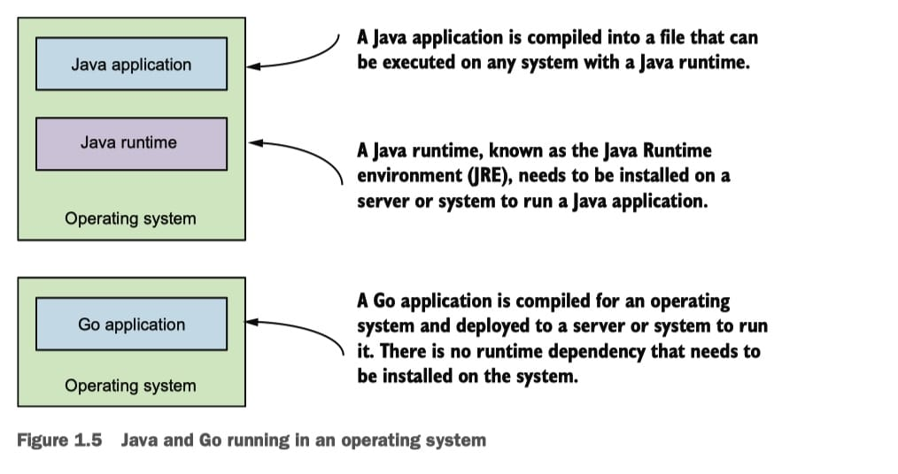
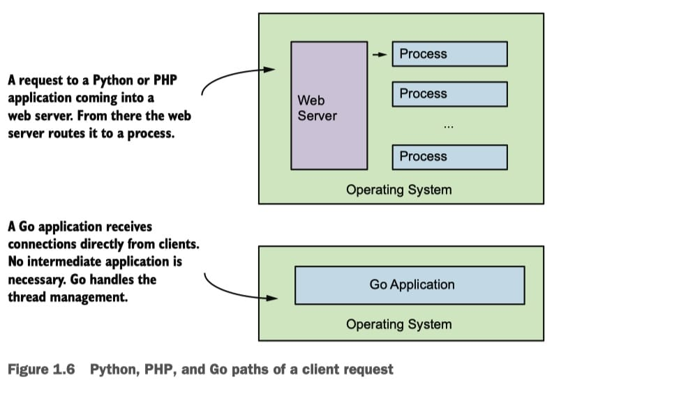
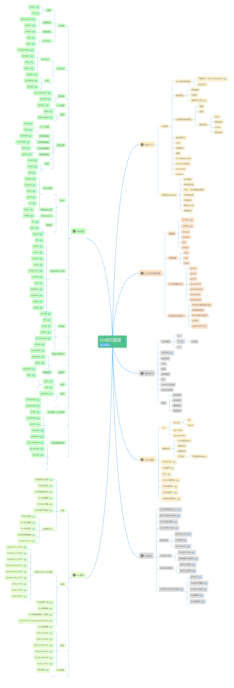
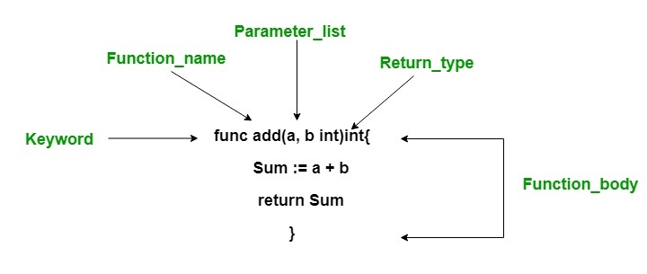

# Go 入门教程

[Go 入门教程](https://laravelacademy.org/books/golang-tutorials)


## 1 开篇：为什么学习 Go 语言

 2009

静态的、强类型的、编译型编程语言，为并发而生


### 与C/C++对比

Go 设计的初衷是替代 C，所以二者有很多相似之处，但 Go 做的更多：

- 提供了自动管理线程和垃圾回收的运行时，在 C/C++ 中，需要自行管理线程和内存
- 更快的编译速度

适用场景不同：

- C/C++ 可用于高性能嵌入式系统、大型云应用以及桌面程序开发
- Go 适用于系统和云平台开发

Go不适用于高性能嵌入式系统，因为嵌入式系统资源有限，而 Go 运行时调度线程和垃圾回收需要额外的开销。至今没有提供 GUI SDK，所以也不适用于桌面程序开发。

### 与Java对比



Java 程序编译之后需要安装额外的 Java runtime 运行，Java 程序的可移植性依赖 Java runtime，Go 不需要，Go 运行时已经包含在这个编译的二进制文件中了，这体现在部署上的区别就是需要在服务器安装 Java runtime，而 Go 只需要部署单文件即可。

另外就是程序具体执行的时候，Go 被编译成二进制文件被所在操作系统执行，而 Java 通常是在包含了 JIT 编译器的 JVM 中执行，JIT 会对代码进行优化。

### 对比Python/PHP

Python/PHP 都是动态语言，而 Go 是静态语言，会做类型检查，可靠性更高。

开发 Web 应用时，Python/PHP 通常躲在 Nginx/Apache 后面作为后台进程，Go 则提供了内置的 Web 服务器，完全可以直接在生产环境使用。



Python/PHP 之所以要借助额外的 Web 服务器是因为**对并发请求的处理**，Python 有一个全局锁同时只允许运行一个线程，PHP 本身就没有多线程多进程机制，一次请求从头到位都是一个独立的进程，为了让基于 Python/PHP 的 Web 应用支持并发请求，必须借助外部 Web 服务器。

而 Go 内置的 Web 服务器充分利用了 `goroutine`，对并发连接有很好的支持。此外，由于协程的本质是**在同一个进程中调度不同线程**，所以还支持共享资源。

另外就是 Python/PHP 作为动态语言，性能不如 Go，如果要提升 Python/PHP 性能，必须通过 C 语言编写扩展，复杂度和学习成本太高。

### 对比JavaScript

这里的 JavaScript，主要是 Node.js。

JavaScript 是单线程模型，尽管异步 IO 机制可以使用不同的线程，主程序还是以单线程模式运行的，主程序代码耗时会阻塞其他代码的执行。

而 Go 语言的多线程模型可以通过运行时管理调度协程在多个处理器的不同线程中运行，可以充分利用系统硬件。

Node.js 使用 Google Chrome 的 V8 引擎，其中包含了带有 JIT 编译器的虚拟机，可以对 JavaScript 代码进行优化来提升性能，而 Go 代码直接被编译成机器码执行，没有类似的东西，也无此必要。

### 学习路线图

[官方文档](https://golang.org/doc/)



## 2 入门

### 第一个 Go 程序

```go
package main

import "fmt"

func main() {
	fmt.Println("Hello, world!")
}
```

和 Java 类似，Go 使用包作为基本单位来管理代码（可以类比为 PHP 中的命名空间），每个 Go 源代码文件的开头都是一个 `package` 声明，表示该文件中 Go 代码所属的包。包是 Go 语言里最基本的分发单位，也是工程管理中依赖关系的体现。

要生成 Go 可执行程序，==必须==声明一个名为 `main` 的包，并且在该包中包含一个名为 `main()` 的主函数，该函数是 Go 可执行程序的==执行起点==，这一点和 C 语言和 Java 语言很像，后续编译 Go 项目程序的时候也要从包含 `main` 包的文件开始。Go 语言的 `main()` 函数不能带参数，也不能定义返回值。

在包声明之后，是一系列的 `import` 语句，用于导入该程序所依赖的包（可类比为 PHP 中通过 `use` 引入其它命名空间的类来理解）。由于本示例程序用到了 `Println()` 函数，所以需要导入该函数所属的 `fmt` 包。

有一点需要注意，与 Java 和 PHP 不同，在 Go 语言中，不得包含在源代码文件中没有用到的包，否则 Go 编译器会报编译错误。这与下面的强制函数左花括号 `{` 的放置位置以及之后会提到的函数名的大小写规则，均体现了 Go 语言在语言层面解决软件工程问题的设计哲学。

所有 Go 函数（包括在面向对象编程中会提到的类型成员函数）都以关键字 `func` 开头（这一点与 PHP、Java、JavaScript 等语言通过 `function` 定义函数不同）。另外在 Go 函数中，左花括号 `{` 必须在函数定义行的末尾，不能另起一行，否则 Go 编译器会报编译错误。

#### 编译 & 运行程序

 `go build` 命令对 Go 程序进行编译，然后直接运行编译后的可执行文件执行 Go 程序代码：

```sh
➜ go build hello.go 
➜ ./hello 
Hello, world!
```

 `go run` 命令将编译和执行指令合二为一:

```sh
go run hello.go 
Hello, world!
```


### 单元测试、问题定位及代码调试

🔖


## 3 数据类型篇

### 3.1 变量、作用域、常量和枚举


```go
var v1 int            // 整型
var v2 string         // 字符串
var v3 bool           // 布尔型
var v4 [10]int        // 数组，数组元素类型为整型
var v5 struct {       // 结构体，成员变量 f 的类型为64位浮点型
    f float64
} 
var v6 *int           // 指针，指向整型
var v7 map[string]int   // map（字典），key为字符串类型，value为整型
var v8 func(a int) int  // 函数，参数类型为整型，返回值类型为整型
```


### 3.2 Go 支持的数据类型概述及布尔类型

Go 语言内置对以下这些基本数据类型的支持：

- 布尔类型：bool
- 整型：int8、byte、int16、int、uint、uintptr 等
- 浮点类型：float32、float64
- 复数类型：complex64、complex128
- 字符串：string
- 字符类型：rune
- 错误类型：error

此外，Go 语言还支持以下这些复合类型：

- 指针（pointer）
- 数组（array）
- 切片（slice）
- 字典（map）
- 通道（chan） 【主要用于并发编程时不同协程之间的通信】
- 结构体（struct）
- 接口（interface）

结构体类似于面向对象编程语言中的类（class），Go 沿用了 C 语言的这一复合类型，而没有像传统面向对象编程那样引入单独的类概念。


### 3.3 整型及运算符

#### 整型

| 类型      | 长度（单位：字节） | 说明                                 | 值范围                                   | 默认值 |
| --------- | ------------------ | ------------------------------------ | ---------------------------------------- | ------ |
| `int8`    | 1                  | 带符号8位整型                        | -128~127                                 | 0      |
| `uint8`   | 1                  | 无符号8位整型，与 `byte` 类型等价    | 0~255                                    | 0      |
| `int16`   | 2                  | 带符号16位整型                       | -32768~32767                             | 0      |
| `uint16`  | 2                  | 无符号16位整型                       | 0~65535                                  | 0      |
| `int32`   | 4                  | 带符号32位整型，与 `rune` 类型等价   | -2147483648~2147483647                   | 0      |
| `uint32`  | 4                  | 无符号32位整型                       | 0~4294967295                             | 0      |
| `int64`   | 8                  | 带符号64位整型                       | -9223372036854775808~9223372036854775807 | 0      |
| `uint64`  | 8                  | 无符号64位整型                       | 0~18446744073709551615                   | 0      |
| `int`     | 32位或64位         | 与具体平台相关                       | 与具体平台相关                           | 0      |
| `uint`    | 32位或64位         | 与具体平台相关                       | 与具体平台相关                           | 0      |
| `uintptr` | 与对应指针相同     | 无符号整型，足以存储指针值的未解释位 | 32位平台下为4字节，64位平台下为8字节     | 0      |

和其他编程语言一样，可以通过增加前缀 `0` 来表示八进制数（如：077），增加前缀 `0x` 来表示十六进制数（如：0xFF），以及使用 `E` 来表示 10 的连乘（如：`1E3 = 1000`）。


#### 运算符

`+`、`-`、`*`、`/` 和 `%`（取余运算只能用于整数）

在 Go 语言中，也支持自增/自减运算符，即 `++`/`--`，但是只能作为语句，不能作为表达式，且只能用作后缀，不能放到变量前面。

支持 `+=`、`-=`、`*=`、`/=`、`%=` 


 `>`、`<`、`==`、`>=`、`<=` 和 `!=`，比较运算符运行的结果是布尔值。


| 位运算符 | 含义     | 结果                                           |
| -------- | -------- | ---------------------------------------------- |
| `x & y`  | 按位与   | 把 x 和 y 都为 1 的位设为 1                    |
| `x | y`  | 按位或   | 把 x 或 y 为 1 的位设为 1                      |
| `x ^ y`  | 按位异或 | 把 x 和 y 一个为 1 一个为 0 的位设为 1         |
| `^x`     | 按位取反 | 把 x 中为 0 的位设为 1，为 1 的位设为 0        |
| `x << y` | 左移     | 把 x 中的位向左移动 y 次，每次移动相当于乘以 2 |
| `x >> y` | 右移     | 把 x 中的位向右移动 y 次，每次移动相当于除以 2 |


| 逻辑运算符 | 含义                | 结果                                                   |
| ---------- | ------------------- | ------------------------------------------------------ |
| `x && y`   | 逻辑与运算符（AND） | 如果 x 和 y 都是 true，则结果为 true，否则结果为 false |
| `x || y`   | 逻辑或运算符（OR）  | 如果 x 或 y 是 true，则结果为 true，否则结果为 false   |
| `!x`       | 逻辑非运算符（NOT） | 如果 x 为 true，则结果为 false，否则结果为 true        |


##### 运算符优先级

由上到下表示优先级从高到低，或者数字越大，优先级越高：

```go
6      ^（按位取反） !
5      *  /  %  <<  >>  &  &^
4      +  -  |  ^（按位异或）
3      ==  !=  <  <=  >  >=
2      &&
1      ||
```


### 3.4 浮点型与复数类型


#### 复数类型

把整型和浮点型这种日常比较常见的数字称为实数，复数是实数的延伸，可以通过两个实数（在计算机中用浮点数表示）构成，一个表示实部（real），一个表示虚部（imag），常见的表达形式如下：

```go
z = a + bi
```

其中 a、b 均为实数，i 称为虚数单位，当 b = 0 时，z 就是常见的实数，当 a = 0 而 b ≠ 0 时，将 z 称之为**纯虚数**。


在 Go 语言中，复数支持两种类型：`complex64`（32 位实部和虚部） 和 `complex128`（64 位实部与虚部）。


### 3.5 字符串及底层字符类型

#### 字符串

##### 基本使用

在 Go 语言中，字符串是一种基本类型，默认是通过 UTF-8 编码的字符序列，当字符为 ASCII 码时则占用 1 个字节，其它字符根据需要占用 2-4 个字节，比如中文编码通常需要 3 个字节。

###### 声明和初始化

###### 格式化输出

###### 转义字符

###### 多行字符串

##### 不可变值类型


##### 字符编码

##### 字符串操作


###### 字符串连接


###### 字符串切片


##### 字符串遍历


#### 底层字符类型

Go 语言对字符串中的单个字符进行了单独的类型支持，在 Go 语言中支持两种字符类型：

- 一种是 `byte`，代表 UTF-8 编码中单个字节的值（它也是 `uint8` 类型的别名，两者是等价的，因为正好占据 1 个字节的内存空间）；
- 另一种是 `rune`，代表单个 Unicode 字符（它也是 `int32` 类型的别名，因为正好占据 4 个字节的内存空间。关于 `rune` 相关的操作，可查阅 Go 标准库的 [unicode](https://golang.org/pkg/unicode/) 包）。

##### UTF-8 和 Unicode 的区别


##### 将 Unicode 编码转化为可打印字符


### 3.6 基本数据类型之间的转化

由于 Go 是强类型语言，所以不支持动态语言那种自动转化，而是要对变量进行强制类型转化。


### 3.7 数组使用入门及其不足

#### 数组的声明和初始化

```go
[capacity]data_type{element_values}
```


```go
var a [8]byte // 长度为8的数组，每个元素为一个字节
var b [3][3]int // 二维数组（9宫格）
var c [3][3][3]float64 // 三维数组（立体的9宫格）
var d = [3]int{1, 2, 3}  // 声明时初始化
var e = new([3]string)   // 通过 new 初始化

a := [5]int{1,2,3,4,5}
a := [...]int{1, 2, 3}
a := [5]int{1, 2, 3}  // 如果没有填满，则空位会通过对应的元素类型零值填充
a := [5]int{1: 3, 3: 7} // 还可以初始化指定下标位置的元素值，未设置的位置也会以对应元素类型的零值填充
```

数组长度在声明后就不可更改，在声明时可以指定数组长度为一个常量或者一个常量表达式（常量表达式是指在编译期即可计算结果的表达式）。数组的长度是该数组类型的一个内置常量，可以用 Go 语言的内置函数 `len()` 来获取

#### 数组元素的访问和设置


#### 遍历数组


Go 语言还提供了一个关键字 `range`，用于以更优雅的方式遍历数组中的元素：

```go
for i, v := range arr { 
    fmt.Println("Element", i, "of arr is", v) 
}
```

```go
for _, v := range arr {
   // ...
}
for i := range arr {
   // ...
}
```

#### 多维数组


#### 数组类型的不足

- 长度固定

- 值类型

切片类型，一个引用类型的、支持动态添加元素的新「数组」类型。

在 Go 语言中很少使用数组，大多数时候会使用切片取代它。

### 3.8 切片

#### 切片的定义

切片是一个可变长度的、同一类型元素集合，切片的长度可以随着元素数量的增长而增长（但不会随着元素数量的减少而减少），不过切片从底层管理上来看依然使用数组来管理元素，可以看作是对数组做了一层简单的封装。基于数组，切片添加了一系列管理功能，可以随时动态扩充存储空间。

#### 创建切片

##### 基于数组


内置函数 `len` 获取切片的长度， `cap` 函数获取切片容量

##### 基于切片

##### 直接创建

内置函数 `make()` 可以用于灵活地创建切片。

```go
mySlice1 := make([]int, 5)  // 初始长度为 5 
mySlice2 := make([]int, 5, 10)  // 初始长度为 5、容量为 10
mySlice3 := []int{1, 2, 3, 4, 5}  // 长度和容量均为5
```

#### 遍历切片


#### 动态增加元素

##### 自动扩容


##### 内容复制


#### 动态删除元素


#### 数据共享问题

解决方案


### 3.9 字典

需要在声明时指定键和值的类型。

Go 字典是个无序集合，底层不会按照元素添加顺序维护元素的存储顺序。

```go
var testMap map[string]int
```


### 3.10 指针

**变量**的本质对一块内存空间的命名，我们可以通过引用变量名来使用这块内存空间存储的值，而指针则是用来指向这些变量值所在**内存地址的值**。


#### unsafe.Pointer


## 4 流程控制篇

- 条件语句：用于条件判断，对应的关键字有 `if`、`else` 和 `else if`；
- 分支语句：用于分支选择，对应的关键字有 `switch`、`case`、`fallthrough`和 `select`（用于通道，后面介绍协程时会提到）；
- 循环语句：用于循环迭代，对应的关键字有 `for` 和 `range`；
- 跳转语句：用于代码跳转，对应的关键字有 `goto`。


## 5 函数式编程篇

### 5.1 函数使用入门和常用内置函数

在 Go 语言中，函数主要有三种类型：

- 普通函数
- 匿名函数（闭包）
- 类方法



**在调用其他包定义的函数时，只有函数名首字母大写的函数才可以被访问**。

#### 系统内置函数

[builtin package - builtin - Go Packages](https://pkg.go.dev/builtin)

| 名称                      | 说明                                                         |
| ------------------------- | ------------------------------------------------------------ |
| `close`                   | 用于在管道通信中关闭一个管道                                 |
| `len`、`cap`              | `len` 用于返回某个类型的长度（字符串、数组、切片、字典和管道），`cap` 则是容量的意思，用于返回某个类型的最大容量（只能用于数组、切片和管道） |
| `new`、`make`             | `new` 和 `make` 均用于分配内存，`new` 用于值类型和用户自定义的类型（类），`make` 用于内置引用类型（切片、字典和管道）。它们在使用时将类型作为参数：`new(type)`、`make(type)`。`new(T)` 分配类型 T 的零值并返回其地址，也就是指向类型 T 的指针，可以用于基本类型：`v := new(int)`。`make(T)` 返回类型 T 的初始化之后的值，所以 `make` 不仅分配内存地址还会初始化对应类型。 |
| `copy`、`append`          | 分别用于切片的复制和动态添加元素                             |
| `panic`、`recover`        | 两者均用于错误处理机制                                       |
| `print`、`println`        | 打印函数，在实际开发中建议使用 [fmt](https://golang.org/pkg/fmt/) 包 |
| `complex`、`real`、`imag` | 用于复数类型的创建和操作                                     |


### 5.2 参数传递、变长参数与多返回值


#### 命名返回值

在设置多返回值时，还可以对返回值进行变量命名，这样，我们就可以在函数中直接对返回值变量进行赋值，而不必每次都按照指定的返回值格式返回多个变量了：

```go
func add(a, b *int) (c int, err error) {
    if *a < 0 || *b < 0 {
        err = errors.New("只支持非负整数相加")
        return
    }
    *a *= 2
    *b *= 3
    c = *a + *b
    return
}
```


### 5.3 匿名函数与闭包

```go
// 1、将匿名函数赋值给变量
add := func(a, b int) int {
    return a + b
}

// 调用匿名函数 add
fmt.Println(add(1, 2))  

// 2、定义时直接调用匿名函数
func(a, b int) {
    fmt.Println(a + b)
} (1, 2) 
```


🔖

闭包只能通过匿名函数实现，我们可以把闭包看作是**有状态的匿名函数**，反过来，如果匿名函数引用了外部变量，就形成了一个闭包（Closure）。

支持闭包的语言都将函数作为**第一类对象**（firt-class object，有的地方也译作第一级对象、一等公民等，都是一个意思），Go 语言也不例外，这意味 Go 函数和普通 Go 数据类型（整型、字符串、数组、切片、字典、结构体等）具有同等的地位，可以赋值给变量，也可以作为参数传递给其他函数，还能够被函数动态创建和返回。


### 5.4 通过高阶函数实现装饰器模式 🔖

高阶函数，就是接收其他函数作为参数传入，或者把其他函数作为结果返回的函数。


### 5.5 递归函数及性能调优  🔖


#### 通过内存缓存技术优化递归函数性能


### 5.5 引入 Map-Reduce-Filter 模式处理集合元素


### 5.6 基于管道技术实现函数的流式调用


## 6 面向对象篇

### 6.1 类型系统概述

>  对于面向对象编程的支持，Go 语言的实现可以说是完全颠覆了以往我们对面向对象编程的认知。

简洁之处在于，Go 语言并没有沿袭传统面向对象编程中的诸多概念，比如类的继承、接口的实现、构造函数和析构函数、隐藏的 this 指针等，也没有 `public`、`protected`、`private` 之类的访问修饰符。

优雅之处在于，Go 语言对面向对象编程的支持是语言类型系统中的天然组成部分，整个类型系统通过接口串联，浑然一体。

#### 类型系统概述

类型系统是指一个语言的类型体系结构。一个典型的类型系统通常包含如下基本内容：

- 基本类型，如 `byte`、`int`、`bool`、`float`、`string` 等；
- 复合类型，如数组、切片、字典、指针、结构体等；
- 可以指向任意对象的类型（Any 类型）；
- 值语义和引用语义；
- 面向对象，即所有具备面向对象特征（比如成员方法）的类型；
- 接口。

类型系统描述的是这些内容在一个语言中如何被关联。因为 Java 语言自诞生以来被称为最纯正的面向对象语言，所以我们就先以 Java 语言为例讲一讲类型系统。

#### Java vs Go 类型系统设计


### 6.2 类的定义、初始化和成员方法


### 6.3 通过组合实现类的继承和方法重写


### 6.4 类属性和成员方法的可见性 🔖


### 6.5 接口定义及实现🔖

**如果说 goroutine 和 channel 是支撑起 Go 语言并发模型的基石，那么接口就是 Go 语言整个类型系统的基石**。

#### 传统侵入式接口实现


#### Go 语言的接口实现


#### 通过组合实现接口继承


### 6.6 接口赋值


### 6.7 类型断言


### 6.8 空接口、反射和泛型


## 7 错误处理篇

### 7.1 error 类型及其使用


### 7.2 defer 语句及其使用


### 7.3 panic 和 recover


## 8 网络编程篇

### 8.1 从多进程、多线程到协程


### 8.2 协程实现原理及使用入门


### 8.3 基于共享内存实现协程通信


### 8.4 基于锁和原子操作实现并发安全


### 通道类型


### 利用多核 CPU 实现并行计算


### 通过 context 包提供的函数实现多协程之间的协作


### 临时对象池 sync.Pool


## 9 网络编程篇


## 数据结构和算法篇


---


# Go Web 编程

[Go Web 编程](https://laravelacademy.org/books/go-web-programming)


# Gin 使用教程

[Gin 使用教程](https://laravelacademy.org/books/gin-tutorial)
