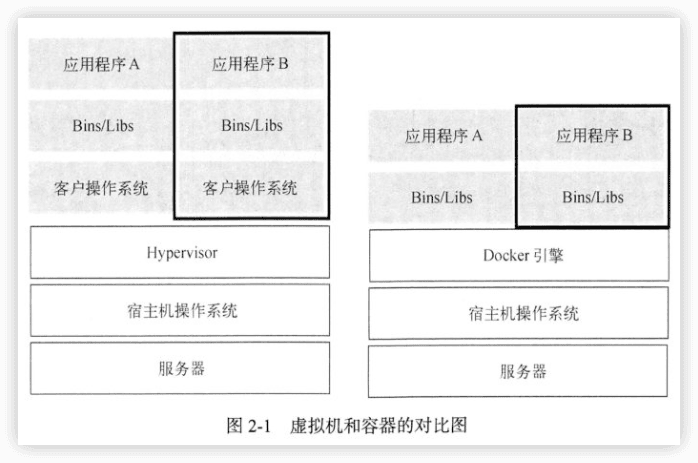

深入剖析Kubernetes
----

[深入剖析Kubernetes](https://time.geekbang.org/column/intro/100015201) 2018

[《深入剖析Kubernetes》](https://book.douban.com/subject/35424872/) 2021

# 一、Kubernetes基础

## 1 背景回顾：云原生大事记

## 2 容器技术基础

5-8

2.1 

小结

## 3 Kubernetes设计与架构

9-10

## 4 Kubernetes集群搭建与配置

# 二、Kubernetes核心原理

## 5 Kubernetes编排原理

13-27

## 6 Kubernetes存储原理

28-31

## 7 Kubernetes网络原理

32-39

## 8 Kubernetes调度与资源管理

40-44

## 9 容器运行时

45-47

## 10 Kubernetes监控与日志

48-50

# 三、Kubernetes实践进阶

## 11 Kubernetes应用管理进阶

## 12 Kubernetes开源社区

